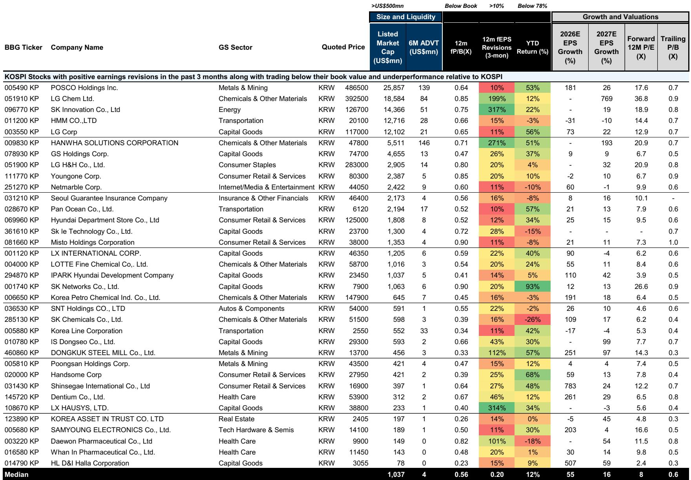
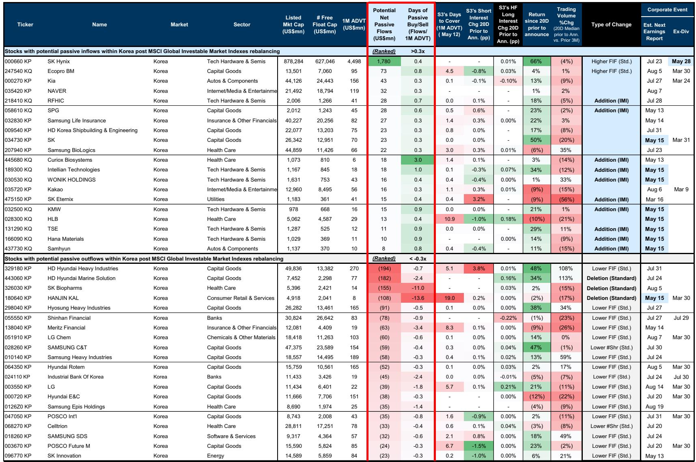
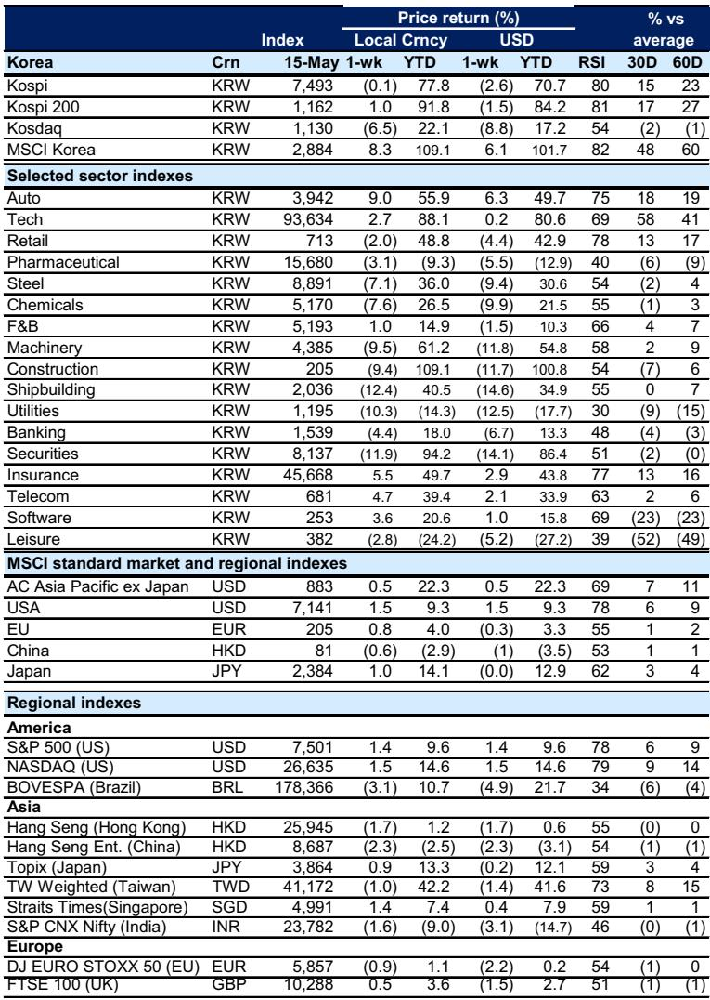

# The KOSPI Rally Is a Mirage of Concentration: Why the Real Opportunity Lies in the Stocks the Market Has Left Behind

The KOSPI has surged 78% year-to-date, yet this headline figure masks a deeply troubling structural reality. Only 68 stocks out of 835 listed names have actually outperformed the index, and these few winners now account for nearly two-thirds of total market capitalization. The market is not rallying; it is being carried by a narrow cohort. For investors who have ridden this wave, the question is no longer whether the market is expensive, but whether the concentration itself has become the primary risk factor. The answer, based on the latest data, is that it has.

The week ending May 2026 crystallized this tension. The KOSPI tumbled 6% in a single Friday session, erasing all weekly gains, triggered by the Trump-Xi Summit and sustained foreign outflows. The selloff was broad, but the damage was not evenly distributed. Auto, Insurance, and Telecom sectors held up relatively well, while Shipbuilding, Securities, and Utilities bore the brunt. Foreign investors continued to sell, with the heaviest outflows concentrated in KOSPI Tech and Auto. The Korean won weakened 2.6% against the dollar, and the Korea Equity Risk Barometer remained in risk-averse territory at -0.9. This is not a market taking a breather; this is a market revealing its fault lines.

The critical insight from the latest analysis is that the rally's narrowness has created a powerful asymmetry. While the index has soared, nearly 70% of KOSPI-listed stocks still trade below book value. This is not a sign of a healthy bull market. It is a sign of extreme divergence between a handful of momentum-driven large caps and a vast hinterland of undervalued, underfollowed names. The real strategic question for institutional investors is not whether to be long or short Korea, but how to position for a rotation that is statistically overdue.

The following sections unpack why this concentration is unsustainable, where the hidden value lies, and how to build a decision framework that does not rely on the continuation of the current regime.

## The KOSPI's 78% Rally Is a Statistical Anomaly, Not a Broad-Based Recovery

When only 8% of listed stocks have outperformed the index, the index itself becomes a misleading benchmark. The KOSPI 50, which represents the largest-cap names, has outperformed the KOSPI 200 small- and mid-cap segment by more than two standard deviations. This is not a normal cyclical divergence; it is an extreme statistical outlier. In any other major market, such a gap would trigger mean reversion within quarters. In Korea, the gap has persisted because foreign and institutional flows have been overwhelmingly directed toward a small set of liquid, high-profile names.

The data on market breadth confirms this. While Korea's daily market breadth has remained narrow, it recently rebounded from below the -1 standard deviation level. That rebound is a technical signal, but it is not yet a confirmation of a trend change. Breadth can improve from deeply negative levels without signaling a sustained rotation. The key is whether the improvement is driven by genuine fundamental catalysts in the underperforming segments or merely by short-covering and tactical positioning.

The implication is clear: the current rally is fragile because it is not supported by the broad base of corporate earnings improvement. If the narrow leadership falters, the entire index is vulnerable. The 6% Friday selloff may be a preview of what happens when the concentration trade unwinds. Investors who are overweight the winners are effectively making a leveraged bet that the same names will continue to drive returns. That bet has worked, but it is now crowded, and the risk-reward is deteriorating.

## Nearly 70% of KOSPI Stocks Below Book Value: The Valuation Dispersion Is a Signal, Not an Anomaly

The fact that 70% of KOSPI stocks trade below book value is not merely a valuation statistic; it is a structural indictment of how capital is allocated in the Korean market. Compare this to the S&P 500, where fewer than 5% of stocks trade below book, or even the TOPIX, where the figure is around 30%. Korea's discount is not new, but its persistence during a 78% rally is extraordinary. It means that the rally has bypassed the vast majority of companies, leaving them priced for distress even as the index hits new highs.

This creates a screening opportunity of unusual clarity. The report identifies stocks that trade below book value and simultaneously exhibit positive earnings revisions. This combination is powerful because it filters out value traps. A stock trading below book with deteriorating earnings is a classic value trap. But a stock trading below book with upward earnings momentum is a candidate for re-rating. The screen yields names across sectors: POSCO Holdings, LG Chem, SK Innovation, HMM, LG Corp, and Hanwha Solutions, among others. These are not micro-cap lottery tickets; they are sUBStantial companies with market caps in the billions of dollars.

The median stock in this screen trades at 0.56 times forward book value, with a forward P/E of just 8 times, and median EPS growth of 55% expected in 2026. The valuation discount is extreme relative to the earnings trajectory. The market is pricing these companies as if their earnings improvements are temporary or illusory. If even a fraction of these earnings revisions prove durable, the re-rating potential is sUBStantial.

The strategic takeaway is that the value opportunity in Korea is not in the index; it is in the names the index has left behind. But this is not a blanket buy signal. The screen is a starting point for fundamental due diligence, not a portfolio construction tool. The question investors must answer is whether the earnings revisions are driven by cyclical tailwinds that will reverse or by genuine operational improvements.

## The MSCI Rebalancing Will Force Passive Flows Into Korea, but the Real Action Is in the Active Overlay

The May 2026 MSCI index review is a significant catalyst for Korean equities. Despite the removal of three Korean stocks from the MSCI Standard Index, Korea is expected to see one of the largest net passive inflows among regional markets, estimated at $1.9 billion on a net basis. The rebalancing takes effect after the close on May 29, 2026. For passive investors, this is a mechanical event. For active investors, it is an opportunity to front-run or hedge the flows.

The report identifies the top 20 stocks most likely to experience significant net passive flows, ranked by net buying or selling, with thresholds of more than $5 million and more than 0.3 times average daily value traded. This is actionable intelligence. Stocks with large expected inflows may see temporary price support, while stocks with expected outflows may face selling pressure. But the key insight is that the passive flows are concentrated in a small number of names, which means the rebalancing will reinforce the existing concentration rather than alleviate it.

For active managers, the MSCI rebalancing creates a tactical trading opportunity, but it does not change the fundamental thesis. The inflows are passive and mechanical. They do not reflect conviction. The real opportunity for active investors is to use the rebalancing as a liquidity event to adjust positions in the concentrated winners and add exposure to the undervalued names that are not in the MSCI spotlight. The passive flows will lift the boats that are already floating. The active investor should be looking at the boats that are still underwater.

## What the Report Does Not Fully Answer: The Sustainability of Earnings Revisions and the Risk of a Breadth False Dawn

The report provides a compelling set of data points, but it leaves several critical questions unresolved. First, the earnings revisions that drive the value screen are largely positive, but the report does not analyze the quality or durability of those revisions. Are they driven by one-time factors, such as currency depreciation or commodity price spikes? Or do they reflect genuine structural improvements in margins, market share, or competitive positioning? Without this distinction, the screen risks including names that will reverse their revisions in the next quarter.

Second, the improvement in market breadth from below -1 standard deviation is encouraging, but it is not yet a confirmed trend. Breadth can improve for several weeks and then deteriorate again. The report does not provide a framework for distinguishing between a genuine breadth recovery and a temporary bounce. Investors need to monitor whether the improvement is accompanied by volume, sector rotation, and sustained earnings momentum in the laggards.

Third, the MSCI flow estimates are based on current index composition and market prices. If the KOSPI sells off further before the rebalancing date, the flow estimates could change. The report provides a snapshot, not a dynamic forecast. Investors who trade on these estimates need to update their calculations in real time.

These open questions are not weaknesses in the analysis; they are invitations for deeper research. The report provides the map, but the investor must still navigate the terrain.

## A Decision Framework for Navigating Korea's Concentration Risk

For institutional investors, the current environment demands a structured approach. The following framework translates the report's insights into actionable decisions.

**Step 1: Assess your current exposure to the KOSPI 50.** If your Korea portfolio is heavily weighted toward the large-cap names that have driven the rally, you are implicitly betting that concentration will persist. The historical odds are against you. A two-standard-deviation divergence in relative performance is not sustainable indefinitely. Consider reducing exposure to the most extended names and rebalancing into the small- and mid-cap segment.

**Step 2: Screen for the convergence trade.** Use the report's criteria: stocks trading below book value with positive earnings revisions over the past three months. This is a starting point, not a final list. For each candidate, conduct a fundamental review to assess the sustainability of the earnings revision. Focus on companies where the revision is driven by revenue growth or margin expansion, not by one-time gains.

**Step 3: Use the MSCI rebalancing as a tactical overlay.** Identify the stocks with the largest expected passive inflows and outflows. If you hold a stock with expected outflows, consider hedging or reducing the position before the rebalancing date. If you are looking to add exposure to a stock with expected inflows, consider building the position ahead of the flows to capture the price support.

**Step 4: Monitor breadth and currency as leading indicators.** The Korea Equity Risk Barometer is at -0.9, indicating risk aversion. If the barometer moves above zero, it would signal a shift in sentiment. Similarly, the won's weakness is a headwind for foreign investors. A stabilization or strengthening of the won would remove a key drag on foreign inflows.

**Step 5: Define your trigger for a full rotation.** Do not wait for the index to confirm the rotation. By the time the KOSPI 50 underperforms the broader market, the opportunity in the laggards may already be partially priced. Set quantitative triggers based on breadth, relative strength, and earnings revision momentum. When those triggers are met, act decisively.

## Join the Community to Read the Full Report and Review the Original Charts

The data and analysis presented here are drawn from a detailed weekly report that includes 36 exhibits covering sector performance, flow dynamics, valuations, and the MSCI rebalancing. The full report contains the complete stock screens, the MSCI flow estimates, and the historical context that informs the strategic conclusions. For investors who want to go deeper into the specific names, the sector rotation dynamics, and the tactical trading opportunities around the May 29 rebalancing, the full report is essential reading. Join the community to read the full report and review the original charts.

*This article is for learning and discussion only and does not constitute investment advice.*

Personal reading notes and learning share only. Not investment advice.

