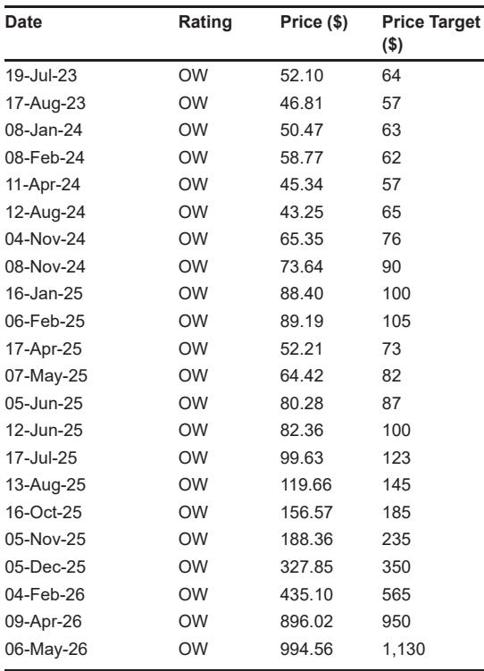
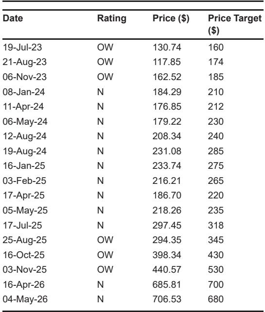
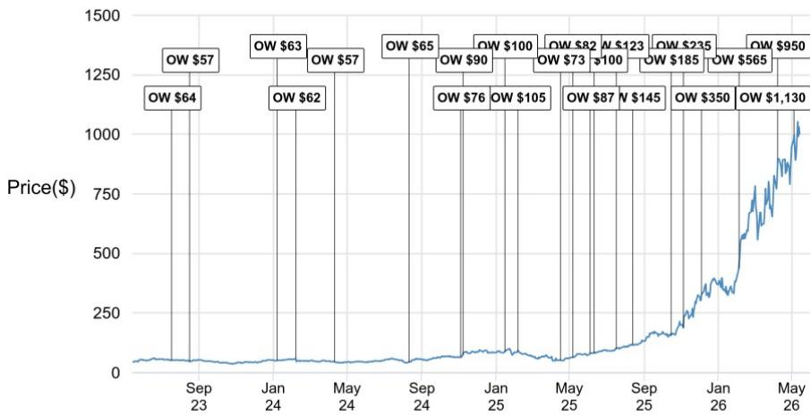

# 光通信市场真正的转折点不在2025，而在2028年之后

这份来自某外资投行的最新研报，在2026年5月对光通信市场做出了一个看似矛盾、实则深刻的判断：**Datacom市场增速被大幅上调，但真正的结构性拐点——Co-Packaged Optics（CPO）的爆发——要等到2028年之后才会到来。** 而恰恰是这一点，市场可能正在低估。

报告的核心信号并非“AI拉动光模块需求持续增长”这一已为市场消化的叙事，而是：**传统可插拔光模块在2028年前仍是绝对主力，但CPO的规模上量将重新定义供应链价值分配，且当前第三方分析师的预测可能过于保守。**

以下是这份报告最值得关注的几个层次。

## 1. 市场上调的核心驱动力是1.6T，但800G的“长尾”同样不可忽视

LightCounting最新预测将Datacom市场2025-2028年的CAGR上调至近+35%，总规模从2025年的190亿美元跃升至2028年的470亿美元。但拆解增速来源，结论更加清晰：**1.6T是增长引擎，800G则是稳定的“压舱石”。**

1.6T市场预计以约200%的CAGR增长，到2028年达到210亿美元；800G市场则以约+26%的CAGR同步增长至210亿美元。两者在2028年几乎平分秋色。这意味着，尽管市场焦点已转向更高速率，但800G的生命周期远未结束，其部署节奏将比1.6T更平滑、更持久。

对于光器件供应商而言，这带来的含义是：**短期内（2025-2027年），800G的持续上量仍将贡献可观的收入基础，而1.6T则决定增速的上限。** 任何单一押注800G或1.6T的公司都可能面临风险——真正的赢家是那些能在两个速率段都提供完整解决方案的厂商。

## 2. 每XPU的光学器件“附着率”正在加速，但架构差异带来巨大分化

报告中最具洞察力的指标之一是**光学器件附着率（Attach Rate）**：从2023年的2.7x/XPU上升至2025年的4.0x，并预计在2027年达到4.4x。这背后的逻辑是：随着集群规模扩大，需要更多的光学互联来连接XPU。

但这里有一个关键细节：**不同架构的附着率差异悬殊。** 报告指出，Google的光学电路交换（OCS）方案下，每TPU的附着率仅约1.5x；而Nvidia的部署方案下，每GPU的附着率接近6.0x。这意味着，**市场对光学器件的总需求不仅取决于XPU出货量，更取决于AI集群的拓扑架构选择。**

如果未来更多客户采用类似Nvidia的密集互联架构，光学器件的总需求可能远超当前预测。反之，如果Google的OCS方案成为主流，则附着率增长空间可能受限。这一变量目前尚未被充分定价，是后续需要持续跟踪的关键。

## 3. CPO的爆发不在2025-2027年，但2028年后的“规模上量”将重塑行业

这是报告中最容易被忽略的伏笔。尽管CPO话题热度极高，但LightCounting的预测显示：**到2028年，CPO市场仅占Datacom总市场的约5%（约15亿美元），而传统可插拔光模块仍占据超过85%的份额。** 真正的CPO爆发要等到2029-2030年，届时市场规模将跳升至约110亿美元，占总市场的约20%。

报告特别指出，**第三方分析师的CPO预测可能过于保守。** 例如，Lumentum自身对CY28年CPO收入的指引已接近20亿美元，而LightCounting对2028年整个CPO市场的预测仅为20亿美元。这意味着，如果Lumentum的指引准确，则整个CPO市场TAM可能远超当前预测。

更值得关注的是，**3.2T以太网端口未来将主要由CPO承载（约70%），而1.6T端口则呈现传统光模块与CPO并存的格局。** 这暗示：CPO并非简单替代传统光模块，而是针对更高带宽密度场景的增量市场。能够同时布局传统光模块和CPO技术的供应商，将在2028年后的竞争中占据更有利的位置。

## 4. Telecom & DCI市场被下调，但这不是需求问题，而是供给节奏问题

与Datacom市场被上调形成对比，Telecom & DCI市场预测被小幅下调（平均约10亿美元），主要原因是**1.6T ZR/ZR+产品的部署被推迟约一年**，因为终端客户在等待多路放大器（multi-rail amplifiers）和多路线路系统（multi-rail line systems）的可用性。

这一调整的实质是**技术成熟度问题，而非需求消失**。电信运营商对更高带宽的需求依然存在，但他们对新技术的部署节奏更为谨慎。一旦多路放大器等配套设备就绪，被推迟的需求可能集中释放。

对于投资者而言，这意味着：**短期内Telecom相关光器件供应商可能面临预期下修的压力，但2027-2028年可能迎来一波补涨行情。** 关键时间节点是配套设备的商用化进展。

## 5. 报告尚未完全回答的关键问题：NeoClouds的资本开支可见性

报告在结尾处埋下了一个重要的不确定性：**第三方分析师强调，从2027年开始，预测的保守性主要来自于NeoClouds（新兴云厂商）对AI基础设施资本开支的可见性有限。** 当前的光学器件需求增长高度依赖少数几家超大规模云厂商（如Google、Meta、Microsoft）的资本开支计划。如果NeoClouds的投入不及预期，或者超大规模云厂商的资本开支节奏出现波动，2027年后的增长曲线可能面临下修风险。

这一问题目前尚无明确答案，但它直接关系到市场对2027年之后光通信公司估值的定价逻辑。如果投资者将当前的高增长线性外推至2028年后，而忽略了资本开支节奏的不确定性，可能面临预期差的风险。

## 6. 对决策者的观察框架：三个需要持续跟踪的指标

基于以上分析，对于关注光通信产业链的决策者，以下三个指标值得纳入观察框架：

**第一，1.6T与800G的出货比例变化。** 这是判断市场增速是否超预期的先行指标。如果1.6T的季度出货量增速持续高于预期，则市场对2028年的预测可能进一步上调。

**第二，CPO的客户认证进展。** 当前CPO预测的保守性主要源于技术成熟度和客户认证周期。如果某家头部云厂商在2026-2027年宣布大规模CPO部署计划，将直接触发预测上修。

**第三，NeoClouds的资本开支指引。** 这是决定2027年后市场能否持续高增长的关键变量。建议关注新兴云厂商（如CoreWeave、Lambda等）的融资和资本开支计划，以及它们对AI集群规模的规划。

---

这份报告揭示的核心矛盾是：**市场对2025-2027年的增长已有充分预期，但对2028年之后的结构性变化（CPO上量、NeoClouds影响、Telecom需求释放）尚未形成共识。** 正是这种“预期差”，为深度研究提供了空间。

上述讨论中，关于NeoClouds资本开支的可见性问题、CPO客户认证的具体时间表、以及不同架构下附着率的二阶影响，在报告中并未完全展开。如果您对这些未解问题感兴趣，欢迎来星球微信群里继续讨论——我们会结合更多原始图表和交叉验证数据，与您一起推演2028年之后的光通信市场格局。

Personal reading notes and learning share only. Not investment advice.

