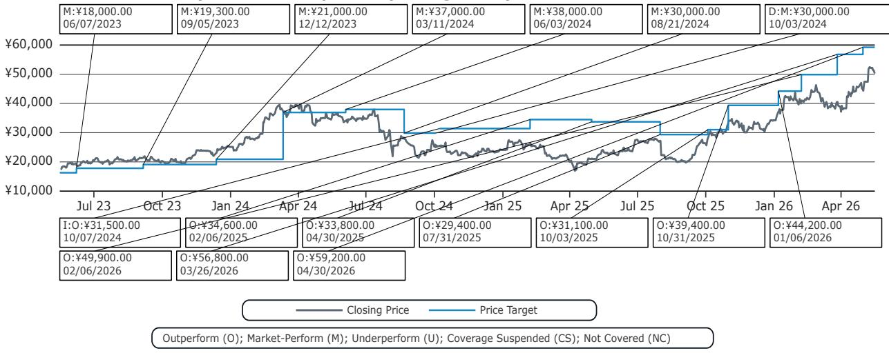
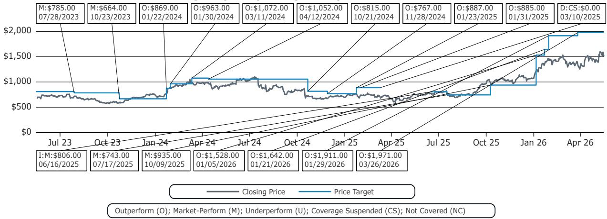

# South Korea's Semiconductor Equipment Imports Signal a Structural Upcycle That the Market Has Not Yet Priced In

The most important data point for global semiconductor investors this month is not a company earnings release or a product launch. It is a customs statistic from South Korea. In April 2026, South Korea's semiconductor equipment imports surged 57% year-over-year, reaching record levels for both global and Japanese equipment suppliers. This is not a cyclical blip. It is a strategic signal that the two largest memory manufacturers in the world are executing capacity expansions at a pace that exceeds what most financial models currently assume. The implication is straightforward: the equipment supply chain, from lithography to testers, will see revenue upside that consensus estimates have not captured. For investors who understand how to read these leading indicators, the opportunity lies in recognizing that the current valuation multiples for companies like ASML, Tokyo Electron, and Advantest still reflect caution, not conviction.

Why now? Because the gap between what companies say and what they do is closing. Both Samsung and SK hynix have guided for substantially higher capital expenditure in 2026, but the market has treated these statements with skepticism, given the history of volatile memory cycles. The import data removes that doubt. Equipment arriving at Korean ports is physical evidence of committed spending. It is not a forecast. It is a receipt. And the receipt shows that the memory industry is in the early stages of a multi-quarter investment wave driven by DRAM node migration to 1c technology and the infrastructure buildout required to support it.

The argument of this article is that South Korean equipment imports serve as a high-frequency, high-correlation proxy for the revenue trajectories of the major semiconductor equipment companies. By disaggregating the data by equipment type and supplier geography, an investor can construct a forward-looking view that is more accurate than consensus estimates. This is not a retrospective summary of what happened in April. It is a framework for understanding what will happen in the quarters ahead.

## Korean Equipment Imports Are at Record Levels, But the Capex Story Has Not Yet Fully Unfolded

The headline number is striking. South Korea imported USD 3.4 billion in semiconductor equipment in April 2026, a 57% year-over-year increase. Even on a month-over-month basis, which is typically noisy, the three-month moving average rose 3% globally and 4% for Japanese suppliers. This is not a one-month anomaly. The trend has been building for over a year, and the April data pushed the series to a new all-time high.

The so-what here is the relationship between imports and actual capital expenditure. Historically, South Korea's equipment imports have shown a strong directional correlation with the combined quarterly capex of Samsung and SK hynix. When imports rise, capex follows. The first quarter of 2026, however, presented a puzzle. Capex for both companies declined sequentially, even as imports continued to climb. The explanation is timing. Some infrastructure investments were front-loaded into the fourth quarter of 2025, creating a temporary divergence. But both companies have explicitly guided for a substantial increase in full-year 2026 capex. The implication is that the import data is not a lagging indicator of past spending. It is a leading indicator of future spending. The equipment arriving now will be installed and operational in the second half of 2026 and into 2027. The capex numbers in Q1 were an anomaly, not a reversal.

For investors, this means that equipment suppliers with significant Korean exposure are likely to see revenue acceleration that consensus does not yet reflect. The risk is not that the cycle fades. The risk is that the market remains anchored to conservative forecasts while the physical evidence points the other way.

## Lithography Imports Point to ASML's Korean Revenue Holding at Elevated Levels, With Memory as the Driver

The most important single data point within the April import report is the lithography equipment flow from the Netherlands. South Korea imported EUR 723 million in Dutch semiconductor equipment in April, the second-highest first-month-of-a-quarter figure on record. While this represents a 28% decline from March's exceptionally strong level, the year-over-year comparison is staggering: an increase of approximately 180% versus April 2025.

This is not about logic chips. It is about memory. The majority of ASML's system sales to South Korea are driven by DRAM capacity expansion and the transition to the 1c node. Based on the April import data, estimates for ASML's Q2 2026 Korea system sales stand at approximately EUR 2.1 billion. That would represent a 26% sequential decline from Q1, but a near-doubling year-over-year. More importantly, Korea would still account for roughly 33% of ASML's total Q2 system sales. The sequential decline is a normalization from an exceptionally strong Q1, not a sign of weakening demand.

The strategic implication is that memory-led demand is now the dominant structural driver for ASML, not logic or foundry. This matters because memory cycles have historically been more volatile, but the current cycle is different. The adoption of 1c DRAM requires multiple lithography steps per wafer, increasing the equipment intensity per unit of output. Even if memory bit demand grows at a moderate pace, the equipment required to produce those bits is growing faster. This is a structural, not cyclical, phenomenon. Investors who treat ASML purely as a leading-edge logic play are missing half the story.

## Tester Imports Imply a Sharp Rebound for Advantest That Consensus Has Not Anticipated

The tester segment offers the clearest example of why customs data can generate actionable investment insights. Advantest's memory tester revenue is highly correlated with South Korean tester imports from Japan and Malaysia. In April, those imports fell 21% month-over-month, but rose 49% year-over-year. The three-month moving average was up 5% sequentially.

The regression analysis is where the insight sharpens. Based on the historical relationship between Korean tester imports and Advantest's reported revenue, the April data implies a 70% quarter-over-quarter increase in Advantest's June-quarter Korea tester revenue. For context, consensus currently expects Advantest's total corporate revenue to grow only 5% quarter-over-quarter. If the Korean import data is accurate, and the historical correlation holds, then Advantest's actual revenue will significantly exceed expectations.

Why does this gap exist? Because consensus models are backward-looking. They extrapolate from recent trends rather than incorporating high-frequency leading data. The import data is available before any company reports earnings. It is a real-time check on the narrative. The question for investors is whether the market will re-rate Advantest's stock before the earnings release, or only after the beat is confirmed. History suggests that the most significant alpha is captured by those who move ahead of the confirmation, not after it.

## Japanese Equipment Imports Suggest Tokyo Electron Faces a Near-Term Headwind, But the Medium-Term Outlook Remains Strong

Not every equipment category tells the same story. Japanese semiconductor equipment imports to South Korea, which include categories relevant to Tokyo Electron such as CVD, dry etching, cleaning, coater and developer, and RTP, rose 62% year-over-year in April but fell 19% month-over-month. The regression analysis for Tokyo Electron implies a 6% sequential decline in June-quarter revenue.

This is a reminder that the equipment cycle is not uniform across all segments. Lithography and testers are showing upside, while some process equipment categories may experience a temporary pause. The so-what is that investors should not treat the entire equipment complex as a monolith. The divergence between ASML and Tokyo Electron's near-term trajectories is real and driven by different customer dynamics. ASML's lithography tools are tied to the most aggressive capacity expansion plans. Tokyo Electron's process tools are more exposed to the overall fab utilization rate and the timing of follow-on equipment orders.

However, the medium-term outlook for Tokyo Electron remains positive. The record level of lithography imports means that fabs are being built. Those fabs will need process tools in subsequent quarters. The sequential decline in Japanese equipment imports may simply reflect the lumpy nature of equipment delivery schedules. It does not signal a downturn. For investors with a six-to-twelve-month horizon, the current weakness in Tokyo Electron's import proxy could represent a buying opportunity, provided they have the conviction to look through the near-term noise.

## The Report Does Not Fully Answer How the Equipment Cycle Will Interact With Memory Pricing in the Second Half of 2026

The import data provides a clear signal on equipment demand, but it leaves an important question unresolved. How will the massive capacity expansion affect memory pricing? If Samsung and SK hynix are installing equipment at a record pace, they are effectively preparing to increase supply. In a healthy demand environment, that supply will be absorbed. But if end-market demand for DRAM and NAND softens in the second half of 2026, the equipment spending could be setting the stage for an oversupply situation.

The report's data does not address this question directly. The correlation between imports and capex is strong, but the relationship between capex and memory pricing is more complex. It depends on utilization rates, technology transitions, and the pace of demand growth from data centers, PCs, and mobile devices. The import data tells us that equipment suppliers will benefit. It does not tell us whether the memory makers themselves will generate attractive returns on that invested capital.

This is the unresolved analytical tension. The equipment cycle is clearly positive for ASML, Advantest, and Tokyo Electron. But if memory oversupply emerges in 2027, the equipment orders could slow sharply. Investors need to form their own view on memory demand, because the import data alone cannot answer that question. It can tell you where the money is being spent, but not whether that spending will prove to be value-creative or value-destructive for the end customers.

## A Decision Framework for Using Import Data as a Leading Indicator

For investors who want to operationalize this analysis, a simple framework can help. The goal is to convert customs data into a probabilistic view of equipment company revenue, and then compare that view to consensus expectations.

First, identify the equipment categories that are most correlated with specific suppliers. Tester imports from Japan and Malaysia are a reliable proxy for Advantest. Dutch lithography imports are a proxy for ASML. Japanese process equipment imports are a proxy for Tokyo Electron. The correlation is not perfect, but it is directionally robust.

Second, calculate the implied revenue growth from the import data using a regression model. The report provides these estimates. The key is not to take the point estimate literally, but to assess whether the implied growth is materially above or below consensus. A gap of 10% or more is actionable.

Third, determine whether the gap is likely to persist or close. If the import data is a leading indicator by one quarter, then the gap should close as companies report earnings. The investment opportunity exists in the period between the data release and the earnings confirmation.

Fourth, consider the risk of a reversal. Import data can be volatile month-to-month. A single data point should not drive a portfolio decision. But when the three-month moving average is consistent with the monthly signal, the confidence level increases. The April data is strong, and the trend over the past six months is supportive.

Fifth, integrate this analysis with a view on end-market demand. The import data tells you about equipment revenue. It does not tell you about memory pricing, utilization rates, or the sustainability of the cycle. Use the import data as a tactical input, not as a standalone thesis.

## The Data Is Available, But the Interpretation Requires a Framework That Most Market Participants Do Not Have

The South Korean customs data is public. Anyone can download it. But very few investors have the discipline to extract the relevant equipment categories, map them to specific suppliers, run the regression analysis, and compare the results to consensus. That is the gap this report fills. It is not about secret information. It is about analytical structure.

The import data for April 2026 tells a clear story. The memory-led equipment cycle is accelerating. ASML and Advantest are positioned for upside that consensus has not captured. Tokyo Electron may face a near-term headwind, but the medium-term outlook remains strong. The unresolved question is whether the capacity expansion will ultimately pressure memory pricing, but that is a separate analytical challenge.

For investors who want to stay ahead of the next earnings cycle, the import data is the most timely and reliable signal available. The full report includes the original charts, the regression models, and the detailed month-by-month data that supports this analysis.

Join the community to read the full report and review the original charts.

*This article is for learning and discussion only and does not constitute investment advice.*

Personal reading notes and learning share only. Not investment advice.

