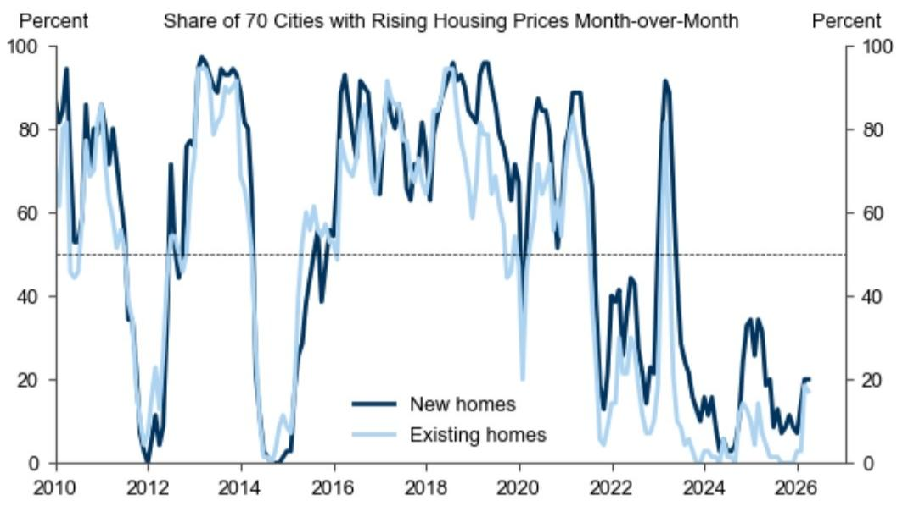
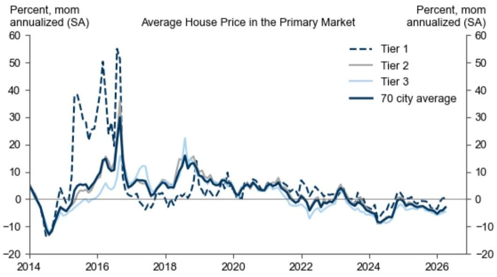
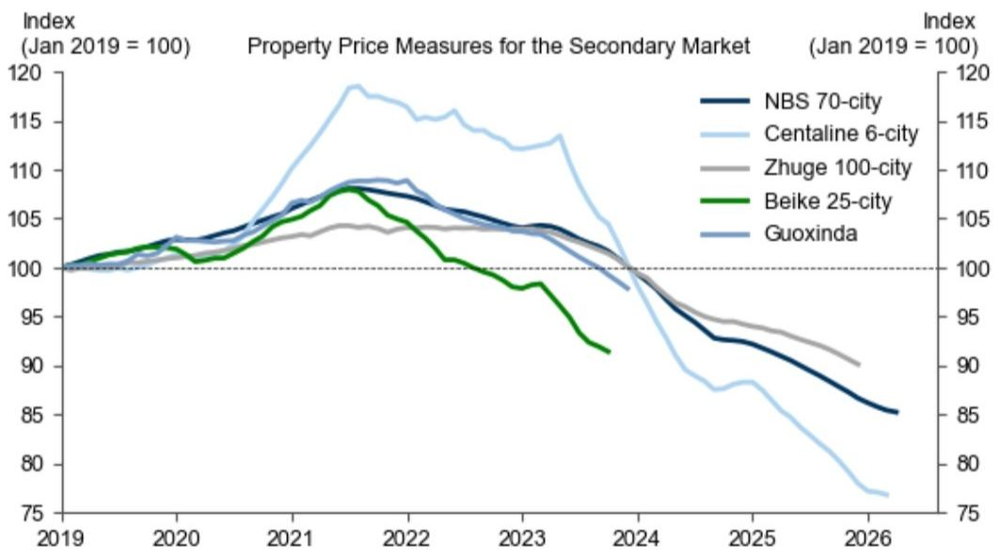

# 新房价格跌幅收窄，但真正的市场底不在统计局数据里

四月的新房价格数据，终于给出了一点微弱的积极信号。

国家统计局70城数据显示，经季节调整后，新房加权均价环比年化跌幅从3月的4.0%收窄至3.0%。一线城市继续环比上涨，上海领涨全国。二线和三线城市的环比跌幅也有所收窄。

这些数字，看起来像是市场在经历漫长调整后，终于触碰到某种底部。

但真正的问题在于：这个底部，是真实的吗？

看完这份某外资投行的最新研报，我的核心判断是：新房市场的边际改善是真实的，但不足以支撑反转判断。市场真正低估的不是需求何时回暖，而是供给侧的定价逻辑正在发生结构性变化——当二手房以5%至15%的年度跌幅持续定价时，新房市场的价格信号已经失去了代表性。

这份报告最重要的贡献，不是给了我们几个环比改善的数据点，而是揭示了一个关键事实：在中国房地产市场，你看到的“价格”和真实交易发生的“价格”，正在走向两个世界。

## 1. 新房价格改善的幅度有限，且集中在少数头部城市

四月的数据确实比三月好看。70城加权均价环比年化跌幅从-4.0%收窄至-3.0%，一线城市从+0.3%加速至+0.4%的环比年化增长。上海表现最为突出，环比年化涨幅达到2.0%，而三月还是-0.9%。

但这份改善的成色需要细看。

同比数据并不乐观。全国加权均价同比跌幅从3月的-3.5%扩大至-3.6%。这意味着，即使环比在改善，但价格水平仍在一年比一年低。真正实现同比上涨的城市屈指可数，上海(+3.7%)和杭州(+2.3%)是其中代表。

二线城市环比跌幅从-4.6%收窄至-2.8%，三线城市从-5.0%收窄至-4.6%。收窄是事实，但绝对值仍然很高。这告诉我们一个简单的道理：市场分化在加剧，头部城市有韧性，但广大二三线城市的压力远未解除。

对于产业决策者而言，这意味着什么？如果你在制定区域布局策略，不能简单用“市场在回暖”来指导决策。你需要区分：哪些城市的回暖是政策驱动的一次性脉冲，哪些是真实需求支撑的持续修复。报告没有给出这个判断，但数据暗示，目前看到的改善更可能是前者。

## 2. 二手房市场与新房市场的价差，正在撕裂整个定价体系

这是报告中最值得深读的部分，也是大多数市场参与者容易忽略的盲区。

报告明确强调：70城数据仅覆盖新房交易。而统计局和第三方平台的二手房数据显示，过去一年二手房价格跌幅在5%至15%之间。

这个价差意味着什么？

简单来说，同一个城市、同一个地段，新房和二手房的价格已经不在同一个坐标系里。当二手房以两位数的年跌幅在交易时，新房市场3%至4%的跌幅显得像是另一个世界的数字。

这种价差不是暂时的流动性折价，而是反映了更根本的结构性变化：二手房的定价机制正在从“锚定新房”转向“锚定真实成交”。当越来越多的购房者选择二手房——因为现房、因为议价空间、因为没有交付风险——新房市场的价格信号就越来越像“官方指导价”，而不是市场出清价。

这里有一个报告没有完全展开的二阶效应：如果二手房持续以更大幅度下跌，最终会倒逼新房定价体系的重置。开发商要么降价匹配二手房市场，要么继续面临去化压力。目前新房市场的“改善”可能恰恰是这种倒逼尚未完全传导的结果。

对于投资者而言，这意味着用新房数据来评估房地产资产价值，存在系统性高估的风险。如果你在看房地产相关的资产定价模型，需要问自己一个问题：你的基准价格是来自新房市场还是二手房市场？

## 3. 库存压力在缓解，但结构性问题仍然突出

报告提到，30城新房交易量在四月和五月上旬基本与去年同期持平。主要城市的库存月数从4月的29.3个月降至5月的28.9个月，降幅主要由二线城市贡献。

库存下降当然是好消息。但28.9个月的库存月数仍然处于高位。作为参考，一般认为合理的库存月数在12至18个月之间。当前的库存水平意味着，即使不再新增供应，也需要超过两年才能消化现有库存。

更值得关注的是库存下降的结构。报告指出降幅主要由二线城市贡献，这意味着一线和三线城市的库存压力可能并没有明显改善。一线城市是因为供应本身有限，三线城市则是因为需求不足。

对于开发商来说，这个数据组合指向一个清晰的行动方向：去库存仍然是首要任务，但不同城市的策略应该完全不同。在一线城市，重点可能是产品升级和价格策略优化；在二线城市，抓住窗口期加速出货；在三线城市，可能需要更激进的资产处置方案。

报告没有讨论的是，库存下降的速度是否足以支撑价格企稳。从目前的数据看，答案是否定的。库存去化需要的是成交量的持续放大，而不是单月的边际改善。

## 4. 政策放松的效果正在递减，这是报告没有完全回答的关键问题

报告提到，深圳和广州进一步放宽了核心区域的购房限制，并提高了公积金贷款额度。这些政策确实在短期内对市场产生了提振作用。

但这里有一个关键问题：政策刺激的边际效果是否在递减？

从数据看，一线城市中表现最强的是上海，而深圳和广州虽然出台了更大力度的放松政策，但价格表现并不突出。这暗示，政策放松本身可能不再是市场的核心驱动力。真正决定价格的，是居民的收入预期、就业信心和对房价的长期判断。

报告没有讨论这个维度，但这是所有投资者和决策者都需要思考的问题。如果政策效果在递减，那么接下来的市场走势将更多取决于基本面因素，而不是政策面因素。这意味着，我们需要关注的是就业数据、居民收入增长和信贷意愿，而不是等待下一个“重磅政策”。

## 5. 一个被低估的观察框架：关注成交量而非价格

基于以上分析，我想提出一个观察框架，供读者参考。

在当前市场环境下，价格信号存在严重失真。新房价格受政策干预和开发商定价策略影响，二手房价格虽然更真实但数据可得性有限（报告提到贝壳在2023年10月暂停发布二手房价格数据，国信达在2023年12月暂停，诸葛在2025年12月暂停）。

因此，更可靠的观察指标可能是成交量。

报告提到的高频跟踪数据显示，30城新房交易量在四月和五月上旬与去年同期基本持平。这个“持平”本身就是一个值得关注的信息。在价格仍在下跌的背景下，成交量能够企稳，说明确实有真实需求在入场。这些需求可能来自刚需购房者，也可能来自对价格调整到位的预期改善。

如果成交量能够持续维持在高于去年的水平，那么价格企稳就有了基础。如果成交量再次下滑，那么当前的“价格改善”可能只是昙花一现。

对于读者来说，建议将关注重点从“价格跌了多少”转向“成交量能否持续”。这是一个更简单但更有效的观察框架。

## 6. 市场真正需要回答的问题：谁在买，为什么买

报告提供了丰富的数据，但没有回答一个根本问题：当前的购房者是谁？他们的动机是什么？

从逻辑上推断，当前市场的购房者可能分为三类：一是刚性需求，包括结婚、落户、子女教育等；二是改善需求，以小换大、以旧换新；三是抄底需求，认为价格已经调整到位。

这三类需求的可持续性完全不同。刚性需求相对稳定，改善需求依赖于卖旧买新的链条能否打通，抄底需求则取决于市场预期。目前来看，改善需求受到二手房市场流动性不足的制约，抄底需求则面临“买涨不买跌”的心理障碍。

报告没有展开这个分析，但这是判断市场后续走势的关键。如果主要需求来自刚需，那么市场可能在当前水平企稳但难以大幅反弹。如果改善需求能够释放，市场才有持续修复的基础。

这个问题的答案，可能需要更微观的数据才能回答，比如不同城市、不同总价区间的成交结构变化。目前公开数据不足以支撑明确判断，这恰恰是深入研究的价值所在。

---

以上分析基于某外资投行最新研报的公开数据。这份报告的核心价值，不在于它告诉我们四月数据比三月好一点，而在于它揭示了当前房地产市场的定价机制正在发生结构性变化。新房价格数据正在失去代表性，二手房市场才是真正的价格发现场所。

如果你对这个判断感兴趣，欢迎来我们的星球微信群继续讨论。群里会有更深入的行业数据解读和资产定价框架讨论，也会分享更多非公开渠道收集的市场微观信号。我们每周都会围绕类似主题展开讨论，帮助参与者建立更完整的分析框架。

Personal reading notes and learning share only. Not investment advice.

