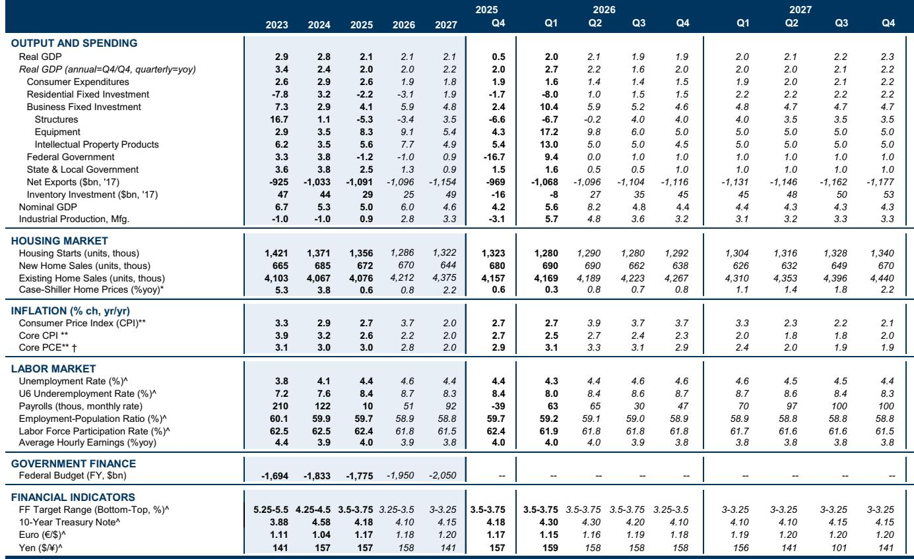
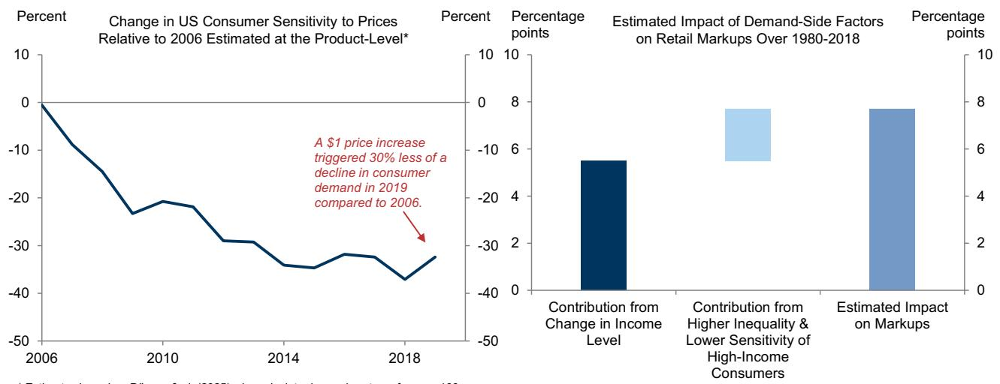
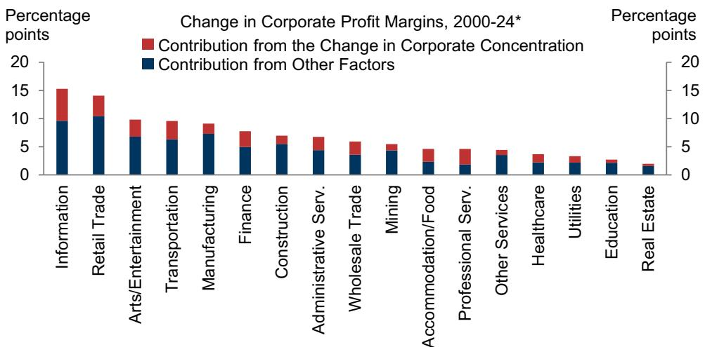

# AI Will Likely Reinforce Market Concentration, Not Disrupt It

The dominant narrative surrounding artificial intelligence is that it will democratize competition, toppling entrenched incumbents and ushering in a new era of decentralized economic power. This is a comforting story, but it is likely wrong. A careful examination of nearly a century of data on corporate concentration and profit margins reveals a different, more sobering trajectory: new technologies have historically amplified the advantages of leading firms, and AI is poised to continue this pattern. The question for investors and strategists is not whether AI will disrupt concentration, but how quickly and in which sectors it will deepen the moats of today's dominant players.

The timing of this analysis is critical. Corporate profits as a share of US GDP and market concentration metrics are at or near all-time highs. The top 1% of US firms by sales now command roughly 80% of all revenue, up from approximately 60% in the 1960s. Profit margins have expanded in tandem. This is the status quo that AI is about to encounter. Understanding why concentration and margins have risen together is essential to predicting what happens next. If the forces driving these trends are structural and technology-led, then AI is more likely to accelerate them than reverse them.

Three competing hypotheses have been offered to explain rising concentration: globalization, weaker antitrust enforcement, and technological change. The data supports only one of them decisively. Globalization and antitrust enforcement show weak or inconsistent correlations with concentration trends across advanced economies. But the relationship between technological change and concentration is robust and persistent. Concentration has risen faster during periods of rapid productivity growth, in industries with strong network effects, and in sectors most transformed by digital technologies. This is not a coincidence. It is a pattern.

The implication for AI is straightforward but often overlooked: the technology itself does not determine competitive outcomes. The structure of the industries it enters does. AI will not rewrite the rules of competition from scratch. It will amplify the existing dynamics of each sector it touches. In industries already characterized by high fixed costs, strong network effects, and winner-take-most dynamics, AI will entrench the leaders. In sectors with lower barriers and more fragmented structures, AI may create pockets of disruption, but these will likely be the exception, not the rule.

## Rising Concentration and Profit Margins Are Two Sides of the Same Technology-Driven Coin

The data linking concentration to profitability is not merely correlational; it is causal and measurable. Over the past four decades, US firms have raised markups substantially. The report estimates that since 2000, higher concentration has accounted for roughly one-third of the increase in profit margins. This is a significant figure, but it also means that two-thirds of margin expansion comes from other sources, primarily rising consumer incomes reducing price sensitivity. This distinction matters for the AI debate.

If higher incomes have reduced consumers' willingness to comparison shop, then AI's ability to personalize pricing and optimize revenue management could further amplify this effect. Incumbents with large customer bases and rich transaction histories will be best positioned to deploy these capabilities. They will not need to lower prices to win; they will need to price more intelligently. Smaller competitors, lacking the data scale to train effective pricing models, will be forced to compete on cost, squeezing their own margins further.

The connection between concentration and margins also reveals a feedback loop that AI is likely to strengthen. Higher margins provide the internal capital needed to invest in expensive AI infrastructure, proprietary datasets, and talent. These investments, in turn, widen the productivity gap between frontier firms and the rest. The report notes that productivity dispersion has widened following previous technology shocks, with frontier firms extending their lead. AI will accelerate this divergence. The firms that can afford to deploy AI at scale will pull further ahead; those that cannot will fall further behind.

## The Historical Record Shows That Technology Shocks Consistently Favor Incumbents with Scale

The most compelling evidence against the disruption thesis comes from the historical pattern of technology adoption itself. Across advanced economies, concentration has risen more rapidly during periods of faster technological change. This is not a US-specific phenomenon. The same pattern holds in Austria, Denmark, France, Germany, and Switzerland, where the sales share of the top 1% of firms rose from roughly 63% in the 1960-1979 period to 71% in the 2000-2022 period. In every case, the periods of fastest technological acceleration corresponded with the largest increases in concentration.

Why does this happen? New technologies typically involve high fixed deployment costs and low marginal costs of scaling. The firms that can make the upfront investments in data infrastructure, software, and organizational redesign can spread those costs across a larger output base, gaining market share over smaller rivals. AI fits this pattern perfectly. The cost of training large language models and building the computational infrastructure to run them is enormous. The cost of deploying those models to serve an additional customer is near zero. This is a recipe for concentration, not disruption.

The platform economy provides a vivid illustration. The report finds that between 2012 and 2022, concentration in web search services and online retail grew roughly five and three times faster than the cross-industry average, respectively. These are sectors where network effects are strongest. AI will extend this logic to new domains. In healthcare, finance, logistics, and professional services, the firms that can aggregate the most data and build the most effective AI models will create network effects that are difficult for challengers to replicate. The incumbents in these sectors are already investing aggressively.

## The Industries Most Exposed to AI Are Already More Concentrated and More Profitable

A critical finding that challenges the disruption narrative is that the industries most exposed to AI are currently operating with above-average concentration and profit margins. This is not a sector of atomistic competition waiting to be upended. It is a landscape of established leaders with deep pockets, large datasets, and existing customer relationships. These incumbents have every incentive to deploy AI in ways that reinforce their advantages.

Consider the sectors where AI is expected to have the largest impact: technology, financial services, healthcare, and professional services. In each of these, the top firms already command significant market share and earn above-average returns on capital. They have the resources to acquire AI startups, hire top talent, and build proprietary models. They also have the regulatory and compliance infrastructure that makes it difficult for new entrants to challenge them. AI disruption in these sectors is more likely to take the form of incumbents adopting AI to improve their margins than of startups using AI to displace them.

This does not mean that no disruption will occur. In sectors where incumbent advantages are weaker and data is more fragmented, AI could enable new business models and lower barriers to entry. But the report's data suggests that these cases will be the minority. The historical lesson from previous technology shocks is that the successful investment in intangible capital needed to deploy new technologies has tended to raise concentration as scale and network effects accrue to leading firms. There is no reason to believe AI will be different.

## What the Report Does Not Fully Answer: The Conditions Under Which AI Could Reduce Concentration

For all its analytical rigor, the report leaves several meaningful questions unresolved. The most important is the identification of specific conditions under which AI might actually reduce concentration rather than increase it. The report acknowledges that AI has the potential both to intensify competition by eroding the advantages of today's dominant incumbents and to reduce it by enabling the most successful AI adopters to pull far ahead. But it does not provide a clear framework for distinguishing between these two outcomes ex ante.

One possible condition is the nature of the AI technology itself. If AI models become commoditized and widely accessible at low cost, the advantage of incumbents may diminish. Open-source models, declining compute costs, and the proliferation of AI-as-a-service platforms could lower barriers to entry in some sectors. But the report's data on previous technology shocks suggests that even when technologies become cheaper and more accessible, the firms that deploy them most effectively still tend to pull ahead. The key variable may not be access to the technology itself, but the organizational capability to integrate it into business processes and decision-making.

Another unresolved question is the role of regulation. The report finds that antitrust enforcement has had a limited impact on concentration trends historically, but this does not mean that future regulatory interventions will be equally ineffective. AI is attracting unprecedented attention from competition authorities in the US, Europe, and Asia. If regulators take a more aggressive stance toward AI-related mergers, data monopolies, and platform self-preferencing, the concentration trajectory could shift. The report does not model this scenario in detail, leaving readers to speculate about the potential impact of a more interventionist regulatory environment.

## A Decision Framework for Investors and Strategists Navigating the AI-Concentration Nexus

Given the weight of the evidence, the most prudent approach is to assume that AI will reinforce existing concentration trends unless proven otherwise in specific sectors. This assumption leads to a clear decision framework with four dimensions.

First, assess the current concentration and margin structure of the sector in question. Sectors that are already highly concentrated and profitable are more likely to see incumbents extend their lead through AI adoption. Sectors that are fragmented and low-margin may offer more disruption potential, but also carry higher execution risk.

Second, evaluate the data and scale advantages of the leading firms. AI models are only as good as the data they are trained on. Firms with proprietary, high-quality, and hard-to-replicate datasets have a structural advantage that is difficult for challengers to overcome. The size of this data moat is a key determinant of whether AI will entrench or disrupt.

Third, analyze the network effects that AI may create or amplify. In sectors where AI models improve with more usage data, early leaders will build self-reinforcing advantages. This dynamic is most powerful in platform markets, but it is increasingly relevant in healthcare, finance, and enterprise software.

Fourth, monitor the regulatory and competitive environment for signs of change. If regulators begin to restrict data aggregation, mandate interoperability, or block AI-related mergers, the concentration trajectory could shift. But until such interventions materialize, the default assumption should be that AI will deepen existing moats.

This framework does not guarantee correct predictions, but it provides a structured way to evaluate the likely competitive impact of AI in any given sector. It forces a clear-eyed assessment of the status quo before projecting the future.

## Join the Community to Read the Full Report and Review the Original Charts

The data and analysis summarized here only scratch the surface of what the full report contains. Detailed exhibits on concentration trends by industry, the relationship between productivity shocks and market structure, and the sector-level breakdown of AI exposure provide the granular evidence that serious investors and strategists need to make informed decisions. The original charts reveal patterns that are difficult to capture in summary form, and the full report includes additional analysis on profit margin decomposition, the role of intangible capital, and the implications for portfolio construction.

Join the community to read the full report and review the original charts. The questions raised here about the conditions under which AI might reduce concentration, the role of regulation, and the specific sectors most vulnerable to disruption deserve a deeper dive than this article can provide. The full report offers that depth.

*This article is for learning and discussion only and does not constitute investment advice.*

Personal reading notes and learning share only. Not investment advice.

