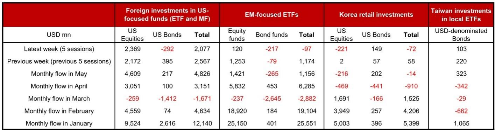
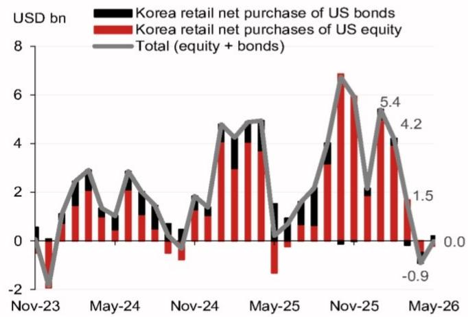
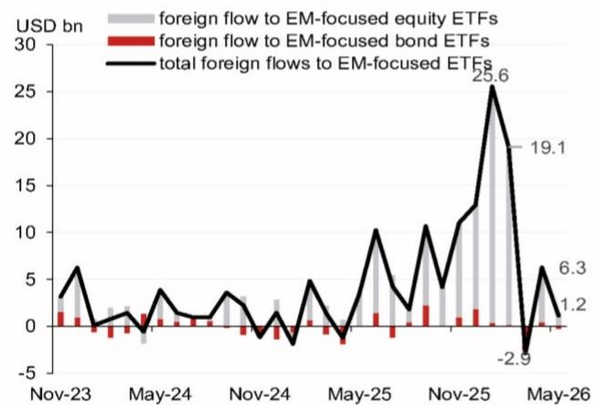

# 全球资金流向正在发出一个被忽视的信号：美国资产的“虹吸效应”并未减弱，但结构正在裂变

过去一个月，全球资本市场的叙事焦点集中在“美国例外论是否终结”以及“新兴市场能否迎来资金回流”。但某外资投行最新发布的高频资金流监测数据揭示了一个更微妙的现实：全球资金仍在持续涌入美国资产，只是流入的结构正在发生实质性变化——权益与债券的偏好正在反转，而新兴市场的资金流入出现了明显的断崖式回落。这些变化背后，隐藏着对全球资产定价逻辑的深层含义。

这份报告的核心价值不在于罗列数字，而在于提供了一个高频、多维度的资金流观测框架。它让我们得以避开月度或季度数据的滞后性，从周度甚至日度数据中捕捉到市场情绪的边际变化。对于关注全球资产配置、汇率走势以及亚太区域资金流动的决策者而言，这些高频信号比宏观叙事更具前瞻性。

## 1. 美国权益资产的“吸金”能力依然强劲，但债券市场正在经历资金外流

报告显示，5月8日至14日当周，外国资金净流入美国相关基金达到21亿美元，其中权益类基金贡献了24亿美元的净流入，而债券类基金则出现了2.92亿美元的净流出。这组数据看似矛盾，实则揭示了市场对美国资产定价的核心分歧。

权益市场的持续流入表明，投资者对美股盈利增长、科技叙事以及AI产业链的长期信心并未动摇。尽管市场存在对估值过高的担忧，但资金仍在用行动投票。相比之下，债券市场的流出则反映出市场对美国利率路径的重新定价——通胀粘性、劳动力市场韧性以及美联储的观望态度，正在削弱美债的吸引力。

更值得关注的是月度趋势。5月至今，美国权益类基金已累计流入46亿美元，远超4月全月的31亿美元。这意味着，美国权益资产的吸引力不仅没有减弱，反而在加速强化。而债券市场的月度流入仅有2.17亿美元，较4月的1亿美元有所回升，但远低于1月的26亿美元峰值。这种结构性的分化，指向一个核心判断：**市场对美股的定价逻辑已经从“流动性驱动”转向“盈利驱动”，而对美债的定价则陷入了“利率预期博弈”的泥潭。**

这个判断的含义是，如果美联储在未来几个月维持利率不变，美债的吸引力将持续承压，而美股则可能继续享受盈利改善带来的资金流入。但风险在于，若利率持续高企导致经济放缓超预期，权益市场的资金流入也可能面临逆转。

## 2. 新兴市场的资金流入出现了“断崖式回落”，但结构分化更加明显

报告中最令人警觉的数据来自新兴市场（EM）相关ETF。5月9日至15日当周，EM相关ETF净流出仅为9700万美元，看似温和，但对比前一周12亿美元的净流入，这一逆转幅度堪称剧烈。月度数据更清晰地揭示了趋势：5月至今EM相关ETF仅录得12亿美元净流入，而4月全月高达63亿美元，3月更是达到191亿美元。

这种急剧萎缩背后，是EM内部权益与债券资金流向的严重分化。5月至今，EM权益类基金仍录得14亿美元净流入，但债券类基金已净流出2.65亿美元。这组数据说明，外资对EM资产的偏好正在从“全面配置”转向“选择性买入”——权益资产仍被视为高贝塔的受益者，但债券资产则因全球利率环境的不确定性而被抛弃。

这一变化对亚太市场的含义尤为深刻。报告特别提到了韩国和台湾投资者的行为：韩国散户投资者在5月9日至15日当周净卖出7200万美元的美国组合资产，其中美股净卖出2.21亿美元，美债净买入1.49亿美元。台湾投资者则在同期净买入1.03亿美元的美元计价债券基金，但规模较前一周的2.2亿美元大幅缩水。

这些数据指向一个判断：**亚太地区的私人投资者正在从“追逐美国权益”转向“防御性配置美债”，但这一转向的力度正在减弱。** 如果这种减弱趋势持续，意味着亚太资金对美国资产的整体偏好可能正在见顶，而这将对美元汇率和新兴市场资金流动产生连锁影响。

## 3. 韩国和台湾的私人投资者行为，正在成为全球风险偏好的“晴雨表”

报告对韩国和台湾投资者行为的追踪，提供了观察全球风险偏好的重要窗口。韩国散户投资者在4月曾净卖出9.1亿美元美国组合资产，而5月至今这一数字已收窄至1400万美元。台湾投资者则在4月净卖出3.42亿美元的美元债券后，5月至今转为净买入3.23亿美元。

这些行为变化的背后，是亚太地区投资者对全球利率环境和美元走势的重新评估。韩国散户在4月的抛售可能源于对美联储降息延后的担忧，而5月的收窄则可能反映出市场对利率路径的预期已经部分消化。台湾投资者对美元债券的重新买入，则可能基于对美元利率见顶的押注。

但报告尚未完全回答的一个关键问题是：**这些私人投资者的行为变化，究竟是短期情绪波动，还是长期资产配置的转向？** 从历史数据看，韩国散户在2024年1月曾净买入54亿美元美国组合资产，而2025年3月则净卖出15亿美元。这种大起大落表明，私人投资者的行为更多受到短期市场情绪和汇率预期的影响，而非基于长期基本面判断。这意味着，如果美元汇率出现大幅波动，这些资金流向可能迅速逆转。

对于关注亚太资产配置的读者而言，韩国和台湾投资者行为的意义在于：它们可以作为全球风险偏好的“边际定价者”。当这些投资者开始系统性减持美国资产时，往往预示着全球风险偏好正在从“追逐风险”转向“规避风险”。

## 4. 这份报告尚未回答的三个关键问题，恰恰是理解未来资金流向的核心

尽管报告提供了丰富的高频数据，但它并未完全回答以下三个关键问题，而这些问题的答案将决定未来几个月全球资金流向的演变方向。

第一个问题是：**美国权益类基金的资金流入能否持续？** 报告显示，5月至今的流入规模已超过4月全月，但这一趋势能否延续，取决于美股盈利增长能否达到预期。如果二季度财报季出现普遍的下调盈利指引，资金流入可能迅速逆转。

第二个问题是：**新兴市场债券资金流出的背后，是利率因素还是信用因素？** 报告显示EM债券基金已连续多周净流出，但并未区分是受全球利率上升的“推拉效应”影响，还是受个别新兴市场国家信用风险恶化驱动。如果是前者，美联储降息预期重启后可能迅速回流；如果是后者，则意味着EM债券市场正在经历结构性的信用重定价。

第三个问题是：**亚太私人投资者的行为模式是否正在发生根本性变化？** 韩国和台湾投资者在2024年和2025年初曾是美国资产的积极买家，但2025年4月以来出现了明显的净卖出。这种变化是否意味着这些投资者正在将资金转向本地市场或其他区域？报告没有提供足够的数据来回答这个问题，但这一判断对于理解亚太区域内资金流动的长期趋势至关重要。

## 5. 一个可供读者自用的观察框架：如何从高频资金流数据中读出“二阶信号”

基于这份报告的分析框架，我们可以提炼出一个简单的观察方法，帮助读者从类似的高频数据中提取更深层的信号。

第一步，关注“边际变化”而非“绝对水平”。报告中最有价值的信息不是美国权益基金每周流入21亿美元，而是这一数字较前一周的26亿美元有所回落。边际变化往往领先于趋势反转。

第二步，关注“结构分化”而非“总量趋势”。美国权益与债券的分化、EM权益与债券的分化，这些结构性的差异比总量更能揭示市场的真实定价逻辑。

第三步，关注“私人投资者行为”而非“机构资金流向”。机构资金的流动往往受制于被动配置和基准约束，而私人投资者的行为更能反映市场的情绪边际。

第四步，关注“亚太区域内的资金再配置”。韩国和台湾投资者的行为，不仅反映了对美国资产的偏好，也间接揭示了亚太区域内资金流向的潜在变化。如果这些投资者开始减持美国资产并增持本地资产，可能预示着亚太市场的相对吸引力正在上升。

这套观察框架的核心是：**不要只看资金流向本身，而要问“为什么流向发生了变化”以及“这种变化是否可持续”。** 只有回答了这两个问题，才能从高频数据中读出真正有意义的判断。

---

全球资金流向正在经历一个微妙的转折期。美国资产的吸引力并未消退，但其内部结构正在裂变；新兴市场并未迎来预期的资金回流，反而面临更严峻的分化；亚太私人投资者的行为正在成为全球风险偏好的新指标。这些变化背后，是市场对利率、增长和风险定价的重新校准。

这份报告提供了观察这些变化的高频窗口，但真正的投资决策还需要更深入的分析。我们将在社群中继续讨论这些数据背后的二阶影响，包括美国权益资金流入的可持续性、新兴市场债券流出的根本原因，以及亚太区域内资金再配置的潜在路径。欢迎来星球微信群里继续讨论，一起追踪这些关键变量的演变。

Personal reading notes and learning share only. Not investment advice.

