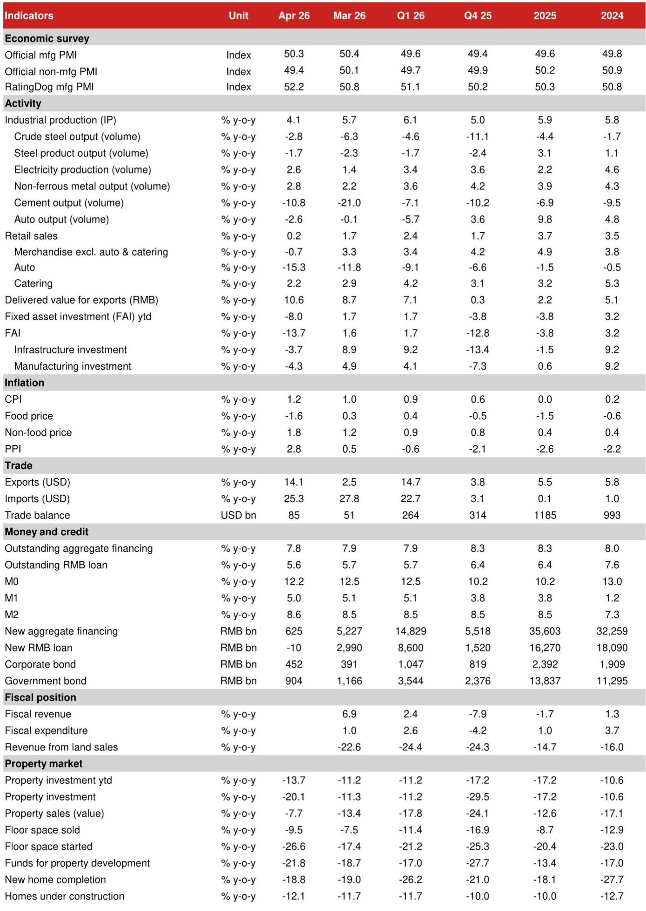
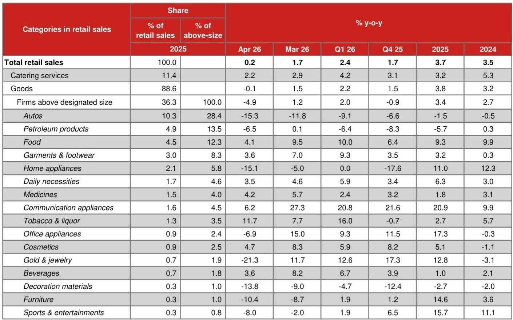
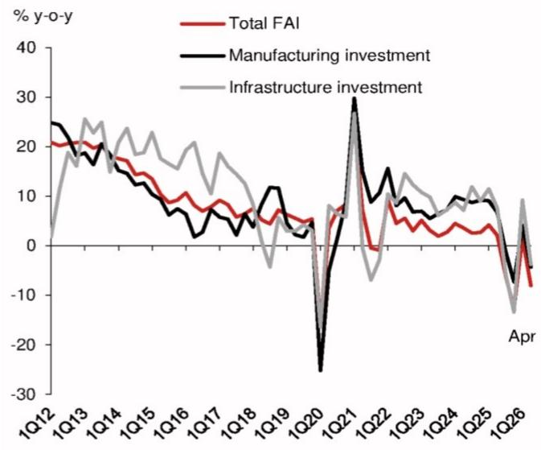

# China’s April Activity Data Confirms the Q1 Rebound Was a Mirage, Not a Recovery

The April activity data from China’s National Bureau of Statistics landed with a thud, and the message is unambiguous: the first-quarter rebound was not the beginning of a durable recovery but a temporary reprieve that has already expired. Industrial production growth fell to 4.1% year-on-year from 5.7% in March, retail sales collapsed to just 0.2%, and fixed-asset investment plunged back into negative territory at -8.0%. These are not soft patches. They are signals that the structural headwinds facing China’s economy—led by a deepening property bust and weak domestic demand—are overwhelming the temporary tailwinds from exports and artificial intelligence-related price effects.

The conventional narrative that China’s economy is stabilizing is now difficult to defend. The data show a broad-based weakening across manufacturing, infrastructure, and property investment, with consumer spending contracting in real terms for the first time since December 2022. The Q1 GDP growth of 5.4% appears increasingly like an optical illusion, inflated by a combination of inventory restocking, front-loaded policy spending, and surging export prices that masked declining volumes. The April numbers strip away that illusion and reveal the underlying fragility.

What makes this moment particularly consequential is the divergence between what financial markets are pricing and what the real economy is delivering. Stock indices have risen, and the AI boom has captured investor imagination, yet credit demand remains weak and 10-year Chinese government bond yields have dropped 10 basis points this year without any policy rate cuts. This is a “great divide” that should concern every investor with exposure to Chinese assets. The real economy is not confirming the risk-on signal from equity markets.

The April data force a fundamental reassessment. The Q1 rebound was driven by external shocks—surging chip prices tied to AI demand and a temporary boost from the trade-in program for consumer durables. Neither of these drivers is sustainable. Domestic demand is worsening, the property sector is re-accelerating its decline, and Beijing’s policy response so far has been insufficient to reverse the trajectory. The below-consensus forecast for Q2 GDP growth of 4.1% now looks not pessimistic but realistic, and it is only a matter of time before other forecasters are forced to revise their numbers downward.

This is not a cyclical dip that will self-correct. It is a structural adjustment that requires a policy response far more aggressive than what has been deployed to date. The April data should be read as a warning shot for policymakers, investors, and corporate strategists alike.

## The Export Headline Masks a Volume Collapse, and the AI Boom Is Not a Growth Engine for the Broader Economy

The most dangerous misinterpretation of the April data would be to look at the 14.1% year-on-year export growth and conclude that external demand is compensating for domestic weakness. A closer reading reveals that roughly half of that export growth is attributable to surging prices of chips and electronic products, not to an increase in volumes shipped. The price effect is suppressing demand even as it inflates the headline number. Export-delivered value growth rose to 10.6% from 8.7% in March, but this is a nominal figure that overstates real activity.

The AI boom is real for a narrow set of semiconductor and electronics firms, but it is not a macro-level growth engine for the Chinese economy. Output growth of integrated circuits accelerated to 22.1% year-on-year in April, yet IC export growth in volume terms dropped to 3.7% from 12.9% in March. This divergence between rising prices and falling volumes is a classic sign of demand destruction. The price increases are not generating broad-based economic activity; they are concentrating gains in a small sector while squeezing margins and consumption elsewhere.

The implication for investors is clear: do not extrapolate the AI-related export strength into a general recovery thesis. The sectors that matter for employment, income, and domestic demand—autos, home appliances, petroleum products, and construction materials—are all deteriorating. Auto output fell 2.6% year-on-year in April, and passenger car sales in volume terms dropped 20.0%. The domestic market still accounts for roughly 70% of auto sales, and that domestic demand is collapsing. Export strength in EVs cannot offset a domestic contraction of this magnitude.

The “great divide” between the export-oriented tech sector and the domestic-demand-driven economy is widening, and it has direct implications for currency policy. Beijing cannot allow the renminbi to appreciate too quickly without worsening the pain in domestically oriented industries. This constraint on currency flexibility is itself a policy challenge that limits the tools available for managing the slowdown.

## Retail Sales in Real Terms Are Contracting, and the Consumer Is Not Coming Back Without Income Support

The headline retail sales growth of 0.2% year-on-year in April is alarming enough, but the real story is worse. Using April CPI inflation of 1.2% as a deflator, real retail sales growth turned negative at -1.0%—the first negative print since December 2022. This is not a pause in consumer spending; it is a contraction. Households are cutting back, and the breadth of the decline across categories confirms that this is not a sector-specific issue but a broad-based demand problem.

The payback effects from the scaled-back trade-in program for consumer durables are now fully visible. Home appliance retail sales fell 15.0% year-on-year in April, down from -5.0% in March. Communication appliances dropped from 27.3% growth to just 6.2%. Office appliances went from 15.0% growth to -6.9%. These are not normal fluctuations. They reflect the exhaustion of a policy stimulus that pulled forward demand but did not create new demand. Once the subsidy was reduced, consumers stopped buying.

The petroleum products category tells a different but equally troubling story. Retail sales turned negative at -6.5% year-on-year in April, driven by price hikes that suppressed volume demand. Surging global oil prices are acting as a tax on Chinese consumers, reducing their purchasing power for other goods. This is an external shock that Beijing cannot control with domestic policy tools.

Catering services growth continued its decline to 2.2% year-on-year, with larger restaurants faring even worse at 0.9%. This reflects both the lingering effects of the anti-involution campaign that suppressed service sector margins and the broader weakness in household purchasing power. Consumers are not confident enough to spend on discretionary services, and that confidence is unlikely to return without meaningful income support from fiscal policy.

The message for corporate strategists is sobering: the Chinese consumer is in a retrenchment phase that will persist until real incomes recover. Price competition will intensify across discretionary categories, and companies that depend on domestic demand should prepare for a prolonged period of volume pressure.

## Fixed-Asset Investment Has Re-entered Contraction, and the Anti-Involution Campaign Is Amplifying the Slowdown

The collapse in fixed-asset investment growth to -8.0% year-on-year in April from 1.6% in March is the most striking data point in the release. After only three months of positive growth in Q1, FAI has returned to contraction, and the breadth of the decline is remarkable. Manufacturing investment fell to -4.3%, infrastructure investment dropped to -3.7%, and property investment deepened to -20.1%. Every major category is now shrinking.

The manufacturing investment decline is particularly notable because it occurred alongside robust export growth. This suggests that the anti-involution campaign—Beijing’s policy of curbing overcapacity in strategic sectors—is overriding external demand signals. The campaign is not just about solar panels and EVs; it is now affecting investment decisions across manufacturing. Solar panel output growth fell to -25.6% year-on-year in April, and the anti-involution logic is being applied more broadly.

Yet the sectoral data reveal inconsistencies that raise questions about the campaign’s implementation. FAI in the motor vehicle sector fell sharply to -10.4%, consistent with the anti-involution narrative. But FAI in electrical machinery and equipment rebounded to 7.6% from -3.7%, suggesting that some sectors are still expanding capacity despite the policy intent. The railways, ships, and aerospace category remained robust at 17.8% growth. The anti-involution campaign is not being applied uniformly, and this uneven implementation creates confusion for investors trying to assess which sectors face capacity constraints and which do not.

Infrastructure investment’s return to negative territory at -3.7% is a policy failure. Special local government bond issuance was notably slower in April than in the same period last year, and this funding shortfall is now visible in the activity data. If Beijing wants to stabilize growth through infrastructure, it needs to accelerate bond issuance and project approvals. The current pace is insufficient.

The ownership breakdown is equally concerning. State-controlled entity FAI turned negative at -6.3%, and private enterprise FAI deteriorated to -11.2%. Private sector investment is in freefall, and the state sector is no longer compensating for that weakness. This is a signal that business confidence is eroding across ownership types, and it will take more than marginal policy adjustments to restore it.

## The Property Sector Is Re-accelerating Its Decline, and the Tier-1 City Green Shoots Are Not Spreading

Property investment growth collapsed to -20.1% year-on-year in April from -11.3% in March, far worse than any consensus forecast. This is not a stabilization; it is a re-acceleration of the downturn. New home starts fell 26.6%, completions fell 18.8%, and funds for property investment dropped 21.8%. Every major indicator is worsening, and the sector remains the primary drag on the entire economy.

The home price data offer a nuanced but ultimately discouraging picture. Average new home prices declined 0.19% month-on-month in April, a marginal improvement from the 0.21% decline in March. Existing home prices declined 0.23%, virtually unchanged from March. Tier-1 cities, particularly Shanghai, continue to show modest price appreciation. Shanghai existing home prices rose 0.7% month-on-month in April, and all four tier-1 cities recorded positive gains.

But these green shoots are limited in both geography and significance. Only 12 of the 70 cities tracked by the NBS experienced month-on-month increases in existing home prices, down from 13 in March. Tier-2 and tier-3/4 cities continue to see price declines of 0.10% and 0.35% respectively. The recovery in existing home markets in top-tier cities has limited implications for new home markets, and the Shanghai story has limited implications for the rest of the country.

The Iceberg index, a leading indicator based on lowest listing prices, recorded a 0.4% month-on-month decline in April, and the first two weeks of May show a similar pace of decline. There is no evidence of a turning point in national home prices. The property sector will continue to drain economic momentum for the foreseeable future, and Beijing has not yet deployed the scale of fiscal intervention needed to break the cycle.

## What the Report Does Not Fully Answer: The Policy Response Remains an Open Variable

The April data raise a critical question that the report cannot fully answer: what will Beijing do next? The data clearly signal that current policy settings are insufficient. The trade-in program has been scaled back, special local government bond issuance is behind schedule, and the anti-involution campaign is suppressing investment even as domestic demand weakens. Yet there is no indication that policymakers are preparing a major stimulus package.

Several open questions remain unresolved. First, will Beijing accelerate fiscal spending in the second half of the year, or will it continue to prioritize long-term structural goals over short-term stabilization? The April Politburo meeting reaffirmed the anti-involution campaign, suggesting that supply-side discipline remains the priority. Second, can the property sector stabilize without direct government purchases of distressed housing inventory? The current approach of allowing market forces to work through the downturn is producing a slow-motion crisis that is destroying household wealth and confidence. Third, will the export sector continue to provide a buffer, or will the price-driven export boom fade as global demand for chips and electronics normalizes?

These are not academic questions. They are the key variables that will determine whether the Q2 GDP forecast of 4.1% proves too optimistic or too pessimistic. Investors should watch for policy signals in the coming weeks, particularly around fiscal spending, property sector intervention, and any shift in the anti-involution stance. The data alone cannot answer these questions, but they make clear that the cost of inaction is rising.

## A Decision Framework for Investors: How to Position for a Divergent Economy

The April data demand a strategic reassessment of China exposure. The old framework of buying Chinese assets on any policy-driven dip is no longer reliable, because the policy response is uncertain and the structural headwinds are intensifying. A new decision framework is needed, built around three dimensions.

First, distinguish between sectors that benefit from the AI and export price boom and those that depend on domestic demand. The former—semiconductors, select electronics, and some industrial automation—may continue to outperform, but they are narrow and vulnerable to a reversal in global chip prices. The latter—autos, consumer durables, real estate, construction materials, and retail—face a deteriorating demand environment that will persist until incomes recover.

Second, assess the policy sensitivity of each position. Sectors that are direct beneficiaries of fiscal spending, such as infrastructure and renewable energy equipment, may see a near-term boost if Beijing accelerates bond issuance. But this is a tactical trade, not a strategic allocation. Sectors that are targets of the anti-involution campaign, such as solar manufacturing and EVs, face capacity constraints that will limit volume growth even if margins improve.

Third, monitor the credit channel closely. The fact that 10-year government bond yields have fallen without policy rate cuts indicates that the market is pricing in a weaker growth outlook and expecting monetary easing. If credit demand remains weak despite lower yields, it signals that the transmission mechanism is broken. New RMB loans turned negative in April, a stark indicator that banks are unwilling to lend and borrowers are unwilling to take on debt. This credit contraction will amplify the economic slowdown.

The framework leads to a cautious conclusion: reduce exposure to domestic-demand-sensitive sectors, maintain selective positions in export-oriented tech where valuations are reasonable, and prepare for the possibility that Beijing will be forced into a more aggressive policy response later this year. The April data make a compelling case for patience and selectivity, not for a broad-based re-entry into Chinese risk assets.

## The Unanswered Questions That Should Drive Your Research Agenda

The April activity data resolve some debates but open many more. The Q1 rebound was indeed short-lived, and the structural challenges facing China’s economy are as severe as ever. But the path forward remains highly uncertain, and the key analytical questions are not yet settled.

How much further will property investment fall before it stabilizes? Can the anti-involution campaign coexist with the need to support growth? Will the consumer retrenchment deepen, or is this a temporary adjustment to the trade-in program withdrawal? What will it take for Beijing to shift from supply-side discipline to demand-side stimulus? And how will the divergence between financial markets and the real economy resolve itself?

These are the questions that will define investment outcomes in China over the next six to twelve months. The April data provide essential inputs, but they do not provide the answers. That requires ongoing analysis, access to granular data, and the ability to interpret policy signals in real time.

Join the community to read the full report and review the original charts.

*This article is for learning and discussion only and does not constitute investment advice.*

Personal reading notes and learning share only. Not investment advice.

