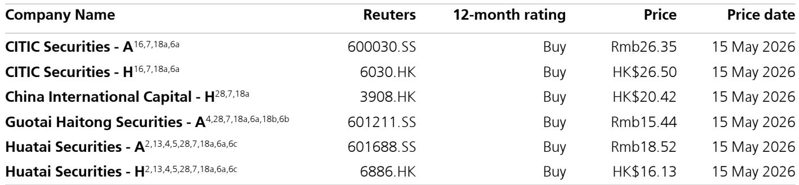
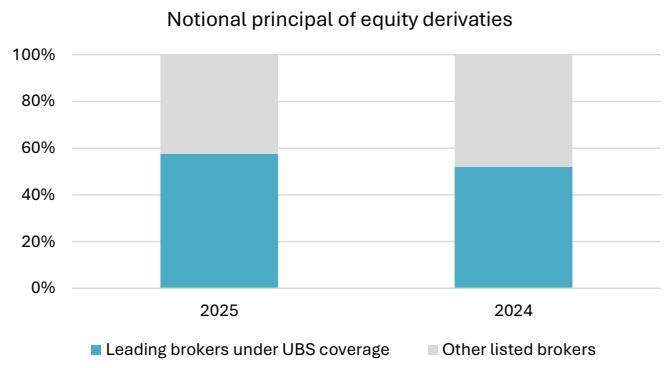

# 中国衍生品新规的真正信号：不是收紧，是龙头加速分化的发令枪

中国证监会于近期发布了《衍生品交易监督管理办法（试行）》，这是中国资本市场首部专门针对衍生品的部门规章。市场第一反应往往聚焦于“收紧”二字——更高的资本要求、更严格的交易限制、非合规产品的强制清退。某外资投行最新发布的研报给出了一个更具结构性价值的判断：这份新规的真正含义，不是市场的收缩，而是行业集中度加速提升的起点。对于持有头部券商资产的投资者而言，这可能是未来两到三年最被低估的定价因子。

报告的核心逻辑并不复杂：新规通过提高资本门槛、扩大禁止交易范围、强化分类与隔离要求，系统性地抬高了衍生品业务的运营成本。小机构将被迫退出，而资本充足、风控完善、规模领先的头部券商，将凭借合规成本和产品供给能力的双重优势，进一步扩大市场份额。这不是一个“利空出尽”的故事，而是一个“结构分化”的起点。

以下是我们基于该研报解析出的五个关键层次，每一层都指向同一个主判断：衍生品新规正在重塑中国券商的竞争格局，龙头券商的估值重估才刚刚开始。

## 1. 5000万净资本门槛，实际上是一道行业分水岭

新规最直接的硬性约束，是要求开展衍生品交易的证券期货公司近六个月净资本不低于5000万元人民币。这一数字本身并不惊人，但它的结构性含义远大于数字本身。

报告指出，与2026年1月的征求意见稿相比，正式版本保留了这一门槛，并且明确证监会可以根据审慎监管原则进行调整。这意味着，资本实力不再是“加分项”，而是“入场券”。对于中小券商而言，衍生品业务本身需要大量资本占用，5000万净资本只是基础门槛，实际运营中需要匹配的资本规模远高于此。许多小型机构将面临两难选择：要么大幅增资，要么退出这一业务线。

横向来看，报告数据显示，2025年，CITIC、CICC、HTSC和国泰Haitong四家头部券商合计占据了上市券商权益衍生品名义本金的约60%，而2024年这一比例约为52%。集中度在一年内提升了近8个百分点。新规落地后，这一趋势只会加速。小机构的退出将释放出更多的市场份额，而这些份额将被资本充裕的头部机构以更合规、更低成本的方式承接。

这里需要指出的是，报告没有完全展开的一个问题是：退出的小机构手中的存量业务如何平稳过渡？六个月过渡期后，非合规产品必须到期清退，但市场承接能力是否足够？如果头部机构无法在短期内消化这些存量，市场可能会经历一段短暂的流动性摩擦。这是投资者需要密切跟踪的变量。

## 2. 禁止范围的扩大，正在改变衍生品的需求结构

新规的第二个关键变化，是将禁止上市公司、大股东、控股股东及高管开展衍生品交易的范围，从“自身股票”扩展至“所有权益类证券”。这意味着，此前市场上常见的通过衍生品变相进行股份减持、对冲或结构化融资的结构，将面临全面清理。

报告认为，这一条款对短期增长构成压力。非合规结构化产品的退出，将直接减少衍生品市场的名义本金规模。但更深层的影响在于，它正在改变衍生品市场的需求结构：从以“套利和结构化融资”为主导，转向以“真实对冲和风险管理”为主导。

报告引用了新规中对衍生品功能的明确表述：促进对冲，抑制过度投机。这一表述看似原则性，实则意味着监管将在产品设计、投资者适当性、杠杆控制等环节实施更严格的审查。保证金要求、持仓限额、逆周期调节工具等都将成为常态。

对于头部券商而言，这意味着两件事。第一，合规成本上升，但头部机构有能力构建更完善的风控和合规体系，反而形成了对小机构的竞争壁垒。第二，需求结构的转变，要求券商从“产品通道”转向“风险管理服务商”。那些在衍生品定价、风险建模、对冲策略方面有深厚积累的机构，将获得更高的客户粘性和定价权。

报告没有完全展开的一个判断是：需求结构的转变，可能带来衍生品业务盈利模式的根本性变化。过去依赖结构化产品高佣金率的模式将不可持续，而基于真实对冲需求的费率虽然看似更低，但规模更大、周期性更弱、客户关系更持久。这个转换过程需要时间，但方向是确定的。

## 3. 中国衍生品市场的渗透率，才是真正的长期叙事

新规的短期影响清晰可见，但报告真正想传达的长期判断，隐藏在两张图表中。

第一张图显示，中国场内衍生品市场中，金融衍生品仅占交易量的20%和交易额的33%，而商品衍生品占据了绝对主导。作为对比，在全球主要市场中，金融衍生品通常占据场内交易量的绝大多数。中国金融衍生品的渗透率之低，意味着巨大的增长空间。

第二张图显示，头部券商在权益衍生品市场的份额正在快速扩大。这两张图合在一起，构成了一个清晰的叙事：市场在增长，但增长的红利将不成比例地流向头部机构。

报告指出，衍生品市场的增长驱动力来自两个方面：一是机构化进程的加速，机构投资者对风险管理和对冲工具的需求将持续上升；二是金融市场开放带来的外资参与度提升，外资机构对衍生品工具的依赖程度远高于内资。这两个趋势都是不可逆的，而它们都需要一个更加规范、透明、可预期的衍生品市场作为基础设施。

新规恰恰是在为这个基础设施打地基。短期看，它清理了不合规的玩家和产品；长期看，它为更广泛、更深度的衍生品使用打开了空间。那些在合规、资本、技术和服务能力上提前布局的头部券商，将成为这个基础设施的最大受益者。

## 4. 报告尚未完全回答的关键问题：定价权的转移何时体现在财务报表中

尽管报告的逻辑链条清晰，但有几个关键假设尚未得到充分验证。

第一个是时间维度。新规将于2026年11月16日正式生效，距今还有约六个月的过渡期。非合规产品的清退和存量业务的转换，可能在未来两个季度内对市场交易量和券商衍生品收入产生阶段性影响。头部券商能否在过渡期内平滑承接市场份额，仍需验证。

第二个是盈利弹性。衍生品业务对券商收入的贡献，不仅取决于名义本金规模，还取决于费率水平和资本使用效率。报告显示头部券商份额在扩大，但这是否意味着它们的衍生品业务利润率同步提升？如果竞争加剧导致费率下行，规模增长可能无法完全对冲利润率的压缩。这一点报告没有给出明确的量化分析。

第三个是监管的后续动作。新规是“试行”版本，证监会保留了调整门槛和范围的权力。未来是否会有更严格的资本要求或杠杆限制？如果监管继续加码，头部券商的资本优势是否足以支撑持续扩张？这些不确定性需要投资者持续跟踪。

这些未解问题，恰恰是深入讨论的价值所在。欢迎来我们的星球微信群里继续讨论这些关键假设的验证路径和情景分析。

## 5. 投资者的观察框架：从三个维度重新审视券商股

基于上述分析，我们建议投资者从以下三个维度重新审视中国券商股的投资逻辑。

第一，资本充足率与衍生品业务规模的匹配度。不要只看净资本绝对规模，更要看净资本中可用于衍生品业务的风险资本占比。那些在资本规划中提前为衍生品业务预留了空间的公司，将拥有更大的战略灵活性。

第二，合规成本与规模效应的平衡。衍生品新规带来的合规成本是固定成本，规模越大的机构，单位合规成本越低。投资者应关注券商衍生品业务的客户基础是否足够分散、产品线是否足够多元，这决定了规模效应能否真正兑现。

第三，风险管理能力能否转化为客户信任。在新规框架下，衍生品业务的核心竞争力不再是产品复杂度，而是风险定价能力和对冲执行能力。那些拥有成熟量化团队、完善风控体系和长期客户关系的券商，将在需求结构转变中获得先发优势。

这三个维度，每一个都指向同一个结论：中国衍生品市场的竞争格局正在发生质变，龙头企业将获得前所未有的结构性红利。但这一红利的兑现，需要时间，也需要市场对“监管收紧”的叙事进行重新定价。

Personal reading notes and learning share only. Not investment advice.

