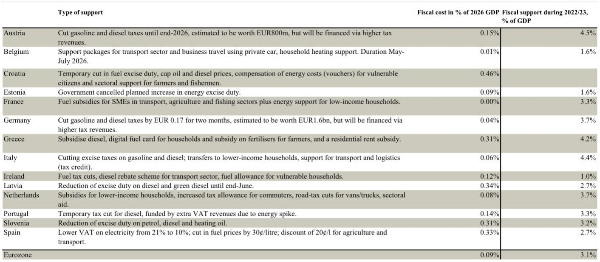
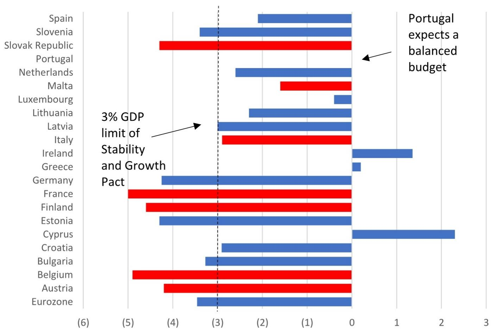
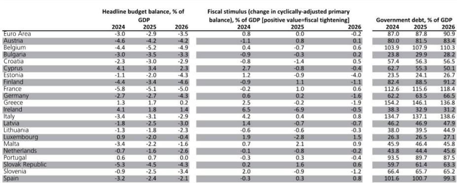

# 欧元区2026年财政的真实底色：扩张全靠德国，紧缩才是多数国家的选择

市场对欧洲财政扩张的叙事正在变得过于简单。2026年欧元区财政预算计划揭示了一个与“集体大放水”印象截然不同的图景：整体赤字率将从2.9%上升至3.5%，但这一扩张几乎完全由德国一国驱动。法国、意大利、西班牙这三个核心经济体，实际上都在规划财政紧缩。这份来自某外资投行的研报，通过对21个欧元区国家最新预算计划的系统汇总，给出了一个值得所有关注欧洲资产定价的人重新审视的判断——欧元区的财政故事，本质上是一个德国的故事，而德国能否兑现其庞大的财政扩张承诺，才是决定2026年欧洲增长路径的关键变量。

这不是一份简单的数据汇总。它拆解了各国财政脉冲的方向、力度与结构，并揭示了财政乘数效应在不同支出类型上的显著差异。对于正在重新评估欧洲风险溢价、利率路径和行业配置的投资者而言，理解这份预算计划背后的“非对称性”，比知道一个笼统的赤字数字重要得多。

## 1. 2026年欧元区财政脉冲仅为0.2%GDP，且完全系于德国一国的执行

根据各国提交的年度进展报告，2026年欧元区经周期调整的初级财政赤字（CAPB）将扩大约0.2个百分点，这标志着自2021年以来首次出现财政宽松。但这一数字远低于市场此前部分预期，也低于某外资投行自身预测的0.3%GDP。更关键的是，德国一国就贡献了0.5个百分点的宽松力度，而法国、意大利、西班牙各自贡献了0.1个百分点的紧缩，恰好抵消了德国以外的全部扩张。换句话说，如果剔除德国，欧元区2026年的财政立场实际上是略微紧缩的。

这意味着什么？当前市场对欧洲财政扩张的定价，隐含了一个“德国必然执行”的前提假设。但预算计划只是计划，执行才是现实。德国联邦支出在第一季度确实出现了由国防开支驱动的显著上升，但全年能否维持这一节奏，仍然需要逐季跟踪。某外资投行专门为此建立了“德国财政刺激追踪器”，足以说明这一变量的核心地位。对于利率和汇率交易者而言，德国预算执行的任何偏差，都可能引发欧元区增长预期的重新校准。

## 2. 赤字扩大的国家不足一半，紧缩才是多数经济体的主动选择

在21个欧元区国家中，只有11个国家预计2026年赤字上升，9个国家计划下降，1个保持不变。赤字上升幅度最大的两个国家是德国（+1.6个百分点至4.3%）和爱沙尼亚（+2.3个百分点至4.3%）。而正处于超额赤字程序中的法国、意大利和西班牙，则分别计划将赤字率压缩0.1、0.2和0.3个百分点。

这一分布揭示了一个被忽视的结构性特征：欧元区的财政纪律框架正在发挥作用，尤其是在那些债务负担较重、市场融资成本敏感的国家。法国赤字率仍将高达5%，但方向是收窄；意大利能否在2025年将赤字控制在3%以下，将决定其是否能够退出超额赤字程序。这些国家的财政紧缩，并非出于主动选择，而是制度约束与市场压力的共同结果。对于持有欧洲主权债券的投资者而言，这既是信用风险缓释的信号，也意味着这些国家的内需增长将面临额外拖累。

## 3. 财政乘数的差异，决定了同样的脉冲力度带来不同的增长效果

某外资投行在报告中给出了一个关键的分析框架：不同类型的财政支出，其乘数效应差异显著。国防支出的乘数约为0.7，而基础设施投资的乘数约为1.0。这意味着，同样是0.2%GDP的财政脉冲，如果主要由基础设施投资驱动，其对GDP的拉动效果可能接近0.2个百分点；如果主要由国防支出驱动，效果则只有约0.14个百分点。

德国的大规模财政包恰好同时包含这两类支出。根据预算计划，2026年德国赤字扩张的1.6个百分点中，相当一部分将流向国防和基础设施。但报告同时指出，某外资投行自己的预测（30个基点的GDP拉动）高于预算计划隐含的约20个基点，原因就在于他们假设法国、意大利、西班牙的实际紧缩力度会小于预算案中的数字。这种“预期差”本身就是一个值得追踪的交易主题：如果南欧国家实际执行了比预算更紧的财政，那么欧元区增长可能低于当前共识；反之，如果紧缩力度不及计划，则增长可能超预期。

## 4. RRF拨款提供了额外缓冲，但2027年的断层风险尚未被定价

除了各国预算内的财政支出，欧盟复苏基金（RRF）的拨款同样构成2026年的财政支持。截至2026年第一季度，全部计划拨付额的69%已经完成。预计2026年RRF拨款将从2025年的0.2%欧盟GDP上升至0.3%，相当于在各国预算的0.2%宽松之外，再额外增加约0.1个百分点的刺激。

但这里存在一个尚未被充分讨论的问题：RRF的法定拨付周期将在2026年底结束。报告谨慎地指出，部分拨款可能实际延至2027年，或者2026年最后一批拨付的时间点过晚，实质上应被计入2027年的财政支持。这意味着，2027年可能出现一个财政支持的“断层”——各国预算内的扩张能否接力RRF的退出，目前没有任何国家给出明确承诺。对于关注欧洲中期增长路径的投资者而言，这个2027年的财政悬崖，比2026年的脉冲方向更值得深思。

## 5. 报告尚未完全回答的关键问题：能源冲击的财政响应为何如此克制？

一个引人注目的数据点是，2026年欧元区各国为应对能源价格冲击而新增的财政支持，平均仅为GDP的0.09%，远低于2022-2023年期间3.1%的规模。报告将其描述为“温和”，并指出这些措施大多通过提高其他税收来融资，因此对赤字的影响有限。

但报告并未完全解释这种克制背后的逻辑。是能源价格回落使得补贴需求自然下降？还是各国财政空间在经历了过去几年的扩张后已显著收窄？抑或是政治周期的影响——2026年部分国家面临选举，财政扩张的意愿可能受到约束？这些问题的答案，将直接影响市场对欧元区财政可持续性的评估。如果能源价格再次出现波动，各国是否还有足够的财政余力做出响应？这个假设条件的变化，可能是未来某个时点重新定价欧洲风险溢价的关键触发因素。

## 6. 一个更值得关注的观察框架：财政脉冲的国别分化正在重塑欧洲资产的定价逻辑

将上述分析综合起来，可以提炼出一个用于跟踪欧洲资产定价的分析框架。第一，德国的预算执行进度是2026年欧元区增长预期的最重要单一变量。某外资投行的德国财政刺激追踪器值得持续关注。第二，法国、意大利、西班牙的实际紧缩力度与预算计划的偏差，构成了欧元区增长的超预期或低预期来源。第三，RRF拨付节奏与2027年的断层风险，决定了中期财政支持的可持续性。第四，能源冲击响应规模的急剧收缩，暗示各国财政空间的约束比表面数字显示的更为刚性。

对于权益投资者而言，德国本土敞口较高的行业（如工业、基建、国防）可能受益于财政扩张，而南欧内需敏感型行业则面临财政紧缩的逆风。对于利率投资者而言，德国国债供给增加与南欧国债供给减少的错位，可能重塑欧元区内部利差的结构。这些都不是遥远的推演，而是2026年正在发生的资产定价重组。

欢迎来星球微信群里继续讨论。关于德国财政包的逐季执行追踪、南欧国家实际紧缩力度的实时估算，以及RRF拨款节奏变化对具体行业的影响，这些在报告中只能点到为止的细节，我们会在社群中持续更新和拆解。如果你正在重新评估欧洲资产的配置逻辑，这些跟踪框架或许能帮你比市场更早看到拐点。

Personal reading notes and learning share only. Not investment advice.

