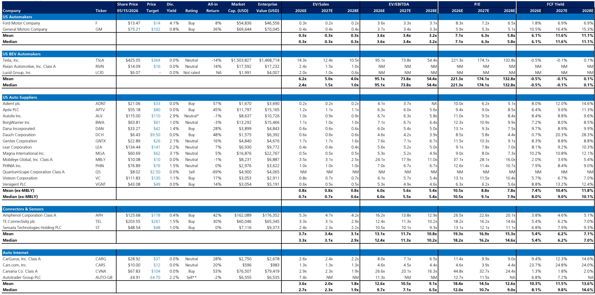
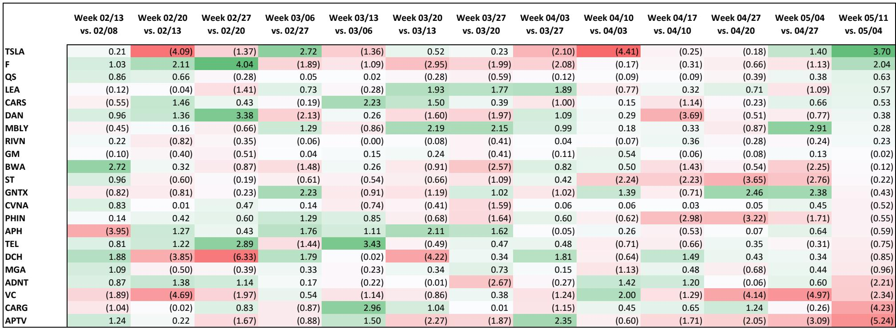
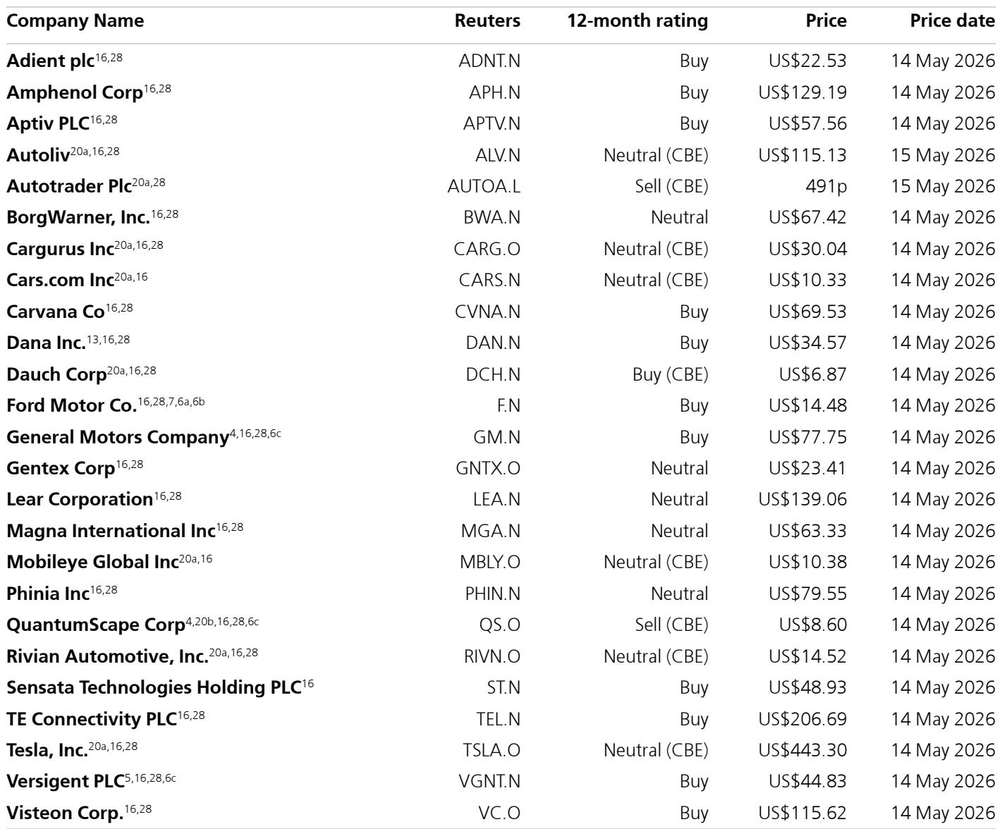

# The Auto Cycle Is Weakening, But the Real Opportunity Lies in the Non-Auto AI Re-rating of Suppressed Valuations

The global automotive production outlook has deteriorated more than most suppliers anticipated, yet the market's response reveals a critical strategic divergence. Over the past week, S&P Global Mobility revised its 2026 global production forecast downward by 0.5 percentage points, now projecting a 2.4% year-over-year decline versus the prior estimate of 1.8%. While this adjustment keeps the overall decline within the 2% range that most suppliers had already guided toward, the distribution of the cuts tells a more concerning story. The reduction is heavily concentrated in the second through fourth quarters of 2026, where production now shows a 1.2% year-over-year decline, translating to a 2.6% drop over the remaining nine months of the forecast period. The first quarter of 2026 was actually revised upward by 1.6%, driven primarily by China but also supported by the Middle East, South Asia, and Europe. This creates a misleading narrative: the apparent strength in early 2026 was not organic demand improvement but rather production pulled forward as original equipment manufacturers sought to guard against potential feedstock and parts shortages. The cyclical headwinds are real, but they are also unevenly distributed, and this asymmetry creates the investment opportunity.

The critical insight for investors is that the production cuts are not uniformly damaging. Approximately 41% of the downward revision over the remaining three quarters of 2026 is concentrated in China, with 16% in South Asia, 13% each in Europe and Japan/Korea, and only 5% in North America. For suppliers with significant North American exposure, the mix of these cuts is actually favorable relative to their peers. This geographic dispersion matters because it means that the macro-driven weakness is not a blanket negative for the entire supplier ecosystem. The real question is whether the market has properly discounted this asymmetry or whether it is treating all auto-exposed names with equal skepticism. The evidence from recent price action suggests the latter, which creates the conditions for selective re-rating.

The most important development in the auto equity landscape is not the production forecast itself but the emergence of a new valuation catalyst: the ability of auto companies to credibly attach themselves to non-auto themes, particularly artificial intelligence and data center infrastructure. This is not a temporary market enthusiasm. It represents a structural shift in how investors should evaluate auto-related equities, and it demands a fundamental rethinking of portfolio construction in this sector.

## The Production Forecast Cut Is Worse Than It Looks, But Not for the Reasons the Market Thinks

The S&P Global Mobility revision requires careful unpacking because the headline number obscures the underlying dynamics that matter for investment decisions. The 0.5 percentage point cut to the 2026 global production forecast is not the full story. The revision is front-loaded into the first quarter, which was raised by 1.6%, creating the illusion of stabilization. But this first-quarter strength is not organic. According to the report, there is early evidence that production is being pulled forward as OEMs hedge against potential supply disruptions. This means that what looks like demand recovery is actually inventory pre-positioning, and it comes at the expense of later quarters.

The second-order implication is that the second half of 2026 could be weaker than even the revised forecasts suggest. If the pull-forward effect is more pronounced than currently estimated, the subsequent quarters will face an even steeper decline as the pre-built inventory is absorbed. This creates a risk that the current consensus estimates for supplier earnings in the back half of 2026 may still be too optimistic. The market has not yet fully priced this sequential deterioration because the first-quarter strength provided a temporary cover.

However, the sector-level analysis misses the most important strategic point. The production cuts are not uniform across regions, and this geographic divergence has profound implications for which suppliers are actually at risk. North America accounts for only 5% of the downward revision, or approximately 42,000 units. For suppliers with heavy North American exposure, the production environment is actually more stable than the global headline suggests. The models used by many analysts are already below the S&P forecasts for China and Europe by approximately 1% and 0.4% respectively, while being higher on North America. This means that the actual earnings risk for North American-centric suppliers may already be partially discounted.

The more concerning development is the 2027 forecast. S&P cut 2027 production by 1.3%, now showing only 0.8% year-over-year growth, with more sizable cuts in North America and Europe. This matters because 2027 is the year when many suppliers were expecting a meaningful recovery. If the macro-driven cuts persist into 2027, the earnings recovery thesis that supports current valuations for several suppliers is undermined. The report notes that the cuts were primarily macro-driven with some caution on supply shortages, and that the macro factor still has time to change. The deliberate nature of the cut suggests that S&P chose to take a larger reduction now to avoid the potential for a drawn-out series of small downward revisions. This actually sets up the potential for positive revisions if macro concerns ease, but it also means that the current baseline is more conservative than it might otherwise be.

## The Auto AI Trade Is Not Dead; It Is Migrating to Companies That Can Credibly Bridge to Non-Auto End Markets

The most significant strategic development in the auto equity space is the market's willingness to re-rate companies that can demonstrate credible exposure to non-auto growth themes, particularly AI and data center infrastructure. The recent price action in Ford and BorgWarner illustrates this phenomenon clearly. These names rallied on the back of narratives around battery energy storage systems and other non-auto applications, even as the broader auto supplier complex declined. The key question is whether this is a sustainable re-rating or a temporary enthusiasm that will fade as the production headwinds intensify.

The evidence suggests this is a structural shift, not a transient phenomenon. The reason is straightforward: the valuation of many auto-related names has been compressed to levels where even modest non-auto growth optionality becomes a powerful catalyst. When a company trades at 0.3x sales and 3.6x EBITDA, as Ford does, the incremental value of a credible non-auto growth story is enormous relative to the base business. The market is effectively pricing these companies as if their auto businesses are in terminal decline. If a company can demonstrate that it has a viable growth platform outside of autos, the valuation multiple can expand significantly without requiring any improvement in the core auto business.

The Ford example is instructive but also cautionary. The company's battery energy storage opportunity is real and differentiated. Its relationship with CATL provides technology access that competitors are unlikely to replicate given the current geopolitical environment. The PTC qualification lowers its cost structure, and the product appears to be FEOC compliant, making it eligible for ITC 48E incentives for customers. These factors together create a potential competitive moat in what is currently a fragmented value chain. The company has the potential to offer a cell-through-installation solution that captures value across multiple stages of the BESS value chain.

However, even the most enthusiastic supporters of this thesis must acknowledge the risk of excess optimism. The CEO has indicated active customer contracting and significant inbound interest, but commercial-scale production at Kentucky is not scheduled until the fourth quarter of 2027. There is a long gap between current enthusiasm and actual revenue generation. The market's willingness to look through this gap is a sign of how desperate for non-auto growth narratives the investor base has become. The sell-off on Friday following the initial rally is a healthy reminder that even the best narratives can become overextended in the short term.

The more interesting question is which other auto-related companies have similar optionality that the market has not yet fully priced. The report identifies Aptiv and Sensata as high on the list of potential beneficiaries from this theme. The logic is compelling: these companies have existing capabilities in sensors, connectors, and electrical architectures that are directly applicable to data center and AI infrastructure applications. The market has been valuing them primarily on their auto exposure, but their technology portfolios have significant non-auto applications. If they can credibly communicate this optionality, the valuation re-rating could be substantial.

## Connector Companies Offer the Best Risk-Reward in the Auto-Adjacent Universe Because Their AI Exposure Is Known but Undervalued

The connector and sensor space represents a particularly interesting opportunity because the AI exposure is more established and debated, but the valuation support is becoming increasingly attractive. Amphenol and TE Connectivity have both seen significant multiple compression over the past three months, with their stocks declining 15% while the S&P 500 gained 9%. This divergence has created a situation where these high-quality industrial companies are trading at valuations that begin to discount a significant slowdown in their end markets.

The debate around these names centers on the shift from copper to optical interconnects in data center applications. As AI computing clusters scale, the bandwidth requirements are pushing data centers toward optical solutions, which could reduce the addressable market for copper-based connectors. This is a legitimate concern, but it may be overstated. The transition to optical is likely to be gradual and incomplete, with copper continuing to play a significant role in shorter-reach applications. Furthermore, Amphenol's portfolio includes significant optical capabilities through its CSS (Cable Systems and Solutions) business, which positions it well to capture value regardless of the technology pathway.

The early feedback from investors suggests more comfort with Amphenol than with TE Connectivity on this issue. This is understandable given Amphenol's stronger positioning in optical, but it may also reflect a narrower view of the opportunity. TE Connectivity has a broader industrial exposure that provides diversification benefits, and its valuation has compressed to levels that already discount a significant downturn. At 12.4x 2026 EBITDA and 18.2x 2026 earnings, TE is pricing in a level of earnings risk that may not materialize if the AI infrastructure buildout continues at its current pace.

The more important point is that both companies have positive earnings revision biases over the coming years. The structural growth in data center connectivity demand is not a cyclical phenomenon; it is a secular trend driven by the buildout of AI computing infrastructure. The current valuation compression is a cyclical phenomenon driven by auto production concerns and general macro uncertainty. This creates a disconnect between near-term sentiment and medium-term fundamentals that is precisely the type of setup that generates attractive risk-adjusted returns.

The challenge for investors is that the connector names are not pure auto plays. They have significant exposure to industrial, aerospace, and defense markets that provide diversification. The auto exposure is meaningful but not dominant. This means that the auto production headwinds are a partial story, not the full narrative. The market's tendency to group all auto-adjacent names together creates opportunities for selective investors who can distinguish between companies with genuine cyclical exposure and those with diversified secular growth profiles.

## The Report Leaves a Critical Question Unanswered: How Much of the Current Valuation Compression Is Cyclical Versus Structural?

The most important analytical gap in the current debate is the distinction between cyclical and structural factors driving the auto supplier valuation compression. The production forecast cuts are clearly cyclical. They reflect macro uncertainty, inventory adjustments, and the normal ebb and flow of the auto cycle. But there is also a structural component to the valuation compression that may be more persistent.

The structural concern is the long-term viability of the internal combustion engine supply chain as the industry transitions toward electric vehicles. Many suppliers have significant exposure to ICE-specific components that may face permanent demand erosion over the next decade. The market may be rationally discounting this structural decline, and the current valuations may reflect not just near-term cyclical weakness but also a reassessment of long-term terminal values.

The report does not explicitly address this distinction, and it is a critical gap for investors to resolve. If the current valuation compression is primarily cyclical, then the opportunity to buy high-quality suppliers at depressed multiples is compelling. If it is primarily structural, then the valuation floor may be lower than current levels, and the re-rating thesis is flawed.

The evidence is mixed. On one hand, the valuation multiples for many suppliers are at levels that historically have marked cyclical bottoms. On the other hand, the structural transition to EVs is real and accelerating, and many suppliers have not yet demonstrated that their business models can adapt. The companies that are most likely to succeed are those that can demonstrate technology optionality that extends beyond the traditional ICE supply chain. This is precisely why the non-auto AI theme is so important: it provides a bridge from the declining legacy business to a growing secular opportunity.

Investors should focus on companies that have three characteristics: first, a core business that is not entirely dependent on ICE volumes; second, technology capabilities that are transferable to non-auto applications; and third, valuations that already discount a significant downturn in their end markets. The connector companies meet all three criteria. Some of the traditional suppliers may also qualify, but the burden of proof is on them to demonstrate that their technology portfolios have genuine non-auto applications.

## A Decision Framework for Navigating the Auto-Adjacent Opportunity

For investors trying to position in this complex environment, a structured decision framework is essential. The first question is geographic exposure. Companies with heavy North American exposure are less vulnerable to the current production cuts than those with significant China or Europe exposure. The geographic mix of the S&P forecast revisions is clear: North America is the least affected region, and this is unlikely to change in the near term.

The second question is technology optionality. Companies that can credibly demonstrate non-auto applications for their core technologies have a valuation catalyst that is independent of the auto cycle. The market is willing to pay a premium for this optionality, as the recent price action in Ford and BorgWarner demonstrates. The key is credibility: the non-auto opportunity must be real and material, not a marketing narrative.

The third question is valuation support. The current multiples for many suppliers are at levels that provide significant downside protection if the auto cycle stabilizes. The connector companies, in particular, are approaching valuation levels that historically have marked attractive entry points. The combination of valuation support, positive earnings revision bias, and secular growth optionality creates a compelling risk-reward profile.

The fourth question is balance sheet strength. In a cyclical downturn, companies with strong balance sheets have the flexibility to invest through the cycle, acquire distressed assets, and return capital to shareholders. The current environment will likely separate the winners from the losers based on financial strength as much as strategic positioning.

The fifth question is management credibility. The ability to execute on non-auto growth initiatives requires management teams that can communicate a clear strategy and deliver results. The market is increasingly skeptical of auto suppliers that promise transformation without evidence. Companies that can demonstrate tangible progress in non-auto markets will be rewarded; those that cannot will continue to trade at depressed multiples.

## The Full Report Contains the Specific Data and Charts That Enable Precise Positioning

The analysis above provides a strategic framework, but the specific investment decisions require granular data on company-level exposures, valuation comparisons, and earnings revision trends. The original report contains detailed valuation comp sheets, performance charts, and production forecast data that enable investors to identify the specific names that best fit the framework described here.

The comp sheet in particular provides a comprehensive view of how different companies are trading relative to their earnings power. The EV/EBITDA multiples for the supplier group range from 4.1x to 7.6x for 2026, with most names trading below 6x. These are levels that historically have provided attractive entry points for investors with a two-to-three year time horizon. The free cash flow yields are also compelling, with several names offering yields above 8% for 2027.

The performance charts reveal the divergence that has emerged over the past three months. While the auto supplier index has declined, certain names have rallied on the non-auto AI theme. This dispersion creates both opportunity and risk. The opportunity is to identify which companies have genuine non-auto optionality that the market has not yet fully priced. The risk is that the enthusiasm for the AI theme leads to overvaluation of names that cannot deliver on the promise.

The production forecast data provides the foundation for earnings modeling. The S&P numbers are the industry standard, and understanding the geographic and quarterly distribution of the cuts is essential for building accurate earnings forecasts. The report notes that the analyst's own models are already below S&P for China and Europe, which suggests that the earnings risk from the production cuts may be partially discounted for some names.

Join the community to read the full report and review the original charts.

*This article is for learning and discussion only and does not constitute investment advice.*

Personal reading notes and learning share only. Not investment advice.

