# Asia Fund Manager Survey

# From growth concerns to AI conviction

# BofA April Asia Fund Manager Survey

Spotlight: The MSCI Asia Pacific Index has rallied 17.6% since its March low to reach record highs, driven by strong optimism in AI-exposed markets such as Japan, Taiwan, and Korea (the top three preferred markets among FMS investors). Taiwan is viewed as the clearest beneficiary of the next phase of the AI cycle. Meanwhile, concerns around energy security have eased materially MoM (from 91% to 52%).

Macro: Growth expectations remain negative but have improved significantly MoM (from net 55% to 5%). Net 81% now expect higher inflation. 67% of investors see the next BoJ rate hike as most likely in Jun, consistent with our economist's view (see Japan Watch note).

Expected Returns: Expected 12-month returns for APAC ex-Japan equities have rebounded sharply to 6.0%, while expected returns for Japan equities rise to 6.9% (all-time high). Notably, fewer investors think AI-driven equity upside is priced in or over-valued.

Themes: Within China, AI/semis remain the top investor priorities, in line with our recent China Conference takeaways (see report: Equity Strategy – China: China Conference feedback, 15 May 2026), while Internet has seen improving preference MoM. In Japan, earnings are cited by the largest share of investors (38%) as the primary driver of Japan equity prospects. Net 71% (up from 14% two months ago) expect a stronger semis cycle, putting it in the 91st percentile of history (see US Semiconductors: AI 2030 report).

Positioning: Japan, Taiwan & Korea have further consolidated their leadership in investor preference. India is viewed as the first market to be reduced across APAC if global growth weakens further. Within APAC ex-Japan, May saw rotation out of Energy and Consumer Staples into Consumer Discretionary (ex Retailing), Real Estate, and Software.

Exhibit 1: Taiwan is seen as the clearest beneficiary of the next phase of the AI cycle   
FMS views on beneficiaries of the next phase of the AI cycle   
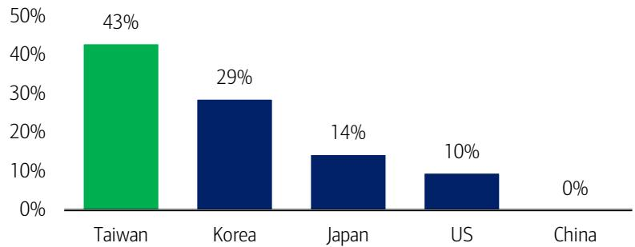

bar

| Country | Percentage (%) |
| :--- | :--- |
| Taiwan | 43 |
| Korea | 29 |
| Japan | 14 |
| US | 10 |
| China | 0 |

Source: BofA Asia Fund Manager Survey. Note: Votes for 'Don't know' are not shown above

BofA GLOBAL RESEARCH

Trading ideas and investment strategies discussed herein may give rise to significant risk and are not suitable for all investors. Investors should have experience in relevant markets and the financial resources to absorb any losses arising from applying these ideas or strategies.

>> Employed by a non-US affiliate of BofAS and is not registered/qualified as a research analyst under the FINRA rules.

Refer to "Other Important Disclosures" for information on certain BofA entities that take responsibility for the information herein in particular jurisdictions.

BofA does and seeks to do business with issuers covered in its research reports. As a result, investors should be aware that the firm may have a conflict of interest that could affect the objectivity of this report. Investors should consider this report as only a single factor in making their investment decision.

Refer to important disclosures on page 16 to 18.

12975729

# 19 May 2026

Equity Strategy

Asia Pacific

BofA

Data

Analytics

Kaspar Lam >>

Research Analyst

BofA (Hong Kong)

kaspar.lam@bofa.com

Masashi Akutsu >>

Strategist

BofAS Japan

masashi.akutsu@bofa.com

Winnie Wu >>

Research Analyst

BofA (Hong Kong)

winnie.wu@bofa.com

Amish Shah, CFA >>

Research Analyst

BofAS India

shah.amish@bofa.com

FMS: Fund Manager Survey

APAC: Asia Pacific

# Notes to readers

A total of 200 panelists with \$517bn AUM participated in the May survey. 170 participants with \$461bn AUM responded to the Global FMS questions and 92 participants with \$209bn AUM responded to the Regional FMS questions.

Survey period: 8 May – 14 May 2026

# How to join the FMS panel

Investors/clients are encouraged to sign up to participate in the Survey. This can be done by contacting Michael Hartnett or your BofA sales representative.

Participants in the survey receive the full set of results for the months in which they participate.

BoJ – Bank of Japan

# Macro

Exhibit 2: Growth expectations stay in negative territory, but have eased significantly compared to last month   
Net % expecting a stronger Global / APAC ex-Japan economy   
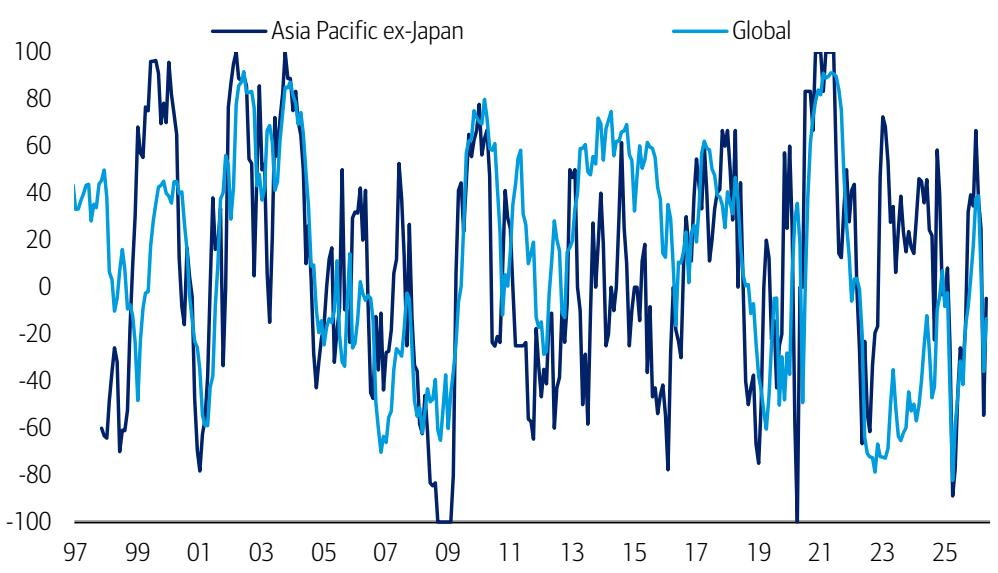

line

| Year | Asia Pacific ex-Japan | Global |
|------|------------------------|--------|
| 97   | ~35                    | ~40    |
| 99   | ~95                    | ~45    |
| 01   | ~-80                   | ~-60   |
| 03   | ~100                   | ~85    |
| 05   | ~-40                   | ~-20   |
| 07   | ~-20                   | ~-40   |
| 09   | ~-100                  | ~-60   |
| 11   | ~-20                   | ~-40   |
| 13   | ~-60                   | ~-20   |
| 15   | ~-40                   | ~-20   |
| 17   | ~-80                   | ~-40   |
| 19   | ~-60                   | ~-20   |
| 21   | ~100                   | ~90    |
| 23   | ~-80                   | ~-60   |
| 25   | ~-60                   | ~-40   |

Source: BofA Global & Asia Fund Manager Survey   
BofA GLOBAL RESEARCH

Exhibit 3: Inflation expectations remain elevated, with a net 81% of respondents anticipating higher inflation over the next 12 months, the highest level since Apr 2022   
Net % expecting higher inflation in Asia Pacific ex-Japan in the next 12 months   
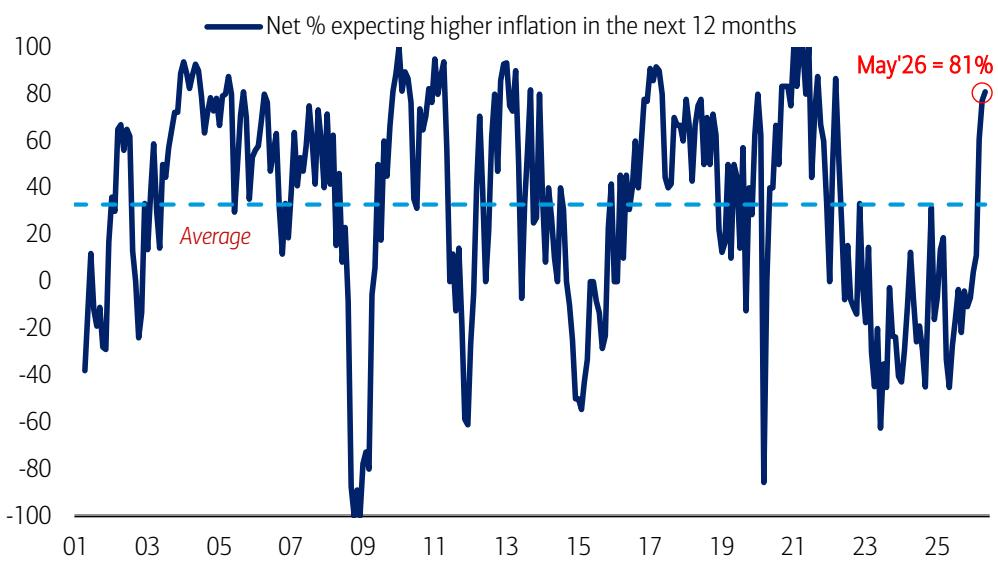

line

| Year | Net % expecting higher inflation |
| ---- | -------------------------------- |
| 2026 | 81%                            |

Source: BofA Asia Fund Manager Survey   
BofA GLOBAL RESEARCH

Exhibit 4: Corporate profit expectations have swung sharply, with a net 33% now expecting stronger profits (from net 45% expecting weaker)   
Net % expecting better corporate profits in Asia Pacific ex-Japan in the next 12 months   
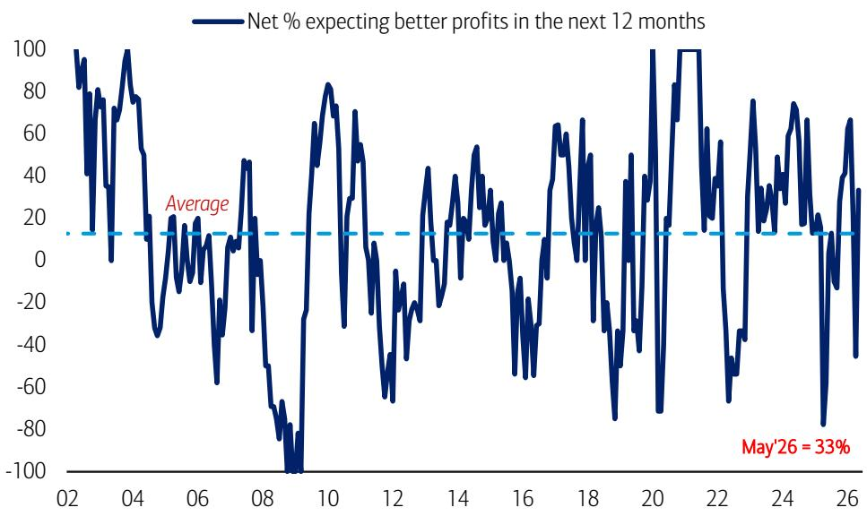

line

| Month | Net % expecting better profits |
|-------|--------------------------------|
| May'26 | 33%                            |

Source: BofA Asia Fund Manager Survey   
BofA GLOBAL RESEARCH

Exhibit 5: Concern that APAC ex-Japan earnings estimates are too high eased slightly in May
Net % deeming consensus EPS estimates for the coming year as high   

line

| Year | Net % deeming consensus EPS estimates for the coming year as high | Asia Pac ex-Japan 1m ERR, inverted, RHS |
|------|------------------------------------------------------------------------|------------------------------------------|
| 08   | ~95%                                                                   | ~0.4                                     |
| 10   | ~-30%                                                                  | ~0.6                                     |
| 12   | ~80%                                                                   | ~0.5                                     |
| 14   | ~50%                                                                   | ~0.4                                     |
| 16   | ~100%                                                                  | ~0.3                                     |
| 18   | ~40%                                                                   | ~0.2                                     |
| 20   | ~95%                                                                   | ~0.1                                     |
| 22   | ~70%                                                                   | ~0.3                                     |
| 24   | ~30%                                                                   | ~0.4                                     |
| 26   | ~20%                                                                   | ~0.5                                     |

Source: BofA Asia Fund Manager Survey   
BofA GLOBAL RESEARCH

Exhibit 6: Energy security concerns have declined materially MoM (from 91% to 52%)   
How concerned are you about energy security risks for APAC region in current geopolitical environment?   
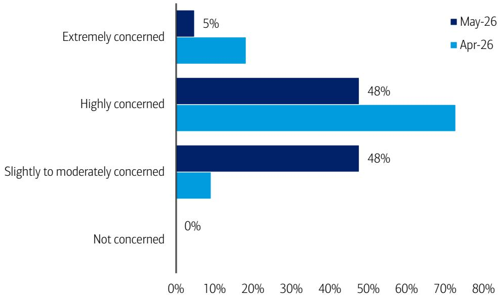

bar

| Concern Level              | May-26 | Apr-26 |
| -------------------------- | ------ | ------ |
| Extremely concerned        | 5%     | 19%    |
| Highly concerned           | 48%    | 73%    |
| Slightly to moderately concerned | 48%    | 10%    |
| Not concerned              | 0%     | 0%     |

Source: BofA Asia Fund Manager Survey. Notes: Votes for ‘Don’t know’ are not shown above.   
BofA GLOBAL RESEARCH

Exhibit 7: China growth sentiment remains negative, but improved vs. last month   
Net % expecting a stronger Chinese economy in the next 12 months   
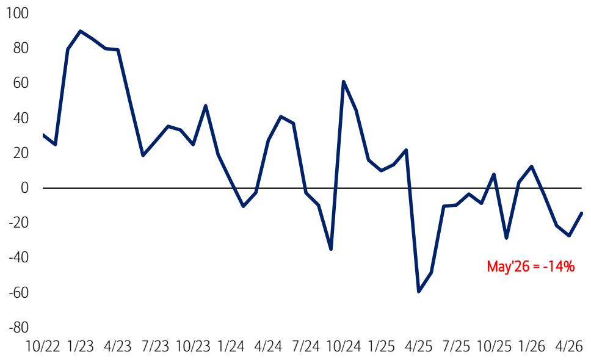

line

| Date   | Value |
|--------|-------|
| May'26 | -14%  |

Source: BofA Asia Fund Manager Survey   
BofA GLOBAL RESEARCH

Exhibit 8: Japan growth expectations bounce back strongly in May, though still below the highs seen earlier in the year   
Net % expecting a stronger Japanese economy over the next 12 months   
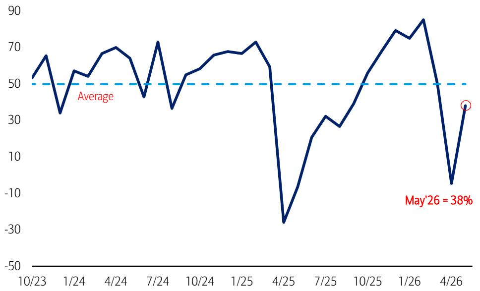

line

| Date   | Value |
|--------|-------|
| May'26 | 38%   |

Source: BofA Asia Fund Manager Survey. Notes: Votes for 'Don't know' are not shown above.   
BofA GLOBAL RESEARCH

# Exhibit 9: Investors expect the next rate hike to be most likely in June

When do you think the BOJ next rate hike will be?

When do you think the BOJ next rate hike will be?   
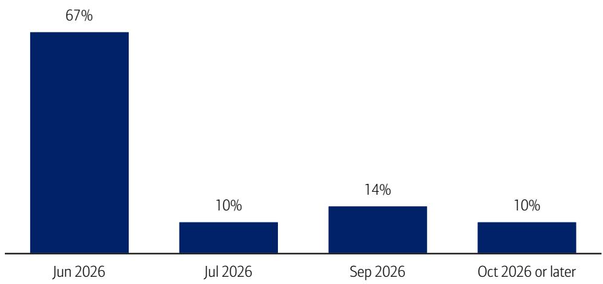

bar

| Period | Percentage (%) |
| :--- | :--- |
| Jun 2026 | 67 |
| Jul 2026 | 10 |
| Sep 2026 | 14 |
| Oct 2026 or later | 10 |

Source: BofA Asia Fund Manager   
BofA GLOBAL RESEARCH

# Expected Returns and Valuations

Exhibit 10: Investor optimism picked up again after the April dip, with expected returns moving back above average   
FMS views on expected upside for Asia Pac ex-Japan equities over the next 12 months   
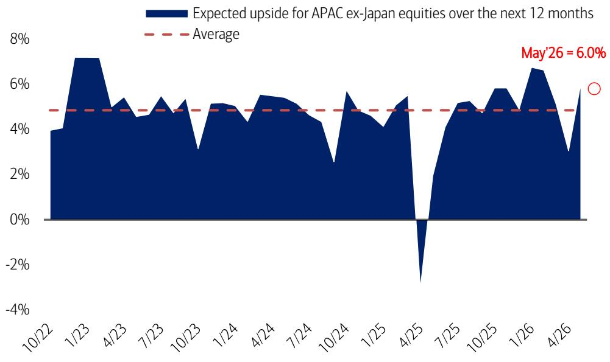

area

| Date   | Expected upside for APAC ex-Japan equities over the next 12 months |
|--------|------------------------------------------------------------------|
| May'26 | 6.0%                                                             |

Source: BofA Asia Fund Manager Survey   
BofA GLOBAL RESEARCH

Exhibit 11: Japan return expectations have climbed to an all-time high of 6.9%   
FMS views on expected upside for Japan equities over the next 12 months   
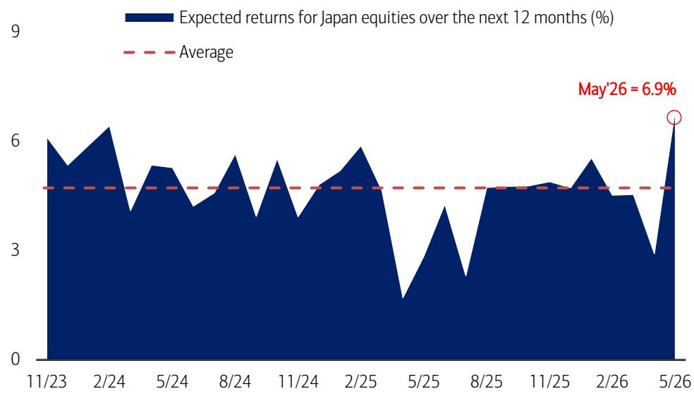

line

| Date   | Expected returns for Japan equities over the next 12 months (%) |
|--------|---------------------------------------------------------------|
| May'26 | 6.9%                                                          |

Source: BofA Asia Fund Manager Survey   
BofA GLOBAL RESEARCH

Exhibit 12: Sentiment is tilted toward undervaluation   
Net % saying Asia Pacific ex-Japan equities are overvalued   
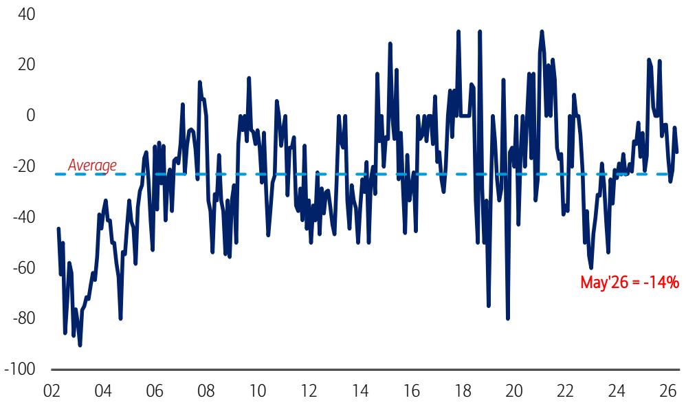

line

| Year | Value |
| ---- | ----- |
| May'26 | -14% |

Source: BofA Asia Fund Manager Survey   
BofA GLOBAL RESEARCH

Exhibit 13: Investors appear more constructive on AI upside in May, with fewer viewing AI as fully or broadly fairly priced in   
How much of the positive AI impact on equities is already reflected in the price?   
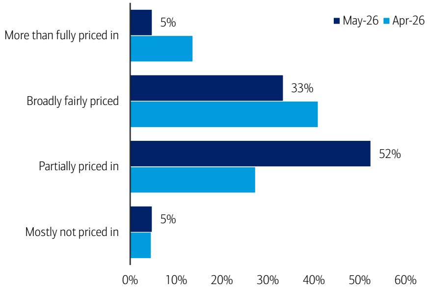

bar

| Pricing Status | May-26 (%) | Apr-26 (%) |
|---|---|---|
| More than fully priced in | 5 | 14 |
| Broadly fairly priced | 33 | 41 |
| Partially priced in | 52 | 28 |
| Mostly not priced in | 5 | 4 |

Source: BofA Asia Fund Manager Survey. Note: Votes for 'Don't know' are not shown above   
BofA GLOBAL RESEARCH

# Themes

Exhibit 14: Within China, AI/semis and buybacks/dividend remain key investor priorities, while Internet has seen improving preference vs. last month   
FMS views on TWO most favorite themes in China   
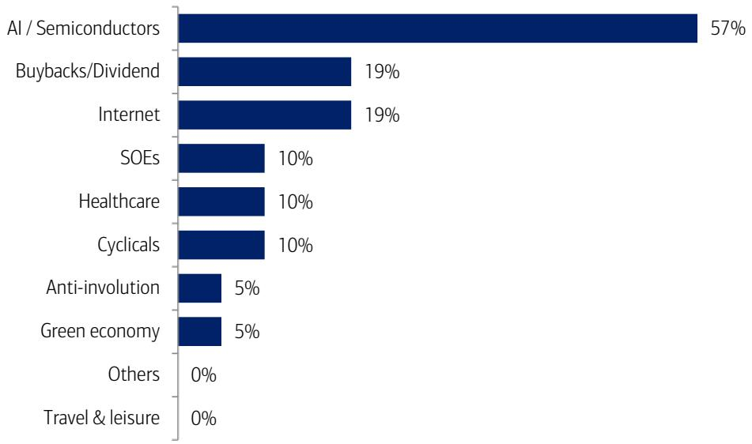

bar

| Category | Value (%) |
| :--- | :--- |
| AI / Semiconductors | 57 |
| Buybacks/Dividend | 19 |
| Internet | 19 |
| SOEs | 10 |
| Healthcare | 10 |
| Cyclicals | 10 |
| Anti-involution | 5 |
| Green economy | 5 |
| Others | 0 |
| Travel & leisure | 0 |

Source: BofA Asia Fund Manager Survey. Note: Votes for 'Don't know' are not shown above   
BofA GLOBAL RESEARCH

Exhibit 15: Earnings have now become the primary driver of Japan equity prospects   
FMS views on the themes that hold the key for Japan equities in the near-to-medium term   
Key themes for Japan equities in the near-to-medium term   
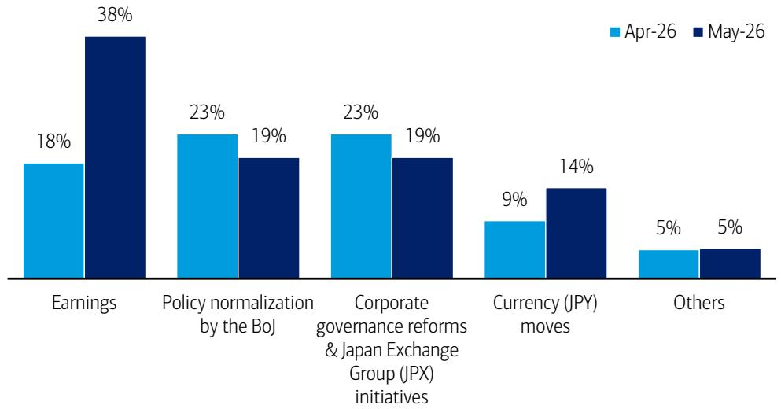

bar

| Category | Apr-26 (%) | May-26 (%) |
|---|---|---|
| Earnings | 18 | 38 |
| Policy normalization by the BoJ | 23 | 19 |
| Corporate governance reforms & Japan Exchange Group (JPX) initiatives | 23 | 19 |
| Currency (JPY) moves | 9 | 14 |
| Others | 5 | 5 |

Source: BofA Asia Fund Manager Survey. Notes: Votes for 'Don't know' are not shown above   
BofA GLOBAL RESEARCH

Exhibit 16: Investor views on the Korea/Taiwan semis cycle strengthened materially in last 2 months, putting it in the 91st percentile of history   
FMS views on the semis cycle (Korea/Taiwan exports growth) over the next 12 months   
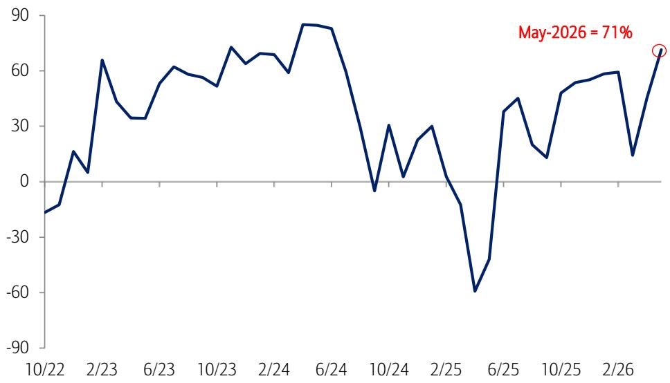

line

| Date   | Value |
|--------|-------|
| May-2026 | 71%   |

Source: BofA Asia Fund Manager Survey   
BofA GLOBAL RESEARCH

Exhibit 17: Investors turned more positive on Korea's ‘Corporate Value Program’, post the election FMS views on the efficacy of the ‘Corporate Value-Up Program’ in Korea   
FMS view of the efficacy of the ‘Corporate Value-Up Program’ in Korea   
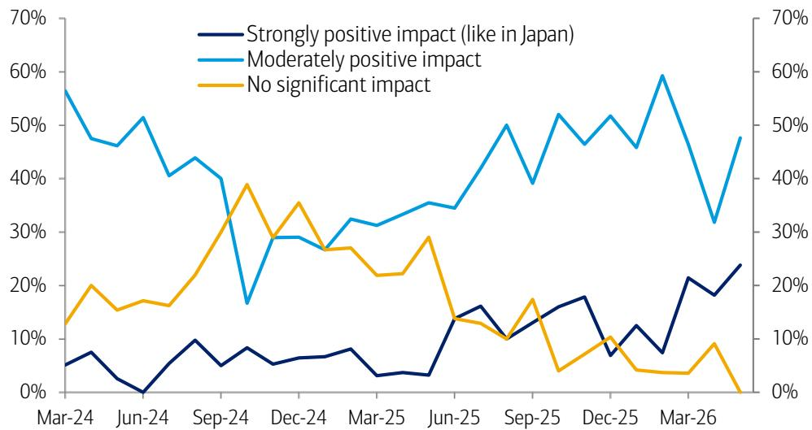

line

| Date   | Strongly positive impact (like in Japan) | Moderately positive impact | No significant impact |
|--------|------------------------------------------|-----------------------------|------------------------|
| Mar-24 | 5%                                       | 57%                         | 13%                    |
| Jun-24 | 0%                                       | 47%                         | 16%                    |
| Sep-24 | 10%                                      | 40%                         | 39%                    |
| Dec-24 | 6%                                       | 29%                         | 35%                    |
| Mar-25 | 8%                                       | 32%                         | 27%                    |
| Jun-25 | 3%                                       | 35%                         | 29%                    |
| Sep-25 | 15%                                      | 50%                         | 10%                    |
| Dec-25 | 18%                                      | 47%                         | 10%                    |
| Mar-26 | 24%                                      | 60%                         | 9%                     |

Source: BofA Asia Fund Manager Survey. Note: Votes for 'Don't know' are not shown above   
BofA GLOBAL RESEARCH

Exhibit 18: The absence of a clear AI play is cited as the primary concern for the Indian market   
What is your key concern for Indian market?   
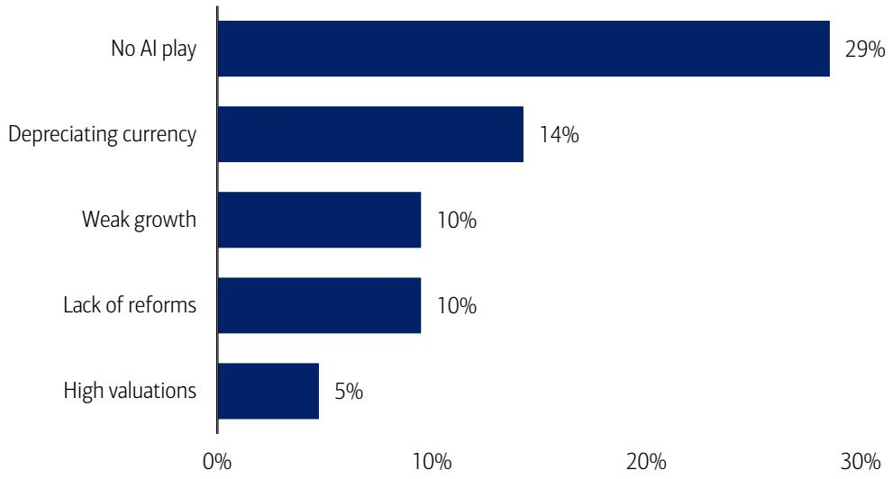

bar

| Category | Value (%) |
|---|---|
| No AI play | 29 |
| Depreciating currency | 14 |
| Weak growth | 10 |
| Lack of reforms | 10 |
| High valuations | 5 |

Source: BofA Asia Fund Manager Survey. Note: Votes for 'Don't know' are not shown above   
BofA GLOBAL RESEARCH

# Positioning

Exhibit 19: Japan, Taiwan and Korea consolidated their leadership even further, reinforcing a more concentrated North Asia overweight   
Asia Pacific market sentiment: Net % overweight   
Asia Pacific market sentiment: Net % overweight (% saying overweight - % saying underweight)   
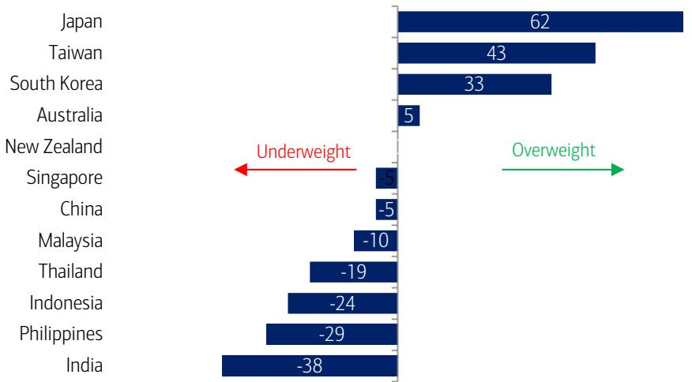

bar

| Country | Value |
| :--- | :--- |
| Japan | 62 |
| Taiwan | 43 |
| South Korea | 33 |
| Australia | 5 |
| New Zealand | -5 |
| Singapore | -5 |
| China | -5 |
| Malaysia | -10 |
| Thailand | -19 |
| Indonesia | -24 |
| Philippines | -29 |
| India | -38 |
Underweight (red arrow) < Lowerweight (green arrow) Overweight (green arrow)

Source: BofA Asia Fund Manager Survey   
BofA GLOBAL RESEARCH

Exhibit 20: India is viewed as the first one to be reduced across APAC if global growth deteriorates further, in line with its largest underweight positioning   
If global growth weakens further, you would first reduce exposure to...?   
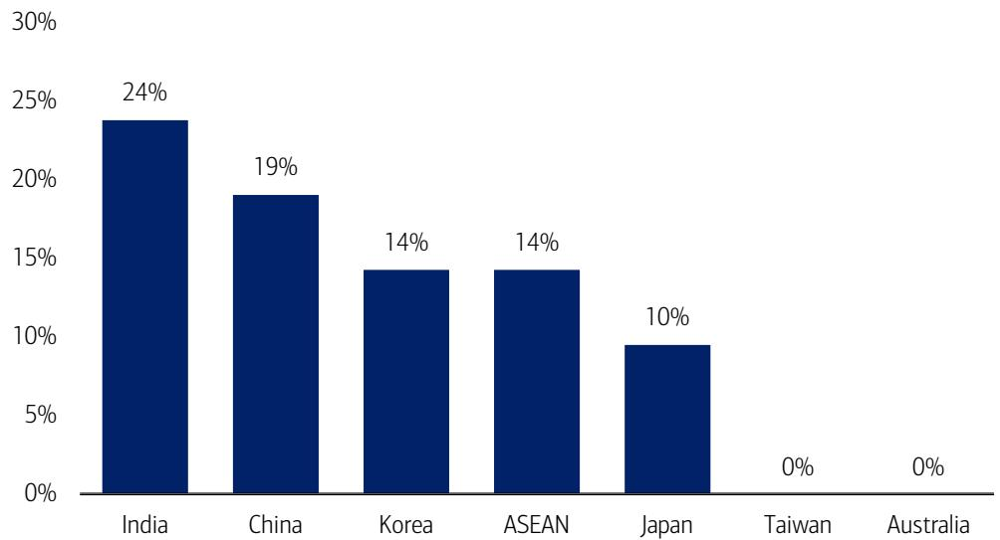

bar

| Country/Region | Percentage (%) |
| :--- | :--- |
| India | 24 |
| China | 19 |
| Korea | 14 |
| ASEAN | 14 |
| Japan | 10 |
| Taiwan | 0 |
| Australia | 0 |

Source: BofA Asia Fund Manager Survey. Note: Votes for ‘Don't know / Not applicable’ are not shown above   
BofA GLOBAL RESEARCH

Exhibit 21: FMS investors most overweight in Semis and Tech Hardware, while Materials and Software saw increased positioning

Asia Pacific ex-Japan sector sentiment: Net % overweight

Asia Pacific ex-Japan sector sentiment: Net % FMS investors overweight (% saying overweight - % saying underweight)   
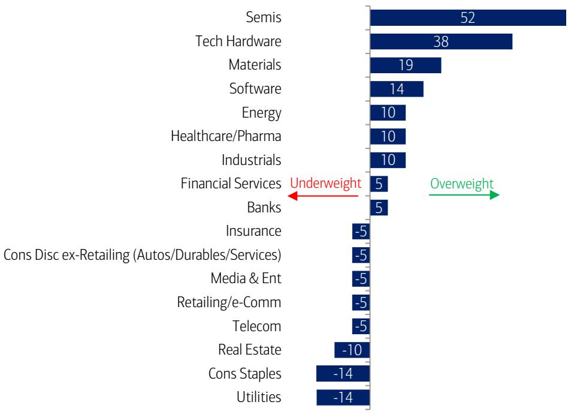

bar

| Sector | Value |
| :--- | :--- |
| Semis | 52 |
| Tech Hardware | 38 |
| Materials | 19 |
| Software | 14 |
| Energy | 10 |
| Healthcare/Pharma | 10 |
| Industrials | 10 |
| Financial Services | 5 |
| Banks | 5 |
| Insurance | -5 |
| Cons Disc ex-Retailing (Autos/Durables/Services) | -5 |
| Media & Ent | -5 |
| Retailing/e-Comm | -5 |
| Telecom | -5 |
| Real Estate | -10 |
| Cons Staples | -14 |
| Utilities | -14 |

Source: BofA Asia Fund Manager Survey   
BofA GLOBAL RESEARCH   
Monthly change in FMS investor positioning

Exhibit 22: May saw rotation out of Energy and Consumer Staples into Consumer Discretionary (ex Retailing), Real Estate, and Software

APAC ex-Japan sector sentiment: MoM ppt change in FMS investor positioning   
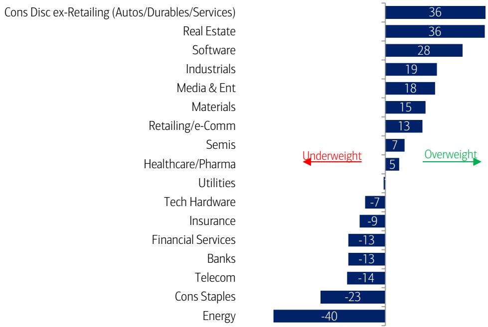

bar

| Sector | Value |
| :--- | :--- |
| Cons Disc ex-Retailing (Autos/Durables/Services) | 36 |
| Real Estate | 36 |
| Software | 28 |
| Industrials | 19 |
| Media & Ent | 18 |
| Materials | 15 |
| Retailing/e-Comm | 13 |
| Semis | 7 |
| Healthcare/Pharma | 5 |
| Utilities | 0 |
| Tech Hardware | -7 |
| Insurance | -9 |
| Financial Services | -13 |
| Banks | -13 |
| Telecom | -14 |
| Cons Staples | -23 |
| Energy | -40 |
Underweight is marked by a red arrow; Overweight is marked by a green arrow.

Source: BofA Asia Fund Manager Survey   
BofA GLOBAL RESEARCH

Exhibit 23: Semiconductors, an AI play, and Banks, a key beneficiary of higher interest rates, continue to remain investor favorites in Japan   
FMS opinion on the two most overweight sectors in Japan   
FMS opinion on the two most overweight sectors in Japan   
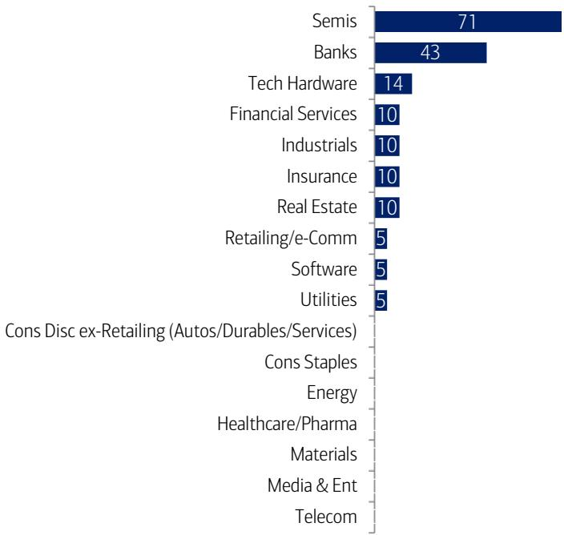

bar

| Sector | Value |
| :--- | :--- |
| Semis | 71 |
| Banks | 43 |
| Tech Hardware | 14 |
| Financial Services | 10 |
| Industrials | 10 |
| Insurance | 10 |
| Real Estate | 10 |
| Retailing/e-Comm | 5 |
| Software | 5 |
| Utilities | 5 |
| Cons Disc ex-Retailing (Autos/Durables/Services) | |
| Cons Staples | |
| Energy | |
| Healthcare/Pharma | |
| Materials | |
| Media & Ent | |
| Telecom | |

Source: BofA Asia Fund Manager Survey   
BofA GLOBAL RESEARCH

# Regional survey demographics data

Exhibit 24: Position / institution / approach of participants in the regional survey

Demographics details for regional Fund Manager Survey participants

<table><tr><td></td><td>May-26</td><td>Apr-26</td><td>Mar-26</td></tr><tr><td colspan="4">Structure of the panel - by position</td></tr><tr><td>Chief Investment Officer</td><td>11</td><td>9</td><td>12</td></tr><tr><td>Asset Allocator / Strategist / Economist</td><td>14</td><td>17</td><td>20</td></tr><tr><td>Portfolio Manager</td><td>60</td><td>55</td><td>63</td></tr><tr><td>Other</td><td>7</td><td>9</td><td>8</td></tr><tr><td colspan="4">Structure of the panel - by expertise</td></tr><tr><td>Regional specialists + EM specialists only</td><td>30</td><td>23</td><td>29</td></tr><tr><td>Regional specialists with a global view</td><td>62</td><td>67</td><td>74</td></tr><tr><td>Total # of respondents to regional questions</td><td>92</td><td>90</td><td>103</td></tr><tr><td colspan="4">Which of the following best describes the type of money you are running?</td></tr><tr><td>Institutional funds (e.g. pension funds / insurance companies)</td><td>20</td><td>28</td><td>27</td></tr><tr><td>Hedge funds / proprietary trading desks</td><td>16</td><td>11</td><td>17</td></tr><tr><td>Mutual funds / unit trusts / investment trusts</td><td>45</td><td>42</td><td>49</td></tr><tr><td>None of the above</td><td>11</td><td>9</td><td>10</td></tr><tr><td colspan="4">What do you estimate to be the total current value of assets under your direct control?</td></tr><tr><td>Up to $250mn</td><td>17</td><td>15</td><td>17</td></tr><tr><td>Around $500mn</td><td>13</td><td>9</td><td>11</td></tr><tr><td>Around $1bn</td><td>13</td><td>14</td><td>18</td></tr><tr><td>Around $2.5bn</td><td>18</td><td>16</td><td>20</td></tr><tr><td>Around $5bn</td><td>9</td><td>11</td><td>12</td></tr><tr><td>Around $7.5bn</td><td>2</td><td>4</td><td>2</td></tr><tr><td>Around $10bn or more</td><td>8</td><td>10</td><td>9</td></tr><tr><td>No funds under my direct control</td><td>12</td><td>11</td><td>14</td></tr><tr><td>Total (USD bn)</td><td>209</td><td>247</td><td>243</td></tr><tr><td colspan="4">What best describes your investment time horizon at this moment?</td></tr><tr><td>3 months or less</td><td>30</td><td>31</td><td>37</td></tr><tr><td>6 months</td><td>28</td><td>16</td><td>26</td></tr><tr><td>9 months</td><td>7</td><td>10</td><td>8</td></tr><tr><td>12 months or more</td><td>24</td><td>30</td><td>29</td></tr><tr><td>Weighted average</td><td>6.8</td><td>7.3</td><td>6.9</td></tr><tr><td>Don&#x27;t know</td><td>3</td><td>3</td><td>3</td></tr><tr><td colspan="4">Which region do you specialise in?</td></tr><tr><td>US / North America</td><td>24</td><td>21</td><td>27</td></tr><tr><td>Europe / Continental Europe / Eurozone / UK</td><td>31</td><td>24</td><td>28</td></tr><tr><td>Asia Pacific / Asia Pacific ex Japan / Japan</td><td>21</td><td>22</td><td>28</td></tr><tr><td>South Africa</td><td>12</td><td>16</td><td>16</td></tr><tr><td>MENA (Middle East and North Africa)</td><td>0</td><td>2</td><td>0</td></tr><tr><td>None of the above</td><td>4</td><td>5</td><td>4</td></tr><tr><td colspan="4">Source: BofA Fund Manager Survey</td></tr></table>

BofA GLOBAL RESEARCH

# Special Disclosures

In accordance with the SEBI (Foreign Portfolio Investors) Regulations, 2019 and with guidelines issued by the Securities and Exchange Board of India (SEBI), foreign investors (individuals as well as institutional) that wish to transact the common stock of Indian companies must have applied to, and have been approved as per SEBI (Foreign Portfolio Investors) Regulations, 2019. Each investor who proposes to transact common stock of Indian companies will be required to obtain Foreign Portfolio Investor (FPI) registration as per SEBI (Foreign Portfolio Investors) Regulations, 2019. Certain other entities are also entitled to transact common stock of Indian companies under the Indian laws relating to investment by foreigners. BofA reserves the right to refuse to provide a copy of research on common stock of Indian companies to a person not resident in India. American Depositary Receipts (ADR) representing such common stock are not subject to these Indian law restrictions and may be transacted by investors in accordance with the applicable laws of the relevant jurisdiction. Global Depository Receipts (GDR) and the Global Depository Shares (GDS) of Indian companies, Indian limited liability corporations, have not been registered under the U.S. Securities Act of 1933, as amended, and may only be transacted by persons in the United States who are Qualified Institutional Buyers (QIBs) within the meaning of Rule 144A under the Securities Act. Accordingly, no copy of any research report on Indian companies' GDRs or GDSs will be made available to persons who are not QIBs.

BofA India Limited (BofAS India) is regulated by the Securities and Exchange Board of India (SEBI) and provides the following services in India: Research, Equity Sales & Trading, Futures & Options, Electronic Trading, Equity Capital Markets, Debt Capital Markets and M&A. SEBI Registration Nos. Research Analyst: INH000000503, Stock Broking: INZ000217333 (Trading and Clearing Member of NSE and BSE – Capital Markets and Equity Derivatives), Merchant Banker: INM000011625, CIN U74140MH1975PLC018618.
Registration granted by SEBI, Research Analyst Administration and Supervisory Body (RAASB) of BSE Limited and accreditation from National Institute of Securities Markets (NISM) in no way guarantee performance of the intermediary or provide any assurance of returns to investors.
BofAS India's registered office is at Ground Floor, A Wing, One BKC, G Block, Bandra Kurla Complex, Bandra (East), Mumbai 400 051, India, Tel: +91 22 6632 8000 and the contact details of its Compliance Officer (Shervin Purohit) are: Tel: (91-22) 6632 8853, Email: shervin.purohit@bofa.com. For specific grievances, if any, please contact the Grievance Officer (Amish Shah) and contact details are: Tel: (91-22) 6632 8000, Email: dg.rsch\_in\_complaint@bofa.com or visit Research-BofA India Regulatory Information for further details on the grievance redressal mechanism.

# Disclosures

# Important Disclosures

FUNDAMENTAL EQUITY OPINION KEY: Opinions include a Volatility Risk Rating, an Investment Rating and an Income Rating. VOLATILITY RISK RATINGS, indicators of potential price fluctuation, are: A - Low, B - Medium and C - High. INVESTMENT RATINGS reflect the analyst's assessment of both a stock's absolute total return potential as well as its attractiveness for investment relative to other stocks within its Coverage Cluster (defined below). Our investment ratings are: 1 - Buy stocks are expected to have a total return of at least 10% and are the most attractive stocks in the coverage cluster; 2 - Neutral stocks are expected to remain flat or increase in value and are less attractive than Buy rated stocks and 3 - Underperform stocks are the least attractive stocks in a coverage cluster. An investment rating of 6 (No Rating) indicates that a stock is no longer trading on the basis of fundamentals. Analysts assign investment ratings considering, among other things, the 0-12 month total return expectation for a stock and the firm's guidelines for ratings dispersions (shown in the table below). The current price objective for a stock should be referenced to better understand the total return expectation at any given time. The price objective reflects the analyst's view of the potential price appreciation (depreciation).

<table><tr><td>Investment rating</td><td>Total return expectation (within 12-month period of date of initial rating)</td><td>Ratings dispersion guidelines for coverage cluster $^{R1}$ </td></tr><tr><td>Buy</td><td>≥ 10%</td><td>≤ 70%</td></tr><tr><td>Neutral</td><td>≥ 0%</td><td>≤ 30%</td></tr><tr><td>Underperform</td><td>N/A</td><td>≥ 20%</td></tr></table>

$^{R1}$ Ratings dispersions may vary from time to time where BofA Global Research believes it better reflects the investment prospects of stocks in a Coverage Cluster.

INCOME RATINGS, indicators of potential cash dividends, are: 7 - same/higher (dividend considered to be secure), 8 - same/lower (dividend not considered to be secure) and 9 - pays no cash dividend. Coverage Cluster is comprised of stocks covered by a single analyst or two or more analysts sharing a common industry, sector, region or other classification(s). A stock's coverage cluster is included in the most recent BofA Global Research report referencing the stock.

Due to the nature of strategic analysis, the issuers or securities recommended or discussed in this report are not continuously followed. Accordingly, investors must regard this report as providing stand-alone analysis and should not expect continuing analysis or additional reports relating to such issuers and/or securities.

BofA Global Research personnel (including the analyst(s) responsible for this report) receive compensation based upon, among other factors, the overall profitability of BofA Corporation, including profits derived from investment banking. The analyst(s) responsible for this report may also receive compensation based upon, among other factors, the overall profitability of the Bank's sales and trading businesses relating to the class of securities or financial instruments for which such analyst is responsible.

# Other Important Disclosures

Prices are indicative and for information purposes only. Except as otherwise stated in the report, for any recommendation in relation to an equity security, the price referenced is the publicly traded price of the security as of close of business on the day prior to the date of the report or, if the report is published during intraday trading, the price referenced is indicative of the traded price as of the date and time of the report and in relation to a debt security (including equity preferred and CDS), prices are indicative as of the date and time of the report and are from various sources including BofA trading desks.

The date and time of completion of the production of any recommendation in this report shall be the date and time of dissemination of this report as recorded in the report timestamp.

Recipients who are not institutional investors or market professionals should seek the advice of their independent financial advisor before considering information in this report in connection with any investment decision, or for a necessary explanation of its contents.

Officers of BofAS or one or more of its affiliates (other than research analysts) may have a financial interest in securities of the issuer(s) or in related investments.

Refer to BofA Global Research policies relating to conflicts of interest.

"BofA" includes BofA, Inc. ("BofAS") and its affiliates. Investors should contact their BofA representative or Merrill Global Wealth Management financial advisor if they have questions concerning this report or concerning the appropriateness of any investment idea described herein for such investor. "BofA" is a global brand for BofA Global Research.

Information relating to Non-US affiliates of BofA and Distribution of Affiliate Research Reports:

BofAS and/or BofA, Pierce, Fenner & Smith Incorporated ("MLPF&S") may in the future distribute, information of the following non-US affiliates in the US (short name: legal name, regulator): BofA (South Africa): BofA South Africa (Pty) Ltd., regulated by the Financial Sector Conduct Authority; MLI (UK): BofA International, regulated by the Financial Conduct Authority (FCA) and the Prudential Regulation Authority (PRA); BofASE (France): BofA Europe SA is authorized by the Autorité de Contrôle Prudentiel et de Résolution (ACPR) and regulated by the ACPR and the Autorité des Marchés Financiers (AMF). BofA Europe SA ("BofASE") with registered address at 51, rue La Boétie, 75008 Paris is registered under no 842 602 690 RCS Paris. In accordance with the provisions of French Code Monétaire et Financier (Monetary and Financial Code), BofASE is an établissement de crédit et d'investissement (credit and investment institution) that is authorised and supervised by the European Central Bank and the Autorité de Contrôle Prudentiel et de Résolution (ACPR) and regulated by the ACPR and the Autorité des Marchés Financiers. BofASE's share capital can be found at www.bofaml.com/BofASEdisclaimer; BofA Europe (Milan): BofA Europe Designated Activity Company, Milan Branch, regulated by the Bank of Italy, the European Central Bank (ECB) and the Central Bank of Ireland (CBI); BofA Europe (Frankfurt): BofA Europe Designated Activity Company, Frankfurt Branch regulated by BaFin, the ECB and the CBI; BofA Europe (Zurich): BofA Europe Designated Activity Company, Zurich Branch, regulated by the Swiss Financial Market Supervisory Authority FINMA, the ECB and CBI; BofA Europe (Madrid): BofA Europe Designated Activity Company, Sucursal en España, regulated by the Bank of Spain, the ECB and the CBI; BofA (Australia): BofA Equities (Australia) Limited, regulated by the Australian Securities and Investments Commission; BofA (Hong Kong): BofA (Asia Pacific) Limited, regulated by the Hong Kong Securities and Futures Commission (HKSFC); BofA (Singapore): BofA (Singapore) Pte Ltd, regulated by the Monetary Authority of Singapore (MAS); BofA (Canada): BofA Canada Inc, regulated by the Canadian Investment Regulatory Organization; BofA (Mexico): BofA Mexico, SA de CV, Casa de Bolsa, regulated by the Comisión Nacional Bancaria y de Valores; BofAS Japan: BofA Japan Co., Ltd., regulated by the Financial Services Agency; BofA (Seoul): BofA International, LLC Seoul Branch, regulated by the Financial Supervisory Service; BofA (Taiwan): BofA (Taiwan) Ltd., regulated by the Securities and Futures Bureau; BofAS India: BofA India Limited, regulated by the Securities and Exchange Board of India (SEBI); BofA (Israel): BofA Israel Limited, regulated by Israel Securities Authority; BofA (DIFC): BofA International (DIFC Branch), regulated by the Dubai Financial Services Authority (DFSA); BofA (Brazil): BofA S.A. Corretora de Títulos e Valores Mobiliários, regulated by Comissão de Valores Mobiliários; BofA KSA Company: BofA Kingdom of Saudi Arabia Company, regulated by the Capital Market Authority. This information: has been approved for publication and is distributed in the United Kingdom (UK) to professional clients and eligible counterparties (as each is defined in the rules of the FCA and the PRA) by MLI (UK), which is authorized by the PRA and regulated by the FCA and the PRA - details about the extent of our regulation by the FCA and PRA are available from us on request; has been approved for publication and is distributed in the European Economic Area (EEA) by BofASE (France), which is authorized by the ACPR and regulated by the ACPR and the AMF; has been considered and distributed in Japan by BofAS Japan, a registered securities dealer under the Financial Instruments and Exchange Act in Japan, or its permitted affiliates; is issued and distributed in Hong Kong by BofA (Hong Kong) which is regulated by HKSFC; is issued and distributed in Taiwan by BofA (Taiwan); is issued and distributed in India by BofAS India; and is issued and distributed in Singapore to institutional investors and/or accredited investors (each as defined under the Financial Advisers Regulations) by BofA (Singapore) (Company Registration No 198602883D). BofA (Singapore) is regulated by MAS. BofA Equities (Australia) Limited (ABN 65 006 276 795), AFS License 235132 (MLEA) distributes this information in Australia only to 'Wholesale' clients as defined by s.761G of the Corporations Act 2001. With the exception of BofA N.A., Australia Branch, neither MLEA nor any of its affiliates involved in preparing this information is an Authorised Deposit-Taking Institution under the Banking Act 1959 nor regulated by the Australian Prudential Regulation Authority. No approval is required for publication or distribution of this information in Brazil and its local distribution is by BofA (Brazil) in accordance with applicable regulations. BofA (DIFC) is authorized and regulated by the DFSA. Information prepared and issued by BofA (DIFC) is done so in accordance with the requirements of the DFSA conduct of business rules. BofA Europe (Frankfurt) distributes this information in Germany and is regulated by BaFin, the ECB and the CBI. BofA entities, including BofA Europe and BofASE (France), may outsource/delegate the marketing and/or provision of certain research services or aspects of research services to other branches or members of the BofA group. You may be contacted by a different BofA entity acting for and on behalf of your service provider where permitted by applicable law. This does not change your service provider. Please refer to the Electronic Communications Disclaimers for further information.

This information has been prepared and issued by BofAS and/or one or more of its non-US affiliates. The author(s) of this information may not be licensed to carry on regulated activities in your jurisdiction and, if not licensed, do not hold themselves out as being able to do so. BofAS and/or MLPF&S is the distributor of this information in the US and accepts full responsibility for information distributed to BofAS and/or MLPF&S clients in the US by its non-US affiliates. Any US person receiving this information and wishing to effect any transaction in any security discussed herein should do so through BofAS and/or MLPF&S and not such foreign affiliates. Hong Kong recipients of this information should contact BofA (Asia Pacific) Limited in respect of any matters relating to dealing in securities or provision of specific advice on securities or any other matters arising from, or in connection with, this information. Singapore recipients of this information should contact BofA (Singapore) Pte Ltd in respect of any matters arising from, or in connection with, this information. For clients that are not accredited investors, expert investors or institutional investors BofA (Singapore) Pte Ltd accepts full responsibility for the contents of this information distributed to such clients in Singapore.

# General Investment Related Disclosures:

Taiwan Readers: Neither the information nor any opinion expressed herein constitutes an offer or a solicitation of an offer to transact in any securities or other financial instrument. No part of this report may be used or reproduced or quoted in any manner whatsoever in Taiwan by the press or any other person without the express written consent of BofA. This document provides general information only, and has been prepared for, and is intended for general distribution to, BofA clients. Neither the information nor any opinion expressed constitutes an offer or an invitation to make an offer, to buy or sell any securities or other financial instrument or any derivative related to such securities or instruments (e.g., options, futures, warrants, and contracts for differences). This document is not intended to provide personal investment advice and it does not take into account the specific investment objectives, financial situation and the particular needs of, and is not directed to, any specific person(s). This document and its content do not constitute, and should not be considered to constitute, investment advice for purposes of ERISA, the US tax code, the Investment Advisers Act or otherwise. Investors should seek financial advice regarding the appropriateness of investing in financial instruments and implementing investment strategies discussed or recommended in this document and should understand that statements regarding future prospects may not be realized. Any decision to purchase or subscribe for securities in any offering must be based solely on existing public information on such security or the information in the prospectus or other offering document issued in connection with such offering, and not on this document.

Securities and other financial instruments referred to herein, or recommended, offered or sold by BofA, are not insured by the Federal Deposit Insurance Corporation and are not deposits or other obligations of any insured depository institution (including, BofA, N.A.). Investments in general and, derivatives, in particular, involve numerous risks, including, among others, market risk, counterparty default risk and liquidity risk. No security, financial instrument or derivative is suitable for all investors. Digital assets are extremely speculative, volatile and are largely unregulated. In some cases, securities and other financial instruments may be difficult to value or sell and reliable information about the value or risks related to the security or financial instrument may be difficult to obtain. Investors should note that income from such securities and other financial instruments, if any, may fluctuate and that price or value of such securities and instruments may rise or fall and, in some cases, investors may lose their entire principal investment. Past performance is not necessarily a guide to future performance. Levels and basis for taxation may change.

This report may contain a short-term trading idea or recommendation, which highlights a specific near-term catalyst or event impacting the issuer or the market that is anticipated to have a short-term price impact on the equity securities of the issuer. Short-term trading ideas and recommendations are different from and do not affect a stock's fundamental equity rating, which reflects both a longer term total return expectation and attractiveness for investment relative to other stocks within its Coverage Cluster. Short-term trading ideas and recommendations may be more or less positive than a stock's fundamental equity rating.

BofA is aware that the implementation of the ideas expressed in this report may depend upon an investor's ability to "short" securities or other financial instruments and that such action may be limited by regulations prohibiting or restricting "shortselling" in many jurisdictions. Investors are urged to seek advice regarding the applicability of such regulations prior to executing any short idea contained in this report.

Foreign currency rates of exchange may adversely affect the value, price or income of any security or financial instrument mentioned herein. Investors in such securities and instruments, including ADRs, effectively assume currency risk.

BofAS or one of its affiliates is a regular issuer of traded financial instruments linked to securities that may have been recommended in this report. BofAS or one of its affiliates may, at any time, hold a trading position (long or short) in the securities and financial instruments discussed in this report.

BofA, through business units other than BofA Global Research, may have issued and may in the future issue trading ideas or recommendations that are inconsistent with, and reach different conclusions from, the information presented herein. Such ideas or recommendations may reflect different time frames, assumptions, views and analytical methods of the persons who prepared them, and BofA is under no obligation to ensure that such other trading ideas or recommendations are brought to the attention of any recipient of this information. In the event that the recipient received this information pursuant to a contract between the recipient and BofAS for the provision of research services for a separate fee, and in connection therewith BofAS may be deemed to be acting as an investment adviser, such status relates, if at all, solely to the person with whom BofAS has contracted directly and does not extend beyond the delivery of this report (unless otherwise agreed specifically in writing by BofAS). If such recipient uses the services of BofAS in connection with the sale or purchase of a security referred to herein, BofAS may act as principal for its own account or as agent for another person. BofAS is and continues to act solely as a broker-dealer in connection with the execution of any transactions, including transactions in any securities referred to herein.

# Copyright and General Information:

Copyright 2026 BofA Corporation. All rights reserved. iQdatabase® is a registered service mark of BofA Corporation. This information is prepared for the use of BofA clients and may not be redistributed, retransmitted or disclosed, in whole or in part, or in any form or manner, without the express written consent of BofA. This document and its content is provided solely for informational purposes and cannot be used for training or developing artificial intelligence (AI) models or as an input in any AI application (collectively, an AI tool). Any attempt to utilize this document or any of its content in connection with an AI tool without explicit written permission from BofA Global Research is strictly prohibited. BofA Global Research utilizes AI, including machine learning and other technologies, to enhance the services we provide to our clients. These technologies assist our analysts in various aspects of their work, including but not limited to data analysis, content extraction, content creation, data aggregation and summarization and identifying relevant information from diverse sources. All AI-driven processes are subject to review by BofA Global Research employees. BofA Global Research information is distributed simultaneously to internal and client websites and other portals by BofA and is not publicly-available material. Any unauthorized use or disclosure is prohibited. Receipt and review of this information constitutes your agreement not to redistribute, retransmit, or disclose to others the contents, opinions, conclusion, or information contained herein (including any investment recommendations, estimates or price targets) without first obtaining express permission from an authorized officer of BofA.

Materials prepared by BofA Global Research personnel are based on public information. Facts and views presented in this material have not been reviewed by, and may not reflect information known to, professionals in other business areas of BofA, including investment banking personnel. BofA has established information barriers between BofA Global Research and certain business groups. As a result, BofA does not disclose certain client relationships with, or compensation received from, such issuers. To the extent this material discusses any legal proceeding or issues, it has not been prepared as nor is it intended to express any legal conclusion, opinion or advice. Investors should consult their own legal advisers as to issues of law relating to the subject matter of this material. BofA Global Research personnel's knowledge of legal proceedings in which any BofA entity and/or its directors, officers and employees may be plaintiffs, defendants, co-defendants or co-plaintiffs with or involving issuers mentioned in this material is based on public information. Facts and views presented in this material that relate to any such proceedings have not been reviewed by, discussed with, and may not reflect information known to, professionals in other business areas of BofA in connection with the legal proceedings or matters relevant to such proceedings.

This information has been prepared independently of any issuer of securities mentioned herein and not in connection with any proposed offering of securities or as agent of any issuer of any securities. None of BofAS any of its affiliates or their research analysts has any authority whatsoever to make any representation or warranty on behalf of the issuer(s). BofA Global Research policy prohibits research personnel from disclosing a recommendation, investment rating, or investment thesis for review by an issuer prior to the publication of a research report containing such rating, recommendation or investment thesis.

Any information relating to sustainability in this material is limited as discussed herein and is not intended to provide a comprehensive view on any sustainability claim with respect to any issuer or security.

Any information relating to the tax status of financial instruments discussed herein is not intended to provide tax advice or to be used by anyone to provide tax advice. Investors are urged to seek tax advice based on their particular circumstances from an independent tax professional.

The information herein (other than disclosure information relating to BofA and its affiliates) was obtained from various sources and we do not guarantee its accuracy. This information may contain links to third-party websites. BofA is not responsible for the content of any third-party website or any linked content contained in a third-party website. Content contained on such third-party websites is not part of this information and is not incorporated by reference. The inclusion of a link does not imply any endorsement by or any affiliation with BofA. Access to any third-party website is at your own risk, and you should always review the terms and privacy policies at third-party websites before submitting any personal information to them. BofA is not responsible for such terms and privacy policies and expressly disclaims any liability for them.

All opinions, projections and estimates constitute the judgment of the author as of the date of publication and are subject to change without notice. Prices also are subject to change without notice. BofA is under no obligation to update this information and BofA ability to publish information on the subject issuer(s) in the future is subject to applicable quiet periods. You should therefore assume that BofA will not update any fact, circumstance or opinion contained herein.

Certain outstanding reports or investment opinions relating to securities, financial instruments and/or issuers may no longer be current. Always refer to the most recent research report relating to an issuer prior to making an investment decision.

In some cases, an issuer may be classified as Restricted or may be Under Review or Extended Review. In each case, investors should consider any investment opinion relating to such issuer (or its security and/or financial instruments) to be suspended or withdrawn and should not rely on the analyses and investment opinion(s) pertaining to such issuer (or its securities and/or financial instruments) nor should the analyses or opinion(s) be considered a solicitation of any kind. Sales persons and financial advisors affiliated with BofAS or any of its affiliates may not solicit purchases of securities or financial instruments that are Restricted or Under Review and may only solicit securities under Extended Review in accordance with firm policies.

Neither BofA nor any officer or employee of BofA accepts any liability whatsoever for any direct, indirect or consequential damages or losses arising from any use of this information.