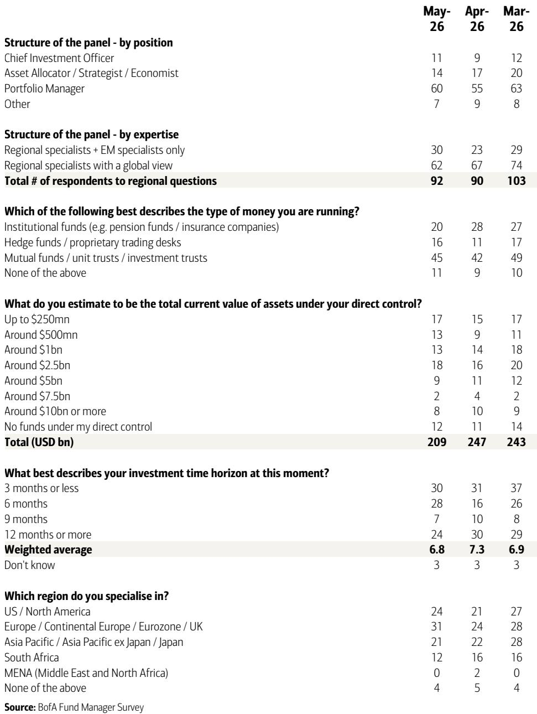
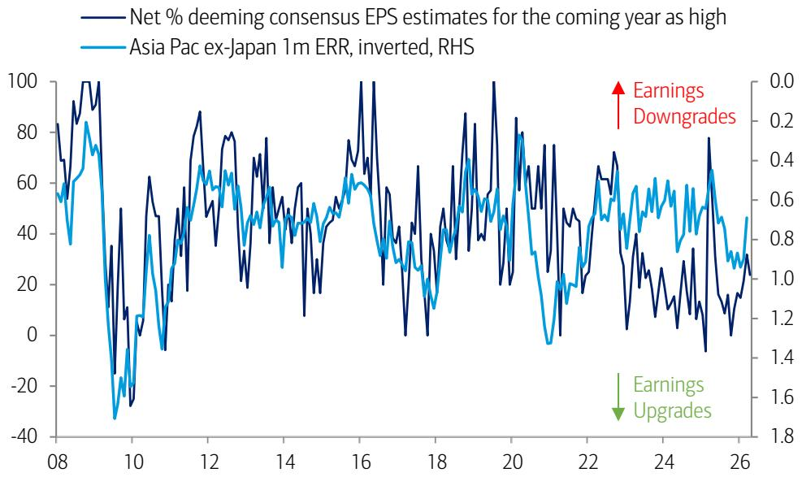

# Asia’s Fund Managers Are Betting on a Narrower, More Concentrated Market: The AI Supply Chain Now Dictates Regional Allocation

The MSCI Asia Pacific Index has surged 17.6% from its March low to record highs, but the narrative behind this rally is more specific than a broad recovery story. According to a major global investment bank’s April Asia Fund Manager Survey, the driving force is not a general improvement in macro conditions or a broad-based earnings recovery. It is a highly concentrated conviction in artificial intelligence-exposed markets, particularly Taiwan, Korea, and Japan. The survey of 200 panelists managing $517 billion in assets reveals a market that is making a decisive, and potentially risky, bet on the semiconductor supply chain as the primary engine of regional returns.

This is not a market that is indiscriminately optimistic. Growth expectations, while improved, remain in negative territory. The net percentage of investors expecting a stronger economy in Asia Pacific ex-Japan has swung from a deeply pessimistic net 55% last month to a still-negative net 5% today. What has changed is the urgency of the AI thesis. A net 71% of fund managers now expect a stronger semiconductor cycle over the next 12 months, placing this conviction in the 91st percentile of historical readings. This is not a cautious nibble; it is a full-scale repositioning that has profound implications for how investors should think about risk, diversification, and the next phase of the cycle.

The core argument of this article is straightforward: the current market regime is defined by a narrowing of conviction into a single thematic bet. The question every serious investor must now answer is whether this concentration is a sign of prescience or a setup for a painful reversal. The survey data provides the raw material for this analysis, but the strategic insight lies in understanding what the data does not say.

## The AI Thesis Has Collapsed Geographic Diversification into a Single Supply Chain Narrative

The most striking finding from the survey is the consolidation of geographic preference. Japan, Taiwan, and Korea are now the top three preferred markets by a wide margin. Japan sits at a net 62% overweight, Taiwan at 43%, and Korea at 33%. The rest of the region is a sea of underweights. India, the largest underweight at negative 38%, is viewed as the first market to be cut if global growth weakens further. China is also underweight at negative 5%, despite improving sentiment.

This is not a random distribution of preferences. It is a direct reflection of the AI supply chain. Taiwan is seen by 43% of fund managers as the clearest beneficiary of the next phase of the AI cycle, with Korea at 29% and Japan at 14%. These three markets account for 86% of the perceived AI opportunity. The implication is clear: fund managers are no longer allocating capital to Asia based on diversified country-level stories. They are allocating to a single, integrated production network that spans from Japanese semiconductor equipment makers to Korean memory manufacturers to Taiwanese foundries.

The strategic significance of this shift cannot be overstated. A portfolio that is overweight Japan, Taiwan, and Korea is, in effect, a portfolio that is long the AI semiconductor cycle. It is a concentrated thematic bet, not a diversified regional allocation. This is not inherently wrong, but it is a choice that carries specific risks. The survey data suggests that most managers are making this choice with conviction, but the question is whether they have fully priced in the consequences of a reversal in that cycle.

## Energy Security Fears Have Collapsed, But the Risk Has Simply Shifted Form

One of the most dramatic month-over-month changes in the survey is the collapse of energy security concerns. In April, 91% of fund managers described themselves as extremely or highly concerned about energy security risks for the APAC region. In May, that figure dropped to 52%. This is a 39-percentage-point swing in a single month.

On the surface, this is a positive development. It suggests that the geopolitical environment, particularly around energy supply, has stabilized. But the strategic interpretation is more nuanced. The decline in energy concern does not mean that geopolitical risk has disappeared. It means that investor attention has been redirected. The same cognitive bandwidth that was occupied by energy security is now consumed by the AI narrative. The risk has not been resolved; it has been displaced.

The survey provides a clear example of this displacement. When asked about the primary concern for the Indian market, the top answer, at 29%, is "no AI play." This is a remarkable finding. The world's fifth-largest economy, with a rapidly growing domestic market and a strong services sector, is being penalized by fund managers because it does not fit neatly into the AI semiconductor supply chain narrative. This is a clear illustration of how a single thematic lens can crowd out other legitimate investment narratives.

The implication for investors is that they must maintain a dual awareness. The energy security risk has not been eliminated; it has merely been deprioritized. A geopolitical shock that disrupts energy supply would re-energize that concern and potentially trigger a rapid reassessment of the current AI-driven allocation. The market is currently pricing in a world where the AI thesis dominates and other risks are secondary. That is a fragile equilibrium.

## Japan’s Rally Is Now a Bet on Earnings, Not a Bet on Reform

The survey data reveals a significant shift in the narrative driving Japanese equities. For the past two years, the Japan bull case has been built on two pillars: corporate governance reform and Bank of Japan policy normalization. In the May survey, those two factors combined account for only 38% of investor focus. The dominant factor, cited by 38% of investors alone, is earnings.

This is a crucial maturation of the Japan story. The governance reform thesis was always a structural argument that would take years to play out. The earnings thesis is more immediate and more cyclical. It suggests that investors are now looking for tangible profit delivery, not just promises of better capital allocation. This is a higher bar, and it introduces a new source of vulnerability.

The survey also shows that expected 12-month returns for Japan equities have risen to an all-time high of 6.9%. This optimism is supported by a strong rebound in Japan growth expectations, with a net 38% now expecting a stronger economy, up from a much lower level in April. But the relationship between growth expectations and earnings delivery is not automatic. The survey reveals that 67% of investors expect the Bank of Japan's next rate hike to occur in June. A rate hike would strengthen the yen, which has a direct and negative impact on the earnings of Japan's large export-oriented companies.

The strategic question for Japan investors is whether they have fully reconciled these two forces. The bullish case for Japan earnings is predicated on strong global demand, particularly from the AI supply chain. But the BoJ's rate normalization path is designed to address domestic inflation, which is running hot. A net 81% of investors now expect higher inflation in Asia Pacific ex-Japan, the highest level since April 2022. If the BoJ moves aggressively, it could strengthen the yen, compress export margins, and undermine the very earnings momentum that is now the primary driver of the Japan bull case. This is a tension that the survey data highlights but does not resolve.

## The Unanswered Question: Is AI-Driven Upside Already Priced In?

The survey provides one of the most important data points for understanding the current market psychology: the question of whether AI-driven equity upside is already reflected in prices. In April, 55% of fund managers said that positive AI impact was either "more than fully priced in" or "broadly fairly priced." In May, that figure dropped to 38%. The share saying it is "partially priced in" rose from 28% to 52%.

This is a significant shift in sentiment. It suggests that the April selloff, which provided the entry point for the subsequent rally, also reset investor expectations. Fewer managers now believe the AI story is fully discounted. This is the psychological foundation for the current rally. If more managers believe there is room for further upside, they are more willing to add to positions.

But this data point also raises an uncomfortable question. The shift from "fairly priced" to "partially priced in" is not a fundamental change in the underlying economics of AI. It is a change in perception. The actual revenue and earnings impact of AI investments remains uncertain. The survey shows that corporate profit expectations have swung sharply, with a net 33% now expecting stronger profits, up from a net 45% expecting weaker profits just one month ago. This is a 78-percentage-point swing.

Such a dramatic swing in expectations is rarely supported by a commensurate change in actual business conditions. It is more likely driven by the psychological impact of the AI narrative and the price action it has generated. The risk is that these expectations become self-referential, creating a feedback loop where rising prices justify higher expectations, which in turn justify higher prices. This is not a sustainable dynamic. The market will eventually need to see actual earnings delivery that matches the elevated expectations. The survey data shows that investors are betting on that delivery, but it does not provide any evidence that it will materialize.

## A Decision Framework for Navigating the Concentrated AI Bet

For serious investors, the survey data is not just a snapshot of sentiment. It is a tool for constructing a decision framework. The following framework translates the survey findings into actionable questions for portfolio construction.

First, assess your exposure to the AI supply chain as a single factor. If your Asia ex-Japan portfolio is overweight Japan, Taiwan, and Korea, you are effectively making a leveraged bet on the semiconductor cycle. The question is not whether this bet is correct, but whether you have sized it appropriately for your risk tolerance. The survey shows that this concentration is the consensus view. Consensus trades are vulnerable to sudden reversals. The framework requires that you stress-test your portfolio for a scenario where the AI cycle disappoints, whether due to demand saturation, geopolitical disruption, or technological bottlenecks.

Second, evaluate your exposure to the markets that are being ignored. India is the most underweight market in the region, with a net 38% underweight. This is not because India's fundamentals have deteriorated. It is because India lacks a direct AI semiconductor play. The framework should ask whether this neglect creates an opportunity. If the AI thesis is correct, the underweight in India is justified. If the AI thesis falters, the rotation back into under-owned markets like India could be swift and violent.

Third, consider the inflation and rate hike trajectory. The survey shows that 81% of investors expect higher inflation, and the majority expect a BoJ rate hike in June. The framework must account for the interaction between these two forces. A rate hike that strengthens the yen could compress Japanese export earnings, which would directly undermine the primary driver of the Japan bull case. The framework should include a scenario where the BoJ moves faster than expected, and the resulting currency adjustment triggers a reassessment of the entire North Asia overweight.

Fourth, monitor the energy security risk that has been displaced. The collapse of energy security concern from 91% to 52% is a risk that has been pushed to the background, not eliminated. The framework should include a trigger for when to re-activate this concern. Any significant disruption to energy supply in the region would not only impact energy-sensitive sectors but would also force investors to re-evaluate their entire geographic allocation, potentially breaking the current AI-driven consensus.

This framework is not a prediction. It is a tool for managing uncertainty. The survey data provides the raw material, but the strategic insight comes from understanding how the pieces fit together and what they imply for the future.

## The Full Picture Requires the Original Charts and Data

The analysis above is based on the key findings of the April Asia Fund Manager Survey, but the full report contains a wealth of additional data that is essential for a complete understanding of the current market dynamics. The exhibits on sector positioning, for example, reveal that within Asia Pacific ex-Japan, May saw a rotation out of Energy and Consumer Staples into Consumer Discretionary, Real Estate, and Software. This is a telling shift that suggests investors are not just buying the AI theme in isolation, but are also re-allocating across sectors in anticipation of a broader cyclical recovery.

The data on the Korea Corporate Value-Up Program is equally revealing. Investor views on the efficacy of this program have shifted dramatically, with the share expecting a "strongly positive impact" rising from 5% in March 2024 to 24% in May 2026. This is a significant change in perception that has implications for the Korea overweight.

The survey also contains detailed breakdowns of expected returns, valuation assessments, and thematic preferences that are not fully captured in this analysis. The original charts provide the visual context that makes these trends immediately apparent.

Join the community to read the full report and review the original charts. The full document includes the complete set of exhibits, the detailed methodology, and the additional commentary from the research team that provides the context for interpreting these numbers. For any investor with exposure to Asian equities, this data is not optional reading. It is the raw material for making informed decisions in a market that is increasingly defined by a single, powerful, and potentially fragile narrative.

*This article is for learning and discussion only and does not constitute investment advice.*

Personal reading notes and learning share only. Not investment advice.

