# Global Fund Manager Survey

# In It to Win It

# BofA May Global Fund Manager Survey

Bottom Line: record rise in FMS equity allocation (Chart 1) and big cut in cash levels (4.3% to 3.9%) driven by surge in EPS optimism and forecast of Fed rate cuts; BofA Bull & Bear Indicator now at 7.8 (chip shot from “sell-signal”); bull capitulation almost complete, early June ripe for profit-taking, bond yields to determine degree of pullback.

On Macro & Rates: pessimism on global growth melts, just 4% predict “hard landing”; record jump in FMS investors expecting double-digit EPS growth; Iran concerns subdued, 66% expect Hormuz bottleneck ends in the next few months; bull vulnerability is “behind-the-curve” Fed (just 16% expect Fed hikes in '26) driving long-end higher (62% of FMS investors targeting 6% on 30-year Treasury yield vs just 20% targeting 4%).

On Risk & Allocation: 73% say “long global semiconductors” = #1 crowded trade, 40% say “inflation” = #1 tail risk, most likely sources of credit event = shadow banking (42%) & AI hyperscalers (34%); AA = all-in on risk-on...most OW cyclicals vs defensives since Jan’18, most OW tech since Feb’24, 4 $^{th}$ highest commodity OW ever, most UW bonds since Jun’22, Eurozone UW 1 $^{st}$ since Dec’24, and consumer most out of favor.

FMS Contrarian Trades: based on FMS positions relative to history, contrarians would be covering shorts in bonds, US dollar, UK assets & consumer stocks, and paring length in commodities, stocks, EM assets & tech/semis.

Chart 1: In It to Win It... record monthly jump in FMS equity allocation   
Net % overweight equities (m/m change, ppt)   
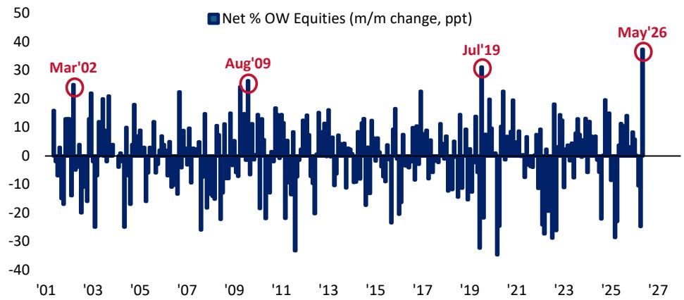

bar

| Year | Net % OW Equities (m/m change, ppt) |
| ---- | ----------------------------------- |
| Mar'02 | 25 |
| Aug'09 | 25 |
| Jul'19 | 30 |
| May'26 | 35 |

Source: BofA Global Fund Manager Survey   
BofA GLOBAL RESEARCH

Trading ideas and investment strategies discussed herein may give rise to significant risk and are not suitable for all investors. Investors should have experience in relevant markets and the financial resources to absorb any losses arising from applying these ideas or strategies.
BofA does and seeks to do business with issuers covered in its research reports. As a result, investors should be aware that the firm may have a conflict of interest that could affect the objectivity of this report. Investors should consider this report as only a single factor in making their investment decision.
Refer to important disclosures on page 25 to 27.

# 19 May 2026

Investment Strategy Global

BofA

# Data Analytics

# Michael Hartnett

Investment Strategist
BofAS

+1 646 855 1508

michael.hartnett@bofa.com

# Anya Shelekhin

Investment Strategist
BofAS

+1 646 855 3753

anya.shelekhin@bofa.com

# Myung-Jee Jung

Investment Strategist
BofAS

+1 646 855 0389

myung-jee.jung@bofa.com

# Jessica Guo

Investment Strategist
BofAS

+1 646 855 0033

jessica.guo@bofa.com

# Notes to Readers

Source for all tables and charts: BofA Fund Manager Survey, DataStream

Survey period May 8 $^{th}$ to 14 $^{th}$ , 2026 200 panellists with \$517bn AUM participated in the May survey. 170 participants with \$461bn AUM responded to the Global FMS questions and 92 participants with \$209bn AUM responded to the Regional FMS questions.

# How to join the FMS panel

Investors/clients are encouraged to sign up to participate in the Survey. This can be done by contacting Michael Hartnett or your BofA sales representative.

Participants in the survey will continue to receive the full set of monthly results but only for the relevant month in which they participate.

OW: overweight; UW: underweight

AA: asset allocation

# Charts of the Month

Chart 2: BofA Global FMS investor sentiment rebounds to 3-month high   
Percentile rank of FMS growth expectations, cash level, and equity allocation   
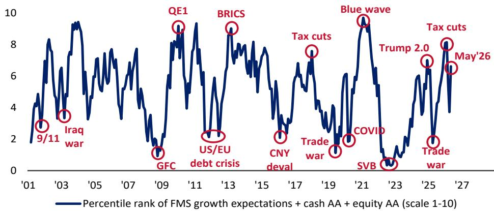

line

| Year | Percentile rank of FMS growth expectations + cash AA + equity AA (scale 1-10) |
|------|----------------------------------------------------------------------------------|
| '01  | ~3.5                                                                             |
| '03  | ~3.5                                                                             |
| '05  | ~8.5                                                                             |
| '07  | ~4.5                                                                             |
| '09  | ~1.5                                                                             |
| '11  | ~9.5                                                                             |
| '13  | ~9.5                                                                             |
| '15  | ~7.5                                                                             |
| '17  | ~7.5                                                                             |
| '19  | ~4.5                                                                             |
| '21  | ~9.5                                                                             |
| '23  | ~1.5                                                                             |
| '25  | ~7.5                                                                             |
| '27  | ~8.5                                                                             |

Source: BofA Global Fund Manager Survey   
BofA GLOBAL RESEARCH

Chart 3: FMS cash level drops to 3.9%, triggering sell signal   
BofA FMS average cash level (% of AUM)   
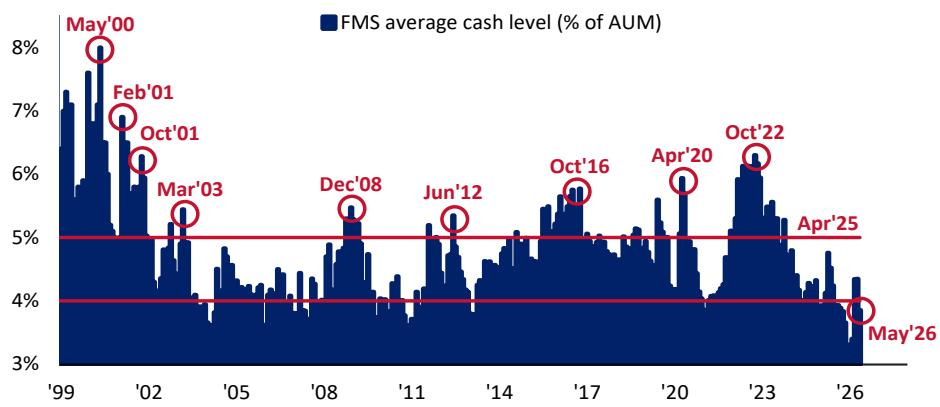

bar

| Year | FMS average cash level (% of AUM) |
| ---- | --------------------------------- |
| '99  | ~7.5%                             |
| '00  | ~8.0%                             |
| '01  | ~6.5%                             |
| '02  | ~6.0%                             |
| '03  | ~5.5%                             |
| '08  | ~5.0%                             |
| '11  | ~5.5%                             |
| '14  | ~5.0%                             |
| '17  | ~5.5%                             |
| '20  | ~5.5%                             |
| '23  | ~6.0%                             |
| '26  | ~3.5%                             |

Source: BofA Global Fund Manager Survey   
BofA GLOBAL RESEARCH

Chart 4: 46% say "soft landing," 39% say "no landing," just 4% say "hard landing"   
What is the most likely outcome for the global economy in the next 12 months?   
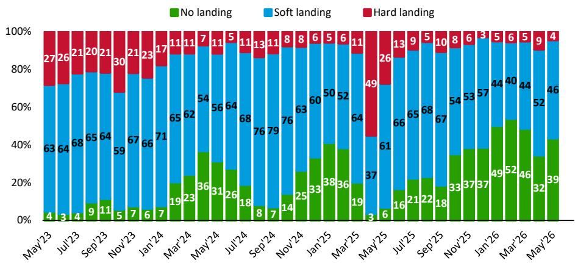

bar_stacked

| Month    | No landing | Soft landing | Hard landing |
| -------- | ---------- | ------------ | ------------ |
| May'23   | 4          | 63           | 27           |
| Jul'23   | 3          | 64           | 26           |
| Sep'23   | 4          | 68           | 21           |
| Nov'23   | 9          | 65           | 20           |
| Jan'24   | 11         | 64           | 21           |
| Mar'24   | 5          | 59           | 30           |
| May'24   | 7          | 67           | 21           |
| Jul'24   | 6          | 66           | 23           |
| Sep'24   | 7          | 71           | 17           |
| Nov'24   | 19         | 65           | 11           |
| Jan'25   | 23         | 62           | 11           |
| Mar'25   | 36         | 54           | 7            |
| May'25   | 31         | 56           | 11           |
| Jul'25   | 26         | 64           | 5            |
| Sep'25   | 18         | 68           | 11           |
| Nov'25   | 8          | 76           | 13           |
| Jan'26   | 7          | 79           | 11           |
| Mar'26   | 14         | 76           | 8            |
| May'26   | 25         | 63           | 8            |
| Jul'26   | 33         | 60           | 6            |
| Sep'26   | 38         | 50           | 5            |
| Nov'26   | 36         | 52           | 6            |
| Jan'27   | 19         | 64           | 11           |
| Mar'27   | 3          | 37           | 49           |
| May'27   | 6          | 61           | 26           |
| Jul'27   | 16         | 66           | 13           |
| Sep'27   | 21         | 65           | 9            |
| Nov'27   | 22         | 68           | 5            |
| Jan'28   | 18         | 67           | 10           |
| Mar'28   | 33         | 54           | 8            |
| May'28   | 37         | 53           | 6            |
| Jul'28   | 37         | 57           | 3            |
| Sep'28   | 49         | 44           | 5            |
| Nov'28   | 52         | 40           | 6            |
| Jan'29   | 46         | 44           | 5            |
| Mar'29   | 32         | 52           | 9            |
| May'29   | 39         | 46           | 4            |

Source: BofA Global Fund Manager Survey

May 2026 BofA Global Fund Manager Survey saw global investor sentiment recover to the highest level since Feb'26; our broadest measure of FMS sentiment, based on cash levels, equity allocation, and global growth expectations, rose to 6.6 to 3.7.

BofA FMS cash level dropped to 3.9% from 4.3%, the biggest monthly drop since Feb'24.

FMS cash level at or below 4.0% triggers sell signal. Note median 4-week loss from global stocks after 24 sell signals since 2011 is -1% (biggest loss recorded post-sell signal = -29%, biggest gain 4%).

Investors turned less pessimistic on the outlook for the global economy with just 4% predicting a “hard landing.”

46% see a “soft landing” as the most likely outcome, while 39% expect “no landing.”

BofA GLOBAL RESEARCH

Chart 5: Global growth expectations recover, but remain negative   
Net % FMS expect stronger global economy and S&P 500 (YoY %)   
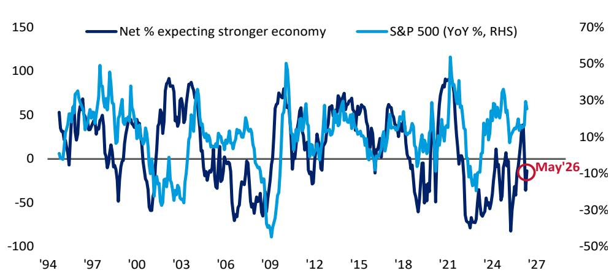

line

| Year | Net % expecting stronger economy | S&P 500 (YoY %, RHS) |
|------|----------------------------------|------------------------|
| '27  | -30%                             | -10%                   |

Source: BofA Global Fund Manager Survey, Bloomberg   
BofA GLOBAL RESEARCH

Global growth outlook recovered in May from net -36% to net -14%, but expectations remain negative.

Stock prices continue to outpace investor macro expectations.

Chart 6: May FMS sees $6^{\text{th}}$ largest jump in profit expectations   
Net % expect global profits to improve (monthly change, ppt)   
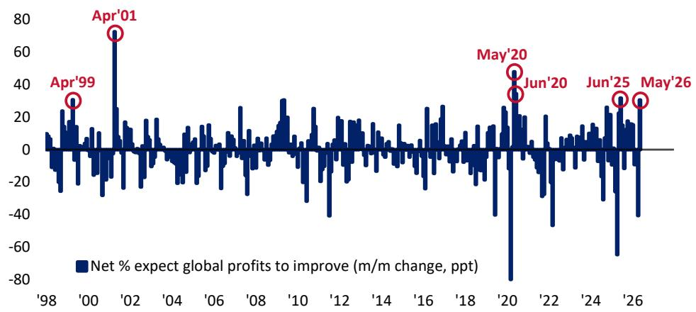

bar

| Year | Net % expect global profits to improve (m/m change, ppt) |
| ---- | -------------------------------------------------------- |
| Apr'99 | ~30 |
| Apr'01 | ~75 |
| May'20 | ~45 |
| Jun'20 | ~35 |
| Jun'25 | ~30 |
| May'26 | ~30 |

Source: BofA Global Fund Manager Survey   
BofA GLOBAL RESEARCH

On profits...May FMS saw the 6 $^{th}$ largest monthly surge in profit expectations.

Net 17% of investors now expect global profits to improve (flips from net 14% last month expecting profits to deteriorate).

Chart 7: 40% see a $2^{nd}$ wave of inflation as the biggest tail risk   
What do you consider the biggest 'tail risk'?   
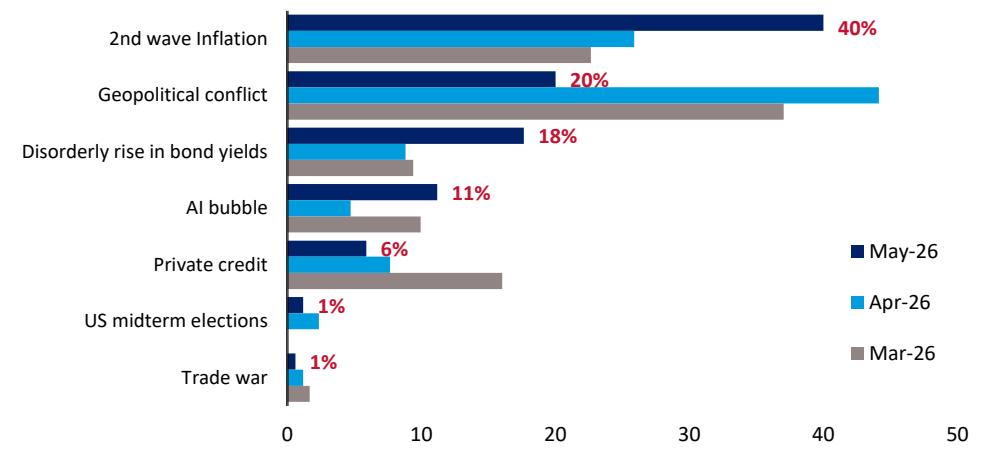

bar

| Category | May-26 (%) | Apr-26 (%) | Mar-26 (%) |
| :--- | :--- | :--- | :--- |
| 2nd wave Inflation | 40 | 26 | 23 |
| Geopolitical conflict | 20 | 44 | 37 |
| Disorderly rise in bond yields | 18 | 9 | 10 |
| AI bubble | 11 | 5 | 10 |
| Private credit | 6 | 7 | 16 |
| US midterm elections | 1 | 2 | 0 |
| Trade war | 1 | 1 | 1 |

Source: BofA Global Fund Manager Survey   
BofA GLOBAL RESEARCH

Asked what the biggest tail risk is...40% of FMS investors said “2 $^{nd}$ wave inflation,” up sharply from 26% last month.

20% said “geopolitical conflict,” down from 44% in April (was the #1 tail risk last month).

Chart 8: 54% of FMS expect the Strait of Hormuz to reopen before H2'26   
When do you expect the Strait of Hormuz to reopen?   
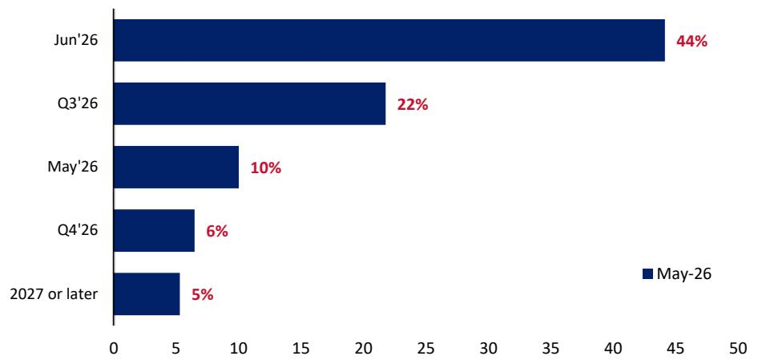

bar

| Period | Value (%) |
|---|---|
| Jun'26 | 44 |
| Q3'26 | 22 |
| May'26 | 10 |
| Q4'26 | 6 |
| 2027 or later | 5 |

Source: BofA Global Fund Manager Survey   
BofA GLOBAL RESEARCH

Investors this month were also asked when they expect the Strait of Hormuz to be reopened.

Most expect the Strait to be reopened in June (44%); 22% say Q3'26 and 10% say May'26.

Chart 9: Just 7% expect Brent oil to end '26 above \$100/bbl   
In which of the following ranges do you expect Brent oil to trade in by year-end 2026?   
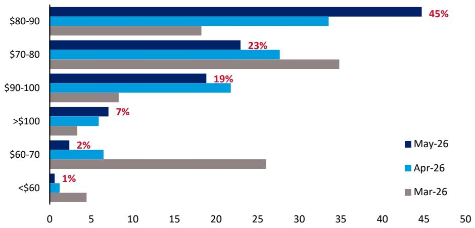

bar

| Revenue Range | Mar-26 (%) | Apr-26 (%) | May-26 (%) |
|---|---|---|---|
| $80-90 | 18 | 33 | 45 |
| $70-80 | 35 | 27 | 23 |
| $90-100 | 8 | 21 | 19 |
| >$100 | 3 | 5 | 7 |
| $60-70 | 26 | 6 | 2 |
| <$60 | 5 | 1 | 1 |

Source: BofA Global Fund Manager Survey   
BofA GLOBAL RESEARCH

On oil prices...FMS investors expect oil to trade at \$85/bbl (on a weighted-average basis) by end '26 (vs \$84/bbl a month ago); this would be a 39% increase from \$61/bbl Brent at the start of 2026.

26% of investors expect oil to trade at \$90/bbl or higher by year-end. And just 7% expect oil to end the year above \$100/bbl.

Note that net 46% of FMS investors believe oil is overvalued...highest since Aug'08.

Chart 10: Expectations for higher rates at 4-year high, as inflation outlook remains elevated   
Net % expecting higher global CPI and net % expecting higher short-term rates   
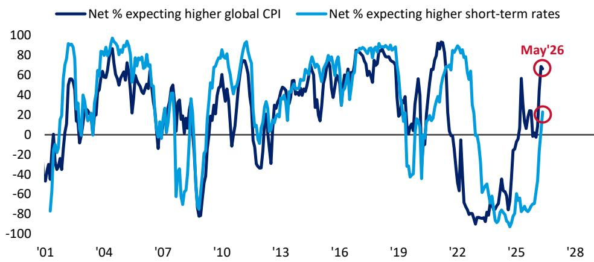

line

| Year | Net % expecting higher global CPI | Net % expecting higher short-term rates |
|------|-----------------------------------|----------------------------------------|
| May'26 | 70 | 70 |

Source: BofA Global Fund Manager Survey   
BofA GLOBAL RESEARCH

Expectations for higher short-term rates have jumped big (from net 4% to net 23%, highest since Oct'22), aligning with an elevated inflation outlook (net 66% expect higher global CPI).

Chart 11: 62% of FMS investors say big move in yields would see 30-year UST break above 6% 30Y UST yield level that is more likely to be breached first assuming big move in yields next 12m   
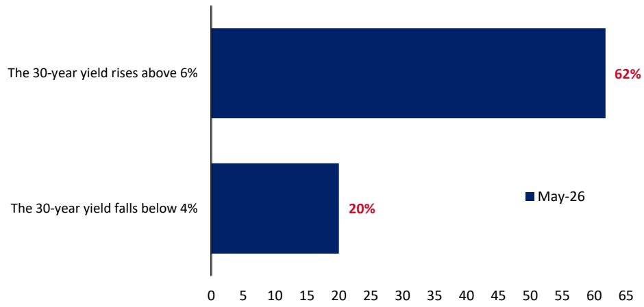

bar

| Category | Value (%) |
|---|---|
| The 30-year yield rises above 6% | 62 |
| The 30-year yield falls below 4% | 20 |
May-26

Source: BofA Global Fund Manager Survey   
BofA GLOBAL RESEARCH

On bond yields...

Assuming a big move in yields the next 12 months, 62% of FMS investors think the 30-year US Treasury would rise above 6%; just 20% think yields would fall below 4%.

Chart 12: Just $16\%$ of investors expect the Fed to hike rates in the next 12 months How do you expect the Fed to change the federal funds rate in the next 12 months?   
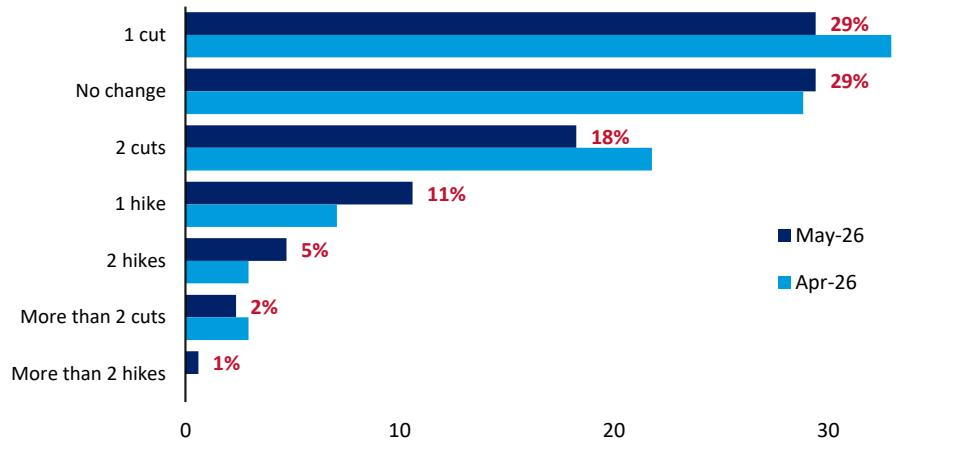

bar

| Category | May-26 (%) | Apr-26 (%) |
|---|---|---|
| 1 cut | 29 | 32 |
| No change | 29 | 28 |
| 2 cuts | 18 | 22 |
| 1 hike | 11 | 7 |
| 2 hikes | 5 | 3 |
| More than 2 cuts | 2 | 3 |
| More than 2 hikes | 1 | 0 |

Source: BofA Global Fund Manager Survey   
BofA GLOBAL RESEARCH

The majority (50%) of FMS investors still expect the Fed to cut rates in the next 12 months, despite rising inflation expectations.

Another 16% expect no change in rates, while 16% expect the Fed to hike rates.

Chart 13: 42% say US shadow banking is the most likely source of credit event. What is the most likely source of a systemic credit event?   
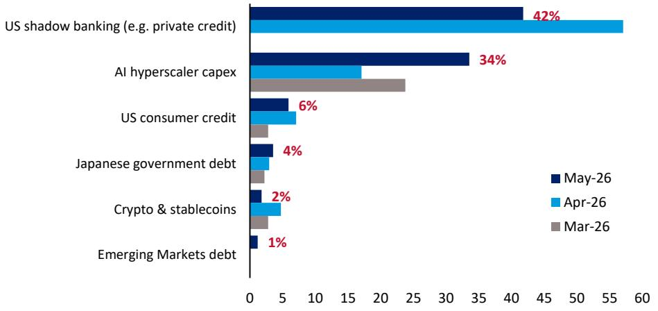

bar

| Category | May-26 (%) | Apr-26 (%) | Mar-26 (%) |
| :--- | :--- | :--- | :--- |
| US shadow banking (e.g. private credit) | 42 | 57 | |
| AI hyperscaler capex | 34 | 17 | 24 |
| US consumer credit | 6 | 7 | 3 |
| Japanese government debt | 4 | 3 | 2 |
| Crypto & stablecoins | 2 | 5 | 3 |
| Emerging Markets debt | 1 | | |

Source: BofA Global Fund Manager Survey

Asked for the most likely source of a systemic credit event, 42% of FMS investors said US shadow banking (private credit), albeit down from 57% in April.

Increasingly more investors believe AI hyperscaler capex is the #1 source of a credit event...34%, up sharply from 17%.

BofA GLOBAL RESEARCH

Chart 14: 41% expect DEM house/GOP Senate post-midterms, DEM sweep dips to 32%   
What outcome do you expect from the 2026 US midterm elections?   
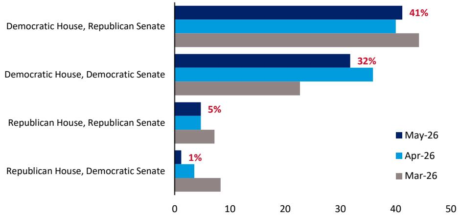

bar

| Category | Mar-26 (%) | Apr-26 (%) | May-26 (%) |
| :--- | :--- | :--- | :--- |
| Democratic House, Republican Senate | 44 | 39 | 41 |
| Democratic House, Democratic Senate | 22 | 36 | 32 |
| Republican House, Republican Senate | 7 | 4 | 5 |
| Republican House, Democratic Senate | 8 | 3 | 1 |

Source: BofA Global Fund Manager Survey   
BofA GLOBAL RESEARCH

On the outcome of upcoming US midterm elections (Republicans currently hold majorities in both the House & Senate)...

Most FMS investors believe it will be a split Democratic House & Republican Senate (per 41%).

Another 32% expect a “blue wave” (Democratic House & Democratic Senate), down slightly from 36%.

Chart 15: "Long global semiconductors" the #1 crowded trade, per 73% of investors   
What do you think is currently the most crowded trade?   
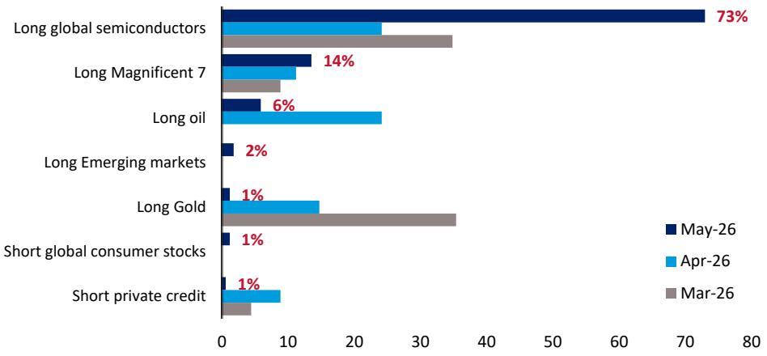

bar

| Category | Mar-26 (%) | Apr-26 (%) | May-26 (%) |
| :--- | :--- | :--- | :--- |
| Long global semiconductors | 35 | 24 | 73 |
| Long Magnificent 7 | 9 | 11 | 14 |
| Long oil | 0 | 25 | 6 |
| Long Emerging markets | 0 | 0 | 2 |
| Long Gold | 35 | 15 | 1 |
| Short global consumer stocks | 0 | 0 | 1 |
| Short private credit | 4 | 9 | 1 |

Source: BofA Global Fund Manager Survey   
BofA GLOBAL RESEARCH

Asked about the most crowded trade, 73% of FMS investors said “long global semiconductors,” followed by 14% “long Magnificent 7.”

Last month, the most crowded trades were “long global semiconductors” (24%) and “long oil” (24%).

Chart 16: FMS equity allocation highest since Jan'22   
Net % overweight equities   
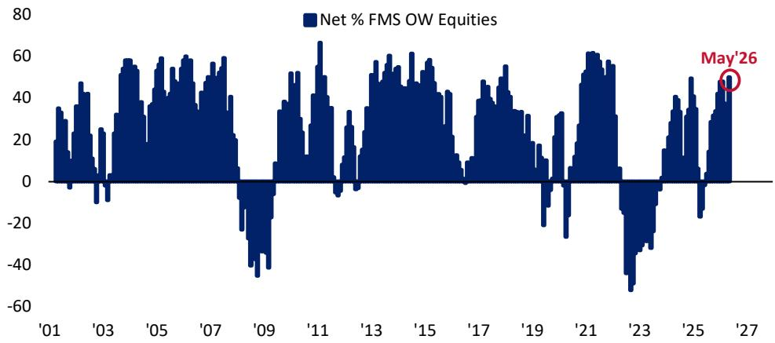

bar

| Year | Net % FMS OW Equities |
| ---- | --------------------- |
| '27  | May'26                |

Source: BofA Global Fund Manager Survey   
BofA GLOBAL RESEARCH

Asset allocation in May was very risk-on...

May saw a record monthly surge in allocation to equities, rising from net 13% OW to net 50% OW (the highest allocation since Jan'22).

Chart 17: FMS investors most UW bonds since Jun'22   
Net % overweight bonds   
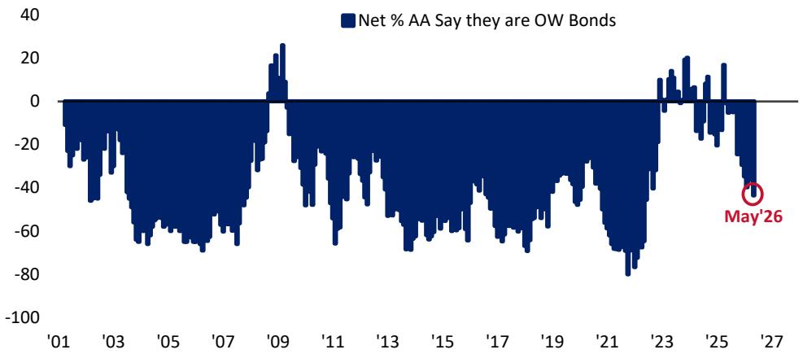

line

| Year | Net % AA Say they are OW Bonds |
| ---- | ------------------------------ |
| May '26 | -40 |

Source: BofA Global Fund Manager Survey

FMS investors decreased their allocation to bonds to net 44% underweight, the biggest UW since Jun'22.

BofA GLOBAL RESEARCH

Chart 18: Relative allocation to cyclicals vs defensives highest since Jan'18   
Net % OW cyclicals (tech + industrials) minus net % OW defensives (healthcare + staples)   
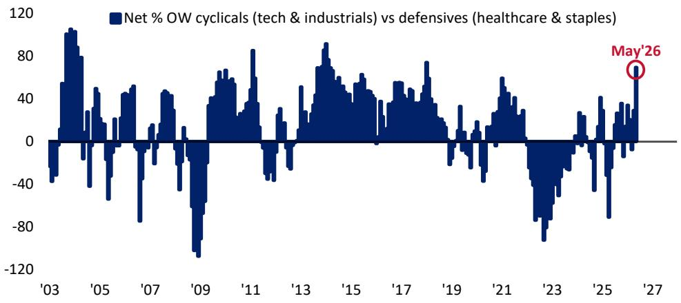

bar

| Year | Net % OW cyclicals (tech & industrials) vs defensives (healthcare & staples) |
|------|------------------------------------------------------------------------|
| '03  | ~40                                                                    |
| '05  | ~100                                                                   |
| '07  | ~40                                                                    |
| '09  | ~-100                                                                  |
| '11  | ~80                                                                    |
| '13  | ~60                                                                    |
| '15  | ~80                                                                    |
| '17  | ~60                                                                    |
| '19  | ~40                                                                    |
| '21  | ~60                                                                    |
| '23  | ~-80                                                                   |
| '25  | ~40                                                                    |
| '27  | ~100                                                                   |

Source: BofA Global Fund Manager Survey

In sector allocation, investors increased relative overweight in cyclicals (tech & industrials) vs defensives (healthcare & staples) to the highest level since Jan'18.

BofA GLOBAL RESEARCH

Chart 19: Biggest FMS conviction in large cap outperformance since Jun'22   
Net % think large cap stocks will outperform small cap stocks   
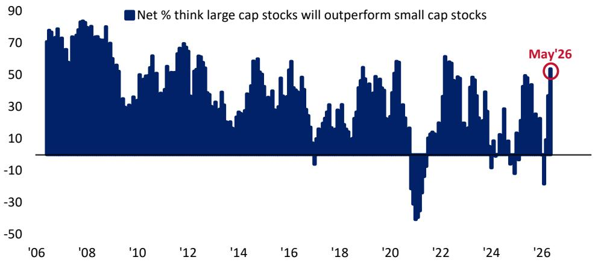

bar

| Year | Net % think large cap stocks will outperform small cap stocks |
| ---- | --------------------------------------------------------------- |
| May'26 | 50 |

Source: BofA Global Fund Manager Survey

Conviction in large cap outperformance grew in May with net 54% of FMS investors expecting large cap stocks to outperform small cap stocks...most since Jun'22 (nearly 1 st. dev above historical average since Jun'06).

BofA GLOBAL RESEARCH

Chart 20: May rotation into stocks, US, and tech vs out of cash, bonds, and UK   
Monthly change in FMS investor positioning   
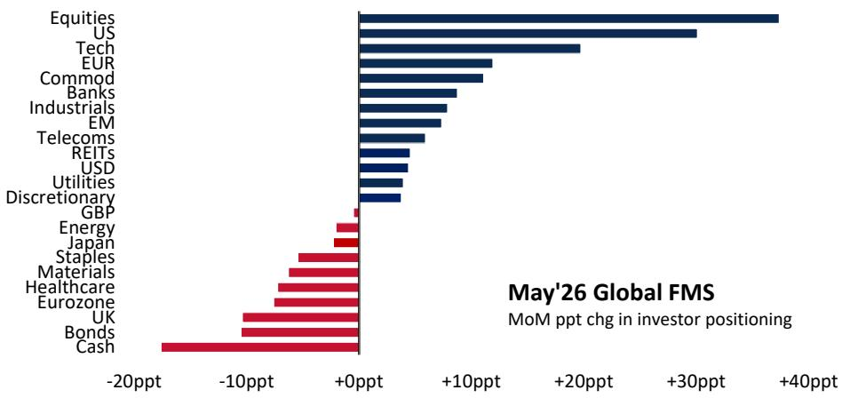

bar

May'26 Global FMS
| Sector | MoM ppt chg in investor positioning |
| :--- | :--- |
| Equities | +38 |
| US | +30 |
| Tech | +20 |
| EUR | +12 |
| Commod | +10 |
| Banks | +9 |
| Industrials | +8 |
| EM | +7 |
| Telecoms | +6 |
| REITs | +5 |
| USD | +4 |
| Utilities | +3 |
| Discretionary | +2 |
| GBP | 0 |
| Energy | -1 |
| Japan | -1 |
| Staples | -3 |
| Materials | -4 |
| Healthcare | -5 |
| Eurozone | -6 |
| UK | -8 |
| Bonds | -9 |
| Cash | -15 |

Source: BofA Global Fund Manager Survey

This chart shows May's monthly changes in FMS investor allocation.

Investors increased allocation to equities, US stocks, and technology...

...and reduced allocation to cash, bonds, and UK/Eurozone stocks.

BofA GLOBAL RESEARCH

Chart 21: FMS most OW stocks, EM, and tech vs most UW bonds, staples, and UK   
FMS absolute positioning (net % overweight)   
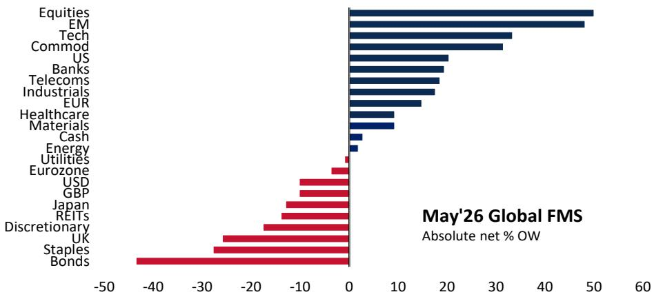

bar

May'26 Global FMS
| Sector | Absolute net % OW |
| :--- | :--- |
| Equities | 50 |
| EM | 48 |
| Tech | 33 |
| Commod | 31 |
| US | 20 |
| Banks | 19 |
| Telecoms | 18 |
| Industrials | 17 |
| EUR | 15 |
| Healthcare | 9 |
| Materials | 8 |
| Cash | 3 |
| Energy | 1 |
| Utilities | -1 |
| Eurozone | -2 |
| USD | -8 |
| GBP | -9 |
| Japan | -11 |
| REITs | -13 |
| Discretionary | -17 |
| UK | -24 |
| Staples | -27 |
| Bonds | -44 |

Source: BofA Global Fund Manager Survey

This chart shows absolute FMS investor positioning (net % overweight).

In May, investors are most overweight equities, EM stocks, technology, and commodities...

...vs. most underweight bonds, consumer staples/discretionary, and UK stocks.

BofA GLOBAL RESEARCH

Chart 22: Relative to history, FMS OW commodities, utilities, EM vs UW staples, cash, US\$   
FMS positioning vs history (z-score)   
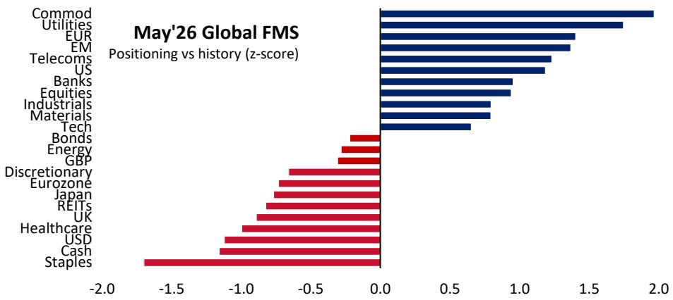

bar

| Sector        | z-score |
| ------------- | ------- |
| Commod        | 2.0     |
| Utilities     | 1.7     |
| EUR           | 1.4     |
| EM            | 1.3     |
| Telecoms      | 1.2     |
| US            | 1.1     |
| Banks         | 0.9     |
| Equities      | 0.8     |
| Industrials   | 0.7     |
| Materials     | 0.7     |
| Tech          | 0.6     |
| Bonds         | -0.2    |
| Energy        | -0.3    |
| GBP           | -0.4    |
| Discretionary | -0.6    |
| Eurozone      | -0.7    |
| Japan         | -0.8    |
| REITs         | -0.9    |
| UK            | -1.0    |
| Healthcare    | -1.1    |
| USD           | -1.2    |
| Cash          | -1.3    |
| Staples       | -1.8    |

Source: BofA Global Fund Manager Survey

This chart shows absolute FMS investor positioning (net % overweight).

In May, investors are most overweight commodities, utilities, the Euro, and EM stocks...

...vs. most underweight consumer staples, cash, and the US dollar.

BofA GLOBAL RESEARCH

Chart 23: Evolution of Global FMS "biggest tail risk"   
History of Global FMS "biggest tail risk" answers   
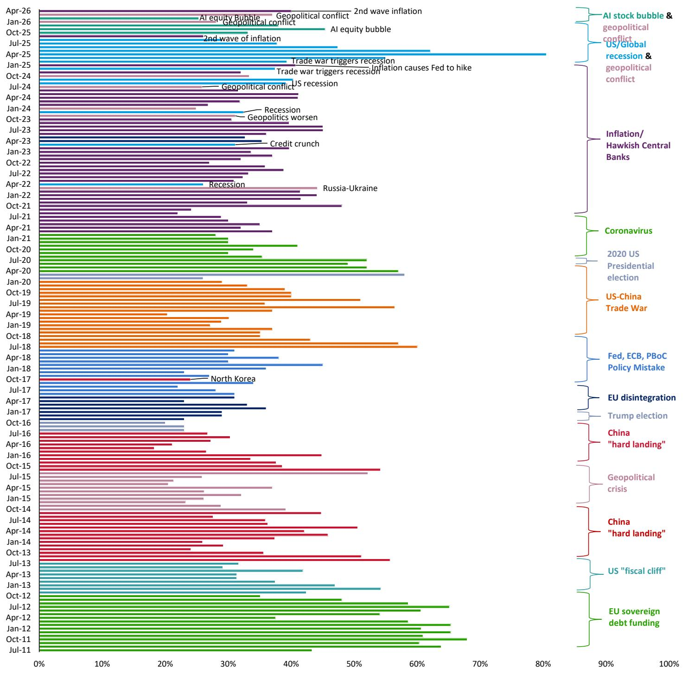

bar

| Date | Event Description | Percentage (%) |
| :--- | :--- | :--- |
| Apr-26 | AI equity Bubble & Geopolitical conflict | 2nd wave inflation |
| Jan-26 | Al equity bubble & Geopolitical conflict | 2nd wave inflation |
| Oct-25 | 2nd wave of inflation | 2nd wave inflation |
| Jul-25 | US recovery | 2nd wave inflation |
| Apr-25 | Trade war triggers recession | 2nd wave inflation |
| Jan-25 | Inflation causes Fed to hike | 2nd wave inflation |
| Oct-24 | Trade war triggers recession | 2nd wave inflation |
| Jul-24 | US recession | 2nd wave inflation |
| Apr-24 | Geopolitical conflict | 2nd wave inflation |
| Jan-24 | Recession | 2nd wave inflation |
| Oct-23 | Geopolitics worsen | 2nd wave inflation |
| Jul-23 | Credit crunch | 2nd wave inflation |
| Apr-23 | Credit crunch | 2nd wave inflation |
| Jan-23 | Credit crunch | 2nd wave inflation |
| Oct-22 | Credit crunch | 2nd wave inflation |
| Jul-22 | Credit crunch | 2nd wave inflation |
| Apr-22 | Recession | 2nd wave inflation |
| Jan-22 | Russia-Ukraine | 2nd wave inflation |
| Oct-21 | US recession | 2nd wave inflation |
| Jul-21 | North Korea | 2nd wave inflation |
| Apr-21 | North Korea | 2nd wave inflation |
| Jan-21 | North Korea | 2nd wave inflation |
| Oct-20 | North Korea | 2nd wave inflation |
| Jul-20 | Coronavirus | 2nd wave inflation |
| Apr-20 | 2020 US Presidential election | 2nd wave inflation |
| Jan-20 | US-China Trade War | 2nd wave inflation |
| Oct-19 | US-China Trade War | 2nd wave inflation |
| Jul-19 | Fed, ECB, PBoC Policy Mistake | 2nd wave inflation |
| Apr-19 | Fed, ECB, PBoC Policy Mistake | 2nd wave inflation |
| Jan-19 | Fed, ECB, PBoC Policy Mistake | 2nd wave inflation |
| Oct-18 | Fed, ECB, PBoC Policy Mistake | 2nd wave inflation |
| Jul-18 | Fed, ECB, PBoC Policy Mistake | 2nd wave inflation |
| Apr-18 | Fed, ECB, PBoC Policy Mistake | 2nd wave inflation |
| Jan-18 | Fed, ECB, PBoC Policy Mistake | 2nd wave inflation |
| Oct-17 | Fed, ECB, PBoC Policy Mistake | 2nd wave inflation |
| Jul-17 | Fed, ECB, PBoC Policy Mistake | 2nd wave inflation |
| Apr-17 | EU disintegration | 2nd wave inflation |
| Jan-17 | Trump election | 2nd wave inflation |
| Oct-16 | Trump election | 2nd wave inflation |
| Jul-16 | China "hard landing" | 2nd wave inflation |
| Apr-16 | China "hard landing" | 2nd wave inflation |
| Jan-16 | China "hard landing" | 2nd wave inflation |
| Oct-15 | China "hard landing" | 2nd wave inflation |
| Jul-15 | China "hard landing" | 2nd wave inflation |
| Apr-15 | China "hard landing" | 2nd wave inflation |
| Jan-15 | China "hard landing" | 2nd wave inflation |
| Oct-14 | China "hard landing" | 2nd wave inflation |
| Jul-14 | China "hard landing" | 2nd wave inflation |
| Apr-14 | China "hard landing" | 2nd wave inflation |
| Jan-14 | China "hard landing" | 2nd wave inflation |
| Oct-13 | China "hard landing" | 2nd wave inflation |
| Jul-13 | China "hard landing" | 2nd wave inflation |
| Apr-13 | China "hard landing" | 2nd wave inflation |
| Jan-13 | China "hard landing" | 2nd wave inflation |
| Oct-12 | China "hard landing" | 2nd wave inflation |
| Jul-12 | China "hard landing" | 2nd wave inflation |
| Apr-12 | EU sovereign debt funding | 2nd wave inflation |
| Jan-12 | EU sovereign debt funding | 2nd wave inflation |
| Oct-11 | EU sovereign debt funding | 2nd wave inflation |
| Jul-11 | EU sovereign debt funding | 2nd wave inflation |
Apr-11 (Note: this appears to be a data label as "Jul-11") is an annotation for the last two entries in the chart.

Source: BofA Global Fund Manager Survey   
BofA GLOBAL RESEARCH

- This chart shows the full history of the biggest “tail risk” for markets from BofA’s monthly Global Fund Manager Survey.   
- The dominant concerns of investors since 2011 have been Eurozone debt, Chinese growth, populism, quantitative tightening & trade wars, global coronavirus, inflation, and central bank rate hikes; US\$ debasement, AI bubble, and geopolitics.   
- The top tail risk is “ $2^{\text{nd}}$ wave inflation” (per 40%) in May.

Chart 24: Evolution of Global FMS "most crowded trade"   
History of Global FMS “most crowded trade” answers   
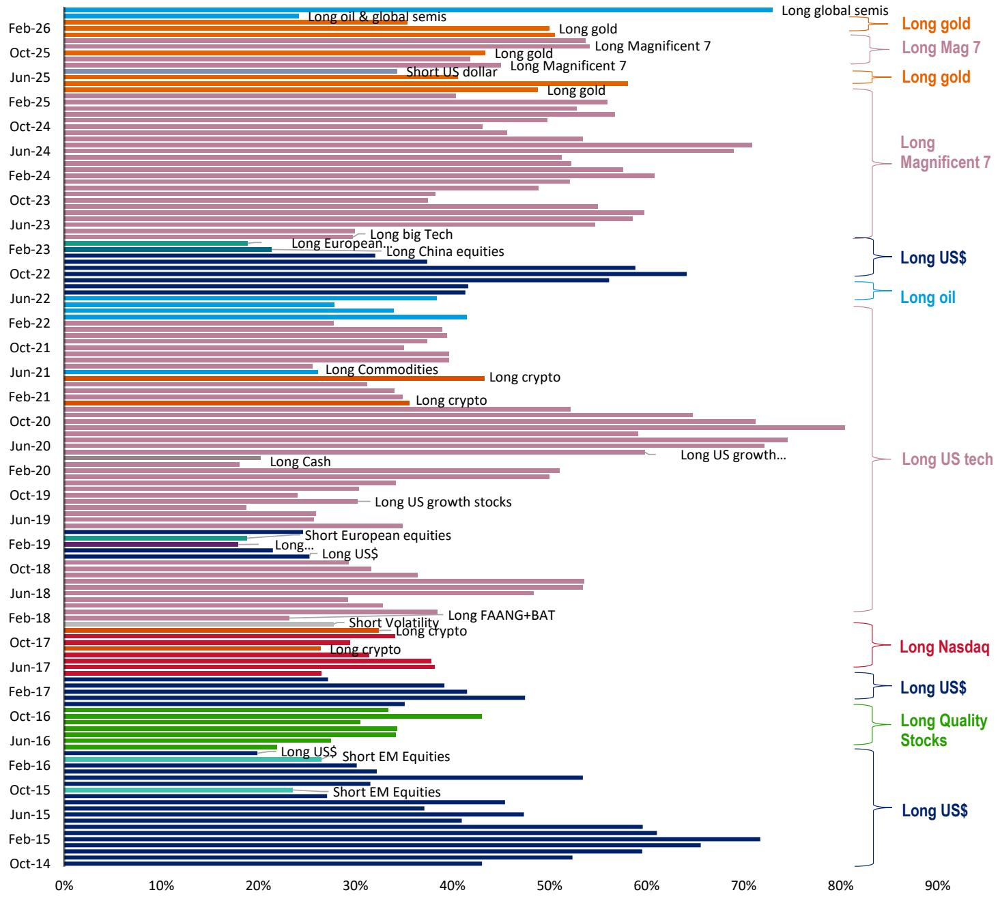  
Source: BofA Global Fund Manager Survey   
BofA GLOBAL RESEARCH

- This chart shows the full history of the most “crowded trade” according to BofA’s monthly Global Fund Manager Survey.   
- The market leadership has been relatively narrow since 2013, shifting from high yielding debt; long US\$; long Quality; long Tech; long Emerging Markets; long US Treasuries, long US tech & growth stocks, long Bitcoin, long commodities, long tech, long commodities, long US dollar, long Magnificent Seven, short US dollar, long gold, long oil, long global semiconductors.   
- The #1 FMS most crowded trade in May is long global semiconductors (73%) followed by long Magnificent 7 (14%), and long oil (6%).

# BofA Global FMS Rules & Tools

The Global FMS Rules & Tools are designed to help investors determine risk appetite, rotation opportunities, and tactical entry points.

Table 1: BofA Global FMS Cash Rule and Bull & Bear Indicator

Current reading of BofA Global FMS Cash Rule and Bull & Bear Indicator

<table><tr><td></td><td>Category</td><td>Current reading</td><td>Current signal</td></tr><tr><td>BofA Global FMS Cash Rule</td><td>Contrarian</td><td>3.9%</td><td>Sell</td></tr><tr><td colspan="4">Buy global equities when cash at or above 5.0%; sell when cash at or below 4.0%</td></tr><tr><td>BofA Bull &amp; Bear Indicator</td><td>Contrarian</td><td>7.8</td><td>Neutral</td></tr></table>

Buy global equities when the indicator falls below 2.0; sell when it rises above 8.0   
Source: BofA Global Investment Strategy

BofA GLOBAL RESEARCH

Disclaimer: The indicators identified as BofA Global FMS Cash Rule and BofA Bull & Bear Indicator above are intended to be indicative metrics only and may not be used for reference purposes or as a measure of performance for any financial instrument or contract, or otherwise relied upon by third parties for any other purpose, without the prior written consent of BofA Global Research. These indicators were not created to act as a benchmark.

For full details please see: Global Investment Strategy: The BofA Global FMS Rules & Tools, 12 November 2020 and the Global Investment Strategy: BofA Bull & Bear Indicator revamp 11 December 2025

# Investors on Macro

Chart 25: Net % of FMS investors who see a stronger global economy in next 12 months
Net % of FMS investors expecting stronger economy   
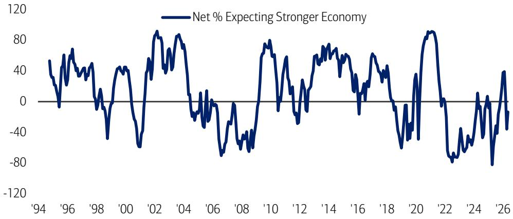

line

| Year | Net % Expecting Stronger Economy |
| ---- | --------------------------------- |
| '94  | ~50                               |
| '96  | ~70                               |
| '98  | ~40                               |
| '00  | ~40                               |
| '02  | ~80                               |
| '04  | ~80                               |
| '06  | ~-40                              |
| '08  | ~-80                              |
| '10  | ~80                               |
| '12  | ~-40                              |
| '14  | ~70                               |
| '16  | ~-20                              |
| '18  | ~-60                              |
| '20  | ~80                               |
| '22  | ~-80                              |
| '24  | ~-40                              |
| '26  | ~40                               |

Source: BofA Global Fund Manager Survey   
BofA GLOBAL RESEARCH

On the macro...

May FMS showed net 14% of investors expecting a weaker economy in the next 12 months (from net 36% last month)

Global expectations on the economy turned positive in Nov'25.

Chart 26: How FMS investors would describe the global economy over the next 12 months FMS expectations for the global economy over the next 12 months?   
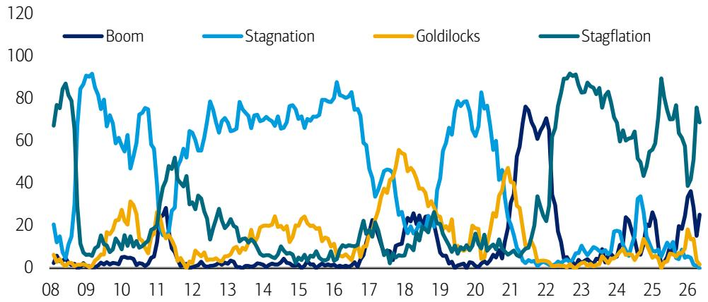

line

| Year | Boom | Stagnation | Goldilocks | Stagflation |
|------|------|------------|------------|-------------|
| 08   | 0    | 20         | 5          | 70          |
| 09   | 0    | 90         | 5          | 85          |
| 10   | 0    | 60         | 30         | 15          |
| 11   | 0    | 75         | 25         | 40          |
| 12   | 0    | 60         | 10         | 30          |
| 13   | 0    | 70         | 15         | 25          |
| 14   | 0    | 75         | 20         | 20          |
| 15   | 0    | 70         | 25         | 15          |
| 16   | 0    | 85         | 30         | 10          |
| 17   | 0    | 45         | 40         | 20          |
| 18   | 20   | 50         | 55         | 15          |
| 19   | 20   | 60         | 30         | 20          |
| 20   | 20   | 80         | 25         | 30          |
| 21   | 75   | 40         | 45         | 90          |
| 22   | 75   | 10         | 10         | 60          |
| 23   | 35   | 15         | 5          | 90          |
| 24   | 20   | 30         | 10         | 70          |
| 25   | 25   | 35         | 15         | 85          |
| 26   | 35   | 10         | 5          | 75          |

Source: BofA Global Fund Manager Survey.   
BofA GLOBAL RESEARCH

69% of FMS investors say they expect "stagflation" (below-trend growth & above-trend inflation), vs 76% a month ago.

25% say “boom” (above-trend growth & above-trend inflation), from 15%.

2% say “goldilocks” (above-trend growth & below-trend inflation), vs 4% a month ago.

0% say “stagnation” (below-trend growth & below-trend inflation), from 1%.

Chart 27: Net % of FMS investors that think global CPI (in YoY terms) will be higher
Net % of FMS investors expecting higher inflation   
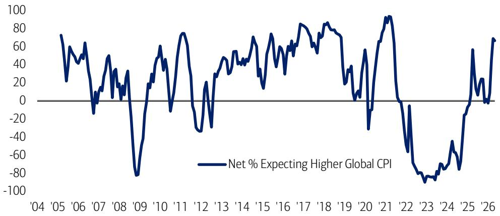

line

| Year | Net % Expecting Higher Global CPI |
| ---- | --------------------------------- |
| '04  | ~70                               |
| '05  | ~60                               |
| '06  | ~50                               |
| '07  | ~30                               |
| '08  | ~20                               |
| '09  | ~-80                              |
| '10  | ~60                               |
| '11  | ~75                               |
| '12  | ~-40                              |
| '13  | ~30                               |
| '14  | ~50                               |
| '15  | ~60                               |
| '16  | ~70                               |
| '17  | ~80                               |
| '18  | ~85                               |
| '19  | ~70                               |
| '20  | ~-30                              |
| '21  | ~90                               |
| '22  | ~-60                              |
| '23  | ~-90                              |
| '24  | ~-70                              |
| '25  | ~-40                              |
| '26  | ~70                               |

Source: BofA Global Fund Manager Survey.   
BofA GLOBAL RESEARCH

Net 66% of FMS investors expect global CPI to be higher in 12 months' time...vs net 69% last month.

Chart 28: What would you most like to see companies do with cash flow?   
What FMS investors would most like to see companies do with cash flow   
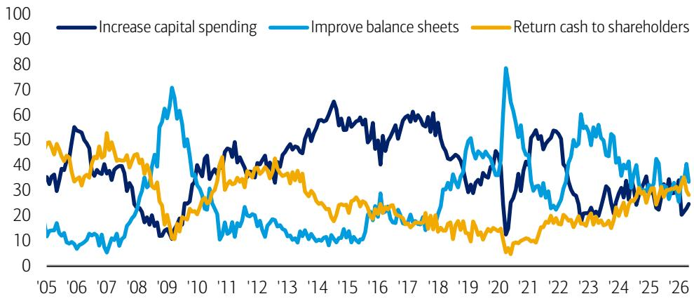

line

| Year | Increase capital spending | Improve balance sheets | Return cash to shareholders |
|------|---------------------------|-------------------------|----------------------------|
| '05  | 35                        | 15                      | 48                         |
| '06  | 55                        | 10                      | 45                         |
| '07  | 40                        | 15                      | 50                         |
| '08  | 30                        | 20                      | 40                         |
| '09  | 15                        | 70                      | 15                         |
| '10  | 40                        | 25                      | 30                         |
| '11  | 45                        | 15                      | 35                         |
| '12  | 40                        | 20                      | 35                         |
| '13  | 45                        | 15                      | 35                         |
| '14  | 50                        | 10                      | 30                         |
| '15  | 60                        | 15                      | 25                         |
| '16  | 55                        | 20                      | 20                         |
| '17  | 60                        | 25                      | 25                         |
| '18  | 55                        | 30                      | 20                         |
| '19  | 45                        | 35                      | 15                         |
| '20  | 15                        | 80                      | 10                         |
| '21  | 40                        | 30                      | 15                         |
| '22  | 50                        | 25                      | 20                         |
| '23  | 45                        | 60                      | 25                         |
| '24  | 35                        | 40                      | 30                         |
| '25  | 30                        | 45                      | 35                         |
| '26  | 25                        | 40                      | 30                         |

Source: BofA Global Fund Manager Survey.   
BofA GLOBAL RESEARCH

Asked what companies should do with cash flow...28% said "return cash to shareholders," 34% said "improve balance sheets," and 25% said "improve capital spending."

Chart 29: Expectations for investment performance over the next 12 months   
Over the next 12 months, net % FMS investors think...   
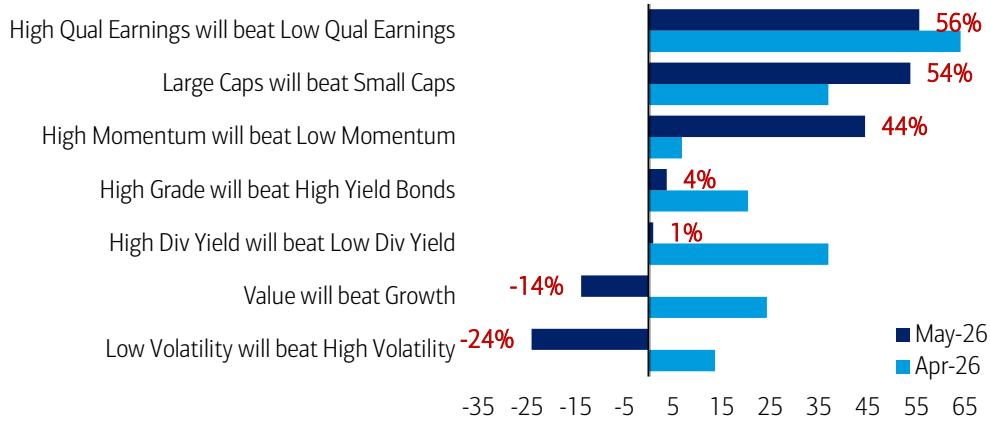

bar

| Category | May-26 (%) | Apr-26 (%) |
| :--- | :--- | :--- |
| High Qual Earnings will beat Low Qual Earnings | 56 | 54 |
| Large Caps will beat Small Caps | 54 | 35 |
| High Momentum will beat Low Momentum | 44 | 5 |
| High Grade will beat High Yield Bonds | 4 | 18 |
| High Div Yield will beat Low Div Yield | 1 | 35 |
| Value will beat Growth | -14 | 24 |
| Low Volatility will beat High Volatility | -24 | 15 |

Source: BofA Global Fund Manager Survey

Per May FMS...

Net 56% say high-quality earnings will outperform low-quality earnings (from 64%).

Net 44% say high momentum will beat low momentum (from 7%).

Net 14% say growth will beat value, from 24% saying value will beat growth last month.

Net 54% say high-dividend yield will outperform low-dividend yield (from 37%).

BofA GLOBAL RESEARCH

# Investors on AI, Policy and Risks

Chart 30: 50% of FMS investors say AI stocks are not in a bubble, 40% say "yes"   
Do you think that AI stocks are in a bubble?   
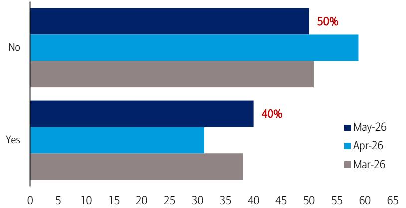

bar

| Category | Mar-26 (%) | Apr-26 (%) | May-26 (%) |
| :--- | :--- | :--- | :--- |
| No | 50 | 59 | 50 |
| Yes | 38 | 31 | 40 |

Source: BofA Global Fund Manager Survey.   
BofA GLOBAL RESEARCH

Chart 31: FMS investors taking higher than normal risk levels   
What level of risk do you think you're currently taking relative to your benchmark?   
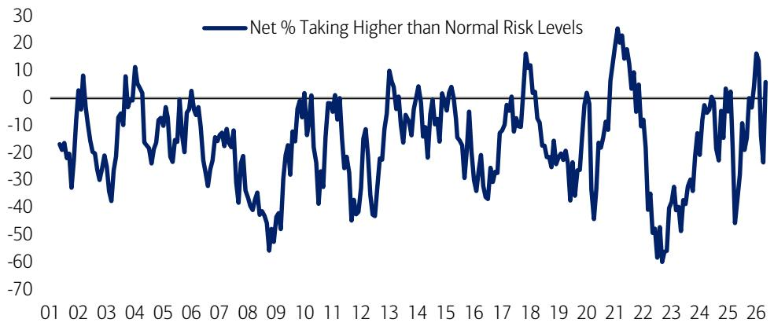

line

| Year | Net % Taking Higher than Normal Risk Levels |
| ---- | ------------------------------------------ |
| 01   | -20                                        |
| 02   | 10                                         |
| 03   | -40                                        |
| 04   | 10                                         |
| 05   | -20                                        |
| 06   | 0                                          |
| 07   | -10                                        |
| 08   | -40                                        |
| 09   | -50                                        |
| 10   | -10                                        |
| 11   | 0                                          |
| 12   | -40                                        |
| 13   | 10                                         |
| 14   | -20                                        |
| 15   | 0                                          |
| 16   | -30                                        |
| 17   | -20                                        |
| 18   | 15                                         |
| 19   | -20                                        |
| 20   | -40                                        |
| 21   | 25                                         |
| 22   | -60                                        |
| 23   | -30                                        |
| 24   | -20                                        |
| 25   | 0                                          |
| 26   | 15                                         |

Source: BofA Global Fund Manager Survey   
BofA GLOBAL RESEARCH

Chart 32: FMS Financial Market Stability Risks Indicator at 0.8   
FMS Financial Market Stability Risks Indicator vs S&P 500 YoY %   
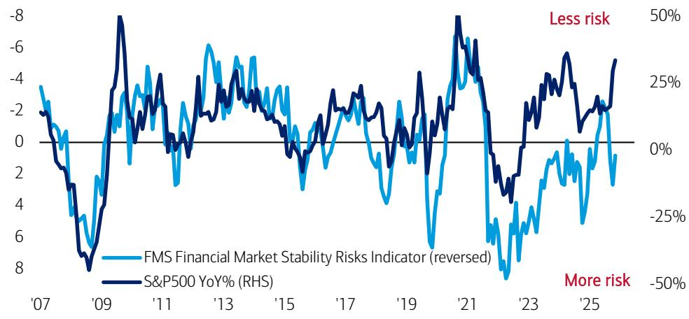

line

| Year | FMS Financial Market Stability Risks Indicator (reversed) | S&P500 YoY% (RHS) |
|------|---------------------------------------------------------------|-------------------|
| '07  | ~-4                                                           | ~-2%              |
| '09  | ~-6                                                           | ~-8%              |
| '11  | ~-3                                                           | ~-4%              |
| '13  | ~-5                                                           | ~-3%              |
| '15  | ~-4                                                           | ~-2%              |
| '17  | ~-3                                                           | ~-1%              |
| '19  | ~-4                                                           | ~-3%              |
| '21  | ~-6                                                           | ~-5%              |
| '23  | ~-8                                                           | ~-25%             |
| '25  | ~-4                                                           | ~-25%             |

Source: BofA Global Fund Manager Survey, Bloomberg

On Al...

Asked if AI stocks are in a bubble, 50% of FMS investors said no (40% said yes).

FMS investors are taking net 6% higher than normal risk levels (vs 24% lower than normal risk levels last month).

FMS Financial Market Stability Risks Indicator falls to 0.8 from 2.7.

The FMS Financial Market Stability Risks Indicator is intended to be an indicative metric only and may not be used for reference purposes or as a measure of performance for any financial instrument or contract, or otherwise relied upon by third parties for any other purpose, without the prior written consent of BofA Global Research. This indicator was not created to act as a benchmark.

More info and methodology on the FMS Financial Market Stability Risks Indicator can be found in the Nov'22 Global FMS.

BofA GLOBAL RESEARCH

Chart 33: FMS rating of potential risks to Financial Market Stability   
Components of the FMS Financial Market Stability Risks Indicator   
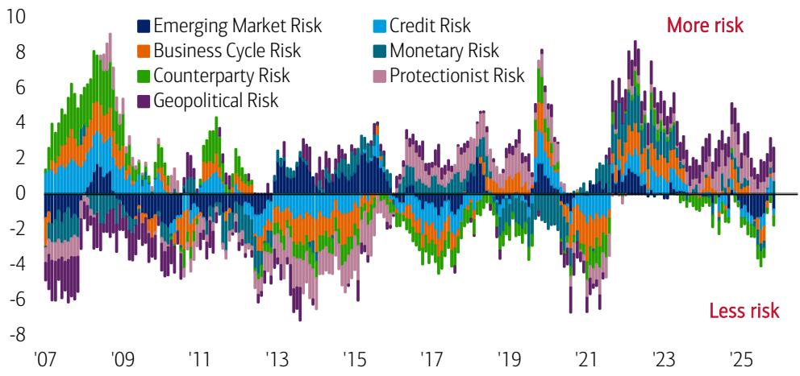

bar_stacked

| Year | Emerging Market Risk | Business Cycle Risk | Counterparty Risk | Geopolitical Risk | Credit Risk | Monetary Risk | Protectionist Risk |
|------|------------------------|----------------------|--------------------|-------------------|-------------|---------------|--------------------|
| '07  | ~-3                    | ~-2                  | ~-1                | ~-4               | ~-1         | ~-1           | ~-1                |
| '09  | ~-2                    | ~-1                  | ~0                 | ~-3               | ~-1         | ~-1           | ~-1                |
| '11  | ~-1                    | ~0                   | ~1                 | ~-2               | ~-1         | ~-1           | ~-1                |
| '13  | ~0                     | ~1                   | ~0                 | ~-1               | ~0          | ~0            | ~0                 |
| '15  | ~1                     | ~0                   | ~1                 | ~0                | ~1          | ~1            | ~1                 |
| '17  | ~0                     | ~1                   | ~0                 | ~1                | ~0          | ~0            | ~0                 |
| '19  | ~1                     | ~0                   | ~1                 | ~0                | ~1          | ~1            | ~1                 |
| '21  | ~0                     | ~1                   | ~0                 | ~-6               | ~0          | ~0            | ~0                 |
| '23  | ~1                     | ~0                   | ~1                 | ~0                | ~1          | ~1            | ~1                 |
| '25  | ~0                     | ~1                   | ~0                 | ~3                | ~0          | ~0            | ~0                 |

Source: BofA Global Fund Manager Survey   
BofA GLOBAL RESEARCH

The chart shows the individual z-scores of each response to how FMS investors rated potential risks to financial market stability since '07.

In May, 3 risk factors (out of 7) increased relative to the previous month...monetary, protectionist, and geopolitical.

# FMS Asset Allocation

Chart 34: Net % AA Say they are overweight Equities   
Net% of FMS investors overweight equities   
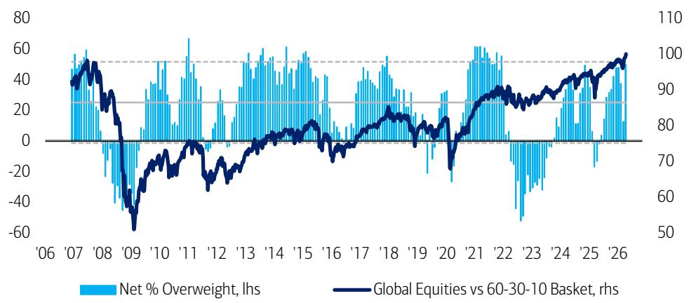

bar_line

| Year | Net % Overweight, lhs | Global Equities vs 60-30-10 Basket, rhs |
|------|------------------------|------------------------------------------|
| '06  | ~50                    | ~40                                      |
| '07  | ~60                    | ~50                                      |
| '08  | ~40                    | ~30                                      |
| '09  | ~-50                   | ~-60                                     |
| '10  | ~50                    | ~-20                                     |
| '11  | ~65                    | ~-10                                     |
| '12  | ~30                    | ~-30                                     |
| '13  | ~50                    | ~-10                                     |
| '14  | ~60                    | ~0                                       |
| '15  | ~55                    | ~10                                      |
| '16  | ~40                    | ~-10                                     |
| '17  | ~50                    | ~-5                                      |
| '18  | ~45                    | ~10                                      |
| '19  | ~35                    | ~15                                      |
| '20  | ~30                    | ~-20                                     |
| '21  | ~60                    | ~20                                      |
| '22  | ~55                    | ~30                                      |
| '23  | ~-50                   | ~35                                      |
| '24  | ~40                    | ~45                                      |
| '25  | ~50                    | ~55                                      |
| '26  | ~60                    | ~60                                      |

Source: BofA Global Fund Manager Survey, Datastream   
BofA GLOBAL RESEARCH

Chart 35: Net % AA Say they are overweight Bonds   
Net% of FMS investors overweight bonds   
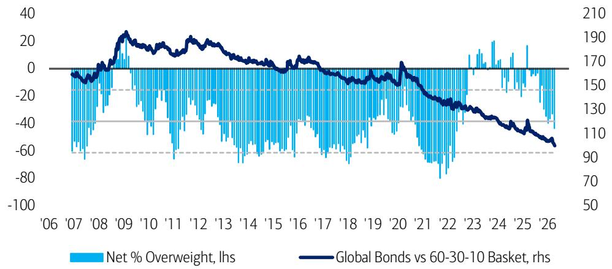

bar_line

| Year | Net % Overweight, lhs | Global Bonds vs 60-30-10 Basket, rhs |
|------|------------------------|----------------------------------------|
| '06  | -80                    | 150                                    |
| '07  | -60                    | 140                                    |
| '08  | -40                    | 130                                    |
| '09  | -20                    | 120                                    |
| '10  | 0                      | 110                                    |
| '11  | 20                     | 100                                    |
| '12  | 40                     | 90                                     |
| '13  | 60                     | 80                                     |
| '14  | 80                     | 70                                     |
| '15  | 100                    | 60                                     |
| '16  | 120                    | 50                                     |
| '17  | 140                    | 40                                     |
| '18  | 160                    | 30                                     |
| '19  | 180                    | 20                                     |
| '20  | 200                    | 10                                     |
| '21  | 220                    | 0                                      |
| '22  | 240                    | -10                                    |
| '23  | 260                    | -20                                    |
| '24  | 280                    | -30                                    |
| '25  | 300                    | -40                                    |
| '26  | 320                    | -50                                    |

Source: BofA Global Fund Manager Survey, Datastream   
BofA GLOBAL RESEARCH

Chart 36: Net % AA Say they are overweight Cash   
Net% of FMS investors overweight cash   
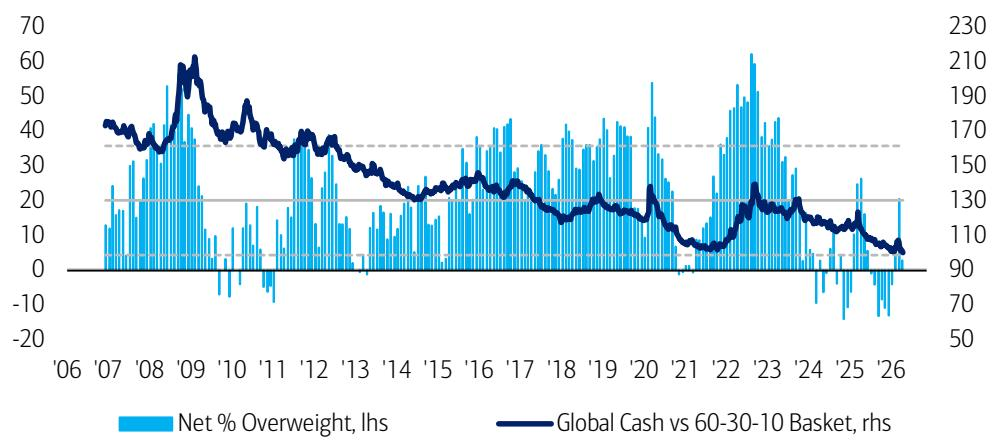

bar_line

| Year | Net % Overweight, lhs | Global Cash vs 60-30-10 Basket, rhs |
|------|------------------------|--------------------------------------|
| '06  | ~15                    | ~40                                  |
| '07  | ~25                    | ~42                                  |
| '08  | ~35                    | ~45                                  |
| '09  | ~45                    | ~60                                  |
| '10  | ~20                    | ~45                                  |
| '11  | ~15                    | ~40                                  |
| '12  | ~25                    | ~35                                  |
| '13  | ~30                    | ~30                                  |
| '14  | ~20                    | ~25                                  |
| '15  | ~25                    | ~20                                  |
| '16  | ~35                    | ~25                                  |
| '17  | ~40                    | ~20                                  |
| '18  | ~35                    | ~15                                  |
| '19  | ~40                    | ~15                                  |
| '20  | ~50                    | ~15                                  |
| '21  | ~30                    | ~10                                  |
| '22  | ~45                    | ~15                                  |
| '23  | ~60                    | ~20                                  |
| '24  | ~30                    | ~15                                  |
| '25  | ~25                    | ~10                                  |
| '26  | ~20                    | ~5                                   |

Source: BofA Global Fund Manager Survey, Datastream

On asset allocation...

FMS equity allocation increased to 50% overweight, from 13% last month.

Current allocation is 0.9 stdev above its long-term average.

FMS bond allocation decreased to 44% net underweight, vs 33% underweight last month.

Current allocation is 0.2 stdev below its long-term average.

FMS cash allocation is net 3% overweight (from net 20% overweight a month ago).

Current allocation is 1.2 stdev below its long-term average.

BofA GLOBAL RESEARCH

Chart 37: Net % AA Say they are overweight Real Estate   
Net% of FMS investors overweight Real Estate   
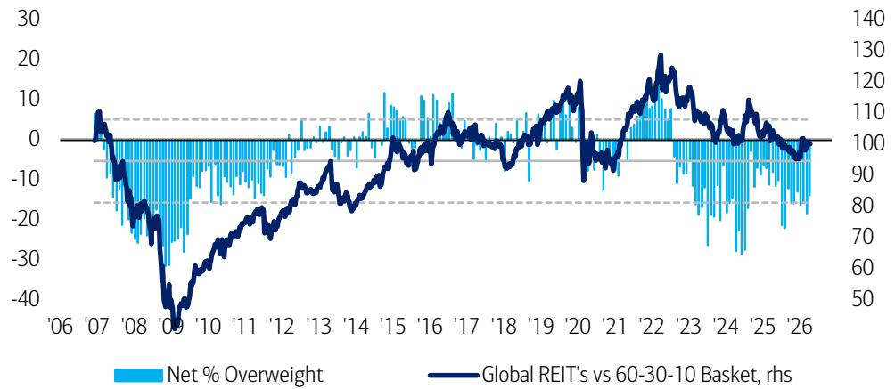

bar_line

| Year | Net % Overweight | Global REIT's vs 60-30-10 Basket, rhs |
|------|------------------|----------------------------------------|
| '06  | ~5               | ~100                                   |
| '07  | ~0               | ~100                                   |
| '08  | ~-20             | ~90                                    |
| '09  | ~-40             | ~50                                    |
| '10  | ~-10             | ~70                                    |
| '11  | ~-5              | ~80                                    |
| '12  | ~0               | ~90                                    |
| '13  | ~5               | ~100                                   |
| '14  | ~10              | ~110                                   |
| '15  | ~5               | ~120                                   |
| '16  | ~0               | ~110                                   |
| '17  | ~5               | ~100                                   |
| '18  | ~0               | ~90                                    |
| '19  | ~5               | ~100                                   |
| '20  | ~10              | ~120                                   |
| '21  | ~5               | ~110                                   |
| '22  | ~10              | ~130                                   |
| '23  | ~5               | ~120                                   |
| '24  | ~0               | ~100                                   |
| '25  | ~5               | ~90                                    |
| '26  | ~0               | ~80                                    |

Source: BofA Global Fund Manager Survey, Datastream   
BofA GLOBAL RESEARCH

Chart 38: Net % AA Say they are overweight Commodities   
Net% of FMS investors overweight commodities   
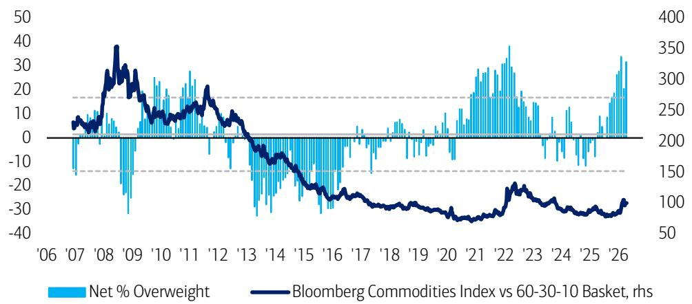

bar_line

| Year | Net % Overweight | Bloomberg Commodities Index vs 60-30-10 Basket, rhs |
|------|------------------|-----------------------------------------------------|
| '06  | ~5               | ~5                                                  |
| '07  | ~10              | ~10                                                 |
| '08  | ~25              | ~350                                                |
| '09  | ~15              | ~250                                                |
| '10  | ~10              | ~200                                                |
| '11  | ~15              | ~150                                                |
| '12  | ~10              | ~100                                                |
| '13  | ~5               | ~50                                                 |
| '14  | ~0               | ~0                                                  |
| '15  | ~-5              | ~-50                                                |
| '16  | ~-10             | ~-100                                               |
| '17  | ~-15             | ~-150                                               |
| '18  | ~-10             | ~-200                                               |
| '19  | ~-5              | ~-250                                               |
| '20  | ~0               | ~-300                                               |
| '21  | ~5               | ~-350                                               |
| '22  | ~10              | ~-300                                               |
| '23  | ~5               | ~-250                                               |
| '24  | ~10              | ~-300                                               |
| '25  | ~5               | ~-350                                               |
| '26  | ~10              | ~-300                                               |

Source: BofA Global Fund Manager Survey, Datastream.   
BofA GLOBAL RESEARCH

Chart 39: Gold Valuation and Gold Price (\$/oz)   
Net% of FMS investors saying gold overvalued   
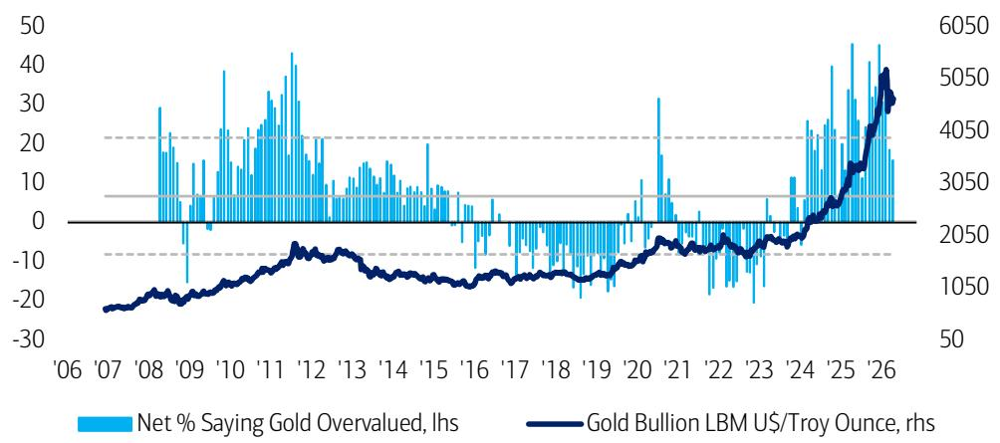

bar_line

| Year | Net % Saying Gold Overvalued, Ihs | Gold Bullion LBM US/Troy Ounce, rhs |
|------|-----------------------------------|-------------------------------------|
| '06  | -                 | -                                   |
| '07  | -                 | -20                                 |
| '08  | -                 | -15                                 |
| '09  | -                 | -10                                 |
| '10  | -                 | -5                                  |
| '11  | -                 | 0                                   |
| '12  | -                 | 5                                   |
| '13  | -                 | 10                                  |
| '14  | -                 | 15                                  |
| '15  | -                 | 20                                  |
| '16  | -                 | 25                                  |
| '17  | -                 | 30                                  |
| '18  | -                 | 35                                  |
| '19  | -                 | 40                                  |
| '20  | -                 | 45                                  |
| '21  | -                 | 50                                  |
| '22  | -                 | 55                                  |
| '23  | -                 | 60                                  |
| '24  | -                 | 65                                  |
| '25  | -                 | 70                                  |
| '26  | -                 | 75                                  |

Source: BofA Global Fund Manager Survey, Datastream.

FMS real estate allocation is net 14% underweight (vs 18% one month ago).

Current allocation is 0.8 stdev below its long-term average.

FMS commodities allocation is net 31% overweight (from net 20% overweight last month).

Current allocation is 2.0 stdev above its long-term average.

Net 16% of FMS investors say gold is overvalued (from 18% last month).

BofA GLOBAL RESEARCH

# Currencies extremes

Chart 40: USD Valuation and Trade weighted index   
Net% of FMS investors saying USD overvalued   
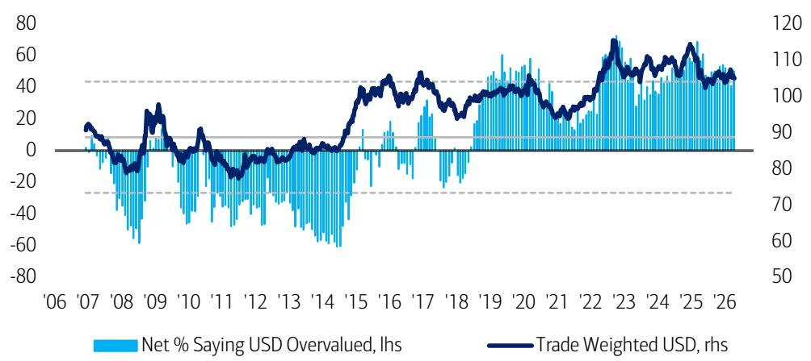

bar_line

| Year | Net % Saying USD Overvalued, Ihs | Trade Weighted USD, rhs |
|------|----------------------------------|--------------------------|
| '06  | ~0                               | ~10                      |
| '07  | ~-20                             | ~8                       |
| '08  | ~-60                             | ~-20                     |
| '09  | ~-40                             | ~20                      |
| '10  | ~-20                             | ~-20                     |
| '11  | ~-40                             | ~-20                     |
| '12  | ~-20                             | ~-20                     |
| '13  | ~-40                             | ~-20                     |
| '14  | ~-60                             | ~-20                     |
| '15  | ~-20                             | ~40                      |
| '16  | ~20                              | ~60                      |
| '17  | ~40                              | ~80                      |
| '18  | ~20                              | ~60                      |
| '19  | ~40                              | ~80                      |
| '20  | ~60                              | ~100                     |
| '21  | ~40                              | ~80                      |
| '22  | ~60                              | ~100                     |
| '23  | ~80                              | ~120                     |
| '24  | ~60                              | ~100                     |
| '25  | ~80                              | ~120                     |
| '26  | ~60                              | ~100                     |

Source: BofA Global Fund Manager Survey, Datastream   
BofA GLOBAL RESEARCH

Chart 41: EUR valuation and Trade weighted index   
Net% of FMS investors saying EUR overvalued   
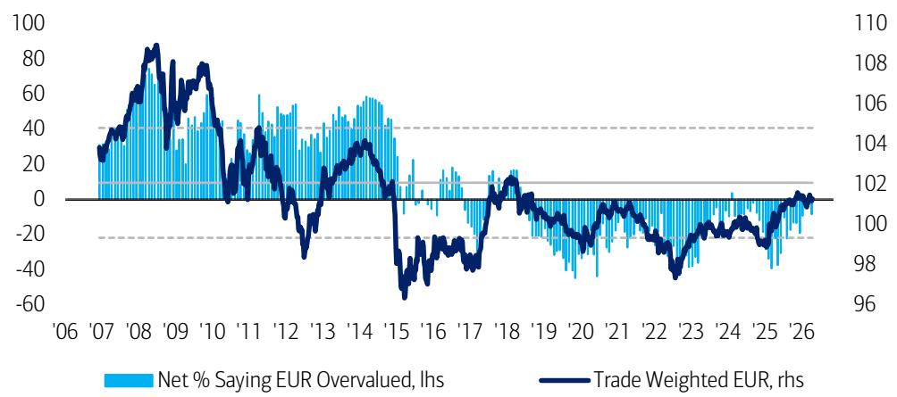

bar_line

| Year | Net % Saying EUR Overvalued, Ihs | Trade Weighted EUR, rhs |
|------|----------------------------------|--------------------------|
| '06  | ~0                               | ~104                     |
| '07  | ~20                              | ~106                     |
| '08  | ~80                              | ~108                     |
| '09  | ~60                              | ~106                     |
| '10  | ~40                              | ~104                     |
| '11  | ~20                              | ~102                     |
| '12  | ~40                              | ~104                     |
| '13  | ~60                              | ~106                     |
| '14  | ~40                              | ~108                     |
| '15  | ~20                              | ~106                     |
| '16  | ~0                               | ~104                     |
| '17  | ~20                              | ~102                     |
| '18  | ~40                              | ~104                     |
| '19  | ~20                              | ~102                     |
| '20  | ~0                               | ~104                     |
| '21  | ~20                              | ~106                     |
| '22  | ~40                              | ~108                     |
| '23  | ~20                              | ~106                     |
| '24  | ~0                               | ~104                     |
| '25  | ~20                              | ~102                     |
| '26  | ~0                               | ~104                     |

Source: BofA Global Fund Manager Survey, Datastream   
BofA GLOBAL RESEARCH

Chart 42: GBP valuation and Trade weighted index   
Net % of FMS investors saying GBP overvalued   
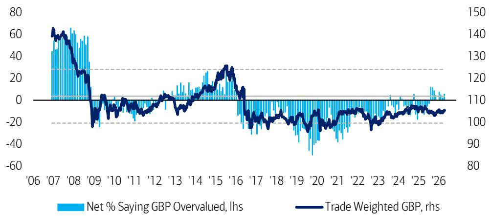

bar_line

| Year | Net % Saying GBP Overvalued, Ihs | Trade Weighted GBP, rhs |
|------|----------------------------------|--------------------------|
| '06  | ~45                              | ~140                     |
| '07  | ~65                              | ~135                     |
| '08  | ~55                              | ~120                     |
| '09  | ~-25                             | ~110                     |
| '10  | ~-10                             | ~105                     |
| '11  | ~-5                              | ~100                     |
| '12  | ~5                               | ~95                      |
| '13  | ~10                              | ~90                      |
| '14  | ~15                              | ~85                      |
| '15  | ~25                              | ~80                      |
| '16  | ~30                              | ~75                      |
| '17  | ~-20                             | ~70                      |
| '18  | ~-15                             | ~65                      |
| '19  | ~-30                             | ~60                      |
| '20  | ~-45                             | ~55                      |
| '21  | ~-30                             | ~50                      |
| '22  | ~-25                             | ~45                      |
| '23  | ~-20                             | ~40                      |
| '24  | ~-15                             | ~35                      |
| '25  | ~-10                             | ~30                      |
| '26  | ~5                               | ~25                      |

Source: BofA Global Fund Manager Survey, Datastream   
BofA GLOBAL RESEARCH

On currencies...

Net 50% of FMS investors say US\$ is overvalued, from net 41% a month ago.

Current valuation is 1.2 stdev above the long-term average.

Net 8% of FMS investors say EUR is undervalued (vs 3% last month).

Current valuation is 0.6 stdev below the long-term average.

Net 6% of FMS investors think GBP is overvalued (vs 2% a month ago).

Current valuation is 0.1 stdev above the long-term average.

# Investor Regional Equity Allocation

Chart 43: Net % AA Say they are overweight US Equities   
Net% of FMS investors overweight US equities   
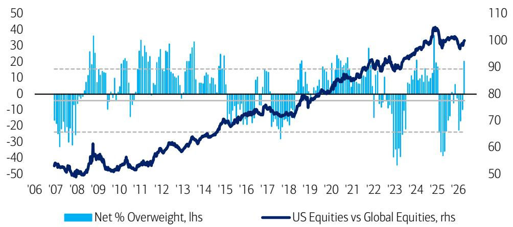

bar_line

| Year | Net % Overweight, lhs | US Equities vs Global Equities, rhs |
|------|------------------------|-------------------------------------|
| '06  | -50                    | 50                                  |
| '07  | -30                    | 55                                  |
| '08  | -20                    | 60                                  |
| '09  | 35                     | 65                                  |
| '10  | 15                     | 70                                  |
| '11  | 25                     | 75                                  |
| '12  | 30                     | 80                                  |
| '13  | 20                     | 85                                  |
| '14  | 35                     | 90                                  |
| '15  | 25                     | 95                                  |
| '16  | 15                     | 100                                 |
| '17  | 10                     | 105                                 |
| '18  | -10                    | 110                                 |
| '19  | -20                    | 105                                 |
| '20  | -10                    | 100                                 |
| '21  | -5                     | 95                                  |
| '22  | -10                    | 90                                  |
| '23  | -40                    | 85                                  |
| '24  | -20                    | 80                                  |
| '25  | -10                    | 75                                  |
| '26  | -5                     | 70                                  |

Source: BofA Global Fund Manager Survey, Datastream   
BofA GLOBAL RESEARCH

Chart 44: Net % AA Say they are overweight Eurozone Equities   
Net% of FMS investors overweight EU equities   
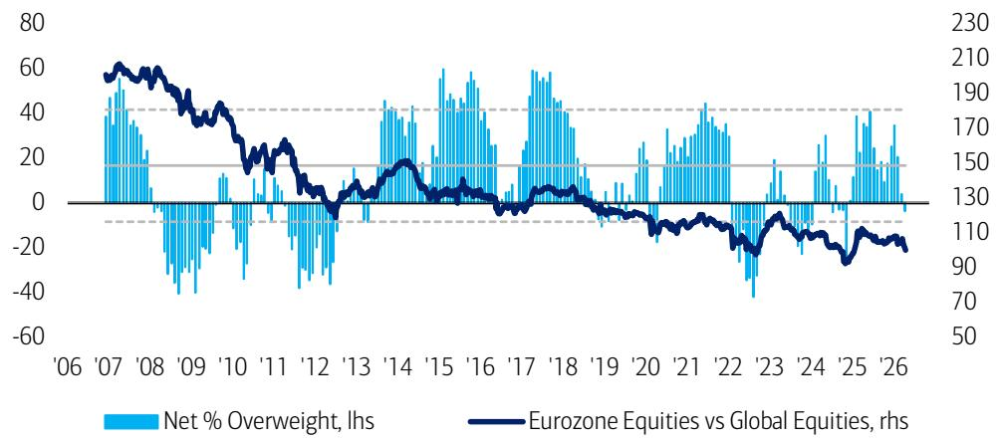

bar_line

| Year | Net % Overweight, Ihs | Eurozone Equities vs Global Equities, rhs |
|------|------------------------|------------------------------------------|
| '06  | ~50                    | ~210                                     |
| '07  | ~40                    | ~200                                     |
| '08  | ~30                    | ~180                                     |
| '09  | ~20                    | ~160                                     |
| '10  | ~10                    | ~140                                     |
| '11  | ~0                     | ~120                                     |
| '12  | ~-10                   | ~100                                     |
| '13  | ~-20                   | ~80                                      |
| '14  | ~-10                   | ~60                                      |
| '15  | ~0                     | ~40                                      |
| '16  | ~10                    | ~20                                      |
| '17  | ~20                    | ~0                                       |
| '18  | ~30                    | ~-20                                     |
| '19  | ~40                    | ~-40                                     |
| '20  | ~50                    | ~-60                                     |
| '21  | ~60                    | ~-80                                     |
| '22  | ~70                    | ~-100                                    |
| '23  | ~80                    | ~-120                                    |
| '24  | ~90                    | ~-140                                    |
| '25  | ~100                   | ~-160                                    |
| '26  | ~110                   | ~-180                                    |

Source: BofA Global Fund Manager Survey, Datastream   
BofA GLOBAL RESEARCH

Chart 45: Net % AA Say they are overweight EM Equities   
Net% of FMS investors overweight EM equities   
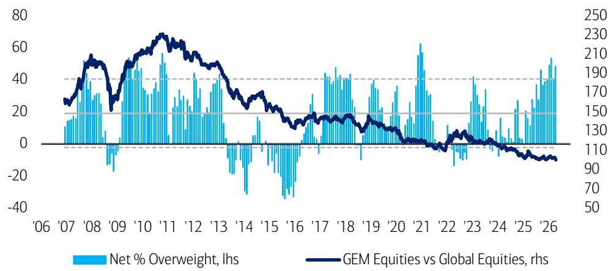

bar_line

| Year | Net % Overweight, Ihs | GEM Equities vs Global Equities, rhs |
|------|------------------------|--------------------------------------|
| '06  | ~10                    | ~25                                  |
| '07  | ~20                    | ~30                                  |
| '08  | ~40                    | ~50                                  |
| '09  | ~30                    | ~40                                  |
| '10  | ~50                    | ~60                                  |
| '11  | ~60                    | ~70                                  |
| '12  | ~50                    | ~60                                  |
| '13  | ~40                    | ~50                                  |
| '14  | ~30                    | ~40                                  |
| '15  | ~20                    | ~30                                  |
| '16  | ~-30                   | ~20                                  |
| '17  | ~40                    | ~15                                  |
| '18  | ~40                    | ~15                                  |
| '19  | ~30                    | ~15                                  |
| '20  | ~20                    | ~10                                  |
| '21  | ~60                    | ~5                                   |
| '22  | ~30                    | ~5                                   |
| '23  | ~40                    | ~5                                   |
| '24  | ~30                    | ~5                                   |
| '25  | ~40                    | ~5                                   |
| '26  | ~50                    | ~5                                   |

Source: BofA Global Fund Manager Survey, Datastream   
BofA GLOBAL RESEARCH

On regional equity allocation...

FMS investors are net 20% overweight US equities (vs net 10% underweight last month).

Current allocation is 1.2 stdev above its long-term average.

FMS investors are 4% underweight Eurozone equities, from net 4% overweight a month ago.

Current allocation is 0.7 stdev below its long-term average.

FMS investors are net 48% overweight EM equities (from net 41% overweight a month ago).

Current allocation is 1.4 stdev above its long-term average.

Chart 46: Net % AA Say they are overweight Japanese Equities   
Net% of FMS investors overweight Japanese equities   
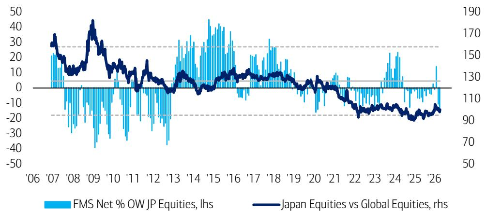

bar_line

| Year | FMS Net % OW JP Equities, lhs | Japan Equities vs Global Equities, rhs |
|------|-------------------------------|----------------------------------------|
| '06  | ~20                           | ~170                                   |
| '07  | ~30                           | ~150                                   |
| '08  | ~-40                          | ~130                                   |
| '09  | ~-30                          | ~110                                   |
| '10  | ~-20                          | ~130                                   |
| '11  | ~-10                          | ~110                                   |
| '12  | ~-30                          | ~130                                   |
| '13  | ~-40                          | ~110                                   |
| '14  | ~-20                          | ~130                                   |
| '15  | ~40                           | ~110                                   |
| '16  | ~30                           | ~130                                   |
| '17  | ~20                           | ~110                                   |
| '18  | ~30                           | ~130                                   |
| '19  | ~20                           | ~110                                   |
| '20  | ~-10                          | ~130                                   |
| '21  | ~-20                          | ~110                                   |
| '22  | ~-30                          | ~90                                    |
| '23  | ~-20                          | ~110                                   |
| '24  | ~-10                          | ~90                                    |
| '25  | ~-20                          | ~70                                    |
| '26  | ~-10                          | ~90                                    |

Source: BofA Global Fund Manager Survey, Datastream   
BofA GLOBAL RESEARCH

Chart 47: Net % AA Say they are overweight UK Equities   
Net% of FMS investors overweight UK equities   
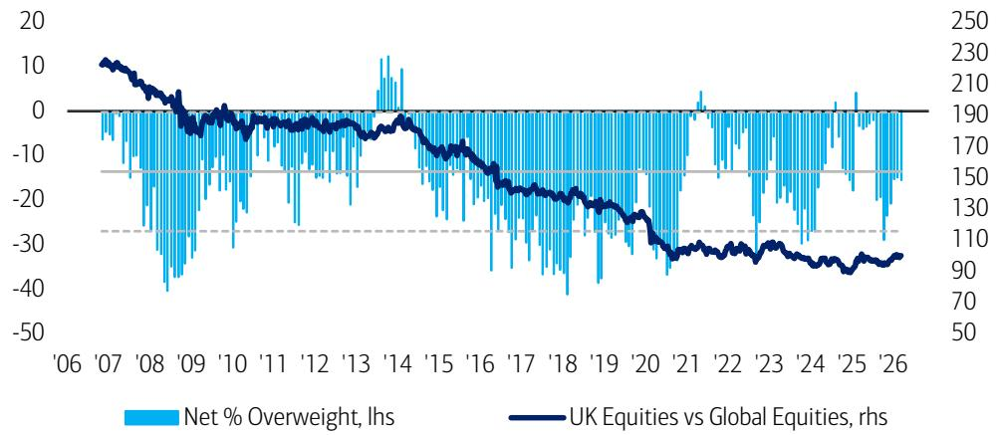

bar_line

| Year | Net % Overweight, lhs | UK Equities vs Global Equities, rhs |
|------|------------------------|-------------------------------------|
| '06  | ~10                    | ~230                                |
| '07  | ~5                     | ~210                                |
| '08  | ~-10                   | ~190                                |
| '09  | ~-20                   | ~170                                |
| '10  | ~-5                    | ~150                                |
| '11  | ~-10                   | ~130                                |
| '12  | ~-15                   | ~110                                |
| '13  | ~-20                   | ~90                                 |
| '14  | ~-10                   | ~70                                 |
| '15  | ~-5                    | ~50                                 |
| '16  | ~-10                   | ~70                                 |
| '17  | ~-15                   | ~90                                 |
| '18  | ~-20                   | ~110                                |
| '19  | ~-25                   | ~130                                |
| '20  | ~-30                   | ~150                                |
| '21  | ~-35                   | ~170                                |
| '22  | ~-30                   | ~190                                |
| '23  | ~-25                   | ~210                                |
| '24  | ~-20                   | ~230                                |
| '25  | ~-15                   | ~250                                |
| '26  | ~-10                   | ~230                                |

Source: BofA Global Fund Manager Survey, Datastream   
BofA GLOBAL RESEARCH

FMS investors are net 13% underweight Japanese equities (vs net 11% overweight last month).

Current allocation is 0.8 stdev below its long-term average.

FMS investors are net 26% underweight UK equities (from 16% from last month).

FMS allocation on UK equities has turned overweight only twice since Aug'21.

Current allocation is 0.9 stdev below its long-term average.

# Investor Sector Allocation

Chart 48: Global Sector Sentiment   
Net % overweight (% saying overweight - % saying underweight)   
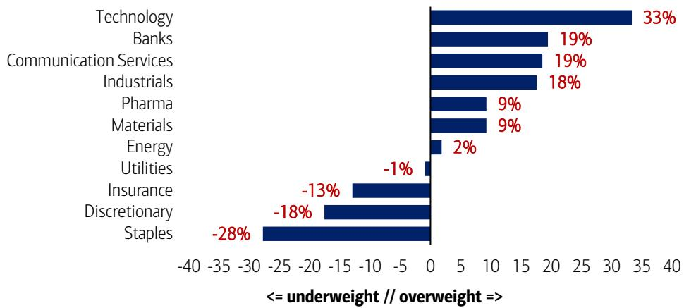

bar

| Sector | Value (%) |
| :--- | :--- |
| Technology | 33 |
| Banks | 19 |
| Communication Services | 19 |
| Industrials | 18 |
| Pharma | 9 |
| Materials | 9 |
| Energy | 2 |
| Utilities | -1 |
| Insurance | -13 |
| Discretionary | -18 |
| Staples | -28 |

Source: BofA Global Fund Manager Survey   
BofA GLOBAL RESEARCH

Chart 49: Global Technology   
Net % of FMS investors overweight technology   
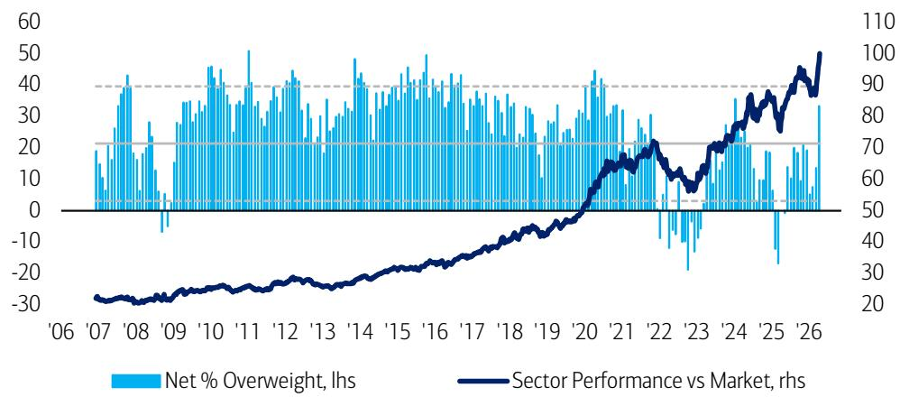

bar_line

| Year | Net % Overweight, lhs | Sector Performance vs Market, rhs |
|------|------------------------|------------------------------------|
| '06  | ~15                    | ~20                                |
| '07  | ~35                    | ~25                                |
| '08  | ~40                    | ~30                                |
| '09  | ~30                    | ~35                                |
| '10  | ~45                    | ~40                                |
| '11  | ~50                    | ~45                                |
| '12  | ~40                    | ~50                                |
| '13  | ~35                    | ~55                                |
| '14  | ~45                    | ~60                                |
| '15  | ~40                    | ~65                                |
| '16  | ~45                    | ~70                                |
| '17  | ~35                    | ~75                                |
| '18  | ~30                    | ~80                                |
| '19  | ~25                    | ~85                                |
| '20  | ~30                    | ~90                                |
| '21  | ~40                    | ~95                                |
| '22  | ~20                    | ~100                               |
| '23  | ~-10                   | ~95                                |
| '24  | ~20                    | ~90                                |
| '25  | ~30                    | ~85                                |
| '26  | ~40                    | ~80                                |

Source: BofA Global Fund Manager Survey, Datastream   
BofA GLOBAL RESEARCH

Chart 50: Global Banks   
Net % of FMS investors overweight banks   
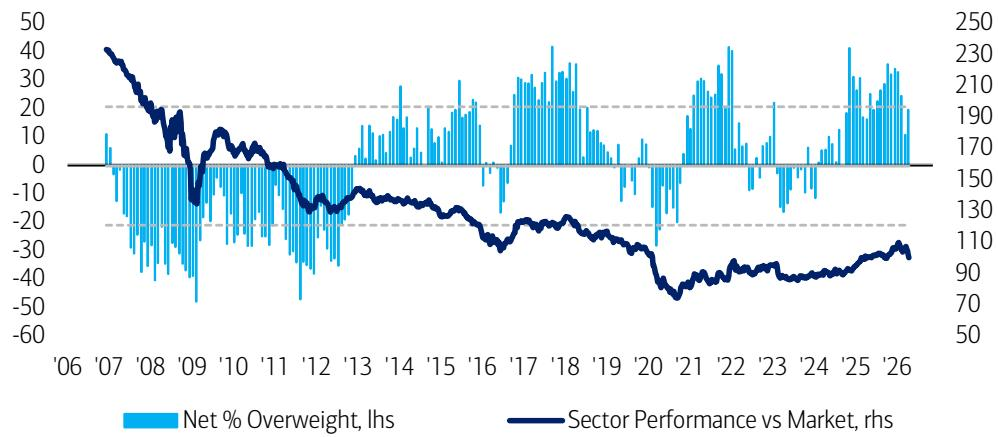

bar_line

| Year | Net % Overweight, lhs | Sector Performance vs Market, rhs |
|------|------------------------|------------------------------------|
| '06  | ~15                    | ~40                                |
| '07  | ~-10                   | ~35                                |
| '08  | ~-20                   | ~25                                |
| '09  | ~-30                   | ~15                                |
| '10  | ~-15                   | ~10                                |
| '11  | ~-10                   | ~5                                 |
| '12  | ~-5                    | ~0                                 |
| '13  | ~-10                   | ~-5                                |
| '14  | ~-5                    | ~-10                               |
| '15  | ~-10                   | ~-15                               |
| '16  | ~-15                   | ~-20                               |
| '17  | ~-20                   | ~-25                               |
| '18  | ~-25                   | ~-30                               |
| '19  | ~-30                   | ~-35                               |
| '20  | ~-35                   | ~-40                               |
| '21  | ~-40                   | ~-45                               |
| '22  | ~-35                   | ~-40                               |
| '23  | ~-30                   | ~-35                               |
| '24  | ~-25                   | ~-30                               |
| '25  | ~-20                   | ~-25                               |
| '26  | ~-15                   | ~-20                               |

Source: BofA Global Fund Manager Survey, Datastream   
BofA GLOBAL RESEARCH

This month FMS investors increased allocation to tech, banks, industrials vs reducing allocation to healthcare, materials, staples.

FMS investors are the most (net) overweight tech, banks, communication services, and most (net) underweight staples, discretionary, insurance.

FMS investors are net 33% overweight technology (from net 14% overweight a month ago).

Current reading is 0.7 stdev above its long-term average.

FMS investors are net 19% overweight banks (from net 11% overweight a month ago).

Current reading is 1.0 stdev above its long-term average.

Chart 51: Global Industrials   
Net % of FMS investors overweight industrials   
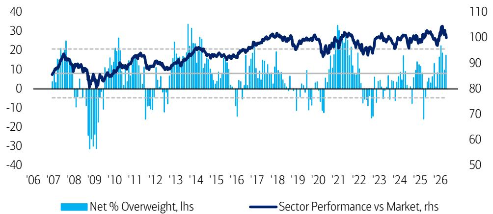

bar_line

| Year | Net % Overweight, lhs | Sector Performance vs Market, rhs |
|------|------------------------|-----------------------------------|
| '06  | ~5                     | ~80                               |
| '07  | ~15                    | ~90                               |
| '08  | ~20                    | ~85                               |
| '09  | ~-30                   | ~70                               |
| '10  | ~10                    | ~80                               |
| '11  | ~15                    | ~90                               |
| '12  | ~10                    | ~85                               |
| '13  | ~15                    | ~90                               |
| '14  | ~20                    | ~95                               |
| '15  | ~15                    | ~90                               |
| '16  | ~10                    | ~95                               |
| '17  | ~15                    | ~100                              |
| '18  | ~20                    | ~100                              |
| '19  | ~15                    | ~95                               |
| '20  | ~10                    | ~90                               |
| '21  | ~20                    | ~100                              |
| '22  | ~15                    | ~95                               |
| '23  | ~10                    | ~90                               |
| '24  | ~15                    | ~95                               |
| '25  | ~20                    | ~100                              |
| '26  | ~25                    | ~105                              |

Source: BofA Global Fund Manager Survey, Datastream   
BofA GLOBAL RESEARCH

Chart 52: Global Consumer Discretionary   
Net % of FMS investors overweight consumer discretionary   
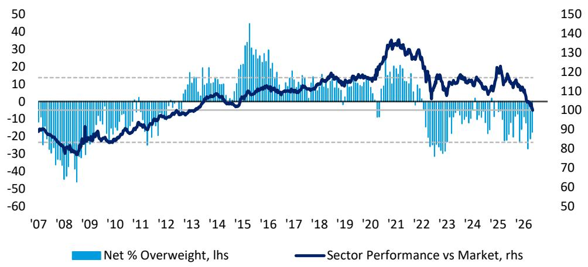

bar_line

| Year | Net % Overweight, Ihs | Sector Performance vs Market, rhs |
|------|------------------------|-----------------------------------|
| '07  | -10                    | 90                                |
| '08  | -30                    | 80                                |
| '09  | -20                    | 70                                |
| '10  | -10                    | 85                                |
| '11  | 0                      | 95                                |
| '12  | 5                      | 100                               |
| '13  | 10                     | 105                               |
| '14  | 15                     | 110                               |
| '15  | 20                     | 115                               |
| '16  | 30                     | 120                               |
| '17  | 10                     | 125                               |
| '18  | 5                      | 130                               |
| '19  | 10                     | 135                               |
| '20  | 15                     | 140                               |
| '21  | 20                     | 145                               |
| '22  | 10                     | 130                               |
| '23  | -10                    | 120                               |
| '24  | -5                     | 115                               |
| '25  | 0                      | 110                               |
| '26  | -10                    | 105                               |

Source: BofA Global Fund Manager Survey, Datastream   
BofA GLOBAL RESEARCH

Chart 53: Global Consumer Staples   
Net % of FMS investors overweight consumer staples   
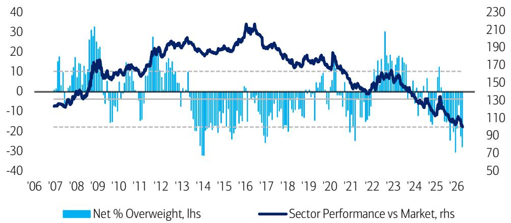

bar_line

| Year | Net % Overweight, Ihs | Sector Performance vs Market, rhs |
|------|------------------------|------------------------------------|
| '06  | ~0                     | ~130                               |
| '07  | ~15                    | ~135                               |
| '08  | ~30                    | ~140                               |
| '09  | ~10                    | ~150                               |
| '10  | ~-10                   | ~160                               |
| '11  | ~-20                   | ~170                               |
| '12  | ~-30                   | ~180                               |
| '13  | ~-20                   | ~190                               |
| '14  | ~-30                   | ~200                               |
| '15  | ~-20                   | ~210                               |
| '16  | ~-10                   | ~220                               |
| '17  | ~0                     | ~210                               |
| '18  | ~-10                   | ~200                               |
| '19  | ~-20                   | ~190                               |
| '20  | ~-30                   | ~180                               |
| '21  | ~-20                   | ~170                               |
| '22  | ~-10                   | ~160                               |
| '23  | ~0                     | ~150                               |
| '24  | ~-10                   | ~140                               |
| '25  | ~-20                   | ~130                               |
| '26  | ~-30                   | ~120                               |

Source: BofA Global Fund Manager Survey, Datastream

FMS investors are net 18% overweight industrials (from net 10% overweight a month ago).

Current reading is 0.8 stdev above its long-term average.

FMS investors are net 18% underweight discretionary, vs net 21% underweight a month ago.

Current reading is 0.7 stdev below its long-term average.

FMS investors are net 28% underweight staples (from net 22% underweight a month ago).

Current reading is 1.7 stdev below its long-term average.

BofA GLOBAL RESEARCH

Chart 54: Global Healthcare   
Net% of FMS investors overweight healthcare   
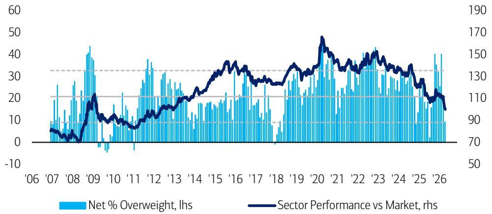

bar_line

| Year | Net % Overweight, Ihs | Sector Performance vs Market, rhs |
|------|------------------------|-----------------------------------|
| '06  | ~5                     | ~70                               |
| '07  | ~10                    | ~80                               |
| '08  | ~40                    | ~90                               |
| '09  | ~20                    | ~110                              |
| '10  | ~10                    | ~100                              |
| '11  | ~15                    | ~110                              |
| '12  | ~30                    | ~120                              |
| '13  | ~25                    | ~130                              |
| '14  | ~20                    | ~140                              |
| '15  | ~25                    | ~150                              |
| '16  | ~30                    | ~160                              |
| '17  | ~25                    | ~150                              |
| '18  | ~20                    | ~140                              |
| '19  | ~25                    | ~150                              |
| '20  | ~30                    | ~170                              |
| '21  | ~35                    | ~160                              |
| '22  | ~30                    | ~150                              |
| '23  | ~35                    | ~140                              |
| '24  | ~30                    | ~130                              |
| '25  | ~25                    | ~120                              |
| '26  | ~20                    | ~110                              |

Source: BofA Global Fund Manager Survey, Datastream   
BofA GLOBAL RESEARCH

Chart 55: Global Materials   
Net% of FMS investors overweight materials   
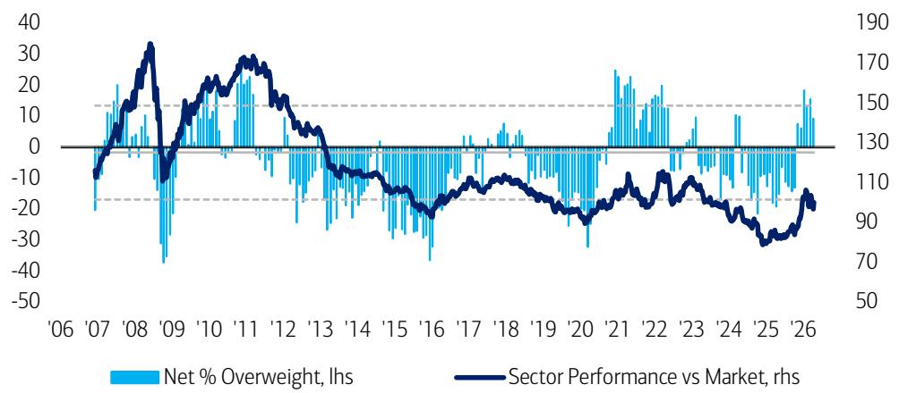

bar_line

| Year | Net % Overweight, Ihs | Sector Performance vs Market, rhs |
|------|------------------------|------------------------------------|
| '06  | -                      | -                                  |
| '07  | -                      | -                                  |
| '08  | -                      | -                                  |
| '09  | -                      | -                                  |
| '10  | -                      | -                                  |
| '11  | -                      | -                                  |
| '12  | -                      | -                                  |
| '13  | -                      | -                                  |
| '14  | -                      | -                                  |
| '15  | -                      | -                                  |
| '16  | -                      | -                                  |
| '17  | -                      | -                                  |
| '18  | -                      | -                                  |
| '19  | -                      | -                                  |
| '20  | -                      | -                                  |
| '21  | -                      | -                                  |
| '22  | -                      | -                                  |
| '23  | -                      | -                                  |
| '24  | -                      | -                                  |
| '25  | -                      | -                                  |
| '26  | -                      | -                                  |

Source: BofA Global Fund Manager Survey, Datastream   
BofA GLOBAL RESEARCH

Chart 56: Global Energy   
Net% of FMS investors overweight energy   
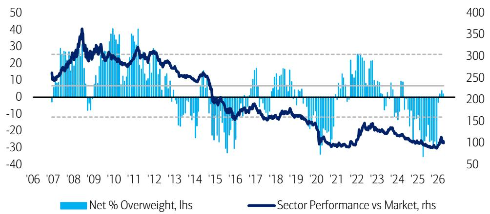

bar_line

| Year | Net % Overweight, lhs | Sector Performance vs Market, rhs |
|------|------------------------|-----------------------------------|
| '06  | ~0                     | ~100                              |
| '07  | ~10                    | ~150                              |
| '08  | ~30                    | ~250                              |
| '09  | ~40                    | ~350                              |
| '10  | ~30                    | ~300                              |
| '11  | ~25                    | ~250                              |
| '12  | ~20                    | ~200                              |
| '13  | ~15                    | ~150                              |
| '14  | ~10                    | ~100                              |
| '15  | ~0                     | ~50                               |
| '16  | ~-10                   | ~0                                |
| '17  | ~-5                    | ~-50                              |
| '18  | ~-10                   | ~-100                             |
| '19  | ~-15                   | ~-150                             |
| '20  | ~-20                   | ~-200                             |
| '21  | ~-25                   | ~-250                             |
| '22  | ~-20                   | ~-200                             |
| '23  | ~-15                   | ~-150                             |
| '24  | ~-10                   | ~-100                             |
| '25  | ~-5                    | ~-50                              |
| '26  | ~0                     | ~0                                |

Source: BofA Global Fund Manager Survey, Datastream

FMS investors are net 9% overweight healthcare, from 17% last month.

Allocation to healthcare has been consistently overweight since Jan'18.

Current reading is 1.0 stdev below its long-term average.

FMS investors are net 9% overweight materials (vs 16% overweight last month).

Current reading is 0.8 stdev above its long-term average.

FMS allocation to energy is net 2% overweight (from net 4% overweight).

Current reading is 0.3 stdev below its long-term average.

BofA GLOBAL RESEARCH

# Global survey demographics data

Table 2: Position / Institution / Approach to Global Equity Strategy

Position / Institution / Approach to Global Equity Strategy

<table><tr><td></td><td>May-26</td><td>Apr-26</td><td>Mar-26</td></tr><tr><td colspan="4">Structure of the panel - by position</td></tr><tr><td>Chief Investment Officer</td><td>30</td><td>27</td><td>34</td></tr><tr><td>Asset Allocator / Strategist / Economist</td><td>53</td><td>57</td><td>60</td></tr><tr><td>Portfolio Manager</td><td>75</td><td>77</td><td>77</td></tr><tr><td>Other</td><td>12</td><td>9</td><td>10</td></tr><tr><td colspan="4">Structure of the Panel - by expertise</td></tr><tr><td>Global Specialists Only</td><td>108</td><td>103</td><td>107</td></tr><tr><td>Regional Specialists with a Global View</td><td>62</td><td>67</td><td>74</td></tr><tr><td>Total # of Respondents to Global Questions</td><td>170</td><td>170</td><td>181</td></tr><tr><td colspan="4">Which of the Following Best Describes the Type of Money You are Running?</td></tr><tr><td>Institutional funds (e.g. pension funds / insurance companies)</td><td>43</td><td>49</td><td>42</td></tr><tr><td>Hedge funds / proprietary trading desks</td><td>13</td><td>12</td><td>14</td></tr><tr><td>Mutual funds / unit trusts / investment trusts</td><td>80</td><td>83</td><td>90</td></tr><tr><td>None of the above</td><td>34</td><td>26</td><td>35</td></tr><tr><td colspan="4">What Do You Estimate to be the Total Current Value of Assets Under Your Direct Control?</td></tr><tr><td>Up to $250mn</td><td>26</td><td>28</td><td>23</td></tr><tr><td>Around $500mn</td><td>19</td><td>16</td><td>17</td></tr><tr><td>Around $1bn</td><td>30</td><td>28</td><td>32</td></tr><tr><td>Around $2.5bn</td><td>21</td><td>16</td><td>21</td></tr><tr><td>Around $5bn</td><td>11</td><td>15</td><td>19</td></tr><tr><td>Around $7.5bn</td><td>5</td><td>7</td><td>6</td></tr><tr><td>Around $10bn or more</td><td>27</td><td>30</td><td>29</td></tr><tr><td>No funds under my direct control</td><td>31</td><td>30</td><td>34</td></tr><tr><td>Total (USD bn)</td><td>461</td><td>511</td><td>529</td></tr><tr><td colspan="4">What best describes your investment time horizon at this moment?</td></tr><tr><td>3 months or less</td><td>51</td><td>61</td><td>59</td></tr><tr><td>6 months</td><td>45</td><td>25</td><td>44</td></tr><tr><td>9 months</td><td>19</td><td>23</td><td>20</td></tr><tr><td>12 months or more</td><td>50</td><td>58</td><td>53</td></tr><tr><td>Weighted average</td><td>7.2</td><td>7.4</td><td>7.1</td></tr><tr><td>Don’t know</td><td>5</td><td>3</td><td>5</td></tr></table>

Source: BofA Global Fund Manager Survey   
BofA GLOBAL RESEARCH

# Disclosures

# Important Disclosures

FUNDAMENTAL EQUITY OPINION KEY: Opinions include a Volatility Risk Rating, an Investment Rating and an Income Rating. VOLATILITY RISK RATINGS, indicators of potential price fluctuation, are: A - Low, B - Medium and C - High. INVESTMENT RATINGS reflect the analyst's assessment of both a stock's absolute total return potential as well as its attractiveness for investment relative to other stocks within its Coverage Cluster (defined below). Our investment ratings are: 1 - Buy stocks are expected to have a total return of at least 10% and are the most attractive stocks in the coverage cluster; 2 - Neutral stocks are expected to remain flat or increase in value and are less attractive than Buy rated stocks and 3 - Underperform stocks are the least attractive stocks in a coverage cluster. An investment rating of 6 (No Rating) indicates that a stock is no longer trading on the basis of fundamentals. Analysts assign investment ratings considering, among other things, the 0-12 month total return expectation for a stock and the firm's guidelines for ratings dispersions (shown in the table below). The current price objective for a stock should be referenced to better understand the total return expectation at any given time. The price objective reflects the analyst's view of the potential price appreciation (depreciation).

<table><tr><td>Investment rating</td><td>Total return expectation (within 12-month period of date of initial rating)</td><td>Ratings dispersion guidelines for coverage cluster $^{R1}$ </td></tr><tr><td>Buy</td><td>≥ 10%</td><td>≤ 70%</td></tr><tr><td>Neutral</td><td>≥ 0%</td><td>≤ 30%</td></tr><tr><td>Underperform</td><td>N/A</td><td>≥ 20%</td></tr></table>

$^{R1}$ Ratings dispersions may vary from time to time where BofA Global Research believes it better reflects the investment prospects of stocks in a Coverage Cluster.

INCOME RATINGS, indicators of potential cash dividends, are: 7 - same/higher (dividend considered to be secure), 8 - same/lower (dividend not considered to be secure) and 9 - pays no cash dividend. Coverage Cluster is comprised of stocks covered by a single analyst or two or more analysts sharing a common industry, sector, region or other classification(s). A stock's coverage cluster is included in the most recent BofA Global Research report referencing the stock.

Due to the nature of strategic analysis, the issuers or securities recommended or discussed in this report are not continuously followed. Accordingly, investors must regard this report as providing stand-alone analysis and should not expect continuing analysis or additional reports relating to such issuers and/or securities.

BofA Global Research personnel (including the analyst(s) responsible for this report) receive compensation based upon, among other factors, the overall profitability of BofA Corporation, including profits derived from investment banking. The analyst(s) responsible for this report may also receive compensation based upon, among other factors, the overall profitability of the Bank's sales and trading businesses relating to the class of securities or financial instruments for which such analyst is responsible.

# Other Important Disclosures

Prices are indicative and for information purposes only. Except as otherwise stated in the report, for any recommendation in relation to an equity security, the price referenced is the publicly traded price of the security as of close of business on the day prior to the date of the report or, if the report is published during intraday trading, the price referenced is indicative of the traded price as of the date and time of the report and in relation to a debt security (including equity preferred and CDS), prices are indicative as of the date and time of the report and are from various sources including BofA trading desks.

The date and time of completion of the production of any recommendation in this report shall be the date and time of dissemination of this report as recorded in the report timestamp.

This report may refer to fixed income securities or other financial instruments that may not be offered or sold in one or more states or jurisdictions, or to certain categories of investors, including retail investors. Readers of this report are advised that any discussion, recommendation or other mention of such instruments is not a solicitation or offer to transact in such instruments. Investors should contact their BofA representative or Merrill Global Wealth Management financial advisor for information relating to such instruments.

Recipients who are not institutional investors or market professionals should seek the advice of their independent financial advisor before considering information in this report in connection with any investment decision, or for a necessary explanation of its contents.

Officers of BofAS or one or more of its affiliates (other than research analysts) may have a financial interest in securities of the issuer(s) or in related investments.

Refer to BofA Global Research policies relating to conflicts of interest.

"BofA" includes BofA, Inc. ("BofAS") and its affiliates. Investors should contact their BofA representative or Merrill Global Wealth Management financial advisor if they have questions concerning this report or concerning the appropriateness of any investment idea described herein for such investor. "BofA" is a global brand for BofA Global Research.

Information relating to Non-US affiliates of BofA and Distribution of Affiliate Research Reports:

BofAS and/or BofA, Pierce, Fenner & Smith Incorporated ("MLPF&S") may in the future distribute, information of the following non-US affiliates in the US (short name: legal name, regulator): BofA (South Africa): BofA South Africa (Pty) Ltd., regulated by the Financial Sector Conduct Authority; MLI (UK): BofA International, regulated by the Financial Conduct Authority (FCA) and the Prudential Regulation Authority (PRA); BofASE (France): BofA Europe SA is authorized by the Autorité de Contrôle Prudentiel et de Résolution (ACPR) and regulated by the ACPR and the Autorité des Marchés Financiers (AMF). BofA Europe SA ("BofASE") with registered address at 51, rue La Boétie, 75008 Paris is registered under no 842 602 690 RCS Paris. In accordance with the provisions of French Code Monétaire et Financier (Monetary and Financial Code), BofASE is an établissement de crédit et d'investissement (credit and investment institution) that is authorised and supervised by the European Central Bank and the Autorité de Contrôle Prudentiel et de Résolution (ACPR) and regulated by the ACPR and the Autorité des Marchés Financiers. BofASE's share capital can be found at www.bofaml.com/BofASEdisclaimer; BofA Europe (Milan): BofA Europe Designated Activity Company, Milan Branch, regulated by the Bank of Italy, the European Central Bank (ECB) and the Central Bank of Ireland (CBI); BofA Europe (Frankfurt): BofA Europe Designated Activity Company, Frankfurt Branch regulated by BaFin, the ECB and the CBI; BofA Europe (Zurich): BofA Europe Designated Activity Company, Zurich Branch, regulated by the Swiss Financial Market Supervisory Authority FINMA, the ECB and CBI; BofA Europe (Madrid): BofA Europe Designated Activity Company, Sucursal en España, regulated by the Bank of Spain, the ECB and the CBI; BofA (Australia): BofA Equities (Australia) Limited, regulated by the Australian Securities and Investments Commission; BofA (Hong Kong): BofA (Asia Pacific) Limited, regulated by the Hong Kong Securities and Futures Commission (HKSFC); BofA (Singapore): BofA (Singapore) Pte Ltd, regulated by the Monetary Authority of Singapore (MAS); BofA (Canada): BofA Canada Inc, regulated by the Canadian Investment Regulatory Organization; BofA (Mexico): BofA Mexico, SA de CV, Casa de Bolsa, regulated by the Comisión Nacional Bancaria y de Valores; BofAS Japan: BofA Japan Co., Ltd., regulated by the Financial Services Agency; BofA (Seoul): BofA International, LLC Seoul Branch, regulated by the Financial Supervisory Service; BofA (Taiwan): BofA (Taiwan) Ltd., regulated by the Securities and Futures Bureau; BofAS India: BofA India Limited, regulated by the Securities and Exchange Board of India (SEBI); BofA (Israel): BofA Israel Limited, regulated by Israel Securities Authority; BofA (DIFC): BofA International (DIFC Branch), regulated by the Dubai Financial Services Authority (DFSA); BofA (Brazil): BofA S.A. Corretora de Títulos e Valores Mobiliários, regulated by Comissão de Valores Mobiliários; BofA KSA Company: BofA Kingdom of Saudi Arabia Company, regulated by the Capital Market Authority. This information: has been approved for publication and is distributed in the United Kingdom (UK) to professional clients and eligible counterparties (as each is defined in the rules of the FCA and the PRA) by MLI (UK), which is authorized by the PRA and regulated by the FCA and the PRA - details about the extent of our regulation by the FCA and PRA are available from us on request; has been approved for publication and is distributed in the European Economic Area (EEA) by BofASE (France), which is authorized by the ACPR and regulated by the ACPR and the AMF; has been considered and distributed in Japan by BofAS Japan, a registered securities dealer under the Financial Instruments and Exchange Act in Japan, or its permitted affiliates; is issued and distributed in Hong Kong by BofA (Hong Kong) which is regulated by HKSFC; is issued and distributed in Taiwan by BofA (Taiwan); is issued and distributed in India by BofAS

India; and is issued and distributed in Singapore to institutional investors and/or accredited investors (each as defined under the Financial Advisers Regulations) by BofA (Singapore) (Company Registration No 198602883D). BofA (Singapore) is regulated by MAS. BofA Equities (Australia) Limited (ABN 65 006 276 795), AFS License 235132 (MLEA) distributes this information in Australia only to 'Wholesale' clients as defined by s.761G of the Corporations Act 2001. With the exception of BofA N.A., Australia Branch, neither MLEA nor any of its affiliates involved in preparing this information is an Authorised Deposit-Taking Institution under the Banking Act 1959 nor regulated by the Australian Prudential Regulation Authority. No approval is required for publication or distribution of this information in Brazil and its local distribution is by BofA (Brazil) in accordance with applicable regulations. BofA (DIFC) is authorized and regulated by the DFSA. Information prepared and issued by BofA (DIFC) is done so in accordance with the requirements of the DFSA conduct of business rules. BofA Europe (Frankfurt) distributes this information in Germany and is regulated by BaFin, the ECB and the CBI. BofA entities, including BofA Europe and BofASE (France), may outsource/delegate the marketing and/or provision of certain research services or aspects of research services to other branches or members of the BofA group. You may be contacted by a different BofA entity acting for and on behalf of your service provider where permitted by applicable law. This does not change your service provider. Please refer to the Electronic Communications Disclaimers for further information.

This information has been prepared and issued by BofAS and/or one or more of its non-US affiliates. The author(s) of this information may not be licensed to carry on regulated activities in your jurisdiction and, if not licensed, do not hold themselves out as being able to do so. BofAS and/or MLPF&S is the distributor of this information in the US and accepts full responsibility for information distributed to BofAS and/or MLPF&S clients in the US by its non-US affiliates. Any US person receiving this information and wishing to effect any transaction in any security discussed herein should do so through BofAS and/or MLPF&S and not such foreign affiliates. Hong Kong recipients of this information should contact BofA (Asia Pacific) Limited in respect of any matters relating to dealing in securities or provision of specific advice on securities or any other matters arising from, or in connection with, this information. Singapore recipients of this information should contact BofA (Singapore) Pte Ltd in respect of any matters arising from, or in connection with, this information. For clients that are not accredited investors, expert investors or institutional investors BofA (Singapore) Pte Ltd accepts full responsibility for the contents of this information distributed to such clients in Singapore.

# General Investment Related Disclosures:

Taiwan Readers: Neither the information nor any opinion expressed herein constitutes an offer or a solicitation of an offer to transact in any securities or other financial instrument. No part of this report may be used or reproduced or quoted in any manner whatsoever in Taiwan by the press or any other person without the express written consent of BofA. This document provides general information only, and has been prepared for, and is intended for general distribution to, BofA clients. Neither the information nor any opinion expressed constitutes an offer or an invitation to make an offer, to buy or sell any securities or other financial instrument or any derivative related to such securities or instruments (e.g., options, futures, warrants, and contracts for differences). This document is not intended to provide personal investment advice and it does not take into account the specific investment objectives, financial situation and the particular needs of, and is not directed to, any specific person(s). This document and its content do not constitute, and should not be considered to constitute, investment advice for purposes of ERISA, the US tax code, the Investment Advisers Act or otherwise. Investors should seek financial advice regarding the appropriateness of investing in financial instruments and implementing investment strategies discussed or recommended in this document and should understand that statements regarding future prospects may not be realized. Any decision to purchase or subscribe for securities in any offering must be based solely on existing public information on such security or the information in the prospectus or other offering document issued in connection with such offering, and not on this document.

Securities and other financial instruments referred to herein, or recommended, offered or sold by BofA, are not insured by the Federal Deposit Insurance Corporation and are not deposits or other obligations of any insured depository institution (including, BofA, N.A.). Investments in general and, derivatives, in particular, involve numerous risks, including, among others, market risk, counterparty default risk and liquidity risk. No security, financial instrument or derivative is suitable for all investors. Digital assets are extremely speculative, volatile and are largely unregulated. In some cases, securities and other financial instruments may be difficult to value or sell and reliable information about the value or risks related to the security or financial instrument may be difficult to obtain. Investors should note that income from such securities and other financial instruments, if any, may fluctuate and that price or value of such securities and instruments may rise or fall and, in some cases, investors may lose their entire principal investment. Past performance is not necessarily a guide to future performance. Levels and basis for taxation may change.

This report may contain a short-term trading idea or recommendation, which highlights a specific near-term catalyst or event impacting the issuer or the market that is anticipated to have a short-term price impact on the equity securities of the issuer. Short-term trading ideas and recommendations are different from and do not affect a stock's fundamental equity rating, which reflects both a longer term total return expectation and attractiveness for investment relative to other stocks within its Coverage Cluster. Short-term trading ideas and recommendations may be more or less positive than a stock's fundamental equity rating.

BofA is aware that the implementation of the ideas expressed in this report may depend upon an investor's ability to "short" securities or other financial instruments and that such action may be limited by regulations prohibiting or restricting "shortselling" in many jurisdictions. Investors are urged to seek advice regarding the applicability of such regulations prior to executing any short idea contained in this report.

Foreign currency rates of exchange may adversely affect the value, price or income of any security or financial instrument mentioned herein. Investors in such securities and instruments, including ADRs, effectively assume currency risk.

BofAS or one of its affiliates is a regular issuer of traded financial instruments linked to securities that may have been recommended in this report. BofAS or one of its affiliates may, at any time, hold a trading position (long or short) in the securities and financial instruments discussed in this report.

BofA, through business units other than BofA Global Research, may have issued and may in the future issue trading ideas or recommendations that are inconsistent with, and reach different conclusions from, the information presented herein. Such ideas or recommendations may reflect different time frames, assumptions, views and analytical methods of the persons who prepared them, and BofA is under no obligation to ensure that such other trading ideas or recommendations are brought to the attention of any recipient of this information. In the event that the recipient received this information pursuant to a contract between the recipient and BofAS for the provision of research services for a separate fee, and in connection therewith BofAS may be deemed to be acting as an investment adviser, such status relates, if at all, solely to the person with whom BofAS has contracted directly and does not extend beyond the delivery of this report (unless otherwise agreed specifically in writing by BofAS). If such recipient uses the services of BofAS in connection with the sale or purchase of a security referred to herein, BofAS may act as principal for its own account or as agent for another person. BofAS is and continues to act solely as a broker-dealer in connection with the execution of any transactions, including transactions in any securities referred to herein.

Flows data from the Wealth Management division of MLPF&S presented herein represents the investments and trading activity associated with all self-directed, advisor-assisted, and fully managed wealth management relationships, as well as 401(k) plan and employee stock purchase plan accounts custodied through MLPF&S.

# Copyright and General Information:

Copyright 2026 BofA Corporation. All rights reserved. iQdatabase® is a registered service mark of BofA Corporation. This information is prepared for the use of BofA clients and may not be redistributed, retransmitted or disclosed, in whole or in part, or in any form or manner, without the express written consent of BofA. This document and its content is provided solely for informational purposes and cannot be used for training or developing artificial intelligence (AI) models or as an input in any AI application (collectively, an AI tool). Any attempt to utilize this document or any of its content in connection with an AI tool without explicit written permission from BofA Global Research is strictly prohibited. BofA Global Research utilizes AI, including machine learning and other technologies, to enhance the services we provide to our clients. These technologies assist our analysts in various aspects of their work, including but not limited to data analysis, content extraction, content creation, data aggregation and summarization and identifying relevant information from diverse sources. All AI-driven processes are subject to review by BofA Global Research employees. BofA Global Research information is distributed simultaneously to internal and client websites and other portals by BofA and is not publicly-available material. Any unauthorized use or disclosure is prohibited. Receipt and review of this information constitutes your agreement not to redistribute, retransmit, or disclose to others the contents, opinions, conclusion, or information contained herein (including any investment recommendations, estimates or price targets) without first obtaining express permission from an authorized officer of BofA.

Materials prepared by BofA Global Research personnel are based on public information. Facts and views presented in this material have not been reviewed by, and may not reflect information known to, professionals in other business areas of BofA, including investment banking personnel. BofA has established information barriers between BofA Global Research and certain business groups. As a result, BofA does not disclose certain client relationships with, or compensation received from, such issuers. To the extent this material discusses any legal proceeding or issues, it has not been prepared as nor is it intended to express any legal conclusion, opinion or advice. Investors should consult their own legal advisers as to issues of law relating to the subject matter of this material. BofA Global Research personnel's knowledge of legal proceedings in which any BofA entity and/or its directors, officers and employees may be plaintiffs, defendants, co-defendants or co-plaintiffs with or involving issuers mentioned in this material is based on public information. Facts and views presented in this material that relate to any such proceedings have not been reviewed by, discussed with, and may not reflect information known to, professionals in other business areas of BofA in connection with the legal proceedings or matters relevant to such proceedings.

This information has been prepared independently of any issuer of securities mentioned herein and not in connection with any proposed offering of securities or as agent of any issuer of any securities. None of BofAS any of its affiliates or their research analysts has any authority whatsoever to make any representation or warranty on behalf of the issuer(s). BofA Global Research policy prohibits research personnel from disclosing a recommendation, investment rating, or investment thesis for review by an issuer prior to the publication of a research report containing such rating, recommendation or investment thesis.

Any information relating to sustainability in this material is limited as discussed herein and is not intended to provide a comprehensive view on any sustainability claim with respect to any issuer or security.

Any information relating to the tax status of financial instruments discussed herein is not intended to provide tax advice or to be used by anyone to provide tax advice. Investors are urged to seek tax advice based on their particular circumstances from an independent tax professional.

The information herein (other than disclosure information relating to BofA and its affiliates) was obtained from various sources and we do not guarantee its accuracy. This information may contain links to third-party websites. BofA is not responsible for the content of any third-party website or any linked content contained in a third-party website. Content contained on such third-party websites is not part of this information and is not incorporated by reference. The inclusion of a link does not imply any endorsement by or any affiliation with BofA. Access to any third-party website is at your own risk, and you should always review the terms and privacy policies at third-party websites before submitting any personal information to them. BofA is not responsible for such terms and privacy policies and expressly disclaims any liability for them.

All opinions, projections and estimates constitute the judgment of the author as of the date of publication and are subject to change without notice. Prices also are subject to change without notice. BofA is under no obligation to update this information and BofA ability to publish information on the subject issuer(s) in the future is subject to applicable quiet periods. You should therefore assume that BofA will not update any fact, circumstance or opinion contained herein.

Certain outstanding reports or investment opinions relating to securities, financial instruments and/or issuers may no longer be current. Always refer to the most recent research report relating to an issuer prior to making an investment decision.

In some cases, an issuer may be classified as Restricted or may be Under Review or Extended Review. In each case, investors should consider any investment opinion relating to such issuer (or its security and/or financial instruments) to be suspended or withdrawn and should not rely on the analyses and investment opinion(s) pertaining to such issuer (or its securities and/or financial instruments) nor should the analyses or opinion(s) be considered a solicitation of any kind. Sales persons and financial advisors affiliated with BofAS or any of its affiliates may not solicit purchases of securities or financial instruments that are Restricted or Under Review and may only solicit securities under Extended Review in accordance with firm policies.

Neither BofA nor any officer or employee of BofA accepts any liability whatsoever for any direct, indirect or consequential damages or losses arising from any use of this information.