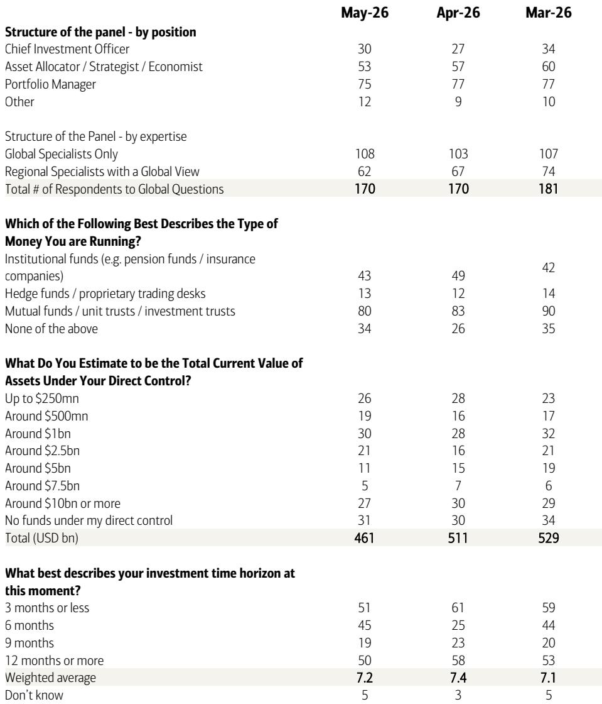

# The Bull Has Nearly Capitulated: Why the May Fund Manager Survey Signals a Tactical Peak, Not a New Leg Higher

The May Global Fund Manager Survey delivers a singular, unambiguous message: the bull market has nearly completed its capitulation. In a single month, professional investors executed the largest recorded increase in equity allocation, slashed cash levels to 3.9%, and flipped from expecting profit deterioration to anticipating double-digit earnings growth. This is not the behavior of a cautious market climbing a wall of worry. This is the behavior of a market that has fully embraced the narrative, leaving little dry powder for further upside. The survey's internal logic points to a tactical peak in early June, with the direction of bond yields determining whether the coming pullback is a shallow dip or a more consequential correction. For serious investors, the May survey is not a confirmation to add risk; it is a signal to prepare for a regime shift in the next several weeks.

The speed of the sentiment shift is the story. The net percentage of fund managers overweight equities surged by a record monthly margin. Cash levels dropped from 4.3% to 3.9%, crossing the threshold that historically triggers a contrarian sell signal. The BofA Bull & Bear Indicator now sits at 7.8, a chip shot away from the 8.0 level that has historically marked unsustainable exuberance. Meanwhile, the proportion of investors forecasting a hard landing collapsed to just 4%, while a record number now expect double-digit earnings-per-share growth. This is not a market that is cautiously optimistic; it is a market that has gone all-in on a soft-landing or no-landing scenario, pricing in both Federal Reserve rate cuts and a surge in corporate profits simultaneously. The tension between these two expectations is the central analytical fault line of the current cycle.

## A Record Surge in Equity Allocation and a Collapse in Cash Have Triggered a Contrarian Sell Signal That Historically Precedes Modest but Meaningful Drawdowns

The most powerful data point in the May survey is not the level of equity allocation, but the velocity of its increase. The monthly change in net percentage overweight equities is the largest ever recorded by the survey, surpassing even the post-COVID recovery surge of May 2020. When professional investors move this aggressively and this quickly, they are not discovering new information; they are capitulating to a trend that has already occurred. The cash level dropping to 3.9% is the statistical confirmation of this capitulation. Since 2011, there have been 24 instances where the average cash level fell to 4.0% or below, and the median four-week forward return for global equities has been negative 1%. While a 1% decline is not catastrophic, the distribution of outcomes is instructive: the worst drawdown was 29%, and the best gain was 4%. The asymmetry is overwhelmingly negative.

The mechanism behind this signal is straightforward. When cash levels are low, fund managers have limited capacity to deploy additional capital into equities. The marginal buyer has already bought. Any negative surprise, whether from inflation, geopolitics, or corporate earnings, will find a market with limited support and a high concentration of positions that are already fully invested. The survey's own data reinforces this vulnerability. The proportion of investors expecting the Federal Reserve to cut rates remains high, yet the proportion expecting a second wave of inflation jumped to 40% from 26% last month. This is a logical inconsistency. If inflation reaccelerates, the Fed cannot cut, and the soft-landing narrative collapses. The market is pricing in both outcomes simultaneously, which is analytically impossible over any meaningful time horizon.

## The Market Is Pricing In a Contradictory Macro Narrative: Simultaneously Expecting Fed Rate Cuts and a Second Wave of Inflation, Creating Acute Vulnerability to a Bond Yield Shock

The May survey reveals a market that has constructed a narrative with two mutually exclusive pillars. On one hand, 50% of fund managers expect the Fed to cut rates in the next twelve months, and the net percentage expecting higher short-term rates jumped to a four-year high. On the other hand, 40% of investors now identify a second wave of inflation as the biggest tail risk, up sharply from 26% in April. The net percentage expecting higher global CPI remains elevated at 66%. A central bank does not cut rates into accelerating inflation. If the inflation tail risk materializes, the rate-cut expectation evaporates, and the equity premium that has been built on that expectation must be repriced.

The bond market is already signaling this tension. A striking 62% of fund managers believe that a big move in yields over the next twelve months will see the 30-year US Treasury yield break above 6%, compared to only 20% who see it falling below 4%. This is not a benign outlook for equities. A move to 6% on the long end would represent a significant tightening of financial conditions, compressing equity valuations and increasing the cost of capital for the very sectors that have led this bull market. The survey's own asset allocation data shows that fund managers are most overweight technology since February 2024 and most underweight bonds since June 2022. This positioning is a leveraged bet that bond yields will remain contained. If yields break higher, the unwind could be violent.

The report does not fully answer a critical question: what specific catalyst would trigger the bond yield move that the majority of managers already expect? The survey identifies the most likely sources of a systemic credit event as US shadow banking at 42% and AI hyperscaler capital expenditure at 34%. The latter is particularly noteworthy, as it has nearly doubled from 17% in the prior month. If a major hyperscaler announces a capex slowdown or a debt-funded project faces refinancing difficulties, the repricing of risk could cascade from credit into equities. The market is aware of this vulnerability but has not yet priced it in, as evidenced by the continued dominance of "long global semiconductors" as the most crowded trade at 73%.

## The Concentration of Crowded Trades in Semiconductors and Technology Signals That the Market Has Priced in Perfection, Leaving No Margin for Error in the AI Investment Cycle

When 73% of fund managers identify "long global semiconductors" as the most crowded trade, it is not a signal of conviction; it is a signal of consensus. Crowded trades are not inherently dangerous, but they become dangerous when the underlying thesis is stretched and the positioning is extreme. The semiconductor and AI trade has been the primary engine of equity returns over the past eighteen months, driven by the narrative of exponential capital expenditure by hyperscalers and the monetization of generative AI. The survey data suggests that this narrative is now fully owned by the institutional community. The net percentage of investors overweight technology is the highest since February 2024, and the allocation to cyclicals relative to defensives is the highest since January 2018.

The vulnerability here is twofold. First, the AI capex cycle is itself identified as a potential source of credit event by 34% of managers. If the return on that capital expenditure disappoints, or if hyperscalers signal a pause in spending, the unwind of the semiconductor trade would be amplified by the sheer concentration of ownership. Second, the survey shows that consumer stocks are the most out of favor. This divergence between tech and consumer is a bet that the AI-driven productivity gains will materialize before any weakness in the consumer economy spills over into corporate earnings. If the consumer falters, the entire equity market suffers, and the tech sector, with its elevated valuations and crowded positioning, would be the most vulnerable.

The contrarian trades implied by the survey are instructive. Based on current positions relative to history, the most compelling contrarian bets would be to cover shorts in bonds, the US dollar, UK assets, and consumer stocks, while paring length in commodities, equities, emerging markets, and technology. This is essentially a bet against the consensus narrative of "no landing" and AI dominance. It is a bet that the next phase of the cycle will be characterized by a rotation out of the most crowded trades and into the most hated and underowned assets. The survey does not tell us when this rotation will occur, but it tells us that the conditions for it are now in place.

## A Decision Framework for the Next Six Weeks: Monitor the Bond Yield Threshold and Prepare for a Rotation Out of Crowded Trades into Underowned Assets

For the strategic investor, the May survey provides a clear decision framework rather than a directional call. The framework has three components. First, the primary risk factor to monitor is the 30-year US Treasury yield. The survey indicates that the market is watching this level more than any other single variable. If the 30-year yield approaches 5.5% and threatens the 6% threshold that a majority of managers expect, it will trigger a mechanical de-risking across portfolios. The investor should have a predetermined plan for reducing equity exposure, particularly in technology and semiconductors, if this scenario unfolds.

Second, the investor should assess their own positioning relative to the survey's extremes. If your portfolio mirrors the survey's overweight in equities, underweight in bonds, and concentration in tech, you are running with the consensus. The historical record of the cash-level sell signal suggests that the next four to six weeks carry negative expected returns for this exact positioning. The prudent action is not to sell everything, but to trim the most crowded positions and add to the most underowned, which according to the survey are bonds, the US dollar, UK assets, and consumer stocks.

Third, the investor should prepare for a scenario where the bull market continues but leadership changes. The survey's data on regional allocation shows that Eurozone equities are underweight for the first time since December 2024. Commodities are at their fourth-highest overweight ever. If the global growth narrative shifts from US exceptionalism to a broader, more synchronized recovery, the rotation out of US tech and into European cyclicals and commodities could be significant. The survey does not predict this rotation, but it identifies the positioning that would make it possible.

## The Unanswered Question: Can the Fed Cut Rates Without Reigniting Inflation, or Is the Market Setting Itself Up for a Policy Error?

The most important question the survey leaves unanswered is whether the Federal Reserve can deliver the rate cuts that the market expects without reigniting the inflation that the market fears. The survey shows that fund managers are betting on both outcomes simultaneously. This is analytically unsustainable. If inflation reaccelerates, the Fed will not cut, and the equity market will have to reprice the entire rate path. If inflation continues to moderate, the Fed can cut, but the second-wave inflation risk that 40% of managers identify suggests that this outcome is not the base case.

The resolution of this tension will determine the direction of markets for the remainder of the year. If the Fed is forced to hold rates steady or even hike, the bond yield shock that 62% of managers expect will materialize, and the equity market will face a significant correction. If the Fed successfully navigates a soft landing with rate cuts and contained inflation, the current bull market can extend, but it will likely do so with different leadership, rotating away from the crowded tech trade and into the underowned value and cyclical sectors. The May survey tells us that the market is positioned for the first scenario but hoping for the second. That gap between positioning and outcome is where the risk lies.

Join the community to read the full report and review the original charts.

*This article is for learning and discussion only and does not constitute investment advice.*

Personal reading notes and learning share only. Not investment advice.

