DB

# Europe Macro Outlook 2026

The two-economy problem: resilience vs rigidity amid an energy shock

Mark Wall | Managing Director
Chief European Economist

May 2026

IMPORTANT RESEARCH DISCLOSURES AND ANALYST CERTIFICATIONS LOCATED IN APPENDIX 1. UNTIL 19th MARCH 2021 INCOMPLETE DISCLOSURE INFORMATION MAY HAVE BEEN DISPLAYED, PLEASE SEE APPENDIX 1 FOR FURTHER DETAILS.

# Framing: 'Two-economy' problem

# ■ Pre-conflict: European economy caught between cyclical resilience and structural rigidity

☐ Resilience: Despite external headwinds (tariffs, etc), GDP exceeded expectations at 1.5% in 2025 due to domestic demand   
☐ Rigidity: The world is changing and Europe needs to invest/innovate/reform to regain competitiveness, obtain autonomy   
☐ German fiscal easing expected to underpin growth resilience in 2026 – but impulse proving slower than expected

# Warning: Middle East conflict has unleashed second energy shock in 4 years

# - Europe highly exposed to rising cost of imported energy

☐ GDP growth lowered to 0.5% in 2026 (1.1% pre-conflict estimate), HICP raised to 3.1% (1.8% pre-conflict estimate)   
☐ Stagflation dynamics: survey data consistent with risk of persistent inflation; economy threatened by contraction   
☐ ‘Measured’ ECB tightening, at most: good risk management between upside inflation risk and downside growth risk

# Weak competitiveness – in need of strategic autonomy

# - Europe needs strategic autonomy to create power and leverage in an increasingly geopolitical and frictional world

☐ Defence spending will inevitably need to rise further as Europe builds own deterrence capabilities   
☐ Greater autonomy also needed in energy, technology, supply chains, financing, payments, etc   
☐ Significant investment needs – but high public indebtedness and political fragmentation are hurdles

# World Outlook 2026: Anything but dull

2026 promised to be anything but dull. It is living up to expectations: the extraction of President Maduro from Venezuela, the AI/Tech sector correction, threats to Greenland, private credit tensions, overturning of the IEEPA tariffs, and war in Iran with a new energy shock. Even if geopolitics quietens, AI is likely to come back and dominate market sentiment and drive boom-and-bust narratives.

<table><tr><td rowspan="2"></td><td colspan="3">Real GDP,% YoY</td><td colspan="3">CPI inflation,% pavg</td></tr><tr><td>2025</td><td>2026</td><td>2027</td><td>2025</td><td>2026</td><td>2027</td></tr><tr><td>Global</td><td>3.4</td><td>3.3</td><td>3.3</td><td>3.4</td><td>4.0</td><td>3.6</td></tr><tr><td>US</td><td>2.1</td><td>2.4</td><td>2.2</td><td>2.7</td><td>3.3</td><td>2.5</td></tr><tr><td>Japan</td><td>1.2</td><td>0.8</td><td>1.0</td><td>3.2</td><td>1.8</td><td>2.2</td></tr><tr><td>Euro area</td><td>1.5</td><td>0.5</td><td>1.1</td><td>2.1</td><td>3.0</td><td>2.4</td></tr><tr><td>UK</td><td>1.4</td><td>0.9</td><td>1.2</td><td>3.4</td><td>3.1</td><td>2.6</td></tr><tr><td>China</td><td>5.0</td><td>4.9</td><td>4.5</td><td>0.1</td><td>1.6</td><td>2.0</td></tr><tr><td>India</td><td>7.5</td><td>6.7</td><td>7.2</td><td>2.2</td><td>4.6</td><td>4.2</td></tr><tr><td>Brazil</td><td>2.3</td><td>1.9</td><td>1.7</td><td>5.0</td><td>4.1</td><td>4.3</td></tr><tr><td>G7</td><td>1.6</td><td>1.6</td><td>1.7</td><td>2.5</td><td>2.9</td><td>2.4</td></tr><tr><td>Developed Markets</td><td>1.7</td><td>1.5</td><td>1.6</td><td>2.6</td><td>3.0</td><td>2.4</td></tr><tr><td>Emerging Markets</td><td>4.5</td><td>4.4</td><td>4.4</td><td>3.9</td><td>4.7</td><td>4.4</td></tr><tr><td>EEMEA</td><td>3.0</td><td>2.9</td><td>3.3</td><td>11.5</td><td>10.1</td><td>9.0</td></tr><tr><td>Asia (ex Japan)</td><td>5.5</td><td>5.3</td><td>5.1</td><td>0.9</td><td>2.6</td><td>2.7</td></tr><tr><td>LatAm</td><td>1.9</td><td>1.9</td><td>1.9</td><td>4.4</td><td>4.3</td><td>4.2</td></tr></table>

Global PMI Index   
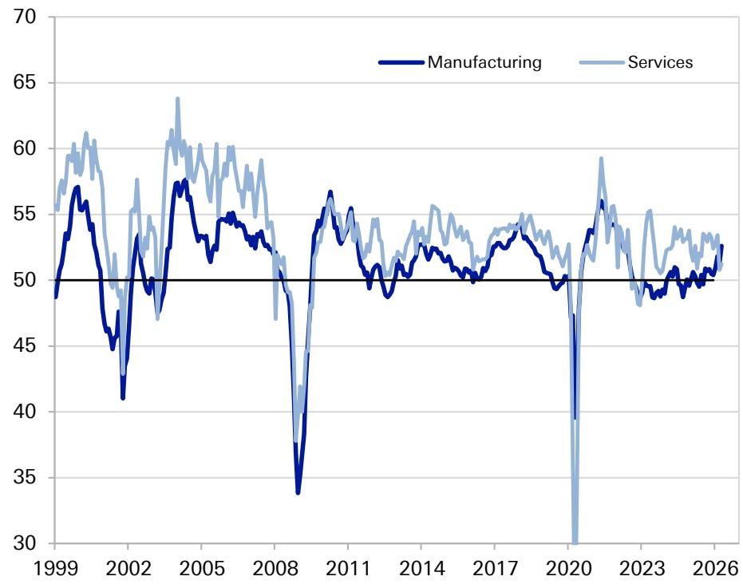

line

| Year | Manufacturing | Services |
|------|---------------|----------|
| 1999 | 49.0          | 55.0     |
| 2000 | 57.0          | 60.0     |
| 2001 | 54.0          | 58.0     |
| 2002 | 45.0          | 52.0     |
| 2003 | 53.0          | 57.0     |
| 2004 | 58.0          | 64.0     |
| 2005 | 55.0          | 60.0     |
| 2006 | 54.0          | 58.0     |
| 2007 | 53.0          | 56.0     |
| 2008 | 51.0          | 54.0     |
| 2009 | 34.0          | 42.0     |
| 2010 | 56.0          | 54.0     |
| 2011 | 52.0          | 53.0     |
| 2012 | 51.0          | 52.0     |
| 2013 | 49.0          | 51.0     |
| 2014 | 51.0          | 53.0     |
| 2015 | 52.0          | 54.0     |
| 2016 | 53.0          | 55.0     |
| 2017 | 54.0          | 56.0     |
| 2018 | 53.0          | 55.0     |
| 2019 | 52.0          | 54.0     |
| 2020 | 39.0          | 30.0     |
| 2021 | 54.0          | 59.0     |
| 2022 | 56.0          | 57.0     |
| 2023 | 49.0          | 48.0     |
| 2024 | 51.0          | 53.0     |
| 2025 | 52.0          | 54.0     |
| 2026 | 53.0          | 55.0     |

Source: DB, S&P Global. See "World Outlook: 2026: Anything but dull", 24 November 2025

# Europe's “two-economy problem”: Resilience vs. Rigidity

The more upbeat perspective on Europe puts emphasis on ‘resilience’. Growth outperformed expectations in 2025 despite the external headwinds, thanks to a robust labour market, effective monetary transmission, etc. Germany’s expansionary fiscal policy was expected to add resilience in 2026. The more downbeat perspective emphasizes Europe’s ‘rigidity’. We are in a rapidly changing world marked by geostrategic economic competition. Europe should be innovating, investing, reforming – and is finding this difficult.

EA GDP growth contributions, % YoY   
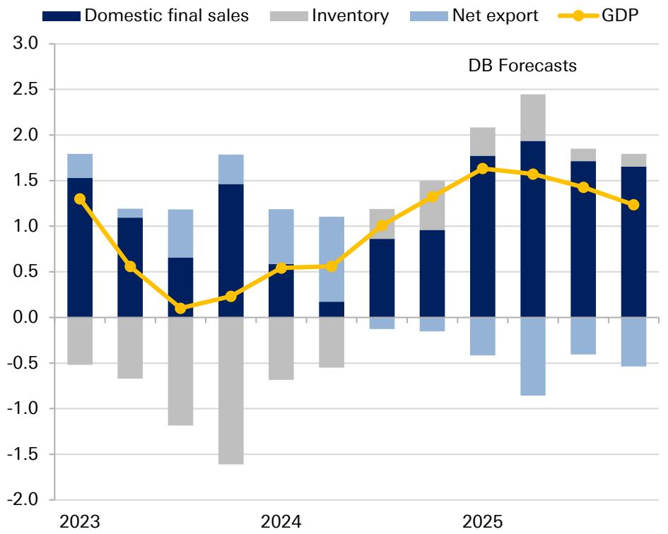

bar_line

DB Forecasts
| Year | Domestic final sales | Inventory | Net export | GDP |
| :--- | :--- | :--- | :--- | :--- |
| 2023 | 1.5 | -0.5 | 0.4 | 1.3 |
| 2024 | 0.6 | -1.7 | 0.4 | 0.2 |
| 2025 | 1.8 | 0.4 | -0.9 | 1.6 |
| 2026 | 1.7 | 0.1 | -0.4 | 1.4 |
| 2027 | 1.6 | 0.1 | -0.5 | 1.2 |

Euro area competitiveness   
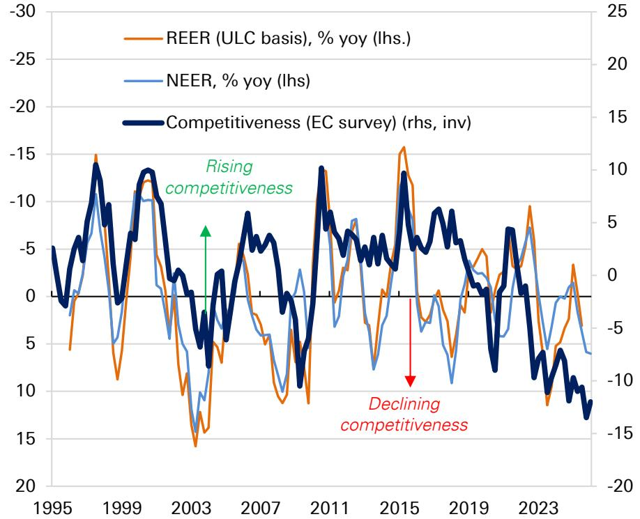

line

| Year | REER (ULC basis), % yoy (lhs.) | NEER, % yoy (lhs) | Competitiveness (EC survey) (rhs, inv) |
|------|----------------------------------|-------------------|----------------------------------------|
| 1995 | -5                               | -2                | -4                                     |
| 1999 | -10                              | -8                | -12                                    |
| 2003 | -15                              | -12               | -16                                    |
| 2007 | -5                               | -3                | -6                                     |
| 2011 | -10                              | -8                | -12                                    |
| 2015 | -15                              | -12               | -16                                    |
| 2019 | -5                               | -3                | -6                                     |
| 2023 | -10                              | -8                | -12                                    |

Source: DB, ECB. Eurostat, Haver Analytics LP, See "The two-economy problem", Focus Europe, 5 December 2025

# Iran Shock: A new energy price shock

Russia's invasion of Ukraine in 2022 reminded us of something important. Just as the GFC showed now sensitive economic growth is to the supply of credit, economic growth is also sensitive to the supply of energy. All economic activity has an energy counterpart, some high, some low. When energy costs are high, and in particular when energy is in short supply, it is very difficult for the economy to grow. The chart below shows real oil prices with US recessions shaded

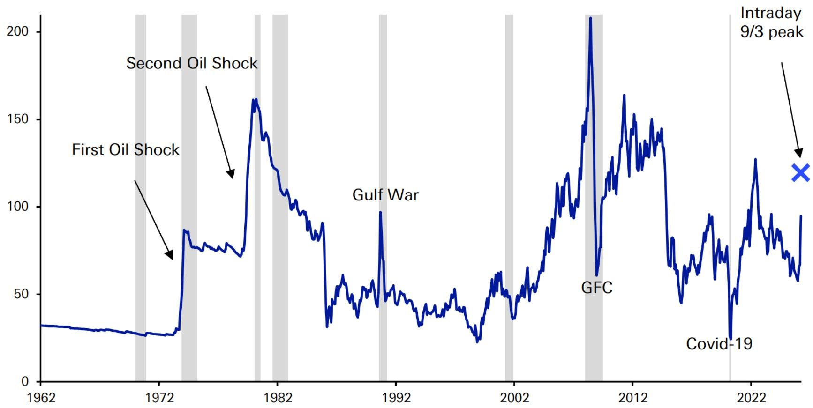

line

| Year | Value |
| ---- | ----- |
| 1962 | ~30   |
| 1972 | ~25   |
| 1982 | ~100  |
| 1992 | ~40   |
| 2002 | ~50   |
| 2012 | ~150  |
| 2022 | ~120  |

Source: DB, Finaeon, Haver Analytics LP. See “DB CoTD: A long way from recession... for now...”, Thematic Research, 3 March 2026

# Iran Shock: Signs of persistently higher oil prices

The global economy, and Europe, is in a highly contingent situation. The path of economies and policy will be a function of energy prices. The ECB has developed a baseline scenario and two risk scenarios: adverse and severe. Gas prices are very close to the ECB's baseline scenario. 2026 oil prices have converged to the adverse scenario. 2027 oil prices remain above the adverse scenario.

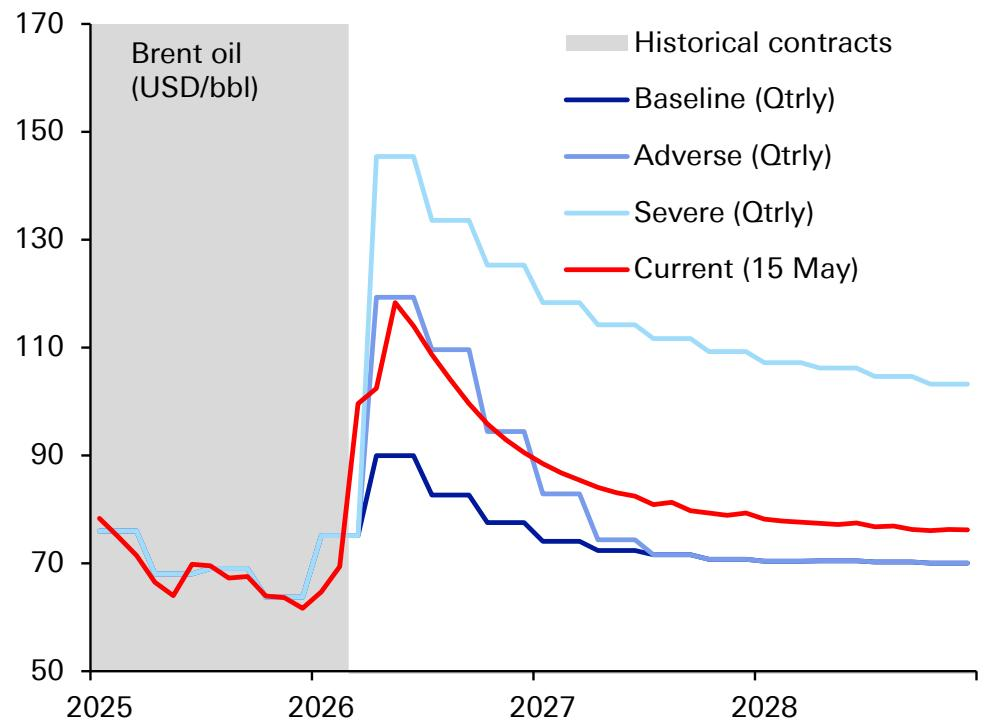

line

| Year | Historical contracts | Baseline (Qtrly) | Adverse (Qtrly) | Severe (Qtrly) | Current (15 May) |
|------|----------------------|------------------|-----------------|----------------|------------------|
| 2025 | -                    | -                | -               | -              | 74               |
| 2026 | -                    | -                | -               | 73             | 66               |
| 2027 | -                    | 90               | 110             | 148            | 100              |
| 2028 | -                    | 70               | 70              | 108            | 73               |

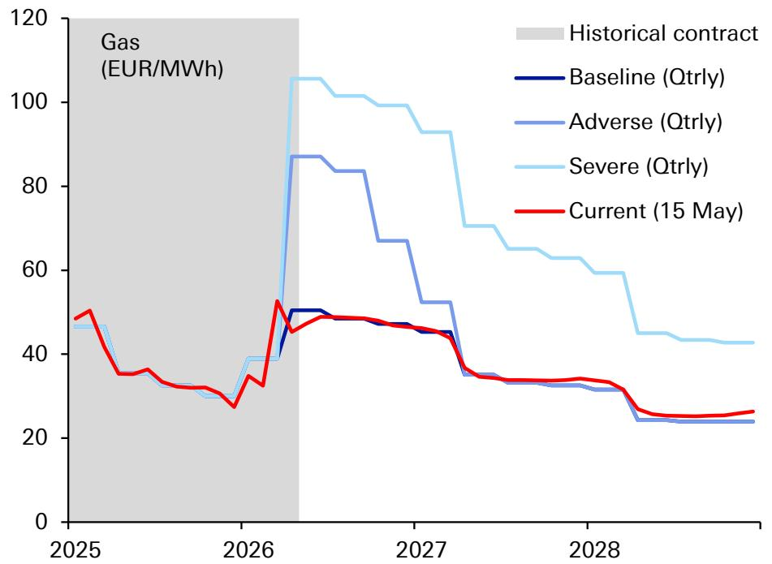

line

| Year | Baseline (Qtrly) | Adverse (Qtrly) | Severe (Qtrly) | Current (15 May) |
|------|------------------|-----------------|----------------|-----------------|
| 2025 | ~48              | ~48             | ~48            | ~50             |
| 2026 | ~48              | ~48             | ~48            | ~50             |
| 2027 | ~45              | ~45             | ~45            | ~45             |
| 2028 | ~25              | ~25             | ~25            | ~25             |

# Euro Area Macro Forecasts: Inflation up, growth down

The energy shock is having a detrimental impact on the outlook. Our baseline forecast sees GDP growth at 0.5% in 2026 (1.1% pre-conflict) and 1.1% in 2027 (1.3% pre-conflict). We forecast HICP inflation at 3.1% in 2026 (1.8% pre-conflict) and 2.5% in 2027 (1.9% pre-conflict). We think the consensus and ECB are underestimating inflation and as a consequence overestimating growth.

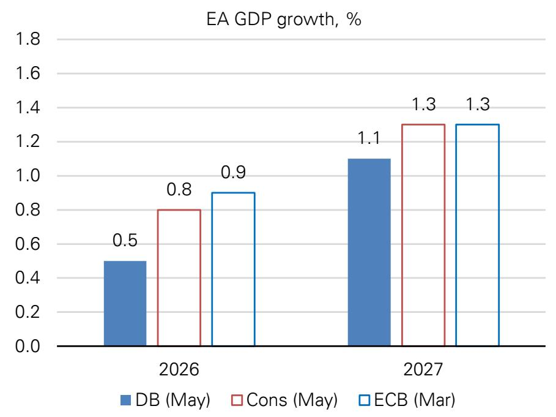

bar

EA GDP growth, %
| Year | DB (May) (%) | Cons (May) (%) | ECB (Mar) (%) |
| :--- | :--- | :--- | :--- |
| 2026 | 0.5 | 0.8 | 0.9 |
| 2027 | 1.1 | 1.3 | 1.3 |

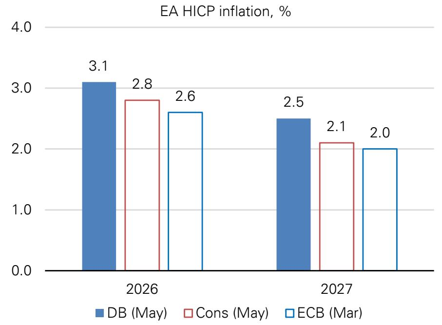

bar

EA HICP inflation, %
| Year | DB (May) (%) | Cons (May) (%) | ECB (Mar) (%) |
| :--- | :--- | :--- | :--- |
| 2026 | 3.1 | 2.8 | 2.6 |
| 2027 | 2.5 | 2.1 | 2.0 |

# Growth Signals: Soft in Q2, with downside risks

The euro area composite output PMI index fell in April to a level consistent with -0.1% qoq GDP growth. The weakness is less evident in manufacturing – where supply shortages may be temporarily lifting demand – and more obvious in services – where inflation expectations are hitting demand. The DB FIS tracker (RHS) implies growth of +0.1% qoq in Q2 (weaker ZEW and BLS have weighed on the signal recently).

Euro Area PMI output indices   
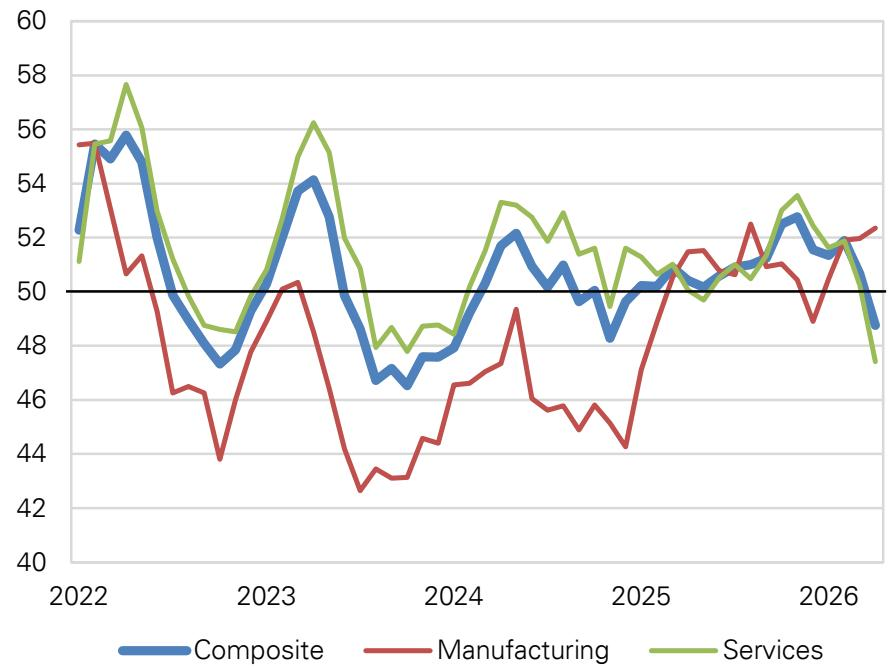

line

| Year | Composite | Manufacturing | Services |
|------|-----------|---------------|----------|
| 2022 | 52.0      | 55.5          | 51.0     |
| 2023 | 54.0      | 50.0          | 56.0     |
| 2024 | 47.0      | 43.0          | 48.0     |
| 2025 | 50.0      | 44.0          | 51.0     |
| 2026 | 49.0      | 52.0          | 47.0     |

Euro area GDP growth, % qoq   
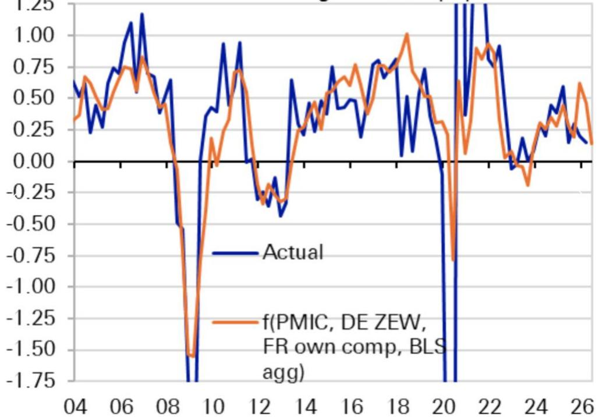

line

| Year | Actual | f(PMIC, DE ZEW, FR own comp, BLS agg) |
|------|--------|--------------------------------------|
| 04   | 0.60   | 0.35                                 |
| 06   | 1.10   | 0.75                                 |
| 08   | 0.65   | 0.40                                 |
| 10   | -1.75  | -1.50                                |
| 12   | 0.90   | 0.70                                 |
| 14   | -0.40  | -0.30                                |
| 16   | 0.75   | 0.65                                 |
| 18   | 0.80   | 1.00                                 |
| 20   | -1.75  | -0.75                                |
| 22   | 1.25   | 0.90                                 |
| 24   | -0.10  | -0.20                                |
| 26   | 0.15   | 0.55                                 |

Source: DB, ECB, S&P Global, ZEW, INSEE, Haver Analytics LP

# Activity Shock: Energy shock more clearly impacting services activity

The recent loss of economic momentum is more obvious in services, where the countries reporting the largest drops in consumer confidence (because of rising inflation) are also the countries reporting the largest drops in PMI services activity.

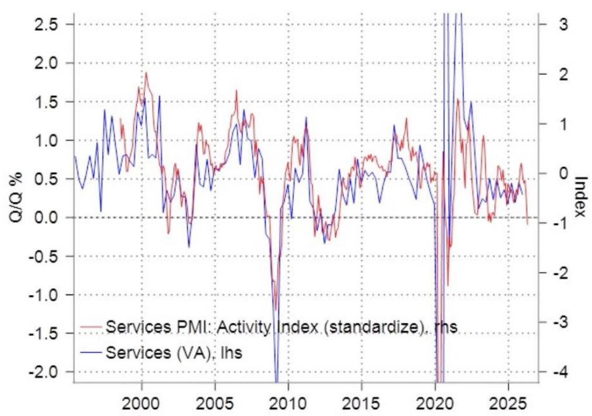

line

| Year | Services PMI: Activity Index (standardize), rhs | Services (VA): Ihs |
|------|-----------------------------------------------|--------------------|
| 2000 | ~1.8                                          | ~1.5               |
| 2005 | ~1.0                                          | ~0.8               |
| 2010 | ~-1.5                                         | ~-2.0              |
| 2015 | ~0.5                                          | ~0.3               |
| 2020 | ~-1.0                                         | ~-4.0              |
| 2025 | ~0.5                                          | ~0.3               |

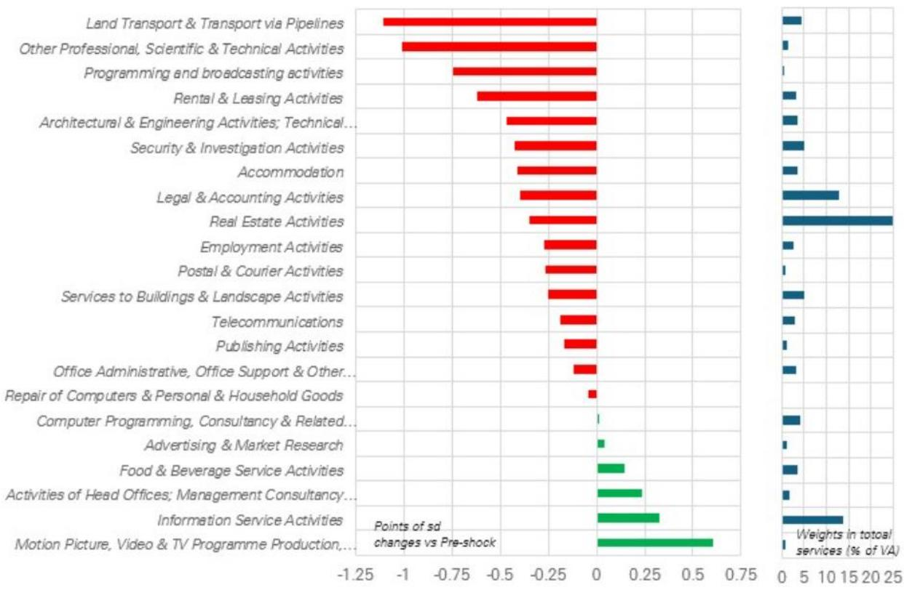

bar

| Category | Change in SD changes vs Pre-shock |
|---|---|
| Land Transport & Transport via Pipelines | -1.15 |
| Other Professional, Scientific & Technical Activities | -0.95 |
| Programming and broadcasting activities | -0.65 |
| Rental & Leasing Activities | -0.45 |
| Architectural & Engineering Activities; Technical... | -0.45 |
| Security & Investigation Activities | -0.35 |
| Accommodation | -0.35 |
| Legal & Accounting Activities | -0.35 |
| Real Estate Activities | 22.5 |
| Employment Activities | -0.25 |
| Postal & Courier Activities | -0.25 |
| Services to Buildings & Landscape Activities | -0.25 |
| Telecommunications | -0.15 |
| Publishing Activities | -0.15 |
| Office Administrative, Office Support & Other... | -0.1 |
| Repair of Computers & Personal & Household Goods | 0.05 |
| Computer Programming, Consultancy & Related... | 0.05 |
| Advertising & Market Research | 0.05 |
| Food & Beverage Service Activities | 0.15 |
| Activities of Head Offices; Management Consultancy... | 0.25 |
| Information Service Activities | 0.35 |
| Motion Picture, Video & TV Programme Production... | 0.6 |
| Points of sd changes vs Pre-shock | Weights in total services (% of VA)

# Divergence: Energy shock is largely a common shock across member states

The change in the European Commission's Economic Sentiment Index (ESI) – a good gauge of economic growth – shows a spread of conditions in the two months since the start of the Middle East conflict (LHS). The CEE economies are most resilient, perhaps reflecting the larger role of manufacturing in those economies and the potentially transitory stock-building impulse. The standard deviation of ESIs across the member states is at average levels (RHS). There is no sense yet of asymmetric shock.

Economic sentiment index, change since start of conflict   
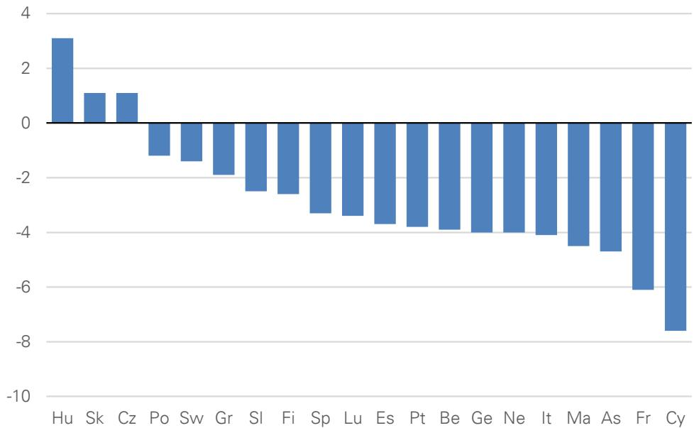

bar

| Category | Value |
|---|---|
| Hu | 3.0 |
| Sk | 1.0 |
| Cz | 1.0 |
| Po | -1.0 |
| Sw | -1.5 |
| Gr | -2.0 |
| Sl | -2.5 |
| Fi | -2.8 |
| Sp | -3.2 |
| Lu | -3.5 |
| Es | -3.8 |
| Pt | -4.0 |
| Be | -4.2 |
| Ge | -4.3 |
| Ne | -4.4 |
| It | -4.6 |
| Ma | -4.9 |
| As | -5.1 |
| Fr | -6.2 |
| Cy | -7.8 |

Economic Sentiment Index, st dev across countries   
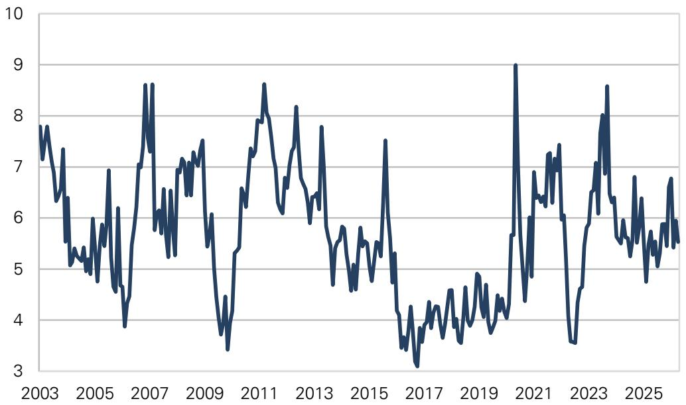

line

| Year | Value |
| ---- | ----- |
| 2003 | 7.8   |
| 2004 | 6.5   |
| 2005 | 5.2   |
| 2006 | 4.8   |
| 2007 | 8.6   |
| 2008 | 6.3   |
| 2009 | 7.5   |
| 2010 | 3.5   |
| 2011 | 8.6   |
| 2012 | 6.1   |
| 2013 | 7.8   |
| 2014 | 5.8   |
| 2015 | 5.5   |
| 2016 | 7.5   |
| 2017 | 3.2   |
| 2018 | 4.5   |
| 2019 | 4.8   |
| 2020 | 9.0   |
| 2021 | 6.8   |
| 2022 | 7.3   |
| 2023 | 3.5   |
| 2024 | 8.6   |
| 2025 | 5.8   |

# Iran Shock: Recession risk has increased

On current oil and gas prices, the euro area's energy import bill will be about $0.75\%$ of GDP higher in 2026 than 2025 (LHS chart). Given that GDP growth was expected to be marginally above $1\%$ in 2026 (pre-conflict forecast), all else unchanged this energy price raises a clear threat of recession. Our model points to a recession probability of $45\%$ in Q2 rising to $60\%$ in Q3.

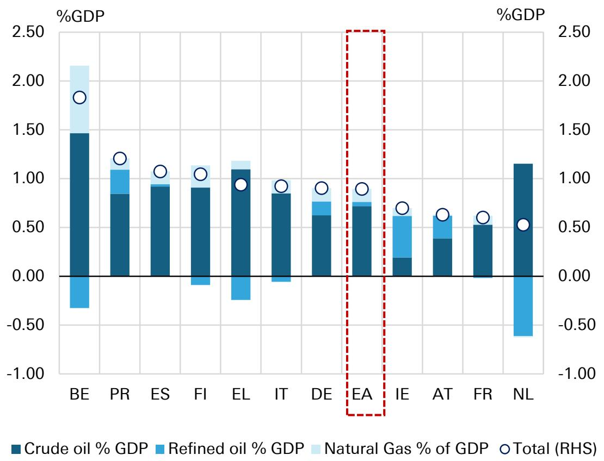

bar

| Country | Crude oil % GDP | Refined oil % GDP | Natural Gas % of GDP | Total (RHS) |
|---------|-----------------|-------------------|----------------------|-------------|
| BE      | 1.45            | -0.35             | 0.65                 | 1.85        |
| PR      | 0.80            | 0.20              | 0.10                 | 1.20        |
| ES      | 0.90            | 0.05              | 0.10                 | 1.10        |
| FI      | 0.90            | -0.10             | 0.10                 | 1.05        |
| EL      | 1.05            | -0.25             | 0.15                 | 0.95        |
| IT      | 0.85            | -0.10             | 0.10                 | 0.95        |
| DE      | 0.60            | 0.15              | 0.10                 | 0.90        |
| EA      | 0.70            | 0.10              | 0.10                 | 0.90        |
| IE      | 0.20            | 0.60              | 0.10                 | 0.70        |
| AT      | 0.35            | 0.25              | 0.10                 | 0.65        |
| FR      | 0.50            | -0.10             | 0.10                 | 0.65        |
| NL      | 1.15            | -0.65             | 0.10                 | 0.55        |

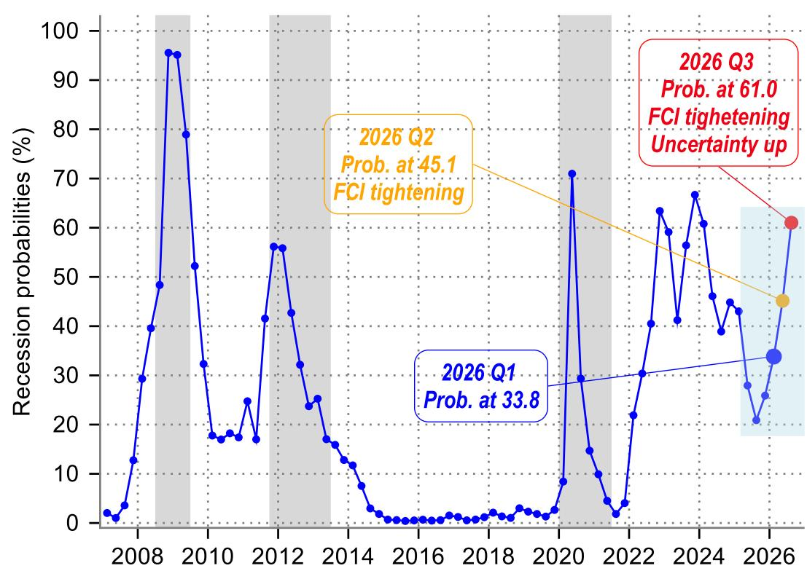

line

| Year | Recession probabilities (%) |
|------|-----------------------------|
| 2008 | ~1.5                        |
| 2009 | ~95                         |
| 2010 | ~32                         |
| 2011 | ~17                         |
| 2012 | ~56                         |
| 2013 | ~24                         |
| 2014 | ~17                         |
| 2015 | ~3                          |
| 2016 | ~1                          |
| 2017 | ~1                          |
| 2018 | ~1                          |
| 2019 | ~2                          |
| 2020 | ~8                          |
| 2021 | ~15                         |
| 2022 | ~3                          |
| 2023 | ~40                         |
| 2024 | ~67                         |
| 2025 | ~45                         |
| 2026 | ~61.0                       |

Source: DB, “Crude calculations: Price spikes and the energy import bill”, Europe Chart of the Week, 18 March 2026, “What if...Iran Shock and recessionary risk”, Europe Chart of the Week, 31 March 2026,

# Positives #1: Labour market

One of the main reasons for a more resilient than expected performance by the European economy in 2025 was a robust labour market: employment growth and wage gains support disposable income. We continue to see signs of resilience from the labour market, with unemployment falling in the periphery (offsetting rises in the core) (LHS) and our dbDIG household survey showing positive sentiment in the jobs market (RHS).

Change in the unemployment rate since Dec 2019 (pp)   
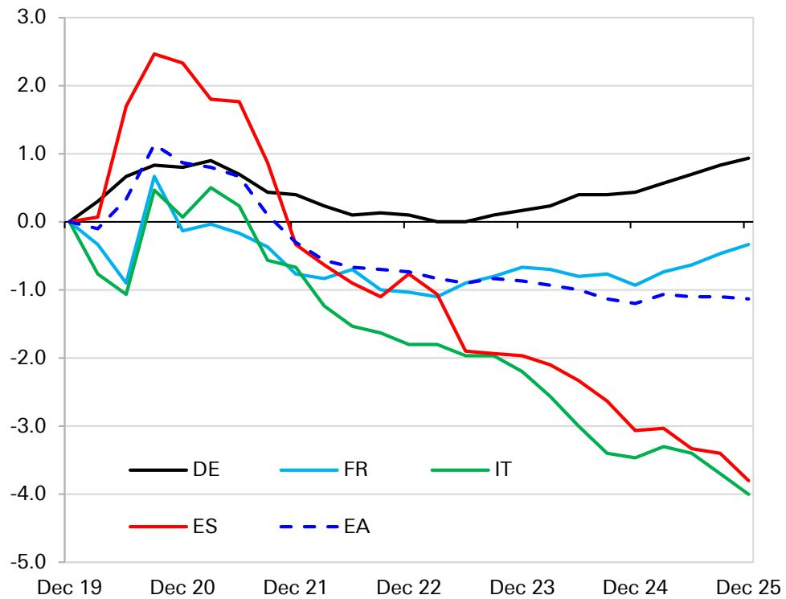

line

| Date   | DE    | FR    | IT    | ES    | EA    |
|--------|-------|-------|-------|-------|-------|
| Dec 19 | 0.0   | 0.0   | 0.0   | 0.0   | 0.0   |
| Dec 20 | 0.8   | 0.6   | 0.5   | 2.5   | 1.0   |
| Dec 21 | 0.4   | -0.8  | -0.5  | -0.5  | -0.5  |
| Dec 22 | 0.1   | -1.0  | -1.8  | -1.0  | -0.8  |
| Dec 23 | 0.3   | -0.7  | -2.0  | -2.0  | -1.0  |
| Dec 24 | 0.5   | -0.9  | -3.5  | -3.0  | -1.2  |
| Dec 25 | 1.0   | -0.5  | -4.0  | -4.0  | -1.3  |

std. dev.   
3mma dbDIG labour market sentiment index   
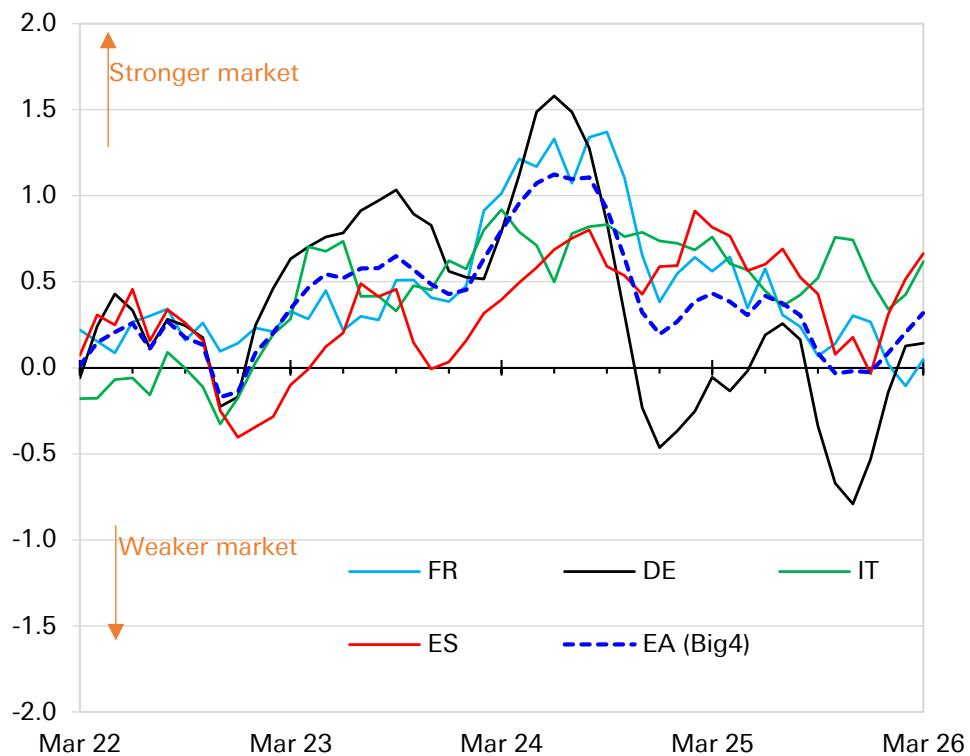

line

| Date   | FR    | DE    | IT    | ES    | EA (Big4) |
|--------|-------|-------|-------|-------|-----------|
| Mar 22 | 0.2   | 0.3   | -0.1  | 0.1   | 0.0       |
| Mar 23 | 0.4   | 0.7   | 0.6   | 0.3   | 0.5       |
| Mar 24 | 1.3   | 1.6   | 0.8   | 0.7   | 1.1       |
| Mar 25 | 0.6   | -0.5  | 0.7   | 0.9   | 0.4       |
| Mar 26 | 0.1   | 0.1   | 0.6   | 0.6   | 0.3       |

Source: DB, “Labour Market Chartbook: Resilience and Fragility”, Focus Europe, 25 March 2026, and “March dbDataInsights survey – Iran war clearly boosting household inflation expectations”, The Wide Angle, 8 April 2026

# Positives #1: Labour market

The RHS chart shows various indicators of labour market conditions. By and large, indicators are towards the outside of the web, implying strength relative to history. In the LHS chart we extract the principal components from this set of labour market indicators. The activity (level) factor remains strong. Momentum has weakened – not enough to drag on the level factor – but has stabilised. The post-pandemic excess in labour market has been removed, but the underlying picture remains solid.

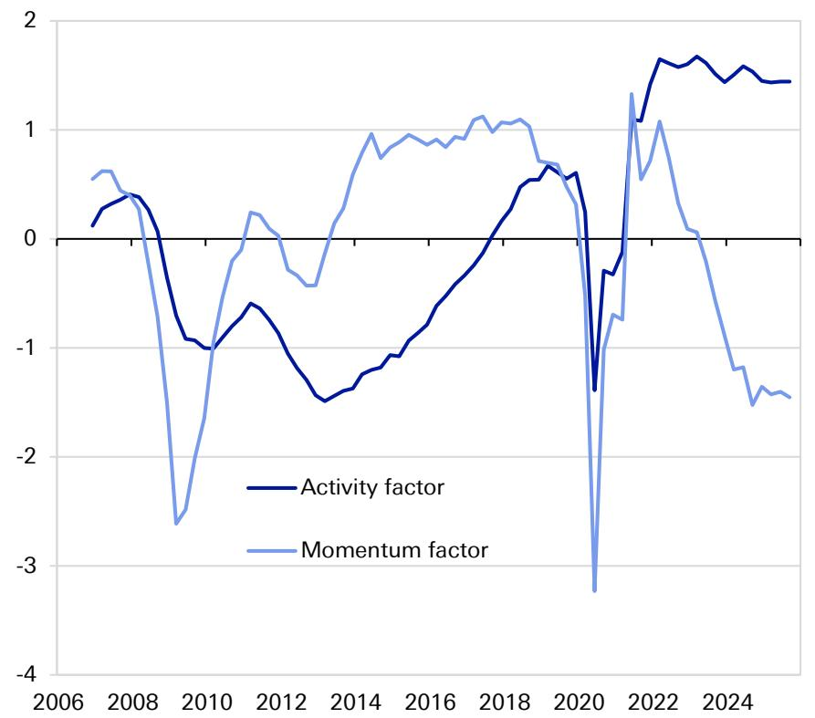

line

| Year | Activity factor | Momentum factor |
|------|-----------------|-----------------|
| 2006 | ~0.1            | ~0.5            |
| 2007 | ~0.3            | ~0.6            |
| 2008 | ~0.4            | ~0.4            |
| 2009 | ~-0.8           | ~-2.5           |
| 2010 | ~-1.0           | ~-1.5           |
| 2011 | ~-0.5           | ~0.2            |
| 2012 | ~-1.0           | ~-0.5           |
| 2013 | ~-1.5           | ~-0.5           |
| 2014 | ~-1.2           | ~0.8            |
| 2015 | ~-1.0           | ~1.0            |
| 2016 | ~-0.5           | ~1.0            |
| 2017 | ~0.0            | ~1.1            |
| 2018 | ~0.5            | ~1.0            |
| 2019 | ~0.7            | ~0.8            |
| 2020 | ~-1.5           | ~-3.5           |
| 2021 | ~-0.5           | ~-1.0           |
| 2022 | ~1.5            | ~1.2            |
| 2023 | ~1.6            | ~0.5            |
| 2024 | ~1.4            | ~-1.5           |
| 2025 | ~1.4            | ~-1.7           |

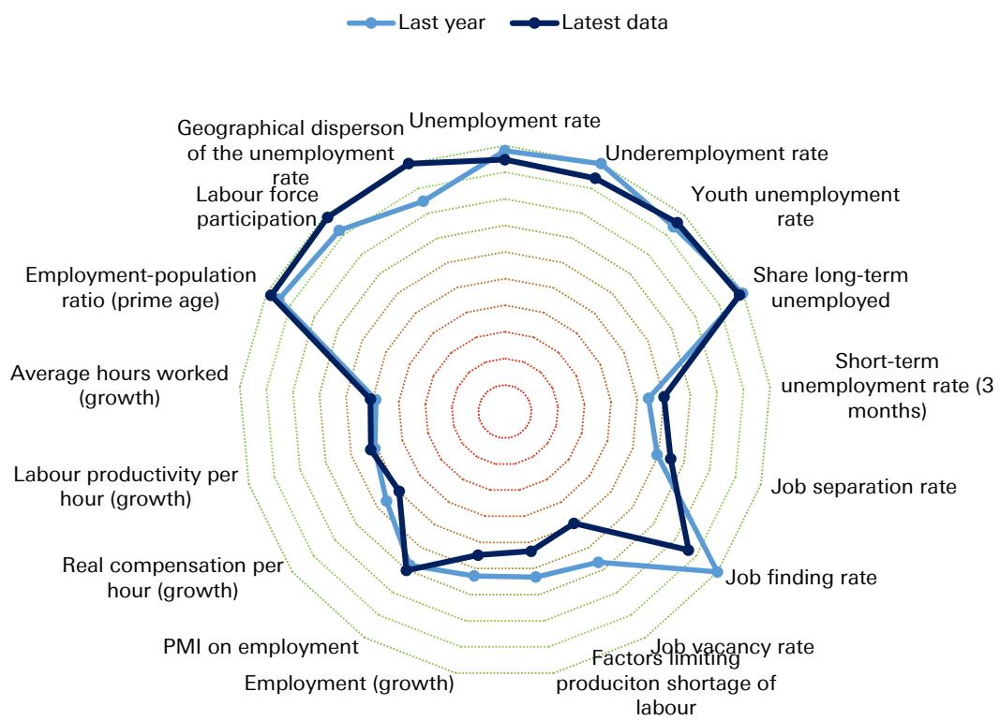

radar

| Category | Last year | Latest data |
| --- | --- | --- |
| Unemployment rate | 100 | 95 |
| Underemployment rate | 98 | 92 |
| Youth unemployment rate | 95 | 88 |
| Share long-term unemployed | 70 | 85 |
| Short-term unemployment rate (3 months) | 40 | 50 |
| Job separation rate | 30 | 40 |
| Job finding rate | 85 | 75 |
| Job vacancy rate | 60 | 65 |
| Factors limiting production shortage of labour | 55 | 50 |
| PMI on employment | 50 | 55 |
| Real compensation per hour (growth) | 45 | 50 |
| Labour productivity per hour (growth) | 40 | 45 |
| Average hours worked (growth) | 35 | 40 |
| Employment-population ratio (prime age) | 80 | 70 |
| Geographical dispersion of the unemployment rate | 85 | 80 |
| Labour force participation | 75 | 70 |
| Unemployment rate | 100 | 95 |
| Employment (growth) | 60 | 65 |
| PMI on employment | 55 | 60 |
| Real compensation per hour (growth) | 45 | 50 |
| Labour productivity per hour (growth) | 40 | 45 |
| Average hours worked (growth) | 35 | 40 |
| Employment-population ratio (prime age) | 80 | 75 |
| Geographical dispersion of the unemployment rate | 85 | 80 |
| Labour force participation | 75 | 70 |
| Unemployment rate | 100 | 95 |
| Employment (growth) | 60 | 65 |
| PMI on employment | 55 | 60 |
| Real compensation per hour (growth) | 45 | 50 |
| Labour productivity per hour (growth) | nan | nan |
| Average hours worked (growth) | nan | nan |
| Employment-population ratio (prime age) | nan | nan |
| Geographical dispersion of the unemployment rate | nan | nan |
| Labour force participation | nan | nan |
| Unemployment rate | nan | nan |
| Employment (growth) | nan | nan |
| PMI on employment | nan | nan |
| Real compensation per hour (growth) | nan | nan |
| Labour productivity per hour (growth) | nan | nan |
| Average hours worked (growth) | nan | nan |
| Employment-population ratio (prime age) | nan | nan |
| Geographical dispersion of the unemployment rate | nan | nan |
| Labour force participation | nan | nan |
| Unemployment rate | nan | nan |
| Employment (growth) | nan | nan |
| PMI on employment | nan | nan |
| Real compensation per hour (growth) : nan | nan | nan |
| Labour productivity per hour (growth) : nan | nan | nan |
| Average hours worked (growth) : nan | nan | nan |
| Employment-population ratio (prime age) : nan | nan | nan |
| Geographical dispersion of the unemployment rate : nan | nan | nan |
| Labour force participation : nan | nan | nan |
| Unemployment rate : nan | nan | nan |
| Employment-population ratio (prime age) : nan | nan | nan |
| Job finding rate : nan | nan | nan |
| Job finding rate : nan | nan | nan |
| Job finding rate : nan | nan | nan |
| Job finding rate : nan | nan | nan |
| Job finding rate : nan | nan | nan |
| Job finding rate : nan | nan | nan |
| Job finding rate : nan | nan | nan |
| Job finding rate : nan | nan | nan |
| Job finding rate : nan | nan | nan |
| Job finding rate: nan | nan | nan |
| Job finding rate: nan | nan | nan |
| Job finding rate: nan | nan | nan |
| Job finding rate: nan | nan | nan |
| Job finding rate: nan | nan | nan |
| Job finding rate: nan | nan | nan |
| Job finding rate: nan | nan | nan |
| Job finding rate: nan | nan | nan |
| Job finding rate: nan | nan | nan |
| Job finding rate: Nanorated data: NaN
Current data: NaN
Current data: NaN
Current data: NaN
Current data: NaN
Current data: NaN
Current data: NaN
Current data: NaN
Current data: NaN
Current data: NaN
Current data: NaN
Current data: NaN
Current data: NaN
Current data: NaN
Current data: NaN
Current data: NaN
Current data: NaN
Current data: NaN
Current data: NaN
Current data: NaN
Current data: NaN
Circled from center to right indicate the current value.

Source: DB, “Labour Market Chartbook: Resilience and Fragility”, Focus Europe, 25 March 2026

# AI: Pros and cons

There is a lot of focus on the potential disruption to employment from AI, and our dbDIG household survey points to rising concerns about job losses (LHS). However, the job disruption could be narrow (sector specific), at least at first, and in any case maybe the negative labour supply shock from ageing, tariffs/de-globalization and supply-chain frictions mean the productivity boom won't be like the 1990s/2000s. In the meantime, maybe there are positive demand effects from spending on AI (RHS).

Fear of unemployment and AI: very concerned they will lose their job because of AI   
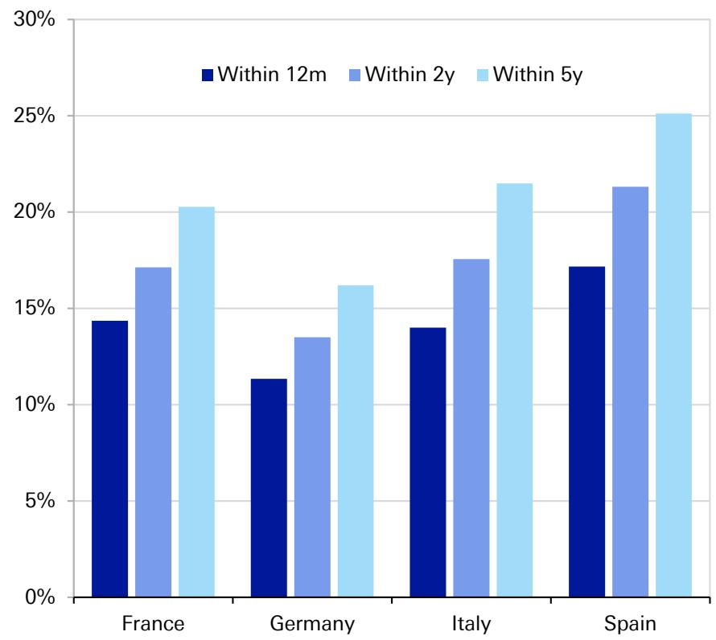

bar

| Country  | Within 12m | Within 2y | Within 5y |
| -------- | ---------- | --------- | --------- |
| France   | 14.3%      | 17.1%     | 20.2%     |
| Germany  | 11.3%      | 13.5%     | 16.1%     |
| Italy    | 14.0%      | 17.6%     | 21.4%     |
| Spain    | 17.2%      | 21.3%     | 25.1%     |

Euro area ex Ireland : Investment contribution to GDP growth, pp, % yoy   
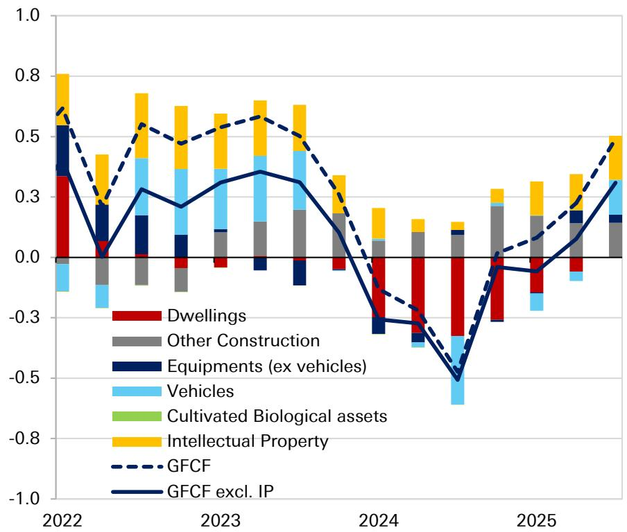

bar_stacked

| Year | Dwellings | Other Construction | Equipments (ex vehicles) | Vehicles | Cultivated Biological assets | Intellectual Property | GFCF | GFCF excl. IP |
|------|-----------|---------------------|--------------------------|----------|------------------------------|------------------------|------|---------------|
| 2022 | 0.3       | -0.1                | 0.6                      | -0.2     | -0.1                         | 0.8                    | 0.7  | 0.6           |
| 2023 | -0.1      | -0.2                | 0.4                      | 0.3      | -0.1                         | 0.7                    | 0.6  | 0.5           |
| 2024 | -0.1      | 0.1                 | -0.3                     | -0.4     | -0.3                         | 0.3                    | -0.3 | -0.3          |
| 2025 | -0.1      | 0.3                 | 0.1                      | -0.3     | -0.2                         | 0.3                    | 0.1  | 0.1           |
| 2026 | -0.1      | 0.2                 | 0.1                      | 0.2      | -0.1                         | 0.3                    | 0.2  | 0.3           |

Source: DB. See" Labour Market Chartbook: Resilience and Fragility", Focus Europe, 25 March 2026

# AI and the unemployment question: Augmentation vs. automation?

This chart shows the UK unemployment rate back to the 1750s. Economic history is a constant series of new technologies. Yet big rises in unemployment have generally only occurred in serious economic downturns, not when growth is propelled by productivity. Is this time different? What if AI is not a story of augmented productivity but of mass automation?

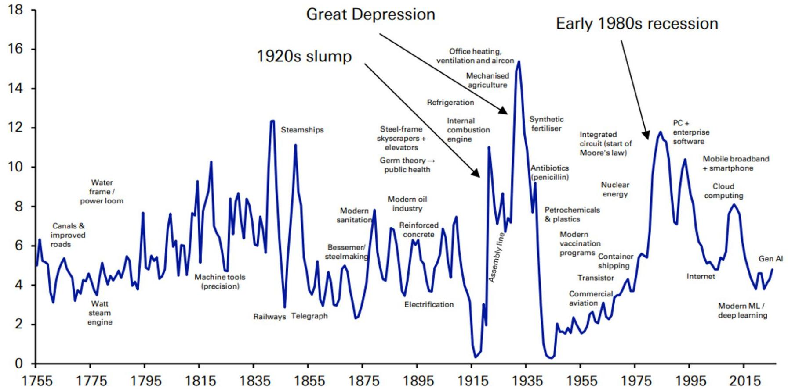  
Source: DB, Bank of England: Millennium of Macroeconomic Data, ONS. See “Innovation, Jobs and Inflation: Lessons from 250 Years of Disruption”, Thematic Research, 2 March 2026,

# Positives #2: Private balance sheets

We have created composite indicators of the health of private balance sheets. These combine indicators on the cost of borrowing, access to borrowing and the composition of borrowing (fixed rates, duration, etc). We observe positive (healthy) conditions in both the non-financial corporate sector (LHS) and household sector (RHS). This helps the (lagged) transmission of the ECB rate cuts and reduces the potential for exogenous shocks to amplify domestically (e.g. through the deleveraging of stretched balance sheets).

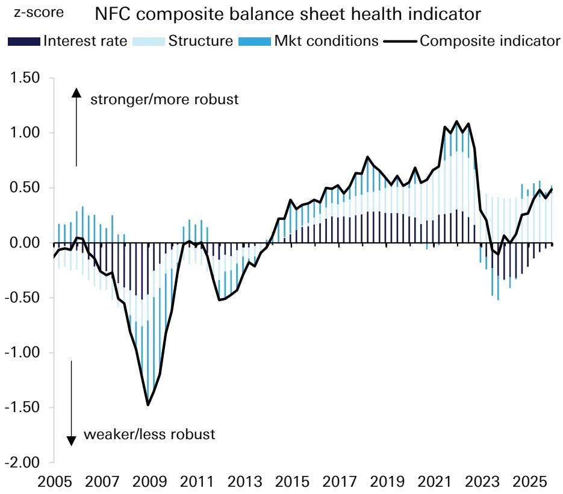

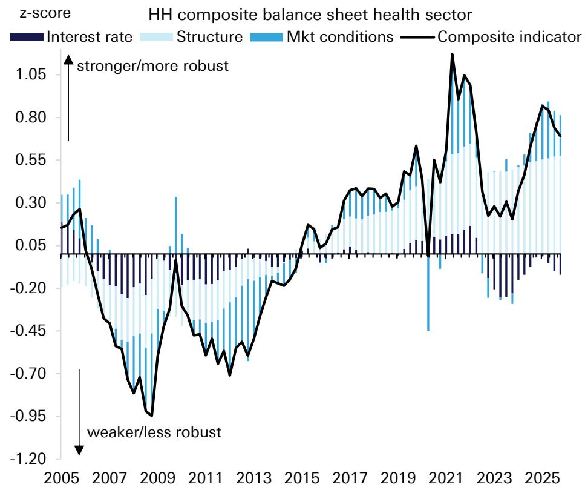

Source: DB, "Touring Transmission: Assessing the policy transmission mechanism", Focus Europe, 30 September 2025

# Positives #2: Interest-sensitive spending

There are signs in the macro data of the lagged transmission of the ECB's rate cuts into interest-sensitive spending. The charts below show indicators for consumer credit (LHS) and business investment spending (RHS). Although not very strong, the data do show a positive dynamic in 2025.

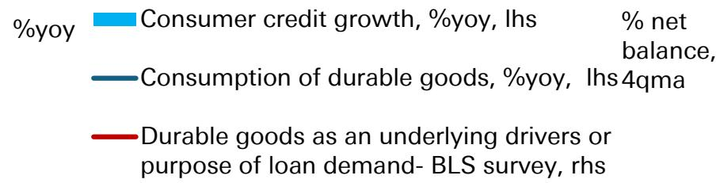

bar

| Category | Value |
| -------- | ----- |
| %yoy | Consumer credit growth, %yoy, lhs (% net balance) |
| Consumption of durable goods, %yoy, lhs 4qma | Consumption of durable goods, %yoy, lhs 4qma |
| Durable goods as an underlying drivers or purpose of loan demand- BLS survey, rhs | Durable goods as an underlying drivers or purpose of loan demand- BLS survey, rhs |

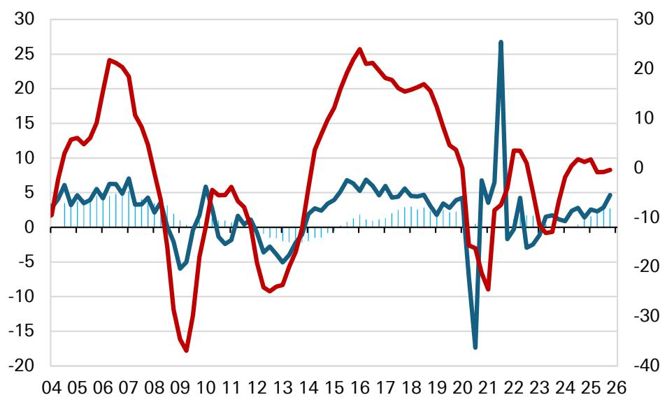

line

| Year | Red Line Value | Blue Line Value |
|------|----------------|-----------------|
| 04   | ~2             | ~5              |
| 05   | ~12            | ~4              |
| 06   | ~24            | ~6              |
| 07   | ~22            | ~7              |
| 08   | ~10            | ~3              |
| 09   | ~-18           | ~-6             |
| 10   | ~5             | ~5              |
| 11   | ~5             | ~-2             |
| 12   | ~-10           | ~-4             |
| 13   | ~-8            | ~-5             |
| 14   | ~10            | ~3              |
| 15   | ~18            | ~5              |
| 16   | ~25            | ~6              |
| 17   | ~23            | ~5              |
| 18   | ~20            | ~4              |
| 19   | ~18            | ~3              |
| 20   | ~-5            | ~-18            |
| 21   | ~-10           | ~-5             |
| 22   | ~10            | ~27             |
| 23   | ~-5            | ~-3             |
| 24   | ~5             | ~2              |
| 25   | ~8             | ~3              |
| 26   | ~7             | ~4              |

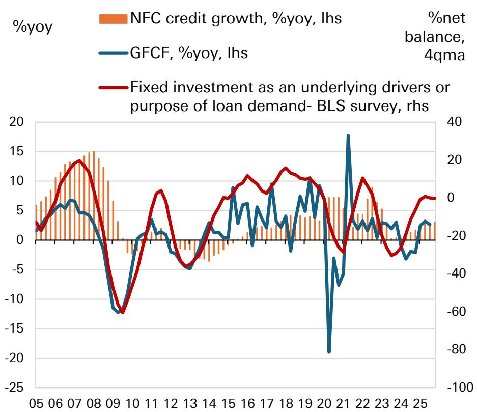

bar_line

| Year | NFC credit growth, %yoy, lhs | GFCF, %yoy, lhs | Fixed investment as an underlying drivers or purpose of loan demand- BLS survey, rhs |
|------|-------------------------------|-----------------|----------------------------------------------------------------------------------|
| 05   | ~6                            | ~2              | ~2                                                                               |
| 06   | ~10                           | ~6              | ~10                                                                              |
| 07   | ~13                           | ~7              | ~13                                                                              |
| 08   | ~15                           | ~5              | ~15                                                                              |
| 09   | ~10                           | ~-12            | ~-12                                                                             |
| 10   | ~-2                           | ~-10            | ~-10                                                                             |
| 11   | ~-5                           | ~3              | ~8                                                                               |
| 12   | ~-3                           | ~2              | ~5                                                                               |
| 13   | ~-5                           | ~-5             | ~-5                                                                              |
| 14   | ~-3                           | ~3              | ~3                                                                               |
| 15   | ~-2                           | ~5              | ~5                                                                               |
| 16   | ~3                            | ~8              | ~10                                                                              |
| 17   | ~5                            | ~6              | ~8                                                                               |
| 18   | ~3                            | ~4              | ~12                                                                              |
| 19   | ~5                            | ~7              | ~10                                                                              |
| 20   | ~3                            | ~-20            | ~-20                                                                             |
| 21   | ~5                            | ~18             | ~-5                                                                              |
| 22   | ~3                            | ~3              | ~10                                                                              |
| 23   | ~5                            | ~2              | ~5                                                                               |
| 24   | ~3                            | ~-3             | ~-3                                                                              |
| 25   | ~2                            | ~3              | ~5                                                                               |

# Positives #3: Euro sovereign bond markets

There has been a particular focus on France on account of the political volatility and challenging fiscal consolidation. Beyond that, however, we would point to two positives. First, ex-France, there has been a general spread/ratings compression across the euro area (LHS). This is consistent with more stable and integrated public finances. Second, by and large, external dynamics are positive for debt sustainability (RHS). Germany, Italy and Spain are showing a rising NIIP – France is not (middle chart).

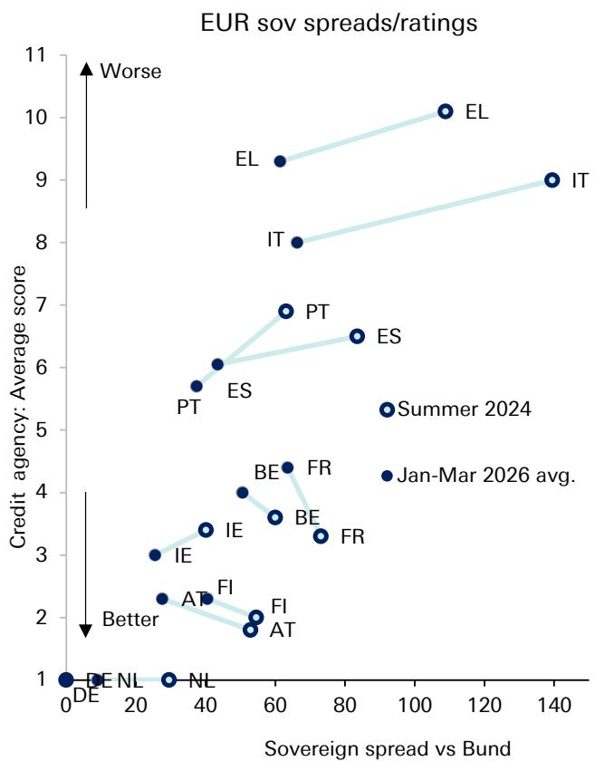

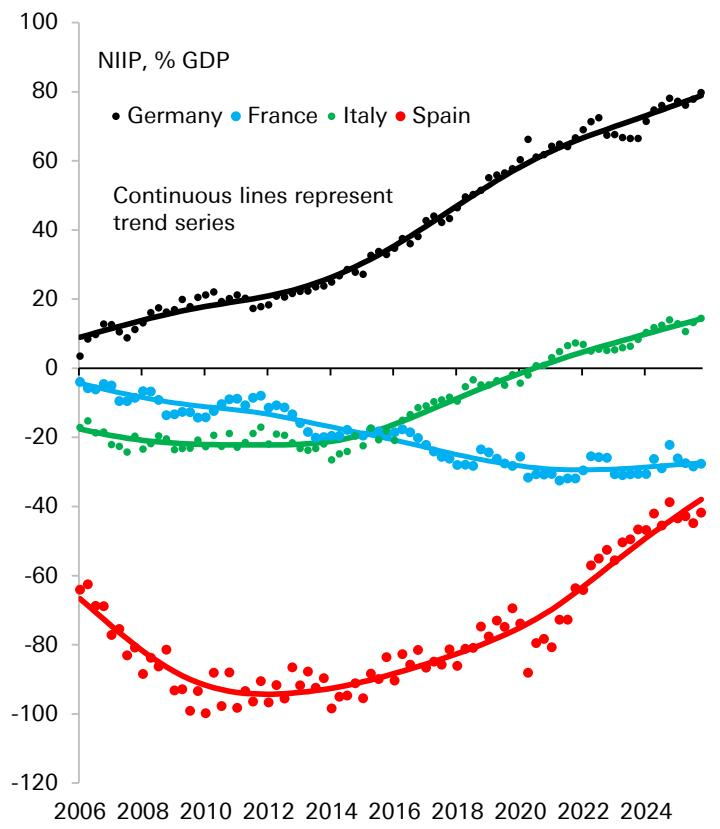

line

| Year | Germany | France | Italy | Spain |
|------|---------|--------|-------|-------|
| 2006 | ~5      | ~-5    | ~-20  | ~-65  |
| 2008 | ~15     | ~-10   | ~-25  | ~-85  |
| 2010 | ~20     | ~-15   | ~-30  | ~-95  |
| 2012 | ~25     | ~-20   | ~-35  | ~-95  |
| 2014 | ~30     | ~-25   | ~-35  | ~-95  |
| 2016 | ~40     | ~-30   | ~-25  | ~-85  |
| 2018 | ~50     | ~-35   | ~-15  | ~-75  |
| 2020 | ~65     | ~-35   | ~0    | ~-65  |
| 2022 | ~75     | ~-35   | ~10   | ~-55  |
| 2024 | ~80     | ~-35   | ~15   | ~-45  |

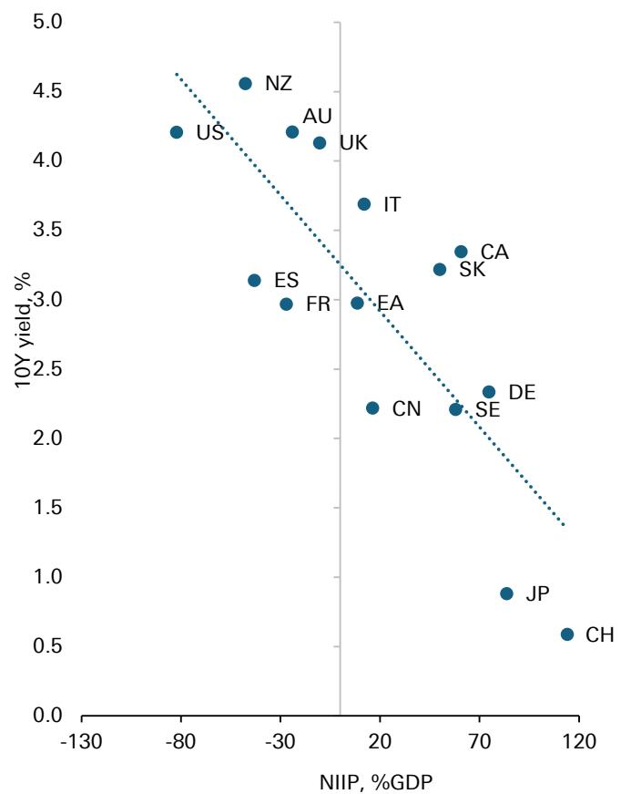

scatter

| Country | NIIP, %GDP | 10Y yield, % |
|---------|------------|---------------|
| US      | -80        | 4.2           |
| NZ      | -35        | 4.6           |
| AU      | -25        | 4.2           |
| UK      | -20        | 4.1           |
| IT      | 15         | 3.7           |
| ES      | -30        | 3.1           |
| FR      | -25        | 3.0           |
| EA      | 15         | 3.0           |
| CA      | 65         | 3.4           |
| SK      | 55         | 3.2           |
| CN      | 15         | 2.2           |
| DE      | 70         | 2.3           |
| SE      | 65         | 2.2           |
| JP      | 75         | 0.9           |
| CH      | 120        | 0.6           |

Source: DB, "Europe Fiscal Outlook: Clouds on the horizon", Focus Europe, 26 February 2026

# Positives #4: Defence Spending

NATO-Europe on average spent 2.3% of GDP on defence in 2025, a 30-year high. NATO leaders have agreed to increase core defence spending to 3.5% of GDP by 2035. Some EU countries on the eastern flank are already spending at this rate (or higher), and Germany is expected to get there by 2029. The world is changing and with or without peace in Ukraine, Europe needs to become more self-sufficient in defence. This may need additional funding support (e.g., common defence bonds).

Defence expenditure, % GDP 2021 prices   
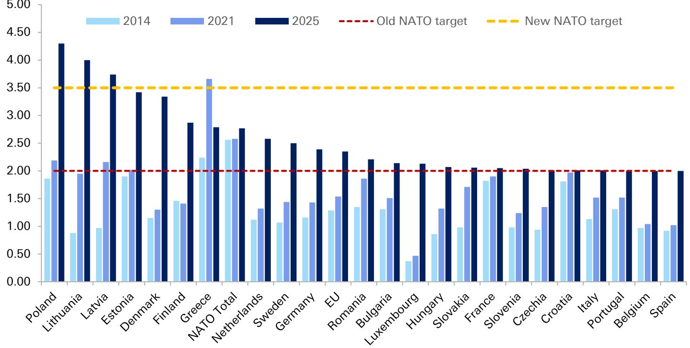

bar

| Country       | 2014  | 2021  | 2025  |
| ------------- | ----- | ----- | ----- |
| Poland        | 1.85  | 2.15  | 4.30  |
| Lithuania     | 0.85  | 1.95  | 4.00  |
| Latvia        | 0.95  | 2.15  | 3.70  |
| Estonia       | 1.85  | 2.00  | 3.40  |
| Denmark       | 1.15  | 1.30  | 3.30  |
| Finland       | 1.45  | 1.40  | 2.85  |
| Greece        | 2.20  | 3.65  | 2.75  |
| NATO Total    | 2.55  | 2.55  | 2.75  |
| Netherlands   | 1.10  | 1.30  | 2.55  |
| Sweden        | 1.05  | 1.40  | 2.45  |
| Germany       | 1.15  | 1.40  | 2.35  |
| EU            | 1.25  | 1.50  | 2.30  |
| Romania       | 1.30  | 1.85  | 2.20  |
| Bulgaria      | 1.30  | 1.50  | 2.10  |
| Luxembourg    | 0.35  | 0.45  | 2.10  |
| Hungary       | 0.85  | 1.30  | 2.05  |
| Slovakia      | 0.95  | 1.70  | 2.05  |
| France        | 1.80  | 1.90  | 2.05  |
| Slovenia      | 0.95  | 1.20  | 2.00  |
| Czechia       | 0.90  | 1.35  | 2.00  |
| Croatia       | 1.80  | 1.95  | 2.00  |
| Italy         | 1.10  | 1.50  | 2.00  |
| Portugal      | 1.30  | 1.50  | 2.00  |
| Belgium       | 0.95  | 1.05  | 2.00  |
| Spain         | 0.90  | 1.00  | 2.00  |

Europe Big 6 $^{^}$ core defence spending, % of GDP (GDP-weighted avg)   
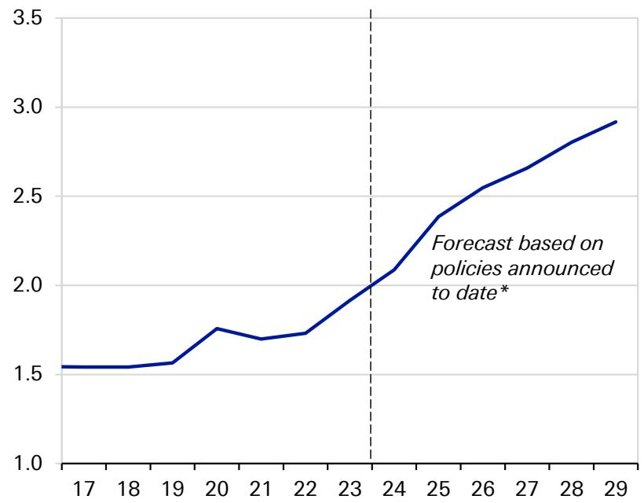

line

| Year | Value |
| ---- | ----- |
| 17   | 1.5   |
| 18   | 1.5   |
| 19   | 1.55  |
| 20   | 1.75  |
| 21   | 1.65  |
| 22   | 1.7   |
| 23   | 1.95  |
| 24   | 2.1   |
| 25   | 2.4   |
| 26   | 2.55  |
| 27   | 2.65  |
| 28   | 2.8   |
| 29   | 2.95  |

Source: DB, NATO. See “Defending Europe (Part 1): The price tag”, Focus Europe, 21 January 2025 and “Defending Europe: NATO summit delivers on narrow aims with the difficult work ahead”, Focus Europe, 26 June 2025

# Uncertainty: Geopolitics vs Economics

The LHS chart shows measures of (geo)political uncertainty for the US and EU against our proprietary EU economic uncertainty indicator. Political and economic uncertainty generally coincide. But economic uncertainty actually declined in 2025. Will this decoupling continue in 2026? Early evidence implies no (LHS). The RHS chart shows our measure of economic uncertainty across sectors.

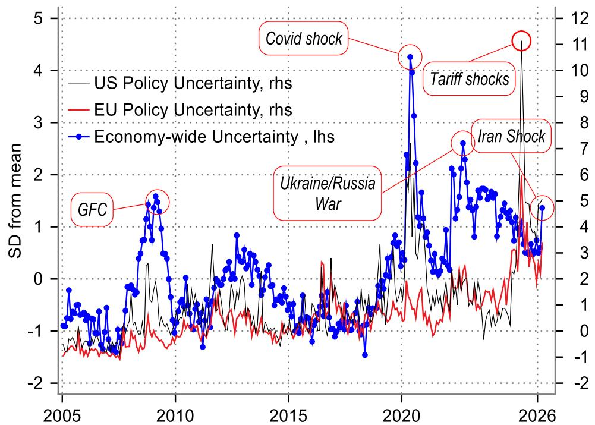

line

| Year | US Policy Uncertainty, rhs | EU Policy Uncertainty, rhs | Economy-wide Uncertainty, lhs |
|------|-----------------------------|-----------------------------|-------------------------------|
| 2005 | -1.5                        | -1.3                        | -0.8                          |
| 2010 | -0.5                        | -0.7                        | 1.5                           |
| 2015 | -0.8                        | -0.9                        | -0.5                          |
| 2020 | 2.5                         | 2.0                         | 4.5                           |
| 2026 | 1.5                         | 1.0                         | 1.5                           |

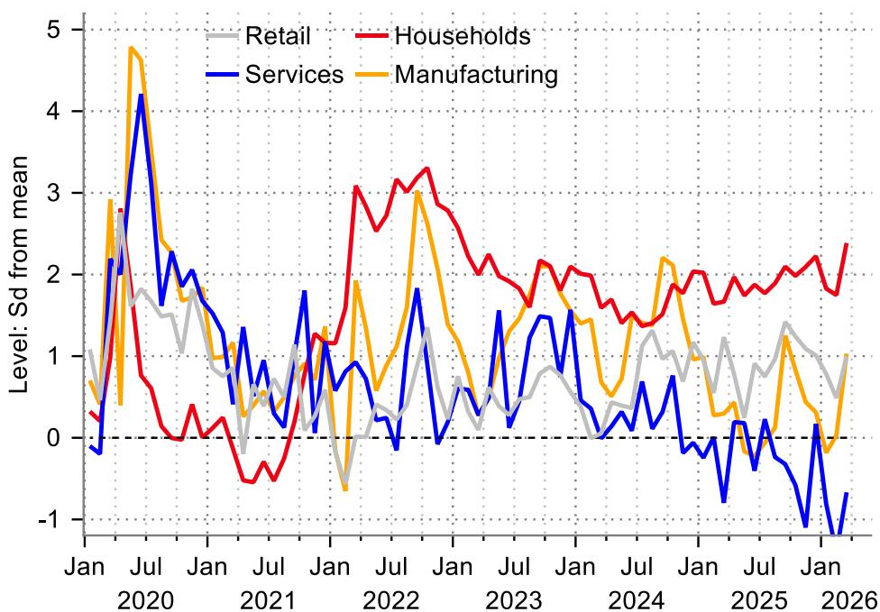

line

| Month   | Retail | Households | Services | Manufacturing |
|---------|--------|------------|----------|---------------|
| Jan 2020 | 1.0    | 0.3        | 0.0      | 0.5           |
| Jul 2020 | 1.8    | 2.8        | 4.2      | 4.8           |
| Jan 2021 | 1.0    | 0.0        | 1.5      | 1.7           |
| Jul 2021 | 0.5    | -0.5       | 0.8      | 0.3           |
| Jan 2022 | 1.0    | 3.1        | 0.9      | 1.9           |
| Jul 2022 | 0.5    | 3.3        | 1.8      | 3.0           |
| Jan 2023 | 0.8    | 2.0        | 0.5      | 1.5           |
| Jul 2023 | 1.0    | 2.1        | 1.5      | 1.4           |
| Jan 2024 | 0.5    | 1.5        | 0.8      | 0.5           |
| Jul 2024 | 1.2    | 1.8        | 0.5      | 2.1           |
| Jan 2025 | 1.4    | 1.9        | -0.8     | 1.3           |
| Jul 2025 | 1.3    | 2.0        | -1.0     | 0.8           |
| Jan 2026 | 1.0    | 2.4        | -1.2     | 1.0           |

Source: DB, policyuncertainty.com. See “Iran Shock: Key transmission channels”, Focus Europe, 2 March 2026

# Concerns #1: Transmission fading

Ordinarily we think of it taking 6-18 months for the effects of a change in monetary policy to fully feed through to the economy. We are now 10 months since the last ECB rate cut. The economy should be in the transmission sweet-spot. Yet the signals from our bank-based transmission indicators are softening, not strengthening: credit impulse (LHS), BLS credit conditions (RHS).

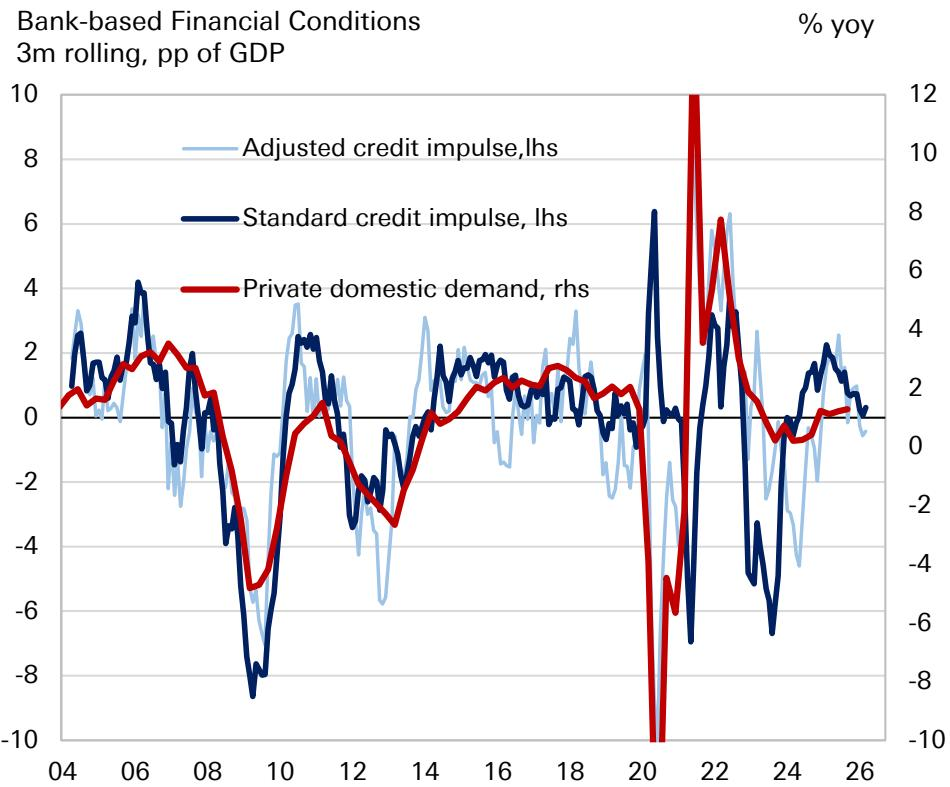

line

| Year | Adjusted credit impulse, lhs | Standard credit impulse, lhs | Private domestic demand, rhs |
|------|------------------------------|------------------------------|------------------------------|
| 04   | ~3.5                         | ~2.5                         | ~1.0                         |
| 06   | ~2.0                         | ~4.0                         | ~2.0                         |
| 08   | ~-2.0                        | ~-4.0                        | ~1.0                         |
| 10   | ~3.5                         | ~2.5                         | ~0.0                         |
| 12   | ~-4.0                        | ~-3.0                        | ~-2.0                        |
| 14   | ~3.0                         | ~2.0                         | ~1.0                         |
| 16   | ~2.0                         | ~1.5                         | ~1.5                         |
| 18   | ~3.5                         | ~1.0                         | ~1.0                         |
| 20   | ~-2.0                        | ~-10.0                       | ~-10.0                       |
| 22   | ~6.0                         | ~-7.0                        | ~12.0                        |
| 24   | ~-4.0                        | ~-6.0                        | ~-1.0                        |
| 26   | ~2.0                         | ~1.0                         | ~1.0                         |

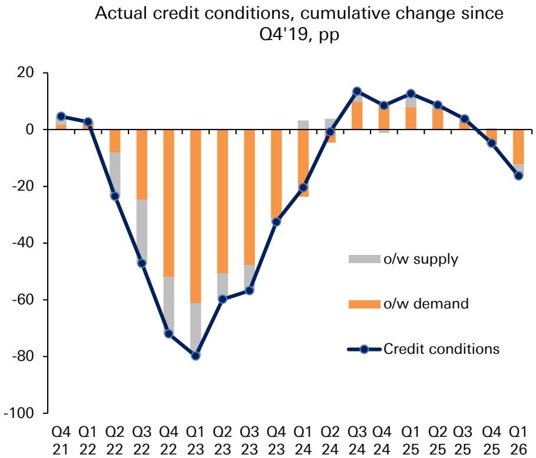

line

| Quarter | o/w supply | o/w demand | Credit conditions |
|---------|------------|------------|-------------------|
| Q4 21   | 0          | 0          | 5                 |
| Q1 22   | 0          | 0          | 5                 |
| Q2 22   | -10        | 5          | -25               |
| Q3 22   | -25        | 10         | -50               |
| Q4 22   | -50        | 15         | -75               |
| Q1 23   | -60        | 20         | -80               |
| Q2 23   | -50        | 15         | -60               |
| Q3 23   | -50        | 15         | -60               |
| Q4 23   | -50        | 15         | -35               |
| Q1 24   | 0          | -20        | -20               |
| Q2 24   | 0          | -5         | -5                |
| Q3 24   | 0          | 10         | 15                |
| Q4 24   | 0          | 10         | 10                |
| Q1 25   | 5          | 10         | 15                |
| Q2 25   | 5          | 10         | 10                |
| Q3 25   | 0          | 5          | 5                 |
| Q4 25   | 0          | 0          | -5                |
| Q1 26   | -15        | -10        | -15               |

Source: DB, “Touring Transmission: Assessing the policy transmission mechanism”, Focus Europe, 30 September 2025 and “The latest update on bank lending and financial conditions”, Europe Blog, 26 March 2026

# Financial Conditions: Market-based indices

The DB FCI (LHS) is a classic financial conditions index, weighted on the basis of correlations with GDP growth. There has been a clear tightening – led by oil prices – consistent with knocking about 0.5pp off GDP growth. The ECB has created a new ‘macro-finance’ FCI (DB replication RHS). This state-of-the-art FCI jointly estimates the weights by capturing mutual feedback between macro and financial variables. The tightening of financial conditions looks modest – and mostly reflects the pricing of rate hikes.

Financial Conditions Index (FCI)   
# of standard deviations from mean (rising means looser, falling means tighter)   
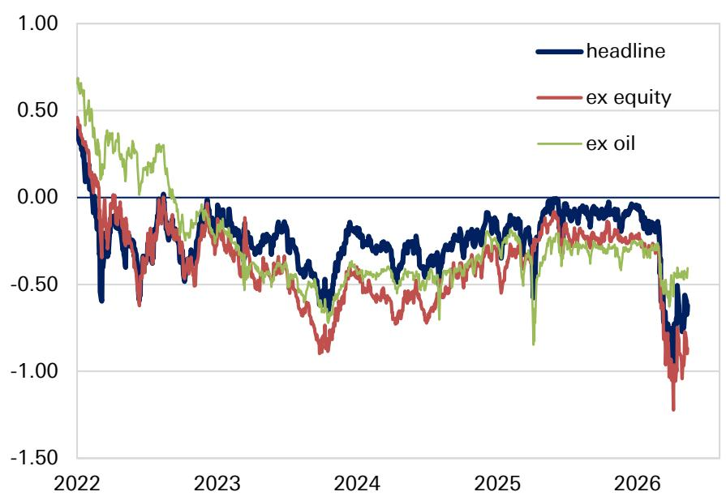

line

| Year | headline | ex equity | ex oil |
|------|----------|-----------|--------|
| 2022 | 0.40     | 0.45      | 0.65   |
| 2023 | -0.10    | -0.20     | -0.15  |
| 2024 | -0.30    | -0.40     | -0.35  |
| 2025 | -0.15    | -0.25     | -0.20  |
| 2026 | -0.70    | -1.20     | -0.45  |

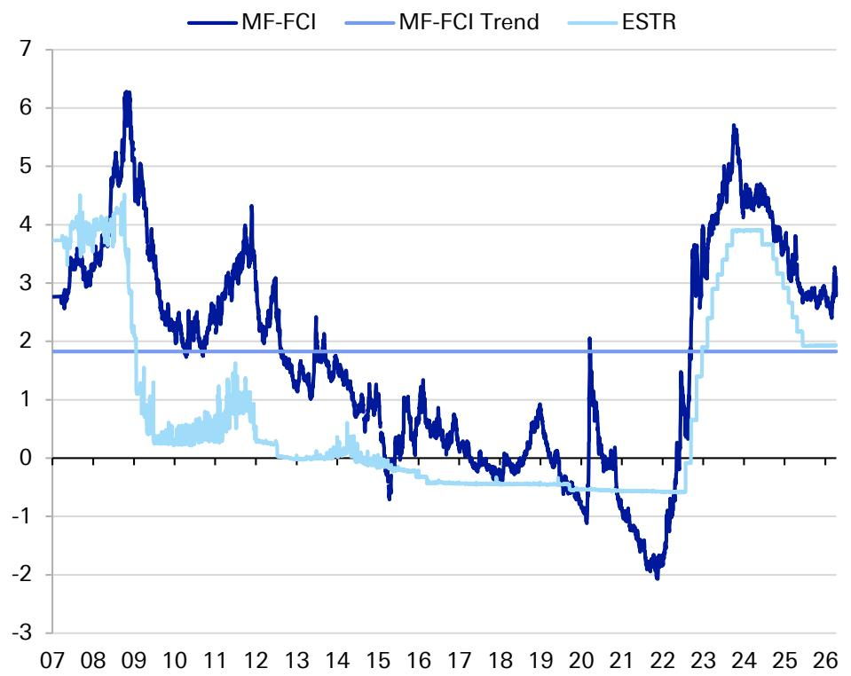

line

| Year | MF-FCI | MF-FCI Trend | ESTR |
|------|--------|--------------|------|
| 07   | 2.8    | 1.8          | 3.8  |
| 08   | 3.5    | 1.8          | 4.2  |
| 09   | 6.2    | 1.8          | 4.5  |
| 10   | 2.5    | 1.8          | 0.5  |
| 11   | 2.8    | 1.8          | 0.8  |
| 12   | 4.2    | 1.8          | 0.5  |
| 13   | 2.0    | 1.8          | 0.2  |
| 14   | 1.5    | 1.8          | 0.0  |
| 15   | 0.5    | 1.8          | -0.5 |
| 16   | 1.2    | 1.8          | -0.8 |
| 17   | 0.8    | 1.8          | -0.9 |
| 18   | 0.5    | 1.8          | -0.9 |
| 19   | 0.8    | 1.8          | -0.9 |
| 20   | -1.0   | 1.8          | -0.9 |
| 21   | -2.0   | 1.8          | -0.9 |
| 22   | -2.2   | 1.8          | -0.9 |
| 23   | 3.5    | 1.8          | 3.8  |
| 24   | 5.5    | 1.8          | 4.0  |
| 25   | 3.5    | 1.8          | 3.0  |
| 26   | 3.0    | 1.8          | 2.0  |

Source: DB, See “The latest update on bank lending and financial conditions”, Europe Blog, 26 March 2026

# Concerns #2: Public debt dynamics

There are challenges ahead for euro area public finances. The starting point in general is quite weak: public finances have still not returned to the pre-pandemic level (LHS) and vulnerability indicators remain high (middle). And there are clouds on the horizon: the ‘i-g’ gap is becoming less favourable (RHS) even as the EU’s need for strategic investments rises (defence, energy, etc).

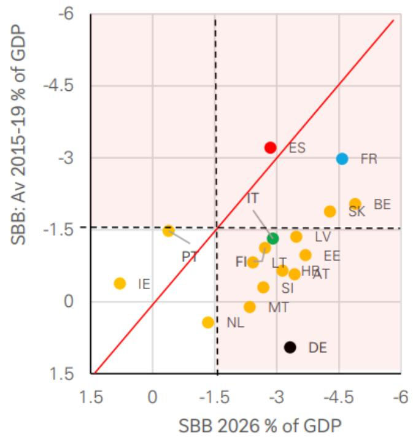

scatter

| Country | SBB 2026 % of GDP | SBB: Av 2015-19 % of GDP |
|---------|------------------|--------------------------|
| IE      | -0.8             | 0.3                      |
| PT      | -1.2             | -1.4                     |
| NL      | -1.6             | -0.8                     |
| FI      | -1.7             | -1.2                     |
| LT      | -2.8             | -1.3                     |
| SI      | -2.9             | -0.5                     |
| MT      | -3.0             | -0.2                     |
| DE      | -2.9             | -1.7                     |
| EE      | -3.0             | -1.4                     |
| LV      | -3.1             | -1.5                     |
| SK      | -4.5             | -1.3                     |
| BE      | -4.4             | -1.2                     |
| FR      | -4.5             | -3.0                     |
| ES      | -3.0             | -2.9                     |

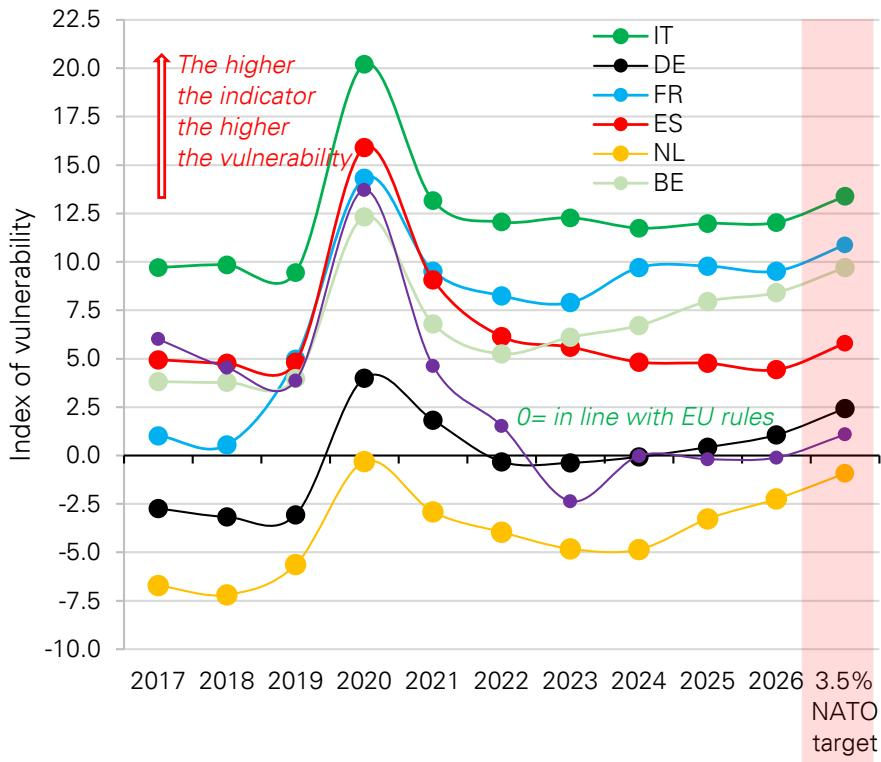

line

| Year | IT   | DE   | FR   | ES   | NL   | BE   |
|------|------|------|------|------|------|------|
| 2017 | 10.0 | -3.0 | 1.0  | 5.0  | -7.0 | 4.0  |
| 2018 | 10.0 | -3.0 | 0.5  | 5.0  | -7.5 | 4.0  |
| 2019 | 9.5  | -3.0 | 4.0  | 4.5  | -6.0 | 4.0  |
| 2020 | 20.5 | 4.0  | 14.5 | 16.0 | -0.5 | 12.5 |
| 2021 | 13.5 | 2.0  | 9.5  | 9.0  | -3.0 | 7.0  |
| 2022 | 12.5 | -0.5 | 8.5  | 6.5  | -4.0 | 5.0  |
| 2023 | 12.5 | -0.5 | 8.0  | 5.5  | -5.0 | 6.0  |
| 2024 | 12.0 | -0.5 | 9.5  | 4.5  | -5.0 | 7.0  |
| 2025 | 12.0 | 0.5  | 9.5  | 4.5  | -3.0 | 8.0  |
| 2026 | 12.0 | 1.0  | 9.5  | 4.5  | -2.5 | 8.5  |
| 3.5% NATO target | 13.5 | 2.5  | 11.0 | 6.0  | -1.0 | 9.5  |

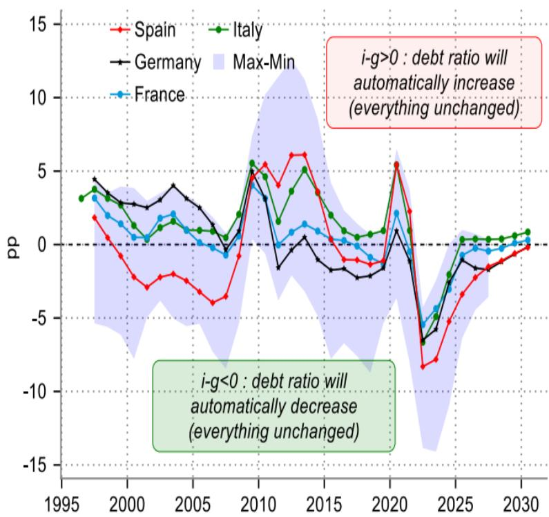

line

| Year | Spain | Italy | Germany | France | Max-Min |
|------|-------|-------|---------|--------|---------|
| 1995 | 2.0   | 3.5   | 4.0     | 3.0    | -       |
| 2000 | -2.0  | 1.0   | 2.5     | 1.5    | -       |
| 2005 | -3.0  | 1.5   | 3.0     | 2.0    | -       |
| 2010 | 5.0   | 5.5   | 4.5     | 4.0    | -       |
| 2015 | 6.0   | 4.0   | 1.0     | 1.5    | -       |
| 2020 | 5.5   | 1.0   | -2.0    | 2.0    | -       |
| 2025 | -8.0  | -7.0  | -6.0    | -5.0   | -       |
| 2030 | 1.0   | 1.5   | 1.0     | 1.5    | -       |

Source: DB, "Europe Public Finances: Clouds on the horizon", Focus Europe, 26 February 2026

# Concern #3: "Competitiveness"

The world is changing, becoming more frictional, more geopolitical. This does not suit the EU, which was built on trade, integration and multilateralism. The EU built large external dependencies – on US for defence, Russia for energy, exports for growth – and these have become vulnerabilities. Tariffs, euro FX appreciation, US dominance of digital and China’s dominance of critical minerals compound the competitiveness challenge for Europe.

Euro area competitiveness   
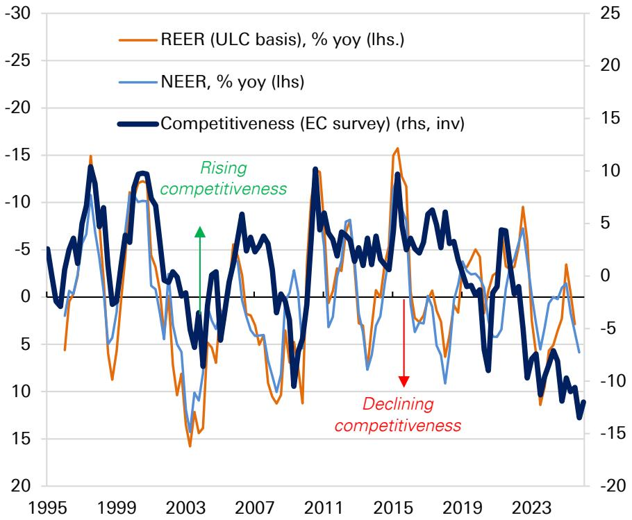

line

| Year | REER (ULC basis), % yoy (lhs.) | NEER, % yoy (lhs) | Competitiveness (EC survey) (rhs, inv) |
|------|----------------------------------|-------------------|----------------------------------------|
| 1995 | -5                               | -2                | -4                                     |
| 1999 | -15                              | -10               | -10                                    |
| 2003 | -15                              | -10               | -10                                    |
| 2007 | -5                               | -5                | -5                                     |
| 2011 | -10                              | -5                | -5                                     |
| 2015 | -15                              | -5                | -5                                     |
| 2019 | -5                               | -5                | -5                                     |
| 2023 | -10                              | -5                | -10                                    |

Producers prices, manufactured goods, 2019=100   
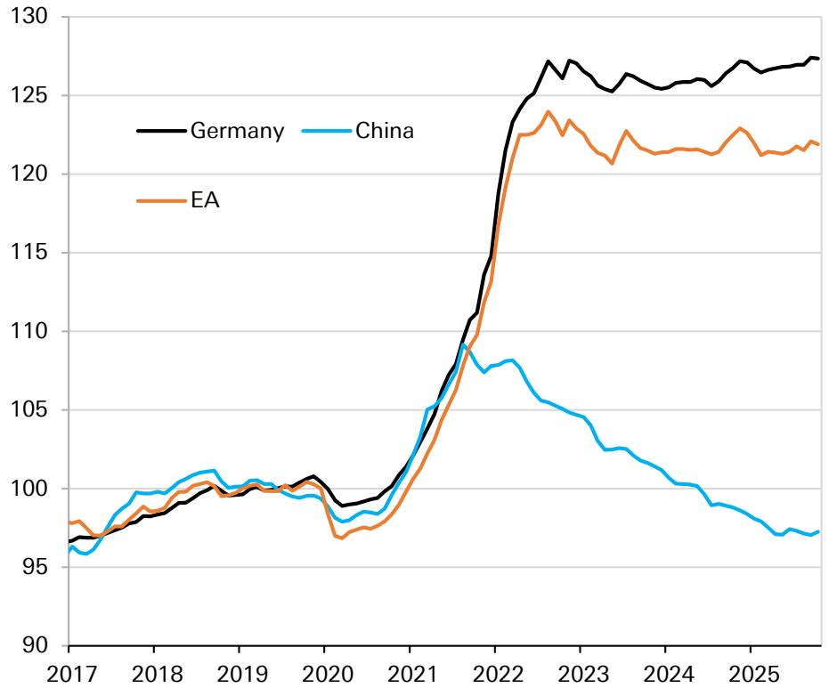

line

| Year | Germany | China | EA   |
|------|---------|-------|------|
| 2017 | 96.5    | 96.0  | 98.0 |
| 2018 | 98.0    | 99.5  | 99.0 |
| 2019 | 99.5    | 100.5 | 100.0|
| 2020 | 98.5    | 98.0  | 97.0 |
| 2021 | 105.0   | 105.5 | 104.0|
| 2022 | 125.0   | 108.0 | 123.0|
| 2023 | 126.0   | 104.0 | 121.0|
| 2024 | 125.5   | 100.5 | 121.5|
| 2025 | 127.0   | 97.5  | 121.0|

Source: DB, “Anti-involution is no panacea”, Germany Schnappschuss, 21 November 2025 and “The two-economy problem”, Focus Europe, 5 December 2025.

# Strategic Autonomy: Europe's solution to an increasingly frictional world

EU external dependencies: US for defence, Russia for energy, exports for growth. These have become vulnerabilities. Europe needs more ‘strategic autonomy’: the ability to trade and have alliances while having greater independence on security/defence, energy supply, technology, supply chains, etc. Draghi published the blueprint for strategic autonomy in 2024. It is expensive: EUR800bn per annum. Difficult when public debt is high, and politics is fragmented.

Semiconductors: Capacity broken down by level of sophistication, %   
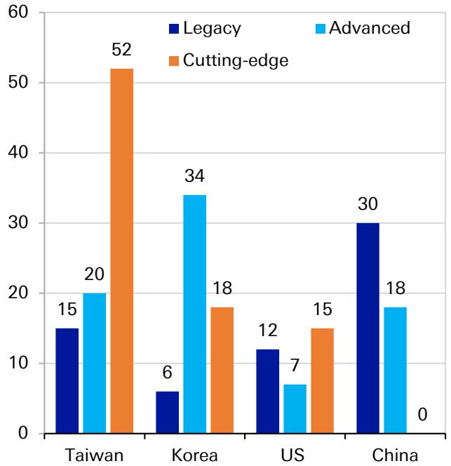

bar

| Region | Legacy | Advanced | Cutting-edge |
| :--- | :--- | :--- | :--- |
| Taiwan | 15 | 20 | 52 |
| Korea | 6 | 34 | 18 |
| US | 12 | 7 | 15 |
| China | 30 | 18 | 0 |

Top 10 countries with the largest rare earth oxides reserves, 2024, %   
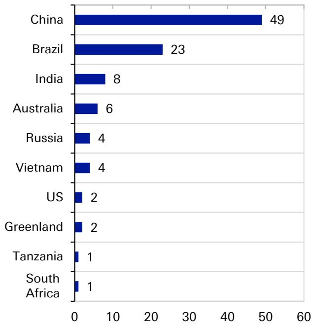

bar

| Country | Value |
| :--- | :--- |
| China | 49 |
| Brazil | 23 |
| India | 8 |
| Australia | 6 |
| Russia | 4 |
| Vietnam | 4 |
| US | 2 |
| Greenland | 2 |
| Tanzania | 1 |
| South Africa | 1 |

Energy prices in the Euro area relative to the US, (Ratio)   
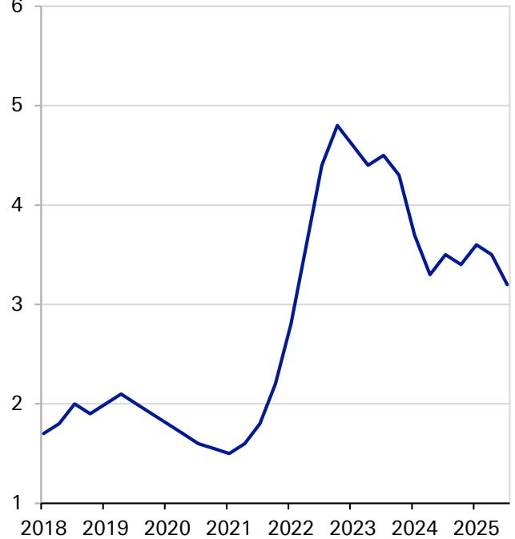

line

| Year | Value |
| ---- | ----- |
| 2018 | 1.7   |
| 2019 | 2.1   |
| 2020 | 1.8   |
| 2021 | 1.5   |
| 2022 | 2.8   |
| 2023 | 4.8   |
| 2024 | 3.3   |
| 2025 | 3.6   |

Source: DB. See “Semiconductors: What to expect in 2025 in 8 slides”, Thematic Research, 18 February 2025 and See “How to revive growth in Europe”, speech by Isabel Schnabel, 20 October 2025

# Politics: Is the EU cohesive enough to adapt to a changing world?

Markets will be living in the shadow of the French Presidential election for the next year. The far-right RN has the polling momentum (chart below shows RN election momentum over time). Germany has five State elections in 2026. AfD have momentum too and Chancellor Merz's coalition is finding governing to be heavy going. Political fragmentation makes policy making across the EU more difficult.

RN score at major national elections - 2002 to 2024   
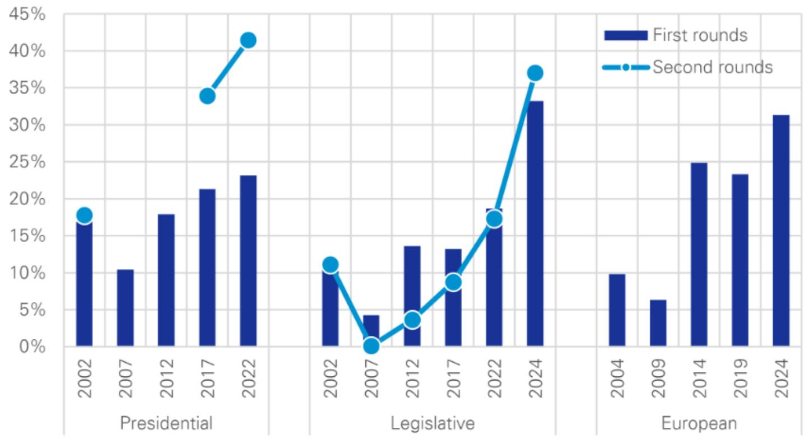

bar_line

| Year | First rounds | Second rounds |
|------|--------------|---------------|
| 2002 | 17%          | 18%           |
| 2007 | 10%          | -             |
| 2012 | 18%          | -             |
| 2017 | 21%          | 34%           |
| 2022 | 23%          | 41%           |
| 2002 | 11%          | 11%           |
| 2007 | 4%           | 1%            |
| 2012 | 13%          | 4%            |
| 2017 | 13%          | 9%            |
| 2022 | 18%          | 17%           |
| 2024 | 33%          | 37%           |
| 2004 | 10%          | -             |
| 2009 | 6%           | -             |
| 2014 | 25%          | -             |
| 2019 | 23%          | -             |
| 2024 | 31%          | -             |

Source: DB, INSA, Forsa, YouGov, Ifop. See “Meanwhile, the shifting political landscape at home”, Europe Chart Of The Week, 13 March 2026

# Concerns #4: Inflation-prone

Pre-conflict, our view was that the combination of fiscal easing (defence, strategic autonomy) and a tightening labour market (LHS) would likely support a rotation from inflation undershooting in 2026 to risks of overshooting from 2027/2028. The energy shock could accelerate these risks. Passthrough is already above normal (middle) and household inflation expectations are rising (RHS).

ECB Wage Tracker   
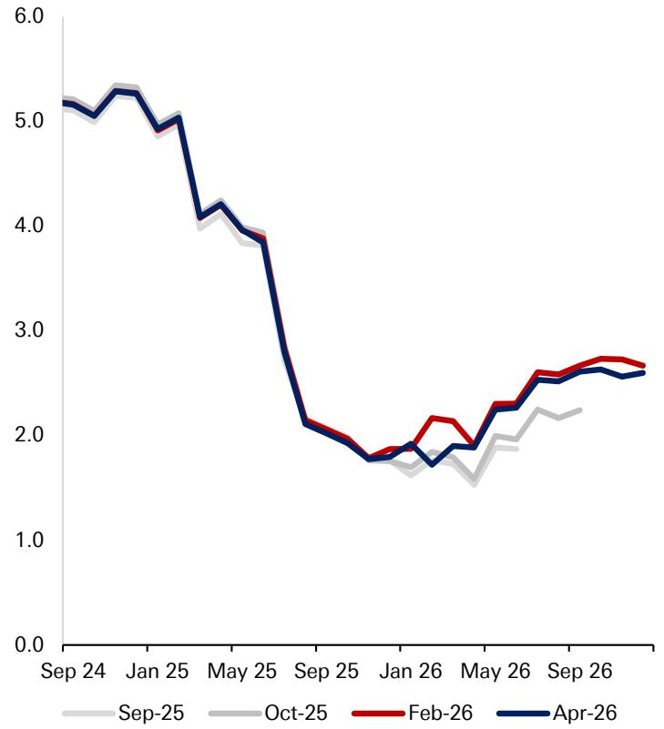

line

| Date    | Sep-25 | Oct-25 | Feb-26 | Apr-26 |
|---------|--------|--------|--------|--------|
| Sep 24  | 5.1    | 5.1    | 5.1    | 5.1    |
| Jan 25  | 5.3    | 5.3    | 5.3    | 5.3    |
| May 25  | 4.0    | 4.0    | 4.0    | 4.0    |
| Sep 25  | 2.1    | 2.1    | 2.1    | 2.1    |
| Jan 26  | 1.8    | 1.8    | 1.8    | 1.8    |
| May 26  | 1.9    | 1.9    | 1.9    | 1.9    |
| Sep 26  | 2.7    | 2.7    | 2.7    | 2.7    |

PMI Composite Index   
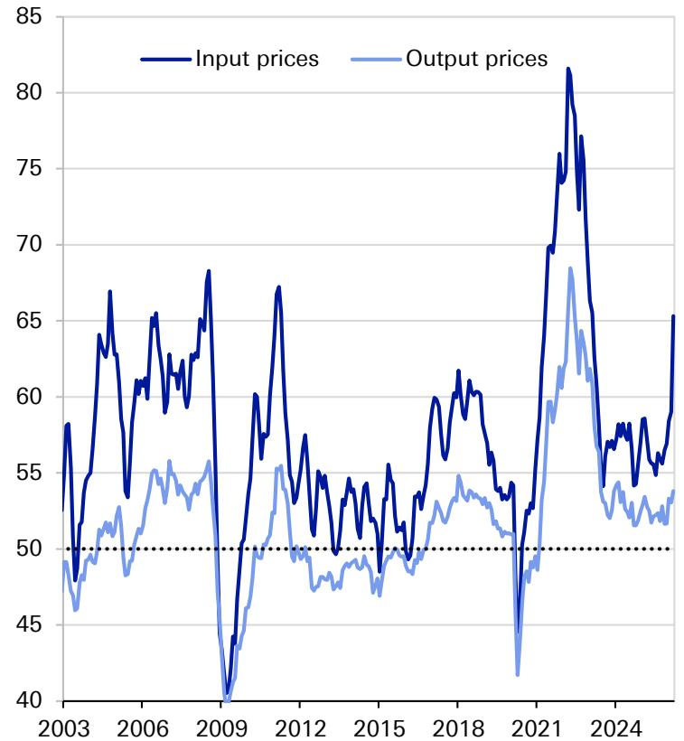

line

| Year | Input prices | Output prices |
|------|--------------|---------------|
| 2003 | 58           | 49            |
| 2006 | 65           | 55            |
| 2009 | 40           | 40            |
| 2012 | 67           | 55            |
| 2015 | 50           | 48            |
| 2018 | 61           | 54            |
| 2021 | 76           | 68            |
| 2024 | 58           | 53            |

Average expected inflation (%) each year for next 5 to 10 years   
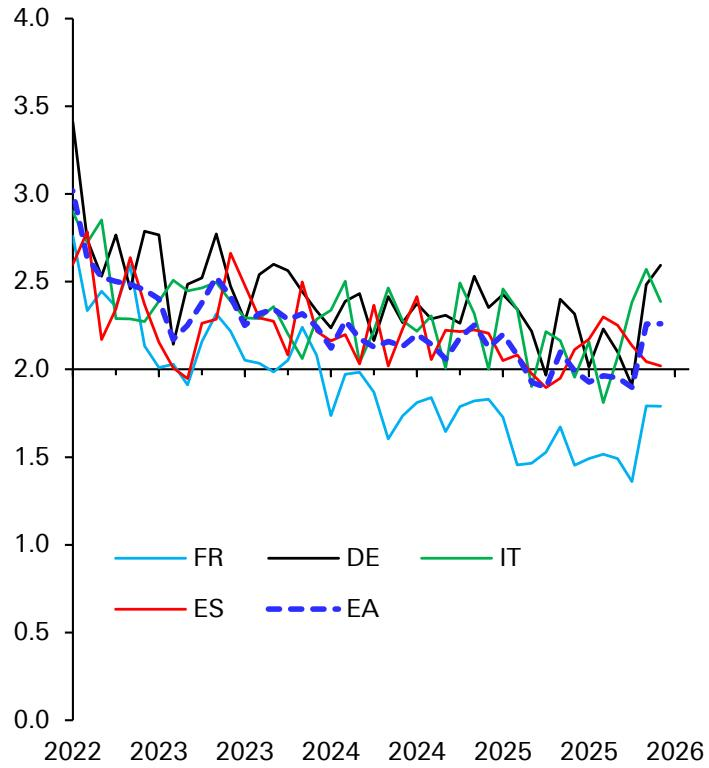

line

| Year | FR    | DE    | IT    | ES    | EA    |
|------|-------|-------|-------|-------|-------|
| 2022 | 2.8   | 3.5   | 2.9   | 2.7   | 3.0   |
| 2023 | 1.9   | 2.8   | 2.5   | 2.6   | 2.4   |
| 2024 | 1.8   | 2.4   | 2.3   | 2.1   | 2.2   |
| 2025 | 1.5   | 2.3   | 2.4   | 1.9   | 1.9   |
| 2026 | 1.8   | 2.6   | 2.5   | 2.0   | 2.3   |

Source: DB, See "April dbDataInsights survey – Household inflation expectations update, The Wide Angle, 6 May 2026

# Concerns #4: Inflation-prone

The passthrough of rising energy costs into inflation is state-contingent. One key determinant is the degree of slack in the labour market. The unemployment rate is below the equilibrium rate (NAWRU) (LHS) and in our dbDIG survey we see a rising likelihood of households asking for a pay rise (middle). Another determinant is supply chains, which are tightening (RHS).

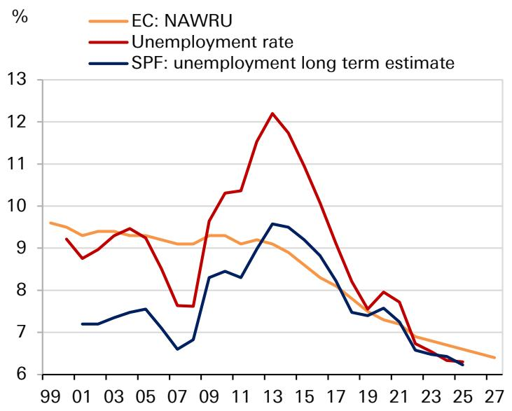

line

| Year | EC: NAWRU | Unemployment rate | SPF: unemployment long term estimate |
|------|-----------|-------------------|--------------------------------------|
| 99   | 9.6       | 9.2               | 7.2                                  |
| 01   | 9.4       | 8.8               | 7.3                                  |
| 03   | 9.3       | 9.4               | 7.4                                  |
| 05   | 9.2       | 9.3               | 7.5                                  |
| 07   | 9.1       | 7.6               | 6.6                                  |
| 09   | 9.2       | 9.6               | 8.3                                  |
| 11   | 9.1       | 10.3              | 8.4                                  |
| 13   | 9.0       | 12.2              | 9.5                                  |
| 15   | 8.8       | 11.8              | 9.3                                  |
| 17   | 8.2       | 10.0              | 8.5                                  |
| 19   | 7.5       | 7.5               | 7.4                                  |
| 21   | 7.2       | 7.8               | 7.5                                  |
| 23   | 6.8       | 6.8               | 6.5                                  |
| 25   | 6.5       | 6.3               | 6.2                                  |
| 27   | 6.3       | 6.2               | 6.1                                  |

Euro area – average likelihood of asking for a pay rise (on a scale 0-10)   
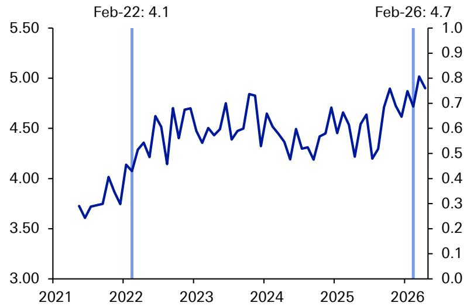

line

| Date     | Value |
| -------- | ----- |
| Feb-22   | 4.1   |
| Feb-26   | 4.7   |

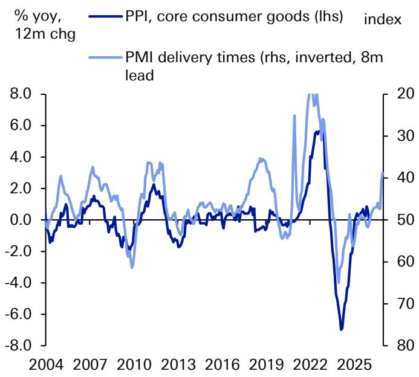

line

| Year | PPI, core consumer goods (lhs) index | PMI delivery times (rhs, inverted, 8m lead) |
|------|----------------------------------------|---------------------------------------------|
| 2004 | -1.0                                   | 50                                          |
| 2007 | 1.5                                    | 45                                          |
| 2010 | -2.0                                   | 60                                          |
| 2013 | 0.5                                    | 55                                          |
| 2016 | 0.0                                    | 50                                          |
| 2019 | 1.0                                    | 45                                          |
| 2022 | 6.0                                    | 30                                          |
| 2025 | -7.0                                   | 40                                          |

Source: DB, “How much passthrough? The state-contingency of price surveys”, UK Economic Notes, 15 April 2026 and “April dbDataInsights survey – Household inflation expectations update, The Wide Angle, 6 May 2026

# Passthrough Playbook: Energy transmission, Stage 1 – Direct Effects

There are three stages in the transmission of an energy shock into inflation. Stage 1 is ‘direct effects’. That is, the increase in energy inflation itself. The increase in energy HICP is already clear since the start of the Middle East conflict. The rise is in line with historic norms. This chart shows what energy HICP inflation should be assuming prices follow the energy curves (oil and gas). This energy shock is still only a fraction of the 2022 shock.

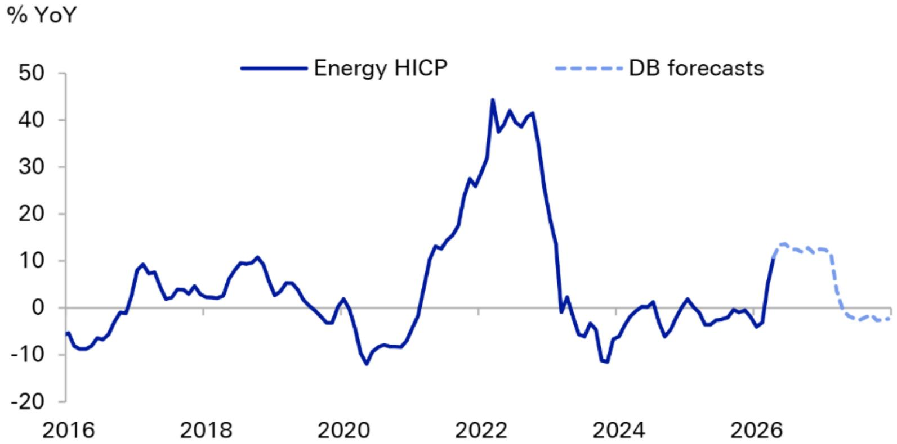

line

| Year | Energy HICP | DB forecasts |
|------|-------------|--------------|
| 2016 | -8          | -            |
| 2017 | 9           | -            |
| 2018 | 3           | -            |
| 2019 | 10          | -            |
| 2020 | -12         | -            |
| 2021 | 13          | -            |
| 2022 | 45          | -            |
| 2023 | 10          | -            |
| 2024 | -12         | -            |
| 2025 | 1           | -            |
| 2026 | -5          | 13           |
| 2027 | -           | -5           |

Source: DB, "Passthrough Playbook: Tracking the stages of energy transmission", Europe Blog, 1 May 2026

# Passthrough Playbook: Energy transmission, Stage 2 – Indirect Effects

Stage 2 in the transmission of an energy shock is ‘Indirect Effects’. That is, prices that rise because energy costs have increased. The PMI points to strong pass-through of rising input costs into output prices, beyond 2022 levels already in April (LHS). We will be monitoring the high energy-intensive core HICP index for signs of indirect effects (RHS). This had the same shape as energy HICP in 2022, with a six-month lag.

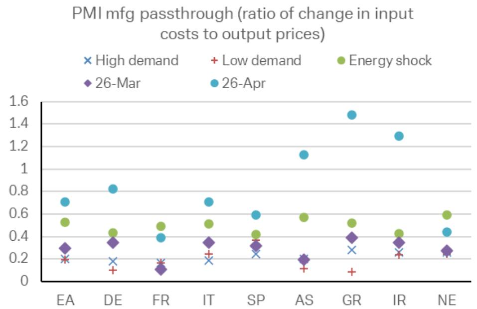

scatter

| Region | High demand | Low demand | 26-Mar | 26-Apr |
|--------|-------------|------------|--------|--------|
| EA     | 0.2         | 0.1        | 0.3    | 0.7    |
| DE     | 0.15        | 0.1        | 0.35   | 0.8    |
| FR     | 0.15        | 0.15       | 0.1    | 0.4    |
| IT     | 0.2         | 0.2        | 0.35   | 0.7    |
| SP     | 0.2         | 0.3        | 0.3    | 0.6    |
| AS     | 0.2         | 0.1        | 0.2    | 1.1    |
| GR     | 0.25        | 0.1        | 0.4    | 1.5    |
| IR     | 0.2         | 0.2        | 0.35   | 1.3    |
| NE     | 0.2         | 0.2        | 0.3    | 0.4    |

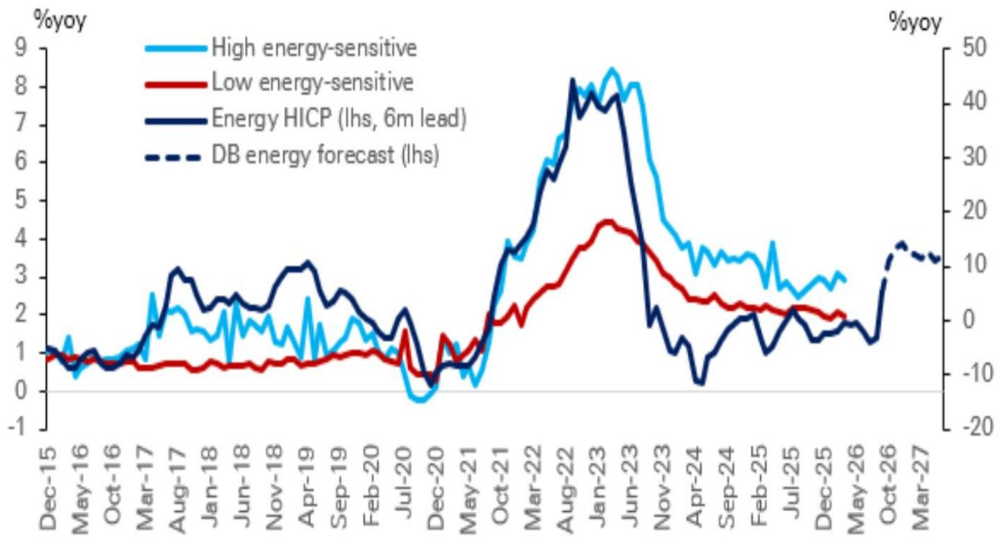

line

| Date    | High energy-sensitive | Low energy-sensitive | Energy HICP (lhs, 6m lead) | DB energy forecast (lhs) |
|---------|------------------------|----------------------|-----------------------------|--------------------------|
| Dec-15  | ~1.0                   | ~0.8                 | ~1.0                        | ~1.0                     |
| May-16  | ~0.8                   | ~0.6                 | ~0.8                        | ~0.8                     |
| Oct-16  | ~0.9                   | ~0.7                 | ~0.9                        | ~0.9                     |
| Mar-17  | ~2.5                   | ~0.7                 | ~3.0                        | ~1.5                     |
| Aug-17  | ~2.0                   | ~0.7                 | ~3.5                        | ~2.0                     |
| Jan-18  | ~1.5                   | ~0.7                 | ~2.5                        | ~1.5                     |
| Jun-18  | ~1.8                   | ~0.7                 | ~2.8                        | ~1.8                     |
| Nov-18  | ~2.0                   | ~0.7                 | ~3.2                        | ~2.0                     |
| Apr-19  | ~2.5                   | ~0.7                 | ~3.5                        | ~2.5                     |
| Sep-19  | ~2.0                   | ~0.7                 | ~3.0                        | ~2.0                     |
| Feb-20  | ~1.5                   | ~0.7                 | ~2.5                        | ~1.5                     |
| Jul-20  | ~0.5                   | ~0.7                 | ~2.0                        | ~1.0                     |
| Dec-20  | ~0.0                   | ~0.7                 | ~1.5                        | ~0.5                     |
| May-21  | ~1.0                   | ~1.0                 | ~3.5                        | ~1.5                     |
| Oct-21  | ~3.5                   | ~1.5                 | ~5.0                        | ~3.0                     |
| Mar-22  | ~6.0                   | ~2.5                 | ~7.0                        | ~5.0                     |
| Aug-22  | ~8.0                   | ~3.5                 | ~8.5                        | ~7.0                     |
| Jan-23  | ~8.5                   | ~4.5                 | ~8.0                        | ~8.0                     |
| Jun-23  | ~8.0                   | ~4.0                 | ~7.5                        | ~7.5                     |
| Nov-23  | ~4.0                   | ~3.0                 | ~1.0                        | ~3.0                     |
| Apr-24  | ~3.0                   | ~2.5                 | ~-10.0                      | ~2.5                     |
| Sep-24  | ~3.5                   | ~2.5                 | ~-5.0                       | ~3.0                     |
| Feb-25  | ~3.0                   | ~2.0                 | ~-10.0                      | ~2.5                     |
| Jul-25  | ~3.5                   | ~2.0                 | ~-5.0                       | ~3.0                     |
| Dec-25  | ~3.0                   | ~1.5                 | ~-10.0                      | ~2.5                     |
| May-26  | ~3.5                   | ~1.5                 | ~-5.0                       | ~3.0                     |
| Oct-26  | ~4.0                   | ~1.5                 | ~10.0                       | ~3.5                     |
| Mar-27  | ~4.5                   | ~1.5                 | ~15.0                       | ~4.0                     |

# Passthrough Playbook: Energy transmission, stage 3 – Second-Round Effects

Stage 3 of the transmission of an energy shock is ‘Second-Round Effects’. That is, an upward pressure on prices because inflation has increased. There are two classic examples. One is inflation expectations. The other – which takes longer – is wage inflation. Our wage-sensitive HICP index was a leading indicator in 2022 (middle chart). The labour market is not as tight as 2022, but it is not loose either (RHS).

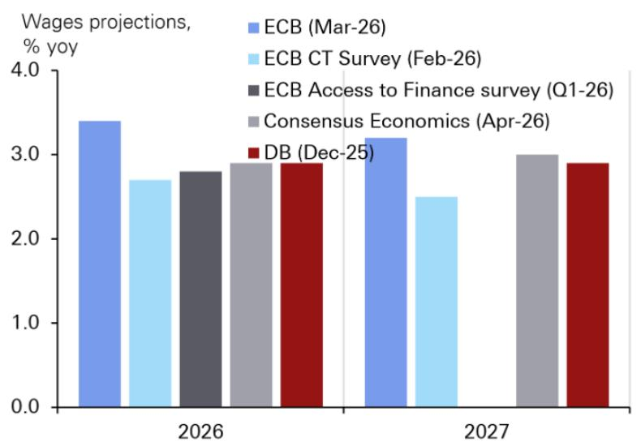

bar

Wages projections, % yoy
| Year | ECB (Mar-26) | ECB CT Survey (Feb-26) | ECB Access to Finance survey (Q1-26) | Consensus Economics (Apr-26) | DB (Dec-25) |
| :--- | :--- | :--- | :--- | :--- | :--- |
| 2026 | 3.4 | 2.7 | 2.8 | 2.9 | 2.9 |
| 2027 | 3.2 | 2.5 | - | 3.0 | 2.9 |

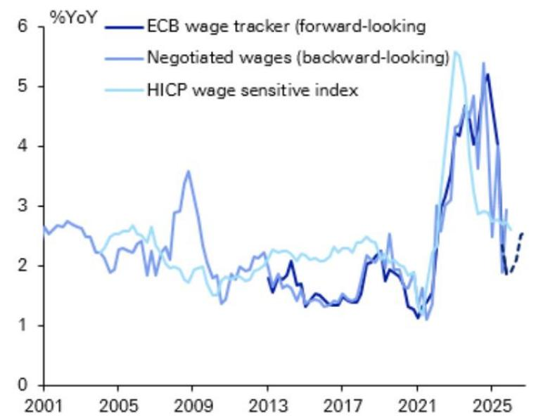

line

| Year | ECB wage tracker (forward-looking) | Negotiated wages (backward-looking) | HICP wage sensitive index |
|------|-------------------------------------|--------------------------------------|---------------------------|
| 2001 | ~2.6                                | ~2.7                                 | ~2.6                      |
| 2005 | ~2.3                                | ~2.4                                 | ~2.5                      |
| 2009 | ~1.8                                | ~3.5                                 | ~1.9                      |
| 2013 | ~1.5                                | ~2.0                                 | ~2.1                      |
| 2017 | ~1.4                                | ~2.1                                 | ~2.3                      |
| 2021 | ~1.1                                | ~1.2                                 | ~1.3                      |
| 2025 | ~2.5                                | ~2.6                                 | ~2.7                      |

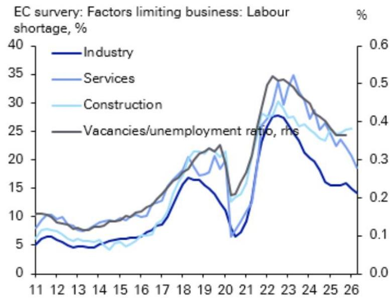

line

| Year | Industry | Services | Construction | Vacancies/unemployment ratio, rhs |
|------|----------|----------|--------------|-----------------------------------|
| 11   | 5.0      | 8.0      | 7.0          | 1.0                               |
| 12   | 4.5      | 7.5      | 6.5          | 0.9                               |
| 13   | 4.0      | 7.0      | 6.0          | 0.8                               |
| 14   | 4.5      | 7.5      | 6.5          | 0.9                               |
| 15   | 5.0      | 8.0      | 7.0          | 1.0                               |
| 16   | 6.0      | 9.0      | 8.0          | 1.1                               |
| 17   | 8.0      | 10.0     | 9.0          | 1.2                               |
| 18   | 12.0     | 13.0     | 12.0         | 1.3                               |
| 19   | 15.0     | 16.0     | 15.0         | 1.4                               |
| 20   | 10.0     | 11.0     | 10.0         | 1.5                               |
| 21   | 6.0      | 7.0      | 6.0          | 1.6                               |
| 22   | 28.0     | 35.0     | 32.0         | 0.5                               |
| 23   | 25.0     | 34.0     | 31.0         | 0.4                               |
| 24   | 22.0     | 32.0     | 29.0         | 0.3                               |
| 25   | 18.0     | 28.0     | 26.0         | 0.2                               |
| 26   | 15.0     | 25.0     | 24.0         | 0.1                               |

# Supply constraints: An inflation shock amplifier

Adding to the upside risks to inflation is the fact that supply chains are tightening (e.g., the lengthening of delivery times in the PMI). In the European Commission monthly business survey, at a sectoral level we can see a positive correlation between the sectors reporting tight supply chains ('equipment' limiting production includes energy) and sectors reporting an increase in selling price expectations (LHS). In the PMI, across countries the passthrough from input costs to output prices correlates with the change in delivery times (RHS).

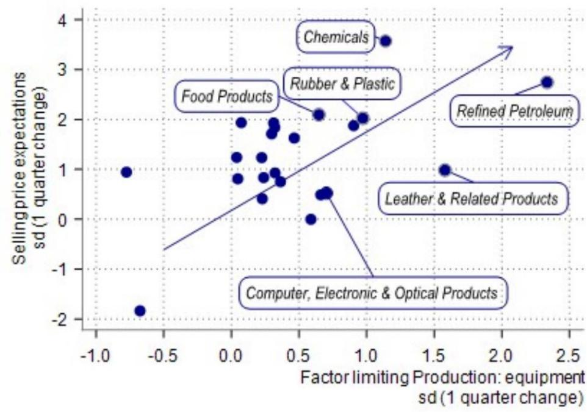

scatter

| Category                          | Factor limiting Production: equipment sd (1 quarter change) | Sellingprice expectations sd (1 quarter change) |
| --------------------------------- | -------------------------------------------------------- | ----------------------------------------------- |
| Chemicals                         | 1.2                                                      | 3.6                                             |
| Food Products                     | 0.3                                                      | 1.9                                             |
| Rubber & Plastic                  | 0.8                                                      | 2.1                                             |
| Refined Petroleum                | 2.4                                                      | 2.7                                             |
| Leather & Related Products        | 1.6                                                      | 1.0                                             |
| Computer, Electronic & Optical Products | -0.7                                                   | -1.8                                            |

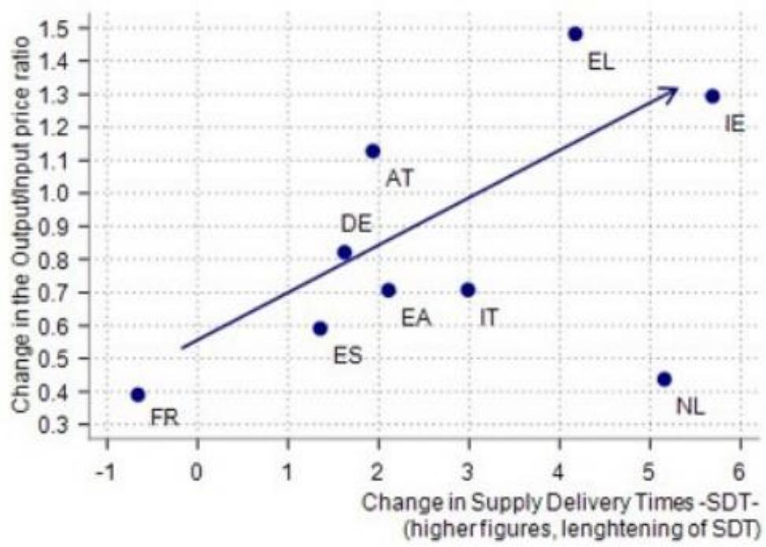

scatter

| Country | Change in Supply Delivery Times -SDT | Change in Output/Input Price Ratio |
|---------|--------------------------------------|-------------------------------------|
| FR      | -0.5                                 | 0.4                                 |
| ES      | 1.3                                  | 0.6                                 |
| DE      | 1.7                                  | 0.8                                 |
| IT      | 3.0                                  | 0.7                                 |
| EA      | 2.1                                  | 0.7                                 |
| AT      | 2.0                                  | 1.1                                 |
| EL      | 4.2                                  | 1.5                                 |
| IE      | 5.7                                  | 1.3                                 |
| NL      | 5.2                                  | 0.4                                 |

# State-contingent inflation: Non-linear effects from supply constraints

We find state-contingent effects in the relationship between selling price expectations in the surveys (we use the PMI) and HICP. We look at the passthrough relationship in different states (benign or inflationary) for delivery times, labour market (vacancies/unemployment ratio) and financial conditions. There is a clear state-dependency (LHS). We complement this with a quantile regression analysis and find a non-linear effect: the higher is inflation, the more likely that delivery times will have a stronger passthrough effect (RHS).

PMI Selling Prices -> CPI Passthrough (6m ahead)   
Regime Split with 95% Confidence Bands   
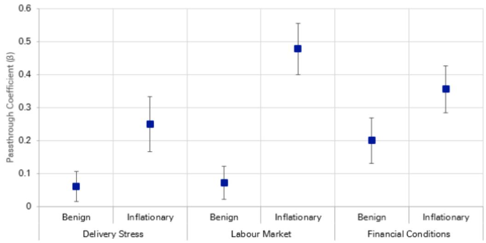

scatter

| Category           | Condition     | Passthrough Coefficient (β) |
| ------------------ | ------------- | -------------------------- |
| Delivery Stress    | Benign        | 0.06                       |
| Delivery Stress    | Inflationary  | 0.25                       |
| Labour Market      | Benign        | 0.07                       |
| Labour Market      | Inflationary  | 0.48                       |
| Financial Conditions | Benign       | 0.20                       |
| Financial Conditions | Inflationary  | 0.35                       |

Passthough Across CPI Distribution:   
PMI Output Prices x Supply Delivery Times   
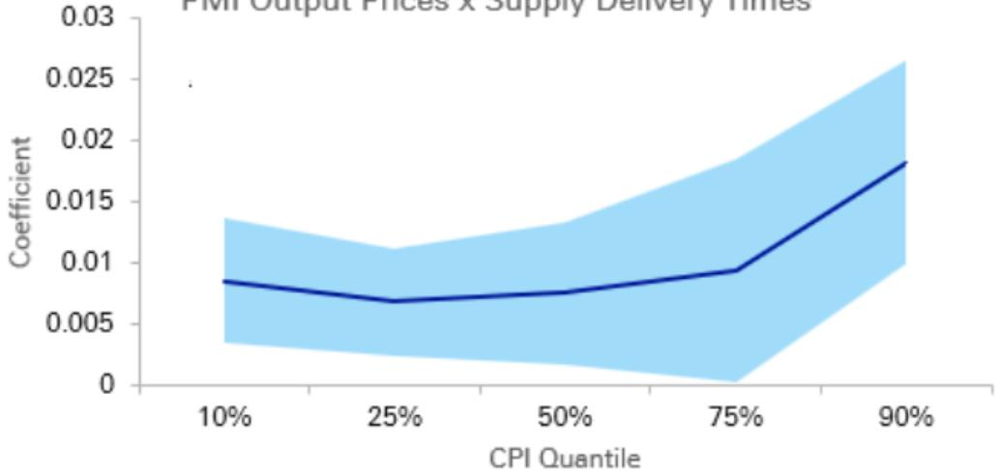

line

| CPI Quantile | Coefficient |
| ------------ | ----------- |
| 10%          | 0.008       |
| 25%          | 0.006       |
| 50%          | 0.007       |
| 75%          | 0.009       |
| 90%          | 0.018       |

# Iran Shock: Supply-chain vulnerabilities

Recent supply chain stress, highlighted by European PMI data, has renewed focus on the continent's external vulnerabilities. Europe's exposure is twofold. First, a direct, tangible dependency on the Gulf for specific commodities like oil products (e.g., jet fuel, diesel), oil derivatives, chemicals and metals, representing a measurable cost. Second, a more elusive and structural indirect risk from "hidden" energy embedded within industrial imports, particularly from Asia.

EU imports - Share of GCC States + Iraq 15 largest HS4 shares   
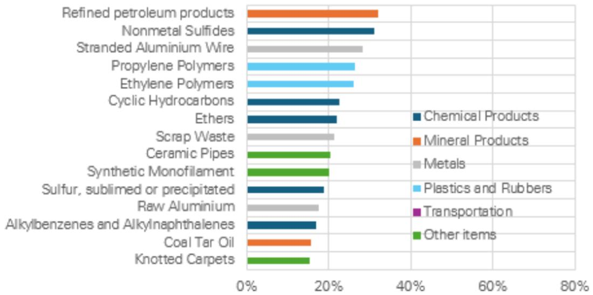

bar

| Category | Value (%) |
| :--- | :--- |
| Refined petroleum products | 32 |
| Nonmetal Sulfides | 31 |
| Stranded Aluminium Wire | 29 |
| Propylene Polymers | 26 |
| Ethylene Polymers | 25 |
| Cyclic Hydrocarbons | 22 |
| Ethers | 21 |
| Scrap Waste | 20 |
| Ceramic Pipes | 20 |
| Synthetic Monofilament | 20 |
| Sulfur, sublimed or precipitated | 19 |
| Raw Aluminium | 18 |
| Alkylbenzenes and Alkylnaphthalenes | 17 |
| Coal Tar Oil | 16 |
| Knotted Carpets | 16 |

EU imports of kerosene jet fuel by source 2024, EUR bn   
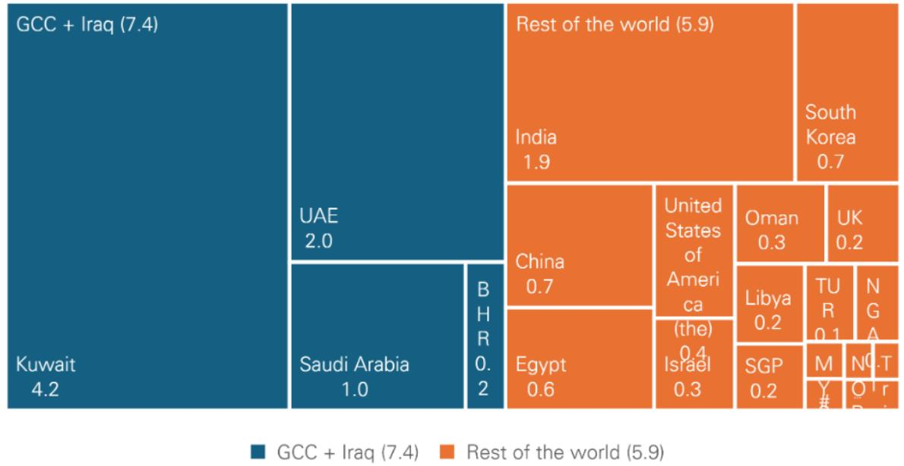

treemap

| Country/Region | Value |
| --- | --- |
| GCC + Iraq | 7.4 |
| Kuwait | 4.2 |
| UAE | 2.0 |
| Saudi Arabia | 1.0 |
| BHR | 0.2 |
| India | 1.9 |
| China | 0.7 |
| Egypt | 0.6 |
| United States of America | 0.3 |
| Oman | 0.3 |
| South Korea | 0.7 |
| Libya | 0.2 |
| Tu | 0.1 |
| NGA | 0.1 |
| Israel | 0.4 |
| SGP | 0.2 |
| M | 0.1 |
| NQ.T | 0.1 |
| O'R | 0.1 |
| Other | 0.1 |

# The long road: Quantifying Europe's exposure to transport disruption (1)

Heightened geopolitical risk in the Middle East has placed European transport networks under intense scrutiny, with a particular focus on the supply of jet fuel given the high share of the Gulf in the global supply of kerosene. For the supply side of the European economy and overall input availability, the risk from a shortage of jet fuel is relatively small. The dominant fuel dependency for goods production is on diesel and electricity, reflecting the four-fifths share of input costs taken by land transport (road and rail).

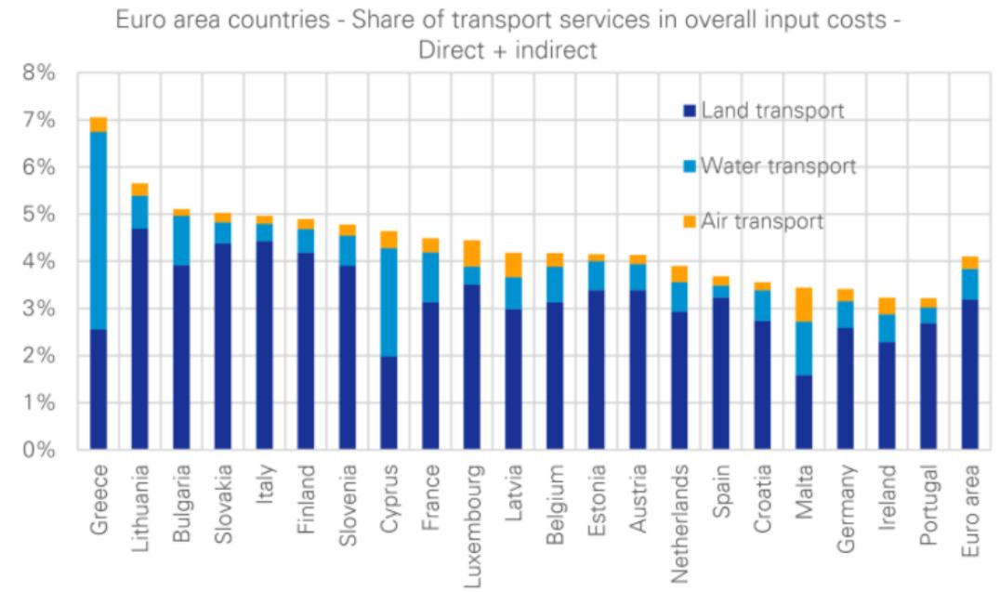

bar_stacked

Euro area countries - Share of transport services in overall input costs - Direct + indirect
| Country | Land transport (%) | Water transport (%) | Air transport (%) |
| :--- | :--- | :--- | :--- |
| Greece | 2.5 | 4.8 | 0.3 |
| Lithuania | 4.6 | 1.1 | 0.3 |
| Bulgaria | 3.9 | 1.2 | 0.2 |
| Slovakia | 4.3 | 0.5 | 0.2 |
| Italy | 4.4 | 0.4 | 0.2 |
| Finland | 4.1 | 0.7 | 0.2 |
| Slovenia | 3.9 | 0.8 | 0.2 |
| Cyprus | 1.9 | 2.5 | 0.5 |
| France | 3.1 | 1.1 | 0.3 |
| Luxembourg | 3.5 | 0.6 | 0.6 |
| Latvia | 3.0 | 1.0 | 0.6 |
| Belgium | 3.1 | 1.0 | 0.3 |
| Estonia | 3.4 | 0.8 | 0.2 |
| Austria | 3.4 | 0.7 | 0.2 |
| Netherlands | 2.9 | 0.8 | 0.4 |
| Spain | 3.2 | 0.5 | 0.2 |
| Croatia | 2.7 | 0.7 | 0.2 |
| Malta | 1.5 | 1.5 | 1.1 |
| Germany | 2.5 | 0.7 | 0.3 |
| Ireland | 2.3 | 0.7 | 0.3 |
| Portugal | 2.6 | 0.4 | 0.2 |
| Euro area | 3.2 | 0.8 | 0.3 |

Euro area - Freight transport volume - By mode of transport   
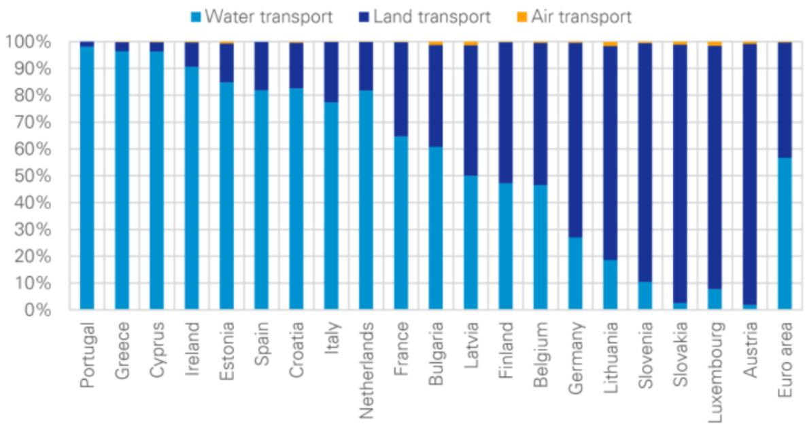

bar_stacked

| Country/Region | Water transport | Land transport | Air transport |
| -------------- | --------------- | -------------- | ------------- |
| Portugal       | 98%             | 2%             | 0%            |
| Greece         | 96%             | 3%             | 0%            |
| Cyprus         | 95%             | 4%             | 0%            |
| Ireland        | 91%             | 7%             | 0%            |
| Estonia        | 84%             | 10%            | 2%            |
| Spain          | 81%             | 13%            | 0%            |
| Croatia        | 82%             | 13%            | 0%            |
| Italy          | 77%             | 17%            | 0%            |
| Netherlands    | 81%             | 14%            | 0%            |
| France         | 64%             | 27%            | 0%            |
| Bulgaria       | 60%             | 27%            | 2%            |
| Latvia         | 50%             | 33%            | 2%            |
| Finland        | 47%             | 37%            | 0%            |
| Belgium        | 46%             | 38%            | 0%            |
| Germany        | 27%             | 53%            | 0%            |
| Lithuania      | 18%             | 55%            | 2%            |
| Slovenia       | 10%             | 65%            | 0%            |
| Slovakia       | 2%              | 75%            | 0%            |
| Luxembourg     | 7%              | 63%            | 2%            |
| Austria        | 2%              | 75%            | 2%            |
| Euro area      | 56%             | 33%            | 0%            |

# The long road: Quantifying Europe's exposure to transport disruption (2)

The true vulnerability to a shortage of jet fuel lies squarely with the tourism sector. Our simulation shows a 10% drop in tourism flows would have a moderate impact on the Euro Area, on average (-0.2% of GDP), but a more significant impact on countries like Croatia (-1.5%), Greece, and Portugal (-0.7%).

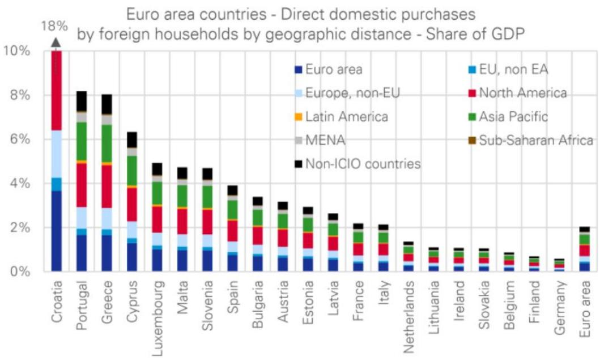

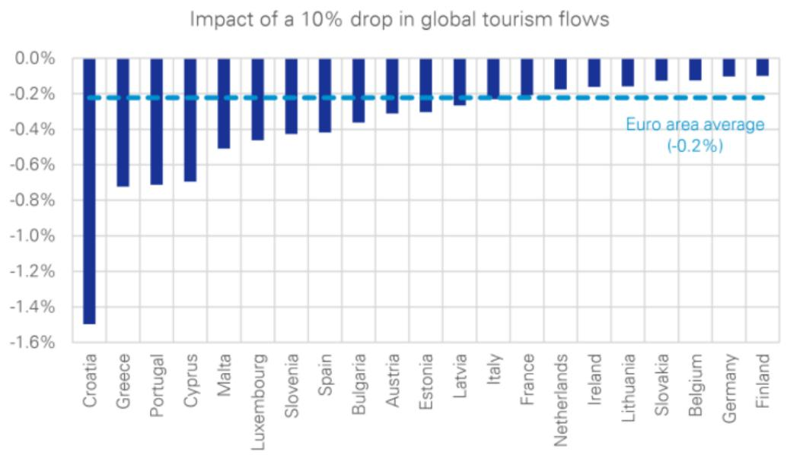

bar

| Country     | Impact of a 10% drop in global tourism flows |
| ----------- | --------------------------------------------- |
| Croatia     | -1.5%                                         |
| Greece      | -0.7%                                         |
| Portugal    | -0.6%                                         |
| Cyprus      | -0.7%                                         |
| Malta       | -0.4%                                         |
| Luxembourg  | -0.5%                                         |
| Slovenia    | -0.4%                                         |
| Spain       | -0.4%                                         |
| Bulgaria    | -0.3%                                         |
| Austria     | -0.3%                                         |
| Estonia     | -0.3%                                         |
| Latvia      | -0.2%                                         |
| Italy       | -0.2%                                         |
| France      | -0.2%                                         |
| Netherlands | -0.2%                                         |
| Ireland     | -0.2%                                         |
| Lithuania   | -0.2%                                         |
| Slovakia    | -0.2%                                         |
| Belgium     | -0.2%                                         |
| Germany     | -0.2%                                         |
| Finland     | -0.2%                                         |

# The long road: Quantifying Europe's exposure to transport disruption (3)

To measure the vulnerability of Europe to a disruption to the global supply of transport, we introduce a “physical distance travelled” metric, reflecting how far inputs travel for every industry. It reveals two critical points. First, a clear geographic divide. The economies with the longest supply chains are generally located in Southern Europe. Second, a dual ‘hidden’ risk. Beyond tourism, the most sectors vulnerable sectors are capital goods and materials manufacturing – the same sectors exposed to the ‘hidden’ energy content (because much of these come from Asia).

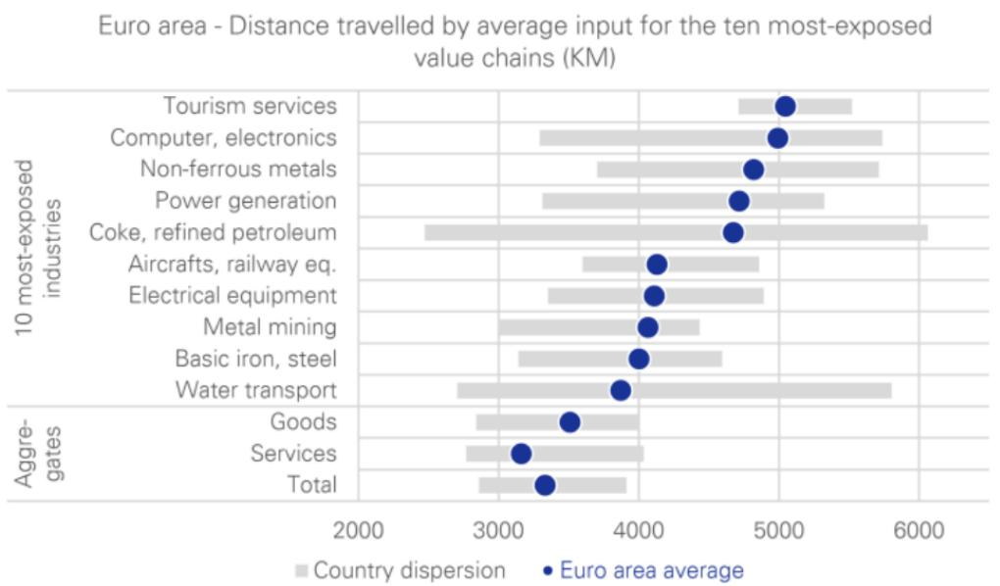

bar_line

Euro area - Distance travelled by average input for the ten most-exposed value chains (KM)
| Industry/Aggregate | Country dispersion (KM) | Euro area average (KM) |
| :--- | :--- | :--- |
| Tourism services | 5500 | 5000 |
| Computer, electronics | 3500 | 4900 |
| Non-ferrous metals | 3700 | 4800 |
| Power generation | 5200 | 4700 |
| Coke, refined petroleum | 6100 | 4600 |
| Aircrafts, railway eq. | 4800 | 4100 |
| Electrical equipment | 4800 | 4100 |
| Metal mining | 4400 | 4000 |
| Basic iron, steel | 4500 | 3950 |
| Water transport | 5800 | 3850 |
| Goods | 3100 | 3500 |
| Services | 3100 | 3150 |
| Total | 3100 | 3350 |

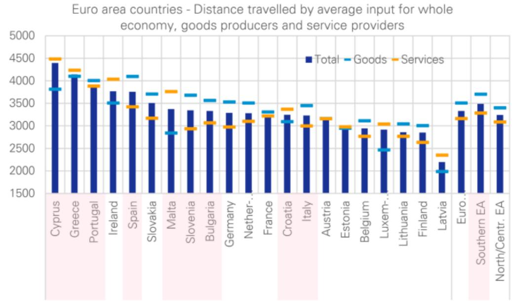

bar

| Country/Region | Total | Goods | Services |
| -------------- | ----- | ----- | -------- |
| Cyprus         | 4400  | 3800  | 4500     |
| Greece         | 4100  | 4100  | 4200     |
| Portugal       | 3900  | 4000  | 3900     |
| Ireland        | 3800  | 3500  | 4000     |
| Spain          | 3700  | 4100  | 3400     |
| Slovakia       | 3500  | 3700  | 3200     |
| Malta          | 3400  | 2800  | 3800     |
| Slovenia       | 3300  | 3700  | 2900     |
| Bulgaria       | 3300  | 3600  | 3100     |
| Germany        | 3300  | 3500  | 2950     |
| Nether...       | 3250  | 3500  | 3150     |
| France         | 3250  | 3300  | 3250     |
| Croatia        | 3250  | 3150  | 3400     |
| Italy          | 3250  | 3450  | 3050     |
| Austria        | 3150  | 3150  | 3150     |
| Estonia        | 2950  | 2950  | 2950     |
| Belgium        | 2950  | 3150  | 2750     |
| Luxembourg     | 2500  | 2450  | 3050     |
| Lithuania      | 2750  | 3150  | 2750     |
| Finland        | 2650  | 3150  | 2650     |
| Latvia         | 2150  | 2150  | 2350     |
| Euro...         | 3350  | 3550  | 3250     |
| Southern EA    | 3550  | 3750  | 3350     |
| North/Centr. EA| 3250  | 3450  | 3150     |

# ECB: Will it hike? How much and when?

President Lagarde has presented three policy options: (1) to ‘look through’ if the inflation shock is small and temporary, (2) a ‘measured’ tightening if the inflation shock is large but not too persistent, and (3) a ‘forceful or persistent’ tightening if there is a large and sustained inflation shock. If the conflict ends quickly, there is still a chance the ECB does not hike. Our baseline is a ‘measured’ 50bp of hikes to 2.50%, the upper end of neutral (hikes in Jun & Sep). This is good risk management: it signals the commitment to price stability without overly burdening growth. We pencil in hikes for Jun/Sep.

ECB standing facilities corridor, % rate   
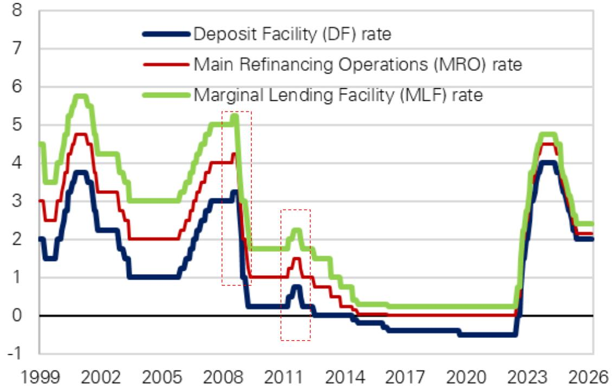

line

| Year | Deposit Facility (DF) rate | Main Refinancing Operations (MRO) rate | Marginal Lending Facility (MLF) rate |
|------|-----------------------------|----------------------------------------|-------------------------------------|
| 1999 | 2.0                         | 3.0                                    | 4.5                                 |
| 2000 | 1.5                         | 2.5                                    | 5.0                                 |
| 2001 | 3.5                         | 4.5                                    | 5.5                                 |
| 2002 | 3.0                         | 4.0                                    | 5.0                                 |
| 2003 | 2.0                         | 3.0                                    | 4.0                                 |
| 2004 | 1.0                         | 2.0                                    | 3.0                                 |
| 2005 | 1.0                         | 2.0                                    | 3.0                                 |
| 2006 | 1.5                         | 2.5                                    | 3.5                                 |
| 2007 | 2.5                         | 3.5                                    | 4.5                                 |
| 2008 | 3.0                         | 4.0                                    | 5.0                                 |
| 2009 | 3.5                         | 4.5                                    | 5.5                                 |
| 2010 | 1.0                         | 1.0                                    | 1.5                                 |
| 2011 | 0.5                         | 1.5                                    | 2.0                                 |
| 2012 | 0.5                         | 1.0                                    | 1.5                                 |
| 2013 | 0.5                         | 1.0                                    | 1.5                                 |
| 2014 | 0.5                         | 0.5                                    | 1.0                                 |
| 2015 | 0.5                         | 0.5                                    | 1.0                                 |
| 2016 | 0.5                         | 0.5                                    | 1.0                                 |
| 2017 | 0.5                         | 0.5                                    | 1.0                                 |
| 2018 | 0.5                         | 0.5                                    | 1.0                                 |
| 2019 | 0.5                         | 0.5                                    | 1.0                                 |
| 2020 | 0.5                         | 0.5                                    | 1.0                                 |
| 2021 | -0.5                        | -0.5                                   | 1.0                                 |
| 2022 | -0.5                        | -0.5                                   | 1.0                                 |
| 2023 | 4.0                         | 4.5                                    | 4.8                                 |
| 2024 | 4.5                         | 4.8                                    | 4.9                                 |
| 2025 | 4.0                         | 4.5                                    | 4.8                                 |
| 2026 | 3.5                         | 4.0                                    | 4.5                                 |

Market implied ECB rates, %   
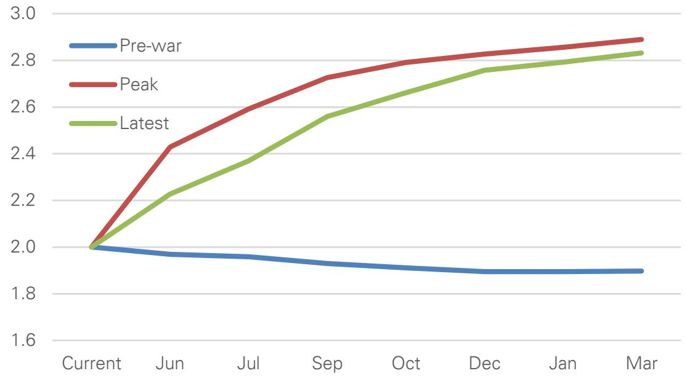

line

| Month   | Pre-war | Peak  | Latest |
| ------- | ------- | ----- | ------ |
| Current | 2.0     | 2.0   | 2.0    |
| Jun     | 1.98    | 2.4   | 2.2    |
| Jul     | 1.97    | 2.6   | 2.35   |
| Sep     | 1.95    | 2.75  | 2.55   |
| Oct     | 1.93    | 2.8   | 2.65   |
| Dec     | 1.91    | 2.85  | 2.75   |
| Jan     | 1.91    | 2.88  | 2.8    |
| Mar     | 1.91    | 2.9   | 2.85   |

Source: DB, "Keeping calm and carrying on to 2.50%", Focus Europe, 19 March 2026

# ECB: Would it be a mistake to hike?

A stagflationary shocks carries upside risks to inflation, downside to growth: there is risk of policy error on both sides. If energy costs remain elevated the ECB will lean hawkish, in particular with its communications, to ensure the risk of passthrough is curbed. The ECB will be aware of the downside risks to growth: fuel shortages (rationing); job shedding; higher household savings; and tighter financial conditions (including potential unintended consequences of hikes, e.g., private credit). Ultimately the growth risks mean: (1) limits to hikes, and (2) a potentially non-linear relationship between energy costs and the ECB response.

Policy rate gap (policy rate minus neutral rate)   
r\* calculated using an HP filter   
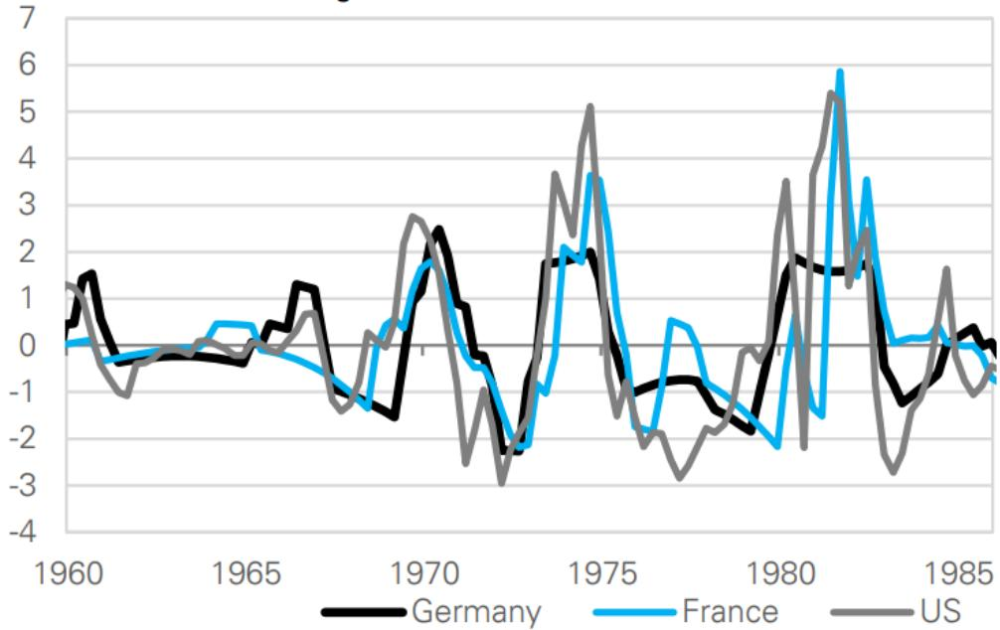

line

| Year | Germany | France | US   |
|------|---------|--------|------|
| 1960 | 0.5     | 0.0    | 1.0  |
| 1965 | -0.5    | 0.5    | -0.5 |
| 1970 | 2.5     | 1.5    | 2.5  |
| 1975 | 2.0     | 3.5    | 5.0  |
| 1980 | 1.5     | -2.0   | 3.5  |
| 1985 | 0.0     | -0.5   | -1.0 |

Estimates of the neutral nominal rate (%)   
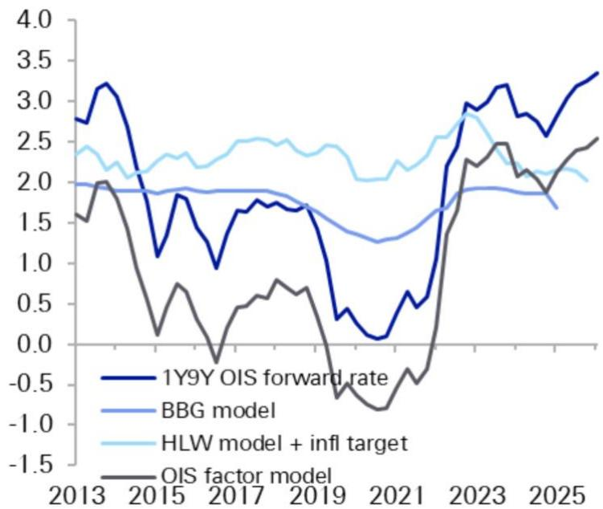

line

| Year | 1Y9Y OIS forward rate | BBG model | HLW model + infl target | OIS factor model |
|------|------------------------|---------|--------------------------|------------------|
| 2013 | ~2.8                   | ~2.0    | ~2.4                     | ~1.6             |
| 2015 | ~1.0                   | ~1.9    | ~2.3                     | ~0.1             |
| 2017 | ~1.7                   | ~1.8    | ~2.5                     | ~0.7             |
| 2019 | ~0.3                   | ~1.7    | ~2.4                     | ~-0.7            |
| 2021 | ~0.5                   | ~1.5    | ~2.3                     | ~-0.9            |
| 2023 | ~3.0                   | ~1.9    | ~2.8                     | ~2.4             |
| 2025 | ~3.4                   | ~1.7    | ~2.1                     | ~2.5             |

Source: DB, “What history tell us the ECB will have to do to defeat inflation”, Europe Blog, 18 January 2023, “Iran Shock and Economic Growth: Handle with Care!”, Focus Europe, 10 April 2026

Annual average growth rates, unless stated 

<table><tr><td>Euro area medium-term forecasts</td><td>2024</td><td>2025</td><td>2026F</td><td>2027F</td><td>2028F</td></tr><tr><td>Real GDP, % yoy</td><td>0.9</td><td>1.5</td><td>0.5</td><td>1.1</td><td>1.2</td></tr><tr><td>HICP inflation, % yoy</td><td>2.4</td><td>2.1</td><td>2.8</td><td>2.2</td><td>2.2</td></tr><tr><td>Core inflation, % yoy</td><td>2.8</td><td>2.4</td><td>2.3</td><td>2.2</td><td>2.1</td></tr><tr><td>ECB deposit rate, % eop</td><td>3.00</td><td>2.00</td><td>2.50</td><td>2.50</td><td>2.50</td></tr><tr><td>ECB refi rate, % eop</td><td>3.15</td><td>2.15</td><td>2.65</td><td>2.65</td><td>2.65</td></tr></table>

Real GDP % growth $^{a}$ 

<table><tr><td></td><td>2025</td><td>2026F</td><td>2027F</td><td>2025</td><td>2026F</td><td>2027F</td></tr><tr><td>EU</td><td>1.6</td><td>0.9</td><td>1.3</td><td>2.5</td><td>3.1</td><td>2.6</td></tr><tr><td>Euro area</td><td>1.5</td><td>0.5</td><td>1.1</td><td>2.1</td><td>3.0</td><td>2.4</td></tr><tr><td> $Germany^b$ </td><td>0.2</td><td>0.5</td><td>1.3</td><td>2.3</td><td>2.9</td><td>2.5</td></tr><tr><td>France</td><td>0.9</td><td>0.6</td><td>0.9</td><td>0.9</td><td>2.3</td><td>1.7</td></tr><tr><td>Italy</td><td>0.7</td><td>0.5</td><td>0.7</td><td>1.7</td><td>2.9</td><td>1.9</td></tr><tr><td>Spain</td><td>2.8</td><td>1.8</td><td>1.8</td><td>2.7</td><td>3.2</td><td>2.4</td></tr><tr><td>Netherlands</td><td>1.8</td><td>0.3</td><td>0.9</td><td>3.0</td><td>3.0</td><td>2.6</td></tr><tr><td>Belgium</td><td>1.0</td><td>0.3</td><td>1.0</td><td>3.0</td><td>3.1</td><td>2.4</td></tr><tr><td>Austria</td><td>0.7</td><td>0.3</td><td>1.2</td><td>3.6</td><td>3.0</td><td>2.5</td></tr><tr><td>Finland</td><td>0.2</td><td>0.7</td><td>1.3</td><td>1.8</td><td>2.2</td><td>1.4</td></tr><tr><td>Greece</td><td>2.2</td><td>1.5</td><td>1.4</td><td>2.9</td><td>3.5</td><td>2.5</td></tr><tr><td>Portugal</td><td>1.9</td><td>1.1</td><td>1.2</td><td>2.2</td><td>2.8</td><td>2.2</td></tr><tr><td>Ireland</td><td>12.4</td><td>1.0</td><td>1.9</td><td>2.1</td><td>3.7</td><td>2.6</td></tr><tr><td>UK</td><td>1.4</td><td>0.9</td><td>1.2</td><td>3.4</td><td>3.1</td><td>2.6</td></tr><tr><td>US</td><td>2.1</td><td>2.4</td><td>2.2</td><td>2.7</td><td>3.3</td><td>2.5</td></tr><tr><td>China</td><td>5.0</td><td>4.9</td><td>4.5</td><td>0.1</td><td>1.5</td><td>2.0</td></tr><tr><td>Japan</td><td>1.2</td><td>0.8</td><td>1.0</td><td>3.2</td><td>1.8</td><td>2.2</td></tr><tr><td>Advanced Economies</td><td>1.7</td><td>1.5</td><td>1.6</td><td>2.6</td><td>3.0</td><td>2.4</td></tr><tr><td>Emerging Markets</td><td>4.5</td><td>4.3</td><td>4.4</td><td>3.9</td><td>4.6</td><td>4.3</td></tr><tr><td>World</td><td>3.4</td><td>3.3</td><td>3.3</td><td>3.4</td><td>4.0</td><td>3.6</td></tr></table>

CPI % growth $^{c}$

<table><tr><td>Euro area, % qoq</td><td>Q3 25</td><td>Q4 25F</td><td>Q1 26</td><td>Q2 26F</td><td>Q3 26F</td><td>Q4 26F</td><td>Q1 27F</td><td>Q2 27F</td><td>Q3 27F</td><td>Q4 27F</td><td>2025</td><td>2026F</td><td>2027F</td></tr><tr><td>GDP</td><td>0.3</td><td>0.2</td><td>0.1</td><td>0.0</td><td>0.1</td><td>0.3</td><td>0.4</td><td>0.4</td><td>0.4</td><td>0.2</td><td>1.5</td><td>0.5</td><td>1.1</td></tr><tr><td>HICP inflation, % yoy</td><td>2.1</td><td>2.1</td><td>2.0</td><td>3.2</td><td>3.4</td><td>3.5</td><td>3.2</td><td>2.3</td><td>2.1</td><td>2.1</td><td>2.1</td><td>3.0</td><td>2.4</td></tr><tr><td>Core inflation, % yoy</td><td>2.3</td><td>2.4</td><td>2.3</td><td>2.3</td><td>2.5</td><td>2.5</td><td>2.5</td><td>2.3</td><td>2.2</td><td>2.2</td><td>2.4</td><td>2.4</td><td>2.3</td></tr><tr><td>EMU4 GDP, % qoq</td><td></td><td></td><td></td><td></td><td></td><td></td><td></td><td></td><td></td><td></td><td></td><td></td><td></td></tr><tr><td>Germany</td><td>0.0</td><td>0.2</td><td>0.3</td><td>-0.2</td><td>0.1</td><td>0.4</td><td>0.3</td><td>0.3</td><td>0.3</td><td>0.3</td><td>0.2</td><td>0.5</td><td>1.3</td></tr><tr><td>France</td><td>0.6</td><td>0.2</td><td>0.0</td><td>0.0</td><td>0.1</td><td>0.2</td><td>0.3</td><td>0.3</td><td>0.3</td><td>0.3</td><td>0.9</td><td>0.6</td><td>0.9</td></tr><tr><td>Italy</td><td>0.2</td><td>0.3</td><td>0.2</td><td>-0.1</td><td>0.0</td><td>0.2</td><td>0.2</td><td>0.3</td><td>0.2</td><td>0.2</td><td>0.7</td><td>0.5</td><td>0.7</td></tr><tr><td>Spain</td><td>0.6</td><td>0.8</td><td>0.6</td><td>0.1</td><td>0.1</td><td>0.2</td><td>0.6</td><td>0.6</td><td>0.7</td><td>0.6</td><td>2.8</td><td>1.8</td><td>1.8</td></tr><tr><td>Central Bank Rates (eop)</td><td></td><td></td><td></td><td></td><td></td><td></td><td></td><td></td><td></td><td></td><td></td><td></td><td></td></tr><tr><td>ECB deposit rate</td><td>2.00</td><td>2.00</td><td>2.00</td><td>2.25</td><td>2.50</td><td>2.50</td><td>2.50</td><td>2.50</td><td>2.50</td><td>2.50</td><td></td><td></td><td></td></tr><tr><td>BoE bank rate</td><td>4.00</td><td>3.75</td><td>3.75</td><td>3.75</td><td>3.75</td><td>3.75</td><td>3.75</td><td>3.50</td><td>3.25</td><td>3.25</td><td></td><td></td><td></td></tr><tr><td>US Fed funds target rate</td><td>4.125</td><td>3.625</td><td>3.625</td><td>3.625</td><td>3.625</td><td>3.625</td><td>3.625</td><td>3.625</td><td>3.625</td><td>3.625</td><td></td><td></td><td></td></tr><tr><td>PBOC 1Y MLF rate</td><td>1.40</td><td>1.40</td><td>1.40</td><td>1.40</td><td>1.40</td><td>1.40</td><td>1.40</td><td>1.40</td><td>1.40</td><td>1.40</td><td></td><td></td><td></td></tr><tr><td>BoJ O/N call rate</td><td>0.50</td><td>0.75</td><td>0.75</td><td>0.75</td><td>1.00</td><td>1.00</td><td>1.25</td><td>1.25</td><td>1.25</td><td>1.25</td><td></td><td></td><td></td></tr></table>

# Appendix 1 Important Disclosures

# \*Other information available upon request

\*Prices are current as of the end of the previous trading session unless otherwise indicated and are sourced from local exchanges via Reuters, Bloomberg and other vendors. Other information is sourced from DB, subject companies, and other sources. For further information regarding disclosures relevant to DB, please visit our global disclosure look-up page on our website at https://research.db.com/Research/Disclosures/FICCDisclosures. Aside from within this report, important risk and conflict disclosures can also be found at https://research.db.com/Research/Disclosures/Disclaimer. Investors are strongly encouraged to review this information before investing.

# Analyst Certification

The views expressed in this report accurately reflect the personal views of the undersigned lead analyst(s). In addition, the undersigned lead analyst(s) has not and will not receive any compensation for providing a specific recommendation or view in this report. Mark Wall.

# Additional Information

The information and opinions in this report were prepared by DB AG or one of its affiliates (collectively "DB"). Though the information herein is believed to be reliable and has been obtained from public sources believed to be reliable, DB makes no representation as to its accuracy or completeness. Hyperlinks to third-party websites in this report are provided for reader convenience only. DB neither endorses the content nor is responsible for the accuracy or security controls of those websites.

If you use the services of DB in connection with a purchase or sale of a security that is discussed in this report, or is included or discussed in another communication (oral or written) from a DB analyst, DB may act as principal for its own account or as agent for another person.

DB may consider this report in deciding to trade as principal. It may also engage in transactions, for its own account or with customers, in a manner inconsistent with the views taken in this research report. Others within DB, including strategists, sales staff and other analysts, may take views that are inconsistent with those taken in this research report. DB issues a variety of research products, including fundamental analysis, equity-linked analysis, quantitative analysis and trade ideas. Recommendations contained in one type of communication may differ from recommendations contained in others, whether as a result of differing time horizons, methodologies, perspectives or otherwise. DB and/or its affiliates may also be holding debt or equity securities of the issuers it writes on. Analysts are paid in part based on the profitability of DB AG and its affiliates, which includes investment banking, trading and principal trading revenues.

Opinions, estimates and projections constitute the current judgment of the author as of the date of this report. They do not necessarily reflect the opinions of DB and are subject to change without notice. DB provides liquidity for buyers and sellers of securities issued by the companies it covers. DB analysts sometimes have shorter-term trade ideas that may be inconsistent with DB's existing longer-term ratings. Some trade ideas for equities are listed as Catalyst Calls ideas on the Research Website (https://research.db.com/Research/), and can be found on the general coverage list and also on the covered company's page. A Catalyst Call idea represents a high-conviction belief by an analyst that a stock will outperform or underperform the market and/or a specified sector over a time frame of no less than two weeks and no more than three months. In addition to Catalyst Calls ideas, analysts may occasionally discuss with our clients, and with DB salespersons and traders, trading strategies or ideas that reference catalysts or events that may have a near-term or medium-term impact on the market price of the securities discussed in this report, which impact may be directionally counter to the analysts' current 12-month view of total return or investment return as described herein. DB has no obligation to update, modify or amend this report or to otherwise notify a recipient thereof if an opinion, forecast or estimate changes or becomes inaccurate. Coverage and the frequency of changes in market conditions and in both general and company-specific economic prospects make it difficult to update research at defined intervals. Updates are at the sole discretion of the coverage analyst or of the Research Department Management, and the majority of reports are published at irregular intervals. This report is provided for informational purposes only and does not take into account the particular investment objectives, financial situations, or needs of individual clients. It is not an offer or a solicitation of an offer to buy or sell any financial instruments or to participate in any particular trading strategy. Target prices are inherently imprecise and a product of the analyst's judgment. The financial instruments discussed in this report may not be suitable for all investors, and investors must make their own informed investment decisions. Prices and availability of financial instruments are subject to change without notice, and investment transactions can lead to losses as a result of price fluctuations and other factors. If a financial instrument is denominated in a currency other than an investor's currency, a change in exchange rates may adversely affect the investment. Past performance is not necessarily indicative of future results. Performance calculations exclude transaction costs, unless otherwise indicated. Unless otherwise indicated, prices are current as of the end of the previous trading session and are sourced from local exchanges via Reuters, Bloomberg and other vendors. Data is also sourced from DB, subject companies, and other parties. Artificial intelligence tools may be used in the preparation of this material, including but not limited to assist in fact-finding, data analysis, pattern recognition, content drafting and editorial corrections pertaining to research material.

The DB Department is independent of other business divisions of the Bank. Details regarding our organizational arrangements and information barriers we have to prevent and avoid conflicts of interest with respect to our research are available on our website (https://research.db.com/Research/) under Disclaimer.

Macroeconomic fluctuations often account for most of the risks associated with exposures to instruments that promise to pay fixed or variable interest rates. For an investor who is long fixed-rate instruments (thus receiving these cash flows), increases in interest rates naturally lift the discount factors applied to the expected cash flows and thus cause a loss. The longer the maturity of a certain cash flow and the higher the move in the discount factor, the higher will be the loss. Upside surprises in inflation, fiscal funding needs, and FX depreciation rates are among the most common adverse macroeconomic shocks to receivers. But counterparty exposure, issuer creditworthiness, client segmentation, regulation (including changes in assets holding limits for different types of investors), changes in tax policies, currency convertibility (which may constrain currency conversion, repatriation of profits and/or liquidation of positions), and settlement issues related to local clearing houses are also important risk factors. The sensitivity of fixed-income instruments to macroeconomic shocks may be mitigated by indexing the contracted cash flows to inflation, to FX depreciation, or to specified interest rates – these are common in emerging markets. The index fixings may – by construction – lag or mis-measure the actual move in the underlying variables they are intended to track. The choice of the proper fixing (or metric) is particularly important in swaps markets, where floating coupon rates (i.e., coupons indexed to a typically short-dated interest rate reference index) are exchanged for fixed coupons. Funding in a currency that differs from the currency in which coupons are denominated carries FX risk. Options on swaps (swaptions) the risks typical to options in addition to the risks related to rates movements.

Derivative transactions involve numerous risks including market, counterparty default and illiquidity risk. The appropriateness of these products for use by investors depends on the investors' own circumstances, including their tax position, their regulatory environment and the nature of their other assets and liabilities; as such, investors should take expert legal and financial advice before entering into any transaction similar to or inspired by the contents of this publication. The risk of loss in futures trading and options, foreign or domestic, can be substantial. As a result of the high degree of leverage obtainable in futures and options trading, losses may be incurred that are greater than the amount of funds initially deposited – up to theoretically unlimited losses. Trading in options involves risk and is not suitable for all investors. Prior to buying or selling an option, investors must review the "Characteristics and Risks of Standardized Options", at https://www.theocc.com/company-information/documents-and-archives/options-disclosure-document. If you are unable to access the website, please contact your DB representative for a copy of this important document.

Participants in foreign exchange transactions may incur risks arising from several factors, including the following: (i) exchange rates can be volatile and are subject to large fluctuations; (ii) the value of currencies may be affected by numerous market factors, including world and national economic, political and regulatory events, events in equity and debt markets and changes in interest rates; and (iii) currencies may be subject to devaluation or government-imposed exchange controls, which could affect the value of the currency. Investors in securities such as ADRs, whose values are affected by the currency of an underlying security, effectively assume currency risk.

Unless governing law provides otherwise, all transactions should be executed through the DB entity in the investor's home jurisdiction. Aside from within this report, important conflict disclosures can also be found at https://research.db.com/Research/ on each company's research page or under the 'Disclosures' tab. Investors are strongly encouraged to review this information before investing.

DB (which includes DB AG, its branches and affiliated companies) is not acting as a financial adviser, consultant or fiduciary to you or any of your agents (collectively, “You” or “Your”) with respect to any information provided in this report. DB does not provide investment, legal, tax or accounting advice, DB is not acting as your impartial adviser, and does not express any opinion or recommendation whatsoever as to any strategies, products or any other information presented in the materials. Information contained herein is being provided solely on the basis that the recipient will make an independent assessment of the merits of any investment decision, and it does not constitute a recommendation of, or express an opinion on, any product or service or any trading strategy.

The information presented is general in nature and is not directed to retirement accounts or any specific person or account type, and is therefore provided to You on the express basis that it is not advice, and You may not rely upon it in making Your decision. The information we provide is being directed only to persons we believe to be financially sophisticated, who are capable of evaluating investment risks independently, both in general and with regard to particular transactions and investment strategies, and who understand that DB has financial interests in the offering of its products and services. If this is not the case, or if You are an IRA or other retail investor receiving this directly from us, we ask that you inform us immediately.

In July 2018, DB revised its rating system for short term ideas whereby the branding has been changed to Catalyst Calls (“CC”) from SOLAR ideas; the rating categories for Catalyst Calls originated in the Americas region have been made consistent with the categories used by Analysts globally; and the effective time period for CCs has been reduced from a maximum of 180 days to 90 days.

United States: Approved and/or distributed by DB Securities Incorporated, a member of FINRA and SIPC. Analysts located outside of the United States are employed by non-US affiliates and are not registered/qualified as research analysts with FINRA.

European Economic Area (exc. United Kingdom): Approved and/or distributed by DB AG, a joint stock corporation with limited liability incorporated in the Federal Republic of Germany with its principal office in Frankfurt am Main. DB AG is authorized under German Banking Law and is subject to supervision by the European Central Bank and by BaFin, Germany's Federal Financial Supervisory Authority.

United Kingdom: Approved and/or distributed by DB AG acting through its London Branch at 21 Moorfields, London EC2Y 9DB. DB AG in the United Kingdom is authorised by the Prudential Regulation Authority and is subject to limited regulation by the Prudential Regulation Authority and Financial Conduct Authority. Details about the extent of our authorisation and regulation are available on request.

Hong Kong SAR: Distributed by DB AG, Hong Kong Branch except for any research content relating to futures contracts within the meaning of the Hong Kong Securities and Futures Ordinance Cap. 571. Research reports on such futures contracts are not intended for access by persons who are located, incorporated, constituted or resident in Hong Kong. The author(s) of a research report may not be licensed to carry on regulated activities in Hong Kong and, if not licensed, do not hold themselves out as being able to do so. The provisions set out above in the “Additional Information” section shall apply to the fullest extent permissible by local laws and regulations, including without limitation the Code of Conduct for Persons Licensed or Registered with the Securities and Futures Commission. This report is intended for distribution only to “professional investors” as defined in Part 1 of Schedule 1 of the SFO. This document must not be acted or relied on by persons who are not professional investors. Any investment or investment activity to which this document relates is only available to professional investors and will be engaged only with professional investors.

India: Prepared by Deutsche Equities India Private Limited (DEIPL) having CIN: U65990MH2002PTC137431 and registered office at 14th Floor, The Capital, C-70, G Block, Bandra Kurla Complex, Mumbai (India) 400051. Tel: +91 22 7180 4444. It is registered by the Securities and Exchange Board of India (SEBI) as a Stock broker bearing registration no.: INZ000252437; Merchant Banker bearing SEBI Registration no.: INM000010833 and Research Analyst bearing SEBI Registration no.: INH000001741. DEIPL's Compliance / Grievance officer is Ms. Rashmi Poddar (Tel: +91 22 7180 4929, email ID: complaints.deipl@db.com). Registration granted by SEBI and certification from NISM in no way guarantee performance of DEIPL or provide any assurance of returns to investors. Investment in securities market are subject to market risks. Read all the related documents carefully before investing. DEIPL may have received administrative warnings from the SEBI for breaches of Indian regulations. DB and/or its affiliate(s) may have debt holdings or positions in the subject company. With regard to information on associates, please refer to the "Shareholdings" section in the Annual Report at: https://www.db.com/ir/en/annual-reports.htm . For latest India research audit report, refer https://country.db.com/india/deutsche-equities-india/index?language\_id=1.

Japan: Approved and/or distributed by Deutsche Securities Inc.(DSI). Registration number - Registered as a financial instruments dealer by the Head of the Kanto Local Finance Bureau (Kinsho) No. 117. Member of associations: JSDA, Type II Financial Instruments Firms Association and The Financial Futures Association of Japan. Commissions and risks involved in stock transactions - for stock transactions, we charge stock commissions and consumption tax by multiplying the transaction amount by the commission rate agreed with each customer. Stock transactions can lead to losses as a result of share price fluctuations and other factors. Transactions in foreign stocks can lead to additional losses stemming from foreign exchange fluctuations. We may also charge commissions and fees for certain categories of investment advice, products and services. Recommended investment strategies, products and services carry the risk of losses to principal and other losses as a result of changes in market and/or economic trends, and/or fluctuations in market value. Before deciding on the purchase of financial products and/or services, customers should carefully read the relevant disclosures, prospectuses and other documentation. "Moody's", "Standard & Poor's", and "Fitch" mentioned in this report are not registered credit rating agencies in Japan unless Japan or "Nippon" is specifically designated in the name of the entity. Reports on Japanese listed companies not written by analysts of DSI are written by DB Group's analysts with the coverage companies specified by DSI. Some of the foreign securities stated on this report are not disclosed according to the Financial Instruments and Exchange Law of Japan. Target prices set by DB's equity analysts are based on a 12-month forecast period.

Korea: Distributed by Deutsche Securities Korea Co.

South Africa: DB AG Johannesburg is incorporated in the Federal Republic of Germany (Branch Register Number in South Africa: 1998/003298/10).

Singapore: This report is issued by DB AG, Singapore Branch (One Raffles Quay #18-00 South Tower Singapore 048583, +65 6423 8001), which may be contacted in respect of any matters arising from, or in connection with, this report. Where this report is issued or promulgated by DB in Singapore to a person who is not an accredited investor, expert investor or institutional investor (as defined in the applicable Singapore laws and regulations), they accept legal responsibility to such person for its contents.

Taiwan: Information on securities/investments that trade in Taiwan is for your reference only. Readers should independently evaluate investment risks and are solely responsible for their investment decisions. DB may not be distributed to the Taiwan public media or quoted or used by the Taiwan public media without written consent. Information on securities/instruments that do not trade in Taiwan is for informational purposes only and is not to be construed as a recommendation to trade in such securities/instruments.

Qatar: DB AG in the Qatar Financial Centre (registered no. 00032) is regulated by the Qatar Financial Centre Regulatory Authority. DB AG - QFC Branch may undertake only the financial services activities that fall within the scope of its existing QFCRA license. Its principal place of business in the QFC: Qatar Financial Centre, Tower, West Bay, Level 5, PO Box 14928, Doha, Qatar. This information has been distributed by DB AG. Related financial products or services are only available only to Business Customers, as defined by the Qatar Financial Centre Regulatory Authority.

Russia: The information, interpretation and opinions submitted herein are not in the context of, and do not constitute, any appraisal or evaluation activity requiring a license in the Russian Federation.

Kingdom of Saudi Arabia: Deutsche Securities Saudi Arabia (DSSA) is a closed joint stock company authorized by the Capital Market Authority of the Kingdom of Saudi Arabia with a license number (No. 37-07073) to conduct the following business activities: Dealing, Arranging, Advising, and Custody activities. . DSSA registered office is at Faisaliah Tower, 17th floor, King Fahad Road - Al Olaya District Riyadh, Kingdom of Saudi Arabia P.O. Box 301806.

United Arab Emirates: DB AG in the Dubai International Financial Centre (registered no. 00045) is regulated by the Dubai Financial Services Authority. DB AG - DIFC Branch may only undertake the financial services activities that fall within the scope of its existing DFSA license. Principal place of business in the DIFC: Dubai International Financial Centre, The Gate Village, Building 5, PO Box 504902, Dubai, U.A.E. This information has been distributed by DB AG. Related financial products or services are available only to Professional Clients, as defined by the Dubai Financial Services Authority.

Australia and New Zealand: This research is intended only for "wholesale clients" within the meaning of the Australian Corporations Act and New Zealand Financial Advisors Act, respectively. Please refer to Australian specific research disclosures and related information at https://www.dbresearch.com/PROD/RPS\_EN-PROD/PROD000000000521304.xhtml. Where research refers to any particular financial product recipients of the research should consider any product disclosure statement, prospectus or other applicable disclosure document before making any decision about whether to acquire the product. In preparing this report, the primary analyst or an individual who assisted in the preparation of this report has likely been in contact with the company that is the subject of this research for confirmation/clarification of data, facts, statements, permission to use company-sourced material in the report, and/or site-visit attendance. Without prior approval from Research Management, analysts may not accept from current or potential Banking clients the costs of travel, accommodations, or other expenses incurred by analysts attending site visits, conferences, social events, and the like. Similarly, without prior approval from Research Management and Anti-Bribery and Corruption ("ABC") team, analysts may not accept perks or other items of value for their personal use from issuers they cover.

Additional information relative to securities, other financial products or issuers discussed in this report is available upon request. This report may not be reproduced, distributed or published without DB's prior written consent.

Backtested, hypothetical or simulated performance results have inherent limitations. Unlike an actual performance record based on trading actual client portfolios, simulated results are achieved by means of the retroactive application of a backtested model itself designed with the benefit of hindsight. Taking into account historical events the backtesting of performance also differs from actual account performance because an actual investment strategy may be adjusted any time, for any reason, including a response to material, economic or market factors. The backtested performance includes hypothetical results that do not reflect the reinvestment of dividends and other earnings or the deduction of advisory fees, brokerage or other commissions, and any other expenses that a client would have paid or actually paid. No representation is made that any trading strategy or account will or is likely to achieve profits or losses similar to those shown. Alternative modeling techniques or assumptions might produce significantly different results and prove to be more appropriate. Past hypothetical backtest results are neither an indicator nor guarantee of future returns. Actual results will vary, perhaps materially, from the analysis.

The method for computing individual E,S,G and composite ESG scores set forth herein is a novel method developed by the Research department within DB AG, computed using a systematic approach without human intervention. Different data providers, market sectors and geographies approach ESG analysis and incorporate the findings in a variety of ways. As such, the ESG scores referred to herein may differ from equivalent ratings developed and implemented by other ESG data providers in the market and may also differ from equivalent ratings developed and implemented by other divisions within the DB Group. Such ESG scores also differ from other ratings and rankings that have historically been applied in research reports published by DB AG. Further, such ESG scores do not represent a formal or official view of DB AG.

It should be noted that the decision to incorporate ESG factors into any investment strategy may inhibit the ability to participate in certain investment opportunities that otherwise would be consistent with your investment objective and other principal investment strategies. The returns on a portfolio consisting primarily of sustainable investments may be lower or higher than portfolios where ESG factors, exclusions, or other sustainability issues are not considered, and the investment opportunities available to such portfolios may differ. Companies may not necessarily meet high performance standards on all aspects of ESG or sustainable investing issues; there is also no guarantee that any company will meet expectations in connection with corporate responsibility, sustainability, and/or impact performance.

Copyright © 2026 DB AG