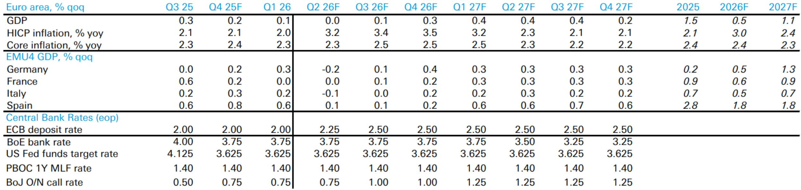
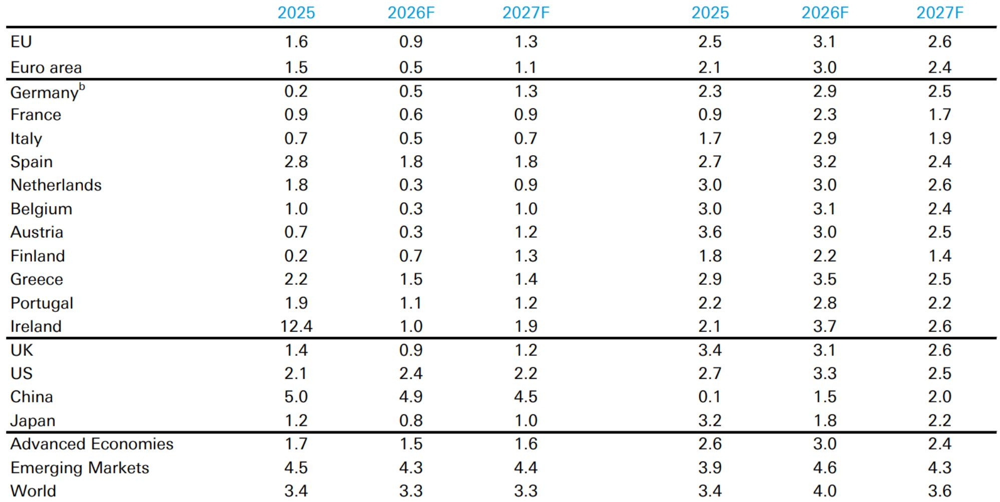

# Europe's Two-Economy Problem: Why the Energy Shock Exposes a Structural Fault That Stimulus Cannot Fix

The euro area is not facing a single crisis. It is facing two simultaneous conditions that pull in opposite directions, and the tension between them is now the central strategic question for any investor, policymaker, or corporate treasurer with exposure to the region. On one hand, the European economy has demonstrated genuine cyclical resilience. Domestic demand held up through 2025, GDP surprised to the upside at 1.5 percent, and the labour market remained robust despite persistent external headwinds from tariffs and geopolitical uncertainty. On the other hand, that resilience masks a deeper structural rigidity that the latest energy shock has now ruthlessly exposed. The Middle East conflict has unleashed the second energy price spike in four years, and Europe is once again the most exposed advanced economy to the cost of imported energy. This is not a repeat of 2022. The conditions are different, the starting point is weaker, and the policy room to manoeuvre is narrower.

The report from a leading global investment bank makes this tension explicit. The pre-conflict baseline for euro area GDP growth in 2026 stood at 1.1 percent. The post-conflict baseline has been cut to 0.5 percent. Inflation has been revised upward from 1.8 percent to 3.1 percent. These are not marginal adjustments. They represent a material deterioration in the outlook, driven almost entirely by one variable: the price of energy. But the more important insight is not the magnitude of the revision. It is the asymmetry of the shock. The energy price increase is a common shock across euro area member states, yet the capacity to absorb it varies dramatically depending on each economy's position along the resilience-rigidity spectrum. Germany, with its recently enacted fiscal expansion, entered the shock with more domestic demand ammunition than most. But the fiscal impulse is proving slower to materialise than expected. Meanwhile, the structural reforms needed to improve competitiveness, boost investment, and achieve strategic autonomy remain stalled by political fragmentation and high public indebtedness.

The argument of this article is straightforward. The energy shock does not merely create a cyclical downturn that can be managed with standard monetary or fiscal tools. It reveals that Europe's two-economy problem is not a temporary condition but a permanent structural feature that will define the region's performance for the remainder of this decade. Investors who treat the current slowdown as a typical recession risk missing the bigger picture. The real question is whether Europe can use this crisis to break out of its rigidity, or whether the resilience narrative will once again delay the difficult decisions that strategic autonomy requires.

## The Energy Shock Is Not a Repeat of 2022, and That Makes It More Dangerous for Growth

The first instinct of many market participants will be to compare the current situation to the energy crisis that followed Russia's invasion of Ukraine. That comparison is useful, but only if it highlights the differences. In 2022, Europe faced a sudden and extreme spike in natural gas prices, driven by the explicit weaponisation of energy supply. The response was extraordinary: emergency fiscal measures, coordinated gas storage mandates, and a rapid diversification of supply sources. The economy absorbed the shock better than many feared, partly because the shock was concentrated in one commodity and partly because the policy response was both swift and large.

The current shock is different in three critical ways. First, it is broader. The conflict in the Middle East has pushed up both oil and gas prices simultaneously. The report notes that 2026 oil prices have already converged to the ECB's adverse scenario, while 2027 oil prices remain above that scenario. Gas prices are tracking the baseline, but the combination of elevated prices across both energy sources creates a more pervasive cost pressure that hits every sector of the economy, not just energy-intensive manufacturing.

Second, the starting point is weaker. In 2022, the euro area was emerging from the pandemic with significant pent-up demand, a highly accommodative monetary stance, and fiscal space that had been preserved by years of low debt. Today, the region enters this shock with inflation still above target, interest rates at levels that are already restrictive, and public debt ratios that constrain fiscal expansion. The German fiscal easing was supposed to provide a cushion, but the report explicitly states that the impulse is proving slower than expected. This means the automatic stabilisers are weaker and the discretionary policy response will be more difficult to deploy.

Third, the nature of the shock is more persistent. The report's data shows that oil prices are expected to remain elevated well into 2027, even under the baseline scenario. This is not a temporary spike that will reverse within quarters. It is a structural shift in the energy cost environment that will persist long enough to alter corporate investment decisions, household consumption patterns, and the trajectory of inflation expectations. The survey data cited in the report is consistent with the risk of persistent inflation, which means the ECB cannot simply look through this shock the way it might have done with a temporary supply disruption.

The implication for growth is severe. The report estimates that the euro area's energy import bill will be about 0.75 percent of GDP higher in 2026 than in 2025. Given that pre-conflict growth was expected to be marginally above 1 percent, this energy cost increase alone raises a clear threat of recession. The model-based recession probability is estimated at 45 percent in the second quarter of 2026, rising to 60 percent in the third quarter. These are not alarmist numbers. They are the mechanical consequence of a large negative terms-of-trade shock hitting an economy with limited policy buffers.

## The Divergence Within Europe Is Not About Exposure to Energy but About Capacity to Adapt

A common narrative in past energy shocks has been that the impact is asymmetric across euro area member states, with some countries far more exposed than others due to differences in energy intensity, import dependence, or industrial structure. The report challenges this narrative in an important way. It shows that the change in the European Commission's Economic Sentiment Index since the start of the conflict is actually quite similar across countries. The standard deviation of ESI changes across member states is at average levels. There is no sense yet of an asymmetric shock.

This is a striking finding. It suggests that the energy shock is largely a common shock, hitting all member states with similar force. The CEE economies show slightly more resilience, which the report attributes to the larger role of manufacturing and a potentially transitory stock-building impulse. But the broad pattern is one of uniformity, not divergence. The countries reporting the largest drops in consumer confidence are also the countries reporting the largest drops in services PMI activity. The transmission mechanism is clear: rising inflation erodes real household incomes, which reduces services demand, which then feeds back into weaker economic activity across the board.

If the shock itself is common, then the key variable is not exposure but capacity to adapt. And here, the two-economy problem reasserts itself. Countries with more flexible labour markets, stronger fiscal positions, and more diversified export bases will be better positioned to absorb the shock and recover. Countries with rigid labour markets, high public debt, and concentrated industrial structures will struggle. The report does not explicitly rank member states along these dimensions, but the implication is clear. The energy shock is not creating divergence. It is revealing pre-existing divergence that was masked by the cyclical resilience of 2025.

For investors, this means that the standard approach of overweighting or underweighting individual countries based on energy exposure is likely to be less useful than a framework that assesses structural adaptability. The question is not which country has the highest energy import bill as a share of GDP. The question is which country has the institutional capacity to reallocate resources, invest in alternatives, and maintain competitiveness in a higher-cost energy environment. That is a fundamentally different analytical challenge.

## The ECB Faces a Risk Management Problem, Not a Standard Policy Trade-Off

The conventional framework for central banking in a supply shock is straightforward. If the shock is temporary, the central bank should look through it and focus on supporting demand. If the shock is persistent, the central bank should tighten to prevent second-round effects from becoming embedded in inflation expectations. The current situation fits neither category neatly. The energy shock is persistent enough to require a policy response, but the growth impact is severe enough to make tightening potentially catastrophic.

The report describes the appropriate ECB response as "measured" tightening, at most, and frames it as good risk management between upside inflation risk and downside growth risk. This is a carefully calibrated phrase that masks a genuinely difficult strategic choice. The ECB's baseline scenario, as described in the report, appears to underestimate both inflation and the persistence of energy prices. The report's own forecasts are more pessimistic on inflation and more pessimistic on growth. If the ECB is indeed underestimating inflation, it risks falling behind the curve and having to tighten more aggressively later, which would amplify the growth damage. If it overestimates the persistence of inflation and tightens prematurely, it risks tipping the economy into a recession that could have been avoided.

The report does not resolve this tension. Instead, it highlights the contingent nature of the outlook. The path of economies and policy will be a function of energy prices. That is not a helpful statement for a portfolio manager who needs to position today. But it is an honest one. The ECB is operating in an environment where the key variable is exogenous, volatile, and subject to geopolitical forces that are inherently unpredictable. Under these conditions, the best the central bank can do is maintain optionality and communicate clearly. The report's suggestion of "measured" tightening is consistent with that approach: keep rates slightly above neutral to signal inflation vigilance, but avoid aggressive moves that would lock in a contraction.

For investors, the implication is that ECB policy will be a source of uncertainty, not stability, for the foreseeable future. The path of rates will be determined by oil prices, which means every geopolitical event will have immediate monetary policy consequences. This is not a normal business cycle. It is a regime in which the central bank is a follower, not a leader.

## Strategic Autonomy Is the Only Real Solution, but the Report Leaves the Hardest Questions Unanswered

The report makes a compelling case that Europe needs strategic autonomy in energy, technology, supply chains, financing, and payments. It argues that defence spending will inevitably need to rise further as Europe builds its own deterrence capabilities. It notes that significant investment needs exist but that high public indebtedness and political fragmentation are hurdles. This is the most important section of the report, and also the most incomplete.

The argument for strategic autonomy is clear. In a world where energy supply can be weaponised, where technology supply chains can be disrupted, and where payment systems can be used as instruments of geopolitical leverage, Europe cannot afford to be dependent on any single external source for critical inputs. The report frames this as a need to create power and leverage in an increasingly geopolitical and frictional world. That is correct as a diagnosis.

But the report does not answer the most difficult questions. How will Europe finance the massive investment required for strategic autonomy when public debt is already high and political consensus is fragmented? What is the mechanism for allocating resources across competing priorities: defence, energy transition, technology, supply chain reshoring? Who makes the trade-offs when every member state has different interests and different capacity to contribute? The report identifies the problem but does not provide a framework for solving it.

This is not a criticism of the report. It is an honest acknowledgement that the questions are genuinely open. The energy shock has created a window of political urgency that could be used to push through reforms and investments that would otherwise be politically impossible. But urgency does not guarantee action. The risk is that Europe once again does just enough to manage the immediate crisis without addressing the underlying structural weaknesses, leaving itself vulnerable to the next shock.

For strategic investors, this creates a clear analytical agenda. The key variable to watch is not the quarterly GDP print or the monthly inflation number. It is the pace and scale of investment in strategic autonomy. If Europe can use this crisis to accelerate investment in energy independence, defence capabilities, and technology sovereignty, the long-term growth trajectory will be meaningfully higher. If it cannot, the region will remain stuck in a cycle of resilience and rigidity, perpetually vulnerable to external shocks and perpetually underperforming its potential.

## A Decision Framework for Navigating the Two-Economy Problem

The report provides the raw material for a decision framework, but it does not synthesise one. That is the task for the reader. Based on the analysis presented, the following framework emerges for investors and corporate strategists.

First, distinguish between cyclical and structural signals. The energy shock will produce volatile quarterly data that will tempt investors to make short-term bets based on sentiment readings, PMIs, and inflation prints. Most of this noise will be uninformative about the long-term trajectory. The signal to focus on is the pace of investment in energy alternatives, the direction of fiscal policy toward structural reform, and the evolution of labour market flexibility.

Second, assess country exposure not by energy intensity but by institutional capacity. The countries that will emerge stronger from this shock are those with the fiscal space to invest, the political consensus to reform, and the industrial base to adapt. Germany, despite its slower-than-expected fiscal impulse, remains the most important case to watch. If Germany can use its fiscal expansion to modernise its infrastructure and accelerate its energy transition, it will set the template for the rest of Europe. If it cannot, the entire region will suffer.

Third, monitor the ECB's reaction function carefully but do not overreact to individual policy decisions. The central bank is in a reactive mode, and its decisions will be driven by energy prices. The key risk is not a single rate move but a sustained period of policy uncertainty that depresses investment and consumption. The best hedge against this risk is not a particular asset allocation but a portfolio that is resilient to a wide range of energy price scenarios.

Fourth, take the strategic autonomy narrative seriously but treat it as a multi-year theme, not a near-term catalyst. The investment required is enormous, and the political hurdles are real. The companies that will benefit most are those that provide the enabling infrastructure for autonomy: energy technology, defence systems, digital infrastructure, and supply chain logistics. But the timing of these investments is uncertain, and the winners will not be obvious until the political framework is clearer.

## What the Full Report Reveals That This Summary Cannot Capture

This article has drawn on the key analytical insights from the report, but the full document contains data, charts, and scenario analysis that cannot be adequately conveyed in a summary. The original report includes detailed breakdowns of the energy import bill by country, the ECB's scenario framework for oil and gas prices, the sectoral dispersion of the services activity shock, and the historical context of real oil prices and recession risks. These are not decorative details. They are the analytical foundation for the argument presented here.

The report also contains the specific forecasts that underpin its central thesis. The pre-conflict and post-conflict GDP and inflation numbers are not abstract estimates. They are the product of a rigorous modelling framework that incorporates the energy price path, the fiscal impulse, and the monetary policy response. Understanding how those numbers were derived, and what assumptions they depend on, is essential for any investor who wants to form their own view of the outlook.

The charts in particular tell a story that words alone cannot. The PMI data showing the divergence between manufacturing and services, the ESI data showing the uniformity of the shock across countries, and the recession probability model showing the rising risk through 2026 all provide visual evidence for the report's conclusions. These are not optional additions. They are integral to the analysis.

For those who want to make their own assessment of the European outlook, rather than relying on a second-hand interpretation, the full report is indispensable. The original charts and data allow readers to test the assumptions, challenge the conclusions, and form their own independent view. In an environment where every basis point of GDP growth and every tenth of a percentage point of inflation matters for portfolio construction, that level of detail is not a luxury. It is a necessity.

Join the community to read the full report and review the original charts.

*This article is for learning and discussion only and does not constitute investment advice.*

Personal reading notes and learning share only. Not investment advice.

