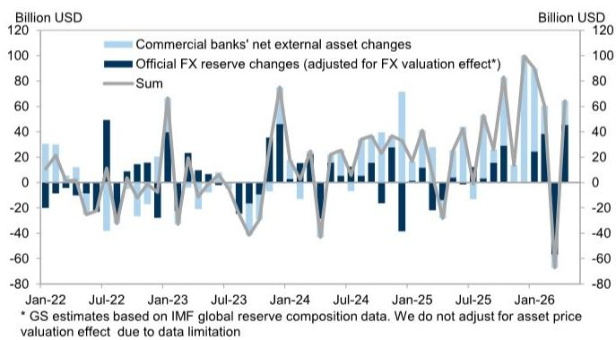
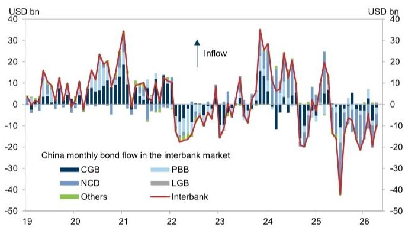
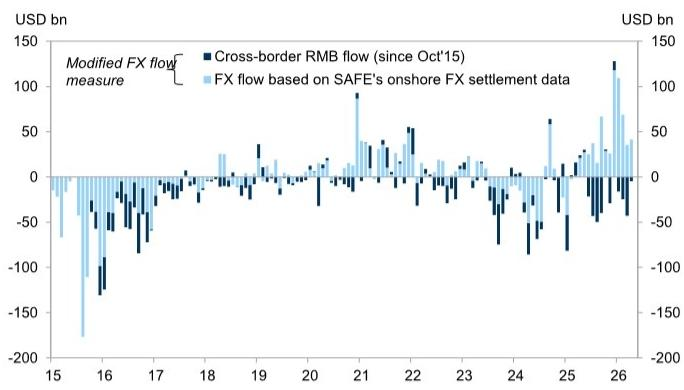

# China's FX Inflows Are Real, But Their Composition Reveals a Fragile Recovery

The narrative around Chinese capital flows has shifted decisively in April. According to the most recent SAFE data, a preferred measure of foreign exchange flows registered net inflows of USD 37 billion, a dramatic reversal from the USD 7 billion outflow recorded in March. This is not a marginal improvement; it is a swing of USD 44 billion in a single month. For any serious observer of China's external position, this data point demands attention. It suggests that the combination of policy measures, trade dynamics, and global investor sentiment has produced a tangible improvement in China's balance of payments.

Yet the headline number tells only part of the story. The real insight lies not in the aggregate inflow, but in the composition of that flow. The current account channel contributed USD 34 billion of inflows, while the portfolio investment channel added another USD 12 billion. On the surface, this looks like broad-based strength. But a closer examination reveals a pattern that is more nuanced and, in some respects, more fragile than the top-line figure suggests.

The timing of this data release is critical. It comes at a moment when global markets are reassessing their exposure to China, when trade tensions remain elevated, and when the trajectory of the renminbi is under constant scrutiny. The April data provides the first concrete evidence that policy interventions and market adjustments are beginning to take hold. But it also raises important questions about sustainability, about the role of official sector intervention, and about what happens when those interventions are withdrawn.

The key question for investors is not whether China saw FX inflows in April, but whether this represents a structural turning point or a temporary reprieve. The data suggests the latter is more likely, and the reasons for that caution are embedded in the details of the report.

## The Surge in FX Inflows Is Driven by a Sharp Reversal in Portfolio Flows, Not by a Strengthening of the Trade Surplus

The most striking feature of the April data is the swing in portfolio investment flows. After recording USD 7 billion in outflows in March, the portfolio channel delivered USD 12 billion in inflows in April. This USD 19 billion turnaround is the single largest contributor to the improvement in the overall FX flow picture. To understand why this matters, one must look beneath the headline.

The improvement in portfolio flows is visible across multiple data sources. North-Bound Bond Connect flows, which had shown USD 19 billion in outflows in March, narrowed to USD 10 billion in outflows in April. More importantly, the broader proxy for capital flows—net foreign receipts related to portfolio investment—swung from USD 53 billion in outflows in March to USD 14 billion in inflows in April. This is a swing of USD 67 billion in a single month.

What explains this dramatic reversal? The report does not provide explicit attribution, but the pattern is consistent with several plausible explanations. First, the stabilization of the renminbi exchange rate in April likely reduced the urgency for foreign investors to exit Chinese bond markets. Second, policy measures aimed at encouraging foreign portfolio inflows, including adjustments to the settlement and trading framework, may have begun to take effect. Third, the global macro environment in April may have been more conducive to emerging market flows, benefiting China as part of a broader trend.

The implications are significant. If the portfolio flow reversal is driven by temporary factors—such as a pause in renminbi depreciation expectations or a benign global risk environment—then it may not be sustainable. Investors should watch the May and June data closely for signs of whether this improvement is durable or merely a one-month aberration.

## The Trade Channel Is Weaker Than the Headline Suggests, and the Falling FX Conversion Ratio Is a Warning Signal

While the current account channel showed net inflows of USD 34 billion in April, this represents a decline from USD 47 billion in March. The goods trade surplus, which is the backbone of China's current account strength, generated net inflows of USD 48 billion in April, down from USD 60 billion in March. This is a meaningful deterioration in the primary source of China's external surplus.

The most telling indicator, however, is the FX conversion ratio for goods trade. This ratio fell to 56 percent in April, down sharply from 117 percent in March and below the first-quarter average of 74 percent. The FX conversion ratio measures the proportion of trade surplus that is actually converted into foreign exchange and repatriated into China. A declining ratio suggests that exporters are choosing to retain more of their foreign currency earnings abroad, rather than converting them into renminbi.

This behavior is typically associated with expectations of renminbi depreciation. When exporters expect the currency to weaken, they have an incentive to hold foreign currency rather than convert it into renminbi. The sharp drop in the conversion ratio in April, therefore, signals that the corporate sector's confidence in the renminbi may be eroding, even as the overall FX flow picture improves.

The divergence between the headline FX inflow and the declining conversion ratio is a classic warning signal. It suggests that the improvement in overall flows is being driven by portfolio and official sector channels, rather than by genuine improvement in trade-related flows. This makes the overall position more fragile, because portfolio flows are inherently more volatile and more sensitive to changes in sentiment than trade flows.

## Official Reserves Rose by USD 46 Billion After Adjusting for Valuation, but This Masked a Significant Increase in Commercial Banks' External Assets

The official FX reserves data, released earlier in the month, showed a rise to USD 3,411 billion in April from USD 3,342 billion in March. After adjusting for FX valuation effects—which the report estimates added USD 23 billion to reserves—the underlying increase was USD 46 billion. This is a substantial accumulation of reserves in a single month.

But the reserve accumulation tells only part of the story. The report also notes that commercial banks' net external assets increased by USD 19 billion in April, compared with a USD 10 billion decrease in March. This brings the outstanding amount of banks' net external assets to USD 1,491 billion. The simultaneous increase in both official reserves and commercial banks' external assets suggests that the improvement in FX flows was broad-based across the official and banking sectors.

However, the composition of this increase raises important questions. If the reserve accumulation is being driven by official sector intervention in the FX market, rather than by genuine private sector inflows, then the sustainability of the improvement is open to question. Official intervention can stabilize the exchange rate in the short term, but it cannot indefinitely offset private sector outflows without depleting reserves.

The increase in commercial banks' external assets is also worth examining. Banks' external assets include loans, deposits, and other claims on non-residents. An increase in these assets could reflect genuine lending activity, or it could reflect banks' efforts to manage their own FX exposure. Without more granular data, it is difficult to determine which interpretation is correct. But the trend is worth monitoring, because a sustained increase in banks' external assets could signal that the banking system is becoming more exposed to foreign counterparty risk.

## The Report Raises More Questions Than It Answers About the Sustainability of the Inflow

For all the detail in the April data, the report leaves several critical questions unanswered. These are not gaps in the analysis, but rather genuine uncertainties that the data cannot resolve. For investors, these open questions are the most important part of the report.

First, what is driving the portfolio flow reversal? The report shows that net foreign receipts related to portfolio investment swung from USD 53 billion in outflows to USD 14 billion in inflows. But it does not identify the specific instruments, investor types, or motivations behind this swing. Was it driven by bond investors, equity investors, or both? Were the inflows concentrated in Chinese government bonds, or were they spread across credit and other instruments? Without this granularity, it is impossible to assess whether the reversal is durable.

Second, why did the FX conversion ratio fall so sharply? The decline from 117 percent to 56 percent is extreme, even by historical standards. The report offers no specific explanation for this move. Was it driven by a few large exporters, or was it broad-based? Did it reflect concerns about the exchange rate, or was it related to corporate treasury management decisions that are unrelated to currency expectations? The answer to this question is crucial for understanding whether the trade channel will continue to support FX inflows.

Third, what role did official sector intervention play? The report's estimate of FX valuation effects provides a partial answer, but it does not fully decompose the reserve change into valuation effects, intervention, and other factors. If a significant portion of the reserve increase was due to intervention, then the improvement in FX flows may be less organic than it appears.

Fourth, how sustainable is the improvement in commercial banks' net external assets? The increase of USD 19 billion in April is a sharp reversal from the USD 10 billion decrease in March. But banks' external asset positions can be volatile and are subject to regulatory and prudential factors that may not reflect underlying capital flows.

These open questions are not weaknesses in the analysis. They are the natural result of working with aggregate data that cannot capture the full complexity of cross-border flows. For investors, the key takeaway is that the April data provides a positive signal, but it is not yet conclusive.

## A Decision Framework for Interpreting China's FX Flow Data

For investors trying to make sense of China's FX flow data, the April report provides a useful framework for analysis. The key is to look beyond the headline number and focus on the composition of flows. The following decision framework can help investors interpret future data releases.

The first step is to distinguish between current account and capital account flows. The current account channel, driven primarily by trade, is the more stable and predictable component of FX flows. A sustained improvement in the current account channel, supported by a rising FX conversion ratio, would be a strong positive signal. Conversely, a decline in the conversion ratio, even in the context of overall inflows, is a warning sign.

The second step is to examine the composition of capital account flows. Portfolio flows are inherently more volatile than trade flows, and they are more sensitive to changes in global risk appetite and exchange rate expectations. A reversal in portfolio flows can be a powerful driver of overall FX flows in the short term, but it is not necessarily sustainable. Investors should look for evidence that portfolio inflows are being driven by structural factors—such as index inclusion, yield differentials, or improvements in the regulatory framework—rather than by cyclical factors.

The third step is to track the behavior of commercial banks and the official sector. Increases in official reserves, after adjusting for valuation effects, suggest that the authorities are intervening to support the exchange rate or to absorb excess FX supply. Increases in commercial banks' external assets can signal that the banking system is expanding its foreign exposure, which could be either a positive or negative signal depending on the context.

The fourth step is to cross-reference the FX flow data with other indicators, such as exchange rate movements, interest rate differentials, and global risk appetite. The April data was released in a context of relative renminbi stability and a benign global environment. If these conditions change, the FX flow picture could shift rapidly.

## The Full Report Contains the Charts and Data That Make This Analysis Actionable

The analysis above provides a strategic interpretation of the April FX flow data, but it is necessarily limited by the constraints of this format. The full report contains the original charts and exhibits that make this analysis concrete and actionable. Exhibit 1 shows the historical trajectory of the preferred FX flow measure, providing context for the April data. Exhibit 2 tracks the FX conversion ratio over time, revealing the sharp decline that is central to the analysis. Exhibit 3 breaks down the bond flow data by instrument, offering a more granular view of portfolio flows. Exhibit 4 shows the relationship between commercial banks' net external assets and official reserves, highlighting the interaction between the two channels.

For investors who want to build their own view on China's external position, these charts are essential. They provide the raw material for further analysis and allow readers to test the conclusions presented here against the underlying data. The report also contains the detailed methodology and data sources that enable readers to verify the calculations and extend the analysis to future months.

The April data is a positive data point, but it is not yet a turning point. The composition of flows, the declining conversion ratio, and the unanswered questions about portfolio flow sustainability all suggest that caution is warranted. The full report provides the tools to monitor these dynamics as they evolve.

Join the community to read the full report and review the original charts.

*This article is for learning and discussion only and does not constitute investment advice.*

Personal reading notes and learning share only. Not investment advice.

