GOAL KICKSTART

The name is bond (again) - rising bond yields weigh on portfolios

Last week, US inflation prints surprised to the upside while US activity data remained solid. Global bonds sold-off driven by the more reflationary macro backdrop and spillovers from UK and Japan (Exhibit 1). While there is little US macro data this week, there are several speaking engagements with Fed officials, including events with Governors Waller and Barr and Presidents Paulson and Barkin. In Europe there are inflation prints and flash PMIs.

The 2-month correlation between US equities and US 10y yields turned the most negative since the late 1990s (Exhibit 2). The equity market's response to rising bond yields has tended to be closely linked to the source, speed, and starting level of the yield move. Since the start of the Middle East war and the ensuing energy price shock, markets have seen inflation rather than growth as the main source of macro shocks: the relative vol of our PC1 “Global Growth” and PC2 “Monetary policy” factors dropped alongside more negative equity/bond yield correlations (Exhibit 3). Likewise, the equity correlations with front-end inflation pricing (which is directly affected by higher energy prices) have turned sharply negative similarly to that with 10y real rates, while the correlation with forward inflation remains positive

(Exhibit 4). Rising yields due to better growth are usually digested well by equities as growth optimism can help buffer discount rate headwinds, whereas in an inflation-led rate environment the equity/bond yield correlation turns negative. Unlike the past, higher growth expectations due to micro (e.g. AI investment) rather than macro catalysts have supported equity prices since April.

Even when the source is benign, the pace of the rate move can itself become a headwind: historically, equities struggle to digest sharp, disorderly rises in yield. The duration sell-off had been largely orderly until recently, but last week's move — with US 10y yields rising more than 2 standard deviations — is a reminder not to fade right tail risk in rates too early (Exhibit 5). The level of rates plays a role too, albeit a weaker one: historically, US 10y yields above 5% or real yields above 2-2.5% have been associated with more negative equity/bond-year correlations. A more robust indicator is the gap between 10y real rates and LT consensus real GDP growth expectations (now 2.1%) — when positive, it signals tighter monetary policy, which is a more challenging backdrop for equities.

# Andrea Ferrario

+44(20)7552-4353

andrea.ferrario@gs.com

GS International

# Christian

# Mueller-Glissmann, CFA

+44(20)7774-1714 | christian.mueller-

glissmann@gs.com

GS International

# Alessandro Giglio

+44(20)7051-6240

alessandro.giglio@gs.com

GS International

# Giovanni Ferrannini

+44(20)7051-2589

giovanni.ferrannini@gs.com

GS International

# Peter Oppenheimer

+44(20)7552-5782

peter.oppenheimer@gs.com

GS International

We remain N bonds for 3M/12M in our Asset Allocation. While bonds look more attractive from a risk-premia point of view, the negative equity/bond-yield correlation regime might linger for longer. Equity down/rates up dual binaries look attractive to hedge an equity sell-off driven by a further yield increase, in particular as an overlay for balanced portfolios (Exhibit 6). While the implied equity/bond yield correlation has fallen since February, it still trades high compared to realised.

# The name is bond (again) - rising bond yields weigh on portfolios

Exhibit 1: Long-dated bond yields have reached multi-decade highs   
Average yield of 10y+ government bonds   
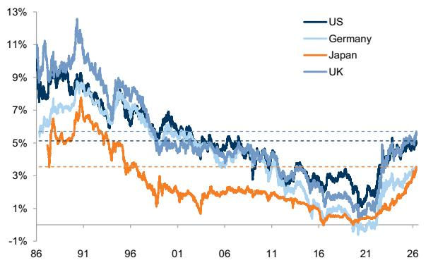

line

| Year | US    | Germany | Japan | UK    |
|------|-------|---------|-------|-------|
| 86   | 8.5%  | 7.0%    | 3.5%  | 11.0% |
| 91   | 9.0%  | 7.5%    | 4.0%  | 12.0% |
| 96   | 8.0%  | 6.5%    | 3.0%  | 9.0%  |
| 01   | 7.0%  | 5.5%    | 2.5%  | 7.5%  |
| 06   | 6.0%  | 4.5%    | 2.0%  | 6.5%  |
| 11   | 5.0%  | 3.5%    | 1.5%  | 5.5%  |
| 16   | 4.0%  | 2.5%    | 1.0%  | 4.5%  |
| 21   | 3.0%  | 1.5%    | 0.5%  | 3.5%  |
| 26   | 5.0%  | 4.0%    | 3.0%  | 5.0%  |

Source: Datastream, GS Global Investment Research

Exhibit 2: Equity/bond yield correlation has reached the most negative levels since the 1990s   
2-month US equity/US 10y bond yield correlation   
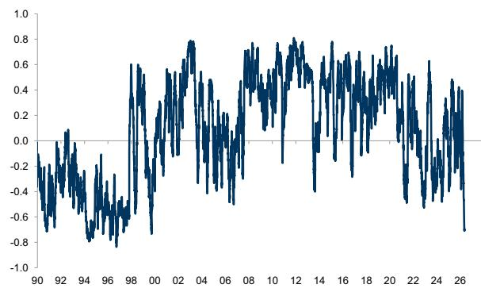

line

| Year | Value |
| ---- | ----- |
| 90   | -0.2  |
| 91   | -0.3  |
| 92   | -0.4  |
| 93   | -0.5  |
| 94   | -0.6  |
| 95   | -0.7  |
| 96   | -0.8  |
| 97   | -0.9  |
| 98   | -0.8  |
| 99   | -0.7  |
| 00   | -0.6  |
| 01   | -0.5  |
| 02   | -0.4  |
| 03   | -0.3  |
| 04   | -0.2  |
| 05   | -0.1  |
| 06   | 0.0   |
| 07   | 0.1   |
| 08   | 0.2   |
| 09   | 0.3   |
| 10   | 0.4   |
| 11   | 0.5   |
| 12   | 0.6   |
| 13   | 0.7   |
| 14   | 0.8   |
| 15   | 0.7   |
| 16   | 0.6   |
| 17   | 0.5   |
| 18   | 0.4   |
| 19   | 0.3   |
| 20   | 0.2   |
| 21   | 0.1   |
| 22   | 0.0   |
| 23   | -0.1  |
| 24   | -0.2  |
| 25   | -0.3  |
| 26   | -0.4  |

Source: Bloomberg, Haver Analytics, GS Global Investment Research

Exhibit 3: Inflation has been the driver of more negative equity/bond yield correlation   
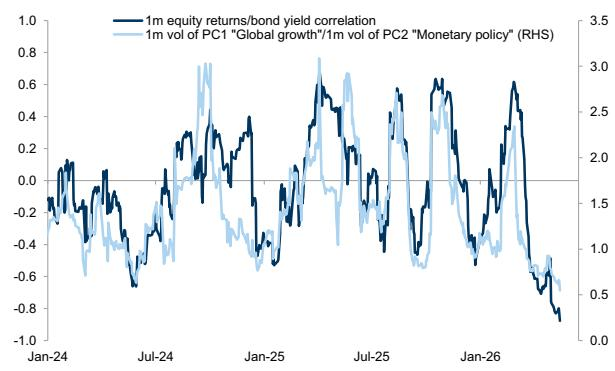

line

| Date   | 1m equity returns/bond yield correlation | 1m vol of PC1 "Global growth" / 1m vol of PC2 "Monetary policy" (RHS) |
|--------|------------------------------------------|------------------------------------------------------------------|
| Jan-24 | -0.2                                     | 0.0                                                              |
| Jul-24 | 0.3                                      | 1.5                                                              |
| Jan-25 | 0.6                                      | 2.0                                                              |
| Jul-25 | 0.7                                      | 2.5                                                              |
| Jan-26 | -0.8                                     | 0.5                                                              |

Source: Bloomberg, Haver Analytics, GS Global Investment Research

Exhibit 4: The equity correlation has turned very negative with 10y real rates and front-end inflation   
1-month correlation of S&P 500   
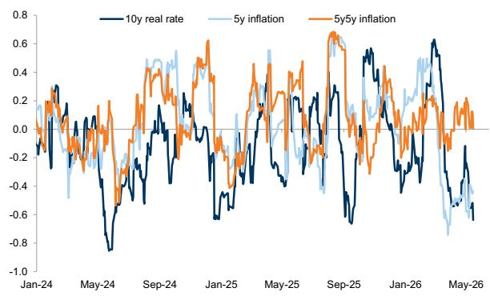

line

| Date   | 10y real rate | 5y inflation | 5y5y inflation |
|--------|---------------|--------------|----------------|
| Jan-24 | -0.2          | 0.1          | 0.0            |
| May-24 | -0.8          | -0.3         | -0.2           |
| Sep-24 | -0.1          | 0.5          | 0.4            |
| Jan-25 | -0.6          | -0.2         | -0.1           |
| May-25 | -0.4          | 0.6          | 0.5            |
| Sep-25 | 0.3           | 0.7          | 0.6            |
| Jan-26 | -0.7          | -0.1         | -0.2           |
| May-26 | -0.6          | -0.7         | -0.5           |

Source: Bloomberg, GS Global Investment Research

Exhibit 5: US 10y yields sold off sharply last week   
1-week change in US 10y rate in standard deviation terms   
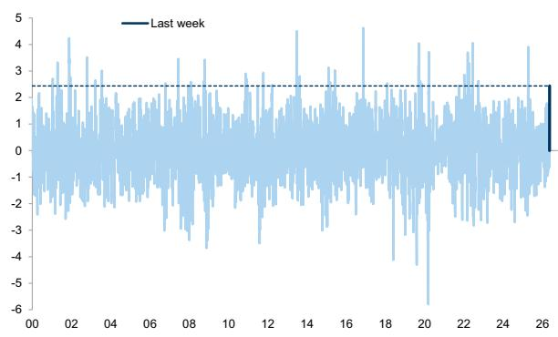

line

| Year | Last week |
| ---- | --------- |
| 00   | 1.5       |
| 01   | 3.0       |
| 02   | 4.5       |
| 03   | 2.5       |
| 04   | 1.8       |
| 05   | 2.2       |
| 06   | 1.9       |
| 07   | 3.5       |
| 08   | 2.8       |
| 09   | 3.2       |
| 10   | 2.0       |
| 11   | 2.5       |
| 12   | 3.0       |
| 13   | 4.5       |
| 14   | 2.8       |
| 15   | 3.5       |
| 16   | 4.8       |
| 17   | 2.5       |
| 18   | 3.0       |
| 19   | -4.0      |
| 20   | -6.0      |
| 21   | 4.0       |
| 22   | 3.5       |
| 23   | 4.0       |
| 24   | 3.0       |
| 25   | 4.0       |
| 26   | 2.5       |

Source: Bloomberg, GS Global Investment Research

Exhibit 6: Equity down/rates up hybrids look attractive to hedge a further rate shock   
Average payout since 2007/ current price. 3-month 25-delta put/call options and double digital hybrid   
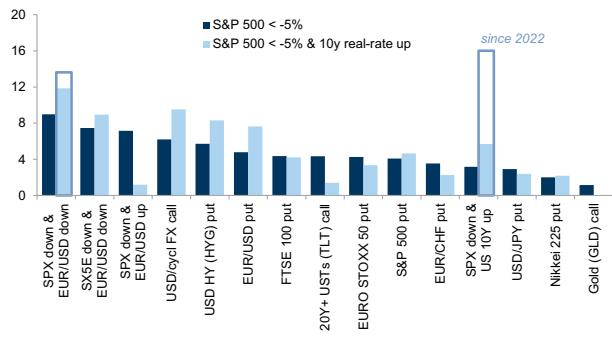

bar

| Category             | S&P 500 < -5% | S&P 500 < -5% & 10y real-rate up |
|----------------------|---------------|-----------------------------------|
| SPX down & EUR/USD down | 8.5           | 13.0                              |
| SXSE down & EUR/USD down | 7.5         | 8.5                               |
| SPX down & EUR/USD up | 7.5         | 1.0                               |
| USD/cyc FX call      | 6.0           | 9.0                               |
| USD HY (HYG) put     | 6.0           | 8.0                               |
| EUR/USD put          | 4.5           | 7.5                               |
| FTSE 100 put         | 4.0           | 4.0                               |
| 20Y+ USTs (TLT) call | 4.0           | 1.0                               |
| EURO STOXX 50 put    | 4.0           | 3.5                               |
| S&P 500 put          | 4.0           | 4.5                               |
| EUR/CHF put          | 3.5           | 2.5                               |
| SPX down & US 10Y up | 3.5           | 16.0                              |
| USD/JPY put          | 3.0           | 3.0                               |
| Nikkei 225 put       | 2.5           | 2.5                               |
| Gold (GLD) call      | 1.0           | 1.0                               |

Source: Bloomberg, GS FICC and Equities, GS Global Investment Research

# Cross-asset: Forecasts

Exhibit 7: GOAL asset allocation recommendations and GS cross-asset forecasts 

<table><tr><td rowspan="2"></td><td colspan="2">Allocation Weighting</td><td rowspan="2">Current Level</td><td colspan="3">Forecasts</td><td colspan="3">Forecast Upside/Downside (%)</td></tr><tr><td>3m</td><td>12m</td><td>3m</td><td>6m</td><td>12 m</td><td>3m</td><td>6m</td><td>12 m</td></tr><tr><td>Equities</td><td>N</td><td>OW</td><td></td><td colspan="3">Index level</td><td colspan="3">Total Return</td></tr><tr><td>S&amp;P 500 ($)</td><td>N</td><td>N</td><td>7409</td><td>7200</td><td>7400</td><td>7600</td><td>-2.5</td><td>0.5</td><td>3.7</td></tr><tr><td>Stoxx Europe 600 (€)</td><td>N</td><td>UW</td><td>607</td><td>605</td><td>615</td><td>625</td><td>0.5</td><td>3.0</td><td>6.4</td></tr><tr><td>MSCI Asia-Pacific ex. JP ($)</td><td>N</td><td>OW</td><td>860</td><td>900</td><td>940</td><td>990</td><td>5.1</td><td>9.8</td><td>16.4</td></tr><tr><td>Topix (¥)</td><td>N</td><td>OW</td><td>3864</td><td>3800</td><td>4000</td><td>4200</td><td>-1.1</td><td>4.6</td><td>10.9</td></tr><tr><td>10 Year Government Bonds</td><td>N</td><td>N</td><td></td><td colspan="3">Yield (%)</td><td colspan="3">Total Return</td></tr><tr><td>US</td><td>OW</td><td>OW</td><td>4.60</td><td>4.25</td><td>4.10</td><td>4.07</td><td>4.0</td><td>6.6</td><td>9.4</td></tr><tr><td>Germany</td><td>UW</td><td>UW</td><td>3.15</td><td>2.92</td><td>3.00</td><td>3.00</td><td>2.9</td><td>3.2</td><td>5.0</td></tr><tr><td>Japan</td><td>N</td><td>N</td><td>2.72</td><td>2.50</td><td>2.53</td><td>2.45</td><td>2.9</td><td>3.7</td><td>6.3</td></tr><tr><td>UK</td><td>OW</td><td>OW</td><td>5.18</td><td>4.55</td><td>4.40</td><td>4.30</td><td>6.5</td><td>9.2</td><td>13.1</td></tr><tr><td>Corporate Bonds</td><td>UW</td><td>UW</td><td></td><td colspan="3">Spread</td><td colspan="3">Total Return</td></tr><tr><td>Bloomberg USD IG</td><td>OW</td><td>OW</td><td>73</td><td>97</td><td>93</td><td>90</td><td>2.2</td><td>4.9</td><td>8.2</td></tr><tr><td>Bloomberg USD HY</td><td>OW</td><td>OW</td><td>267</td><td>340</td><td>330</td><td>315</td><td>0.4</td><td>2.7</td><td>6.5</td></tr><tr><td>iBoxx EUR IG</td><td>UW</td><td>UW</td><td>90</td><td>122</td><td>119</td><td>114</td><td>0.5</td><td>1.3</td><td>3.5</td></tr><tr><td>ICE-BAML EUR HY</td><td>UW</td><td>UW</td><td>260</td><td>379</td><td>372</td><td>360</td><td>-2.1</td><td>-0.9</td><td>1.8</td></tr><tr><td>EM Hard Currency Sovereign</td><td>N</td><td>N</td><td>237</td><td></td><td></td><td>300</td><td>2.9</td><td>4.5</td><td>6.1</td></tr><tr><td>Commodities</td><td>N</td><td>N</td><td></td><td colspan="3">Spot price</td><td colspan="3">Spot Return</td></tr><tr><td>WTI ($/bbl)</td><td>N</td><td>N</td><td>109</td><td>86</td><td>83</td><td>82</td><td>-21.1</td><td>-23.8</td><td>-24.8</td></tr><tr><td>Brent ($/bbl)</td><td>N</td><td>N</td><td>106</td><td>93</td><td>90</td><td>86</td><td>-12.1</td><td>-14.9</td><td>-18.7</td></tr><tr><td>Copper ($/mt)</td><td>N</td><td>N</td><td>13,503</td><td>12,600</td><td>12,500</td><td>12,200</td><td>-6.7</td><td>-7.4</td><td>-9.7</td></tr><tr><td>Gold ($/troy oz)</td><td>N</td><td>N</td><td>4,553</td><td>5,065</td><td>5,305</td><td>5,675</td><td>11.2</td><td>16.5</td><td>24.6</td></tr><tr><td>FX</td><td>-</td><td>-</td><td></td><td colspan="3">Spot rate</td><td colspan="3">Spot Return</td></tr><tr><td>EUR/USD</td><td>-</td><td>-</td><td>1.16</td><td>1.14</td><td>1.18</td><td>1.20</td><td>-2.0</td><td>1.5</td><td>3.2</td></tr><tr><td>USD/JPY</td><td>-</td><td>-</td><td>158.6</td><td>160</td><td>158</td><td>155</td><td>0.9</td><td>-0.4</td><td>-2.3</td></tr><tr><td>GBP/USD</td><td>-</td><td>-</td><td>1.33</td><td>1.33</td><td>1.34</td><td>1.33</td><td>-0.3</td><td>0.4</td><td>-0.3</td></tr><tr><td>AUD/USD</td><td>-</td><td>-</td><td>0.72</td><td>0.72</td><td>0.73</td><td>0.74</td><td>0.6</td><td>2.0</td><td>3.4</td></tr><tr><td>USD/BRL</td><td>-</td><td>-</td><td>5.07</td><td>4.90</td><td>5.00</td><td>5.00</td><td>-3.3</td><td>-1.3</td><td>-1.3</td></tr><tr><td>USD/INR</td><td>-</td><td>-</td><td>96.0</td><td>97.0</td><td>96.0</td><td>96.0</td><td>1.1</td><td>0.0</td><td>0.0</td></tr><tr><td>USD/CNY</td><td>-</td><td>-</td><td>6.80</td><td>6.80</td><td>6.70</td><td>6.50</td><td>-0.1</td><td>-1.5</td><td>-4.5</td></tr><tr><td>Cash</td><td>OW</td><td>N</td><td></td><td colspan="3">Spot rate</td><td colspan="3">Total Return</td></tr><tr><td>US 3-month Tbill</td><td>-</td><td>-</td><td>-</td><td>-</td><td>-</td><td>-</td><td>0.92</td><td>1.87</td><td>3.82</td></tr><tr><td>Germany 3-month Bubills</td><td>-</td><td>-</td><td>-</td><td>-</td><td>-</td><td>-</td><td>0.50</td><td>1.14</td><td>2.54</td></tr></table>

Source: Bloomberg, Datastream, Bloomberg-BARC, ICE-BAML, iBoxx, GS Global Investment Research

# Cross-asset: Weekly and YTD performance, absolute and risk-adjusted

Exhibit 8: Local currency returns and return to vol ratios   
1 week returns. Volatility of weekly returns in the previous 12m   
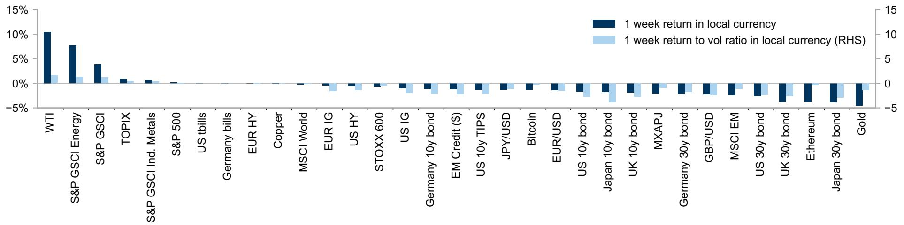

bar

| Currency / Bond | 1 week return in local currency | 1 week return to vol ratio in local currency (RHS) |
| --- | --- | --- |
| WTI | 10.5% | 2.0% |
| S&P GSCI Energy | 7.8% | 1.5% |
| S&P GSCI | 4.0% | 1.2% |
| TOPIX | 0.8% | 0.5% |
| S&P GSCI Ind. Metals | 0.6% | 0.3% |
| S&P 500 | 0.2% | 0.1% |
| US tbills | -0.1% | -0.2% |
| Germany bills | -0.3% | -0.4% |
| EUR HY | -0.4% | -0.5% |
| Copper | -0.5% | -0.6% |
| MSCI World | -0.6% | -0.7% |
| EUR IG | -0.7% | -0.8% |
| US HY | -0.8% | -0.9% |
| STOXX 600 | -0.9% | -1.0% |
| US IG | -1.0% | -1.1% |
| Germany 10y bond | -1.1% | -1.2% |
| EM Credit ($) | -1.2% | -1.3% |
| US 10y TIPS | -1.3% | -1.4% |
| JPY/USD | -1.4% | -1.5% |
| Bitcoin | -1.5% | -1.6% |
| EUR/USD | -1.6% | -1.7% |
| US 10y bond | -1.7% | -1.8% |
| Japan 10y bond | -1.8% | -2.0% |
| UK 10y bond | -1.9% | -2.1% |
| MXAPJ | -2.0% | -2.2% |
| Germany 30y bond | -2.1% | -2.3% |
| GBP/USD | -2.2% | -2.4% |
| MSCI EM | -2.3% | -2.5% |
| US 30y bond | -2.4% | -2.6% |
| UK 30y bond | -2.5% | -2.7% |
| Ethereum | -2.6% | -2.8% |
| Japan 30y bond | -2.7% | -2.9% |
| Gold | -2.8% | -3.0% |

Source: Datastream, Bloomberg, Haver Analytics, GS Global Investment Research

Exhibit 9: Local currency returns and return to vol ratios   
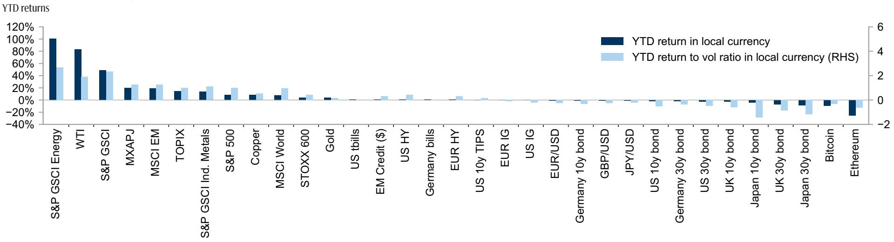

bar_line

| Category              | YTD return in local currency | YTD return to vol ratio in local currency (RHS) |
|-----------------------|-------------------------------|--------------------------------------------------|
| S&P GSCI Energy       | 100%                          | 5%                                               |
| WTI                   | 80%                           | 4%                                               |
| S&P GSCI              | 50%                           | 5%                                               |
| MXAPJ                 | 20%                           | 3%                                               |
| MSCI EM               | 20%                           | 3%                                               |
| TOPIX                 | 15%                           | 2%                                               |
| S&P GSCI Ind. Metals   | 15%                           | 3%                                               |
| S&P 500               | 10%                           | 2%                                               |
| Copper                | 10%                           | 1%                                               |
| MSCI World            | 10%                           | 2%                                               |
| STOXX 600             | 5%                            | 1%                                               |
| Gold                  | 5%                            | 0%                                               |
| US tbills             | 0%                            | 0%                                               |
| EM Credit ($)          | 0%                            | 1%                                               |
| US HY                 | 0%                            | 1%                                               |
| Germany bills         | 0%                            | 0%                                               |
| EUR HY                | 0%                            | 1%                                               |
| US 10y TIPS           | 0%                            | 1%                                               |
| EUR IG                | 0%                            | 0%                                               |
| US IG                 | 0%                            | -1%                                              |
| EUR/USD               | 0%                            | -1%                                              |
| Germany 10y bond      | 0%                            | -1%                                              |
| GBP/USD               | 0%                            | -1%                                              |
| JPY/USD               | 0%                            | -1%                                              |
| US 10y bond           | 0%                            | -1%                                              |
| Germany 30y bond      | 0%                            | -1%                                              |
| US 30y bond           | 0%                            | -1%                                              |
| UK 10y bond           | 0%                            | -1%                                              |
| Japan 10y bond        | -10%                          | -2%                                              |
| UK 30y bond           | -5%                           | -2%                                              |
| Japan 30y bond        | -5%                           | -3%                                              |
| Bitcoin               | -5%                           | -2%                                              |
| Ethereum              | -30%                          | -2%                                              |

Source: Datastream, Bloomberg, Haver Analytics, GS Global Investment Research

# Cross-asset: Risk appetite indicator

Exhibit 10: Risk appetite indicator level and momentum factors   
See July 2016 GOAL for construction details   
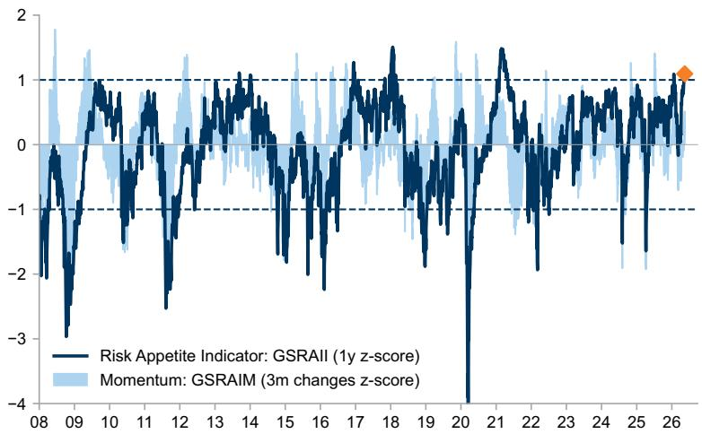

line

| Year | Risk Appetite Indicator: GSRAII (1y z-score) | Momentum: GSRAIM (3m changes z-score) |
|------|-----------------------------------------------|----------------------------------------|
| 2026 | 1.2                                           | 1.1                                    |

Source: GS Global Investment Research

Exhibit 11: Risk appetite indicators for different asset classes   
See July 2016 GOAL for construction details   
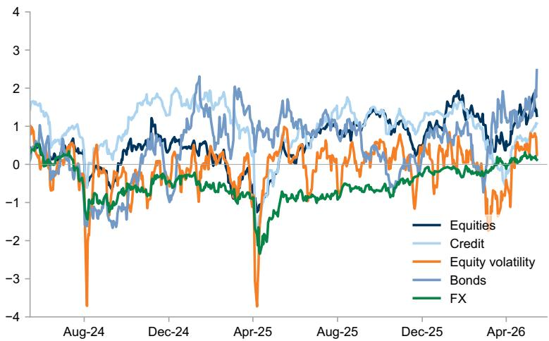

line

| Date   | Equities | Credit | Equity volatility | Bonds | FX   |
|--------|----------|--------|-------------------|-------|------|
| Aug-24 | ~0.5     | ~1.5   | ~-4               | ~-1.5 | ~-1  |
| Dec-24 | ~1.0     | ~1.8   | ~0                | ~1.5  | ~-0.5|
| Apr-25 | ~-1      | ~-0.5  | ~-4               | ~-1   | ~-2  |
| Aug-25 | ~1.0     | ~1.5   | ~0                | ~1.5  | ~-0.5|
| Dec-25 | ~1.5     | ~1.8   | ~0                | ~1.8  | ~-0.5|
| Apr-26 | ~2       | ~2     | ~0                | ~2.5  | ~0   |

Source: GS Global Investment Research

Exhibit 12: Cyclicals vs. defensives 1-year rolling z-score across regions   
See July 2016 GOAL for construction details   
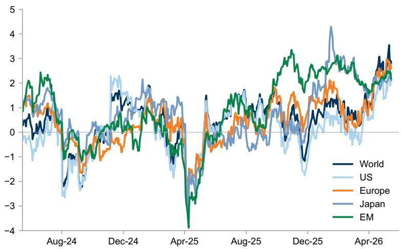

line

| Date   | World | US   | Europe | Japan | EM   |
|--------|-------|------|--------|-------|------|
| Aug-24 | 0.5   | -1.0 | 0.8    | 1.2   | 2.0  |
| Dec-24 | 1.5   | 2.0  | 1.0    | 1.8   | 0.5  |
| Apr-25 | -3.0  | -2.5 | -1.5   | -2.0  | -4.0 |
| Aug-25 | 1.0   | 0.5  | 0.8    | 1.5   | 1.8  |
| Dec-25 | 1.5   | 1.0  | 1.8    | 3.0   | 3.5  |
| Apr-26 | 3.0   | 2.5  | 2.8    | 3.5   | 3.0  |

Source: GS Global Investment Research

Exhibit 13: Sub-components of equity risk appetite indicator   
See July 2016 GOAL for construction details   
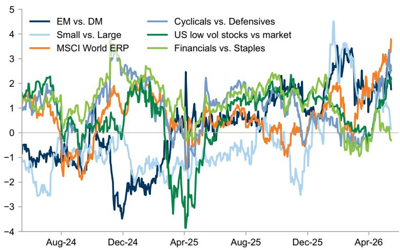

line

| Date   | EM vs. DM | Small vs. Large | MSCI World ERP | Cyclicals vs. Defensives | US low vol stocks vs market | Financials vs. Staples |
|--------|-----------|-----------------|----------------|--------------------------|-----------------------------|-------------------------|
| Aug-24 | -1.0      | -2.0            | -1.5           | 1.0                      | 1.5                         | 1.8                     |
| Dec-24 | -3.0      | -1.0            | 0.0            | 2.0                      | 2.5                         | 3.0                     |
| Apr-25 | 2.5       | -1.5            | 0.5            | 1.5                      | -4.0                        | 1.0                     |
| Aug-25 | 1.0       | -0.5            | 0.0            | 2.0                      | 1.5                         | 2.0                     |
| Dec-25 | 3.0       | -2.5            | 1.0            | 1.5                      | 2.0                         | 2.5                     |
| Apr-26 | 4.0       | 3.0             | 3.5            | 2.5                      | 3.0                         | 3.5                     |

Source: GS Global Investment Research

# Cross-asset: Risk Appetite principal component analysis

Exhibit 14: GS RAI principal component   
See April 2019 GOAL for construction details   
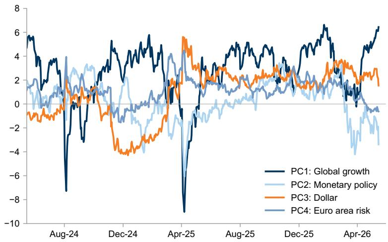

line

| Date   | PC1: Global growth | PC2: Monetary policy | PC3: Dollar | PC4: Euro area risk |
|--------|--------------------|----------------------|-----------|---------------------|
| Aug-24 | ~6                 | ~2                   | ~0        | ~2                  |
| Dec-24 | ~5                 | ~3                   | ~-2       | ~1                  |
| Apr-25 | ~-9                | ~-1                  | ~6        | ~4                  |
| Aug-25 | ~5                 | ~2                   | ~3        | ~2                  |
| Dec-25 | ~6                 | ~3                   | ~4        | ~3                  |
| Apr-26 | ~7                 | ~-4                  | ~3        | ~0                  |

Source: Datastream, GS Global Investment Research

Exhibit 15: PC1: Global growth factor vs. Global MAP Score   
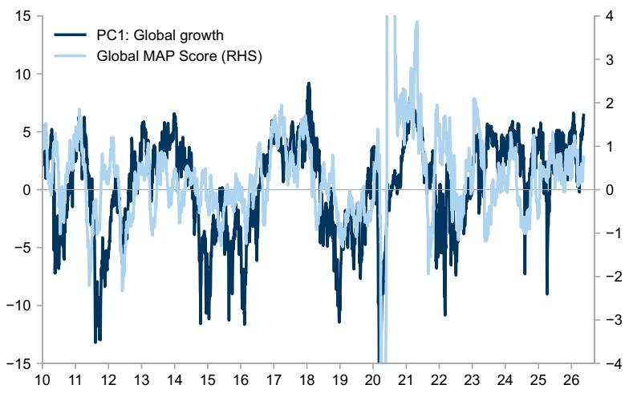

line

| Year | PC1: Global growth | Global MAP Score (RHS) |
|------|--------------------|------------------------|
| 10   | ~5                 | ~0                     |
| 11   | ~7                 | ~1                     |
| 12   | ~-12               | ~-3                    |
| 13   | ~6                 | ~0                     |
| 14   | ~5                 | ~1                     |
| 15   | ~-10               | ~-2                    |
| 16   | ~-8                | ~0                     |
| 17   | ~6                 | ~1                     |
| 18   | ~9                 | ~2                     |
| 19   | ~-5                | ~-1                    |
| 20   | ~-15               | ~-4                    |
| 21   | ~10                | ~3                     |
| 22   | ~-10               | ~-2                    |
| 23   | ~5                 | ~0                     |
| 24   | ~6                 | ~1                     |
| 25   | ~-8                | ~-2                    |
| 26   | ~6                 | ~0                     |

Source: Datastream, GS Global Investment Research

Exhibit 16: PC2: Monetary policy factor vs. US 10-year TIPS yield   
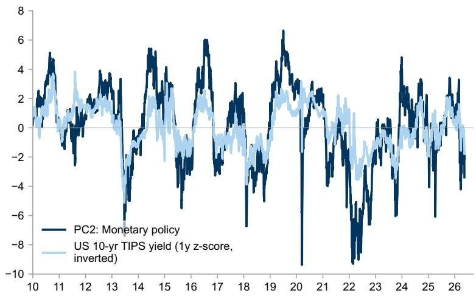

line

| Year | PC2: Monetary policy | US 10-yr TIPS yield (1y z-score, inverted) |
|------|----------------------|------------------------------------------|
| 10   | ~1.5                 | ~0.5                                     |
| 11   | ~5.0                 | ~3.0                                     |
| 12   | ~2.0                 | ~1.0                                     |
| 13   | ~-6.0                | ~-4.0                                    |
| 14   | ~5.5                 | ~2.5                                     |
| 15   | ~4.0                 | ~1.5                                     |
| 16   | ~6.0                 | ~3.0                                     |
| 17   | ~3.0                 | ~1.0                                     |
| 18   | ~-7.0                | ~-3.0                                    |
| 19   | ~6.5                 | ~2.5                                     |
| 20   | ~-9.0                | ~-5.0                                    |
| 21   | ~3.0                 | ~1.5                                     |
| 22   | ~-9.5                | ~-6.0                                    |
| 23   | ~-6.0                | ~-3.0                                    |
| 24   | ~5.0                 | ~2.0                                     |
| 25   | ~3.0                 | ~1.0                                     |
| 26   | ~-4.0                | ~-2.0                                    |

Source: Datastream, GS Global Investment Research

Exhibit 17: PC3: Dollar factor vs. USD TWI   
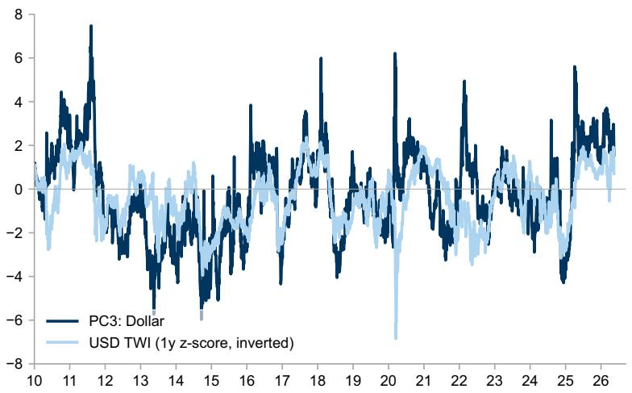

line

| Year | PC3: Dollar | USD TWI (1y z-score, inverted) |
|------|-------------|--------------------------------|
| 10   | ~0          | ~0                             |
| 11   | ~4          | ~2                             |
| 12   | ~7          | ~1                             |
| 13   | ~-3         | ~0                             |
| 14   | ~-5         | ~1                             |
| 15   | ~-6         | ~0                             |
| 16   | ~4          | ~2                             |
| 17   | ~2          | ~1                             |
| 18   | ~6          | ~2                             |
| 19   | ~2          | ~0                             |
| 20   | ~6          | ~-7                            |
| 21   | ~3          | ~1                             |
| 22   | ~5          | ~0                             |
| 23   | ~2          | ~1                             |
| 24   | ~3          | ~0                             |
| 25   | ~5          | ~2                             |
| 26   | ~3          | ~1                             |

Source: Datastream, GS Global Investment Research

# Cross-asset: Balanced portfolios and dynamic allocation strategies performance

Exhibit 18: 60/40 equity/bond portfolio performance across regions last 12m   
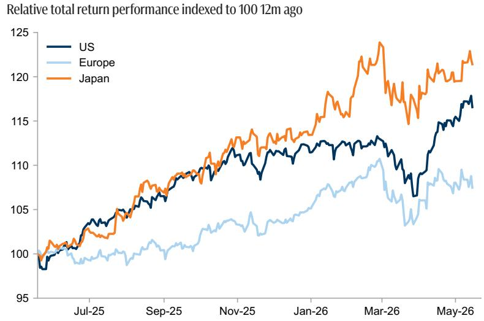

line

| Date   | US   | Europe | Japan |
|--------|------|--------|-------|
| Jul-25 | 100  | 99     | 100   |
| Sep-25 | 108  | 101    | 109   |
| Nov-25 | 110  | 103    | 112   |
| Jan-26 | 112  | 105    | 115   |
| Mar-26 | 113  | 107    | 124   |
| May-26 | 117  | 108    | 122   |

Source: Datastream, GS Global Investment Research

Exhibit 19: Risk parity portfolio performance across regions last 12m   
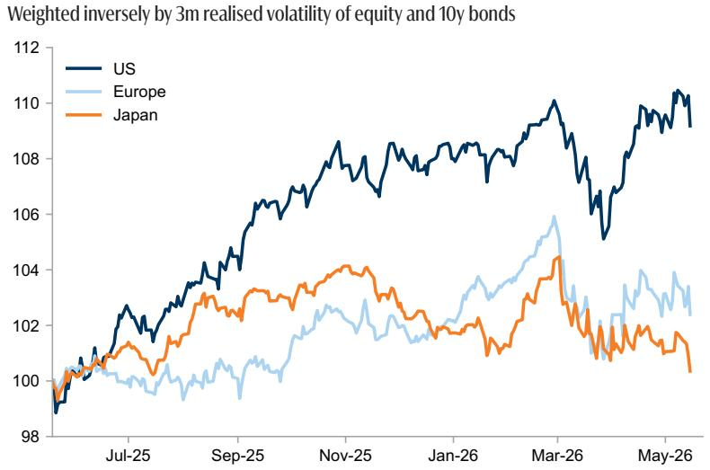

line

| Date   | US   | Europe | Japan |
|--------|------|--------|-------|
| Jul-25 | 100.5| 100.2  | 100.8 |
| Sep-25 | 104.2| 101.5  | 103.1 |
| Nov-25 | 107.8| 103.9  | 104.6 |
| Jan-26 | 108.5| 104.7  | 103.8 |
| Mar-26 | 110.2| 105.9  | 104.5 |
| May-26 | 110.8| 104.2  | 100.5 |

Source: Datastream, GS Global Investment Research

Exhibit 20: 60/40 portfolio with volatility target strategies overlay vs. US 60/40 portfolio   
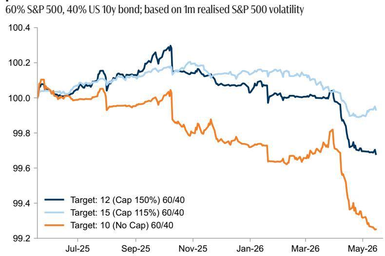

line

| Date   | Target: 12 (Cap 150%) 60/40 | Target: 15 (Cap 115%) 60/40 | Target: 10 (No Cap) 60/40 |
|--------|-----------------------------|-----------------------------|----------------------------|
| Jul-25 | ~100.0                      | ~100.0                      | ~100.0                     |
| Sep-25 | ~100.3                      | ~100.2                      | ~99.9                      |
| Nov-25 | ~100.2                      | ~100.2                      | ~99.8                      |
| Jan-26 | ~100.1                      | ~100.1                      | ~99.7                      |
| Mar-26 | ~100.0                      | ~100.0                      | ~99.6                      |
| May-26 | ~99.7                       | ~99.9                       | ~99.3                      |

Source: Datastream, GS Global Investment Research

Exhibit 21: 60/40 portfolio with volatility target strategies and momentum overlay vs. US 60/40   
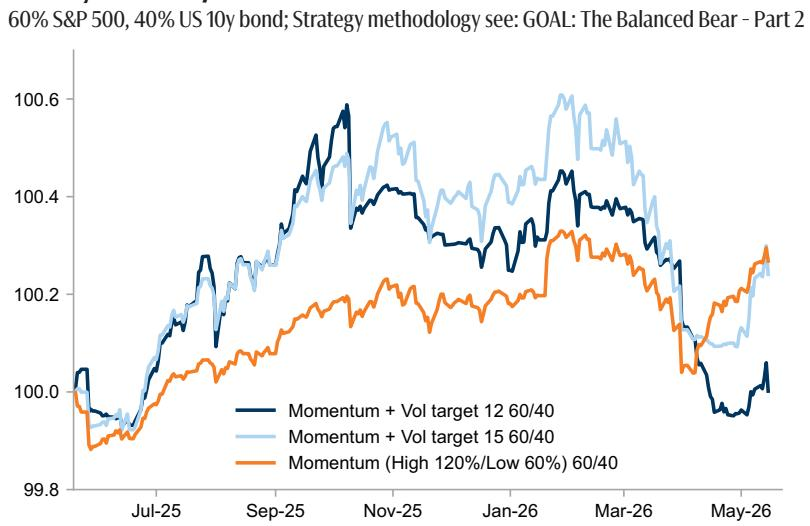

line

| Date   | Momentum + Vol target 12 60/40 | Momentum + Vol target 15 60/40 | Momentum (High 120%/Low 60%) 60/40 |
|--------|----------------------------------|----------------------------------|--------------------------------------|
| Jul-25 | ~100.0                           | ~100.0                           | ~99.8                                |
| Sep-25 | ~100.4                           | ~100.3                           | ~100.1                               |
| Nov-25 | ~100.6                           | ~100.5                           | ~100.2                               |
| Jan-26 | ~100.4                           | ~100.6                           | ~100.3                               |
| Mar-26 | ~100.3                           | ~100.4                           | ~100.2                               |
| May-26 | ~99.9                            | ~100.1                           | ~100.3                               |

Source: Datastream, GS Global Investment Research

# Cross-asset: Equity vs. credit monitor

Exhibit 22: USD cash credit vs. US equity   
Cash credit excess returns (beta-adjusted) vs. S&P 500 total returns   
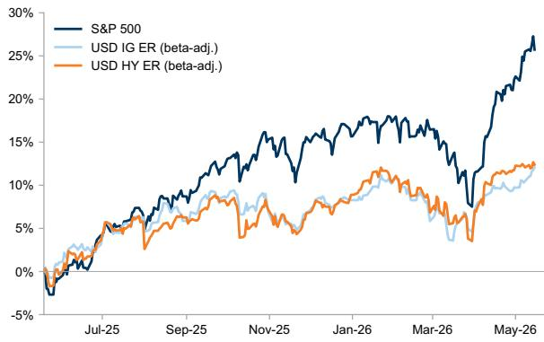

line

| Date   | S&P 500 | USD IG ER (beta-adj.) | USD HY ER (beta-adj.) |
|--------|---------|------------------------|------------------------|
| Jul-25 | ~0%     | ~0%                    | ~0%                    |
| Sep-25 | ~8%     | ~6%                    | ~4%                    |
| Nov-25 | ~16%    | ~9%                    | ~7%                    |
| Jan-26 | ~18%    | ~10%                   | ~11%                   |
| Mar-26 | ~10%    | ~6%                    | ~5%                    |
| May-26 | ~27%    | ~12%                   | ~13%                   |

Source: Datastream, GS Global Investment Research

Exhibit 23: USD synthetic credit vs. US equity   
Synthetic credit excess returns (beta-adjusted) vs. S&P 500 total returns   
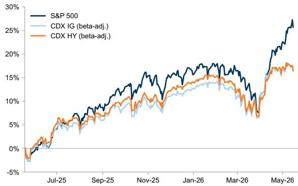

line

| Date   | S&P 500 | CDX IG (beta-adj.) | CDX HY (beta-adj.) |
|--------|---------|---------------------|---------------------|
| Jul-25 | ~1%     | ~0%                 | ~0%                 |
| Sep-25 | ~8%     | ~6%                 | ~7%                 |
| Nov-25 | ~14%    | ~10%                | ~11%                |
| Jan-26 | ~18%    | ~14%                | ~15%                |
| Mar-26 | ~16%    | ~12%                | ~13%                |
| May-26 | ~28%    | ~18%                | ~17%                |

Source: Datastream, GS Global Investment Research

Exhibit 24: EUR cash credit vs. European equity   
Cash credit excess returns (beta-adjusted) vs. MSCI Europe total returns   
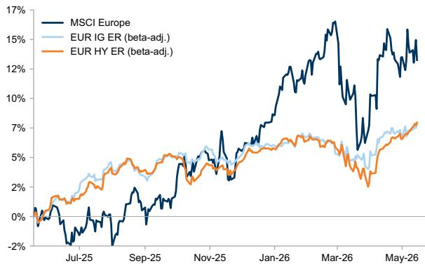

line

| Date   | MSCI Europe | EUR IG ER (beta-adj.) | EUR HY ER (beta-adj.) |
|--------|-------------|------------------------|------------------------|
| Jul-25 | -2%         | 0%                     | 0%                     |
| Sep-25 | 2%          | 4%                     | 4%                     |
| Nov-25 | 6%          | 5%                     | 5%                     |
| Jan-26 | 12%         | 6%                     | 6%                     |
| Mar-26 | 16%         | 7%                     | 7%                     |
| May-26 | 14%         | 8%                     | 8%                     |

Source: Datastream, GS Global Investment Research

Exhibit 25: EUR synthetic credit vs. European equity   
Synthetic credit excess returns (beta-adjusted) vs. MSCI Europe total returns   
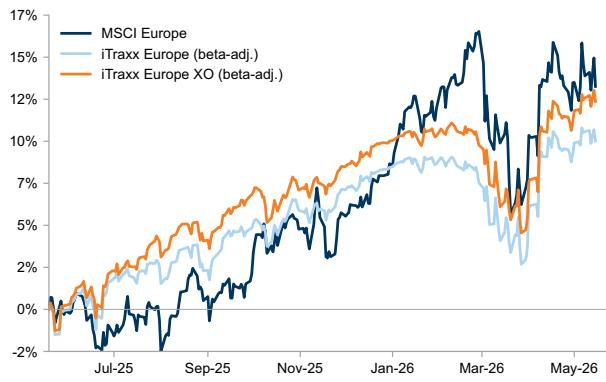

line

| Date   | MSCI Europe | iTraxx Europe (beta-adj.) | iTraxx Europe XO (beta-adj.) |
|--------|-------------|---------------------------|------------------------------|
| Jul-25 | -2%         | -1%                       | -1%                          |
| Sep-25 | 0%          | 2%                        | 3%                           |
| Nov-25 | 5%          | 6%                        | 7%                           |
| Jan-26 | 10%         | 8%                        | 9%                           |
| Mar-26 | 15%         | 10%                       | 11%                          |
| May-26 | 14%         | 10%                       | 12%                          |

Source: Datastream, GS Global Investment Research

Exhibit 26: EM cash credit vs. EM equity   
Cash credit excess returns (beta-adjusted) vs. MSCI EM total returns   

line

| Date   | MSCI EM | EMBI ER (beta-adj.) |
|--------|---------|---------------------|
| Jul-25 | ~0%     | ~0%                 |
| Sep-25 | ~10%    | ~5%                 |
| Nov-25 | ~20%    | ~15%                |
| Jan-26 | ~30%    | ~20%                |
| Mar-26 | ~40%    | ~25%                |
| May-26 | ~50%    | ~30%                |

Source: Datastream, GS Global Investment Research

Exhibit 27: EM synthetic credit vs. EM equity   
Synthetic credit excess returns (beta-adjusted) vs. MSCI EM total returns   
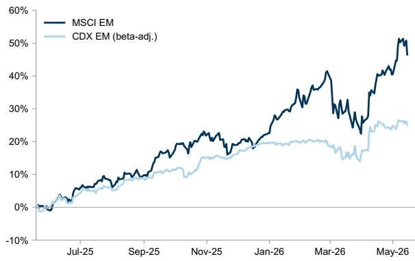

line

| Date   | MSCI EM | CDX EM (beta-adj.) |
|--------|---------|---------------------|
| Jul-25 | ~0%     | ~0%                 |
| Sep-25 | ~10%    | ~8%                 |
| Nov-25 | ~20%    | ~15%                |
| Jan-26 | ~30%    | ~20%                |
| Mar-26 | ~40%    | ~25%                |
| May-26 | ~50%    | ~28%                |

Source: Datastream, GS Global Investment Research

# Cross-asset: Valuation and risk premia

Exhibit 28: Cross-asset valuation table   
A higher percentile means more expensive relative to 10y history 

<table><tr><td rowspan="2"></td><td colspan="5">Equity</td><td colspan="4">Government bonds</td><td colspan="5">Credit</td><td colspan="2">FX (vs. USD)</td></tr><tr><td>S&amp;P 500</td><td>Stoxx 600</td><td>MXAPJ</td><td>Topix</td><td>MSCI EM</td><td>US 10y</td><td>German 10y</td><td>Japan 10y</td><td>UK 10y</td><td>US IG</td><td>US HY</td><td>EUR IG</td><td>EUR HY</td><td>EM ($)</td><td>EUR</td><td>JPY</td></tr><tr><td>Valuation metric</td><td colspan="5">12m forward P/E ratio</td><td colspan="4">Yield</td><td colspan="5">Spread</td><td colspan="2">Actual - GS fair value</td></tr><tr><td>Current:</td><td>21.0x</td><td>14.2x</td><td>12.7x</td><td>16.5x</td><td>11.6x</td><td>4.6%</td><td>3.1%</td><td>2.7%</td><td>5.2%</td><td>73bp</td><td>280bp</td><td>89bp</td><td>260bp</td><td>237bp</td><td>-3.1%</td><td>-41.1%</td></tr><tr><td>Expensiveness (last 10y percentile):</td><td>70%</td><td>51%</td><td>19%</td><td>91%</td><td>22%</td><td>2%</td><td>0%</td><td>0%</td><td>0%</td><td>99%</td><td>96%</td><td>96%</td><td>97%</td><td>100%</td><td>83%</td><td>2%</td></tr><tr><td>3M change:</td><td>0.6x</td><td>-0.4x</td><td>-0.5x</td><td>0.6x</td><td>-0.4x</td><td>0.3%</td><td>0.2%</td><td>0.4%</td><td>0.4%</td><td>-19bp</td><td>-48bp</td><td>-12bp</td><td>-48bp</td><td>-26bp</td><td>1.5%</td><td>0.7%</td></tr><tr><td>Average:</td><td>19.1x</td><td>14.3x</td><td>13.6x</td><td>14.1x</td><td>12.3x</td><td>2.8%</td><td>0.9%</td><td>0.4%</td><td>2.2%</td><td>112bp</td><td>395bp</td><td>130bp</td><td>379bp</td><td>95bp</td><td>-7.3%</td><td>-20.5%</td></tr><tr><td>95th:</td><td>22.4x</td><td>17.4x</td><td>16.2x</td><td>17.3x</td><td>14.8x</td><td>4.5%</td><td>2.8%</td><td>1.7%</td><td>4.7%</td><td>152bp</td><td>581bp</td><td>202bp</td><td>550bp</td><td>510bp</td><td>-1.2%</td><td>-7.1%</td></tr><tr><td>5th:</td><td>16.0x</td><td>11.9x</td><td>11.9x</td><td>12.0x</td><td>10.8x</td><td>0.7%</td><td>-0.5%</td><td>-0.1%</td><td>0.3%</td><td>78bp</td><td>282bp</td><td>89bp</td><td>267bp</td><td>268bp</td><td>-13.6%</td><td>-40.4%</td></tr></table>

Note: GSDEER is our fair value macro model for exchange rates.   
Source: Datastream, I/B/E/S, iBoxx, GS Global Investment Research

Exhibit 29: Credit spread minus equity risk premium estimates across markets   
Equity risk premia based on 1-stage DDM using local 10-year yields and LT GDP consensus estimates. Using past 10 years of data.   
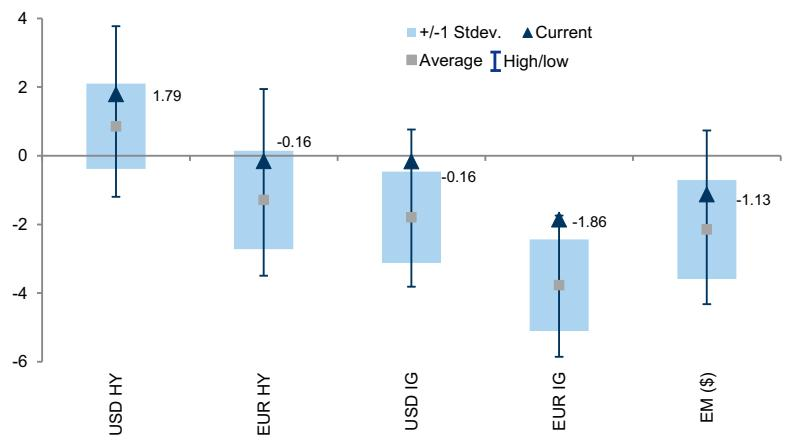

bar

| Currency | Current | Average |
|----------|---------|---------|
| USD HY   | 1.79    |         |
| EUR HY   | -0.16   |         |
| USD IG   | -0.16   |         |
| EUR IG   | -1.86   |         |
| EM ($)   | -1.13   |         |

Source: Datastream, iBoxx, GS Global Investment Research

Exhibit 30: Equity vs. credit relative valuation   
US Dividend Yield minus Credit spreads   
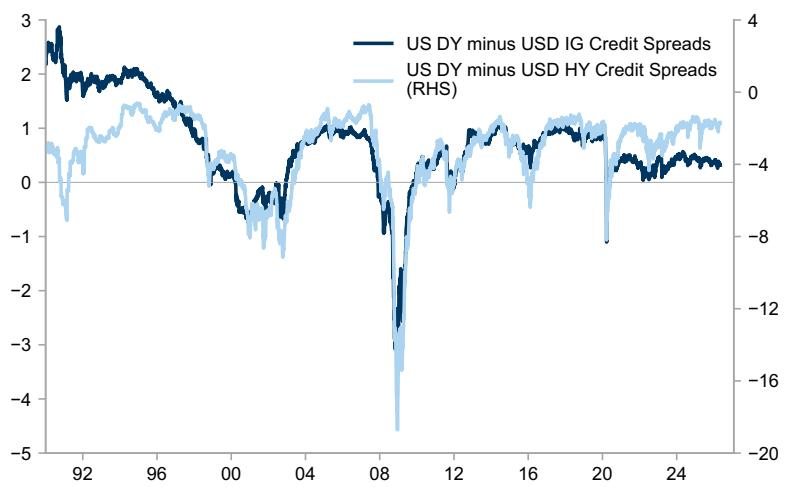

line

| Year | US DY minus USD IG Credit Spreads | US DY minus USD HY Credit Spreads (RHS) |
|------|------------------------------------|------------------------------------------|
| 92   | ~3.0                               | ~0.5                                     |
| 96   | ~2.0                               | ~1.0                                     |
| 00   | ~0.0                               | ~-1.0                                    |
| 04   | ~1.0                               | ~-2.0                                    |
| 08   | ~-3.0                              | ~-16.0                                   |
| 12   | ~1.0                               | ~-4.0                                    |
| 16   | ~1.0                               | ~-4.0                                    |
| 20   | ~0.5                               | ~-8.0                                    |
| 24   | ~0.5                               | ~-4.0                                    |

Source: Datastream, GS Global Investment Research

# Cross-asset: Yields

Exhibit 31: Current yields across assets and their percentile to the past 10 years 

<table><tr><td rowspan="2"></td><td colspan="5">Equity</td><td colspan="4">Government bonds</td><td colspan="5">Credit</td></tr><tr><td>S&amp;P 500</td><td>Stoxx 600</td><td>MXAPJ ($)</td><td>Topix</td><td>MSCI EM ($)</td><td>US 10y</td><td>German 10y</td><td>Japan 10y</td><td>UK 10y</td><td>US IG</td><td>EUR IG</td><td>US HY</td><td>EUR HY</td><td>EM Debt ($)</td></tr><tr><td>Valuation metric</td><td colspan="5">Dividend Yield (NTM)</td><td colspan="4">Yield</td><td colspan="5">Yield</td></tr><tr><td>Current:</td><td>1.1%</td><td>3.4%</td><td>2.2%</td><td>2.2%</td><td>2.4%</td><td>4.6%</td><td>3.1%</td><td>2.7%</td><td>5.2%</td><td>5.3%</td><td>3.9%</td><td>7.5%</td><td>5.8%</td><td>6.7%</td></tr><tr><td>Percentile (-10y):</td><td>0%</td><td>25%</td><td>1%</td><td>24%</td><td>3%</td><td>98%</td><td>100%</td><td>100%</td><td>100%</td><td>83%</td><td>88%</td><td>68%</td><td>68%</td><td>63%</td></tr><tr><td>Average:</td><td>1.7%</td><td>3.5%</td><td>2.9%</td><td>2.4%</td><td>2.9%</td><td>2.8%</td><td>0.9%</td><td>0.4%</td><td>2.2%</td><td>3.9%</td><td>2.1%</td><td>6.9%</td><td>4.9%</td><td>6.3%</td></tr><tr><td>95th:</td><td>2.2%</td><td>4.0%</td><td>3.4%</td><td>2.7%</td><td>3.4%</td><td>4.5%</td><td>2.8%</td><td>1.7%</td><td>4.7%</td><td>5.6%</td><td>4.3%</td><td>8.8%</td><td>7.5%</td><td>8.1%</td></tr><tr><td>5th:</td><td>1.2%</td><td>3.0%</td><td>2.3%</td><td>2.1%</td><td>2.4%</td><td>0.7%</td><td>-0.5%</td><td>-0.1%</td><td>0.3%</td><td>2.0%</td><td>0.5%</td><td>4.7%</td><td>3.0%</td><td>4.8%</td></tr><tr><td>3m real. ret. vol:</td><td>14.4%</td><td>18.0%</td><td>28.4%</td><td>25.5%</td><td>27.7%</td><td>5.7%</td><td>6.1%</td><td>4.6%</td><td>8.6%</td><td>4.8%</td><td>4.1%</td><td>3.7%</td><td>3.9%</td><td>5.5%</td></tr><tr><td>Percentile (-10y):</td><td>58%</td><td>71%</td><td>90%</td><td>89%</td><td>89%</td><td>30%</td><td>75%</td><td>74%</td><td>79%</td><td>48%</td><td>91%</td><td>66%</td><td>61%</td><td>73%</td></tr><tr><td>Yield/vol ratio</td><td>0.08</td><td>0.19</td><td>0.08</td><td>0.09</td><td>0.09</td><td>0.80</td><td>0.52</td><td>0.58</td><td>0.60</td><td>1.09</td><td>0.94</td><td>2.03</td><td>1.50</td><td>1.23</td></tr></table>

Source: Datastream, iBoxx, GS Global Investment Research

Exhibit 32: Past week change in yields across assets   
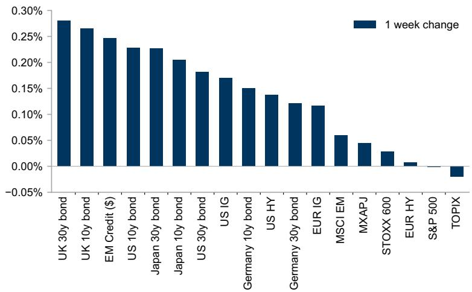

bar

| Entity | 1 week change (%) |
| :--- | :--- |
| UK 30y bond | 0.28 |
| UK 10y bond | 0.265 |
| EM Credit ($) | 0.245 |
| US 10y bond | 0.23 |
| Japan 30y bond | 0.23 |
| Japan 10y bond | 0.205 |
| US 30y bond | 0.18 |
| US IG | 0.17 |
| Germany 10y bond | 0.15 |
| US HY | 0.14 |
| Germany 30y bond | 0.125 |
| EUR IG | 0.12 |
| MSCI EM | 0.06 |
| MXAPJ | 0.045 |
| STOXX 600 | 0.03 |
| EUR HY | 0.01 |
| S&P 500 | -0.005 |
| TOPIX | -0.01 |

Source: Datastream, iBoxx, GS Global Investment Research

Exhibit 33: YTD change in yields across assets   
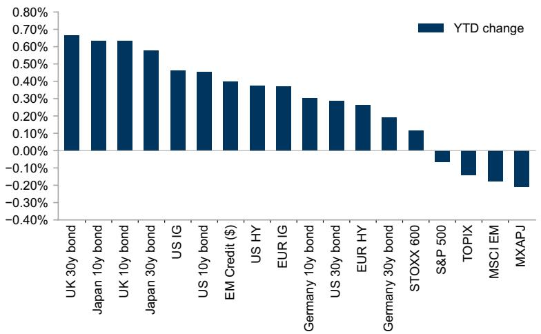

bar

| Category | YTD change (%) |
|---|---|
| UK 30y bond | 0.67 |
| Japan 10y bond | 0.64 |
| UK 10y bond | 0.64 |
| Japan 30y bond | 0.58 |
| US IG | 0.46 |
| US 10y bond | 0.45 |
| EM Credit ($) | 0.40 |
| US HY | 0.37 |
| EUR IG | 0.37 |
| Germany 10y bond | 0.30 |
| US 30y bond | 0.28 |
| EUR HY | 0.26 |
| Germany 30y bond | 0.19 |
| STOXX 600 | 0.12 |
| S&P 500 | -0.05 |
| TOPIX | -0.15 |
| MSCI EM | -0.18 |
| MXAPJ | -0.22 |

Source: Datastream, iBoxx, GS Global Investment Research

# Cross-asset: Sentiment and Positioning

Exhibit 34: Percentile of sentiment indicators   
Data since 2007   
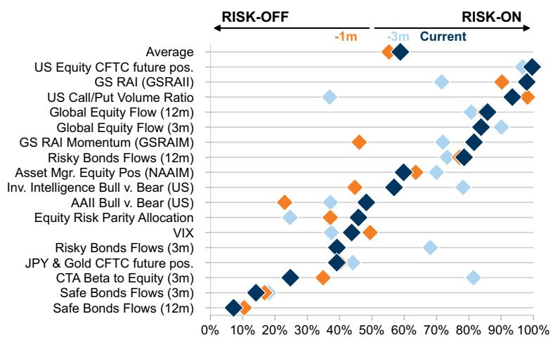

scatter

| Category | Value |
| --- | --- |
| Average | -3m |
| US Equity CFTC future pos. | -1m |
| GS RAI (GSRAII) | -3m |
| US Call/Put Volume Ratio | -1m |
| Global Equity Flow (12m) | -3m |
| Global Equity Flow (3m) | -1m |
| GS RAI Momentum (GSRAIM) | -3m |
| Risky Bonds Flows (12m) | -3m |
| Asset Mgr. Equity Pos (NAAIM) | -3m |
| Inv. Intelligence Bull v. Bear (US) | -3m |
| AAll Bull v. Bear (US) | -3m |
| Equity Risk Parity Allocation | -3m |
| VIX | -3m |
| Risky Bonds Flows (3m) | -3m |
| JPY & Gold CFTC future pos. | -3m |
| CTA Beta to Equity (3m) | -3m |
| Safe Bonds Flows (3m) | -3m |
| Safe Bonds Flows (12m) | -3m |

Source: Datastream, Haver Analytics, EPFR, GS Global Investment Research

Exhibit 36: Cumulative fund flows across assets   
Monthly flows (\$bn). MTD sum of weekly flows when monthly not yet available   
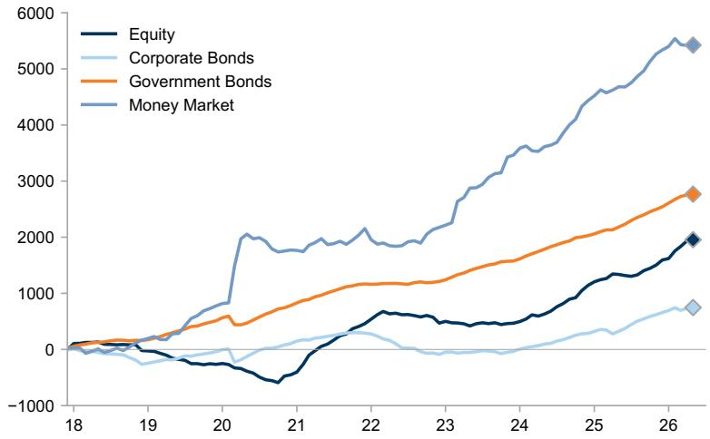

line

| Year | Equity | Corporate Bonds | Government Bonds | Money Market |
|------|--------|-----------------|------------------|--------------|
| 26   | 2000   | 700             | 2800             | 5500         |

Source: Datastream, Haver Analytics, EPFR, GS Global Investment Research

Exhibit 35: Average percentile of sentiment indicators   
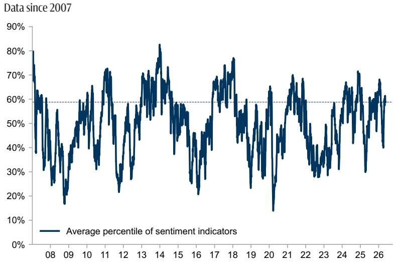

line

| Year | Average percentile of sentiment indicators |
| ---- | ------------------------------------------ |
| 08   | ~60%                                       |
| 09   | ~25%                                       |
| 10   | ~55%                                       |
| 11   | ~70%                                       |
| 12   | ~25%                                       |
| 13   | ~55%                                       |
| 14   | ~80%                                       |
| 15   | ~55%                                       |
| 16   | ~25%                                       |
| 17   | ~60%                                       |
| 18   | ~75%                                       |
| 19   | ~55%                                       |
| 20   | ~15%                                       |
| 21   | ~60%                                       |
| 22   | ~40%                                       |
| 23   | ~30%                                       |
| 24   | ~65%                                       |
| 25   | ~70%                                       |
| 26   | ~60%                                       |

Source: Datastream, Haver Analytics, EPFR, GS Global Investment Research

Exhibit 37: Risky vs. safe assets fund flows   
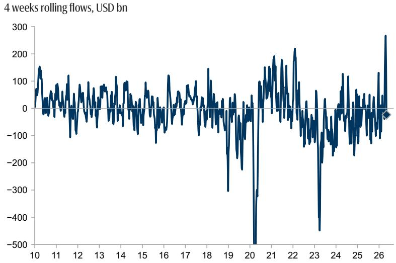

line

| Week | Value (USD bn) |
|------|----------------|
| 10   | ~150           |
| 11   | ~50            |
| 12   | ~100           |
| 13   | ~70            |
| 14   | ~90            |
| 15   | ~60            |
| 16   | ~80            |
| 17   | ~100           |
| 18   | ~150           |
| 19   | ~-300          |
| 20   | ~-500          |
| 21   | ~150           |
| 22   | ~200           |
| 23   | ~-400          |
| 24   | ~-100          |
| 25   | ~-50           |
| 26   | ~250           |

Source: Datastream, Haver Analytics, EPFR, GS Global Investment Research

# Cross-asset: Global Funds Flows

Exhibit 38: YTD cross-asset global fund flows   
All funds reporting monthly. MTD sum of weekly flows when monthly not yet available (\$bn)   
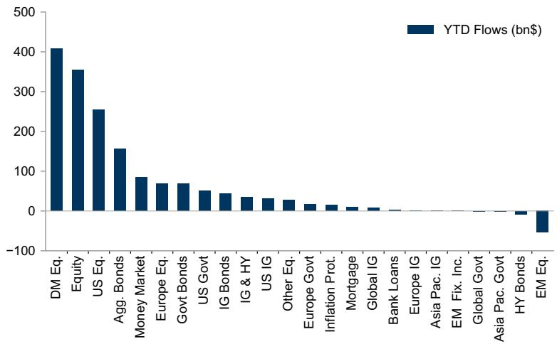

bar

| Entity | YTD Flows (bn$) |
| :--- | :--- |
| DM Eq. | 410 |
| Equity | 355 |
| US Eq. | 255 |
| Agg. Bonds | 155 |
| Money Market | 85 |
| Europe Eq. | 70 |
| Govt Bonds | 68 |
| US Govt | 50 |
| IG Bonds | 45 |
| IG & HY | 35 |
| US IG | 30 |
| Other Eq. | 28 |
| Europe Govt | 18 |
| Inflation Prot. | 15 |
| Mortgage | 10 |
| Global IG | 8 |
| Bank Loans | 3 |
| Europe IG | 2 |
| Asia Pac. IG | 1 |
| EM Fix. Inc. | 1 |
| Global Govt | 1 |
| Asia Pac. Govt | -2 |
| HY Bonds | -5 |
| EM Eq. | -60 |

Source: EPFR, GS Global Investment Research

Exhibit 39: YTD cross-asset global fund flows   
All funds reporting monthly. MTD sum of weekly flows when monthly not yet available (% of AUM)   
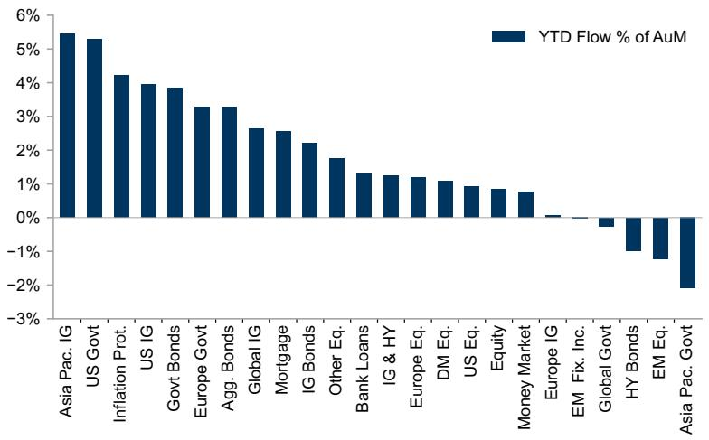

bar

| Category | YTD Flow % of AuM (%) |
| :--- | :--- |
| Asia Pac. IG | 5.5 |
| US Govt | 5.3 |
| Inflation Prot. | 4.2 |
| US IG | 4.0 |
| Govt Bonds | 3.9 |
| Europe Govt | 3.3 |
| Agg. Bonds | 3.3 |
| Global IG | 2.7 |
| Mortgage | 2.6 |
| IG Bonds | 2.2 |
| Other Eq. | 1.8 |
| Bank Loans | 1.3 |
| IG & HY | 1.2 |
| Europe Eq. | 1.2 |
| DM Eq. | 1.1 |
| US Eq. | 1.0 |
| Equity | 0.9 |
| Money Market | 0.8 |
| Europe IG | 0.1 |
| EM Fix. Inc. | -0.1 |
| Global Govt | -0.3 |
| HY Bonds | -1.1 |
| EM Eq. | -1.3 |
| Asia Pac. Govt | -2.2 |

Source: EPFR, GS Global Investment Research

Exhibit 40: 1-week cross-asset global fund flows   
All funds reporting weekly   
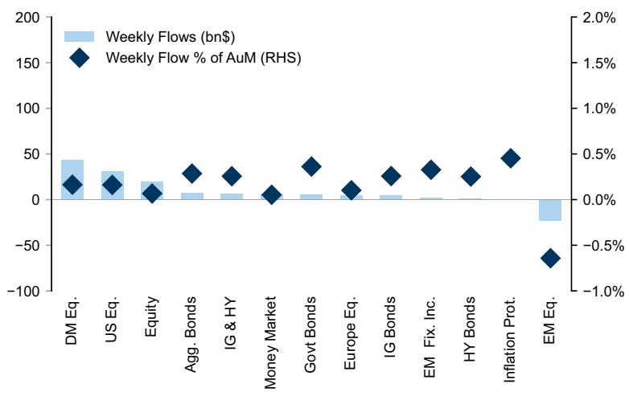

bar_line

| Category       | Weekly Flows (bn$) | Weekly Flow % of AuM (RHS) |
| -------------- | ------------------ | -------------------------- |
| DM Eq.         | 40                 | 0.2                        |
| US Eq.         | 30                 | 0.1                        |
| Equity         | 15                 | -0.1                       |
| Agg. Bonds     | 5                  | 0.3                        |
| IG & HY        | 5                  | 0.2                        |
| Money Market   | 0                  | -0.1                       |
| Govt Bonds     | 5                  | 0.4                        |
| Europe Eq.     | 0                  | -0.1                       |
| IG Bonds       | 5                  | 0.2                        |
| EM Fix. Inc.   | 0                  | 0.3                        |
| HY Bonds       | 0                  | 0.2                        |
| Inflation Prot.| 0                  | 0.5                        |
| EM Eq.         | -70                | -0.6                       |

Source: EPFR, GS Global Investment Research

Exhibit 41: 4-week cross-asset global fund flows   
All funds reporting weekly   
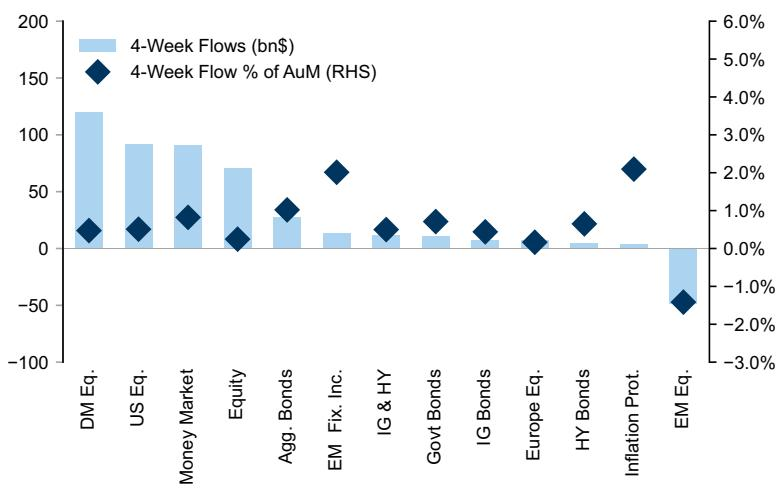

bar_line

| Category         | 4-Week Flows (bn$) | 4-Week Flow % of AuM (RHS) |
| ---------------- | ------------------ | -------------------------- |
| DM Eq.           | 120                | 0.5%                       |
| US Eq.           | 90                 | 0.5%                       |
| Money Market     | 90                 | 0.5%                       |
| Equity           | 70                 | 0.5%                       |
| Agg. Bonds       | 30                 | 1.0%                       |
| EM Fix. Inc.     | 10                 | 2.0%                       |
| IG & HY          | 10                 | 1.0%                       |
| Govt Bonds       | 10                 | 1.0%                       |
| IG Bonds         | 10                 | 1.0%                       |
| Europe Eq.       | 5                  | -0.5%                      |
| HY Bonds         | 5                  | -0.5%                      |
| Inflation Prot.  | 5                  | -0.5%                      |
| EM Eq.           | -50                | -2.0%                      |

Source: EPFR, GS Global Investment Research

# Cross-asset: CFTC positioning

Exhibit 42: Equity net long positioning   
Leveraged funds and asset managers net future positions (\$ bn)   
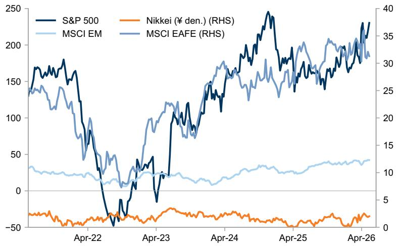

line

| Date   | S&P 500 | Nikkei (¥ den.) (RHS) | MSCI EM | MSCI EAFE (RHS) |
|--------|---------|------------------------|---------|-----------------|
| Apr-22 | ~170    | ~-30                   | ~30     | ~15             |
| Apr-23 | ~-50    | ~-20                   | ~20     | ~20             |
| Apr-24 | ~180    | ~-10                   | ~30     | ~30             |
| Apr-25 | ~240    | ~-10                   | ~35     | ~35             |
| Apr-26 | ~230    | ~-10                   | ~40     | ~35             |

Source: Bloomberg, CFTC, GS Global Investment Research

Exhibit 43: Currency net long positioning   
Net non-commercial positions (\$ bn)   
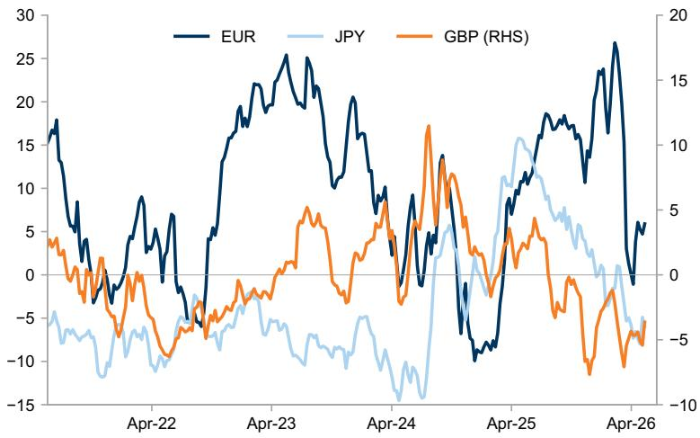

line

| Date   | EUR  | JPY  | GBP (RHS) |
|--------|------|------|-----------|
| Apr-22 | 18.0 | -5.0 | 4.0       |
| Apr-23 | 25.0 | -7.0 | 7.0       |
| Apr-24 | 10.0 | -15.0| 17.0      |
| Apr-25 | 18.0 | 15.0 | 5.0       |
| Apr-26 | 5.0  | -5.0 | -5.0      |

Source: Bloomberg, CFTC, GS Global Investment Research

Exhibit 44: Commodity net long positioning   
Net non-commercial positions (\$ bn)   
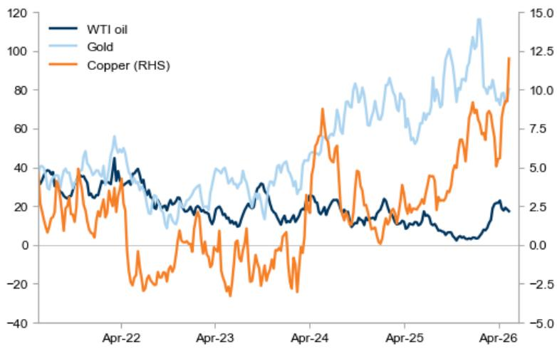

line

| Date   | WTI oil | Gold | Copper (RHS) |
|--------|---------|------|--------------|
| Apr-22 | ~35     | ~50  | ~30          |
| Apr-23 | ~20     | ~30  | ~-25         |
| Apr-24 | ~15     | ~70  | ~70          |
| Apr-25 | ~10     | ~90  | ~40          |
| Apr-26 | ~20     | ~80  | ~10          |

Source: Bloomberg, CFTC, GS Global Investment Research

Exhibit 45: US Treasury net long positioning   
Net non-commercial positions (\$ bn)   
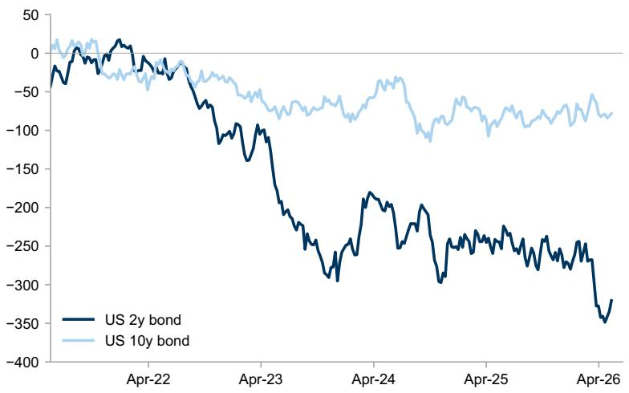

line

| Date   | US 2y bond | US 10y bond |
|--------|------------|-------------|
| Apr-22 | ~0         | ~0          |
| Apr-23 | ~-100      | ~-50        |
| Apr-24 | ~-250      | ~-75        |
| Apr-25 | ~-275      | ~-87.5      |
| Apr-26 | ~-350      | ~-93.75     |

Source: Bloomberg, CFTC, GS Global Investment Research

Cross-asset: Correlations: Equity vol/CDS, commodity prices/credit & FX, equity/bond, equity/FX

Exhibit 46: 3m rolling equity vol/CDS correlation of weekly level changes   
CDX HY for the US, iTraxx Xover for Europe; ATM implied vol for S&P 500 and Euro Stoxx 50   
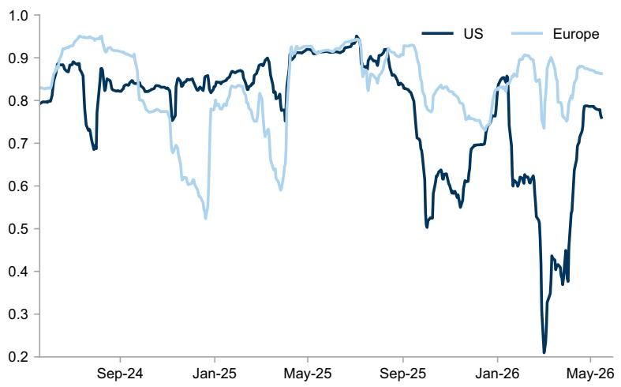

line

| Date   | US    | Europe |
|--------|-------|--------|
| Sep-24 | 0.85  | 0.90   |
| Jan-25 | 0.75  | 0.55   |
| May-25 | 0.90  | 0.95   |
| Sep-25 | 0.80  | 0.85   |
| Jan-26 | 0.60  | 0.75   |
| May-26 | 0.75  | 0.85   |

Source: Datastream, GS, GS Global Investment Research

Exhibit 47: 3m rolling commodity price correlations of weekly % changes with different assets   
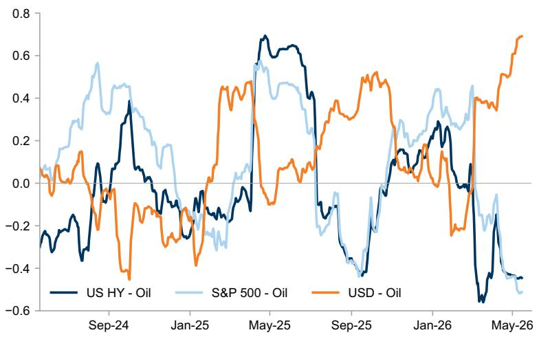

line

| Date   | US HY - Oil | S&P 500 - Oil | USD - Oil |
|--------|-------------|---------------|---------|
| Sep-24 | -0.3        | 0.5           | 0.1     |
| Jan-25 | -0.2        | -0.3          | -0.4    |
| May-25 | 0.7         | 0.6           | 0.5     |
| Sep-25 | -0.4        | -0.3          | 0.4     |
| Jan-26 | 0.3         | 0.4           | 0.2     |
| May-26 | -0.6        | -0.5          | 0.7     |

Source: Datastream, GS, GS Global Investment Research

Exhibit 48: 3m rolling equity/bond correlation of weekly returns   
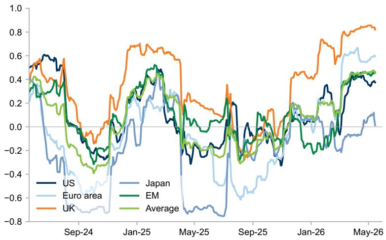

line

| Date   | US    | Euro area | Japan | EM    | UK    | Average |
|--------|-------|-----------|-------|-------|-------|---------|
| Sep-24 | 0.6   | -0.8      | -0.4  | 0.3   | 0.5   | 0.4     |
| Jan-25 | 0.4   | 0.2       | 0.1   | 0.5   | 0.7   | 0.6     |
| May-25 | -0.2  | -0.8      | -0.8  | -0.2  | -0.1  | -0.1    |
| Sep-25 | 0.2   | -0.6      | -0.2  | 0.1   | 0.3   | 0.2     |
| Jan-26 | 0.4   | 0.6       | 0.2   | 0.4   | 0.8   | 0.7     |
| May-26 | 0.6   | 0.8       | 0.4   | 0.6   | 0.9   | 0.8     |

Source: Datastream, GS Global Investment Research

Exhibit 49: 3m rolling equity/FX correlation of weekly returns   
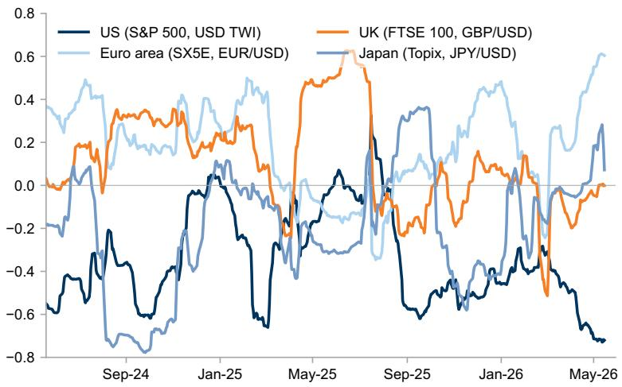

line

| Date   | US (S&P 500, USD TWI) | UK (FTSE 100, GBP/USD) | Euro area (SX5E, EUR/USD) | Japan (Topix, JPY/USD) |
|--------|------------------------|------------------------|----------------------------|------------------------|
| Sep-24 | -0.6                   | 0.0                    | -0.8                       | -0.2                   |
| Jan-25 | -0.4                   | 0.3                    | 0.4                        | 0.1                    |
| May-25 | -0.2                   | 0.6                    | 0.2                        | -0.1                   |
| Sep-25 | -0.6                   | -0.2                   | 0.4                        | 0.3                    |
| Jan-26 | -0.4                   | 0.1                    | 0.5                        | 0.2                    |
| May-26 | -0.7                   | 0.0                    | 0.6                        | 0.3                    |

Source: Datastream, GS Global Investment Research

# Cross-asset: Correlation matrix

# Exhibit 50: Cross-asset correlation matrix

Upper half of matrix: current 1-year correlation (black shading = more/less than 0.50/-0.50); lower half of matrix: percentile since 2001 (dark grey shading indicates above 75th percentile, orange shading indicates below 25th percentile); correlations are calculated on weekly, local currency returns.

<table><tr><td rowspan="2" colspan="2"></td><td>S&amp;P 500</td><td>STOXX 600</td><td>MXAPJ</td><td>TOPIX</td><td>MSCI EM</td><td>US 10 yr</td><td>Germany 10 yr</td><td>Japan 10 yr</td><td>UK 10 yr</td><td>EUR/USD</td><td>USD/JPY</td><td>AUD/USD</td><td>iBoxx US IG</td><td>iBoxx EUR IG</td><td>BAML US HY</td><td>BAML EUR HY</td><td>EM Credit ($)</td><td>WTI Crude Oil</td><td>Copper</td><td>Gold</td><td>VIX</td></tr><tr><td colspan="21">Current 1y correlation of weekly returns</td></tr><tr><td>S&amp;P 500</td><td rowspan="21">Current correlation&#x27;s percentile since 2001</td><td></td><td>0.67</td><td>0.58</td><td>0.35</td><td>0.60</td><td>0.16</td><td>0.18</td><td>0.24</td><td>0.36</td><td>0.37</td><td>-0.15</td><td>0.51</td><td>0.42</td><td>0.53</td><td>0.82</td><td>0.76</td><td>0.64</td><td>-0.31</td><td>0.53</td><td>0.17</td><td>-0.78</td></tr><tr><td>STOXX 600</td><td>0.13</td><td></td><td>0.55</td><td>0.50</td><td>0.58</td><td>0.24</td><td>0.32</td><td>0.08</td><td>0.50</td><td>0.32</td><td>-0.13</td><td>0.41</td><td>0.36</td><td>0.56</td><td>0.59</td><td>0.62</td><td>0.59</td><td>-0.46</td><td>0.65</td><td>0.32</td><td>-0.69</td></tr><tr><td>MXAPJ</td><td>0.40</td><td>0.21</td><td></td><td>0.51</td><td>0.99</td><td>0.19</td><td>0.26</td><td>0.22</td><td>0.38</td><td>0.52</td><td>-0.36</td><td>0.60</td><td>0.31</td><td>0.50</td><td>0.43</td><td>0.60</td><td>0.58</td><td>-0.53</td><td>0.56</td><td>0.24</td><td>-0.44</td></tr><tr><td>TOPIX</td><td>0.03</td><td>0.16</td><td>0.25</td><td></td><td>0.53</td><td>0.32</td><td>0.30</td><td>0.01</td><td>0.43</td><td>0.27</td><td>-0.03</td><td>0.21</td><td>0.34</td><td>0.40</td><td>0.27</td><td>0.47</td><td>0.51</td><td>-0.54</td><td>0.24</td><td>0.08</td><td>-0.39</td></tr><tr><td>MSCI EM</td><td>0.34</td><td>0.20</td><td>0.94</td><td>0.34</td><td></td><td>0.22</td><td>0.29</td><td>0.23</td><td>0.42</td><td>0.55</td><td>-0.36</td><td>0.61</td><td>0.34</td><td>0.54</td><td>0.47</td><td>0.63</td><td>0.62</td><td>-0.58</td><td>0.59</td><td>0.28</td><td>-0.47</td></tr><tr><td>US 10 yr</td><td>0.89</td><td>0.95</td><td>0.87</td><td>0.98</td><td>0.90</td><td></td><td>0.74</td><td>0.45</td><td>0.78</td><td>0.17</td><td>-0.19</td><td>0.02</td><td>0.88</td><td>0.66</td><td>0.43</td><td>0.27</td><td>0.63</td><td>-0.40</td><td>0.21</td><td>0.33</td><td>-0.06</td></tr><tr><td>Germany 10 yr</td><td>0.90</td><td>0.98</td><td>0.97</td><td>1.00</td><td>0.97</td><td>0.28</td><td></td><td>0.51</td><td>0.78</td><td>0.12</td><td>-0.19</td><td>0.04</td><td>0.67</td><td>0.84</td><td>0.31</td><td>0.31</td><td>0.48</td><td>-0.36</td><td>0.23</td><td>0.43</td><td>-0.08</td></tr><tr><td>Japan 10 yr</td><td>0.98</td><td>0.92</td><td>0.97</td><td>0.83</td><td>0.97</td><td>0.25</td><td>0.53</td><td></td><td>0.47</td><td>0.08</td><td>0.00</td><td>0.10</td><td>0.43</td><td>0.41</td><td>0.31</td><td>0.23</td><td>0.42</td><td>-0.10</td><td>0.01</td><td>0.24</td><td>-0.10</td></tr><tr><td>UK 10 yr</td><td>0.95</td><td>1.00</td><td>0.98</td><td>0.99</td><td>0.99</td><td>0.50</td><td>0.14</td><td>0.41</td><td></td><td>0.19</td><td>-0.18</td><td>0.13</td><td>0.74</td><td>0.78</td><td>0.51</td><td>0.52</td><td>0.69</td><td>-0.42</td><td>0.47</td><td>0.43</td><td>-0.25</td></tr><tr><td>EUR/USD</td><td>0.67</td><td>0.77</td><td>0.87</td><td>0.80</td><td>0.88</td><td>0.59</td><td>0.77</td><td>0.60</td><td>0.76</td><td></td><td>-0.67</td><td>0.73</td><td>0.29</td><td>0.32</td><td>0.41</td><td>0.38</td><td>0.41</td><td>-0.45</td><td>0.28</td><td>0.34</td><td>-0.39</td></tr><tr><td>USD/JPY</td><td>0.15</td><td>0.07</td><td>0.17</td><td>0.14</td><td>0.17</td><td>0.86</td><td>0.77</td><td>0.84</td><td>0.83</td><td>0.06</td><td></td><td>-0.57</td><td>-0.24</td><td>-0.27</td><td>-0.25</td><td>-0.18</td><td>-0.30</td><td>0.21</td><td>-0.17</td><td>-0.29</td><td>0.05</td></tr><tr><td>AUD/USD</td><td>0.56</td><td>0.57</td><td>0.42</td><td>0.31</td><td>0.49</td><td>0.60</td><td>0.70</td><td>0.81</td><td>0.77</td><td>0.89</td><td>0.06</td><td></td><td>0.12</td><td>0.32</td><td>0.45</td><td>0.47</td><td>0.46</td><td>-0.29</td><td>0.39</td><td>0.41</td><td>-0.48</td></tr><tr><td>iBoxx US IG</td><td>0.87</td><td>0.87</td><td>0.76</td><td>0.94</td><td>0.82</td><td>0.53</td><td>0.47</td><td>0.62</td><td>0.70</td><td>0.68</td><td>0.76</td><td>0.54</td><td></td><td>0.73</td><td>0.67</td><td>0.49</td><td>0.72</td><td>-0.37</td><td>0.28</td><td>0.31</td><td>-0.25</td></tr><tr><td>iBoxx EUR IG</td><td>0.93</td><td>0.98</td><td>0.93</td><td>0.99</td><td>0.95</td><td>0.67</td><td>0.62</td><td>0.69</td><td>0.78</td><td>0.87</td><td>0.39</td><td>0.83</td><td>0.60</td><td></td><td>0.62</td><td>0.68</td><td>0.76</td><td>-0.51</td><td>0.46</td><td>0.50</td><td>-0.29</td></tr><tr><td>BAML US HY</td><td>0.94</td><td>0.46</td><td>0.11</td><td>0.20</td><td>0.14</td><td>0.85</td><td>0.79</td><td>0.90</td><td>0.96</td><td>0.78</td><td>0.25</td><td>0.54</td><td>0.84</td><td>0.84</td><td></td><td>0.73</td><td>0.74</td><td>-0.31</td><td>0.45</td><td>0.23</td><td>-0.66</td></tr><tr><td>BAML EUR HY</td><td>0.94</td><td>0.47</td><td>0.57</td><td>0.38</td><td>0.69</td><td>0.88</td><td>0.89</td><td>0.91</td><td>0.96</td><td>0.87</td><td>0.23</td><td>0.71</td><td>0.79</td><td>0.85</td><td>0.24</td><td></td><td>0.70</td><td>-0.44</td><td>0.53</td><td>0.31</td><td>-0.53</td></tr><tr><td>EM Credit ($)</td><td>0.85</td><td>0.78</td><td>0.58</td><td>0.89</td><td>0.60</td><td>0.80</td><td>0.85</td><td>0.87</td><td>0.94</td><td>0.68</td><td>0.27</td><td>0.51</td><td>0.70</td><td>0.89</td><td>0.79</td><td>0.79</td><td></td><td>-0.54</td><td>0.49</td><td>0.40</td><td>-0.44</td></tr><tr><td>WTI Crude Oil</td><td>0.03</td><td>0.00</td><td>0.00</td><td>0.00</td><td>0.00</td><td>0.14</td><td>0.17</td><td>0.45</td><td>0.08</td><td>0.00</td><td>0.76</td><td>0.00</td><td>0.04</td><td>0.00</td><td>0.00</td><td>0.00</td><td>0.00</td><td></td><td>-0.36</td><td>-0.18</td><td>0.36</td></tr><tr><td>Copper</td><td>0.74</td><td>0.97</td><td>0.75</td><td>0.42</td><td>0.76</td><td>0.98</td><td>0.98</td><td>0.80</td><td>1.00</td><td>0.37</td><td>0.22</td><td>0.24</td><td>0.94</td><td>0.96</td><td>0.81</td><td>0.92</td><td>0.88</td><td>0.00</td><td></td><td>0.45</td><td>-0.38</td></tr><tr><td>Gold</td><td>0.73</td><td>0.90</td><td>0.43</td><td>0.72</td><td>0.48</td><td>0.69</td><td>0.88</td><td>0.72</td><td>0.91</td><td>0.29</td><td>0.60</td><td>0.48</td><td>0.71</td><td>0.96</td><td>0.62</td><td>0.92</td><td>0.75</td><td>0.01</td><td>0.81</td><td></td><td>0.02</td></tr><tr><td>VIX</td><td>0.71</td><td>0.60</td><td>0.71</td><td>0.88</td><td>0.71</td><td>0.08</td><td>0.06</td><td>0.05</td><td>0.04</td><td>0.08</td><td>0.86</td><td>0.29</td><td>0.15</td><td>0.07</td><td>0.17</td><td>0.20</td><td>0.30</td><td>0.99</td><td>0.34</td><td>0.51</td><td></td></tr><tr><td colspan="2"></td><td colspan="21">Current correlation&#x27;s percentile since 2001</td></tr></table>

Source: Datastream, iBoxx, GS Global Investment Research

# Cross-asset: Implied and realised vol, call and put skew

Exhibit 51: Cross-asset volatility, current and historical percentiles, implied 3m and realised 1m 

<table><tr><td rowspan="2"></td><td colspan="6">Equities</td><td colspan="4">Rates</td><td colspan="3">Credit</td><td colspan="3">Commodities</td><td colspan="3">Currencies</td></tr><tr><td>S&amp;P 500</td><td>EURO STOXX 50</td><td>Nikkei 225</td><td>FTSE 100</td><td>MSCI EM</td><td>MSCI EAFE</td><td>USD 2-year</td><td>USD 10-year</td><td>EUR 2-year</td><td>EUR 10-year</td><td>CDX IG</td><td>CDX HY</td><td>iTraxx Europe</td><td>WTI</td><td>Gold</td><td>Copper</td><td>EUR/ USD</td><td>JPY/ USD</td><td>GBP/ USD</td></tr><tr><td colspan="20">Implied (3-month ATM, %)</td></tr><tr><td>Current:</td><td>15.7</td><td>18.6</td><td>27.9</td><td>14.3</td><td>26.9</td><td>18.0</td><td>6.1</td><td>5.0</td><td>5.8</td><td>4.4</td><td>41.3</td><td>38.0</td><td>48.1</td><td>59.3</td><td>22.7</td><td>27.1</td><td>5.9</td><td>7.7</td><td>7.5</td></tr><tr><td>Percentile:</td><td>62%</td><td>72%</td><td>97%</td><td>65%</td><td>96%</td><td>79%</td><td>66%</td><td>54%</td><td>81%</td><td>70%</td><td>24%</td><td>43%</td><td>54%</td><td>96%</td><td>96%</td><td>82%</td><td>21%</td><td>36%</td><td>32%</td></tr><tr><td>1M change:</td><td>0.8</td><td>1.2</td><td>2.1</td><td>1.0</td><td>3.1</td><td>-0.1</td><td>1.2</td><td>0.6</td><td>0.4</td><td>0.4</td><td>1.6</td><td>0.8</td><td>1.4</td><td>3.9</td><td>-2.0</td><td>0.6</td><td>-0.3</td><td>-0.5</td><td>0.6</td></tr><tr><td>Average:</td><td>16.0</td><td>17.1</td><td>19.0</td><td>14.1</td><td>19.1</td><td>15.3</td><td>4.9</td><td>5.2</td><td>3.2</td><td>4.0</td><td>48.5</td><td>42.9</td><td>50.9</td><td>36.1</td><td>14.7</td><td>22.0</td><td>7.2</td><td>8.9</td><td>8.7</td></tr><tr><td>95th:</td><td>25.5</td><td>25.5</td><td>26.3</td><td>22.3</td><td>26.2</td><td>22.8</td><td>9.7</td><td>7.9</td><td>8.5</td><td>7.7</td><td>69.8</td><td>65.9</td><td>69.9</td><td>56.1</td><td>22.0</td><td>29.9</td><td>10.2</td><td>12.7</td><td>12.6</td></tr><tr><td>5th:</td><td>10.0</td><td>12.2</td><td>13.7</td><td>10.0</td><td>14.5</td><td>10.4</td><td>1.3</td><td>3.5</td><td>0.9</td><td>2.2</td><td>37.8</td><td>30.5</td><td>38.6</td><td>23.8</td><td>9.7</td><td>16.0</td><td>5.1</td><td>5.6</td><td>6.3</td></tr><tr><td colspan="20">Realised (%)</td></tr><tr><td>1-month:</td><td>11.6</td><td>20.7</td><td>26.9</td><td>15.8</td><td>21.9</td><td>14.3</td><td>5.1</td><td>4.0</td><td>4.9</td><td>4.0</td><td>22.3</td><td>22.9</td><td>32.3</td><td>73.4</td><td>22.7</td><td>20.7</td><td>4.3</td><td>10.7</td><td>6.5</td></tr><tr><td>Percentile:</td><td>43%</td><td>82%</td><td>88%</td><td>78%</td><td>90%</td><td>72%</td><td>63%</td><td>38%</td><td>82%</td><td>72%</td><td>9%</td><td>28%</td><td>41%</td><td>95%</td><td>92%</td><td>61%</td><td>7%</td><td>76%</td><td>23%</td></tr><tr><td>Average:</td><td>15.2</td><td>16.3</td><td>19.2</td><td>13.3</td><td>14.9</td><td>13.2</td><td>4.6</td><td>5.0</td><td>2.5</td><td>3.6</td><td>39.4</td><td>33.2</td><td>39.8</td><td>39.0</td><td>14.5</td><td>20.1</td><td>7.2</td><td>8.7</td><td>8.7</td></tr></table>

Source: GS FICC and Equities, GS Global Investment Research

Exhibit 52: 10y percentile for cross-asset average volatility   
Using 16 assets across equity, government bonds, credit, commodities and FX   
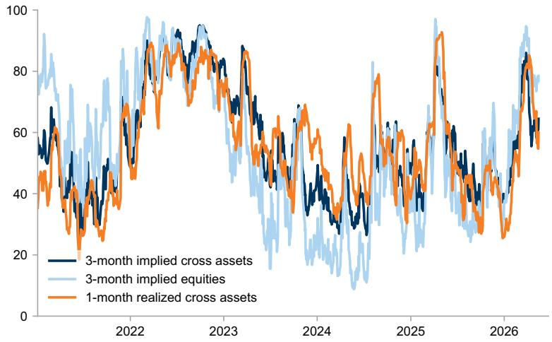

line

| Year | 3-month implied cross assets | 3-month implied equities | 1-month realized cross assets |
|------|------------------------------|--------------------------|-------------------------------|
| 2022 | ~50                          | ~70                      | ~60                           |
| 2023 | ~80                          | ~90                      | ~85                           |
| 2024 | ~30                          | ~40                      | ~50                           |
| 2025 | ~60                          | ~70                      | ~80                           |
| 2026 | ~85                          | ~95                      | ~85                           |

Source: GS FICC and Equities, GS Global Investment Research

Exhibit 53: Putwing and Callwing normalised skew 5y percentile   
Normalised skew = (impl. vol 25 delta put/call minus implied vol 50 delta call)/50 delta call   
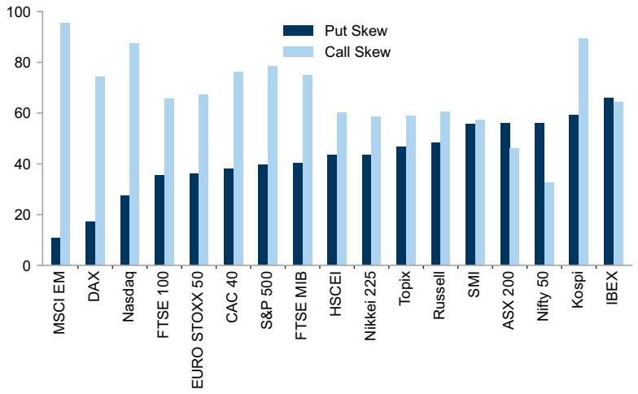

bar

| Index | Put Skew | Call Skew |
| :--- | :--- | :--- |
| MSCI EM | 11 | 96 |
| DAX | 17 | 74 |
| Nasdaq | 27 | 87 |
| FTSE 100 | 35 | 65 |
| EURO STOXX 50 | 36 | 67 |
| CAC 40 | 38 | 76 |
| S&P 500 | 40 | 78 |
| FTSE MIB | 40 | 74 |
| HSCEI | 43 | 60 |
| Nikkei 225 | 43 | 58 |
| Topix | 46 | 59 |
| Russell | 48 | 60 |
| SMI | 56 | 57 |
| ASX 200 | 56 | 46 |
| Nifty 50 | 56 | 32 |
| Kospi | 59 | 89 |
| IBEX | 65 | 64 |

Source: GS FICC and Equities, GS Global Investment Research

# Cross-asset: Volatility, skew, CDS with equity vol, rate vol

Exhibit 54: ATM implied volatility term structure for equity indices   
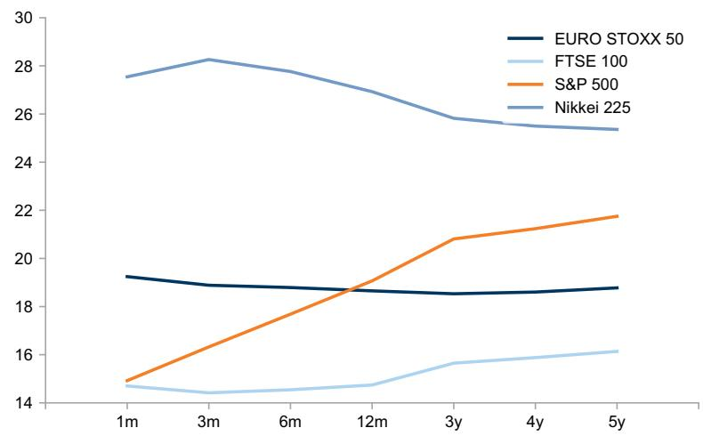

line

| Maturity | EURO STOXX 50 | FTSE 100 | S&P 500 | Nikkei 225 |
| -------- | ------------- | -------- | ------- | ---------- |
| 1m       | 19.2          | 14.8     | 14.8    | 27.6       |
| 3m       | 18.9          | 14.4     | 16.2    | 28.3       |
| 6m       | 18.8          | 14.6     | 17.8    | 27.9       |
| 12m      | 18.7          | 14.8     | 19.2    | 27.0       |
| 3y       | 18.6          | 15.6     | 20.8    | 25.9       |
| 4y       | 18.7          | 15.8     | 21.2    | 25.6       |
| 5y       | 18.8          | 16.0     | 21.8    | 25.4       |

Source: GS FICC and Equities, GS Global Investment Research

Exhibit 56: CDS and equity vol levels in the US   
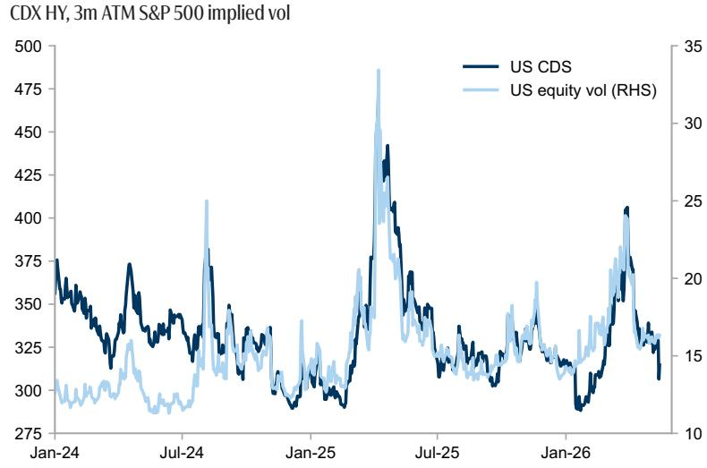

line

| Date   | US CDS | US equity vol (RHS) |
|--------|--------|----------------------|
| Jan-24 | 375    | 10                   |
| Jul-24 | 325    | 15                   |
| Jan-25 | 300    | 20                   |
| Jul-25 | 450    | 30                   |
| Jan-26 | 300    | 15                   |

Source: GS FICC and Equities, GS Global Investment Research

Exhibit 55: Normalised implied volatility skew across regions   
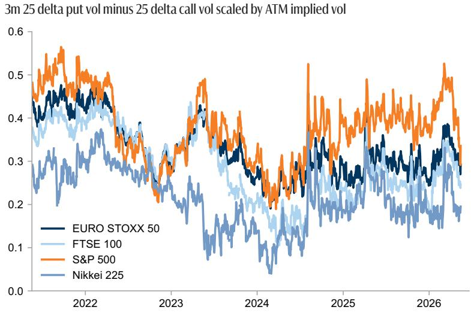

line

| Year | EURO STOXX 50 | FTSE 100 | S&P 500 | Nikkei 225 |
|------|---------------|----------|---------|------------|
| 2022 | ~0.45         | ~0.40    | ~0.55   | ~0.35      |
| 2023 | ~0.35         | ~0.30    | ~0.45   | ~0.25      |
| 2024 | ~0.25         | ~0.20    | ~0.30   | ~0.10      |
| 2025 | ~0.30         | ~0.25    | ~0.45   | ~0.15      |
| 2026 | ~0.35         | ~0.30    | ~0.50   | ~0.20      |

Source: GS FICC and Equities, GS Global Investment Research

Exhibit 57: 3m ATM implied rate volatility across regions   
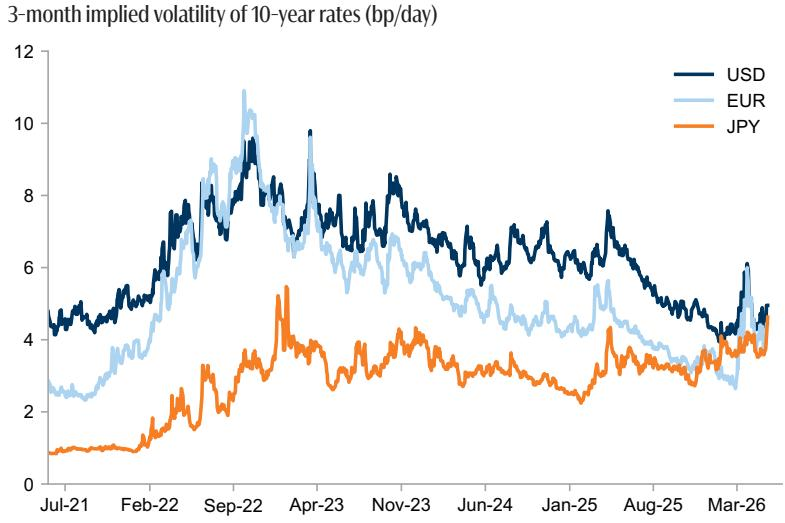

line

| Date   | USD  | EUR  | JPY  |
|--------|------|------|------|
| Jul-21 | 4.5  | 2.8  | 1.0  |
| Feb-22 | 7.0  | 4.5  | 1.5  |
| Sep-22 | 9.5  | 10.5 | 3.0  |
| Apr-23 | 8.0  | 6.5  | 5.0  |
| Nov-23 | 8.5  | 6.0  | 4.0  |
| Jun-24 | 7.0  | 5.0  | 3.5  |
| Jan-25 | 6.5  | 4.5  | 3.0  |
| Aug-25 | 5.0  | 3.5  | 2.5  |
| Mar-26 | 4.5  | 3.0  | 3.0  |

Source: GS FICC and Equities, GS Global Investment Research

# Cross-asset: Liquidity indicators

Exhibit 58: 1-year cross-currency basis   
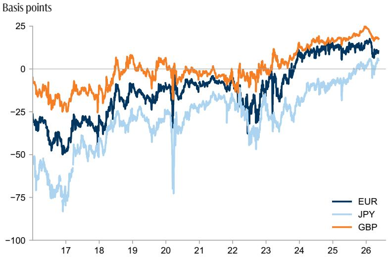

line

| Year | EUR  | JPY  | GBP  |
|------|------|------|------|
| 17   | -40  | -80  | -20  |
| 18   | -30  | -60  | -10  |
| 19   | -20  | -40  | 0    |
| 20   | -10  | -70  | 10   |
| 21   | -5   | -30  | 0    |
| 22   | 0    | -20  | 5    |
| 23   | 5    | -10  | 10   |
| 24   | 10   | 0    | 15   |
| 25   | 15   | 5    | 20   |
| 26   | 20   | 10   | 25   |

Source: GS FICC and Equities, GS Global Investment Research

Exhibit 59: Cash credit versus CDS spread   
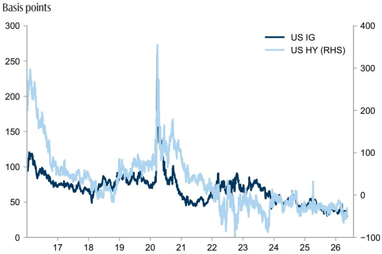

line

| Year | US IG | US HY (RHS) |
|------|-------|-------------|
| 17   | ~100  | ~150        |
| 18   | ~70   | ~90         |
| 19   | ~80   | ~100        |
| 20   | ~150  | ~270        |
| 21   | ~100  | ~160        |
| 22   | ~80   | ~100        |
| 23   | ~70   | ~50         |
| 24   | ~60   | ~30         |
| 25   | ~50   | ~10         |
| 26   | ~40   | ~-50        |

Source: GS FICC and Equities, Haver Analytics, GS Global Investment Research

Exhibit 60: Top-of-book depth   
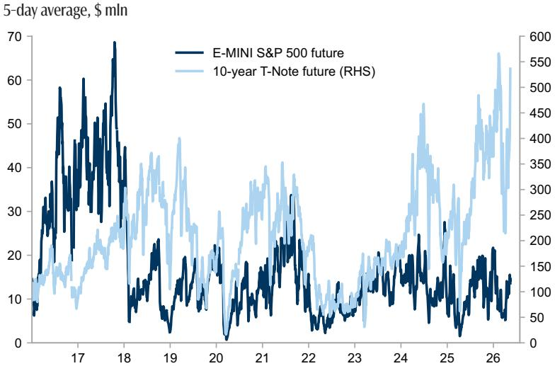

line

| Year | E-MINI S&P 500 future | 10-year T-Note future (RHS) |
|------|------------------------|-----------------------------|
| 17   | ~35                    | ~150                        |
| 18   | ~70                    | ~250                        |
| 19   | ~20                    | ~400                        |
| 20   | ~5                     | ~100                        |
| 21   | ~25                    | ~350                        |
| 22   | ~10                    | ~200                        |
| 23   | ~15                    | ~250                        |
| 24   | ~25                    | ~400                        |
| 25   | ~15                    | ~300                        |
| 26   | ~20                    | ~550                        |

E-MINI S&P 500 = 5d avg. # of contracts \* S&P 500 price \* \$50. 10-year T-note = 5d avg. # of contracts \* \$100,000

Exhibit 61: US financial institutions wholesale funding cost   
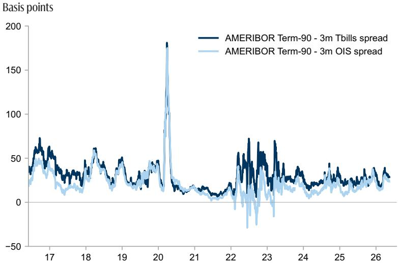

line

| Year | AMERIBOR Term-90 - 3m Tbills spread | AMERIBOR Term-90 - 3m OIS spread |
|------|-------------------------------------|-----------------------------------|
| 17   | ~40                                 | ~30                               |
| 18   | ~50                                 | ~40                               |
| 19   | ~40                                 | ~30                               |
| 20   | ~180                                | ~170                              |
| 21   | ~10                                 | ~5                                |
| 22   | ~50                                 | ~40                               |
| 23   | ~70                                 | ~60                               |
| 24   | ~40                                 | ~30                               |
| 25   | ~30                                 | ~20                               |
| 26   | ~20                                 | ~10                               |

Source: Bloomberg, GS Global Investment Research   
Source: Bloomberg, GS FICC and Equities, GS Global Investment Research

# Cross-asset: Market pricing of US recession risk

Exhibit 62: Market-implied US recession probability   
Average of univariate logit models on the right. Orange shade: NBER recession   
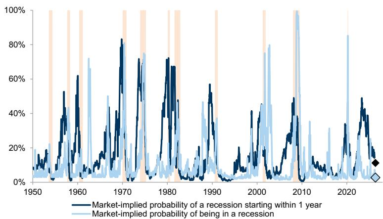

line

| Year | Market-implied probability of a recession starting within 1 year | Market-implied probability of being in a recession |
|------|------------------------------------------------------------------------|--------------------------------------------------|
| 1950 | ~10%                                                                   | ~10%                                             |
| 1960 | ~60%                                                                   | ~70%                                             |
| 1970 | ~80%                                                                   | ~75%                                             |
| 1980 | ~70%                                                                   | ~45%                                             |
| 1990 | ~55%                                                                   | ~45%                                             |
| 2000 | ~40%                                                                   | ~80%                                             |
| 2010 | ~35%                                                                   | ~95%                                             |
| 2020 | ~30%                                                                   | ~85%                                             |

Source: Haver Analytics, Datastream, Worldscope, GS Global Investment Research

Exhibit 64: Probability of a US recession in the next 1 year   
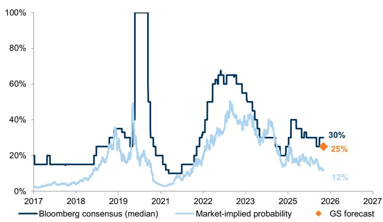

line

| Year | Bloomberg consensus (median) | Market-implied probability | GS forecast |
|------|-------------------------------|-----------------------------|-------------|
| 2026 | 30%                           | 12%                         | 25%         |

Source: Haver Analytics, Datastream, Worldscope, Bloomberg, GS Global Investment Research

Exhibit 63: Market-implied US recession probability by indicator   
Univariate logit models. Maximum history since 1950   
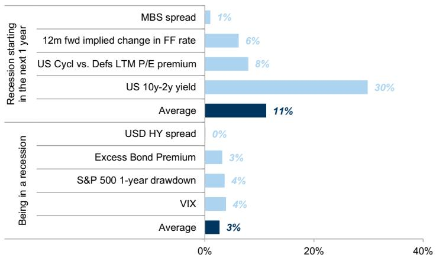

bar

| Recession starting in the next 1 year | Percentage (%) |
|---|---|
| MBS spread | 1 |
| 12m fwd implied change in FF rate | 6 |
| US Cycl vs. Defs LTM P/E premium | 8 |
| US 10y-2y yield | 30 |
| Average | 11 |
| USD HY spread | 0 |
| Excess Bond Premium | 3 |
| S&P 500 1-year drawdown | 4 |
| VIX | 4 |
| Average | 3 |

Source: Haver Analytics, Datastream, Worldscope, GS Global Investment Research

Exhibit 65: Market-implied path of the Fed Funds rate   
Based on 30-day Fed Funds futures   
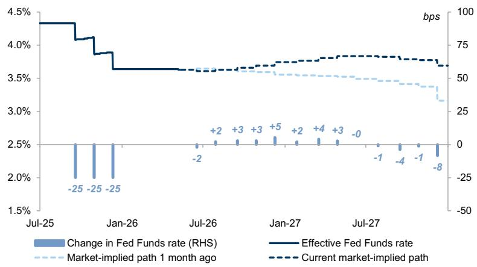

line

| Date    | Change in Fed Funds rate (RHS) | Effective Fed Funds rate | Market-implied path 1 month ago | Current market-implied path |
|---------|--------------------------------|--------------------------|----------------------------------|------------------------------|
| Jul-25  | -25                            | 4.5%                     | -                                | -                            |
| Jan-26  | -25                            | 3.6%                     | -                                | -                            |
| Jul-26  | -2                             | 3.6%                     | +2                               | -                            |
| Jan-27  | +5                             | 3.6%                     | +3                               | -                            |
| Jul-27  | -                              | 3.6%                     | +4                               | -                            |
|          | -                              | 3.6%                     | +3                               | -                            |
|          | -                              | 3.6%                     | -                                | -                            |
|          | -                              | 3.6%                     | -                                | -                            |
|          | -                              | 3.6%                     | -                                | -                            |
|          | -                              | 3.6%                     | -                                | -                            |
|          | -                              | 3.6%                     | -                                | -                            |
|          | -                              | 3.6%                     | -                                | -                            |
|
          | -                              | 3.6%                     | -                                | -                            |
|          | -                              | 3.6%                     | -                                | -                            |
|          | -                              | 3.6%                     | -                                | -                            |
|          | -                              | 3.6%                     | -                                | -                            |
|          | -                              | 3.6%                     | -                                | -                            |
|          | -                              = -8                    | 3.6%                     | -                                | -                            |
|          | -                              = -1                     | 3.6%                     | -                                | -                            |
|          | -                              = -4                     | 3.6%                     | -                                | -                            |
|          | -                              = -1                     | 3.6%                     | -                                | -                            |
|          | -                              = 0                      | 3.6%                     | -                                | -                            |
|          | -                              = +5                     | 3.6%                     | -                                | -                            |
|          | -                              = +4                     | 3.6%                     | -                                | -                            |
|          | -                              = +3                     | 3.6%                     | -                                | -                            |
|          | -                              = +2                     | 3.6%                     | -                                | -                            |
|          | -                              = +1                     | 3.6%                     | -                                | -                            |
|          | -                              = 0                      | 3.6%                     | -                                | -                            |
|          | -                              = +8                     | 3.6%                     | -                                | -                            |
|          | -                              = +9                     | 3.6%                     | -                                | -                            |
|          | -                              = +10                    | 3.6%                     | -                                | -                            |
|          | -                              = +11                    | 3.6%                     | -                                | -                            |
|          | -                              = +12                    | 3.6%                     | -                                | -                            |
|          | -                              = +13                    | 3.6%                     | -                                | -                            |
|          | -                              = +14                    | 3.6%                     | -                                | -                            |
|          | -                              = +15                    | 3.6%                     | -                                | -                            |
|          | -                              = +16                    | 3.6%                     | -                                | -                            |
|          | -                              = +17                    | 3.6%                     | -                                | -                            |
|          | -                              = +18                    | 3.6%                     | -                                | -                            |
|          | -                              = +19                    | 3.6%                     | -                                | -                            |
|          | -                              = +20                    | 3.6%                     | -                                | -                            |
|          | -                              = +21                    | 3.6%                     | -                                | -                            |
|          | -                              = +22                    | 3.6%                     | -                                | -                            |
|          | -                              = +23                    | 3.6%                     | -                                | -                            |
|          | -                              = +24                    | 3.6%                     | -                                | -                            |
|          | -                              = +25                    | 3.6%                     | -                                | -                            |
|          | -                              = +26                    | 3.6%                     | -                                | -                            |
|          | -                              = +27                    | 3.6%                     | -                                | -                            |
|          | -                              = +28                    | 3.6%                     | -                                | -                            |
|          | -                              = +29                    | 3.6%                     | -                                | -                            |
|          | -                              = +30                    | 3.6%                     | -                                | -                            |
|          | -                              = +31                    | 3.6%                     | -                                | -                            |
|          | -                              = +32                    | 3.6%                     | -                                | -                            |
|          | -                              = +33                    | 3.6%                     | -                                | -                            |
|          | -                              = +34                    | 3.6%                     | -                                | -                            |
|          | -                              = +35                    | 3.6%                     | -                                | -                            |
|          | -                              = +36                    | 3.6%                     | -                                | -                            |
|          | -                              = +37                    | 3.6%                     | -                                | -                            |
|          | -                              = +38                    | 3.6%                     | -                                | -                            |
|          | -                              = +39                    | 3.6%                     | -                                | -                            |
|          | -                              = +40                    | 3.6%                     | -                                | -                            |
|          | -                              = +41                    | 3.6%                     | -                                | -                            |
|          | -                              = +42                    | 3.6%                     | -                                | -                            |
|          | -                              = +43                    | 3.6%                     | -                                | -                            |
|          | -                              = +44                    | 3.6%                     | -                                | -                            |
|          | -                              = +45                    | 3.6%                     | -                                | -                            |
|          | -                              = +46                    | 3.6%                     | -                                | -                            |
|          | -                              = +47                    | 3.6%                     | -                                | -                            |
|          | -                              = +48                    | 3.6%                     | -                                | -                            |
|          | -                              = +49                    | 3.6%                     | -                                | -                            |
|          | -                              = +50                    | 3.6%                     | -                                | -                            |
|          (Note: The data for the rightmost bar is not explicitly provided in the code) is estimated based on the provided code and may not be extracted from the code itself in the original image.

Source: Haver Analytics, GS Global Investment Research

# Equity: Drawdown probability

Exhibit 66: Implied probability of S&P 500 drawdown based on multi-variate logit model   
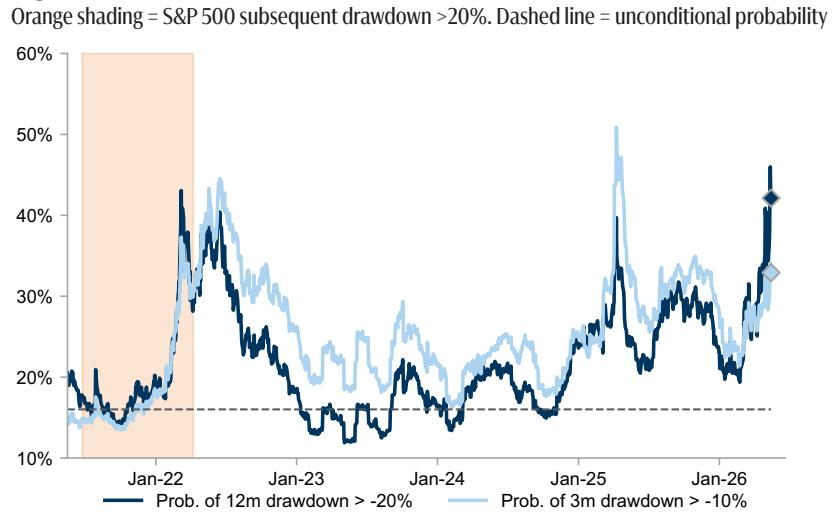

line

| Date   | Prob. of 12m drawdown > -20% | Prob. of 3m drawdown > -10% |
|--------|-------------------------------|------------------------------|
| Jan-22 | ~43%                          | ~45%                         |
| Jan-23 | ~15%                          | ~20%                         |
| Jan-24 | ~18%                          | ~25%                         |
| Jan-25 | ~30%                          | ~50%                         |
| Jan-26 | ~45%                          | ~35%                         |

Source: Haver Analytics, Datastream, GS Global Investment Research

Exhibit 67: Contribution to the probability of a drawdown >20% in 12m   
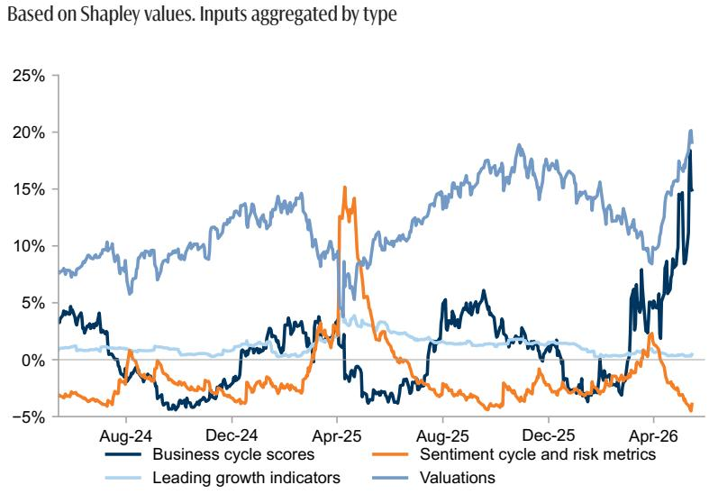

line

| Date    | Business cycle scores | Sentiment cycle and risk metrics | Leading growth indicators | Valuations |
|---------|------------------------|-----------------------------------|----------------------------|----------|
| Aug-24  | ~4%                    | ~-3%                              | ~1%                        | ~8%      |
| Dec-24  | ~2%                    | ~-2%                              | ~1%                        | ~10%     |
| Apr-25  | ~3%                    | ~15%                              | ~3%                        | ~14%     |
| Aug-25  | ~5%                    | ~-3%                              | ~2%                        | ~16%     |
| Dec-25  | ~2%                    | ~-2%                              | ~1%                        | ~18%     |
| Apr-26  | ~10%                   | ~-5%                              | ~0%                        | ~20%     |

Source: Haver Analytics, Datastream, GS Global Investment Research

Exhibit 68: Implied probability of S&P 500 rally based on multi-variate logit model   
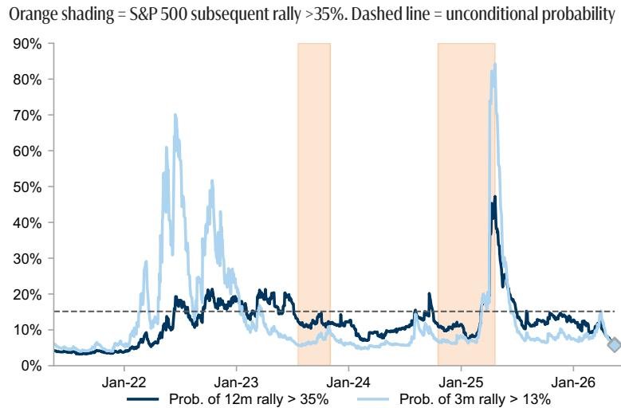

line

| Date   | Prob. of 12m rally > 35% | Prob. of 3m rally > 13% |
|--------|--------------------------|-------------------------|
| Jan-22 | ~5%                      | ~10%                    |
| Jan-23 | ~20%                     | ~50%                    |
| Jan-24 | ~10%                     | ~5%                     |
| Jan-25 | ~45%                     | ~85%                    |
| Jan-26 | ~10%                     | ~5%                     |

Source: Haver Analytics, Datastream, GS Global Investment Research

Exhibit 69: Contribution to the probability of a rally >35% in 12m   
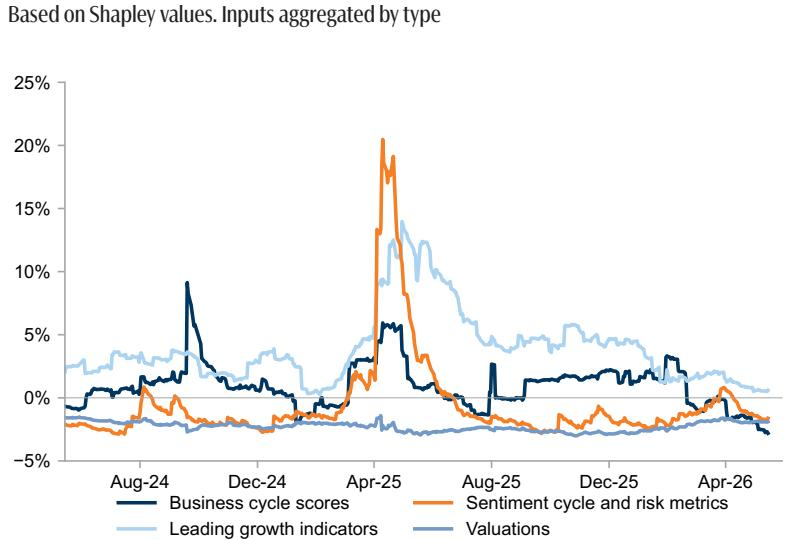

line

| Date    | Business cycle scores | Sentiment cycle and risk metrics | Leading growth indicators | Valuations |
|---------|------------------------|-----------------------------------|----------------------------|----------|
| Aug-24  | ~0%                    | ~0%                               | ~3%                        | ~-1%     |
| Dec-24  | ~1%                    | ~-1%                              | ~3%                        | ~-1%     |
| Apr-25  | ~6%                    | ~20%                              | ~14%                       | ~-1%     |
| Aug-25  | ~3%                    | ~-1%                              | ~5%                        | ~-1%     |
| Dec-25  | ~2%                    | ~-1%                              | ~4%                        | ~-1%     |
| Apr-26  | ~-3%                   | ~-1%                              | ~1%                        | ~-1%     |

Source: Haver Analytics, Datastream, GS Global Investment Research

# Equity: Valuation and styles

Exhibit 70: Valuation ranges of MSCI World styles indices   
12-month forward P/Es relative to the last 10 years   
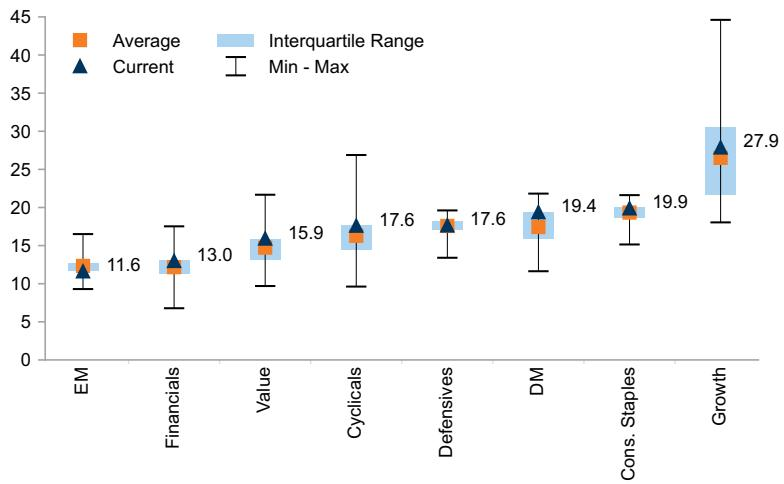

bar

| Category       | Average | Current | Interquartile Range | Min - Max |
| -------------- | ------- | ------- | ------------------- | --------- |
| EM             | 11.6    | 13.0    | 11.6 - 15.9         | 11.6 - 15.9 |
| Financials     | 13.0    | 15.9    | 13.0 - 17.6         | 13.0 - 17.6 |
| Value          | 15.9    | 17.6    | 15.9 - 19.4         | 15.9 - 21.4 |
| Cyclicals      | 17.6    | 17.6    | 17.6 - 21.4         | 17.6 - 21.4 |
| Defensives     | 17.6    | 17.6    | 17.6 - 21.4         | 17.6 - 21.4 |
| DM             | 19.4    | 19.4    | 19.4 - 21.4         | 19.4 - 21.4 |
| Cons. Staples  | 19.9    | 19.9    | 19.9 - 21.4         | 19.9 - 21.4 |
| Growth         | 27.9    | 27.9    | 27.9 - 30.0         | 27.9 - 45.0 |

Source: Datastream, I/B/E/S, GS Global Investment Research

Exhibit 72: Global market implied ERPs (%)   
Implied ERPs are calculated by each regional strategy team. While specific assumptions differ between regions, all are calculated using similar frameworks   
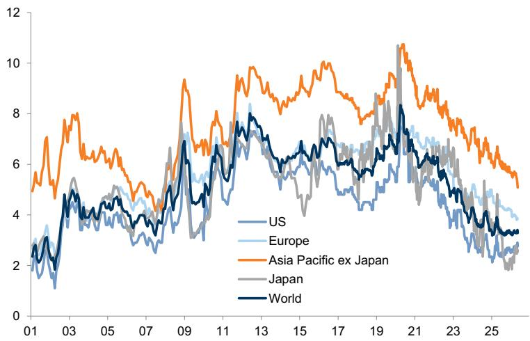

line

| Year | US  | Europe | Asia Pacific ex Japan | Japan | World |
|------|-----|--------|------------------------|-------|-------|
| 01   | 2.5 | 3.0    | 5.0                    | 4.0   | 2.0   |
| 03   | 3.0 | 3.5    | 6.0                    | 4.5   | 3.0   |
| 05   | 3.5 | 4.0    | 7.0                    | 5.0   | 3.5   |
| 07   | 4.0 | 4.5    | 8.0                    | 5.5   | 4.0   |
| 09   | 5.0 | 5.5    | 9.0                    | 6.0   | 4.5   |
| 11   | 6.0 | 6.5    | 10.0                   | 7.0   | 5.0   |
| 13   | 7.0 | 7.5    | 11.0                   | 8.0   | 6.0   |
| 15   | 6.5 | 7.0    | 10.5                   | 7.5   | 5.5   |
| 17   | 6.0 | 6.5    | 10.0                   | 7.0   | 5.0   |
| 19   | 5.5 | 6.0    | 9.5                    | 6.5   | 4.5   |
| 21   | 5.0 | 5.5    | 9.0                    | 6.0   | 4.0   |
| 23   | 4.5 | 5.0    | 8.5                    | 5.5   | 3.5   |
| 25   | 4.0 | 4.5    | 8.0                    | 5.0   | 3.0   |

Source: Datastream, GS Global Investment Research

Exhibit 71: MSCI World sector valuations   
12-month forward P/Es relative to the last 10 years   
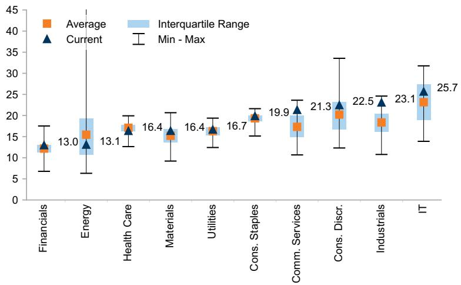

bar

| Category        | Average | Current | Min - Max |
| --------------- | ------- | ------- | --------- |
| Financials      | 12.0    | 13.0    | 7.0       |
| Energy          | 16.0    | 13.1    | 6.0       |
| Health Care     | 17.0    | 16.4    | 9.0       |
| Materials       | 15.0    | 16.4    | 8.0       |
| Utilities       | 16.0    | 16.7    | 12.0      |
| Cons. Staples   | 19.9    | 20.0    | 15.0      |
| Comm. Services  | 18.0    | 21.3    | 11.0      |
| Cons. Discr.    | 20.0    | 22.5    | 13.0      |
| Industrials     | 19.0    | 23.1    | 11.0      |
| IT              | 23.0    | 25.7    | 14.0      |

Source: Datastream, I/B/E/S, GS Global Investment Research

Exhibit 73: MSCI World style index performance   
Performance indexed to 100 12m ago   
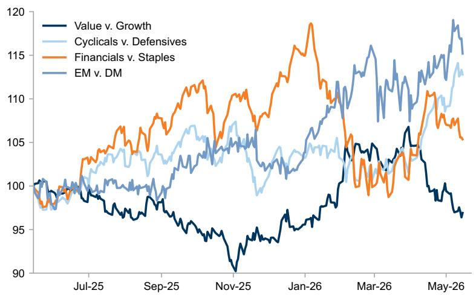

line

| Date   | Value v. Growth | Cyclicals v. Defensives | Financials v. Staples | EM v. DM |
|--------|-----------------|--------------------------|------------------------|----------|
| Jul-25 | ~100            | ~100                     | ~100                   | ~100     |
| Sep-25 | ~98             | ~103                     | ~107                   | ~104     |
| Nov-25 | ~90             | ~105                     | ~110                   | ~105     |
| Jan-26 | ~105            | ~107                     | ~118                   | ~108     |
| Mar-26 | ~104            | ~108                     | ~105                   | ~115     |
| May-26 | ~97             | ~113                     | ~106                   | ~118     |

Source: Datastream, GS Global Investment Research

# Equity: Earnings

Exhibit 74: 1-month revision to I/B/E/S consensus earnings   
MSCI World sectors, other global equity index aggregates   
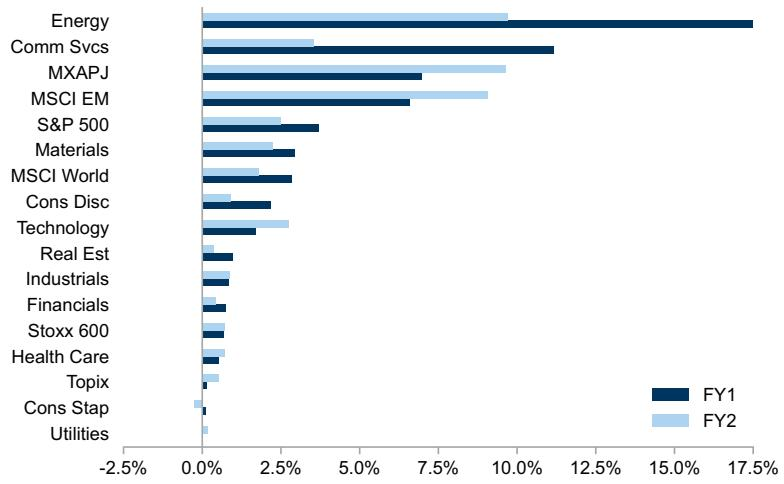

bar

| Sector | FY1 (%) | FY2 (%) |
| :--- | :--- | :--- |
| Energy | 17.5 | 9.8 |
| Comm Svcs | 11.0 | 3.5 |
| MXAPJ | 7.0 | 9.5 |
| MSCI EM | 6.5 | 9.0 |
| S&P 500 | 3.8 | 2.5 |
| Materials | 2.8 | 2.0 |
| MSCI World | 2.8 | 1.8 |
| Cons Disc | 2.5 | 1.0 |
| Technology | 1.8 | 2.8 |
| Real Est | 1.2 | 0.5 |
| Industrials | 1.0 | 0.0 |
| Financials | 1.0 | 0.5 |
| Stoxx 600 | 0.8 | 0.8 |
| Health Care | 0.8 | 0.8 |
| Topix | 0.4 | 0.5 |
| Cons Stap | 0.2 | 0.1 |
| Utilities | 0.1 | 0.2 |

Source: Datastream, I/B/E/S, GS Global Investment Research

Exhibit 75: 6-month revision to I/B/E/S consensus earnings   
MSCI World sectors, other global equity index aggregates   
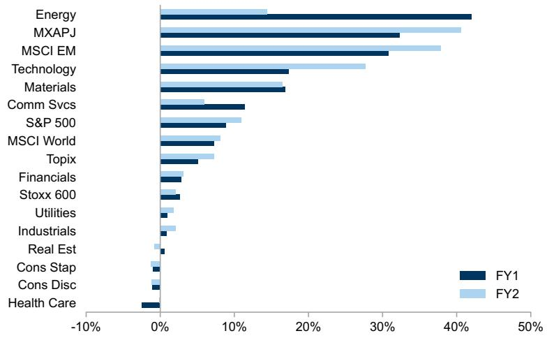

bar

| Sector | FY1 (%) | FY2 (%) |
| :--- | :--- | :--- |
| Energy | 42 | 14 |
| MXAPJ | 32 | 40 |
| MSCI EM | 30 | 38 |
| Technology | 17 | 28 |
| Materials | 16 | 15 |
| Comm Svcs | 11 | 6 |
| S&P 500 | 9 | 11 |
| MSCI World | 8 | 8 |
| Topix | 6 | 7 |
| Financials | 3 | 3 |
| Stoxx 600 | 2 | 2 |
| Utilities | 1 | 1 |
| Industrials | 1 | 2 |
| Real Est | 0.5 | 0.5 |
| Cons Stap | -0.5 | -0.5 |
| Cons Disc | -0.5 | -0.5 |
| Health Care | -1.5 | -0.5 |

Source: Datastream, I/B/E/S, GS Global Investment Research

Exhibit 76: Earnings sentiment: Analyst upgrades minus downgrades (scaled by total analysts) across markets   
1-month moving average of net monthly upgrades   
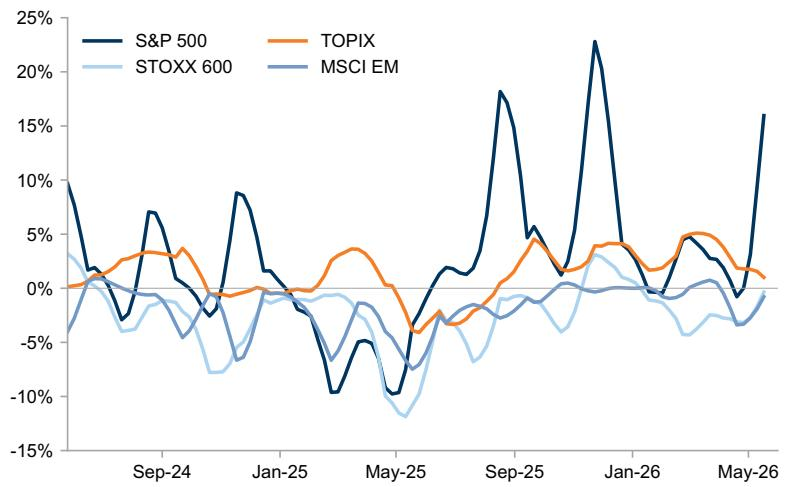

line

| Date   | S&P 500 | TOPIX | STOXX 600 | MSCI EM |
|--------|---------|-------|-----------|---------|
| Sep-24 | ~10%    | ~3%   | ~3%       | ~0%     |
| Jan-25 | ~9%     | ~4%   | ~-8%      | ~-5%    |
| May-25 | ~-10%   | ~-4%  | ~-12%     | ~-7%    |
| Sep-25 | ~18%    | ~5%   | ~-5%      | ~-3%    |
| Jan-26 | ~23%    | ~4%   | ~3%       | ~0%     |
| May-26 | ~16%    | ~1%   | ~-3%      | ~-2%    |

Source: Datastream, I/B/E/S, GS Global Investment Research

Exhibit 77: FY1 consensus earnings expectations over the past 12 months   
Earnings indexed to 100 12 months ago   
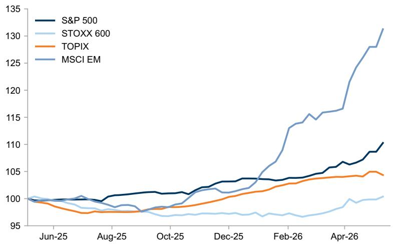

line

| Date   | S&P 500 | STOXX 600 | TOPIX | MSCI EM |
|--------|---------|-----------|-------|---------|
| Jun-25 | 100     | 100       | 100   | 100     |
| Aug-25 | 100     | 98        | 98    | 98      |
| Oct-25 | 102     | 97        | 98    | 98      |
| Dec-25 | 104     | 97        | 100   | 102     |
| Feb-26 | 104     | 97        | 103   | 115     |
| Apr-26 | 108     | 100       | 105   | 130     |

Source: Datastream, I/B/E/S, GS Global Investment Research

# Government bonds: Yield curves

Exhibit 78: US yield curve dynamics   
Current relative to 1 month and 3 months ago   
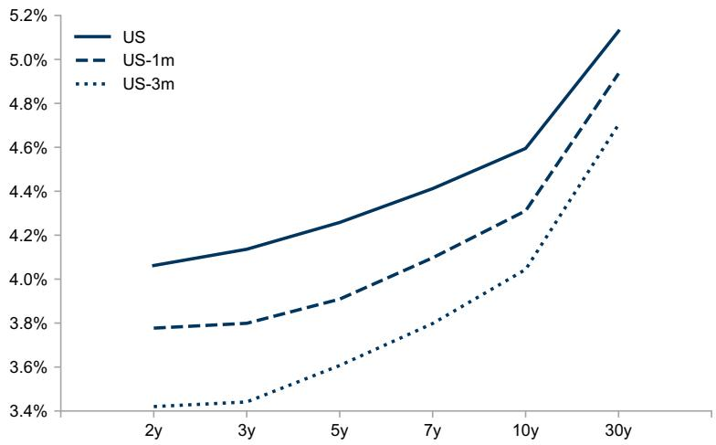

line

| Term | US    | US-1m | US-3m |
|------|-------|-------|-------|
| 2y   | 4.05% | 3.78% | 3.40% |
| 3y   | 4.10% | 3.79% | 3.42% |
| 5y   | 4.25% | 3.90% | 3.60% |
| 7y   | 4.40% | 4.05% | 3.80% |
| 10y  | 4.60% | 4.30% | 4.05% |
| 30y  | 5.15% | 4.95% | 4.70% |

Source: Datastream, GS Global Investment Research

Exhibit 79: German yield curve dynamics   
Current relative to 1 month and 3 months ago   
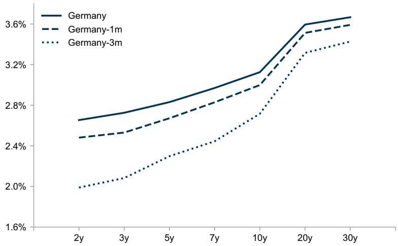

line

| Term | Germany | Germany-1m | Germany-3m |
| ---- | ------- | ---------- | ---------- |
| 2y   | 2.7%    | 2.5%       | 2.0%       |
| 3y   | 2.8%    | 2.6%       | 2.1%       |
| 5y   | 2.9%    | 2.7%       | 2.3%       |
| 7y   | 3.0%    | 2.8%       | 2.4%       |
| 10y  | 3.1%    | 2.9%       | 2.6%       |
| 20y  | 3.6%    | 3.5%       | 3.3%       |
| 30y  | 3.7%    | 3.6%       | 3.4%       |

Source: Datastream, GS Global Investment Research

Exhibit 80: Japan yield curve dynamics   
Current relative to 1 month and 3 months ago   
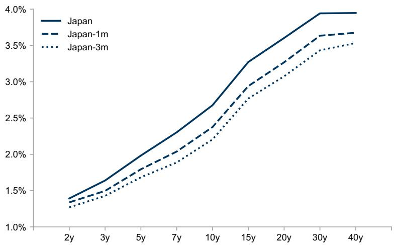

line

| Year | Japan  | Japan-1m | Japan-3m |
|------|--------|----------|----------|
| 2y   | 1.4%   | 1.35%    | 1.3%     |
| 3y   | 1.6%   | 1.5%     | 1.4%     |
| 5y   | 2.0%   | 1.8%     | 1.7%     |
| 7y   | 2.3%   | 2.0%     | 1.9%     |
| 10y  | 2.7%   | 2.4%     | 2.2%     |
| 15y  | 3.3%   | 2.9%     | 2.7%     |
| 20y  | 3.7%   | 3.3%     | 3.0%     |
| 30y  | 4.0%   | 3.6%     | 3.4%     |
| 40y  | 4.0%   | 3.7%     | 3.5%     |

Source: Datastream, GS Global Investment Research

Exhibit 81: Yield curve term slope across regions   
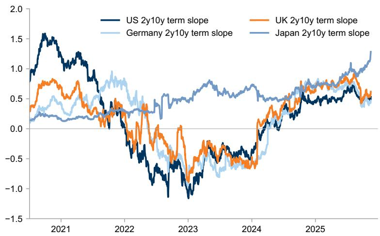

line

| Year | US 2y10y term slope | UK 2y10y term slope | Germany 2y10y term slope | Japan 2y10y term slope |
|------|---------------------|---------------------|--------------------------|------------------------|
| 2021 | ~1.6                | ~0.8                | ~0.5                     | ~0.3                   |
| 2022 | ~-0.5               | ~-0.3               | ~-0.7                    | ~-0.4                  |
| 2023 | ~-1.1               | ~-0.8               | ~-0.9                    | ~-0.6                  |
| 2024 | ~-0.3               | ~-0.5               | ~-0.6                    | ~-0.4                  |
| 2025 | ~0.5                | ~0.7                | ~0.6                     | ~0.8                   |
| 2026 | ~0.6                | ~0.8                | ~0.7                     | ~1.0                   |

Source: Datastream, GS Global Investment Research

# Government bonds: Real yields, inflation, breakevens, 10y IR differentials

Exhibit 82: 10y real yields across regions   
Nominal bond yield minus CPI inflation swap (RPI for the UK)   
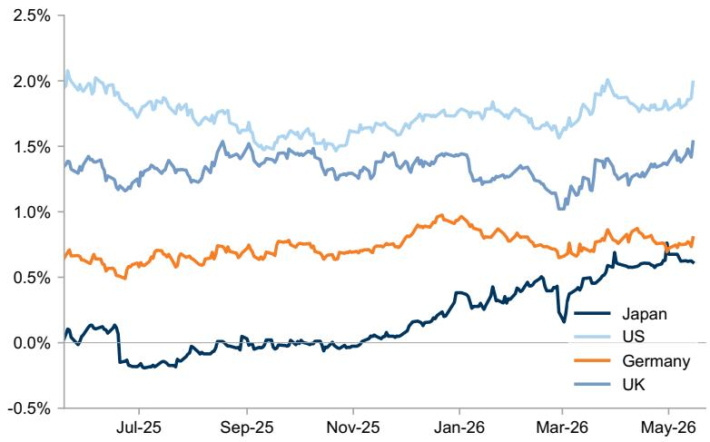

line

| Date   | Japan | US    | Germany | UK    |
|--------|-------|-------|---------|-------|
| Jul-25 | 0.0%  | 2.0%  | 0.7%    | 1.4%  |
| Sep-25 | 0.0%  | 1.8%  | 0.7%    | 1.4%  |
| Nov-25 | 0.0%  | 1.6%  | 0.7%    | 1.4%  |
| Jan-26 | 0.3%  | 1.8%  | 0.9%    | 1.4%  |
| Mar-26 | 0.6%  | 1.6%  | 0.8%    | 1.0%  |
| May-26 | 0.7%  | 2.0%  | 0.8%    | 1.5%  |

Source: GS, GS Global Investment Research

Exhibit 83: 10y inflation swaps across regions   
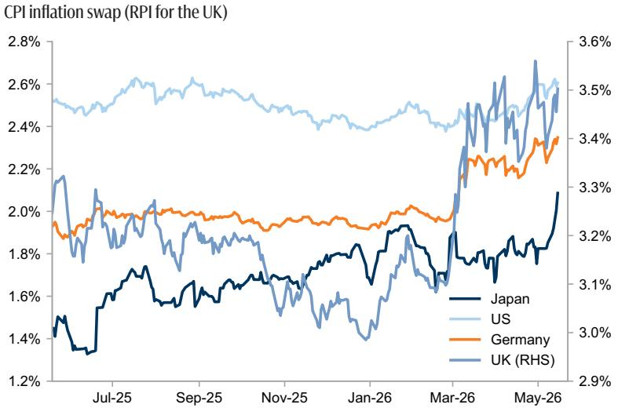

line

| Date   | Japan | US   | Germany | UK (RHS) |
|--------|-------|------|---------|----------|
| Jul-25 | 1.4%  | 2.5% | 1.9%    | 2.2%     |
| Sep-25 | 1.7%  | 2.6% | 2.0%    | 2.1%     |
| Nov-25 | 1.7%  | 2.5% | 1.9%    | 1.8%     |
| Jan-26 | 1.8%  | 2.4% | 1.9%    | 1.4%     |
| Mar-26 | 1.8%  | 2.4% | 2.0%    | 2.3%     |
| May-26 | 2.1%  | 2.6% | 3.4%    | 3.6%     |

Source: GS, GS Global Investment Research

Exhibit 84: US breakeven inflation   
Nominal yield minus TIPS yield   
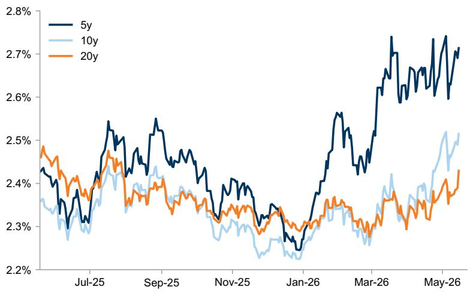

line

| Date   | 5y    | 10y   | 20y   |
|--------|-------|-------|-------|
| Jul-25 | 2.4%  | 2.3%  | 2.4%  |
| Sep-25 | 2.5%  | 2.4%  | 2.4%  |
| Nov-25 | 2.3%  | 2.3%  | 2.3%  |
| Jan-26 | 2.3%  | 2.2%  | 2.3%  |
| Mar-26 | 2.7%  | 2.4%  | 2.3%  |
| May-26 | 2.7%  | 2.5%  | 2.4%  |

Source: Bloomberg, GS Global Investment Research

Exhibit 85: 10y nominal bond yield differentials   
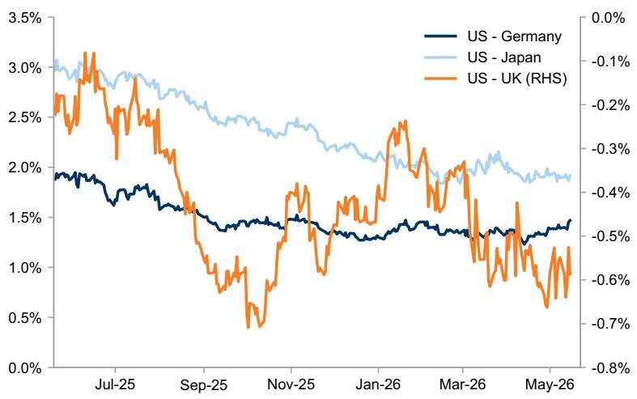

line

| Date   | US - Germany | US - Japan | US - UK (RHS) |
|--------|--------------|----------|---------------|
| Jul-25 | 1.9%         | 3.0%     | 2.7%          |
| Sep-25 | 1.6%         | 2.8%     | 1.8%          |
| Nov-25 | 1.4%         | 2.5%     | 0.5%          |
| Jan-26 | 1.3%         | 2.2%     | 2.5%          |
| Mar-26 | 1.4%         | 2.0%     | 1.8%          |
| May-26 | 1.5%         | 1.9%     | 1.2%          |

Source: Datastream, GS Global Investment Research

# Commodities: Curve shapes and roll yields

Exhibit 86: WTI and Brent oil forward curves   
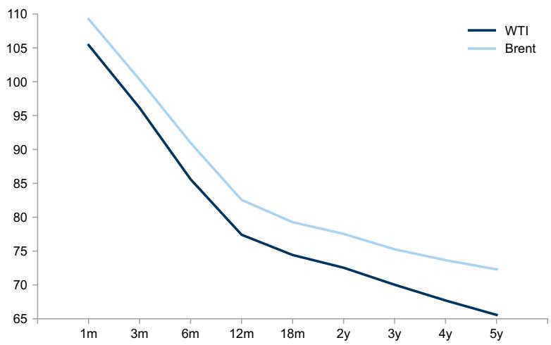

line

| Maturity | WTI  | Brent |
| -------- | ---- | ----- |
| 1m       | 106  | 109   |
| 3m       | 98   | 102   |
| 6m       | 86   | 94    |
| 12m      | 78   | 83    |
| 18m      | 75   | 80    |
| 2y       | 73   | 78    |
| 3y       | 71   | 76    |
| 4y       | 69   | 74    |
| 5y       | 66   | 72    |

Source: GS, GS Global Investment Research

Exhibit 88: S&P GSCI spot, roll and total returns   
Returns over the past 1 week, 3 months and 1 year   
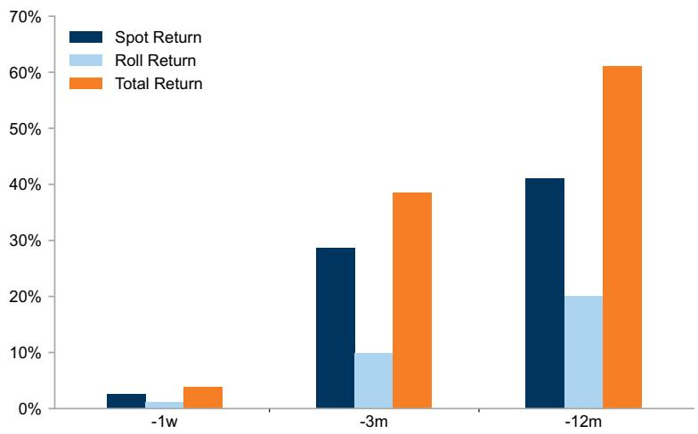

bar

| Period | Spot Return (%) | Roll Return (%) | Total Return (%) |
| :--- | :--- | :--- | :--- |
| -1w | 2.5 | 1.0 | 4.0 |
| -3m | 29.0 | 10.0 | 38.5 |
| -12m | 41.0 | 20.0 | 61.5 |

Source: Datastream, GS Global Investment Research

Exhibit 87: Gold price and US real yields   
US 10-year TIPs yield, Gold U\$/ounce   
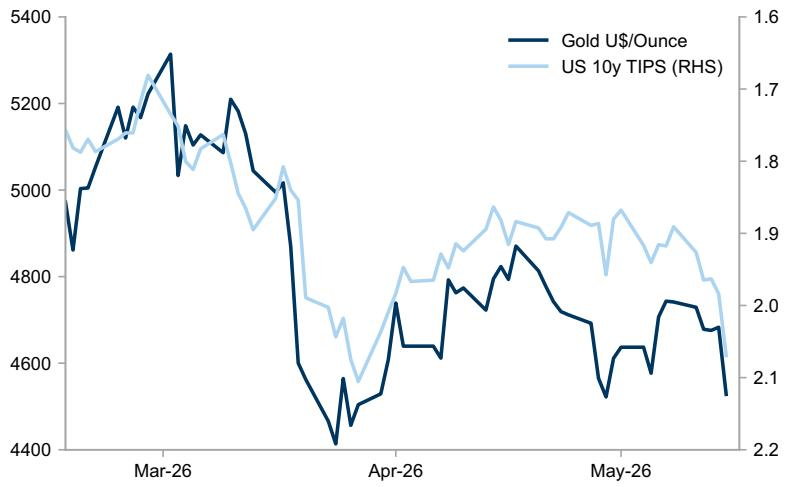

line

| Date   | Gold US$/Ounce | US 10y TIPS (RHS) |
|--------|----------------|-------------------|
| Mar-26 | ~$5300         | ~$1.7             |
| Apr-26 | ~$4400         | ~$2.0             |
| May-26 | ~$4700         | ~$1.9             |

Source: Datastream, GS Global Investment Research

Exhibit 89: Recent performance of S&P GSCI sectors   
Weight signifies contribution to the S&P GSCI index 

<table><tr><td rowspan="2"></td><td rowspan="2">Current Weight (%)</td><td colspan="3">Returns (%)</td></tr><tr><td>-1w</td><td>-1m</td><td>-1y</td></tr><tr><td>S&amp;P GSCI</td><td>100</td><td>3.8</td><td>9.6</td><td>61.1</td></tr><tr><td>Energy</td><td>56.8</td><td>7.7</td><td>18.5</td><td>106.2</td></tr><tr><td>Industrial Metals</td><td>12.0</td><td>0.7</td><td>1.3</td><td>41.6</td></tr><tr><td>Precious Metals</td><td>9.0</td><td>-3.6</td><td>-4.9</td><td>47.2</td></tr><tr><td>Agriculture</td><td>12.4</td><td>-1.5</td><td>1.6</td><td>-3.1</td></tr><tr><td>Livestock</td><td>9.8</td><td>0.8</td><td>-0.8</td><td>21.4</td></tr></table>

Source: GS, GS Global Investment Research

FX: Forecasts and forwards, recent performance and positioning

Exhibit 90: Our 3- and 12-month forecasts for dollar crosses   
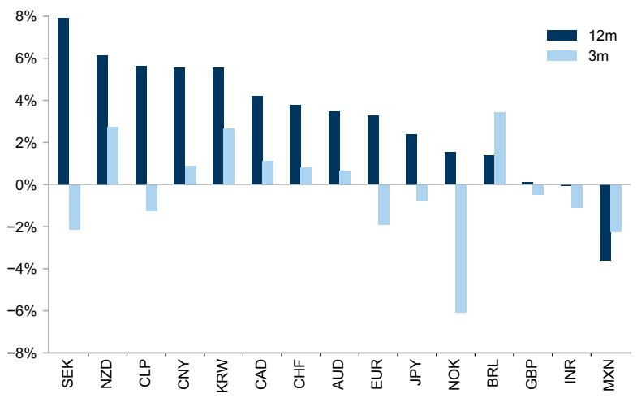

bar

| Currency | 12m    | 3m     |
|----------|--------|--------|
| SEK      | 8%     | -2%    |
| NZD      | 6%     | 2.5%   |
| CLP      | 5.5%   | -1%    |
| CNY      | 5.5%   | 0.5%   |
| KRW      | 5.5%   | 2.5%   |
| CAD      | 4%     | 1%     |
| CHF      | 3.5%   | 0.5%   |
| AUD      | 3.5%   | 0.5%   |
| EUR      | 3%     | -2%    |
| JPY      | 2.5%   | -1%    |
| NOK      | 1.5%   | -6%    |
| BRL      | 1.5%   | 3.5%   |
| GBP      | 0.5%   | -1%    |
| INR      | 0%     | -1%    |
| MXN      | -3.5%  | -2%    |

Source: Datastream, GS Global Investment Research

Exhibit 91: Recent performance of dollar crosses   
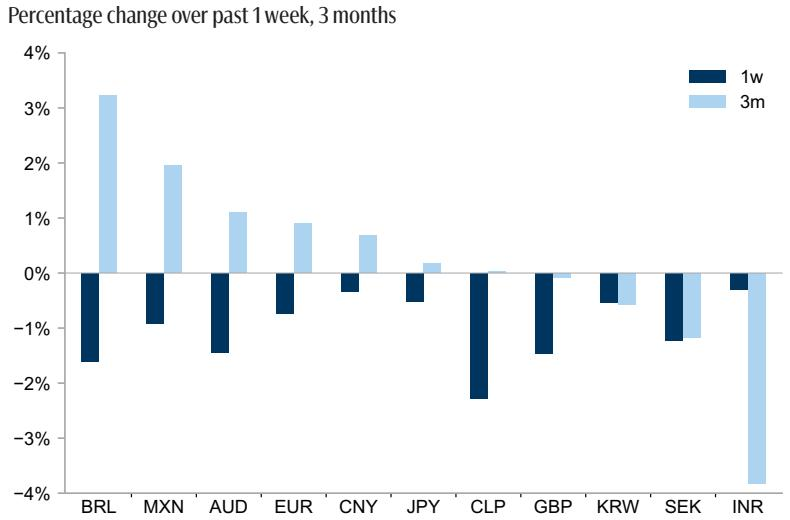

bar

Percentage change over past 1 week, 3 months
| Currency | 1w (%) | 3m (%) |
| :--- | :--- | :--- |
| BRL | -1.6 | 3.2 |
| MXN | -0.8 | 2.0 |
| AUD | -1.4 | 1.1 |
| EUR | -0.6 | 0.9 |
| CNY | -0.3 | 0.7 |
| JPY | -0.5 | 0.2 |
| CLP | -2.3 | 0.0 |
| GBP | -1.5 | 0.0 |
| KRW | -0.4 | -0.5 |
| SEK | -1.2 | -1.1 |
| INR | -0.3 | -3.7 |

Source: Datastream, GS Global Investment Research

Exhibit 92: EUR/USD against German - US 2y interest rate differentials past 3m   
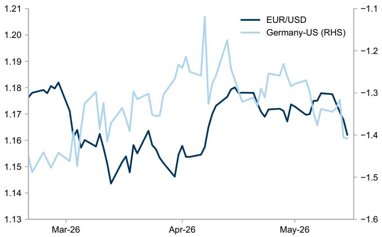

line

| Date   | EUR/USD | Germany-US (RHS) |
|--------|---------|------------------|
| Mar-26 | 1.18    | 1.15             |
| Apr-26 | 1.15    | 1.20             |
| May-26 | 1.17    | 1.14             |

Source: Datastream, GS Global Investment Research

Exhibit 93: USD/JPY against US - Japan 2y interest rate differentials past 3m   
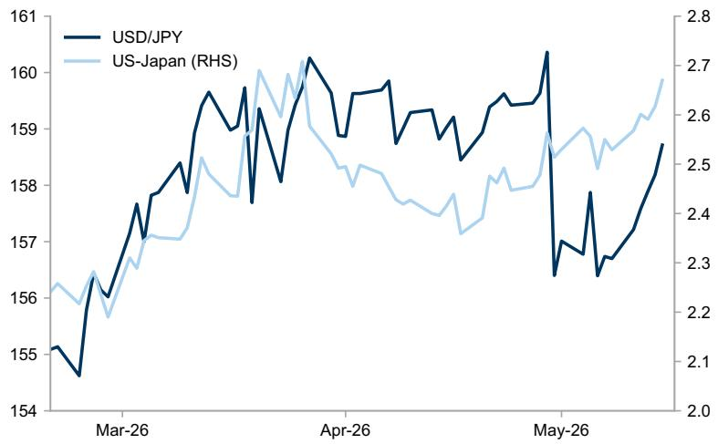

line

| Date   | USD/JPY | US-Japan (RHS) |
|--------|---------|----------------|
| Mar-26 | 155     | 2.3            |
| Apr-26 | 160     | 2.5            |
| May-26 | 157     | 2.7            |

Source: Datastream, GS Global Investment Research

# Disclosure Appendix

# Reg AC

We, Andrea Ferrario, Christian Mueller-Glissmann, CFA, Alessandro Giglio, Giovanni Ferrannini and Peter Oppenheimer, hereby certify that all of the views expressed in this report accurately reflect our personal views, which have not been influenced by considerations of the firm's business or client relationships.

Unless otherwise stated, the individuals listed on the cover page of this report are analysts in GS' Global Investment Research division.

Contributing Authors: Andrea Ferrario GS International, Christian Mueller-Glissmann, CFA GS International, Alessandro Giglio GS International, Giovanni Ferrannini GS International, Peter Oppenheimer GS International.

Unless otherwise stated, the individuals listed in the Contributing Authors disclosure of this report are analysts in GS' Global Investment Research division.

# Disclosures

# MSCI disclosure

All MSCI data used in this report is the exclusive property of MSCI, Inc. (MSCI). Without prior written permission of MSCI, this information and any other MSCI intellectual property may not be reproduced or redisseminated in any form and may not be used to create any financial instruments or products or any indices. This information is provided on an “as is” basis, and the user of this information assumes the entire risk of any use made of this information. Neither MSCI, any of its affiliates nor any third party involved in, or related to, computing or compiling the data makes any express or implied warranties or representations with respect to this information (or the results to be obtained by the use thereof), and MSCI, its affiliates and any such third party hereby expressly disclaim all warranties of originality, accuracy, completeness, merchantability or fitness for a particular purpose with respect to any of this information. Without limiting any of the foregoing, in no event shall MSCI, any of its affiliates or any third party involved in, or related to, computing or compiling the data have any liability for any direct, indirect, special, punitive, consequential or any other damages (including lost profits) even if notified of the possibility of such damages. MSCI and the MSCI indexes are service marks of MSCI and its affiliates. The Global Industry Classification Standard (GICS) were developed by and is the exclusive property of MSCI and Standard & Poor’s. GICS is a service mark of MSCI and S&P and has been licensed for use by The GS Group, Inc.

# Basket disclosure

The ability to trade the basket(s) discussed in this research will depend upon market conditions, including liquidity and borrow constraints at the time of trade.

# Option Specific Disclosures

Price target methodology: Please refer to the analyst's previously published research for methodology and risks associated with equity price targets.

Pricing Disclosure: Option prices and volatility levels in this note are indicative only, and are based on our estimates of recent mid-market levels (unless otherwise noted). All prices and levels exclude transaction costs unless otherwise stated.

General Options Risks – The risks below and any other options risks mentioned in this research report pertain both to specific derivative trade recommendations mentioned and to discussion of general opportunities and advantages of derivative strategies. Unless otherwise noted, options strategies mentioned in this report may be a combination of the strategies below and therefore carry with them the risks of those strategies.

Buying Options – Investors who buy call (put) options risk loss of the entire premium paid if the underlying security finishes below (above) the strike price at expiration. Investors who buy call or put spreads also risk a maximum loss of the premium paid. The maximum gain on a long call or put spread is the difference between the strike prices, less the premium paid.

Selling Options – Investors who sell calls on securities they do not own risk unlimited loss of the security price less the strike price. Investors who sell covered calls (sell calls while owning the underlying security) risk having to deliver the underlying security or pay the difference between the security price and the strike price, depending on whether the option is settled by physical delivery or cash-settled. Investors who sell puts risk loss of the strike price less the premium received for selling the put. Investors who sell put or call spreads risk a maximum loss of the difference between the strikes less the premium received, while their maximum gain is the premium received.

For options settled by physical delivery, the above risks assume the options buyer or seller, buys or sells the resulting securities at the settlement price on expiry.

# ETF Disclosure

# ETF Risks

Exchange Traded Funds (ETFs) are redeemable only in specified units and only through a broker that is an authorized participant in that ETF program; redemptions are for the underlying securities. The public trading price of a redeemable unit of an ETF may be different from its net asset value; an ETF can trade at a discount or premium to the net asset value. There is always a fundamental risk of declining stock prices, which can cause investment losses.

Investors should consider the investment objectives, risks, and charges and expenses of an ETF carefully before investing. Each ETF prospectus contains such information about the ETF, and it is recommended that investors review carefully such prospectus before investing. A copy of the prospectus for all ETFs mentioned in this material can be obtained by investors from their GS sales representative, or from the offices of Goldman, Sachs & Co., 200 West Street, New York, NY, 10282, Attn: Prospectus Dept. (1-212-902-1394). Prospectuses are also available from ETF

# distributors.

Professionals who authored this material have no financial interest in any ETF mentioned in this material.

GS is an authorized participant in HYG and TLT and participates in the creation and redemption of shares of those ETFs. GS, as an authorized participant or otherwise, acquires securities from the issuers of the ETFs mentioned in this material for the purposes of resale.

# Regulatory disclosures

# Disclosures required by United States laws and regulations

See company-specific regulatory disclosures above for any of the following disclosures required as to companies referred to in this report: manager or co-manager in a pending transaction; 1% or other ownership; compensation for certain services; types of client relationships; managed/co-managed public offerings in prior periods; directorships; for equity securities, market making and/or specialist role. GS trades or may trade as a principal in debt securities (or in related derivatives) of issuers discussed in this report.

The following are additional required disclosures: Ownership and material conflicts of interest: GS policy prohibits its analysts, professionals reporting to analysts and members of their households from owning securities of any company in the analyst's area of coverage. Analyst compensation: Analysts are paid in part based on the profitability of GS, which includes investment banking revenues. Analyst as officer or director: GS policy generally prohibits its analysts, persons reporting to analysts or members of their households from serving as an officer, director or advisor of any company in the analyst's area of coverage. Non-U.S. Analysts: Non-U.S. analysts may not be associated persons of GS & Co. LLC and therefore may not be subject to FINRA Rule 2241 or FINRA Rule 2242 restrictions on communications with a subject company, public appearances and trading in securities covered by the analysts.

# Additional disclosures required under the laws and regulations of jurisdictions other than the United States

The following disclosures are those required by the jurisdiction indicated, except to the extent already made above pursuant to United States laws and regulations. Australia: GS Australia Pty Ltd and its affiliates are not authorised deposit-taking institutions (as that term is defined in the Banking Act 1959 (Cth)) in Australia and do not provide banking services, nor carry on a banking business, in Australia. This research, and any access to it, is intended only for “wholesale clients” within the meaning of the Australian Corporations Act, unless otherwise agreed by GS. In producing research reports, members of Global Investment Research of GS Australia may attend site visits and other meetings hosted by the companies and other entities which are the subject of its research reports. In some instances the costs of such site visits or meetings may be met in part or in whole by the issuers concerned if GS Australia considers it is appropriate and reasonable in the specific circumstances relating to the site visit or meeting. To the extent that the contents of this document contains any financial product advice, it is general advice only and has been prepared by GS without taking into account a client’s objectives, financial situation or needs. A client should, before acting on any such advice, consider the appropriateness of the advice having regard to the client’s own objectives, financial situation and needs. A copy of certain GS Australia and New Zealand disclosure of interests and a copy of GS’ Australian Sell-Side Research Independence Policy Statement are available at: https://www.goldmansachs.com/disclosures/australia-new-zealand/index.html. Brazil: Disclosure information in relation to CVM Resolution n. 20 is available at https://www.gs.com/worldwide/brazil/area/gir/index.html. Where applicable, the Brazil-registered analyst primarily responsible for the content of this research report, as defined in Article 20 of CVM Resolution n. 20, is the first author named at the beginning of this report, unless indicated otherwise at the end of the text. Canada: This information is being provided to you for information purposes only and is not, and under no circumstances should be construed as, an advertisement, offering or solicitation by GS & Co. LLC for purchasers of securities in Canada to trade in any Canadian security. GS & Co. LLC is not registered as a dealer in any jurisdiction in Canada under applicable Canadian securities laws and generally is not permitted to trade in Canadian securities and may be prohibited from selling certain securities and products in certain jurisdictions in Canada. If you wish to trade in any Canadian securities or other products in Canada please contact GS Canada Inc., an affiliate of The GS Group Inc., or another registered Canadian dealer. Hong Kong: Further information on the securities of covered companies referred to in this research may be obtained on request from GS (Asia) L.L.C. India: Further information on the subject company or companies referred to in this research may be obtained from GS (India) Securities Private Limited, Research Analyst – SEBI Registration Number INH000001493, 10th Floor, Ascent-Worli, Sudam Kalu Ahire Marg, Worli, Mumbai-400 025, India, Corporate Identity Number U74140MH2006FTC160634, Phone +91 22 6616 9000, Fax +91 22 6616 9001. GS may beneficially own 1% or more of the securities (as such term is defined in clause 2 (h) the Indian Securities Contracts (Regulation) Act, 1956) of the subject company or companies referred to in this research report. Investment in securities market are subject to market risks. Read all the related documents carefully before investing. Registration granted by SEBI and certification from NISM in no way guarantee performance of the intermediary or provide any assurance of returns to investors. GS (India) Securities Private Limited compliance officer and investor grievance contact details can be found at:

https://www.goldmansachs.com/worldwide/india/documents/Grievance-Redressal-and-Escalation-Matrix.pdf, and a copy of the annual audit compliance report can be found at this link: https://publishing.gs.com/content/site/india-annual-compliance-report.html. Japan: See below. Korea: This research, and any access to it, is intended only for “professional investors” within the meaning of the Financial Services and Capital Markets Act, unless otherwise agreed by GS. Further information on the subject company or companies referred to in this research may be obtained from GS (Asia) L.L.C., Seoul Branch. New Zealand: GS New Zealand Limited and its affiliates are neither “registered banks” nor “deposit takers” (as defined in the Reserve Bank of New Zealand Act 1989) in New Zealand. This research, and any access to it, is intended for “wholesale clients” (as defined in the Financial Advisers Act 2008) unless otherwise agreed by GS. A copy of certain GS Australia and New Zealand disclosure of interests is available at: https://www.goldmansachs.com/disclosures/australia-new-zealand/index.html. Russia: Research reports distributed in the Russian Federation are not advertising as defined in the Russian legislation, but are information and analysis not having product promotion as their main purpose and do not provide appraisal within the meaning of the Russian legislation on appraisal activity. Research reports do not constitute a personalized investment recommendation as defined in Russian laws and regulations, are not addressed to a specific client, and are prepared without analyzing the financial circumstances, investment profiles or risk profiles of clients. GS assumes no responsibility for any investment decisions that may be taken by a client or any other person based on this research report. Singapore: GS (Singapore) Pte. (Company Number: 198602165W), which is regulated by the Monetary Authority of Singapore, accepts legal responsibility for this research, and should be contacted with respect to any matters arising from, or in connection with, this research. Taiwan: This material is for reference only and must not be reprinted without permission. Investors should carefully consider their own investment risk. Investment results are the responsibility of the individual investor. United Kingdom: Persons who would be categorized as retail clients in the United Kingdom, as such term is defined in the rules of the Financial Conduct Authority, should read this research in conjunction with prior GS on the covered companies referred to herein and should refer to the risk warnings that have been sent to them by GS International. A copy of these risks warnings, and a glossary of certain financial terms used in this report, are available from GS International on request.

European Union and United Kingdom: Disclosure information in relation to Article 6 (2) of the European Commission Delegated Regulation (EU) (2016/958) supplementing Regulation (EU) No 596/2014 of the European Parliament and of the Council (including as that Delegated Regulation is implemented into United Kingdom domestic law and regulation following the United Kingdom's departure from the European Union and the European Economic Area) with regard to regulatory technical standards for the technical arrangements for objective presentation of investment recommendations or other information recommending or suggesting an investment strategy and for disclosure of particular interests or indications of conflicts of interest is available at https://www.gs.com/disclosures/europeanpolicy.html which states the European Policy for Managing Conflicts of Interest in Connection with Investment Research.

Japan: GS Japan Co., Ltd. is a Financial Instrument Dealer registered with the Kanto Financial Bureau under registration number Kinsho 69, and a member of Japan Securities Dealers Association, Financial Futures Association of Japan Type II Financial Instruments Firms Association, and Investment Management Association of Japan. Sales and purchase of equities are subject to commission pre-determined with clients plus consumption tax. See company-specific disclosures as to any applicable disclosures required by Japanese stock exchanges, the Japanese Securities Dealers Association or the Japanese Securities Finance Company.

# Global product; distributing entities

GS Global Investment Research produces and distributes research products for clients of GS on a global basis. Analysts based in GS offices around the world produce research on industries and companies, and research on macroeconomics, currencies, commodities and portfolio strategy. This research is disseminated in Australia by GS Australia Pty Ltd (ABN 21 006 797 897); in Brazil by GS do Brasil Corretora de Títulos e Valores Mobiliários S.A.; Public Communication Channel GS Brazil: 0800 727 5764 and / or contatogoldmanbrasil@gs.com. Available Weekdays (except holidays), from 9am to 6pm. Canal de Comunicação com o Público GS Brasil: 0800 727 5764 e/ou contatogoldmanbrasil@gs.com. Horário de funcionamento: segunda-feira à sexta-feira (exceto feriados), das 9h às 18h; in Canada by GS & Co. LLC; in Hong Kong by GS (Asia) L.L.C.; in India by GS (India) Securities Private Ltd.; in Japan by GS Japan Co., Ltd.; in the Republic of Korea by GS (Asia) L.L.C., Seoul Branch; in New Zealand by GS New Zealand Limited; in Russia by OOO GS; in Singapore by GS (Singapore) Pte. (Company Number: 198602165W); and in the United States of America by GS & Co. LLC. GS International has approved this research in connection with its distribution in the United Kingdom.

GS International (“GSI”), authorised by the Prudential Regulation Authority (“PRA”) and regulated by the Financial Conduct Authority (“FCA”) and the PRA, has approved this research in connection with its distribution in the United Kingdom.

European Economic Area: GS Bank Europe SE (“GSBE”) is a credit institution incorporated in Germany and, within the Single Supervisory Mechanism, subject to direct prudential supervision by the European Central Bank and in other respects supervised by German Federal Financial Supervisory Authority (Bundesanstalt für Finanzdienstleistungsaufsicht, BaFin) and Deutsche Bundesbank and disseminates research within the European Economic Area.

# General disclosures

This research is for our clients only. Other than disclosures relating to GS, this research is based on current public information that we consider reliable, but we do not represent it is accurate or complete, and it should not be relied on as such. The information, opinions, estimates and forecasts contained herein are as of the date hereof and are subject to change without prior notification. We seek to update our research as appropriate, but various regulations may prevent us from doing so. Other than certain industry reports published on a periodic basis, the large majority of reports are published at irregular intervals as appropriate in the analyst's judgment.

GS conducts a global full-service, integrated investment banking, investment management, and brokerage business. We have investment banking and other business relationships with a substantial percentage of the companies covered by Global Investment Research. GS & Co. LLC, the United States broker dealer, is a member of SIPC (https://www.sipc.org).

Our salespeople, traders, and other professionals may provide oral or written market commentary or trading strategies to our clients and principal trading desks that reflect opinions that are contrary to the opinions expressed in this research. Our asset management area, principal trading desks and investing businesses may make investment decisions that are inconsistent with the recommendations or views expressed in this research.

We and our affiliates, officers, directors, and employees will from time to time have long or short positions in, act as principal in, and buy or sell, the securities or derivatives, if any, referred to in this research, unless otherwise prohibited by regulation or GS policy.

The views attributed to third party presenters at GS arranged conferences, including individuals from other parts of GS, do not necessarily reflect those of Global Investment Research and are not an official view of GS.

Any third party referenced herein, including any salespeople, traders and other professionals or members of their household, may have positions in the products mentioned that are inconsistent with the views expressed by analysts named in this report.

This research is focused on investment themes across markets, industries and sectors. It does not attempt to distinguish between the prospects or performance of, or provide analysis of, individual companies within any industry or sector we describe.

Any trading recommendation in this research relating to an equity or credit security or securities within an industry or sector is reflective of the investment theme being discussed and is not a recommendation of any such security in isolation.

This research is not an offer to sell or the solicitation of an offer to buy any security in any jurisdiction where such an offer or solicitation would be illegal. It does not constitute a personal recommendation or take into account the particular investment objectives, financial situations, or needs of individual clients. Clients should consider whether any advice or recommendation in this research is suitable for their particular circumstances and, if appropriate, seek professional advice, including tax advice. The price and value of investments referred to in this research and the income from them may fluctuate. Past performance is not a guide to future performance, future returns are not guaranteed, and a loss of original capital may occur. Fluctuations in exchange rates could have adverse effects on the value or price of, or income derived from, certain investments.

Certain transactions, including those involving futures, options, and other derivatives, give rise to substantial risk and are not suitable for all investors. Investors should review current options and futures disclosure documents which are available from GS sales representatives or at https://www.theocc.com/about/publications/character-risks.jsp and https://www.goldmansachs.com/disclosures/cftc\_fcm\_disclosures. Transaction costs may be significant in option strategies calling for multiple purchase and sales of options such as spreads. Supporting documentation will be supplied upon request.

Differing Levels of Service provided by Global Investment Research: The level and types of services provided to you by GS Global Investment Research may vary as compared to that provided to internal and other external clients of GS, depending on various factors including your individual preferences as to the frequency and manner of receiving communication, your risk profile and investment focus and perspective (e.g., marketwide, sector specific, long term, short term), the size and scope of your overall client relationship with GS, and legal and regulatory constraints. As an example, certain clients may request to receive notifications when research on specific securities is published, and certain clients may request that specific data underlying analysts' fundamental analysis available on our internal client websites be delivered to them electronically through data feeds or otherwise. No change to an analyst's fundamental research views (e.g., ratings, price targets, or material changes to earnings estimates for equity securities), will be communicated to any client prior to inclusion of such information in a research report broadly disseminated through electronic publication to our internal client websites or through other means, as necessary, to all clients who are entitled to receive such reports.

All research reports are disseminated and available to all clients simultaneously through electronic publication to our internal client websites. Not all research content is redistributed to our clients or available to third-party aggregators, nor is GS responsible for the redistribution of our research by third party aggregators. For research, models or other data related to one or more securities, markets or asset classes (including related services) that may be available to you, please contact your GS representative or go to https://research.gs.com.

Disclosure information is also available at https://www.gs.com/research/hedge.html or from Research Compliance, 200 West Street, New York, NY 10282.

# © 2026 GS.

You are permitted to store, display, analyze, modify, reformat, and print the information made available to you via this service only for your own use. You may not resell or reverse engineer this information to calculate or develop any index for disclosure and/or marketing or create any other derivative works or commercial product(s), data or offering(s) without the express written consent of GS. You are not permitted to publish, transmit, or otherwise reproduce this information, in whole or in part, in any format to any third party without the express written consent of GS. This foregoing restriction includes, without limitation, using, extracting, downloading or retrieving this information, in whole or in part, to train or finetune a machine learning or artificial intelligence system, or to provide or reproduce this information, in whole or in part, as a prompt or input to any such system.