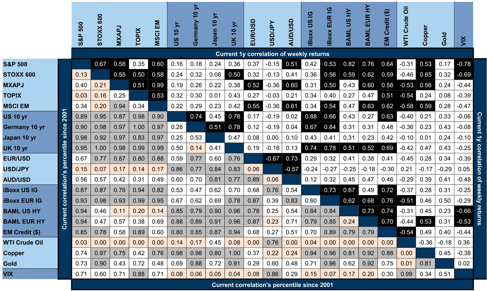
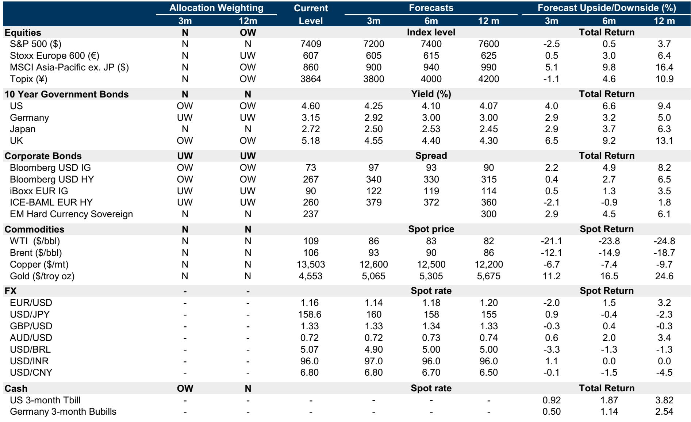
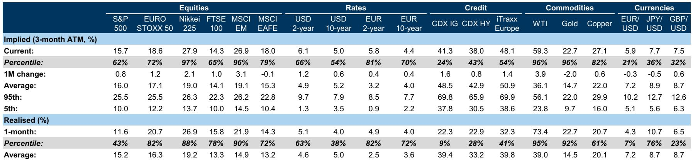

# The Inflation-Led Yield Shock Is Rewriting the Rules of Portfolio Construction

The correlation between US equities and 10-year bond yields has turned the most negative since the late 1990s. For balanced portfolio managers, this is not a statistical curiosity—it is a structural regime change that invalidates the diversification logic embedded in most strategic asset allocations. When bonds and equities move in the same direction, the traditional 60/40 portfolio loses its shock absorber. When they move in opposite directions with this intensity, the shock becomes amplified. The question is not whether this regime will persist, but whether investors have correctly diagnosed its root cause.

The source of the yield move matters more than the move itself. For much of the past decade, rising yields were associated with improving growth expectations, and equities absorbed the discount rate headwind through higher earnings forecasts. That relationship has inverted. Since the Middle East war and the ensuing energy price shock, markets have consistently interpreted macro surprises through an inflation lens rather than a growth lens. This shift in interpretation has fundamentally altered how equities respond to rising rates.

The data is unambiguous. The relative volatility of global growth factors versus monetary policy factors has collapsed, alongside a sharp deterioration in equity-bond yield correlations. Front-end inflation pricing—the part of the curve most directly affected by energy prices—now shows a strongly negative correlation with equity returns. Forward inflation expectations, by contrast, maintain a positive correlation. This asymmetry tells us that markets are pricing a near-term inflation problem, not a structural reflation cycle.

Three mechanisms explain why this matters for portfolio construction today. First, the speed of the rate move has become a risk in itself. Last week's US 10-year yield increase exceeded two standard deviations, a reminder that orderly sell-offs can tip into disorderly ones without warning. Second, the level of rates is approaching historically problematic thresholds—real yields above 2 to 2.5 percent have consistently coincided with negative equity-bond correlations. Third, and most critically, the gap between real yields and long-term consensus real GDP growth has turned positive, signaling that monetary policy is now unambiguously tight by historical standards.

## The Source of the Yield Shock Determines Whether Equities Can Absorb It

Not all yield increases are created equal. When yields rise because of stronger growth, equities typically hold up well because the discount rate headwind is offset by higher expected cash flows. This is the benign scenario that portfolio managers have internalized over the past decade. When yields rise because of inflation surprises, the mechanism breaks down. Higher inflation compresses valuation multiples without a corresponding improvement in real earnings power, and the equity-bond correlation turns negative.

The current environment is particularly challenging because the growth impulse is coming from micro rather than macro catalysts. Artificial intelligence investment has supported equity prices since April, but this is a sector-specific phenomenon, not a broad-based economic acceleration. The risk is that micro-driven growth optimism is insufficient to offset macro-driven discount rate pressure, especially if inflation prints continue to surprise to the upside.

The implication for asset allocators is straightforward but uncomfortable. If the source of the yield move remains inflation-led, the traditional hedge of holding long-duration bonds against equity risk becomes not just ineffective but counterproductive. Bonds decline alongside equities, and the portfolio suffers a double hit. This is precisely the scenario that the current correlation regime is pricing.

## The Speed of the Rate Move Creates a Self-Reinforcing Risk Dynamic

Even when the underlying source of a yield increase is benign, the pace of the move can itself become a destabilizing force. Markets have a limited capacity to digest sharp, disorderly shifts in discount rates. The recent sell-off, while largely orderly until last week, has crossed a threshold that historically signals distress.

The two-standard-deviation move in US 10-year yields is not unprecedented, but it is rare enough to warrant attention. In previous episodes, such moves have triggered forced selling from levered players, convexity hedging from mortgage portfolios, and sudden shifts in risk appetite from systematic strategies. The risk is not that yields will continue to rise linearly, but that the speed of the move will create feedback loops that amplify the initial shock.

This is where the level of rates interacts with the speed of the move. Real yields above 2 percent have historically been associated with more negative equity-bond correlations, but the relationship is not deterministic. What matters more is whether the move is perceived as a one-time repricing or the beginning of a sustained trend. The gap between real yields and long-term growth expectations provides a more robust indicator. When this gap turns positive, it signals that monetary policy is restrictive relative to the economy's underlying growth potential. In such environments, equities face a structural headwind that cannot be easily hedged.

## The Inflation-Growth Decomposition Has Become the Critical Input for Risk Management

The standard approach to portfolio construction treats inflation and growth as separate risk factors. The current environment suggests they are not separable. The relative volatility of the first principal component—global growth—has fallen relative to the second principal component—monetary policy. This means that macro shocks are increasingly being interpreted through a monetary policy lens, with inflation as the dominant driver.

The data on equity correlations with different segments of the yield curve confirms this interpretation. The correlation with front-end inflation pricing has turned sharply negative, mirroring the correlation with real rates. The correlation with forward inflation, however, remains positive. This divergence is instructive. It suggests that markets are pricing a near-term inflation problem driven by energy prices, not a structural shift in inflation expectations. If this diagnosis is correct, the current regime may be temporary, but it could persist as long as energy prices remain elevated.

For risk managers, the implication is that traditional interest rate hedges may not provide the protection they expect. Long-duration bonds are supposed to hedge equity risk in a disinflationary shock, but they amplify equity risk in an inflationary shock. The current environment is the latter. The challenge is that many portfolios are still positioned for the former.

## The Report Leaves a Critical Question Unanswered: When Does the Regime Shift Back?

The analysis identifies the source, speed, and level of yield moves as the key determinants of equity-bond correlations. It does not, however, provide a clear framework for predicting when the regime will shift. This is not a criticism of the report—it is an honest acknowledgment of the uncertainty inherent in macro forecasting.

Three questions remain open. First, will the inflation impulse prove transitory or persistent? If energy prices stabilize and inflation surprises revert to the downside, the correlation regime could normalize relatively quickly. If inflation remains sticky, the current regime could persist for quarters or even years. Second, will the micro-driven growth catalysts broaden into a macro-driven recovery? If AI investment spills over into broader capital spending and employment, the growth impulse could eventually offset the inflation headwind. Third, what level of yields would trigger a policy response from central banks? If the Federal Reserve signals a willingness to tolerate higher yields, the adjustment could be orderly. If it signals concern, the market could interpret that as confirmation that the economy is overheating.

These are not academic questions. They have direct implications for portfolio positioning. An investor who believes the regime will normalize quickly should maintain a balanced allocation and wait for the correlation to revert. An investor who believes the regime will persist should consider hedging strategies that explicitly account for the negative equity-bond correlation.

## A Decision Framework for Navigating the Inflation-Led Yield Regime

For investors who accept that the current regime may persist, the report offers a useful decision framework based on three dimensions: source, speed, and level.

Source: Determine whether the yield move is growth-led or inflation-led. If growth-led, maintain equity exposure and accept the discount rate headwind. If inflation-led, reduce equity exposure or hedge explicitly against further yield increases. The key indicator is the correlation between equity returns and front-end inflation pricing. If this correlation is negative, the move is inflation-led.

Speed: Monitor the pace of the yield move. If yields are rising in an orderly fashion, the risk of forced selling is low. If yields rise more than one standard deviation in a week, the risk of disorderly dynamics increases. In such environments, consider reducing duration exposure or adding convexity hedges.

Level: Assess whether yields have reached levels that historically signal tight monetary policy. The most robust indicator is the gap between real yields and long-term consensus real GDP growth. When this gap is positive, monetary policy is restrictive, and equities face a structural headwind. In such environments, consider overweighting cash or short-duration instruments relative to long-duration bonds.

The report also suggests that equity down and rates up hybrid structures offer attractive hedging characteristics in the current environment. These structures pay off precisely when the traditional balanced portfolio suffers its worst losses. The implied equity-bond yield correlation, while lower than earlier this year, remains elevated relative to realized correlation. This suggests that the market is still pricing some normalization, which creates opportunities for investors who believe the regime will persist.

## The Unresolved Tension Between Valuation and Momentum

The report makes a compelling case that bonds look more attractive from a risk-premia perspective. Yields have reached levels that historically offer attractive forward returns. Yet the negative equity-bond correlation regime might linger for longer than valuation-based models suggest.

This is the central tension facing portfolio managers today. Valuation models say buy bonds. Momentum and correlation models say wait. The resolution of this tension will depend on whether the inflation impulse fades or persists. If it fades, the valuation case will dominate, and bonds will deliver strong returns alongside equities. If it persists, the correlation regime will continue to punish balanced portfolios, and the valuation case will prove premature.

The report's recommendation to remain neutral on bonds for the three-month horizon reflects this uncertainty. It is not a conviction call. It is an acknowledgment that the current environment does not offer a clear entry point for adding duration exposure.

Join the community to read the full report and review the original charts. The data on equity-bond correlations, inflation decomposition, and historical thresholds for yield moves provides the analytical foundation for building portfolios that can withstand the current regime. The charts on hybrid hedging structures offer practical tools for implementing the framework discussed here.

*This article is for learning and discussion only and does not constitute investment advice.*

Personal reading notes and learning share only. Not investment advice.

