GLOBAL WEEKLY KICKSTART

# Global equities flat amid persistent geopolitical uncertainty

Global equities were broadly flat, with EM declining 2.5% and underperforming DM, while the US rose modestly (+0.2%) (Exhibit 1). Momentum continues to outperform (Exhibit 31), supported by Energy and Technology (Exhibit 3), large caps (Exhibit 29), and strong earnings revisions (Exhibit 21).

# Macro data this week

US: Philadelphia Fed manufacturing index, minutes to the FOMC's April meeting. Speaking engagements with Fed officials, including events with Governors Waller and Barr and Presidents Paulson and Barkin.

Europe: Euro area, Germany, France, UK flash PMIs, UK labour market data, UK retail sales, Euro area and UK final inflation prints.

Japan: 2026Q1 preliminary GDP, April national new core CPI, April export value and import value.

AEJ: April activity data in China, Thailand Q1 GDP, Malaysia CPI inflation, Korea 20-day exports, and central bank meeting in Indonesia.

Pricing is as of the close of Friday, May 15.

# The HALO (Heavy Assets, Low Obsolescence) effect in Japan:

■ Rotation to HALO: Investors are shifting toward asset-heavy, capital-intensive stocks, driven by geopolitics, supply chain realignment, and AI disruption risks in asset-light sectors.   
Performance & valuations: In Japan, the Growth vs. Value P/E premium peaked (\~140%) in 2022 and has since compressed (\~60%), with HALO outperforming LAHO since late 2025 as valuation gaps narrow. Our Japan Equity Strategists expect the geopolitical and policy backdrop to remain supportive of further HALO outperformance.   
■ Structural shift: Asset-heavy sectors (Utilities, Transport, Materials) benefit from durable capacity and visibility, while asset-light sectors face margin and terminal value pressure from AI and changing capital needs.

See more: HALO, Good Buy

# Guillaume Jaisson

+44(20)7552-3000

guillaume.jaisson@gs.com

GS International

# Peter Oppenheimer

+44(20)7552-5782

peter.oppenheimer@gs.com

GS International

# Sharon Bell

+44(20)7552-1341

sharon.bell@gs.com

GS International

# John Kwon

+65-6654-6337

jongmin.kwon@gs.com

GS (Singapore) Pte

# Giovanni Ferrannini

+44(20)7051-2589

giovanni.ferrannini@gs.com

GS International

# The week at a glance — Global markets and indices

Exhibit 1: Global market performance 

<table><tr><td rowspan="2">MSCI Indices</td><td colspan="4">Price Return (USD,%)</td></tr><tr><td>1-Week</td><td>1-Month</td><td>YTD</td><td>1-Year</td></tr><tr><td>USA</td><td>0.2</td><td>5.4</td><td>7.9</td><td>24.7</td></tr><tr><td>The World</td><td>-0.3</td><td>3.3</td><td>7.0</td><td>23.4</td></tr><tr><td>AC World</td><td>-0.6</td><td>3.6</td><td>8.3</td><td>25.4</td></tr><tr><td>Japan</td><td>-0.8</td><td>2.7</td><td>12.1</td><td>30.0</td></tr><tr><td>Europe</td><td>-2.0</td><td>-3.1</td><td>1.4</td><td>15.1</td></tr><tr><td>APxJ</td><td>-2.1</td><td>6.2</td><td>19.1</td><td>40.1</td></tr><tr><td>EM</td><td>-2.5</td><td>5.4</td><td>18.7</td><td>42.2</td></tr></table>

Source: Datastream, GS Global Investment Research

Exhibit 3: MSCI AC World sector performance   
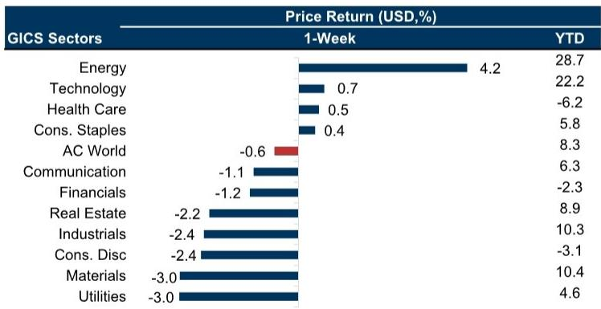

bar

Price Return (USD, %)
| GICS Sectors | 1-Week ($) | YTD (%) |
|---|---|---|
| Energy | 4.2 | 28.7 |
| Technology | 0.7 | 22.2 |
| Health Care | 0.5 | -6.2 |
| Cons. Staples | 0.4 | 5.8 |
| AC World | -0.6 | 8.3 |
| Communication | -1.1 | 6.3 |
| Financials | -1.2 | -2.3 |
| Real Estate | -2.2 | 8.9 |
| Industrials | -2.4 | 10.3 |
| Cons. Disc | -2.4 | -3.1 |
| Materials | -3.0 | 10.4 |
| Utilities | -3.0 | 4.6 |

Source: Datastream, GS Global Investment Research

Exhibit 2: World equity indices   
USD, indexed price performance   
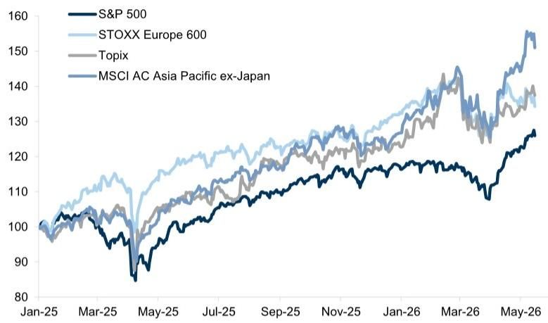

line

| Date   | S&P 500 | STOXX Europe 600 | Topix | MSCI AC Asia Pacific ex-Japan |
|--------|---------|------------------|-------|-------------------------------|
| Jan-25 | 100     | 100              | 100   | 100                           |
| Mar-25 | 95      | 105              | 102   | 103                           |
| May-25 | 85      | 115              | 108   | 110                           |
| Jul-25 | 100     | 120              | 115   | 118                           |
| Sep-25 | 105     | 125              | 120   | 122                           |
| Nov-25 | 110     | 130              | 125   | 128                           |
| Jan-26 | 115     | 135              | 130   | 132                           |
| Mar-26 | 120     | 140              | 135   | 138                           |
| May-26 | 125     | 145              | 140   | 142                           |

Source: Datastream, STOXX, GS Global Investment Research

Exhibit 4: Cross-asset performance   
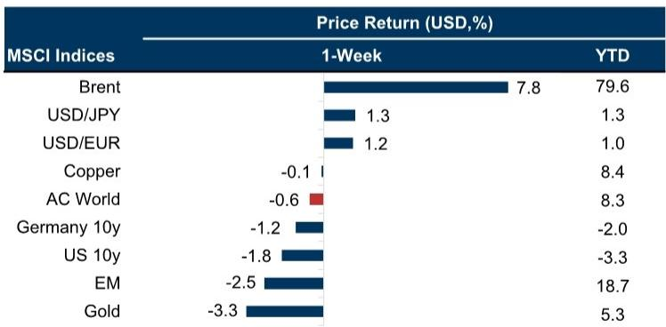

bar

Price Return (USD, %)
| MSCI Indices | 1-Week (%) | YTD (%) |
|---|---|---|
| Brent | 7.8 | 79.6 |
| USD/JPY | 1.3 | 1.3 |
| USD/EUR | 1.2 | 1.0 |
| Copper | -0.1 | 8.4 |
| AC World | -0.6 | 8.3 |
| Germany 10y | -1.2 | -2.0 |
| US 10y | -1.8 | -3.3 |
| EM | -2.5 | 18.7 |
| Gold | -3.3 | 5.3 |

Source: Datastream, GS Global Investment Research

# Forecasts

Exhibit 5: GDP growth, % yoy: GS vs. consensus 

<table><tr><td colspan="6">Real GDP Growth</td></tr><tr><td rowspan="2">Percent Change yoy</td><td>2025</td><td colspan="2">2026</td><td colspan="2">2027</td></tr><tr><td>GS</td><td>GS</td><td>Cons*</td><td>GS</td><td>Cons*</td></tr><tr><td>USA</td><td>2.1</td><td>2.1</td><td>2.2</td><td>2.1</td><td>2.0</td></tr><tr><td>Japan</td><td>1.2</td><td>0.5</td><td>0.7</td><td>1.0</td><td>0.9</td></tr><tr><td>Euro area</td><td>1.5</td><td>0.7</td><td>0.8</td><td>0.9</td><td>1.3</td></tr><tr><td>Germany</td><td>0.3</td><td>0.7</td><td>0.7</td><td>1.0</td><td>1.2</td></tr><tr><td>France</td><td>0.9</td><td>0.6</td><td>0.8</td><td>0.6</td><td>1.0</td></tr><tr><td>Italy</td><td>0.7</td><td>0.5</td><td>0.5</td><td>0.5</td><td>0.7</td></tr><tr><td>Spain</td><td>2.8</td><td>2.1</td><td>2.3</td><td>1.5</td><td>1.9</td></tr><tr><td>UK</td><td>1.4</td><td>1.2</td><td>0.8</td><td>1.3</td><td>1.2</td></tr><tr><td>China</td><td>5.0</td><td>4.7</td><td>4.6</td><td>4.7</td><td>4.4</td></tr><tr><td>Developed Markets</td><td>1.8</td><td>1.5</td><td>1.9</td><td>1.6</td><td>1.6</td></tr><tr><td>Emerging Markets</td><td>4.2</td><td>3.7</td><td>4.0</td><td>4.0</td><td>3.9</td></tr><tr><td>World</td><td>2.8</td><td>2.4</td><td>2.8</td><td>2.7</td><td>2.6</td></tr></table>

\* Bloomberg country and GS aggregate consensus   
Source: Bloomberg, GS Global Investment Research

Exhibit 7: GS top-down vs. consensus bottom-up estimates of 2026 EPS growth   
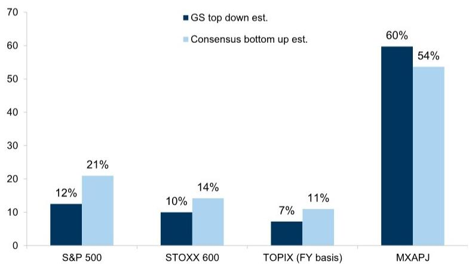

bar

| Category | GS top down est. (%) | Consensus bottom up est. (%) |
| :--- | :--- | :--- |
| S&P 500 | 12 | 21 |
| STOXX 600 | 10 | 14 |
| TOPIX (FY basis) | 7 | 11 |
| MXAPJ | 60 | 54 |

Source: I/B/E/S, Toyo Keizai, STOXX, MSCI, GS Global Investment Research

Exhibit 6: GS Macro 3-, 6- and 12-month forecasts 

<table><tr><td rowspan="2"></td><td rowspan="2">Current</td><td colspan="3">Forecast</td><td rowspan="2">Up/Downside to 12m TP (%)</td></tr><tr><td>3m</td><td>6m</td><td>12m</td></tr><tr><td colspan="6">Equities</td></tr><tr><td>S&amp;P 500</td><td>7409</td><td>7200</td><td>7400</td><td>7600</td><td>2.6</td></tr><tr><td>STOXX Europe 600</td><td>607</td><td>605</td><td>615</td><td>625</td><td>3.0</td></tr><tr><td>MSCI Asia-Pacific Ex-Japan</td><td>860</td><td>900</td><td>940</td><td>990</td><td>15.1</td></tr><tr><td>Topix</td><td>3864</td><td>3800</td><td>4000</td><td>4200</td><td>8.7</td></tr><tr><td colspan="6">10Y Rate (%)</td></tr><tr><td>US</td><td>4.6</td><td>4.3</td><td>4.2</td><td>4.1</td><td>-50 bp</td></tr><tr><td>Euro Area (Germany)</td><td>3.1</td><td>2.9</td><td>3.0</td><td>3.0</td><td>-13 bp</td></tr><tr><td>Japan</td><td>2.7</td><td>2.5</td><td>2.5</td><td>2.4</td><td>-25 bp</td></tr><tr><td colspan="6">Currencies</td></tr><tr><td>€/$</td><td>1.16</td><td>1.14</td><td>1.18</td><td>1.20</td><td>3.2</td></tr><tr><td>£/$</td><td>1.33</td><td>1.33</td><td>1.34</td><td>1.33</td><td>0.0</td></tr><tr><td>$/¥</td><td>159</td><td>160</td><td>158</td><td>155</td><td>-2.3</td></tr><tr><td colspan="6">Commodities</td></tr><tr><td>Brent Crude Oil ($/bbl)</td><td>101.3</td><td>94</td><td>91</td><td>86</td><td>-15.1</td></tr><tr><td>NYMEX Nat. Gas ($/mmBtu)</td><td>2.9</td><td>3.50</td><td>3.50</td><td>3.50</td><td>20.9</td></tr><tr><td>Gold ($/troy oz)</td><td>4708</td><td>4805</td><td>4990</td><td>5445</td><td>15.7</td></tr><tr><td>LME Copper ($/mt)</td><td>13515</td><td>12635</td><td>12535</td><td>12265</td><td>-9.3</td></tr></table>

Source: Bloomberg, Datastream, STOXX, GS Global Investment Research

Exhibit 8: GS top-down vs. consensus bottom-up estimates of 2027 EPS growth   
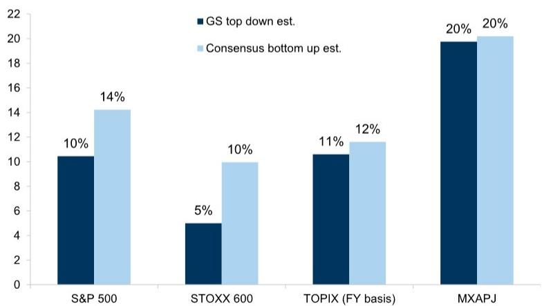

bar

| Category | GS top down est. (%) | Consensus bottom up est. (%) |
| :--- | :--- | :--- |
| S&P 500 | 10 | 14 |
| STOXX 600 | 5 | 10 |
| TOPIX (FY basis) | 11 | 12 |
| MXAPJ | 20 | 20 |

Source: I/B/E/S, Toyo Keizai, STOXX, MSCI, GS Global Investment Research

# Risk and Sentiment indicators

Exhibit 9: GS Bull/Bear Market Indicator (GSBLBR)   
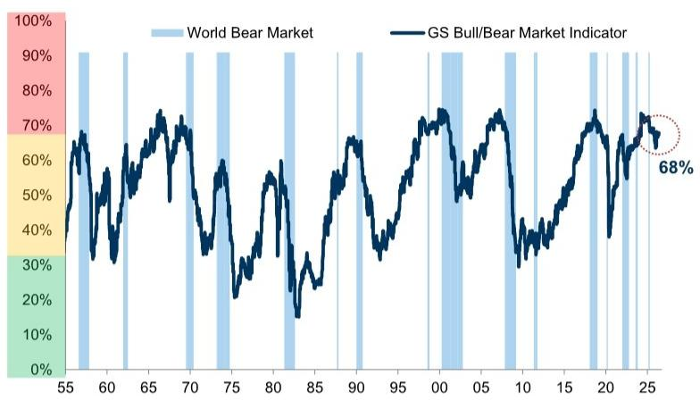

line

| Year | World Bear Market | GS Bull/Bear Market Indicator |
|------|-------------------|-------------------------------|
| 25   |                   | 68%                           |

Source: Shiller, Haver Analytics, Datastream, GS Global Investment Research

# Exhibit 11: Risk Appetite Indicator (GSRAII)

The RAI is based on 27 pair-trades across asset classes measured on z-scores rel. to last 2 years' performance, see July 2016 GOAL for details

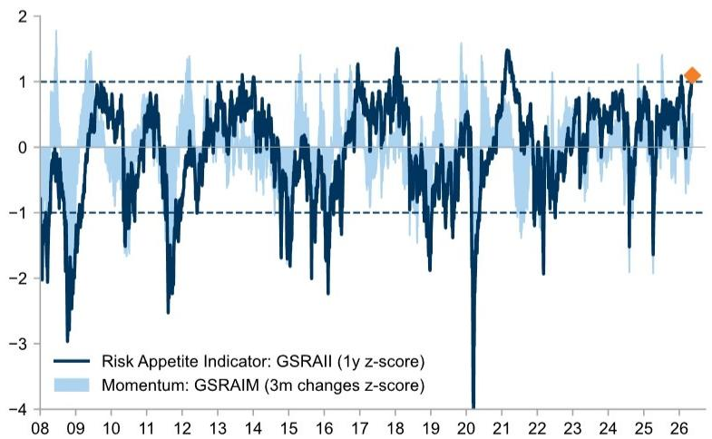

line

| Year | Risk Appetite Indicator: GSRAII (1y z-score) | Momentum: GSRAIM (3m changes z-score) |
|------|-----------------------------------------------|----------------------------------------|
| 2026 | 1.0                                           | 1.0                                    |

Source: GS Global Investment Research

Exhibit 10: Details of components of the GS Bull/Bear Market Indicator GS Bull/Bear Market Indicator = Average percentile 

<table><tr><td></td><td>Level</td><td>Percentile</td></tr><tr><td>Shiller PE</td><td>40.5</td><td>98%</td></tr><tr><td>0-6 quarter yield curve</td><td>0.1</td><td>80%</td></tr><tr><td>Unemployment</td><td>4.3</td><td>77%</td></tr><tr><td>Private sector Financial Balance</td><td>3.8</td><td>56%</td></tr><tr><td>Core Inflation</td><td>2.8</td><td>51%</td></tr><tr><td>ISM</td><td>52.7</td><td>46%</td></tr><tr><td>GS Bull/Bear Market Indicator</td><td></td><td>68%</td></tr></table>

Note: $100^{th}$ percentile means these variables are at their highest level, except for Private sector Financial Balance, yield curve and unemployment where $100\%$ means they are at their lowest.

Source: Haver Analytics, Datastream, Robert Shiller, GS Global Investment Research

# Exhibit 12: Percentile of sentiment indicators

Data since 2007

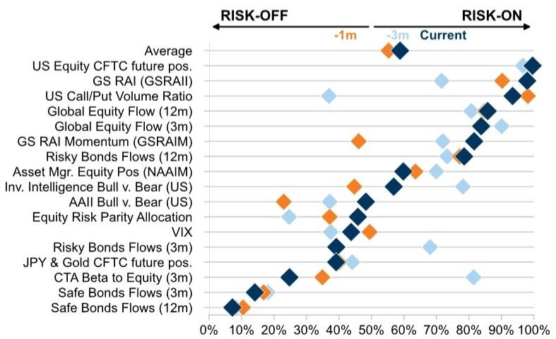

scatter

| Category | RISK-OFF (%) | RISK-ON (%) |
|---|---|---|
| Average | 55 | 60 |
| US Equity CFTC future pos. | 98 | 99 |
| GS RAI (GSRAII) | 92 | 94 |
| US Call/Put Volume Ratio | 37 | 72 |
| Global Equity Flow (12m) | 90 | 91 |
| Global Equity Flow (3m) | 88 | 89 |
| GS RAI Momentum (GSRAIM) | 45 | 82 |
| Risky Bonds Flows (12m) | 78 | 79 |
| Asset Mgr. Equity Pos (NAAIM) | 62 | 65 |
| Inv. Intelligence Bull v. Bear (US) | 45 | 60 |
| AAII Bull v. Bear (US) | 25 | 40 |
| Equity Risk Parity Allocation VIX | 48 | 49 |
| Risky Bonds Flows (3m) | 38 | 68 |
| JPY & Gold CFTC future pos. | 35 | 40 |
| CTA Beta to Equity (3m) | 25 | 82 |
| Safe Bonds Flows (3m) | 15 | 18 |
| Safe Bonds Flows (12m) | 10 | 12 |

Source: EPFR, Datastream, Haver Analytics, GS Global Investment Research

# Performance - Local indices

Exhibit 13: Global equity market performance (local indices) 

<table><tr><td rowspan="2">Market</td><td colspan="4">Price return (Local CCY, %)</td></tr><tr><td>Index</td><td>1-week (Local)</td><td>Ytd</td><td>1Yr</td></tr><tr><td>Norway</td><td>OSEAX</td><td></td><td>22.3</td><td>34.2</td></tr><tr><td>Denmark</td><td>KFX</td><td>1.9</td><td>(4.0)</td><td>(11.6)</td></tr><tr><td>Singapore</td><td>FSSTI</td><td>1.4</td><td>7.4</td><td>28.2</td></tr><tr><td>Thailand</td><td>SET</td><td>1.2</td><td>20.5</td><td>27.1</td></tr><tr><td>Switzerland</td><td>SMI</td><td>0.9</td><td>(0.4)</td><td>8.1</td></tr><tr><td>Japan</td><td>TPX</td><td>0.9</td><td>13.3</td><td>41.1</td></tr><tr><td>Poland</td><td>WiG</td><td>0.9</td><td>12.1</td><td>27.3</td></tr><tr><td>Philippines</td><td>PCOMP</td><td>0.3</td><td>(1.3)</td><td>(7.6)</td></tr><tr><td>US</td><td>SPX</td><td>0.1</td><td>8.2</td><td>25.2</td></tr><tr><td>Belgium</td><td>BEL20</td><td>0.1</td><td>7.7</td><td>24.2</td></tr><tr><td>Czech</td><td>PX</td><td>0.0</td><td>(5.6)</td><td>16.2</td></tr><tr><td>Portugal</td><td>BVLX</td><td>0.0</td><td>11.5</td><td>29.7</td></tr><tr><td>South Korea</td><td>KOSPI</td><td>-0.1</td><td>77.8</td><td>185.9</td></tr><tr><td>China (A)</td><td>SHSZ300</td><td>-0.3</td><td>5.0</td><td>24.4</td></tr><tr><td>Italy</td><td>FTSEMIB</td><td>-0.4</td><td>9.3</td><td>21.5</td></tr><tr><td>UK</td><td>UKX</td><td>-0.4</td><td>2.7</td><td>18.1</td></tr><tr><td>Austria</td><td>ATX EM</td><td>-0.4</td><td>10.0</td><td>33.0</td></tr><tr><td>Malaysia</td><td>FBMKLCI DM</td><td>-0.4</td><td>3.6</td><td>10.6</td></tr><tr><td>Canada</td><td>SPTSX60</td><td>-0.5</td><td>5.8</td><td>26.4</td></tr><tr><td>Netherlands</td><td>AEX</td><td>-0.7</td><td>6.2</td><td>8.8</td></tr><tr><td>Egypt</td><td>EGX30</td><td>-0.8</td><td>27.1</td><td>66.4</td></tr><tr><td>Stoxx 600</td><td>SXXP</td><td>-0.9</td><td>2.5</td><td>11.0</td></tr><tr><td>Taiwan</td><td>TWSE</td><td>-1.0</td><td>42.2</td><td>89.5</td></tr><tr><td>Sweden</td><td>OMX</td><td>-1.2</td><td>5.3</td><td>19.4</td></tr><tr><td>Australia</td><td>AS51</td><td>-1.3</td><td>(1.0)</td><td>4.0</td></tr><tr><td>EuroStoxx 50</td><td>SX5E</td><td>-1.4</td><td>0.6</td><td>7.7</td></tr><tr><td>Greece</td><td>ASE</td><td>-1.5</td><td>5.9</td><td>25.8</td></tr><tr><td>Spain</td><td>IBEX</td><td>-1.5</td><td>1.8</td><td>26.5</td></tr><tr><td>Germany</td><td>DAX</td><td>-1.6</td><td>(2.2)</td><td>1.1</td></tr><tr><td>New Zealand</td><td>NZX 50</td><td>-1.6</td><td>(5.3)</td><td>(2.3)</td></tr><tr><td>HK</td><td>HSI</td><td>-1.6</td><td>1.3</td><td>10.7</td></tr><tr><td>France</td><td>CAC</td><td>-2.0</td><td>(2.4)</td><td>1.3</td></tr><tr><td>Hungary</td><td>HUX</td><td>-2.1</td><td>18.6</td><td>37.6</td></tr><tr><td>India</td><td>NIFTY</td><td>-2.2</td><td>(9.5)</td><td>(5.7)</td></tr><tr><td>China (H)</td><td>HSCEI</td><td>-2.2</td><td>(2.5)</td><td>2.1</td></tr><tr><td>Mexico</td><td>MEXBOL</td><td>-2.7</td><td>5.7</td><td>17.3</td></tr><tr><td>South Africa</td><td>JALSH</td><td>-2.8</td><td>(1.1)</td><td>24.0</td></tr><tr><td>Indonesia</td><td>JCI</td><td>-3.5</td><td>(22.2)</td><td>(4.5)</td></tr><tr><td>Brazil</td><td>IBOV</td><td>-3.7</td><td>10.0</td><td>27.2</td></tr><tr><td>Turkey</td><td>XU100</td><td>-4.6</td><td>27.6</td><td>50.6</td></tr></table>

<table><tr><td rowspan="2">Market</td><td colspan="4">Relative Price return (vs MSCI AC World, USD, %)</td></tr><tr><td>Index</td><td>1-week (USD)</td><td>Ytd</td><td>1Yr</td></tr><tr><td>Norway</td><td>OSEAX</td><td></td><td>24.2</td><td>24.9</td></tr><tr><td>Denmark</td><td>KFX</td><td>1.2</td><td>(13.3)</td><td>(33.7)</td></tr><tr><td>Singapore</td><td>FSSTI</td><td>1.0</td><td>(0.4)</td><td>4.7</td></tr><tr><td>US</td><td>SPX</td><td>0.7</td><td>(0.1)</td><td>(0.2)</td></tr><tr><td>Thailand</td><td>SET</td><td>0.4</td><td>7.9</td><td>4.5</td></tr><tr><td>Switzerland</td><td>SMI</td><td>0.4</td><td>(7.9)</td><td>(10.3)</td></tr><tr><td>China (A)</td><td>SHSZ300</td><td>0.3</td><td>(0.5)</td><td>6.4</td></tr><tr><td>Japan</td><td>TPX</td><td>0.3</td><td>3.7</td><td>4.3</td></tr><tr><td>Poland</td><td>WiG</td><td>0.0</td><td>2.1</td><td>7.1</td></tr><tr><td>Canada</td><td>SPTSX60</td><td>-0.4</td><td>(2.9)</td><td>3.2</td></tr><tr><td>Belgium</td><td>BEL20</td><td>-0.6</td><td>(1.7)</td><td>3.7</td></tr><tr><td>Egypt</td><td>EGX30</td><td>-0.6</td><td>6.3</td><td>32.4</td></tr><tr><td>Malaysia</td><td>FBMKLCI</td><td>-0.6</td><td>(1.9)</td><td>(5.6)</td></tr><tr><td>Portugal</td><td>BVLX</td><td>-0.6</td><td>2.1</td><td>9.5</td></tr><tr><td>Czech</td><td>PX</td><td>-0.7</td><td>(15.4)</td><td>(1.5)</td></tr><tr><td>Philippines</td><td>PCOMP</td><td>-0.9</td><td>(14.2)</td><td>(41.9)</td></tr><tr><td>Taiwan</td><td>TWSE</td><td>-0.9</td><td>33.3</td><td>55.8</td></tr><tr><td>Italy</td><td>FTSEMIB</td><td>-1.0</td><td>(0.1)</td><td>0.9</td></tr><tr><td>Austria</td><td>ATX</td><td>-1.0</td><td>0.6</td><td>12.9</td></tr><tr><td>HK</td><td>HSI</td><td>-1.0</td><td>(7.6)</td><td>(15.0)</td></tr><tr><td>Netherlands</td><td>AEX</td><td>-1.3</td><td>(3.1)</td><td>(12.3)</td></tr><tr><td>Stoxx 600</td><td>SXXP</td><td>-1.5</td><td>(6.8)</td><td>(10.0)</td></tr><tr><td>South Korea</td><td>KOSPI</td><td>-1.5</td><td>62.3</td><td>140.1</td></tr><tr><td>China (H)</td><td>HSCEI</td><td>-1.6</td><td>(11.4)</td><td>(23.6)</td></tr><tr><td>UK</td><td>UKX</td><td>-1.8</td><td>(6.5)</td><td>(6.7)</td></tr><tr><td>Australia</td><td>AS51</td><td>-1.9</td><td>(2.1)</td><td>(9.2)</td></tr><tr><td>EuroStoxx 50</td><td>SX5E</td><td>-2.0</td><td>(8.7)</td><td>(13.5)</td></tr><tr><td>Greece</td><td>ASE</td><td>-2.1</td><td>(3.4)</td><td>5.4</td></tr><tr><td>Spain</td><td>IBEX</td><td>-2.1</td><td>(7.5)</td><td>6.1</td></tr><tr><td>Germany</td><td>DAX</td><td>-2.2</td><td>(11.5)</td><td>(20.3)</td></tr><tr><td>France</td><td>CAC</td><td>-2.6</td><td>(11.7)</td><td>(20.1)</td></tr><tr><td>Sweden</td><td>OMX</td><td>-2.8</td><td>(5.3)</td><td>(2.0)</td></tr><tr><td>New Zealand</td><td>NZX 50</td><td>-2.8</td><td>(12.0)</td><td>(28.1)</td></tr><tr><td>Mexico</td><td>MEXBOL</td><td>-2.9</td><td>1.2</td><td>6.2</td></tr><tr><td>India</td><td>NIFTY</td><td>-3.1</td><td>(23.6)</td><td>(41.3)</td></tr><tr><td>Indonesia</td><td>JCI</td><td>-3.5</td><td>(34.1)</td><td>(35.1)</td></tr><tr><td>South Africa</td><td>JALSH</td><td>-3.7</td><td>(10.0)</td><td>9.1</td></tr><tr><td>Turkey</td><td>XU100</td><td>-4.4</td><td>12.0</td><td>2.5</td></tr><tr><td>Hungary</td><td>HUX</td><td>-4.4</td><td>16.7</td><td>34.4</td></tr><tr><td>Brazil</td><td>IBOV</td><td>-6.4</td><td>10.7</td><td>16.3</td></tr></table>

Source: MSCI, STOXX, Local Index Compilers, FactSet, GS Global Investment Research

# Sector performance across regions - Weekly

Exhibit 14: 1-week sector performance across regions

Light blue: below -1 standard dev. from the AC world market performance. Dark blue: above +1 standard dev. from the AC world market performance.

<table><tr><td rowspan="2">MSCI Index</td><td colspan="18">Weekly Absolute Performance (%) in USD</td></tr><tr><td>US</td><td>Canada</td><td>UK</td><td>Germany</td><td>France</td><td>Swiss</td><td>Spain</td><td>Italy</td><td>Devd Euro</td><td>Japan</td><td>Korea</td><td>Brazil</td><td>India</td><td>China</td><td>Taiwan</td><td>AC APxJ</td><td>EM</td><td>AC World</td></tr><tr><td>Market</td><td>0.2</td><td>-1.1</td><td>-2.3</td><td>-2.5</td><td>-3.2</td><td>-0.4</td><td>-2.6</td><td>-2.0</td><td>-2.0</td><td>-0.8</td><td>-1.0</td><td>-7.2</td><td>-4.1</td><td>-2.7</td><td>-1.9</td><td>-2.1</td><td>-2.5</td><td>-0.6</td></tr><tr><td>Energy</td><td>6.6</td><td>4.6</td><td>0.9</td><td>-</td><td>2.4</td><td>-</td><td>1.1</td><td>2.3</td><td>1.7</td><td>4.4</td><td>-8.7</td><td>-2.3</td><td>-6.3</td><td>-0.1</td><td>-</td><td>-2.9</td><td>-3.0</td><td>4.2</td></tr><tr><td>Materials</td><td>-2.3</td><td>-4.7</td><td>-1.9</td><td>-2.3</td><td>-0.7</td><td>-4.0</td><td>-</td><td>-7.5</td><td>-2.0</td><td>-5.0</td><td>-13.5</td><td>-2.2</td><td>-1.4</td><td>-7.7</td><td>-4.5</td><td>-2.2</td><td>-5.6</td><td>-3.0</td></tr><tr><td>Industrials</td><td>-1.0</td><td>-3.0</td><td>-4.9</td><td>-4.8</td><td>-5.4</td><td>-1.5</td><td>-4.2</td><td>-3.3</td><td>-4.4</td><td>-1.0</td><td>-9.9</td><td>-10.6</td><td>-5.1</td><td>-0.8</td><td>-10.3</td><td>-5.7</td><td>-6.7</td><td>-2.4</td></tr><tr><td>Capital Goods</td><td>-1.3</td><td>-7.4</td><td>-6.0</td><td>-5.1</td><td>-5.6</td><td>-1.7</td><td>-4.2</td><td>-3.3</td><td>-4.9</td><td>-0.9</td><td>-10.0</td><td>-7.7</td><td>-5.4</td><td>-0.3</td><td>-13.8</td><td>-6.8</td><td>-7.3</td><td>-2.8</td></tr><tr><td>Comm &amp; Profess. Srvcs</td><td>-0.9</td><td>-3.5</td><td>-2.4</td><td>-</td><td>1.1</td><td>0.3</td><td>-</td><td>-</td><td>-2.1</td><td>-1.8</td><td>-12.2</td><td>-</td><td>-</td><td>0.1</td><td>-</td><td>-2.2</td><td>-3.8</td><td>-1.4</td></tr><tr><td>Transportation</td><td>0.4</td><td>-0.4</td><td>-</td><td>-1.9</td><td>-1.8</td><td>0.6</td><td>-4.2</td><td>-</td><td>-1.1</td><td>-0.8</td><td>-5.6</td><td>-15.0</td><td>-3.1</td><td>-2.5</td><td>-4.2</td><td>-1.8</td><td>-4.2</td><td>-0.6</td></tr><tr><td>Consumer Discretionary</td><td>-3.1</td><td>-4.3</td><td>0.5</td><td>-1.7</td><td>-4.6</td><td>-3.1</td><td>-4.1</td><td>-5.2</td><td>-3.3</td><td>2.7</td><td>13.1</td><td>-5.8</td><td>-5.9</td><td>-3.1</td><td>-4.4</td><td>-1.4</td><td>-1.8</td><td>-2.4</td></tr><tr><td>Automobiles &amp; Comp.</td><td>-1.3</td><td>-4.3</td><td>-</td><td>-3.3</td><td>-2.7</td><td>-</td><td>-</td><td>-4.0</td><td>-3.4</td><td>3.6</td><td>9.4</td><td>-</td><td>-5.7</td><td>-1.8</td><td>-</td><td>0.5</td><td>0.5</td><td>-0.5</td></tr><tr><td>Cons Dur. &amp; Apparel</td><td>-6.2</td><td>-4.7</td><td>-9.3</td><td>-2.0</td><td>-5.2</td><td>-3.1</td><td>-</td><td>-9.9</td><td>-4.6</td><td>6.3</td><td>52.8</td><td>-</td><td>-7.6</td><td>-1.1</td><td>-</td><td>4.2</td><td>3.7</td><td>-1.7</td></tr><tr><td>Consumer Srvcs</td><td>-2.3</td><td>-4.6</td><td>3.7</td><td>45.8</td><td>1.0</td><td>-</td><td>-2.6</td><td>-</td><td>3.3</td><td>-6.9</td><td>2.3</td><td>-</td><td>-6.6</td><td>-3.8</td><td>-</td><td>-2.4</td><td>-4.1</td><td>-1.8</td></tr><tr><td>Retailing</td><td>-3.7</td><td>-4.0</td><td>-7.3</td><td>-3.9</td><td>-</td><td>-3.6</td><td>-4.8</td><td>-</td><td>-5.6</td><td>-4.6</td><td>-</td><td>-5.8</td><td>-4.2</td><td>-3.6</td><td>-4.4</td><td>-3.1</td><td>-3.6</td><td>-3.7</td></tr><tr><td>Consumer Staples</td><td>1.3</td><td>-1.3</td><td>0.8</td><td>-2.1</td><td>-3.1</td><td>-0.7</td><td>-</td><td>-5.1</td><td>-0.5</td><td>0.6</td><td>-3.9</td><td>-9.2</td><td>-1.9</td><td>-2.7</td><td>1.5</td><td>-2.4</td><td>-2.4</td><td>0.4</td></tr><tr><td>Food &amp; Staples Retailing</td><td>1.4</td><td>-1.1</td><td>-5.8</td><td>-</td><td>-1.7</td><td>-</td><td>-</td><td>-</td><td>-3.9</td><td>-3.0</td><td>-</td><td>-9.7</td><td>-2.5</td><td>-3.2</td><td>-2.4</td><td>-2.9</td><td>-2.2</td><td>0.4</td></tr><tr><td>Food Bev. &amp; Tobacco</td><td>2.8</td><td>-4.3</td><td>5.7</td><td>-</td><td>-3.8</td><td>-0.7</td><td>-</td><td>-5.1</td><td>1.0</td><td>4.2</td><td>-1.1</td><td>-9.1</td><td>-1.5</td><td>-2.5</td><td>2.9</td><td>-1.8</td><td>-2.2</td><td>1.8</td></tr><tr><td>Household &amp; Persnl Prod</td><td>-2.7</td><td>-</td><td>-3.6</td><td>-2.1</td><td>-2.8</td><td>-</td><td>-</td><td>-</td><td>-3.1</td><td>-5.4</td><td>-8.5</td><td>-</td><td>-2.6</td><td>-5.4</td><td>-</td><td>-4.1</td><td>-4.1</td><td>-3.0</td></tr><tr><td>Health Care</td><td>1.1</td><td>-</td><td>-0.4</td><td>-1.2</td><td>-0.4</td><td>0.5</td><td>0.4</td><td>1.7</td><td>0.1</td><td>-0.3</td><td>-4.5</td><td>-12.1</td><td>0.1</td><td>-4.8</td><td>6.6</td><td>-4.8</td><td>-2.9</td><td>0.5</td></tr><tr><td>Healthcare Equip &amp; Srvcs</td><td>1.0</td><td>-</td><td>-0.4</td><td>-4.0</td><td>-0.2</td><td>0.1</td><td>-</td><td>-</td><td>-1.6</td><td>0.5</td><td>-12.7</td><td>-12.1</td><td>0.0</td><td>-2.6</td><td>-</td><td>-3.3</td><td>-2.9</td><td>0.5</td></tr><tr><td>Pharma &amp; Biotech</td><td>1.2</td><td>-</td><td>-0.4</td><td>0.4</td><td>-0.5</td><td>0.5</td><td>0.4</td><td>1.7</td><td>0.3</td><td>-0.7</td><td>-3.7</td><td>-</td><td>0.2</td><td>-5.0</td><td>6.6</td><td>-5.3</td><td>-2.9</td><td>0.5</td></tr><tr><td>Financials</td><td>-0.4</td><td>-0.4</td><td>-3.4</td><td>-1.8</td><td>-4.2</td><td>0.8</td><td>-2.5</td><td>-1.4</td><td>-2.2</td><td>3.5</td><td>-5.0</td><td>-8.9</td><td>-4.2</td><td>-1.3</td><td>-2.5</td><td>-2.9</td><td>-3.3</td><td>-1.2</td></tr><tr><td>Banks</td><td>-2.3</td><td>0.3</td><td>-3.3</td><td>1.6</td><td>-3.9</td><td>1.9</td><td>-2.6</td><td>-1.3</td><td>-2.4</td><td>2.3</td><td>-6.2</td><td>-8.8</td><td>-3.5</td><td>0.2</td><td>-2.2</td><td>-3.2</td><td>-2.9</td><td>-2.2</td></tr><tr><td>Diversified Financials</td><td>0.2</td><td>-3.1</td><td>-6.7</td><td>-1.8</td><td>-1.2</td><td>1.1</td><td>-</td><td>-0.1</td><td>-2.4</td><td>3.1</td><td>-10.3</td><td>-9.9</td><td>-6.1</td><td>-3.1</td><td>-4.1</td><td>-3.7</td><td>-5.9</td><td>-0.5</td></tr><tr><td>Insurance</td><td>1.1</td><td>-1.2</td><td>-0.6</td><td>-2.2</td><td>-5.7</td><td>0.5</td><td>-0.4</td><td>-1.9</td><td>-1.3</td><td>6.6</td><td>4.0</td><td>-5.9</td><td>-1.9</td><td>-4.3</td><td>-2.6</td><td>-0.8</td><td>-2.8</td><td>0.2</td></tr><tr><td>Real Estate</td><td>-</td><td>-3.6</td><td>-</td><td>-</td><td>-</td><td>-</td><td>-</td><td>-</td><td>-</td><td>-</td><td>-</td><td>-</td><td>-</td><td>-</td><td>-</td><td>-</td><td>-</td><td>-</td></tr><tr><td>Information Technology</td><td>1.3</td><td>-6.3</td><td>-3.3</td><td>-0.3</td><td>2.4</td><td>-4.4</td><td>-3.0</td><td>-</td><td>0.0</td><td>-5.5</td><td>1.2</td><td>-14.5</td><td>-7.0</td><td>-0.8</td><td>-1.7</td><td>-0.8</td><td>-0.8</td><td>0.7</td></tr><tr><td>Software &amp; Services</td><td>0.8</td><td>-6.8</td><td>-3.1</td><td>-2.7</td><td>-2.2</td><td>-</td><td>-3.0</td><td>-</td><td>1.1</td><td>-5.4</td><td>5.5</td><td>-14.5</td><td>-7.0</td><td>-7.8</td><td>-</td><td>-6.9</td><td>-6.6</td><td>0.3</td></tr><tr><td>Tech Hardware &amp; Equip</td><td>3.1</td><td>-4.2</td><td>-3.4</td><td>-</td><td>-</td><td>-4.4</td><td>-</td><td>-</td><td>3.0</td><td>-2.2</td><td>-1.5</td><td>-</td><td>-</td><td>-0.2</td><td>-1.4</td><td>-1.3</td><td>-1.3</td><td>2.0</td></tr><tr><td>Semiconductor &amp; Equip</td><td>0.5</td><td>-</td><td>-</td><td>4.4</td><td>6.4</td><td>-</td><td>-</td><td>-</td><td>-1.0</td><td>-7.7</td><td>5.4</td><td>-</td><td>-7.9</td><td>0.8</td><td>-1.8</td><td>-0.2</td><td>-0.2</td><td>0.1</td></tr><tr><td>Communication Srvcs</td><td>-0.8</td><td>-4.1</td><td>-7.3</td><td>-0.2</td><td>-1.7</td><td>-0.2</td><td>-1.0</td><td>-0.1</td><td>-0.7</td><td>-4.1</td><td>-3.8</td><td>-9.6</td><td>2.6</td><td>-3.7</td><td>0.9</td><td>-2.5</td><td>-2.6</td><td>-1.1</td></tr><tr><td>Telecom Srvcs</td><td>-2.8</td><td>-4.1</td><td>-8.0</td><td>-0.2</td><td>0.9</td><td>-0.2</td><td>-1.0</td><td>-0.1</td><td>-1.4</td><td>-2.9</td><td>6.0</td><td>-9.6</td><td>3.1</td><td>-0.5</td><td>1.5</td><td>1.9</td><td>0.2</td><td>-1.9</td></tr><tr><td>Media &amp; Entertainment</td><td>-0.7</td><td>-</td><td>-5.6</td><td>0.4</td><td>-6.3</td><td>-</td><td>-</td><td>-</td><td>0.8</td><td>-7.5</td><td>-5.7</td><td>-</td><td>-6.6</td><td>-3.8</td><td>-2.4</td><td>-3.9</td><td>-3.9</td><td>-1.0</td></tr><tr><td>Utilities</td><td>-2.2</td><td>-1.1</td><td>-9.5</td><td>-4.2</td><td>-4.1</td><td>-2.1</td><td>-2.3</td><td>-3.3</td><td>-4.6</td><td>-1.6</td><td>-13.8</td><td>-10.0</td><td>-5.3</td><td>0.6</td><td>-</td><td>-2.1</td><td>-4.8</td><td>-3.0</td></tr></table>

Source: FactSet, MSCI, GS Global Investment Research

# Sector performance across regions - YTD

Exhibit 15: YTD sector performance across regions

Light blue: below -1 standard dev. from the AC world market performance. Dark blue: above +1 standard dev. from the AC world market performance.

<table><tr><td>MSCI Index</td><td>US</td><td>Canada</td><td>UK</td><td>Germany</td><td>France</td><td>Swiss</td><td>Spain</td><td>Italy</td><td>Devd Euro</td><td>Japan</td><td>Korea</td><td>Brazil</td><td>India</td><td>China</td><td>Taiwan</td><td>AC APxJ</td><td>EM</td><td>AC World</td></tr><tr><td>Market</td><td>7.9</td><td>5.8</td><td>2.2</td><td>-4.3</td><td>-3.1</td><td>0.6</td><td>0.5</td><td>5.4</td><td>1.4</td><td>12.1</td><td>87.2</td><td>13.1</td><td>-12.6</td><td>-5.4</td><td>46.8</td><td>19.1</td><td>18.8</td><td>8.3</td></tr><tr><td>Energy</td><td>31.7</td><td>32.3</td><td>19.0</td><td>-</td><td>39.2</td><td>-</td><td>40.3</td><td>46.8</td><td>29.7</td><td>23.2</td><td>28.3</td><td>65.1</td><td>-16.9</td><td>20.4</td><td>-</td><td>2.4</td><td>10.4</td><td>28.7</td></tr><tr><td>Materials</td><td>9.2</td><td>4.9</td><td>27.4</td><td>1.3</td><td>12.9</td><td>-9.4</td><td>-</td><td>-14.7</td><td>9.6</td><td>23.0</td><td>28.7</td><td>19.9</td><td>-0.2</td><td>0.2</td><td>17.6</td><td>14.9</td><td>6.1</td><td>10.4</td></tr><tr><td>Industrials</td><td>11.7</td><td>1.5</td><td>-4.0</td><td>6.2</td><td>-2.5</td><td>20.8</td><td>12.2</td><td>41.0</td><td>2.6</td><td>17.4</td><td>50.3</td><td>-2.7</td><td>-1.1</td><td>10.5</td><td>10.8</td><td>19.6</td><td>19.6</td><td>10.3</td></tr><tr><td>Capital Goods</td><td>16.6</td><td>-5.2</td><td>2.1</td><td>7.2</td><td>-2.7</td><td>24.4</td><td>22.0</td><td>41.0</td><td>5.0</td><td>22.9</td><td>52.3</td><td>-7.8</td><td>0.0</td><td>17.2</td><td>22.7</td><td>26.9</td><td>26.0</td><td>14.6</td></tr><tr><td>Comm &amp; Profess. Srvcs</td><td>-14.9</td><td>-19.4</td><td>-15.8</td><td>-</td><td>-3.6</td><td>-4.9</td><td>-</td><td>-</td><td>-15.2</td><td>-8.0</td><td>-</td><td>-</td><td>-</td><td>-30.3</td><td>-</td><td>-7.0</td><td>-35.4</td><td>-14.2</td></tr><tr><td>Transportation</td><td>9.9</td><td>15.7</td><td>-</td><td>-1.7</td><td>8.5</td><td>3.0</td><td>-6.0</td><td>-</td><td>-4.4</td><td>-4.2</td><td>13.0</td><td>7.2</td><td>-5.7</td><td>3.0</td><td>-3.8</td><td>2.8</td><td>1.3</td><td>5.6</td></tr><tr><td>Consumer Discretionary</td><td>-0.4</td><td>-4.2</td><td>-4.7</td><td>-14.9</td><td>-24.6</td><td>-7.3</td><td>-15.1</td><td>-17.7</td><td>-16.8</td><td>-1.0</td><td>73.0</td><td>44.7</td><td>-14.7</td><td>-9.0</td><td>-16.9</td><td>-4.8</td><td>-4.3</td><td>-3.0</td></tr><tr><td>Automobiles &amp; Comp.</td><td>-6.3</td><td>13.1</td><td>-</td><td>-16.1</td><td>1.6</td><td>-</td><td>-</td><td>-19.3</td><td>-14.8</td><td>-3.8</td><td>71.5</td><td>-</td><td>-14.9</td><td>-0.2</td><td>-</td><td>10.2</td><td>10.1</td><td>-4.3</td></tr><tr><td>Cons Dur. &amp; Apparel</td><td>-16.5</td><td>-9.8</td><td>-36.6</td><td>-14.7</td><td>-28.4</td><td>-7.4</td><td>-</td><td>-10.4</td><td>-21.6</td><td>0.0</td><td>118.0</td><td>-</td><td>-8.3</td><td>-7.4</td><td>-</td><td>4.7</td><td>4.2</td><td>-13.3</td></tr><tr><td>Consumer Srvcs</td><td>-9.9</td><td>11.0</td><td>-0.9</td><td>28.6</td><td>-4.7</td><td>-</td><td>-19.6</td><td>-</td><td>-3.8</td><td>-23.8</td><td>-7.8</td><td>-</td><td>-23.6</td><td>-18.6</td><td>-</td><td>-16.6</td><td>-19.1</td><td>-10.3</td></tr><tr><td>Retailing</td><td>6.5</td><td>-15.4</td><td>-9.4</td><td>-24.4</td><td>-</td><td>-5.1</td><td>-13.0</td><td>-</td><td>-17.7</td><td>11.3</td><td>-</td><td>44.7</td><td>-10.5</td><td>-8.3</td><td>-15.2</td><td>-10.0</td><td>-9.0</td><td>2.7</td></tr><tr><td>Consumer Staples</td><td>11.7</td><td>-0.8</td><td>-5.1</td><td>-14.3</td><td>-8.9</td><td>-2.2</td><td>-</td><td>-3.4</td><td>-3.2</td><td>-3.3</td><td>24.9</td><td>6.3</td><td>-9.6</td><td>-6.6</td><td>-1.0</td><td>-1.2</td><td>-1.5</td><td>5.8</td></tr><tr><td>Food &amp; Staples Retailing</td><td>16.9</td><td>-0.5</td><td>-1.1</td><td>-</td><td>18.9</td><td>-</td><td>-</td><td>-</td><td>2.2</td><td>-28.8</td><td>-</td><td>-9.7</td><td>7.9</td><td>-18.4</td><td>2.3</td><td>4.7</td><td>-4.0</td><td>10.8</td></tr><tr><td>Food Bev. &amp; Tobacco</td><td>12.4</td><td>-4.3</td><td>5.0</td><td>-</td><td>-19.9</td><td>-2.2</td><td>-</td><td>-3.4</td><td>0.4</td><td>14.8</td><td>19.0</td><td>10.7</td><td>-10.1</td><td>-4.4</td><td>-2.2</td><td>-2.9</td><td>0.0</td><td>7.2</td></tr><tr><td>Household &amp; Persnl Prod</td><td>-0.7</td><td>-</td><td>-17.7</td><td>-14.3</td><td>-3.5</td><td>-</td><td>-</td><td>-</td><td>-12.7</td><td>1.7</td><td>34.3</td><td>-</td><td>-12.5</td><td>-9.2</td><td>-</td><td>-4.5</td><td>-4.0</td><td>-5.2</td></tr><tr><td>Health Care</td><td>-6.8</td><td>-</td><td>-2.7</td><td>-11.8</td><td>-21.6</td><td>0.5</td><td>-15.9</td><td>5.1</td><td>-5.1</td><td>0.9</td><td>-13.3</td><td>-7.2</td><td>0.6</td><td>-0.6</td><td>15.8</td><td>-10.0</td><td>-2.2</td><td>-6.2</td></tr><tr><td>Healthcare Equip &amp; Srvcs</td><td>-10.1</td><td>-</td><td>-10.9</td><td>-20.8</td><td>-36.4</td><td>-16.4</td><td>-</td><td>-</td><td>-23.9</td><td>0.6</td><td>-2.0</td><td>-7.2</td><td>0.9</td><td>-12.6</td><td>-</td><td>-13.2</td><td>-4.4</td><td>-11.3</td></tr><tr><td>Pharma &amp; Biotech</td><td>-4.9</td><td>-</td><td>-2.4</td><td>-5.8</td><td>-9.9</td><td>2.2</td><td>-15.9</td><td>5.1</td><td>-2.0</td><td>1.1</td><td>-14.2</td><td>-</td><td>0.5</td><td>0.5</td><td>15.8</td><td>-9.0</td><td>-1.6</td><td>-3.9</td></tr><tr><td>Financials</td><td>-7.2</td><td>8.3</td><td>-0.6</td><td>-8.3</td><td>1.0</td><td>-3.6</td><td>-2.1</td><td>-0.1</td><td>-2.2</td><td>16.8</td><td>25.4</td><td>-1.2</td><td>-16.3</td><td>1.8</td><td>5.8</td><td>1.4</td><td>-1.0</td><td>-2.2</td></tr><tr><td>Banks</td><td>-7.3</td><td>12.4</td><td>1.6</td><td>0.1</td><td>3.2</td><td>16.0</td><td>-2.1</td><td>-1.5</td><td>0.3</td><td>17.4</td><td>16.4</td><td>-5.7</td><td>-18.3</td><td>6.8</td><td>2.9</td><td>0.0</td><td>-1.3</td><td>0.4</td></tr><tr><td>Diversified Financials</td><td>-7.5</td><td>-1.2</td><td>-9.3</td><td>-8.5</td><td>9.0</td><td>-2.0</td><td>-</td><td>4.4</td><td>-5.6</td><td>7.1</td><td>55.4</td><td>14.9</td><td>-10.8</td><td>-11.2</td><td>28.1</td><td>4.7</td><td>-0.2</td><td>-6.0</td></tr><tr><td>Insurance</td><td>-5.7</td><td>0.7</td><td>-2.7</td><td>-9.1</td><td>-5.3</td><td>-5.3</td><td>-2.9</td><td>6.9</td><td>-4.9</td><td>20.6</td><td>40.1</td><td>5.6</td><td>-17.0</td><td>-4.1</td><td>4.8</td><td>4.2</td><td>0.4</td><td>-1.3</td></tr><tr><td>Real Estate</td><td>-</td><td>-16.7</td><td>-</td><td>-</td><td>-</td><td>-</td><td>-</td><td>-</td><td>-</td><td>-</td><td>-</td><td>-</td><td>-</td><td>-</td><td>-</td><td>-</td><td>-</td><td>-</td></tr><tr><td>Information Technology</td><td>16.5</td><td>-27.9</td><td>5.6</td><td>-13.0</td><td>20.4</td><td>0.7</td><td>-</td><td>-</td><td>24.3</td><td>29.4</td><td>133.9</td><td>-20.0</td><td>-32.2</td><td>6.9</td><td>54.4</td><td>65.4</td><td>65.8</td><td>22.2</td></tr><tr><td>Software &amp; Services</td><td>-14.3</td><td>-33.9</td><td>-20.5</td><td>-31.6</td><td>-24.8</td><td>-</td><td>-</td><td>-</td><td>-20.3</td><td>-26.0</td><td>5.7</td><td>-20.0</td><td>-32.7</td><td>-16.7</td><td>-</td><td>-29.9</td><td>-28.5</td><td>-16.0</td></tr><tr><td>Tech Hardware &amp; Equip</td><td>20.4</td><td>21.4</td><td>25.8</td><td>-</td><td>-</td><td>0.7</td><td>-</td><td>-</td><td>39.3</td><td>32.9</td><td>116.9</td><td>-</td><td>-</td><td>3.8</td><td>60.9</td><td>77.7</td><td>77.7</td><td>29.8</td></tr><tr><td>Semiconductor &amp; Equip</td><td>39.2</td><td>-</td><td>-</td><td>71.1</td><td>133.1</td><td>-</td><td>-</td><td>-</td><td>49.3</td><td>53.0</td><td>168.2</td><td>-</td><td>-4.6</td><td>35.0</td><td>52.7</td><td>69.2</td><td>69.2</td><td>44.9</td></tr><tr><td>Communication Srvcs</td><td>10.5</td><td>-6.4</td><td>4.9</td><td>-3.0</td><td>9.3</td><td>18.3</td><td>6.1</td><td>32.7</td><td>-0.7</td><td>-0.7</td><td>-12.2</td><td>14.6</td><td>-14.5</td><td>-22.3</td><td>5.3</td><td>-17.3</td><td>-15.4</td><td>6.3</td></tr><tr><td>Telecom Srvcs</td><td>-0.2</td><td>-6.4</td><td>14.7</td><td>-0.9</td><td>27.1</td><td>18.3</td><td>6.1</td><td>32.7</td><td>10.2</td><td>13.3</td><td>59.1</td><td>14.6</td><td>-13.0</td><td>-6.0</td><td>6.3</td><td>0.0</td><td>3.0</td><td>5.0</td></tr><tr><td>Media &amp; Entertainment</td><td>11.5</td><td>-</td><td>-13.0</td><td>-22.2</td><td>-13.8</td><td>-</td><td>-</td><td>-</td><td>-19.1</td><td>-27.4</td><td>-20.5</td><td>-</td><td>-34.8</td><td>-22.5</td><td>-0.4</td><td>-22.0</td><td>-22.2</td><td>6.6</td></tr><tr><td>Utilities</td><td>2.3</td><td>7.5</td><td>4.0</td><td>14.6</td><td>15.8</td><td>-10.4</td><td>5.8</td><td>6.1</td><td>8.1</td><td>3.4</td><td>-21.2</td><td>15.7</td><td>8.6</td><td>4.3</td><td>-</td><td>6.4</td><td>6.4</td><td>4.7</td></tr></table>

Source: FactSet, MSCI, GS Global Investment Research

# Earnings & Contribution

Exhibit 16: 12m trailing return contribution   
12m trailing return in local currency   
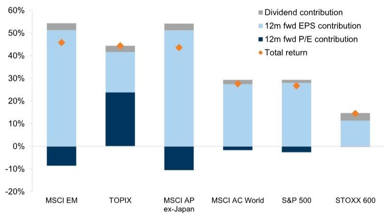

bar_stacked

| Category | Dividend contribution (%) | 12m fwd EPS contribution (%) | 12m fwd P/E contribution (%) | Total return (%) |
|---|---|---|---|---|
| MSCI EM | 3 | 48 | -7 | 46 |
| TOPIX | 3 | 15 | 24 | 45 |
| MSCI AP ex-Japan | 3 | 49 | -9 | 44 |
| MSCI AC World | 0 | 27 | -1 | 28 |
| S&P 500 | 0 | 28 | -1 | 27 |
| STOXX 600 | 3 | 11 | 0 | 15 |

Source: FactSet, Datastream, STOXX, GS Global Investment Research

Exhibit 18: Sales growth, EPS growth and net margins   
Consensus estimates 

<table><tr><td rowspan="2"></td><td colspan="2">Sales Growth (%)</td><td colspan="2">EPS Growth (%)</td><td colspan="2">Net Margin (%)</td></tr><tr><td>2026E</td><td>2027E</td><td>2026E</td><td>2027E</td><td>2026E</td><td>2027E</td></tr><tr><td>S&amp;P 500</td><td>9.5</td><td>7.0</td><td>21.0</td><td>14.2</td><td>15.1</td><td>16.0</td></tr><tr><td>STOXX 600</td><td>5.0</td><td>3.5</td><td>14.2</td><td>9.9</td><td>11.1</td><td>11.6</td></tr><tr><td>TOPIX (FY basis)</td><td>3.0</td><td>3.4</td><td>11.0</td><td>11.6</td><td>7.2</td><td>7.7</td></tr><tr><td>MSCI AP ex Japan</td><td>17.7</td><td>11.7</td><td>53.6</td><td>20.2</td><td>15.6</td><td>16.9</td></tr><tr><td>MSCI EM</td><td>18.0</td><td>11.3</td><td>54.7</td><td>19.9</td><td>15.6</td><td>16.8</td></tr><tr><td>MSCI AC World</td><td>9.3</td><td>6.7</td><td>24.3</td><td>14.1</td><td>14.0</td><td>14.8</td></tr><tr><td>Energy</td><td>12.7</td><td>-4.3</td><td>52.4</td><td>-6.4</td><td>10.1</td><td>9.6</td></tr><tr><td>Materials</td><td>10.5</td><td>3.4</td><td>50.9</td><td>9.1</td><td>11.6</td><td>12.2</td></tr><tr><td>Industrials</td><td>6.9</td><td>6.9</td><td>13.6</td><td>14.2</td><td>9.6</td><td>10.2</td></tr><tr><td>Cons. Discretionary</td><td>7.1</td><td>6.7</td><td>19.0</td><td>18.5</td><td>7.7</td><td>8.5</td></tr><tr><td>Cons. Staples</td><td>4.7</td><td>4.1</td><td>6.5</td><td>8.3</td><td>6.8</td><td>7.1</td></tr><tr><td>Health Care</td><td>5.1</td><td>5.3</td><td>3.8</td><td>16.8</td><td>9.4</td><td>10.4</td></tr><tr><td>Financials</td><td>3.6</td><td>5.2</td><td>8.7</td><td>10.3</td><td>21.8</td><td>22.4</td></tr><tr><td>IT</td><td>30.6</td><td>19.7</td><td>64.1</td><td>26.0</td><td>26.8</td><td>28.2</td></tr><tr><td>Communication Svs</td><td>10.0</td><td>8.6</td><td>19.0</td><td>6.7</td><td>19.1</td><td>18.7</td></tr><tr><td>Utilities</td><td>4.0</td><td>4.7</td><td>8.7</td><td>8.8</td><td>11.3</td><td>11.8</td></tr><tr><td>Real Estate</td><td>5.2</td><td>5.3</td><td>7.5</td><td>7.0</td><td>18.2</td><td>18.8</td></tr></table>

Source: FactSet, STOXX, GS Global Investment Research

Exhibit 17: MSCI AC World 12m trailing return contribution by sector/style 12m trailing return in USD   
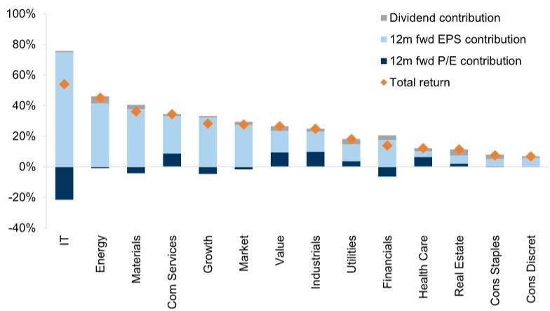

bar

| Category | Dividend contribution (%) | 12m fwd EPS contribution (%) | 12m fwd P/E contribution (%) | Total return (%) |
|---|---|---|---|---|
| IT | 0 | 65 | -18 | 53 |
| Energy | 4 | 42 | 0 | 45 |
| Materials | 0 | 37 | -3 | 39 |
| Com Services | 0 | 33 | 8 | 34 |
| Growth | 0 | 32 | -4 | 29 |
| Market | 0 | 28 | -2 | 28 |
| Value | 0 | 24 | 8 | 25 |
| Industrials | 0 | 17 | 8 | 24 |
| Utilities | 0 | 8 | 3 | 18 |
| Financials | 2 | 17 | -6 | 16 |
| Health Care | 0 | 11 | 5 | 12 |
| Real Estate | 0 | 6 | -2 | 12 |
| Cons Staples | 0 | 5 | 0 | 8 |
| Cons Discret | 0 | 4 | 0 | 6 |

Source: FactSet, STOXX, GS Global Investment Research

Exhibit 19: MSCI AC World EPS   
Consensus estimates in USD   
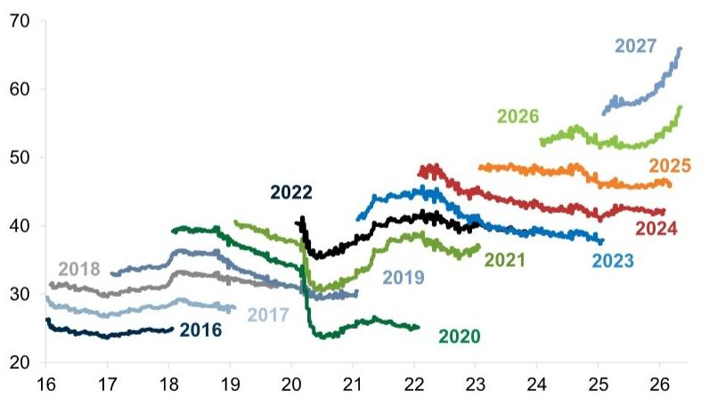

line

| Year | 2016 | 2017 | 2018 | 2020 | 2021 | 2022 | 2023 | 2024 | 2025 | 2026 | 2027 |
|---|---|---|---|---|---|---|---|---|---|---|---|
| Series 1 | 25.0 | 28.0 | 31.0 | 30.0 | 35.0 | 40.0 | 38.0 | 48.0 | 49.0 | 53.0 | 58.0 |
| Series 2 | 24.5 | 27.5 | 30.5 | 31.5 | 36.0 | 41.0 | 39.5 | 47.5 | 48.5 | 54.0 | 60.0 |
| Series 3 | 24.0 | 27.0 | 30.0 | 31.0 | 35.5 | 40.5 | 39.0 | 47.0 | 48.0 | 53.5 | 58.5 |
| Series 4 | 23.5 | 26.5 | 29.5 | 30.5 | 35.0 | 40.0 | 38.5 | 46.5 | 47.5 | 54.0 | 61.0 |
| Series 5 | 23.0 | 26.0 | 30.0 | 31.0 | 34.5 | 39.5 | 38.0 | 46.0 | 47.0 | 53.5 | 58.5 |
| Series 6 | 22.5 | 25.5 | 30.5 | 31.5 | 35.0 | 40.0 | 38.5 | 46.5 | 47.5 | 54.0 | 61.0 |
| Series 7 | 22.0 | 25.0 | 31.0 | 32.0 | 34.5 | 40.5 | 39.0 | 47.0 | 48.0 | 54.5 | 61.5 |
| Series 8 | - | - | - | - | - | - | - | - | - | - | - |
| Series 9 | - | - | - | - | - | - | - | - | - | - | - |
| Series 10 | - | - | - | - | - | - | - | - | - | - | - |
| Series 11 | - | - | - | - | - | - | - | - | - | - | - |
| Series 12 | - | - | - | - | - | - | - | - | - | - | - |
| Series 13 (with label '20') appears to be a data point on the chart, not explicitly labeled in the image.

Source: FactSet, Datastream, STOXX, GS Global Investment Research

# Earnings revisions

Exhibit 20: 2026 EPS revisions   
Indexed to 100. Local currency   
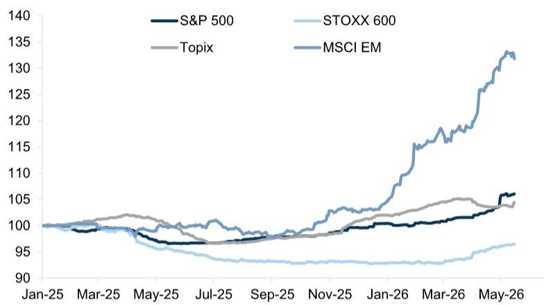

line

| Date   | S&P 500 | STOXX 600 | Topix | MSCI EM |
|--------|---------|-----------|-------|---------|
| Jan-25 | 100     | 100       | 100   | 100     |
| Mar-25 | 99      | 98        | 101   | 100     |
| May-25 | 98      | 97        | 102   | 100     |
| Jul-25 | 97      | 96        | 101   | 101     |
| Sep-25 | 98      | 95        | 100   | 102     |
| Nov-25 | 99      | 94        | 101   | 103     |
| Jan-26 | 100     | 93        | 102   | 115     |
| Mar-26 | 101     | 94        | 103   | 125     |
| May-26 | 106     | 97        | 104   | 133     |

Source: FactSet, STOXX, GS Global Investment Research

Exhibit 22: 3-month EPS revision   
MSCI AC World sectors and Global Regions. Local currency   
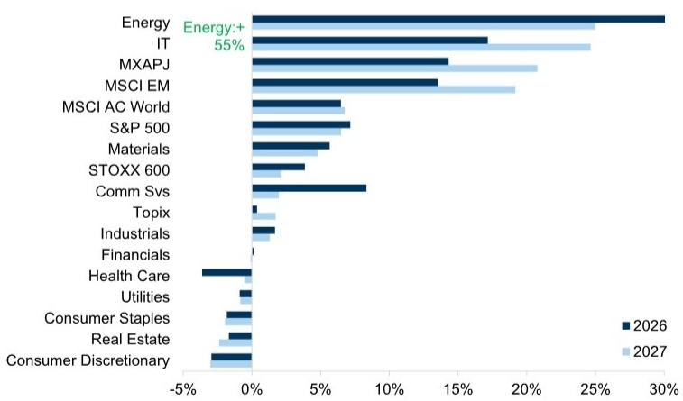

bar

| Sector | 2026 (%) | 2027 (%) |
| :--- | :--- | :--- |
| Energy | 30.0 | 25.0 |
| IT | 17.5 | 24.5 |
| MXAPJ | 14.0 | 20.5 |
| MSCI EM | 13.5 | 19.0 |
| MSCI AC World | 6.5 | 7.0 |
| S&P 500 | 7.5 | 6.5 |
| Materials | 5.5 | 4.5 |
| STOXX 600 | 4.0 | 2.0 |
| Comm Svs | 8.5 | 1.5 |
| Topix | 0.5 | 1.0 |
| Industrials | 1.5 | 1.5 |
| Financials | -0.5 | -0.5 |
| Health Care | -3.0 | -0.5 |
| Utilities | -0.5 | -0.5 |
| Consumer Staples | -1.0 | -1.0 |
| Real Estate | -0.5 | -1.5 |
| Consumer Discretionary | -2.0 | -1.5 |

Source: Datastream, I/B/E/S, STOXX, FactSet, GS Global Investment Research

Exhibit 21: 2026 Earnings Sentiment   
(nb upgrades - nb downgrades) / nb estimates over the past month   
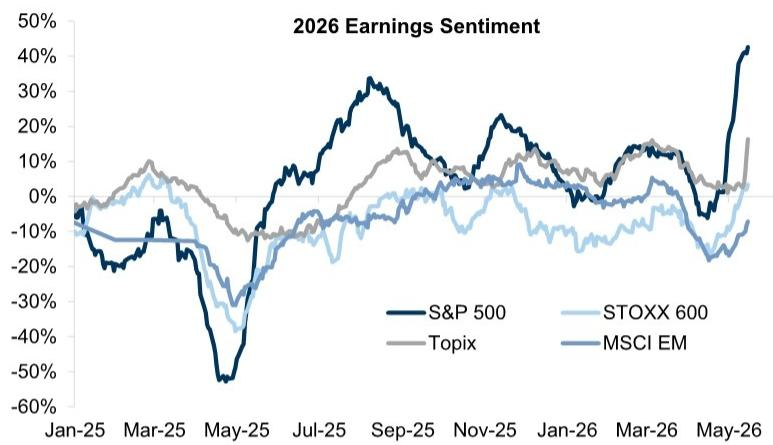

line

| Date   | S&P 500 | STOXX 600 | Topix | MSCI EM |
|--------|---------|-----------|-------|---------|
| Jan-25 | -10%    | -5%       | -5%   | -10%    |
| Mar-25 | -20%    | -10%      | 10%   | -15%    |
| May-25 | -50%    | -30%      | -10%  | -30%    |
| Jul-25 | 30%     | 0%        | 10%   | 0%      |
| Sep-25 | 35%     | 5%        | 15%   | 5%      |
| Nov-25 | 20%     | 0%        | 10%   | 0%      |
| Jan-26 | 10%     | -5%       | 5%    | -5%     |
| Mar-26 | 15%     | 0%        | 10%   | 0%      |
| May-26 | 40%     | 10%       | 15%   | 5%      |

Source: FactSet, STOXX, GS Global Investment Research

Exhibit 23: Year-to-date EPS revisions   
MSCI AC World sectors and Global Regions. Local currency   
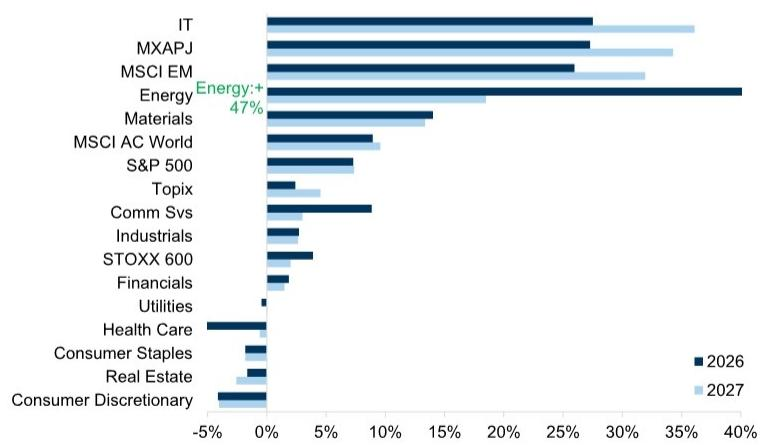

bar

| Sector | 2026 (%) | 2027 (%) |
| :--- | :--- | :--- |
| IT | 28 | 36 |
| MXAPJ | 28 | 34 |
| MSCI EM | 26 | 32 |
| Energy | 40 | 19 |
| Materials | 14 | 13 |
| MSCI AC World | 9 | 10 |
| S&P 500 | 7 | 7 |
| Topix | 3 | 5 |
| Comm Svs | 9 | 3 |
| Industrials | 3 | 3 |
| STOXX 600 | 5 | 3 |
| Financials | 3 | 2 |
| Utilities | -1 | 0 |
| Health Care | -5 | 0 |
| Consumer Staples | -2 | -1 |
| Real Estate | -2 | -2 |
| Consumer Discretionary | -3 | -1 |

Source: Datastream, I/B/E/S, STOXX, FactSet, GS Global Investment Research

# Valuation

Exhibit 24: 12m and 24m fwd MSCI AC World stock valuation   
12m and 24m fwd P/E   
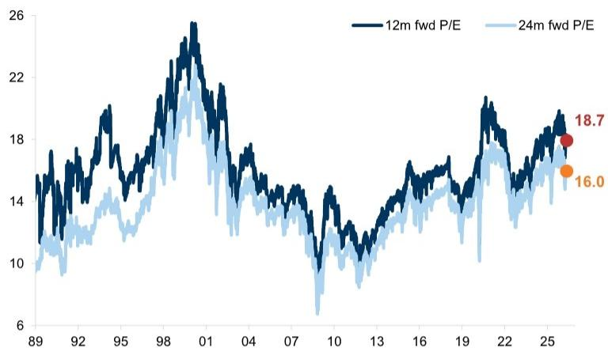

line

| Year | 12m fwd P/E | 24m fwd P/E |
|------|-------------|-------------|
| 2025 | 18.7        | 16.0        |

Source: Datastream, I/B/E/S, GS Global Investment Research

Exhibit 25: Global market implied ERP (%)   
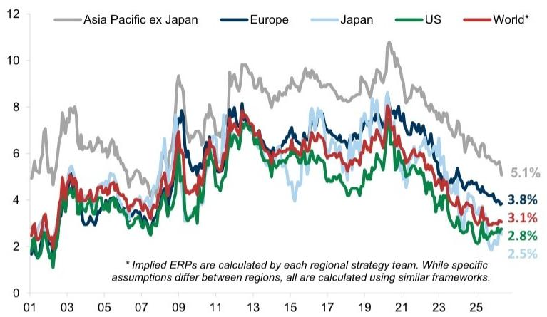

line

| Year | Asia Pacific ex Japan | Europe | Japan | US | World* |
|------|------------------------|--------|-------|----|--------|
| 2025 | 5.1%                   | 3.8%   | 2.5%  | 2.8% | 3.1%   |

Source: GS Global Investment Research

Exhibit 26: MSCI Regions valuations   
12-month forward P/Es relative to the last 20 years - STOXX 600 P/E for Europe   
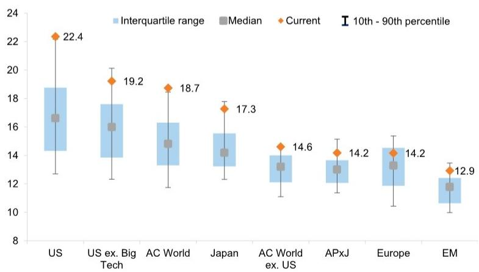

bar

| Region           | Interquartile range | Median | Current |
| ---------------- | ------------------- | ------ | ------- |
| US               | 18.5                | 16.7   | 22.4    |
| US ex. Big Tech | 17.5                | 16.0   | 19.2    |
| AC World         | 16.2                | 14.8   | 18.7    |
| Japan            | 15.5                | 14.0   | 17.3    |
| AC World ex. US  | 13.8                | 13.2   | 14.6    |
| APxJ             | 13.5                | 13.0   | 14.2    |
| Europe           | 14.0                | 13.5   | 14.2    |
| EM               | 12.0                | 11.8   | 12.9    |

Source: FactSet, GS Global Investment Research

Exhibit 27: MSCI World sector/style valuations   
12-month forward P/Es relative to the last 20 years   
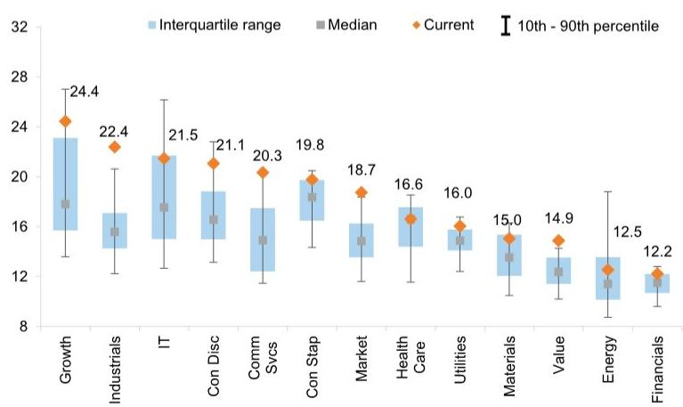

bar_line

| Category | Interquartile range (Min) | Median | Current |
| :--- | :--- | :--- | :--- |
| Growth | 14.5 | 17.2 | 24.4 |
| Industrials | 13.8 | 15.8 | 22.4 |
| IT | 15.2 | 16.9 | 21.5 |
| Con Disc | 14.7 | 16.3 | 21.1 |
| Comm Svcs | 12.8 | 15.4 | 20.3 |
| Con Stap | 16.0 | 17.8 | 19.8 |
| Market | 13.5 | 15.4 | 18.7 |
| Health Care | 14.0 | 16.6 | 16.6 |
| Utilities | 14.8 | 15.5 | 16.0 |
| Materials | 12.5 | 13.8 | 15.0 |
| Value | 12.8 | 13.8 | 14.9 |
| Energy | 10.5 | 11.8 | 12.5 |
| Financials | 9.8 | 12.0 | 12.2 |

Source: FactSet, Datastream, GS Global Investment Research

# Style performance

Exhibit 28: Value vs. Growth   
MSCI Indices relative price return (USD)   
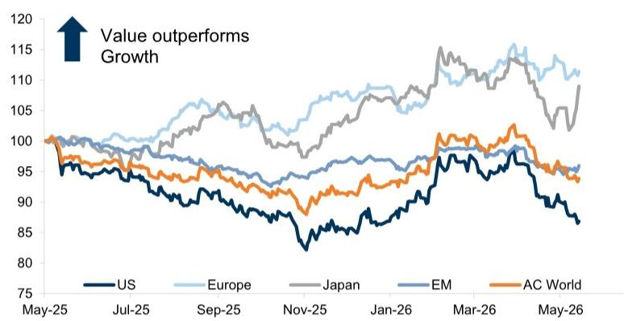

line

| Date   | US   | Europe | Japan | EM   | AC World |
|--------|------|--------|-------|------|----------|
| May-25 | 98   | 100    | 100   | 100  | 100      |
| Jul-25 | 95   | 102    | 101   | 99   | 98       |
| Sep-25 | 93   | 105    | 104   | 98   | 96       |
| Nov-25 | 83   | 108    | 106   | 97   | 94       |
| Jan-26 | 90   | 110    | 108   | 96   | 95       |
| Mar-26 | 98   | 115    | 112   | 97   | 102      |
| May-26 | 87   | 112    | 108   | 95   | 94       |

Source: Datastream, GS Global Investment Research

Exhibit 29: Small-cap vs. Large-cap   
US: MSCI USA Small vs. MSCI USA Large; Europe: MSCI Europe Small vs. MSCI Europe Large; MSCI Japan Small vs. MSCI Japan Large; MSCI EM Small vs. MSCI EM Large   
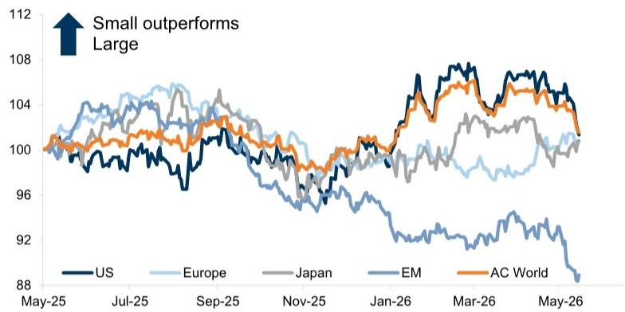

line

| Date   | US   | Europe | Japan | EM   | AC World |
|--------|------|--------|-------|------|----------|
| May-25 | 100  | 100    | 100   | 100  | 100      |
| Jul-25 | 104  | 104    | 104   | 104  | 104      |
| Sep-25 | 102  | 102    | 102   | 102  | 102      |
| Nov-25 | 98   | 98     | 98    | 98   | 98       |
| Jan-26 | 106  | 106    | 106   | 106  | 106      |
| Mar-26 | 108  | 108    | 108   | 108  | 108      |
| May-26 | 104  | 104    | 104   | 104  | 104      |

Source: Datastream, STOXX, GS Global Investment Research

Exhibit 30: Cyclicals vs. Defensives   
MSCI Indices relative price return (USD)   
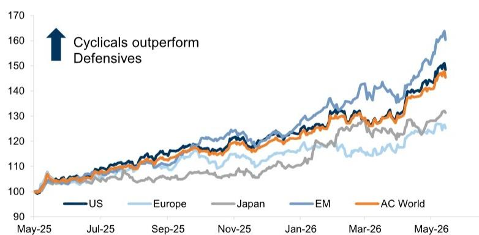

line

| Date   | US   | Europe | Japan | EM   | AC World |
|--------|------|--------|-------|------|----------|
| May-25 | 100  | 100    | 100   | 100  | 100      |
| Jul-25 | 105  | 104    | 103   | 106  | 105      |
| Sep-25 | 110  | 108    | 106   | 112  | 110      |
| Nov-25 | 115  | 112    | 108   | 118  | 115      |
| Jan-26 | 125  | 120    | 115   | 130  | 125      |
| Mar-26 | 135  | 128    | 120   | 145  | 135      |
| May-26 | 150  | 135    | 130   | 165  | 145      |

For details on the construction of the indices, please see: Cyclicals vs. Defensives: A global implementation

Exhibit 31: Momentum vs. Market   
MSCI Momentum Indices relative price return (USD)   
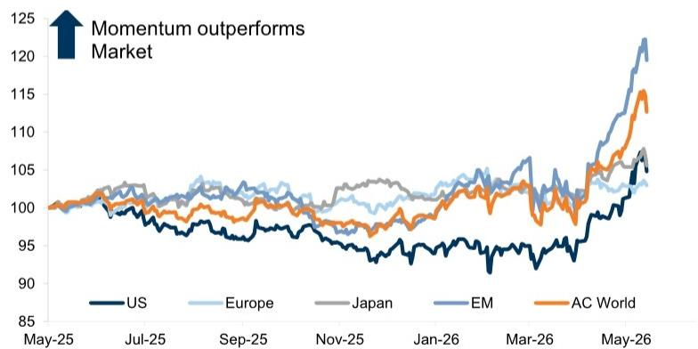

line

| Date   | US   | Europe | Japan | EM   | AC World |
|--------|------|--------|-------|------|----------|
| May-25 | 100  | 100    | 100   | 100  | 100      |
| Jul-25 | 98   | 102    | 103   | 101  | 101      |
| Sep-25 | 97   | 103    | 104   | 102  | 102      |
| Nov-25 | 96   | 104    | 105   | 103  | 103      |
| Jan-26 | 95   | 105    | 106   | 104  | 104      |
| Mar-26 | 94   | 106    | 107   | 105  | 105      |
| May-26 | 108  | 107    | 108   | 122  | 115      |

Source: Datastream, GS Global Investment Research   
Source: Datastream, Worldscope, GS Global Investment Research

# Style valuation

Exhibit 32: Value vs. Growth   
12m fwd P/E Premium (or Discount)   
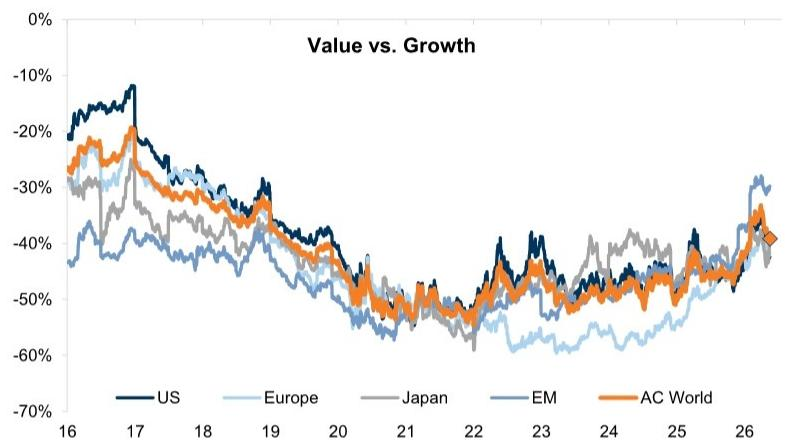

line

| Year | US    | Europe | Japan | EM    | AC World |
|------|-------|--------|-------|-------|----------|
| 16   | -20%  | -30%   | -35%  | -40%  | -25%     |
| 17   | -15%  | -25%   | -30%  | -35%  | -20%     |
| 18   | -25%  | -35%   | -35%  | -40%  | -25%     |
| 19   | -30%  | -40%   | -40%  | -45%  | -30%     |
| 20   | -40%  | -50%   | -45%  | -50%  | -35%     |
| 21   | -50%  | -55%   | -50%  | -55%  | -45%     |
| 22   | -45%  | -50%   | -45%  | -50%  | -40%     |
| 23   | -40%  | -45%   | -40%  | -45%  | -35%     |
| 24   | -35%  | -40%   | -35%  | -40%  | -30%     |
| 25   | -30%  | -35%   | -30%  | -35%  | -25%     |
| 26   | -25%  | -30%   | -25%  | -30%  | -20%     |

Source: FactSet, GS Global Investment Research

Exhibit 33: Small vs. Large   
12m fwd P/E Premium (or Discount)   
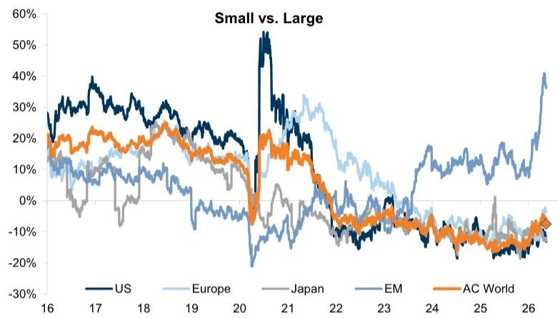

line

| Year | US    | Europe | Japan | EM    | AC World |
|------|-------|--------|-------|-------|----------|
| 16   | 25%   | 15%    | 10%   | 10%   | 20%      |
| 17   | 35%   | 15%    | 10%   | 10%   | 20%      |
| 18   | 30%   | 15%    | 10%   | 10%   | 20%      |
| 19   | 25%   | 15%    | 10%   | 10%   | 20%      |
| 20   | 20%   | 15%    | 10%   | 10%   | 20%      |
| 21   | 55%   | 30%    | 10%   | 10%   | 20%      |
| 22   | -10%  | -10%   | -10%  | -10%  | -10%     |
| 23   | -15%  | -15%   | -15%  | -15%  | -15%     |
| 24   | -10%  | -10%   | -10%  | -10%  | -10%     |
| 25   | -5%   | -5%    | -5%   | -5%   | -5%      |
| 26   | -10%  | -10%   | -10%  | -10%  | -10%     |

Source: FactSet, GS Global Investment Research

Exhibit 34: Cyclicals vs. Defensives   
12m fwd P/E Premium (or Discount)   
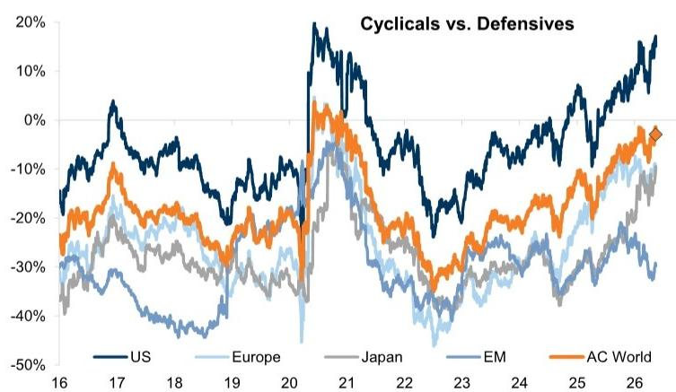

line

| Year | US    | Europe | Japan | EM    | AC World |
|------|-------|--------|-------|-------|----------|
| 16   | -10%  | -15%   | -20%  | -25%  | -18%     |
| 17   | 5%    | -10%   | -15%  | -20%  | -15%     |
| 18   | -5%   | -15%   | -20%  | -25%  | -18%     |
| 19   | -10%  | -20%   | -25%  | -30%  | -20%     |
| 20   | 20%   | -40%   | -30%  | -35%  | -15%     |
| 21   | 10%   | -10%   | -5%   | -15%  | 0%       |
| 22   | -5%   | -15%   | -10%  | -20%  | -5%      |
| 23   | -10%  | -20%   | -15%  | -25%  | -10%     |
| 24   | 0%    | -15%   | -10%  | -20%  | -5%      |
| 25   | 5%    | -10%   | -5%   | -15%  | 0%       |
| 26   | 15%   | -5%    | 0%    | -10%  | 5%       |

For details on the construction of the indices, please see: Cyclicals vs. Defensives: A global implementation

Exhibit 35: Momentum vs. Market   
12m fwd P/E Premium (or Discount)   
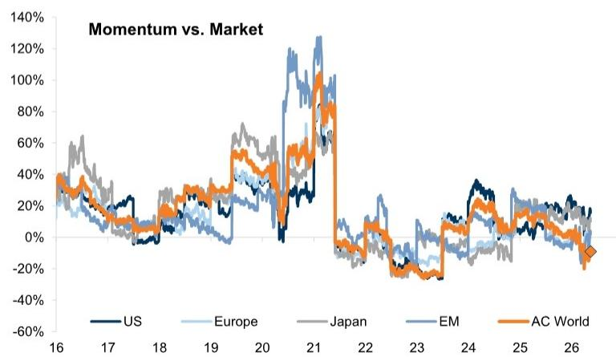

line

| Year | US    | Europe | Japan | EM    | AC World |
|------|-------|--------|-------|-------|----------|
| 16   | ~35%  | ~20%   | ~40%  | ~30%  | ~35%     |
| 17   | ~20%  | ~10%   | ~30%  | ~20%  | ~25%     |
| 18   | ~10%  | ~5%    | ~20%  | ~10%  | ~15%     |
| 19   | ~20%  | ~10%   | ~30%  | ~20%  | ~25%     |
| 20   | ~30%  | ~20%   | ~40%  | ~30%  | ~35%     |
| 21   | ~120% | ~80%   | ~100% | ~130% | ~100%    |
| 22   | ~-20% | ~-10%  | ~-5%  | ~-10% | ~-5%     |
| 23   | ~-30% | ~-20%  | ~-10% | ~-5%  | ~-10%    |
| 24   | ~35%  | ~20%   | ~10%  | ~5%   | ~10%     |
| 25   | ~20%  | ~10%   | ~5%   | ~0%   | ~5%      |
| 26   | ~-10% | ~-5%   | ~-10% | ~-5%  | ~-10%    |

Source: FactSet, GS Global Investment Research   
Source: FactSet, GS Global Investment Research

# Sector weights, geographical exposure and concentration

Exhibit 36: Index sector composition 

<table><tr><td>GICS Sector</td><td>U.S.</td><td>Europe</td><td>Japan</td><td>APxJ</td><td>AC World</td></tr><tr><td>Energy</td><td>3.3</td><td>4.3</td><td>0.8</td><td>3.2</td><td>3.8</td></tr><tr><td>Materials</td><td>2.1</td><td>5.7</td><td>3.5</td><td>5.7</td><td>3.6</td></tr><tr><td>Industrials</td><td>8.7</td><td>17.9</td><td>23.4</td><td>7.2</td><td>10.7</td></tr><tr><td>Consumer Discretionary</td><td>10.6</td><td>8.7</td><td>18.3</td><td>13.7</td><td>10.7</td></tr><tr><td>Consumer Staples</td><td>6.0</td><td>10.3</td><td>5.6</td><td>3.9</td><td>6.4</td></tr><tr><td>Health Care</td><td>10.8</td><td>14.0</td><td>7.6</td><td>4.5</td><td>9.9</td></tr><tr><td>Financials</td><td>14.0</td><td>22.7</td><td>15.8</td><td>25.4</td><td>18.0</td></tr><tr><td>Real Estate</td><td>2.3</td><td>0.8</td><td>2.5</td><td>2.8</td><td>2.1</td></tr><tr><td>Information Technology</td><td>30.2</td><td>7.0</td><td>13.2</td><td>21.1</td><td>23.7</td></tr><tr><td>Communication Services</td><td>9.4</td><td>4.2</td><td>8.2</td><td>9.9</td><td>8.3</td></tr><tr><td>Utilities</td><td>2.5</td><td>4.3</td><td>1.1</td><td>2.6</td><td>2.8</td></tr><tr><td>Total</td><td>100.0</td><td>100.0</td><td>100.0</td><td>100.0</td><td>100.0</td></tr></table>

Source: MSCI, FactSet, GS Global Investment Research

Exhibit 38: Geographical Sales Exposure   
MSCI Indices. See our Portfolio Passport 2024.   

bar_stacked

| Region | North America (%) | Europe (%) | Japan (%) | APAC ex Japan (%) | Other EM (%) |
| :--- | :--- | :--- | :--- | :--- | :--- |
| US | 71 | 9 | 2 | 10 | 8 |
| Europe | 21 | 48 | 3 | 15 | 13 |
| Japan | 15 | 7 | 60 | 14 | 4 |
| APAC ex J | 8 | 6 | 1 | 82 | 3 |

Source: MSCI, FactSet, GS Global Investment Research

Exhibit 37: GS recommended sector weightings by region 

<table><tr><td>GICS Sector</td><td>U.S.</td><td>Europe</td><td>Japan</td><td>APxJ</td></tr><tr><td>Energy</td><td>N</td><td>N</td><td>N</td><td>OW</td></tr><tr><td>Materials</td><td>OW</td><td>N</td><td>N</td><td>N</td></tr><tr><td>Industrials</td><td>N</td><td>N</td><td>OW</td><td>OW</td></tr><tr><td>Consumer discretionary</td><td>OW</td><td>UW</td><td>N</td><td>N</td></tr><tr><td>Consumer staples</td><td>N</td><td>OW</td><td>UW</td><td>UW</td></tr><tr><td>Health care</td><td>OW</td><td>N</td><td>UW</td><td>OW</td></tr><tr><td>Financials</td><td>N</td><td>OW</td><td>OW</td><td>N</td></tr><tr><td>Real Estate</td><td>N</td><td>N</td><td>N</td><td>N</td></tr><tr><td>Information technology</td><td>OW*</td><td>OW</td><td>OW</td><td>OW</td></tr><tr><td>Communication services</td><td>N</td><td>OW</td><td>OW</td><td>OW</td></tr><tr><td>Utilities</td><td>N</td><td>N</td><td>UW</td><td>UW</td></tr></table>

\*US OW refers just to Software & Services   
Source: GS Global Investment Research

Exhibit 39: Country Composition   
MSCI AC World Index   

pie

| Country | Percentage (%) |
| :--- | :--- |
| United States | 63 |
| Other | 24 |
| Japan | 5 |
| China | 3 |
| UK | 3 |
| France | 2 |

Source: FactSet, GS Global Investment Research

# Cross-asset performance and correlation

Exhibit 40: Performance of equities, bonds and commodities   
Indexed USD total returns, Equities refer to MSCI AC World, Commodities refer to S&P GSCI® & Bonds refer to US 10y Govt. bonds   
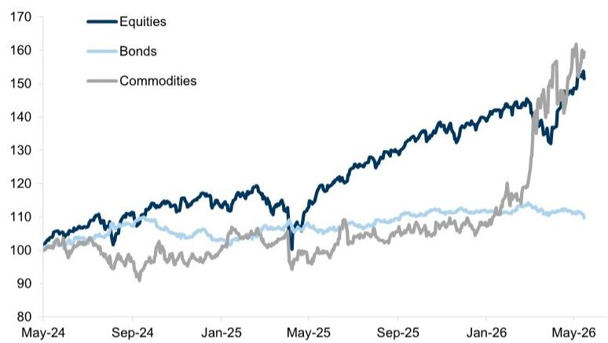

line

| Date   | Equities | Bonds | Commodities |
|--------|----------|-------|-------------|
| May-24 | 105      | 103   | 102         |
| Sep-24 | 110      | 108   | 95          |
| Jan-25 | 115      | 107   | 105         |
| May-25 | 100      | 108   | 98          |
| Sep-25 | 130      | 110   | 108         |
| Jan-26 | 140      | 112   | 120         |
| May-26 | 155      | 110   | 160         |

Source: FactSet, GS Global Investment Research

Exhibit 41: 3m rolling equity/bond correlation of weekly returns   
S&P 500 vs. US 10y Index; EURO STOXX 50 vs. Germany 10y Index; Topix vs. Japan 10y Index; MSCI EM vs. US 10y Index   
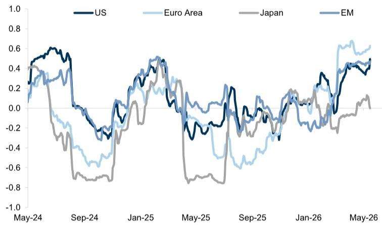

line

| Date   | US    | Euro Area | Japan | EM    |
|--------|-------|-----------|-------|-------|
| May-24 | 0.6   | 0.4       | 0.4   | 0.3   |
| Sep-24 | 0.0   | -0.2      | -0.8  | -0.1  |
| Jan-25 | 0.5   | 0.3       | 0.2   | 0.4   |
| May-25 | -0.2  | -0.4      | -0.8  | -0.1  |
| Sep-25 | 0.2   | -0.6      | -0.2  | 0.1   |
| Jan-26 | 0.4   | 0.6       | 0.1   | 0.3   |
| May-26 | 0.5   | 0.7       | 0.2   | 0.4   |

Source: Datastream, STOXX, GS Global Investment Research

Exhibit 42: 3m correlation of weekly returns with GSCI Total Return Index   
Correlation vs. GSCI Commodities Total Return Index   
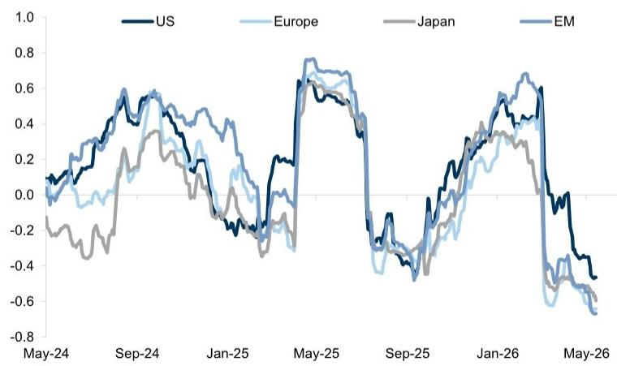

line

| Date   | US    | Europe | Japan | EM    |
|--------|-------|--------|-------|-------|
| May-24 | 0.1   | 0.0    | -0.2  | 0.0   |
| Sep-24 | 0.6   | 0.5    | 0.3   | 0.6   |
| Jan-25 | 0.2   | 0.1    | -0.1  | 0.1   |
| May-25 | 0.7   | 0.6    | 0.5   | 0.7   |
| Sep-25 | -0.3  | -0.4   | -0.5  | -0.3  |
| Jan-26 | 0.6   | 0.5    | 0.4   | 0.6   |
| May-26 | -0.6  | -0.7   | -0.6  | -0.7  |

Source: Datastream, GS Global Investment Research

Exhibit 43: 3m rolling equity/FX correlation of weekly returns   
S&P 500 vs. GS USD TWI; EURO STOXX 50 vs. EUR/USD; Topix vs. JPY/USD; MSCI EM vs. GS USD TWI   
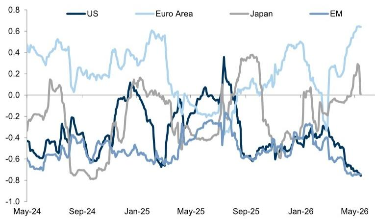

line

| Date   | US    | Euro Area | Japan | EM    |
|--------|-------|-----------|-------|-------|
| May-24 | -0.6  | 0.4       | -0.2  | -0.7  |
| Sep-24 | -0.3  | 0.5       | 0.1   | -0.5  |
| Jan-25 | 0.1   | 0.6       | 0.15  | -0.6  |
| May-25 | -0.2  | 0.1       | -0.1  | -0.4  |
| Sep-25 | 0.4   | 0.3       | 0.4   | -0.6  |
| Jan-26 | -0.5  | 0.5       | -0.3  | -0.7  |
| May-26 | -0.8  | 0.7       | 0.3   | -0.8  |

Source: Datastream, STOXX, GS Global Investment Research

# Flows from Global investors into equity funds

Exhibit 44: Monthly flows from Global investors into DM and EM equity funds In USD bn.   
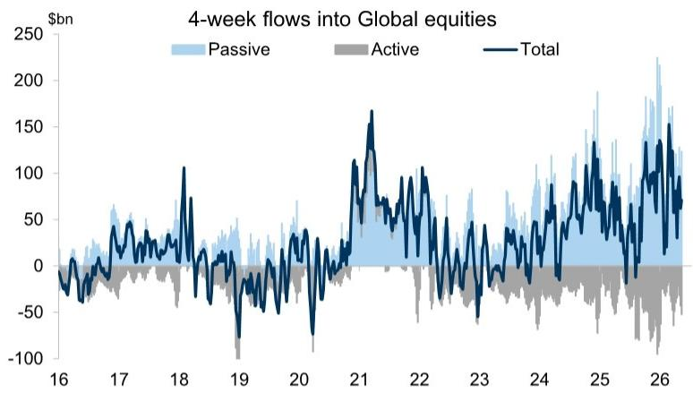

line

| Week | Total ($bn) | Passive ($bn) | Active ($bn) |
|------|-------------|---------------|--------------|
| 16   | -30         | 10            | -10          |
| 17   | 20          | 30            | -5           |
| 18   | 100         | 40            | 0            |
| 19   | -80         | 20            | -10          |
| 20   | 30          | 40            | -5           |
| 21   | 160         | 50            | 0            |
| 22   | 100         | 30            | -5           |
| 23   | 40          | 20            | -10          |
| 24   | 80          | 40            | -5           |
| 25   | 120         | 50            | 0            |
| 26   | 150         | 60            | -5           |

Source: EPFR, GS Global Investment Research   
Monthly flows, USD bn. EPFR Country Flows (weekly data for current month).

Exhibit 45: Cumulative flows into equity by regions

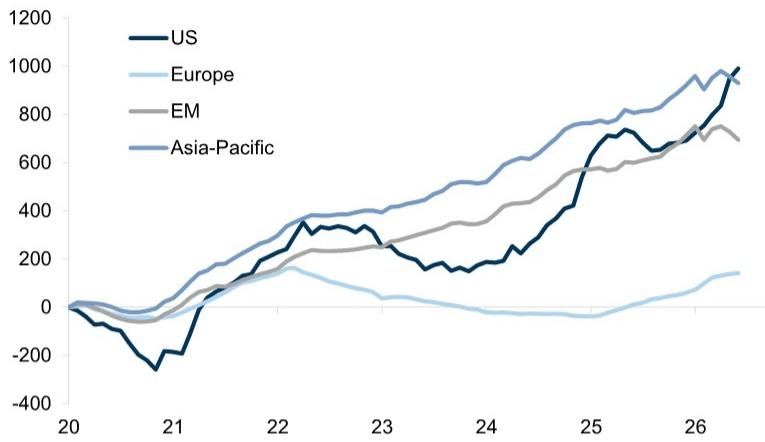

line

| Year | US    | Europe | EM    | Asia-Pacific |
|------|-------|--------|-------|--------------|
| 20   | 0     | 0      | 0     | 0            |
| 21   | -300  | -50    | -50   | -50          |
| 22   | 300   | 150    | 200   | 350          |
| 23   | 250   | 50     | 300   | 400          |
| 24   | 150   | -50    | 400   | 500          |
| 25   | 700   | -50    | 600   | 750          |
| 26   | 1000  | 150    | 750   | 950          |

Source: EPFR, Haver Analytics, GS Global Investment Research

Exhibit 46: Calendarised flows from Global investors into DM and EM equity funds   
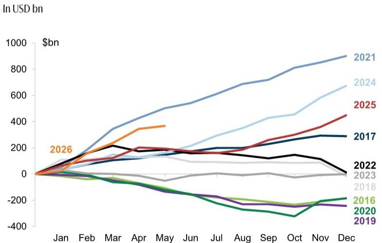

line

| Month | 2017 ($bn) | 2018 ($bn) | 2019 ($bn) | 2020 ($bn) | 2021 ($bn) | 2022 ($bn) | 2023 ($bn) | 2024 ($bn) | 2025 ($bn) | 2026 ($bn) |
|---|---|---|---|---|---|---|---|---|---|---|
| Jan | 0 | 0 | 0 | 0 | 0 | 0 | 0 | 0 | 0 | 0 |
| Feb | 50 | -50 | -50 | -50 | 100 | -50 | -50 | 50 | 100 | 150 |
| Mar | 100 | -100 | -100 | -100 | 200 | -100 | -100 | 150 | 150 | 250 |
| Apr | 150 | -150 | -150 | -150 | 350 | -150 | -150 | 200 | 200 | 350 |
| May | 200 | -200 | -200 | -200 | 500 | -200 | -200 | 250 | 250 | 350 |
| Jun | 250 | -250 | -250 | -250 | 600 | -250 | -250 | 300 | 300 | 450 |
| Jul | 300 | -300 | -300 | -300 | 700 | -300 | -300 | 350 | 350 | 550 |
| Aug | 350 | -350 | -350 | -350 | 800 | -350 | -350 | 450 | 450 | 650 |
| Sep | 400 | -400 | -400 | -400 | 900 | -400 | -400 | 550 | 550 | 750 |
| Oct | 450 | -450 | -450 | -450 | 1050 | -450 | -450 | 650 | 650 | 850 |
| Nov | 550 | -550 | -550 | -550 | 1250 | -550 | -550 | 750 | 750 | 950 |
| Dec | 650 | -650 | -650 | -650 | 1450 | -650 | -650 | 850 | 850 | 1150 |
The chart displays a line graph with values in $bn on the Y-axis and months on the X-axis. The legend indicates specific data series: '26' (Jan), '27', '28', '29', '38', '39', '48', '49', '58'. The chart is grouped by year from January to December. Values are estimated based on the chart's axis labels.

Source: EPFR, GS Global Investment Research

Exhibit 47: Cumulative flows from Global investors into DM and EM funds Active and Passive funds. Monthly flows, USD bn. EPFR Country Flows (weekly data for current month)   
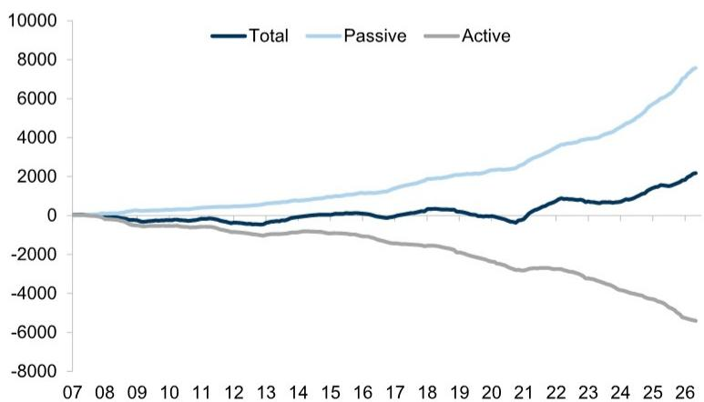

line

| Year | Total | Passive | Active |
|------|-------|---------|--------|
| 07   | 0     | 0       | 0      |
| 08   | -50   | 50      | -50    |
| 09   | -100  | 100     | -100   |
| 10   | -150  | 150     | -150   |
| 11   | -200  | 200     | -200   |
| 12   | -150  | 250     | -250   |
| 13   | -100  | 300     | -300   |
| 14   | -50   | 350     | -350   |
| 15   | 0     | 400     | -400   |
| 16   | 50    | 450     | -450   |
| 17   | 100   | 500     | -500   |
| 18   | 150   | 550     | -550   |
| 19   | 200   | 600     | -600   |
| 20   | 250   | 650     | -650   |
| 21   | 300   | 700     | -700   |
| 22   | 350   | 750     | -750   |
| 23   | 400   | 800     | -800   |
| 24   | 450   | 850     | -850   |
| 25   | 500   | 900     | -900   |
| 26   | 550   | 950     | -950   |

Source: EPFR, GS Global Investment Research

# Emerging Markets vs. Developed Markets

Exhibit 48: EM vs. DM performance   
Relative price performance, indexed to 100 from 1 year ago   
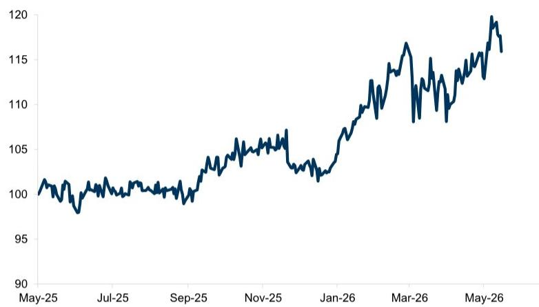

line

| Date   | Value |
|--------|-------|
| May-25 | 100   |
| Jul-25 | 98    |
| Sep-25 | 100   |
| Nov-25 | 105   |
| Jan-26 | 103   |
| Mar-26 | 117   |
| May-26 | 119   |

Source: FactSet, GS Global Investment Research

Exhibit 49: 2026 earnings sentiment % for MSCI The World and EM   
Earnings sentiment = (upgrades - downgrades) / total estimates on all stocks   
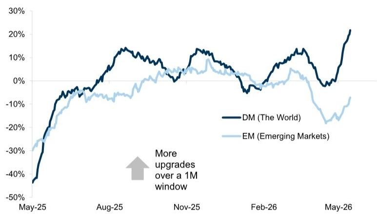

line

| Date   | DM (The World) | EM (Emerging Markets) |
|--------|----------------|------------------------|
| May-25 | -45%           | -30%                   |
| Aug-25 | 15%            | -5%                    |
| Nov-25 | 10%            | 5%                     |
| Feb-26 | -5%            | 0%                     |
| May-26 | 20%            | -10%                   |

Source: FactSet, GS Global Investment Research

Exhibit 50: EM vs. DM valuation   
12-month forward P/E Premium (Discount)   
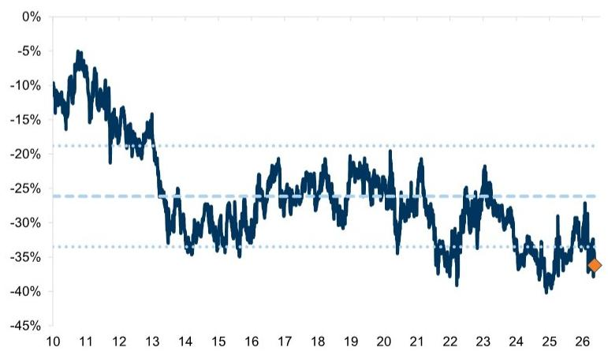

line

| Year | Value  |
|------|--------|
| 10   | -10%   |
| 11   | -5%    |
| 12   | -15%   |
| 13   | -20%   |
| 14   | -30%   |
| 15   | -25%   |
| 16   | -20%   |
| 17   | -25%   |
| 18   | -20%   |
| 19   | -25%   |
| 20   | -30%   |
| 21   | -25%   |
| 22   | -35%   |
| 23   | -25%   |
| 24   | -30%   |
| 25   | -35%   |
| 26   | -35%   |

Source: FactSet, GS Global Investment Research

Exhibit 51: EM vs. DM Cumulative flows (% Total Net Assets)   
Monthly flows, EPFR Country Flows (weekly data for current month).   
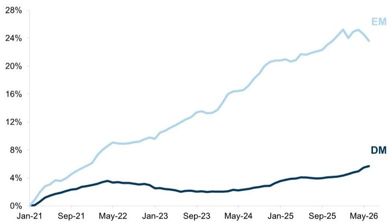

line

| Date   | EM    | DM    |
|--------|-------|-------|
| Jan-21 | 0%    | 0%    |
| Sep-21 | ~4%   | ~2%   |
| May-22 | ~8%   | ~3%   |
| Jan-23 | ~10%  | ~3%   |
| Sep-23 | ~13%  | ~2%   |
| May-24 | ~16%  | ~2%   |
| Jan-25 | ~20%  | ~3%   |
| Sep-25 | ~24%  | ~4%   |
| May-26 | ~24%  | ~5%   |

Source: EPFR, Haver Analytics, GS Global Investment Research

# Vol, skew and dividends

Exhibit 52: Implied volatility of 3-month atms   
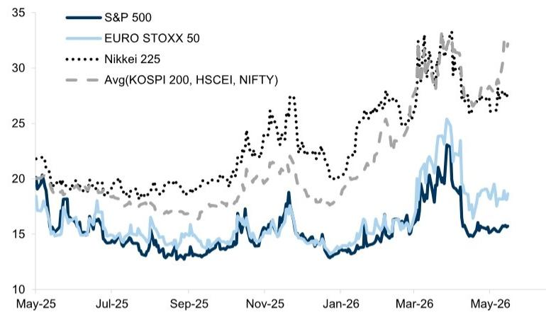

line

| Date   | S&P 500 | EURO STOXX 50 | Nikkei 225 | Avg(KOSPI 200, HSCEI, NIFTY) |
|--------|---------|---------------|------------|------------------------------|
| May-25 | ~19     | ~18           | ~21        | ~20                          |
| Jul-25 | ~14     | ~14           | ~19        | ~18                          |
| Sep-25 | ~13     | ~13           | ~19        | ~17                          |
| Nov-25 | ~18     | ~17           | ~27        | ~23                          |
| Jan-26 | ~13     | ~13           | ~20        | ~18                          |
| Mar-26 | ~23     | ~25           | ~33        | ~30                          |
| May-26 | ~16     | ~18           | ~28        | ~32                          |

Source: Bloomberg, STOXX, GS Global Investment Research

Exhibit 53: 3-month normalised skew   
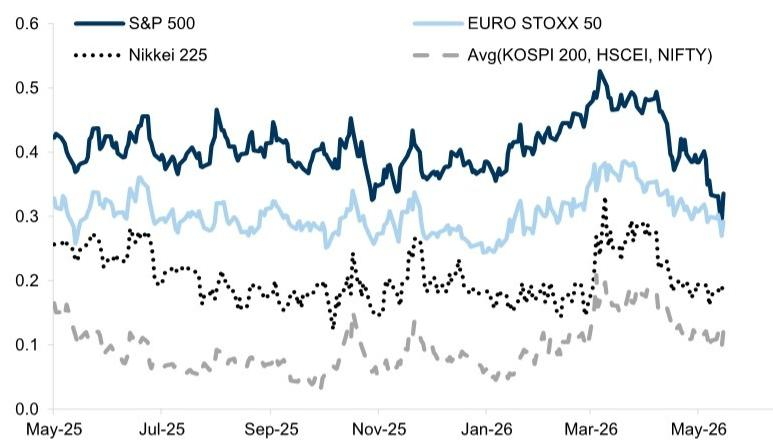

line

| Date   | S&P 500 | EURO STOXX 50 | Nikkei 225 | Avg(KOSPI 200, HSCEI, NIFTY) |
|--------|---------|---------------|------------|------------------------------|
| May-25 | 0.4     | 0.3           | 0.25       | 0.1                          |
| Jul-25 | 0.45    | 0.35          | 0.2        | 0.1                          |
| Sep-25 | 0.4     | 0.3           | 0.15       | 0.05                         |
| Nov-25 | 0.45    | 0.35          | 0.2        | 0.1                          |
| Jan-26 | 0.4     | 0.3           | 0.15       | 0.05                         |
| Mar-26 | 0.5     | 0.35          | 0.2        | 0.1                          |
| May-26 | 0.3     | 0.25          | 0.15       | 0.1                          |

Source: Bloomberg, STOXX, GS Global Investment Research

Exhibit 54: 2026 dividend markets, rebased to 100   
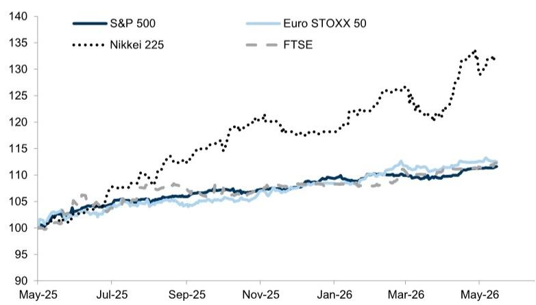

line

| Date   | S&P 500 | Euro STOXX 50 | Nikkei 225 | FTSE |
|--------|---------|---------------|------------|------|
| May-25 | 100     | 100           | 100        | 100  |
| Jul-25 | 105     | 105           | 108        | 106  |
| Sep-25 | 107     | 106           | 112        | 108  |
| Nov-25 | 108     | 107           | 120        | 109  |
| Jan-26 | 109     | 108           | 122        | 109  |
| Mar-26 | 110     | 111           | 126        | 110  |
| May-26 | 111     | 112           | 134        | 111  |

Source: Bloomberg, STOXX, GS Global Investment Research

Exhibit 55: 2026 implied dividend yield   
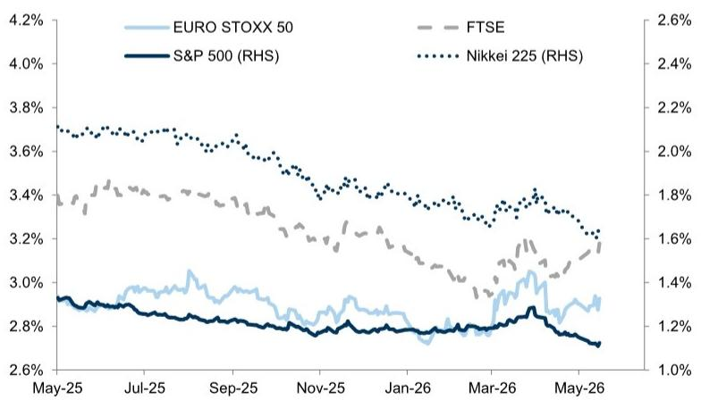

line

| Date   | EURO STOXX 50 | FTSE  | S&P 500 (RHS) | Nikkei 225 (RHS) |
|--------|---------------|-------|---------------|------------------|
| May-25 | 3.0%          | 3.4%  | 2.9%          | 2.7%             |
| Jul-25 | 3.0%          | 3.4%  | 2.8%          | 2.7%             |
| Sep-25 | 3.0%          | 3.4%  | 2.8%          | 2.7%             |
| Nov-25 | 3.0%          | 3.4%  | 2.8%          | 2.7%             |
| Jan-26 | 3.0%          | 3.4%  | 2.8%          | 2.7%             |
| Mar-26 | 3.0%          | 3.4%  | 2.8%          | 2.7%             |
| May-26 | 3.0%          | 3.4%  | 2.8%          | 2.7%             |

Source: Bloomberg, STOXX, GS Global Investment Research

# Disclosure Appendix

# Reg AC

We, Guillaume Jaisson, Peter Oppenheimer, Sharon Bell, John Kwon and Giovanni Ferrannini, hereby certify that all of the views expressed in this report accurately reflect our personal views, which have not been influenced by considerations of the firm's business or client relationships.

Unless otherwise stated, the individuals listed on the cover page of this report are analysts in GS' Global Investment Research division.

Contributing Authors: Guillaume Jaisson GS International, Peter Oppenheimer GS International, Sharon Bell GS International, John Kwon GS (Singapore) Pte, Giovanni Ferrannini GS International.

Unless otherwise stated, the individuals listed in the Contributing Authors disclosure of this report are analysts in GS' Global Investment Research division.

# Disclosures

# MSCI disclosure

All MSCI data used in this report is the exclusive property of MSCI, Inc. (MSCI). Without prior written permission of MSCI, this information and any other MSCI intellectual property may not be reproduced or redisseminated in any form and may not be used to create any financial instruments or products or any indices. This information is provided on an “as is” basis, and the user of this information assumes the entire risk of any use made of this information. Neither MSCI, any of its affiliates nor any third party involved in, or related to, computing or compiling the data makes any express or implied warranties or representations with respect to this information (or the results to be obtained by the use thereof), and MSCI, its affiliates and any such third party hereby expressly disclaim all warranties of originality, accuracy, completeness, merchantability or fitness for a particular purpose with respect to any of this information. Without limiting any of the foregoing, in no event shall MSCI, any of its affiliates or any third party involved in, or related to, computing or compiling the data have any liability for any direct, indirect, special, punitive, consequential or any other damages (including lost profits) even if notified of the possibility of such damages. MSCI and the MSCI indexes are service marks of MSCI and its affiliates. The Global Industry Classification Standard (GICS) were developed by and is the exclusive property of MSCI and Standard & Poor’s. GICS is a service mark of MSCI and S&P and has been licensed for use by The GS Group, Inc.

# Regulatory disclosures

# Disclosures required by United States laws and regulations

See company-specific regulatory disclosures above for any of the following disclosures required as to companies referred to in this report: manager or co-manager in a pending transaction; 1% or other ownership; compensation for certain services; types of client relationships; managed/co-managed public offerings in prior periods; directorships; for equity securities, market making and/or specialist role. GS trades or may trade as a principal in debt securities (or in related derivatives) of issuers discussed in this report.

The following are additional required disclosures: Ownership and material conflicts of interest: GS policy prohibits its analysts, professionals reporting to analysts and members of their households from owning securities of any company in the analyst's area of coverage. Analyst compensation: Analysts are paid in part based on the profitability of GS, which includes investment banking revenues. Analyst as officer or director: GS policy generally prohibits its analysts, persons reporting to analysts or members of their households from serving as an officer, director or advisor of any company in the analyst's area of coverage. Non-U.S. Analysts: Non-U.S. analysts may not be associated persons of GS & Co. LLC and therefore may not be subject to FINRA Rule 2241 or FINRA Rule 2242 restrictions on communications with a subject company, public appearances and trading in securities covered by the analysts.

# Additional disclosures required under the laws and regulations of jurisdictions other than the United States

The following disclosures are those required by the jurisdiction indicated, except to the extent already made above pursuant to United States laws and regulations. Australia: GS Australia Pty Ltd and its affiliates are not authorised deposit-taking institutions (as that term is defined in the Banking Act 1959 (Cth)) in Australia and do not provide banking services, nor carry on a banking business, in Australia. This research, and any access to it, is intended only for “wholesale clients” within the meaning of the Australian Corporations Act, unless otherwise agreed by GS. In producing research reports, members of Global Investment Research of GS Australia may attend site visits and other meetings hosted by the companies and other entities which are the subject of its research reports. In some instances the costs of such site visits or meetings may be met in part or in whole by the issuers concerned if GS Australia considers it is appropriate and reasonable in the specific circumstances relating to the site visit or meeting. To the extent that the contents of this document contains any financial product advice, it is general advice only and has been prepared by GS without taking into account a client’s objectives, financial situation or needs. A client should, before acting on any such advice, consider the appropriateness of the advice having regard to the client’s own objectives, financial situation and needs. A copy of certain GS Australia and New Zealand disclosure of interests and a copy of GS’ Australian Sell-Side Research Independence Policy Statement are available at: https://www.goldmansachs.com/disclosures/australia-new-zealand/index.html. Brazil: Disclosure information in relation to CVM Resolution n. 20 is available at https://www.gs.com/worldwide/brazil/area/gir/index.html. Where applicable, the Brazil-registered analyst primarily responsible for the content of this research report, as defined in Article 20 of CVM Resolution n. 20, is the first author named at the beginning of this report, unless indicated otherwise at the end of the text. Canada: This information is being provided to you for information purposes only and is not, and under no circumstances should be construed as, an advertisement, offering or solicitation by GS & Co. LLC for purchasers of securities in Canada to trade in any Canadian security. GS & Co. LLC is not registered as a dealer in any jurisdiction in Canada under applicable Canadian securities laws and generally is not permitted to trade in Canadian securities and may be prohibited from selling certain securities and products in certain jurisdictions in Canada. If you wish to trade in any Canadian securities or other products in Canada please contact GS Canada Inc., an affiliate of The GS Group Inc., or another registered Canadian dealer. Hong Kong: Further information on the securities of covered companies referred to in this research may be obtained on request from GS (Asia) L.L.C. India: Further information on the subject company or companies referred to in this research may be obtained from GS (India) Securities Private Limited, Research Analyst - SEBI Registration Number INH000001493, 10th Floor, Ascent-Worli, Sudam Kalu Ahire Marg, Worli, Mumbai-400 025, India, Corporate Identity Number U74140MH2006FTC160634, Phone +91 22 6616 9000, Fax +91 22 6616 9001. GS may beneficially own 1% or more of the securities (as such term is defined in clause 2 (h) the Indian Securities

Contracts (Regulation) Act, 1956) of the subject company or companies referred to in this research report. Investment in securities market are subject to market risks. Read all the related documents carefully before investing. Registration granted by SEBI and certification from NISM in no way guarantee performance of the intermediary or provide any assurance of returns to investors. GS (India) Securities Private Limited compliance officer and investor grievance contact details can be found at: https://www.goldmansachs.com/worldwide/india/documents/Grievance-Redressal-and-Escalation-Matrix.pdf, and a copy of the annual audit compliance report can be found at this link: https://publishing.gs.com/content/site/india-annual-compliance-report.html. Japan: See below. Korea: This research, and any access to it, is intended only for “professional investors” within the meaning of the Financial Services and Capital Markets Act, unless otherwise agreed by GS. Further information on the subject company or companies referred to in this research may be obtained from GS (Asia) L.L.C., Seoul Branch. New Zealand: GS New Zealand Limited and its affiliates are neither “registered banks” nor “deposit takers” (as defined in the Reserve Bank of New Zealand Act 1989) in New Zealand. This research, and any access to it, is intended for “wholesale clients” (as defined in the Financial Advisers Act 2008) unless otherwise agreed by GS. A copy of certain GS Australia and New Zealand disclosure of interests is available at: https://www.goldmansachs.com/disclosures/australia-new-zealand/index.html. Russia: Research reports distributed in the Russian Federation are not advertising as defined in the Russian legislation, but are information and analysis not having product promotion as their main purpose and do not provide appraisal within the meaning of the Russian legislation on appraisal activity. Research reports do not constitute a personalized investment recommendation as defined in Russian laws and regulations, are not addressed to a specific client, and are prepared without analyzing the financial circumstances, investment profiles or risk profiles of clients. GS assumes no responsibility for any investment decisions that may be taken by a client or any other person based on this research report. Singapore: GS (Singapore) Pte. (Company Number: 198602165W), which is regulated by the Monetary Authority of Singapore, accepts legal responsibility for this research, and should be contacted with respect to any matters arising from, or in connection with, this research. Taiwan: This material is for reference only and must not be reprinted without permission. Investors should carefully consider their own investment risk. Investment results are the responsibility of the individual investor. United Kingdom: Persons who would be categorized as retail clients in the United Kingdom, as such term is defined in the rules of the Financial Conduct Authority, should read this research in conjunction with prior GS on the covered companies referred to herein and should refer to the risk warnings that have been sent to them by GS International. A copy of these risks warnings, and a glossary of certain financial terms used in this report, are available from GS International on request.

European Union and United Kingdom: Disclosure information in relation to Article 6 (2) of the European Commission Delegated Regulation (EU) (2016/958) supplementing Regulation (EU) No 596/2014 of the European Parliament and of the Council (including as that Delegated Regulation is implemented into United Kingdom domestic law and regulation following the United Kingdom's departure from the European Union and the European Economic Area) with regard to regulatory technical standards for the technical arrangements for objective presentation of investment recommendations or other information recommending or suggesting an investment strategy and for disclosure of particular interests or indications of conflicts of interest is available at https://www.gs.com/disclosures/europeanpolicy.html which states the European Policy for Managing Conflicts of Interest in Connection with Investment Research.

Japan: GS Japan Co., Ltd. is a Financial Instrument Dealer registered with the Kanto Financial Bureau under registration number Kinsho 69, and a member of Japan Securities Dealers Association, Financial Futures Association of Japan Type II Financial Instruments Firms Association, and Investment Management Association of Japan. Sales and purchase of equities are subject to commission pre-determined with clients plus consumption tax. See company-specific disclosures as to any applicable disclosures required by Japanese stock exchanges, the Japanese Securities Dealers Association or the Japanese Securities Finance Company.

# Global product; distributing entities

GS Global Investment Research produces and distributes research products for clients of GS on a global basis. Analysts based in GS offices around the world produce research on industries and companies, and research on macroeconomics, currencies, commodities and portfolio strategy. This research is disseminated in Australia by GS Australia Pty Ltd (ABN 21 006 797 897); in Brazil by GS do Brasil Corretora de Títulos e Valores Mobiliários S.A.; Public Communication Channel GS Brazil: 0800 727 5764 and / or contatogoldmanbrasil@gs.com. Available Weekdays (except holidays), from 9am to 6pm. Canal de Comunicação com o Público GS Brasil: 0800 727 5764 e/ou contatogoldmanbrasil@gs.com. Horário de funcionamento: segunda-feira à sexta-feira (exceto feriados), das 9h às 18h; in Canada by GS & Co. LLC; in Hong Kong by GS (Asia) L.L.C.; in India by GS (India) Securities Private Ltd.; in Japan by GS Japan Co., Ltd.; in the Republic of Korea by GS (Asia) L.L.C., Seoul Branch; in New Zealand by GS New Zealand Limited; in Russia by OOO GS; in Singapore by GS (Singapore) Pte. (Company Number: 198602165W); and in the United States of America by GS & Co. LLC. GS International has approved this research in connection with its distribution in the United Kingdom.

GS International (“GSI”), authorised by the Prudential Regulation Authority (“PRA”) and regulated by the Financial Conduct Authority (“FCA”) and the PRA, has approved this research in connection with its distribution in the United Kingdom.

European Economic Area: GS Bank Europe SE (“GSBE”) is a credit institution incorporated in Germany and, within the Single Supervisory Mechanism, subject to direct prudential supervision by the European Central Bank and in other respects supervised by German Federal Financial Supervisory Authority (Bundesanstalt für Finanzdienstleistungsaufsicht, BaFin) and Deutsche Bundesbank and disseminates research within the European Economic Area.

# General disclosures

This research is for our clients only. Other than disclosures relating to GS, this research is based on current public information that we consider reliable, but we do not represent it is accurate or complete, and it should not be relied on as such. The information, opinions, estimates and forecasts contained herein are as of the date hereof and are subject to change without prior notification. We seek to update our research as appropriate, but various regulations may prevent us from doing so. Other than certain industry reports published on a periodic basis, the large majority of reports are published at irregular intervals as appropriate in the analyst's judgment.

GS conducts a global full-service, integrated investment banking, investment management, and brokerage business. We have investment banking and other business relationships with a substantial percentage of the companies covered by Global Investment Research. GS & Co. LLC, the United States broker dealer, is a member of SIPC (https://www.sipc.org).

Our salespeople, traders, and other professionals may provide oral or written market commentary or trading strategies to our clients and principal trading desks that reflect opinions that are contrary to the opinions expressed in this research. Our asset management area, principal trading desks and investing businesses may make investment decisions that are inconsistent with the recommendations or views expressed in this research.

We and our affiliates, officers, directors, and employees will from time to time have long or short positions in, act as principal in, and buy or sell, the securities or derivatives, if any, referred to in this research, unless otherwise prohibited by regulation or GS policy.

The views attributed to third party presenters at GS arranged conferences, including individuals from other parts of GS, do not necessarily reflect those of Global Investment Research and are not an official view of GS.

Any third party referenced herein, including any salespeople, traders and other professionals or members of their household, may have positions in the products mentioned that are inconsistent with the views expressed by analysts named in this report.

This research is focused on investment themes across markets, industries and sectors. It does not attempt to distinguish between the prospects or performance of, or provide analysis of, individual companies within any industry or sector we describe.

Any trading recommendation in this research relating to an equity or credit security or securities within an industry or sector is reflective of the investment theme being discussed and is not a recommendation of any such security in isolation.

This research is not an offer to sell or the solicitation of an offer to buy any security in any jurisdiction where such an offer or solicitation would be illegal. It does not constitute a personal recommendation or take into account the particular investment objectives, financial situations, or needs of individual clients. Clients should consider whether any advice or recommendation in this research is suitable for their particular circumstances and, if appropriate, seek professional advice, including tax advice. The price and value of investments referred to in this research and the income from them may fluctuate. Past performance is not a guide to future performance, future returns are not guaranteed, and a loss of original capital may occur. Fluctuations in exchange rates could have adverse effects on the value or price of, or income derived from, certain investments.

Certain transactions, including those involving futures, options, and other derivatives, give rise to substantial risk and are not suitable for all investors. Investors should review current options and futures disclosure documents which are available from GS sales representatives or at https://www.theocc.com/about/publications/character-risks.jsp and https://www.goldmansachs.com/disclosures/cftc\_fcm\_disclosures. Transaction costs may be significant in option strategies calling for multiple purchase and sales of options such as spreads. Supporting documentation will be supplied upon request.

Differing Levels of Service provided by Global Investment Research: The level and types of services provided to you by GS Global Investment Research may vary as compared to that provided to internal and other external clients of GS, depending on various factors including your individual preferences as to the frequency and manner of receiving communication, your risk profile and investment focus and perspective (e.g., marketwide, sector specific, long term, short term), the size and scope of your overall client relationship with GS, and legal and regulatory constraints. As an example, certain clients may request to receive notifications when research on specific securities is published, and certain clients may request that specific data underlying analysts' fundamental analysis available on our internal client websites be delivered to them electronically through data feeds or otherwise. No change to an analyst's fundamental research views (e.g., ratings, price targets, or material changes to earnings estimates for equity securities), will be communicated to any client prior to inclusion of such information in a research report broadly disseminated through electronic publication to our internal client websites or through other means, as necessary, to all clients who are entitled to receive such reports.

All research reports are disseminated and available to all clients simultaneously through electronic publication to our internal client websites. Not all research content is redistributed to our clients or available to third-party aggregators, nor is GS responsible for the redistribution of our research by third party aggregators. For research, models or other data related to one or more securities, markets or asset classes (including related services) that may be available to you, please contact your GS representative or go to https://research.gs.com.

Disclosure information is also available at https://www.gs.com/research/hedge.html or from Research Compliance, 200 West Street, New York, NY 10282.

# © 2026 GS.

You are permitted to store, display, analyze, modify, reformat, and print the information made available to you via this service only for your own use. You may not resell or reverse engineer this information to calculate or develop any index for disclosure and/or marketing or create any other derivative works or commercial product(s), data or offering(s) without the express written consent of GS. You are not permitted to publish, transmit, or otherwise reproduce this information, in whole or in part, in any format to any third party without the express written consent of GS. This foregoing restriction includes, without limitation, using, extracting, downloading or retrieving this information, in whole or in part, to train or finetune a machine learning or artificial intelligence system, or to provide or reproduce this information, in whole or in part, as a prompt or input to any such system.