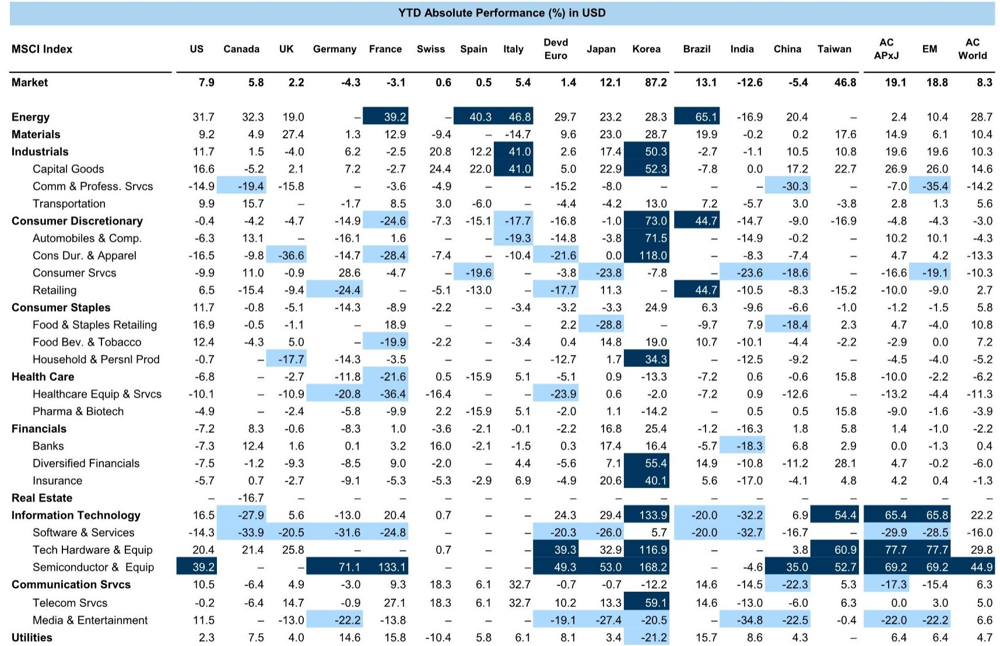
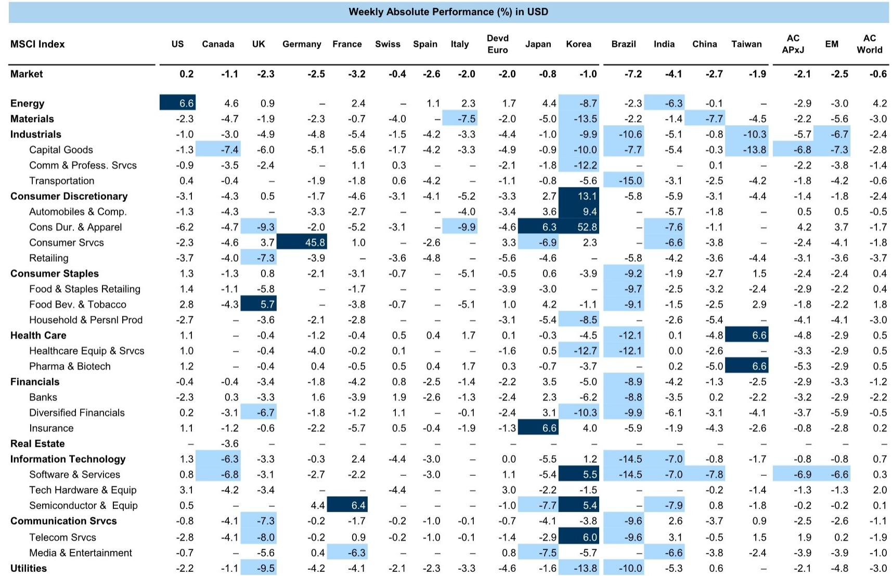
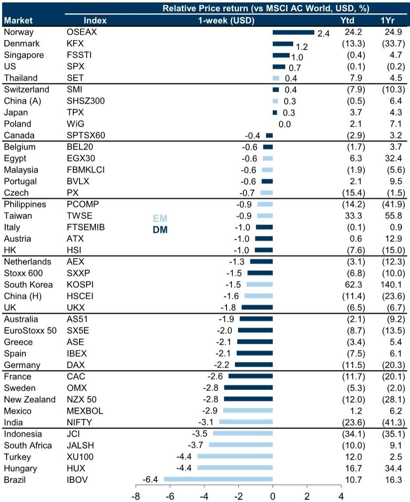

# 市场真正低估的不是地缘风险，而是资产重估的驱动力切换

全球股市在过去一周几乎原地踏步，MSCI全球指数微跌0.3%，但表象之下，结构性的分化正在加速。新兴市场下跌2.5%，显著跑输发达市场；美国微涨0.2%，勉强守住正收益。这些数字本身并不让人兴奋，真正值得关注的，是资金流向背后正在发生的、更深层的逻辑切换——从轻资产、高周转的成长叙事，转向重资产、低折旧的确定性溢价。

这份来自某外资投行的全球周报，表面上是对一周市场数据的常规梳理，但其核心洞察指向一个更根本的问题：当AI颠覆轻资产模式、供应链重构推高资本开支门槛、地缘政治风险催生“物理资产溢价”，投资者过去十年赖以生存的估值框架，是否正在失效？

报告最值得关注的判断是：资产重估的驱动力，正在从“增长能见度”转向“资产可替代性”。那些拥有难以复制的物理资产、且折旧周期长的行业，正在获得结构性溢价。这不是一个短期的防御性轮动，而是一个可能持续数年的估值范式转换。

## 1. 这轮变化真正考验的是企业能否把规模转化为议价权

过去一周的市场表现，表面上呈现的是“强者恒强”的马太效应。能源和科技板块领涨，动量因子继续跑赢，大盘股优于小盘股。但报告揭示了一个更深层的结构性信号：盈利修正强劲的板块，恰恰是那些资产最重、资本开支最密集的行业。

能源板块一周上涨4.2%，年内涨幅已达28.7%；科技板块上涨0.7%，年内涨幅22.2%。与此同时，消费相关板块全面承压，可选消费下跌2.4%，必需消费仅微涨0.4%。这种分化不能用简单的“避险”或“风险偏好”来解释。它反映的是：在AI颠覆轻资产商业模式的背景下，拥有实体资产和长期资本投入壁垒的企业，其盈利可见性正在被市场重新定价。

报告没有直接说的一句话是：规模本身不再是护城河。真正重要的是，你的规模能否转化为对上游资源、下游渠道或物理设施的控制权。那些只有用户规模、没有资产壁垒的平台型企业，正面临“可替代性”的估值折价。

## 2. 日本市场正在验证一个全球性的资产重估逻辑

报告用相当篇幅讨论了日本市场正在发生的“HALO效应”——资金正从轻资产、高折旧的LAHO板块，转向重资产、低折旧的HALO板块。公用事业、交通运输、原材料等资产密集型行业，正在获得持续的配置增量。

这一轮动的背后有三个驱动力：地缘政治风险催化的供应链重组，迫使企业增加实体资产投入；AI对轻资产模式的颠覆性威胁，压缩了纯平台型公司的估值天花板；以及日本自身的政策环境，正在为资本密集型行业提供更友好的融资条件和监管预期。

值得注意的数据是：日本市场成长股与价值股的市盈率溢价，从2022年的约140%压缩至目前的约60%。这个数字本身不说明方向，但它暗示了一个重要的事实——市场正在用真金白银为“资产的可替代性”定价。那些资产难以复制、折旧周期长的行业，正在经历估值体系的重构。

报告判断这一趋势在日本仍有延续空间，但更重要的是，它提出的分析框架适用于全球市场。任何一个经济体，只要同时面临供应链重构、AI技术冲击和地缘政治风险上升，其资产定价逻辑都可能经历类似的范式转换。

## 3. 宏观预测的分歧本身就是一个重要的市场信号

报告给出的宏观预测数据，表面上是数字的罗列，但实际隐藏着一个关键信号：某外资投行的自上而下盈利预测，与市场共识存在系统性偏差。

以标普500为例，该投行对2026年EPS增长的预测为12%，而市场共识为21%；对欧洲斯托克600的预测为10%，共识为14%。这种差距在几乎所有主要市场都存在，且方向一致——投行预测低于共识。

这意味着什么？报告没有直接点明，但逻辑是清晰的：如果该投行的预测更接近现实，那么当前市场的盈利预期存在系统性高估，未来可能出现向下修正。这对资产定价的影响是结构性的——高估值、高预期的成长股将面临更大的修正风险，而低估值、有资产支撑的价值股反而可能获得相对收益。

报告还提供了GDP增长预测：全球2025年增长2.8%，2026年放缓至2.4%。在这个背景下，盈利增长能否维持高个位数甚至两位数，本身就值得怀疑。市场共识可能过度乐观了。

## 4. 情绪指标显示市场正处于“过度自信”的临界点

报告中的风险情绪指标值得仔细解读。该投行的风险偏好指标（GSRAII）处于历史高位，接近92百分位。持仓数据更令人警觉：美国股票期货净多头持仓处于98百分位，接近极端水平。

这些数字的历史含义是：当市场情绪如此一致地看多时，往往意味着后续的修正风险在积聚。报告没有直接给出判断，但数据本身在说话——全球股票基金的资金流入处于12个月滚动的高位，资产经理的股票配置比例也处于偏高水平。

更微妙的是，该投行的牛熊市指标目前为68%，处于中性偏高的位置。这个指标综合了估值、经济周期、流动性等多维度数据，其含义是：市场尚未进入极端泡沫区间，但已不再便宜。Shiller PE处于98百分位，收益率曲线形态处于80百分位，这些都不是支持大举加仓的信号。

报告没有完全展开的是：这些情绪指标的极端化，是否会触发一次类似于2022年的估值修正？这里仍需验证，但投资者至少应该意识到，当前市场的容错空间正在收窄。

## 5. 报告尚未完全回答的关键问题：资产重估能否穿透不同市场

报告的核心逻辑——资产重估从轻资产转向重资产——在日本市场得到了数据支撑，但在全球范围内，这一逻辑的适用性仍有待检验。

首先，新兴市场与发达市场的分化就是一个未解之谜。报告数据显示，新兴市场年内上涨18.7%，但过去一周下跌2.5%，跑输发达市场。如果资产重估是全球性的，为什么新兴市场——其中很多是资源密集型、资产密集型的经济体——反而在近期承压？

其次，中国市场的表现提供了另一个视角。A股年内上涨5%，H股下跌2.5%，两者走势分化。报告没有深入分析中国市场的资产结构，但一个合理的猜测是：中国市场的资产重估逻辑可能被政策不确定性、房地产周期和通缩预期所干扰。

最后，欧洲市场的表现也值得关注。斯托克600年内仅上涨2.5%，显著跑输美国和日本。如果资产重估是一个结构性趋势，欧洲——拥有大量工业、公用事业和原材料企业——应该受益，但实际表现并不支持这一判断。

这些矛盾说明，资产重估的驱动力可能不是单一的“资产密度”，而是需要结合每个市场的政策环境、资本成本和增长预期来综合判断。报告提出的框架是有效的，但它在具体市场中的应用，还需要更多的验证和细化。

## 6. 投资者需要建立一个新的观察框架：从“增长能见度”转向“资产可替代性”

基于报告的框架和数据，投资者需要重新审视自己的资产配置逻辑。过去十年的核心问题是“这家公司能增长多快”，未来可能需要问“这家公司的资产有多难替代”。

这个框架的实践意义在于：不要简单地把“重资产”等同于“好资产”。真正的溢价应该给予那些资产难以复制、且折旧周期长的企业，而不是那些仅仅因为资本密集而ROE偏低的公司。

具体而言，投资者可以关注三个维度：第一，资产的物理稀缺性——是否有天然的进入壁垒，如资源储量、地理位置、监管许可；第二，资产的折旧周期——折旧越长，意味着资产的经济价值越持久，企业不需要频繁进行资本开支更新；第三，资产的再配置价值——在供应链重构的背景下，哪些资产可以快速适应新的生产需求，哪些资产可能会成为沉没成本。

报告没有给出具体的筛选标准，但它的框架至少提示了一个方向：那些既拥有重资产、又有定价权、且资本回报率高于资本成本的企业，可能正在经历一个长期估值修复的过程。

---

以上是对这份全球周报核心框架的梳理。报告本身还包含了大量未被充分讨论的数据——比如各市场的盈利修正趋势、因子表现的持续性和反转信号、以及跨资产类别的相对价值比较。这些内容由于篇幅限制，无法在这里一一展开。

如果你对“资产重估”这个主题感兴趣，或者想看到更完整的原始数据图表和该投行的详细分析框架，欢迎来星球微信群里继续讨论。群内会定期分享研报的完整版解读、关键图表的二次分析，以及基于报告逻辑的实战讨论框架。

Personal reading notes and learning share only. Not investment advice.

