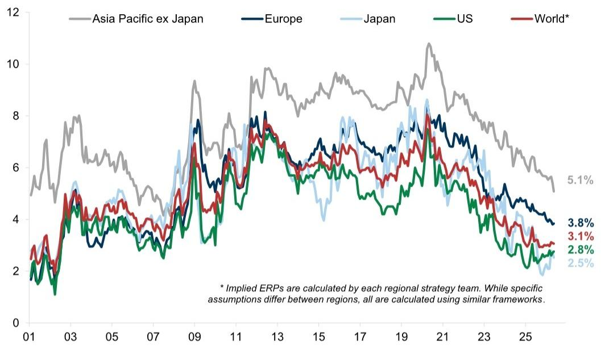
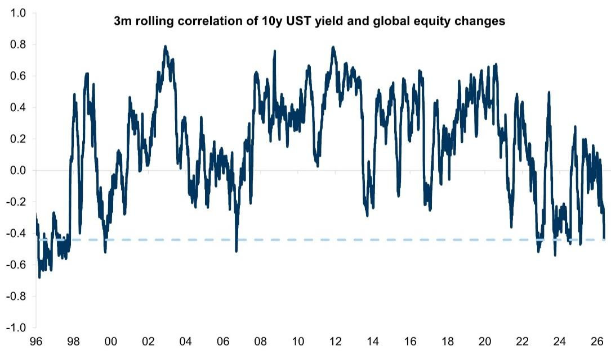
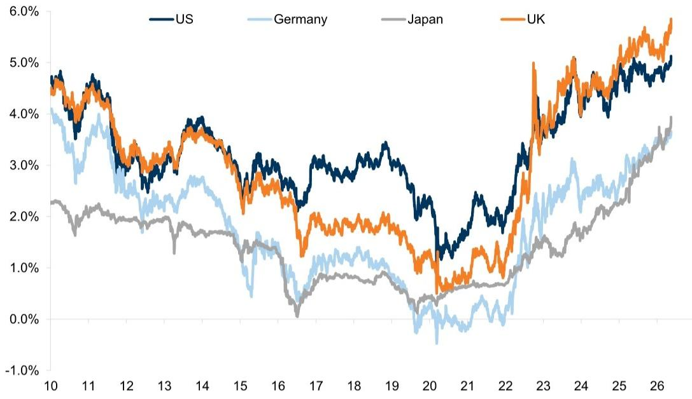

# 市场真正低估的不是动能，而是利率对资产定价的深层重置

全球股市正在创新高。霍尔木兹海峡的紧张局势尚未平息，增长与通胀的混合体正在恶化，但权益资产却似乎对这些信号视而不见。某外资投行最新发布的全球策略报告提供了一个令人不安的解释：市场的韧性并非来自对风险的乐观定价，而是来自一种高度集中的、由少数行业驱动的盈利增长。更值得警惕的是，这种增长本身正在制造新的脆弱性。

这份报告的核心判断是：过去十五年驱动全球股市的“美国、科技、成长”三重奏已经瓦解。取而代之的，是一个由利率结构性上行和资本开支爆炸性增长共同塑造的新格局。在这个格局里，市场真正的风险并非动能何时衰竭，而是债券收益率对权益资产定价的深层重置尚未被充分理解。

## 1. 这轮上涨的集中度已经接近极端，但盈利修正的广度却比想象中更窄

报告开篇便点出了一个反直觉的现象：尽管盈利修正整体向上，但驱动力高度集中在科技和能源两大板块。以标普500为例，2026年和2027年的每股盈利预期年内分别上调了8个百分点，但大部分正向修正来自AI资本开支预期和能源价格上涨。换句话说，市场上涨的根基并不是广泛的盈利复苏，而是两条非常具体的叙事线。

更具体的数据是：标普500今年迄今约10%的回报中，TMT板块贡献了85%。韩国市场受益于芯片热潮，年内涨幅接近80%，其亚洲策略团队预计该指数今年盈利增长将达到300%。这种集中度在历史上往往意味着动量因子已经过度拥挤。报告中的动量因子相对市场表现图表显示，MSCI全球动量指数在2026年5月相对于大盘的比值已经飙升至115，远高于2025年中的100基准线。这意味着，过去一年买入强势股的策略获得了惊人的超额收益，但同时也意味着一旦这些强势股的基本面出现任何松动，回撤的压力将不成比例地集中于市场的核心持仓。

隐含的观察框架是：投资者需要区分“盈利在变好”和“盈利变好的范围是否在扩大”。如果盈利修正的广度不能跟上，那么当前的价格水平就更多反映的是情绪和仓位，而非基本面改善的可持续性。

## 2. 风险偏好指标已接近历史极值，零售资金的涌入正在放大尾部风险

报告中的风险偏好指标（RAI）读数已经升至1.1以上，处于1991年以来的第99百分位，是2021年以来的最高水平。与此同时，零售交易量自4月中旬以来增长了28%，零售热门股篮子同期上涨了29%。这些数字背后是一种典型的“追涨”行为：当盈利预期和动量因子产生正向反馈时，散户资金的涌入会进一步推高价格，但也会让市场对负面消息的敏感度急剧上升。

更关键的是，这种乐观情绪是在债券收益率持续攀升的背景下发生的。报告明确指出，权益风险溢价（ERP）已经显著压缩。全球市场的隐含ERP已经降至2.5%左右，其中美国市场仅为2.8%。这意味着，股票相对于债券的吸引力正在快速下降。如果债券收益率继续上行，股票估值所承受的压力将不仅仅来自折现率的提升，更来自“股票相对于债券不再便宜”这一心理锚点的松动。

这里的洞察是：RAI的高读数本身并不构成卖出信号，但它提供了一个重要的“脆弱性指标”。当市场情绪极度乐观且仓位高度集中时，任何低于预期的宏观数据或地缘事件都可能引发连锁反应。报告特别提到，如果霍尔木兹海峡的干扰持续到下半年，通胀预期进一步上升，那么“市场很可能遇到一个减速带”。

## 3. 利率与股票的相关性已经转为负值，这是过去十五年未曾见过的结构性变化

报告中最具洞察力的部分之一，是揭示了利率与股票相关性的根本性转变。数据显示，三个月滚动相关系数已经转为负值。这在过去十五年的低利率环境中几乎不可想象：当时利率下行利好成长股，利率上行则被视为经济复苏的信号，同样利好股市。但如今，利率上行正在成为股票的负面因素。

原因在于利率环境已经发生了质变。报告用一张图表清晰地展示了这一点：仅在几年前，全球还有四分之一的10年期国债收益率是负值；而现在，30年期美国国债收益率已经突破5%，德国和日本也分别升至3.5%和2.5%以上。这种变化不仅仅是数字的上升，更是资产定价范式的重置。

在高利率环境下，“久期”成为核心变量。那些依赖远期现金流折现的成长股，以及被当作“债券替代品”的防御型股票，其估值受到最直接的冲击。报告中的图表显示，MSCI欧洲质量因子相对于市场表现的比值，与德国10年期实际利率呈现高度负相关。当实际利率从负值区间回升至正值时，质量因子的超额收益几乎被完全抹去。这说明，过去被投资者视为安全资产的“高质量”公司，在利率正常化过程中反而成为最大的输家。

## 4. 资本开支的爆炸式增长正在重塑行业格局，但回报的可持续性仍需验证

报告指出了一个被市场低估的长期变量：资本开支的剧增。标普500公司第一季度资本开支同比增长38%，而股票回购仅增长了1%。这是金融危机后十五年“回购优先、投资其次”模式的彻底逆转。主要驱动力来自美国超大规模云服务商的AI基础设施投资——前五家公司的资本开支预期年内已上调约800亿美元，总额达到7550亿美元，较一年前高出80%。

这种投资的直接受益者是AI基础设施公司，包括芯片制造商。报告中的数据表明，AI基础设施股票组合今年迄今回报为59%，而标普500指数仅为9%，剔除AI基础设施股票后的标普500回报仅为1%。这组数字清晰地揭示了当前市场的“二元结构”：AI产业链与非AI产业链之间的回报差距已经达到历史极端。

但报告对此提出了一个隐含的疑问：这种资本开支的回报率是否能够持续？历史经验表明，大规模的资本开支周期往往伴随着产能过剩和回报率下降。目前，市场对AI相关公司的盈利预期仍在不断上调，但报告没有完全展开的问题是：当这些资本开支从“投资阶段”转向“运营阶段”时，企业的自由现金流和股东回报将如何变化？这个问题目前尚未被充分定价。

## 5. 报告尚未完全回答的关键问题：动量的反转会以何种方式展开

尽管报告对短期风险和中长期结构变化都做了详尽分析，但有一个关键问题并未给出明确答案：如果动量反转，它会以何种方式展开？是缓慢的均值回归，还是剧烈的去杠杆？

从历史经验看，动量因子的极端拥挤往往以两种方式终结：一是基本面证伪，即支撑盈利增长的核心假设被打破；二是流动性冲击，即资金从高风险资产向安全资产大规模迁移。当前，这两种风险都存在。AI资本开支的“投资回报率”尚未得到验证，而债券收益率的持续上升正在制造流动性收紧的压力。

报告提到，债券收益率的快速上升是触发权益市场调整的重要变量。数据显示，当美国10年期国债收益率在一个月内上升超过2个标准差时，全球股市平均回报为负值。当前，收益率的变化速度已经接近这一阈值。但报告并未深入讨论的是，如果收益率上升是由“实际利率”驱动而非“通胀预期”驱动，对权益资产的影响是否会有所不同？这是一个值得投资者持续跟踪的议题。

## 6. 投资者的观察框架应当从“选股”转向“选久期”

综合报告的核心逻辑，一个清晰的观察框架浮现出来：在当前环境下，投资者需要从传统的“行业轮动”或“市值偏好”思维中跳出来，转而关注“久期”这一更根本的维度。

具体来说，可以将资产分为三类：高久期资产（依赖远期现金流的成长股、AI基础设施相关）、中久期资产（周期性价值股、能源、工业）、低久期资产（防御型、消费必需品、公用事业）。在利率上行周期中，低久期资产理论上应该受益，但报告指出，这些资产在过去被当作“债券替代品”而定价过高，因此反而在利率正常化过程中遭受了估值压缩。这意味着，传统意义上的“防御”在当前的利率环境下可能并不安全。

投资者需要问自己的问题是：我持有的资产，其盈利增长是否真正独立于利率环境？如果是AI基础设施，那么它依赖的是持续的资本开支和乐观的远期预期，这本身就是利率敏感的。如果是能源，那么它受益于地缘溢价和供给约束，但同样面临需求侧的不确定性。真正能够穿越利率周期的，可能是那些拥有定价权、低杠杆、且资本回报率稳定的企业——但报告的数据显示，这类资产在当前市场上并不便宜。

---

这份报告的价值在于，它没有停留在“市场过热”或“动量拥挤”的浅层判断，而是深入剖析了利率环境变化如何重塑资产定价的底层逻辑。但正如报告自身所承认的，许多关键假设——比如AI资本开支的长期回报率、债券收益率的上行空间、地缘风险的演化路径——都尚未得到验证。这些正是需要持续跟踪和深度讨论的问题。

如果你对这些问题有更深入的研究兴趣，欢迎来我们的星球微信群里继续讨论。我们会定期分享对这类报告的完整解读、原始图表，以及基于数据模型的独立分析。

Personal reading notes and learning share only. Not investment advice.

