# Global: GS Economic Indicators Update: Euro Area Activity Data Surprises to the Downside Since the Start of The War in Iran

Please find an update of our proprietary global economic indicators below. The data behind these exhibits can be downloaded here. Interactive charts can be found on our living page here.

# Chart of the Week

Exhibit 1: Our MAP Indicator Has Surprised to the Downside Since the Start of The War in Iran   
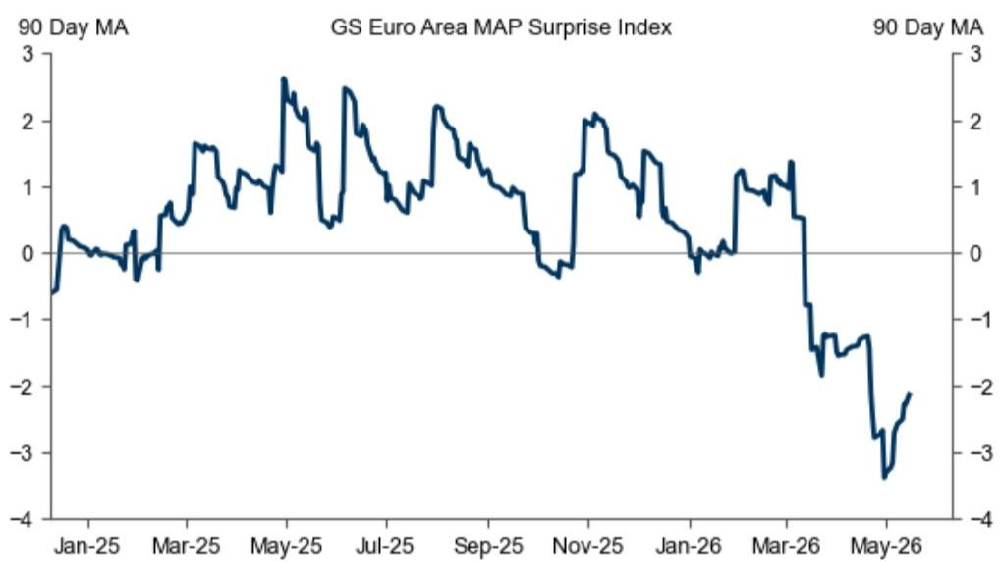

line

| Date    | 90 Day MA |
|---------|-----------|
| Jan-25  | -0.5      |
| Mar-25  | 1.5       |
| May-25  | 2.8       |
| Jul-25  | 1.8       |
| Sep-25  | 1.2       |
| Nov-25  | 2.1       |
| Jan-26  | 0.8       |
| Mar-26  | -1.5      |
| May-26  | -3.5      |

Our daily MAP surprise indices summarize the importance and strength (relative to consensus expectations) of economic indicators worldwide.

Source: GS Global Investment Research

# Jan Hatzius

+1(212)902-0394 | jan.hatzius@gs.com

GS & Co. LLC

# Joseph Briggs

+1(212)902-2163

joseph.briggs@gs.com

GS & Co. LLC

# Sarah Dong

+1(212)357-9741 | sarah.dong@gs.com

GS & Co. LLC

# Megan Peters

+44(20)7051-2058

megan.l.peters@gs.com

GS International

# Key FCI and Growth Charts

Exhibit 2: The Global ex Russia FCI Tightened +5.5bps Last Week Primarily on Long Rates   
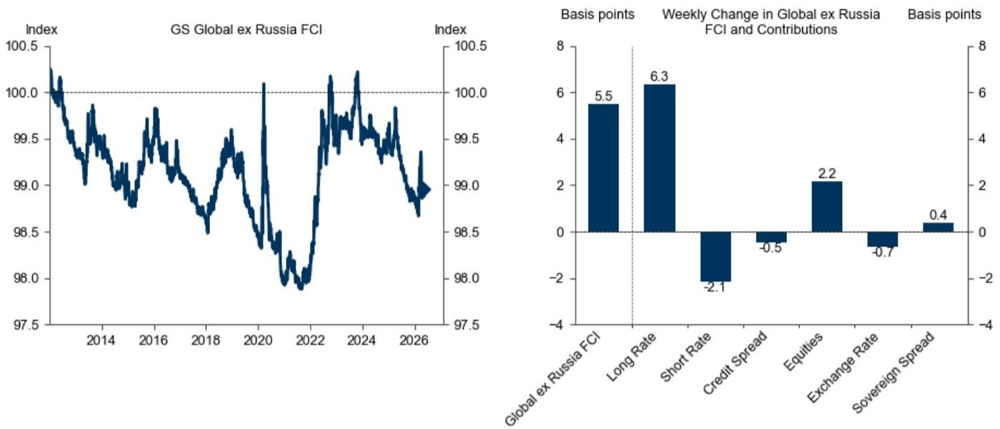  
Source: GS Global Investment Research

Exhibit 3: Higher 2026 Growth in the UK   

bar

Change in GS GDP Forecast in 2026
| Region | Change in GS GDP (pp) |
| :--- | :--- |
| Global | -0.15 |
| UK | 0.30 |
| Japan | 0.20 |
| Thailand | 0.10 |
| Poland | 0.05 |
| Mexico | 0.00 |
| Malaysia | 0.00 |
| Philippines | 0.00 |
| South Korea | 0.00 |
| Russia | 0.00 |
| Türkiye | 0.00 |
| Taiwan | 0.00 |
| US | 0.00 |
| Vietnam | 0.00 |
| Argentina | 0.00 |
| Australia | 0.00 |
| Brazil | 0.00 |
| Canada | 0.00 |
| Mainland China | 0.00 |
| Germany | 0.00 |
| Euro Area | 0.00 |
| Spain | 0.00 |
| France | 0.00 |
| Indonesia | 0.00 |
| India | 0.00 |
| Italy | 0.00 |
| Taiwan: +3.7pp

Source: GS Global Investment Research

Exhibit 4: Our Preliminary April CAI Fell by -2.3pp in Mainland China and Rose by +1.3pp in India 

<table><tr><td rowspan="2">Country (% of Data Released)</td><td rowspan="2">Month</td><td colspan="2">Spot CAI (% mom annualized)</td><td rowspan="2">3 Month Average CAI (% mom annualized)</td></tr><tr><td>Value</td><td>Weekly Change</td></tr><tr><td>Global</td><td>April</td><td>+2.8</td><td>-0.3</td><td>+3.1</td></tr><tr><td>Developed Markets</td><td>April</td><td>+2.2</td><td>0.0</td><td>+2.2</td></tr><tr><td>US (78%)</td><td>April</td><td>+3.0</td><td>-0.1</td><td>+3.0</td></tr><tr><td>Euro Area (39%)</td><td>April</td><td>+0.8</td><td>0.0</td><td>+1.1</td></tr><tr><td>Germany (50%)</td><td>April</td><td>-0.6</td><td>0.0</td><td>+0.4</td></tr><tr><td>France (38%)</td><td>April</td><td>+0.9</td><td>0.0</td><td>+1.0</td></tr><tr><td>Italy (34%)</td><td>April</td><td>+1.1</td><td>+0.1</td><td>+1.2</td></tr><tr><td>Spain (46%)</td><td>April</td><td>+2.4</td><td>+0.2</td><td>+2.6</td></tr><tr><td>Japan (43%)</td><td>April</td><td>+3.2</td><td>0.0</td><td>+1.6</td></tr><tr><td>UK (56%)</td><td>April</td><td>+0.4</td><td>+0.1</td><td>+1.2</td></tr><tr><td>Canada (33%)</td><td>April</td><td>+1.9</td><td>+0.2</td><td>+1.6</td></tr><tr><td>Australia (58%)</td><td>April</td><td>+0.8</td><td>-0.3</td><td>+1.4</td></tr><tr><td>New Zealand (67%)</td><td>April</td><td>+1.6</td><td>0.0</td><td>+2.8</td></tr><tr><td>Norway (36%)</td><td>April</td><td>+1.1</td><td>-0.7</td><td>+2.2</td></tr><tr><td>Sweden (77%)</td><td>April</td><td>+1.9</td><td>0.0</td><td>+2.0</td></tr><tr><td>Emerging Markets</td><td>April</td><td>+3.8</td><td>-0.8</td><td>+4.4</td></tr><tr><td>China (63%)</td><td>April</td><td>+4.3</td><td>-2.3</td><td>+5.6</td></tr><tr><td>India (53%)</td><td>April</td><td>+7.9</td><td>+1.3</td><td>+7.0</td></tr><tr><td>Brazil (63%)</td><td>April</td><td>+3.3</td><td>+0.1</td><td>+3.3</td></tr><tr><td>Russia (37%)</td><td>April</td><td>0.0</td><td>+0.5</td><td>+1.6</td></tr></table>

CAI in countries with $0\%$ of data released is forecasted. CAI aggregates for Global, Developed Markets, and Emerging Markets are GDP-weighted using market FX country weights.   
Source: GS Global Investment Research

Exhibit 5: Our Global CAI Currently Stands Above Potential   
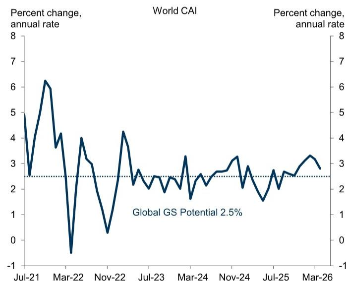

line

| Date    | Percent change, annual rate |
|---------|------------------------------|
| Jul-21  | 5.0                          |
| Mar-22  | 6.0                          |
| Nov-22  | 4.0                          |
| Jul-23  | 2.5                          |
| Mar-24  | 3.0                          |
| Nov-24  | 3.5                          |
| Jul-25  | 2.5                          |
| Mar-26  | 3.0                          |

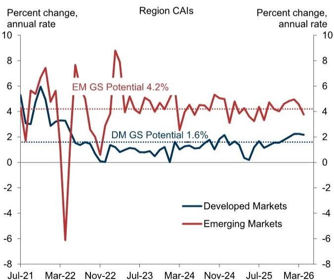

line

| Period     | EM GS Potential | DM GS Potential |
| ---------- | --------------- | --------------- |
| Jul-21     | 4.2%            | 1.6%            |
| Mar-22     | -               | -               |
| Nov-22     | -               | -               |
| Jul-23     | -               | -               |
| Mar-24     | -               | -               |
| Nov-24     | -               | -               |
| Jul-25     | -               | -               |
| Mar-26     | -               | -               |

GS DM CAI is a market FX-weighted average of the US, Germany, France, Italy, Spain, Japan, the UK, and Canada and EM is of Brazil, Russia, India, and China. Global GS CAI is an average of all aforementioned countries.   
Source: GS Global Investment Research

# Key Wage and Price Inflation Charts

Exhibit 6: GS Wage Trackers and Inflation Measures   
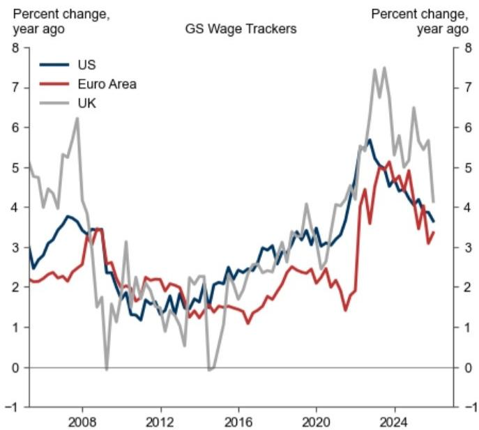

line

| Year | US   | Euro Area | UK   |
|------|------|-----------|------|
| 2008 | 3.5  | 3.0       | 6.0  |
| 2012 | 1.5  | 1.8       | 1.0  |
| 2016 | 2.5  | 1.5       | 2.0  |
| 2020 | 3.5  | 2.5       | 4.0  |
| 2024 | 4.5  | 5.0       | 7.0  |

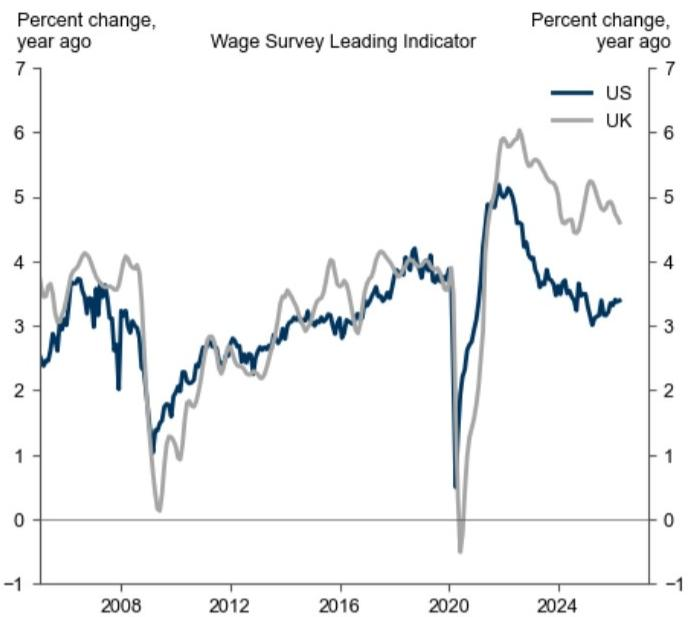

line

| Year | US   | UK   |
|------|------|------|
| 2008 | 3.5  | 4.0  |
| 2010 | 1.5  | 0.5  |
| 2012 | 2.5  | 2.0  |
| 2016 | 3.0  | 3.5  |
| 2020 | -0.5 | -1.0 |
| 2022 | 5.0  | 6.0  |
| 2024 | 3.5  | 4.5  |

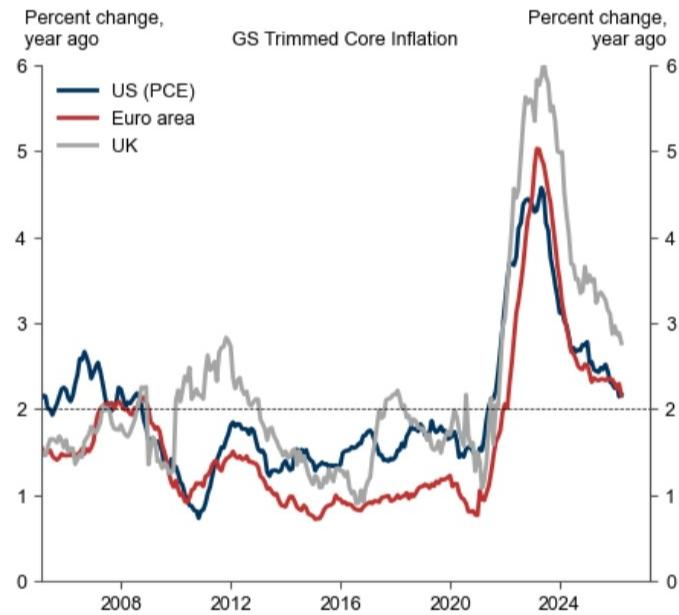

line

| Year | US (PCE) | Euro area | UK |
|------|----------|-----------|----|
| 2008 | ~2.1     | ~1.8      | ~1.7 |
| 2012 | ~1.9     | ~1.5      | ~2.8 |
| 2016 | ~1.5     | ~1.0      | ~1.2 |
| 2020 | ~1.7     | ~1.2      | ~1.8 |
| 2024 | ~4.5     | ~5.0      | ~6.0 |

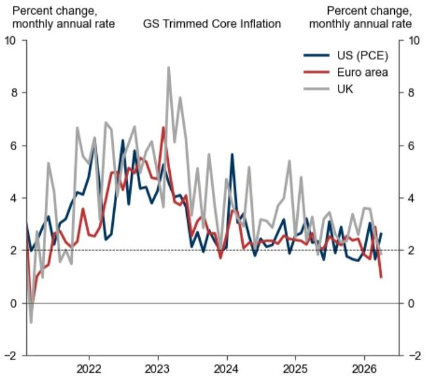

line

| Year | US (PCE) | Euro area | UK |
|------|----------|-----------|----|
| 2022 | ~4.5     | ~5.0      | ~6.5 |
| 2023 | ~5.5     | ~6.5      | ~9.0 |
| 2024 | ~3.0     | ~2.5      | ~4.5 |
| 2025 | ~2.5     | ~2.0      | ~3.5 |
| 2026 | ~2.0     | ~1.0      | ~3.0 |

US wage tracker is composition-adjusted in 2020 and 2021.   
Source: GS Global Investment Research

Exhibit 7: GS Jobs-Workers Gaps   
  
Source: GS Global Investment Research

# Detailed Indicators Update

# Financial Conditions Index (FCI)

Exhibit 8: GS Global ex Russia FCI Level (Left) and Weekly Change With Contributions (Right)   
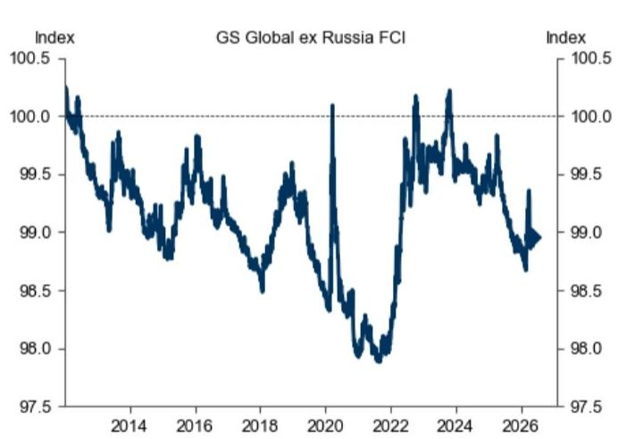

line

| Year | Index |
|------|-------|
| 2014 | 100.0 |
| 2016 | 99.5 |
| 2018 | 98.5 |
| 2020 | 98.0 |
| 2022 | 97.5 |
| 2024 | 99.5 |
| 2026 | 99.0 |

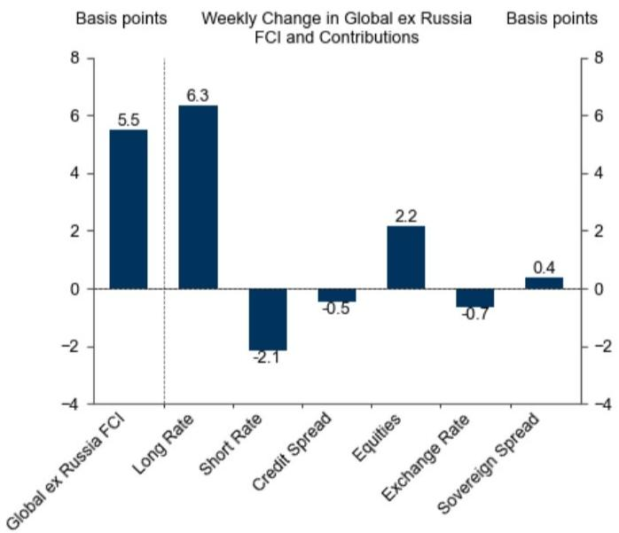

bar

| Category | Basis points |
|---|---|
| Global ex Russia FCI | 5.5 |
| Long Rate | 6.3 |
| Short Rate | -2.1 |
| Credit Spread | -0.5 |
| Equities | 2.2 |
| Exchange Rate | -0.7 |
| Sovereign Spread | 0.4 |

Source: GS Global Investment Research

Exhibit 9: GS Global FCI Level (Left) and Weekly Change With Contributions (Right)   
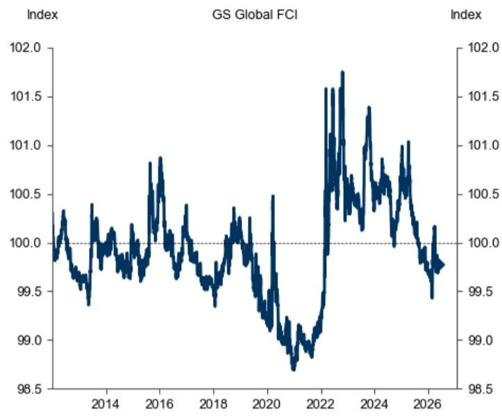

line

| Year | Index |
|------|-------|
| 2014 | 100.0 |
| 2015 | 100.5 |
| 2016 | 100.8 |
| 2017 | 100.3 |
| 2018 | 100.1 |
| 2019 | 100.4 |
| 2020 | 99.8 |
| 2021 | 99.5 |
| 2022 | 101.6 |
| 2023 | 101.8 |
| 2024 | 101.4 |
| 2025 | 101.0 |
| 2026 | 99.7 |

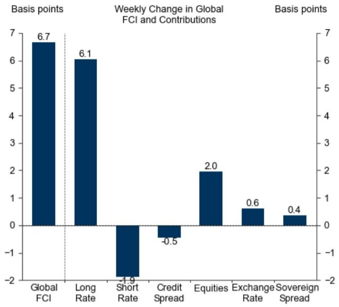

bar

Weekly Change in Global FCI and Contributions
| Category | Basis points |
|---|---|
| Global FCI | 6.7 |
| Long Rate | 6.1 |
| Short Rate | -1.9 |
| Credit Spread | -0.5 |
| Equities | 2.0 |
| Exchange Rate | 0.6 |
| Sovereign Spread | 0.4 |

Source: GS Global Investment Research

Exhibit 10: GS US FCI Level (Left) and Weekly Change With Contributions (Right)   
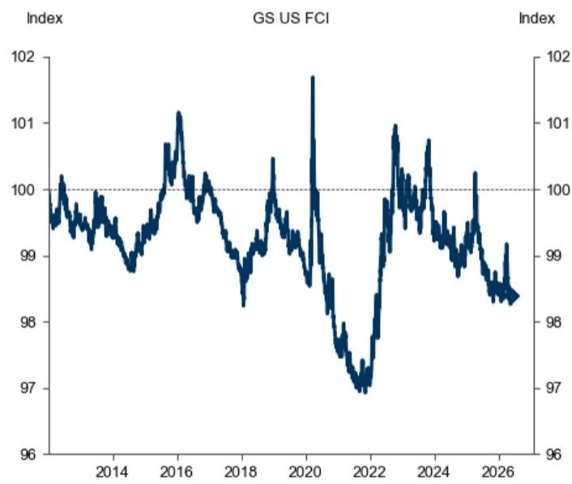

line

| Year | Index |
|------|-------|
| 2014 | 100   |
| 2015 | 99    |
| 2016 | 101   |
| 2017 | 100   |
| 2018 | 98    |
| 2019 | 100   |
| 2020 | 102   |
| 2021 | 97    |
| 2022 | 97    |
| 2023 | 101   |
| 2024 | 100   |
| 2025 | 99    |
| 2026 | 98    |

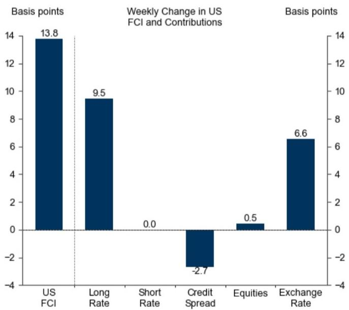

bar

| Category | Basis points |
|---|---|
| US FCI | 13.8 |
| Long Rate | 9.5 |
| Short Rate | 0.0 |
| Credit Spread | -2.7 |
| Equities | 0.5 |
| Exchange Rate | 6.6 |
Weekly Change in US FCI and Contributions; Basis points

Source: GS Global Investment Research

Exhibit 11: GS Euro Area FCI Level (Left) and Weekly Change With Contributions (Right)   
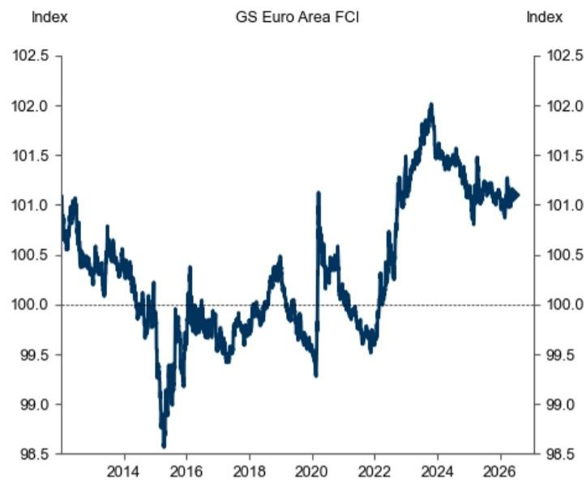

line

| Year | Index |
|------|-------|
| 2014 | 100.5 |
| 2015 | 98.5 |
| 2016 | 100.0 |
| 2017 | 99.5 |
| 2018 | 100.0 |
| 2019 | 100.5 |
| 2020 | 99.5 |
| 2021 | 100.0 |
| 2022 | 99.5 |
| 2023 | 101.5 |
| 2024 | 102.0 |
| 2025 | 101.5 |
| 2026 | 101.0 |

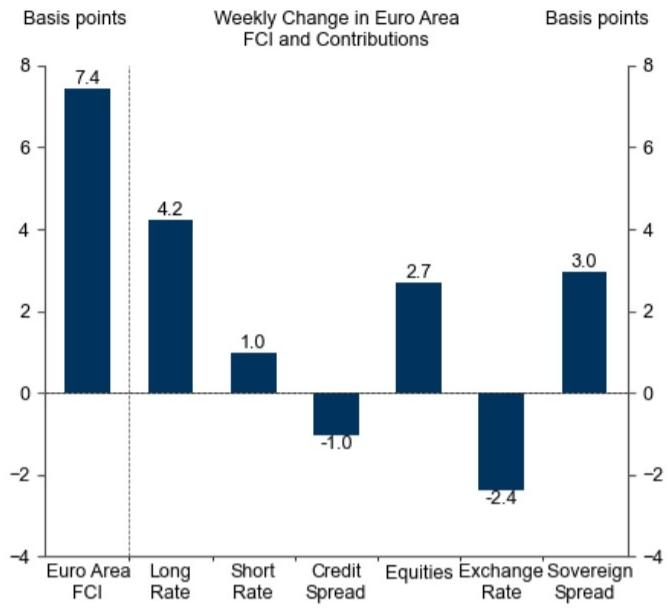

bar

| Category | Value |
|---|---|
| Euro Area FCI | 7.4 |
| Long Rate | 4.2 |
| Short Rate | 1.0 |
| Credit Spread | -1.0 |
| Equities | 2.7 |
| Exchange Rate | -2.4 |
| Sovereign Spread | 3.0 |

Source: GS Global Investment Research

Exhibit 12: Weekly Change in FCI Across Countries   
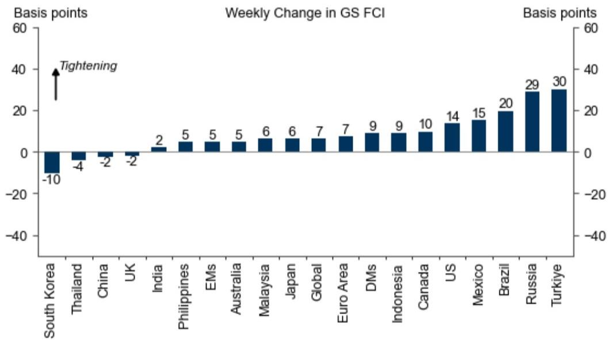

bar

Weekly Change in GS FCI
| Country/Region | Basis points |
|---|---|
| South Korea | -10 |
| Thailand | -4 |
| China | -2 |
| UK | -2 |
| India | 2 |
| Philippines | 5 |
| EMs | 5 |
| Australia | 5 |
| Malaysia | 6 |
| Japan | 6 |
| Global | 7 |
| Euro Area | 7 |
| DMs | 9 |
| Indonesia | 9 |
| Canada | 10 |
| US | 14 |
| Mexico | 15 |
| Brazil | 20 |
| Russia | 29 |
| Türkiye | 30 |
Tightening indicated by arrow to South Korea.

Source: GS Global Investment Research

Exhibit 13: Year-Over-Year Change in FCI Across Countries   
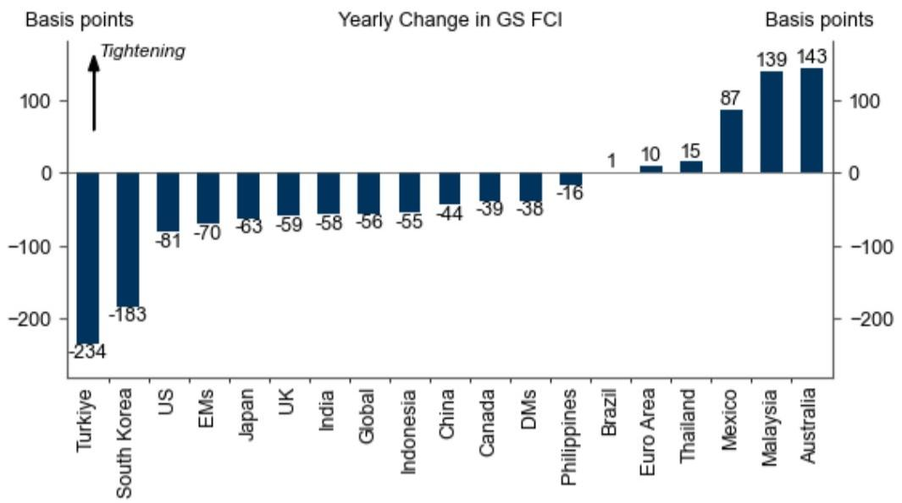

bar

Yearly Change in GS FCI Basis points
| Country/Region | Basis points |
|---|---|
| Türkiye | -234 |
| South Korea | -183 |
| US | -81 |
| EMs | -70 |
| Japan | -63 |
| UK | -59 |
| India | -58 |
| Global | -56 |
| Indonesia | -55 |
| China | -44 |
| Canada | -39 |
| DMs | -38 |
| Philippines | -16 |
| Brazil | 1 |
| Euro Area | 10 |
| Thailand | 15 |
| Mexico | 87 |
| Malaysia | 139 |
| Australia | 143 |
Tightening indicated by an arrow pointing to the left.

Source: GS Global Investment Research

# FCI Impulses

Exhibit 14: FCI Impulses Over the Next 4 Quarters (Left) and in the Euro Area, UK, and US (Right)   
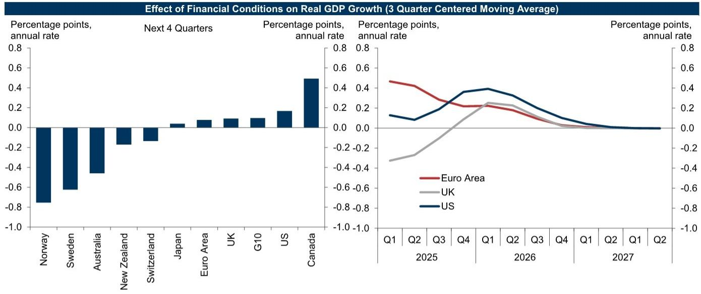

bar

Effect of Financial Conditions on Real GDP Growth (3 Quarter Centered Moving Average)
| Country/Quarter | Percentage points, annual rate |
|---|---|
| Norway | -0.8 |
| Sweden | -0.6 |
| Australia | -0.45 |
| New Zealand | -0.2 |
| Switzerland | -0.15 |
| Japan | 0.05 |
| Euro Area | 0.08 |
| UK | 0.09 |
| G10 | 0.09 |
| US | 0.17 |
| Canada | 0.5 |

Source: GS Global Investment Research

Exhibit 15: FCI Impulses in the US, Euro Area, Japan, and UK   
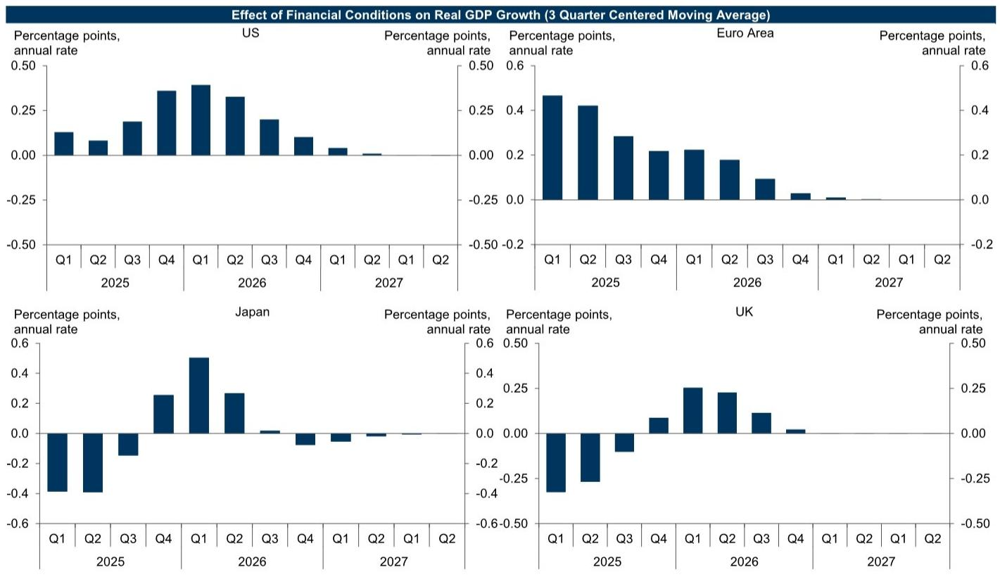  
Source: GS Global Investment Research

# Current Activity Indicator (CAI)

Exhibit 16: CAI Aggregates   
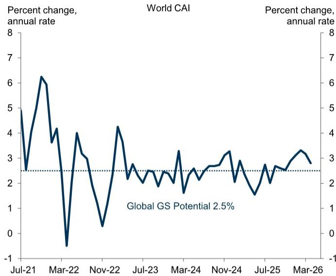

line

| Date    | Percent change, annual rate |
|---------|------------------------------|
| Jul-21  | 5.0                          |
| Mar-22  | -0.5                         |
| Nov-22  | 4.3                          |
| Jul-23  | 2.5                          |
| Mar-24  | 3.3                          |
| Nov-24  | 3.3                          |
| Jul-25  | 2.7                          |
| Mar-26  | 3.3                          |

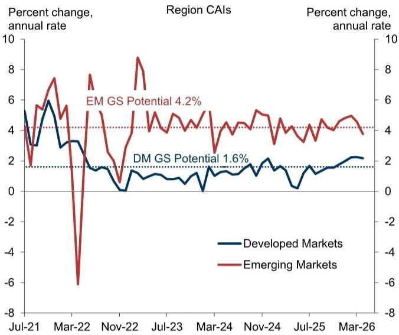

line

| Date    | Developed Markets | Emerging Markets |
|---------|-------------------|------------------|
| Jul-21  | ~5.0%             | ~4.0%            |
| Mar-22  | ~3.0%             | ~-7.0%           |
| Nov-22  | ~1.0%             | ~9.0%            |
| Jul-23  | ~1.5%             | ~4.5%            |
| Mar-24  | ~1.0%             | ~3.0%            |
| Nov-24  | ~1.5%             | ~5.0%            |
| Jul-25  | ~1.0%             | ~4.0%            |
| Mar-26  | ~2.0%             | ~4.5%            |

GS DM CAI is a market FX-weighted average of the US, Germany, France, Italy, Spain, Japan, the UK, and Canada and EM is of Brazil, Russia, India, and China. Global GS CAI is an average of all aforementioned countries.   
Source: GS Global Investment Research

Exhibit 17: CAI Heatmap 

<table><tr><td rowspan="2">Country (% of Data Released)</td><td rowspan="2">Month</td><td colspan="2">Spot CAI (% mom annualized)</td><td rowspan="2">3 Month Average CAI (% mom annualized)</td></tr><tr><td>Value</td><td>Weekly Change</td></tr><tr><td>Global</td><td>April</td><td>+2.8</td><td>-0.3</td><td>+3.1</td></tr><tr><td>Developed Markets</td><td>April</td><td>+2.2</td><td>0.0</td><td>+2.2</td></tr><tr><td>US (78%)</td><td>April</td><td>+3.0</td><td>-0.1</td><td>+3.0</td></tr><tr><td>Euro Area (39%)</td><td>April</td><td>+0.8</td><td>0.0</td><td>+1.1</td></tr><tr><td>Germany (50%)</td><td>April</td><td>-0.6</td><td>0.0</td><td>+0.4</td></tr><tr><td>France (38%)</td><td>April</td><td>+0.9</td><td>0.0</td><td>+1.0</td></tr><tr><td>Italy (34%)</td><td>April</td><td>+1.1</td><td>+0.1</td><td>+1.2</td></tr><tr><td>Spain (46%)</td><td>April</td><td>+2.4</td><td>+0.2</td><td>+2.6</td></tr><tr><td>Japan (43%)</td><td>April</td><td>+3.2</td><td>0.0</td><td>+1.6</td></tr><tr><td>UK (56%)</td><td>April</td><td>+0.4</td><td>+0.1</td><td>+1.2</td></tr><tr><td>Canada (33%)</td><td>April</td><td>+1.9</td><td>+0.2</td><td>+1.6</td></tr><tr><td>Australia (58%)</td><td>April</td><td>+0.8</td><td>-0.3</td><td>+1.4</td></tr><tr><td>New Zealand (67%)</td><td>April</td><td>+1.6</td><td>0.0</td><td>+2.8</td></tr><tr><td>Norway (36%)</td><td>April</td><td>+1.1</td><td>-0.7</td><td>+2.2</td></tr><tr><td>Sweden (77%)</td><td>April</td><td>+1.9</td><td>0.0</td><td>+2.0</td></tr><tr><td>Emerging Markets</td><td>April</td><td>+3.8</td><td>-0.8</td><td>+4.4</td></tr><tr><td>China (63%)</td><td>April</td><td>+4.3</td><td>-2.3</td><td>+5.6</td></tr><tr><td>India (53%)</td><td>April</td><td>+7.9</td><td>+1.3</td><td>+7.0</td></tr><tr><td>Brazil (63%)</td><td>April</td><td>+3.3</td><td>+0.1</td><td>+3.3</td></tr><tr><td>Russia (37%)</td><td>April</td><td>0.0</td><td>+0.5</td><td>+1.6</td></tr></table>

CAI in countries with 0% of data released is forecasted. CAI aggregates for Global, Developed Markets, and Emerging Markets are GDP-weighted using market FX country weights.   
Source: GS Global Investment Research

Exhibit 18: CAIs for Large DMs and EMs   
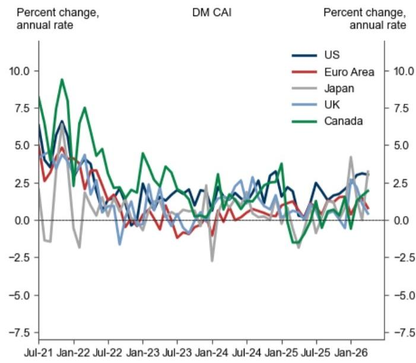

line

| Date   | US    | Euro Area | Japan | UK    | Canada |
|--------|-------|-----------|-------|-------|--------|
| Jul-21 | 6.0   | 4.0       | 8.0   | 4.0   | 8.0    |
| Jan-22 | 7.0   | 5.0       | 9.0   | 4.0   | 9.0    |
| Jul-22 | 4.0   | 3.0       | 4.0   | 3.0   | 7.0    |
| Jan-23 | 2.0   | 1.0       | 2.0   | 1.0   | 4.0    |
| Jul-23 | 1.0   | 0.0       | 1.0   | 0.0   | 2.0    |
| Jan-24 | 0.0   | -1.0      | -3.0  | -1.0  | 1.0    |
| Jul-24 | 2.0   | 1.0       | 2.0   | 2.0   | 3.0    |
| Jan-25 | 1.0   | 0.0       | 1.0   | 1.0   | -2.0   |
| Jul-25 | 2.0   | 1.0       | 2.0   | 2.0   | 1.0    |
| Jan-26 | 3.0   | 1.0       | 3.0   | 3.0   | 2.0    |

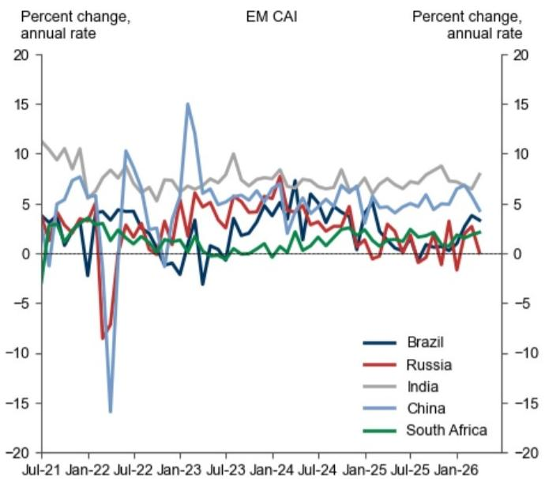

line

| Date    | Brazil | Russia | India | China | South Africa |
|---------|--------|--------|-------|-------|--------------|
| Jul-21  | 3.0    | 4.0    | 11.0  | 3.0   | 2.0          |
| Jan-22  | -8.0   | -9.0   | 8.0   | -17.0 | 3.0          |
| Jul-22  | 4.0    | 3.0    | 7.0   | 10.0  | 2.0          |
| Jan-23  | -3.0   | 6.0    | 6.0   | 15.0  | 1.0          |
| Jul-23  | 5.0    | 5.0    | 8.0   | 6.0   | 2.0          |
| Jan-24  | 7.0    | 7.0    | 8.0   | 5.0   | 3.0          |
| Jul-24  | 5.0    | 4.0    | 7.0   | 6.0   | 2.0          |
| Jan-25  | 4.0    | 3.0    | 8.0   | 5.0   | 1.0          |
| Jul-25  | 3.0    | 2.0    | 9.0   | 6.0   | 2.0          |
| Jan-26  | 4.0    | 3.0    | 8.0   | 5.0   | 2.0          |

Source: GS Global Investment Research

Exhibit 19: GS MAP Surprise Index   
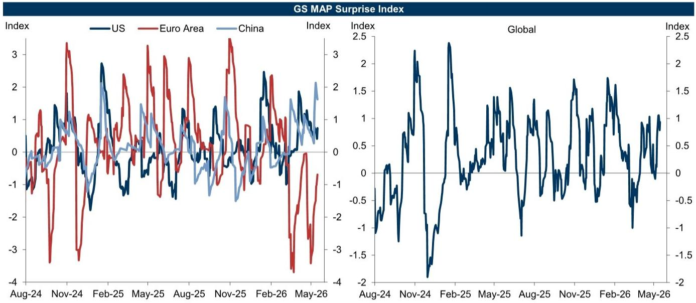  
We present the 21-day moving average of daily MAP scores.   
Source: GS Global Investment Research

Exhibit 20: Latest GS MAP Surprise Index   
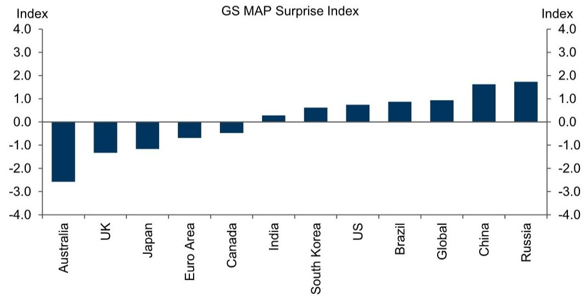

bar

GS MAP Surprise Index
| Country/Region | Index |
|---|---|
| Australia | -2.7 |
| UK | -1.4 |
| Japan | -1.3 |
| Euro Area | -0.6 |
| Canada | -0.4 |
| India | 0.2 |
| South Korea | 0.5 |
| US | 0.7 |
| Brazil | 0.8 |
| Global | 0.9 |
| China | 1.6 |
| Russia | 1.7 |

We present the 21 day moving average of daily MAP scores.   
Source: GS Global Investment Research

# Trimmed Core Inflation

Exhibit 21: GS Trimmed Core Inflation   
  
Source: GS Global Investment Research

# Wage Trackers

Exhibit 22: GS Wage Trackers   
  
\*Australian recession shading.   
\*Sweden recession shading.   
Source: GS Global Investment Research

Exhibit 23: GS Sequential Wage Trackers   
GS Sequential Wage Trackers   
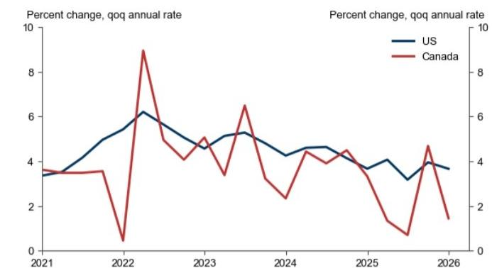

line

| Year | US (Percent change, qoq annual rate) | Canada (Percent change, qoq annual rate) |
|---|---|---|
| 2021 | 3.5 | 3.7 |
| 2022 | 6.2 | 0.5 |
| 2023 | 4.8 | 5.0 |
| 2024 | 4.3 | 2.4 |
| 2025 | 3.9 | 4.5 |
| 2026 | 3.7 | 1.4 |

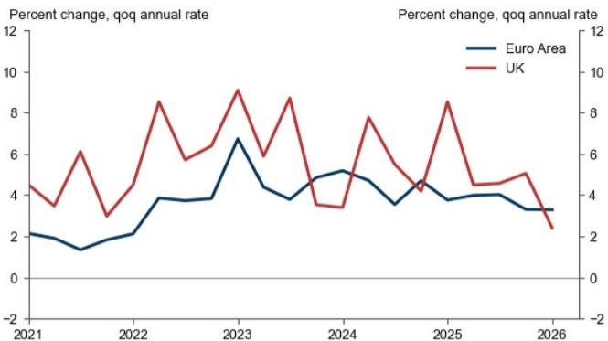

line

| Year | Euro Area (%) | UK (%) |
|---|---|---|
| 2021 | 2.1 | 4.5 |
| 2022 | 2.3 | 3.0 |
| 2023 | 6.8 | 9.2 |
| 2024 | 5.2 | 3.5 |
| 2025 | 3.8 | 8.7 |
| 2026 | 3.3 | 2.4 |

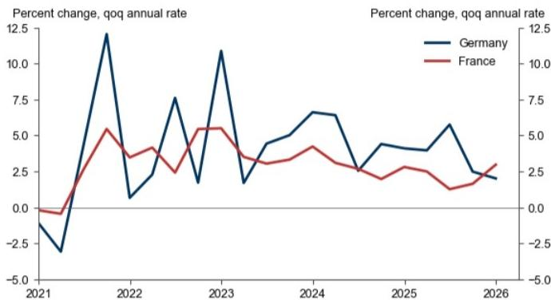

line

| Year | Germany (%) | France (%) |
|---|---|---|
| 2021 | -1.5 | -0.2 |
| 2022 | 12.5 | 5.5 |
| 2023 | 11.0 | 5.5 |
| 2024 | 6.5 | 4.0 |
| 2025 | 4.0 | 2.5 |
| 2026 | 2.0 | 3.0 |

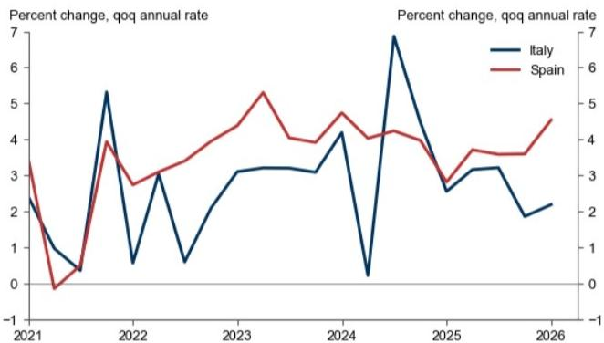

line

| Year | Italy (%) | Spain (%) |
|---|---|---|
| 2021 | 2.3 | 3.2 |
| 2022 | 0.5 | 2.8 |
| 2023 | 3.1 | 4.5 |
| 2024 | 3.1 | 4.7 |
| 2025 | 2.6 | 3.7 |
| 2026 | 2.1 | 4.6 |

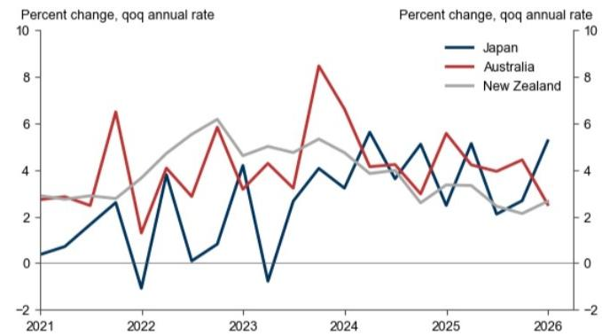

line

| Year | Japan (%) | Australia (%) | New Zealand (%) |
|---|---|---|---|
| 2021 | 0.5 | 3.0 | 3.0 |
| 2022 | -1.0 | 1.5 | 4.0 |
| 2023 | 0.5 | 4.5 | 6.0 |
| 2024 | 4.0 | 8.5 | 5.0 |
| 2025 | 2.5 | 5.5 | 3.5 |
| 2026 | 5.5 | 3.0 | 2.5 |

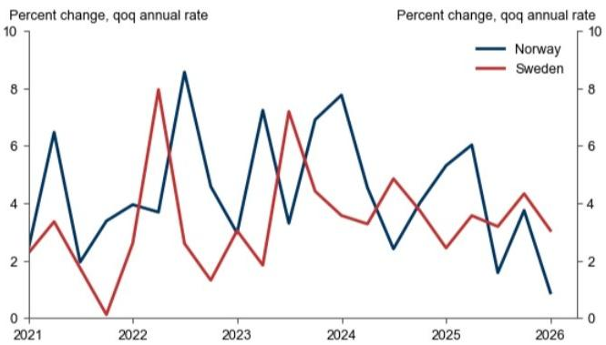

line

| Year | Norway (%) | Sweden (%) |
|---|---|---|
| 2021 | 3.0 | 2.5 |
| 2022 | 4.0 | 8.0 |
| 2023 | 3.0 | 2.0 |
| 2024 | 7.8 | 3.5 |
| 2025 | 5.5 | 3.0 |
| 2026 | 1.0 | 3.0 |

Source: GS Global Investment Research

Exhibit 24: GS Jobs-Workers Gaps   
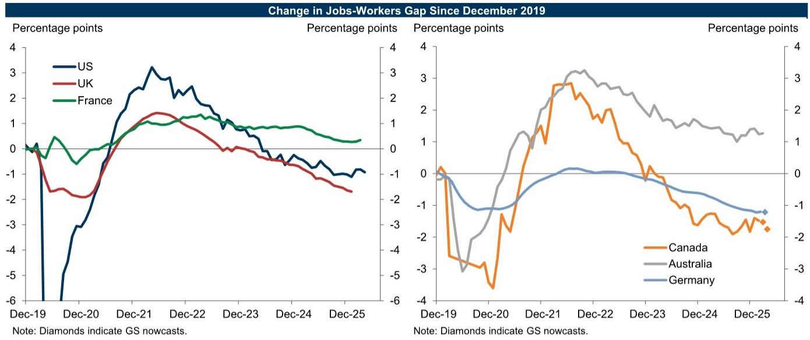  
Source: GS Global Investment Research

Exhibit 25: Wage Survey Leading Indicators   
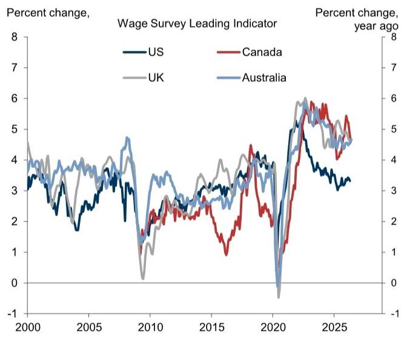

line

| Year | US   | Canada | UK   | Australia |
|------|------|--------|------|-----------|
| 2000 | 3.5  | 4.0    | 4.5  | 4.0       |
| 2005 | 3.0  | 3.5    | 3.5  | 3.5       |
| 2010 | 1.5  | 2.0    | 1.0  | 2.5       |
| 2015 | 3.0  | 2.5    | 3.5  | 3.0       |
| 2020 | -1.0 | -0.5   | -1.5 | -0.5      |
| 2025 | 3.5  | 5.0    | 5.5  | 4.5       |

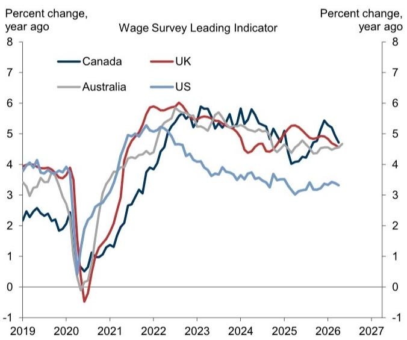

line

| Year | Canada | UK | Australia | US |
|------|--------|----|-----------|----|
| 2019 | 2.5    | 4.0 | 3.5       | 4.0 |
| 2020 | 0.5    | -0.5 | 0.0       | 0.5 |
| 2021 | 1.5    | 5.0 | 4.5       | 5.0 |
| 2022 | 5.5    | 6.0 | 5.5       | 5.0 |
| 2023 | 5.8    | 5.5 | 5.0       | 4.5 |
| 2024 | 5.5    | 5.0 | 4.5       | 4.0 |
| 2025 | 4.5    | 4.5 | 4.0       | 3.5 |
| 2026 | 5.0    | 4.8 | 4.5       | 3.8 |
| 2027 | 4.8    | 4.5 | 4.3       | 3.5 |

Source: GS Global Investment Research

# Top-Down Fiscal Impulses

Exhibit 26: Top-Down Fiscal Impulses Over the Next 4 Quarters (Left) and in the Euro Area, UK, and US (Right)   
Effect of Fiscal Policy on Real GDP Growth (3 Quarter Centered Moving Average)   
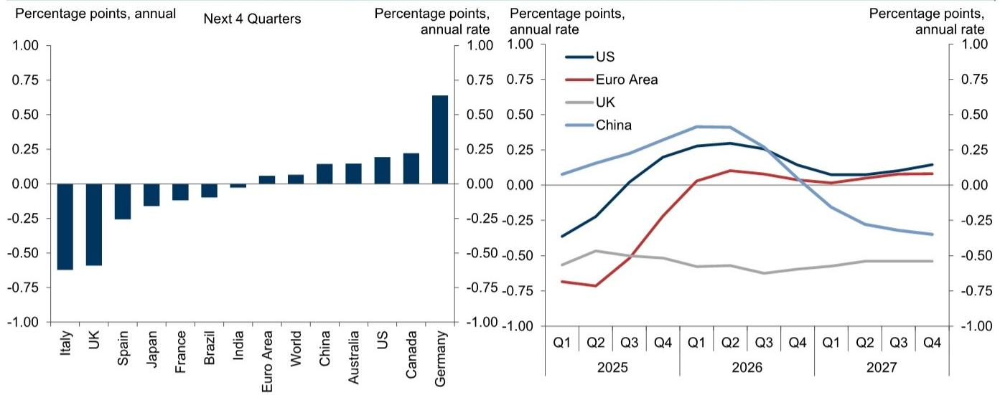  
We compute the 4-quarter measure using average fiscal growth impulses from 2026Q1 to 2026Q4. The US impulse captures both expansionary fiscal discretionary policy and the tax-like effects of tariffs.   
Source: GS Global Investment Research

Exhibit 27: Top-Down Fiscal Impulses in the US, Euro Area, China, and UK   
Effect of Fiscal Policy on Real GDP Growth (3 Quarter Centered Moving Average)   
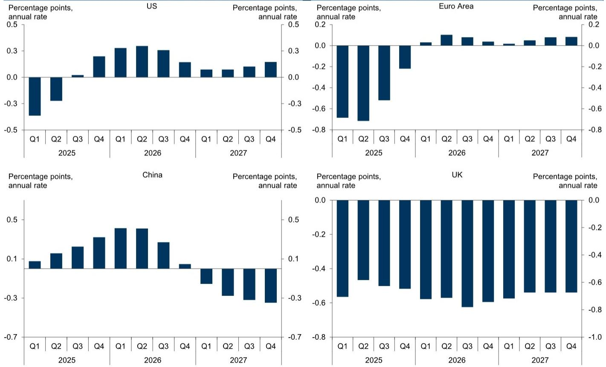

bar

| Region | Quarter | Percentage points, annual rate |
|---|---|---|
| US | Q1 | -0.38 |
| US | Q2 | -0.29 |
| US | Q3 | 0.01 |
| US | Q4 | 0.28 |
| US | Q1 | 0.31 |
| US | Q2 | 0.32 |
| US | Q3 | 0.30 |
| US | Q4 | 0.25 |
| Euro Area | Q1 | -0.68 |
| Euro Area | Q2 | -0.72 |
| Euro Area | Q3 | -0.55 |
| Euro Area | Q4 | -0.20 |
| Euro Area | Q1 | 0.03 |
| Euro Area | Q2 | 0.14 |
| Euro Area | Q3 | 0.11 |
| Euro Area | Q4 | 0.04 |
| China | Q1 | -0.26 |
| China | Q2 | -0.28 |
| China | Q3 | -0.29 |
| China | Q4 | -0.31 |
| China (Percentage points, annual rate) | Q1 | 0.09 |
| China (Percentage points, annual rate) | Q2 | 0.11 |
| China (Percentage points, annual rate) | Q3 | 0.13 |
| China (Percentage points, annual rate) | Q4 | 0.15 |
| China (Percentage points, annual rate) | Q1 | 0.45 |
| China (Percentage points, annual rate) | Q2 | 0.46 |
| China (Percentage points, annual rate) | Q3 | 0.14 |
| China (Percentage points, annual rate) | Q4 | 0.08 |
| UK | Q1 | -0.58 |
| UK | Q2 | -0.45 |
| UK | Q3 | -0.48 |
| UK | Q4 | -0.52 |
| UK (Percentage points, annual rate) | Q1 | -0.60 |
| UK (Percentage points, annual rate) | Q2 | -0.58 |
| UK (Percentage points, annual rate) | Q3 | -0.65 |
| UK (Percentage points, annual rate) | Q4 | -0.60 |
| UK (Percentage points, annual rate) | Q1 | -0.58 |
| UK (Percentage points, annual rate) | Q2 | -0.57 |
| UK (Percentage points, annual rate) | Q3 | -0.56 |
| UK (Percentage points, annual rate) | Q4 | -0.55 |
The chart displays a series of five vertical bars for each region: US, Euro Area, China, UK, and two additional bars for the other three regions. The Y-axis represents the percentage points per year for each region in each year.

The US impulse captures both expansionary fiscal discretionary policy and the tax-like effects of tariffs.   
Source: GS Global Investment Research

# Output Gaps

Exhibit 28: Latest Short-Run Utilization Scores 

<table><tr><td rowspan="2">Country</td><td rowspan="2">Month</td><td colspan="2">Spot Short-Run Utilization Scores (% of Potential)</td><td rowspan="2">3 Month Average (% of Potential)</td></tr><tr><td>Value</td><td>Weekly Change</td></tr><tr><td>US</td><td>May</td><td>-2.0</td><td>+0.2</td><td>-2.1</td></tr><tr><td>Germany</td><td>May</td><td>+0.1</td><td>0.0</td><td>+0.1</td></tr><tr><td>France</td><td>May</td><td>+0.9</td><td>-0.2</td><td>+0.9</td></tr><tr><td>Italy</td><td>May</td><td>+5.4</td><td>0.0</td><td>+5.4</td></tr><tr><td>Spain</td><td>May</td><td>+5.0</td><td>+0.4</td><td>+4.7</td></tr><tr><td>Japan</td><td>March</td><td>-1.1</td><td>0.0</td><td>-1.0</td></tr><tr><td>UK</td><td>May</td><td>-1.6</td><td>-0.2</td><td>-1.5</td></tr><tr><td>Canada</td><td>March</td><td>-1.3</td><td>0.0</td><td>-1.3</td></tr><tr><td>Australia</td><td>April</td><td>-0.3</td><td>0.0</td><td>-0.2</td></tr><tr><td>China</td><td>April</td><td>0.0</td><td>+0.2</td><td>0.0</td></tr><tr><td>India</td><td>April</td><td>+0.6</td><td>0.0</td><td>+0.4</td></tr><tr><td>Brazil</td><td>March</td><td>+0.6</td><td>0.0</td><td>+0.6</td></tr><tr><td>Russia</td><td>April</td><td>+1.6</td><td>0.0</td><td>+1.6</td></tr></table>

Source: GS Global Investment Research

Exhibit 29: Short-Run Utilization Scores   
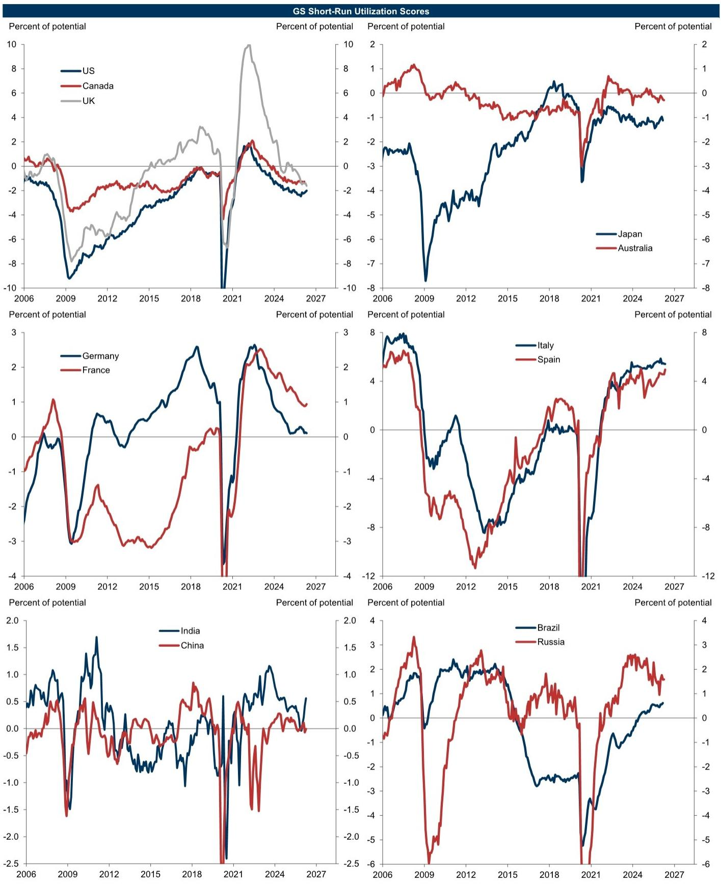  
Source: GS Global Investment Research

Exhibit 30: Change in GS 2026 Inflation Forecasts   
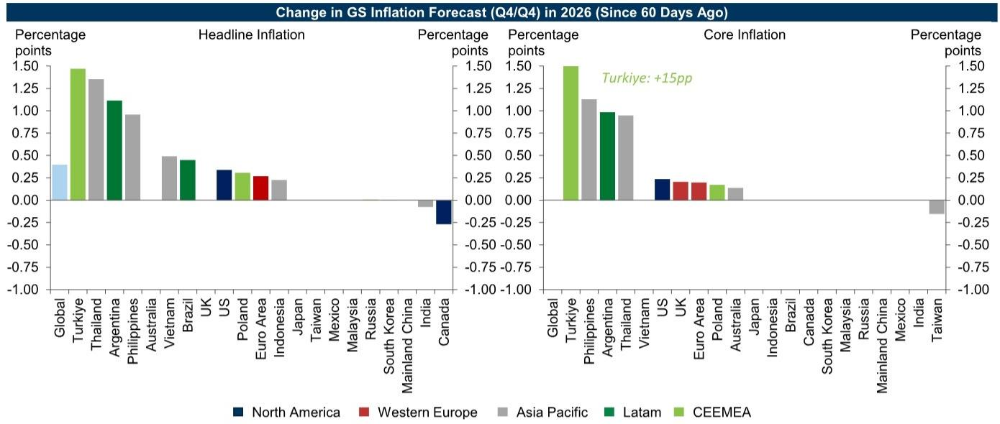

bar

Change in GS Inflation Forecast (Q4/Q4) in 2026 (Since 60 Days Ago)
| Region | Change in GS Inflation Forecast (Q4/Q4) (%) |
| :--- | :--- |
| Global | 0.38 |
| Türkiye | 1.47 |
| Thailand | 1.35 |
| Argentina | 1.12 |
| Philippines | 0.95 |
| Australia | 0.48 |
| Vietnam | 0.45 |
| Brazil | 0.32 |
| UK | 0.32 |
| US | 0.32 |
| Poland | 0.31 |
| Euro Area | 0.26 |
| Indonesia | 0.23 |
| Japan | -0.01 |
| Taiwan | -0.01 |
| Mexico | -0.01 |
| Malaysia | -0.01 |
| Russia | -0.01 |
| South Korea | -0.01 |
| Mainland China | -0.01 |
| India | -0.25 |
| Canada | -0.25 |

| Core Inflation Forecast (Q4/Q4) (%) | Change in GS Inflation Forecast (Q4/Q4) (%) |
|---|---|
| North America | 0.25 |
| Western Europe | 0.22 |
| Asia Pacific | 1.12 |
| Latam | 0.98 |
| CEEMEA | 0.95 |

| Core Inflation Forecast (Q4/Q4) (%) | Change in GS Inflation Forecast (Q4/Q4) (%) |
|---|---|
| Turkey: +15pp | 1.50 |
| Global | 1.50 |
| Philippines | 1.15 |
| Argentina | 1.00 |
| Thailand | 0.95 |
| Vietnam | 0.25 |
| US | 0.25 |
| UK | 0.22 |
| Euro Area | 0.22 |
| Poland | 0.20 |
| Australia | 0.15 |
| Japan | -0.01 |
| Indonesia | -0.01 |
| Brazil | -0.01 |
| Canada | -0.01 |
| South Korea | -0.01 |
| Malaysia | -0.01 |
| Russia | -0.01 |
| Mainland China | -0.01 |
| Mexico | -0.01 |
| India | -0.01 |
| Taiwan | -0.25 |

Source: GS Global Investment Research

Exhibit 31: Change in GS 2027 Inflation Forecasts   
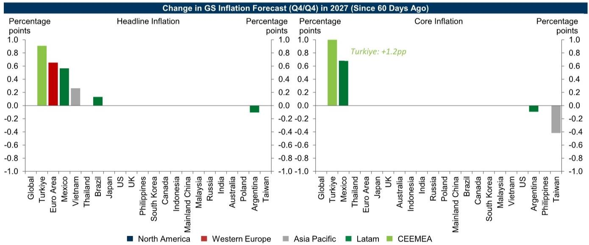

bar

Change in GS Inflation Forecast (Q4/Q4) in 2027 (Since 60 Days Ago)
| Category | Region | Percentage Points |
| :--- | :--- | :--- |
| Headline Inflation - Global | North America | 0.9 |
| Headline Inflation - Europe Area | Western Europe | 0.65 |
| Headline Inflation - Mexico | Asia Pacific | 0.55 |
| Headline Inflation - Vietnam | Asia Pacific | 0.25 |
| Headline Inflation - Thailand | Latam | 0.12 |
| Headline Inflation - Brazil | Latam | 0.0 |
| Headline Inflation - Japan | Latam | 0.0 |
| Headline Inflation - US | Latam | 0.0 |
| Headline Inflation - UK | Latam | 0.0 |
| Headline Inflation - Philippines | Latam | 0.0 |
| Headline Inflation - South Korea | Latam | 0.0 |
| Headline Inflation - Canada | Latam | 0.0 |
| Headline Inflation - Indonesia | Latam | 0.0 |
| Headline Inflation - Mainland China | Latam | 0.0 |
| Headline Inflation - Malaysia | Latam | 0.0 |
| Headline Inflation - Russia | Latam | 0.0 |
| Headline Inflation - India | Latam | 0.0 |
| Headline Inflation - Australia | Latam | 0.0 |
| Headline Inflation - Poland | Latam | 0.0 |
| Headline Inflation - Argentina | Taiwan | -0.1 |
| Headline Inflation - Taiwan | Taiwan | -0.1 |
Percentage Points: Global, Turkey, Euro Area, Mexico, Vietnam, Thailand, Brazil, Japan, US, Japan, UK, Philippines, South Korea, Canada, Malaysia, Vietnam, Argentina, Taiwan; Core Inflation: Global, Turkey, Mexico, Thailand, Euro Area, Japan, UK, Australia, Indonesia, India, Russia, Poland, Mainland China, Brazil, Canada, South Korea, Malaysia, Vietnam, US, Argentina, Philippines; Core Inflation: Global, Turkey, Mexico, Thailand, Euro Area, Japan, UK, Australia, Indonesia, India, Russia, Poland, Mainland China, Brazil, Canada, Malaysia, Vietnam, Argentina, Philippines; Core Inflation: Global, Turkey, Mexico, Thailand, Euro Area, Japan, UK, Australia, Indonesia, India, Russia, Poland, Mainland China, Brazil, Canada, South Korea, Malaysia, Vietnam, US, Argentina, Philippines; Core Inflation: Global, Turkey, Mexico, Thailand, Euro Area, Japan, UK, Australia, Indonesia, India, Russia, Poland, Mainland China, Brazil, Canada, Malaysia, Vietnam, Argentina, Philippines; Core Inflation; Core Inflation: Global, Turkey, Mexico, Thailand, Euro Area, Japan, UK, Australia, Indonesia, India, Russia, Poland, Mainland China, Brazil, Canada, Malaysia, Vietnam, Argentina, Philippines; Core Inflation: Global, Turkey, Mexico, Thailand, Euro Area, Japan, UK, Australia, Indonesia, India, Russia, Poland, Mainland China, Brazil, Canada, Malaysia, Vietnam, Argentina, Philippines; Core Inflation: Global, Turkey, Mexico, Thailand, Euro Area, Japan, UK, Australia, Indonesia, India, Russia, Poland, Mainland China, Brazil, Canada, Malaysia, Vietnam, Argentina, Philippines; Core Inflation: Global, Turkey, Mexican America & Caribbean (CEEMEA), North America & Western Europe & Asia Pacific (CEEMEA), Latin America & Eastern Europe & Asia Pacific (CEEMEA), North America & Western Europe & Asia Pacific (CEEMEA), Latin America & Eastern Europe & Asia Pacific (CEEMEA), North America & Western Europe & Asia Pacific (CEEMEA), North America & Eastern Europe & Asia Pacific (CEEMEA), North America & Western Europe & Asia Pacific (CEEMEA), North America & Eastern Europe & Asia Pacific (CEEMEA), North America & Western Europe & Asia Pacific (CEEMEA), North America & Eastern Europe & Asia Pacific (CEEMEA), North America & Western Europe & Asia Pacific (CEEMEA), North America & Eastern Europe & Asia Pacific (CEEMEA), North America & Western Europe & Asia Pacific (GEEMEA), North America & Western Europe & Asia Pacific (GEEMEA), North America & Eastern Europe & Central America & Central Europe & Central Asia & Central Africa & Central Americas & Central Asia & Central Oceania & Central Oceania & Central Oceania (GEEMEA); Core Inflation: Turkey: +1.2pp
Percentage Points: Global: 0.9
Percentage Points: Turkey: 0.65
Percentage Points: Euro Area: 0.65
Percentage Points: Mexico: 0.55
Percentage Points: Vietnam: 0.25
Percentage Points: Thailand: 0.15
Percentage Points: Brazil: 0.15
Percentage Points: Japan: 0.05
Percentage Points: US: 0.05
Percentage Points: UK: 0.05
Percentage Points: Philippines: 0.05
Percentage Points: Taiwan: 0.05
Percentage Points: North America: 0.05
Percentage Points: Western Europe: 0.65
Percentage Points: Asia Pacific: 0.25
Percentage Points: Latin America & Eastern Europe & Central America & Central Asia & Central Africa & Central Oceania & Central Oceania (GEEMEA): 0.9
Percentage Points: North America: 0.9
Percentage Points: Western Europe: 0.65
Percentage Points: Asia Pacific: 0.25
Percentage Points: Latin America & Eastern Europe & Central America & Central Asia & Central Oceania & Central Oceania (GEEMEA): 1.0
Percentage Points: North America: 1.0
Percentage Points: Western Europe: 1.0
Percentage Points: Asia Pacific: 1.0
Percentage Points: Latin America & Eastern Europe & Central America & Central Asia & Central Oceania & Central Oceania (GEEMEA): 1.0
Percentage Points: North America: 1.0
Percentage Points: Western Europe: 1.0
Percentage Points: Asia Pacific: 1.0
Percentage Points: Latin America & Eastern Europe & Central America & Central Asia & Central Oceania & Central Oceania (GEEMEA): 1.
Percentage Points: North America: 1.0
Percentage Points: Western Europe: 1.0
Percentage Points: Asia Pacific: 1.0
Percentage Points: Latin America & Eastern Europe & Central America & Central Asia & Central Oceania & Central Oceania (GEEMEA): 1.
Percentage Points: North America: 1.0
Percentage Points: Western Europe: 1.0
Percentage Points: Asia Pacific: 1.0
Percentage Pointes:
North America: 1.0
Europe Area: 1.0
Mexico: 1.0
Vietnam: 1.0
Thailand: 1.0
Brazil: 1.0
Argentina: 1.0
Philippines: 1.0
Taiwan: 1.0

Source: GS Global Investment Research

Exhibit 32: Change in GS 2026 GDP Forecasts   
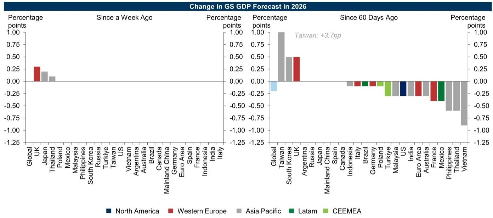

bar

Change in GS GDP Forecast in 2026
| Region | Change in GS GDP (pp) |
| :--- | :--- |
| Global | -0.15 |
| UK | 0.30 |
| Japan | 0.18 |
| Thailand | 0.10 |
| Poland | 0.00 |
| Mexico | 0.00 |
| Malaysia | 0.00 |
| Philippines | 0.00 |
| South Korea | 0.00 |
| Russia | 0.00 |
| Türkiye | 0.00 |
| Taiwan | 0.00 |
| US | 0.00 |
| Vietnam | 0.00 |
| Argentina | 0.00 |
| Australia | 0.00 |
| Brazil | 0.00 |
| Canada | 0.00 |
| Mainland China | 0.00 |
| Germany | 0.00 |
| Euro Area | 0.00 |
| Spain | 0.00 |
| France | 0.00 |
| Indonesia | 0.00 |
| India | 0.00 |
| Italy | 0.00 |

| Time Since a Week Ago: 
| Region | Change in GS GDP (pp) |
| :--- | :--- |
| Global | -0.15 |
| Taiwan | +3.7pp |
| South Korea | 0.50 |
| UK | 0.52 |
| Argentina | 0.00 |
| Russia | 0.00 |
| Japan | 0.00 |
| Mainland China | 0.00 |
| Spain | 0.00 |
| Canada | -0.15 |
| Indonesia | -0.15 |
| Italy | -0.15 |
| Brazil | -0.15 |
| Germany | -0.15 |
| Poland | -0.15 |
| Türkiye | -0.35 |
| Malaysia | -0.25 |
| US | -0.25 |
| India | -0.25 |
| Euro Area | -0.25 |
| Australia | -0.25 |
| France | -0.45 |
| Mexico | -0.45 |
| Philippines | -0.65 |
| Thailand | -0.75 |
| Vietnam | -1.15 |

Source: GS Global Investment Research

Exhibit 33: Change in GS 2027 GDP Forecasts   
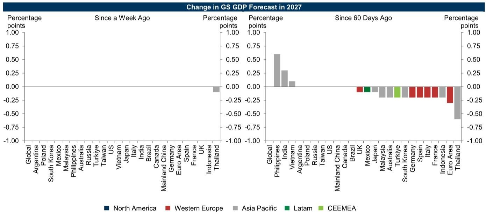

bar

Change in GS GDP Forecast in 2027
| Region | Change in GS GDP (Percentage points) |
| :--- | :--- |
| Global | 1.00 |
| Argentina | 1.00 |
| Poland | 1.00 |
| South Korea | 1.00 |
| Mexico | 1.00 |
| Malaysia | 1.00 |
| Philippines | 1.00 |
| Australia | 1.00 |
| Russia | 1.00 |
| Türkiye | 1.00 |
| Taiwan | 1.00 |
| US | 1.00 |
| Vietnam | 1.00 |
| Japan | 1.00 |
| Italy | 1.00 |
| India | 1.00 |
| Brazil | 1.00 |
| Canada | 1.00 |
| Mainland China | 1.00 |
| Germany | 1.00 |
| Euro Area | 1.00 |
| Spain | 1.00 |
| France | 1.00 |
| UK | 1.00 |
| Indonesia | -0.25 |
| Thailand | -0.50 |
Since a Week Ago: Percentage points; Since 60 Days Ago: Percentage points; North America: Percentage points; Western Europe: Percentage points; Asia Pacific: Percentage points; Latam: Percentage points; CEEMEA: Percentage points.

Source: GS Global Investment Research

Exhibit 34: GS 2026 Global GDP Forecasts vs. Other Forecasters   
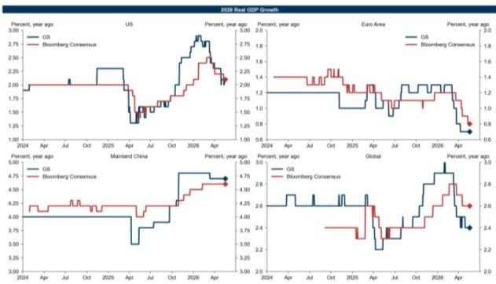

line

2026 Real GDP Growth
| Region | Period | GS (%) | Bloomberg Consensus (%) |
|---|---|---|---|
| US | 2024-04 | 2.00 | 1.75 |
| US | 2024-05 | 2.00 | 1.75 |
| US | 2024-06 | 2.00 | 1.75 |
| US | 2024-07 | 2.00 | 1.75 |
| US | 2024-08 | 2.00 | 1.75 |
| US | 2024-09 | 2.00 | 1.75 |
| US | 2024-10 | 2.00 | 1.75 |
| US | 2024-11 | 2.00 | 1.75 |
| US | 2024-12 | 2.00 | 1.75 |
| Mainland China | 2024-04 | 3.00 | 4.00 |
| Mainland China | 2024-05 | 3.00 | 4.00 |
| Mainland China | 2024-06 | 3.00 | 4.00 |
| Mainland China | 2024-07 | 3.00 | 4.00 |
| Mainland China | 2024-08 | 3.00 | 4.00 |
| Mainland China | 2024-09 | 3.00 | 4.00 |
| Mainland China | 2024-10 | 3.00 | 4.00 |
| Mainland China | 2024-11 | 3.00 | 4.00 |
| Mainland China | 2024-12 | 3.00 | 4.00 |
| Global | 2024-04 | 3.00 | 4.75 |
| Global | 2024-05 | 3.00 | 4.75 |
| Global | 2024-06 | 3.00 | 4.75 |
| Global | 2024-07 | 3.00 | 4.75 |
| Global | 2024-08 | 3.00 | 4.75 |
| Global | 2024-09 | 3.00 | 4.75 |
| Global | 2024-10 | 3.00 | 4.75 |
| Global | 2024-11 | 3.00 | 4.75 |
| Global | 2024-12 | 3.00 | 4.75 |
| Euro Area | 2024-04 | 1.25 | 1.45 |
| Euro Area | 2024-05 | 1.25 | 1.45 |
| Euro Area | 2024-06 | 1.25 | 1.45 |
| Euro Area | 2024-07 | 1.25 | 1.45 |
| Euro Area | 2024-08 | 1.25 | 1.45 |
| Euro Area | 2024-09 | 1.25 | 1.45 |
| Euro Area | 2024-10 | 1.25 | 1.45 |
| Euro Area | 2024-11 | 1.25 | 1.45 |
| Euro Area | 2024-12 | 1.25 | 1.45 |
| Euro Area (Global) | 2024-04 | -1.75 | -1.75 |
| Euro Area (Global) | 2024-05 | -1.75 | -1.75 |
| Euro Area (Global) | 2024-06 | -1.75 | -1.75 |
| Euro Area (Global) | 2024-07 | -1.75 | -1.75 |
| Euro Area (Global) | 2024-08 | -1.75 | -1.75 |
| Euro Area (Global) | 2024-09 | -1.75 | -1.75 |
| Euro Area (Global) | 2024-10 | -1.75 | -1.75 |
| Euro Area (Global) | 2024-11 | -1.75 | -1.75 |
| Euro Area (Global) | 2024-12 | -1.75 | -1.75 |
| Euro Area (Global) (Total) | 2024-04 | -3.75 | -3.75 |
| Euro Area (Total) | 2024-05 | -3.75 | -3.75 |
| Euro Area (Total) | 2024-06 | -3.75 | -3.75 |
| Euro Area (Total) | 2024-07 | -3.75 | -3.75 |
| Euro Area (Total) | 2024-08 | -3.75 | -3.75 |
| Euro Area (Total) | 2024-09 | -3.75 | -3.75 |
| Euro Area (Total) | 2024-10 | -3.75 | -3.75 |
| Euro Area (Total) (Total) (Total) = Total (%) + Total (%) = % of GDP Growth (US vs Bloomberg Consensus). The chart displays a single line representing one year's growth rate for each region in the last two years of growth period (US and Bloomberg Consensus). The data is presented in a separate table with the same axes and legend categories.

Source: Bloomberg, GS Global Investment Research

Exhibit 35: GS 2027 Global GDP Forecasts vs. Other Forecasters   
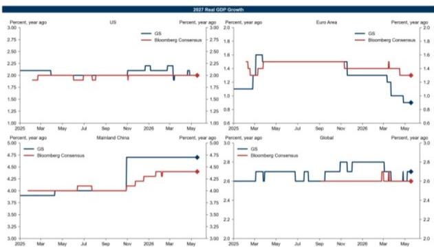

line

2027 Real GDP Growth
| Region | Period | GS (Percent, year ago) | Bloomberg Consensus (Percent, year ago) |
| :--- | :--- | :--- | :--- |
| US | 2025 | 2.00 | 2.00 |
| US | 2026 | 2.25 | 2.25 |
| US | May | 1.00 | 1.00 |
| Mainland China | 2025 | 4.75 | 4.50 |
| Mainland China | 2026 | 4.75 | 4.50 |
| Mainland China | May | 4.75 | 4.50 |
| Euro Area | 2025 | 1.80 | 1.60 |
| Euro Area | 2026 | 1.40 | 1.40 |
| Euro Area | May | 1.40 | 1.40 |
| Global | 2025 | 3.00 | 2.60 |
| Global | 2026 | 3.00 | 2.60 |
| Global | May | 3.00 | 2.60 |
| Euro Area - Month-Year Growth (%) | 2025 | 3.00 | 3.00 |
| Euro Area - Month-Year Growth (%) | 2026 | 3.00 | 3.00 |
| Euro Area - Month-Year Growth (%) | May | 3.00 | 3.00 |
| Global - Month-Year Growth (%) | 2025 | 3.00 | 3.00 |
| Global - Month-Year Growth (%) | 2026 | 3.00 | 3.00 |
| Global - Month-Year Growth (%) | May | 3.00 | 3.00 |
The chart displays a horizontal bar chart comparing actual historical data with Bloomberg Consensus estimates for each region in the same period. The data is presented in two columns: 'Percent, year ago' and 'Euro Area'. The chart title is '2027 Real GDP Growth'.

Source: Bloomberg, GS Global Investment Research

Thank you to Jamal Lawal, intern on the Global Economics team, for his contributions to this report.

# Methodology Notes for GS Proprietary Economic Indicators

1. Financial Conditions: Our Financial Conditions Indexes are designed to gauge the overall looseness or tightness of financial conditions across the world's major economies. The GSFCIs can provide valuable information about the GDP growth outlook, the transmission of monetary policy to the real economy, and the importance of financial shocks hitting the economy. (Latest methodology notes here and here.)

2. FCI Impulses: Our FCI impulses measure the effect of financial conditions on real GDP growth. For details on the methodology please see here.

3. Current Activity Indicator: In statistical jargon, the CAIs are the “first principal component” of several real activity indicators, expressed in GDP-equivalent units. The CAIs can be interpreted as the growth signal in the main high-frequency indicators for each economy. At any given point, data for certain indicators may not be available. The CAIs therefore incorporate forecasted values for missing indicators, which are then replaced with actual values when they are released. (Latest methodology note here.)

4. MAP Surprise Index: Our daily MAP surprise indices summarize the importance and strength (relative to consensus expectations) of economic indicators worldwide. Across numerous countries, our surprise index's methodology standardizes the criteria for indicator selection and importance, thresholds for “surprise” scores, and schemes for aggregation, while allowing for occasional judgmental input from local economists. (Latest methodology here.)

5. Trimmed Core Inflation. Our trimmed core inflation measure trims the one third most extreme price changes from the individual core inflation components. (Latest methodology note here.)

6. Jobs-Workers Gaps: Our jobs-workers gaps capture the difference between total labor demand (i.e. job openings plus employment) and labor supply (i.e. the labor force). We forecast the jobs-workers gap by forecasting official job openings with country-specific models reliant on high-frequency job posting data, and by forecasting the unemployment rate using jobless claims and other leading unemployment indicators. Our latest note can be found here.

7. Wage Survey Leading Indicator: Our wage survey leading indicators summarize survey questions about current and expected wage growth from business and consumer surveys. Our latest note can be found here.

8. Wage Trackers: Our wage trackers measure the underlying pace of wage growth across the G10 economies. Our latest notes can be found here and here.

9. Fiscal Impulses: Our fiscal impulses measure the effect of fiscal policy on real GDP growth. For details on the methodology please see here.

10. Short-Run Utilization Scores: Our short-run utilization scores are based on scores for both the labor market and the industrial sector, each based on a number of hard indicators and surveys, such as, for instance, the unemployment rate or supplier delivery times. We then define the short-run utilization score as a weighted average of these scores, converted into GDP-equivalent units. Our latest note can be found here. (We previously called our short-run utilization scores short-run output gaps.)

# Disclosure Appendix

# Reg AC

We, Jan Hatzius, Joseph Briggs, Sarah Dong and Megan Peters, hereby certify that all of the views expressed in this report accurately reflect our personal views, which have not been influenced by considerations of the firm's business or client relationships.

Unless otherwise stated, the individuals listed on the cover page of this report are analysts in GS' Global Investment Research division.

Contributing Authors: Jan Hatzius GS & Co. LLC, Joseph Briggs GS & Co. LLC, Sarah Dong GS & Co. LLC, Megan Peters GS International.

Unless otherwise stated, the individuals listed in the Contributing Authors disclosure of this report are analysts in GS' Global Investment Research division.

# Disclosures

# Regulatory disclosures

# Disclosures required by United States laws and regulations

See company-specific regulatory disclosures above for any of the following disclosures required as to companies referred to in this report: manager or co-manager in a pending transaction; $1\%$ or other ownership; compensation for certain services; types of client relationships; managed/co-managed public offerings in prior periods; directorships; for equity securities, market making and/or specialist role. GS trades or may trade as a principal in debt securities (or in related derivatives) of issuers discussed in this report.

The following are additional required disclosures: Ownership and material conflicts of interest: GS policy prohibits its analysts, professionals reporting to analysts and members of their households from owning securities of any company in the analyst's area of coverage. Analyst compensation: Analysts are paid in part based on the profitability of GS, which includes investment banking revenues. Analyst as officer or director: GS policy generally prohibits its analysts, persons reporting to analysts or members of their households from serving as an officer, director or advisor of any company in the analyst's area of coverage. Non-U.S. Analysts: Non-U.S. analysts may not be associated persons of GS & Co. LLC and therefore may not be subject to FINRA Rule 2241 or FINRA Rule 2242 restrictions on communications with a subject company, public appearances and trading in securities covered by the analysts.

# Additional disclosures required under the laws and regulations of jurisdictions other than the United States

The following disclosures are those required by the jurisdiction indicated, except to the extent already made above pursuant to United States laws and regulations. Australia: GS Australia Pty Ltd and its affiliates are not authorised deposit-taking institutions (as that term is defined in the Banking Act 1959 (Cth)) in Australia and do not provide banking services, nor carry on a banking business, in Australia. This research, and any access to it, is intended only for “wholesale clients” within the meaning of the Australian Corporations Act, unless otherwise agreed by GS. In producing research reports, members of Global Investment Research of GS Australia may attend site visits and other meetings hosted by the companies and other entities which are the subject of its research reports. In some instances the costs of such site visits or meetings may be met in part or in whole by the issuers concerned if GS Australia considers it is appropriate and reasonable in the specific circumstances relating to the site visit or meeting. To the extent that the contents of this document contains any financial product advice, it is general advice only and has been prepared by GS without taking into account a client’s objectives, financial situation or needs. A client should, before acting on any such advice, consider the appropriateness of the advice having regard to the client’s own objectives, financial situation and needs. A copy of certain GS Australia and New Zealand disclosure of interests and a copy of GS’ Australian Sell-Side Research Independence Policy Statement are available at: https://www.goldmansachs.com/disclosures/australia-new-zealand/index.html. Brazil: Disclosure information in relation to CVM Resolution n. 20 is available at https://www.gs.com/worldwide/brazil/area/gir/index.html. Where applicable, the Brazil-registered analyst primarily responsible for the content of this research report, as defined in Article 20 of CVM Resolution n. 20, is the first author named at the beginning of this report, unless indicated otherwise at the end of the text. Canada: This information is being provided to you for information purposes only and is not, and under no circumstances should be construed as, an advertisement, offering or solicitation by GS & Co. LLC for purchasers of securities in Canada to trade in any Canadian security. GS & Co. LLC is not registered as a dealer in any jurisdiction in Canada under applicable Canadian securities laws and generally is not permitted to trade in Canadian securities and may be prohibited from selling certain securities and products in certain jurisdictions in Canada. If you wish to trade in any Canadian securities or other products in Canada please contact GS Canada Inc., an affiliate of The GS Group Inc., or another registered Canadian dealer. Hong Kong: Further information on the securities of covered companies referred to in this research may be obtained on request from GS (Asia) L.L.C. India: Further information on the subject company or companies referred to in this research may be obtained from GS (India) Securities Private Limited, Research Analyst - SEBI Registration Number INH000001493, 10th Floor, Ascent-Worli, Sudam Kalu Ahire Marg, Worli, Mumbai-400 025, India, Corporate Identity Number U74140MH2006FTC160634, Phone +91 22 6616 9000, Fax +91 22 6616 9001. GS may beneficially own 1% or more of the securities (as such term is defined in clause 2 (h) the Indian Securities Contracts (Regulation) Act, 1956) of the subject company or companies referred to in this research report. Investment in securities market are subject to market risks. Read all the related documents carefully before investing. Registration granted by SEBI and certification from NISM in no way guarantee performance of the intermediary or provide any assurance of returns to investors. GS (India) Securities Private Limited compliance officer and investor grievance contact details can be found at: https://www.goldmansachs.com/worldwide/india/documents/Grievance-Redressal-and-Escalation-Matrix.pdf, and a copy of the annual audit compliance report can be found at this link: https://publishing.gs.com/content/site/india-annual-compliance-report.html. Japan: See below. Korea: This research, and any access to it, is intended only for “professional investors” within the meaning of the Financial Services and Capital Markets Act, unless otherwise agreed by GS. Further information on the subject company or companies referred to in this research may be obtained from GS (Asia) L.L.C., Seoul Branch. New Zealand: GS New Zealand Limited and its affiliates are neither “registered banks” nor “deposit takers” (as defined in the Reserve Bank of New Zealand Act 1989) in New Zealand. This research, and any access to it, is intended for “wholesale clients” (as defined in the Financial Advisers Act 2008) unless otherwise agreed by GS. A copy of certain GS Australia and New Zealand disclosure of interests is available at: https://www.goldmansachs.com/disclosures/australia-new-zealand/index.html. Russia: Research reports distributed in the Russian Federation are not advertising as defined in the Russian legislation, but are information and analysis not having product promotion as their main purpose and do not provide appraisal within the meaning of the Russian legislation on appraisal activity. Research reports do not constitute a personalized investment recommendation as defined in Russian laws and regulations, are not addressed to a specific client, and are prepared without analyzing the financial circumstances, investment profiles or risk profiles of clients. GS assumes no responsibility for any investment decisions that may be taken by a client or any other person based on this research report. Singapore: GS (Singapore) Pte. (Company Number: 198602165W), which is regulated by the Monetary Authority of Singapore, accepts legal responsibility for this research, and should be contacted with respect to any matters arising from, or in connection with, this research. Taiwan: This material is for reference only and must not be reprinted without permission. Investors should carefully consider their own investment risk. Investment results are the responsibility of the individual investor. United Kingdom: Persons who would be categorized as retail clients in the United Kingdom, as such term is

defined in the rules of the Financial Conduct Authority, should read this research in conjunction with prior GS on the covered companies referred to herein and should refer to the risk warnings that have been sent to them by GS International. A copy of these risks warnings, and a glossary of certain financial terms used in this report, are available from GS International on request.

European Union and United Kingdom: Disclosure information in relation to Article 6 (2) of the European Commission Delegated Regulation (EU) (2016/958) supplementing Regulation (EU) No 596/2014 of the European Parliament and of the Council (including as that Delegated Regulation is implemented into United Kingdom domestic law and regulation following the United Kingdom's departure from the European Union and the European Economic Area) with regard to regulatory technical standards for the technical arrangements for objective presentation of investment recommendations or other information recommending or suggesting an investment strategy and for disclosure of particular interests or indications of conflicts of interest is available at https://www.gs.com/disclosures/europeanpolicy.html which states the European Policy for Managing Conflicts of Interest in Connection with Investment Research.

Japan: GS Japan Co., Ltd. is a Financial Instrument Dealer registered with the Kanto Financial Bureau under registration number Kinsho 69, and a member of Japan Securities Dealers Association, Financial Futures Association of Japan Type II Financial Instruments Firms Association, and Investment Management Association of Japan. Sales and purchase of equities are subject to commission pre-determined with clients plus consumption tax. See company-specific disclosures as to any applicable disclosures required by Japanese stock exchanges, the Japanese Securities Dealers Association or the Japanese Securities Finance Company.

# Global product; distributing entities

GS Global Investment Research produces and distributes research products for clients of GS on a global basis. Analysts based in GS offices around the world produce research on industries and companies, and research on macroeconomics, currencies, commodities and portfolio strategy. This research is disseminated in Australia by GS Australia Pty Ltd (ABN 21 006 797 897); in Brazil by GS do Brasil Corretora de Títulos e Valores Mobiliários S.A.; Public Communication Channel GS Brazil: 0800 727 5764 and / or contatogoldmanbrasil@gs.com. Available Weekdays (except holidays), from 9am to 6pm. Canal de Comunicação com o Público GS Brasil: 0800 727 5764 e/ou contatogoldmanbrasil@gs.com. Horário de funcionamento: segunda-feira à sexta-feira (exceto feriados), das 9h às 18h; in Canada by GS & Co. LLC; in Hong Kong by GS (Asia) L.L.C.; in India by GS (India) Securities Private Ltd.; in Japan by GS Japan Co., Ltd.; in the Republic of Korea by GS (Asia) L.L.C., Seoul Branch; in New Zealand by GS New Zealand Limited; in Russia by OOO GS; in Singapore by GS (Singapore) Pte. (Company Number: 198602165W); and in the United States of America by GS & Co. LLC. GS International has approved this research in connection with its distribution in the United Kingdom.

GS International ("GSI"), authorised by the Prudential Regulation Authority ("PRA") and regulated by the Financial Conduct Authority ("FCA") and the PRA, has approved this research in connection with its distribution in the United Kingdom.

European Economic Area: GS Bank Europe SE ("GSBE") is a credit institution incorporated in Germany and, within the Single Supervisory Mechanism, subject to direct prudential supervision by the European Central Bank and in other respects supervised by German Federal Financial Supervisory Authority (Bundesanstalt für Finanzdienstleistungsaufsicht, BaFin) and Deutsche Bundesbank and disseminates research within the European Economic Area.

# General disclosures

This research is for our clients only. Other than disclosures relating to GS, this research is based on current public information that we consider reliable, but we do not represent it is accurate or complete, and it should not be relied on as such. The information, opinions, estimates and forecasts contained herein are as of the date hereof and are subject to change without prior notification. We seek to update our research as appropriate, but various regulations may prevent us from doing so. Other than certain industry reports published on a periodic basis, the large majority of reports are published at irregular intervals as appropriate in the analyst's judgment.

GS conducts a global full-service, integrated investment banking, investment management, and brokerage business. We have investment banking and other business relationships with a substantial percentage of the companies covered by Global Investment Research. GS & Co. LLC, the United States broker dealer, is a member of SIPC (https://www.sipc.org).

Our salespeople, traders, and other professionals may provide oral or written market commentary or trading strategies to our clients and principal trading desks that reflect opinions that are contrary to the opinions expressed in this research. Our asset management area, principal trading desks and investing businesses may make investment decisions that are inconsistent with the recommendations or views expressed in this research.

We and our affiliates, officers, directors, and employees will from time to time have long or short positions in, act as principal in, and buy or sell, the securities or derivatives, if any, referred to in this research, unless otherwise prohibited by regulation or GS policy.

The views attributed to third party presenters at GS arranged conferences, including individuals from other parts of GS, do not necessarily reflect those of Global Investment Research and are not an official view of GS.

Any third party referenced herein, including any salespeople, traders and other professionals or members of their household, may have positions in the products mentioned that are inconsistent with the views expressed by analysts named in this report.

This research is focused on investment themes across markets, industries and sectors. It does not attempt to distinguish between the prospects or performance of, or provide analysis of, individual companies within any industry or sector we describe.

Any trading recommendation in this research relating to an equity or credit security or securities within an industry or sector is reflective of the investment theme being discussed and is not a recommendation of any such security in isolation.

This research is not an offer to sell or the solicitation of an offer to buy any security in any jurisdiction where such an offer or solicitation would be illegal. It does not constitute a personal recommendation or take into account the particular investment objectives, financial situations, or needs of individual clients. Clients should consider whether any advice or recommendation in this research is suitable for their particular circumstances and, if appropriate, seek professional advice, including tax advice. The price and value of investments referred to in this research and the income from them may fluctuate. Past performance is not a guide to future performance, future returns are not guaranteed, and a loss of original capital may occur. Fluctuations in exchange rates could have adverse effects on the value or price of, or income derived from, certain investments.

Certain transactions, including those involving futures, options, and other derivatives, give rise to substantial risk and are not suitable for all investors. Investors should review current options and futures disclosure documents which are available from GS sales representatives or at https://www.theocc.com/about/publications/character-risks.jsp and https://www.goldmansachs.com/disclosures/cftc\_fcm\_disclosures. Transaction costs may be significant in option strategies calling for multiple purchase and sales of options such as spreads. Supporting documentation will be supplied upon request.

Differing Levels of Service provided by Global Investment Research: The level and types of services provided to you by GS Global Investment Research may vary as compared to that provided to internal and other external clients of GS, depending on various factors including your individual preferences as to the frequency and manner of receiving communication, your risk profile and investment focus and perspective (e.g., marketwide, sector specific, long term, short term), the size and scope of your overall client relationship with GS, and legal and regulatory constraints. As an example, certain clients may request to receive notifications when research on specific securities is published, and certain clients may request that specific data underlying analysts' fundamental analysis available on our internal client websites be delivered to them electronically through data feeds or otherwise. No change to an analyst's fundamental research views (e.g., ratings, price targets, or material changes to earnings estimates for equity securities), will be communicated to any client prior to inclusion of such information in a research report broadly disseminated through electronic publication to our internal client websites or through other means, as necessary, to all clients who are entitled to receive such reports.

All research reports are disseminated and available to all clients simultaneously through electronic publication to our internal client websites. Not all research content is redistributed to our clients or available to third-party aggregators, nor is GS responsible for the redistribution of our research by third party aggregators. For research, models or other data related to one or more securities, markets or asset classes (including related services) that may be available to you, please contact your GS representative or go to https://research.gs.com.

Disclosure information is also available at https://www.gs.com/research/hedge.html or from Research Compliance, 200 West Street, New York, NY 10282.

# © 2026 GS.

You are permitted to store, display, analyze, modify, reformat, and print the information made available to you via this service only for your own use. You may not resell or reverse engineer this information to calculate or develop any index for disclosure and/or marketing or create any other derivative works or commercial product(s), data or offering(s) without the express written consent of GS. You are not permitted to publish, transmit, or otherwise reproduce this information, in whole or in part, in any format to any third party without the express written consent of GS. This foregoing restriction includes, without limitation, using, extracting, downloading or retrieving this information, in whole or in part, to train or finetune a machine learning or artificial intelligence system, or to provide or reproduce this information, in whole or in part, as a prompt or input to any such system.