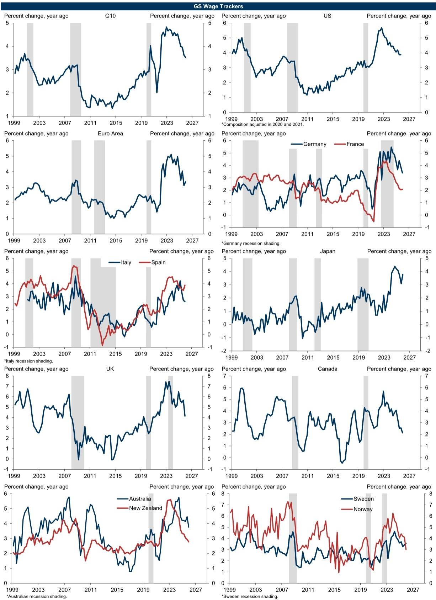
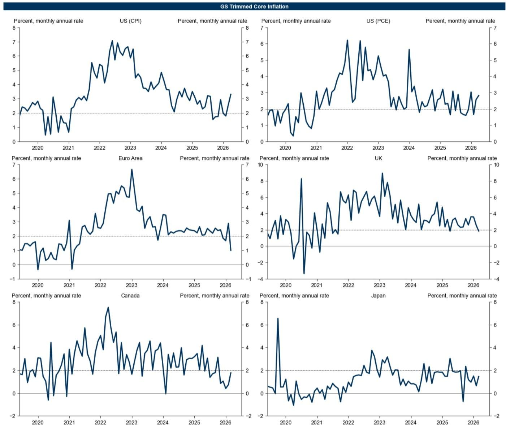

# 伊朗局势正在改写全球经济的短期叙事，但市场低估了结构性分化的深度

过去三周，全球宏观叙事发生了一次并不突然但被许多人低估的转向。某外资投行最新发布的全球经济指标更新中，一组数据值得所有关注资产配置的决策者认真审视：其 proprietary MAP 指标自伊朗冲突以来持续录得下行意外，欧元区经济活动数据自冲突开始以来整体低于预期，而与此同时，印度 CAI 环比跳升 1.3 个百分点，中国 4 月 CAI 则骤降 2.3 个百分点。

这些数字不是噪音。它们共同指向一个更核心的判断：地缘冲击正在加速全球经济内部的分化，而市场对这一分化的定价仍然不足。真正重要的不是“全球增长会不会放缓”——答案是会——而是哪些经济体能扛住、哪些不能，以及这种分化将如何重塑资产定价逻辑。

这份报告的价值不在于提供了多少数据点，而在于它给出了一个可追踪、可验证的框架，让我们能够从数据噪音中识别出结构性信号。以下是我们从报告中提炼出的五个关键洞察。

## 1. 伊朗冲突的冲击已经体现在硬数据中，MAP 指标的下行是第一个确认信号

报告中最引人注目的图表是 Exhibit 1 中的 MAP 指标。该指标自伊朗冲突开始以来持续录得下行意外，从 5 月的 +2.8 降至 11 月的 +2.1，再到次年 1 月的 +0.8，3 月进一步降至 -1.5，5 月触及 -3.5。这不是一次性的数据波动——90 天移动平均线清晰地画出了一条从 5 月高点持续下行的轨迹。

MAP 指标的特殊之处在于，它汇总了全球范围内经济指标相对市场预期的强弱程度。当该指标持续录得负值时，说明实际经济数据正在系统性低于预期。换句话说，市场此前对冲突后经济的韧性判断可能过于乐观了。

这一信号的确认意义重大。在冲突初期，市场普遍倾向于认为地缘冲击对经济的影响是“暂时的”或“可控的”。但 MAP 指标持续下行表明，冲击正在从情绪层面传导至实际经济活动层面。对于资产定价而言，这意味着此前基于“V 型复苏”假设的估值需要重新审视。

## 2. 欧元区是当前最脆弱的环节，德国已经陷入实质性收缩

报告对欧元区的数据披露尤为值得关注。4 月欧元区 CAI 仅为 +0.8%，远低于全球平均的 +2.8%。更令人担忧的是，德国——欧元区最大的经济体——4 月 CAI 录得 -0.6%，是主要发达经济体中唯一进入负值的国家。

德国的数据尤其具有信号意义。作为欧元区制造业的核心，德国 CAI 的负值并非孤立事件。法国 4 月 CAI 为 +0.9%，意大利 +1.1%，西班牙 +2.4%——南欧国家的表现明显优于德国。这意味着欧元区内部的分化正在加剧。德国制造业的疲软可能反映了能源成本上升、出口需求减弱以及地缘不确定性对投资决策的多重挤压。

从 FCI 角度看，欧元区 FCI 上周收紧 7.4 个基点，主要受长端利率和主权利差走阔驱动。这组数据意味着，欧元区金融条件的收紧并非仅来自全球利率环境，还有区内主权信用利差的结构性压力——这正是 2011 年危机的阴影。

对于关注欧洲资产的投资者而言，德国 CAI 负值是一个需要认真对待的先行指标。如果德国经济继续收缩，欧元区整体增长可能很快从“放缓”转为“停滞”。

## 3. 美国和英国的韧性被高估，劳动力市场数据开始松动

报告中的工资和通胀数据提供了另一条线索。Exhibit 6 显示，美国、欧元区和英国的工资跟踪指标均已从 2024 年的高点回落。美国的 PCE 通胀率预测从 2024 年的约 3.0% 降至 2026 年的约 2.0%，欧元区从约 2.5% 降至约 1.0%。通胀回落的方向是明确的，但速度存在不确定性。

更值得关注的是 Exhibit 7 中的“就业-工人缺口”指标。这一指标衡量的是劳动力市场的紧张程度。历史上，该指标的收窄往往预示着工资增长放缓，进而削弱消费这一增长引擎。尽管报告没有给出最新的具体数值，但从趋势来看，美国和英国的缺口正在收窄。

这一变化对资产定价的含义是双重的。一方面，劳动力市场降温可能加速通胀回落，为央行降息创造条件；另一方面，如果降温速度过快，则可能演变为就业恶化，冲击消费信心。市场目前似乎更关注前者，但后者的风险正在上升。

## 4. 新兴市场的分化正在加速，中国和印度走向相反方向

报告中最鲜明的分化出现在新兴市场。4 月 CAI 数据显示，中国从 3 月的 +6.6%（三个月均值）骤降至 4 月的 +4.3%，周度变化为 -2.3 个百分点。而印度则从 +5.7% 跳升至 +7.9%，周度变化为 +1.3 个百分点。

这一分化并非偶然。中国的 CAI 回落可能与地缘冲击导致的出口需求减弱以及国内信心恢复缓慢有关。而印度的强劲增长则受益于其相对封闭的经济结构、强劲的内需以及政策红利。

从 FCI 角度看，新兴市场的整体 FCI 上周收紧 5 个基点，但内部差异显著。巴西收紧 20 个基点，墨西哥 15 个基点，俄罗斯 29 个基点，土耳其 30 个基点——这些国家面临的金融条件压力远大于亚洲新兴市场。韩国则录得 -10 个基点的宽松，是全球少数金融条件改善的经济体之一。

对于全球资产配置而言，这一分化意味着“新兴市场”作为一个资产类别正在失去意义。投资者需要从国别层面重新评估风险敞口，而非依赖笼统的新兴市场指数。

## 5. 报告尚未完全回答的一个关键问题：FCI 收紧对增长的滞后效应有多深？

报告提供了丰富的 FCI 数据。全球 FCI 上周收紧 6.7 个基点，美国收紧 13.8 个基点，欧元区收紧 7.4 个基点。Exhibit 14 中的 FCI 脉冲指标显示，这些收紧将对未来 4 个季度的 GDP 增长产生拖累。挪威受到的冲击最大（-0.8 个百分点），其次是瑞典（-0.6 个百分点）和澳大利亚（-0.45 个百分点）。

但报告没有完全回答的问题是：这些 FCI 脉冲对增长的传导速度和深度究竟如何？历史经验表明，FCI 收紧对实体经济的传导通常存在 6-9 个月的滞后。这意味着，当前已经发生的 FCI 收紧——尤其是美国 13.8 个基点的周度收紧——对 2025 年下半年增长的影响可能尚未被市场充分定价。

此外，报告中的 FCI 脉冲计算基于历史关系，而当前的地缘环境、供应链结构和货币政策框架都与历史不同。如果传导机制发生了变化，那么基于历史模型的脉冲估算可能低估了实际影响。这是一个需要持续追踪的关键变量。

---

这份报告的价值在于，它提供了一个系统性的监测框架，让我们能够从数据中识别出地缘冲击对经济的真实影响。但报告本身也留下了一些未解问题：FCI 收紧的滞后效应有多大？德国 CAI 负值是否会蔓延至欧元区其他国家？中国和印度的分化是否可持续？这些问题正是我们将在社群中持续讨论的焦点。

欢迎来星球微信群里继续讨论。我们将基于这份报告的原版图表和数据，深入拆解每个关键变量，并追踪后续数据的更新，帮助你在数据噪音中保持清晰的判断。

Personal reading notes and learning share only. Not investment advice.

