May 17, 2026 10:27 PM GMT

# Asia Thematic Strategy | Asia Pacific

# Investor Presentation: Playing Asia's Investment Super-Cycle and Competitive Reinvention

The competitive reinvention of Asia and global thematic drivers have set up an investment super-cycle across AI Infra, Energy/Economic Security and Defence. We continue to prefer upstream sectors and Financials vs. consumer/services, but highlight potential opportunities to broaden out from Compute.

Asia and EM equities provide an array of thematic opportunities, with strongest concentrations in Japan, Korea and Taiwan, underpinned by a broadening reform agenda that also includes Singapore and China.

A super-cycle of investment in Security (Energy, Economic and Military) and AI Compute are driving a strong outlook for the Industrials, Materials and Energy sectors, while we expect Consumer/Services to lag.

Across Economic Exposure Groups, we note that Commodities have lagged and are UW-positioned versus Compute and Capital Goods, presenting opportunities for broadening exposure beyond Tech.

Our Focus Lists are concentrated in capital goods players across Renewable Energy and ESS, Semi Localization, AI Compute Infrastructure, Defence and Electrical Equipment.

MS ASIA (SINGAPORE) PTE.+

# Daniel K Blake

Equity Strategist

Daniel.Blake@morganstanley.com +65 6834-6597

# Kristal Ji

Equity Strategist

Kristal.Ji@morganstanley.com +65 6834-6949

MS ASIA LIMITED+

# Ehsernta Fu

Equity Strategist

Ehsernta.Fu@morganstanley.com +852 3963-3711

MS ASIA (SINGAPORE) PTE.+

# Jonathan F Garner

Equity Strategist

Jonathan.Garner@morganstanley.com +65 6834-8172

MS & CO. LLC

# Stephen C Byrd

Equity Analyst

Stephen.Byrd@morganstanley.com +1 212 761-3865

MS does and seeks to do business with companies covered in MS. As a result, investors should be aware that the firm may have a conflict of interest that could affect the objectivity of MS. Investors should consider MS as only a single factor in making their investment decision.

# For analyst certification and other important disclosures, refer to the Disclosure Section, located at the end of this report.

+= Analysts employed by non-U.S. affiliates are not registered with FINRA, may not be associated persons of the member and may not be subject to FINRA restrictions on communications with a subject company, public appearances and trading securities held by a research analyst account.

Asia's Competitive Reinvention – MS's Core Themes Are Driving Transformation and Thematic Opportunity   
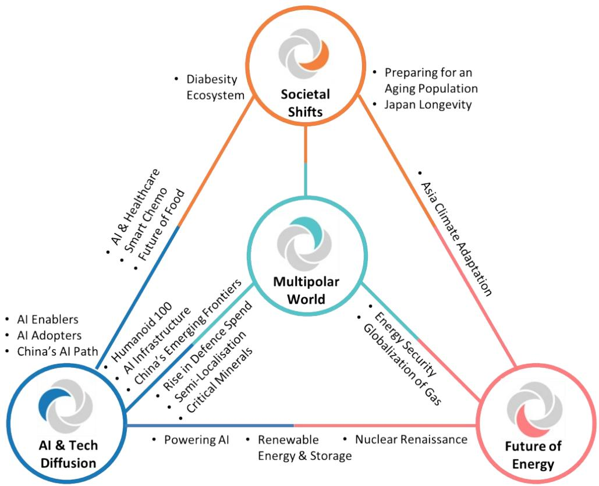

flowchart

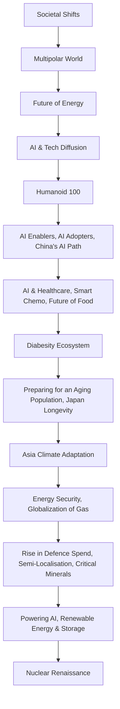
```mermaid
graph TD
    A["Societal Shifts"] --> B["Multipolar World"]
    B --> C["Future of Energy"]
    C --> D["AI & Tech Diffusion"]
    D --> E["Humanoid 100"]
    E --> F["AI Enablers, AI Adopters, China's AI Path"]
    F --> G["AI & Healthcare, Smart Chemo, Future of Food"]
    G --> H["Diabesity Ecosystem"]
    H --> I["Preparing for an Aging Population, Japan Longevity"]
    I --> J["Asia Climate Adaptation"]
    J --> K["Energy Security, Globalization of Gas"]
    K --> L["Rise in Defence Spend, Semi-Localisation, Critical Minerals"]
    L --> M["Powering AI, Renewable Energy & Storage"]
    M --> N["Nuclear Renaissance"]
```

# Asia's Capital Market and Governance Reforms

• Japan ROE & Productivity Journey

• China Anti-Involution Initiative

• New India and IndiaStack

• Korea Reform Renaissance

• Singapore Capital Market Reforms

• Asia Financial Acceleration

Mapping Out MS's Four Global Themes and Investible Sub-Themes 

<table><tr><td>Multipolar World (MSRSTMPW)</td><td>AI &amp; Tech Diffusion (MSRSTATD)</td><td>Future of Energy (MSRSTFOE)</td><td>Societal Shifts (MSRSTLGT)</td></tr><tr><td>The Rise in Defense Spending (MSRSTDFN)</td><td>AI Enablers (MSRSTAIE)</td><td>Powering AI (MSRSTPAI)</td><td>Diabesity Ecosystem (MSRSTDSE)</td></tr><tr><td>Semiconductor Localization (MSRSTASR)</td><td>AI Adopters (MSRSTAIA)</td><td>Nuclear Renaissance (MSRSTNUC)</td><td>AI &amp; Health Care (MSRSTAIH)</td></tr><tr><td rowspan="6">Critical Minerals (MSRSTCRM)</td><td>AI Infrastructure (MSRSTAII)</td><td>Europe&#x27;s &#x27;Low Decarb Diet&#x27; (MSRSTELC)</td><td>Smart Chemo (MSRSTSMC)</td></tr><tr><td>Humanoids (MSRSTHUM)</td><td>Power Grid Growth &amp; Evolution (MSRSTPGE)</td><td>Preparing for an Aging Pop&#x27;n (MSRSTPAP)</td></tr><tr><td>China&#x27;s AI Path</td><td>Clean Energy &amp; Storage (MSRSTEST)</td><td>Japan Longevity (MSRSTJPL)</td></tr><tr><td>China&#x27;s Emerging Frontiers</td><td>Energy Security (MSRSTENS)</td><td>Future of Food &amp; Beverages (MSRSTFFB)</td></tr><tr><td>Asia AI Adoption Leaders</td><td>Globalization of Natural Gas (MSRSTGNS)</td><td>AI Job Displacement &amp; Re-Skilling</td></tr><tr><td></td><td>Asia Climate Adaptation</td><td></td></tr></table>

Source: MS.

# Global Thematic Equity Exposure – Assessing Relative Breadth across Regions/Markets

Thematic Exposure by Region – North America has significant exposure to AI & Tech Diffusion   
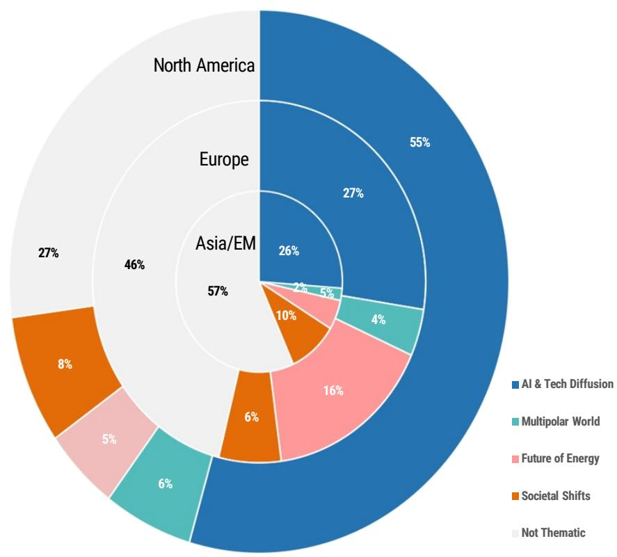

pie

| Region | Category | Percentage (%) |
| :--- | :--- | :--- |
| North America | AI & Tech Diffusion | 55 |
| North America | Multipolar World | 27 |
| North America | Future of Energy | 16 |
| North America | Societal Shifts | 8 |
| North America | Not Thematic | 27 |
| Europe | AI & Tech Diffusion | 26 |
| Europe | Multipolar World | 4 |
| Europe | Future of Energy | 5 |
| Europe | Societal Shifts | 10 |
| Europe | Not Thematic | 46 |
Asia/EM | AI & Tech Diffusion | 57 |
| Asia/EM | Future of Energy | 16 |
| Asia/EM | Societal Shifts | 6 |
| Asia/EM | Not Thematic | 27 |

Source: MS. Note: Stocks mapped to multiple themes have a pro-rated share assigned to each

Thematic Exposure in Asia Pacific – Japan, Taiwan and Korea have the highest concentration of opportunity   
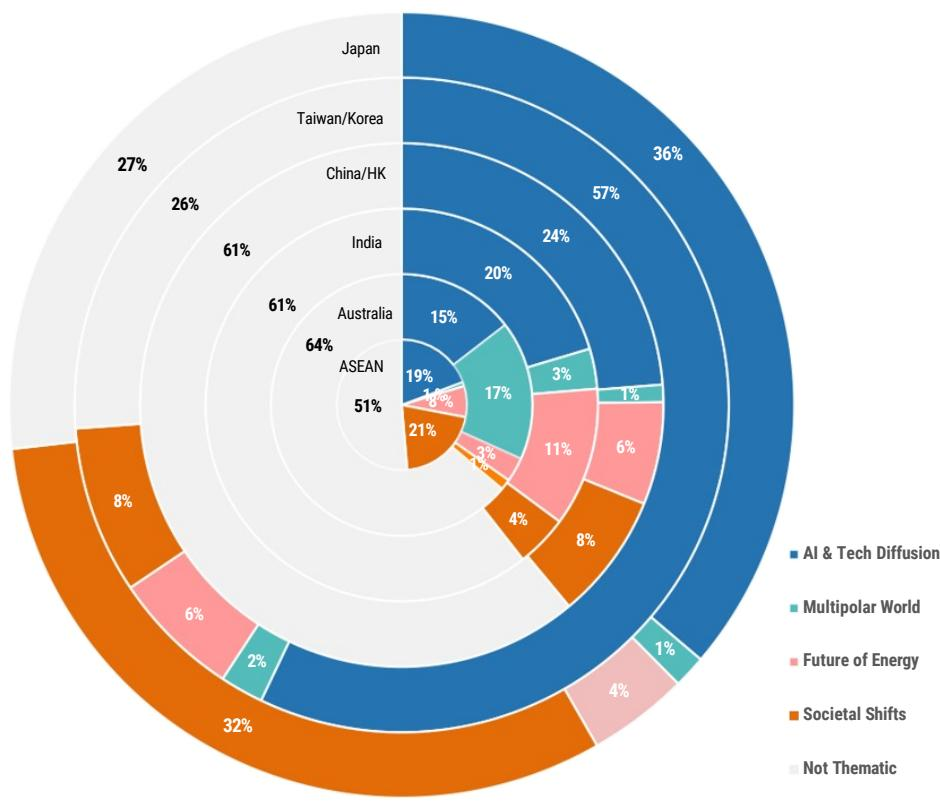

bar_stacked

| Region       | AI & Tech Diffusion | Multipolar World | Future of Energy | Societal Shifts | Not Thematic |
| ------------ | ------------------- | ---------------- | ---------------- | --------------- | ------------ |
| Japan        | 36%                 | 1%               | 4%               | 8%              | 27%          |
| Taiwan/Korea | 57%                 | 1%               | 6%               | 8%              | 26%          |
| China/HK     | 24%                 | 3%               | 6%               | 4%              | 61%          |
| India        | 20%                 | 15%              | 17%              | 1%              | 61%          |
| Australia    | 15%                 | 19%              | 8%               | 1%              | 64%          |
| ASEAN        | 51%                 | 21%              | 6%               | 3%              | 64%          |

Source: MS; Note stocks mapped to multiple themes have a pro-rated share assigned to each. We include Corporate Reform sub-themes in Asia/EM

# MSCI Index Breakdown by Economic Exposure – Thematic Forces Driving Major Shifts

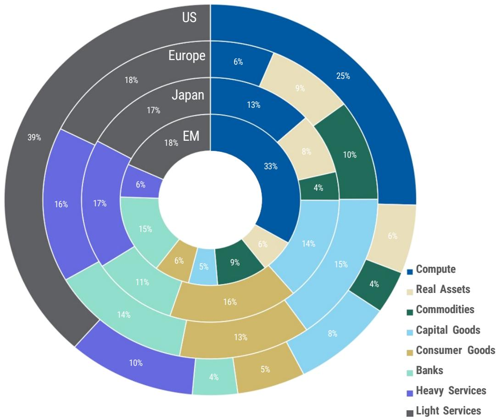

pie

| Region | Segment 1 (%) | Segment 2 (%) | Segment 3 (%) | Segment 4 (%) | Segment 5 (%) | Segment 6 (%) | Segment 7 (%) | Segment 8 (%) | Segment 9 (%) | Segment 10 (%) |
| :--- | :--- | :--- | :--- | :--- | :--- | :--- | :--- | :--- | :--- | :--- |
| US | 6 | 25 | 13 | 9 | 4 | 4 | 5 | 6 | 16 | 17 |
| Europe | 25 | 18 | 17 | 10 | 8 | 6 | 9 | 10 | 14 | 15 |
| Japan | 13 | 17 | 17 | 10 | 8 | 6 | 9 | 10 | 13 | 14 |
| EM | 33 | 18 | 18 | 10 | 8 | 6 | 9 | 10 | 14 | 15 |
The chart displays the proportional distribution of these categories within a ring divided into three parts (top, middle, bottom). The legend identifies each segment by color and represents the category (Compute, Real Assets, Commodities, Capital Goods, Consumer Goods, Banks, Heavy Services, Light Services). The values in parentheses are explicitly labeled on the segments.

Source: Factset, MS Data as of April 2026.

Thematic forces are driving major shifts across the underlying economic exposure of companies, driving index shifts.

Our Economic Exposure breakdown highlights the following relative concentrations:

<table><tr><td>Region</td><td>Skewed to</td><td>Less Exposed to</td></tr><tr><td>US</td><td>Compute, Light Services</td><td>Banks</td></tr><tr><td>Europe</td><td>Commodities, Cap Goods, Heavy Services</td><td>Compute</td></tr><tr><td>Japan</td><td>Cap Goods, Heavy Services, Consumer Gds</td><td>-</td></tr><tr><td>EM</td><td>Compute, Commodities</td><td>Capital Goods, Light Services</td></tr></table>

# Assessing the Valuation, Profitability and Growth of Thematic Groups

Asia-EM Economic Exposure Categories Valuation vs. Prospective EPS growth – Compute priced for strong growth, while Commodities may be overlooked

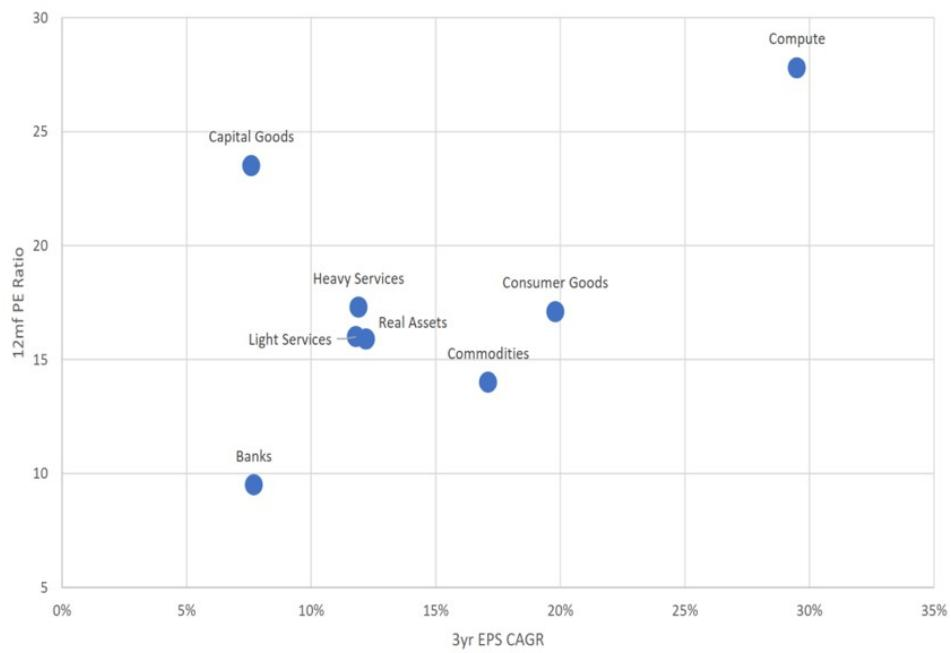

scatter

| Category        | 3yr EPS CAGR | 12mf PE Ratio |
| --------------- | ------------ | ------------- |
| Banks           | 7.5%         | 9.5%          |
| Light Services  | 11.5%        | 16.0%         |
| Heavy Services  | 12.0%        | 17.0%         |
| Real Assets     | 12.5%        | 16.0%         |
| Commodities     | 17.0%        | 14.0%         |
| Consumer Goods  | 20.0%        | 17.0%         |
| Compute         | 29.5%        | 28.0%         |
| Capital Goods   | 7.5%         | 23.5%         |

Source: FactSet, MS; Data as of 7 May 2026

Asia-EM P/B vs. Trailing ROE – Comparison vs. end-2022, showing strong uplift in profitability for Capital Goods, Commodities, Banks and Light Services

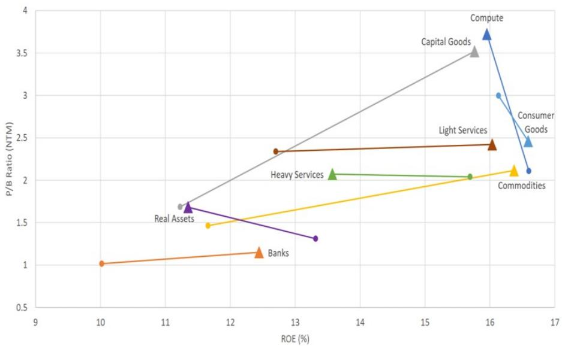

line

| Category        | ROE (%) | P/B Ratio (NTM) |
| --------------- | ------- | --------------- |
| Real Assets     | 11.3    | 1.7             |
| Banks           | 12.5    | 1.2             |
| Heavy Services  | 13.7    | 2.1             |
| Commodities    | 16.5    | 2.1             |
| Light Services  | 15.8    | 2.4             |
| Consumer Goods  | 16.2    | 2.5             |
| Capital Goods   | 15.9    | 3.5             |
| Compute         | 16.0    | 3.7             |

Source: FactSet, MS; Data as of 7 May 2026

Japan — PM Takaichi's 17 Strategic Domains Converge into a Set of Concepts   
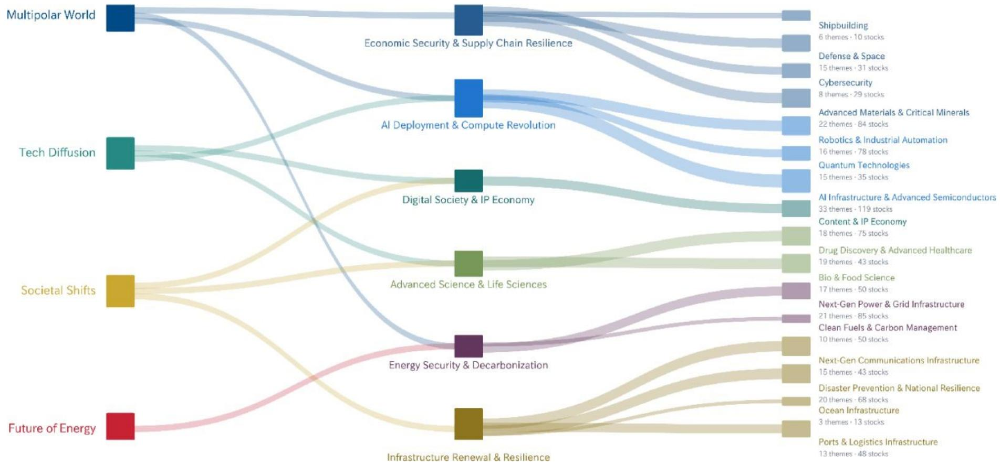

sankey

| Category                  | Sub-category                          | Value (themes) |
|---------------------------|-------------------------------------|----------------|
| Multipolar World          | Economic Security & Supply Chain Resilience | 10             |
| Multipolar World          | AI Deployment & Compute Revolution       | 31             |
| Multipolar World          | Digital Society & IP Economy           | 19             |
| Tech Diffusion            | Advanced Science & Life Sciences        | 43             |
| Tech Diffusion            | Energy Security & Decarbonization      | 50             |
| Societal Shifts          | Advanced Science & Life Sciences        | 75             |
| Societal Shifts          | Energy Security & Decarbonization      | 85             |
| Future of Energy         | Infrastructure Renewal & Resilience    | 48             |
| Multiple Entities         | Shipbuilding                        | 10             |
| Multiple Entities         | Defense & Space                    | 31             |
| Multiple Entities         | Cybersecurity                       | 29             |
| Multiple Entities         | Advanced Materials & Critical Minerals | 84             |
| Multiple Entities         | Robotics & Industrial Automation     | 78             |
| Multiple Entities         | Quantum Technologies                | 35             |
| Multiple Entities         | AI Infrastructure & Advanced Semiconductors | 119            |
| Multiple Entities         | Content & IP Economy                 | 75             |
| Multiple Entities         | Drug Discovery & Advanced Healthcare   | 43             |
| Multiple Entities         | Bio & Food Science                 | 50             |
| Multiple Entities         | Next-Gen Power & Grid Infrastructure    | 85             |
| Multiple Entities         | Clean Fuels & Carbon Management       | 50             |
| Multiple Entities         | Next-Gen Communications Infrastructure | 43             |
| Multiple Entities         | Disaster Prevention & National Resilience | 68             |
| Multiple Entities         | Ocean Infrastructure                | 13             |
| Multiple Entities         | Ports & Logistics Infrastructure      | 48             |

Note: MS's four Big Themes are defined as the top-level investment concepts (L0). L1 comprises six investment narratives derived from L0. L2 is defined as the 17 strategic domains under the Takaichi administration (Defense and Space" are consolidated into single category. "Energy security and GX" are split into "Next-Gen Power & Grid Infra" and "Clean Fuels & Carbon Management," with fusion energy included in the former. Robotics is treated as a standalone theme.). L3 contains L4, the stock-selection categories. The universe is Prime-listed companies plus Astroscale.   
Source: MS

Asia and Global Thematic Valuations and Growth Outlook – China's AI Path, Asia AI Adoption Leaders and Korea Reform Trading at More Attractive Forward PEG Ratios   
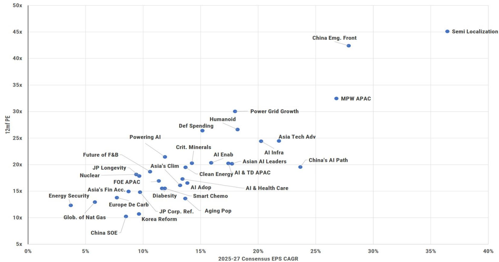  
Source: Factset, IBES Consensus, MS, Data as of May 7, 2026.

MS Asia Pacific Thematic Focus List – Highest Conviction Opportunities 

<table><tr><td rowspan="2">Ticker</td><td rowspan="2">Company Name</td><td rowspan="2">Industry Group</td><td rowspan="2">Analyst</td><td rowspan="2">Market</td><td rowspan="2">MC US$bn</td><td rowspan="2">Last Price (LCY)</td><td rowspan="2">Upside to Base</td><td rowspan="2">Upside to Bull</td><td rowspan="2">Bull / Bear</td><td rowspan="2">AI &amp; Tech Diffusion</td><td colspan="3">Thematic Materiality</td></tr><tr><td>Multipolar World</td><td>Future of Energy</td><td>Societal Shifts</td></tr><tr><td>2330.TW</td><td>TSMC</td><td>Semiconductors</td><td>Chan, Charlie</td><td>Taiwan</td><td>1851.3</td><td>2235.0</td><td>16%</td><td>40%</td><td>1.09</td><td>Core</td><td>Signif.</td><td>Signif.</td><td></td></tr><tr><td>005930.KS</td><td>Samsung Electronics</td><td>Tech. Hardware &amp; Equipment</td><td>Kim, Shawn</td><td>S. Korea</td><td>1398.5</td><td>285500.0</td><td>33%</td><td>51%</td><td>0.87</td><td>Core</td><td>Signif.</td><td>Core</td><td>Moderate</td></tr><tr><td>0700.HK</td><td>Tencent Holdings Ltd.</td><td>Media &amp; Entertainment</td><td>Yu, Gary</td><td>China</td><td>550.5</td><td>464.4</td><td>40%</td><td>72%</td><td>-21.51</td><td>Core</td><td></td><td></td><td></td></tr><tr><td>300750.SZ</td><td>Contemporary Amperex Technology Co. Ltd.</td><td>Capital Goods</td><td>Lu, Jack</td><td>China</td><td>314.2</td><td>446.1</td><td>33%</td><td>51%</td><td>1.11</td><td>Signif.</td><td></td><td>Core</td><td></td></tr><tr><td>2308.TW</td><td>Delta Electronics Inc.</td><td>Tech. Hardware &amp; Equipment</td><td>Shih, Sharon</td><td>Taiwan</td><td>186.3</td><td>2245.0</td><td>20%</td><td>47%</td><td>1.14</td><td>Core</td><td>Signif.</td><td>Core</td><td></td></tr><tr><td>1299.HK</td><td>AIA Group Ltd</td><td>Insurance</td><td>Xu, Richard</td><td>Hong Kong</td><td>116.9</td><td>86.6</td><td>26%</td><td>51%</td><td>1.67</td><td>Signif.</td><td></td><td></td><td>Core</td></tr><tr><td>7011.T</td><td>Mitsubishi Heavy Industries</td><td>Capital Goods</td><td>Kitaura, Takeshi</td><td>Japan</td><td>94.0</td><td>4384.0</td><td>25%</td><td>67%</td><td>10.27</td><td>Signif.</td><td>Core</td><td>Core</td><td></td></tr><tr><td>002371.SZ</td><td>NAURA Technology Group Co Ltd</td><td>Semiconductors</td><td>Chan, Charlie</td><td>China</td><td>61.1</td><td>573.2</td><td>5%</td><td>48%</td><td>1.17</td><td>Signif.</td><td>Signif.</td><td></td><td></td></tr><tr><td>LART.NS</td><td>Larsen &amp; Toubro Ltd</td><td>Capital Goods</td><td>Achhipalia, Girish</td><td>India</td><td>57.9</td><td>3974.5</td><td>25%</td><td>72%</td><td>3.31</td><td></td><td>Signif.</td><td>Signif.</td><td></td></tr><tr><td>034020.KS</td><td>Doosan Enerbility</td><td>Capital Goods</td><td>Choi, Heewon</td><td>S. Korea</td><td>56.1</td><td>128000.0</td><td>-14%</td><td>21%</td><td>0.34</td><td>Signif.</td><td>Signif.</td><td>Core</td><td></td></tr><tr><td>2359.HK</td><td>WuXi AppTec Co Ltd</td><td>Pharma, Biotech &amp; Life Sciences</td><td>Tam, Laurence</td><td>China</td><td>46.8</td><td>138.1</td><td>12%</td><td>52%</td><td>0.82</td><td>Moderate</td><td>Signif.</td><td></td><td>Core</td></tr><tr><td>012450.KS</td><td>Hanwha Aerospace</td><td>Capital Goods</td><td>Seok, Joon</td><td>S. Korea</td><td>45.7</td><td>1315000.0</td><td>37%</td><td>67%</td><td>4.12</td><td></td><td>Signif.</td><td></td><td></td></tr><tr><td>6954.T</td><td>Fanuc</td><td>Capital Goods</td><td>Jiang, Lisa</td><td>Japan</td><td>45.1</td><td>7564.0</td><td>-7%</td><td>19%</td><td>0.39</td><td>Moderate</td><td>Signif.</td><td></td><td></td></tr><tr><td>267260.KS</td><td>HD Hyundai Electric Co Ltd</td><td>Capital Goods</td><td>Kim, Ryan</td><td>S. Korea</td><td>33.6</td><td>1362000.0</td><td>10%</td><td>32%</td><td>0.69</td><td>Signif.</td><td></td><td>Signif.</td><td></td></tr><tr><td>300124.SZ</td><td>Shenzhen Inovance Technology</td><td>Capital Goods</td><td>Zhong, Sheng</td><td>China</td><td>30.7</td><td>77.5</td><td>23%</td><td>68%</td><td>1.91</td><td>Core</td><td>Core</td><td>Moderate</td><td></td></tr><tr><td>6669.TW</td><td>Wiwynn Corp</td><td>Tech. Hardware &amp; Equipment</td><td>Kao, Howard</td><td>Taiwan</td><td>28.9</td><td>5340.0</td><td>40%</td><td>79%</td><td>4.43</td><td>Core</td><td></td><td></td><td></td></tr><tr><td>GULF.BK</td><td>Gulf Development PCL</td><td>Utilities</td><td>Maheshwari, Mayank</td><td>Thailand</td><td>27.3</td><td>58.8</td><td>29%</td><td>53%</td><td>1.67</td><td>Moderate</td><td>Moderate</td><td>Signif.</td><td></td></tr><tr><td>STEG.SI</td><td>ST Engineering</td><td>Capital Goods</td><td>Lee, Da Wei</td><td>Singapore</td><td>26.2</td><td>10.6</td><td>12%</td><td>71%</td><td>2.34</td><td></td><td>Core</td><td></td><td></td></tr><tr><td>002028.SZ</td><td>Sieyuan Electric Co.Ltd.</td><td>Capital Goods</td><td>Hou, Eva</td><td>China</td><td>22.6</td><td>196.2</td><td>46%</td><td>88%</td><td>32.63</td><td>Signif.</td><td></td><td>Core</td><td></td></tr><tr><td>5801.T</td><td>Furukawa Electric</td><td>Capital Goods</td><td>Shirakawa, Yu</td><td>Japan</td><td>19.5</td><td>43430.0</td><td>6%</td><td>34%</td><td>1.01</td><td>Core</td><td></td><td></td><td></td></tr><tr><td>1801.T</td><td>Taisei</td><td>Capital Goods</td><td>Yagi, Ryo</td><td>Japan</td><td>18.8</td><td>17700.0</td><td>28%</td><td>56%</td><td>1.02</td><td></td><td>Moderate</td><td></td><td>Signif.</td></tr><tr><td>LYC.AX</td><td>Lynas Rare Earths</td><td>Materials</td><td>Anand, Rahul</td><td>Australia</td><td>14.0</td><td>19.7</td><td>4%</td><td>55%</td><td>1.93</td><td></td><td>Signif.</td><td></td><td></td></tr><tr><td>2768.T</td><td>Sojitz</td><td>Capital Goods</td><td>Shirakawa, Yu</td><td>Japan</td><td>7.6</td><td>5726.0</td><td>-11%</td><td>30%</td><td>0.97</td><td></td><td>Moderate</td><td>Moderate</td><td></td></tr><tr><td>6674.T</td><td>GS Yuasa Corporation</td><td>Automobiles &amp; Components</td><td>Kakiuchi, Shinji</td><td>Japan</td><td>4.2</td><td>6565.0</td><td>26%</td><td>76%</td><td>4.68</td><td></td><td>Moderate</td><td>Core</td><td></td></tr><tr><td>GLF.AX</td><td>GemLife Communities Group</td><td>Real Estate</td><td>Berry, Lauren</td><td>Australia</td><td>1.3</td><td>4.6</td><td>19%</td><td>71%</td><td>1.42</td><td></td><td></td><td></td><td>Core</td></tr></table>

Source: FactSet, MS; Data as of May 8, 2026

Asia Pacific Industrial Enablers – Key Beneficiaries of the Investment Super Cycle 

<table><tr><td>Company Name</td><td>Ticker</td><td>GICS Industry</td><td>Market</td><td>MS Analyst</td><td>MS Rating</td><td>Last Price</td><td>Upside to TP</td><td>Market Cap (US$bn)</td><td>P/E 2027 MSe</td><td>ROE</td><td>F2Y Net Profit CAGR</td></tr><tr><td>Mitsubishi Heavy Industries</td><td>7011.T</td><td>Machinery</td><td>Japan</td><td>Kitaura, Takeshi</td><td>OW</td><td>4,384.00</td><td>25%</td><td>94.0</td><td>31.9</td><td>14.3%</td><td>28.6%</td></tr><tr><td>Larsen &amp; Toubro Ltd</td><td>LART.NS</td><td>Construction &amp; Engineering</td><td>India</td><td>Achhipalia, Girish</td><td>OW</td><td>3,940.20</td><td>26%</td><td>57.4</td><td>24.4</td><td>20.4%</td><td>17.4%</td></tr><tr><td>Doosan Enerbility</td><td>034020.KS</td><td>Electrical Equipment</td><td>S. Korea</td><td>Choi, Heewon</td><td>OW</td><td>128,000.00</td><td>-14%</td><td>56.1</td><td>107.3</td><td>10.3%</td><td>83.9%</td></tr><tr><td>Fanuc</td><td>6954.T</td><td>Machinery</td><td>Japan</td><td>Jiang, Lisa</td><td>OW</td><td>7,564.00</td><td>-7%</td><td>45.1</td><td>29.8</td><td>12.8%</td><td>23.9%</td></tr><tr><td>HD Hyundai Electric Co Ltd</td><td>267260.KS</td><td>Electrical Equipment</td><td>S. Korea</td><td>Kim, Ryan</td><td>OW</td><td>1,362,000.00</td><td>10%</td><td>33.6</td><td>36.0</td><td>51.9%</td><td>35.5%</td></tr><tr><td>WeiChai Power</td><td>000338.SZ</td><td>Machinery</td><td>China</td><td>Zhong, Sheng</td><td>OW</td><td>33.53</td><td>28%</td><td>33.4</td><td>17.0</td><td>17.2%</td><td>27.3%</td></tr><tr><td>LS Electric</td><td>010120.KS</td><td>Electrical Equipment</td><td>S. Korea</td><td>Kim, Ryan</td><td>OW</td><td>304,000.00</td><td>-21%</td><td>31.2</td><td>68.0</td><td>28.5%</td><td>51.7%</td></tr><tr><td>Shenzhen Inovance Technology</td><td>300124.SZ</td><td>Machinery</td><td>China</td><td>Zhong, Sheng</td><td>OW</td><td>77.49</td><td>23%</td><td>30.7</td><td>27.2</td><td>19.4%</td><td>25.2%</td></tr><tr><td>Sieyuan Electric Co.Ltd.</td><td>002028.SZ</td><td>Electrical Equipment</td><td>China</td><td>Hou, Eva</td><td>OW</td><td>196.16</td><td>46%</td><td>22.6</td><td>23.9</td><td>33.0%</td><td>44.6%</td></tr><tr><td>Jiangsu Hengli Hydraulic Co.Ltd</td><td>601100.SS</td><td>Machinery</td><td>China</td><td>Zhong, Sheng</td><td>OW</td><td>113.77</td><td>17%</td><td>22.4</td><td>34.1</td><td>23.2%</td><td>29.7%</td></tr><tr><td>Furukawa Electric</td><td>5801.T</td><td>Electrical Equipment</td><td>Japan</td><td>Shirakawa, Yu</td><td>OW</td><td>43,430.00</td><td>6%</td><td>19.5</td><td>30.3</td><td>23.9%</td><td>58.9%</td></tr><tr><td>Bharat Heavy Electricals Ltd</td><td>BHEL.NS</td><td>Electrical Equipment</td><td>India</td><td>Achhipalia, Girish</td><td>OW</td><td>401.35</td><td>11%</td><td>14.8</td><td>52.9</td><td>10.1%</td><td>111.7%</td></tr><tr><td>Polycab India Ltd.</td><td>POLC.NS</td><td>Electrical Equipment</td><td>India</td><td>Achhipalia, Girish</td><td>OW</td><td>9,065.50</td><td>-4%</td><td>14.4</td><td>42.5</td><td>27.3%</td><td>19.8%</td></tr><tr><td>SGH Limited</td><td>SGH.AX</td><td>Trading Companies &amp; Distributors</td><td>Australia</td><td>Michael, Joseph</td><td>OW</td><td>40.02</td><td>25%</td><td>11.8</td><td>15.1</td><td>19.6%</td><td>13.4%</td></tr><tr><td>AirTAC International</td><td>1590.TW</td><td>Machinery</td><td>Taiwan</td><td>Yang, Derrick</td><td>OW</td><td>1,550.00</td><td>29%</td><td>9.9</td><td>23.6</td><td>22.7%</td><td>25.3%</td></tr><tr><td>Kandenko</td><td>1942.T</td><td>Construction &amp; Engineering</td><td>Japan</td><td>Yagi, Ryo</td><td>OW</td><td>7,165.00</td><td>12%</td><td>9.3</td><td>18.9</td><td>17.1%</td><td>17.6%</td></tr><tr><td>Dajin Heavy Industry</td><td>002487.SZ</td><td>Electrical Equipment</td><td>China</td><td>Hou, Eva</td><td>OW</td><td>85.00</td><td>33%</td><td>8.0</td><td>19.0</td><td>28.2%</td><td>63.0%</td></tr><tr><td>Samsung E&amp;A Co Ltd</td><td>028050.KS</td><td>Construction &amp; Engineering</td><td>S. Korea</td><td>Seok, Joon</td><td>OW</td><td>58,600.00</td><td>8%</td><td>7.9</td><td>14.1</td><td>15.4%</td><td>14.2%</td></tr><tr><td>Anhui Yingliu Electromechanical Co Ltd</td><td>603308.SS</td><td>Machinery</td><td>China</td><td>Li, Tom</td><td>OW</td><td>77.16</td><td>31%</td><td>7.7</td><td>47.0</td><td>20.2%</td><td>81.3%</td></tr><tr><td>Misumi Group</td><td>9962.T</td><td>Machinery</td><td>Japan</td><td>Jiang, Lisa</td><td>OW</td><td>3,426.00</td><td>-7%</td><td>6.0</td><td>19.4</td><td>13.9%</td><td>18.5%</td></tr></table>

Source: FactSet, MS; Data as of May 8, 2026

Thematic Correlation Matrix – Market Diversification Available Through Energy Security, Globalization of Gas, Defence, Critical Minerals and Diabesity 

<table><tr><td rowspan="2" colspan="2"></td><td colspan="9">AI &amp; Tech Diffusion</td><td colspan="10">Future of Energy</td><td colspan="4">Multi-Polar World</td><td colspan="9">Societal Shifts</td><td></td><td></td></tr><tr><td>AI Enablers</td><td>AI Adopters</td><td>AI infrastructure</td><td>Humanoid 100</td><td>Asia&#x27;s Technology Advances</td><td>Asian AI Adoption Leaders</td><td>China&#x27;s Emerging Frontiers</td><td>China&#x27;s AI Path</td><td>AI &amp; Tech Disruption (APAC)</td><td>Powering AI</td><td>Nuclear Renaissance</td><td>Europe&#x27;s Low Decarb Diet</td><td>Power Grid Growth &amp; Evolution</td><td>Clean Energy, Storage &amp; Material</td><td>Energy Security</td><td>Globalization of Natural Gas</td><td>Carbon as a Commodity</td><td>Asia&#x27;s Climate Adaptation</td><td>Future of Energy (APAC)</td><td>The Rise in Defense Spending</td><td>Critical Mineral Supply Chain</td><td>Semiconductor Localisation</td><td>Multipolar World (APAC)</td><td>Diabetic Ecosystem</td><td>AI &amp; Healthcare</td><td>Smart Chemo</td><td>Preparing for An Aging Population</td><td>Future of Food &amp; Beverages</td><td>Japan Societal Shifts</td><td>China&#x27;s SOE Reform</td><td>Japan&#x27;s Corporate Reform</td><td>Korea Reform Renaissance</td><td>Asia&#x27;s Financial Acceleration</td><td>MSCI APAC</td></tr><tr><td rowspan="9">AI &amp; Tech Diffusion</td><td>AI Enablers</td><td>1.0</td><td>0.9</td><td>0.9</td><td>0.9</td><td>0.8</td><td>0.8</td><td>0.6</td><td>0.8</td><td>0.8</td><td>0.7</td><td>0.5</td><td>0.6</td><td>0.7</td><td>0.7</td><td>0.4</td><td>0.3</td><td>0.5</td><td>0.5</td><td>0.6</td><td>0.5</td><td>0.4</td><td>0.7</td><td>0.7</td><td>0.2</td><td>0.5</td><td>0.3</td><td>0.6</td><td>0.5</td><td>0.1</td><td>0.4</td><td>0.5</td><td>0.4</td><td>0.7</td><td>0.8</td></tr><tr><td>AI Adopters</td><td>0.9</td><td>1.0</td><td>0.7</td><td>0.8</td><td>0.8</td><td>0.8</td><td>0.5</td><td>0.7</td><td>0.8</td><td>0.6</td><td>0.5</td><td>0.6</td><td>0.6</td><td>0.7</td><td>0.3</td><td>0.2</td><td>0.4</td><td>0.5</td><td>0.6</td><td>0.5</td><td>0.4</td><td>0.5</td><td>0.6</td><td>0.6</td><td>0.7</td><td>0.4</td><td>0.8</td><td>0.7</td><td>0.3</td><td>0.4</td><td>0.6</td><td>0.4</td><td>0.7</td><td>0.7</td></tr><tr><td>AI infrastructure</td><td>0.9</td><td>0.7</td><td>1.0</td><td>0.8</td><td>0.7</td><td>0.7</td><td>0.6</td><td>0.7</td><td>0.8</td><td>0.8</td><td>0.6</td><td>0.5</td><td>0.8</td><td>0.7</td><td>0.4</td><td>0.4</td><td>0.5</td><td>0.5</td><td>0.7</td><td>0.5</td><td>0.4</td><td>0.7</td><td>0.8</td><td>0.1</td><td>0.3</td><td>0.2</td><td>0.5</td><td>0.4</td><td>0.0</td><td>0.4</td><td>0.4</td><td>0.4</td><td>0.6</td><td>0.8</td></tr><tr><td>Humanoid 100</td><td>0.9</td><td>0.8</td><td>0.8</td><td>1.0</td><td>0.8</td><td>0.8</td><td>0.7</td><td>0.8</td><td>0.9</td><td>0.6</td><td>0.5</td><td>0.5</td><td>0.7</td><td>0.7</td><td>0.2</td><td>0.2</td><td>0.4</td><td>0.6</td><td>0.6</td><td>0.5</td><td>0.4</td><td>0.7</td><td>0.7</td><td>0.3</td><td>0.5</td><td>0.3</td><td>0.6</td><td>0.5</td><td>0.2</td><td>0.4</td><td>0.4</td><td>0.4</td><td>0.7</td><td>0.8</td></tr><tr><td>Asia&#x27;s Technology Advances</td><td>0.8</td><td>0.8</td><td>0.7</td><td>0.8</td><td>1.0</td><td>0.9</td><td>0.8</td><td>1.0</td><td>0.9</td><td>0.6</td><td>0.4</td><td>0.4</td><td>0.6</td><td>0.6</td><td>0.2</td><td>0.1</td><td>0.3</td><td>0.6</td><td>0.6</td><td>0.5</td><td>0.4</td><td>0.8</td><td>0.8</td><td>0.2</td><td>0.6</td><td>0.4</td><td>0.5</td><td>0.5</td><td>0.2</td><td>0.5</td><td>0.4</td><td>0.3</td><td>0.7</td><td>0.8</td></tr><tr><td>Asian AI Adoption Leaders</td><td>0.8</td><td>0.8</td><td>0.7</td><td>0.8</td><td>0.9</td><td>1.0</td><td>0.5</td><td>0.8</td><td>0.9</td><td>0.5</td><td>0.5</td><td>0.4</td><td>0.4</td><td>0.5</td><td>0.3</td><td>0.2</td><td>0.3</td><td>0.6</td><td>0.5</td><td>0.4</td><td>0.3</td><td>0.5</td><td>0.6</td><td>0.3</td><td>0.6</td><td>0.4</td><td>0.6</td><td>0.5</td><td>0.3</td><td>0.4</td><td>0.6</td><td>0.3</td><td>0.7</td><td>0.8</td></tr><tr><td>China&#x27;s Emerging Frontiers</td><td>0.6</td><td>0.5</td><td>0.6</td><td>0.7</td><td>0.8</td><td>0.5</td><td>1.0</td><td>0.8</td><td>0.7</td><td>0.5</td><td>0.3</td><td>0.2</td><td>0.5</td><td>0.5</td><td>0.0</td><td>0.0</td><td>0.1</td><td>0.5</td><td>0.5</td><td>0.4</td><td>0.5</td><td>0.9</td><td>0.8</td><td>0.1</td><td>0.3</td><td>0.2</td><td>0.3</td><td>0.2</td><td>0.0</td><td>0.4</td><td>0.1</td><td>0.3</td><td>0.3</td><td>0.5</td></tr><tr><td>China&#x27;s AI Path</td><td>0.8</td><td>0.7</td><td>0.7</td><td>0.8</td><td>1.0</td><td>0.8</td><td>0.8</td><td>1.0</td><td>0.9</td><td>0.6</td><td>0.4</td><td>0.4</td><td>0.6</td><td>0.6</td><td>0.2</td><td>0.1</td><td>0.3</td><td>0.6</td><td>0.6</td><td>0.5</td><td>0.4</td><td>0.8</td><td>0.8</td><td>0.2</td><td>0.6</td><td>0.4</td><td>0.5</td><td>0.5</td><td>0.1</td><td>0.5</td><td>0.4</td><td>0.3</td><td>0.7</td><td>0.7</td></tr><tr><td>AI &amp; Tech Disruption (APAC)</td><td>0.8</td><td>0.8</td><td>0.8</td><td>0.9</td><td>0.9</td><td>0.9</td><td>0.7</td><td>0.9</td><td>1.0</td><td>0.6</td><td>0.5</td><td>0.5</td><td>0.6</td><td>0.6</td><td>0.3</td><td>0.2</td><td>0.4</td><td>0.7</td><td>0.8</td><td>0.5</td><td>0.4</td><td>0.7</td><td>0.7</td><td>0.3</td><td>0.6</td><td>0.4</td><td>0.5</td><td>0.6</td><td>0.3</td><td>0.4</td><td>0.6</td><td>0.5</td><td>0.8</td><td>0.9</td></tr><tr><td rowspan="10">Failure of Energy</td><td>Powering AI</td><td>0.7</td><td>0.6</td><td>0.8</td><td>0.6</td><td>0.6</td><td>0.5</td><td>0.5</td><td>0.6</td><td>0.6</td><td>1.0</td><td>0.8</td><td>0.6</td><td>0.9</td><td>0.7</td><td>0.4</td><td>0.4</td><td>0.5</td><td>0.6</td><td>0.7</td><td>0.5</td><td>0.4</td><td>0.6</td><td>0.7</td><td>0.1</td><td>0.4</td><td>0.3</td><td>0.5</td><td>0.5</td><td>0.2</td><td>0.5</td><td>0.4</td><td>0.4</td><td>0.6</td><td>0.7</td></tr><tr><td>Nuclear Renaissance</td><td>0.5</td><td>0.5</td><td>0.6</td><td>0.5</td><td>0.4</td><td>0.5</td><td>0.3</td><td>0.4</td><td>0.5</td><td>0.8</td><td>1.0</td><td>0.6</td><td>0.6</td><td>0.4</td><td>0.3</td><td>0.3</td><td>0.2</td><td>0.5</td><td>0.7</td><td>0.5</td><td>0.4</td><td>0.5</td><td>0.6</td><td>0.2</td><td>0.5</td><td>0.3</td><td>0.4</td><td>0.6</td><td>0.4</td><td>0.5</td><td>0.6</td><td>0.5</td><td>0.6</td><td>0.7</td></tr><tr><td>Europe&#x27;s Low Decarb Diet</td><td>0.6</td><td>0.6</td><td>0.5</td><td>0.5</td><td>0.4</td><td>0.4</td><td>0.2</td><td>0.4</td><td>0.5</td><td>0.6</td><td>0.6</td><td>1.0</td><td>0.5</td><td>0.6</td><td>0.6</td><td>0.4</td><td>0.5</td><td>0.5</td><td>0.5</td><td>0.2</td><td>0.4</td><td>0.4</td><td>0.4</td><td>0.3</td><td>0.5</td><td>0.3</td><td>0.5</td><td>0.6</td><td>0.3</td><td>0.4</td><td>0.5</td><td>0.5</td><td>0.6</td><td>0.7</td></tr><tr><td>Power Grid Growth &amp; Evolution</td><td>0.7</td><td>0.6</td><td>0.8</td><td>0.7</td><td>0.6</td><td>0.4</td><td>0.5</td><td>0.6</td><td>0.6</td><td>0.9</td><td>0.6</td><td>0.5</td><td>1.0</td><td>0.7</td><td>0.3</td><td>0.2</td><td>0.4</td><td>0.6</td><td>0.7</td><td>0.4</td><td>0.4</td><td>0.6</td><td>0.7</td><td>0.1</td><td>0.3</td><td>0.1</td><td>0.4</td><td>0.5</td><td>0.0</td><td>0.5</td><td>0.3</td><td>0.3</td><td>0.5</td><td>0.6</td></tr><tr><td>Clean Energy, Storage &amp; Material</td><td>0.7</td><td>0.7</td><td>0.7</td><td>0.7</td><td>0.6</td><td>0.5</td><td>0.5</td><td>0.6</td><td>0.6</td><td>0.7</td><td>0.4</td><td>0.6</td><td>0.7</td><td>1.0</td><td>0.3</td><td>0.3</td><td>0.4</td><td>0.5</td><td>0.6</td><td>0.3</td><td>0.5</td><td>0.5</td><td>0.5</td><td>0.3</td><td>0.4</td><td>0.2</td><td>0.5</td><td>0.6</td><td>0.1</td><td>0.6</td><td>0.2</td><td>0.3</td><td>0.5</td><td>0.5</td></tr><tr><td>Energy Security</td><td>0.4</td><td>0.3</td><td>0.4</td><td>0.2</td><td>0.2</td><td>0.3</td><td>0.0</td><td>0.2</td><td>0.3</td><td>0.4</td><td>0.3</td><td>0.6</td><td>0.3</td><td>0.3</td><td>1.0</td><td>0.8</td><td>0.8</td><td>0.3</td><td>0.4</td><td>0.0</td><td>0.1</td><td>0.1</td><td>0.2</td><td>-0.1</td><td>0.2</td><td>0.1</td><td>0.2</td><td>0.4</td><td>0.2</td><td>0.2</td><td>0.4</td><td>0.4</td><td>0.4</td><td>0.4</td></tr><tr><td>Globalization of Natural Gas</td><td>0.3</td><td>0.2</td><td>0.4</td><td>0.2</td><td>0.1</td><td>0.2</td><td>0.0</td><td>0.1</td><td>0.2</td><td>0.4</td><td>0.3</td><td>0.4</td><td>0.2</td><td>0.3</td><td>0.8</td><td>1.0</td><td>0.7</td><td>0.1</td><td>0.3</td><td>0.1</td><td>0.1</td><td>0.1</td><td>0.2</td><td>-0.1</td><td>0.1</td><td>-0.1</td><td>0.1</td><td>0.3</td><td>0.0</td><td>0.2</td><td>0.2</td><td>0.3</td><td>0.3</td><td>0.3</td></tr><tr><td>Carbon as a Commodity</td><td>0.5</td><td>0.4</td><td>0.5</td><td>0.4</td><td>0.3</td><td>0.3</td><td>0.1</td><td>0.3</td><td>0.4</td><td>0.5</td><td>0.2</td><td>0.5</td><td>0.4</td><td>0.4</td><td>0.8</td><td>0.7</td><td>1.0</td><td>0.2</td><td>0.4</td><td>0.3</td><td>0.1</td><td>0.2</td><td>0.3</td><td>-0.1</td><td>0.2</td><td>0.1</td><td>0.2</td><td>0.4</td><td>0.0</td><td>0.2</td><td>0.3</td><td>0.3</td><td>0.4</td><td>0.4</td></tr><tr><td>Asia&#x27;s Climate Adaptation</td><td>0.5</td><td>0.5</td><td>0.5</td><td>0.6</td><td>0.6</td><td>0.6</td><td>0.5</td><td>0.6</td><td>0.7</td><td>0.6</td><td>0.5</td><td>0.5</td><td>0.6</td><td>0.5</td><td>0.3</td><td>0.1</td><td>0.2</td><td>1.0</td><td>0.8</td><td>0.3</td><td>0.4</td><td>0.5</td><td>0.6</td><td>0.3</td><td>0.5</td><td>0.3</td><td>0.5</td><td>0.7</td><td>0.5</td><td>0.5</td><td>0.7</td><td>0.5</td><td>0.6</td><td>0.7</td></tr><tr><td>Future of Energy (APAC)</td><td>0.6</td><td>0.6</td><td>0.7</td><td>0.6</td><td>0.6</td><td>0.5</td><td>0.5</td><td>0.6</td><td>0.8</td><td>0.7</td><td>0.7</td><td>0.5</td><td>0.7</td><td>0.6</td><td>0.4</td><td>0.3</td><td>0.4</td><td>0.8</td><td>1.0</td><td>0.3</td><td>0.4</td><td>0.5</td><td>0.6</td><td>0.2</td><td>0.4</td><td>0.2</td><td>0.4</td><td>0.7</td><td>0.4</td><td>0.6</td><td>0.6</td><td>0.6</td><td>0.7</td><td>0.8</td></tr><tr><td rowspan="4">Multi-Polar World</td><td>The Rise in Defense Spending</td><td>0.5</td><td>0.5</td><td>0.5</td><td>0.5</td><td>0.5</td><td>0.4</td><td>0.4</td><td>0.5</td><td>0.5</td><td>0.5</td><td>0.5</td><td>0.2</td><td>0.4</td><td>0.3</td><td>0.0</td><td>0.1</td><td>0.3</td><td>0.3</td><td>0.3</td><td>1.0</td><td>0.2</td><td>0.5</td><td>0.6</td><td>0.3</td><td>0.4</td><td>0.2</td><td>0.3</td><td>0.3</td><td>0.1</td><td>0.1</td><td>0.3</td><td>0.2</td><td>0.4</td><td>0.4</td></tr><tr><td>Critical Mineral Supply Chain</td><td>0.4</td><td>0.4</td><td>0.4</td><td>0.4</td><td>0.4</td><td>0.3</td><td>0.5</td><td>0.4</td><td>0.4</td><td>0.4</td><td>0.4</td><td>0.4</td><td>0.4</td><td>0.5</td><td>0.1</td><td>0.1</td><td>0.1</td><td>0.4</td><td>0.4</td><td>0.2</td><td>1.0</td><td>0.5</td><td>0.6</td><td>0.2</td><td>0.4</td><td>0.3</td><td>0.3</td><td>0.4</td><td>0.1</td><td>0.7</td><td>0.1</td><td>0.2</td><td>0.3</td><td>0.4</td></tr><tr><td>Semiconductor Localisation</td><td>0.7</td><td>0.5</td><td>0.7</td><td>0.7</td><td>0.8</td><td>0.5</td><td>0.9</td><td>0.8</td><td>0.7</td><td>0.6</td><td>0.5</td><td>0.4</td><td>0.6</td><td>0.5</td><td>0.1</td><td>0.1</td><td>0.2</td><td>0.5</td><td>0.5</td><td>0.5</td><td>0.5</td><td>1.0</td><td>0.9</td><td>0.1</td><td>0.4</td><td>0.3</td><td>0.3</td><td>0.3</td><td>0.1</td><td>0.4</td><td>0.3</td><td>0.4</td><td>0.5</td><td>0.6</td></tr><tr><td>Multipolar World (APAC)</td><td>0.7</td><td>0.6</td><td>0.8</td><td>0.7</td><td>0.8</td><td>0.6</td><td>0.8</td><td>0.8</td><td>0.7</td><td>0.7</td><td>0.6</td><td>0.4</td><td>0.7</td><td>0.5</td><td>0.2</td><td>0.2</td><td>0.3</td><td>0.6</td><td>0.6</td><td>0.6</td><td>0.6</td><td>0.9</td><td>1.0</td><td>0.2</td><td>0.5</td><td>0.4</td><td>0.4</td><td>0.4</td><td>0.1</td><td>0.5</td><td>0.4</td><td>0.4</td><td>0.5</td><td>0.7</td></tr><tr><td rowspan="6">Societal Shifts</td><td>Diabesity Ecosystem</td><td>0.2</td><td>0.6</td><td>0.1</td><td>0.3</td><td>0.2</td><td>0.3</td><td>0.1</td><td>0.2</td><td>0.3</td><td>0.1</td><td>0.2</td><td>0.3</td><td>0.1</td><td>0.3</td><td>-0.1</td><td>-0.1</td><td>-0.1</td><td>0.3</td><td>0.2</td><td>0.3</td><td>0.2</td><td>0.1</td><td>0.2</td><td>1.0</td><td>0.6</td><td>0.5</td><td>0.7</td><td>0.6</td><td>0.6</td><td>0.2</td><td>0.4</td><td>0.3</td><td>0.4</td><td>0.3</td></tr><tr><td>AI &amp; Healthcare</td><td>0.5</td><td>0.7</td><td>0.3</td><td>0.5</td><td>0.6</td><td>0.6</td><td>0.3</td><td>0.6</td><td>0.6</td><td>0.4</td><td>0.5</td><td>0.5</td><td>0.3</td><td>0.4</td><td>0.2</td><td>0.1</td><td>0.2</td><td>0.5</td><td>0.4</td><td>0.4</td><td>0.4</td><td>0.4</td><td>0.5</td><td>0.6</td><td>1.0</td><td>0.7</td><td>0.6</td><td>0.7</td><td>0.5</td><td>0.4</td><td>0.6</td><td>0.4</td><td>0.6</td><td>0.6</td></tr><tr><td>Smart Chemo</td><td>0.3</td><td>0.4</td><td>0.2</td><td>0.3</td><td>0.4</td><td>0.4</td><td>0.2</td><td>0.4</td><td>0.4</td><td>0.3</td><td>0.3</td><td>0.3</td><td>0.1</td><td>0.2</td><td>0.1</td><td>-0.1</td><td>0.1</td><td>0.3</td><td>0.2</td><td>0.2</td><td>0.3</td><td>0.3</td><td>0.4</td><td>0.5</td><td>0.7</td><td>1.0</td><td>0.5</td><td>0.4</td><td>0.4</td><td>0.1</td><td>0.4</td><td>0.3</td><td>0.5</td><td>0.4</td></tr><tr><td>Preparing for An Aging Population</td><td>0.6</td><td>0.8</td><td>0.5</td><td>0.6</td><td>0.5</td><td>0.6</td><td>0.3</td><td>0.5</td><td>0.5</td><td>0.5</td><td>0.4</td><td>0.5</td><td>0.4</td><td>0.5</td><td>0.2</td><td>0.1</td><td>0.2</td><td>0.5</td><td>0.4</td><td>0.3</td><td>0.3</td><td>0.3</td><td>0.4</td><td>0.7</td><td>0.6</td><td>0.5</td><td>1.0</td><td>0.6</td><td>0.4</td><td>0.2</td><td>0.6</td><td>0.4</td><td>0.7</td><td>0.6</td></tr><tr><td>Future of Food &amp; Beverages</td><td>0.5</td><td>0.7</td><td>0.4</td><td>0.5</td><td>0.5</td><td>0.5</td><td>0.2</td><td>0.5</td><td>0.6</td><td>0.5</td><td>0.6</td><td>0.6</td><td>0.5</td><td>0.6</td><td>0.4</td><td>0.3</td><td>0.4</td><td>0.7</td><td>0.7</td><td>0.3</td><td>0.4</td><td>0.3</td><td>0.4</td><td>0.6</td><td>0.7</td><td>0.4</td><td>0.6</td><td>1.0</td><td>0.7</td><td>0.4</td><td>0.7</td><td>0.5</td><td>0.7</td><td>0.7</td></tr><tr><td>Japan Societal Shifts China&#x27;s SOE Reform Japan&#x27;s Corporate Reform Korea&#x27;s Reform Renaissance Asia&#x27;s Financial Acceleration MSCI APAC MSCI APAC MSCI APAC MSCI APAC MSCI APAC MSCI APAC MSCI APAC MSCI APAC MSCI APAC MSCI APAC MSCI APAC MSCI APAC MSCI APAC MSCI APAC MSCI APAC MSCI APAC MSCI APAC MSCI APAC MSCI APAC MSCI APAC MSCI APAC MSCI APAC MSCI APAC MSCI APAC MSCI APAC MSCI APAS MSCI APAC MSCI APAC MSCI APAC MSCI APAC MSCI APAC MSCI APAC MSCI APAC MSCI APAC MSCI APAC MSCI APAC MSCI APAC MSCI APAC MSCI APAC MSCI APAC MSCI APAC MSCI APAC MSCI APAC MSCI APAC MSCI APAC MSCI APAC MSCI APAC MSCI APAC MSCI APAC MSCI APAC MSCI APACS MSCI APAC MSCI APAC MSCI APAC MSCI APAC MSCI APAC MSCI APAC MSCI APAC MSCI APAC MSCI APAC MSCI APAC MSCI APAC MSCI APAC MSCI APAC MSCI APAC MSCI APAC MSCI APAC MSCI APAC MSCI APAC MSCI APAC MSCI APAC MSCI APAC MSCI APAC MSCI APAC MSCI APAC MSCI APACP MSCI APAC MSCI APAC MSCI APAC MSCI APAC MSCI APAC MSCI APAC MSCI APAC MSCI APAC MSCI APAC MSCI APAC MSCI APAC MSCI APAC MSCI APAC MSCI APAC MSCI APAC MSCI APAC MSCI APAC MSCI APAC MSCI APAC MSCI APAC MSCI APAC MSCI APAC MSCI APAC MSCI APAC MSCI APAP MSCI APAC MSCI APAC MSCI APAC MSCI APAC MSCI APAC MSCI APAC MSCI APAC MSCI APAC MSCI APAC MSCI APAC MSCI APAC MSCI APAC MSCI APAC MSCI APAC MSCI APAC MSCI APAC MSCI APAC MSCI APAC MSCI APAC MSCI APAC MSCI APAC MSCI APAC MSCI APAC MSCI APAC MSCI APACE MSCI APAC MSCI APAC MSCI APAC MSCI APAC MSCI APAC MSCI APAC MSCI APAC MSCI APAC MSCI APAC MSCI APAC MSCI APAC MSCI APAC MSCI APAC MSCI APAC MSCI APAC MSCI APAC MSCI APAC MSCI APAC MSCI APAC MSCI APAC MSCI APAC MSCI APAC MSCI APAC MSCI APAC MSCI APACTMSCI APACMSCI APACMSCI APACMSCI APACMSCI APACMSCI APACMSCI APACMSCI APACMSCI APACMSCI APACMSCI APACMSCI APACMSCI APACMSCI APACMSCI APACMSCI APACMSCI APACMSCI APACMSCI APACMSCI APACMSCI APACMSCI APACMSCI APACMSCI APACMSCI APACMSCI APACCMPSCI APACMSCI APACMSCI APACMSCI APACMSCI APACMSCI APACMSCI APACMSCI APACMSCI APACMSCI APACMSCI APACMSCI APACMSCI APACMSCI APACMSCI APACMSCI APACMSCI APACMSCI APACMSCI APACMSCI APACMSCI APACMSCI APACMSCI APACMSCI APACMSCI APACMTMSCI APACMSCI APACMSCI APACMSCI APACMSCI APACMSCI APACMSCI APACMSCI APACMSCI APACMSCI APACMSCI APACMSCI APACMSCI APACMSCI APACMSCI APACMSCI APACMSCI APACMSCI APACMSCI APACMSCI APACMSCI APACMSCI APACMSCI APACMSCI APACMSCI APACA MSCI APACMSCI APACMSCI APACMSCI APACMSCI APACMSCI APACMSCI APACMSCI APACMSCI APACMSCI APACMSCI APACMSCI APACMSCI APACMSCI APACMSCI APACMSCI APACMSCI APACMSCI APACMSCI APACMSCI APACMSCI APACMSCI APACMSCI APACMSCI APACMSCI APACMMSCI APACMSCI APACMSCI APACMSCI APACMSCI APACMSCI APACMSCI APACMSCI APACMSCI APACMSCI APACMSCI APACMSCI APACMSCI APACMSCI APACMSCI APACMSCI APACMSCI APACMSCI APACMSCI APACMSCI APACMSCI APACMSCI APACMSCI APACMSCI APACMSCI APACMAA MSCI APACMSCI APACMSCI APACMSCI APACMSCI APACMSCI APACMSCI APACMSCI APACMSCI APACMSCI APACMSCI APACMSCI APACMSCI APACMSCI APACMSCI APACMSCI APACMSCI APACMSCI APACMSCI APACMSCI APACMSCI APACMSCI APACMSCI APACMSCI APACMSCI APACEMSCI APACMSCI APACMSCI APACMSCI APACMSCI APACMSCI APACMSCI APACMSCI APACMSCI APACMSCI APACMSCI APACMSCI APACMSCI APACMSCI APACMSCI APACMSCI APACMSCI APACMSCI APACMSCI APACMSCI APACMSCI APACMSCI APACMSCI APACMSCI APACMSCI APACEA MSCI APACMSCI APACMSCI APACMSCI APACMSCI APACMSCI APACMSCI APACMSCI APACMSCI APACMSCI APACMSCI APACMSCI APACMSCI APACMSCI APACMSCI APACMSCI APACMSCI APACMSCI APACMSCI APACMSCI APACMSCI APACMSCI APACMSCI APACMSCI APACMSCIAPACMSCI APACMSCI APACMSCI APACMSCI APACMSCI APACMSCI APACMSCI APACMSCI APACMSCI APACMSCI APACMSCI APACMSCI APACMSCI APACMSCI APACMSCI APACMSCI APACMSCI APACMSCI APACMSCI APACMSCI APACMSCI APACMSCI APACMSCI APACMSCI APACMSCIAPAC MSCI APACMSCI APACMSCI APACMSCI APACMSCI APACMSCI APACMSCI APACMSCI APACMSCI APACMSCI APACMSCI APACMSCI APACMSCI APACMSCI APACMSCI APACMSCI APACMSCI APACMSCI APACMSCI APACMSCI APACMSCI APACMSCI APACMSCI APACMSCI APACMSCI APACHEMSCI APACMSCI APACMSCI APACMSCI APACMSCI APACMSCI APACMSCI APACMSCI APACMSCI APACMSCI APACMSCI APACMSCI APACMSCI APACMSCI APACMSCI APACMSCI APACMSCI APACMSCI APACMSCI APACMSCI APACMSCI APACMSCI APACMSCI APACMSCI APACMSCI APAPMCAMICAMICAMICAMICAMICAMICAMICAMICAMICAMICAMICAMICAMICAMICAMICAMICAMICAMICAMICAMICAMICAMICAMICAMICAMICAMICAMICAMICAMICAMICAMICAMICAMICAMICAMICAMICAMICAMICAMICAMICAMICAMICAMICAMICAMICAMICAM</td><td></td><td></td><td></td><td></td><td></td><td></td><td></td><td></td><td></td><td></td><td></td><td></td><td></td><td></td><td></td><td></td><td></td><td></td><td></td><td></td><td></td><td></td><td></td><td></td><td></td><td></td><td></td><td></td><td></td><td></td><td></td><td></td><td></td><td></td></tr></table>

Source: Factset, MS, Data as of May 6, 2026; Data shows 52-week, weekly price correlations of an equal weighted price index of each sub-theme

# Tracking Thematic Fund Flows – Thematic Equity Funds AUM Totaled US\$808bn as of 2025 (+25% yoy), with Recent Launches Focused on AI and Security

Global Thematic Equity AUM   
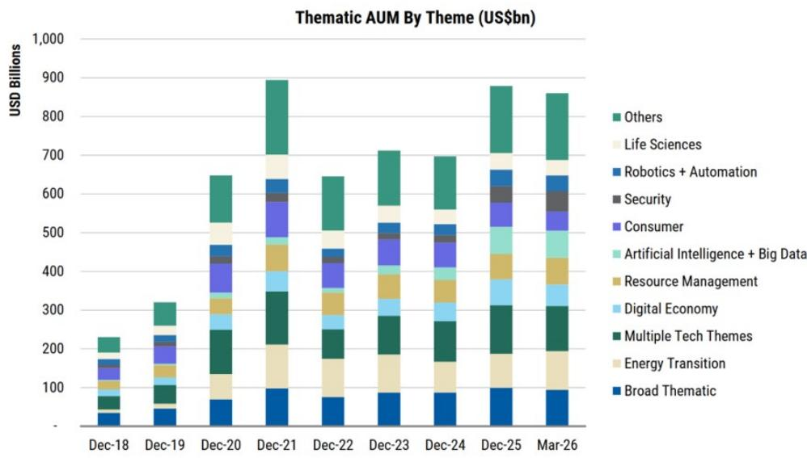

bar_stacked

| Month    | Broad Thematic | Energy Transition | Digital Economy | Resource Management | Artificial Intelligence + Big Data | Consumer | Security | Robotics + Automation | Life Sciences | Others |
|----------|----------------|-------------------|-----------------|---------------------|------------------------------------|--------|--------|------------------------|---------------|--------|
| Dec-18   | 30             | 20                | 10              | 15                  | 10                                 | 20     | 10     | 10                     | 20            | 40     |
| Dec-19   | 40             | 25                | 15              | 20                  | 15                                 | 30     | 15     | 15                     | 30            | 60     |
| Dec-20   | 70             | 40                | 30              | 40                  | 30                                 | 50     | 20     | 20                     | 50            | 100    |
| Dec-21   | 100            | 60                | 40              | 60                  | 40                                 | 70     | 30     | 30                     | 60            | 150    |
| Dec-22   | 80             | 50                | 35              | 55                  | 45                                 | 65     | 25     | 25                     | 55            | 120    |
| Dec-23   | 90             | 65                | 45              | 70                  | 55                                 | 80     | 35     | 35                     | 70            | 130    |
| Dec-24   | 95             | 70                | 50              | 75                  | 60                                 | 85     | 40     | 40                     | 75            | 140    |
| Dec-25   | 100            | 80                | 60              | 80                  | 70                                 | 90     | 45     | 45                     | 80            | 160    |
| Mar-26   | 95             | 75                | 55              | 75                  | 65                                 | 85     | 50     | 50                     | 75            | 170    |

Global Thematic Fund Launches   
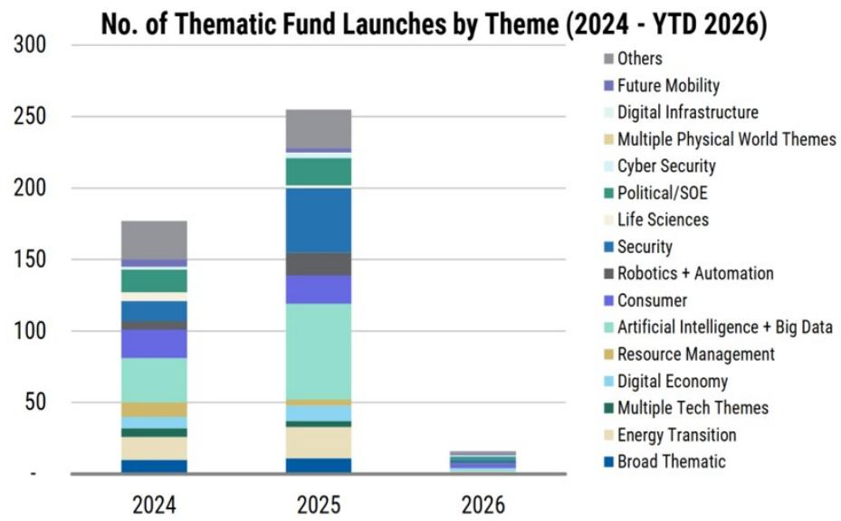

bar_stacked

No. of Thematic Fund Launches by Theme (2024 - YTD 2026)
| Year | Broad Thematic | Energy Transition | Multiple Tech Themes | Digital Economy | Resource Management | Artificial Intelligence + Big Data | Consumer | Robotics + Automation | Security | Life Sciences | Political/SOE | Cyber Security | Multiple Physical World Themes | Digital Infrastructure | Future Mobility |
|---|---|---|---|---|---|---|---|---|---|---|---|---|---|---|---|
| 2024 | 10 | 10 | 10 | 10 | 10 | 30 | 10 | 10 | 20 | 10 | 20 | 10 | 10 | 30 | 20 |
| 2025 | 10 | 10 | 10 | 10 | 10 | 70 | 10 | 10 | 40 | 10 | 30 | 10 | 10 | 40 | 20 |
| 2026 | 5 | 5 | 5 | 5 | 5 | 5 | 5 | 5 | 5 | 5 | 5 | 5 | 5 | 5 | 5 |

Source: MS, Morningstar, FactSet; Data as of March 31, 2026.

Changes from End-2022 on Price/Book vs. ROE Scatterplot – Capital Market Reform Programs Supporting a Recovery on ROE and Re-rating of Asia's Leading Markets   
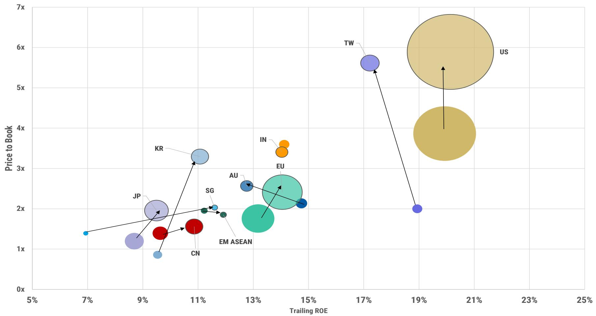  
Source: FactSet, MSCI, MS. Note: Data as of May 14, 2026. Bubble size represents free float market capitalization.

# Strong Momentum in Activism/Engagement in Japan, but Korea Attracting Attention

Number of Activist Campaigns   
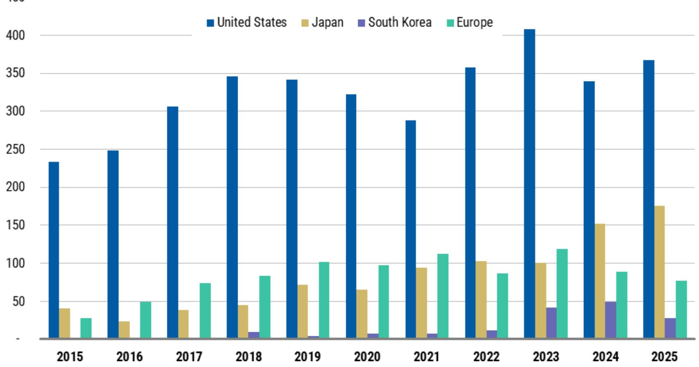

bar

| Year | United States | Japan | South Korea | Europe |
|------|---------------|-------|-------------|--------|
| 2015 | 230           | 40    | -           | 25     |
| 2016 | 245           | 25    | -           | 50     |
| 2017 | 305           | 38    | -           | 72     |
| 2018 | 345           | 45    | 10          | 82     |
| 2019 | 340           | 70    | 5           | 100    |
| 2020 | 320           | 65    | 8           | 98     |
| 2021 | 285           | 95    | 8           | 110    |
| 2022 | 355           | 102   | 12          | 85     |
| 2023 | 410           | 100   | 42          | 118    |
| 2024 | 340           | 150   | 50          | 88     |
| 2025 | 365           | 175   | 28          | 75     |

Source: Bloomberg, MS; Data as of March 2026

# Asia's Competitive Reinvention and Reform Beneficiaries

Total payout ratio trends (dividends + net buybacks) - Japan has more than doubled since Abenomics; EM continues to lag at 37% given high investment

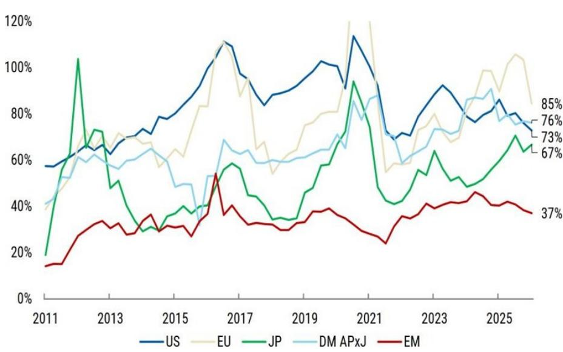

line

| Year | US   | EU   | JP   | DM APxJ | EM   |
|------|------|------|------|---------|------|
| 2025 | 85%  | 76%  | 67%  | 73%     | 37%  |

Source: Bloomberg, MS. Quarterly data as at end-2025.

Corporate reform opportunities have been outperforming across Asia, even in a strong market

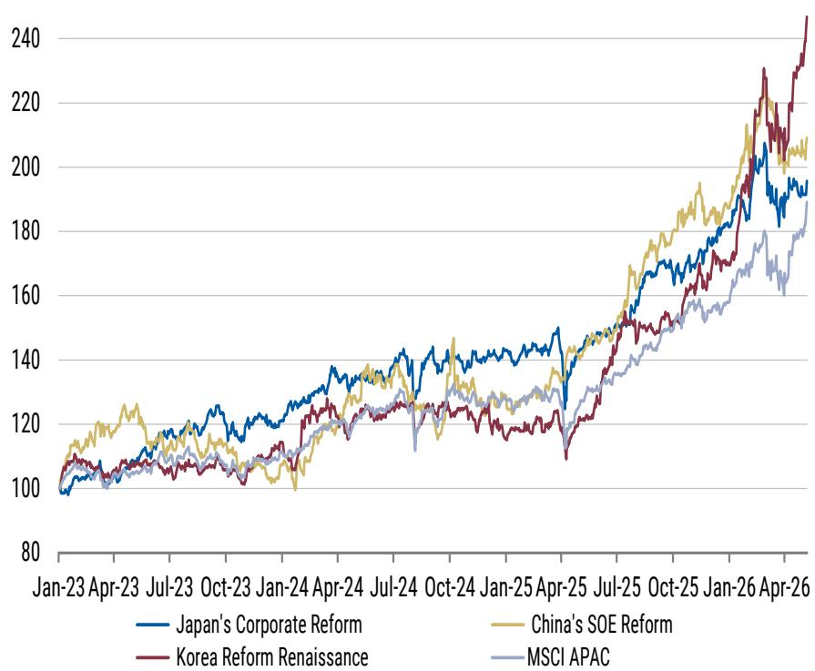

line

| Date     | Japan's Corporate Reform | China's SOE Reform | Korea Reform Renaissance | MSCI APAC |
|----------|---------------------------|--------------------|-------------------------|-----------|
| Jan-23   | ~100                      | ~110               | ~105                    | ~100      |
| Apr-23   | ~105                      | ~120               | ~108                    | ~102      |
| Jul-23   | ~115                      | ~110               | ~107                    | ~105      |
| Oct-23   | ~120                      | ~105               | ~108                    | ~108      |
| Jan-24   | ~125                      | ~100               | ~110                    | ~110      |
| Apr-24   | ~135                      | ~125               | ~120                    | ~115      |
| Jul-24   | ~140                      | ~135               | ~125                    | ~120      |
| Oct-24   | ~145                      | ~140               | ~130                    | ~125      |
| Jan-25   | ~150                      | ~145               | ~135                    | ~130      |
| Apr-25   | ~155                      | ~150               | ~140                    | ~135      |
| Jul-25   | ~165                      | ~160               | ~150                    | ~145      |
| Oct-25   | ~175                      | ~170               | ~160                    | ~155      |
| Jan-26   | ~190                      | ~185               | ~180                    | ~170      |
| Apr-26   | ~200                      | ~205               | ~230                    | ~185      |

Source: FactSet, MS; Data as of May 7, 2026

# MSCI Index Breakdown by Industry Focus – Sub-Industry Segregation

<table><tr><td>Compute</td><td>Communications Equipment, Electronic Components, Electronic Components, Electronic Equipment &amp; Instruments, Electronic Manufacturing Services, Semiconductor Materials &amp; Equipment, Semiconductors, Technology Hardware Storage &amp; Peripherals</td></tr><tr><td>Real Assets</td><td>Airport Services, Alternative Carriers, Cable &amp; Satellite, Data Center REITs, Diversified Real Estate Activities, Diversified REITs, Electric Utilities, Gas Utilities, Health Care REITs, Highways &amp; Railtracks, Hotel &amp; Resort REITs, Independent Power Producers &amp; Energy Traders, Industrial REITs, Integrated Telecommunication Services, Marine Ports &amp; Services, Mortgage REITs, Multi-Family Residential REITs, Multi-Utilities, Office REITs, Oil &amp; Gas Storage &amp; Transportation, Other Specialized REITs, Real Estate Development, Real Estate Operating Companies, Renewable Electricity, Retail REITs, Self-Storage REITs, Single-Family Residential REITs, Telecom Tower REITs, Timber REITs, Water Utilities, Wireless Telecommunication Services</td></tr><tr><td>Commodities</td><td>Aluminum, Coal &amp; Consumable Fuels, Commodity Chemicals, Construction Materials, Copper, Diversified Chemicals, Diversified Metals &amp; Mining, Fertilizers &amp; Agricultural Chemicals, Forest Products, Gold, Industrial Gases, Integrated Oil &amp; Gas, Paper Products, Precious Metals &amp; Minerals, Silver, Specialty Chemicals, Steel, Textiles</td></tr><tr><td>Capital Goods</td><td>Aerospace &amp; Defense, Agricultural &amp; Farm Machinery, Building Products, Construction Machinery &amp; Heavy Transportation Equipment, Electrical Components &amp; Equipment, Health Care Equipment, Heavy Electrical Equipment, Industrial Conglomerates, Industrial Machinery &amp; Supplies &amp; Components</td></tr><tr><td>Consumer Goods</td><td>Agricultural Products &amp; Services, Apparel Accessories &amp; Luxury Goods, Automobile Manufacturers, Automotive Parts &amp; Equipment, Brewers, Consumer Electronics, Distillers &amp; Vintners, Footwear, Health Care Supplies, Home Furnishings, Household Appliances, Housewares &amp; Specialties, Leisure Products, Metal Glass &amp; Plastic Containers, Motorcycle Manufacturers, Packaged Foods &amp; Meats, Paper &amp; Plastic Packaging Products &amp; Materials, Personal Care Products, Soft Drinks &amp; Non-alcoholic Beverages, Tires &amp; Rubber, Tobacco</td></tr><tr><td>Banks</td><td>Diversified Banks, Regional Banks</td></tr><tr><td>Heavy Services</td><td>Air Freight &amp; Logistics, Biotechnology, Cargo Ground Transportation, Casinos &amp; Gaming, Construction &amp; Engineering, Health Care Facilities, Homebuilding, Hotels Resorts &amp; Cruise Lines, Leisure Facilities, Life Sciences Tools &amp; Services, Marine Transportation, Oil &amp; Gas Drilling, Oil &amp; Gas Equipment &amp; Services, Oil &amp; Gas Exploration &amp; Production, Oil &amp; Gas Refining &amp; Marketing, Passenger Airlines, Passenger Ground Transportation, Pharmaceuticals, Rail Transportation, Trading Companies &amp; Distributors</td></tr><tr><td>Light Services</td><td>Advertising, Apparel Retail, Application Software, Asset Management &amp; Custody Banks, Automotive Retail, Broadcasting, Broadline Retail, Commercial &amp; Residential Mortgage Finance, Commercial Printing, Computer &amp; Electronics Retail, Consumer Finance, Consumer Staples Merchandise Retail, Data Processing &amp; Outsourced Services, Distributors, Diversified Capital Markets, Diversified Financial Services, Diversified Support Services, Drug Retail, Education Services, Environmental &amp; Facilities Services, Financial Exchanges &amp; Data, Food Distributors, Food Retail, Health Care Distributors, Health Care Services, Health Care Technology, Home Improvement Retail, Homefurnishing Retail, Human Resource &amp; Employment Services, Insurance Brokers, Interactive Home Entertainment, Interactive Media &amp; Services, Internet Services &amp; Infrastructure, Investment Banking &amp; Brokerage, IT Consulting &amp; Other Services, Life &amp; Health Insurance, Managed Health Care, Movies &amp; Entertainment, Multi-line Insurance, Multi-Sector Holdings, Office Services &amp; Supplies, Other Specialty Retail, Property &amp; Casualty Insurance, Publishing, Real Estate Services, Reinsurance, Research &amp; Consulting Services, Restaurants, Security &amp; Alarm Services, Specialized Consumer Services, Specialized Finance, Systems Software, Technology Distributors, Transaction &amp; Payment Processing Services</td></tr></table>

Source: MS

This report references U.S. Executive Order 14032 and/or entities or securities that are designated thereunder. U.S. persons may be prohibited from buying certain securities of entities named in this report. Readers are solely responsible for ensuring that their investment activities are carried out in compliance with applicable laws

This report references export controls and/or entities that may be subject to export control restrictions. Readers are solely responsible for ensuring that their investment or trade activities are carried out in compliance with applicable laws.

# Disclosure Section

The information and opinions in MS were prepared or are disseminated by MS Asia Limited (which accepts the responsibility for its contents) and/or MS Asia (Singapore) Pte. (Registration number 199206298Z) and/or MS Asia (Singapore) Securities Pte Ltd (Registration number 200008434H), regulated by the Monetary Authority of Singapore (which accepts legal responsibility for its contents and should be contacted with respect to any matters arising from, or in connection with, MS), and/or MS Taiwan Limited and/or MS & Co International plc, Seoul Branch, and/or MS Australia Limited (A.B.N. 67 003 734 576, holder of Australian financial services license No. 233742, which accepts responsibility for its contents), and/or MS Wealth Management Australia Pty Ltd (A.B.N. 19 009 145 555, holder of Australian financial services license No. 240813, which accepts responsibility for its contents), and/or MS India Company Private Limited having Corporate Identification No (CIN) U22990MH1998PTC115305, regulated by the Securities and Exchange Board of India ("SEBI") and holder of licenses as a Research Analyst (SEBI Registration No. INH000001105); Stock Broker (SEBI Stock Broker Registration No. INZ000244438), Merchant Banker (SEBI Registration No. INM000011203), and depository participant with National Securities Depository Limited (SEBI Registration No. IN-DP-NSDL-567-2021) having registered office at Altimus, Level 39 & 40, Pandurang Budhkar Marg, Worli, Mumbai 400018, India; Telephone no. +91-22-61181000; Compliance Officer Details: Mr. Tejarshi Hardas, Tel. No.: +91-22-61181000 or Email: tejarshi.hardas@morganstanley.com; Grievance officer details: Mr. Tejarshi Hardas, Tel. No.: +91-22-61181000 or Email: msic-compliance@morganstanley.com which accepts the responsibility for its contents and should be contacted with respect to any matters arising from, or in connection with, MS, and their affiliates (collectively, "MS"). MS India Company Private Limited (MSICPL) may use AI tools in providing research services. All recommendations contained herein are made by the duly qualified research analysts.

For important disclosures, stock price charts and equity rating histories regarding companies that are the subject of this report, please see the MS Disclosure Website at www.morganstanley.com/eqr/disclosures/webapp/generalresearch, or contact your investment representative or MS at 1585 Broadway, (Attention: Research Management), New York, NY, 10036 USA.

For valuation methodology and risks associated with any recommendation, rating or price target referenced in this research report, please contact the Client Support Team as follows: US/Canada +1 800 303-2495; Hong Kong +852 2848-5999; Latin America +1 718 754-5444 (U.S.); London +44 (0)20-7425-8169; Singapore +65 6834-6860; Sydney +61 (0)2-9770-1505; Tokyo +81 (0)3-6836-9000. Alternatively you may contact your investment representative or MS at 1585 Broadway, (Attention: Research Management), New York, NY 10036 USA.

# Analyst Certification

The following analysts hereby certify that their views about the companies and their securities discussed in this report are accurately expressed and that they have not received and will not receive direct or indirect compensation in exchange for expressing specific recommendations or views in this report: Daniel K Blake; Stephen C Byrd; Ehsernta Fu; Jonathan F Garner; Kristal Ji.

# Global Research Conflict Management Policy

MS has been published in accordance with our conflict management policy, which is available at www.morganstanley.com/institutional/research/conflictpolicies. A Portuguese version of the policy can be found at www.morganstanley.com.br

# Important Regulatory Disclosures on Subject Companies

As of April 30, 2026, MS beneficially owned 1% or more of a class of common equity securities of the following companies covered in MS: AIA Group Ltd, AirTAC International, Anhui Yingliu Electromechanical Co Ltd, Bharat Heavy Electricals Ltd, Contemporary Amperex Technology Co. Ltd., Delta Electronics Inc., Fanuc, Furukawa Electric, GS Yuasa Corporation, Hanwha Aerospace, Kandenko, Lynas Rare Earths, Misumi Group, NAURA Technology Group Co Ltd, Samsung E&A Co Ltd, Sieyuan Electric Co.Ltd., Taisei, TSMC, WeiChai Power, Wiwynn Corp, WuXi AppTec Co Ltd.

Within the last 12 months, MS managed or co-managed a public offering (or 144A offering) of securities of AIA Group Ltd, Contemporary Amperex Technology Co. Ltd., GemLife Communities Group, Kandenko, Mitsubishi Heavy Industries, Samsung Electronics, Sojitz, Tencent Holdings Ltd., Wiwynn Corp, WuXi AppTec Co Ltd.

Within the last 12 months, MS has received compensation for investment banking services from Contemporary Amperex Technology Co. Ltd., GemLife Communities Group, Kandenko, Mitsubishi Heavy Industries, Shenzhen Inovance Technology, Sojitz, ST Engineering, Taisei, Tencent Holdings Ltd., Wiwynn Corp, WuXi AppTec Co Ltd.

In the next 3 months, MS expects to receive or intends to seek compensation for investment banking services from AIA Group Ltd, AirTAC International, Anhui Yingliu Electromechanical Co Ltd, Contemporary Amperex Technology Co. Ltd., Delta Electronics Inc., Doosan Enerbility, Fanuc, Furukawa Electric, GemLife Communities Group, GS Yuasa Corporation, Gulf Development PCL, Hanwha Aerospace, HD Hyundai Electric Co Ltd, Kandenko, Larsen & Toubro Ltd, Lynas Rare Earths, Misumi Group, Mitsubishi Heavy Industries, Samsung Electronics, SGH Limited, Shenzhen Inovance Technology, Sojitz, ST Engineering, Taisei, Tencent Holdings Ltd., TSMC, Wiwynn Corp, WuXi AppTec Co Ltd.

Within the last 12 months, MS has received compensation for products and services other than investment banking services from AIA Group Ltd, Sojitz, Tencent Holdings Ltd., TSMC, WuXi AppTec Co Ltd.

Within the last 12 months, MS has provided or is providing investment banking services to, or has an investment banking client relationship with, the following company: AIA Group Ltd, AirTAC International, Anhui Yingliu Electromechanical Co Ltd, Contemporary Amperex Technology Co. Ltd., Delta Electronics Inc., Doosan Enerbility, Furukawa Electric, GemLife Communities Group, GS Yuasa Corporation, Gulf Development PCL, Hanwha Aerospace, HD Hyundai Electric Co Ltd, Kandenko, Larsen & Toubro Ltd, Lynas Rare Earths, Mitsubishi Heavy Industries, Samsung Electronics, SGH Limited, Shenzhen Inovance Technology, Sojitz, ST Engineering, Taisei, Tencent Holdings Ltd., TSMC, Wiwynn Corp, WuXi AppTec Co Ltd.

Within the last 12 months, MS has either provided or is providing non-investment banking, securities-related services to and/or in the past has entered into an agreement to provide services or has a client relationship with the following company: AIA Group Ltd, Doosan Enerbility, Larsen & Toubro Ltd, Sojitz, Tencent Holdings Ltd., TSMC, WuXi AppTec Co Ltd.

The equity research analysts or strategists principally responsible for the preparation of MS have received compensation based upon various factors, including quality of research, investor client feedback, stock picking, competitive factors, firm revenues and overall investment banking revenues. Equity Research analysts' or strategists' compensation is not linked to investment banking or capital markets transactions performed by MS or the profitability or revenues of particular trading desks.

MS and its affiliates do business that relates to companies/instruments covered in MS, including market making, providing liquidity, fund management, commercial banking, extension of credit, investment services and investment banking. MS sells to and buys from customers the securities/instruments of companies covered in MS on a principal basis. MS may have a position in the debt of the Company or instruments discussed in this report. MS trades or may trade as principal in the debt securities (or in related derivatives) that are the subject of the debt research report.

Certain disclosures listed above are also for compliance with applicable regulations in non-US jurisdictions.

# STOCK RATINGS

MS uses a relative rating system using terms such as Overweight, Equal-weight, Not-Rated or Underweight (see definitions below). MS does not assign ratings of Buy, Hold or Sell to the stocks we cover. Overweight, Equal-weight, Not-Rated and Underweight are not the equivalent of buy, hold and sell. Investors should carefully read the definitions of all ratings used in MS. In addition, since MS contains more complete information concerning the analyst's views, investors should carefully read MS, in its entirety, and not infer the contents from the rating alone. In any case, ratings (or research) should not be used or relied upon as investment advice. An investor's decision to buy or sell a stock should depend on individual circumstances (such as the investor's existing holdings) and other considerations.

# Global Stock Ratings Distribution

(as of April 30, 2026)

The Stock Ratings described below apply to MS's Fundamental Equity Research and do not apply to Debt Research produced by the Firm.

For disclosure purposes only (in accordance with FINRA requirements), we include the category headings of Buy, Hold, and Sell alongside our ratings of Overweight, Equal-weight, Not-Rated and Underweight. MS does not assign ratings of Buy, Hold or Sell to the stocks we cover. Overweight, Equal-weight, Not-Rated and Underweight are not the equivalent of buy, hold, and sell but represent recommended relative weightings (see definitions below). To satisfy regulatory requirements, we correspond Overweight, our most positive stock rating, with a buy recommendation; we correspond Equal-weight and Not-Rated to hold and Underweight to sell recommendations, respectively.

<table><tr><td></td><td colspan="2">Coverage Universe</td><td colspan="3">Investment Banking Clients (IBC)</td><td colspan="2">Other Material Investment ServicesClients (MISC)</td></tr><tr><td>Stock RatingCategory</td><td>Count</td><td>% of Total</td><td>Count</td><td>% of Total IBC</td><td>% of RatingCategory</td><td>Count</td><td>% of Total OtherMISC</td></tr><tr><td>Overweight/Buy</td><td>1546</td><td>42%</td><td>467</td><td>51%</td><td>30%</td><td>709</td><td>44%</td></tr><tr><td>Equal-weight/Hold</td><td>1568</td><td>43%</td><td>358</td><td>39%</td><td>23%</td><td>715</td><td>44%</td></tr><tr><td>Not-Rated/Hold</td><td>4</td><td>0%</td><td>0</td><td>0%</td><td>0%</td><td>1</td><td>0%</td></tr><tr><td>Underweight/Sell</td><td>555</td><td>15%</td><td>84</td><td>9%</td><td>15%</td><td>202</td><td>12%</td></tr><tr><td>Total</td><td>3,673</td><td></td><td>909</td><td></td><td></td><td>1627</td><td></td></tr></table>

Data include common stock and ADRs currently assigned ratings. Investment Banking Clients are companies from whom MS received investment banking compensation in the last 12 months. Due to rounding off of decimals, the percentages provided in the "% of total" column may not add up to exactly 100 percent.

# Analyst Stock Ratings

Overweight (O). The stock's total return is expected to exceed the average total return of the analyst's industry (or industry team's) coverage universe, on a risk-adjusted basis, over the next 12-18 months.

Equal-weight (E). The stock's total return is expected to be in line with the average total return of the analyst's industry (or industry team's) coverage universe, on a risk-adjusted basis, over the next 12-18 months.

Not-Rated (NR). Currently the analyst does not have adequate conviction about the stock's total return relative to the average total return of the analyst's industry (or industry team's) coverage universe, on a risk-adjusted basis, over the next 12-18 months.

Underweight (U). The stock's total return is expected to be below the average total return of the analyst's industry (or industry team's) coverage universe, on a risk-adjusted basis, over the next 12-18 months.

Unless otherwise specified, the time frame for price targets included in MS is 12 to 18 months.

# Analyst Industry Views

Attractive (A): The analyst expects the performance of his or her industry coverage universe over the next 12-18 months to be attractive vs. the relevant broad market benchmark, as indicated below.

In-Line (I): The analyst expects the performance of his or her industry coverage universe over the next 12-18 months to be in line with the relevant broad market benchmark, as indicated below. Cautious (C): The analyst views the performance of his or her industry coverage universe over the next 12-18 months with caution vs. the relevant broad market benchmark, as indicated below. Benchmarks for each region are as follows: North America - S&P 500; Latin America - relevant MSCI country index or MSCI Latin America Index; Europe - MSCI Europe; Japan - TOPIX; Asia - relevant MSCI country index or MSCI sub-regional index or MSCI AC Asia Pacific ex Japan Index.

# Stock Price, Price Target and Rating History (See Rating Definitions)

Doosan Enerbility (034020.KS) - As of 05/17/26 GMT in KRW Industry : S. Korea Industrials   
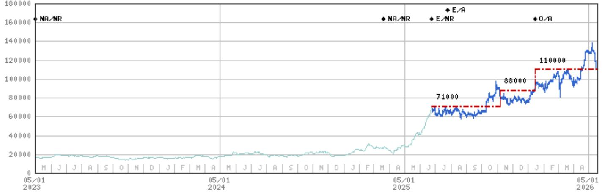

line

| Date       | Value   |
| ---------- | ------- |
| 05/01 2023 | 160000  |
| 05/01 2024 | 71000   |
| 05/01 2025 | 88000   |
| 05/01 2026 | 110000  |

Stock Rating History: 5/1/21 : NA/NR; 3/20/25 : NA/NR; 6/24/25 : E/NR; 7/25/25 : E/A; 1/14/26 : O/A   
Price Target History: 12/11/20 : NA; 6/24/25 : 71000; 11/6/25 : 88000; 1/14/26 : 110000   
Source: MS Date Format: MM/DD/YY Price Target No Price Target Assigned (NA)   
Stock Price (Not Covered by Current Analyst) — Stock Price (Covered by Current Analyst)   
Stock and Industry Ratings (abbreviations below) appear as ♦ Stock Rating/Industry View   
Stock Ratings: Overweight (O) Equal-weight (E) Underweight (U) Not-Rated (NR) No Rating Available (NA)   
Industry View: Attractive (A) In-line (I) Cautious (C) No Rating (NR)   
Effective January 13, 2014, the stocks covered by MS Asia Pacific will be rated relative to the analyst's industry (or industry team's) coverage.   
Effective January 13, 2014, the industry view benchmarks for MS Asia Pacific are as follows: relevant MSCI country index or MSCI sub-regional index or MSCI AC Asia Pacific ex Japan Index.

Hanwha Aerospace (012450.KS) - As of 05/17/26 GMT in KRW Industry : S. Korea Industrials   
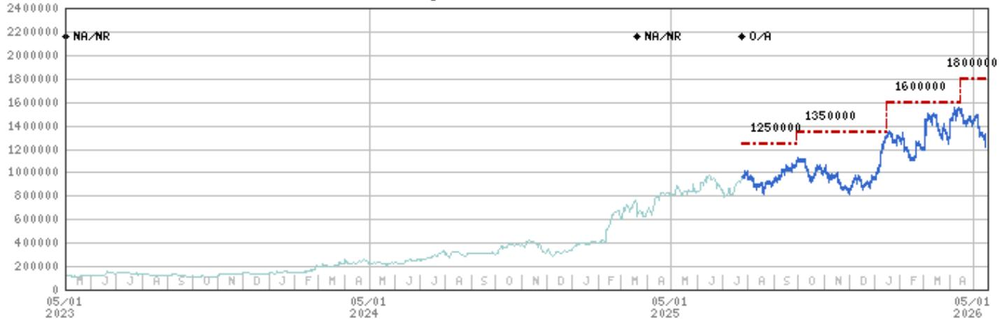

line

| Date       | Value     |
| ---------- | --------- |
| 05/01 2023 | NA/NR     |
| 05/01 2024 | NA/NR     |
| 05/01 2025 | 1250000   |
| 05/01 2026 | 1800000   |

Stock Rating History: 5/1/21 : NA/NR; 3/20/25 : NA/NR; 7/25/25 : 0/A   
Price Target History: 7/25/25 : 1250000; 9/29/25 : 1350000; 1/16/26 : 1600000; 4/14/26 : 1800000   
Source: MS Date Format : MM/DD/YY Price Target = No Price Target Assigned (NA)   
Stock Price (Not Covered by Current Analyst) — Stock Price (Covered by Current Analyst)   
Stock and Industry Ratings (abbreviations below) appear as ♦ Stock Rating/Industry View   
Stock Ratings: Overweight (O) Equal-weight (E) Underweight (U) Not-Rated (NR) No Rating Available (NA)   
Industry View: Attractive (A) In-line (I) Cautious (C) No Rating (NR)   
Effective January 13, 2014, the stocks covered by MS Asia Pacific will be rated relative to the analyst's industry (or industry team's) coverage.   
Effective January 13, 2014, the industry view benchmarks for MS Asia Pacific are as follows: relevant MSCI country index or MSCI sub-regional index or MSCI AC Asia Pacific ex Japan Index.

HD Hyundai Electric Co Ltd (267260.KS) - As of 05/17/26 GMT in KRW
Industry : S. Korea Technology   
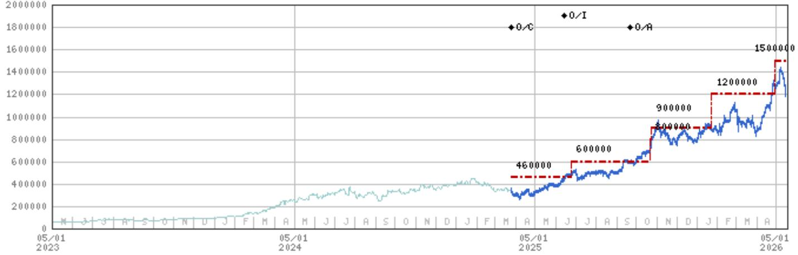

line

| Date       | Value     |
| ---------- | --------- |
| 05/01 2023 | ~100,000  |
| 05/01 2024 | ~300,000  |
| 05/01 2025 | 460,000   |
| 05/01 2026 | 1500,000  |

Stock Rating History: 3/25/25 : 0/C; 6/13/25 : 0/I; 9/21/25 : 0/A   
Price Target History: 3/25/25 : 460000; 6/24/25 : 600000; 10/21/25 : 800000; 10/23/25 : 900000; 1/22/26 : 1200000; 4/28/26 : 1500000   
Source: MS Date Format : MM/DD/YY Price Target No Price Target Assigned (NA)   
Stock Price (Not Covered by Current Analyst) — Stock Price (Covered by Current Analyst)   
Stock and Industry Ratings (abbreviations below) appear as ♦ Stock Rating/Industry View   
Stock Ratings: Overweight (O) Equal-weight (E) Underweight (U) Not-Rated (NR) No Rating Available (NA)   
Industry View: Attractive (A) In-line (I) Cautious (C) No Rating (NR)   
Effective January 13, 2014, the stocks covered by MS Asia Pacific will be rated relative to the analyst's industry (or industry team's) coverage.   
Effective January 13, 2014, the industry view benchmarks for MS Asia Pacific are as follows: relevant MSCI country index or MSCI sub-regional index or MSCI AC Asia Pacific ex Japan Index.

LS Electric (010120.KS) - As of 05/17/26 GMT in KRW Industry : S. Korea Technology   
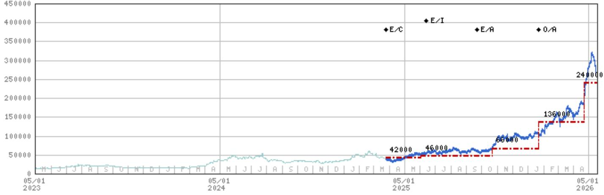

line

| Date       | Value   |
| ---------- | ------- |
| 05/01 2023 | 42000   |
| 05/01 2024 | 46000   |
| 05/01 2025 | 96000   |
| 05/01 2026 | 240000  |

Stock Rating History: 3/25/25 : E/C; 6/13/25 : E/I; 9/21/25 : E/A; 1/22/26 : O/A   
Price Target History: 3/25/25 : 42000; 6/3/25 : 46000; 10/21/25 : 66000; 1/22/26 : 136000; 4/22/26 : 240000   
Source: MS Date Format : MM/DD/YY Price Target = No Price Target Assigned (NA)   
Stock Price (Not Covered by Current Analyst) — Stock Price (Covered by Current Analyst)   
Stock and Industry Ratings (abbreviations below) appear as ♦ Stock Rating/Industry View   
Stock Ratings: Overweight (O) Equal-weight (E) Underweight (U) Not-Rated (NR) No Rating Available (NA)   
Industry View: Attractive (A) In-line (I) Cautious (C) No Rating (NR)   
Effective January 13, 2014, the stocks covered by MS Asia Pacific will be rated relative to the analyst's industry (or industry team's) coverage.   
Effective January 13, 2014, the industry view benchmarks for MS Asia Pacific are as follows: relevant MSCI country index or MSCI sub-regional index or MSCI AC Asia Pacific ex Japan Index.

Samsung E&A Co Ltd (028050.KS) - As of 05/17/26 GMT in KRW Industry : S. Korea Industrials   
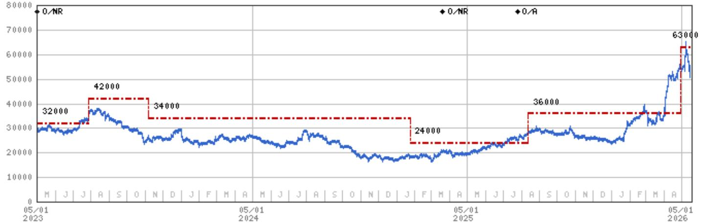

line

| Date       | Value   |
| ---------- | ------- |
| 05/01 2023 | 32000   |
| 05/01 2024 | 42000   |
| 05/01 2025 | 24000   |
| 05/01 2026 | 63000   |

Stock Rating History: 5/1/21 : 0/NR; 3/16/22 : E/NR; 2/1/23 : 0/NR; 3/20/25 : 0/NR; 7/25/25 : 0/A   
Price Target History: 2/5/21 : 15000; 5/3/21 : 20000; 6/10/21 : 26000; 3/16/22 : 30000; 7/28/22 : 24000; 2/1/23 : 32000;   
7/28/23 : 42000; 11/7/23 : 34000; 1/24/25 : 24000; 8/13/25 : 36000; 4/29/26 : 63000   
Source: MS Date Format : MM/DD/YY Price Target No Price Target Assigned (NA)   
Stock Price (Not Covered by Current Analyst) — Stock Price (Covered by Current Analyst)   
Stock and Industry Ratings (abbreviations below) appear as ♦ Stock Rating/Industry View   
Stock Ratings: Overweight (O) Equal-weight (E) Underweight (U) Not-Rated (NR) No Rating Available (NA)   
Industry View: Attractive (A) In-line (I) Cautious (C) No Rating (NR)   
Effective January 13, 2014, the stocks covered by MS Asia Pacific will be rated relative to the analyst's industry (or industry team's) coverage.   
Effective January 13, 2014, the industry view benchmarks for MS Asia Pacific are as follows: relevant MSCI country index or MSCI sub-regional index or MSCI AC Asia Pacific ex Japan Index.

Samsung Electronics (005930.KS) - As of 05/17/26 GMT in KRW Industry : S. Korea Technology   
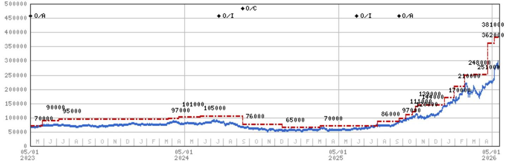

line

| Date       | Value   |
| ---------- | ------- |
| 05/01 2023 | 70000   |
| 05/01 2023 | 90000   |
| 05/01 2023 | 95000   |
| 05/01 2023 | 101000  |
| 05/01 2023 | 105000  |
| 05/01 2023 | 97000   |
| 05/01 2023 | 76000   |
| 05/01 2023 | 65000   |
| 05/01 2023 | 70000   |
| 05/01 2023 | 86000   |
| 05/01 2023 | 97000   |
| 05/01 2023 | 111000  |
| 05/01 2023 | 139000  |
| 05/01 2023 | 144000  |
| 05/01 2023 | 170000  |
| 05/01 2023 | 210000  |
| 05/01 2023 | 248000  |
| 05/01 2023 | 362000  |
| 05/01 2023 | 381000  |

Stock Rating History: 5/1/21 : 0/A; 7/19/21 : 0/I; 8/12/21 : 0/C; 10/4/22 : 0/A; 7/21/24 : 0/I; 9/15/24 : 0/C; 6/13/25 : 0/I; 9/21/25 : 0/A   
Price Target History: 2/25/21 : 115000; 5/18/21 : 93000; 6/8/21 : 98000; 8/12/21 : 89000; 9/15/21 : 95000; 12/3/21 : 97000;   
3/18/22 : 95000; 4/28/22 : 85000; 6/10/22 : 80000; 7/5/22 : 75000; 7/22/22 : 70000; 9/17/22 : 68000; 3/21/23 : 70000;   
5/30/23 : 90000; 7/7/23 : 95000; 3/22/24 : 97000; 4/16/24 : 101000; 6/6/24 : 105000; 9/15/24 : 76000; 12/18/24 : 65000;   
3/19/25 : 70000; 8/1/25 : 86000; 9/21/25 : 97000; 10/8/25 : 111000; 10/23/25 : 120000; 10/30/25 : 139000; 11/5/25 : 144000;   
1/8/26 : 170000; 1/30/26 : 210000; 2/24/26 : 248000; 3/18/26 : 251000; 4/19/26 : 362000; 5/6/26 : 381000   
Source: MS Date Format : MM/DD/YY Price Target No Price Target Assigned (NA)   
Stock Price (Not Covered by Current Analyst) — Stock Price (Covered by Current Analyst)   
Stock and Industry Ratings (abbreviations below) appear as ♦ Stock Rating/Industry View   
Stock Ratings: Overweight (O) Equal-weight (E) Underweight (U) Not-Rated (NR) No Rating Available (NA)   
Industry View: Attractive (A) In-line (I) Cautious (C) No Rating (NR)   
Effective January 13, 2014, the stocks covered by MS Asia Pacific will be rated relative to the analyst's industry (or industry team's) coverage.   
Effective January 13, 2014, the industry view benchmarks for MS Asia Pacific are as follows: relevant MSCI country index or MSCI sub-regional index or MSCI AC Asia Pacific ex Japan Index.

# Important Disclosures for MS Smith Barney LLC Customers

Important disclosures regarding any material conflict of interest that can reasonably be expected to have influenced MS Smith Barney LLC's choice of a third-party research provider or the subject company of a third-party research report, are available on the MS Wealth Management disclosure website at www.morganstanley.com/online/researchdisclosures. For MS specific disclosures, you may refer to https://www.morganstanley.com/eqr/disclosures/webapp/generalresearch.

Each MS report is reviewed and approved on behalf of MS Smith Barney LLC. This review and approval is conducted by the same person who reviews the research report on behalf of MS. This could create a conflict of interest.

# Other Important Disclosures

MS policy is to update research reports as and when the Research Analyst and Research Management deem appropriate, based on developments with the issuer, the sector, or the market that may have a material impact on the research views or opinions stated therein. In addition, certain Research publications are intended to be updated on a regular periodic basis (weekly/monthly/quarterly/annual) and will ordinarily be updated with that frequency, unless the Research Analyst and Research Management determine that a different publication schedule is appropriate based on current conditions.

MS is not acting as a municipal advisor and the opinions or views contained herein are not intended to be, and do not constitute, advice within the meaning of Section 975 of the Dodd-Frank Wall Street Reform and Consumer Protection Act.

MS produces an equity research product called a "Tactical Idea." Views contained in a "Tactical Idea" on a particular stock may be contrary to the recommendations or views expressed in research on the same stock. This may be the result of differing time horizons, methodologies, market events, or other factors. For all research available on a particular stock, please contact your sales representative or go to Matrix at http://www.morganstanley.com/matrix.

MS is provided to our clients through our proprietary research portal on Matrix and also distributed electronically by MS to clients. Certain, but not all, MS products are also made available to clients through third-party vendors or redistributed to clients through alternate electronic means as a convenience. For access to all available MS, please contact your sales representative or go to Matrix at http://www.morganstanley.com/matrix.

Any access and/or use of MS is subject to MS's Terms of Use (http://www.morganstanley.com/terms.html). By accessing and/or using MS, you are indicating that you have read and agree to be bound by our Terms of Use (http://www.morganstanley.com/terms.html). In addition you consent to MS processing your personal data and using cookies in accordance with our Privacy Policy and our Global Cookies Policy (http://www.morganstanley.com/privacy\_pledge.html), including for the purposes of setting your preferences and to collect readership data so that we can deliver better and more personalized service and products to you. To find out more information about how MS processes personal data, how we use cookies and how to reject cookies see our Privacy Policy and our Global Cookies Policy (http://www.morganstanley.com/privacy\_pledge.html). Please use the provided link to review the Terms and Conditions and Most Important Terms and Conditions for MS India Company Private Limited (https://www.morganstanley.com/assets/pdfs/about-us-global-offices/india/Terms\_and\_conditions.pdf) and the following link to review the audit report (https://ny.matrix.ms.com/eqr/research/webapp/researchdocs/MSICPL\_Morgan\_Stanley\_Research\_Audit\_Report.pdf).

If you do not agree to our Terms of Use and/or if you do not wish to provide your consent to MS processing your personal data or using cookies please do not access our research. MS does not provide individually tailored investment advice. MS has been prepared without regard to the circumstances and objectives of those who receive it. MS recommends that investors independently evaluate particular investments and strategies, and encourages investors to seek the advice of a financial adviser. The appropriateness of an investment or strategy will depend on an investor's circumstances and objectives. The securities, instruments, or strategies discussed in MS may not be suitable for all investors, and certain investors may not be eligible to purchase or participate in some or all of them. MS is not an offer to buy or sell or the solicitation of an offer to buy or sell any security/instrument or to participate in any particular trading strategy. The value of and income from your investments may vary because of changes in interest rates, foreign exchange rates, default rates, prepayment rates, securities/instruments prices, market indexes, operational or financial conditions of companies or other factors. There may be time limitations on the exercise of options or other rights in securities/instruments transactions. Past performance is not necessarily a guide to future performance. Estimates of future performance are based on assumptions that may not be realized. If provided, and unless otherwise stated, the closing price on the cover page is that of the primary exchange for the subject company's securities/instruments.

The fixed income research analysts, strategists or economists principally responsible for the preparation of MS have received compensation based upon various factors, including quality, accuracy and value of research, firm profitability or revenues (which include fixed income trading and capital markets profitability or revenues), client feedback and competitive factors. Fixed Income Research analysts', strategists' or economists' compensation is not linked to investment banking or capital markets transactions performed by MS or the profitability or revenues of particular trading desks.

The "Important Regulatory Disclosures on Subject Companies" section in MS lists all companies mentioned where MS owns 1% or more of a class of common equity securities of the companies. For all other companies mentioned in MS, MS may have an investment of less than 1% in securities/instruments or derivatives of securities/instruments of companies and may trade them in ways different from those discussed in MS. Employees of MS not involved in the preparation of MS may have investments in securities/instruments or derivatives of securities/instruments of companies mentioned and may trade them in ways different from those discussed in MS. Derivatives may be issued by MS or associated persons.

With the exception of information regarding MS, MS is based on public information. MS makes every effort to use reliable, comprehensive information, but we make no representation that it is accurate or complete. We have no obligation to tell you when opinions or information in MS change apart from when we intend to discontinue equity research coverage of a subject company. Facts and views presented in MS have not been reviewed by, and may not reflect information known to, professionals in other MS business areas, including investment banking personnel.

MS personnel may participate in company events such as site visits and are generally prohibited from accepting payment by the company of associated expenses unless pre-approved by authorized members of Research management.

MS may make investment decisions that are inconsistent with the recommendations or views in this report.

To our readers based in Taiwan or trading in Taiwan securities/instruments: Information on securities/instruments that trade in Taiwan is distributed by MS Taiwan Limited ("MSTL"). Such information is for your reference only. The reader should independently evaluate the investment risks and is solely responsible for their investment decisions. MS may not be distributed to the public media or quoted or used by the public media without the express written consent of MS. Any non-customer reader within the scope of Article 7-1 of the Taiwan Stock Exchange Recommendation Regulations accessing and/or receiving MS is not permitted to provide MS to any third party (including but not limited to related parties, affiliated companies and any other third parties) or engage in any activities regarding MS which may create or give the appearance of creating a conflict of interest. Information on securities/instruments that do not trade in Taiwan is for informational purposes only and is not to be construed as a recommendation or a solicitation to trade in such securities/instruments. MSTL may not execute transactions for clients in these securities/instruments.

Certain information in MS was sourced by employees of the Shanghai Representative Office of MS Asia Limited for the use of MS Asia Limited. MS is not incorporated under PRC law and the research in relation to this report is conducted outside the PRC. MS does not constitute an offer to sell or the solicitation of an offer to buy any securities in the PRC. PRC investors shall have the relevant qualifications to invest in such securities and shall be responsible for obtaining all relevant approvals, licenses, verifications and/or registrations from the relevant governmental authorities themselves. Neither this report nor any part of it is intended as, or shall constitute, provision of any consultancy or advisory service of securities investment as defined under PRC law. Such information is provided for your reference only.

MS is disseminated in Brazil by MS C.T.V.M. S.A. located at Av. Brigadeiro Faria Lima, 3600, 6th floor, São Paulo - SP, Brazil; and is regulated by the Comissão de Valores Mobiliários; in Mexico by MS México, Casa de Bolsa, S.A. de C.V which is regulated by Comision Nacional Bancaria y de Valores. Paseo de los Tamarindos 90, Torre 1, Col. Bosques de las Lomas Floor 29, 05120 Mexico City; in Japan by MS MUFG Securities Co., Ltd. and, for Commodities related research reports only, MS Capital Group Japan Co., Ltd; in Hong Kong by MS Asia Limited (which accepts responsibility for its contents) and by MS Bank Asia Limited; in Singapore by MS Asia (Singapore) Pte. (Registration number 199206298Z) and/or MS Asia (Singapore) Securities Pte Ltd (Registration number 200008434H), regulated by the Monetary Authority of Singapore (which accepts legal responsibility for its contents and should be contacted with respect to any matters arising from, or in connection with, MS) and by MS Bank Asia Limited, Singapore Branch (Registration number T14FC0118); in Australia to "wholesale clients" within the meaning of the Australian Corporations Act by MS Australia Limited A.B.N. 67 003 734 576, holder of Australian financial services license No. 233742, which accepts responsibility for its contents; in Australia to "wholesale clients" and "retail clients" within the meaning of the Australian Corporations Act by MS Wealth Management Australia Pty Ltd (A.B.N. 19 009 145 555, holder of Australian financial services license No. 240813, which accepts responsibility for its contents; in Korea by MS & Co International plc, Seoul Branch; in India by MS India Company Private Limited having Corporate Identification No (CIN) U22990MH1998PTC115305, regulated by the Securities and Exchange Board of India ("SEBI") and holder of licenses as a Research Analyst (SEBI Registration No. INH000001105); Stock Broker (SEBI Stock Broker Registration No. INZ000244438), Merchant Banker (SEBI Registration No. INM000011203), and depository participant with National Securities Depository Limited (SEBI Registration No. IN-DP-NSDL-567-2021) having registered office at Altimus, Level 39 & 40, Pandurang Budhkar Marg, Worli, Mumbai 400018, India; Telephone no. +91-22-61181000; Compliance Officer Details: Mr. Tejarshi Hardas, Tel. No.: +91-22-61181000 or Email: tejarshi.hardas@morganstanley.com; Grievance officer details: Mr. Tejarshi Hardas, Tel. No.: +91-22-61181000 or Email: msic-compliance@morganstanley.com. MS India Company Private Limited (MSICPL) may use AI tools in providing research services. All recommendations contained herein are made by the duly qualified research analysts; in Canada by MS Canada Limited; in Germany and the European Economic Area where required by MS Europe S.E., authorised and regulated by Bundesanstalt fuer Finanzdienstleistungsaufsicht (BaFin) under the reference number 149169; in the US by MS & Co. LLC, which accepts responsibility for its contents. MS & Co. International plc, authorized by the Prudential Regulation Authority and regulated by the Financial Conduct Authority and the Prudential Regulation Authority, disseminates in the UK research that it has prepared, and research which has been prepared by any of its affiliates, only to persons who (i) are investment professionals falling within Article 19(5) of the Financial Services and Markets Act 2000 (Financial Promotion) Order 2005 (as amended, the "Order"); (ii) are persons who are high net worth entities falling within Article 49(2)(a) to (d) of the Order; or (iii) are persons to whom an invitation or inducement to engage in investment activity (within the meaning of section 21 of the Financial Services and Markets Act 2000, as amended) may otherwise lawfully be communicated or caused to be communicated. RMB MS Proprietary Limited is a member of the JSE Limited and A2X (Pty) Ltd. RMB MS Proprietary Limited is a joint venture owned equally by MS International Holdings Inc. and RMB Investment Advisory (Proprietary) Limited, which is wholly owned by FirstRand Limited. The information in MS is being disseminated by MS Saudi Arabia, regulated by the Capital Market Authority in the Kingdom of Saudi Arabia, and is directed at Sophisticated investors only.

MS Hong Kong Securities Limited is the liquidity provider/market maker for securities of AIA Group Ltd, Contemporary Amperex Technology Co. Ltd., Tencent Holdings Ltd., WeiChai Power, WuXi AppTec Co Ltd listed on the Stock Exchange of Hong Kong Limited. An updated list can be found on HKEx website: http://www.hkex.com.hk.

The information in MS is being communicated by MS & Co. International plc (DIFC Branch), regulated by the Dubai Financial Services Authority (the DFSA) or by MS & Co. International plc (ADGM Branch), regulated by the Financial Services Regulatory Authority Abu Dhabi (the FSRA), and is directed at Professional Clients only, as defined by the DFSA or the FSRA, respectively. The financial products or financial services to which this research relates will only be made available to a customer who we are satisfied meets the regulatory criteria of a Professional Client. A distribution of the different MS Research ratings or recommendations, in percentage terms for Investments in each sector covered, is available upon request from your sales representative.

The information in MS is being communicated by MS & Co. International plc (QFC Branch), regulated by the Qatar Financial Centre Regulatory Authority (the QFCRA), and is directed at business customers and market counterparties only and is not intended for Retail Customers as defined by the QFCRA.

As required by the Capital Markets Board of Turkey, investment information, comments and recommendations stated here, are not within the scope of investment advisory activity. Investment advisory service is provided exclusively to persons based on their risk and income preferences by the authorized firms. Comments and recommendations stated here are general in nature. These opinions may not fit to your financial status, risk and return preferences. For this reason, to make an investment decision by relying solely to this information stated here may not bring about outcomes that fit your expectations.

The following companies do business in countries which are generally subject to comprehensive sanctions programs administered or enforced by the U.S. Department of the Treasury's Office of Foreign Assets Control ("OFAC") and by other countries and multi-national bodies: Samsung Electronics.

The trademarks and service marks contained in MS are the property of their respective owners. Third-party data providers make no warranties or representations relating to the accuracy, completeness, or timeliness of the data they provide and shall not have liability for any damages relating to such data. The Global Industry Classification Standard (GICS) was developed by and is the exclusive property of MSCI and S&P.

MS, or any portion thereof may not be reprinted, sold or redistributed without the written consent of MS.

Indicators and trackers referenced in MS may not be used as, or treated as, a benchmark under Regulation EU 2016/1011, or any other similar framework.

The issuers and/or fixed income products recommended or discussed in certain fixed income research reports may not be continuously followed. Accordingly, investors should regard those fixed income research reports as providing stand-alone analysis and should not expect continuing analysis or additional reports relating to such issuers and/or individual fixed income products. MS may hold, from time to time, material financial and commercial interests regarding the company subject to the Research report.

Registration granted by SEBI and certification from the National Institute of Securities Markets (NISM) in no way guarantee performance of the intermediary or provide any assurance of returns to investors. Investment in securities market are subject to market risks. Read all the related documents carefully before investing.