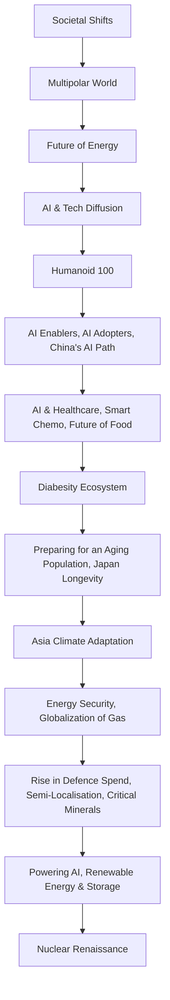

你是麦肯锡/投研风格的微信公众号财经文章主笔，擅长用金字塔原理把研报内容转化为“有主张、有层次、有洞察、但仍保留完整报告阅读欲望”的长文。

【目标】
- 基于下面的研报解析内容，写一篇微信公众号文章 Markdown。
- 风格：稳重、专业、克制、有洞察，像咨询公司合伙人写给高净值读者/产业决策者的研报导读。
- 长度：约 3000 字，允许上下浮动 15%。
- 不要使用 emoji。
- 可以基于报告内容做适度发散，但必须是从原文逻辑推出的判断，不要编造数据、公司动作或引用。
- 不要把研报所有正文内容讲完，要留下明确但自然的伏笔，让读者愿意加入社群阅读完整报告。

【金字塔原理写作原则】
1. 结论先行：文章开头先回答“这份报告最值得看的判断是什么”，而不是介绍背景。
2. 统领思想：全文只能服务一个主判断，避免变成摘要合集。
3. 纵向回答：每一层都要回答上一层提出的“为什么”或“所以呢”。
4. 横向 MECE：每个一级小节必须彼此独立、共同支撑主判断，避免重叠。
5. Synthesis over summary：不要复述报告段落，要提炼“这些事实合在一起意味着什么”。
6. So what：每个小节末尾必须落到对行业、公司、竞争格局、资产定价或读者观察框架的含义。
7. Action title：所有 `##` 小标题必须是“直接讲述洞察的完整句子”，不能是目录标签。

【标题与小标题硬性要求】
- `# 标题` 必须直接表达一个判断，例如“市场真正低估的不是需求，而是供给侧的再定价”。
- 禁止使用以下机械标题：
  - 一、核心判断
  - 二、真正重要的是结构性变量
  - 三、报告没有说透
  - 四、对读者的启发
  - 关键变化
  - 投资启示
  - 总结
- 所有 `##` 标题都要像麦肯锡报告里的 action title：读完标题就知道这一节结论。
- 小标题可以带序号，但序号后必须是一句洞察，例如：`## 1. 这轮变化真正考验的是企业能否把规模转化为议价权`。

【建议结构，但不要机械照抄标题】
1. `# 标题`：一句主判断，不超过 32 字。
2. 开头 4-6 段：直接给出主判断、为什么现在重要、报告提供了什么新信号。
3. 4-6 个 `##` 小节：每个小节标题都是洞察句，不是栏目名。
4. 至少一个小节讨论“报告尚未完全回答的关键问题”，但标题也要是洞察句。
5. 至少一个小节给出读者的观察框架，但不要命名为“对读者的启发”。
6. 文末自然承接未解问题，引导读者加入社群/微信群继续讨论。不要照抄固定话术，请基于本文未解问题每次重新写一段自然 CTA；语义可以参考：欢迎来星球微信群里继续讨论。
7. 在免责声明前，单独插入这张图片链接：``
8. 结尾只输出英文灰色免责声明：`
Personal reading notes and learning share only. Not investment advice.
`

【hook 要求】
- 不要硬插“加入社群”。
- hook 应该来自正文自然出现的未解问题，比如：关键假设尚未验证、竞争优势仍需拆解、图表背后的二阶影响没有展开。
- 文末 CTA 要像“顺着这些未解问题继续读完整报告/继续讨论”，不是广告口吻。
- CTA 必须每篇重新写，不能固定输出“加入社群，领取完整研报解读与原始图表”。可以类似“欢迎来星球微信群里继续讨论”。

【图片要求】
- 不要主动生成 MinerU 图片 markdown；系统会在文章生成后自动插入 MinerU 原始图片。
- 但文末免责声明前必须保留知识星球图片：``。

【内容边界】
- 只能基于研报原文和解析结果推导，不要编造数据、公司动作、引用。
- 遇到不确定内容，要用“这里仍需验证”“报告没有完全展开”等表达。
- 避免“震惊”“爆款”“一文看懂”等浮夸表达。
- 不要出现小红书话题标签。
- 不要出现 emoji。
- 默认避免出现具体投行品牌名，比如“GS”“GS”，统一写作“投行研报”。
- 不要解释你的思考过程，不要输出多余说明。

【研报解析内容】
"""
May 17, 2026 10:27 PM GMT

# Asia Thematic Strategy | Asia Pacific

# Investor Presentation: Playing Asia's Investment Super-Cycle and Competitive Reinvention

The competitive reinvention of Asia and global thematic drivers have set up an investment super-cycle across AI Infra, Energy/Economic Security and Defence. We continue to prefer upstream sectors and Financials vs. consumer/services, but highlight potential opportunities to broaden out from Compute.

Asia and EM equities provide an array of thematic opportunities, with strongest concentrations in Japan, Korea and Taiwan, underpinned by a broadening reform agenda that also includes Singapore and China.

A super-cycle of investment in Security (Energy, Economic and Military) and AI Compute are driving a strong outlook for the Industrials, Materials and Energy sectors, while we expect Consumer/Services to lag.

Across Economic Exposure Groups, we note that Commodities have lagged and are UW-positioned versus Compute and Capital Goods, presenting opportunities for broadening exposure beyond Tech.

Our Focus Lists are concentrated in capital goods players across Renewable Energy and ESS, Semi Localization, AI Compute Infrastructure, Defence and Electrical Equipment.

MS ASIA (SINGAPORE) PTE.+

# Daniel K Blake

Equity Strategist

Daniel.Blake@morganstanley.com +65 6834-6597

# Kristal Ji

Equity Strategist

Kristal.Ji@morganstanley.com +65 6834-6949

MS ASIA LIMITED+

# Ehsernta Fu

Equity Strategist

Ehsernta.Fu@morganstanley.com +852 3963-3711

MS ASIA (SINGAPORE) PTE.+

# Jonathan F Garner

Equity Strategist

Jonathan.Garner@morganstanley.com +65 6834-8172

MS & CO. LLC

# Stephen C Byrd

Equity Analyst

Stephen.Byrd@morganstanley.com +1 212 761-3865

MS does and seeks to do business with companies covered in MS. As a result, investors should be aware that the firm may have a conflict of interest that could affect the objectivity of MS. Investors should consider MS as only a single factor in making their investment decision.

# For analyst certification and other important disclosures, refer to the Disclosure Section, located at the end of this report.

+= Analysts employed by non-U.S. affiliates are not registered with FINRA, may not be associated persons of the member and may not be subject to FINRA restrictions on communications with a subject company, public appearances and trading securities held by a research analyst account.

Asia's Competitive Reinvention – MS's Core Themes Are Driving Transformation and Thematic Opportunity   

flowchart

# Asia's Capital Market and Governance Reforms

• Japan ROE & Productivity Journey

• China Anti-Involution Initiative

• New India and IndiaStack

• Korea Reform Renaissance

• Singapore Capital Market Reforms

• Asia Financial Acceleration

Mapping Out MS's Four Global Themes and Investible Sub-Themes 

<table><tr><td>Multipolar World (MSRSTMPW)</td><td>AI &amp; Tech Diffusion (MSRSTATD)</td><td>Future of Energy (MSRSTFOE)</td><td>Societal Shifts (MSRSTLGT)</td></tr><tr><td>The Rise in Defense Spending (MSRSTDFN)</td><td>AI Enablers (MSRSTAIE)</td><td>Powering AI (MSRSTPAI)</td><td>Diabesity Ecosystem (MSRSTDSE)</td></tr><tr><td>Semiconductor Localization (MSRSTASR)</td><td>AI Adopters (MSRSTAIA)</td><td>Nuclear Renaissance (MSRSTNUC)</td><td>AI &amp; Health Care (MSRSTAIH)</td></tr><tr><td rowspan="6">Critical Minerals (MSRSTCRM)</td><td>AI Infrastructure (MSRSTAII)</td><td>Europe&#x27;s &#x27;Low Decarb Diet&#x27; (MSRSTELC)</td><td>Smart Chemo (MSRSTSMC)</td></tr><tr><td>Humanoids (MSRSTHUM)</td><td>Power Grid Growth &amp; Evolution (MSRSTPGE)</td><td>Preparing for an Aging Pop&#x27;n (MSRSTPAP)</td></tr><tr><td>China&#x27;s AI Path</td><td>Clean Energy &amp; Storage (MSRSTEST)</td><td>Japan Longevity (MSRSTJPL)</td></tr><tr><td>China&#x27;s Emerging Frontiers</td><td>Energy Security (MSRSTENS)</td><td>Future of Food &amp; Beverages (MSRSTFFB)</td></tr><tr><td>Asia AI Adoption Leaders</td><td>Globalization of Natural Gas (MSRSTGNS)</td><td>AI Job Displacement &amp; Re-Skilling</td></tr><tr><td></td><td>Asia Climate Adaptation</td><td></td></tr></table>

Source: MS.

# Global Thematic Equity Exposure – Assessing Relative Breadth across Regions/Markets

Thematic Exposure by Region – North America has significant exposure to AI & Tech Diffusion   

pie

| Region | Category | Percentage (%) |
| :--- | :--- | :--- |
| North America | AI & Tech Diffusion | 55 |
| North America | Multipolar World | 27 |
| North America | Future of Energy | 16 |
| North America | Societal Shifts | 8 |
| North America | Not Thematic | 27 |
| Europe | AI & Tech Diffusion | 26 |
| Europe | Multipolar World | 4 |
| Europe | Future of Energy | 5 |
| Europe | Societal Shifts | 10 |
| Europe | Not Thematic | 46 |
Asia/EM | AI & Tech Diffusion | 57 |
| Asia/EM | Future of Energy | 16 |
| Asia/EM | Societal Shifts | 6 |
| Asia/EM | Not Thematic | 27 |

Source: MS. Note: Stocks mapped to multiple themes have a pro-rated share assigned to each

Thematic Exposure in Asia Pacific – Japan, Taiwan and Korea have the highest concentration of opportunity   

bar_stacked

| Region       | AI & Tech Diffusion | Multipolar World | Future of Energy | Societal Shifts | Not Thematic |
| ------------ | ------------------- | ---------------- | ---------------- | --------------- | ------------ |
| Japan        | 36%                 | 1%               | 4%               | 8%              | 27%          |
| Taiwan/Korea | 57%                 | 1%               | 6%               | 8%              | 26%          |
| China/HK     | 24%                 | 3%               | 6%               | 4%              | 61%          |
| India        | 20%                 | 15%              | 17%              | 1%              | 61%          |
| Australia    | 15%                 | 19%              | 8%               | 1%              | 64%          |
| ASEAN        | 51%                 | 21%              | 6%               | 3%              | 64%          |

Source: MS; Note stocks mapped to multiple themes have a pro-rated share assigned to each. We include Corporate Reform sub-themes in Asia/EM

# MSCI Index Breakdown by Economic Exposure – Thematic Forces Driving Major Shifts

pie

| Region | Segment 1 (%) | Segment 2 (%) | Segment 3 (%) | Segment 4 (%) | Segment 5 (%) | Segment 6 (%) | Segment 7 (%) | Segment 8 (%) | Segment 9 (%) | Segment 10 (%) |
| :--- | :--- | :--- | :--- | :--- | :--- | :--- | :--- | :--- | :--- | :--- |
| US | 6 | 25 | 13 | 9 | 4 | 4 | 5 | 6 | 16 | 17 |
| Europe | 25 | 18 | 17 | 10 | 8 | 6 | 9 | 10 | 14 | 15 |
| Japan | 13 | 17 | 17 | 10 | 8 | 6 | 9 | 10 | 13 | 14 |
| EM | 33 | 18 | 18 | 10 | 8 | 6 | 9 | 10 | 14 | 15 |
The chart displays the proportional distribution of these categories within a ring divided into three parts (top, middle, bottom). The legend identifies each segment by color and represents the category (Compute, Real Assets, Commodities, Capital Goods, Consumer Goods, Banks, Heavy Services, Light Services). The values in parentheses are explicitly labeled on the segments.

Source: Factset, MS Data as of April 2026.

Thematic forces are driving major shifts across the underlying economic exposure of companies, driving index shifts.

Our Economic Exposure breakdown highlights the following relative concentrations:

<table><tr><td>Region</td><td>Skewed to</td><td>Less Exposed to</td></tr><tr><td>US</td><td>Compute, Light Services</td><td>Banks</td></tr><tr><td>Europe</td><td>Commodities, Cap Goods, Heavy Services</td><td>Compute</td></tr><tr><td>Japan</td><td>Cap Goods, Heavy Services, Consumer Gds</td><td>-</td></tr><tr><td>EM</td><td>Compute, Commodities</td><td>Capital Goods, Light Services</td></tr></table>

# Assessing the Valuation, Profitability and Growth of Thematic Groups

Asia-EM Economic Exposure Categories Valuation vs. Prospective EPS growth – Compute priced for strong growth, while Commodities may be overlooked

scatter

| Category        | 3yr EPS CAGR | 12mf PE Ratio |
| --------------- | ------------ | ------------- |
| Banks           | 7.5%         | 9.5%          |
| Light Services  | 11.5%        | 16.0%         |
| Heavy Services  | 12.0%        | 17.0%         |
| Real Assets     | 12.5%        | 16.0%         |
| Commodities     | 17.0%        | 14.0%         |
| Consumer Goods  | 20.0%        | 17.0%         |
| Compute         | 29.5%        | 28.0%         |
| Capital Goods   | 7.5%         | 23.5%         |

Source: FactSet, MS; Data as of 7 May 2026

Asia-EM P/B vs. Trailing ROE – Comparison vs. end-2022, showing strong uplift in profitability for Capital Goods, Commodities, Banks and Light Services

line

| Category        | ROE (%) | P/B Ratio (NTM) |
| --------------- | ------- | --------------- |
| Real Assets     | 11.3    | 1.7             |
| Banks           | 12.5    | 1.2             |
| Heavy Services  | 13.7    | 2.1             |
| Commodities    | 16.5    | 2.1             |
| Light Services  | 15.8    | 2.4             |
| Consumer Goods  | 16.2    | 2.5             |
| Capital Goods   | 15.9    | 3.5             |
| Compute         | 16.0    | 3.7             |

Source: FactSet, MS; Data as of 7 May 2026

Japan — PM Takaichi's 17 Strategic Domains Converge into a Set of Concepts   

sankey

| Category                  | Sub-category                          | Value (themes) |
|---------------------------|-------------------------------------|----------------|
| Multipolar World          | Economic Security & Supply Chain Resilience | 10             |
| Multipolar World          | AI Deployment & Compute Revolution       | 31             |
| Multipolar World          | Digital Society & IP Economy           | 19             |
| Tech Diffusion            | Advanced Science & Life Sciences        | 43             |
| Tech Diffusion            | Energy Security & Decarbonization      | 50             |
| Societal Shifts          | Advanced Science & Life Sciences        | 75             |
| Societal Shifts          | Energy Security & Decarbonization      | 85             |
| Future of Energy         | Infrastructure Renewal & Resilience    | 48             |
| Multiple Entities         | Shipbuilding                        | 10             |
| Multiple Entities         | Defense & Space                    | 31             |
| Multiple Entities         | Cybersecurity                       | 29             |
| Multiple Entities         | Advanced Materials & Critical Minerals | 84             |
| Multiple Entities         | Robotics & Industrial Automation     | 78             |
| Multiple Entities         | Quantum Technologies                | 35             |
| Multiple Entities         | AI Infrastructure & Advanced Semiconductors | 119            |
| Multiple Entities         | Content & IP Economy                 | 75             |
| Multiple Entities         | Drug Discovery & Advanced Healthcare   | 43             |
| Multiple Entities         | Bio & Food Science                 | 50             |
| Multiple Entities         | Next-Gen Power & Grid Infrastructure    | 85             |
| Multiple Entities         | Clean Fuels & Carbon Management       | 50             |
| Multiple Entities         | Next-Gen Communications Infrastructure | 43             |
| Multiple Entities         | Disaster Prevention & National Resilience | 68             |
| Multiple Entities         | Ocean Infrastructure                | 13             |
| Multiple Entities         | Ports & Logistics Infrastructure      | 48             |

Note: MS's four Big Themes are defined as the top-level investment concepts (L0). L1 comprises six investment narratives derived from L0. L2 is defined as the 17 strategic domains under the Takaichi administration (Defense and Space" are consolidated into single category. "Energy security and GX" are split into "Next-Gen Power & Grid Infra" and "Clean Fuels & Carbon Management," with fusion energy included in the former. Robotics is treated as a standalone theme.). L3 contains L4, the stock-selection categories. The universe is Prime-listed companies plus Astroscale.   
Source: MS

Asia and Global Thematic Valuations and Growth Outlook – China's AI Path, Asia AI Adoption Leaders and Korea Reform Trading at More Attractive Forward PEG Ratios   
  
Source: Factset, IBES Consensus, MS, Data as of May 7, 2026.

MS Asia Pacific Thematic Focus List – Highest Conviction Opportunities 

<table><tr><td rowspan="2">Ticker</td><td rowspan="2">Company Name</td><td rowspan="2">Industry Group</td><td rowspan="2">Analyst</td><td rowspan="2">Market</td><td rowspan="2">MC US$bn</td><td rowspan="2">Last Price (LCY)</td><td rowspan="2">Upside to Base</td><td rowspan="2">Upside to Bull</td><td rowspan="2">Bull / Bear</td><td rowspan="2">AI &amp; Tech Diffusion</td><td colspan="3">Thematic Materiality</td></tr><tr><td>Multipolar World</td><td>Future of Energy</td><td>Societal Shifts</td></tr><tr><td>2330.TW</td><td>TSMC</td><td>Semiconductors</td><td>Chan, Charlie</td><td>Taiwan</td><td>1851.3</td><td>2235.0</td><td>16%</td><td>40%</td><td>1.09</td><td>Core</td><td>Signif.</td><td>Signif.</td><td></td></tr><tr><td>005930.KS</td><td>Samsung Electronics</td><td>Tech. Hardware &amp; Equipment</td><td>Kim, Shawn</td><td>S. Korea</td><td>1398.5</td><td>285500.0</td><td>33%</td><td>51%</td><td>0.87</td><td>Core</td><td>Signif.</td><td>Core</td><td>Moderate</td></tr><tr><td>0700.HK</td><td>Tencent Holdings Ltd.</td><td>Media &amp; Entertainment</td><td>Yu, Gary</td><td>China</td><td>550.5</td><td>464.4</td><td>40%</td><td>72%</td><td>-21.51</td><td>Core</td><td></td><td></td><td></td></tr><tr><td>300750.SZ</td><td>Contemporary Amperex Technology Co. Ltd.</td><td>Capital Goods</td><td>Lu, Jack</td><td>China</td><td>314.2</td><td>446.1</td><td>33%</td><td>51%</td><td>1.11</td><td>Signif.</td><td></td><td>Core</td><td></td></tr><tr><td>2308.TW</td><td>Delta Electronics Inc.</td><td>Tech. Hardware &amp; Equipment</td><td>Shih, Sharon</td><td>Taiwan</td><td>186.3</td><td>2245.0</td><td>20%</td><td>47%</td><td>1.14</td><td>Core</td><td>Signif.</td><td>Core</td><td></td></tr><tr><td>1299.HK</td><td>AIA Group Ltd</td><td>Insurance</td><td>Xu, Richard</td><td>Hong Kong</td><td>116.9</td><td>86.6</td><td>26%</td><td>51%</td><td>1.67</td><td>Signif.</td><td></td><td></td><td>Core</td></tr><tr><td>7011.T</td><td>Mitsubishi Heavy Industries</td><td>Capital Goods</td><td>Kitaura, Takeshi</td><td>Japan</td><td>94.0</td><td>4384.0</td><td>25%</td><td>67%</td><td>10.27</td><td>Signif.</td><td>Core</td><td>Core</td><td></td></tr><tr><td>002371.SZ</td><td>NAURA Technology Group Co Ltd</td><td>Semiconductors</td><td>Chan, Charlie</td><td>China</td><td>61.1</td><td>573.2</td><td>5%</td><td>48%</td><td>1.17</td><td>Signif.</td><td>Signif.</td><td></td><td></td></tr><tr><td>LART.NS</td><td>Larsen &amp; Toubro Ltd</td><td>Capital Goods</td><td>Achhipalia, Girish</td><td>India</td><td>57.9</td><td>3974.5</td><td>25%</td><td>72%</td><td>3.31</td><td></td><td>Signif.</td><td>Signif.</td><td></td></tr><tr><td>034020.KS</td><td>Doosan Enerbility</td><td>Capital Goods</td><td>Choi, Heewon</td><td>S. Korea</td><td>56.1</td><td>128000.0</td><td>-14%</td><td>21%</td><td>0.34</td><td>Signif.</td><td>Signif.</td><td>Core</td><td></td></tr><tr><td>2359.HK</td><td>WuXi AppTec Co Ltd</td><td>Pharma, Biotech &amp; Life Sciences</td><td>Tam, Laurence</td><td>China</td><td>46.8</td><td>138.1</td><td>12%</td><td>52%</td><td>0.82</td><td>Moderate</td><td>Signif.</td><td></td><td>Core</td></tr><tr><td>012450.KS</td><td>Hanwha Aerospace</td><td>Capital Goods</td><td>Seok, Joon</td><td>S. Korea</td><td>45.7</td><td>1315000.0</td><td>37%</td><td>67%</td><td>4.12</td><td></td><td>Signif.</td><td></td><td></td></tr><tr><td>6954.T</td><td>Fanuc</td><td>Capital Goods</td><td>Jiang, Lisa</td><td>Japan</td><td>45.1</td><td>7564.0</td><td>-7%</td><td>19%</td><td>0.39</td><td>Moderate</td><td>Signif.</td><td></td><td></td></tr><tr><td>267260.KS</td><td>HD Hyundai Electric Co Ltd</td><td>Capital Goods</td><td>Kim, Ryan</td><td>S. Korea</td><td>33.6</td><td>1362000.0</td><td>10%</td><td>32%</td><td>0.69</td><td>Signif.</td><td></td><td>Signif.</td><td></td></tr><tr><td>300124.SZ</td><td>Shenzhen Inovance Technology</td><td>Capital Goods</td><td>Zhong, Sheng</td><td>China</td><td>30.7</td><td>77.5</td><td>23%</td><td>68%</td><td>1.91</td><td>Core</td><td>Core</td><td>Moderate</td><td></td></tr><tr><td>6669.TW</td><td>Wiwynn Corp</td><td>Tech. Hardware &amp; Equipment</td><td>Kao, Howard</td><td>Taiwan</td><td>28.9</td><td>5340.0</td><td>40%</td><td>79%</td><td>4.43</td><td>Core</td><td></td><td></td><td></td></tr><tr><td>GULF.BK</td><td>Gulf Development PCL</td><td>Utilities</td><td>Maheshwari, Mayank</td><td>Thailand</td><td>27.3</td><td

[中间内容因长度限制已省略]

y the duly qualified research analysts; in Canada by MS Canada Limited; in Germany and the European Economic Area where required by MS Europe S.E., authorised and regulated by Bundesanstalt fuer Finanzdienstleistungsaufsicht (BaFin) under the reference number 149169; in the US by MS & Co. LLC, which accepts responsibility for its contents. MS & Co. International plc, authorized by the Prudential Regulation Authority and regulated by the Financial Conduct Authority and the Prudential Regulation Authority, disseminates in the UK research that it has prepared, and research which has been prepared by any of its affiliates, only to persons who (i) are investment professionals falling within Article 19(5) of the Financial Services and Markets Act 2000 (Financial Promotion) Order 2005 (as amended, the "Order"); (ii) are persons who are high net worth entities falling within Article 49(2)(a) to (d) of the Order; or (iii) are persons to whom an invitation or inducement to engage in investment activity (within the meaning of section 21 of the Financial Services and Markets Act 2000, as amended) may otherwise lawfully be communicated or caused to be communicated. RMB MS Proprietary Limited is a member of the JSE Limited and A2X (Pty) Ltd. RMB MS Proprietary Limited is a joint venture owned equally by MS International Holdings Inc. and RMB Investment Advisory (Proprietary) Limited, which is wholly owned by FirstRand Limited. The information in MS is being disseminated by MS Saudi Arabia, regulated by the Capital Market Authority in the Kingdom of Saudi Arabia, and is directed at Sophisticated investors only.

MS Hong Kong Securities Limited is the liquidity provider/market maker for securities of AIA Group Ltd, Contemporary Amperex Technology Co. Ltd., Tencent Holdings Ltd., WeiChai Power, WuXi AppTec Co Ltd listed on the Stock Exchange of Hong Kong Limited. An updated list can be found on HKEx website: http://www.hkex.com.hk.

The information in MS is being communicated by MS & Co. International plc (DIFC Branch), regulated by the Dubai Financial Services Authority (the DFSA) or by MS & Co. International plc (ADGM Branch), regulated by the Financial Services Regulatory Authority Abu Dhabi (the FSRA), and is directed at Professional Clients only, as defined by the DFSA or the FSRA, respectively. The financial products or financial services to which this research relates will only be made available to a customer who we are satisfied meets the regulatory criteria of a Professional Client. A distribution of the different MS Research ratings or recommendations, in percentage terms for Investments in each sector covered, is available upon request from your sales representative.

The information in MS is being communicated by MS & Co. International plc (QFC Branch), regulated by the Qatar Financial Centre Regulatory Authority (the QFCRA), and is directed at business customers and market counterparties only and is not intended for Retail Customers as defined by the QFCRA.

As required by the Capital Markets Board of Turkey, investment information, comments and recommendations stated here, are not within the scope of investment advisory activity. Investment advisory service is provided exclusively to persons based on their risk and income preferences by the authorized firms. Comments and recommendations stated here are general in nature. These opinions may not fit to your financial status, risk and return preferences. For this reason, to make an investment decision by relying solely to this information stated here may not bring about outcomes that fit your expectations.

The following companies do business in countries which are generally subject to comprehensive sanctions programs administered or enforced by the U.S. Department of the Treasury's Office of Foreign Assets Control ("OFAC") and by other countries and multi-national bodies: Samsung Electronics.

The trademarks and service marks contained in MS are the property of their respective owners. Third-party data providers make no warranties or representations relating to the accuracy, completeness, or timeliness of the data they provide and shall not have liability for any damages relating to such data. The Global Industry Classification Standard (GICS) was developed by and is the exclusive property of MSCI and S&P.

MS, or any portion thereof may not be reprinted, sold or redistributed without the written consent of MS.

Indicators and trackers referenced in MS may not be used as, or treated as, a benchmark under Regulation EU 2016/1011, or any other similar framework.

The issuers and/or fixed income products recommended or discussed in certain fixed income research reports may not be continuously followed. Accordingly, investors should regard those fixed income research reports as providing stand-alone analysis and should not expect continuing analysis or additional reports relating to such issuers and/or individual fixed income products. MS may hold, from time to time, material financial and commercial interests regarding the company subject to the Research report.

Registration granted by SEBI and certification from the National Institute of Securities Markets (NISM) in no way guarantee performance of the intermediary or provide any assurance of returns to investors. Investment in securities market are subject to market risks. Read all the related documents carefully before investing.
"""
