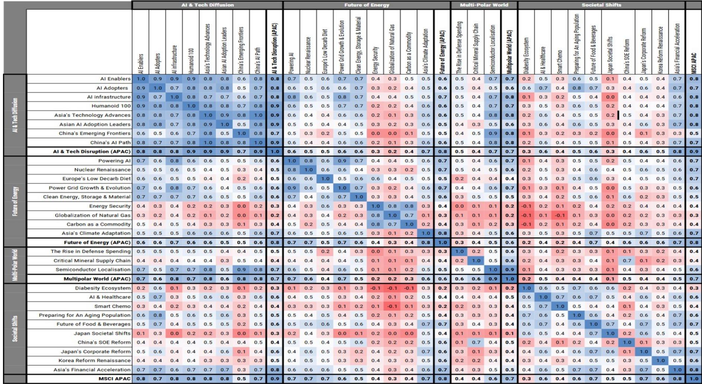
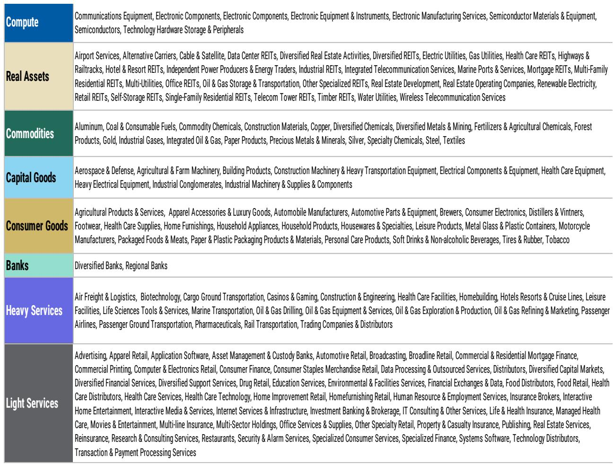
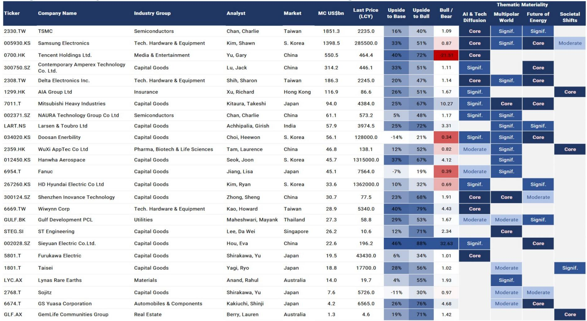

# 市场真正低估的不是需求，而是供给侧的再定价

亚洲正在经历一场被多数投资者低估的结构性转变。这轮转变的核心，不是AI需求爆发，不是地缘政治扰动，也不是消费复苏——尽管这些因素都在发挥作用。真正值得关注的，是亚洲经济体在供给端完成的系统性重塑：从资本市场监管改革到产业政策重组，从能源安全到国防支出，从半导体本地化到企业治理提升。

某外资投行近期发布的亚洲主题策略报告，将这一现象定义为“亚洲的竞争性再造”（Competitive Reinvention），并在此基础上提出了一个清晰的投资框架：亚洲正进入一个由安全（能源、经济、军事）和AI算力共同驱动的投资超级周期。报告的核心判断是，上游行业和金融板块将持续跑赢消费和服务，但更值得关注的信号是，投资机会正在从算力领域向外扩散。

这份报告的价值不在于罗列了多少主题，而在于它揭示了一个关键事实：市场对亚洲的定价，仍然停留在需求侧叙事中，而真正驱动资产定价变化的，是供给侧的再定价。

## 1. 亚洲投资超级周期的驱动力并非单一，而是三重安全逻辑的叠加

理解这轮周期的起点，必须回到一个基本问题：为什么是现在？报告给出了一个清晰的框架——三个“安全”维度的交汇。

第一是能源安全。全球能源转型的加速与传统能源供给的刚性约束，使得亚洲各国不得不重新审视能源结构。可再生能源、储能、电网升级不再是ESG议题，而是国家安全议题。报告将“Powering AI”和“Renewable Energy & Storage”列为独立子主题，意味着能源基础设施的投资逻辑已经从“绿色溢价”转向“安全溢价”。

第二是经济安全。半导体本地化、关键矿产供应链重构、制造业回流——这些概念在过去几年被反复讨论，但报告明确指出，亚洲正在从“被动应对”转向“主动布局”。日本首相石破茂提出的17个战略领域，从AI基础设施到量子技术，从生物科学到海洋基础设施，本质上是在构建一套经济安全体系。韩国、台湾、新加坡的资本市场改革，则是从金融层面支撑这一体系。

第三是军事安全。亚洲国防支出的上升趋势已经不可逆。报告将国防支出列为“多极世界”主题下的核心子主题，并在重点推荐列表中包含了多家国防相关企业。但值得注意的是，报告没有简单地把国防支出等同于军工股——它更强调的是国防支出对整个资本品板块的拉动效应。

这三个安全逻辑并非独立运行，而是相互强化。能源安全需要电网升级，电网升级需要半导体和资本品；经济安全需要AI算力基础设施，AI算力需要能源供给；军事安全需要先进制造能力，先进制造又与半导体本地化高度重合。这种交叉关系，使得这轮周期的广度和持续性可能超出市场预期。

## 2. 投资机会正在从算力向外扩散，而市场尚未充分定价这一变化

报告最引人注目的判断，不是AI算力主题本身，而是“投资机会正在从算力向外扩散”。这一判断基于一组关键数据：在亚洲新兴市场的经济敞口分类中，大宗商品板块（Commodities）相对于算力（Compute）和资本品（Capital Goods）处于低配状态，但其盈利增长前景并不差。

具体来看，报告提供的估值与盈利增长对比图显示，大宗商品板块的三年EPS复合增长率约为17%，12个月前瞻市盈率约为14倍；而算力板块的EPS增长率约为29%，市盈率却高达28倍。换句话说，大宗商品的盈利增长与估值的匹配度，比算力板块更具吸引力。资本品板块的情况更为极端：EPS增长率仅为7.5%，市盈率却达到23.5倍——这显然反映了市场对资本品长期需求的乐观预期，但短期盈利增长尚未兑现。

这意味着什么？如果安全驱动的投资超级周期持续，大宗商品和资本品的盈利增长有望加速，而当前市场对这些板块的定价仍然偏保守。报告明确表示，“大宗商品落后于算力和资本品，这提供了拓宽科技以外敞口的机会”。

但这里有一个需要谨慎对待的问题：大宗商品的盈利增长能否持续？报告没有给出明确的答案。大宗商品价格的波动性、全球经济增长的不确定性、以及能源转型对不同商品需求的分化影响，都可能对盈利增长构成挑战。这恰恰是订阅社群的讨论价值所在——我们需要持续跟踪这些假设的验证过程。

## 3. 日本是亚洲主题投资密度最高的市场，但中国的结构性机会被低估

从报告提供的主题敞口分布来看，日本是亚洲主题投资密度最高的市场——扣除非主题部分后，日本市场的主题敞口主要集中在AI与科技扩散（36%）和未来能源（8%）。台湾和韩国紧随其后，AI与科技扩散敞口高达57%。中国的主题敞口相对分散，AI与科技扩散为24%，但“非主题”部分占比高达61%。

这个数据容易让人产生一个误解：中国在亚洲投资超级周期中的参与度有限。但报告随后提供的“中国AI路径”和“亚洲AI应用领导者”两个子主题，给出了不同的信号。报告将“China’s AI Path”列为独立的可投资子主题，并在重点推荐列表中包含了多家中国企业——从宁德时代到汇川技术，从北方华创到药明康德。

更值得关注的是，报告在估值与增长对比图中明确指出，“中国AI路径、亚洲AI应用领导者和韩国改革主题的远期PEG比率更具吸引力”。这意味着，尽管中国在整体主题敞口上不如日本和台湾集中，但部分子主题的估值性价比反而更高。

这里有一个关键问题报告没有完全展开：中国在AI算力基础设施领域的参与度，是否会受到地缘政治因素的制约？半导体本地化主题对中国企业的含义，与对台湾和韩国企业的含义有何不同？这些问题的答案，将直接影响中国相关主题的投资逻辑和估值上限。

## 4. 资本市场改革是亚洲投资超级周期的金融基础设施

报告在开头就列出了亚洲的资本市场与治理改革议程：日本的ROE与生产力提升、中国的“反内卷”倡议、新印度与IndiaStack、韩国改革复兴、新加坡资本市场改革、亚洲金融加速。这些改革看似分散，实则构成了一幅完整的图景：亚洲各国正在通过制度变革，为投资超级周期提供金融基础设施。

ROE提升意味着企业治理改善，企业治理改善意味着资本配置效率提升，资本配置效率提升意味着更高的股东回报。韩国改革复兴和日本ROE提升的逻辑类似，都是通过改善企业治理来释放估值溢价。新加坡资本市场改革则聚焦于提升市场流动性。中国的“反内卷”倡议，本质上是在引导企业从规模竞争转向价值竞争。

这些改革对投资的影响是双重的。直接层面，改革主题本身提供了投资机会——报告将“韩国改革”列为PEG比率更具吸引力的子主题之一。间接层面，改革改善了资本市场的运行效率，使得主题投资的定价机制更加有效。

但报告没有回答的一个问题是：这些改革能否真正落地？历史经验表明，亚洲的资本市场改革往往面临执行层面的挑战。日本的企业治理改革已经推进多年，ROE提升的效果在不同行业之间存在显著差异。中国的“反内卷”倡议能否从政策导向转化为企业行为，仍有待观察。这些不确定性，恰恰是需要持续跟踪的关键变量。

## 5. 报告尚未完全回答的关键问题：这轮超级周期的可持续性

尽管报告构建了一个逻辑严密的分析框架，但有几个关键问题尚未得到充分回答。

第一，这轮投资超级周期的资金从何而来？报告提到了国防支出、能源投资、AI基础设施投资，但没有详细讨论这些投资的资金来源。政府财政、企业资本开支、还是外部融资？不同资金来源的可持续性差异很大。

第二，消费和服务板块的滞后是否意味着结构性变化？报告明确预期消费和服务板块将跑输，但这是周期性的还是结构性的？如果亚洲各国通过改革提升了居民收入，消费板块是否会在某个时点重新获得吸引力？

第三，AI算力投资的回报期有多长？当前市场对算力板块的定价隐含了极高的增长预期，但AI基础设施的投资回报周期存在很大的不确定性。如果回报低于预期，算力板块的估值将面临修正风险。

这些问题报告没有完全展开，但它们恰恰是判断这轮超级周期可持续性的关键。对于产业决策者和投资者而言，与其追逐已经充分定价的主题，不如深入理解这些尚未被充分讨论的变量。

## 6. 一个可供参考的观察框架：从“主题敞口”到“经济敞口”再到“估值匹配度”

报告提供的分析工具中，最有价值的不只是主题分类，而是“经济敞口”分析框架。它将企业按经济敞口分为计算、大宗商品、资本品、银行、消费品、重服务、轻服务等类别，并据此评估不同市场的相对优势。

这个框架的价值在于，它帮助投资者超越主题标签，回到企业实际经营的基本面。一家公司可能被贴上“AI”主题标签，但如果它的经济敞口是资本品而非计算，那么它的盈利驱动因素和估值逻辑就会完全不同。

结合这个框架，一个可行的操作思路是：先确定自己关注的宏观经济情景（比如安全驱动、能源转型、AI渗透），然后找到对应经济敞口最受益的板块，最后在这些板块中筛选估值与盈利增长匹配度最高的标的。

报告提供的数据显示，当前亚洲新兴市场中，大宗商品板块的估值与盈利增长匹配度最高，资本品板块的估值隐含了较高的增长预期但尚未兑现，算力板块的估值已经充分反映了增长预期。这意味着，如果投资者相信安全驱动的投资超级周期将持续，大宗商品板块可能提供更好的风险收益比；如果投资者对增长预期持谨慎态度，那么需要警惕资本品和算力板块的估值风险。

---

这轮亚洲投资超级周期才刚刚开始，但市场对它的定价已经出现了分化。有些主题被充分定价，有些被低估，有些则被完全忽略。对于希望深入理解这些差异、跟踪关键假设验证过程的读者，我们欢迎来星球微信群里继续讨论。在那里，我们将持续分享对报告的完整解读、关键图表的原始数据、以及对未解问题的跟踪分析。

Personal reading notes and learning share only. Not investment advice.

