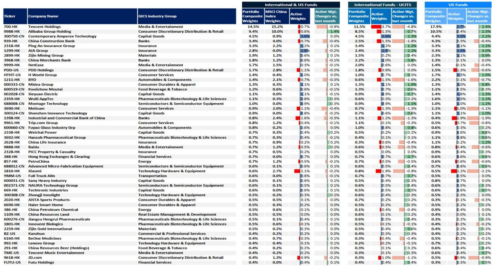
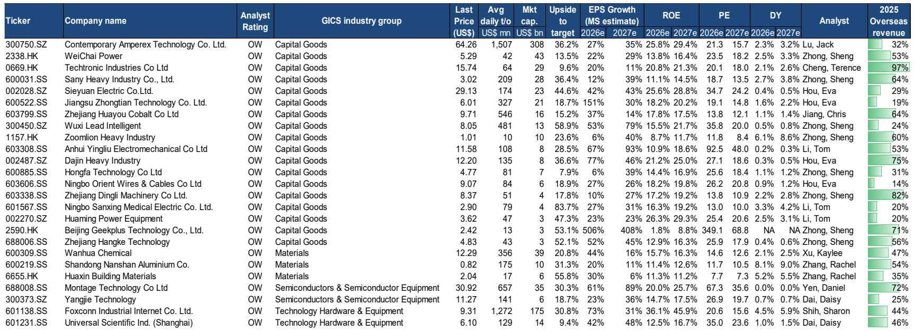
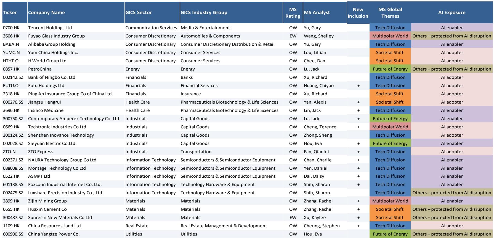

# 中国资产真正的叙事切换：从宏观博弈到产业兑现

过去两年，关于中国市场的讨论大多围绕一个核心焦虑展开：增长动能何时触底、政策刺激是否足够、地缘风险如何定价。这些讨论并非没有意义，但它们正在掩盖一个更本质的叙事切换——中国市场正在从“宏观驱动的贝塔博弈”转向“产业驱动的阿尔法兑现”。某外资投行最新发布的亚太策略报告，提供了一个关键的数据锚点：到2030年，中国在全球出口市场的份额可能从当前的约15%进一步上升至16.5%，而在乐观情景下甚至可达18%。这个数字之所以重要，不是因为出口本身，而是因为它揭示了一个被低估的结构性事实——中国正在成为全球AI和能源转型资本开支超级周期的核心供应链节点，而非仅仅是需求端的受益者。

这份报告的核心判断并不在于指数目标本身，而在于它提出的分析框架：中国市场的回报来源正在发生系统性切换。过去十年，MSCI中国相对新兴市场的表现，很大程度上取决于宏观周期和资金流动。但从2025年到2026年的数据来看，一个更微妙的信号已经出现——尽管MSCI中国指数整体表现平淡，但半导体、资本品、能源等与全球产业周期高度相关的板块，却在录得显著的正收益。与此同时，消费和通信服务等传统权重板块仍在承压。这意味着，指数层面的“无感”掩盖了结构层面的“分化”。真正值得关注的，不是大盘何时突破，而是哪些产业赛道正在成为新的增长极。

这份报告提供了足够的数据支撑来展开这一判断。以下是我们从中提炼出的五个核心层次，它们共同指向同一个结论：市场对中国的定价逻辑，正在从“能不能稳住”转向“哪些领域能赢”。

## 1. 出口份额的持续扩张，背后是两轮全球资本开支周期的叠加

报告明确提出，中国出口增长的两大结构性驱动力是AI超级周期和能源转型。这并非新判断，但报告提供了两个值得注意的量化视角。第一，全球半导体市场规模预计在2026年突破1万亿美元，而中国在电子集成电路领域的出口增速在过去一年内从约15%跃升至接近80%。第二，中国在全球太阳能关键制造环节的控制率超过80%，而中东地缘冲突正在加速全球对可再生能源和电力设备的需求。这两个数字合在一起，意味着中国出口的“新三样”——电动车、锂电池、太阳能电池——正在从过去的成本优势，转向技术和规模的双重壁垒。

更关键的是，报告指出中国在全球出口市场的份额自2022年以来持续扩大，这与许多投资者“供应链外迁”的直觉相悖。实际数据表明，尽管部分低端制造确实在向东南亚和印度转移，但中国在电子、新能源、资本品等中高端领域的全球竞争力仍在加强。这一趋势的隐含含义是：中国出口的“量”可能面临关税和地缘政治的压力，但“质”的升级正在为出口企业带来更高的附加值定价权。

## 2. 指数层面的“无感”表现，正掩盖一个更具活力的主题市场

报告提供了一张极具洞察力的图表：将MSCI中国各行业的指数权重与年初至今的回报率并列。数据显示，消费可选板块在指数中占比高达27.5%，但年初至今回报为负12%。通信服务占比18%，回报为负22%。而半导体板块权重仅6%，回报却高达30%。资本品权重6.5%，回报15%。这意味着，指数的整体表现被权重板块拖累，而真正创造正回报的产业主题，在指数层面的贡献被稀释了。

这种现象对投资者的启示是：用指数作为中国资产的代理变量，正在变得越来越不充分。如果你只看MSCI中国或沪深300的涨跌，你会错过半导体设备、新能源资本品、工业自动化等细分领域的独立行情。这些板块的驱动力更多来自全球产业周期和中国自身的供应链升级，而非国内宏观政策的短期变化。换句话说，中国市场的阿尔法正在从“宏观择时”转向“产业选股”。

## 3. 五年规划的执行路径，正在从政策口号转化为企业资本开支

报告回顾了中国从“十二五”到“十五五”的产业政策演变路径，并明确指出一个关键变化：从2021-2025年周期开始，政策重心从“量的增长”转向“质的增长”，具体目标包括研发支出年均增速超过7%、单位GDP二氧化碳排放累计下降18%。这些数字本身并不新鲜，但报告将其与资本开支周期的节奏联系起来，揭示了一个更重要的机制：产业政策正在通过“新质生产力”的框架，引导资本向新一代信息技术、生物技术、新能源、先进装备、半导体、机器人等方向集中。

这种政策引导并非简单的补贴驱动，而是通过市场化的产业基金、税收优惠和标准制定，形成了自我强化的投资闭环。报告没有完全展开的一点是，这一过程正在催生一批具备全球竞争力的“隐形冠军”——这些公司可能不在传统的互联网或消费赛道，而是在精密制造、材料科学、工业软件等细分领域。对于投资者而言，识别这些公司需要的不是宏观判断，而是产业深度研究。

## 4. 风险定价的偏差：市场低估了供应链韧性，高估了地缘脱钩的速度

报告在讨论中国贸易平衡时提供了一个引人深思的数据对比：2018年12月，中国对美贸易顺差约为420亿美元，而中国与对美顺差最大的五个经济体的贸易顺差总和仅为25亿美元。到2026年3月，这两个数字分别变为165亿美元和280亿美元。这一变化意味着，尽管中美直接贸易有所调整，但中国通过第三方经济体的间接出口正在快速上升。全球供应链并没有“去中国化”，而是在以更复杂的方式重新编织。

这一发现对资产定价的含义是：市场可能高估了地缘政治对供应链的破坏速度，同时低估了中国企业在全球产业链中的不可替代性。报告没有直接给出投资建议，但逻辑延伸下去，那些在海外布局产能、同时保持国内技术优势的企业，可能会在未来的贸易摩擦中具备更强的抗风险能力。这同样是一个需要自下而上筛选的阿尔法来源。

## 5. 报告尚未完全回答的关键问题：估值扩张的空间取决于什么？

报告给出了MSCI中国在2027年第二季度的目标价：基准情景下为91点（较当前约12%的上涨空间），乐观情景下为103点（约27%），悲观情景下则为55点（约32%的下行风险）。目标价的差异主要来自两个变量：盈利增速和估值倍数。在基准情景下，报告假设2026-2028年MSCI中国每股盈利增速分别为7%、10%、7%，而当前市场共识预期分别为14%、15%、13%。这意味着，报告对盈利的预测比市场共识更为保守。

这里有一个尚未被充分讨论的问题：如果盈利增长确实低于市场预期，那么指数的上涨空间将主要依赖估值扩张。而估值扩张的前提是什么？是投资者对中国资产的风险溢价重新定价。这需要三个条件：一是国内政策信号更加清晰且可预期，二是地缘风险出现阶段性缓和，三是全球流动性环境转向宽松。报告没有对这三个条件给出明确的概率判断，这正是读者需要进一步思考的方向。估值扩张不是理所当然的，它需要催化剂。

## 顺着这些未解问题继续讨论

这份报告的价值不在于给出确定的答案，而在于提供了一个新的分析框架：中国资产的回报来源正在从宏观博弈转向产业兑现。但这一框架的成立，依赖于几个尚未完全验证的假设——全球AI资本开支周期的持续性、中国出口企业能否在关税压力下守住利润率、以及估值扩张的触发条件何时出现。这些问题无法在一篇研报导读中穷尽，但它们恰恰是值得深度讨论的起点。欢迎来到知识星球微信群，与更多产业研究者一起，围绕这些未解问题继续推演和验证。

Personal reading notes and learning share only. Not investment advice.

