# Internet | North America

# How Much Capacity Will \$2 Trillion of Hyperscaler Capex Bring By '27?

Compute capacity remains the key constraint and competitive differentiator as GenAI demand and inference scale. With \$2T in total hyperscaler capex upon us, we introduce a bottom-up model for cost/GW across GPUs and custom ASICs, and the GW capacity set to come online across each hyperscaler.

The Age of Inference is Here...GenAI capabilities continue advancing and gaining adoption across the economy, with hyperscale and mega-cap AI-enabled revenue streams inflecting, hyperscale product pipelines and backlogs building, and our economics and thematics teams seeing early AI-driven productivity boosts (see here and here).

...With '27 Hyperscaler Capex Expected to Surpass \$1 Trillion and an Aggregate \~\$2 Trillion Invested Since '24...The entire ecosystem remains compute constrained...with compute capacity the regulator to the pace of GenAI advances/ adoption. We view compute capacity (in the form of GW) as an increasingly important competitive differentiator. And with aggregate hyperscaler capex from '24-'27 now expected to reach \$2 trillion : 1) How much capacity has come on and will come on? 2) Is the cost to add capacity improving, set to improve or increasing? 3) What is the outlook for component inflation? 4) How large are GPUs vs custom ASICs now? 5) How does compute cost efficiency compare between chips? 6) Which companies are forward buying or building for out years?

...As Such, we Introduce a New Bottom-up Model Dissecting These GW Builds and Hyperscaler Capacity to Come... In collaboration with our colleagues in semiconductors, IT hardware/networking, software, and thematics we publish an updated multi-year bottom-up cost per GW analysis across NVDA's GPUs and other leading custom silicon architectures (TPU, Trainium, etc.) We also estimate GW deployed and to be deployed based on chip unit estimates. Please let us know if interested in our interactive bottom-up cost per GW and GW deployment models, which we hope are instructive in better understanding the "capital" portion of GenAI "return on invested capital"...and in assessing which companies have more or less compute driven competitive advantage over time.

We also detail 4 main debates and takeaways:

Debate 1: How much capacity will the hyperscalers (AMZN, GOOGL, META, MSFT) bring online in '26/'27?

\- Our View: We see AMZN, GOOGL, META, and MSFT adding an incremental 14 GW/20 GW in '26/'27...for context, we believe AWS's total capacity added

MS & CO. LLC

# Brian Nowak, CFA

Equity Analyst

Brian.Nowak@morganstanley.com +1 212 761-3365

# Keith Weiss, CFA

Equity Analyst

Keith.Weiss@morganstanley.com +1 212 761-4149

# Josh Baer, CFA

Equity Analyst

Josh.Baer@morganstanley.com +1 212 761-4223

# Julian Herrera

Research Associate

Julian.Herrera@morganstanley.com +1 212 761-1784

# Nikhil Javeri

Research Associate

Nikhil.Javeri1@morganstanley.com +1 212 761-3742

# Mason Wayne

Research Associate

Mason.Wayne@morganstanley.com +1 212 761-6012

# Ryan Lountzis

Research Associate

Ryan.Lountzis@morganstanley.com +1 212 761-3189

# Jonathan Eisenson

Research Associate

Jonathan.Eisenson@morganstanley.com +1 212 761-2808

# Gregory Gao

Research Associate

Greg.Gao@morganstanley.com +1 212 296-3125

# Jamie Reynolds

Research Associate

Jamie.Reynolds@morganstanley.com +1 212 761-2087

# INTERNET

North America

Industry View

Attractive

MS does and seeks to do business with companies covered in MS. As a result, investors should be aware that the firm may have a conflict of interest that could affect the objectivity of MS. Investors should consider MS as only a single factor in making their investment decision.

For analyst certification and other important disclosures, refer to the Disclosure Section, located at the end of this report.

over its first \~18 years of existence (through YE24), was only \~5 GW...and 20 GW is enough to power 15 million+ US homes for a year...so capacity is coming

\- We see GOOGL (\~7 GW) again bringing on the most capacity in '27, followed by AMZN/MSFT (\~5 GW each). META's capex is only adding 3.5 GW, but when grossing up its hyperscale spend, we estimate META is really adding \~4 GW in '27.

# Debate 2: Where is the cost and compute efficiency gap between NVDA and Custom ASICs now and what are we monitoring to close that gap?

\- Our View: We estimate hyperscaler capex to build a 1 GW datacenter with current-gen NVDA GPUs (Blackwell) is up to \~2x the cost of current-gen custom ASICs (TPU, Trainium)...but compute power efficiency matters, and this is where NVDA shines...with compute performance/watt 2x-8x ahead of custom ASICs.

# Debate 3: Which hyperscalers are investing the most and least in forward year capacity yet to come on?

\- Our View: We see AMZN/MSFT/META doing the most forward purchasing/building (powered shells, land, equipment, memory, etc.) and estimate 50%+ of '26 AMZN/MSFT/META capex will come online in '27 and beyond. This is a potential positive for second derivative capex slowing and is a hedge against delays/component inflation. In contrast, we estimate only \~10% of '26 GOOGL capex is for '27 and beyond.

# Debate 4: Beyond the rack, which costs within the data center build have the most swing in driving cost of capacity higher or lower?

\- Our View: Networking (\~20%) and Powered Shells (\~HSD-low-teens%) are the largest sources of investment after racks. DRAM (single digit % of the cost) and HBM (\~MSD-mid-teens%) also pose upside risks to the rack prices that hyperscalers pay.

# MS

MS

natural_image

Modern glass building facade with geometric window patterns and light reflections (no text or symbols)

# FOUNDATION

# How Much Capacity Will \$2 Trillion of Hyperscaler Capex Bring By 2027?

May 2026

Brian Nowak

+1 212 761-3365

Keith Weiss

+1 212 761-4149

Josh Baer

+1 212 761-4223

Julian Herrera

+1 212 761-1784

Nikhil Javeri

+1 212 761-3742

Mason Wayne

+1 212 761-6012

Ryan Lountzis

+1 212 761-3189

Jon Eisenson

+1 212 761-4149

Greg Gao

+1 212 296-3125

Jamie Reynolds

+1 212 761-2087

MS does and seeks to do business with companies covered in MS. As a result, investors should be aware that the firm may have a conflict of interest that could affect the objectivity of MS. Investors should consider MS as only a single factor in making their investment decision.

For analyst certification and other important disclosures, refer to the Disclosure Section, located at the end of this report.

# MS

MS

# Executive Summary

The Age of Inference is Here...GenAI capabilities and offerings continue advancing and gaining adoption across the economy, with hyperscale and mega-cap AI-enabled revenue streams inflecting, hyperscale product pipelines and backlogs building, and our economics and thematics teams seeing early AI-driven productivity boosts (see here and here).

...With '27 Hyperscaler Capex Expected to Surpass \$1 trillion and an Aggregate \~\$2 trillion Invested since '24...The entire ecosystem remains compute constrained...with compute capacity the regulator to the pace of GenAI advances and adoption. We view compute capacity (in the form of GW) as an increasingly important competitive differentiator. In all, aggregate hyperscale data center spend is set to eclipse \~\$2 trillion from '24-'27, which raises multiple questions, including: 1) How much capacity has come on and will come on? 2) Is the cost to add capacity improving, set to improve or increasing? 3) What is the outlook for component inflation? 4) How large are GPUs vs custom ASICs now? 5) How does compute cost efficiency compare between chips? 6) Which companies are forward buying or building for out years?

...As Such, we Introduce a New Bottom-up Model Dissecting These GW Builds and Hyperscaler Capacity to Come... In collaboration with our colleagues in semiconductors, IT hardware/networking, software, and thematics we publish an updated multi-year bottom-up cost per GW analysis across NVDA's GPUs and other leading custom silicon architectures (TPU, Trainium, etc.) We also estimate GW deployed and to be deployed based on chip unit estimates. Please let us know if interested in our interactive bottom-up cost per GW and GW deployment models, which we hope are instructive in better understanding the “capital” portion of GenAI “return on invested capital”...and in assessing which companies have more or less compute driven competitive advantage over time.

# MS

MS

# Executive Summary (Continued)

We detail 4 main debates and takeaways:

Debate 1: How much capacity will the hyperscalers (AMZN, GOOGL, META, MSFT) bring online in '26/'27?

Our View: We see AMZN, GOOGL, META, and MSFT adding an incremental 14 GW/20 GW in '26/'27...for context, we believe AWS's total capacity added over its first \~18 years of existence (through YE24), was only \~5 GW...and 20 GW is enough to power 15 million+ US homes for a year...so capacity is coming

We see GOOGL (\~7 GW) again bringing on the most capacity in '27, followed by AMZN/MSFT (\~5 GW each). META's capex is only adding 3.5 GW, but when grossing up its hyperscale spend, we estimate META is really adding \~4 GW in '27. META doesn't have a hyperscale business, which means this level of investment speaks to the importance for META to productize its investment and drive incremental durable revenue.

Debate 2: Where is the cost and compute efficiency gap between NVDA and Custom ASICs now and what are we monitoring to close that gap?

Our View: We estimate hyperscaler capex to build a 1 GW datacenter with current-gen NVDA GPUs (Blackwell) is up to \~2x the cost of current-gen custom ASICs (TPU, Trainium)...with the server/rack cost driving the biggest delta...but compute power efficiency matters, and this is where NVDA shines...with compute performance/watt 2x-8x ahead of custom ASICs. For the custom ASICs, we look for system-level perf/watt improvements via networking, high-bandwidth memory capacity, and software optimizations. In effect, cost/token/watt advances will matter from here.

# MS

MS

# Executive Summary (Continued)

Debate 3: Which hyperscalers are investing the most and least in forward year capacity yet to come on?

Our View: We see AMZN/MSFT/META doing the most forward purchasing/building (powered shells, land, equipment, memory, etc.) and estimate 50%+ of '26 AMZN/MSFT/META capex will come online in '27 and beyond. This is a potential positive for second derivative capex slowing and is a hedge against delays/component inflation. In contrast, we estimate only \~10% of '26 GOOGL capex is for '27 and beyond (higher execution and component inflation risk).

Debate 4: Beyond the rack, which costs within the data center build have the most swing in driving cost of capacity higher or lower?

Our View: Networking (\~20%) and Powered Shells (\~HSD-low-teens%) are the largest sources of investment after racks. DRAM (single digit % of the cost) and HBM (\~MSD-mid-teens%) also pose upside risks to the rack prices that hyperscalers pay. Remember, with Blackwell racks, NVDA bundles and makes a margin on memory content and hyperscalers generally absorb these costs. With Rubin and its plug-in memory modules, hyperscale customers may increasingly be able to source approved memory directly (possible savings), but “bundling” may still be more efficient.

# MS

MS

# Roadmap for Future Research

What are potential ranges on hyperscaler revenue per GW...and what does this imply for growth ahead?

\- As hyperscalers add NVDA/Custom ASIC capacity, what are reasonable ranges of Revenue per MW/GW to better determine near-term cloud revenue estimates and ROIC?

What will drive cost per token per watt advances from here?

• What improvements will Trainium 4 and TPU 8 show?

How will the hyperscalers finance the forward build out?

\- Hyperscalers predominantly fund datacenter capex through operating cash flow, but will they continue to mix shift toward long-term, fixed rate debt and potentially more creative financing structures?

Could physical, real-world constraints impact timing of capacity coming online?

\- Will power cause a snag in build times? Do we have enough labor (contractors, electricians, plumbers, etc.) to complete ongoing projects as well as available for sale land for future builds?

How many TPUs will ultimately end up on GOOGL's balance sheet? When will AMZN start selling Trainium to third party data centers?

\- Our Asia Semis Team estimates there will be \~4mn/\~6mn TPU units shipped in '26/'27...how many of these will ultimately end up in GOOGL vs third party data centers? (we est. \~50% split). We have zero assumption for AMZN third party Trainium sales...they are all upside.

# MS

MS

Debate #1: Capacity Additions

Debate #2: Cost of Capacity

Debate #3: Investments in Forward Capacity

Debate #4: Costs Outside the Rack to Monitor

# Debate 1: How Much Capacity Will the Hyperscalers (AMZN, GOOGL, META, MSFT) Bring Online in '26/'27?

Our View: We see AMZN, GOOGL, META, and MSFT adding an incremental 14 GW / 20 GW in '26/'27. For context, we believe AWS's total capacity added over its first \~18 years of existence was \~4-6 GW (YE24), and 20 GW is enough to power 15 million+ US homes...so capacity is growing.

We model GOOGL (\~7 GW) to bring on the most capacity in '27, followed by AMZN/MSFT (\~5 GW each). From a chip perspective, we see NVDA supplying \~60% of incremental capacity through '27, with TPU and Trainium growing in the mix.

# MS

MS

We See Hyperscaler Capex Reaching \~\$1tr in '27, With Over \$2tr Invested Since '24   
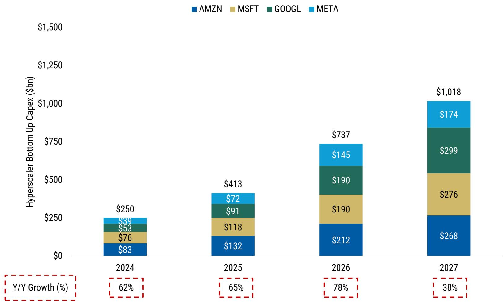  
Source: Company data, MS Estimates; Note: AMZN = Total Company Capex excluding proceeds from property and equipment sales and incentives

# MS

MS

# From a Capacity Perspective, Bottom-Up Modeling Implies This Should Lead to an Incremental \~20 GW Capacity Coming on in '27...up from 14 GW in '26

- We believe hyperscaler incremental capacity coming online in '27 is set to be \~3x higher than '25...speaking to the multi-year capex build yielding results   
- For more perspective, we estimate AWS's total capacity at year end '24 was \~4-6 GW, for what was then a \$108bn annual revenue business   
- Notably, we estimate GOOGL adds the most capacity in '27 (\~7 GW)...followed by AMZN, MSFT and META. This speaks to GOOGL's surging demand to 1) Train leading frontier models (Gemini) 2) Enable GCP growth and 3) Deploy new GenAI enabled offerings across its core Search/YouTube offerings

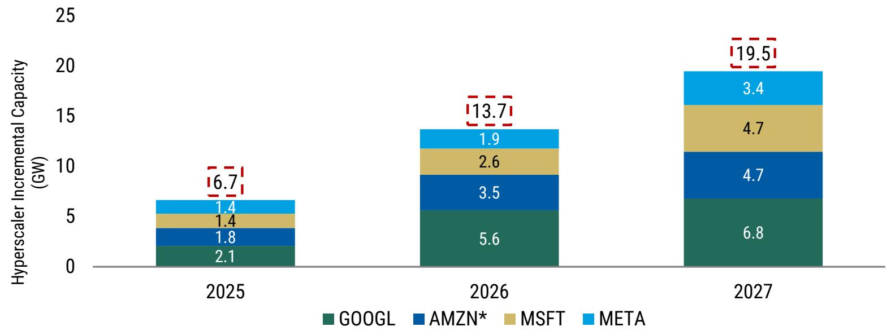

bar_stacked

| Year | GOOGL | AMZN* | MSFT | META |
|------|-------|-------|------|------|
| 2025 | 2.1   | 1.8   | 1.4  | 1.4  |
| 2026 | 5.6   | 3.5   | 2.6  | 1.9  |
| 2027 | 6.8   | 4.7   | 4.7  | 3.4  |

Source: Company data, MS Estimates; Note: \*We acknowledge AMZN comments of adding 3.9 GW of new power capacity in 2025. Please note our capacity addition est. are based on coincident timing of server/rack deliveries each year. We believe the delta in '25 vs. company comments is related to IT capacity/servers purchased prior to '25 that weren't brought online until '25 as well as traditional cloud/CPU data center capacity

# MS

MS

# At a Hyperscaler Level, We See GOOGL Adding the Most Incremental Capacity Followed by AMZN and MSFT

- Again, we model GOOGL to add the most capacity in '27 (\~7 GW)...followed by AMZN, MSFT and META. This speaks to GOOGL's surging demand to 1) Train leading frontier models (Gemini) 2) Enable GCP growth and 3) Deploy new GenAI enabled offerings across its core Search/YouTube offerings   
- AMZN/AWS's '26/'27 capacity catch up is notable given its slower start to building GenAI capacity in '23/'24   
- META's \~2GW/3GW of incremental capacity in '26/'27 is still notable given it doesn't have a hyperscale business and is also spending an estimated \~\$25bn of annual opex with hyperscalers, which would equate to incremental \~3GW added (see next slide)

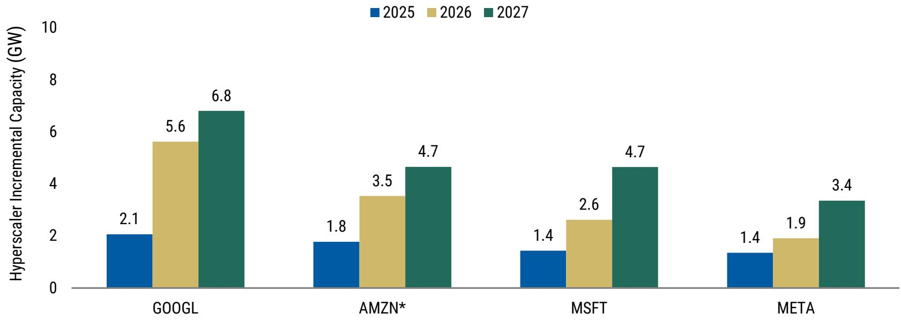

bar

| Company | 2025 (GW) | 2026 (GW) | 2027 (GW) |
| :--- | :--- | :--- | :--- |
| GOOGL | 2.1 | 5.6 | 6.8 |
| AMZN* | 1.8 | 3.5 | 4.7 |
| MSFT | 1.4 | 2.6 | 4.7 |
| META | 1.4 | 1.9 | 3.4 |

Source: Company data, MS Estimates; Note: \*We acknowledge AMZN comments of adding 3.9 GW of new power capacity in 2025. Please note our capacity addition est. are based on coincident timing of server/rack deliveries each year. We believe the delta in '25 vs. company comments is related to IT capacity/servers purchased prior to '25 that weren't brought online until '25 as well as traditional cloud/CPU data center capacity

# MS

MS

# But META's Total Effective \~4 GW Added in '26 and '27 (Including Hyperscale Deals) Speaks to Importance of Product Innovation and Incremental Revenue to Prove ROIC

- Combining META's reported capex and grossing up its external compute deals with CRWV/NBIS/ORCL/GOOGL/AMZN, we find META is set to bring on an effective \~4GW in '26 and '27   
- This places higher importance on META's ability to productize its models to drive adoption and monetization.

\- We have highlighted the potential for a ‘MetaClaw’ consumer agent here and continue to believe META’s ability to leverage its leading 1P data is underappreciated

\- NeoCloud Safety Valve? We will also continue monitoring META's compute strategy and whether they ultimately choose to offload acquired compute given the demand we are seeing for LLM enterprise tools

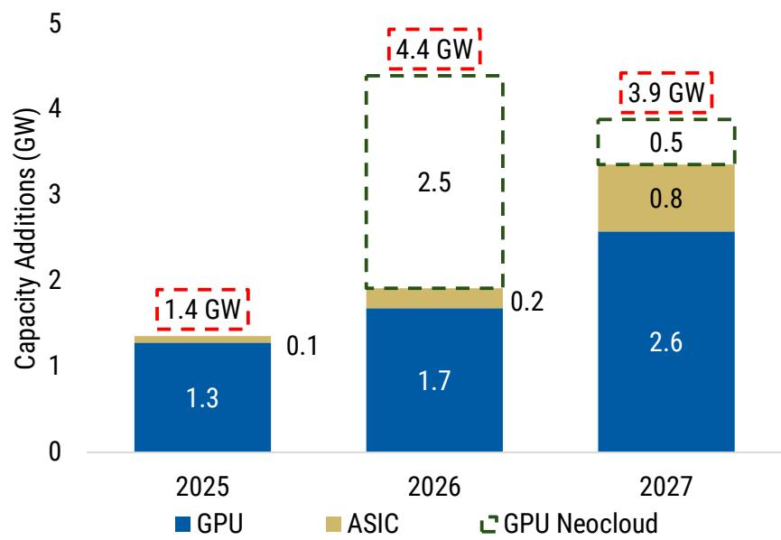

bar_stacked

| Year | GPU (GW) | ASIC (GW) | GPU Neocloud (GW) |
| :--- | :--- | :--- | :--- |
| 2025 | 1.3 | 0.1 | 1.4 |
| 2026 | 1.7 | 0.2 | 4.4 |
| 2027 | 2.6 | 0.8 | 3.9 |

META Neocloud Optionality 

<table><tr><td>Revenue $/Watt</td><td>$10</td></tr><tr><td>(X) Assumed Incremental Operating Margin</td><td>90%</td></tr><tr><td>(=) Incremental Operating Profit $/Watt</td><td>$9</td></tr><tr><td>(X) Watts per GW</td><td>1,000,000,000</td></tr><tr><td>(=) Incremental OI per GW ($ mn)</td><td>$9,000</td></tr><tr><td>(X) Tax Rate</td><td>21%</td></tr><tr><td>(=) Incremental Net Income ($ mn)</td><td>$7,110</td></tr><tr><td>(/) Shares (mn)</td><td>2,605</td></tr><tr><td>(=) Incremental EPS</td><td>$2.73</td></tr><tr><td>Upside to Current &#x27;28 EPS</td><td>8%</td></tr></table>

# MS

MS

# What about Chips? NVDA Still Making up \~60% of Aggregate Incremental Hyperscaler Capacity in '26/'27...But Watch TPUs

- NVDA still the market leader, making up \~60% of incremental capacity in '26/'27   
- Note, NVDA loses share of incremental capacity in '26 as more TPU/Trainium come online (off low base), NVDA then regains share of incremental capacity in '27 as Vera Rubin/Rubin Ultra come online (more compute power)   
- Among Custom ASICs, GOOGL TPUs set to see biggest uptake in '26/'27, with \~4 GW of incremental capacity coming online in each year   
- AMZN's Trainium still only adding \~2 GW per year...about half the size of TPU and \~50% of incremental AMZN capacity each year

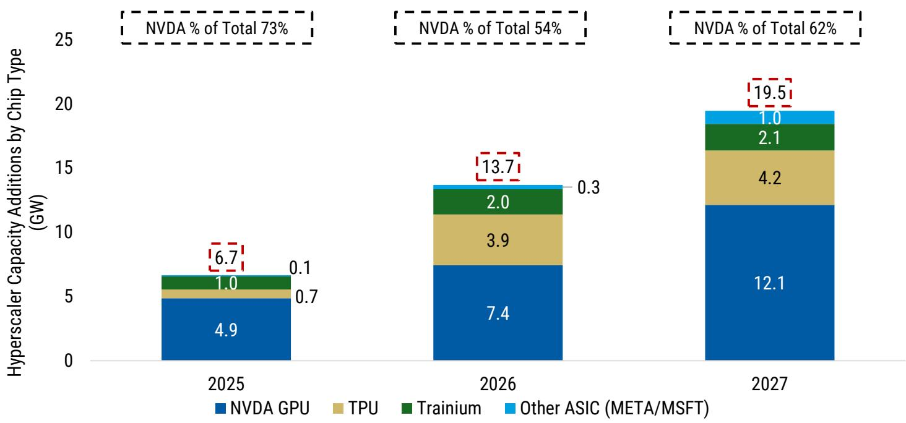

bar_stacked

| Year | NVDA GPU (GW) | TPU (GW) | Trainium (GW) | Other ASIC (META/MSFT) (GW) |
|------|---------------|----------|---------------|-----------------------------|
| 2025 | 4.9           | 0.7      | 1.0           | 0.1                         |
| 2026 | 7.4           | 3.9      | 2.0           | 0.3                         |
| 2027 | 12.1          | 4.2      | 2.1           | 1.0                         |

Source: Company data, MS Estimates

# MS

MS

# Not Surprisingly, GOOGL and AMZN Are Driving the Custom Silicon Mix Shift

• GOOGL: Adding more ASIC than GPU capacity in '26/'27   
• We estimate \~50% of capacity added in '26/'27 is for Google Cloud   
• AMZN: Ramping NVDA capacity in '26/'27 to meet AWS demands, while also forward selling Trn3/Trn4 1-2 years out   
• We believe substantial majority of capacity is for AWS   
• MSFT: Unlike hyperscaler peers (AWS/GCP), MSFT continues to rely almost entirely on NVDA   
• We believe the substantial majority of capacity is for external purposes   
- META: ASIC R&D and deployments earlier, with \~75-80% of incremental '27 capacity still NVDA   
• We believe 100% of capacity is for internal purposes

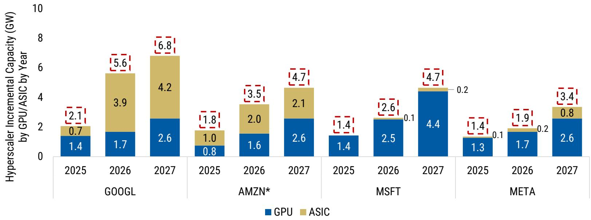

bar_stacked

| Year | System | GPU (GW) | ASIC (GW) |
| :--- | :--- | :--- | :--- |
| 2025 | GOOGL | 1.4 | 0.7 |
| 2026 | GOOGL | 1.7 | 3.9 |
| 2027 | GOOGL | 2.6 | 4.2 |
| 2025 | AMZN* | 0.8 | 1.0 |
| 2026 | AMZN* | 1.6 | 2.0 |
| 2027 | AMZN* | 2.6 | 2.1 |
| 2025 | MSFT | 1.4 | 0.0 |
| 2026 | MSFT | 2.5 | 0.1 |
| 2027 | MSFT | 4.4 | 0.2 |
| 2025 | META | 1.3 | 0.1 |
| 2026 | META | 1.7 | 0.2 |
| 2027 | META | 2.6 | 0.8 |
| 2025 | GOOGL (red dashed) | 2.1 | |
| 2026 (red dashed) | GOOGL (red dashed) | 5.6 | |
| 2027 (red dashed) | GOOGL (red dashed) | 6.8 | |
| 2025 (red dashed) | MSFT (red dashed) | 1.4 | |
| 2026 (red dashed) | MSFT (red dashed) | 2.6 | |
| 2027 (red dashed) | MSFT (red dashed) | 4.7 | |
| 2025 (red dashed) | META (red dashed) | 1.4 | |
| 2026 (red dashed) | META (red dashed) | 1.9 | |
| 2027 (red dashed) | META (red dashed) | 3.4 | |
The chart displays the total height of the Hyperscaler Incremental Capacity (GW) by GPU/ASIC by Year for each system. The values for each system are labeled on the bars. The red dashed boxes indicate the incremental capacity for each system in corresponding years.

Source: Company data, MS Estimates; Note: \*We acknowledge AMZN comments of adding 3.9 GW of new power capacity in 2025. Please note our capacity addition est. are based on coincident timing of server/rack deliveries each year. We believe the delta in '25 vs. company comments is related to IT capacity/servers purchased prior to '25 that weren't brought online until '25 as well as traditional cloud/CPU data center capacity

# MS

MS

Debate #1: Capacity Additions

Debate #2: Cost of Capacity

Debate #3: Investments in Forward Capacity

Debate #4: Costs Outside the Rack to Monitor

# Debate 2: Where is the cost and compute efficiency gap between NVDA and Custom ASICs now and what are we monitoring to close that gap?

Our View: We estimate Hyperscaler capex to build a 1 GW datacenter of current-gen NVDA GPUs (Blackwells) is as much as \~2x the cost of current-gen custom ASICs (TPU, Trainium)...with the server/rack cost the biggest delta...but compute power efficiency matters, and this is where NVDA shines...with compute performance/watt 2x-8x ahead of custom ASICs

For the custom ASICS, we look for system-level perf/watt improvements via networking, high-bandwidth memory capacity, and software optimizations. In effect, cost/token/watt advances will matter from here.

# MS

MS

# Bottom-up Work Suggest Hyperscaler Capex to Build a 1 GW Datacenter of Current-Gen NVDA GPUs is as Much as \~2x the Cost of Current-Gen Custom ASICs...

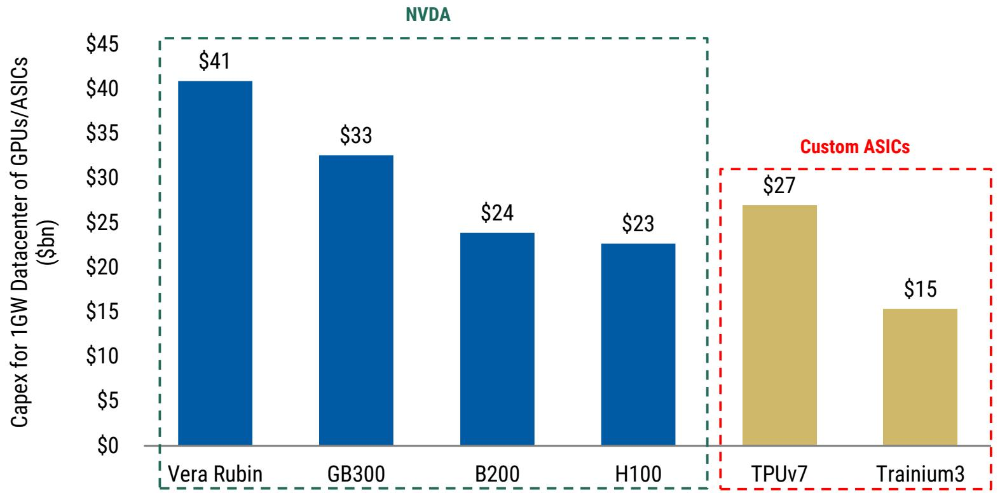

bar

Capex for 1GW Datacenter of GPUs/ASICs ($bn)
| Hardware | Capex ($bn) |
| :--- | :--- |
| Vera Rubin | 41 |
| GB300 | 33 |
| B200 | 24 |
| H100 | 23 |
TPUv7 | 27 |
| Trainium3 | 15 |
NVDA
Custom ASICs

Source: Company data, MS Estimates

# MS

MS

# ...With the Server/Rack Cost the Biggest Delta...

- Bottom-up work suggests current-gen NVDA racks cost \~\$20bn/GW for GB300, going to \~\$25bn/GW for next-gen Vera Rubin, while current gen custom ASIC racks cost \$6bn-11bn/GW   
- We believe TPU cost/GW is higher due to margin paid to AVGO...while we believe AMZN does much of its Trn3 chip design in-house (Annapurna)

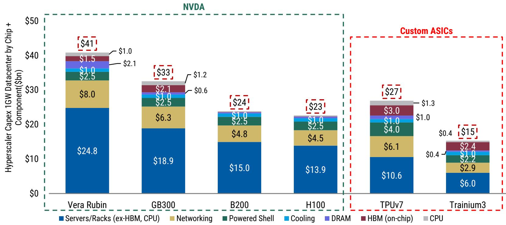

bar_stacked

NVDA
| Hardware | Component | Servers/Racks ($bn) | Networking ($bn) | Powered Shell ($bn) | Cooling ($bn) | DRAM ($bn) | HBM (on-chip) ($bn) | CPU ($bn) |
| :--- | :--- | :--- | :--- | :--- | :--- | :--- | :--- | :--- |
| Vera Rubin | Hyperscaler Capex 1GW Datacenter by Chip + Component ($bn) | $24.8 | $8.0 | $2.5 | $1.0 | $1.5 | $1.0 | $41 |
| GB300 | Hyperscaler Capex 1GW Datacenter by Chip + Component ($bn) | $18.9 | $6.3 | $2.5 | $1.0 | $2.1 | $0.6 | $33 |
| B200 | Hyperscaler Capex 1GW Datacenter by Chip + Component ($bn) | $15.0 | $4.8 | $2.5 | $1.0 | $1.0 | $0.6 | $24 |
| H100 | Hyperscaler Capex 1GW Datacenter by Chip + Component ($bn) | $13.9 | $4.5 | $2.5 | $1.0 | $1.0 | $0.6 | $23 |
| TPUv7 | Hyperscaler Capex 1GW Datacenter by Chip + Component ($bn) | $10.6 | $6.1 | $4.0 | $1.0 | $3.0 | $1.0 | $27 |
| Trainium3 | Hyperscaler Capex 1GW Datacenter by Chip + Component ($bn) | $6.0 | $2.9 | $2.2 | $1.0 | $2.4 | $0.4 | $15 |
NVDA
Custom ASICs

Source: Company data, MS Estimates

# MS

MS

# ... Again, at a Chip Level, NVDA Chips are \~2x More Expensive than Custom ASICs

- We estimate current-gen NVDA chips (Blackwell) are \~2x-5x more expensive than TPUv7/Trainium3 and make up \~50% of the cost per GW (vs. \~30-40% for Custom ASICs).   
- The next-gen Rubin GPU price doubling is a function of 1) Moving from HBM3e to HBM4 and 2) Manufacturing on more advanced process technology at TSMC.

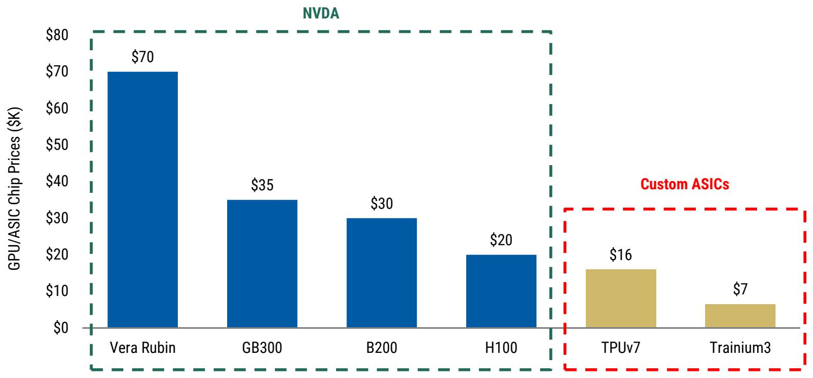

bar

| Model | GPU/ASIC Chip Prices ($K) |
| :--- | :--- |
| Vera Rubin | 70 |
| GB300 | 35 |
| B200 | 30 |
| H100 | 20 |
| TPUv7 | 16 |
| Trainium3 | 7 |
NVDA (green dashed box) |
Custom ASICs (red dashed box)

Source: Company data, MS Estimates, Note we assume hyperscalers are paying implied NVDA chip average selling prices ("ASPs") below list prices driven by bulk/volume discounts

# MS

MS

# But Compute Power Efficiency Matters, and This is Where NVDA Shines...with Compute Performance/Watt 2x-8x Ahead of Custom ASICs

- Compute power efficiency matters, and NVDA's FLOPs per Chip Divided by Watt Consumption is anywhere from 2x-8x ahead of current-gen, custom ASICs   
- GPU performance is measured in FLOPs (floating point operations per second). For example, a GPU capable at 1 teraFLOPs can execute one trillion operations per second, determining how quickly it can process the matrix math that underlies AI training and inference   
- We look for system-level performance/watt to improve by networking, memory bandwidth and software optimizations, but raw silicon remains key in increasing performance/watt

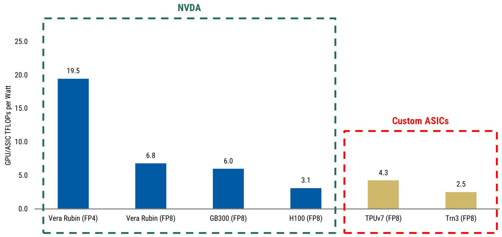

bar

| Model | GPU/ASIC TFLOPs per Watt |
| :--- | :--- |
| Vera Rubin (FP4) | 19.5 |
| Vera Rubin (FP8) | 6.8 |
| GB300 (FP8) | 6.0 |
| H100 (FP8) | 3.1 |
| TPUv7 (FP8) | 4.3 |
| Trn3 (FP8) | 2.5 |
NVDA; Custom ASICs

Source: Company data, MS Estimates; Note: FP8 and FP4 refer to the amount of data used to represent numbers in AI calculations (FP8 uses 8 bits, while FP4 uses 4 bits). Lower precision formats require less memory/power, improving performance-per-watt. While FP8 is currently the standard for most AI workloads, FP4 is the next-generation format for inference with significantly higher throughput and lower cost per token. NVIDIA's Vera Rubin architecture is specifically optimized to run FP4 workloads, while Trainium4 and TPUv8 will also support FP4.

# MS

MS

# What are We Focused on for Custom ASICs to Bridge the Performance Gap?

- Beyond the chips, we see HBM capacity playing an increasing role in AI inference economics given the need to move data efficiently across chips   
- Mixture of expert models dictate higher bandwidth given the need to rapidly route between multiple expert models while also storing increasingly large KV caches for inference workloads   
- NVDA historically the leader here with 1) more HBM capacity on-chip (current-gen GB300 matches next-gen TPUv8 in HBM3e capacity) and 2) Better pricing and allocation from the HBM ecosystem relative to custom ASICs   
- TPU + Trainium: For TPU + Trainium, GCP/AWS control the whole stack, and therefore we are looking for system-level perf/watt improvements via networking, high-bandwidth memory capacity, and software optimizations to close the gap with NVDA

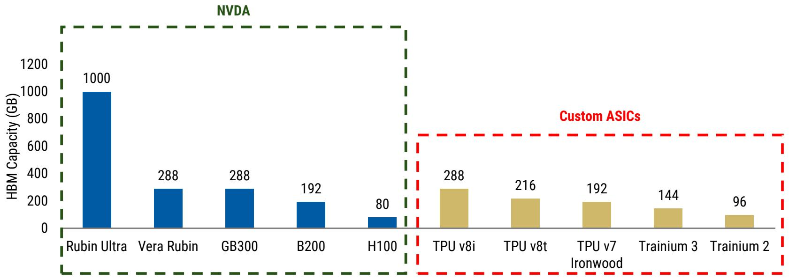

bar

| Platform | HBM Capacity (GB) |
| :--- | :--- |
| Rubin Ultra | 1000 |
| Vera Rubin | 288 |
| GB300 | 288 |
| B200 | 192 |
| H100 | 80 |
| TPU v8i | 288 |
| TPU v8t | 216 |
| TPU v7 Ironwood | 192 |
| Trainium 3 | 144 |
| Trainium 2 | 96 |
NVDA; Custom ASICs

Source: Company data, MS Estimates. Note Vera Rubin is the first NVDA generation that uses HBM4.

# MS

MS

Debate #1: Capacity Additions

Debate #2: Cost of Capacity

Debate #3: Investments in Forward Capacity

Debate #4: Costs Outside the Rack to Monitor

# Debate 3: Which hyperscalers are investing the most in forward year's capacity yet to come on?

Our View: Combining our bottom-up cost per GW and est. number of chips/racks per company helps us better estimate and understand current and forward capex.

This analysis suggests AMZN/MSFT/META current capex has material forward purchasing/building (powered shells, land, equipment, memory, etc.) which is positive for a potential future second derivative slowing in capex and a greater hedge against component inflation and data center opening risks. We estimate 50%+ of '26 AMZN/MSFT/META capex is dedicated toward GW that will come online in '27 and beyond.

That said only \~\$20bn (\~10%) of '26 GOOGL capex seems to be for future capacity...speaking to higher inflation and execution risk.

# MS

MS

# Combining Our Bottom-up Cost per GW by Chip and our Estimated Number of Chips/Racks By Company Helps us Better Understand Current and Forward Capex

We use our chip unit estimates to approximate GW's coming online and cost per GW to arrive at a bottom-up capex for hyperscalers.

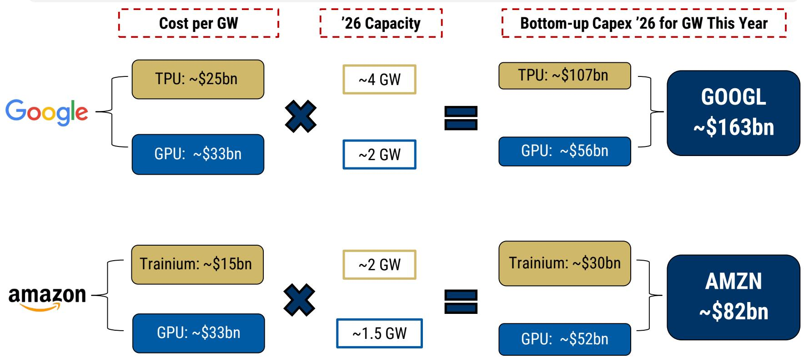

bar_stacked

| Company | Component         | Cost per GW (TPU) | Cost per GW (GPU) | '26 Capacity (GW) | Bottom-up Capex '26 for GW This Year (GOOGL) | Bottom-up Capex '26 for GW This Year (AMZN) |
|---------|--------------------|--------------------|-------------------|-------------------|-----------------------------------------------|---------------------------------------------|
| Google  | Total              | ~$25bn             | ~$33bn            | ~4 GW             | ~$107bn                                       | ~$82bn                                      |
| Amazon  | Total              | ~$15bn             | ~$33bn            | ~2 GW             | ~$56bn                                        | -                                           |
| Amazon  | Total              | ~$15bn             | ~$33bn            | ~1.5 GW           | -                                             | -                                           |

# MS

MS

# AMZN: 50% (\$90bn) of '26 Capex for Forward Purchasing and Future Capacity

- We estimate \~\$90bn (\~50%) of AWS '26 capex is for buildings, shells, facilities, power and capacity to come online (with chips) in '27 and beyond. This aligns with the 6-24 month forward purchasing lead time discussed in AMZN's '25 shareholder letter and 1Q26 EPS commentary   
- This is bullish for potential future second derivative capex slowing and a hedge against potential data center delays and component inflation

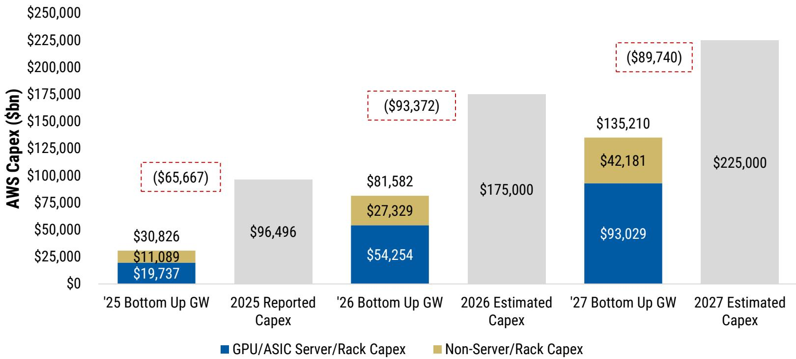

bar_stacked

| Year | Category | Total (USD) | GPU/ASIC Server/Rack Capex ($bn) | Non-Server/Rack Capex ($bn) |
| :--- | :--- | :--- | :--- | :--- |
| '25 Bottom Up GW | Reported Capex | $30,826 | $19,737 | $11,089 |
| 2025 Reported Capex | Reported Capex | $96,496 | - | - |
| '26 Bottom Up GW | Reported Capex | $81,582 | $54,254 | $27,329 |
| 2026 Estimated Capex | Reported Capex | $175,000 | - | - |
| '27 Bottom Up GW | Reported Capex | - | $93,029 | $42,181 |
| 2027 Estimated Capex | Reported Capex | - | - | - |
| '25 Bottom Up GW (Estimated) | Reported Capex | ($65,667) | - | - |
| '26 Bottom Up GW (Estimated) | Reported Capex | ($93,372) | - | - |
| '27 Bottom Up GW (Estimated) | Reported Capex | ($89,740) | - | - |
| 2027 Estimated Capex (Estimated) | Reported Capex | $225,000 | - | - |

# MS

MS

# MSFT: 55% (\$100bn) Pre-Build Activity Suggests Significant AI Infrastructure Investments, Supporting Confidence in Long-Term Azure & M365 Growth

- We estimate \~\$104bn (\~55%) of '26 capex at MSFT is being deployed ahead of future capacity needs in '27 and beyond, suggesting meaningful pre-build activity across AI infrastructure.   
- Like AWS, this should support future Azure (and Azure AI) and M365 growth while potentially smoothing the pace of second-derivative capex expansion over time.

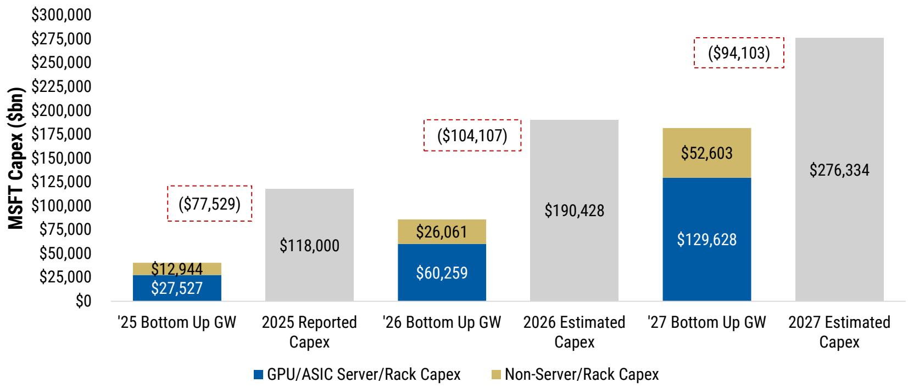

bar_stacked

| Year | GPU/ASIC Server/Rack Capex ($bn) | Non-Server/Rack Capex ($bn) | Total ($bn) |
| :--- | :--- | :--- | :--- |
| '25 Bottom Up GW | 27,527 | 12,944 | (77,529) |
| 2025 Reported Capex | 118,000 | 0 | 118,000 |
| '26 Bottom Up GW | 60,259 | 26,061 | (104,107) |
| 2026 Estimated Capex | 190,428 | 0 | 190,428 |
| '27 Bottom Up GW | 129,628 | 52,603 | (94,103) |
| 2027 Estimated Capex | 276,334 | 0 | 276,334 |

# MS

MS

# META: 55% (\$85bn) of Capex for Future GW to Come Online

- We estimate \~\$85bn (55%) of '26 META capex is being used for future chips/racks and GW to come in '27 and beyond   
- We are modeling a step-down in this forward non-chip spend in '27 given the \$25bn annual hyperscaler commitments

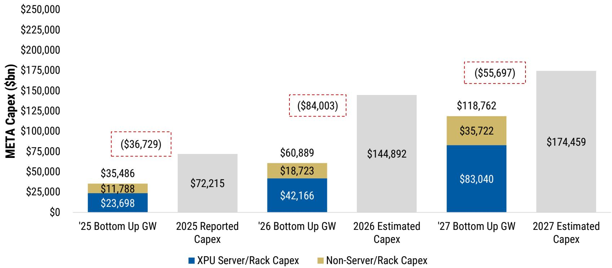

bar_stacked

| Category | XPU Server/Rack Capex ($) | Non-Server/Rack Capex ($) | Total (in $bn) |
| :--- | :--- | :--- | :--- |
| '25 Bottom Up GW | 23,698 | 11,788 | 35,486 |
| 2025 Reported Capex | 0 | 0 | 72,215 |
| '26 Bottom Up GW | 42,166 | 18,723 | 60,889 |
| 2026 Estimated Capex | 0 | 0 | 144,892 |
| '27 Bottom Up GW | 83,040 | 35,722 | 118,762 |
| 2027 Estimated Capex | 0 | 0 | 174,459 |
(-$55,697) from '27 Bottom Up GW is annotated with a red dashed box. The total capex is estimated for '27 Bottom Up GW at $174,459. The reported capex in '25 Bottom Up GW is -$36,729. The actual capex in '26 Bottom Up GW is -$84,003. The estimated capex in '2027 is estimated at -$55,697. The negative value in the original '25 Bottom Up GW is shown as a red dashed box.

# MS

MS

# GOOGL: Only 10% (\$20bn) of '26 Capex For Forward Build

- We estimate that only \~\$20bn (\~10%) of '26 GOOGL capex is being used for assets (buildings, land, equipment, power) for future chips/racks and GW to come online in '27 and beyond.   
- This speaks to higher inflation, shortage and data center build risk...and helps inform our \~\$300bn of total capex in '27

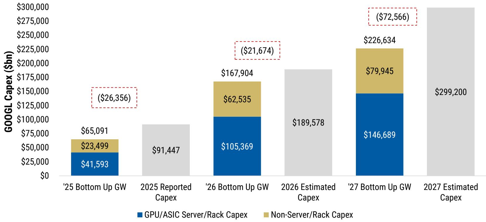

bar_stacked

| Year | GPU/ASIC Server/Rack Capex ($bn) | Non-Server/Rack Capex ($bn) | Total ($bn) |
| :--- | :--- | :--- | :--- |
| '25 Bottom Up GW | 41,593 | 23,499 | 65,091 |
| 2025 Reported Capex | - | - | 91,447 |
| '26 Bottom Up GW | 105,369 | 62,535 | 167,904 |
| 2026 Estimated Capex | - | - | 189,578 |
| '27 Bottom Up GW | 146,689 | 79,945 | 226,634 |
| 2027 Estimated Capex | - | - | 299,200 |
The chart includes a red dashed box indicating the total capex for '25 Bottom Up GW and '26 Bottom Up GW, with a negative dollar value (-$72,566). The '26 Bottom Up GW' is labeled as '($21,674)' and the '2027 Estimated Capex' is also labeled as '($26,356)'. The '2025 Reported Capex' label indicates it is not part of the total capex value.

# MS

MS

Debate #1: Capacity Additions

Debate #2: Cost of Capacity

Debate #3: Investments in Forward Capacity

Debate #4: Costs Outside the Rack to Monitor

# Debate 4: Beyond Chips/Racks, What Data Center Costs Have the Most Swing in Driving Cost/GW higher (inflation, shortages, etc.) or lower?

Our View: Networking (\~20%) and Powered Shells (\~HSD-low-teens%) are largest sources of investment after racks DRAM (single digit % of the cost) and HBM (\~MSD-mid-teens%) also pose upside risks to the rack prices that hyperscalers pay.

Remember, with Blackwell racks, NVDA bundles and makes a margin on memory content and hyperscalers generally absorb these costs. With Rubin and its plug-in memory modules, hyperscale customers may increasingly be able to source approved memory directly (possible savings), but “bundling” may still be more efficient.

# MS

MS

# Racks and Servers Still Biggest Drivers of GW Investment (\~60% of Cost Per GW)...

\- NVDA racks (ex-HBM and CPU) make up \~60% of cost per GW...compared to \~40% at custom ASICs

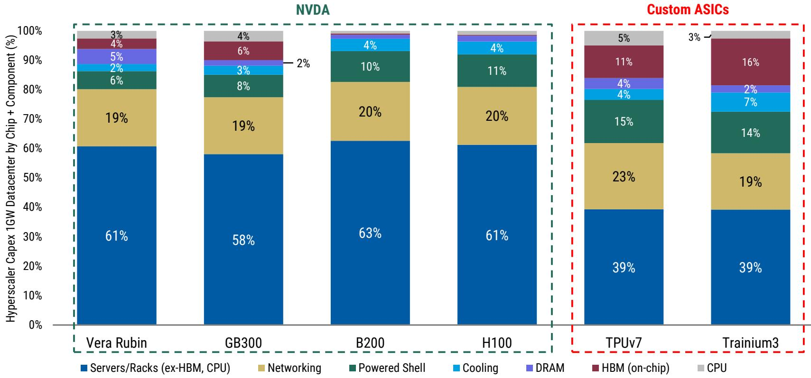

bar_stacked

| Dataset     | NVDA Servers/Racks (ex-HBM, CPU) | NVDA Networking | NVDA Powered Shell | NVDA Cooling | NVDA DRAM | NVDA HBM (on-chip) | Custom ASICs HBM (on-chip) | Custom ASICs CPU |
| ----------- | --------------------------------- | ---------------- | ------------------ | ------------ | --------- | ------------------ | -------------------------- | ---------------- |
| Vera Rubin  | 61%                               | 19%              | 6%                 | 2%           | 5%        | 4%                 | -                          | 3%               |
| GB300       | 58%                               | 19%              | 8%                 | 3%           | -         | 6%                 | -                          | 4%               |
| B200        | 63%                               | 20%              | 10%                | 4%           | -         | -                  | -                          | 2%               |
| H100        | 61%                               | 20%              | 11%                | 4%           | -         | -                  | -                          | -                |
| TPUv7       | 39%                               | 23%              | 15%                | 4%           | -         | 11%                | -                          | 5%               |
| Trainium3   | 39%                               | 19%              | 14%                | 7%           | -         | 16%                | -                          | 3%               |

Source: Company data, MS Estimates

# MS

MS

# ...And Networking/Powered Shells are Largest Sources of Investment After Servers/Racks

- Networking makes up \~20% of the cost per GW (suppliers include LITE, CLS, CRDO, etc.)   
- Powered Shells are the next largest area of investment at 6%-15%   
- High Bandwidth Memory makes up between 1%-16%, while DRAM only an estimated 1%-5%

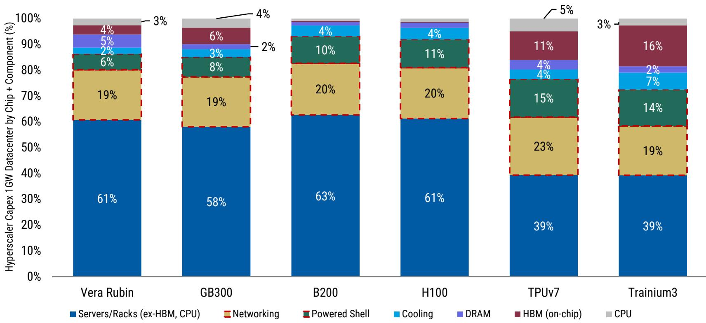

bar_stacked

| Hardware     | Servers/Racks (ex-HBM, CPU) | Networking | Powered Shell | Cooling | DRAM | HBM (on-chip) | CPU |
| ------------ | --------------------------- | ---------- | ------------- | ------- | ---- | ------------- | --- |
| Vera Rubin   | 61%                         | 19%        | 6%            | 2%      | 5%   | 4%            | 3%  |
| GB300        | 58%                         | 19%        | 8%            | 3%      | 6%   | 6%            | 4%  |
| B200         | 63%                         | 20%        | 10%           | 4%      | 2%   | 6%            | 2%  |
| H100         | 61%                         | 20%        | 11%           | 4%      | 2%   | 6%            | 2%  |
| TPUv7        | 39%                         | 23%        | 15%           | 4%      | 4%   | 11%           | 5%  |
| Trainium3    | 39%                         | 19%        | 14%           | 7%      | 2%   | 16%           | 3%  |

Source: Company data, MS Estimates

MS

MS

# Appendix and Our Methodology

# MS

MS

# NVDA Cost/GW Example: The GB300 Starting at the Rack Level and Working Up Through 7 Layers of Components

<table><tr><td colspan="2">1. GPUs and Electricity</td><td>% of Total</td></tr><tr><td>Total Cost of GPU/Racks ($M)</td><td>$22,777</td><td>70%</td></tr><tr><td colspan="3">2. Backup Power</td></tr><tr><td>Cost for On-Site Backup Gen ($M)</td><td>$500</td><td>2%</td></tr><tr><td colspan="3">3. Cooling Equipment</td></tr><tr><td>Total Cooling System Cost ($M)</td><td>$1,000</td><td>3%</td></tr><tr><td colspan="3">4. Powered Shell, Electrical, Building and Mechanical</td></tr><tr><td>Cost of Powered Shell, Electrical, Building and Mechanical ($M)</td><td>$2,000</td><td>6%</td></tr><tr><td colspan="3">5. Networking Equipment</td></tr><tr><td>Estimated Cost ($M)</td><td>$2,100</td><td>6%</td></tr><tr><td colspan="3">6. Transceivers / Cabling / Other</td></tr><tr><td>Estimated Cost ($M)</td><td>$2,262</td><td>7%</td></tr><tr><td colspan="3">7. DCI &amp; Net Sec</td></tr><tr><td>Estimated Cost ($M)</td><td>$1,938</td><td>6%</td></tr><tr><td colspan="3">8. Total Estimated Data Center Cost</td></tr><tr><td>Total Data Center Costs ($M)</td><td>$32,577</td><td>100%</td></tr></table>

<table><tr><td>GPUs Per Rack</td><td>72</td></tr><tr><td>Cost Per GPU</td><td>$35,000</td></tr><tr><td>HBM Contribution</td><td>$4,500</td></tr><tr><td>HBM % of GPU Costs</td><td>12.9%</td></tr><tr><td>Memory % of of GW Scale Capex</td><td>8.3%</td></tr><tr><td>HBM3e GB per Vera Rubin chip</td><td>279</td></tr><tr><td>Implied Price per GB of HBM4E</td><td>$16.1</td></tr><tr><td>GPU Cost Per Rack ($M)</td><td>$2.52</td></tr><tr><td>% of Rack Cost</td><td>70.9%</td></tr><tr><td>Other Rack Costs</td><td>$1.03</td></tr><tr><td>% of Rack Cost</td><td>29.1%</td></tr><tr><td>Memory Contribution (DDR5)</td><td>$0.1</td></tr><tr><td>% of GPU Costs</td><td>3.9%</td></tr><tr><td>GB LPDDR5X / Rack</td><td>18,432</td></tr><tr><td>Price Per GB LPDDR5X</td><td>$5.27</td></tr><tr><td>CPU Contribution</td><td>$0.2</td></tr><tr><td>% of GPU Costs</td><td>7.1%</td></tr><tr><td>CPUs / Rack</td><td>36</td></tr><tr><td>Estimated Price per CPU</td><td>$5,000</td></tr><tr><td>Other Contribution</td><td>$0.8</td></tr><tr><td>% of GPU Costs</td><td>30.0%</td></tr><tr><td>Total Rack Cost ($M)</td><td>$3.55</td></tr><tr><td>Number of GPUs Required</td><td>461,538</td></tr><tr><td>Number of Racks</td><td>6,410</td></tr></table>

# MS

MS

# TPU Cost/GW Example: Starting at the Rack Level and Working Up Through 7 Layers of Components

<table><tr><td colspan="2">1. TPUs and Electricity</td><td>% of Total</td></tr><tr><td>Total Cost of GPU/Racks ($M)</td><td>$15,913</td><td>59%</td></tr><tr><td colspan="3">2. Backup Power</td></tr><tr><td>Cost for On-Site Backup Gen ($M)</td><td>$500</td><td>2%</td></tr><tr><td colspan="3">3. Cooling Equipment</td></tr><tr><td>Total Cooling System Cost ($M)</td><td>$1,000</td><td>4%</td></tr><tr><td colspan="3">4. Powered Shell, Electrical, Building and Mechanical</td></tr><tr><td>Cost of Powered Shell, Electrical, Building and Mechanical ($M)</td><td>$3,456</td><td>13%</td></tr><tr><td colspan="3">5. Networking Equipment</td></tr><tr><td>Estimated Cost ($M)</td><td>$2,134</td><td>8%</td></tr><tr><td colspan="3">6. Transceivers / Cabling / Other</td></tr><tr><td>Estimated Cost ($M)</td><td>$2,358</td><td>9%</td></tr><tr><td colspan="3">7. DCI &amp; Net Sec</td></tr><tr><td>Estimated Cost ($M)</td><td>$1,572</td><td>6%</td></tr><tr><td colspan="3">8. Total Estimated Data Center Cost</td></tr><tr><td>Total Data Center Costs ($M)</td><td>$26,933</td><td>100%</td></tr></table>

<table><tr><td>TPUs Per Rack</td><td>64</td></tr><tr><td>Cost Per TPU</td><td>$15,840</td></tr><tr><td>HBM Contribution</td><td>$4,224</td></tr><tr><td>HBM % of TPU Costs</td><td>26.7%</td></tr><tr><td>Memory % of GW Scale Capex</td><td>14.8%</td></tr><tr><td>HBM3e GB per TPUv7 chip</td><td>192</td></tr><tr><td>Implied Price per GB of HBM3E</td><td>$22.0</td></tr><tr><td>TPU Cost Per Rack ($M)</td><td>$1.01</td></tr><tr><td>% of Rack Cost</td><td>70.6%</td></tr><tr><td>Other Rack Costs</td><td>$0.42</td></tr><tr><td>% of Rack Cost</td><td>29.4%</td></tr><tr><td>Memory Contribution (Rack Level)</td><td>$0.1</td></tr><tr><td>% of TPU Costs</td><td>9%</td></tr><tr><td>GB DDR5 / Rack</td><td>12,288</td></tr><tr><td>Price Per GB DDR5</td><td>$7.33</td></tr><tr><td>Memory as a % of GW-Scale Capex</td><td>10%</td></tr><tr><td>CPU Contribution</td><td>$0.1</td></tr><tr><td>% of TPU Costs</td><td>11.8%</td></tr><tr><td>CPUs / Rack</td><td>32</td></tr><tr><td>Implied Price per CPU</td><td>$3,745</td></tr><tr><td>Other Contribution</td><td>$0.2</td></tr><tr><td>% of TPU Costs</td><td>21.0%</td></tr><tr><td>Total Rack Cost ($M)</td><td>$1.44</td></tr></table>

# MS

MS

# Trainium Cost/GW Example: Starting at the Rack Level and Working Up Through 7 Layers of Components

<table><tr><td colspan="2">1. ASICs and Electricity</td><td>% of Total</td></tr><tr><td>Total Cost of ASIC/Racks ($M)</td><td>$9,246</td><td>60%</td></tr></table>

<table><tr><td colspan="3">2. Backup Power</td></tr><tr><td>Cost for On-Site Backup Gen ($M)</td><td>$500</td><td>3%</td></tr></table>

<table><tr><td colspan="3">3. Cooling Equipment</td></tr><tr><td>Total Cooling System Cost ($M)</td><td>$1,000</td><td>7%</td></tr></table>

<table><tr><td colspan="3">4. Powered Shell, Electrical, Building and Mechanical</td></tr><tr><td>Cost of Powered Shell, Electrical, Building and Mechanical ($M)</td><td>$1,667</td><td>11%</td></tr></table>

<table><tr><td colspan="3">5. Networking Equipment</td></tr><tr><td>Estimated Cost ($M)</td><td>$1,196</td><td>8%</td></tr></table>

<table><tr><td colspan="3">6. Transceivers / Cabling / Other</td></tr><tr><td>Estimated Cost ($M)</td><td>$748</td><td>5%</td></tr></table>

<table><tr><td colspan="3">7. DCI &amp; Net Sec</td></tr><tr><td>Estimated Cost ($M)</td><td>$997</td><td>6%</td></tr></table>

<table><tr><td colspan="3">8. Total Estimated Data Center Cost</td></tr><tr><td>Total Data Center Costs ($M)</td><td>$15,354</td><td>100%</td></tr></table>

<table><tr><td>ASICs Per Rack</td><td>144</td></tr><tr><td>Cost Per ASIC</td><td>$6,465</td></tr><tr><td>HBM Contribution</td><td>$3,168</td></tr><tr><td>HBM % of Trainium Costs</td><td>49%</td></tr><tr><td>Memory % of of GW Scale Capex</td><td>18.3%</td></tr><tr><td>HBM3e GB per Trainium3 chip</td><td>144</td></tr><tr><td>Implied Price per GB of HBM3E</td><td>$22.0</td></tr></table>

<table><tr><td>ASIC Cost Per Rack ($M)</td><td>$0.93</td></tr><tr><td>% of Rack Cost</td><td>53.9%</td></tr><tr><td>Other Rack Costs</td><td>$0.80</td></tr><tr><td>% of Rack Cost</td><td>46.1%</td></tr></table>

<table><tr><td>Memory Contribution (Rack Level)</td><td>$0.1</td></tr><tr><td>% of ASIC Costs</td><td>7.5%</td></tr><tr><td>GB DDR5 / Rack</td><td>9,216</td></tr><tr><td>Price Per GB DDR5</td><td>$7.59</td></tr></table>

<table><tr><td>CPU Contribution</td><td>$0.1</td></tr><tr><td>% of ASIC Costs</td><td>8.0%</td></tr><tr><td>CPUs / Rack</td><td>36</td></tr><tr><td>Implied Price per CPU</td><td>$2,074</td></tr></table>

<table><tr><td>Other Contribution</td><td>$0.7</td></tr><tr><td>% of ASIC Costs</td><td>70.0%</td></tr></table>

<table><tr><td>Total Rack Cost ($M)</td><td>$1.73</td></tr></table>

# MS

MS

# We Sanity Check our NVDA Spend/Chip Allocation Numbers With Company Commentary Around Hyperscaler Mix of Revenue

- NVDA commentary says \~50%/60% of spend comes from large CSPs/hyperscalers (includes META). We sanity check our NVDA rack spend numbers against where we believe buyside upside case numbers are for NVDA revenues in '26/'27   
- Nvidia CEO also said during GTC that the company has a line of sight to \$1T+ of Rubin + Blackwell revenue between CY25-CY27. Note, this does include associated networking, but does not include data center RTX, Hopper, software, and standalone CPUs, implying more upside to the \$1T. CY25 having \~\$30bn of Hopper (incl H20), our “upside case” implies revenues \$170bn or so above the mgmt. outlook, \~\$230bn above consensus over that period

<table><tr><td>Spend on NVDA DC Components by Hyperscaler ($bn)</td><td>CY25</td><td>CY26</td><td>CY27</td><td>Total &#x27;25-&#x27;27</td></tr><tr><td>GOOGL</td><td>$23</td><td>$39</td><td>$74</td><td>$137</td></tr><tr><td>AMZN</td><td>$13</td><td>$37</td><td>$74</td><td>$123</td></tr><tr><td>MSFT</td><td>$27</td><td>$59</td><td>$127</td><td>$213</td></tr><tr><td>ORCL (implied)</td><td>$28</td><td>$53</td><td>$65</td><td>$146</td></tr><tr><td>META</td><td>$23</td><td>$39</td><td>$74</td><td>$136</td></tr><tr><td>% of NVDA Buyside Upside Case DC Revenue</td><td>61%</td><td>62%</td><td>63%</td><td>62%</td></tr><tr><td>Total Buyside Upside Case NVDA DC Revenue</td><td>$185</td><td>$365</td><td>$660</td><td>$1,210</td></tr></table>

# MS

MS

# Our Asia Semis Team led by Charlie Chan Estimates There Will be 3.7mn/6.3mn TPU Units Shipped in '26/'27

# Our View

- In '26/'27, we estimate GOOGL will use 2.8mn/3.0mn for internal data centers (Search & GCP) while selling 900k/3.3mn chips to external data centers   
- Every GW consumes \~750k TPUs in our view and requires \~\$25bn of capex. Within that, we estimate GOOGL pays AVGO \~\$15k per chip, which includes a 50% gross margin. We recognize these are sensitive assumptions and will continue to monitor disclosures from AVGO/GOOGL and others on how external TPU sales are taking place (capex vs. inventory, royalty sales, etc.) as this remains a key unknown for GOOGL

<table><tr><td>k Units</td><td>2023</td><td>2024</td><td>2025e</td><td>2026e</td><td>2027e</td><td>2028e</td></tr><tr><td>v5</td><td>500</td><td>2,400</td><td>250</td><td></td><td></td><td></td></tr><tr><td>v6 (Trillium)</td><td></td><td></td><td>1,000</td><td></td><td></td><td></td></tr><tr><td>v7 (Ironwood, by Broadcom)</td><td></td><td></td><td>500</td><td>2,300</td><td>500</td><td></td></tr><tr><td>v8i (Sunfish; 3nm, by Broadcom)</td><td></td><td></td><td></td><td>900</td><td>3,000</td><td>2,500</td></tr><tr><td>v8t (Zebrafish; 3nm, by MediaTek)</td><td></td><td></td><td></td><td>500</td><td>2,500</td><td>2,000</td></tr><tr><td>v9 (Pumafish; 2nm, by Broadcom)</td><td></td><td></td><td></td><td></td><td>150</td><td>1,000</td></tr><tr><td>v10 (Humufish; 2nm, by MediaTek)</td><td></td><td></td><td></td><td></td><td>150</td><td>1,000</td></tr><tr><td>Total</td><td>500</td><td>2,400</td><td>1,750</td><td>3,700</td><td>6,300</td><td>6,500</td></tr></table>

# Risk Reward – Amazon.com Inc (AMZN.O)

AMZN Risk Reward

# PRICE TARGET \$330.00

Our \$330 PT is based on applying a \~29X P/E multiple to our \$11.3 of '27 EPS and implies paying \~1.1X PEG, a \~40% discount to AMZN's peer median.

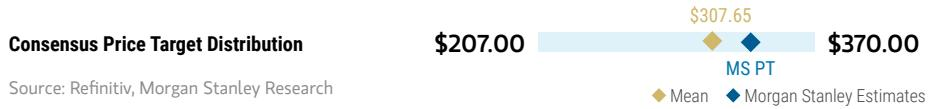

bar_line

| Category | Value    |
| -------- | -------- |
| MS PT    | $307.65  |
| MS Estimates | $370.00  |
Source: Refinitiv, MS

RISK REWARD CHART AND OPTIONS IMPLIED PROBABILITIES (12M)   
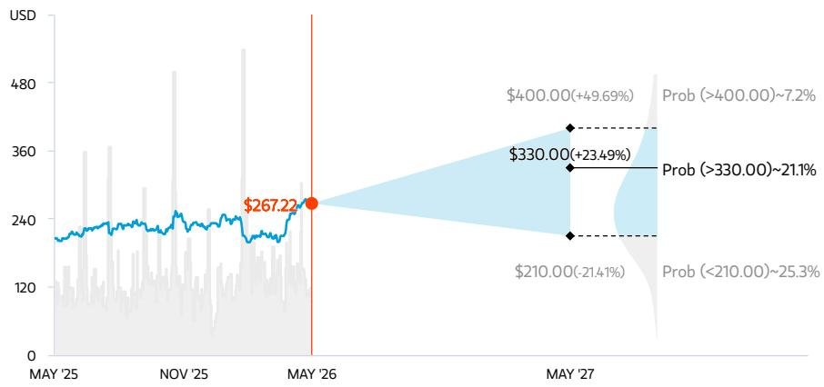

line

| Date     | Value    |
| -------- | -------- |
| MAY '26  | $267.22  |
| MAY '27  | $400.00(+49.69%) |
| MAY '27 | $330.00(+23.49%) |
| MAY '27 | $210.00(-21.41%) |
| MAY '27 | Prob (>400.00)~7.2% |
| MAY '27 | Prob (>330.00)~21.1% |
| MAY '27 | Prob (<210.00)~25.3% |

Key: — Historical Stock Performance ● Current Stock Price ◆ Price Target   
Source: Refinitiv, MS, MS Institutional Equities Division. The probabilities of our Bull, Base, and Bear case scenarios playing out were estimated with implied volatility data from the options market as of 14 May 2026. All figures are approximate risk-neutral probabilities of the stock reaching beyond the scenario price in either three-months' or one-years' time. View explanation of Options Probabilities methodology here

# OVERWEIGHT THESIS

■ Amazon's high-margin businesses continue to allow Amazon to drive greater profitability while still continuing to invest (last mile delivery, fulfillment, Prime Now, Fresh, Prime digital content, Alexa/Echo, India, AWS, etc).   
■ Amazon Prime membership growth drives recurring revenue and positive mix shift.   
■ Cloud adoption hitting an inflection point.   
■ Advertising serves as a key area for both further growth potential and profitability flow-through.

Consensus Rating Distribution   

bar

| Category      | Value |
| ------------- | ----- |
| Overweight    | 94%   |
| Equal-weight  | 6%    |
| Underweight   | 0%    |

Source: Refinitiv, MS

# Risk Reward Themes

Secular Growth: Positive

New Data Era: Positive

Technology Diffusion: Positive

View descriptions of Risk Rewards Themes here

# BULL CASE

# \$400.00

# BASE CASE

# \$330.00

# BEAR CASE

# \$210.00

\~31X bull case 2027 EPS of \$13.0

Our Bull case is derived from higher Revenue and EBIT margin assumptions than in our base case

\~29X base case 2027 EPS of \$11.3

Our \$330 PT is based on applying a \~29X P/E multiple to our \$11.3 of '27 EPS and implies paying \~1.1X PEG, a \~40% discount to AMZN's peer median.

\~20X bear case 2027 EPS of \$10.6

Our Bear case is derived from lower Revenue and EBIT margin assumptions than in our base case

# Risk Reward – Amazon.com Inc (AMZN.O)

KEY EARNINGS INPUTS 

<table><tr><td>Drivers</td><td>2025</td><td>2026e</td><td>2027e</td><td>2028e</td></tr><tr><td>Revenue ($, mm)</td><td>716,924</td><td>825,620</td><td>951,082</td><td>1,088,139</td></tr><tr><td>Gross Profit ($, mm)</td><td>361,287</td><td>426,385</td><td>515,815</td><td>613,700</td></tr><tr><td>GAAP EBIT ($, mm)</td><td>79,975</td><td>111,844</td><td>155,801</td><td>203,824</td></tr><tr><td>Paid Unit Growth (y/y) (%)</td><td>10.8</td><td>11.8</td><td>10.6</td><td>9.8</td></tr><tr><td>AWS Revenue Growth (%)</td><td>19.7</td><td>34.7</td><td>36.5</td><td>31.0</td></tr></table>

# INVESTMENT DRIVERS

- Amazon's high-margin businesses continue to allow Amazon to drive greater profitability while still continuing to invest   
• Cloud is in a multi-decade secular adoption cycle   
- Amazon is gaining share in eCommerce/retail and share of consumers' wallets

# GLOBAL REVENUE EXPOSURE

  
● 0-10% APAC, ex Japan, Mainland China and India   
0-10% India   
0-10% Japan   
0-10% Latin America   
0-10% Mainland China   
0-10% UK   
10-20% Europe ex UK   
60-70% North America   
Source: MS Estimate View explanation of regional hierarchies here

# MS ALPHA MODELS

4/5 BEST

24 Month Horizon

3/5
MOST

3 Month Horizon

Source: Refinitiv, FactSet, MS; 1 is the highest favored Quintile and 5 is the least favored Quintile

# RISKS TO PT/RATING

# RISKS TO UPSIDE

- Faster than expected AWS rev growth and stable margin expansion   
- Faster than expected Retail rev growth, stable to expanding 1P Merch Margins   
- Greater than expected shipping and fulfillment leverage

# RISKS TO DOWNSIDE

• Investments step up and continue for longer than expected   
- Merch margins worse than expected   
- AWS revenue decelerates and /or margins decline

# OWNERSHIP POSITIONING

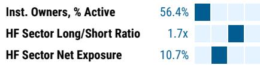  
Inst. Owners, % Active   
HF Sector Long/Short Ratio   
HF Sector Net Exposure

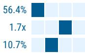  
56.4%   
1.7x   
10.7%

Refinitiv; MSPB Content. Includes certain hedge fund exposures held with MSPB. Information may be inconsistent with or may not reflect broader market trends. Long/Short Ratio = Long Exposure / Short exposure. Sector % of Total Net Exposure = (For a particular sector: Long Exposure - Short Exposure) / (Across all sectors: Long Exposure – Short Exposure).

# MS ESTIMATES VS. CONSENSUS

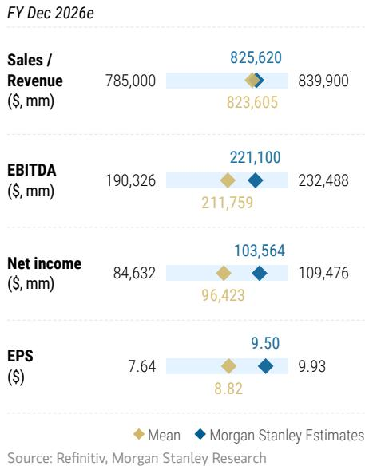  
FY Dec 2026e   
Source: Refinitiv, MS

# Risk Reward – Microsoft (MSFT.O)

Durability of Earnings Growth & AI Leadership Not Priced-In

# PRICE TARGET \$650.00

30x Base Case CY27e EPS of \$21.76. 30x PE is a slight premium to large cap software peers, 1.5x PEG is relatively in line with MSFT historical PEG while a premium to peers, justified by Microsoft's strong positioning and strong execution.

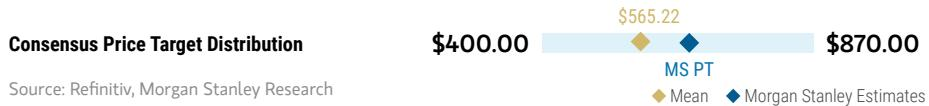

bar_line

| Consensus Price Target Distribution | Value    |
| ----------------------------------- | -------- |
| MS PT                               | $565.22  |
| $400.00                             | $400.00  |
| $870.00                             | $870.00  |

RISK REWARD CHART AND OPTIONS IMPLIED PROBABILITIES (12M)   
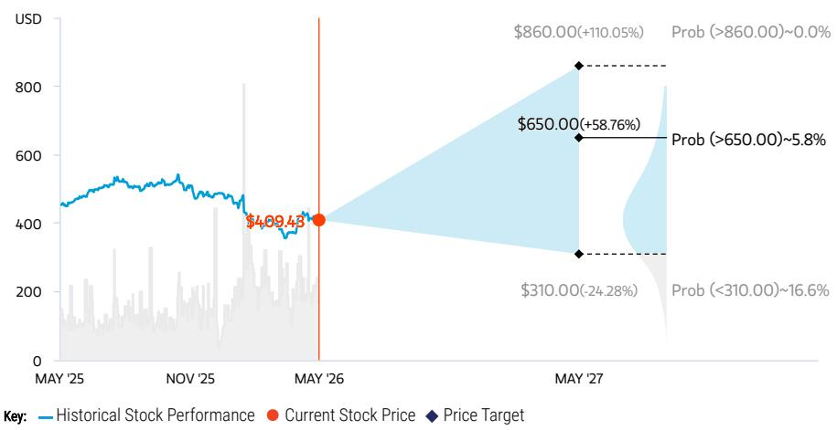

line

| Date     | Historical Stock Performance | Current Stock Price | Price Target |
| -------- | ----------------------------- | ------------------- | ------------ |
| MAY '25  | ~450                          | -                   | -            |
| NOV '25  | ~500                          | -                   | -            |
| MAY '26  | $409.43                       | $409.43             | -            |
| MAY '27  | -                             | $860.00(+110.05%)   | $650.00(+58.76%) |
| MAY '27  | -                             | $310.00(-24.28%)    | $310.00(-16.6%) |

Source: Refinitiv, MS, MS Institutional Equities Division. The probabilities of our Bull, Base, and Bear case scenarios playing out were estimated with implied volatility data from the options market as of 14 May 2026. All figures are approximate risk-neutral probabilities of the stock reaching beyond the scenario price in either three-months' or one-years' time. View explanation of Options Probabilities methodology here

# OVERWEIGHT THESIS

■ Strong positioning for public cloud adoption & AI, large distribution channels and installed customer base, and expanding margins supports EPS growth. Weaker cyclical environment improves as cloud optimizations complete - LT trends remain durable.   
■ Teens revenue growth, opex discipline and strong capital return lead to durable mid- to high-teens total return profile long term.   
At \~30x CY27e GAAP EPS, the durability of Microsoft's earnings growth and the company's premium return profile remains underpriced. Multiple expansion and positive estimate revisions will come from greater than expected strength in commercial businesses including Azure.

Consensus Rating Distribution   
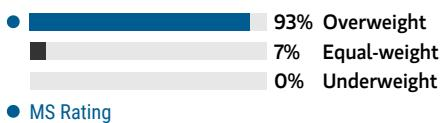

bar

| Category     | Value |
| ------------ | ----- |
| Overweight   | 93%   |
| Equal-weight | 7%    |
| Underweight  | 0%    |

Source: Refinitiv, MS

# Risk Reward Themes

<table><tr><td>New Data Era:</td><td>Positive</td></tr><tr><td>Pricing Power:</td><td>Positive</td></tr><tr><td>Secular Growth:</td><td>Positive</td></tr></table>

View descriptions of Risk Rewards Themes here

# BULL CASE

# \$860.00

# \~35x Bull Case CY27e EPS: \$24.42

Azure, O365 & Robust Contribution from AI Drive Top-Line Growth. Acceleration in Azure growth, adoption of higher priced M365 Commercial SKUs and continued seat growth, and robust adoption of Azure AI services and Microsoft AI Copilots across business lines drive mid-teens revenue CAGR in the coming years. Operating margins expand to \~49.3% by CY27 and CY27e EPS is \$24.42. \~35x PE represents a premium to large cap software peers, but roughly inline with Hist Avg PEG at \~1.4x given >20% EPS CAGR.

# BASE CASE

# \$650.00

# \~30x Base Case CY27e EPS of \$21.76

Azure, M365 & Ramping Contribution from AI Drive Top-Line Growth. Durability of Azure growth, adoption of higher priced M365 Commercial SKUs and continued seat growth, and ramping adoption of Azure AI services & Microsoft AI Copilots across business lines drive low-teens rev CAGR ahead. Operating margins expand beyond \~47.3% by CY27 and CY27e EPS is \$21.76. 30x PE is a premium to large cap software peers, given strong positioning and execution. 1.5x PEG is inline with MSFT historical PEG.

# BEAR CASE

# \$310.00

# \~16x Bear Case CY27e EPS: \$19.70

Macro, Scale & Limited AI Adoption Drives Top-Line Growth Deceleration. Azure growth continues deceleration given scale, while M365 reaches penetration and adoption of Azure AI services & Microsoft AI Copilots across business lines remains limited. This drives low double-digit rev CAGR. Operating margins only expand to \~45.3% by CY27 from gross margin pressure and CY27e EPS is \$19.70. \~16x PE is a discount to large cap software peers and a discount on a PEG.

# Risk Reward – Microsoft (MSFT.O)

KEY EARNINGS INPUTS 

<table><tr><td>Drivers</td><td>2025</td><td>2026e</td><td>2027e</td><td>2028e</td></tr><tr><td>Azure Revenue Growth (%)</td><td>29.7</td><td>30.2</td><td>26.4</td><td>22.4</td></tr><tr><td>Server Products On-Prem Growth (%)</td><td>(2.0)</td><td>(1.0)</td><td>(1.0)</td><td>(1.0)</td></tr><tr><td>Gross Margins (%)</td><td>68.8</td><td>67.7</td><td>66.2</td><td>65.7</td></tr><tr><td>Operating Margins (%)</td><td>45.6</td><td>46.6</td><td>46.9</td><td>47.7</td></tr><tr><td>GAAP EPS Growth (%)</td><td>15.6</td><td>27.2</td><td>13.6</td><td>22.0</td></tr></table>

# INVESTMENT DRIVERS

- Sustainability of commercial growth, cloud momentum, improving cloud margins   
- Improving PC data points

# GLOBAL REVENUE EXPOSURE

0-10% APAC, ex Japan, Mainland China and India   
0-10% India   
0-10% Japan   
0-10% Latin America   
0-10% MEA   
0-10% Mainland China   
0-10% UK   
10-20% Europe ex UK   
50-60% North America

Source: MS Estimate View explanation of regional hierarchies here

# MS ALPHA MODELS

3/5 BEST

24 Month Horizon

2/5
MOST

3 Month Horizon

Source: Refinitiv, FactSet, MS; 1 is the highest favored Quintile and 5 is the least favored Quintile

# RISKS TO PT/RATING

# RISKS TO UPSIDE

• Cloud adoption accelerates, with Azure as convincing winner   
- AI leadership results in substantial revenue contribution over-time   
- Operational efficiencies leading to greater than anticipated economies of scale and margin expansion   
- Weak macro impacting IT spending   
- On-premises cannibalization by Cloud   
- Increased investments hurt margin expansion   
• AI adoption proves limited

# RISKS TO DOWNSIDE

# OWNERSHIP POSITIONING

<table><tr><td>Inst. Owners, % Active</td><td>54.4%</td><td></td><td></td><td></td></tr><tr><td>HF Sector Long/Short Ratio</td><td>2x</td><td></td><td></td><td></td></tr><tr><td>HF Sector Net Exposure</td><td>25.3%</td><td></td><td></td><td></td></tr></table>

Refinitiv; MSPB Content. Includes certain hedge fund exposures held with MSPB. Information may be inconsistent with or may not reflect broader market trends. Long/Short Ratio = Long Exposure / Short exposure. Sector % of Total Net Exposure = (For a particular sector: Long Exposure - Short Exposure) / (Across all sectors: Long Exposure – Short Exposure).

# MS ESTIMATES VS. CONSENSUS

<table><tr><td colspan="3">FY Jun 2026e</td></tr><tr><td rowspan="2">Sales / Revenue ($, mm)</td><td rowspan="2">327,677</td><td>329,533</td></tr><tr><td>329,373</td></tr><tr><td rowspan="2">EBITDA ($, mm)</td><td rowspan="2">184,508</td><td>196,656</td></tr><tr><td>197,457</td></tr><tr><td rowspan="3">Net income ($, mm)</td><td rowspan="3">118,614</td><td>125,366</td></tr><tr><td>129,248</td></tr><tr><td>130,613</td></tr></table>

<table><tr><td>EPS ($)</td><td>16.70</td><td>17.35</td></tr><tr><td></td><td>Mean</td><td>MS Estimates</td></tr></table>

Source: Refinitiv, MS

# Risk Reward – NVIDIA Corp. (NVDA.O)

Top Pick

OW as large language model enthusiasm is transforming cloud capex

# PRICE TARGET \$260.00

\~26 our MW CY27 EPS estimate of \$10.05, in-line with large cap AI peer AVGO, and a premium to semis overall. Reflecting our higher conviction in upward revisions to estimates, and premium margin/ growth profile within the space

<table><tr><td>Consensus Price Target Distribution</td><td>$138.00</td><td>$268.03</td><td>$432.78</td></tr><tr><td></td><td></td><td>MS PT</td><td></td></tr><tr><td></td><td></td><td>Mean</td><td>MS Estimates</td></tr><tr><td colspan="4">Source: Refinitiv, MS</td></tr></table>

RISK REWARD CHART AND OPTIONS IMPLIED PROBABILITIES (12M)   
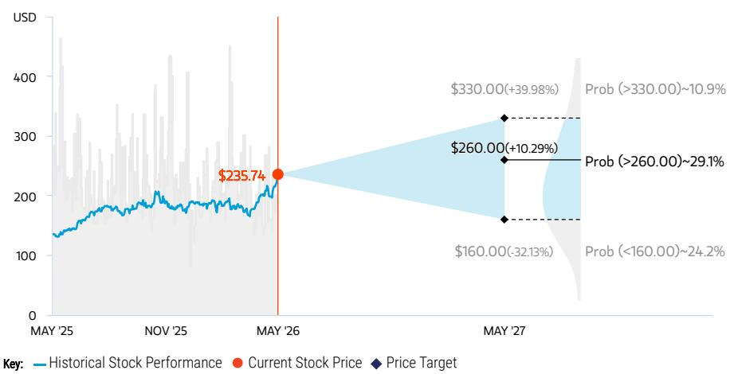

line

| Date       | Historical Stock Performance | Current Stock Price | Price Target |
| ---------- | ----------------------------- | ------------------- | ------------ |
| MAY '26    | $235.74                       | -                   | -            |
| MAY '27    | -                             | $260.00             | $160.00      |
| MAY '27    | -                             | $330.00             | $330.00      |
| MAY '27    | -                             | -                   | -            |

Source: Refinitiv, MS, MS Institutional Equities Division. The probabilities of our Bull, Base, and Bear case scenarios playing out were estimated with implied volatility data from the options market as of 14 May 2026. All figures are approximate risk-neutral probabilities of the stock reaching beyond the scenario price in either three-months' or one-years' time. View explanation of Options Probabilities methodology here

# OVERWEIGHT THESIS

■ Blackwell remains the premiere solution for gen-AI workloads, where compute demand continues to outstrip supply   
■ We see continued upward pressure to estimates as demand strength continues, with Rubin expected to maintain Nvidia's performance leadership position

Consensus Rating Distribution   
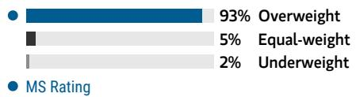

bar

| Category | Value (%) |
|---|---|
| Overweight | 93 |
| Equal-weight | 5 |
| Underweight | 2 |
MS Rating

Source: Refinitiv, MS

Risk Reward Themes 

<table><tr><td>New Data Era:</td><td>Positive</td></tr><tr><td>Pricing Power:</td><td>Positive</td></tr><tr><td>Secular Growth:</td><td>Positive</td></tr></table>

View descriptions of Risk Rewards Themes here

# BULL CASE

# \$330.00

\~30x bull case MW CY27 EPS of \$11

Bull case has DC revenues continuing to grow through 2027. Upside from networking, GB300 based systems, networking, and software create potential for a full stack AI computing company worthy of an even greater valuation premium

- Higher margin data center and AI-focused software and services growth accelerates   
- GPU based AI PC gains traction, widely increasing the client TAM   
- Automotive opportunity takes off, allowing the company to earn recurring, per-car licensing revenue

# BASE CASE

\~26x our MW CY27 EPS of \$10.05   
\~26x valuation is a premium to the semis group, and in-line with large cap AI peer AVGO. reflecting the expansion in all AI names as well as our higher conviction in estimates given NVIDIA's higher AI exposure. We believe that NVIDIA should trade at a premium given its higher probability of upward revisions in the near term.   
- Revenue grows by 63.8% in 2026 and 27.8% in 2027

# \$260.00

# BEAR CASE

# \$160.00

\~18x bear case MW CY27 EPS of \$9

Two key debates both go the wrong direction, causing investors to question future prospects for growth

- Growth in DC slows substantially as supply catches up to demand faster than anticipated   
- AI development costs come down materially, a strong competitor enters the market to take market share, or customers begin insourcing custom hardware solutions   
- Greater than expected impact from tariff headwinds and export controls

# Risk Reward – NVIDIA Corp. (NVDA.O)

KEY EARNINGS INPUTS 

<table><tr><td>Drivers</td><td>2026</td><td>2027e</td><td>2028e</td><td>2029e</td></tr><tr><td>GAAP Revenue ($, mm)</td><td>215,938</td><td>353,807</td><td>452,409</td><td>557,971</td></tr><tr><td>MW Gross Margin (%)</td><td>71.3</td><td>74.5</td><td>74.2</td><td>74.8</td></tr><tr><td>MW EPS ($)</td><td>4.61</td><td>7.92</td><td>10.05</td><td>12.96</td></tr><tr><td>Inventory ($, mm)</td><td>21,403</td><td>31,963</td><td>35,022</td><td>42,675</td></tr><tr><td>DOI</td><td>123.3</td><td>126.6</td><td>107.6</td><td>66.5</td></tr></table>

# INVESTMENT DRIVERS

• Growth in AI capex from customers   
- Next gen GPUs continue to outpace the competition   
- Systems approach allows for higher monetization over time   
- New drivers emerge for Nvidia such as AI PCs, autonomous vehicles, robotics, and software

# GLOBAL REVENUE EXPOSURE

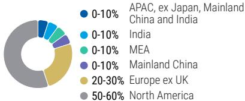

pie

| Region | Percentage (%) |
| :--- | :--- |
| APAC, ex Japan, Mainland China and India | 0-10 |
| India | 0-10 |
| MEA | 0-10 |
| Mainland China | 0-10 |
| Europe ex UK | 20-30 |
| North America | 50-60 |

Source: MS Estimate View explanation of regional hierarchies here

MS ALPHA MODELS 

<table><tr><td>5/5BEST</td><td>24 MonthHorizon</td><td>4/5MOST</td><td>3 MonthHorizon</td></tr></table>

Source: Refinitiv, FactSet, MS; 1 is the highest favored Quintile and 5 is the least favored Quintile

# RISKS TO PT/RATING

# RISKS TO UPSIDE

- Growth in training and inference propel data center revenue   
• Gaming sales accelerate as GPU based AI PCs gain traction   
• Nvidia can recapture lost revenue in China

# RISKS TO DOWNSIDE

- AI end markets don't materialize as expected, customers sharply reduce GPU purchases   
• AMD reemerges as a viable GPU competitor   
- Cloud customers outside of Google are able to develop competitive custom hardware

# OWNERSHIP POSITIONING

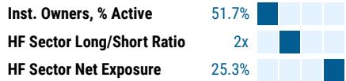

bar

| Category                  | Value   |
| ------------------------- | ------- |
| Inst. Owners, % Active    | 51.7%   |
| HF Sector Long/Short Ratio | 2x      |
| HF Sector Net Exposure    | 25.3%   |

Refinitiv; MSPB Content. Includes certain hedge fund exposures held with MSPB. Information may be inconsistent with or may not reflect broader market trends. Long/Short Ratio = Long Exposure / Short exposure. Sector % of Total Net Exposure = (For a particular sector: Long Exposure - Short Exposure) / (Across all sectors: Long Exposure – Short Exposure).

MS ESTIMATES VS. CONSENSUS 

<table><tr><td colspan="2">[FY Dec 2027e]</td></tr><tr><td>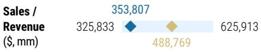</td><td></td></tr><tr><td>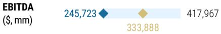</td><td></td></tr><tr><td>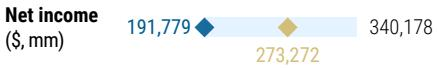</td><td></td></tr><tr><td>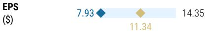</td><td></td></tr><tr><td colspan="2">Source: Refinitiv, MS</td></tr></table>

◆ Mean ◆ MS Estimates   
Source: Refinitiv, MS

# Risk Reward – Meta Platforms Inc (META.O)

Top Pick

The Age of Efficiency

# PRICE TARGET \$775.00

Our price target is determined using a discounted cash flow/long-term EBITDA multiple. It implies a $\sim 23x$ '27 P/E Multiple. Our DCF uses an $\sim 8\%$ WACC and a $\sim 3\%$ terminal growth rate

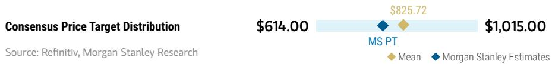

bar_line

| Scenario | Value     |
| -------- | --------- |
| MS PT    | $614.00   |
| MS Estimates | $825.72  |
| MS Estimates | $1,015.00 |

RISK REWARD CHART AND OPTIONS IMPLIED PROBABILITIES (12M)   
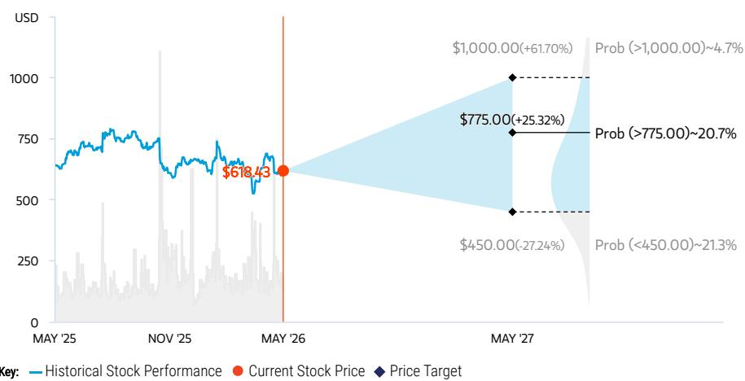

line

| Date     | Historical Stock Performance | Current Stock Price | Price Target |
| -------- | ----------------------------- | ------------------- | ------------ |
| MAY '25  | ~750                          | -                   | -            |
| NOV '25  | ~650                          | -                   | -            |
| MAY '26  | $618.43                       | $618.43             | -            |
| MAY '27  | -                             | $775.00             | $1,000.00    |
| MAY '27  | -                             | -                   | $450.00      |
| MAY '27  | -                             | -                   | $775.00      |
| MAY '27  | -                             | -                   | $1,000.00    |
| MAY '27  | -                             | -                   | $450.00      |
| MAY '27  | -                             | -                   | $775.00      |
| MAY '27  | -                             | -                   | $1,000.00    |
| MAY '27  | -                             | -                   | $450.0<fcel>

Source: Refinitiv, MS, MS Institutional Equities Division. The probabilities of our Bull, Base, and Bear case scenarios playing out were estimated with implied volatility data from the options market as of 14-May 2026. All figures are approximate risk-neutral probabilities of the stock reaching beyond the scenario price in either three-months' or one-years' time. View explanation of Options Probabilities methodology here

# OVERWEIGHT THESIS

A Structural Pivot to Focus on Multi-Year Efficiency, Productivity and Leaner Operations... We think META's "year of efficiency" is more than just a 365 day change...but rather a structural and cultural pivot to operate leaner and with a greater focus on investor returns...even through investment.   
■ Importantly, Revenue and Engagement Trends Are Also Improving Across META's Platform... our industry and company conversations speak to progress driving incremental Reels engagement and monetization...and traction improving ad measurement/attribution in the post IDFA world.   
■ 3 Underappreciated "Call Options" including 1) further AI driven upside, 2) subscription adoption and 3) click-to-message.

Consensus Rating Distribution   
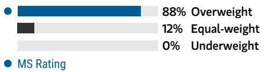

bar

| Category     | Value |
| ------------ | ----- |
| Overweight   | 88%   |
| Equal-weight | 12%   |
| Underweight  | 0%    |

Source: Refinitiv, MS

# Risk Reward Themes

<table><tr><td>New Data Era:</td><td>Positive</td></tr><tr><td>Self-help:</td><td>Positive</td></tr><tr><td>Technology Diffusion:</td><td>Positive</td></tr></table>

View descriptions of Risk Rewards Themes here

# BULL CASE

# \$1,000.00

# BASE CASE

# \$775.00

# BEAR CASE

# \$450.00

# Implied \~28x '27 P/E

AI investments drive increased engagement and lead to new products/tools, which supports outsized ad monetization and revenue growth. Execution on newer offerings (like click to message) could also contribute to higher than expected growth. META could also drive further efficiency gains and be more successful in closing the Reels monetization gap. Reality Labs losses moderate and macro environment is better than expected.

# Implied \~23X base case '27 P/E

Ad revenue grows \~28% in '26 as META's AI investments drive incremental Reels engagement/monetization and support improved performance and ad measurement/attribution across the Family of Apps. We also see META continuing to focus on efficiency and improving productivity.

# Implied \~14x '27 P/E

Declines in engagement and/or evidence of Reels monetization ramping more slowly than expected could lead to lower growth and greater uncertainty. We also watch for any macro uncertainty, regulation that limits META's ability to target ads, Reality Labs losses widen more materially than expected, and higher capital intensity from mis-execution around the data center build. Any additional opex and capex could weigh on operating income growth and FCF.

# Risk Reward – Meta Platforms Inc (META.O)

KEY EARNINGS INPUTS 

<table><tr><td>Drivers</td><td>2025</td><td>2026e</td><td>2027e</td><td>2028e</td></tr><tr><td>Constant Currency % Growth (%)</td><td>22.5</td><td>26.2</td><td>20.5</td><td>18.3</td></tr><tr><td>Operating income (GAAP) ($, mm)</td><td>83,276</td><td>92,944</td><td>104,250</td><td>108,654</td></tr><tr><td>Consolidated Total Daily Active Users (mm)</td><td>2,239.9</td><td>2,294.5</td><td>2,344.5</td><td>2,389.2</td></tr></table>

# INVESTMENT DRIVERS

\- We are positive on META's structural pivot towards efficiency and improving revenue, engagement and Reels. We continue to monitor META's progress on call options (AI, subscriptions, click-to-message) and further investment in AI/data centers.

# GLOBAL REVENUE EXPOSURE

  
Source: MS Estimate View explanation of regional hierarchies here

# MS ALPHA MODELS

3/5 BEST

24 Month Horizon

2/5 MOST

3 Month Horizon

Source: Refinitiv, FactSet, MS; 1 is the highest favored Quintile and 5 is the least favored Quintile

# RISKS TO PT/RATING

# RISKS TO UPSIDE

- Faster than expected Reels monetization & higher engagement growth   
- Increased benefit from AI investment   
• Revenue driven by subscriptions and/or click-to-message ads   
• Further efficiency improvements drive outsized FCF growth

# RISKS TO DOWNSIDE

• Macro pressures/weaker consumer spend  
• Regulation impacts ability to target ads   
• Reality labs losses widen further   
- Mis-execution risk could result in higher LT capital intensity

# OWNERSHIP POSITIONING

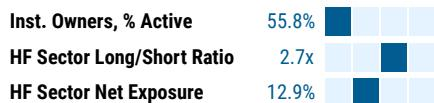  
Refinitiv; MSPB Content. Includes certain hedge fund exposures held with MSPB. Information may be inconsistent with or may not reflect broader market trends. Long/Short Ratio = Long Exposure / Short exposure. Sector % of Total Net Exposure = (For a particular sector: Long Exposure - Short Exposure) / (Across all sectors: Long Exposure – Short Exposure).

# MS ESTIMATES VS. CONSENSUS

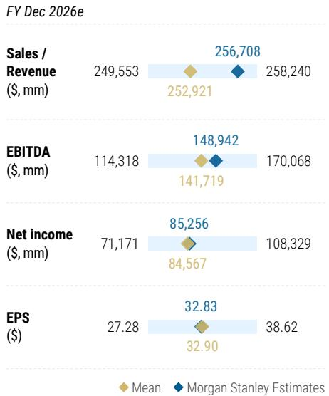  
Source: Refinitiv, MS

# Risk Reward – Alphabet Inc. (GOOGL.O)

Alphabet Inc.

# PRICE TARGET \$375.00

Our price target is determined using a discounted cash flow/discount to long-term EBITDA multiple. It implies a \~24X '27 P/E Multiple. Our DCF uses a \~8% WACC and a \~3% terminal growth rate (in line with other growth-oriented internet companies)

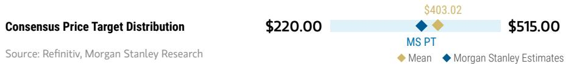

bar_line

| Category | Value    |
| -------- | -------- |
| MS PT    | $403.02  |
| $515.00  | $515.00  |
| Consensus Price Target Distribution | $220.00  |

RISK REWARD CHART AND OPTIONS IMPLIED PROBABILITIES (12M)   
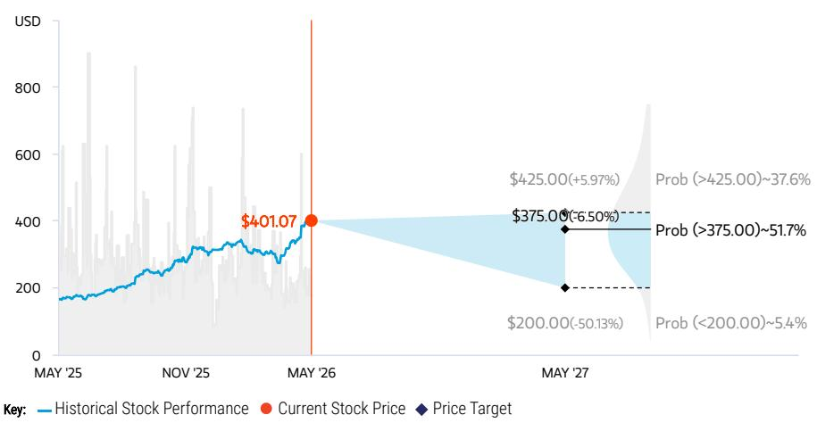

line

| Date     | Historical Stock Performance | Current Stock Price |
| -------- | ----------------------------- | ------------------- |
| MAY '26  | $401.07                       | $401.07             |
| MAY '27  | $375.00 (-6.50%)              | $425.00 (+5.97%)   |
| Prob (May '27) | -                           | $375.00 (~51.7%)    |
| Prob (<May '27) | -                          | $200.00 (~5.4%)    |

Source: Refinitiv, MS, MS Institutional Equities Division. The probabilities of our Bull, Base, and Bear case scenarios playing out were estimated with implied volatility data from the options market as of 14 May 2026. All figures are approximate risk-neutral probabilities of the stock reaching beyond the scenario price in either three-months' or one-years' time. View explanation of Options Probabilities methodology here

# OVERWEIGHT THESIS

■ Continued AI-driven platform-level innovation on Search, YouTube, Cloud, and with other offerings improve confidence in the durability of long term growth.   
■ Continued expense discipline leads to operating leverage and upward revisions on EPS and FCF estimates.

Consensus Rating Distribution   
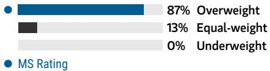

bar

| Category | Value (%) |
|---|---|
| Overweight | 87 |
| Equal-weight | 13 |
| Underweight | 0 |
| MS Rating | |

Source: Refinitiv, MS

# Risk Reward Themes

Secular Growth: Positive
New Data Era: Positive

View descriptions of Risk Rewards Themes here

# BULL CASE

# \$425.00

Implied \~15X '27 bull case EBITDA.

Faster innovation and Search/GCP acceleration lead to multiple expansion and higher earnings power. Search revenue accelerates as AI-driven innovation delivers meaningful upside to engagement. New AI offerings prove incremental to the top and bottom line and don't cannibalize core Search. YouTube and Cloud become even bigger contributors to top-line growth, and operate at a higher margin than in our base case.

# BASE CASE

# \$375.00

Implied \~14X '27 base case EBITDA.

Assumes pragmatic search revenue growth in '26, continued incremental platform monetization and Google Cloud acceleration in '26. As GOOGL continues platform-level innovation on Search and other categories, we assume pragmatic revenue/EBITDA growth. GOOGL introduces new AI offerings which increase confidence in the durability of long term growth and calm fears around competition. Google Cloud accelerates driven by new partnerships and growing backlog.

# BEAR CASE

# \$200.00

Implied \~8X '27 bear case EBITDA.

Global ad growth slows further and margins face pressure. Assumes slower search advertising growth, and that ad spending slows further. Expense discipline fails to materialize leading to lower than expected margin expansion and adj. EBITDA. New AI products create greater than expected margin pressure due to lower monetization rates and increased compute intensity.

# Risk Reward – Alphabet Inc. (GOOGL.O)

KEY EARNINGS INPUTS 

<table><tr><td>Drivers</td><td>2025</td><td>2026e</td><td>2027e</td><td>2028e</td></tr><tr><td>Total operating income (GAAP) ($, mm)</td><td>129,039</td><td>179,101</td><td>230,479</td><td>279,692</td></tr><tr><td>GAAP Operating Income (Loss) ($, mm)</td><td>137,054</td><td>186,576</td><td>237,679</td><td>286,242</td></tr></table>

# INVESTMENT DRIVERS

- Search advertising spend continues to gain share of global advertising budgets.   
- Mobile search advertising continues to take share of online budgets.   
• Investments in video driving longer-term monetization at YouTube.   
• Moderation of expense growth.

# GLOBAL REVENUE EXPOSURE

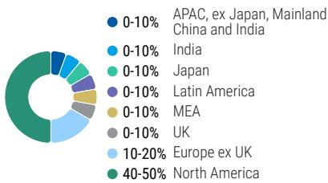

pie

| Region | Percentage (%) |
| :--- | :--- |
| APAC, ex Japan, Mainland China and India | 0-10 |
| India | 0-10 |
| Japan | 0-10 |
| Latin America | 0-10 |
| MEA | 0-10 |
| UK | 0-10 |
| Europe ex UK | 10-20 |
| North America | 40-50 |

Source: MS Estimate View explanation of regional hierarchies here

# MS ALPHA MODELS

5/5

BEST

24 Month

Horizon

3/5

MOST

3 Month

Horizon

Source: Refinitiv, FactSet, MS; 1 is the highest favored Quintile and 5 is the least favored Quintile

# RISKS TO PT/RATING

# RISKS TO UPSIDE

- New products generate higher than expected top line contribution.   
• Capital returns through greater share buybacks.   
- Hiring and/or spend per headcount is lower than expected.

# RISKS TO DOWNSIDE

- High exposure to SMB and travel could pressure ad revenue in a recession   
- Improved disclosure around the Google and Other Alphabet segments may not decrease the overall investment activity of the business.

# OWNERSHIP POSITIONING

Inst. Owners, % Active

HF Sector Long/Short Ratio

HF Sector Net Exposure

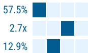

Refinitiv; MSPB Content. Includes certain hedge fund exposures held with MSPB. Information may be inconsistent with or may not reflect broader market trends. Long/Short Ratio = Long Exposure / Short exposure. Sector % of Total Net Exposure = (For a particular sector: Long Exposure - Short Exposure) / (Across all sectors: Long Exposure – Short Exposure).

# MS ESTIMATES VS. CONSENSUS

FY Dec 2026e

<table><tr><td>Sales / Revenue($, mm)</td><td>471,527</td><td>497,846</td><td>513,290</td></tr><tr><td></td><td colspan="3">485,912</td></tr></table>

<table><tr><td>EBITDA($, mm)</td><td>218,065</td><td>230,618</td><td>244,213</td></tr></table>

<table><tr><td rowspan="3">Net income($, mm)</td><td>135,617</td><td>180,445</td></tr><tr><td></td><td>184,932</td></tr><tr><td></td><td>173,534</td></tr></table>

<table><tr><td>EPS ($)</td><td>11.30</td><td>14.78</td><td>15.13</td></tr><tr><td></td><td>Mean</td><td colspan="2">MS Estimates</td></tr></table>

Source: Refinitiv, MS

# Risk Reward Reference links

1. View explanation of Options Probabilities methodology -   
Options\_Probabilities\_Exhibit\_Link.pdf   
2. View descriptions of Risk Rewards Themes - RR\_Themes\_Exhibit\_Link.pdf   
3. View explanation of regional hierarchies - GEG\_Exhibit\_Link.pdf   
4. View explanation of Theme/Exposure methodology -   
ESG\_Sustainable\_Solutions\_External\_Link.pdf   
5. View explanation of HERS methodology - ESG\_HERS\_External\_Link.pdf

# Disclosure Section

The information and opinions in MS were prepared by MS & Co. LLC, and/or MS C.T.V.M. S.A., and/or MS Mexico, Casa de Bolsa, S.A. de C.V., and/or MS Canada Limited. As used in this disclosure section, "MS" includes MS & Co. LLC, MS C.T.V.M. S.A., MS Mexico, Casa de Bolsa, S.A. de C.V., MS Canada Limited and their affiliates as necessary.

For important disclosures, stock price charts and equity rating histories regarding companies that are the subject of this report, please see the MS Disclosure Website at www.morganstanley.com/eqr/disclosures/webapp/generalresearch, or contact your investment representative or MS at 1585 Broadway, (Attention: Research Management), New York, NY, 10036 USA.

For valuation methodology and risks associated with any recommendation, rating or price target referenced in this research report, please contact the Client Support Team as follows: US/Canada +1 800 303-2495; Hong Kong +852 2848-5999; Latin America +1 718 754-5444 (U.S.); London +44 (0)20-7425-8169; Singapore +65 6834-6860; Sydney +61 (0)2-9770-1505; Tokyo +81 (0)3-6836-9000. Alternatively you may contact your investment representative or MS at 1585 Broadway, (Attention: Research Management), New York, NY 10036 USA.

# Analyst Certification

The following analysts hereby certify that their views about the companies and their securities discussed in this report are accurately expressed and that they have not received and will not receive direct or indirect compensation in exchange for expressing specific recommendations or views in this report: Josh Baer, CFA; Brian Nowak, CFA; Keith Weiss, CFA.

# Global Research Conflict Management Policy

MS has been published in accordance with our conflict management policy, which is available at www.morganstanley.com/institutional/research/conflictpolicies. A Portuguese version of the policy can be found at www.morganstanley.com.br

# Important Regulatory Disclosures on Subject Companies

The analyst or strategist (or a household member) identified below owns the following securities (or related derivatives): Josh Baer, CFA - Amazon.com Inc(common or preferred stock), Peloton Interactive, Inc.(common or preferred stock), Roblox Corporation(common or preferred stock), Uber Technologies Inc(common or preferred stock); Jonathan Eisenson - Adobe Inc.(common or preferred stock), Micron Technology Inc.(common or preferred stock), NVIDIA Corp.(common or preferred stock), Sprout Social Inc(common or preferred stock), Wolfspeed, INC(common or preferred stock); Gregory Gao - Alphabet Inc.(common or preferred stock), Amazon.com Inc(common or preferred stock), CrowdStrike Holdings Inc(common or preferred stock), Meta Platforms Inc(common or preferred stock), NVIDIA Corp.(common or preferred stock), Palo Alto Networks Inc(common or preferred stock), Reddit Inc(common or preferred stock), Samsara Inc(common or preferred stock), Shopify Inc(common or preferred stock), Snowflake Inc(common or preferred stock), Toast, Inc.(common or preferred stock), Uber Technologies Inc(common or preferred stock); Julian Herrera - Wolfspeed, INC(common or preferred stock); Nikhil Javeri - Wolfspeed, INC(common or preferred stock); Ryan Lountzis - Cloudflare Inc(common or preferred stock); Brian Nowak, CFA - Advanced Micro Devices(common or preferred stock), Micron Technology Inc.(common or preferred stock), NVIDIA Corp.(common or preferred stock), ON Semiconductor Corp.(common or preferred stock); Jamie Reynolds - Amazon.com Inc(common or preferred stock), Bumble Inc.(common or preferred stock), Meta Platforms Inc(common or preferred stock), Microsoft(common or preferred stock), NVIDIA Corp.(common or preferred stock); Mason Wayne - Amazon.com Inc(common or preferred stock); Keith Weiss, CFA - Uber Technologies Inc(common or preferred stock).

As of April 30, 2026, MS beneficially owned 1% or more of a class of common equity securities of the following companies covered in MS: Adobe Inc., Advanced Micro Devices, Aeva Technologies Inc, Airbnb Inc, Akamai Technologies, Inc., Allegro Microsystems Inc, Alphabet Inc., Amazon.com Inc, Ambarella Inc, Amplitude Inc., Analog Devices Inc., Appian Corp, AppLovin Corp, Arm Holdings plc, Asana Inc, Astera Labs Inc, Atlassian Corporation PLC, Autodesk, BILL Holdings Inc, Blackline Inc, Booking Holdings Inc, Box Inc, Broadcom Inc., C3.ai, Cadence Design Systems Inc, CCC Intelligent Solutions Holdings Inc, Check Point Software Technologies Ltd., Chewy Inc, Cloudflare Inc, CoreWeave, Coursera, Inc., Criteo SA, CrowdStrike Holdings Inc, Datadog, Inc., Descartes Systems Group Inc, DigitalOcean Holdings Inc, DocuSign Inc, DoorDash Inc, DoubleVerify Holdings Inc, Duolingo Inc, eBay Inc, Elastic NV, Electronic Arts Inc, Etsy Inc, Expedia Inc., Figma Inc, FIGS, Inc., Five9 Inc, Fortinet Inc., Freshworks Inc, Gen Digital Inc., GitLab Inc, GoDaddy Inc, HubSpot, Inc., Instacart, Intel Corporation, Intuit, IonQ Inc, Klaviyo, Inc, LegalZoom.com Inc, Lightspeed POS Inc., Liveramp Holdings Inc, Lyft Inc, Manhattan Associates Inc., Marvell Technology Group Ltd, Match Group Inc, Meta Platforms Inc, Microchip Technology Inc., Micron Technology Inc., Microsoft, monday.com Ltd, MongoDB Inc, Nebius Group NV, NICE Ltd., NVIDIA Corp., NXP Semiconductor NV, Okta, Inc., ON Semiconductor Corp., Opendoor Technologies Inc, Oracle Corporation, PagerDuty, Inc., Palantir Technologies Inc., Palo Alto Networks Inc, Peloton Interactive, Inc., Pinterest Inc, Qualcomm Inc., Qualys Inc, Rapid7 Inc, Reddit Inc, Revolve Group Inc, RingCentral Inc, Roblox Corporation, Sabre Corp, Salesforce, Inc., Samsara Inc, SanDisk Corporation., Semtech Corp., SentinelOne, Inc., ServiceNow Inc, ServiceTitan Inc, Shopify Inc, Shutterstock Inc, Silicon Laboratories Inc., Skyworks Solutions Inc, Snap Inc., Snowflake Inc., Sprinklr Inc, Sprout Social Inc, SPS Commerce Inc, Synopsys Inc., Take-Two Interactive Software, Tenable Holdings Inc, Texas Instruments, Toast, Inc., Trade Desk Inc, Twilio Inc, Uber Technologies Inc, UiPath Inc, Unity Software Inc, Varonis Systems, Inc., Vertex Inc., Wix.Com Ltd, Wolfspeed, INC, Workday Inc, Yelp Inc, Zeta Global Holdings Corp, Zillow Group Inc, ZoomInfo Technologies Inc, Zscaler Inc.

Within the last 12 months, MS managed or co-managed a public offering (or 144A offering) of securities of Airbnb Inc, Akamai Technologies, Inc., Alphabet Inc., Amazon.com Inc, Analog Devices Inc., Autodesk, Broadcom Inc., Check Point Software Technologies Ltd., Cloudflare Inc, Compass, Inc., CoreWeave, DigitalOcean Holdings Inc, DoorDash Inc, eBay Inc, Figma Inc, GlobalFoundries Inc, Intel Corporation, Klaviyo, Inc, Match Group Inc, Meta Platforms Inc, MNTN Inc, Navan Inc, Nebius Group NV, Netskope, Inc., NXP Semiconductor NV, ON Semiconductor Corp., Qualcomm Inc., Sabre Corp, Salesforce, Inc., Semtech Corp., Texas Instruments, Uber Technologies Inc, Via Transportation Inc, Wix.Com Ltd.

Within the last 12 months, MS has received compensation for investment banking services from Advanced Micro Devices, Aeva Technologies Inc, Airbnb Inc, Akamai Technologies, Inc., Allegro Microsystems Inc, Alphabet Inc., Amazon.com Inc, Amkor Technology Inc, Analog Devices Inc., Autodesk, Blackline Inc, Broadcom Inc., CCC Intelligent Solutions Holdings Inc, Check Point Software Technologies Ltd., Cloudflare Inc, CoreWeave, DigitalOcean Holdings Inc, DocuSign Inc, DoorDash Inc, eBay Inc, Figma Inc, HubSpot, Inc., Instacart, Intel Corporation, Intuit, IonQ Inc, Klaviyo, Inc, Match Group Inc, Meta Platforms Inc, Micron Technology Inc., Microsoft, MNTN Inc, Navan Inc, Netskope, Inc., NICE Ltd., NXP Semiconductor NV, ON Semiconductor Corp., Qualcomm Inc., Reddit Inc, RingCentral Inc, Sabre Corp, SailPoint Inc, Salesforce, Inc., Semtech Corp., ServiceNow Inc, Texas Instruments, Uber Technologies Inc, Via Transportation Inc, Wix.Com Ltd, Workday Inc, Zeta Global Holdings Corp.

In the next 3 months, MS expects to receive or intends to seek compensation for investment banking services from Adobe Inc., Advanced Micro Devices, Aeva Technologies Inc, Airbnb Inc, Akamai Technologies, Inc., Allegro Microsystems Inc, Alphabet Inc., Amazon.com Inc, Ambarella Inc, Amkor Technology Inc, Amplitude Inc., Analog Devices Inc., Appian Corp, AppLovin Corp, Arm Holdings plc, Asana Inc, Astera Labs Inc, Atlassian Corporation PLC, Autodesk, BILL Holdings Inc, Blackline Inc, Booking Holdings Inc, Box Inc, Broadcom Inc., Bumble Inc., C3.ai, Cadence Design Systems Inc, CCC Intelligent Solutions Holdings Inc, Check Point Software Technologies Ltd., Chewy Inc, Cloudflare Inc, Commerce.com Inc., CoreWeave, Coursera, Inc., Criteo SA, CrowdStrike Holdings Inc, Datadog, Inc., Descartes Systems Group Inc, DigitalOcean Holdings Inc, Docebo Inc., DocuSign Inc, DoorDash Inc, DoubleVerify Holdings Inc, Duolingo Inc, eBay Inc, Elastic NV, Electronic Arts Inc, Etsy Inc, Expedia Inc., Figma Inc, FIGS, Inc., Five9 Inc, Fortinet Inc., Freshworks Inc, Gen Digital Inc., GitLab Inc, GlobalFoundries Inc, GoDaddy Inc, HubSpot, Inc., Instacart, Intel Corporation, Intuit, IonQ Inc, JFrog Ltd., Klaviyo, Inc, LegalZoom.com Inc, Lightspeed POS Inc., Liveramp Holdings Inc, Lyft Inc, Marvell Technology Group Ltd, Match Group Inc,

Meta Platforms Inc, Microchip Technology Inc., Micron Technology Inc., Microsoft, MNTN Inc, monday.com Ltd, MongoDB Inc, Navan Inc, Navitas Semiconductor Corp, Netskope, Inc., NICE Ltd., NVIDIA Corp., NXP Semiconductor NV, Okta, Inc., ON Semiconductor Corp., Opendoor Technologies Inc, Oracle Corporation, PagerDuty, Inc., Palantir Technologies Inc., Palo Alto Networks Inc, Peloton Interactive, Inc., Pinterest Inc, Playtika Holding Corp, Qualcomm Inc., Qualys Inc, Rapid7 Inc, Reddit Inc, Revolve Group Inc, RingCentral Inc, Roblox Corporation, Sabre Corp, SailPoint Inc, Salesforce, Inc., Samsara Inc, SanDisk Corporation., Semtech Corp., SentinelOne, Inc., ServiceNow Inc, ServiceTitan Inc, Shopify Inc, Shutterstock Inc, Silicon Laboratories Inc., Skyworks Solutions Inc, Snap Inc., Snowflake Inc., Sprinklr Inc, Sprout Social Inc, SPS Commerce Inc, Synopsys Inc., Take-Two Interactive Software, Tenable Holdings Inc, Texas Instruments, Toast, Inc., Trade Desk Inc, Twilio Inc, Uber Technologies Inc, UiPath Inc, Unity Software Inc, Varonis Systems, Inc., Vertex Inc., Via Transportation Inc, Webtoon Entertainment Inc, Wix.Com Ltd, Wolfspeed, INC, Workday Inc, Yelp Inc, Zeta Global Holdings Corp, Zillow Group Inc, Zoom Communications, Zscaler Inc.

Within the last 12 months, MS has received compensation for products and services other than investment banking services from Adobe Inc., Advanced Micro Devices, Airbnb Inc, Alphabet Inc., Amazon.com Inc, Ambarella Inc, Amkor Technology Inc, Amplitude Inc., Analog Devices Inc., Asana Inc, Atlassian Corporation PLC, Autodesk, Blackline Inc, Booking Holdings Inc, Box Inc, Broadcom Inc., Cadence Design Systems Inc, CCC Intelligent Solutions Holdings Inc, Check Point Software Technologies Ltd., Cloudflare Inc, CoreWeave, CrowdStrike Holdings Inc, DocuSign Inc, DoorDash Inc, eBay Inc, Electronic Arts Inc, Expedia Inc., Freshworks Inc, Gen Digital Inc., GitLab Inc, GlobalFoundries Inc, HubSpot, Inc., Intel Corporation, Intuit, JFrog Ltd., Klaviyo, Inc, Marvell Technology Group Ltd, Match Group Inc, Meta Platforms Inc, Microchip Technology Inc., Micron Technology Inc., Microsoft, monday.com Ltd, MongoDB Inc, NICE Ltd., NVIDIA Corp., NXP Semiconductor NV, ON Semiconductor Corp., Oracle Corporation, Palo Alto Networks Inc, Pinterest Inc, Qualcomm Inc., Reddit Inc, Revolve Group Inc, RingCentral Inc, Sabre Corp, Salesforce, Inc., SentinelOne, Inc., ServiceNow Inc, Silicon Laboratories Inc., Snowflake Inc., Synopsys Inc., Take-Two Interactive Software, Texas Instruments, Toast, Inc., Uber Technologies Inc, UiPath Inc, Varonis Systems, Inc., Workday Inc, WW International Inc, Zillow Group Inc, Zoom Communications, Zscaler Inc.

Within the last 12 months, MS has provided or is providing investment banking services to, or has an investment banking client relationship with, the following company: Adobe Inc., Advanced Micro Devices, Aeva Technologies Inc, Airbnb Inc, Akamai Technologies, Inc., Allegro Microsystems Inc, Alphabet Inc., Amazon.com Inc, Ambarella Inc, Amkor Technology Inc, Amplitude Inc., Analog Devices Inc., Appian Corp, AppLovin Corp, Arm Holdings plc, Asana Inc, Astera Labs Inc, Atlassian Corporation PLC, Autodesk, BILL Holdings Inc, Blackline Inc, Booking Holdings Inc, Box Inc, Broadcom Inc., Bumble Inc., C3.ai, Cadence Design Systems Inc, CCC Intelligent Solutions Holdings Inc, Check Point Software Technologies Ltd., Chewy Inc, Cloudflare Inc, Commerce.com Inc., Compass, Inc., CoreWeave, Coursera, Inc., Criteo SA, CrowdStrike Holdings Inc, Datadog, Inc., Descartes Systems Group Inc, DigitalOcean Holdings Inc, Docebo Inc., DocuSign Inc, DoorDash Inc, DoubleVerify Holdings Inc, Duolingo Inc, eBay Inc, Elastic NV, Electronic Arts Inc, Etsy Inc, Expedia Inc., Figma Inc, FIGS, Inc., Five9 Inc, Fortinet Inc., Freshworks Inc, Gen Digital Inc., GitLab Inc, GlobalFoundries Inc, GoDaddy Inc, HubSpot, Inc., Instacart, Intel Corporation, Intuit, IonQ Inc, JFrog Ltd., Klaviyo, Inc, LegalZoom.com Inc, Lightspeed POS Inc., Liveramp Holdings Inc, Lyft Inc, Marvell Technology Group Ltd, Match Group Inc, Meta Platforms Inc, Microchip Technology Inc., Micron Technology Inc., Microsoft, MNTN Inc, monday.com Ltd, MongoDB Inc, Navan Inc, Navitas Semiconductor Corp, Nebius Group NV, Netskope, Inc., NICE Ltd., NVIDIA Corp., NXP Semiconductor NV, Okta, Inc., ON Semiconductor Corp., Opendoor Technologies Inc, Oracle Corporation, PagerDuty, Inc., Palantir Technologies Inc., Palo Alto Networks Inc, Peloton Interactive, Inc., Pinterest Inc, Playtika Holding Corp, Qualcomm Inc., Qualys Inc, Rapid7 Inc, Reddit Inc, Revolve Group Inc, RingCentral Inc, Roblox Corporation, Sabre Corp, SailPoint Inc, Salesforce, Inc., Samsara Inc, SanDisk Corporation., Semtech Corp., SentinelOne, Inc., ServiceNow Inc, ServiceTitan Inc, Shopify Inc, Shutterstock Inc, Silicon Laboratories Inc., Skyworks Solutions Inc, Snap Inc., Snowflake Inc., Sprinklr Inc, Sprout Social Inc, SPS Commerce Inc, Synopsys Inc., Take-Two Interactive Software, Tenable Holdings Inc, Texas Instruments, Toast, Inc., Trade Desk Inc, Twilio Inc, Uber Technologies Inc, UiPath Inc, Unity Software Inc, Varonis Systems, Inc., Vertex Inc., Via Transportation Inc, Webtoon Entertainment Inc, Wix.Com Ltd, Wolfspeed, INC, Workday Inc, Yelp Inc, Zeta Global Holdings Corp, Zillow Group Inc, Zoom Communications, Zscaler Inc.

Within the last 12 months, MS has either provided or is providing non-investment banking, securities-related services to and/or in the past has entered into an agreement to provide services or has a client relationship with the following company: Adobe Inc., Advanced Micro Devices, Airbnb Inc, Akamai Technologies, Inc., Alphabet Inc., Amazon.com Inc, Ambarella Inc, Amkor Technology Inc, Amplitude Inc., Analog Devices Inc., AppLovin Corp, Asana Inc, Atlassian Corporation PLC, Autodesk, Blackline Inc, Booking Holdings Inc, Box Inc, Broadcom Inc., Cadence Design Systems Inc, CCC Intelligent Solutions Holdings Inc, Check Point Software Technologies Ltd., Cloudflare Inc, Commerce.com Inc., CoreWeave, CrowdStrike Holdings Inc, Datadog, Inc., DocuSign Inc, DoorDash Inc, eBay Inc, Electronic Arts Inc, Etsy Inc, Expedia Inc., Five9 Inc, Fortinet Inc., Freshworks Inc, Gen Digital Inc., GitLab Inc, GlobalFoundries Inc, GoDaddy Inc, HubSpot, Inc., Intel Corporation, Intuit, IonQ Inc, JFrog Ltd., Klaviyo, Inc, Lyft Inc, Marvell Technology Group Ltd, Match Group Inc, Meta Platforms Inc, Microchip Technology Inc., Micron Technology Inc., Microsoft, monday.com Ltd, MongoDB Inc, Nebius Group NV, NICE Ltd., NVIDIA Corp., NXP Semiconductor NV, ON Semiconductor Corp., Opendoor Technologies Inc, Oracle Corporation, PagerDuty, Inc., Palo Alto Networks Inc, Pinterest Inc, Playtika Holding Corp, Qualcomm Inc., Qualys Inc, Reddit Inc, Revolve Group Inc, RingCentral Inc, Sabre Corp, Salesforce, Inc., Semtech Corp., SentinelOne, Inc., ServiceNow Inc, Shopify Inc, Silicon Laboratories Inc., Snap Inc., Snowflake Inc., Synopsys Inc., Take-Two Interactive Software, Texas Instruments, Toast, Inc., Twilio Inc, Uber Technologies Inc, UiPath Inc, Varonis Systems, Inc., Wix.Com Ltd, Wolfspeed, INC, Workday Inc, WW International Inc, Zillow Group Inc, Zoom Communications, Zscaler Inc.

An employee, director or consultant of MS is a director of eBay Inc, Elastic NV, Tenable Holdings Inc. This person is not a research analyst or a member of a research analyst's household.

MS & Co. LLC makes a market in the securities of Aeva Technologies Inc, Ambarella Inc, Amplitude Inc., Appian Corp, Asana Inc, Autodesk, Blackline Inc, Box Inc, Bumble Inc., Check Point Software Technologies Ltd., Coursera, Inc., Criteo SA, Docebo Inc., DoubleVerify Holdings Inc, Expedia Inc., FIGS, Inc., Five9 Inc, Freshworks Inc, Grindr Inc., HubSpot, Inc., LegalZoom.com Inc, Liveramp Holdings Inc, Manhattan Associates Inc., monday.com Ltd, PagerDuty, Inc., Playtika Holding Corp, Qualys Inc, Rapid7 Inc, Revolve Group Inc, RingCentral Inc, Sabre Corp, Shutterstock Inc, Silicon Laboratories Inc., Sprinklr Inc, Sprout Social Inc, SPS Commerce Inc, Tenable Holdings Inc, Twilio Inc, Varonis Systems, Inc., Vertex Inc., Webtoon Entertainment Inc, Yelp Inc, Zillow Group Inc, ZoomInfo Technologies Inc.

The equity research analysts or strategists principally responsible for the preparation of MS have received compensation based upon various factors, including quality of research, investor client feedback, stock picking, competitive factors, firm revenues and overall investment banking revenues. Equity Research analysts' or strategists' compensation is not linked to investment banking or capital markets transactions performed by MS or the profitability or revenues of particular trading desks.

MS and its affiliates do business that relates to companies/instruments covered in MS, including market making, providing liquidity, fund management, commercial banking, extension of credit, investment services and investment banking. MS sells to and buys from customers the securities/instruments of companies covered in MS on a principal basis. MS may have a position in the debt of the Company or instruments discussed in this report. MS trades or may trade as principal in the debt securities (or in related derivatives) that are the subject of the debt research report.

Certain disclosures listed above are also for compliance with applicable regulations in non-US jurisdictions.

# STOCK RATINGS

MS uses a relative rating system using terms such as Overweight, Equal-weight, Not-Rated or Underweight (see definitions below). MS does not assign ratings of Buy, Hold or Sell to the stocks we cover. Overweight, Equal-weight, Not-Rated and Underweight are not the equivalent of buy, hold and sell. Investors should carefully read the definitions of all ratings used in MS. In addition, since MS contains more complete information concerning the analyst's views, investors should carefully read MS, in its entirety, and not infer the contents from the rating alone. In any case, ratings (or research) should not be used or relied upon as investment advice. An investor's decision to buy or sell a stock should depend on individual circumstances (such as the investor's existing holdings) and other considerations.

# Global Stock Ratings Distribution

(as of April 30, 2026)

The Stock Ratings described below apply to MS's Fundamental Equity Research and do not apply to Debt Research produced by the Firm.

For disclosure purposes only (in accordance with FINRA requirements), we include the category headings of Buy, Hold, and Sell alongside our ratings of Overweight, Equal-weight, Not-Rated and Underweight. MS does not assign ratings of Buy, Hold or Sell to the stocks we cover. Overweight, Equal-weight, Not-Rated and Underweight are not the equivalent of buy, hold, and sell but represent recommended relative weightings (see definitions below). To satisfy regulatory requirements, we correspond Overweight, our most positive stock rating, with a buy recommendation; we correspond Equal-weight and Not-Rated to hold and Underweight to sell recommendations, respectively.

<table><tr><td></td><td colspan="2">Coverage Universe</td><td colspan="3">Investment Banking Clients (IBC)</td><td colspan="2">Other Material Investment ServicesClients (MISC)</td></tr><tr><td>Stock RatingCategory</td><td>Count</td><td>% of Total</td><td>Count</td><td>% of Total IBC</td><td>% of RatingCategory</td><td>Count</td><td>% of Total OtherMISC</td></tr><tr><td>Overweight/Buy</td><td>1546</td><td>42%</td><td>467</td><td>51%</td><td>30%</td><td>709</td><td>44%</td></tr><tr><td>Equal-weight/Hold</td><td>1568</td><td>43%</td><td>358</td><td>39%</td><td>23%</td><td>715</td><td>44%</td></tr><tr><td>Not-Rated/Hold</td><td>4</td><td>0%</td><td>0</td><td>0%</td><td>0%</td><td>1</td><td>0%</td></tr><tr><td>Underweight/Sell</td><td>555</td><td>15%</td><td>84</td><td>9%</td><td>15%</td><td>202</td><td>12%</td></tr><tr><td>Total</td><td>3,673</td><td></td><td>909</td><td></td><td></td><td>1627</td><td></td></tr></table>

Data include common stock and ADRs currently assigned ratings. Investment Banking Clients are companies from whom MS received investment banking compensation in the last 12 months. Due to rounding off of decimals, the percentages provided in the "% of total" column may not add up to exactly 100 percent.

# Analyst Stock Ratings

Overweight (O). The stock's total return is expected to exceed the average total return of the analyst's industry (or industry team's) coverage universe, on a risk-adjusted basis, over the next 12-18 months.

Equal-weight (E). The stock's total return is expected to be in line with the average total return of the analyst's industry (or industry team's) coverage universe, on a risk-adjusted basis, over the next 12-18 months.

Not-Rated (NR). Currently the analyst does not have adequate conviction about the stock's total return relative to the average total return of the analyst's industry (or industry team's) coverage universe, on a risk-adjusted basis, over the next 12-18 months.

Underweight (U). The stock's total return is expected to be below the average total return of the analyst's industry (or industry team's) coverage universe, on a risk-adjusted basis, over the next 12-18 months.

Unless otherwise specified, the time frame for price targets included in MS is 12 to 18 months.

# Analyst Industry Views

Attractive (A): The analyst expects the performance of his or her industry coverage universe over the next 12-18 months to be attractive vs. the relevant broad market benchmark, as indicated below.

In-Line (I): The analyst expects the performance of his or her industry coverage universe over the next 12-18 months to be in line with the relevant broad market benchmark, as indicated below. Cautious (C): The analyst views the performance of his or her industry coverage universe over the next 12-18 months with caution vs. the relevant broad market benchmark, as indicated below. Benchmarks for each region are as follows: North America - S&P 500; Latin America - relevant MSCI country index or MSCI Latin America Index; Europe - MSCI Europe; Japan - TOPIX; Asia - relevant MSCI country index or MSCI sub-regional index or MSCI AC Asia Pacific ex Japan Index.

# Stock Price, Price Target and Rating History (See Rating Definitions)

Alphabet Inc. (GOOGL.0) - As of 05/15/26 GMT in USD
Industry : Internet   
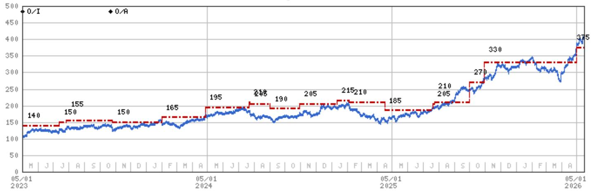

line

| Date       | Value |
| ---------- | ----- |
| 05/01 2023 | 140   |
| 05/01 2024 | 155   |
| 05/01 2024 | 165   |
| 05/01 2024 | 195   |
| 05/01 2024 | 205   |
| 05/01 2024 | 215   |
| 05/01 2024 | 210   |
| 05/01 2024 | 185   |
| 05/01 2024 | 205   |
| 05/01 2024 | 270   |
| 05/01 2024 | 330   |
| 05/01 2024 | 375   |

Stock Rating History: 5/1/21 : 0/I; 10/22/23 : 0/A   
Price Target History: 4/28/21 : 128.75; 7/27/21 : 150; 11/1/21 : 160; 1/19/22 : 171.5; 2/2/22 : 172.5; 4/27/22 : 163.5;   
5/31/22 : 150; 7/18/22 : 140; 7/27/22 : 145; 10/9/22 : 135; 10/26/22 : 125; 11/14/22 : 120; 1/17/23 : 125; 2/3/23 : 135;   
4/25/23 : 140; 7/12/23 : 150; 7/26/23 : 155; 10/25/23 : 150; 1/31/24 : 165; 4/26/24 : 195; 7/22/24 : 210; 7/24/24 : 205;   
9/2/24 : 190; 10/30/24 : 205; 1/12/25 : 215; 2/5/25 : 210; 4/16/25 : 185; 7/20/25 : 205; 7/23/25 : 210; 10/1/25 : 270;   
10/30/25 : 330; 4/30/26 : 375   
Source: MS Date Format : MM/DD/YY Price Target = No Price Target Assigned (NA)   
Stock Price (Not Covered by Current Analyst) — Stock Price (Covered by Current Analyst)   
Stock and Industry Ratings (abbreviations below) appear as ♦ Stock Rating/Industry View   
Stock Ratings: Overweight (O) Equal-weight (E) Underweight (U) Not-Rated (NR) No Rating Available (NA)   
Industry View: Attractive (A) In-line (I) Cautious (C) No Rating (NR)   
Effective January 13, 2014, the stocks covered by MS Asia Pacific will be rated relative to the analyst's industry (or industry team's) coverage.   
Effective January 13, 2014, the industry view benchmarks for MS Asia Pacific are as follows: relevant MSCI country index or MSCI sub-regional index or MSCI AC Asia Pacific ex Japan Index.

Amazon.com Inc (AMZN.0) - As of 05/15/26 GMT in USD
Industry : Internet   
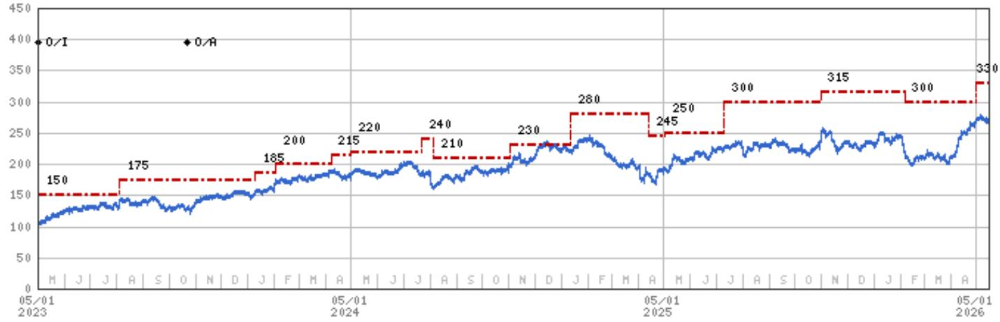

line

| Date       | Blue Line Value | Red Dashed Line Value |
|------------|-----------------|------------------------|
| 05/01 2023 | 100             | 150                    |
|            |                 |                        |
|            |                 | 175                    |
|            |                 |                        |
|            |                 | 185                    |
|            |                 | 200                    |
|            |                 | 215                    |
|            |                 | 220                    |
|            |                 | 240                    |
|            |                 | 210                    |
|            |                 | 230                    |
|            |                 | 280                    |
|            |                 | 245                    |
|            |                 | 250                    |
|            |                 | 300                    |
|            |                 | 315                    |
|            |                 | 300                    |
|            |                 | 330                    |

Stock Rating History: 5/1/21 : 0/I; 10/22/23 : 0/A   
Price Target History: 4/30/21 : 225; 7/30/21 : 215; 9/26/21 : 205; 10/29/21 : 200; 1/10/22 : 210; 4/29/22 : 190; 5/31/22 : 175;   
10/28/22 : 140; 2/3/23 : 150; 8/4/23 : 175; 1/10/24 : 185; 2/2/24 : 200; 4/7/24 : 215; 5/1/24 : 220; 7/22/24 : 240; 8/5/24 : 210;   
11/3/24 : 230; 1/12/25 : 280; 4/13/25 : 245; 5/2/25 : 250; 7/10/25 : 300; 10/31/25 : 315; 2/6/26 : 300; 4/30/26 : 330   
Source: MS Date Format : MM/DD/YY Price Target = No Price Target Assigned (NA)   
Stock Price (Not Covered by Current Analyst) — Stock Price (Covered by Current Analyst)   
Stock and Industry Ratings (abbreviations below) appear as ♦ Stock Rating/Industry View   
Stock Ratings: Overweight (O) Equal-weight (E) Underweight (U) Not-Rated (NR) No Rating Available (NA)   
Industry View: Attractive (A) In-line (I) Cautious (C) No Rating (NR)   
Effective January 13, 2014, the stocks covered by MS Asia Pacific will be rated relative to the analyst's industry (or industry team's) coverage.   
Effective January 13, 2014, the industry view benchmarks for MS Asia Pacific are as follows: relevant MSCI country index or MSCI sub-regional index or MSCI AC Asia Pacific ex Japan Index.

Meta Platforms Inc (META.0) - As of 05/15/26 GMT in USD
Industry : Internet   
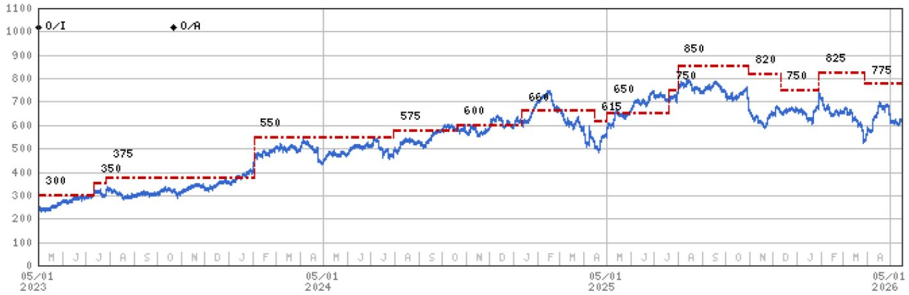

line

| Date       | Value |
| ---------- | ----- |
| 05/01 2023 | 300   |
| 05/01 2024 | 375   |
| 05/01 2024 | 550   |
| 05/01 2024 | 575   |
| 05/01 2024 | 600   |
| 05/01 2024 | 660   |
| 05/01 2024 | 615   |
| 05/01 2024 | 650   |
| 05/01 2024 | 750   |
| 05/01 2024 | 850   |
| 05/01 2024 | 820   |
| 05/01 2024 | 750   |
| 05/01 2024 | 825   |
| 05/01 2024 | 775   |

Stock Rating History: 5/1/21 : 0/I; 10/27/22 : E/I; 3/20/23 : 0/I; 10/22/23 : 0/A   
Price Target History: 4/29/21 : 375; 7/28/21 : 400; 10/26/21 : 365; 1/19/22 : 395; 2/3/22 : 360; 3/2/22 : 325; 4/28/22 : 330;   
5/31/22 : 300; 7/18/22 : 280; 8/18/22 : 225; 10/9/22 : 205; 10/27/22 : 105; 11/14/22 : 100; 1/17/23 : 130; 2/2/23 : 190;   
3/20/23 : 250; 4/26/23 : 300; 7/12/23 : 350; 7/27/23 : 375; 2/2/24 : 550; 7/31/24 : 575; 10/20/24 : 600; 1/12/25 : 660;   
4/16/25 : 615; 5/1/25 : 650; 7/20/25 : 750; 7/31/25 : 850; 10/30/25 : 820; 12/10/25 : 750; 1/29/26 : 825; 3/29/26 : 775   
Source: MS Date Format: MM/DD/YY Price Target No Price Target Assigned (NA)   
Stock Price (Not Covered by Current Analyst) — Stock Price (Covered by Current Analyst)   
Stock and Industry Ratings (abbreviations below) appear as ♦ Stock Rating/Industry View   
Stock Ratings: Overweight (O) Equal-weight (E) Underweight (U) Not-Rated (NR) No Rating Available (NA)   
Industry View: Attractive (A) In-line (I) Cautious (C) No Rating (NR)   
Effective January 13, 2014, the stocks covered by MS Asia Pacific will be rated relative to the analyst's industry (or industry team's) coverage.   
Effective January 13, 2014, the industry view benchmarks for MS Asia Pacific are as follows: relevant MSCI country index or MSCI sub-regional index or MSCI AC Asia Pacific ex Japan Index.

Microsoft (MSFT.0) - As of 05/15/26 GMT in USD
Industry : Software   
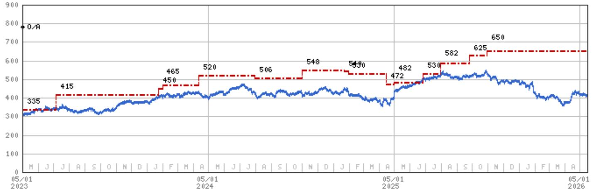

line

| Date       | Blue Line | Red Dashed Line |
|------------|-----------|-----------------|
| 05/01 2023 | 335       | 335             |
|            |           | 415             |
|            |           | 465             |
|            |           | 450             |
|            |           | 520             |
|            |           | 506             |
|            |           | 548             |
|            |           | 549             |
|            |           | 472             |
|            |           | 482             |
|            |           | 530             |
|            |           | 582             |
|            |           | 625             |
|            |           | 650             |

Stock Rating History: 5/1/21 : 0/A   
Price Target History: 4/28/21 : 300; 7/28/21 : 305; 9/14/21 : 331; 10/27/21 : 364; 1/26/22 : 372; 7/12/22 : 354; 10/14/22 : 325;   
10/26/22 : 307; 4/26/23 : 335; 7/6/23 : 415; 1/23/24 : 450; 1/31/24 : 465; 4/11/24 : 520; 7/31/24 : 506; 10/31/24 : 548;   
1/22/25 : 540; 1/30/25 : 530; 4/15/25 : 472; 5/1/25 : 482; 6/26/25 : 530; 7/31/25 : 582; 9/26/25 : 625; 10/30/25 : 650   
Source: MS Date Format: MM/DD/YY Price Target No Price Target Assigned (NA)   
Stock Price (Not Covered by Current Analyst) — Stock Price (Covered by Current Analyst)   
Stock and Industry Ratings (abbreviations below) appear as ♦ Stock Rating/Industry View   
Stock Ratings: Overweight (O) Equal-weight (E) Underweight (U) Not-Rated (NR) No Rating Available (NA)   
Industry View: Attractive (A) In-line (I) Cautious (C) No Rating (NR)   
Effective January 13, 2014, the stocks covered by MS Asia Pacific will be rated relative to the analyst's industry (or industry team's) coverage.   
Effective January 13, 2014, the industry view benchmarks for MS Asia Pacific are as follows: relevant MSCI country index or MSCI sub-regional index or MSCI AC Asia Pacific ex Japan Index.

NVIDIA Corp. (NVDA.O) - As of 05/15/26 GMT in USD
Industry : Semiconductors   
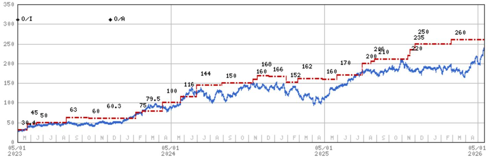

line

| Date       | Blue Line Value | Red Dashed Line Value |
|------------|-----------------|------------------------|
| 05/01 2023 | 30.4            | 30.4                   |
|          |                 |                        |
|          |                 | 45                     |
|          |                 | 50                     |
|          |                 | 63                     |
|          |                 | 60                     |
|          |                 | 60.3                   |
|          |                 | 75                     |
|          |                 | 79.5                   |
|          |                 | 100                    |
|          |                 | 116                    |
|          |                 | 144                    |
|          |                 | 150                    |
|          |                 | 168                    |
|          |                 | 166                    |
|          |                 | 152                    |
|          |                 | 162                    |
|          |                 | 160                    |
|          |                 | 170                    |
|          |                 | 200                    |
|          |                 | 210                    |
|          |                 | 206                    |
|          |                 | 220                    |
|          |                 | 235                    |
|          |                 | 250                    |
|          |                 | 260                    |
|          |                 |                        |
|          |                 |                        |
|          |                 |                        |
|          |                 |                        |
|          |                 |                        |
|          |                 |                        |
|          |                 |                        |
|          |                 |                        |
|          |                 |                        |
|          |                 |                        |
|          |                 |                        |
|          |                 |                        |
|          |                 |                        |
|          |                 |                        |
|          |                 |                        |
|
|          |                 |                        |
|          |                 |                        |
|          |                 |                        |
|          |                 |                        |
|          |                 |                        |
|          |                 |                        |
|          |                 |                        |
|          |                 |                        |
|          |                 |                        |
|          |                 |                        |
|          |                 |                        |
|          |                 |                        |
|          |                 |                        |
|          |                 |                        |
| M/A        | -               | -                      |
|          | -               | -                      |
|          | -               | -                      |
|          | -               | -                      |
|          | -               | -                      |
|          | -               | -                      |
|          | -               | -                      |
|          | -               | -                      |
|          | -               | -                      |
|          | -               | -                      |
|          | -               | -                      |
|          | -               | -                      |
|          A/A   | -               | -                      |
|          A/A   | -               | -                      |
|          A/A   | -               | -                      |
|          A/A   | -               | -                      |
|          A/A   | -               | -                      |
|          A/A   | -               | -                      |
|          A/A   | -               | -                      |
|          A/A   | -               | -                      |
|          A/A   | -               = 0/I     |
|          A/A   | -               = 0/A      |
|          A/A   | -               = 0/A      |
|          A/A   | -               = 0/A      |
|          A/A   | -               = 0/A      |
|          A/A   | -               = 0/A      |
|          A/A   | -               = 0/A      |
|          A/A   | -               = 0/A      |
|          A/A   | -               = 0/A      |
|
|          A/A   | -               = 0/A      |
|          A/A   | -               = 0/A      |
|          A/A   | -               = 0/A      |
|          A/A   | -               = 0/A      |
|          A/A   | -               = 0/A      |
|          A/A   | -               = 0/A      |
|          A/A   | -               = 0/A      |
| M/A        | -               | -                      |
| M/A        | -               | -                      |
| M/A        | -               | -                      |
| M/A        | -               | -                      |
| M/A        | -               | -                      |
| M/A        | -               | -                      |
| M/A        | -               | -                      |
| M/A        | -               | -                      |
| M/A        | -               | -                      |
| M/A        | -               | -                      |

| Date       | Value           |
| ---------- | --------------- |
| M/A        | 30.4            |
| M/A        | 45              |
| M/A        | 50              |
| M/A        | 63              |
| M/A        | 60              |
| M/A        | 60.3            |
| M/A        | -               |
| M/A        | -               |
| M/A        | -               |
| M/A        | -               |
| M/A        | -               |
| M/A        | -               |
| M/A        | -               |
| M/A        | -               |
| M/A        | -               |
| M/A        | -               |
| M/A        | -               |
| M/A        | -               |
| M/A        | -               |
| M/M        (Note)    (Note)    )         (Note)    )         (Note)    )         (Note)    )         (Note)    )         (Note)    )         (Note)    )         (Note)    )         (Note)    )         (Note)    )         (Note)    )         (Note)    )         (Note)    )         (Note)    )         (Note)    )         (Note)    )         (Note)    )         (Note)   )         (Note)    )         (Note)    )         (Note)    )         (Note)    )         (Note)    )         (Note)    )         (Note)    )         (Note)    )         (Note)    )         (Note)    )         (Note)    )         (Note)    )         (Note)    )         (Note)    )         (Note)    )         (Note)    )         (No label)

Stock Rating History: 5/1/21 : NA/I; 5/3/22 : E/I; 3/16/23 : 0/I; 12/7/23 : 0/A   
Price Target History: 9/13/20 : NA; 5/3/22 : 21.7; 5/25/22 : 18.2; 11/17/22 : 17.5; 2/21/23 : 24.6; 2/22/23 : 25.5; 3/16/23 : 30.4;   
5/24/23 : 45; 6/15/23 : 50; 8/24/23 : 63; 10/17/23 : 60; 11/21/23 : 60.3; 2/6/24 : 75; 2/21/24 : 79.5; 4/9/24 : 100; 5/22/24 : 116;   
6/30/24 : 144; 8/29/24 : 150; 11/10/24 : 160; 11/21/24 : 168; 12/19/24 : 166; 1/29/25 : 152; 2/26/25 : 162; 4/25/25 : 160;   
5/29/25 : 170; 7/29/25 : 200; 8/18/25 : 206; 8/28/25 : 210; 11/14/25 : 220; 11/20/25 : 235; 12/1/25 : 250; 2/26/26 : 260   
Source: MS Date Format : MM/DD/YY Price Target = No Price Target Assigned (NA)   
Stock Price (Not Covered by Current Analyst) — Stock Price (Covered by Current Analyst)   
Stock and Industry Ratings (abbreviations below) appear as ♦ Stock Rating/Industry View   
Stock Ratings: Overweight (O) Equal-weight (E) Underweight (U) Not-Rated (NR) No Rating Available (NA)   
Industry View: Attractive (A) In-line (I) Cautious (C) No Rating (NR)   
Effective January 13, 2014, the stocks covered by MS Asia Pacific will be rated relative to the analyst's industry (or industry team's) coverage.   
Effective January 13, 2014, the industry view benchmarks for MS Asia Pacific are as follows: relevant MSCI country index or MSCI sub-regional index or MSCI AC Asia Pacific ex Japan Index.

# Important Disclosures for MS Smith Barney LLC Customers

Important disclosures regarding any material conflict of interest that can reasonably be expected to have influenced MS Smith Barney LLC's choice of a third-party research provider or the subject company of a third-party research report, are available on the MS Wealth Management disclosure website at www.morganstanley.com/online/researchdisclosures. For MS specific disclosures, you may refer to https://www.morganstanley.com/eqr/disclosures/webapp/generalresearch.

Each MS report is reviewed and approved on behalf of MS Smith Barney LLC. This review and approval is conducted by the same person who reviews the research report on behalf of MS. This could create a conflict of interest.

# Other Important Disclosures

A member of Research who had or could have had access to the research prior to completion owns securities (or related derivatives) in the Atlassian Corporation PLC, Micron Technology Inc., Microsoft, NVIDIA Corp., Uber Technologies Inc, Workday Inc. This person is not a research analyst or a member of research analyst's household.

MS policy is to update research reports as and when the Research Analyst and Research Management deem appropriate, based on developments with the issuer, the sector, or the market that may have a material impact on the research views or opinions stated therein. In addition, certain Research publications are intended to be updated on a regular periodic basis (weekly/monthly/quarterly/annual) and will ordinarily be updated with that frequency, unless the Research Analyst and Research Management determine that a different publication schedule is appropriate based on current conditions.

MS is not acting as a municipal advisor and the opinions or views contained herein are not intended to be, and do not constitute, advice within the meaning of Section 975 of the Dodd-Frank Wall Street Reform and Consumer Protection Act.

MS produces an equity research product called a "Tactical Idea." Views contained in a "Tactical Idea" on a particular stock may be contrary to the recommendations or views expressed in research on the same stock. This may be the result of differing time horizons, methodologies, market events, or other factors. For all research available on a particular stock, please contact your sales representative or go to Matrix at http://www.morganstanley.com/matrix.

MS is provided to our clients through our proprietary research portal on Matrix and also distributed electronically by MS to clients. Certain, but not all, MS products are also made available to clients through third-party vendors or redistributed to clients through alternate electronic means as a convenience. For access to all available MS, please contact your sales representative or go to Matrix at http://www.morganstanley.com/matrix.

Any access and/or use of MS is subject to MS's Terms of Use (http://www.morganstanley.com/terms.html). By accessing and/or using MS, you are indicating that you have read and agree to be bound by our Terms of Use (http://www.morganstanley.com/terms.html). In addition you consent to MS processing your personal data and using cookies in accordance with our Privacy Policy and our Global Cookies Policy (http://www.morganstanley.com/privacy\_pledge.html), including for the purposes of setting your preferences and to collect readership data so that we can deliver better and more personalized service and products to you. To find out more information about how MS processes personal data, how we use cookies and how to reject cookies see our Privacy Policy and our Global Cookies Policy (http://www.morganstanley.com/privacy\_pledge.html). Please use the provided link to review the Terms and Conditions and Most Important Terms and Conditions for MS India Company Private Limited (https://www.morganstanley.com/assets/pdfs/about-us-global-offices/india/Terms\_and\_conditions.pdf) and the following link to review the audit report (https://ny.matrix.ms.com/eqr/research/webapp/researchdocs/

# MSICPL\_Morgan\_Stanley\_Research\_Audit\_Report.pdf).

If you do not agree to our Terms of Use and/or if you do not wish to provide your consent to MS processing your personal data or using cookies please do not access our research. MS does not provide individually tailored investment advice. MS has been prepared without regard to the circumstances and objectives of those who receive it. MS recommends that investors independently evaluate particular investments and strategies, and encourages investors to seek the advice of a financial adviser. The appropriateness of an investment or strategy will depend on an investor's circumstances and objectives. The securities, instruments, or strategies discussed in MS may not be suitable for all investors, and certain investors may not be eligible to purchase or participate in some or all of them. MS is not an offer to buy or sell or the solicitation of an offer to buy or sell any security/instrument or to participate in any particular trading strategy. The value of and income from your investments may vary because of changes in interest rates, foreign exchange rates, default rates, prepayment rates, securities/instruments prices, market indexes, operational or financial conditions of companies or other factors. There may be time limitations on the exercise of options or other rights in securities/instruments transactions. Past performance is not necessarily a guide to future performance. Estimates of future performance are based on assumptions that may not be realized. If provided, and unless otherwise stated, the closing price on the cover page is that of the primary exchange for the subject company's securities/instruments.

The fixed income research analysts, strategists or economists principally responsible for the preparation of MS have received compensation based upon various factors, including quality, accuracy and value of research, firm profitability or revenues (which include fixed income trading and capital markets profitability or revenues), client feedback and competitive factors. Fixed Income Research analysts', strategists' or economists' compensation is not linked to investment banking or capital markets transactions performed by MS or the profitability or revenues of particular trading desks.

The "Important Regulatory Disclosures on Subject Companies" section in MS lists all companies mentioned where MS owns 1% or more of a class of common equity securities of the companies. For all other companies mentioned in MS, MS may have an investment of less than 1% in securities/instruments or derivatives of securities/instruments of companies and may trade them in ways different from those discussed in MS. Employees of MS not involved in the preparation of MS may have investments in securities/instruments or derivatives of securities/instruments of companies mentioned and may trade them in ways different from those discussed in MS. Derivatives may be issued by MS or associated persons.

With the exception of information regarding MS, MS is based on public information. MS makes every effort to use reliable, comprehensive information, but we make no representation that it is accurate or complete. We have no obligation to tell you when opinions or information in MS change apart from when we intend to discontinue equity research coverage of a subject company. Facts and views presented in MS have not been reviewed by, and may not reflect information known to, professionals in other MS business areas, including investment banking personnel.

MS personnel may participate in company events such as site visits and are generally prohibited from accepting payment by the company of associated expenses unless pre-approved by authorized members of Research management.

MS may make investment decisions that are inconsistent with the recommendations or views in this report.

To our readers based in Taiwan or trading in Taiwan securities/instruments: Information on securities/instruments that trade in Taiwan is distributed by MS Taiwan Limited ("MSTL"). Such information is for your reference only. The reader should independently evaluate the investment risks and is solely responsible for their investment decisions. MS may not be distributed to the public media or quoted or used by the public media without the express written consent of MS. Any non-customer reader within the scope of Article 7-1 of the Taiwan Stock Exchange Recommendation Regulations accessing and/or receiving MS is not permitted to provide MS to any third party (including but not limited to related parties, affiliated companies and any other third parties) or engage in any activities regarding MS which may create or give the appearance of creating a conflict of interest. Information on securities/instruments that do not trade in Taiwan is for informational purposes only and is not to be construed as a recommendation or a solicitation to trade in such securities/instruments. MSTL may not execute transactions for clients in these securities/instruments.

MS is not incorporated under PRC law and the research in relation to this report is conducted outside the PRC. MS does not constitute an offer to sell or the solicitation of an offer to buy any securities in the PRC. PRC investors shall have the relevant qualifications to invest in such securities and shall be responsible for obtaining all relevant approvals, licenses, verifications and/or registrations from the relevant governmental authorities themselves. Neither this report nor any part of it is intended as, or shall constitute, provision of any consultancy or advisory service of securities investment as defined under PRC law. Such information is provided for your reference only.

MS is disseminated in Brazil by MS C.T.V.M. S.A. located at Av. Brigadeiro Faria Lima, 3600, 6th floor, São Paulo - SP, Brazil; and is regulated by the Comissão de Valores Mobiliários; in Mexico by MS México, Casa de Bolsa, S.A. de C.V which is regulated by Comision Nacional Bancaria y de Valores. Paseo de los Tamarindos 90, Torre 1, Col. Bosques de las Lomas Floor 29, 05120 Mexico City; in Japan by MS MUFG Securities Co., Ltd. and, for Commodities related research reports only, MS Capital Group Japan Co., Ltd; in Hong Kong by MS Asia Limited (which accepts responsibility for its contents) and by MS Bank Asia Limited; in Singapore by MS Asia (Singapore) Pte. (Registration number 199206298Z) and/or MS Asia (Singapore) Securities Pte Ltd (Registration number 200008434H), regulated by the Monetary Authority of Singapore (which accepts legal responsibility for its contents and should be contacted with respect to any matters arising from, or in connection with, MS) and by MS Bank Asia Limited, Singapore Branch (Registration number T14FC0118J); in Australia to "wholesale clients" within the meaning of the Australian Corporations Act by MS Australia Limited A.B.N. 67 003 734 576, holder of Australian financial services license No. 233742, which accepts responsibility for its contents; in Australia to "wholesale clients" and "retail clients" within the meaning of the Australian Corporations Act by MS Wealth Management Australia Pty Ltd (A.B.N. 19 009 145 555, holder of Australian financial services license No. 240813, which accepts responsibility for its contents; in Korea by MS & Co International plc, Seoul Branch; in India by MS India Company Private Limited having Corporate Identification No (CIN) U22990MH1998PTC115305, regulated by the Securities and Exchange Board of India ("SEBI") and holder of licenses as a Research Analyst (SEBI Registration No. INH000001105); Stock Broker (SEBI Stock Broker Registration No. INZ000244438), Merchant Banker (SEBI Registration No. INM000011203), and depository participant with National Securities Depository Limited (SEBI Registration No. IN-DP-NSDL-567-2021) having registered office at Altimus, Level 39 & 40, Pandurang Budhkar Marg, Worli, Mumbai 400018, India; Telephone no. +91-22-61181000; Compliance Officer Details: Mr. Tejarshi Hardas, Tel. No.: +91-22-61181000 or Email: tejarshi.hardas@morganstanley.com; Grievance officer details: Mr. Tejarshi Hardas, Tel. No.: +91-22-61181000 or Email: msic-compliance@morganstanley.com. MS India Company Private Limited (MSICPL) may use AI tools in providing research services. All recommendations contained herein are made by the duly qualified research analysts; in Canada by MS Canada Limited; in Germany and the European Economic Area where required by MS Europe S.E., authorised and regulated by Bundesanstalt fuer Finanzdienstleistungsaufsicht (BaFin) under the reference number 149169; in the US by MS & Co. LLC, which accepts responsibility for its contents. MS & Co. International plc, authorized by the Prudential Regulation Authority and regulated by the Financial Conduct Authority and the Prudential Regulation Authority, disseminates in the UK research that it has prepared, and research which has been prepared by any of its affiliates, only to persons who (i) are investment professionals falling within Article 19(5) of the Financial Services and Markets Act 2000 (Financial Promotion) Order 2005 (as amended, the "Order"); (ii) are persons who are high net worth entities falling within Article 49(2)(a) to (d) of the Order; or (iii) are persons to whom an invitation or inducement to engage in investment activity (within the meaning of section 21 of the Financial Services and Markets Act 2000, as amended) may otherwise lawfully be communicated or caused to be communicated. RMB MS Proprietary Limited is a member of the JSE Limited and A2X (Pty) Ltd. RMB MS Proprietary Limited is a joint venture owned equally by MS International Holdings Inc. and RMB Investment Advisory (Proprietary) Limited, which is wholly owned by FirstRand Limited. The information in MS is being disseminated by MS Saudi Arabia, regulated by the Capital Market Authority in the Kingdom of Saudi Arabia, and is directed at Sophisticated investors only.

The information in MS is being communicated by MS & Co. International plc (DIFC Branch), regulated by the Dubai Financial Services Authority (the DFSA) or by MS & Co. International plc (ADGM Branch), regulated by the Financial Services Regulatory Authority Abu Dhabi (the FSRA), and is directed at Professional Clients only, as defined by the DFSA or the FSRA, respectively. The financial products or financial services to which this research relates will only be made available to a customer who we are satisfied meets the regulatory criteria of a Professional Client. A distribution of the different MS Research ratings or recommendations, in percentage terms for Investments in each sector covered, is available upon request from your sales representative.

The information in MS is being communicated by MS & Co. International plc (QFC Branch), regulated by the Qatar Financial Centre Regulatory Authority (the QFCRA), and is directed at business customers and market counterparties only and is not intended for Retail Customers as defined by the QFCRA.

As required by the Capital Markets Board of Turkey, investment information, comments and recommendations stated here, are not within the scope of investment advisory activity. Investment advisory service is provided exclusively to persons based on their risk and income preferences by the authorized firms. Comments and recommendations stated here are general in nature. These opinions may not fit to your financial status, risk and return preferences. For this reason, to make an investment decision by relying solely to this information stated here may not bring about outcomes that fit your expectations.

The trademarks and service marks contained in MS are the property of their respective owners. Third-party data providers make no warranties or representations relating to the accuracy, completeness, or timeliness of the data they provide and shall not have liability for any damages relating to such data. The Global Industry Classification Standard (GICS) was developed by and is the exclusive property of MSCI and S&P.

MS, or any portion thereof may not be reprinted, sold or redistributed without the written consent of MS.

Indicators and trackers referenced in MS may not be used as, or treated as, a benchmark under Regulation EU 2016/1011, or any other similar framework.

The issuers and/or fixed income products recommended or discussed in certain fixed income research reports may not be continuously followed. Accordingly, investors should regard those fixed income research reports as providing stand-alone analysis and should not expect continuing analysis or additional reports relating to such issuers and/or individual fixed income products. MS may hold, from time to time, material financial and commercial interests regarding the company subject to the Research report.

Registration granted by SEBI and certification from the National Institute of Securities Markets (NISM) in no way guarantee performance of the intermediary or provide any assurance of returns to investors. Investment in securities market are subject to market risks. Read all the related documents carefully before investing.

Stock Ratings are subject to change. Please see latest research for each company.   
\* Historical prices are not split adjusted.   
INDUSTRY COVERAGE: Internet 

<table><tr><td>COMPANY (TICKER)</td><td>RATING (AS OF)</td><td>PRICE* (05/14/2026)</td></tr><tr><td colspan="3">Brian Nowak, CFA</td></tr><tr><td>Airbnb Inc (ABNB.O)</td><td>U (12/06/2022)</td><td>$133.67</td></tr><tr><td>Alphabet Inc. (GOOGL.O)</td><td>O (08/11/2015)</td><td>$401.07</td></tr><tr><td>Amazon.com Inc (AMZN.O)</td><td>O (04/24/2015)</td><td>$267.22</td></tr><tr><td>Booking Holdings Inc (BKNG.O)</td><td>O (02/23/2026)</td><td>$154.48</td></tr><tr><td>DoorDash Inc (DASH.O)</td><td>O (02/21/2024)</td><td>$153.70</td></tr><tr><td>Expedia Inc. (EXPE.O)</td><td>E (01/09/2019)</td><td>$217.17</td></tr><tr><td>Instacart (CART.O)</td><td>E (01/29/2024)</td><td>$38.47</td></tr><tr><td>Lyft Inc (LYFT.O)</td><td>E (10/24/2019)</td><td>$13.05</td></tr><tr><td>Meta Platforms Inc (META.O)</td><td>O (03/20/2023)</td><td>$618.43</td></tr><tr><td>Pinterest Inc (PINS.N)</td><td>O (07/20/2025)</td><td>$19.03</td></tr><tr><td>Reddit Inc (RDDT.N)</td><td>O (12/08/2024)</td><td>$156.31</td></tr><tr><td>Snap Inc. (SNAP.N)</td><td>E (07/22/2024)</td><td>$5.36</td></tr><tr><td>Uber Technologies Inc (UBER.N)</td><td>O (06/04/2019)</td><td>$74.69</td></tr><tr><td colspan="3">Matthew Cost</td></tr><tr><td>AppLovin Corp (APP.O)</td><td>O (04/10/2025)</td><td>$485.16</td></tr><tr><td>Compass, Inc. (COMP.N)</td><td>E (01/12/2026)</td><td>$7.75</td></tr><tr><td>Criteo SA (CRTO.O)</td><td>E (01/26/2016)</td><td>$16.00</td></tr><tr><td>DoubleVerify Holdings Inc (DV.N)</td><td>E (06/25/2024)</td><td>$8.61</td></tr><tr><td>Electronic Arts Inc (EA.O)</td><td>E (08/04/2021)</td><td>$200.78</td></tr><tr><td>MNTN Inc (MNTN.N)</td><td>E (06/16/2025)</td><td>$7.89</td></tr><tr><td>Opendoor Technologies Inc (OPEN.O)</td><td>E (07/24/2023)</td><td>$4.47</td></tr><tr><td>Playtika Holding Corp (PLTK.O)</td><td>E (11/27/2022)</td><td>$3.69</td></tr><tr><td>Roblox Corporation (RBLX.N)</td><td>O (11/04/2024)</td><td>$43.72</td></tr><tr><td>Shutterstock Inc (SSTK.N)</td><td>E (07/28/2022)</td><td>$16.03</td></tr><tr><td>Take-Two Interactive Software (TTWO.O)</td><td>O (02/01/2018)</td><td>$242.41</td></tr><tr><td>Trade Desk Inc (TTD.O)</td><td>E (09/10/2025)</td><td>$20.41</td></tr><tr><td>Unity Software Inc (U.N)</td><td>O (09/02/2024)</td><td>$27.28</td></tr><tr><td>Webtoon Entertainment Inc (WBTN.O)</td><td>E (07/22/2024)</td><td>$12.70</td></tr><tr><td>Yelp Inc (YELP.N)</td><td>U (01/10/2019)</td><td>$21.08</td></tr><tr><td>Zillow Group Inc (Z.O)</td><td>E (04/18/2018)</td><td>$37.37</td></tr><tr><td colspan="3">Nathan Feather</td></tr><tr><td>Bumble Inc. (BMBL.O)</td><td>E (03/08/2021)</td><td>$3.26</td></tr><tr><td>Chewy Inc (CHWY.N)</td><td>O (10/31/2023)</td><td>$21.48</td></tr><tr><td>Duolingo Inc (DUOL.O)</td><td>E (02/27/2026)</td><td>$109.16</td></tr><tr><td>eBay Inc (EBAY.O)</td><td>O (04/18/2024)</td><td>$113.24</td></tr><tr><td>Etsy Inc (ETSY.N)</td><td>E (07/20/2025)</td><td>$58.41</td></tr><tr><td>FIGS, Inc. (FIGS.N)</td><td>E (02/29/2024)</td><td>$11.97</td></tr><tr><td>Grindr Inc. (GRND.N)</td><td>E (02/24/2026)</td><td>$13.85</td></tr><tr><td>Match Group Inc (MTCH.O)</td><td>E (04/18/2024)</td><td>$35.73</td></tr><tr><td>Peloton Interactive, Inc. (PTON.O)</td><td>E (03/14/2022)</td><td>$5.18</td></tr><tr><td>Revolve Group Inc (RVLV.N)</td><td>E (10/20/2024)</td><td>$18.51</td></tr><tr><td>WW International Inc (WW.O)</td><td>E (08/01/2025)</td><td>$11.02</td></tr></table>

Stock Ratings are subject to change. Please see latest research for each company.   
\* Historical prices are not split adjusted.   
INDUSTRY COVERAGE: Software 

<table><tr><td>COMPANY (TICKER)</td><td>RATING (AS OF)</td><td>PRICE* (05/14/2026)</td></tr><tr><td colspan="3">Chris Quintero</td></tr><tr><td>BILL Holdings Inc (BILL.N)</td><td>E (06/10/2025)</td><td>$39.49</td></tr><tr><td>Blackline Inc (BL.O)</td><td>O (09/29/2024)</td><td>$26.84</td></tr><tr><td>Descartes Systems Group Inc (DSGX.O)</td><td>O (01/15/2026)</td><td>$67.25</td></tr><tr><td>Manhattan Associates Inc. (MANH.O)</td><td>E (10/21/2025)</td><td>$129.05</td></tr><tr><td>Navan Inc (NAVN.O)</td><td>O (11/24/2025)</td><td>$18.52</td></tr><tr><td>SPS Commerce Inc (SPSC.O)</td><td>E (11/11/2025)</td><td>$49.96</td></tr><tr><td>Vertex Inc. (VERX.O)</td><td>O (01/17/2024)</td><td>$12.38</td></tr><tr><td colspan="3">Elizabeth Porter, CFA</td></tr><tr><td>Amplitude Inc. (AMPL.O)</td><td>O (01/15/2026)</td><td>$6.13</td></tr><tr><td>Autodesk (ADSK.O)</td><td>O (08/23/2024)</td><td>$233.86</td></tr><tr><td>Figma Inc (FIG.N)</td><td>E (08/25/2025)</td><td>$20.24</td></tr><tr><td>Five9 Inc (FIVN.O)</td><td>E (10/10/2022)</td><td>$20.75</td></tr><tr><td>Freshworks Inc (FRSH.O)</td><td>E (10/18/2021)</td><td>$8.42</td></tr><tr><td>GoDaddy Inc (GDDY.N)</td><td>E (07/19/2021)</td><td>$84.97</td></tr><tr><td>HubSpot, Inc. (HUBS.N)</td><td>O (03/21/2023)</td><td>$183.46</td></tr><tr><td>Klaviyo, Inc (KVYO.N)</td><td>O (04/29/2026)</td><td>$14.34</td></tr><tr><td>LegalZoom.com Inc (LZ.O)</td><td>U (07/28/2022)</td><td>$5.88</td></tr><tr><td>Liveramp Holdings Inc (RAMP.N)</td><td>E (01/13/2025)</td><td>$29.13</td></tr><tr><td>NICE Ltd. (NICE.O)</td><td>O (10/16/2023)</td><td>$87.94</td></tr><tr><td>RingCentral Inc (RNG.N)</td><td>E (08/08/2023)</td><td>$39.35</td></tr><tr><td>Sprinklr Inc (CXM.N)</td><td>E (07/19/2021)</td><td>$4.94</td></tr><tr><td>Sprout Social Inc (SPT.O)</td><td>E (11/17/2020)</td><td>$6.00</td></tr><tr><td>Twilio Inc (TWLO.N)</td><td>O (02/24/2025)</td><td>$198.04</td></tr><tr><td>Wix.Com Ltd (WIX.O)</td><td>O (01/13/2025)</td><td>$52.71</td></tr><tr><td>Zeta Global Holdings Corp (ZETA.N)</td><td>E (08/01/2024)</td><td>$16.58</td></tr><tr><td>ZoomInfo Technologies Inc (GTM.O)</td><td>E (02/01/2024)</td><td>$3.90</td></tr><tr><td colspan="3">Josh Baer, CFA</td></tr><tr><td>Asana Inc (ASAN.N)</td><td>U (05/20/2025)</td><td>$5.81</td></tr><tr><td>Box Inc (BOX.N)</td><td>E (05/21/2024)</td><td>$24.06</td></tr><tr><td>CCC Intelligent Solutions Holdings Inc (CCC.O)</td><td>O (11/13/2024)</td><td>$4.24</td></tr><tr><td>Commerce.com Inc. (CMRC.O)</td><td>++</td><td>$2.74</td></tr><tr><td>Coursera, Inc. (COUR.N)</td><td>E (04/22/2026)</td><td>$5.09</td></tr><tr><td>DigitalOcean Holdings Inc (DOCN.N)</td><td>O (01/16/2025)</td><td>$158.40</td></tr><tr><td>Docebo Inc. (DCBO.O)</td><td>E (05/12/2025)</td><td>$16.36</td></tr><tr><td>DocuSign Inc (DOCU.O)</td><td>E (01/16/2024)</td><td>$45.50</td></tr><tr><td>Lightspeed POS Inc. (LSPD.N)</td><td>E (02/18/2021)</td><td>$8.81</td></tr><tr><td>monday.com Ltd (MNDY.O)</td><td>O (08/12/2025)</td><td>$69.73</td></tr><tr><td>Nebius Group NV (NBIS.O)</td><td>E (01/15/2026)</td><td>$221.15</td></tr><tr><td>Sabre Corp (SABR.O)</td><td>E (03/16/2021)</td><td>$1.58</td></tr><tr><td>ServiceTitan Inc (TTAN.O)</td><td>O (01/20/2026)</td><td>$57.15</td></tr><tr><td>Toast, Inc. (TOST.N)</td><td>O (12/16/2021)</td><td>$23.07</td></tr><tr><td>Via Transportation Inc (VIA.N)</td><td>O (01/20/2026)</td><td>$14.38</td></tr><tr><td>Zoom Communications (ZM.O)</td><td>E (10/11/2022)</td><td>$98.23</td></tr><tr><td colspan="3">Keith Weiss, CFA</td></tr><tr><td>Adobe Inc. (ADBE.O)</td><td>E (09/24/2025)</td><td>$237.01</td></tr><tr><td>Atlassian Corporation PLC (TEAM.O)</td><td>O (01/13/2020)</td><td>$80.86</td></tr><tr><td>Cloudflare Inc (NET.N)</td><td>O (12/02/2024)</td><td>$199.81</td></tr><tr><td>CoreWeave (CRWV.O)</td><td>E (04/22/2025)</td><td>$114.22</td></tr><tr><td>Intuit (INTU.O)</td><td>O (02/26/2025)</td><td>$378.29</td></tr><tr><td>Microsoft (MSFT.O)</td><td>O (01/13/2016)</td><td>$409.43</td></tr><tr><td>Oracle Corporation (ORCL.N)</td><td>E (01/15/2019)</td><td>$195.61</td></tr><tr><td>Salesforce, Inc. (CRM.N)</td><td>O (12/21/2023)</td><td>$167.58</td></tr><tr><td>Samsara Inc (IOT.N)</td><td>E (03/23/2023)</td><td>$27.99</td></tr><tr><td>ServiceNow Inc (NOW.N)</td><td>O (09/24/2025)</td><td>$90.50</td></tr><tr><td>Shopify Inc (SHOP.O)</td><td>O (04/19/2024)</td><td>$97.42</td></tr><tr><td>Workday Inc (WDAY.O)</td><td>E (02/19/2025)</td><td>$118.75</td></tr><tr><td colspan="3">Meta A Marshall</td></tr><tr><td>Check Point Software Technologies Ltd. (CHKP.O)</td><td>E (10/16/2023)</td><td>$120.25</td></tr><tr><td>CrowdStrike Holdings Inc (CRWD.O)</td><td>O (03/10/2026)</td><td>$579.95</td></tr><tr><td>Fortinet Inc. (FTNT.O)</td><td>U (09/02/2025)</td><td>$121.86</td></tr><tr><td>Gen Digital Inc. (GEN.O)</td><td>E (06/07/2024)</td><td>$23.18</td></tr><tr><td>Netskope, Inc. (NTSK.O)</td><td>O (10/13/2025)</td><td>$10.92</td></tr><tr><td>Okta, Inc. (OKTA.O)</td><td>O (12/02/2024)</td><td>$81.05</td></tr><tr><td>Palo Alto Networks Inc (PANW.O)</td><td>O (10/10/2017)</td><td>$238.21</td></tr><tr><td>Qualys Inc (QLYS.O)</td><td>U (02/09/2021)</td><td>$86.73</td></tr><tr><td>Rapid7 Inc (RPD.O)</td><td>E (08/11/2015)</td><td>$6.23</td></tr><tr><td>SailPoint Inc (SAIL.O)</td><td>O (09/02/2025)</td><td>$13.18</td></tr><tr><td>SentinelOne, Inc. (S.N)</td><td>E (12/02/2024)</td><td>$16.51</td></tr><tr><td>Tenable Holdings Inc (TENB.O)</td><td>E (12/02/2024)</td><td>$20.45</td></tr><tr><td>Varonis Systems, Inc. (VRNS.O)</td><td>E (01/26/2026)</td><td>$27.22</td></tr><tr><td>Zscaler Inc (ZS.O)</td><td>E (04/22/2026)</td><td>$153.70</td></tr><tr><td colspan="3">Sanjit K Singh</td></tr><tr><td>Akamai Technologies, Inc. (AKAM.O)</td><td>O (01/12/2026)</td><td>$155.67</td></tr><tr><td>Appian Corp (APPN.O)</td><td>E (04/30/2026)</td><td>$19.22</td></tr><tr><td>C3.ai (AI.N)</td><td>U (01/04/2021)</td><td>$9.03</td></tr><tr><td>Datadog, Inc. (DDOG.O)</td><td>O (01/12/2026)</td><td>$202.84</td></tr><tr><td>Dynatrace Inc (DT.N)</td><td>E (02/13/2024)</td><td>$37.12</td></tr><tr><td>Elastic NV (ESTC.N)</td><td>O (12/16/2024)</td><td>$49.78</td></tr><tr><td>GitLab Inc (GTLB.O)</td><td>E (01/12/2026)</td><td>$22.60</td></tr><tr><td>JFrog Ltd. (FROG.O)</td><td>O (12/21/2023)</td><td>$65.08</td></tr><tr><td>MongoDB Inc (MDB.O)</td><td>O (04/12/2023)</td><td>$303.09</td></tr><tr><td>PagerDuty, Inc. (PD.N)</td><td>E (01/24/2024)</td><td>$6.73</td></tr><tr><td>Palantir Technologies Inc. (PLTR.O)</td><td>E (02/04/2025)</td><td>$133.73</td></tr><tr><td>Snowflake Inc. (SNOW.N)</td><td>O (06/24/2025)</td><td>$150.76</td></tr><tr><td>UiPath Inc (PATH.N)</td><td>E (09/07/2022)</td><td>$9.67</td></tr></table>

INDUSTRY COVERAGE: Semiconductors 

<table><tr><td>COMPANY (TICKER)</td><td>RATING (AS OF)</td><td>PRICE* (05/14/2026)</td></tr><tr><td colspan="3">Joseph Moore</td></tr><tr><td>Advanced Micro Devices (AMD.O)</td><td>E (06/09/2024)</td><td>$449.70</td></tr><tr><td>Aeva Technologies Inc (AEVA.O)</td><td>E (07/19/2021)</td><td>$21.23</td></tr><tr><td>Allegro Microsystems Inc (ALGM.O)</td><td>O (02/13/2026)</td><td>$44.97</td></tr><tr><td>Ambarella Inc (AMBA.O)</td><td>O (03/29/2016)</td><td>$81.04</td></tr><tr><td>Amkor Technology Inc (AMKR.O)</td><td>E (11/08/2023)</td><td>$72.09</td></tr><tr><td>Analog Devices Inc. (ADI.O)</td><td>O (11/16/2023)</td><td>$426.79</td></tr><tr><td>Astera Labs Inc (ALAB.O)</td><td>O (05/11/2025)</td><td>$228.64</td></tr><tr><td>Broadcom Inc. (AVGO.O)</td><td>O (06/09/2024)</td><td>$439.79</td></tr><tr><td>GlobalFoundries Inc (GFS.O)</td><td>E (10/28/2024)</td><td>$73.84</td></tr><tr><td>Intel Corporation (INTC.O)</td><td>E (02/22/2023)</td><td>$115.93</td></tr><tr><td>IonQ Inc (IONQ.N)</td><td>E (04/25/2023)</td><td>$57.47</td></tr><tr><td>Marvell Technology Group Ltd (MRVL.O)</td><td>E (09/14/2015)</td><td>$182.58</td></tr><tr><td>Microchip Technology Inc. (MCHP.O)</td><td>E (07/10/2024)</td><td>$97.04</td></tr><tr><td>Micron Technology Inc. (MU.O)</td><td>O (10/06/2025)</td><td>$776.01</td></tr><tr><td>Navitas Semiconductor Corp (NVTS.O)</td><td>U (04/06/2025)</td><td>$22.32</td></tr><tr><td>NVIDIA Corp. (NVDA.O)</td><td>O (03/16/2023)</td><td>$235.74</td></tr><tr><td>NXP Semiconductor NV (NXPI.O)</td><td>O (02/11/2025)</td><td>$294.17</td></tr><tr><td>ON Semiconductor Corp. (ON.O)</td><td>E (05/11/2025)</td><td>$118.37</td></tr><tr><td>Qorvo Inc (QRVO.O)</td><td>E (10/28/2025)</td><td>$90.46</td></tr><tr><td>Qualcomm Inc. (QCOM.O)</td><td>U (02/10/2026)</td><td>$200.08</td></tr><tr><td>SanDisk Corporation. (SNDK.O)</td><td>O (03/03/2025)</td><td>$1,382.72</td></tr><tr><td>Semtech Corp. (SMTC.O)</td><td>E (04/06/2025)</td><td>$141.16</td></tr><tr><td>Silicon Laboratories Inc. (SLAB.O)</td><td>E (01/19/2021)</td><td>$217.31</td></tr><tr><td>Skyworks Solutions Inc (SWKS.O)</td><td>E (11/28/2018)</td><td>$67.06</td></tr><tr><td>Texas Instruments (TXN.O)</td><td>U (04/13/2020)</td><td>$308.17</td></tr><tr><td>Wolfspeed, INC (WOLF.N)</td><td>NR (04/06/2025)</td><td>$69.96</td></tr><tr><td colspan="3">Lee Simpson</td></tr><tr><td>Arm Holdings plc (ARM.O)</td><td>E (04/07/2026)</td><td>$228.50</td></tr><tr><td>Cadence Design Systems Inc (CDNS.O)</td><td>O (02/14/2024)</td><td>$352.84</td></tr><tr><td>Synopsys Inc. (SNPS.O)</td><td>E (02/27/2026)</td><td>$510.02</td></tr></table>

Stock Ratings are subject to change. Please see latest research for each company.   
\* Historical prices are not split adjusted.

© 2026 MS