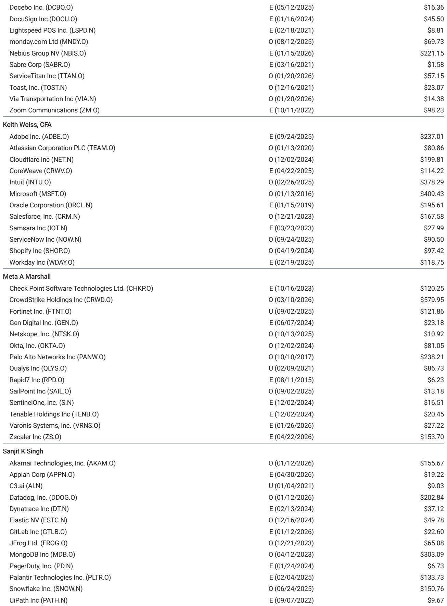
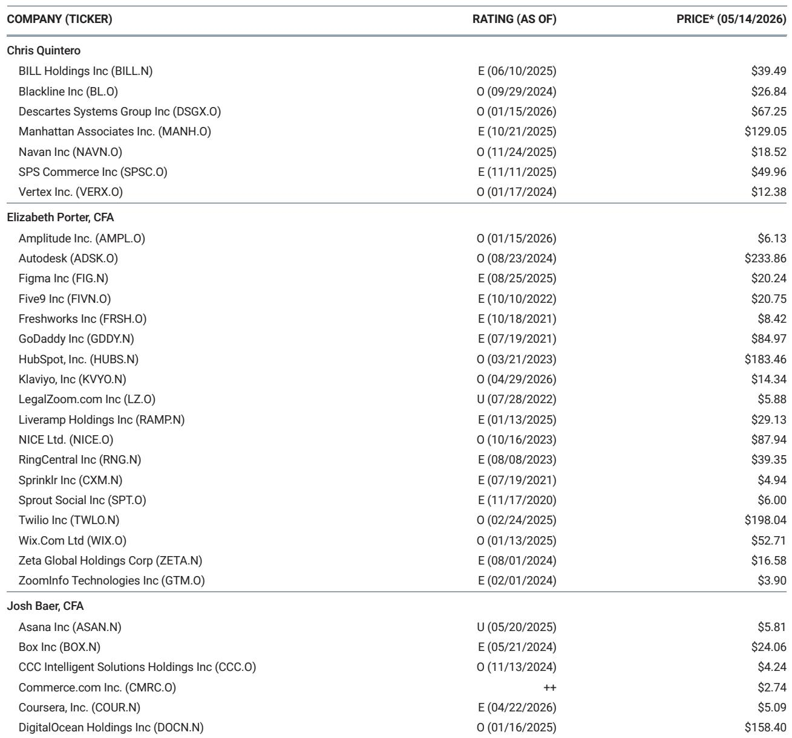
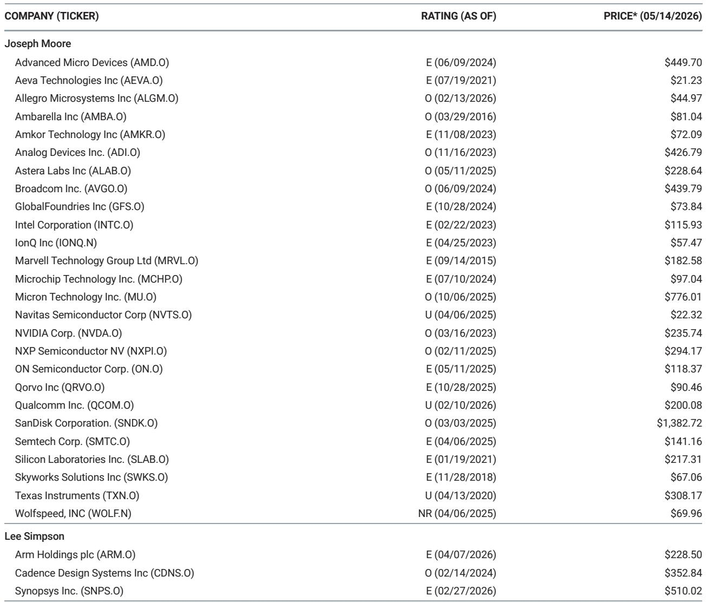

# 2万亿美元资本开支的真正赌注，不是GPU，是GW

当市场还在争论英伟达Blackwell的订单能否持续、GPU与定制芯片谁更高效时，一份来自某外资投行的最新研报提出了一个更根本的问题：当四大超大规模云厂商从2024到2027年累计投入约2万亿美元资本开支后，到底能换来多少计算容量？这个问题的答案，决定了我们能否正确评估GenAI的回报周期、竞争格局以及每家公司的长期护城河。

报告的核心判断简洁而有力：计算容量，而非算法突破，才是当前GenAI发展的真正瓶颈。而容量以GW（吉瓦）衡量，不是以芯片数量。这意味着，投资者需要从“谁的芯片更强”切换到“谁的供电能力、土地储备和工程建设速度更快”的分析框架。

某外资投行团队首次建立了自下而上的GW建设成本模型，并给出了2026/2027年四大云厂商的容量增量预测。这些数字的规模，足以让过去任何一轮基础设施投资周期相形见绌。以下是我们从中提炼的五个关键洞察。

## 1. 未来两年新增的20GW容量，相当于AWS过去18年总和的四倍

报告估计，仅2027年一年，AMZN、GOOGL、MSFT和META四家将新增约20GW的计算容量。作为参照，AWS在其成立前18年（至2024年底）累计部署的总容量大约只有5GW。20GW意味着什么？它足以满足超过1500万个美国家庭一年的用电量。

从年度分布看，2026年新增约14GW，2027年增至20GW，这意味着2027年的新增容量是2025年的约3倍。这种指数级的增长节奏，说明超大规模资本开支的“产能释放”正在进入加速期。

具体到各家，GOOGL在2027年以约7GW的增量领先，AMZN和MSFT各约5GW，META约3.5GW。但报告特别指出，META的“有效”容量更高——如果将其与第三方云厂商（如CRWV、NBIS、ORCL）达成的外部计算租约也折算进去，META在2026和2027年实际动用的容量约为4GW。这引出一个关键问题：META没有超大规模云业务，它每年约250亿美元的运营支出还同时用于租用外部计算资源。如此庞大的算力投入，最终必须通过产品化和增量收入来证明投资回报率。

对于投资者而言，这意味着：GOOGL正在为训练前沿模型、支撑GCP增长以及将GenAI嵌入搜索和YouTube而全力加码；AMZN则是在弥补2023-2024年GenAI建设起步较慢的短板，2026-2027年进入追赶期；MSFT的节奏相对均衡；META的算力策略则更像是一场“产品化变现”的豪赌。

## 2. 英伟达GPU的建造成本是定制ASIC的两倍，但效率优势可能更关键

报告对比了当前一代英伟达Blackwell GPU与定制ASIC（如TPU、Trainium）建设1GW数据中心的成本。结论是：采用Blackwell的方案，成本最高可达定制ASIC的两倍。其中，服务器/机架成本是差距的最大来源。

但成本只是故事的一半。在计算性能功耗比（compute performance/watt）上，英伟达领先2-8倍。这意味着，虽然定制ASIC的初始建设成本更低，但英伟达方案在单位功耗下能提供更多算力。对于推理场景——尤其是需要低延迟、高吞吐的在线服务——这个差距至关重要。

这份报告的核心启示在于：市场不应简单地将“ASIC替代GPU”视为成本优化的线性过程。真正的竞争维度是“每token每瓦成本”的持续改进。对于定制ASIC阵营，缩小差距的关键不在于芯片本身，而在于系统级优化——包括网络架构、高带宽内存容量以及软件栈的协同设计。

从投资角度看，这意味着：英伟达的护城河不仅来自芯片性能，更来自其系统级效率的领先。而定制ASIC的追赶，需要时间，也需要在系统层面而非芯片层面取得突破。报告没有给出具体时间表，但暗示了关键变量：下一代Trainium和TPU的性能提升，以及英伟达Rubin架构带来的内存采购模式变化。

## 3. 50%以上的2026年资本开支要到2027年之后才能转化为容量——这是二阶导数的信号

报告揭示了各家在“前瞻性建设”上的策略差异。AMZN、MSFT和META是“向前购买”最积极的：它们通过提前锁定电力外壳、土地、设备和内存等方式，将2026年资本开支的50%以上推迟到2027年及以后才能转化为在线容量。

这意味着两件事。第一，这是一种对冲——提前锁定资源和价格，可以缓解供应链延迟和组件通胀的风险。第二，这也是一个二阶导数的潜在信号：如果这些提前投入的容量在2027年集中上线，而需求增长不及预期，那么资本开支的增速可能从2027年开始放缓。

与之形成鲜明对比的是GOOGL：报告估计2026年只有约10%的资本开支是为2027年及以后准备的。这意味着GOOGL的执行节奏更紧凑，但同时也面临更高的组件通胀和交付延迟风险。

对于投资者，这个分化意味着：AMZN和MSFT的资本开支曲线可能更“前高后平”，而GOOGL的风险更多集中在短期执行层面。META则处于一个更微妙的位置——它的前瞻性投入规模巨大，但变现路径尚未完全清晰。

## 4. 机架之外，网络和电力外壳是成本波动最大的变量

在数据中心建设的成本结构中，机架（含GPU/ASIC）是最核心的支出项。但报告指出，机架之外还有两个关键变量：网络设备占比约20%，电力外壳（powered shells）占比约高个位数到低两位数。此外，DRAM和HBM分别占单位数和中个位数到中双位数比例，且存在价格上行风险。

这里有一个值得关注的细节：在Blackwell机架中，英伟达将内存捆绑销售并赚取利润，超大规模客户通常被动接受这些成本。但在下一代Rubin架构中，英伟达计划采用可插拔内存模块，这意味着超大规模客户可能有机会直接采购经认证的内存，从而节省成本。然而，报告也谨慎地指出，“捆绑”模式在效率上可能仍有优势。

对于产业决策者，这个信息点的含义是：数据中心的成本优化空间不仅来自芯片选型，更来自网络架构设计和电力基础设施的采购策略。那些能在网络和电力外壳上实现规模效应的厂商，将在总拥有成本上获得额外优势。

## 5. 报告尚未完全回答的三个关键问题

这份报告提供了迄今为止最系统的超大规模容量预测框架，但它也坦诚地留下了几个悬而未决的问题，这些恰恰是投资者最需要持续跟踪的方向。

第一，每GW能产生多少收入？报告提出了一个合理的追问：如果知道各家每MW或每GW的营收区间，就能更准确地估算云收入增长和资本回报率。但这个问题需要等待更多运营数据的积累。

第二，物理世界的约束是否会打乱时间表？电力供应、劳动力（电工、水管工等）以及可用土地，都可能成为容量上线的瓶颈。报告没有给出明确的判断，只是提醒这些是“实际约束”。

第三，定制ASIC的第三方销售何时启动？报告提到，其亚洲半导体团队估计2026/2027年将有约400万/600万个TPU出货，但其中约50%可能进入第三方数据中心而非GOOGL自有设施。对于AMZN的Trainium，报告目前完全没有假设第三方销售，这意味着如果AMZN开始向第三方数据中心销售Trainium，将是纯粹的增量。但这些判断仍需验证。

---

**顺着这些未解问题继续读完整报告，你会发现更多关于成本曲线、芯片效率对比以及各家资本开支节奏的细节。欢迎来星球微信群里继续讨论——我们会在群内分享报告原文的交互式成本模型截图，并持续跟踪这些关键变量的变化。**

Personal reading notes and learning share only. Not investment advice.

