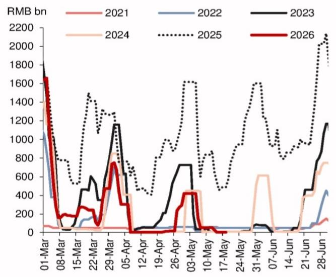
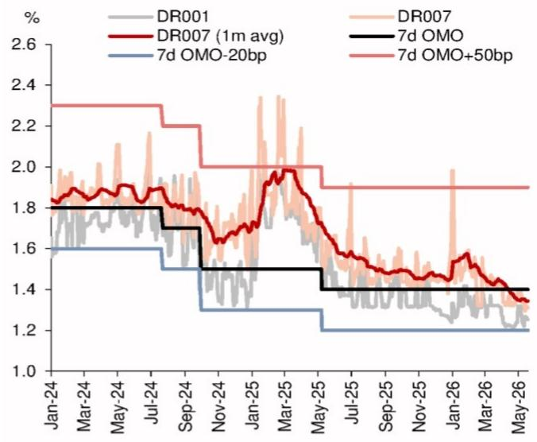
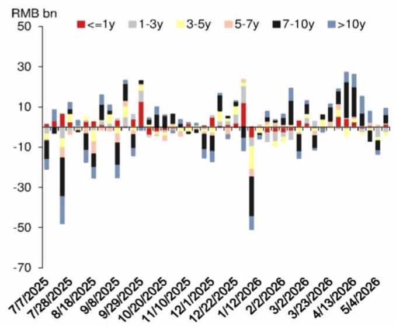

# 市场真正低估的不是需求，而是流动性的边际收紧

过去一个月，中国利率市场在一个极窄的区间内窄幅震荡。7天回购定盘利率甚至小幅下行，这似乎与市场对流动性收紧的普遍预期相悖。但从某外资投行最新发布的研报来看，这恰恰是市场正在犯的一个认知错误：**市场低估了央行在5月加速回笼中长期流动性的力度，以及这一行为对利率曲线前端定价的潜在影响。**

这份报告的核心判断值得每一位关注中国固定收益市场的投资者认真对待：**风险回报的天平已经倾斜，当前市场对流动性宽松的定价过于自满，而对央行结构性收紧的力度和持续性认知不足。** 报告作者明确调整了其组合，退出了30年期国债的多头，并转向支付前端利率互换。

这并非一个简单的方向性判断，它背后是多个结构性变量的共振。以下是我们从报告中提炼出的五点核心洞察。

## 1. 央行回笼流动性的节奏远超市场预期，5月是关键转折点

市场对流动性的感知往往停留在短期资金利率是否宽松上。但这份报告揭示了一个更重要的结构性变化：央行正在通过中期和长期流动性工具加速回笼资金。

数据显示，今年1-2月，央行通过中期借贷便利、买断式逆回购、国债净买入以及降准等工具，累计净投放了2.05万亿元的中长期流动性。这一数字显著高于2020-2025年同期均值6310亿元，也是此前市场流动性极度充裕的根源。

然而，进入3月后，央行开始净回笼。3月和4月分别净回笼了2000亿元和5600亿元。但即便如此，截至4月底，年内累计净投放仍高达1.29万亿元，依然高于历史均值。

真正的转折发生在5月。报告指出，央行在5月通过3个月和6个月期限的买断式逆回购，净回笼了1万亿元的流动性。这一操作使得年内累计净投放急剧下降至2900亿元，**显著低于2020-2025年5月同期的均值1.18万亿元。** 这意味着，市场此前享受的超额流动性红利，正在以比预期更快的速度被收回。

**这意味着什么？** 市场需要重新校准对流动性环境的基准假设。此前基于极度宽松流动性做出的资产定价，尤其是对短端利率的定价，可能面临修正。资金利率最终将对这种绝对水平的下降做出反应，尽管过程可能是渐进的。

## 2. 7天回购利率的走低并非宽松信号，反而可能是政策利率调降的前兆

一个看似矛盾的现象是：尽管央行在回笼流动性，但5月7天回购定盘利率与7天逆回购利率的月度平均利差却降至-3个基点，这是自2023年5月以来的首次负值。市场参与者可能会将此解读为流动性依然宽松的证据。

但报告提供的历史规律表明，这种解读可能恰恰相反。在2022年至2025年期间，7次逆回购利率下调中，有6次发生在第二和第三季度。而在降息之前，央行通常会引导或允许7天回购定盘利率先行走低。换句话说，**当前回购利率的低位，可能不是流动性宽松的结果，而是为后续政策利率调整铺路的信号。**

此外，5月至9月通常是政府债券（包括国债和地方债）发行的旺季。历史经验显示，央行在这一时期倾向于确保银行体系有充足的流动性。但今年，在净回笼1万亿的背景下，这一季节性规律是否还能成立，存在很大疑问。

**这意味着什么？** 投资者不应将7天回购利率的走低视为可以继续做多短端利率的理由。相反，这或许是一个需要警惕的先行指标。如果历史规律成立，那么从6月开始，流动性将大概率趋于收紧。事实上，DR001已经在5月出现了小幅上行。

## 3. 30年期国债的“独立性”正在被侵蚀，外部利率的传导不容忽视

过去一段时间，中国国债市场，尤其是超长端，表现出了一定的“独立性”，在全球利率大幅上行的背景下，30年期国债收益率并未跟随。报告将其归因于国内独特的基本面：央行加息概率极低、经济增长面临国内需求疲软的压力。

然而，这种独立性正在面临挑战。报告明确指出，随着全球收益率因油价上涨、通胀担忧以及央行政策预期而出现显著抛售，**30年期国债收益率的外部贝塔值可能正在上升。** 尤其是在4月30年期国债已经出现超预期表现之后，其后续的上行风险正在增加。

从持仓数据来看，虽然境内基金尚未大规模减持30年期国债，但买入力量已经明显减弱。保险公司开始小量回补，而大型银行和证券公司则仍是最主要的卖出方。这种结构性的持仓变化，叠加外部利率的传导压力，使得30年期国债的吸引力正在下降。

**这意味着什么？** 超长端利率的“避风港”属性正在减弱。对于持有大量长久期资产的机构而言，需要重新评估其利率风险暴露。报告选择退出30年期国债的多头头寸，正是基于这一判断。

## 4. 报告尚未完全回答的关键问题：央行回笼的持续性有多强？

尽管报告对5月的流动性回笼给出了清晰的描述和判断，但一个尚未被完全解答的关键问题是：**这一回笼节奏在6月及下半年能否持续？**

报告提到了两个可能限制央行继续回笼的因素：一是政府债券供给高峰的到来，这需要流动性配合；二是国内经济复苏的脆弱性，尤其是房地产市场的企稳能否延续。虽然4月一线城市二手房价格出现环比上涨，但这一趋势的可持续性仍有待观察。

如果央行因配合财政发力而放缓回笼节奏，那么当前对前端利率的看空逻辑可能会受到挑战。反之，如果央行继续以当前力度回笼，那么7天回购利率和1年期同业存单收益率的反弹将只是时间问题。

**这意味着什么？** 这是当前交易逻辑中最大的不确定性。投资者需要密切关注后续的央行公开市场操作以及政府债券的发行节奏。这决定了短期利率方向是“渐进式收紧”还是“脉冲式反弹”。

## 5. 一个实用的观察框架：盯住两个关键信号

基于报告的推导逻辑，我们认为投资者可以建立一个简洁的观察框架，来验证流动性收紧的判断是否成立。

**第一个信号是DR007与7天逆回购利率的利差。** 目前这一利差已转为负值。如果未来几周DR007的月均水平开始向逆回购利率靠拢甚至回到正区间，将是流动性实质性收紧的第一个确认信号。

**第二个信号是1年期同业存单收益率。** 在极度宽松的流动性环境下，NCD利率被压得很低。如果NCD利率开始从底部反弹，意味着银行负债端的压力正在上升，这将进一步印证央行回笼流动性的效果正在向实体经济传导。

**这意味着什么？** 这两个信号是目前观察市场拐点的最简洁工具。它们比复杂的宏观模型更直接，更能反映银行间市场的真实供需状况。一旦这两个信号同时出现，市场对宽松的定价将面临系统性修正。

---

这份研报的核心价值在于，它没有停留在对数据的简单罗列，而是通过流动性结构、历史规律和外部传导三个维度，构建了一个关于利率定价逻辑正在发生变化的完整叙事。但它同样承认，这一判断建立在多个假设之上，尤其是央行回笼节奏的可持续性以及全球利率的走向。

对于希望深入理解这一逻辑链条的读者，我们建议去阅读完整报告中的图2和图5。图2展示了央行中长期流动性净投放的详细月度数据，能让你直观感受到5月回笼力度的“历史性”。图5则对比了全球主要经济体30年期国债收益率的月度变化，能帮你理解外部传导压力的真实来源。

欢迎来到我们的知识星球微信群，继续讨论这份报告背后关于流动性拐点、政策博弈以及资产配置调整的更深层次问题。我们会在社群里分享更多关于如何解读央行资产负债表变化和利率曲线形态的框架。

Personal reading notes and learning share only. Not investment advice.

