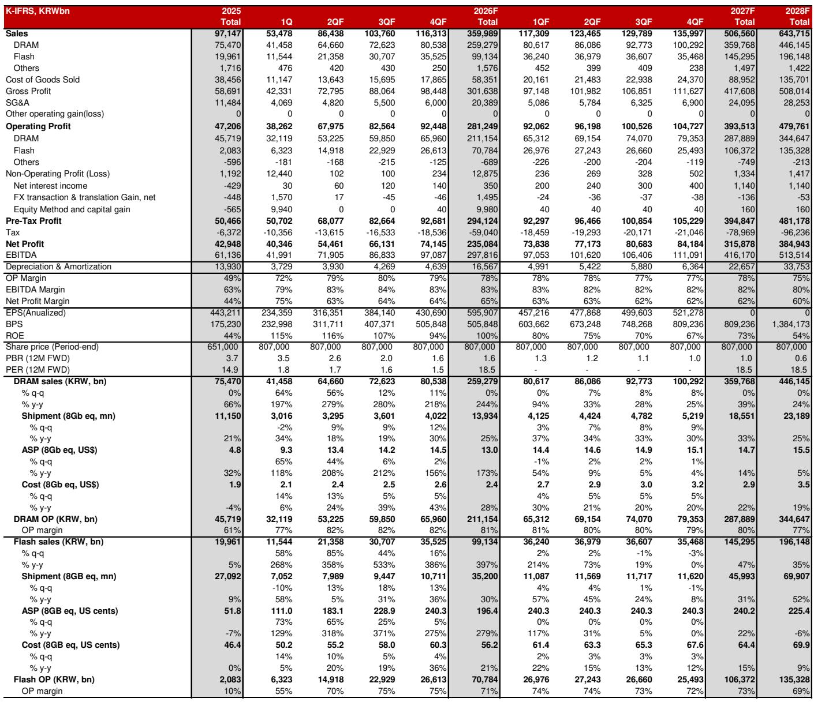
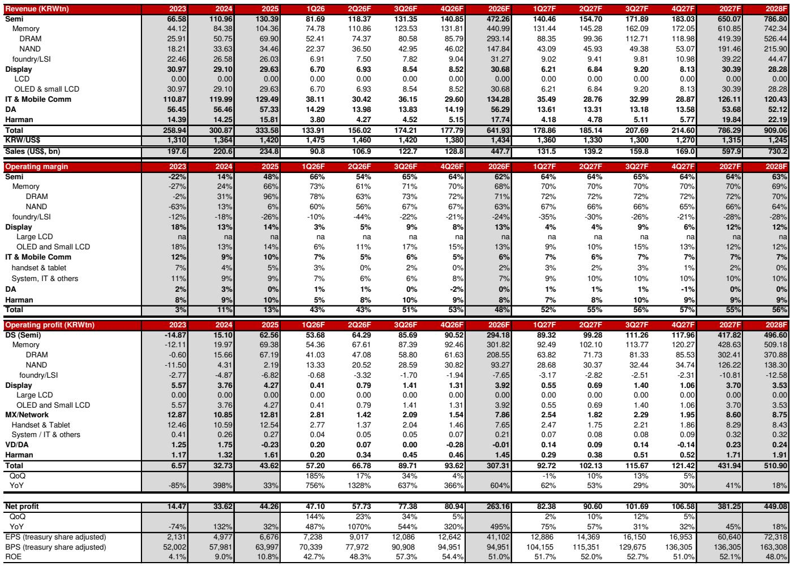

# The Memory Industry Has Entered a Structural Super-Cycle That Demands a Complete Rethinking of Valuation

The memory industry is no longer cyclical. It has become structurally undersupplied. For decades, investors treated memory as a commodity business defined by boom-bust pricing cycles, where capacity additions inevitably led to oversupply and margin collapses. That framework is now obsolete. The launch of ChatGPT in late 2022 triggered a cascade of demand that has fundamentally altered the industry's growth architecture. What began as a surge in GPU and HBM demand for training workloads has evolved into something far more consequential: a triple super-cycle spanning commodity DRAM, HBM, and SSD, driven by the exponential memory requirements of inference workloads, agentic AI, and Retrieval-Augmented Generation systems. This is not a temporary upcycle. It is a new regime.

The implications for investors are profound and underappreciated. Current valuations for the two dominant memory suppliers—Samsung Electronics and SK Hynix—imply risk premiums of 19% and 24% respectively, levels that reflect lingering assumptions about earnings volatility and weak shareholder returns. Those assumptions are increasingly disconnected from reality. Long-term agreements with cloud service providers now include three-to-five-year minimum contract periods, prepayments, and capex support commitments that make cancellation difficult and effectively guarantee near-current profitability. The structural demand environment, not contractual fine print, is what anchors this stability. Memory is now a bottleneck in the AI value chain, and the market has not yet priced that shift.

What makes this moment different from every previous memory upcycle is the geometry of the supply-demand imbalance. Memory demand is scaling as a multiplicative function of user growth, engagement time, task complexity, reasoning-token consumption, and the emergence of agentic AI. A reasonable estimate suggests demand could rise several thousand-fold over the next five years. Supply, constrained by capital intensity, technology complexity, and construction timelines, can likely expand only five to six times over the same period. No amount of software optimization—KV-cache compression, selective eviction, or architectural innovation—will close that gap. These measures merely slow the pace of growth. The industry will need every available solution, including NAND offloading and ultra-high-bandwidth NAND, deployed simultaneously.

The strategic question for investors is not whether memory demand is real. It is whether the market's pricing of risk has caught up with the structural reality of the industry. The evidence suggests it has not.

## The Shift from Training to Inference Has Transformed Memory Demand Into an Exponential Function, Not a Linear One

The conventional narrative about AI semiconductor demand has centered on training workloads and the GPU clusters required to build ever-larger models. That narrative is now incomplete. As AI deployment shifts toward inference, the memory requirements per user are expanding at a rate that traditional semiconductor forecasting models cannot capture. The reason lies in the mechanics of how inference workloads consume memory.

Every AI interaction generates what is known as KV-cache memory, which stores the context of a user session. As user bases grow, engagement times lengthen, tasks become more complex, and reasoning-token consumption increases, the memory required per user scales multiplicatively. A simple query might consume ten tokens. A RAG-based question requiring document retrieval might consume thousands. An agentic AI task that generates reports, builds models, and runs simulations can consume millions. When you multiply these factors across a growing user base, the resulting demand trajectory is not linear or even geometric in the traditional sense. It is exponential.

The report estimates that memory demand could rise by several thousand-fold over the next five years. That figure is not an extrapolation of past trends. It is a direct consequence of the multiplicative structure of inference workloads. Industry supply, growing at roughly 30% CAGR, can only deliver a five-to-six-fold increase. The gap is structural and widening. Every software-level optimization currently being pursued—compression, caching, eviction policies—is a palliative, not a cure. They shift the curve but do not flatten it.

The so-what for investors is this: the memory industry now faces a permanent demand overhang that will persist for at least the next five years. Pricing power, margin expansion, and revenue visibility are no longer cyclical phenomena. They are structural features of the new regime.

## Long-Term Agreements Have Fundamentally Changed the Risk Profile of Memory Suppliers, Making Earnings Far More Predictable Than the Market Assumes

Investors have historically discounted memory stocks because earnings were volatile and visibility was poor. Capacity additions led to oversupply, which led to price collapses, which led to margin destruction. The cycle repeated with grim predictability. That pattern is breaking, and the mechanism is the long-term agreement structure that has emerged between memory vendors and cloud service providers.

The current generation of LTAs is fundamentally different from previous attempts. Contracts now include three-to-five-year minimum periods, prepayments, and capex support commitments. These provisions make cancellation difficult and effectively lock in near-current profitability for an extended period. Critically, the binding force of these agreements is not legal enforcement alone. It is the underlying structural demand environment. Cloud service providers cannot afford to lose access to HBM and high-performance memory because semiconductors are equivalent to AI, and memory is a bottleneck. Customers are accepting these terms because they have no realistic alternative.

The implication for valuation is straightforward. The earnings streams of memory suppliers now resemble those of foundry or logic companies more than traditional commodity memory players. The report draws a direct comparison to TSMC, which trades at approximately 20x forward P/E with a 30% CAGR. Samsung Electronics and SK Hynix trade at roughly 6x forward P/E despite comparable or superior growth profiles. The gap is not explained by fundamentals. It is explained by a risk premium that reflects an outdated cyclical framework.

The market is pricing memory stocks as if the next downturn is imminent. The structural reality is that no downturn is visible on the horizon.

## The Self-Reinforcing Investment Cycle Between AI Service Providers and Hyperscalers Creates a Virtuous Loop That Makes the Current Expansion Self-Sustaining

One of the most common bear arguments against AI-related investments is that the current capex cycle is unsustainable. The logic runs as follows: AI service providers are losing money, their valuations are speculative, and when funding dries up, the entire ecosystem will contract. This argument misunderstands the dynamics of the current cycle.

The combined revenue of leading AI software and service vendors is approximately USD 70 billion today. The report suggests this could expand by more than 100x over the next five years. That projection, which would have seemed fantastical even a year ago, is increasingly plausible. Anthropic is reportedly targeting breakeven by 2027. OpenAI is aiming for profitability around 2029. These companies are raising capital at unprecedented valuations, with aggregate equity values approaching the trillion-dollar range. The capital they raise flows directly back to hyperscalers and cloud service providers through infrastructure spending, creating a powerful self-reinforcing cycle.

This is not a speculative bubble in the traditional sense. The capital being raised is being deployed into physical infrastructure—data centers, servers, memory, and networking equipment—that has real productive capacity. The cycle is driven by enterprise and sovereign AI demand, not by venture capital enthusiasm alone. Cloud service providers' operating cash flows are already growing faster than market expectations, even as free cash flow temporarily declines due to investment intensity.

The so-what for investors is that the AI investment cycle has passed the point where a funding shock could derail it. The singularity point has been crossed. Enterprise adoption, sovereign AI initiatives, and agentic AI deployments are creating demand that is increasingly independent of the financial health of any single AI startup. The cycle is self-sustaining.

## The Market Has Not Yet Grappled With the Full Implications of Agentic AI for Memory Demand

The report identifies agentic AI as a key driver of the current super-cycle, but the full implications are worth examining in greater depth. Agentic AI refers to systems that can autonomously execute complex multi-step tasks—building financial models, generating reports, interacting with other software tools, and making decisions based on real-time data. These systems consume orders of magnitude more memory than simple query-response models.

The reason is that agentic AI requires persistent context. Each step in a multi-step task generates KV-cache memory that must be retained for the duration of the task. As agents become more sophisticated, the duration and complexity of tasks increase. A simple RAG query might consume thousands of tokens. An agentic task that involves data retrieval, model building, report generation, and quality assurance could consume millions. The memory requirement scales with the number of steps, the complexity of each step, and the number of concurrent users.

The report notes that agentic AI is also creating entirely new categories of semiconductor demand, including CPUs and commodity memory. But the more important point is that agentic AI reinforces the usage expansion of AI servers themselves. Every new agentic capability drives another leg of GPU and memory demand. The effect is compounding.

This has direct implications for memory suppliers. The demand trajectory implied by agentic AI is not captured by current consensus estimates. The report's own forecasts for Samsung Electronics and SK Hynix are significantly above Bloomberg consensus, and the gap has been widening over time. The market is systematically underestimating the memory requirements of the next generation of AI applications.

## Three Unresolved Questions the Report Raises But Does Not Fully Answer

The report is unusually thorough in its analysis, but it leaves several important questions open. First, the structural power shortages that could delay US data center construction represent a genuine bottleneck risk. The report acknowledges this but treats it as a manageable issue that will be solved by innovation and new energy sources. The reality is that US construction productivity is materially lower than Asian benchmarks, and the power infrastructure supply chain has experienced years of underinvestment. Satellite imagery monitoring of construction progress, which the report mentions almost in passing, suggests that this risk is more serious than the report's overall optimistic tone implies.

Second, the financing structure of non-cloud data center investments introduces interest rate sensitivity that could become problematic. Approximately half of total data center investment is financed by non-cloud operators using long-term cloud purchase agreements. These project financing structures are highly sensitive to funding costs. If long-term bond yields rise sharply due to inflationary pressures—and the report notes that memory price increases alone could contribute more than 0.8% to US CPI this year—project-related risks could increase meaningfully. The report argues that strong end-demand should keep refinancing markets accessible, but this is an untested hypothesis.

Third, the geopolitical dimension of memory supply concentration deserves more attention. The dominant memory suppliers are based in South Korea, and the manufacturing footprint is heavily concentrated in Asia. The report does not address what happens if geopolitical tensions disrupt supply chains or if export controls are extended to memory technology. These risks are real and could create significant volatility even in a structurally undersupplied market.

## A Decision Framework for Investors Evaluating Memory Exposure

For investors trying to translate this analysis into actionable decisions, the following framework may be useful. First, assess your time horizon. If you are investing with a six-month view, the cyclical volatility that has historically characterized memory stocks remains a risk. Short-term price movements driven by spot market fluctuations or macro headlines could create significant drawdowns. If you are investing with a three-to-five-year view, the structural thesis is compelling and the current valuation discount represents a genuine opportunity.

Second, evaluate your willingness to accept tracking error relative to consensus. The report's forecasts are significantly above Bloomberg consensus for both Samsung Electronics and SK Hynix. This means that if the structural thesis is correct, the upside is substantial. But it also means that near-term earnings reports may disappoint relative to the report's projections if the ramp in demand takes longer than expected. The gap between the report's estimates and consensus is a measure of both opportunity and risk.

Third, consider the portfolio context. Memory stocks offer exposure to the AI value chain that is different from GPU or hyperscaler exposure. The memory bottleneck means that pricing power is shifting from buyers to suppliers. This is a relatively rare dynamic in the semiconductor industry, and it creates a return profile that is complementary to other AI-related investments.

Fourth, monitor the leading indicators that the report identifies: data center construction progress, LTA contract terms, and the financial health of AI service providers. If construction delays become chronic, if LTA terms weaken, or if AI startup funding dries up, the structural thesis would need to be reassessed. For now, all three indicators point in the same direction.

## The Full Picture Requires Access to the Original Data and Charts

The analysis presented here draws on a detailed research report that includes proprietary data on memory pricing trends, revenue growth trajectories, and valuation comparisons. The charts showing the divergence between spot and contract prices for DDR5 memory, the historical trajectory of global memory sales, and the evolution of consensus estimates versus the report's forecasts are essential for understanding the magnitude of the current disconnect between market pricing and structural reality.

Join the community to read the full report and review the original charts.

*This article is for learning and discussion only and does not constitute investment advice.*

Personal reading notes and learning share only. Not investment advice.

