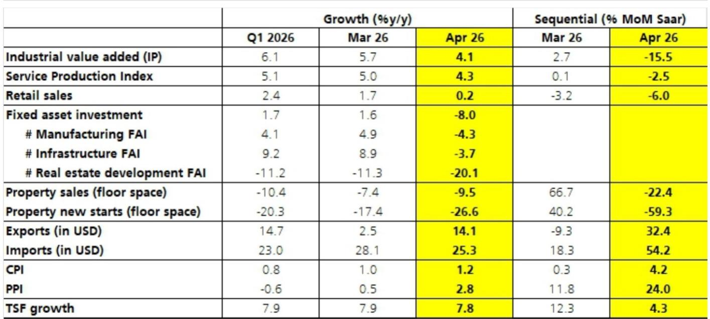
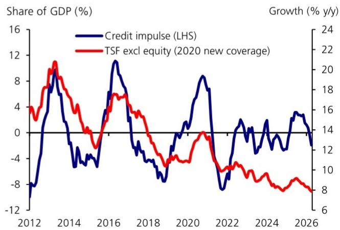
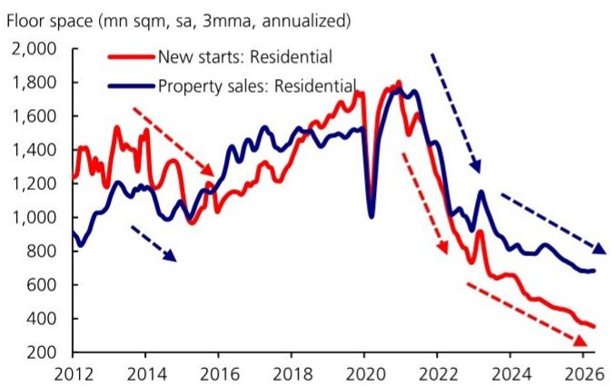

# 四月数据的真正信号：政策收紧的“用力过猛”与即将到来的转向

四月经济数据全面低于预期，不是一次普通的月度波动，而是一场由行政政策主动收紧引发的“人为减速”。工业增加值、固定资产投资、零售额、房地产投资、信贷投放——几乎所有核心指标同步走弱，且幅度远超市场共识。某外资投行最新研报的核心判断是：这不是需求侧的意外崩塌，而是政策执行层的激励扭曲在数据上的集中兑现。

理解这一点，比预测下个月GDP数字重要得多。因为如果判断正确，那么接下来的政策调整就不是“会不会”，而是“何时、以何种力度”。

## 1. 四月数据的全面走弱，根源在于行政激励的“刹车踩过头”

研报指出，四月数据下滑的驱动力并非外部冲击或需求骤降，而是行政政策立场的主动收紧。今年是“十五五”开局之年，“开门红”是明确的政策目标。一季度，尤其是国有主导的投资领域，确实出现了明显的“抢跑”效应。但进入四月，决策层对经济前景的信心增强后，行政政策基调发生了微妙但关键的转变。

这种转变体现在两个“更加重视”上：一是更加重视“不设定过高经济目标，不通过制造浪费性的大型投资项目来达成目标”，二是更加重视“不虚报数据”。与此同时，官员又被要求“不能无所作为”。于是，基层官员面临的激励变成了“做点事，但别做太多”。

然而，问题的关键在于，近期对官员的实际处罚案例中，处罚“乱作为”的力度明显大于“不作为”。这种不对称的惩罚机制，直接解释了为什么尽管央行在银行间市场大幅放松流动性，信贷增长依然疲弱——基层没有动力去推动项目落地和信贷投放。这是一种典型的“激励扭曲”，其后果就是四月数据的全面塌陷。

这意味着什么？市场不能简单地将四月数据解读为“经济二次探底”的信号，而应将其视为一个政策周期的“校正点”。数据越弱，政策转向的紧迫性就越强。

## 2. 年内“小周期”再次上演：一季度强、二季度弱，三季度政策转松

研报揭示了一个近年来反复出现的“年内小周期”模式：一季度数据强劲，二季度数据走弱，三季度政策出现转向，四季度经济反弹。四月的表现，几乎就是这一模式的又一次完美预演。

市场对全年增长的预测，也呈现出同样的节奏：一季度数据发布后，预测上调；二季度数据发布后，预测下调；年底前预测再次回升。当前，我们正处于从“预测上调”转向“预测下调”的拐点。

但这次与往年有一个重要区别：央行从四月起就一直在保持流动性非常宽松的状态，这反映出政策层已经提前感知到信贷需求疲软的压力。然而，仅仅靠货币宽松是不够的，因为问题的根源在于行政层面的“刹车”。研报判断，四月数据下滑的幅度和广度足够显著，以至于行政政策很可能不需要等待下一次高级别常规政策会议，就会做出调整。

这里的核心洞察是：政策转向的节奏可能比市场预期的更快。投资者不应等到三季度才布局，而应提前思考政策转向可能的路径和受益方向。

## 3. 房地产与固定投资：下行压力仍在加剧，但政策底可能已经不远

四月数据显示，房地产活动进一步走弱。销售面积同比下降9.5%，新开工面积同比下降26.6%，跌幅均较三月有所扩大。经季节性调整后，新开工和销售面积环比继续下行。房地产开发投资同比下降20.1%，创下更深跌幅。

固定投资（FAI）更是出现了同比收缩8%的罕见局面，制造业、基建、房地产三大板块全面负增长。研报特别提醒投资者，对FAI数据要持谨慎态度，因为数据质量存在一定问题，但即便如此，方向性信号已经非常明确：投资端的下行压力正在从房地产向制造业和基建蔓延。

值得关注的是，尽管销售和新开工数据疲软，但一线城市房价的环比跌幅在收窄，并维持了环比正增长的势头。这是一个被多数人忽略的积极信号。如果一线城市房价能够企稳，它将成为整个房地产市场信心修复的锚点。研报没有完全展开这一点，但这里的关键问题是：一线城市的房价韧性，能否在政策进一步放松的背景下，传导至二线和强三线城市？这仍是需要持续跟踪的变量。

## 4. 出口的“异常强势”与消费的“真实疲软”：数据分裂背后隐藏的真相

四月数据中最令人困惑的矛盾在于出口与消费的背离。出口同比增速从三月的2.5%大幅反弹至14.1%，远超市场预期，科技和非科技产品出口均表现强劲。而零售额同比增速却从1.7%骤降至0.2%，几乎零增长。

这种分裂意味着什么？它说明当前经济的“供给端”（尤其是外需驱动的制造业）和“需求端”（内需驱动的消费和投资）正处于完全不同的节奏中。出口的强势，一方面受益于全球科技周期和补库存需求，另一方面也反映了企业抢出口的行为。而消费的疲软，则直接与行政政策收紧、居民收入预期下降以及消费补贴政策退坡有关。

研报指出，石油价格上涨和消费补贴政策退坡对零售数据产生了负面影响，但它们只是次要因素，无法解释数据的全面走弱。真正的原因还是行政政策收紧。这意味着，如果政策转向，消费的修复弹性可能比市场预期的更大，因为被压抑的不是居民购买力，而是政策环境带来的不确定性。

## 5. 通胀不是障碍，但数据质量是新的难题：投资者需要关注的“二阶效应”

四月PPI同比跳升至2.8%，CPI也小幅上行至1.2%。这会不会成为政策放松的制约？研报给出了明确的否定答案，理由有二：第一，CPI比PPI重要得多，而核心CPI依然温和；第二，四月数据如此疲弱，如果不采取行动，全年GDP目标的下限可能无法完成，而GDP是当前最重要的经济目标，尤其是在五年规划的开局之年。

因此，通胀不会成为政策调整的障碍。但另一个问题值得投资者高度重视：数据质量。研报指出，四月数据的异常将给后续分析带来额外困难，这与2025年下半年FAI数据的情况类似。研报给出的判断框架是：GDP核算下的数据（如资本形成总额、消费支出）、外贸数据、货币信贷数据质量相对较高；而微观数据，如具体产品的产量单位，对于判断真实经济动能尤为重要。

这意味着，投资者在解读未来几个月的数据时，不能仅看官方公布的宏观总量，而应更多关注高频微观数据和信贷脉冲指标。信用脉冲（credit impulse）在四月已经转为更负，这是一个比总量信贷增速更灵敏的领先指标。

## 6. 报告尚未完全回答的关键问题：政策转向的“度”在哪里？数据“噪音”如何过滤？

这份研报提供了一个清晰的分析框架和判断，但仍有几个关键问题没有完全展开，而这恰恰是投资者最需要自己判断的地方。

第一，政策转向的“力度”和“方式”是什么？研报判断转向“即将到来”，但“行政政策”的调整往往难以量化。是重新鼓励地方政府上项目，还是通过放松房地产限购？是加大财政转移支付刺激消费，还是通过放松信贷监管推动企业投资？不同的方式，对资产价格的含义截然不同。

第二，数据“噪音”如何过滤？研报承认FAI数据质量存在问题，并建议关注微观数据。但投资者如何在实际操作中区分“政策收紧的真实冲击”和“数据统计的扰动”？这需要一个更精细的观察框架。

第三，出口的强势能持续多久？如果全球经济增长放缓，或者抢出口效应消退，出口的韧性将面临考验。届时，内需能否接棒，将是决定全年增长能否达标的关键。

这些问题，正是我们希望在后续的讨论中，与读者一起深入拆解的。完整的研报原文包含了更详尽的图表和分项数据，能够帮助投资者建立自己的判断逻辑。

---

Personal reading notes and learning share only. Not investment advice.

