# Global Equity Strategy

# The Consumer: be selective

We look at consumer plays in Europe, US and China.

Our concerns about the European consumer. There are several headwinds for the European consumer. First, even if the conflict ends tomorrow, we are left with gas at elevated price levels (120% above pre-conflict scenario in Q4 26), oil at 40% above pre-conflict scenario in end-26 (each 10% on oil takes 0.2% off consumption), food being affected by fertiliser prices (we are at peak planning season and if fertiliser prices are up c30%, then this leads to a c10% increase in food prices, adding c0.5% to CPI) and potentially higher rates (UBS forecast 2 rate hikes compared to none pre-conflict and we estimate each 50bps on rates taking 0.3% off consumption). The offset would be fiscal gifts to the household (which appear to be tiny compared to 2022/3), dis-saving (with current savings ratios being abnormally high) and slightly higher wage growth (though the ECB wage tracker shows little sign of this). Thus, we think it is quite feasible that consumption is c1%+ lower than pre-conflict estimates. Even employment growth has faded, running at just 0.1% QoQ in Q1 and 0.5% YoY in EZ and is negative in the UK.

The consumer sectors, particularly retailing, outperforms when the Euro or Sterling strengthen (as typically they have more dollar costs than revenues). UBS forecasts EUR/USD at 1.14 by year-end (although on the global strategy team we see significantly upside risks to this forecast).

What's in the price? The following consumer sectors have de-rated more than 10% since 26/2: European and Global household products, Global luxury & European retailing. The following sectors are now more than 1.5std cheap (relative to their normal P/E against the market): European and Global household products and Beverages, Global luxury, and European retailing. The aggregate basket of consumer cyclicals is trading close to its norm (on a 8% discount to the market) despite being oversold. The consumer staples are abnormally cheap (7% discount to the market compared to average premium of 25%) but face huge disruptive issues (i.e., Gen Z, GLP1 and, above all, Agentic Agents de-branding non conspicuous brands).

# Where would we focus on the consumer side globally:

The China consumer: UBS have turned more positive on China property (see here) with property accounting for c60% of household wealth. Also, China consumption should be aided by some modest acceleration in wage growth (from 2% to 4%) and the end of deflation. In the long run, the China's consumer share of GDP has to rise. This backs up a buy on L'Oreal (17% of sale to China), luxury and Chinese domestic brand (Yum Brands, Li Ning and Moutai).

Don't give up on luxury: 26% of luxury spend is from the China cluster. The P/E relative to global markets is 0.8 std deviations cheap against its norm globally (36% premium versus norm of 45% premium) and critically: i) EPS is now back to trend (having been 100% above); ii) EPS estimates are very conservative (consensus has EPS being 2% less than the Eurostoxx - close to historic lows); iii) Earnings momentum (though poor) is much better than performance (hence the de-rating of c10% since 26/2); iv) the US cluster is now almost as big as China and there is a clear positive wealth effect (if 0.2% of the equities gains in the US ytd were spent on luxury items, then global luxury spend would rise by c4%); v) we think high end/hard luxury is amongst the sectors least disrupted by Gen AI; and vi) the sector is 2.7 std oversold. We have a buy on Richemont.

# Equity Strategy

Global

Andrew Garthwaite

Strategist

andrew.garthwaite@ubs.com

+44-20-7567 4343

Marc el Koussa

Strategist

marc.el-koussa@ubs.com

+44-20-7567 0298

Ryanair: the low-cost carriers get a huge competitive advantage when the cost of oil rises in what is a structurally much better industry. The stock trades on a 2% discount to its fleet value on 2027 estimates. Easyjet trades on a 76% discount to fleet value.

Household products: have seen the biggest de-rating of any sectors, are 2.5 std cheap globally (and 2.7 std cheap in Europe), and are abnormally oversold. We struggle to understand why they are perceived to be more disrupted than any other sector. The teams have buys on Reckitt Benckiser and Colgate (the latter has positive earnings revisions in the past 3 months).

Spain: If there is a bright spot for European consumer, then it is Spain (it accounts for a quarter of EZ employment growth) with employment up 2.3% yoy fuelled by net migration of 1.3% yoy and house prices rising 13% yoy. Moreover, Spain with c75% of power from nuclear and renewables is one of the most resilient EU countries to higher oil/gas prices. The sizeable consumer proxy would be consumer banks (i.e., Santander), Inditex (buy rated and 17% of sales are from Spain).

Stock screen: If we screen for names that rank well in Europe on valuation (P/E, P/B), earnings revisions, price momentum, crowding and quality, then the best ranked buys are Zalando, Inditex, Carlsberg, Heineken, L'Oreal, and ABI. If we look at names that are at least 1 std cheap on P/E relatives, buy rated with positive earnings revisions, then we would look at Carlsberg, Heineken, and M&S.

# Where do we find ourselves cautious:

Underweight autos: P/E is not that cheap (with P/E relative to the market 5% above their norm in EU and 63% Globally) with the sector only having de-rated 4% since 26/2. Global margins are at average levels but there are both huge structural and cyclical pressures. The structural headwinds being: China competition; over-investing because of both the need to invest in both ICE and EV; legacy car markets have up to 60% cost disadvantage compared to new entrants in EV according to BCG, with additional uncertainties over the appropriate technologies. There are also large cyclical pressures: with the rise in aluminium and memory prices; US light vehicle car sales are down 6% yoy and used car prices are now falling. A rise in EV sales depresses margins (according to UBS). Historically, autos (owing to financing divisions) underperform if credit spreads rise and UBS forecast spreads to rise. Earnings momentum looks poor (ranking 24 out of 27 in Europe and bottom globally). The team have sells on Nissan, Volvo, and Renault.

We prefer the pure battery players (i.e., LGES and CATL) to those autos pivoting into batteries.

Low end US consumer faces substantial headwinds: we find ourselves relatively cautious because: i) real wage growth is likely to turn negative as core PCE rises to 3.2%; ii) employment PMIs imply slower employment growth; iii) excess savings have been largely utilised (apart from the top income decile), iv) earnings momentum of retailing is rolling over with P/E relative to the market (ex-Amazon) for retailing close to its norm (at 4% discount to the market). The positives would be a strong dollar and the wealth effect (10% on equities can add up to 1.5% to consumption but this helps the high-end consumer with the richest 20% of the population accounting for 40% of consumption and owning 83% of equities). Those names most exposed to the US low-end consumer (who is disproportionately hit by higher oil but they don't own much equities) include Jet Blue and Kohls.

# Contents

# The Consumer: be highly selective....4

The European consumer....mounting headwinds....4

Other headwinds for the European consumer stocks: 7

Where are the pockets of value:....10

China consumer....15

Spain – a port on a storm in Europe for the consumer. 16

Underweight global Autos. 17

Low-end US consumer looks set to disappoint....20

Screens. 24

Appendix....27

Andrew Garthwaite

Strategist

andrew.garthwaite@ubs.com

+44-20-7567 4343

Marc el Koussa

Strategist

marc.el-koussa@ubs.com

+44-20-7567 0298

# THE CONSUMER: BE SELECTIVE

In this note, we highlight the headwinds for the European consumer but highlight where we see pockets of value (i.e., household products, luxury, budget airlines). We also highlight why we want to focus on the China consumer. We want to be cautious of the low-end US consumer. We stay underweight of autos.

# The European consumer....mounting headwinds

The European consumer seems to face the following headwinds.

Real wage growth is likely to turn negative: The ECB Eurotracker wage index shows nominal wage growth to be around 2.3% and with headline inflation likely to rise to 3.4% on UBS forecasts, real wage growth could at one point fall by 50 to 100bps. Wages are already growing less strongly than inflation in Europe if we look at the Indeed Survey (for new employees).

Figure 1: ECB wage trackers shows c2.3% wage growth but UBS forecast CPI inflation to rise to 3.4%   
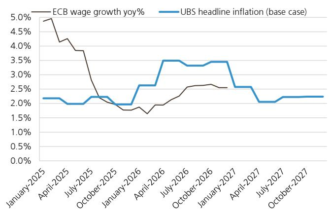

line

| Date       | ECB wage growth yoy% | UBS headline inflation (base case) |
|------------|----------------------|------------------------------------|
| January-2025 | 5.0%                 | 2.2%                               |
| April-2025  | 4.5%                 | 2.1%                               |
| July-2025   | 4.0%                 | 2.0%                               |
| October-2025| 3.5%                 | 2.1%                               |
| January-2026| 2.0%                 | 1.9%                               |
| April-2026  | 1.8%                 | 2.6%                               |
| July-2026   | 2.5%                 | 3.5%                               |
| October-2026| 2.6%                 | 3.4%                               |
| January-2027| 2.5%                 | 3.4%                               |
| April-2027  | 2.5%                 | 2.6%                               |
| July-2027   | 2.0%                 | 2.1%                               |
| October-2027| 2.3%                 | 2.2%                               |

Source: UBS, Haver

Figure 2: European real wage growth on the Indeed Survey is now negative   
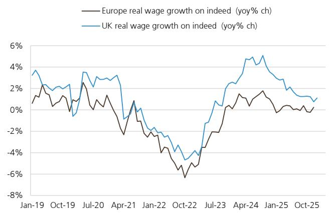

line

| Month   | Europe real wage growth on indeed (yoy% ch) | UK real wage growth on indeed (yoy% ch) |
|---------|-----------------------------------------------|------------------------------------------|
| Jan-19  | ~1.5%                                         | ~3.5%                                    |
| Oct-19  | ~0.5%                                         | ~2.0%                                    |
| Jul-20  | ~2.5%                                         | ~3.5%                                    |
| Apr-21  | ~-2.0%                                        | ~3.0%                                    |
| Jan-22  | ~-3.0%                                        | ~-1.0%                                   |
| Oct-22  | ~-6.0%                                        | ~-4.0%                                   |
| Jul-23  | ~-2.0%                                        | ~1.0%                                    |
| Apr-24  | ~1.5%                                         | ~4.5%                                    |
| Jan-25  | ~1.0%                                         | ~3.0%                                    |
| Oct-25  | ~0.5%                                         | ~1.0%                                    |

Source: UBS, Haver, Refinitiv Datastream

Employment growth is weak: UBS forecast employment growth of 0.6% in the EZ and 0.8% in the UK. We can see downside risks to this with employment growth in EZ in Q1 up just 0.5% YoY and 0.1% QoQ and UK employment growth actually contracting YoY and QoQ - and for most regions employment is contracting.

Figure 3: Latest employment growth in Eurozone & select European countries 

<table><tr><td colspan="3">2026 Q1 Employment growth</td></tr><tr><td>Region</td><td>QoQ %</td><td>YoY%</td></tr><tr><td>UK</td><td>-0.01%</td><td>-0.25%</td></tr><tr><td>Italy</td><td>0.12%</td><td>0.03%</td></tr><tr><td>Germany</td><td>0.05%</td><td>-0.28%</td></tr><tr><td>Netherland</td><td>0.00%</td><td>0.34%</td></tr><tr><td>Spain</td><td>0.32%</td><td>2.46%</td></tr><tr><td>France</td><td>-0.15%</td><td>-0.17%</td></tr><tr><td>EU 27</td><td>0.11%</td><td>0.58%</td></tr><tr><td>EZ</td><td>0.10%</td><td>0.50%</td></tr></table>

Source: UBS, Haver

Employment PMIs tend to have fallen quite sharply and seem to be consistent with 0.3% employment growth.

Figure 4: UK Employment PMI vs Vacancy growth   
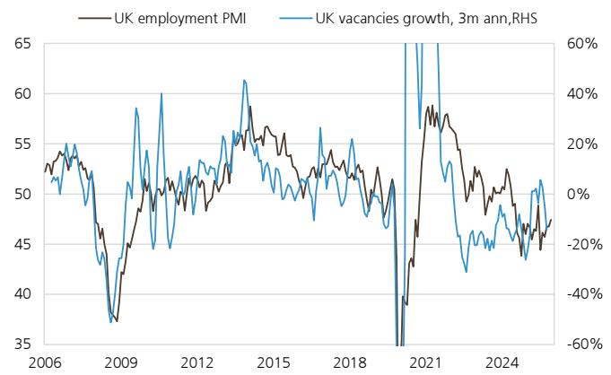

line

| Year | UK employment PMI | UK vacancies growth, 3m ann,RHS |
|------|---------------------|----------------------------------|
| 2006 | ~53                 | ~10%                             |
| 2009 | ~37                 | ~-40%                            |
| 2012 | ~50                 | ~20%                             |
| 2015 | ~58                 | ~40%                             |
| 2018 | ~52                 | ~-10%                            |
| 2021 | ~58                 | ~60%                             |
| 2024 | ~45                 | ~-20%                            |

Source: UBS, Refinitiv Datastream

Figure 5: Europe employment PMIs vs employment growth   
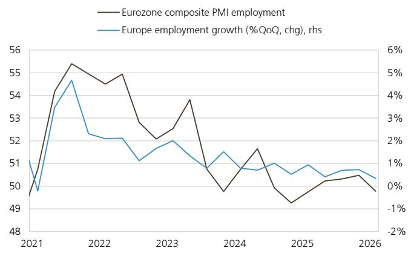

line

| Year | Eurozone composite PMI employment | Europe employment growth (%QoQ, chg), rhs |
|------|------------------------------------|---------------------------------------------|
| 2021 | 49.5                               | 51.0                                        |
| 2022 | 55.5                               | 4.5                                         |
| 2023 | 52.0                               | 2.0                                         |
| 2024 | 49.5                               | 1.5                                         |
| 2025 | 49.0                               | 1.0                                         |
| 2026 | 50.0                               | 0.5                                         |

Source: UBS, Refinitiv Datastream

Commodity prices: there are three particular hits to commodity prices that we worry about being more permanent, even if the Middle East conflict were to end very soon.

Food. Fertiliser prices are up c30% which pushes up food prices by c10% (the IMF actually highlight that half of the increase in fertiliser prices feeds through to food prices). While food has a large weighting in CPI (14% in EU21 and 11% in UK), large proportion of the prices are relatively fixed. Thus, the rise in fertilizers prices could lead to a c50bp CPI (see here). We hear reports of farmers not being able to afford fertiliser. This will just mean that yields are lower (pushing up food prices).

Oil: each 10% on the oil prices takes 0.2% off consumption, using the ECB ready reckoner. If we just take the forward curve a year out to be the predictor of the oil price, then the 1-year forward oil price is 15% higher than 26-2 levels and thus implying a 0.3% hit to consumption, with UBS forecasting (under a 5 week disruption scenario) oil at the end of 2026 to be \$86pb - 40% higher than pre 26th February forecasts, resulting in a 80bps hit to consumption. In the short term, companies hedge or may temporarily take the hit in profit margin. In the long term, they cut costs (i.e. wages) or raise prices. Neither is good for the consumer.

Gas: UBS forecast a TTF price of €74 by Q4 26 (i.e. up 60% from current levels and 120% above pre 26-2 forecasts). Gas sets the price of electricity in c60% of countries, and gas and electricity is c5% of CPI. Hece, it is quite possible that a much higher gas prices takes up to 40bps off consumption. This comes through with a lag as countries tend to set electricity prices slowly in response to a rise in gas prices.

Rates: UBS now see two rate rises this year (prior to the Middle East crisis it was none). 50bps on rates takes about 30bps off consumption (with a 1-year lag on ECB data).

It is quite possible that gas, oil, food, and rates means that consumption growth is c2% lower than the pre-conflict scenario, without any of the offsets discussed below.

# What are the offsets?

The consumer starts off with one clear advantage compared to the period preceding the invasion of Ukraine. Specifically, the consumer has excess savings of c10% of GDP in both the UK and Europe and the savings ratio in the UK and EZ are still 3.5% and 3% above pre-Covid levels, respectively. This is to be contrasted with the US where the savings ratio is 4% below pre-covid levels.

Figure 6: Excess savings are 10% of GDP   
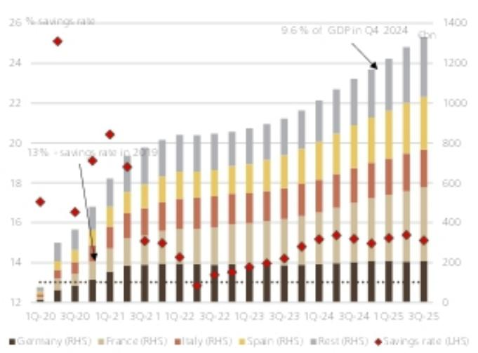

bar_stacked

| Quarter | Germany (RHS) (%) | France (RHS) (%) | Italy (RHS) (%) | Spain (RHS) (%) | Rest (RHS) (%) | Savings rate (LHS) |
|---|---|---|---|---|---|---|
| 1Q-20 | 12 | 10 | 5 | 5 | 0 | 170 |
| 2Q-20 | 12 | 10 | 5 | 5 | 0 | 180 |
| 3Q-20 | 12 | 10 | 5 | 5 | 0 | 190 |
| 4Q-20 | 12 | 10 | 5 | 5 | 0 | 195 |
| 1Q-21 | 13 | 10 | 5 | 5 | 0 | 205 |
| 2Q-21 | 13 | 10 | 5 | 5 | 0 | 200 |
| 3Q-21 | 13 | 10 | 5 | 5 | 0 | 205 |
| 4Q-21 | 13 | 10 | 5 | 5 | 0 | 205 |
| 1Q-22 | 13 | 10 | 5 | 5 | 0 | 205 |
| 2Q-22 | 13 | 10 | 5 | 5 | 0 | 205 |
| 3Q-22 | 13 | 10 | 5 | 5 | 0 | 205 |
| 4Q-22 | 13 | 10 | 5 | 5 | 0 | 205 |
| 1Q-23 | 13 | 10 | 5 | 5 | 0 | 205 |
| 2Q-23 | 13 | 10 | 5 | 5 | 0 | 205 |
| 3Q-23 | 13 | 10 | 5 | 5 | 0 | 205 |
| 4Q-23 | 13 | 10 | 5 | 5 | 0 | 205 |
| 1Q-24 | 13 | 10 | 5 | 5 | 0 | 205 |
| 2Q-24 | 13 | 10 | 5 | 5 | 0 | 205 |
| 3Q-24 | 13 | 10 | 5 | 5 | 0 | 205 |
| 4Q-24 | 13 | 10 | 5 | 5 | 0 | 205 |
| 1Q-25 | 13 | 10 | 5 | 5 | 0 | 205 |
| 2Q-25 | 13 | 10 | 5 | 5 | 0 | 205 |
| 3Q-25 | 13 | 10 | 5 | 5 | 0 | 205 |
9.6% of GDP in Q4, Q4, Q4, Q4, Q4, Q4, Q4, Q4, Q4, Q4, Q4, Q4, Q4, Q4, Q4, Q4, Q4, Q4, Q4, Q4, Q4, Q4, Q4, Q4, Q4, Q4, Q4, Q4, Q4, Q4, Q4, Q4, Q4, Q4, q4, q4, q4, q4, q4, q4, q4, q4, q4, q4, q4, q4, q4, q4, q4, q4, q4, q4, q4, q4, q4, q4, q4, q4, q4, q4, q4, q4, q4, q4, q4, q4, q4, q6, q6, q6, q6, q6, q6, q6, q6, q6, q6, q6, q6, q6, q6, q6, q6, q6, q6, q6, q6, q6, q6, q6, q6, q6, q6, q6, q6, q6, q6, q6, q6, q6, q6 |
| Q3-25* (Last Quarter) - Savings rate (LHS) = (9.6% of GDP in Q4, Q4) - The chart displays the percentage of GDP allocated to savings rates for Germany (RHS), France (RHS), Italy (RHS), Spain (RHS), and Rest (RHS). The data series are extracted quarterly from Q3-25 to Q3-26. The values for each quarter are labeled on the chart.

Source: UBS, Haver

Figure 7: The gap between European and US savings rates has widened sharply   
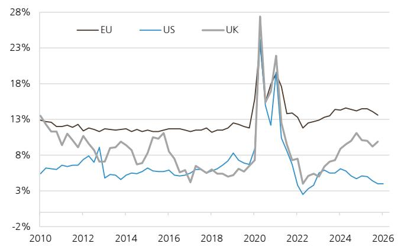

line

| Year | EU    | US    | UK    |
|------|-------|-------|-------|
| 2010 | 13%   | 7%    | 13%   |
| 2012 | 13%   | 8%    | 10%   |
| 2014 | 13%   | 7%    | 9%    |
| 2016 | 13%   | 7%    | 10%   |
| 2018 | 13%   | 7%    | 7%    |
| 2020 | 13%   | 8%    | 28%   |
| 2022 | 13%   | 3%    | 8%    |
| 2024 | 13%   | 7%    | 10%   |
| 2026 | 13%   | 7%    | 9%    |

Source: UBS, Refinitiv Datastream

# But higher rates don't help saving ratios fall.

The problem here is that the economics team highlight that a lot of these savings have been transferred to more illiquid assets (see here). We also feel that savings ratios tend to fall when real estate prices rise and interest rates are low. Rates are expected to rise 50bp in EZ and while house prices are up 3.5% YoY in Europe, the rise in mortgage rates will likely impact the housing market negatively (with two thirds of mortgages being long dated and a one third being floating).

The other offset would be government financial support to the household. In the aftermath of the Ukraine crisis, this amounted to 1.8% of GDP in 2022 and 1.3% of GDP in 2023. The problem is now that the fiscal positions are worse, bond yields are rising and so far the government support to households has been just 0.1% of GDP (though it might rise to c0.5% of GDP according to UBS).

Figure 8: Far less fiscal offset this time around compared to Ukraine conflict   
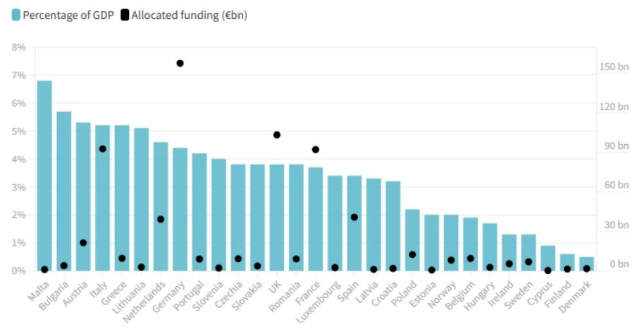

bar_line

| Country | Percentage of GDP (%) | Allocated funding (€bn) |
| :--- | :--- | :--- |
| Malta | 6.8 | 0.1 |
| Bulgaria | 5.7 | 0.2 |
| Austria | 5.3 | 1.0 |
| Italy | 5.2 | 4.4 |
| Greece | 5.2 | 0.5 |
| Lithuania | 5.1 | 0.2 |
| Netherlands | 4.6 | 1.9 |
| Germany | 4.4 | 150.0 |
| Portugal | 4.2 | 0.5 |
| Slovenia | 4.0 | 0.2 |
| Czechia | 3.9 | 0.4 |
| Slovakia | 3.8 | 0.3 |
| UK | 3.8 | 90.0 |
| Romania | 3.8 | 0.4 |
| France | 3.7 | 44.0 |
| Luxembourg | 3.4 | 0.2 |
| Spain | 3.4 | 19.0 |
| Latvia | 3.3 | 0.1 |
| Croatia | 3.2 | 0.1 |
| Poland | 2.2 | 5.0 |
| Estonia | 2.0 | 0.1 |
| Norway | 2.0 | 4.0 |
| Belgium | 1.9 | 4.0 |
| Hungary | 1.7 | 0.2 |
| Ireland | 1.3 | 2.0 |
| Sweden | 1.3 | 2.0 |
| Cyprus | 0.8 | 0.1 |
| Finland | 0.6 | 0.1 |
| Denmark | 0.5 | 0.1 |

Source: Bruegel.org

Thus we can optimistically say that the hit to consumption would be around c2% with the rise in wages, fall in the saving ratio and government fiscal helping offset around half of it. This still leaves consumption at least c1% lower than pre-conflict scenarios, with the risk on the downside.

Figure 9: Impact on net consumption 

<table><tr><td>Variable</td><td>UBS forecast (end-2026)</td><td>Impact of 10% (10 bps)</td><td>Net impact on consumption</td></tr><tr><td>Oil</td><td>+40%</td><td>0.20%</td><td>-0.8%</td></tr><tr><td>Gas</td><td>+120%</td><td>0.04%</td><td>-0.4%</td></tr><tr><td>Rates (bps)</td><td>50</td><td>0.06%</td><td>-0.3%</td></tr><tr><td>Fertiliser prices</td><td></td><td></td><td>-0.5%</td></tr><tr><td>Wage growth offset</td><td></td><td></td><td>+0.3%</td></tr><tr><td>Govt fiscal support</td><td></td><td></td><td>+0.3%</td></tr><tr><td>Savings ratio decreases</td><td></td><td></td><td>+0.4%</td></tr><tr><td>Net impact</td><td></td><td></td><td>-1.02%</td></tr></table>

Source: UBS

# Other headwinds for the European consumer stocks:

# 1. Currency

The consumer benefits if the Euro or sterling strengthen (their purchasing power increases) while exporters suffer (as exports become more expensive). Specifically, in the case of retailing, dollar costs far outweigh revenues, and hence, this sector requires a stronger currency to outperform.

Figure 10: UK retailing (vs market) vs sterling   
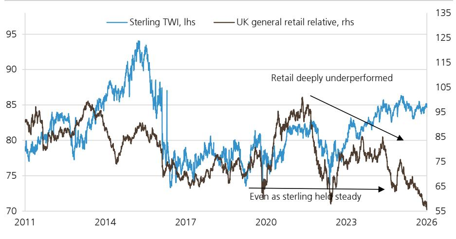

line

| Year | Sterling TWI, lhs | UK general retail relative, rhs |
|------|-------------------|----------------------------------|
| 2011 | ~80               | ~85                              |
| 2014 | ~90               | ~85                              |
| 2017 | ~75               | ~75                              |
| 2020 | ~85               | ~75                              |
| 2023 | ~90               | ~85                              |
| 2026 | ~85               | ~70                              |

Source: UBS, Refinitiv Datastream

While on the global equity strategy team we are dollar bears structurally, UBS are modest dollar bulls and forecast Euro/\$ at 1.14 year-end.

# 2. Earnings revisions

We show the overall earnings scorecard in the Appendix, which shows that autos and household products are at the bottom and retailing is middling.

Figure 11: European consumer sectors EPS change since 27-2   
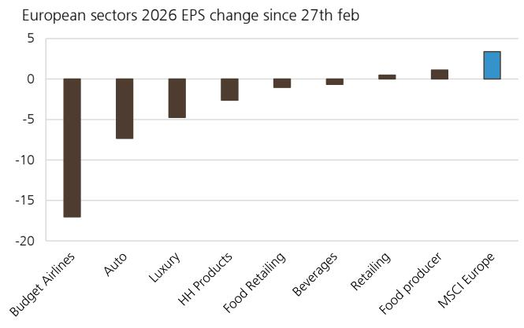

bar

European sectors 2026 EPS change since 27th feb
| Sector | Change (%) |
| :--- | :--- |
| Budget Airlines | -18 |
| Auto | -7 |
| Luxury | -4 |
| HH Products | -2 |
| Food Retailing | -1 |
| Beverages | -0.5 |
| Retailing | 0.5 |
| Food producer | 1 |
| MSCI Europe | 3 |

Source: UBS, Refinitiv Datastream

Figure 12: Global consumer sectors EPS change since 27-2   
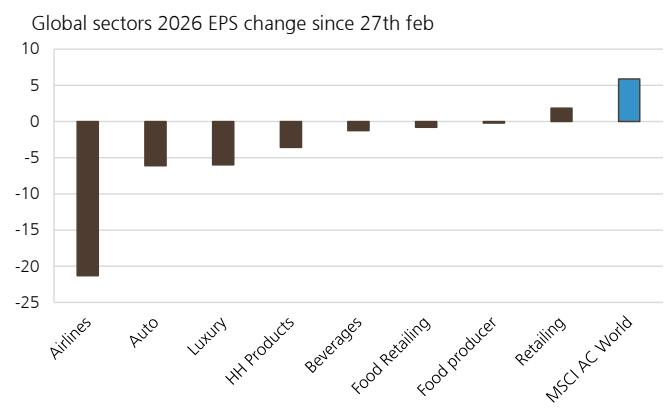

bar

Global sectors 2026 EPS change since 27th feb
| Sector | EPS Change (%) |
| :--- | :--- |
| Airlines | -21 |
| Auto | -6 |
| Luxury | -7 |
| HH Products | -3 |
| Beverages | -1 |
| Food Retailing | -1 |
| Food producer | -0.5 |
| Retailing | 2 |
| MSCI AC World | 6 |

Source: UBS, Refinitiv Datastream

# 3. Valuation

If we take an aggregate of all the European consumer cyclical stocks, then we find that in spite of them being oversold, they are trading close to their norms.

Figure 13: European consumer cyclicals basket P/E rel to MSCI ACWI   
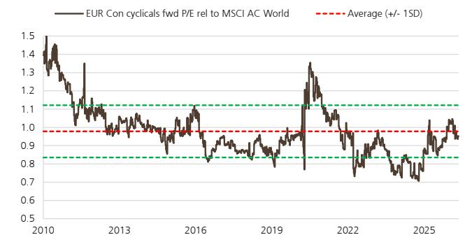

line

| Year | EUR Con cyclicals fwd P/E rel to MSCI AC World | Average (+/- 1SD) |
|------|--------------------------------------------------|-------------------|
| 2010 | 1.5                                              | 1.0               |
| 2013 | 1.0                                              | 1.0               |
| 2016 | 1.1                                              | 1.0               |
| 2019 | 0.9                                              | 1.0               |
| 2022 | 1.0                                              | 1.0               |
| 2025 | 1.0                                              | 1.0               |

Source: UBS, Refinitiv Datastream

Figure 14: European consumer cyclicals basket price momentum (vs 6mma)   
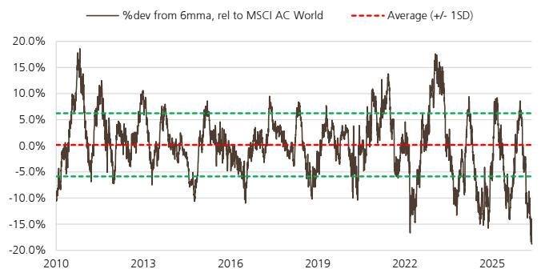

line

| Year | %dev from 6mma, rel to MSCI AC World |
|------|--------------------------------------|
| 2010 | -10.0%                               |
| 2011 | 18.0%                                |
| 2012 | 12.0%                                |
| 2013 | 8.0%                                 |
| 2014 | 6.0%                                 |
| 2015 | 4.0%                                 |
| 2016 | 2.0%                                 |
| 2017 | 0.0%                                 |
| 2018 | -2.0%                                |
| 2019 | -4.0%                                |
| 2020 | -6.0%                                |
| 2021 | -8.0%                                |
| 2022 | -10.0%                               |
| 2023 | -6.0%                                |
| 2024 | -4.0%                                |
| 2025 | -2.0%                                |
| 2026 | -10.0%                               |

Source: UBS, Refinitiv Datastream

Consumer staples have been de-rated more (i.e., household products) but the structural problems over the past 18 months seem to dominate.

Figure 15: European consumer staples basket P/E rel to MSCI ACWI   
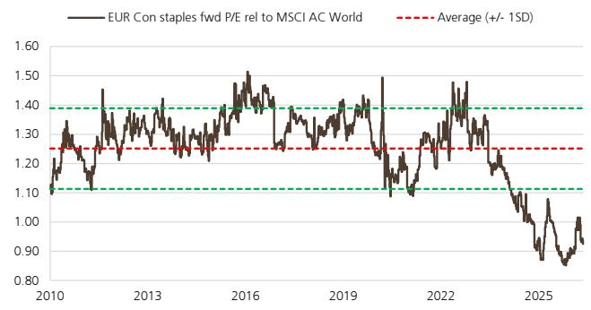

line

| Year | EUR Con staples fwd P/E rel to MSCI AC World | Average (+/- 1SD) |
|------|---------------------------------------------|-------------------|
| 2010 | ~1.30                                       | 1.30              |
| 2013 | ~1.35                                       | 1.30              |
| 2016 | ~1.50                                       | 1.30              |
| 2019 | ~1.40                                       | 1.30              |
| 2022 | ~1.30                                       | 1.30              |
| 2025 | ~0.90                                       | 1.30              |

Source: UBS, Refinitiv Datastream

Figure 16: European consumer staples basket price momentum (vs 6mma)   
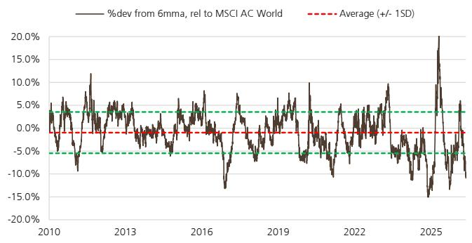

line

| Year | %dev from 6mma, rel to MSCI AC World |
|------|----------------------------------------|
| 2010 | ~4.0%                                  |
| 2013 | ~-5.0%                                 |
| 2016 | ~-10.0%                                |
| 2019 | ~-5.0%                                 |
| 2022 | ~-5.0%                                 |
| 2025 | ~-15.0%                                |

Source: UBS, Refinitiv Datastream

The sectors that have undergone the biggest deratings are: household products, retailing, beverages in Europe and household products and luxury globally.

Figure 17: European Subsectors de-rating since 27th Feb 

<table><tr><td>Sector europe</td><td>2026 EPS change since 27th feb</td><td>Price change since 27th feb</td><td>Price change minus EPS change</td></tr><tr><td>HH Products</td><td>-2.6</td><td>-20.3</td><td>-17.7</td></tr><tr><td>Retailing</td><td>0.5</td><td>-13.0</td><td>-13.5</td></tr><tr><td>Beverages</td><td>-0.7</td><td>-10.2</td><td>-9.6</td></tr><tr><td>Food producer</td><td>1.1</td><td>-8.3</td><td>-9.4</td></tr><tr><td>Food Retailing</td><td>-1.0</td><td>-9.6</td><td>-8.5</td></tr><tr><td>Luxury</td><td>-4.7</td><td>-12.6</td><td>-7.9</td></tr><tr><td>Auto</td><td>-7.3</td><td>-11.4</td><td>-4.1</td></tr><tr><td>Budget Airlines</td><td>-17.0</td><td>-19.7</td><td>-2.6</td></tr></table>

Source: UBS, Refinitiv Datastream

Figure 18: Global Subsectors de-rating since 27/2 

<table><tr><td>Sector Global</td><td>2026 EPS change since 27th feb</td><td>Price change since 27th feb</td><td>Price change minus EPS change</td></tr><tr><td>HH Products</td><td>-3.6</td><td>-16.1</td><td>-12.5</td></tr><tr><td>Luxury</td><td>-6.0</td><td>-15.5</td><td>-9.6</td></tr><tr><td>Beverages</td><td>-1.3</td><td>-6.3</td><td>-5.0</td></tr><tr><td>Food producer</td><td>-0.2</td><td>-4.5</td><td>-4.2</td></tr><tr><td>Food Retailing</td><td>-0.8</td><td>-1.7</td><td>-0.9</td></tr><tr><td>Retailing</td><td>1.8</td><td>7.7</td><td>5.9</td></tr><tr><td>Auto</td><td>-6.1</td><td>0.2</td><td>6.3</td></tr><tr><td>Airlines</td><td>-21.3</td><td>-11.9</td><td>9.4</td></tr></table>

Source: UBS, Refinitiv Datastream

The sectors that have become abnormally cheap are Global & European Household products (2.5 std cheap), Global and European beverages (c2std cheap) and European Food Producers & Retailing.

# Sectors PE relative to their norm – Europe and Globally

Figure 19: Sectors PE – Europe (number of std relative to its norm versus the market) 

<table><tr><td>Sectors</td><td>12m Fwd PE</td><td>12M fwd PE rel market</td><td>Average PE rel market</td><td>12M fwd PE rel market (Z score)</td></tr><tr><td>European HH Products</td><td>16.5</td><td>114%</td><td>146%</td><td>-2.7</td></tr><tr><td>European Beverages</td><td>14.4</td><td>100%</td><td>139%</td><td>-2.5</td></tr><tr><td>European Food Bev Tobacco</td><td>15.5</td><td>107%</td><td>133%</td><td>-1.9</td></tr><tr><td>European retailing</td><td>13.2</td><td>91%</td><td>145%</td><td>-1.6</td></tr><tr><td>European Food Retailing</td><td>13.3</td><td>92%</td><td>98%</td><td>-0.6</td></tr><tr><td>UK retailing</td><td>12.5</td><td>86%</td><td>101%</td><td>-0.6</td></tr><tr><td>European Autos</td><td>7.5</td><td>52%</td><td>56%</td><td>-0.5</td></tr><tr><td>European Luxury</td><td>24.1</td><td>166%</td><td>170%</td><td>-0.2</td></tr><tr><td>Budget airlines</td><td>9.9</td><td>70%</td><td>195%</td><td>-0.1</td></tr></table>

Source: UBS, Refinitiv Datastream

Figure 20: Sectors PE – Global (number of std relative to its norm versus the market) 

<table><tr><td>Sectors</td><td>12m Fwd PE</td><td>12M fwd PE rel ac world</td><td>Average PE rel market</td><td>12M fwd PE rel ac world (Z-score)</td></tr><tr><td>Global HH products</td><td>19.0</td><td>107%</td><td>138%</td><td>-2.5</td></tr><tr><td>Global Beverages</td><td>18.1</td><td>102%</td><td>131%</td><td>-1.9</td></tr><tr><td>Global Luxury</td><td>19.8</td><td>112%</td><td>138%</td><td>-1.6</td></tr><tr><td>Global Food produces</td><td>16.9</td><td>96%</td><td>117%</td><td>-1.4</td></tr><tr><td>Global Retailing</td><td>23.2</td><td>131%</td><td>152%</td><td>-1.2</td></tr><tr><td>Global Airlines</td><td>10.2</td><td>58%</td><td>84%</td><td>-0.2</td></tr><tr><td>Global Autos</td><td>19.6</td><td>111%</td><td>74%</td><td>2.4</td></tr><tr><td>Global Food retailing</td><td>27.0</td><td>152%</td><td>120%</td><td>3.2</td></tr></table>

Source: UBS, Refinitiv Datastream

We show our screen with the keys stocks in these subsectors at the end of our note. Below, we show the stocks that have seen the biggest de-rating since 26/2 within our consumer cyclical basket

Figure 21: The biggest derating for consumer cyclicals in Europe 

<table><tr><td>Name</td><td>2026 EPS change since 27-2</td><td>Price change since 27-2</td><td>Price change minus EPS change</td><td>P/E absolute</td><td>P/E z-score</td><td>3m EPS change</td></tr><tr><td>RYANAIR HOLDINGS</td><td>-0.4%</td><td>-19.7%</td><td>-19.3%</td><td>10.3</td><td>-0.22</td><td>-6.6%</td></tr><tr><td>HERMES INTL.</td><td>-4.3%</td><td>-23.1%</td><td>-18.8%</td><td>35.2</td><td>-1.86</td><td>-2.0%</td></tr><tr><td>MONCLER</td><td>2.8%</td><td>-14.9%</td><td>-17.7%</td><td>22.3</td><td>-0.94</td><td>6.3%</td></tr><tr><td>HENNES &amp; MAURITZ B</td><td>-0.9%</td><td>-16.7%</td><td>-15.8%</td><td>20.3</td><td>-0.38</td><td>1.3%</td></tr><tr><td>INDUSTRIA DE DISENO TEXTIL</td><td>0.0%</td><td>-12.9%</td><td>-12.9%</td><td>24.0</td><td>-0.33</td><td>3.7%</td></tr><tr><td>BMW</td><td>-5.8%</td><td>-16.0%</td><td>-10.2%</td><td>7.3</td><td>-0.27</td><td>-1.9%</td></tr><tr><td>VOLKSWAGEN</td><td>-0.9%</td><td>-10.3%</td><td>-9.4%</td><td>4.1</td><td>-1.20</td><td>-1.2%</td></tr><tr><td>NEXT</td><td>0.0%</td><td>-7.9%</td><td>-7.9%</td><td>16.4</td><td>0.93</td><td>3.9%</td></tr></table>

Source: UBS, Refinitiv Datastream

And in the consumer staples space, the biggest de-ratings are shown below.

Figure 22: The biggest de-ratings for consumer staples in Europe 

<table><tr><td>Name</td><td>2026 EPS change since 27-2</td><td>Price change since 27-2</td><td>Price change minus EPS change</td><td>P/E absolute</td><td>P/E z-score</td><td>3m EPS change</td></tr><tr><td>BEIERSDORF</td><td>-6.1%</td><td>-34.3%</td><td>-28.2%</td><td>16.9</td><td>-3.10</td><td>-5.1%</td></tr><tr><td>UNILEVER (UK)</td><td>0.8%</td><td>-22.8%</td><td>-23.5%</td><td>15.0</td><td>-1.79</td><td>-1.3%</td></tr><tr><td>HENKEL</td><td>-0.4%</td><td>-21.4%</td><td>-21.0%</td><td>11.6</td><td>-2.00</td><td>-2.3%</td></tr><tr><td>RECKITT BENCKISER GROUP</td><td>-10.0%</td><td>-30.2%</td><td>-20.1%</td><td>13.9</td><td>-1.59</td><td>-9.1%</td></tr><tr><td>MARKS &amp; SPENCER GROUP</td><td>-1.4%</td><td>-19.2%</td><td>-17.8%</td><td>10.3</td><td>-1.02</td><td>3.8%</td></tr><tr><td>HEINEKEN</td><td>0.2%</td><td>-17.5%</td><td>-17.6%</td><td>12.7</td><td>-2.12</td><td>3.9%</td></tr><tr><td>CARLSBERG B</td><td>0.3%</td><td>-15.5%</td><td>-15.8%</td><td>12.2</td><td>-1.92</td><td>6.2%</td></tr><tr><td>DANONE</td><td>0.0%</td><td>-14.8%</td><td>-14.8%</td><td>16.9</td><td>-0.69</td><td>-1.4%</td></tr><tr><td>L&#x27;OREAL</td><td>-0.1%</td><td>-9.7%</td><td>-9.6%</td><td>13.4</td><td>0.22</td><td>-2.3%</td></tr></table>

Source: UBS, Refinitiv Datastream

Of the names which have been de-rated more than 10% since 26/2, the following have positive earnings and trade cheaply on P/E relatives: Moncler, Inditex, Ryanair, M&S, Heineken, and Carlsberg, Of these, the following are buy rated: Inditex, Ryanair, Carlsberg, Heineken, and M&S (with Carlsberg, Heineken, and M&S having their relative P/E being more than 1 std below norm).

# Where are the pockets of value:

# 1. Household products:

We struggle to see why household products have become so cheap and so aggressively de-rated (but admit their earnings momentum has been bottom of the scorecard in Europe). We have not identified a specific issue plaguing this sector as identified for other staples, such as Gen Z (for beverages), GLP 1 (hitting food producers) or FDA (hitting flavouring companies) and it is hard to build from scratch (unlike food producers).

Household products are also abnormally oversold in EU and Globally.

Figure 23: European HH products % dev from 6mma   
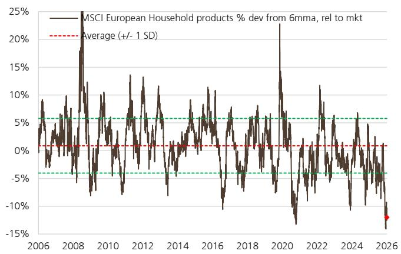

line

| Year | MSCI European Household products % dev from 6mma, rel to mkt |
|------|---------------------------------------------------------------|
| 2006 | ~5%                                                           |
| 2008 | ~25%                                                          |
| 2010 | ~10%                                                          |
| 2012 | ~15%                                                          |
| 2014 | ~5%                                                           |
| 2016 | ~10%                                                          |
| 2018 | ~5%                                                           |
| 2020 | ~25%                                                          |
| 2022 | ~10%                                                          |
| 2024 | ~5%                                                           |
| 2026 | ~-15%                                                         |

Source: UBS, Refintiv Datastream

Figure 24: Global HH products % dev from 6mma   
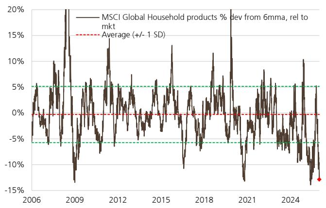

line

| Year | MSCI Global Household products % dev from 6mma, rel to mkt |
|------|---------------------------------------------------------------|
| 2006 | ~5%                                                           |
| 2009 | ~20%                                                          |
| 2012 | ~15%                                                          |
| 2015 | ~5%                                                           |
| 2018 | ~10%                                                          |
| 2021 | ~-10%                                                         |
| 2024 | ~-15%                                                         |

Source: UBS, Refintiv Datastream

The concerns centre on three areas: i) EM exposure (but EM equities have outperformed since 26-2); ii) higher costs (plastic, transport etc) but again the stock market believes this crisis is short lived; and iii) exposure to the consumer (but as above these names have de-rated more than any others).

To us, maybe of growing concern is disruption: local brands in EM taking much more market share (but this is generic to all staples) and Agentic Agents de-branding non conspicuous brands (and in many cases the branded products have prices that are 40% to 100% above private label).

UBS have buys on Colgate and Reckitt Benckiser.

We can see below they are both cheap, heavily de-rated and in the case of Colgate has positive earnings revisions.

Figure 25: US & European select HH products 

<table><tr><td>Name</td><td>2026 EPS change since 27-2</td><td>Price change since 27-2</td><td>Price change minus EPS change</td><td>P/E absolute</td><td>P/E z-score</td><td>3m EPS change</td><td>UBS rating</td></tr><tr><td>ESTEE LAUDER COS.&#x27;A&#x27;</td><td>9.0%</td><td>-26.2%</td><td>-35.1%</td><td>26.3</td><td>-1.6</td><td>17.8%</td><td>Neutral</td></tr><tr><td>RECKITT BENCKISER GROUP</td><td>0.0%</td><td>-30.2%</td><td>-30.2%</td><td>13.9</td><td>-1.59</td><td>-9.1%</td><td>Buy</td></tr><tr><td>BEIERSDORF</td><td>-6.1%</td><td>-34.3%</td><td>-28.2%</td><td>16.9</td><td>-3.10</td><td>-5.1%</td><td>Neutral</td></tr><tr><td>UNILEVER (UK)</td><td>0.8%</td><td>-22.8%</td><td>-23.5%</td><td>15.0</td><td>-1.79</td><td>-1.3%</td><td>Sell</td></tr><tr><td>HENKEL</td><td>-0.4%</td><td>-21.4%</td><td>-21.0%</td><td>11.6</td><td>-2.00</td><td>-2.3%</td><td>Neutral</td></tr><tr><td>KENVUE</td><td>7.7%</td><td>-10.1%</td><td>-17.8%</td><td>15.0</td><td>-1.2</td><td></td><td>Neutral</td></tr><tr><td>PROCTER &amp; GAMBLE</td><td>0.0%</td><td>-14.6%</td><td>-14.6%</td><td>20.3</td><td>-1.5</td><td>-1.8%</td><td>Buy</td></tr><tr><td>KIMBERLY-CLARK</td><td>-0.4%</td><td>-13.3%</td><td>-12.9%</td><td>13.1</td><td>-2.1</td><td>-2.0%</td><td>Neutral</td></tr><tr><td>L&#x27;OREAL</td><td>0.0%</td><td>-9.7%</td><td>-9.7%</td><td>26.9</td><td>-1.21</td><td>2.2%</td><td>Buy</td></tr><tr><td>COLGATE-PALM.</td><td>-1.7%</td><td>-10.4%</td><td>-8.7%</td><td>21.4</td><td>-1.5</td><td>0.9%</td><td>Buy</td></tr></table>

# 2. Budget Airlines.. a preferred sub sector.

Budget airlines have underperformed by 25% since 26-2.

We view this sub-sector as having structural advantages. Recreational travels grows at double GDP at 2.6% CAGR since 2000.

Barriers to entry are high due to airport slot constraints and aircraft shortages, with for example Ryanair controlling 70% of slots at Stansted. It is becoming increasingly hard to extend yet alone build new runways.

Ryanair accounts for almost c20% of the total short haul travel market and c40% of the budget travel market in Europe. This, in turn, makes the market potentially much more rationale.

The budget airlines have a huge cost advantage over the flag carriers, which at times of higher oil prices increases their cost advantages, acting as a barrier to entry to new competitors and forces the less efficient players to cut capacity much more quickly.

Budget airlines also own the customer relationship which means they can expand into higher margin businesses (e.g. holidays or car rentals).

They are very clearly Gen AI adopters (whether it is ticketing, customer loyalty, flight planning, or dynamic pricing etc).

Ryanair has become particularly cheap on P/E relatives. The key in our mind is the value of the airlines versus the cost of a planes, which for Ryanair on 2027 numbers is on a 2% discount and Easyjet on a 76% discount.

Figure 26: Budget airlines price momentum rel to ac world   
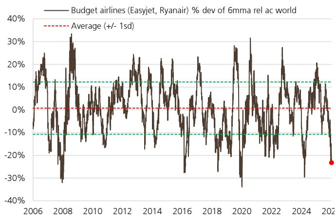

line

| Year | Budget airlines (Easyjet, Ryanair) % dev of 6mma rel ac world |
|------|---------------------------------------------------------------|
| 2006 | ~15%                                                          |
| 2008 | ~30%                                                          |
| 2010 | ~10%                                                          |
| 2012 | ~15%                                                          |
| 2014 | ~20%                                                          |
| 2016 | ~10%                                                          |
| 2018 | ~5%                                                           |
| 2020 | ~30%                                                          |
| 2022 | ~15%                                                          |
| 2024 | ~10%                                                          |
| 2022 | -25% (red dot)                                                |

Source: UBS, Refintiv Datastream

Figure 27: Ryanair P/E relative to the market   
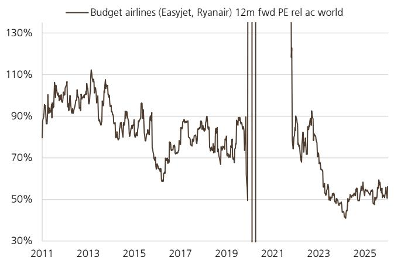

line

| Year | Budget airlines (Easyjet, Ryanair) 12m fwd PE rel ac world |
|------|---------------------------------------------------------------|
| 2011 | ~90%                                                          |
| 2013 | ~110%                                                         |
| 2015 | ~85%                                                          |
| 2017 | ~75%                                                          |
| 2019 | ~85%                                                          |
| 2021 | ~50%                                                          |
| 2023 | ~60%                                                          |
| 2025 | ~50%                                                          |

Source: UBS, Refintiv Datastream

Historically 10% off the oil price had added 5% to relative performance. We are inclined to be long term oil bears (see here).

Figure 28: European airlines relative to Oil price   
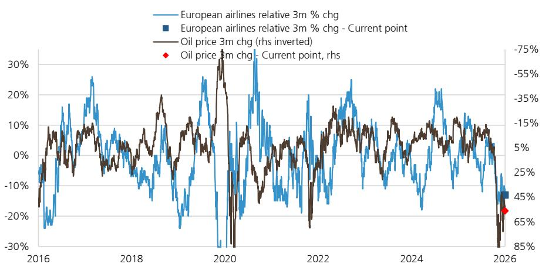

line

| Year | European airlines relative 3m % chg | Oil price 3m chg (rhs inverted) | Oil price 1m chg - Current point, rhs |
|------|-------------------------------------|----------------------------------|----------------------------------------|
| 2026 | -45%                                | -45%                             | -65%                                   |

Source: UBS, Refintiv Datastream

# 3. Luxury

# 1. Luxury is clearly oversold.

Figure 29: European luxury price momentum rel mkt vs 6mma   
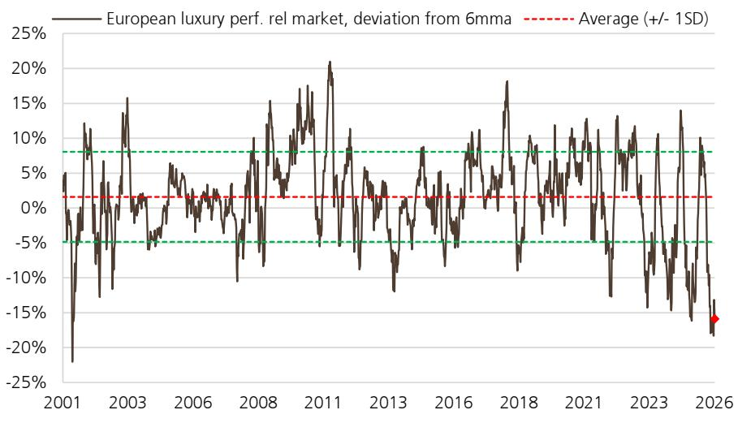

line

| Year | European luxury perf. rel market, deviation from 6mma | Average (+/- 1SD) |
|------|--------------------------------------------------|-------------------|
| 2001 | ~5%                                              | ~0%               |
| 2003 | ~15%                                             | ~0%               |
| 2006 | ~0%                                              | ~0%               |
| 2008 | ~15%                                             | ~0%               |
| 2011 | ~20%                                             | ~0%               |
| 2013 | ~5%                                              | ~0%               |
| 2016 | ~10%                                             | ~0%               |
| 2018 | ~18%                                             | ~0%               |
| 2021 | ~10%                                             | ~0%               |
| 2023 | ~15%                                             | ~0%               |
| 2026 | ~-18%                                            | ~-15%             |

Source: UBS, Refinitiv Datastream

# 2. The P/E is back to average levels.

Figure 30: Europe Luxury's P/E relative to the global market is close to its norm   
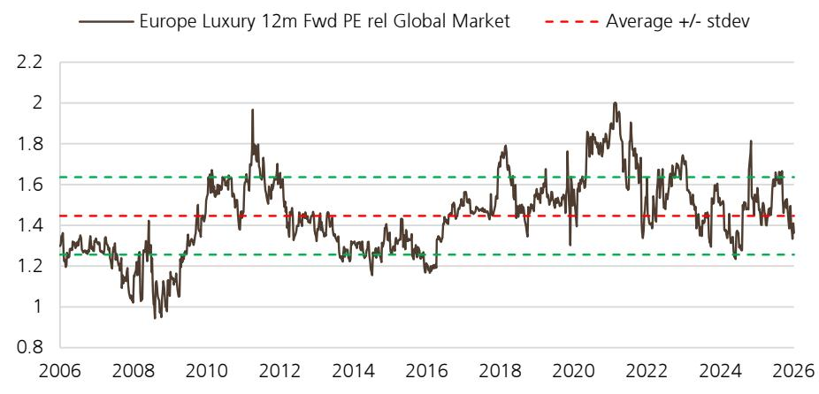

line

| Year | Europe Luxury 12m Fwd PE rel Global Market | Average +/- stdev |
|------|---------------------------------------------|-------------------|
| 2006 | ~1.3                                        | 1.4               |
| 2008 | ~1.0                                        | 1.4               |
| 2010 | ~1.6                                        | 1.4               |
| 2012 | ~1.7                                        | 1.4               |
| 2014 | ~1.3                                        | 1.4               |
| 2016 | ~1.4                                        | 1.4               |
| 2018 | ~1.8                                        | 1.4               |
| 2020 | ~1.7                                        | 1.4               |
| 2022 | ~1.9                                        | 1.4               |
| 2024 | ~1.5                                        | 1.4               |
| 2026 | ~1.4                                        | 1.4               |

Source: UBS, Refinitiv Datastream

# 3. But EPS is now way below trend.

Figure 31: Large European luxury companies' EPS is now at trend (c10% trend growth)   
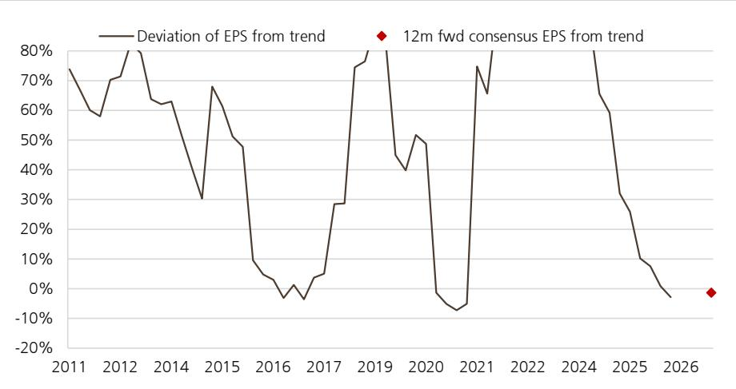

line

| Year | Deviation of EPS from trend |
|------|-----------------------------|
| 2011 | ~75%                        |
| 2012 | ~80%                        |
| 2013 | ~65%                        |
| 2014 | ~60%                        |
| 2015 | ~30%                        |
| 2016 | ~-5%                        |
| 2017 | ~5%                         |
| 2018 | ~30%                        |
| 2019 | ~80%                        |
| 2020 | ~40%                        |
| 2021 | ~-5%                        |
| 2022 | ~75%                        |
| 2023 | ~65%                        |
| 2024 | ~30%                        |
| 2025 | ~10%                        |
| 2026 | ~-5%                        |

Source: UBS, Refinitiv Datastream

4. Earnings and sales forecasts relative to the market, are right at the low end of their range.

Figure 32: The EPS and sales premium of luxury to the market   
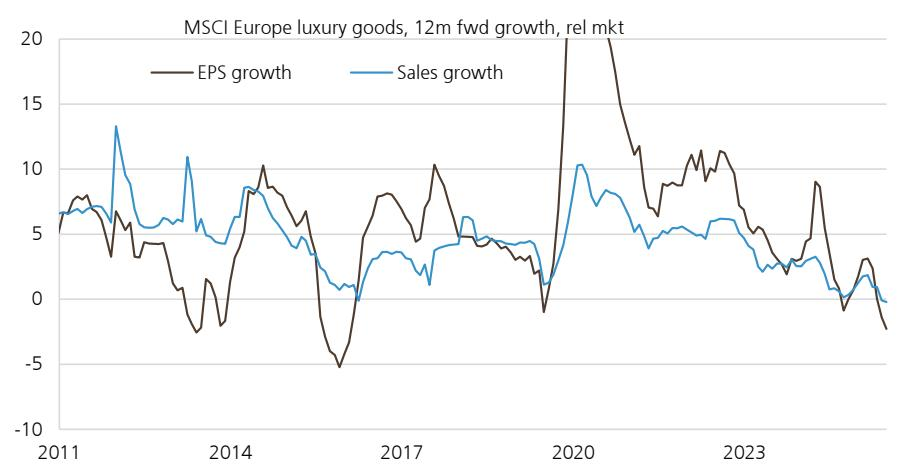

line

| Year | EPS growth | Sales growth |
|------|------------|--------------|
| 2011 | ~6.5       | ~7.0         |
| 2012 | ~8.0       | ~13.0        |
| 2013 | ~4.0       | ~5.5         |
| 2014 | ~9.0       | ~8.0         |
| 2015 | ~-5.0      | ~3.0         |
| 2016 | ~8.0       | ~1.0         |
| 2017 | ~4.0       | ~4.0         |
| 2018 | ~5.0       | ~6.0         |
| 2019 | ~3.0       | ~4.0         |
| 2020 | ~20.0      | ~10.0        |
| 2021 | ~12.0      | ~8.0         |
| 2022 | ~11.0      | ~6.0         |
| 2023 | ~5.0       | ~3.0         |
| 2024 | ~3.0       | ~1.0         |
| 2025 | ~-3.0      | ~-1.0        |

Source: UBS, Refinitiv Datastream

5. Earnings momentum is much better than performance.

Figure 33: Earnings momentum vs performance of luxury   
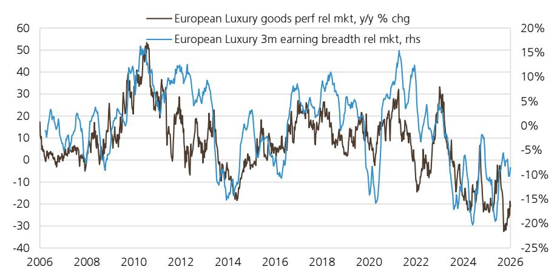

line

| Year | European Luxury goods perf rel mkt, y/y % chg | European Luxury 3m earning breadth rel mkt, rhs |
|------|-----------------------------------------------|------------------------------------------------|
| 2006 | ~15                                           | ~5%                                            |
| 2008 | ~20                                           | ~10%                                           |
| 2010 | ~50                                           | ~15%                                           |
| 2012 | ~30                                           | ~10%                                           |
| 2014 | ~-20                                          | ~-10%                                          |
| 2016 | ~10                                           | ~5%                                            |
| 2018 | ~30                                           | ~10%                                           |
| 2020 | ~-15                                          | ~-15%                                          |
| 2022 | ~30                                           | ~15%                                           |
| 2024 | ~-20                                          | ~-15%                                          |
| 2026 | ~-30                                          | ~-20%                                          |

Source: UBS, Refinitiv Datastream

6. The US cluster is now almost as large as the China cluster.

Figure 34: Luxury exposure   
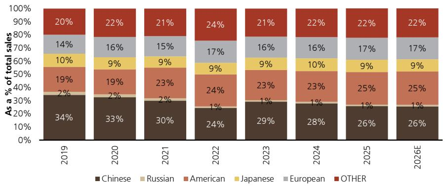

bar_stacked

As a % of total sales
| Year | Chinese (%) | Russian (%) | American (%) | Japanese (%) | European (%) | OTHER (%) |
| :--- | :--- | :--- | :--- | :--- | :--- | :--- |
| 2019 | 34 | 2 | 19 | 10 | 14 | 20 |
| 2020 | 33 | 2 | 19 | 9 | 16 | 22 |
| 2021 | 30 | 2 | 23 | 9 | 15 | 21 |
| 2022 | 24 | 1 | 24 | 9 | 17 | 24 |
| 2023 | 29 | 1 | 23 | 9 | 16 | 21 |
| 2024 | 28 | 1 | 23 | 10 | 16 | 22 |
| 2025 | 26 | 1 | 25 | 9 | 17 | 22 |
| 2026E | 26 | 1 | 25 | 9 | 17 | 22 |

Source: UBS

The US cluster benefits from the wealth effect (namely, if 0.5% of the rise in equities feeds through to higher luxury spend, then luxury spend rises by 7%)!

The China cluster may be getting less bad if we look at the best lead indicator of China house prices (see John Lam's, our head of asia property, upgrade of property) with housing accounting for c60% of household wealth. The China cluster accounts for c26% of luxury sales.

Figure 35: The Bloomberg diffusion indicator   
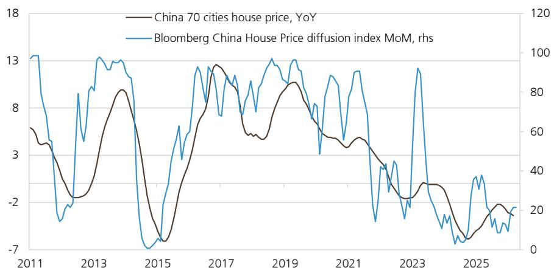

line

| Year | China 70 cities house price, YoY | Bloomberg China House Price diffusion index MoM, rhs |
|------|----------------------------------|-----------------------------------------------------|
| 2011 | ~6.5                             | ~13                                                 |
| 2013 | ~-2                              | ~13                                                 |
| 2015 | ~-7                              | ~-7                                                 |
| 2017 | ~13                              | ~13                                                 |
| 2019 | ~10                              | ~13                                                 |
| 2021 | ~3                               | ~3                                                  |
| 2023 | ~-2                              | ~-2                                                 |
| 2025 | ~-2                              | ~-2                                                 |

Source: UBS, Refinitiv Datastream, BBG

UBS has a buy on Richemont.

# China consumer

We like the China consumer for reasons highlighted here. The consumer share of GDP must rise (it is lower than any other country has had historically) as it is increasingly harder for China to have investment driven growth, relying on exporting its excess capacity.

Figure 36: Consumer share of GDP in China (vs 20y average)   
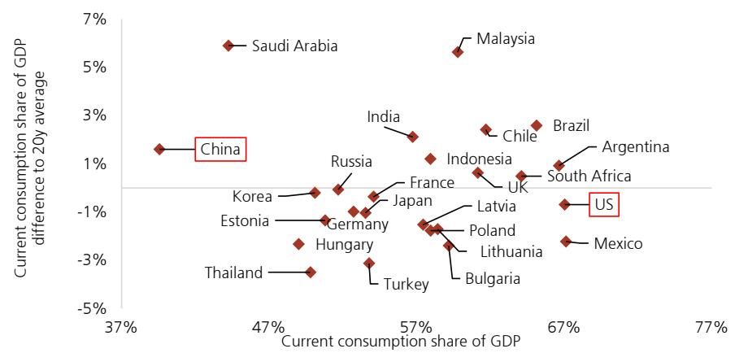  
Source: UBS, Refinitiv Datastream

There are two structural advantages now for China consumer:

1. John Lam's upgrade of property (so that Tier 1 cities prices are now expected to be flat rather than decline $10\%$ in 2026 (see here). Property is $60\%$ of household wealth.   
2. The increasing signs that deflation is ending and with it wage growth might be slightly accelerating.

Figure 37: A-Share Wage Growth has been low but has improved   
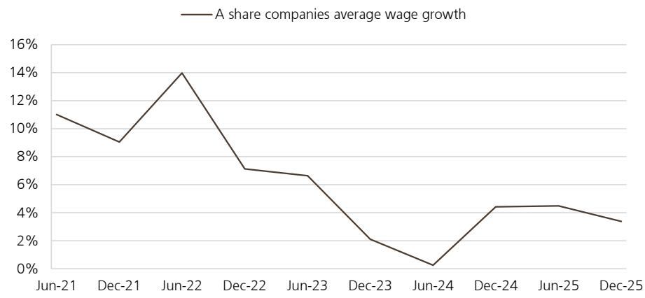

line

| Date    | A share companies average wage growth |
|---------|---------------------------------------|
| Jun-21  | 11%                                   |
| Dec-21  | 9%                                    |
| Jun-22  | 14%                                   |
| Dec-22  | 7%                                    |
| Jun-23  | 6%                                    |
| Dec-23  | 2%                                    |
| Jun-24  | 0%                                    |
| Dec-24  | 4%                                    |
| Jun-25  | 4%                                    |
| Dec-25  | 3%                                    |

Source: UBS, Refinitive Datastream, Wind

China is also one of the least impacted countries by the rise in commodities prices with only c3% of electricity coming from CCGT and oil and gas accounting for c30% of energy use.

Our focus has been on luxury, as above, and Chinese domestic brands such as Li Ning, Moutai and Yum China.

# Spain – a port on a storm in Europe for the consumer.

What supports the Spanish consumer:

1. Employment growth of 2.3% yoy.   
2. Net migration of 1.3% yoy.   
3. Household formation in the past decade being 700K units higher than new homes built. This keeps house prices rising at c13% yoy and in turn helps create a wealth effect.   
4. A primary budget surplus. This means there is less risk of windfall taxes.

5. Spain is more resilient to the energy shocks: renewables and nuclear are now c75% to 80% of Spain's electricity. As a result, wholesale power prices have averaged 20–30% below core eurozone peers (e.g., Germany, Italy) since 2023, keeping energy inflation consistently lower and dampening the pass-through of external energy shocks to the broader economy.

Figure 38: Spain employment growth   
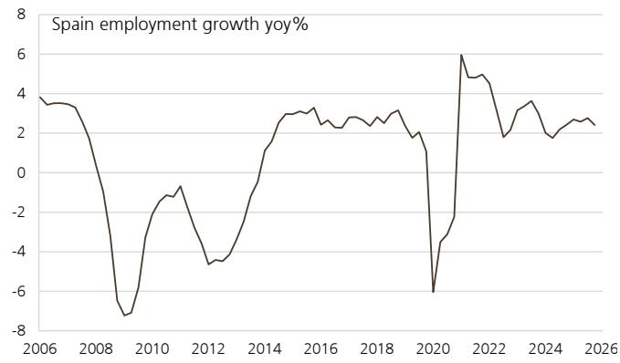

line

| Year | Spain employment growth yoy% |
| ---- | ---------------------------- |
| 2006 | 3.5                          |
| 2008 | -1.0                         |
| 2010 | -7.0                         |
| 2012 | -4.5                         |
| 2014 | 1.5                          |
| 2016 | 3.0                          |
| 2018 | 2.5                          |
| 2020 | -6.0                         |
| 2022 | 6.0                          |
| 2024 | 2.0                          |
| 2026 | 3.0                          |

Source: UBS, Refinitive Datastream, BBG, Haver

Figure 39: Spain migration as a % of the population   
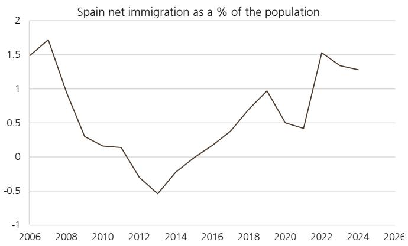

line

| Year | Spain net immigration as a % of the population |
| ---- | ----------------------------------------------- |
| 2006 | 1.5                                             |
| 2008 | 1.7                                             |
| 2010 | 0.2                                             |
| 2012 | -0.3                                            |
| 2014 | -0.5                                            |
| 2016 | 0.3                                             |
| 2018 | 0.8                                             |
| 2020 | 0.5                                             |
| 2022 | 1.5                                             |
| 2024 | 1.3                                             |

Source: UBS, Refinitiv Datastream

Figure 40: Spain house price yoy growth   
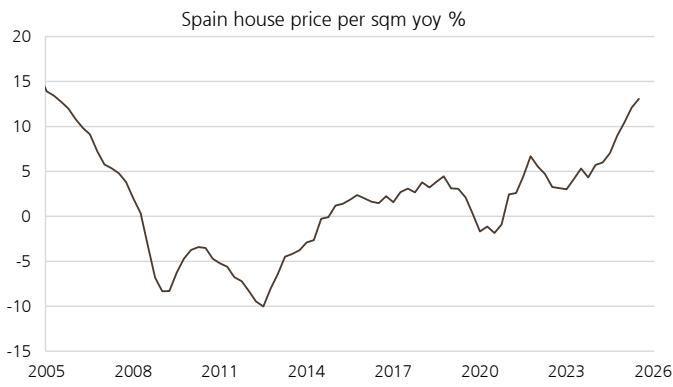

line

| Year | Spain house price per sqm yoy % |
| ---- | -------------------------------- |
| 2005 | 14.0                             |
| 2006 | 10.0                             |
| 2007 | 5.0                              |
| 2008 | -5.0                             |
| 2009 | -10.0                            |
| 2010 | -5.0                             |
| 2011 | -7.0                             |
| 2012 | -10.0                            |
| 2013 | -5.0                             |
| 2014 | 0.0                              |
| 2015 | 2.0                              |
| 2016 | 3.0                              |
| 2017 | 4.0                              |
| 2018 | 5.0                              |
| 2019 | 3.0                              |
| 2020 | -2.0                             |
| 2021 | 7.0                              |
| 2022 | 5.0                              |
| 2023 | 3.0                              |
| 2024 | 6.0                              |
| 2025 | 10.0                             |
| 2026 | 13.0                             |

Source: UBS, Refinitiv Datastream

Figure 41: Spain cyclically adjusted primary deficit   
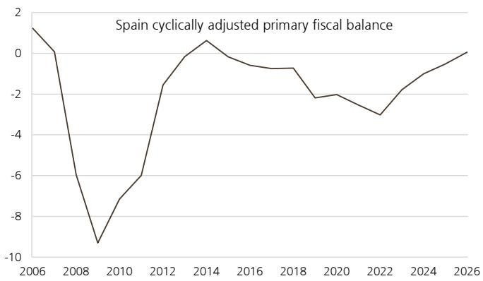

line

| Year | Spain cyclically adjusted primary fiscal balance |
| ---- | ----------------------------------------------- |
| 2006 | 1.0                                             |
| 2008 | -6.0                                            |
| 2010 | -9.0                                            |
| 2012 | -1.5                                            |
| 2014 | 0.5                                             |
| 2016 | -0.5                                            |
| 2018 | -1.0                                            |
| 2020 | -2.0                                            |
| 2022 | -3.0                                            |
| 2024 | -1.0                                            |
| 2026 | 0.0                                             |

Source: UBS, Refinitiv Datastream

Inditex has 17% of its sales from Spain. Clearly, the above backdrop is good for banks and hence UBS has a buy on Santander.

# Underweight global Autos

We are underweight global autos for the following reasons:

1. Not cheap:

Figure 42: European autos not cheap and globally expensive   
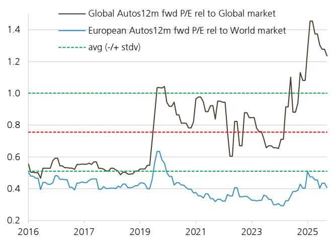

line

| Year | Global Autos12m fwd P/E rel to Global market | European Autos12m fwd P/E rel to World market | avg (-/+ stdv) |
|------|---------------------------------------------|-----------------------------------------------|----------------|
| 2016 | ~0.5                                        | ~0.4                                          | 0.7            |
| 2017 | ~0.5                                        | ~0.4                                          | 0.7            |
| 2018 | ~0.5                                        | ~0.4                                          | 0.7            |
| 2019 | ~0.5                                        | ~0.4                                          | 0.7            |
| 2020 | ~1.0                                        | ~0.6                                          | 0.7            |
| 2021 | ~0.9                                        | ~0.4                                          | 0.7            |
| 2022 | ~0.8                                        | ~0.3                                          | 0.7            |
| 2023 | ~0.8                                        | ~0.3                                          | 0.7            |
| 2024 | ~1.1                                        | ~0.3                                          | 0.7            |
| 2025 | ~1.4                                        | ~0.5                                          | 0.7            |
| 2026 | ~1.3                                        | ~0.4                                          | 0.7            |

Source: UBS, Refinitiv Datastream

Figure 43: European PE z-score relative to market   
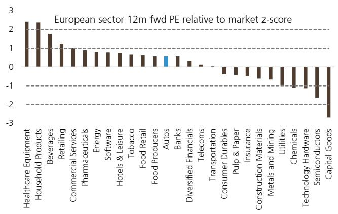

bar

| Sector | P/E Relative to Market z-score |
| --- | --- |
| Healthcare Equipment | 2.5 |
| Household Products | 2.4 |
| Beverages | 1.8 |
| Retailing | 1.2 |
| Commercial Services | 1.0 |
| Pharmaceuticals | 0.9 |
| Energy | 0.8 |
| Software | 0.7 |
| Hotels & Leisure | 0.7 |
| Tobacco | 0.6 |
| Food Retail | 0.6 |
| Food Producers | 0.5 |
| Autos | 0.5 |
| Banks | 0.4 |
| Diversified Financials | 0.3 |
| Telecoms | 0.1 |
| Transportation | -0.2 |
| Consumer Durables | -0.3 |
| Pulp & Paper | -0.4 |
| Insurance | -0.5 |
| Construction Materials | -0.6 |
| Metals and Mining | -0.7 |
| Utilities | -0.8 |
| Chemicals | -1.0 |
| Technology Hardware | -1.2 |
| Semiconductors | -1.5 |
| Capital Goods | -2.8 |

Source: UBS, Refinitiv Datastream

2. They are bottom of the global earnings revisions scorecard (see here) and close to the bottom in Europe.

Figure 44: Europe autos relative earnings revisions vs performance   
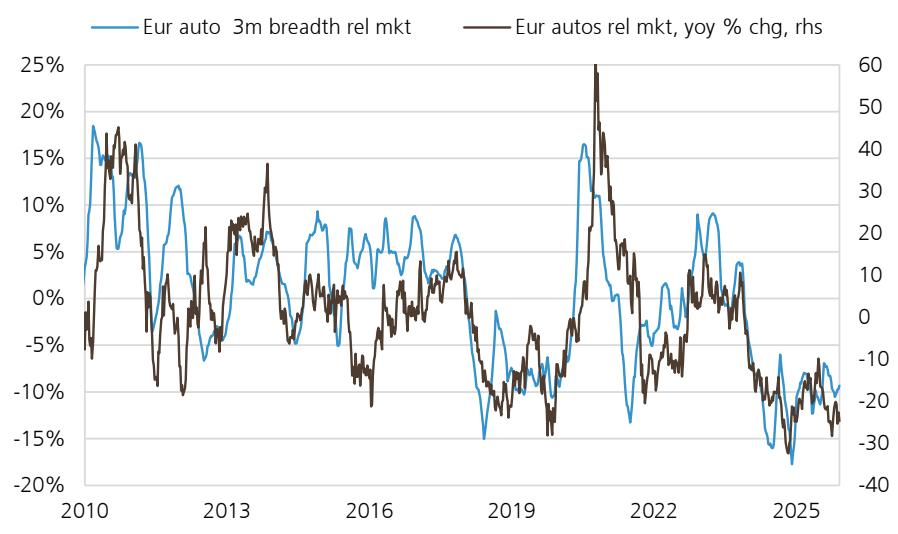

line

| Year | Eur auto 3m breadth rel mkt (%) | Eur autos rel mkt, yoy % chg, rhs (%) |
|------|----------------------------------|----------------------------------------|
| 2010 | ~18%                             | ~-5                                    |
| 2011 | ~16%                             | ~-10                                   |
| 2012 | ~12%                             | ~-5                                    |
| 2013 | ~8%                              | ~10                                    |
| 2014 | ~5%                              | ~-5                                    |
| 2015 | ~7%                              | ~-10                                   |
| 2016 | ~5%                              | ~-5                                    |
| 2017 | ~8%                              | ~-10                                   |
| 2018 | ~5%                              | ~-5                                    |
| 2019 | ~-5%                             | ~-10                                   |
| 2020 | ~-15%                            | ~-15                                   |
| 2021 | ~15%                             | ~60                                    |
| 2022 | ~-5%                             | ~-10                                   |
| 2023 | ~5%                              | ~-5                                    |
| 2024 | ~-10%                            | ~-15                                   |
| 2025 | ~-15%                            | ~-20                                   |

Source: UBS, Refinitiv Datastream

3. Cyclical headwinds are very high owing to:

i) Higher costs

The team highlight that higher aluminium and steel costs (as a result of the crises) could add \$400 to the cost of the car (taking as much as 20% off profits). Memory shortages will only add to this.

ii) Higher credit spreads.

UBS forecast a rise in spreads and that is usually bad for cars companies who own financing subsidiaries.

Figure 45: 'Banks on wheels': OEMs tend to underperform if credit spreads widen   
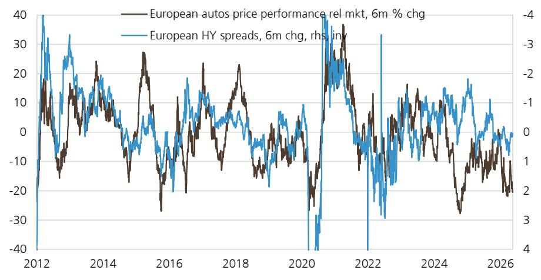

line

| Year | European autos price performance rel mkt, 6m % chg | European HY spreads, 6m chg, rhs. in |
|------|--------------------------------------------------|-------------------------------------|
| 2012 | ~40                                              | ~-4                                 |
| 2013 | ~15                                              | ~-2                                 |
| 2014 | ~25                                              | ~-1                                 |
| 2015 | ~30                                              | ~0                                  |
| 2016 | ~-25                                             | ~-1                                 |
| 2017 | ~10                                              | ~-1                                 |
| 2018 | ~20                                              | ~-1                                 |
| 2019 | ~-10                                             | ~-1                                 |
| 2020 | ~-30                                             | ~-4                                 |
| 2021 | ~35                                              | ~-3                                 |
| 2022 | ~-10                                             | ~-3                                 |
| 2023 | ~-5                                              | ~-1                                 |
| 2024 | ~-10                                             | ~-1                                 |
| 2025 | ~-30                                             | ~-1                                 |
| 2026 | ~-20                                             | ~-1                                 |

Source: UBS, Refinitiv Datastream, BBG

iii) Volume growth is tepid and decelerating. The team highlight that a rise in EV sales harms margins (even if the risk of CO2 fines is less).

Figure 46: US and Europe Vehicle Sales YoY%   
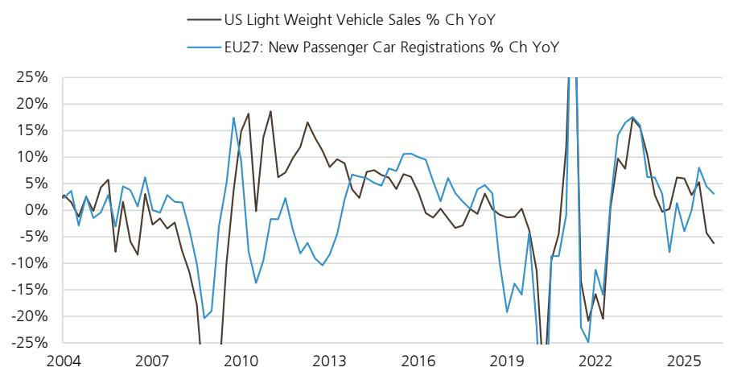

line

| Year | US Light Weight Vehicle Sales % Ch YoY | EU27: New Passenger Car Registrations % Ch YoY |
|------|------------------------------------------|--------------------------------------------------|
| 2004 | ~3%                                      | ~3%                                              |
| 2005 | ~5%                                      | ~0%                                              |
| 2006 | ~-5%                                     | ~5%                                              |
| 2007 | ~-10%                                    | ~0%                                              |
| 2008 | ~-25%                                    | ~-15%                                            |
| 2009 | ~-25%                                    | ~-20%                                            |
| 2010 | ~18%                                     | ~15%                                             |
| 2011 | ~-5%                                     | ~-10%                                            |
| 2012 | ~15%                                     | ~-5%                                             |
| 2013 | ~10%                                     | ~-10%                                            |
| 2014 | ~5%                                      | ~5%                                              |
| 2015 | ~7%                                      | ~7%                                              |
| 2016 | ~5%                                      | ~10%                                             |
| 2017 | ~-5%                                     | ~5%                                              |
| 2018 | ~-10%                                    | ~-15%                                            |
| 2019 | ~-5%                                     | ~-20%                                            |
| 2020 | ~-25%                                    | ~-25%                                            |
| 2021 | ~-15%                                    | ~-10%                                            |
| 2022 | ~-20%                                    | ~-15%                                            |
| 2023 | ~15%                                     | ~18%                                             |
| 2024 | ~5%                                      | ~7%                                              |
| 2025 | ~-5%                                     | ~-10%                                            |
| 2026 | ~-10%                                    | ~-5%                                             |

Source: UBS, Refinitiv Datastream, Haver

iv) Used car prices are rolling over and are falling -2.7% yoy in the US.

Figure 47: Europe new car prices are rolling over and US used car prices inflation might have peaked   
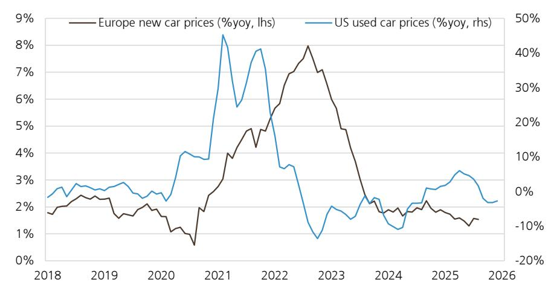

line

| Year | Europe new car prices (%yoy, lhs) | US used car prices (%yoy, rhs) |
|------|------------------------------------|--------------------------------|
| 2018 | ~1.8%                              | ~2.5%                          |
| 2019 | ~2.0%                              | ~2.8%                          |
| 2020 | ~1.5%                              | ~2.5%                          |
| 2021 | ~4.0%                              | ~8.5%                          |
| 2022 | ~7.0%                              | ~3.5%                          |
| 2023 | ~5.0%                              | ~1.0%                          |
| 2024 | ~1.5%                              | ~-5%                           |
| 2025 | ~1.8%                              | ~3.0%                          |
| 2026 | ~1.5%                              | ~-5%                           |

Source: UBS, Refinitiv Datastream

# 4. Substantial structural headwinds.

There are substantial structural headwinds at a time when margins globally are in line with their norm.

Figure 48: US Autos 12m fwd Net profit margin   
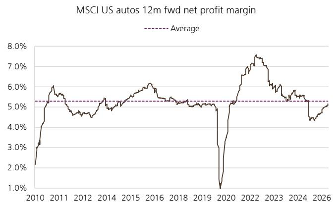

line

| Year | MSCI US autos 12m fwd net profit margin |
|------|------------------------------------------|
| 2010 | ~3.0%                                    |
| 2011 | ~6.0%                                    |
| 2012 | ~4.5%                                    |
| 2013 | ~5.0%                                    |
| 2014 | ~5.5%                                    |
| 2015 | ~6.0%                                    |
| 2016 | ~5.5%                                    |
| 2017 | ~5.0%                                    |
| 2018 | ~5.0%                                    |
| 2019 | ~5.0%                                    |
| 2020 | ~1.0%                                    |
| 2021 | ~5.0%                                    |
| 2022 | ~7.5%                                    |
| 2023 | ~6.0%                                    |
| 2024 | ~5.5%                                    |
| 2025 | ~5.0%                                    |
| 2026 | ~5.0%                                    |

Source: UBS, Refinitiv Datastream

Figure 49: European Autos 12m fwd Net profit margin   
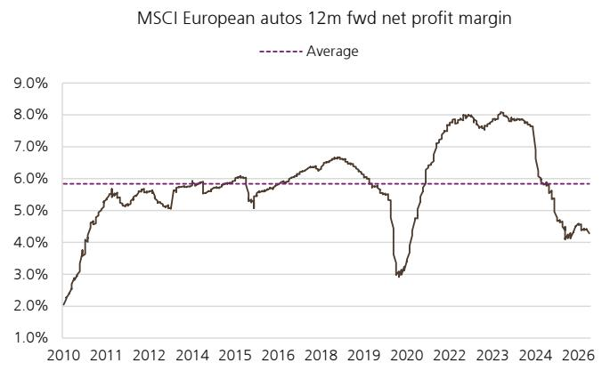

line

| Year | Net Profit Margin |
|------|-------------------|
| 2010 | 2.0%              |
| 2011 | 5.5%              |
| 2012 | 5.7%              |
| 2013 | 5.6%              |
| 2014 | 5.8%              |
| 2015 | 6.0%              |
| 2016 | 6.2%              |
| 2017 | 6.5%              |
| 2018 | 6.7%              |
| 2019 | 6.5%              |
| 2020 | 3.0%              |
| 2021 | 7.0%              |
| 2022 | 8.0%              |
| 2023 | 8.2%              |
| 2024 | 7.8%              |
| 2025 | 4.5%              |
| 2026 | 4.3%              |

Source: UBS, Refinitiv Datastream

# These structural headwinds are:

- Margin risk from increased Chinese competition both in Europe (15% of cars sold in March, double the share last March) and in China (where profits are a third of VW and BMW profits). VW highlighted that it costs half the amount to build a car in China compared to Europe and Renault highlighted that the development time in China is much quicker than Europe (at under 18 months).   
- A sector that is over-investing (maintenance capex to depreciation is c1.2X) because they have to invest for both EV and ICE.   
- Legacy costs: BCG found that legacy car makers have costs that are 60% to 75% higher than those of new entrants owing to their complex supplier network and capital tied to ICE.   
- New technology always carries high transition risks, especially if autos become more software intensive from being more mechanical engineering intensive (as e.g. VW found). What is the right battery technology?

The sell rated names globally are Bajaj auto, Hero motocorp, Nissan, Renault, Tata motors, Volvo, Guangzhou Automobile and in the US, UBS is neutral on Tesla.

Figure 50: Global autos neutral and sell rated names with M-cap >\$5bn 

<table><tr><td></td><td></td><td colspan="4">P/E (12m fwd)</td><td colspan="2">---- P/B ----</td><td colspan="2">HOLT</td><td></td><td></td><td></td><td></td></tr><tr><td>Name</td><td>Country</td><td>Price</td><td>Abs</td><td>Z-score(rel. market)</td><td>Abs</td><td>Z-score(rel. market)</td><td>Price to book</td><td>Warranted Upside downside(%)</td><td>3m Earnings revisions</td><td>UBS Crowding</td><td>Consensu s recomm. (1=Buy; 5=Sell)</td><td>UBS rating</td><td>M-cap(Bn,$)</td></tr><tr><td>Bajaj Auto</td><td>India</td><td>10711.5</td><td>27.2</td><td>1.6</td><td>8.5</td><td>0.9</td><td>5.7</td><td>-16.4</td><td>13.8%</td><td>-2.3</td><td>2.4</td><td>Sell</td><td>32</td></tr><tr><td>Bmw</td><td>Germany</td><td>82.0</td><td>7.5</td><td>-0.1</td><td>0.5</td><td>-1.4</td><td>0.5</td><td>41.6</td><td>-15.9%</td><td>-8.9</td><td>2.6</td><td>Neutral</td><td>54</td></tr><tr><td>Dr Ing Hc F Porsche Pref.</td><td>Germany</td><td>42.7</td><td>21.5</td><td>1.3</td><td>1.7</td><td>-1.1</td><td>1.1</td><td>-9.1</td><td>-40.7%</td><td>-16.6</td><td>3.1</td><td>Neutral</td><td>23</td></tr><tr><td>Eicher Motors</td><td>India</td><td>7302.5</td><td>31.6</td><td>0.4</td><td>9.4</td><td>-0.3</td><td>7.7</td><td>36.1</td><td>20.9%</td><td>-1.3</td><td>2.4</td><td>Neutral</td><td>21</td></tr><tr><td>Geely Automobile Holdings</td><td>Hong Kong</td><td>22.7</td><td>9.4</td><td>-1.0</td><td>2.4</td><td>-0.5</td><td>1.6</td><td>55.0</td><td>-5.7%</td><td>7.9</td><td>1.6</td><td>Neutral</td><td>31</td></tr><tr><td>Hero Motocorp</td><td>India</td><td>5322.0</td><td>18.2</td><td>0.0</td><td>5.5</td><td>-0.5</td><td>3.9</td><td>41.3</td><td>17.1%</td><td>-1.5</td><td>2.4</td><td>Sell</td><td>11</td></tr><tr><td>Honda Motor</td><td>Japan</td><td>1269.0</td><td>13.7</td><td>2.9</td><td>0.5</td><td>-1.6</td><td>0.2</td><td>143.0</td><td>-19.8%</td><td>-8.4</td><td>2.7</td><td>Neutral</td><td>37</td></tr><tr><td>Hyundai Motor</td><td>South Korea</td><td>613000.0</td><td>12.5</td><td>2.4</td><td>1.4</td><td>2.2</td><td>1.0</td><td>-19.1</td><td>-23.8%</td><td>2.9</td><td>1.8</td><td>Neutral</td><td>85</td></tr><tr><td>Isuzu Motors</td><td>Japan</td><td>2154.0</td><td>8.1</td><td>-1.2</td><td>1.1</td><td>-0.9</td><td>0.7</td><td>17.0</td><td>-4.7%</td><td>-5.7</td><td>2.3</td><td>Neutral</td><td>10</td></tr><tr><td>Maruti Suzuki India</td><td>India</td><td>13726.0</td><td>25.8</td><td>-0.6</td><td>4.5</td><td>-1.2</td><td>3.3</td><td>8.4</td><td>-14.7%</td><td>-1.5</td><td>1.8</td><td>Neutral</td><td>46</td></tr><tr><td>Mercedes-Benz Group N</td><td>Germany</td><td>49.9</td><td>7.7</td><td>0.0</td><td>0.5</td><td>-1.6</td><td>0.4</td><td>104.6</td><td>-31.7%</td><td>-12.3</td><td>2.7</td><td>Neutral</td><td>57</td></tr><tr><td>Nissan Motor</td><td>Japan</td><td>345.7</td><td>32.3</td><td>0.6</td><td>0.2</td><td>-1.3</td><td>0.2</td><td>427.9</td><td>-24.9%</td><td>-3.0</td><td>3.2</td><td>Sell</td><td>8</td></tr><tr><td>Porsche Aml.Hldg.Pref.</td><td>Germany</td><td>31.8</td><td>2.8</td><td>-1.3</td><td>0.3</td><td>-1.7</td><td>#N/A</td><td>#N/A</td><td>1.9%</td><td>0.2</td><td>2.8</td><td>Neutral</td><td>6</td></tr><tr><td>Renault</td><td>France</td><td>28.6</td><td>4.7</td><td>0.1</td><td>0.3</td><td>-1.2</td><td>0.4</td><td>149.4</td><td>-25.7%</td><td>-8.7</td><td>2.4</td><td>Sell</td><td>10</td></tr><tr><td>Rivian Automotive A</td><td>United States</td><td>14.2</td><td>-6.2</td><td>-0.1</td><td>3.9</td><td>0.9</td><td>1.4</td><td>17.5</td><td>-17.4%</td><td>-15.3</td><td>2.6</td><td>Neutral</td><td>18</td></tr><tr><td>Subaru</td><td>Japan</td><td>2358.0</td><td>7.7</td><td>-1.0</td><td>0.6</td><td>-1.1</td><td>0.6</td><td>24.8</td><td>-23.6%</td><td>3.2</td><td>3.0</td><td>Neutral</td><td>11</td></tr><tr><td>Tata Motors Passenger</td><td>India</td><td>355.5</td><td>9.4</td><td>-0.1</td><td>1.9</td><td>-1.0</td><td>0.8</td><td>74.4</td><td>-20.6%</td><td>-2.0</td><td>3.2</td><td>Sell</td><td>14</td></tr><tr><td>Tesla</td><td>United States</td><td>428.4</td><td>191.1</td><td>0.1</td><td>19.6</td><td>-0.2</td><td>12.3</td><td>-71.0</td><td>-29.2%</td><td>-7.7</td><td>2.6</td><td>Neutral</td><td>1609</td></tr><tr><td>Volkswagen Pref.</td><td>Germany</td><td>88.2</td><td>4.1</td><td>-1.1</td><td>0.3</td><td>-1.6</td><td>0.4</td><td>110.9</td><td>-8.2%</td><td>-11.1</td><td>2.4</td><td>Neutral</td><td>21</td></tr><tr><td>Zhejiang Leapmotor</td><td>China</td><td>47.8</td><td>14.2</td><td>0.3</td><td>4.3</td><td>-0.4</td><td>2.2</td><td>201.7</td><td>-14.4%</td><td>-10.0</td><td>1.7</td><td>Neutral</td><td>7</td></tr><tr><td>Volvo Car B</td><td>Sweden</td><td>22.1</td><td>6.4</td><td>-0.5</td><td>0.5</td><td>-1.0</td><td>0.4</td><td>49.8</td><td>-56.5%</td><td>-4.8</td><td>3.5</td><td>Sell</td><td>7</td></tr><tr><td>Chongqing Changan Autmb.</td><td>China</td><td>9.3</td><td>16.7</td><td>0.2</td><td>1.2</td><td>-1.5</td><td>1.0</td><td>-27.6</td><td>-15.2%</td><td>-7.6</td><td>2.2</td><td>Neutral</td><td>11</td></tr><tr><td>Guangzhou Automobile Gp.</td><td>China</td><td>7.0</td><td>-62.0</td><td>-4.8</td><td>0.7</td><td>-1.1</td><td>0.7</td><td>49.2</td><td>-26.5%</td><td>-3.0</td><td>2.9</td><td>Sell</td><td>8</td></tr><tr><td>Anhui Jianghuai Automobile</td><td>China</td><td>50.1</td><td>61.0</td><td>0.1</td><td>11.3</td><td>2.2</td><td>3.0</td><td>11.2</td><td>-4.1%</td><td>7.5</td><td>2.6</td><td>Neutral</td><td>17</td></tr><tr><td>Seres Group &#x27;A&#x27;</td><td>China</td><td>90.3</td><td>14.7</td><td>0.2</td><td>11.1</td><td>0.3</td><td>2.1</td><td>26.7</td><td>-17.9%</td><td>-2.6</td><td>1.8</td><td>Neutral</td><td>22</td></tr></table>

Source: UBS, Refinitiv Datastream, Holt, Quant answers

# Low-end US consumer looks set to disappoint

UBS forecast 1.9% consumption growth in 2026 (cf to 2.1% in 2025). This fall in growth can be attributed to multiple factors:

# 1. Real wage growth may turn negative.

The best lead indicator of wage growth implies muted pricing power for labour with wage growth at 2.5% to 3%. UBS forecast core PCE to rise to 3.2% in May and this may lead to negative real wage growth.

Figure 51: The quit rate for workers is consistent with wage growth of c2.5-3%   
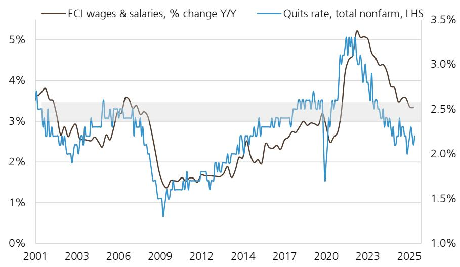

line

| Year | ECI wages & salaries, % change Y/Y | Quits rate, total nonfarm, LHS |
|------|------------------------------------|-------------------------------|
| 2001 | ~3.8%                              | ~2.8%                         |
| 2003 | ~2.8%                              | ~2.5%                         |
| 2006 | ~3.5%                              | ~3.0%                         |
| 2009 | ~1.5%                              | ~1.0%                         |
| 2012 | ~1.7%                              | ~1.8%                         |
| 2014 | ~2.5%                              | ~2.8%                         |
| 2017 | ~3.0%                              | ~3.2%                         |
| 2020 | ~3.5%                              | ~3.4%                         |
| 2023 | ~5.0%                              | ~3.0%                         |
| 2025 | ~3.5%                              | ~2.5%                         |

Source: UBS, Refinitiv Datastream

2. Employment growth is likely to slow. ISM employment has collapsed and employment PMIs are consistent with nearly zero employment growth.

Figure 52: Employment PMIs v employment growth   
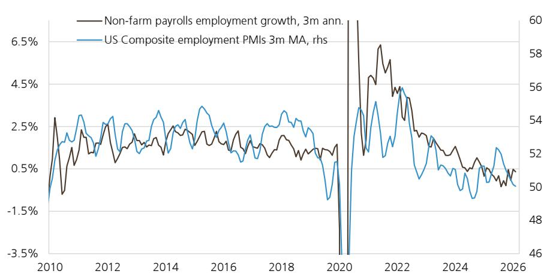

line

| Year | Non-farm payrolls employment growth, 3m ann. | US Composite employment PMIs 3m MA, rhs |
|------|---------------------------------------------|------------------------------------------|
| 2010 | ~2.5%                                       | ~50                                      |
| 2012 | ~1.5%                                       | ~53                                      |
| 2014 | ~2.0%                                       | ~54                                      |
| 2016 | ~1.5%                                       | ~52                                      |
| 2018 | ~2.0%                                       | ~54                                      |
| 2020 | ~-3.5%                                      | ~46                                      |
| 2022 | ~58%                                        | ~56                                      |
| 2024 | ~1.0%                                       | ~50                                      |
| 2026 | ~0.5%                                       | ~50                                      |

Source: UBS, Refinitiv Datastream

# 3. Savings ratio is already low.

Excess savings have largely been utilised with the saving ratio well below pre-Ukraine levels. The only exception is the upper income quintile (hence we can be more positive on the luxury end of the market).

Figure 53: Excess savings are largely used   
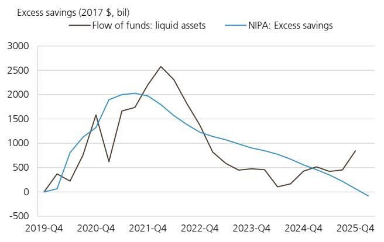

line

| Quarter   | Flow of funds: liquid assets | NIPA: Excess savings |
| --------- | ---------------------------- | -------------------- |
| 2019-Q4   | 0                            | 0                    |
| 2020-Q4   | 1500                         | 1200                 |
| 2021-Q4   | 2600                         | 2000                 |
| 2022-Q4   | 800                          | 1200                 |
| 2023-Q4   | 400                          | 800                  |
| 2024-Q4   | 500                          | 400                  |
| 2025-Q4   | 800                          | -100                 |

Source: UBS, Refinitive Datastream, Haver

Figure 54: Deposits and money market fund shares   
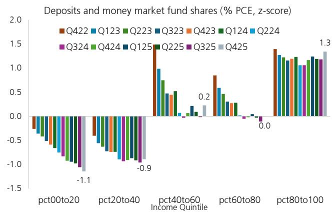

bar

| Income Quintile | Q422 | Q123 | Q223 | Q323 | Q423 | Q124 | Q224 | Q324 | Q424 | Q125 | Q225 | Q325 | Q425 |
| --------------- | ---- | ---- | ---- | ---- | ---- | ---- | ---- | ---- | ---- | ---- | ---- | ---- | ---- |
| pct00to20       | -0.1 | -0.2 | -0.3 | -0.4 | -0.5 | -0.6 | -0.7 | -0.8 | -0.9 | -1.0 | -1.1 | -1.2 | -1.3 |
| pct20to40       | -0.3 | -0.4 | -0.5 | -0.6 | -0.7 | -0.8 | -0.9 | -1.0 | -1.1 | -1.2 | -1.3 | -1.4 | -1.5 |
| pct40to60       | 1.5  | 1.0  | 0.8  | 0.6  | 0.5  | 0.4  | 0.3  | 0.2  | 0.1  | 0.0  | -0.1 | -0.2 | 0.2  |
| pct60to80       | 0.8  | 0.6  | 0.5  | 0.4  | 0.3  | 0.2  | 0.1  | 0.0  | -0.1 | -0.2 | -0.3 | -0.4 | 0.0  |
| pct80to100      | 1.4  | 1.3  | 1.2  | 1.1  | 1.0  | 0.9  | 0.8  | 0.7  | 0.6  | 0.5  | 0.4  | 0.3  | 1.3  |

Source: UBS, Refinitive Datastream, Haver

4. We feel in the long run the consumer share of GDP in the US has to fall (the opposite situation from China).

Figure 55: US Consumer share of GDP   
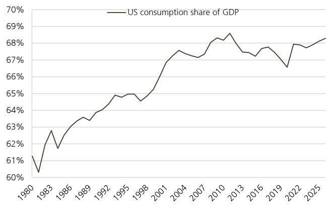

line

| Year | US consumption share of GDP |
| ---- | ---------------------------- |
| 1980 | 61%                          |
| 1983 | 62%                          |
| 1986 | 63%                          |
| 1989 | 64%                          |
| 1992 | 65%                          |
| 1995 | 65%                          |
| 1998 | 66%                          |
| 2001 | 67%                          |
| 2004 | 68%                          |
| 2007 | 67%                          |
| 2010 | 68%                          |
| 2013 | 67%                          |
| 2016 | 67%                          |
| 2019 | 66%                          |
| 2022 | 68%                          |
| 2025 | 68%                          |

Source: UBS, Refinitiv Datastream

Figure 56: Consumer share of GDP   
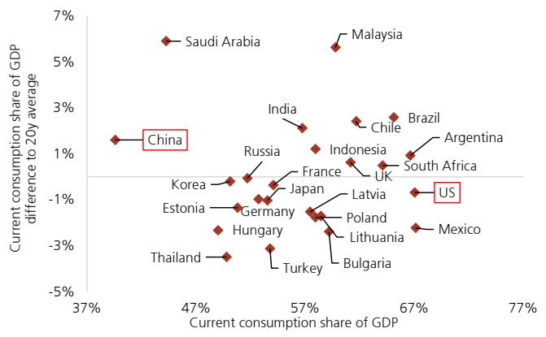

scatter

| Country | Current consumption share of GDP (%) | Current consumption share of GDP (difference to 20y average) (%) |
| :--- | :--- | :--- |
| Saudi Arabia | 47% | 6.5 |
| Malaysia | 58% | 5.8 |
| China | 37% | 1.3 |
| India | 57% | 2.5 |
| Russia | 56% | -0.5 |
| France | 57% | -0.8 |
| Japan | 56% | -0.9 |
| Estonia | 47% | -1.1 |
| Germany | 56% | -1.0 |
| Korea | 47% | -0.7 |
| Hungary | 47% | -2.7 |
| Thailand | 47% | -3.0 |
| Turkey | 56% | -3.1 |
| Bulgaria | 57% | -2.8 |
| Poland | 57% | -2.2 |
| Lithuania | 57% | -2.9 |
| Mexico | 67% | -2.6 |
| South Africa | 67% | 0.9 |
| Argentina | 67% | 1.0 |
| Brazil | 67% | 2.8 |
| Chile | 58% | 2.6 |
| Indonesia | 57% | 0.9 |
| Latvia | 57% | -1.3 |
| UK | 58% | -0.6 |
| US | 67% | -0.8 |

Source: UBS, Refinitiv Datastream

We know that Current account deficit equals budget deficit + consumer savings + corporate savings.

Thus, if the current account deficit is smaller (owing to say tariffs), then the consumer savings ratio has to be higher (if President Trump's policies do not lead to a fall in the budget deficit and investment incentives/onshoring encourage investment growth).

5. There is a record disconnect between consumer confidence and retail sales.

Figure 57: US retail sales (nominal) 3 month annualised vs consumer confidence   
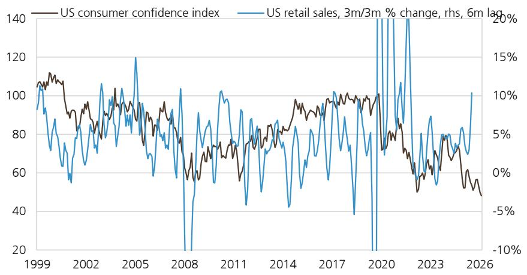

line

| Year | US consumer confidence index | US retail sales, 3m/3m % change, rhs, 6m lag |
|------|-------------------------------|---------------------------------------------|
| 1999 | ~105                          | ~10%                                        |
| 2000 | ~100                          | ~5%                                         |
| 2001 | ~95                           | ~0%                                         |
| 2002 | ~90                           | ~5%                                         |
| 2003 | ~85                           | ~10%                                        |
| 2004 | ~80                           | ~15%                                        |
| 2005 | ~75                           | ~10%                                        |
| 2006 | ~70                           | ~5%                                         |
| 2007 | ~65                           | ~0%                                         |
| 2008 | ~60                           | ~-10%                                       |
| 2009 | ~55                           | ~-5%                                        |
| 2010 | ~50                           | ~0%                                         |
| 2011 | ~45                           | ~5%                                         |
| 2012 | ~40                           | ~10%                                        |
| 2013 | ~35                           | ~5%                                         |
| 2014 | ~30                           | ~0%                                         |
| 2015 | ~25                           | ~5%                                         |
| 2016 | ~20                           | ~10%                                        |
| 2017 | ~15                           | ~15%                                        |
| 2018 | ~10                           | ~10%                                        |
| 2019 | ~5                            | ~5%                                         |
| 2020 | ~0                            | ~-10%                                       |
| 2021 | ~5                            | ~-5%                                        |
| 2022 | ~10                           | ~15%                                        |
| 2023 | ~5                            | ~5%                                         |
| 2024 | ~10                           | ~10%                                        |
| 2025 | ~5                            | ~5%                                         |
| 2026 | ~10                           | ~10%                                        |

Source: UBS, Refinitiv Datastream

6. It is hard to be that dollar bullish structurally in our opinion which caps retailing.

Retailing outperforms if the dollar strengthens.

Figure 58: US retail versus the dollar   
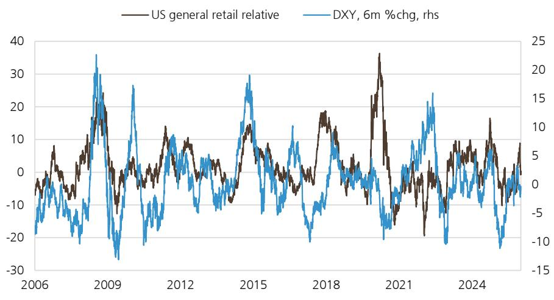

line

| Year | US general retail relative | DXY, 6m %chg, rhs |
|------|-----------------------------|-------------------|
| 2006 | -5                          | -10               |
| 2007 | 5                           | -5                |
| 2008 | 15                          | 10                |
| 2009 | 35                          | 25                |
| 2010 | -10                         | -15               |
| 2011 | 5                           | -5                |
| 2012 | 10                          | 5                 |
| 2013 | 5                           | 0                 |
| 2014 | 15                          | 10                |
| 2015 | 30                          | 20                |
| 2016 | 5                           | -5                |
| 2017 | -5                          | -10               |
| 2018 | 15                          | 10                |
| 2019 | 35                          | 25                |
| 2020 | -10                         | -15               |
| 2021 | 5                           | -5                |
| 2022 | 10                          | 5                 |
| 2023 | 5                           | -5                |
| 2024 | 15                          | 10                |
| 2025 | 5                           | -5                |
| 2026 | 10                          | 5                 |
| 2027 | 5                           | -5                |
| 2028 | 15                          | 10                |
| 2029 | 5                           | -5                |
| 2030 | 10                          | 5                 |
| 2031 | 5                           | -5                |
| 2032 | 15                          | 10                |
| 2033 | 5                           | -5                |
| 2034 | 10                          | 5                 |
| 2035 | 5                           | -5                |
| 2036 | 15                          | 10                |
| 2037 | 5                           | -5                |
| 2038 | 10                          | 5                 |
| 2039 | 5                           | -5                |
| 2040 | 15                          | 10                |
| 2041 | 5                           | -5                |
| 2042 | 10                          | 5                 |
| 2043 | 5                           | -5                |
| 2044 | 15                          | 10                |
| 2045 | 5                           | -5                |
| 2046 | 10                          | 5                 |
| 2047 | 5                           | -5                |
| 2048 | 15                          | 10                |
| 2049 | 5                           | -5                |
| 2050 | 10                          | 5                 |
| 2051 | 5                           | -5                |
| 2052 | 15                          | 10                |
| 2053 | 5                           | -5                |
| 2054 | 10                          | 5                 |
| 2055 | 5                           | -5                |
| 2056 | 15                          | 10                |
| 2057 | 5                           | -5                |
| 2058 | 10                          | 5                 |
| 2059 | 5                           | -5                |
| 2060 | 15                          | 10                |
| 2061 | 5                           | -5                |
| 2062 | 10                          | 5                 |
| 2063 | 5                           | -5                |
| 2064 | 15                          | 10                |
| 2065 | 5                           | -5                |
| 2066 | 10                          | 5                 |
| 2067 | 5                           | -5                |
| 2068 | 15                          | 10                |
| 2069 | 5                           | -5                |
| 2070 | 10                          | 5                 |
| 2071 | 5                           | -5                |
| 2072 | 15                          | 10                |
| 2073 | 5                           | -5                |
| 2074 | 10                          | 5                 |
| 2075 | 5                           | -5                |
| 2076 | 15                          | 10                |
| 2077 | 5                           | -5                |
| 2078 | 10                          | 5                 |
| 2079 | 5                           | -5                |
| 2080 | 15                          | 10                |
| 2081 | 5                           | -5                |
| 2082 | 10                          | 5                 |
| 2083 | 5                           | -5                |
| 2084 | 15                          | 10                |
| 2085 | 5                           | -5                |
| 2086 | 10                          | 5                 |
| 2087 | 5                           | -5                |
| 2088 | 15                          | 10                |
| 2089 | 5                           | -5                |
| 2090 | 10                          | 5                 |
| 2091 | 5                           | -5                |
| 2092 | 15                          | 10                |
| 2093 | 5                           | -5                |
| 2094 | 10                          | 5                 |
| 2095 | 5                           | -5                |
| 2096 | 15                          | 10                |
| 2097 | 5                           | -5                |
| 2098 | 10                          | 5                 |
| 2099 | 5                           | -5                |
| ... (later years) ~ 'US general retail relative' vs 'DXY, DXY' ~ 'US general retail' and 'DXY', '6m %chg', 'rhs' vs 'US general retail' etc. (later years) for comparison. Values shown on y-axis range: 'US general retail relative' = 'US general retail' (range: -3 to +3), 'DXY', '6m %chg', 'rhs'.

Source: UBS, Refinitiv Datastream

7. The US retail sector Ex amazon it is not cheap.   
8. Earnings momentum has been rolling over.

Figure 59: US retail (ex Amazon) 12m fwd PE relative to the market   
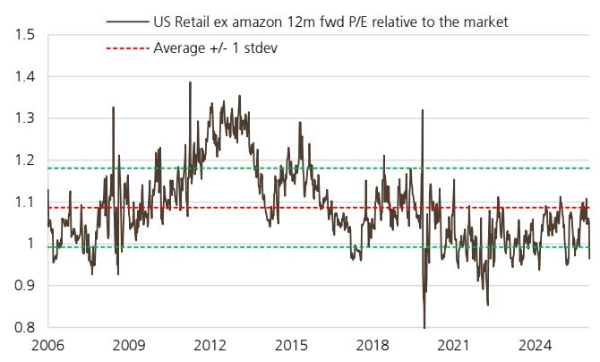

line

| Year | US Retail ex amazon 12m fwd P/E relative to the market |
|------|--------------------------------------------------------|
| 2006 | ~1.0                                                   |
| 2009 | ~1.3                                                   |
| 2012 | ~1.4                                                   |
| 2015 | ~1.3                                                   |
| 2018 | ~1.2                                                   |
| 2021 | ~0.8                                                   |
| 2024 | ~1.1                                                   |

Source: UBS, Refinitiv Datastream

Figure 60: US retail (ex Amazon) performance versus earnings momentum   
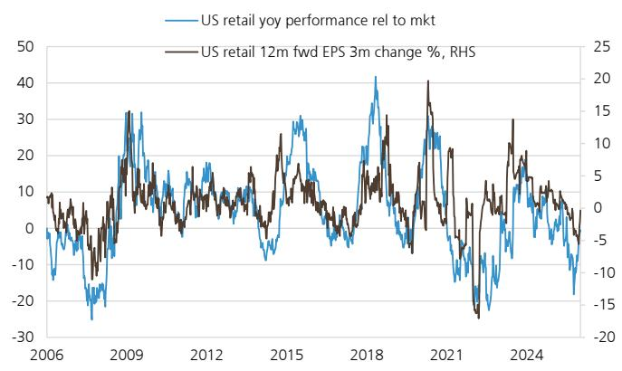

line

| Year | US retail yoy performance rel to mkt | US retail 12m fwd EPS 3m change % |
|------|----------------------------------------|------------------------------------|
| 2006 | -10                                    | 5                                  |
| 2009 | 30                                     | 15                                 |
| 2012 | 15                                     | 5                                  |
| 2015 | 30                                     | 10                                 |
| 2018 | 40                                     | 20                                 |
| 2021 | -15                                    | 10                                 |
| 2024 | -10                                    | 5                                  |

Source: UBS, Refinitiv Datastream

There is of course a strong wealth effect (namely c3-5% of the stock market gains are spent which adds 1% to 1.5% to consumption).

The low-end consumer is highly exposed to energy and electricity costs and has low exposure to the stock market.

Figure 61: Share of equity wealth in US vs share of consumption by income   
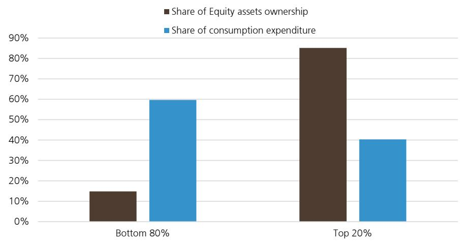

bar

| Category | Share of Equity assets ownership (%) | Share of consumption expenditure (%) |
| :--- | :--- | :--- |
| Bottom 80% | 15 | 60 |
| Top 20% | 85 | 40 |

Source: UBS, Refinitive Datastream, BBG, Haver

We highlight names below that are vulnerable to the low end consumer in the US.

# Screens

US consumers screen for low end consumer:

Figure 62: US Consumer Discretionary sell-rated names 

<table><tr><td></td><td></td><td></td><td colspan="2">P/E (12m fwd) --</td><td colspan="2">---- P/B ----</td><td colspan="2">HOLT</td><td></td><td></td><td></td><td></td><td></td></tr><tr><td>Name</td><td>Sector</td><td>Price</td><td>Abs</td><td>Z-score(rel. market)</td><td>Abs</td><td>Z-score(rel. market)</td><td>Price to book</td><td>Warranted Upside downside(%)</td><td>3m Earnings revisions</td><td>UBS Crowding</td><td>Consensus recomm.(1=Buy; 5=Sell)</td><td>UBS rating</td><td>M-cap(Bn, $)</td></tr><tr><td>Dillards &#x27;A&#x27;</td><td>Consumer Discretionary</td><td>563.3</td><td>16.6</td><td>0.2</td><td>4.9</td><td>1.3</td><td>2.3</td><td>-13.4</td><td>15.9%</td><td>-16.5</td><td>3.5</td><td>Sell</td><td>6.6</td></tr><tr><td>Cheesecake Factory</td><td>Consumer Discretionary</td><td>61.7</td><td>14.6</td><td>-0.1</td><td>7.0</td><td>0.0</td><td>1.7</td><td>-16.3</td><td>15.9%</td><td>-4.3</td><td>2.6</td><td>Sell</td><td>3.1</td></tr><tr><td>Columbia Sportswear</td><td>Consumer Discretionary</td><td>63.0</td><td>16.1</td><td>-1.2</td><td>2.0</td><td>-1.8</td><td>1.3</td><td>-25.2</td><td>38.2%</td><td>9.9</td><td>2.6</td><td>Sell</td><td>3.2</td></tr><tr><td>Kohl&#x27;S</td><td>Consumer Discretionary</td><td>14.5</td><td>10.4</td><td>-0.1</td><td>0.4</td><td>-1.4</td><td>0.6</td><td>67.5</td><td>-12.1%</td><td>-5.6</td><td>3.1</td><td>Sell</td><td>1.6</td></tr><tr><td>Macy&#x27;S</td><td>Consumer Discretionary</td><td>19.5</td><td>9.2</td><td>0.0</td><td>1.1</td><td>-0.9</td><td>0.8</td><td>27.3</td><td>-24.2%</td><td>3.5</td><td>2.8</td><td>Sell</td><td>5.1</td></tr><tr><td>Quantumscape A (Nys)</td><td>Consumer Discretionary</td><td>7.5</td><td>-10.9</td><td>0.3</td><td>3.9</td><td>-0.5</td><td>2.0</td><td>5.0</td><td>15.3%</td><td>-17.5</td><td>3.2</td><td>Sell</td><td>4.4</td></tr></table>

Source: UBS, Refinitiv Datastream, Holt, Quant answers

Figure 63: Consumer stocks most exposed to the low end consumer 

<table><tr><td></td><td></td><td></td><td colspan="2">-P/E (12m fwd) --</td><td colspan="2">---- P/B ----</td><td colspan="2">HOLT</td><td></td><td></td><td></td><td></td><td></td></tr><tr><td>Name</td><td>Sector</td><td>Price</td><td>Abs</td><td>Z-score(rel. market)</td><td>Abs</td><td>Z-score(rel. market)</td><td>Price to book</td><td>Warranted Upside downside(%)</td><td>3m Earnings revisions</td><td>UBS Crowding</td><td>Consensus recomm.(1=Buy; 5=Sell)</td><td>UBS rating</td><td>M-cap(Bn,$)</td></tr><tr><td>Frontier Group Holdings</td><td>Industrials</td><td>5.3</td><td>-8.7</td><td>-0.1</td><td>2.5</td><td>-1.2</td><td>0.8</td><td>-270.2</td><td>-15.7%</td><td>-5.1</td><td>3.3</td><td>Neutral</td><td>1.2</td></tr><tr><td>Allegiant Travel</td><td>Industrials</td><td>83.0</td><td>13.5</td><td>-0.2</td><td>1.5</td><td>-1.1</td><td>1.0</td><td>-36.2</td><td>12.0%</td><td>-9.0</td><td>2.5</td><td>Neutral</td><td>1.5</td></tr><tr><td>Jetblue Airways</td><td>Industrials</td><td>5.1</td><td>-2.9</td><td>-0.1</td><td>0.9</td><td>-1.3</td><td>0.7</td><td>-127.0</td><td>-33.7%</td><td>12.3</td><td>3.3</td><td>Sell</td><td>1.9</td></tr><tr><td>Southwest Airlines</td><td>Industrials</td><td>41.3</td><td>12.2</td><td>0.0</td><td>2.7</td><td>-1.0</td><td>1.0</td><td>14.3</td><td>0.5%</td><td>-6.0</td><td>2.7</td><td>Buy</td><td>20.2</td></tr><tr><td>Dollar Tree</td><td>Consumer Staples</td><td>94.2</td><td>14.0</td><td>-1.3</td><td>5.0</td><td>-0.3</td><td>1.9</td><td>-16.4</td><td>11.1%</td><td>-0.2</td><td>2.9</td><td>Buy</td><td>18.4</td></tr><tr><td>Dollar General</td><td>Consumer Staples</td><td>113.3</td><td>15.6</td><td>-1.2</td><td>2.9</td><td>-1.4</td><td>1.8</td><td>-3.0</td><td>25.3%</td><td>11.7</td><td>2.4</td><td>Buy</td><td>24.9</td></tr><tr><td>Adv Auto Parts</td><td>Consumer</td><td>56.2</td><td>18.4</td><td>0.0</td><td>1.5</td><td>-1.4</td><td>1.0</td><td>-47.0</td><td>16.8%</td><td>-8.2</td><td>3.0</td><td>Neutral</td><td>3.4</td></tr><tr><td>Autozone</td><td>Consumer</td><td>3496.2</td><td>21.3</td><td>1.1</td><td>-17.1</td><td>0.3</td><td>5.3</td><td>2.4</td><td>4.7%</td><td>11.2</td><td>1.9</td><td>Buy</td><td>57.6</td></tr><tr><td>O Reilly Automotive</td><td>Consumer</td><td>93.0</td><td>28.0</td><td>1.3</td><td>-102.5</td><td>-0.3</td><td>8.3</td><td>-11.2</td><td>-27.9%</td><td>14.3</td><td>2.0</td><td>Buy</td><td>77.0</td></tr><tr><td>Choice Hotels Intl.</td><td>Consumer</td><td>106.6</td><td>14.2</td><td>-2.0</td><td>27.1</td><td>0.4</td><td>4.8</td><td>37.2</td><td>3.0%</td><td>-12.3</td><td>3.0</td><td>Neutral</td><td>4.8</td></tr><tr><td>Six Flags Entertainment</td><td>Consumer</td><td>22.0</td><td>-122.8</td><td>-2.7</td><td>4.1</td><td>0.1</td><td>#N/A</td><td>#N/A</td><td>-40.1%</td><td>7.2</td><td>2.2</td><td>Buy</td><td>2.3</td></tr><tr><td>United Parks And Resorts</td><td>Consumer</td><td>39.2</td><td>9.4</td><td>-0.3</td><td>-4.6</td><td>0.3</td><td>1.2</td><td>-16.9</td><td>-13.7%</td><td>-13.5</td><td>2.5</td><td>Neutral</td><td>1.9</td></tr><tr><td>Kohl&#x27;S</td><td>Consumer</td><td>14.5</td><td>10.4</td><td>-0.1</td><td>0.4</td><td>-1.4</td><td>0.6</td><td>67.5</td><td>-12.1%</td><td>-5.6</td><td>3.1</td><td>Sell</td><td>1.6</td></tr></table>

Source: UBS, Refinitiv Datastream, Holt, Quant answers

# European consumer cyclical and staples:

Below we show a scorecard with the stocks in our European consumer cyclicals and staples basket. Our analysis looks at 8 specific factors:

1. P/E relatives (10%) – P/E versus own history, normalised across the market. Lower (more negative) z scores = cheaper, more favourable.   
2. P/B relatives (10%) – P/B versus own history, normalised. Lower z scores = cheaper, more favourable.   
3. Earnings revisions (20%) – Average of 1 month and 3 month earnings revisions, normalised. Higher z scores = improving earnings expectations.   
4. Forward EPS change (20%) – Average of 1 month, 3 month and 12-month EPS changes, normalised (1.25x weighting if all three are positive). Higher z scores = improving earnings growth.   
5. UBS crowding (5%) – Crowded longs score positively. After normalisation, lower (more negative) z scores = more contrarian, more favourable.   
6. Analyst recommendations (5%) – Scale from 1 (buy) to 5 (sell), normalised. Higher z scores imply more bearish consensus and are treated as a contrarian positive.   
7. Price momentum (20%) – Average of 1-month, 3 month relative performance, and 12 month relative performance (all vs MSCI ACWI), normalised (1.25x weighting if all three are positive). Higher z scores = stronger momentum.   
8. ROE over ROE volatility (10%) – Profitability stability measure, normalised. Higher z scores = higher quality.

We then compute a weighted average of the 8 factor scores and normalise against the market before ranking the stocks.

Based on this, the highest ranked buy recommendations in consumer cyclicals are Zalando, Inditex and Next whereas in consumer staples, they are Carlsberg, Heineken, L'Oreal and Ab-Inbev.

If we just look for consumer cyclicals that are cheap on P/E relatives (against the market versus their historic norm) with positive earnings momentum, then we would focus on Moncler, Inditex and Richemont.

Figure 64: European Consumer Cyclical basket screen scorecard 

<table><tr><td>Name</td><td colspan="2">P/E relative (-)</td><td>Abs P/B</td><td>P/B ratio (-)</td><td>Earnings momentum (+)</td><td>EPS change (+)</td><td>Crowding (-)</td><td>Analyst recs (+)</td><td>Price momentum (+)</td><td>ROE quality (+)</td><td>Overall score (+)</td><td>Rank within STOXX 600</td><td>Analyst rating</td></tr><tr><td>MONCLER</td><td>22.34</td><td>-0.94</td><td>3.87</td><td>-1.54</td><td>0.60</td><td>-0.15</td><td>-1.71</td><td>-0.12</td><td>-0.40</td><td>0.27</td><td>1.26</td><td>43</td><td>Neutral</td></tr><tr><td>ZALANDO</td><td>14.45</td><td>-1.50</td><td>1.99</td><td>-1.49</td><td>-0.11</td><td>0.02</td><td>0.29</td><td>-1.06</td><td>-0.76</td><td>-0.38</td><td>0.60</td><td>141</td><td>Buy</td></tr><tr><td>VOLKSWAGEN PREF.</td><td>4.11</td><td>-1.20</td><td>0.25</td><td>-1.55</td><td>-0.45</td><td>-0.24</td><td>-1.13</td><td>0.06</td><td>-0.48</td><td>-0.41</td><td>0.64</td><td>124</td><td>Neutral</td></tr><tr><td>HERMES INTL.</td><td>35.23</td><td>-1.86</td><td>9.32</td><td>-3.08</td><td>-1.58</td><td>-0.28</td><td>-0.48</td><td>-0.66</td><td>-0.86</td><td>0.38</td><td>0.48</td><td>170</td><td>Neutral</td></tr><tr><td>BMW</td><td>7.28</td><td>-0.27</td><td>0.51</td><td>-1.33</td><td>-0.58</td><td>-0.27</td><td>-1.37</td><td>0.67</td><td>-0.45</td><td>-0.41</td><td>0.26</td><td>216</td><td>Neutral</td></tr><tr><td>HENNES &amp; MAURITZ B</td><td>20.34</td><td>-0.38</td><td>6.47</td><td>-0.25</td><td>-0.73</td><td>-0.08</td><td>-1.11</td><td>2.30</td><td>-0.31</td><td>-0.49</td><td>0.16</td><td>235</td><td>Neutral</td></tr><tr><td>INDUSTRIA DE DISENO TEXTIL</td><td>24.03</td><td>-0.33</td><td>8.18</td><td>-0.40</td><td>0.38</td><td>-0.06</td><td>-0.03</td><td>-0.55</td><td>-0.32</td><td>-0.39</td><td>0.10</td><td>247</td><td>Buy</td></tr><tr><td>NEXT</td><td>16.40</td><td>0.93</td><td>9.68</td><td>-0.84</td><td>1.37</td><td>0.03</td><td>2.68</td><td>0.04</td><td>-0.25</td><td>-0.53</td><td>0.00</td><td>263</td><td>Buy</td></tr><tr><td>RENAULT</td><td>4.69</td><td>0.08</td><td>0.30</td><td>-1.11</td><td>-0.48</td><td>-0.70</td><td>-0.91</td><td>-0.05</td><td>-0.82</td><td>-0.49</td><td>-0.37</td><td>338</td><td>Sell</td></tr><tr><td>RYANAIR HOLDINGS</td><td>10.28</td><td>-0.22</td><td>3.55</td><td>-0.54</td><td>-0.58</td><td>-0.20</td><td>-0.22</td><td>-0.73</td><td>-0.52</td><td>-0.54</td><td>-0.52</td><td>371</td><td>Buy</td></tr><tr><td>RICHEMONT N</td><td>23.11</td><td>-0.30</td><td>4.41</td><td>0.11</td><td>-0.02</td><td>-0.15</td><td>0.84</td><td>-0.18</td><td>-0.09</td><td>-0.41</td><td>-0.52</td><td>369</td><td>Buy</td></tr><tr><td>STELLANTIS</td><td>6.51</td><td>0.41</td><td>0.51</td><td>-1.60</td><td>-2.00</td><td>-0.70</td><td>-1.00</td><td>1.01</td><td>-0.58</td><td>-0.56</td><td>-0.99</td><td>429</td><td>Buy</td></tr><tr><td>KERING</td><td>30.25</td><td>1.99</td><td>1.96</td><td>-1.42</td><td>-2.35</td><td>-0.32</td><td>-2.21</td><td>1.24</td><td>-0.04</td><td>-0.56</td><td>-1.42</td><td>469</td><td>Neutral</td></tr><tr><td>DAIMLER TRUCK HOLDING E</td><td>11.47</td><td>2.08</td><td>1.54</td><td>0.14</td><td>-0.69</td><td>-0.39</td><td>-0.54</td><td>0.06</td><td>-0.30</td><td></td><td></td><td></td><td>Neutral</td></tr><tr><td>EASYIET</td><td>7.69</td><td>0.02</td><td>0.80</td><td>-1.61</td><td>-1.60</td><td>-1.52</td><td>-0.61</td><td>0.29</td><td>-0.99</td><td></td><td></td><td></td><td>Buy</td></tr></table>

Source: UBS, Refinitiv Datastream, BBG, Holt, Quant answers

Figure 65: European Consumer Staples basket screen scorecard 

<table><tr><td>Name</td><td>Abs P/E</td><td>P/E relative (-)</td><td>Abs P/B</td><td>P/B ratio (-)</td><td>Earnings moment (+)</td><td>EPS change (+)</td><td>Crowding (-)</td><td>Analyst recs (+)</td><td>Price moment (+)</td><td>ROE quality (+)</td><td>Overall score (+)</td><td>Rank within STOXX 600</td><td>Analyst rating</td></tr><tr><td>CARLSBERG B</td><td>12.19</td><td>-1.92</td><td>3.85</td><td>-0.57</td><td>1.21</td><td>0.00</td><td>-0.28</td><td>-0.84</td><td>-0.45</td><td>-0.49</td><td>1.30</td><td>32</td><td>Buy</td></tr><tr><td>HEINEKEN</td><td>12.72</td><td>-2.12</td><td>2.10</td><td>-1.65</td><td>0.06</td><td>-0.09</td><td>-0.81</td><td>-0.66</td><td>-0.58</td><td>1.55</td><td>1.09</td><td>54</td><td>Buy</td></tr><tr><td>DIAGEO</td><td>12.30</td><td>-2.38</td><td>4.06</td><td>-2.17</td><td>-0.88</td><td>-0.26</td><td>-0.99</td><td>-0.25</td><td>-0.66</td><td>-0.52</td><td>1.00</td><td>64</td><td>Neutral</td></tr><tr><td>L&#x27;OREAL</td><td>26.91</td><td>-1.21</td><td>5.74</td><td>-1.42</td><td>0.00</td><td>-0.10</td><td>0.19</td><td>0.04</td><td>-0.25</td><td>-0.27</td><td>0.66</td><td>123</td><td>Buy</td></tr><tr><td>NESTLE &#x27;N&#x27;</td><td>17.97</td><td>-1.38</td><td>6.27</td><td>-0.89</td><td>-0.20</td><td>-0.20</td><td>-0.30</td><td>0.38</td><td>-0.31</td><td>-0.17</td><td>0.51</td><td>162</td><td>Neutral</td></tr><tr><td>BEIERSDORF</td><td>16.86</td><td>-3.10</td><td>1.88</td><td>-2.11</td><td>-1.63</td><td>-0.35</td><td>-2.13</td><td>0.38</td><td>-1.02</td><td>2.41</td><td>0.79</td><td>97</td><td>Neutral</td></tr><tr><td>ASSOCIATED BRIT.FOODS</td><td>11.03</td><td>-1.19</td><td>1.19</td><td>-1.11</td><td>-0.84</td><td>-0.42</td><td>-2.60</td><td>2.16</td><td>-0.45</td><td>0.04</td><td>0.80</td><td>95</td><td>Neutral</td></tr><tr><td>CARREFOUR</td><td>9.31</td><td>-0.76</td><td>1.06</td><td>-1.07</td><td>-0.70</td><td>-0.02</td><td>-0.95</td><td>0.56</td><td>0.19</td><td>1.48</td><td>0.34</td><td>197</td><td>Neutral</td></tr><tr><td>ANHEUSER-BUSCH INBEV</td><td>16.32</td><td>-0.93</td><td>1.63</td><td>-0.96</td><td>-0.32</td><td>0.10</td><td>-0.01</td><td>-1.06</td><td>0.13</td><td>4.34</td><td>0.20</td><td>230</td><td>Buy</td></tr><tr><td>HENKEL PREFERENCE</td><td>11.62</td><td>-2.00</td><td>1.28</td><td>-1.15</td><td>-1.25</td><td>-0.26</td><td>-0.61</td><td>1.13</td><td>-0.55</td><td>0.28</td><td>0.39</td><td>190</td><td>Neutral</td></tr><tr><td>UNILEVER (UK)</td><td>15.05</td><td>-1.79</td><td>28.22</td><td>0.22</td><td>-0.48</td><td>-0.26</td><td>2.06</td><td>0.29</td><td>-0.57</td><td>-0.44</td><td>-0.41</td><td>348</td><td>Sell</td></tr><tr><td>MARKS &amp; SPENCER GROUP</td><td>10.27</td><td>-1.02</td><td>59.71</td><td>1.33</td><td>-0.17</td><td>-0.10</td><td>-0.25</td><td>-1.27</td><td>-0.62</td><td>-0.48</td><td>-0.71</td><td>399</td><td>Buy</td></tr><tr><td>SAINSBURY</td><td>13.42</td><td>0.22</td><td>1.20</td><td>0.48</td><td>-0.36</td><td>-0.24</td><td>-0.18</td><td>0.20</td><td>-0.37</td><td>0.35</td><td>-0.84</td><td>413</td><td>Buy</td></tr><tr><td>TESCO</td><td>15.51</td><td>0.03</td><td>2.22</td><td>0.14</td><td>-0.10</td><td>-0.06</td><td>2.64</td><td>-0.55</td><td>-0.10</td><td>-0.43</td><td>-1.04</td><td>434</td><td>Buy</td></tr><tr><td>RECKITT BENCKISER GROUP</td><td>13.90</td><td>-1.59</td><td>4.14</td><td>-1.26</td><td>-1.66</td><td>-0.37</td><td>2.76</td><td>-0.55</td><td>-0.68</td><td>-0.48</td><td>-0.95</td><td>428</td><td>Buy</td></tr><tr><td>DANONE</td><td>16.88</td><td>-0.69</td><td>2.74</td><td>-0.83</td><td>-1.63</td><td>-0.16</td><td>1.10</td><td>-0.30</td><td>-0.56</td><td>1.58</td><td>-1.10</td><td>442</td><td>Buy</td></tr></table>

Source: UBS, Refinitiv Datastream, BBG, Holt, Quant answers

# Appendix

We show our earnings scorecards for both Global and Europe.

Figure 66: Global earnings revisions 

<table><tr><td rowspan="2">Global sectors</td><td colspan="2">Change in 12m fwd EPS</td><td colspan="2">Earnings breadth</td><td rowspan="2">Total Z-score</td><td rowspan="2">Change, prev.month</td></tr><tr><td>1-month</td><td>3-month</td><td>1-month</td><td>3-month</td></tr><tr><td>Energy</td><td>15.0%</td><td>37.4%</td><td>15.5%</td><td>6.4%</td><td>2.65</td><td>1</td></tr><tr><td>Technology Hardware</td><td>13.1%</td><td>24.6%</td><td>5.5%</td><td>8.5%</td><td>1.90</td><td>1</td></tr><tr><td>Semiconductors</td><td>7.3%</td><td>27.5%</td><td>7.9%</td><td>10.5%</td><td>1.80</td><td>-2</td></tr><tr><td>Metals and Mining</td><td>4.7%</td><td>13.4%</td><td>3.4%</td><td>7.6%</td><td>0.97</td><td>0</td></tr><tr><td>Chemicals</td><td>7.1%</td><td>13.1%</td><td>2.3%</td><td>-0.7%</td><td>0.69</td><td>6</td></tr><tr><td>Software</td><td>1.7%</td><td>0.9%</td><td>2.9%</td><td>5.3%</td><td>0.35</td><td>-1</td></tr><tr><td>Banks</td><td>2.5%</td><td>4.2%</td><td>0.3%</td><td>4.1%</td><td>0.31</td><td>-1</td></tr><tr><td>Capital Goods</td><td>2.0%</td><td>4.1%</td><td>0.6%</td><td>1.3%</td><td>0.16</td><td>0</td></tr><tr><td>Diversified Financials</td><td>0.4%</td><td>1.4%</td><td>-0.1%</td><td>2.4%</td><td>0.02</td><td>-2</td></tr><tr><td>Insurance</td><td>1.6%</td><td>2.8%</td><td>-1.4%</td><td>0.9%</td><td>0.01</td><td>0</td></tr><tr><td>Pharmaceuticals</td><td>0.8%</td><td>2.9%</td><td>0.0%</td><td>0.5%</td><td>0.00</td><td>1</td></tr><tr><td>Utilities</td><td>1.5%</td><td>1.5%</td><td>-1.0%</td><td>-0.1%</td><td>-0.06</td><td>1</td></tr><tr><td>Tobacco</td><td>1.1%</td><td>1.9%</td><td>-4.1%</td><td>0.5%</td><td>-0.17</td><td>-4</td></tr><tr><td>Commercial Services</td><td>-0.6%</td><td>-0.2%</td><td>0.5%</td><td>-1.7%</td><td>-0.25</td><td>4</td></tr><tr><td>Food Producers</td><td>2.2%</td><td>-1.4%</td><td>-3.1%</td><td>-3.2%</td><td>-0.31</td><td>7</td></tr><tr><td>Healthcare Equipment</td><td>1.1%</td><td>0.0%</td><td>-3.5%</td><td>-2.1%</td><td>-0.32</td><td>-2</td></tr><tr><td>Transportation</td><td>0.3%</td><td>2.7%</td><td>-3.2%</td><td>-3.1%</td><td>-0.33</td><td>-1</td></tr><tr><td>Retailing</td><td>2.7%</td><td>0.8%</td><td>-4.6%</td><td>-4.5%</td><td>-0.35</td><td>1</td></tr><tr><td>Food Retail</td><td>0.1%</td><td>0.4%</td><td>-4.1%</td><td>-2.7%</td><td>-0.42</td><td>-4</td></tr><tr><td>Telecoms</td><td>0.3%</td><td>-2.7%</td><td>-2.7%</td><td>-3.1%</td><td>-0.45</td><td>0</td></tr><tr><td>Beverages</td><td>0.2%</td><td>2.6%</td><td>-9.3%</td><td>-4.2%</td><td>-0.64</td><td>-4</td></tr><tr><td>Consumer Durables</td><td>0.1%</td><td>-0.9%</td><td>-7.7%</td><td>-5.3%</td><td>-0.72</td><td>2</td></tr><tr><td>Pulp &amp; Paper</td><td>1.5%</td><td>1.9%</td><td>-8.7%</td><td>-10.1%</td><td>-0.82</td><td>3</td></tr><tr><td>Household Products</td><td>0.2%</td><td>1.3%</td><td>-12.3%</td><td>-7.0%</td><td>-0.92</td><td>1</td></tr><tr><td>Hotels &amp; Leisure</td><td>-1.6%</td><td>-1.0%</td><td>-9.1%</td><td>-6.3%</td><td>-0.93</td><td>-4</td></tr><tr><td>Construction Materials</td><td>-0.9%</td><td>0.0%</td><td>-7.1%</td><td>-9.9%</td><td>-0.95</td><td>1</td></tr><tr><td>Autos</td><td>-1.3%</td><td>-6.2%</td><td>-11.5%</td><td>-7.6%</td><td>-1.20</td><td>-4</td></tr></table>

Source: UBS, Refinitiv Datastream

Figure 67: European earnings revisions 

<table><tr><td rowspan="2">European Sectors</td><td colspan="2">Change in 12m fwd EPS</td><td colspan="2">Earnings breadth</td><td rowspan="2">Total Z-score</td><td rowspan="2">Change, prev.month</td></tr><tr><td>1-month</td><td>3-month</td><td>1-month</td><td>3-month</td></tr><tr><td>Energy</td><td>16.6%</td><td>42.1%</td><td>28.8%</td><td>14.1%</td><td>3.35</td><td>0</td></tr><tr><td>Semiconductors</td><td>7.6%</td><td>12.3%</td><td>20.8%</td><td>21.6%</td><td>1.92</td><td>0</td></tr><tr><td>Metals and Mining</td><td>6.8%</td><td>11.0%</td><td>-0.6%</td><td>4.8%</td><td>0.85</td><td>0</td></tr><tr><td>Banks</td><td>2.1%</td><td>3.6%</td><td>0.1%</td><td>5.5%</td><td>0.36</td><td>0</td></tr><tr><td>Utilities</td><td>2.1%</td><td>1.6%</td><td>3.7%</td><td>2.9%</td><td>0.32</td><td>1</td></tr><tr><td>Software</td><td>1.8%</td><td>-0.1%</td><td>5.4%</td><td>3.6%</td><td>0.31</td><td>-1</td></tr><tr><td>Technology Hardware</td><td>1.3%</td><td>0.1%</td><td>2.3%</td><td>2.6%</td><td>0.18</td><td>0</td></tr><tr><td>Insurance</td><td>1.6%</td><td>-0.1%</td><td>2.6%</td><td>1.4%</td><td>0.17</td><td>1</td></tr><tr><td>Construction Materials</td><td>7.5%</td><td>2.2%</td><td>-3.7%</td><td>-11.3%</td><td>0.14</td><td>12</td></tr><tr><td>Capital Goods</td><td>2.7%</td><td>0.7%</td><td>0.2%</td><td>-2.4%</td><td>0.10</td><td>2</td></tr><tr><td>Retailing</td><td>2.2%</td><td>2.0%</td><td>-4.2%</td><td>-3.1%</td><td>-0.02</td><td>-1</td></tr><tr><td>Diversified Financials</td><td>1.0%</td><td>-0.8%</td><td>-0.5%</td><td>-0.4%</td><td>-0.02</td><td>-4</td></tr><tr><td>Telecoms</td><td>2.6%</td><td>-0.1%</td><td>-2.8%</td><td>-5.0%</td><td>-0.07</td><td>3</td></tr><tr><td>Pharmaceuticals</td><td>1.2%</td><td>-1.8%</td><td>-0.4%</td><td>-2.9%</td><td>-0.10</td><td>1</td></tr><tr><td>Chemicals</td><td>3.0%</td><td>0.0%</td><td>-4.8%</td><td>-9.0%</td><td>-0.20</td><td>9</td></tr><tr><td>Beverages</td><td>0.8%</td><td>2.4%</td><td>-9.2%</td><td>-5.0%</td><td>-0.28</td><td>-3</td></tr><tr><td>Food Retail</td><td>1.2%</td><td>0.0%</td><td>-10.2%</td><td>-6.5%</td><td>-0.38</td><td>-3</td></tr><tr><td>Food Producers</td><td>4.2%</td><td>0.0%</td><td>-11.6%</td><td>-12.8%</td><td>-0.38</td><td>7</td></tr><tr><td>Commercial Services</td><td>1.2%</td><td>-0.8%</td><td>-9.6%</td><td>-7.5%</td><td>-0.42</td><td>-2</td></tr><tr><td>Healthcare Equipment</td><td>0.4%</td><td>-0.9%</td><td>-4.9%</td><td>-11.1%</td><td>-0.47</td><td>2</td></tr><tr><td>Tobacco</td><td>1.7%</td><td>-1.3%</td><td>-15.5%</td><td>-6.1%</td><td>-0.50</td><td>-10</td></tr><tr><td>Transportation</td><td>-0.1%</td><td>-1.3%</td><td>-10.7%</td><td>-8.5%</td><td>-0.58</td><td>-3</td></tr><tr><td>Pulp &amp; Paper</td><td>-0.6%</td><td>-1.3%</td><td>-8.1%</td><td>-11.5%</td><td>-0.63</td><td>-3</td></tr><tr><td>Autos</td><td>0.4%</td><td>-8.1%</td><td>-6.8%</td><td>-12.0%</td><td>-0.74</td><td>2</td></tr><tr><td>Consumer Durables</td><td>-0.1%</td><td>-3.8%</td><td>-13.5%</td><td>-13.0%</td><td>-0.83</td><td>-2</td></tr><tr><td>Hotels &amp; Leisure</td><td>-2.0%</td><td>-4.3%</td><td>-16.3%</td><td>-10.3%</td><td>-0.97</td><td>-8</td></tr><tr><td>Household Products</td><td>0.7%</td><td>-0.6%</td><td>-22.7%</td><td>-19.7%</td><td>-1.09</td><td>0</td></tr></table>

Source: UBS, Refinitiv Datastream

# Valuation Method and Risk Statement

Investing in global equities poses currency, country, industry, and company-specific risks. Valuations can be impacted by company-specific factors, investor risk appetite, as well as changes in the macroeconomic landscape and financial market stability.

Risks of multi-asset investing include but are not limited to market risk, credit risk, interest rate risk, and foreign exchange risk. Correlations of returns among different asset classes may deviate from historical patterns. Geopolitical events and policy shocks pose risks that can reduce asset returns. Valuations may be adversely affected during times of high market volatility, thin liquidity, and economic dislocation. Valuation methods across sectors include DCF, SOTP and multiples analysis.

The HOLT methodology does not assign ratings or a target price to a security. It is an analytical tool that involves use of a set of proprietary quantitative algorithms and warranted value calculations, collectively called the HOLT valuation model, that are consistently applied to all the companies included in its database. The HOLT valuation model is a discounted cash flow model. Third-party data (including consensus earnings estimates) are systematically translated into a number of default variables and incorporated into the algorithms available in the HOLT valuation model. The source financial statement, pricing, and earnings data provided by outside data vendors are subject to quality control and may also be adjusted to more closely measure the underlying economics of firm performance. These adjustments provide consistency when analyzing a single company across time, or analyzing multiple companies across industries or national borders.

The default scenario that is produced by the HOLT valuation model establishes a warranted price that represents the expected mean value for a security based upon empirically derived fade algorithms that forecast a firm's future return on capital and growth rates over an extended period of time. As the third-party data are updated, the warranted price updates automatically. A company's future achieved return on capital or growth rate may differ from HOLT default forecast. Additional information about the HOLT methodology is available upon request.

CFROI, CFROE, HOLT, HOLT Lens, HOLTfolio and "Powered by HOLT" are trademarks or registered trademarks of UBS in the United States and other countries. HOLT is a corporate performance and valuation service of UBS.

HOLT Business Resilience Dashboard (HBRD) Disclaimer

The HOLT Business Resilience Dashboard (HBRD) is constructed by applying systematic processes on publicly available records and third-party data to generate quantitative measures. The HBRD consistently assigns scores using a transparent combination of metrics and weights across financial, environmental and governance inputs. Individual companies can be scored on a global-size and/or region-size relative basis. The HBRD is also translated into five textual assessments (e.g. "Highest" or "Lowest") based on their quintile percentile rank. For further details on the HBRD methodology HOLT Business Resilience Primer please contact UBS LLC, 11 Madison Avenue, New York, NY 10010, USA, Attention: Investment Research. The HBRD does not constitute or imply any endorsement or recommendation of any individual company. UBS has not sought to independently verify information obtained from public and third-party sources and makes no representations or warranties as to accuracy, completeness or reliability of such information due to inconsistent reporting of data by companies. Additionally, as global laws, guidelines and regulations in relation to the tracking and provision of such data are evolving, all such disclosures are made on a non-reliance basis and are subject to change. Any figures, values or other data published in this report are neither designed nor administered in line with the standards of the IOSCO Principles for Financial Benchmarks or the EU Benchmarks Regulation (EU) 2016/1011 or any other benchmark related regulatory guidelines and as such you are prohibited from using those figures, values or data in a way which would amount to use of a financial benchmark under those regimes (or any equivalent rules or regulations in any global jurisdiction).

HOLT transferred to UBS on October 1, 2024 – renamed as UBS HOLT. The UBS HOLT Lens website and materials will be transitioning to UBS branding over time, with expected full redesign to UBS in time.

# Required Disclosures

This document has been prepared by UBS AG London Branch, an affiliate of UBS AG. UBS AG, its subsidiaries, branches and affiliates, including former CS AG and its subsidiaries, branches and affiliates are referred to herein as "UBS".

For information on the ways in which UBS manages conflicts and maintains independence of its UBS Global Research product; historical performance information; certain additional disclosures concerning UBS Global Research recommendations; and terms and conditions for certain third party data used in research report, please visit https://www.ubs.com/disclosures. Unless otherwise indicated, information and data in this report are based on company disclosures including but not limited to annual, interim, quarterly reports and other company announcements. The figures contained in performance charts refer to the past; past performance is not a reliable indicator of future results. Additional information will be made available upon request. UBS Co. Limited is licensed to conduct securities investment consultancy businesses by the China Securities Regulatory Commission. UBS acts or may act as principal in the debt securities (or in related derivatives) that may be the subject of this report. This recommendation was finalized on: 18 May 2026 04:57 PM GMT. UBS has designated certain UBS Global Research department members as Derivatives Research Analysts where those department members publish research principally on the analysis of the price or market for a derivative, and provide information reasonably sufficient upon which to base a decision to enter into a derivatives transaction. Where Derivatives Research Analysts co-author research reports with Equity Research Analysts or Economists, the Derivatives Research Analyst is responsible for the derivatives investment views, forecasts, and/or recommendations. Quantitative Research Review: UBS Global Research publishes a quantitative assessment of its analysts' responses to certain questions about the likelihood of an occurrence of a number of short term factors in a product known as the 'Quantitative Research Review'. Views contained in this assessment on a particular stock reflect only the views on those short term factors which are a different timeframe to the 12-month timeframe reflected in any equity rating set out in this note. For the latest responses, please see the Quantitative Research Review Addendum at the back of this report, where applicable. For previous responses please make reference to (i) previous UBS Global Research reports; and (ii) where no applicable research report was published that month, the Quantitative Research Review which can be found at https://neo.ubs.com/quantitative, or contact your UBS sales representative for access to the report or the Quantitative Research Team on ubs-quant-answers@ubs.com. A consolidated report which contains all responses is also available and again you should contact your UBS sales representative for details and pricing or the Quantitative Research team on the email above.

# Analyst Certification:

Each research analyst primarily responsible for the content of this research report, in whole or in part, certifies that with respect to each security or issuer that the analyst covered in this report: (1) all of the views expressed accurately reflect his or her personal views about those securities or issuers and were prepared in an independent manner, including with respect to UBS, and (2) no part of his or her compensation was, is, or will be, directly or indirectly, related to the specific recommendations or views expressed by that research analyst in the research report.

UBS Global Research: Global Equity Rating Definitions 

<table><tr><td>12-Month Rating</td><td>Definition</td><td>Coverage $^{1}$ </td><td>IB Services $^{2}$ </td></tr><tr><td>Buy</td><td>FSR is &gt; 6% above the MRA.</td><td>54%</td><td>24%</td></tr><tr><td>Neutral</td><td>FSR is between -6% and 6% of the MRA.</td><td>40%</td><td>21%</td></tr><tr><td>Sell</td><td>FSR is &gt; 6% below the MRA.</td><td>6%</td><td>21%</td></tr></table>

Source: UBS. Rating allocations are as of 31 March 2026.   
1: Percentage of companies under coverage globally within the 12-month rating category.   
2: Percentage of companies within the 12-month rating category for which investment banking (IB) services were provided within the past 12 months.

KEY DEFINITIONS: Forecast Stock Return (FSR) is defined as expected percentage price appreciation plus gross dividend yield over the next 12 months. In some cases, this yield may be based on accrued dividends. Market Return Assumption (MRA) is defined as the one-year local market interest rate plus 5% (a proxy for, and not a forecast of, the equity risk premium). Under Review (UR) Stocks may be flagged as UR by the analyst, indicating that the stock's price target and/or rating are subject to possible change in the near term, usually in response to an event that may affect the investment case or valuation. Equity Price Targets have an investment horizon of 12 months.

EXCEPTIONS AND SPECIAL CASES:UK and European Investment Fund ratings and definitions are: Buy: Positive on factors such as structure, management, performance record, discount; Neutral: Neutral on factors such as structure, management, performance record, discount; Sell: Negative on factors such as structure, management, performance record, discount. Core Banding Exceptions (CBE): Exceptions to the standard +/-6% bands may be granted by the Investment Review Consultation (IRC). Factors considered by the IRC include the stock's volatility and the credit spread of the respective company's debt. As a result, stocks deemed to be very high or low risk may be subject to higher or lower bands as they relate to the rating. When such exceptions apply, they will be identified in the Company Disclosures table in the relevant research piece.

Research analysts contributing to this report who are employed by any non-US affiliate of UBS LLC are not registered/qualified as research analysts with FINRA. Such analysts may not be associated persons of UBS LLC and therefore are not subject to the FINRA restrictions on communications with a subject company, public appearances, and trading securities held by a research analyst account. The name of each affiliate and analyst employed by that affiliate contributing to this report, if any, follows.

UBS AG London Branch: Andrew Garthwaite, Marc el Koussa.

Source: UBS Global Research; LSEG Eikon. All prices as of local market close. Ratings in this table are the most current published ratings prior to this report. They may be more recent than the stock pricing date.   
Company Disclosures   
2. UBS has acted as manager/co-manager in the underwriting or placement of securities of this company/entity or one of its affiliates within the past 12 months. 

<table><tr><td>Company Name</td><td>Reuters</td><td>12-month rating</td><td>Price</td><td>Price date</td></tr><tr><td>Advance Auto Parts, Inc.28,16b</td><td>AAP.N</td><td>Neutral</td><td>US$47.17</td><td>15 May 2026</td></tr><tr><td>Allegiant Travel Company20a,16b</td><td>ALGT.O</td><td>Neutral (CBE)</td><td>US$74.90</td><td>15 May 2026</td></tr><tr><td>Amazon.com28,16b</td><td>AMZN.O</td><td>Buy</td><td>US$264.14</td><td>15 May 2026</td></tr><tr><td>Anheuser-Busch InBev28,7,16b</td><td>ABI.BR</td><td>Buy</td><td>€69.62</td><td>18 May 2026</td></tr><tr><td>Associated British Foods14,4,28,6c,3a</td><td>ABF.L</td><td>Neutral</td><td>1,840p</td><td>18 May 2026</td></tr><tr><td>AutoZone Inc.28,16b</td><td>AZO.N</td><td>Buy</td><td>US$3,321.15</td><td>15 May 2026</td></tr><tr><td>BMW20a,28</td><td>BMWG.DE</td><td>Neutral (CBE)</td><td>€74.12</td><td>18 May 2026</td></tr><tr><td>BYD - A18a,16a</td><td>002594.SZ</td><td>Buy</td><td>Rmb94.51</td><td>18 May 2026</td></tr><tr><td>BYD Company Limited18a,16a</td><td>1211.HK</td><td>Buy</td><td>HK$93.80</td><td>18 May 2026</td></tr><tr><td>Bajaj Auto</td><td>BAJA.BO</td><td>Sell</td><td>Rs10,198.65</td><td>18 May 2026</td></tr><tr><td>Beiersdorf28</td><td>BEIG.DE</td><td>Neutral</td><td>€70.24</td><td>18 May 2026</td></tr><tr><td>Carlsberg A/S28</td><td>CARLb.CO</td><td>Buy</td><td>DKr831.20</td><td>18 May 2026</td></tr><tr><td>Carrefour SA13,28</td><td>CARR.PA</td><td>Neutral</td><td>€17.46</td><td>18 May 2026</td></tr><tr><td>Choice Hotels International, Inc.28,16b</td><td>CHH.N</td><td>Neutral</td><td>US$106.94</td><td>15 May 2026</td></tr><tr><td>Chongqing Changan Automobile - A18a</td><td>000625.SZ</td><td>Neutral</td><td>Rmb8.61</td><td>18 May 2026</td></tr><tr><td>Colgate-Palmolive28,16b</td><td>CL.N</td><td>Buy</td><td>US$88.13</td><td>15 May 2026</td></tr><tr><td>Columbia Sportswear Company20a,28,16b</td><td>COLM.O</td><td>Sell (CBE)</td><td>US$57.75</td><td>15 May 2026</td></tr><tr><td>Compagnie Financiere Richemont SA13,5,28,7,59a</td><td>CFR.S</td><td>Buy</td><td>CHF154.65</td><td>18 May 2026</td></tr><tr><td>Contemporary Amperex Technology13,4,18a,18b,16a</td><td>300750.SZ</td><td>Buy</td><td>Rmb417.23</td><td>18 May 2026</td></tr><tr><td>Contemporary Amperex Technology13,4,18a,18b,16a</td><td>3750.HK</td><td>Buy</td><td>HK$674.50</td><td>18 May 2026</td></tr><tr><td>Daimler Truck Holding AG12,4,28,6c</td><td>DTGGe.DE</td><td>Neutral</td><td>€39.93</td><td>18 May 2026</td></tr><tr><td>Danone28</td><td>DANO.PA</td><td>Buy</td><td>€62.50</td><td>18 May 2026</td></tr><tr><td>Denso28</td><td>6902.T</td><td>Neutral</td><td>¥1,839</td><td>18 May 2026</td></tr><tr><td>Diageo2,4,5,28,7,6c,16b</td><td>DGE.L</td><td>Neutral</td><td>1,553p</td><td>18 May 2026</td></tr><tr><td>Dillard's Inc16b</td><td>DDS.N</td><td>Sell</td><td>US$538.69</td><td>15 May 2026</td></tr><tr><td>Dollar General Corp28,16b</td><td>DG.N</td><td>Buy</td><td>US$102.38</td><td>15 May 2026</td></tr><tr><td>Dollar Tree28,16b</td><td>DLTR.O</td><td>Buy</td><td>US$89.58</td><td>15 May 2026</td></tr><tr><td>Dr. Ing. h.c. F. Porsche AG20a,28</td><td>P911_p.DE</td><td>Neutral (CBE)</td><td>€45.83</td><td>18 May 2026</td></tr><tr><td>Eicher Motors28</td><td>EICH.BO</td><td>Neutral</td><td>Rs6,910.5</td><td>18 May 2026</td></tr><tr><td>Ferrari NV4,28,7,6c,16b</td><td>RACE.N</td><td>Buy</td><td>US$321.20</td><td>15 May 2026</td></tr><tr><td>Ford Motor Co.28,7,6a,6b,16b</td><td>F.N</td><td>Buy</td><td>US$13.40</td><td>15 May 2026</td></tr><tr><td>Frontier Group Holdings Inc20a,28,16b</td><td>ULCC.O</td><td>Neutral (CBE)</td><td>US$4.75</td><td>15 May 2026</td></tr><tr><td>Geely Automobile16a</td><td>0175.HK</td><td>Neutral</td><td>HK$20.58</td><td>18 May 2026</td></tr><tr><td>General Motors Company4,28,6c,16b</td><td>GM.N</td><td>Buy</td><td>US$74.86</td><td>15 May 2026</td></tr><tr><td>Guangzhou Automobile Group - A18a</td><td>601238.SS</td><td>Sell</td><td>Rmb6.43</td><td>18 May 2026</td></tr><tr><td>H &amp; M</td><td>HMb.ST</td><td>Neutral</td><td>SKr164.15</td><td>18 May 2026</td></tr><tr><td>Heineken12,2,4,5,28,6c</td><td>HEIN.AS</td><td>Buy</td><td>€66.34</td><td>18 May 2026</td></tr><tr><td>Henkel28,7,6a</td><td>HNKG_p.DE</td><td>Neutral</td><td>€65.48</td><td>18 May 2026</td></tr><tr><td>Hermès International SCA $^{28}$ </td><td>HRMS.PA</td><td>Neutral</td><td>€1,580</td><td>18 May 2026</td></tr><tr><td>Hero MotoCorp $^{28}$ </td><td>HROM.BO</td><td>Sell</td><td>Rs4,956.1</td><td>18 May 2026</td></tr><tr><td>Honda Motor $^{28,16b}$ </td><td>7267.T</td><td>Neutral</td><td>¥1,343</td><td>18 May 2026</td></tr><tr><td>Hyundai Mobis $^{6c,3b}$ </td><td>012330.KS</td><td>Buy</td><td>Won571,000</td><td>18 May 2026</td></tr><tr><td>Hyundai Motor $^{28}$ </td><td>005380.KS</td><td>Neutral</td><td>Won663,000</td><td>18 May 2026</td></tr><tr><td>Inditex SA $^{28}$ </td><td>ITX.MC</td><td>Buy</td><td>€50.16</td><td>18 May 2026</td></tr><tr><td>Isuzu Motors $^{28}$ </td><td>7202.T</td><td>Neutral</td><td>¥2,215</td><td>18 May 2026</td></tr><tr><td>J Sainsbury PLC $^{14,4,5,28,7,18b}$ </td><td>SBRY.L</td><td>Buy</td><td>310p</td><td>18 May 2026</td></tr><tr><td>JetBlue Airways Corp $^{20a,16b}$ </td><td>JBLU.O</td><td>Sell (CBE)</td><td>US$4.58</td><td>15 May 2026</td></tr><tr><td>Jianghuai Automobile</td><td>600418.SS</td><td>Neutral</td><td>Rmb45.11</td><td>18 May 2026</td></tr><tr><td>Kenvue Inc $^{2,13,4,5,28,7,6c,16b}$ </td><td>KVUE.N</td><td>Neutral</td><td>US$17.11</td><td>15 May 2026</td></tr><tr><td>Kering $^{20a,28}$ </td><td>PRTP.PA</td><td>Neutral (CBE)</td><td>€239.50</td><td>18 May 2026</td></tr><tr><td>Kia Corp $^{28}$ </td><td>000270.KS</td><td>Buy</td><td>Won162,500</td><td>18 May 2026</td></tr><tr><td>Kimberly-Clark Corp $^{28,16b}$ </td><td>KMB.O</td><td>Neutral</td><td>US$95.91</td><td>15 May 2026</td></tr><tr><td>Kohl's Corp $^{20a,28,16b}$ </td><td>KSS.N</td><td>Sell (CBE)</td><td>US$11.77</td><td>15 May 2026</td></tr><tr><td>Kweichow Moutai</td><td>600519.SS</td><td>Buy</td><td>Rmb1,323</td><td>18 May 2026</td></tr><tr><td>L'Oréal $^{28,7,6a,6b}$ </td><td>OREP.PA</td><td>Buy</td><td>€357.85</td><td>18 May 2026</td></tr><tr><td>LG Energy Solution</td><td>373220.KS</td><td>Buy</td><td>Won408,000</td><td>18 May 2026</td></tr><tr><td>LVMH Moet Hennessy Louis Vuitton SA $^{3c,28}$ </td><td>LVMH.PA</td><td>Restricted</td><td>€456.25</td><td>18 May 2026</td></tr><tr><td>Li Ning $^{13,28,16a}$ </td><td>2331.HK</td><td>Buy</td><td>HK$18.49</td><td>18 May 2026</td></tr><tr><td>Macy's Inc $^{20a,28,7,16b}$ </td><td>M.N</td><td>Sell (CBE)</td><td>US$18.41</td><td>15 May 2026</td></tr><tr><td>Mahindra &amp; Mahindra $^{28}$ </td><td>MAHM.BO</td><td>Buy</td><td>Rs3,083.25</td><td>18 May 2026</td></tr><tr><td>Marks &amp; Spencer $^{28}$ </td><td>MKS.L</td><td>Buy</td><td>327p</td><td>18 May 2026</td></tr><tr><td>Maruti Suzuki India</td><td>MRTI.BO</td><td>Neutral</td><td>Rs13,014.75</td><td>18 May 2026</td></tr><tr><td>Mercedes-Benz Group AG $^{20a,28,7,6a,6b}$ </td><td>MBGn.DE</td><td>Neutral (CBE)</td><td>€49.97</td><td>18 May 2026</td></tr><tr><td>Michelin $^{13,28,7}$ </td><td>MICP.PA</td><td>Neutral</td><td>€31.15</td><td>18 May 2026</td></tr><tr><td>Moncler Spa $^{28}$ </td><td>MONC.MI</td><td>Neutral</td><td>€49.25</td><td>18 May 2026</td></tr><tr><td>Nestlé $^{12,13,4,5,28,7,6a,6b,6c,59b}$ </td><td>NESN.S</td><td>Neutral</td><td>CHF78.24</td><td>18 May 2026</td></tr><tr><td>Next $^{2,14,4,5,28,7,6c}$ </td><td>NXT.L</td><td>Buy</td><td>12,633p</td><td>18 May 2026</td></tr><tr><td>Nissan Motor $^{13,28}$ </td><td>7201.T</td><td>Sell</td><td>¥356</td><td>18 May 2026</td></tr><tr><td>O'Reilly Automotive, Inc. $^{28,16b}$ </td><td>ORLY.O</td><td>Buy</td><td>US$88.49</td><td>15 May 2026</td></tr><tr><td>Porsche Automobil Holding SE $^{13,20a,28}$ </td><td>PSHG_p.DE</td><td>Neutral (CBE)</td><td>€31.65</td><td>18 May 2026</td></tr><tr><td>Procter &amp; Gamble $^{2,4,28,6c,16b}$ </td><td>PG.N</td><td>Buy</td><td>US$141.57</td><td>15 May 2026</td></tr><tr><td>QuantumScape Corp $^{4,20b,28,6c,16b}$ </td><td>QS.O</td><td>Sell (CBE)</td><td>US$8.01</td><td>15 May 2026</td></tr><tr><td>Reckitt Benckiser $^{28}$ </td><td>RKT.L</td><td>Buy</td><td>4,696p</td><td>18 May 2026</td></tr><tr><td>Renault $^{20a,28,7}$ </td><td>RENA.PA</td><td>Sell (CBE)</td><td>€28.60</td><td>18 May 2026</td></tr><tr><td>Rivian Automotive, Inc. $^{20a,28,16b}$ </td><td>RIVN.O</td><td>Neutral (CBE)</td><td>US$13.79</td><td>15 May 2026</td></tr><tr><td>Ryanair $^{28,16b}$ </td><td>RYA.I</td><td>Buy</td><td>€23.09</td><td>18 May 2026</td></tr><tr><td>Santander Brasil $^{20a,7,16b}$ </td><td>SANB11.SA</td><td>Buy (CBE)</td><td>R$26.92</td><td>15 May 2026</td></tr><tr><td>Seres Group</td><td>601127.SS</td><td>Neutral</td><td>Rmb81.80</td><td>18 May 2026</td></tr><tr><td>Six Flags Entertainment Corp $^{20a,28,16b}$ </td><td>FUN.N</td><td>Buy (CBE)</td><td>US$21.32</td><td>15 May 2026</td></tr><tr><td>Southwest Airlines $^{13,20a,28,16b}$ </td><td>LUV.N</td><td>Buy (CBE)</td><td>US$38.50</td><td>15 May 2026</td></tr><tr><td>Stellantis N.V. $^{20a,28,7,16b}$ </td><td>STLAM.MI</td><td>Buy (CBE)</td><td>€6.40</td><td>18 May 2026</td></tr><tr><td>Subaru $^{28}$ </td><td>7270.T</td><td>Neutral</td><td>¥2,385</td><td>18 May 2026</td></tr><tr><td>Sumitomo Electric Industries28,7</td><td>5802.T</td><td>Buy</td><td>¥11,380</td><td>18 May 2026</td></tr><tr><td>Tata Motors Passenger Vehicles</td><td>TAMO.BO</td><td>Sell</td><td>Rs353.00</td><td>18 May 2026</td></tr><tr><td>Tesco PLC28</td><td>TSCO.L</td><td>Buy</td><td>462p</td><td>18 May 2026</td></tr><tr><td>Tesla, Inc.20a,28,16b</td><td>TSLA.O</td><td>Neutral (CBE)</td><td>US$422.24</td><td>15 May 2026</td></tr><tr><td>The Cheesecake Factory Inc13,28,16b</td><td>CAKE.O</td><td>Sell</td><td>US$59.49</td><td>15 May 2026</td></tr><tr><td>The Estée Lauder Companies Inc28,16b</td><td>EL.N</td><td>Neutral</td><td>US$80.28</td><td>15 May 2026</td></tr><tr><td>Toyota Motor2,4,5,28,7,6c,16b</td><td>7203.T</td><td>Buy</td><td>¥2,955</td><td>18 May 2026</td></tr><tr><td>Unilever Plc4,28,6c,16b</td><td>ULVR.L</td><td>Sell</td><td>4,255p</td><td>18 May 2026</td></tr><tr><td>United Parks &amp; Resorts Inc20a,28,16b</td><td>PRKS.N</td><td>Neutral (CBE)</td><td>US$36.13</td><td>15 May 2026</td></tr><tr><td>Volkswagen20a,4,28,18b</td><td>VOWG_p.DE</td><td>Neutral (CBE)</td><td>€87.78</td><td>18 May 2026</td></tr><tr><td>Volvo Car AB12,20a</td><td>VOLCARb.ST</td><td>Sell (CBE)</td><td>SKr22.15</td><td>18 May 2026</td></tr><tr><td>Yum! Brands28,7,16b</td><td>YUM.N</td><td>Buy</td><td>US$149.97</td><td>15 May 2026</td></tr><tr><td>Zalando SE20a,28</td><td>ZALG.DE</td><td>Buy (CBE)</td><td>€19.65</td><td>18 May 2026</td></tr><tr><td>Zhejiang Leapmotor Technology</td><td>9863.HK</td><td>Neutral</td><td>HK$41.68</td><td>18 May 2026</td></tr><tr><td>easyJet28</td><td>EZJ.L</td><td>Buy</td><td>340p</td><td>18 May 2026</td></tr></table>

3a. UBS is acting as joint financial adviser and joint corporate broker to Associated British Foods plc in relation to demerger of Primark   
3b. UBS is advising Hyundai Mobis Co Ltd on the sale of its lighting business to Opmobility.   
3c. UBS, LLC is acting as exclusive financial advisor to G-III Apparel Group, Ltd. on its acquisition of Marc Jacobs from LVMH Moet Hennessy Louis Vuitton SA.   
4. Within the past 12 months, UBS has received compensation for investment banking services from this company/entity or one of its affiliates.   
5. UBS expects to receive or intend to seek compensation for investment banking services from this company/entity within the next three months.   
6a. This company/entity is, or within the past 12 months has been, a client of UBS LLC, and non-investment banking securities-related services are being, or have been, provided.   
6b. This company/entity is, or within the past 12 months has been, a client of UBS LLC, and non-securities services are being, or have been, provided.   
6c. This company/entity is, or within the past 12 months has been, a client of UBS LLC and/or its affiliates, and investment banking services are being, or have been, provided.   
7. Within the past 12 months, UBS has received compensation for products and services other than investment banking services from this company/entity.   
12. An employee of UBS is an officer, director, or advisory board member of this company.   
13. UBS beneficially owned 1% or more of a class of this company's common equity securities as of last month's end (or the prior month's end if this report is dated less than 10 days after the most recent month's end).   
14. UBS AG London Branch acts as broker to this company.   
16a. UBS Hong Kong Limited is a market maker in the Hong Kong-listed securities of this company.   
16b. UBS LLC makes a market in the securities and/or ADRs of this company.   
18a. Market capitalisation is calculated by multiplying the current share price by the sum of A and H shares.   
18b. This company/entity is, or within the past 12 months has been, a client of UBS LLC and/or its affiliates, and investment banking services are being, or have been, provided.   
20a. Because this security exhibits higher-than-average volatility, the FSR has been set at 15% above the MRA for a Buy rating, and at -15% below the MRA for a Sell rating (compared with 6/-6% under the normal rating system).   
20b. Because this security exhibits higher-than-average volatility, the FSR has been set at 25% above the MRA for a Buy rating, and at -25% below the MRA for a Sell rating (compared with 6/-6% under the normal rating system).   
28. UBS holds a long or short position of 0.5% or more of the listed shares of this company.   
59a. UBS Fund Management (Switzerland) AG beneficially owns more than 3% of the total issued share capital of this company.   
59b. UBS Fund Management (Switzerland) AG beneficially owns more than 5% of the total issued share capital of this company.

Unless otherwise indicated, please refer to the Valuation and Risk sections within the body of this report. For a complete set of disclosure statements associated with the companies discussed in this report, including information on valuation and risk, please contact UBS LLC, 11 Madison Avenue, New York, NY 10010, USA, Attention: Investment Research.

Company profile and fee and risk statement under the Japanese Financial Instruments & Exchange Law

Company Name etc: UBS Japan Co., Ltd., Financial Instruments & Exchange Firm, Kanto Local Financial Bureau (Kinsho) No.2633

Associated Memberships: Japan Securities Dealers' Association, the Financial Futures Association of Japan, and Type II Financial Instruments Firms Association

UBS Japan Co., Ltd. will receive a brokerage fee based on an individual contract and no standard upper limit or calculating method. For the trading of domestic stocks, consumption tax is added to the fee. For the trading of foreign stock, fee on the foreign stock exchange or foreign tax may be charged in addition to the domestic fee and tax. Those amounts may vary depending on the jurisdiction. There is a risk that a loss may occur due to a change in the price of the stock in the case of trading stocks, and that a loss may occur due to the exchange rate in the case of trading foreign stocks. There is a risk that a loss may occur due to a change in the price or performance of the properties in the portfolio in the case of trading REITs.

UBS Japan Co., Ltd. will only receive the purchasing amounts for trading unlisted bonds (JGBs, municipals, government guaranteed bonds, corporate bonds) when UBS Japan Co., Ltd. is the counterparty. There is a risk that a loss may occur due to a change in the price of the bond caused by the fluctuations in the interest rates, and that a loss may occur due to the exchange rate in the case of trading foreign bonds.

For the detailed information of commissions and risks associated with individual financial instrument transactions, please carefully read the documents provided prior to the execution of the contracts or other materials for customers, etc. before executing any transaction. If you need any clarification, please consult with our sales person in charge.

# UBS Global Research Disclaimer

This document has been prepared by UBS AG London Branch, an affiliate of UBS AG. UBS AG, its subsidiaries, branches and affiliates, including former CS AG and its subsidiaries, branches and affiliates are referred to herein as "UBS".

Any opinions expressed in this document may change without notice and are only current as of the date of publication. Different areas, groups, and personnel within UBS may produce and distribute separate research products independently of each other. For example, research publications from UBS CIO are produced by UBS Global Wealth Management. UBS Global Research is produced by UBS Investment Bank. Research methodologies and rating systems of each separate research organization may differ, for example, in terms of investment recommendations, investment horizon, model assumptions, and valuation methods. As a consequence, except for certain economic forecasts (for which UBS CIO and UBS Global Research may collaborate), investment recommendations, ratings, price targets, and valuations provided by each of the separate research organizations may be different, or inconsistent. You should refer to each relevant research product for the details as to their methodologies and rating system. Not all clients may have access to all products from every organization. Each research product is subject to the policies and procedures of the organization that produces it.

# This document is provided solely to recipients who are expressly authorized by UBS to receive it. If you are not so authorized you must immediately destroy the document.

UBS Global Research is provided to our clients through UBS Neo, and in certain instances, UBS.com and any other system or distribution method specifically identified in one or more communications distributed through UBS Neo or UBS.com (each a system) as an approved means for distributing UBS Global Research. It may also be made available through third party vendors and distributed by UBS and/or third parties via e-mail or alternative electronic means.

All UBS Global Research is available on UBS Neo. Please contact your UBS sales representative if you wish to discuss your access to UBS Neo. Where UBS Global Research refers to "UBS Evidence Lab Inside" or has made use of data provided by UBS Evidence Lab and you would like to access that data please contact your UBS sales representative. UBS Evidence Lab data is available on UBS Neo. The level and types of services provided by UBS Global Research and UBS Evidence Lab to a client may vary depending upon various factors such as a client's individual preferences as to the frequency and manner of receiving communications, a client's risk profile and investment focus and perspective (e.g., market wide, sector specific, long-term, short-term, etc.), the size and scope of the overall client relationship with UBS Global Research and UBS Evidence Lab and legal and regulatory constraints. UBS HOLT and UBS Pharma Values are offerings of UBS Global Research. HOLT Lens is a corporate performance platform offering that provides an objective accounting-led framework for comparing and valuing companies and is available to clients of UBS Global Research; for further details and pricing please contact your UBS Sales representative. In particular, HOLT has a variety of warranted prices based on the scenario chosen; please mail UBS LLC, 11 Madison Avenue, New York, NY 10010, USA, Attention: Investment Research, if you are interested in the warranted price on a particular company, again subject to commercial considerations. UBS Pharma Values is an analytical tool that involves the creation of a number of individual product net present value calculations, based on published forecasts of sales for pharmaceuticals, and is available to clients of UBS Global Research; for further details and pricing please contact your UBS Sales representative. For all other specific disclaimers, please see https://www.ubs.com/disclosures.

When you receive UBS Global Research through a system, your access and/or use of such UBS Global Research is subject to this UBS Global Research Disclaimer and to the UBS Neo Platform Use Agreement (the "Neo Terms") together with any other relevant terms of use governing the applicable System.

When you receive UBS Global Research via a third party vendor, e-mail or other electronic means, you agree that use shall be subject to this UBS Global Research Disclaimer, the Neo Terms and where applicable the UBS Investment Bank terms of business (https://www.ubs.com/global/en/investment-bank/regulatory.html) and to UBS's Terms of Use/Disclaimer (https://www.ubs.com/global/en/legalinfo2/disclaimer.html). In addition, you consent to UBS processing your personal data and using cookies in accordance with our Privacy Statement (https://www.ubs.com/global/en/legalinfo2/privacy.html) and cookie notice (https://www.ubs.com/global/en/legal/privacy/users.html).

If you receive UBS Global Research, whether through a System or by any other means, you agree that you shall not copy, revise, amend, create a derivative work, provide to any third party, or in any way commercially exploit any UBS provided via UBS Global Research or otherwise, and that you shall not extract data from any research or estimates provided to you via UBS Global Research or otherwise, without the prior written consent of UBS. You agree not to use UBS Global Research in any artificial intelligence system, without the prior written consent of UBS.

In certain circumstances you may receive UBS Global Research otherwise than in the capacity of a client of UBS and you understand and agree that under these circumstances (i) the UBS Global Research is provided to you for information purposes only; (ii) for the purposes of receiving it you are not intended to be and will not be treated as a “client” of UBS for any legal or regulatory purpose; (iii) the UBS Global Research must not be relied on or acted upon for any purpose; and (iv) such content is subject to the relevant disclaimers that follow.

This document is for distribution only as may be permitted by law. It is not directed to, or intended for distribution to or use by, any person or entity who is a citizen or resident of or located in any locality, state, country or other jurisdiction where such distribution, publication, availability or use would be contrary to law or regulation or would subject UBS to any registration or licensing requirement within such jurisdiction.

This document is a general communication and is educational in nature; it is not an advertisement nor is it a solicitation or an offer to buy or sell any financial instruments or to participate in any particular trading strategy. Nothing in this document constitutes a representation that any investment strategy or recommendation is suitable or appropriate to an investor's individual circumstances or otherwise constitutes a personal recommendation. By providing this document, none of UBS or its representatives has any responsibility or authority to provide or have provided investment advice in a fiduciary capacity or otherwise. Investments involve risks, and investors should exercise prudence and their own judgment in making their investment decisions. None of UBS or its representatives is suggesting that the recipient or any other person take a specific course of action or any action at all. The recipient should carefully read this document in its entirety and not draw inferences or conclusions from the rating alone. By receiving this document, the recipient acknowledges and agrees with the intended purpose described above and further disclaims any expectation or belief that the information constitutes investment advice to the recipient or otherwise purports to meet the investment objectives of the recipient. The financial instruments described in the document may not be eligible for sale in all jurisdictions or to certain categories of investors.

Options, structured derivative products and futures (including OTC derivatives) are not suitable for all investors. Trading in these instruments is considered risky and may be appropriate only for sophisticated investors. Prior to buying or selling an option, and for the complete risks relating to options, you must receive a copy of "The Characteristics and Risks of Standardized Options." You may read the document at https://www.theocc.com/publications/risks/riskchap1.jsp or ask your salesperson for a copy. Various theoretical explanations of the risks associated with these instruments have been published. Supporting documentation for any claims, comparisons, recommendations, statistics or other technical data will be supplied upon request. Past performance is not necessarily indicative of future results. Transaction costs may be significant in option strategies calling for multiple purchases and sales of options, such as spreads and straddles. Because of the importance of tax considerations to many options transactions, the investor considering options should consult with his/her tax advisor as to how taxes affect the outcome of contemplated options transactions.

Mortgage and asset-backed securities may involve a high degree of risk and may be highly volatile in response to fluctuations in interest rates or other market conditions. Foreign currency rates of exchange may adversely affect the value, price or income of any security or related instrument referred to in the document. For investment advice, trade execution or other enquiries, clients should contact their local sales representative.

UBS notes that no globally accepted framework or definition (legal, regulatory or otherwise) currently exists, nor is there a market consensus as to what constitutes an “ESG” (Environmental, Social or Governance) or an equivalent-label, or as to what precise attributes are required for the Information (as defined below) to be defined as ESG or equivalently-labelled. Any information, data or other content including from a third party source contained, referred to herein or used for whatsoever purpose by UBS or a third party (“Information”), in relation to any actual or potential ESG objective, issue or consideration is not intended to be relied upon for ESG classification, regulatory regime or industry initiative purposes (“ESG Regimes”). Nothing in these materials is intended to convey, suggest or indicate that UBS considers or represents any product, service, person or body mentioned in these materials as meeting or qualifying for any ESG classification, labelling or similar standards that may exist under the ESG Regimes. UBS has not conducted any assessment of compliance with ESG Regimes. Parties are reminded to make their own assessments for these purposes.

The value of any investment or income may go down as well as up, and investors may not get back the full (or any) amount invested. Past performance is not necessarily a guide to future performance. Neither UBS nor any of its directors, employees or agents accepts any liability for any loss (including investment loss) or damage arising out of the use of all or any of the Information.

Prior to making any investment or financial decisions, any recipient of this document or the information should take steps to understand the risk and return of the investment and seek individualized advice from his or her personal financial, legal, tax and other professional advisors that takes into account all the particular facts and circumstances of his or her investment objectives.

Any prices stated in this document are for information purposes only and do not represent valuations for individual securities or other financial instruments. There is no representation that any transaction can or could have been effected at those prices, and any prices do not necessarily reflect UBS's internal books and records or theoretical model-based valuations and may be based on certain assumptions. Different assumptions by UBS or any other source may yield substantially different results.

No representation or warranty, either expressed or implied, is provided in relation to the accuracy, completeness or reliability of the information contained in any materials to which this document relates (the "Information"), except with respect to Information concerning UBS. The Information is not intended to be a complete statement or summary of the securities, markets or developments referred to in the document. UBS does not undertake to update or keep current the

Information. Any statements contained in this report attributed to a third party represent UBS's interpretation of the data, information and/or opinions provided by that third party either publicly or through a subscription service, and such use and interpretation have not been reviewed by the third party. In no circumstances may this document or any of the Information (including any forecast, value, index or other calculated amount ("Values")) be used for any of the following purposes:

(i) valuation or accounting purposes;

(ii) to determine the amounts due or payable, the price or the value of any financial instrument or financial contract; or

(iii) to measure the performance of any financial instrument including, without limitation, for the purpose of tracking the return or performance of any Value or of defining the asset allocation of portfolio or of computing performance fees.

By receiving this document and the Information you will be deemed to represent and warrant to UBS that you will not use this document or any of the Information for any of the above purposes or otherwise rely upon this document or any of the Information.

UBS has policies and procedures, which include, without limitation, independence policies and permanent information barriers, that are intended, and upon which UBS relies, to manage potential conflicts of interest and control the flow of information within divisions of UBS and among its subsidiaries, branches and affiliates. UBS does and seeks to do business with companies covered in its research reports. As a result, investors should be aware that the firm may have a conflict of interest that could affect the objectivity of this report. Investors should consider this report as only a single factor in making their investment decision. For further information on the ways in which UBS Global Research manages conflicts and maintains independence of its research products, historical performance information and certain additional disclosures concerning UBS Global Research recommendations, please visit https://www.ubs.com/disclosures.

UBS Global Research will initiate, update and cease coverage solely at the discretion of UBS Global Research Management, which will also have sole discretion on the timing and frequency of any published research product. The analysis contained in this document is based on numerous assumptions. All material information in relation to published research reports, such as valuation methodology, risk statements, underlying assumptions (including sensitivity analysis of those assumptions), ratings history etc. as required by the Market Abuse Regulation, can be found on UBS Neo. Different assumptions could result in materially different results.

UBS Global Research may utilise artificial intelligence tools ("AI Tools") in the preparation of this document. Notwithstanding any such use of AI Tools, this document has undergone human review.

The analyst(s) responsible for the preparation of this document may interact with trading desk personnel, sales personnel and other parties for the purpose of gathering, applying and interpreting market information. UBS relies on information barriers to control the flow of information contained in one or more areas within UBS into other areas, units, groups or affiliates of UBS. The compensation of the analyst who prepared this document is determined exclusively by UBS Global Research management and senior management (not including investment banking). Analyst compensation is not based on investment banking revenues; however, compensation may relate to the revenues of UBS and/or its divisions as a whole, of which investment banking, sales and trading are a part, and UBS as a whole.

For financial instruments admitted to trading on an EU regulated market: UBS (excluding UBS LLC) acts as a market maker or liquidity provider (in accordance with the interpretation of these terms under English law or, if not carried out by UBS in the UK the law of the relevant jurisdiction in which UBS determines it carries out the activity) in the financial instruments of the issuer save that where the activity of liquidity provider is carried out in accordance with the definition given to it by the laws and regulations of any other EU jurisdictions, such information is separately disclosed in this document. For financial instruments admitted to trading on a non-EU regulated market: UBS may act as a market maker save that where this activity is carried out in the US in accordance with the definition given to it by the relevant laws and regulations, such activity will be specifically disclosed in this document. UBS may have issued a warrant the value of which is based on one or more of the financial instruments referred to in the document. UBS and its affiliates and employees may have long or short positions, trade as principal and buy and sell in instruments or derivatives identified herein; such transactions or positions may be inconsistent with the opinions expressed in this document.

Within the past 12 months UBS may have received or provided investment services and activities or ancillary services as per MiFID II which may have given rise to a payment or promise of a payment in relation to these services from or to this company.

Please note that all transactions conducted by UBS are consistent with sanctions regulations imposed by Switzerland, the European Union, the United Nations, the United Kingdom and the United States, per UBS' global sanctions policy. UBS opinion as to future investment worthiness assumes no new sanctions are imposed. US persons are prohibited from purchasing or selling securities of certain companies designated as being associated with the Chinese Military in accordance with the amended US Presidential Executive Order 13959.

United Kingdom: This material is distributed by UBS AG, London Branch to persons who are eligible counterparties or professional clients. UBS AG, London Branch is authorised by the Prudential Regulation Authority and subject to regulation by the Financial Conduct Authority and limited regulation by the Prudential Regulation Authority. Europe: Except as otherwise specified herein, these materials are distributed by UBS Europe SE, a subsidiary of UBS AG, to persons who are eligible counterparties or professional clients (as detailed in the Bundesanstalt für Finanzdienstleistungsaufsicht (BaFin) Rules and according to MIFID) and are only available to such persons. The information does not apply to, and should not be relied upon by, retail clients. UBS Europe SE is authorised by the European Central Bank (ECB) and regulated by the BaFin and the ECB. Germany, Luxembourg, the Netherlands, Belgium and Ireland: Where an analyst of UBS Europe SE has contributed to this document, the document is also deemed to have been prepared by UBS Europe SE. In all cases it is distributed by UBS Europe SE and UBS AG, London Branch. Turkey: Distributed by UBS AG, London Branch. No information in this document is provided for the purpose of offering, marketing and sale by any means of any capital market instruments and services in the Republic of Turkey. Therefore, this document may not be considered as an offer made or to be made to residents of the Republic of Turkey. UBS AG, London Branch is not licensed by the Turkish Capital Market Board under the provisions of the Capital Market Law (Law No. 6362). Accordingly, neither this document nor any other offering material related to the instruments/services may be utilized in connection with providing any capital market services to persons within the Republic of Turkey without the prior approval of the Capital Market Board. However, according to article 15 (d) (ii) of the Decree No. 32, there is no restriction on the purchase or sale of the securities abroad by residents of the Republic of Turkey. Poland: Distributed by UBS Europe SE (spolka z ograniczona odpowiedzialnoscia) Oddzial w Polsce. Where an analyst of UBS Europe SE (spolka z ograniczona odpowiedzialnoscia) Oddzial w Polsce has contributed to this document, the document is also deemed to have been prepared by UBS Europe SE (spolka z ograniczona odpowiedzialnoscia) Oddzial w Polsce. Russia: Prepared and distributed by UBS Bank (OOO). Should not be construed as an individual Investment Recommendation for the purpose of the Russian Law - Federal Law #39-FZ ON THE SECURITIES MARKET Articles 6.1-6.2. Switzerland: Distributed by UBS AG to persons who are institutional investors only. UBS AG is regulated by the Swiss Financial Market Supervisory Authority (FINMA). Italy: Prepared by UBS Europe SE and distributed by UBS Europe SE and UBS Europe SE, Italy Branch. Where an analyst of UBS Europe SE, Italy Branch has contributed to this document, the document is also deemed to have been prepared by UBS Europe SE, Italy Branch. France: Prepared by UBS Europe SE and distributed by UBS Europe SE and UBS Europe SE, France Branch. Where an analyst of UBS Europe SE, France Branch has contributed to this document, the document is also deemed to have been prepared by UBS Europe SE, France Branch. Spain: Prepared by UBS Europe SE and distributed by UBS Europe SE and UBS Europe SE, Spain Branch. Where an analyst of UBS Europe SE, Spain Branch has contributed to this document, the document is also deemed to have been prepared by UBS Europe SE, Spain Branch. Sweden: Prepared by UBS Europe SE and distributed by UBS Europe SE and UBS Europe SE, Sweden Branch. Where an analyst of UBS Europe SE, Sweden Branch has contributed to this document, the document is also deemed to have been prepared by UBS Europe SE, Sweden Branch. South Africa: Distributed by UBS South Africa (Pty) Limited (Registration No. 1995/011140/07), an authorised user of the JSE and an authorised Financial Services Provider (FSP 7328). Saudi Arabia: This document has been issued by UBS AG (and/or any of its subsidiaries, branches or affiliates), a public company limited by shares, incorporated in Switzerland with its registered offices at Aeschenvorstadt 1, CH-4051 Basel and Bahnhofstrasse 45, CH-8001 Zurich. This publication has been approved by UBS Saudi Arabia (a subsidiary of UBS AG), a Saudi closed joint stock company incorporated in the Kingdom of Saudi Arabia under commercial register number 1010257812 having its registered office at Tatweer Towers, P.O. Box 75724, Riyadh 11588, Kingdom of Saudi Arabia. UBS Saudi Arabia is authorized and regulated by the Capital Market Authority to conduct securities business under license number 08113-37. UAE / Dubai: The information distributed by UBS AG Dubai Branch is only intended for Professional Clients and/or Market Counterparties, as classified under the DFSA rulebook. No other person should act upon this material/communication. The information is not for further distribution within the United Arab Emirates. UBS AG Dubai Branch is regulated by the DFSA in the DIFC. UBS is not licensed to provide banking services in the UAE by the Central Bank of the UAE, nor is it licensed by the UAE Securities and Commodities Authority. Israel: This Material is distributed by UBS AG, London Branch. UBS Israel Ltd is a licensed Investment Marketer that is supervised by the Israel Securities Authority (ISA). UBS AG, London Branch and its affiliates incorporated outside Israel are not licensed under the Israeli Advisory Law. UBS may engage among others in issuance of Financial Assets or in distribution of Financial Assets of other issuers for fees or other benefits. UBS AG, London Branch and its affiliates may prefer various Financial Assets to which they have or may have an Affiliation (as such term is defined under the Israeli Advisory Law). Nothing in this Material should be considered as investment advice under the Israeli Advisory Law. This Material is being issued only to and/or is directed only at persons who are Eligible Clients within the meaning of the Israeli Advisory Law, and this Material must not be furnished to, relied on or acted upon by any other persons. United States: Distributed to US persons by either UBS LLC or by UBS Financial Services Inc., subsidiaries of UBS AG; or by a group, subsidiary or affiliate of UBS AG that is not registered as a US broker-dealer (a 'non-US affiliate') to major US institutional investors only. UBS LLC or UBS Financial Services Inc. accepts responsibility for the content of a report prepared by another non-US affiliate when distributed to US persons by UBS LLC or UBS Financial Services Inc. All transactions by a US person in the securities mentioned in this report must be effected through UBS LLC or UBS Financial Services Inc., and not through a non-US affiliate. UBS LLC is not acting as a municipal advisor to any municipal entity or obligated person within the meaning of Section 15B of the Securities Exchange Act (the "Municipal Advisor Rule"), and the opinions or views contained herein are not intended to be, and do not constitute, advice within the meaning of the Municipal Advisor Rule. Canada: Distributed by UBS Canada Inc., a registered investment dealer in Canada and a Member-Canadian Investor Protection Fund, or by another affiliate of UBS AG that is registered to conduct business in Canada or is otherwise exempt from registration. Brazil: Except as otherwise specified herein, this Material is prepared by UBS BB Corretora de Câmbio, Títulos e Valores Mobiliários S.A. (UBS BB CCTVVM) to persons who are eligible investors residing in Brazil, which are considered to be Professional Investors (Investidores Profissionais), as designated by the applicable regulation, mainly the CVM Resolution No. 30 from the 11th of May 2021 (determines the duty to verify the suitability of products, services and transactions with regards to the client's profile). UBS BB CCTVVM is a subsidiary of UBS BB Servicos de Assessoria Financeira e Participacoes S.A. ("UBS BB"). UBS BB is an association between UBS AG and Banco do Brasil (through its subsidiary BB – Banco de Investimentos S.A.), of which UBS AG is the majority owner and which provides investment banking services and coverage in Brazil, Argentina, Chile, Paraguay, Peru and Uruguay. UBS BB CCTVVM is regulated by the Comissao de Valores Mobiliarios (CVM) and by the Central Bank of Brazil. Ombudsman: 0800-940-0266/ https://www.ubs.com/br/pt/ubsbb-investment-bank/ombudsman.html. UBS may hold relevant financial and commercial interest in relation to the company subject to this Research report. Hong Kong: Distributed by UBS Asia Limited. Please contact local licensed persons of UBS Asia Limited in respect of any matters arising from, or in connection with, the analysis or document Singapore: Distributed by UBS Pte. Ltd. [Co. Reg. No.: 198500648C] or UBS AG, Singapore Branch. Please contact UBS Pte. Ltd., an exempt financial adviser under the Singapore Financial Advisers Act (Cap. 110); or UBS AG, Singapore Branch, an exempt financial adviser under the Singapore Financial Advisers Act (Cap. 110) and a wholesale bank licensed under the Singapore Banking Act (Cap. 19) regulated by the Monetary Authority of Singapore, in respect of any matters arising from, or in connection with, the analysis or document. The recipients of this document represent and warrant that they are accredited and institutional investors as defined in the Securities and Futures Act (Cap. 289). Japan: Distributed by UBS Japan Co., Ltd. to professional investors (except as otherwise permitted). Where this report has been prepared by UBS Japan Co., Ltd., UBS Japan Co., Ltd. is the author, publisher and distributor of the report. Distributed by UBS AG, Tokyo Branch to Professional Investors (except as otherwise permitted) in relation to foreign exchange and other banking businesses when relevant. Australia: Clients of UBS AG: Distributed by UBS AG (ABN 47 088 129 613 and holder of Australian Financial Services License No. 231087). For all other recipients: Distributed by UBS Australia Ltd (ABN 62 008 586 481 and holder of Australian Financial Services License No. 231098). This document contains general information and/or general advice only and does not constitute personal financial product advice. As such, the Information in this document has been prepared without taking into account any investor's objectives, financial situation or needs, and investors should, before acting on the Information, consider the appropriateness of the Information, having regard to their objectives, financial situation and needs. If the Information contained in this document relates to the acquisition, or potential acquisition of a particular financial product by a 'Retail' client as defined by section 761G of the Corporations Act 2001 where a Product Disclosure Statement would be required, the retail client should obtain and consider the Product Disclosure Statement relating to the product before making any decision about whether to acquire the product. New Zealand: Distributed by UBS New Zealand Ltd. UBS New Zealand Ltd is not a registered bank in New Zealand. You are being provided with this publication or material because you have indicated to UBS that you are a "wholesale client" within the meaning of clause 4 of schedule 5 of the Financial Markets Conduct Act 2013 of New Zealand (Permitted Client). This publication or material is not intended for clients who are not Permitted Clients (non-permitted Clients). If you are a non-permitted Client you must not rely on this publication or material. If despite this warning you nevertheless rely on this publication or material, you hereby (i) acknowledge that you may not rely on the content of this publication or material and that any recommendations or opinions in such this publication or material are not made or provided to you, and (ii) to the maximum extent permitted by law (a) indemnify UBS and its associates or related entities (and their respective Directors, officers, agents and Advisors) (each a 'Relevant Person') for any loss, damage, liability or claim any of them may incur or suffer as a result of, or in connection with, your unauthorised reliance on this publication or material and (b) waive any rights or remedies you may have against any Relevant Person for (or in respect of) any loss, damage, liability or claim you may incur or suffer as a result of, or in connection with, your unauthorised reliance on this publication or material. Korea: Distributed in Korea by UBS Pte. Ltd., Seoul Branch. This report may have been edited or contributed to from time to time by affiliates of UBS Pte. Ltd., Seoul Branch. This material is intended for professional/institutional clients only and not for distribution to any retail clients. Malaysia: This material is authorized to be distributed in Malaysia by UBS Malaysia Sdn. Bhd (Capital Markets Services License No.: CMSL/A0063/2007). This material is intended for professional/institutional clients only and not for distribution to any retail clients. India: Distributed by UBS India Private Ltd. (Corporate Identity Number U67120MH1996PTC097299) 2/F, 3 North Avenue, Maker Maxity, Bandra Kurla Complex, Bandra (East), Mumbai (India) 400051. Phone: +912261556000. It provides brokerage services bearing SEBI Registration Number: INZ000259830; Merchant Banking services bearing SEBI Registration Number: INM000013101; and Research Analyst services bearing SEBI Registration Number: INH000001204. Name of Compliance Officer Mr. Parameshwaran Shivaramakrishnan, Phone: +912261556151, Email: ol-ubs-sec-compliance@ubs.com Registration granted by SEBI, and certification from NISM in no way guarantee performance of the intermediary or provide any assurance of returns to investors. UBS may have debt holdings or positions in the subject Indian company/companies. UBS may have financial interests (e.g. loan/derivative products, rights to or interests in investments, etc.) in the subject Indian company/companies from time to time. Within the past 12 months, UBS may have received compensation for non-investment banking securities-related services and/or non-securities services from the subject Indian company/companies. The subject company/companies may have been a client/clients of UBS during the 12 months preceding the date of distribution of the research report with respect to investment banking and/or non-investment banking securities-related services and/or non-securities services. With regard to information on associates, please refer to the Annual Report at: https://www.ubs.com/global/en/about\_ubs/investor\_relations/annualreporting.html The Research Annual Compliance Report for UBS India Private Limited is available on www.ubs.com/ubssi under Research tab. Taiwan: Except as otherwise specified herein, this material may not be distributed in Taiwan. Information and material on securities/instruments that are traded in a Taiwan organized exchange is deemed to be issued and distributed by UBS Pte. LTD., Taipei Branch, which is licensed and regulated by Taiwan Financial Supervisory Commission. Save for securities/instruments that are traded in a Taiwan organized exchange, this material should not constitute "recommendation" to clients or recipients in Taiwan for the covered companies or any companies mentioned in this document. No portion of the document may be reproduced or quoted by the press or any other person without authorisation from UBS. Indonesia: This report is being distributed by PT UBS Sekuritas Indonesia and is delivered by its licensed employee(s), including marketing/sales person, to its client. PT UBS Sekuritas Indonesia, having its registered office at Sequis Tower Level 22 unit 22-1,Jl.Jend. Sudirman, kav.71, SCBD lot 11B, Jakarta 12190. Indonesia, is a subsidiary company of UBS AG and licensed under Capital Market Law no. 8 year 1995, a holder of broker-dealer and underwriter licenses issued by the Capital Market and Financial Institution Supervisory Agency (now Otoritas Jasa Keuangan/OJK). PT UBS Sekuritas Indonesia is also a member of Indonesia Stock Exchange and supervised by Otoritas Jasa Keuangan (OJK). Neither this report nor any copy hereof may be distributed in Indonesia or to any Indonesian citizens except in compliance with applicable Indonesian capital market laws and regulations. This report is not an offer of securities in Indonesia and may not be distributed within the territory of the Republic of Indonesia or to Indonesian citizens in circumstance which constitutes an offering within the meaning of Indonesian capital market laws and regulations.

The disclosures contained in research documents produced by UBS AG, London Branch or UBS Europe SE shall be governed by and construed in accordance with English law.

UBS specifically prohibits the redistribution of this document in whole or in part without the written permission of UBS and in any event UBS accepts no liability whatsoever for any redistribution of this document or its contents or the actions of third parties in this respect. Images may depict objects or elements that are protected by third party copyright, trademarks and other intellectual property rights. © UBS 2026. The key symbol and UBS are among the registered and unregistered trademarks of UBS. All rights reserved.

# UBS