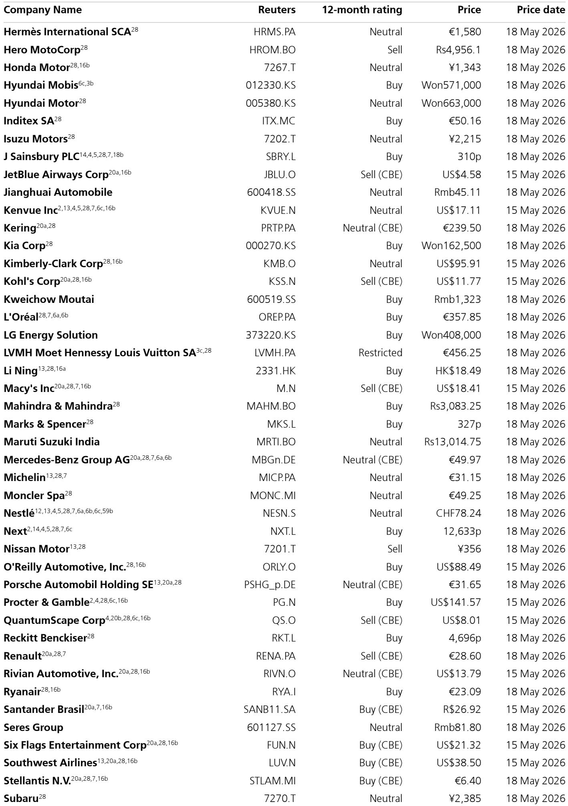
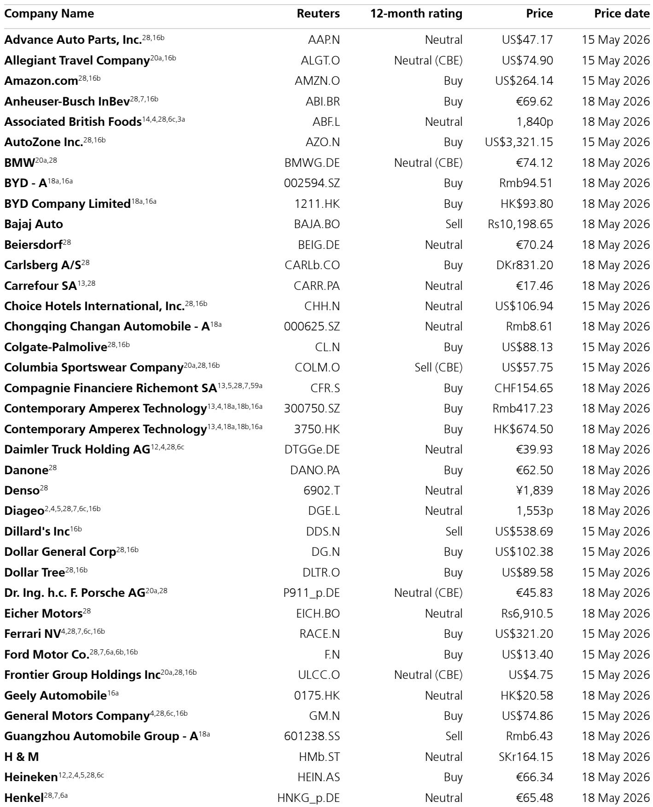
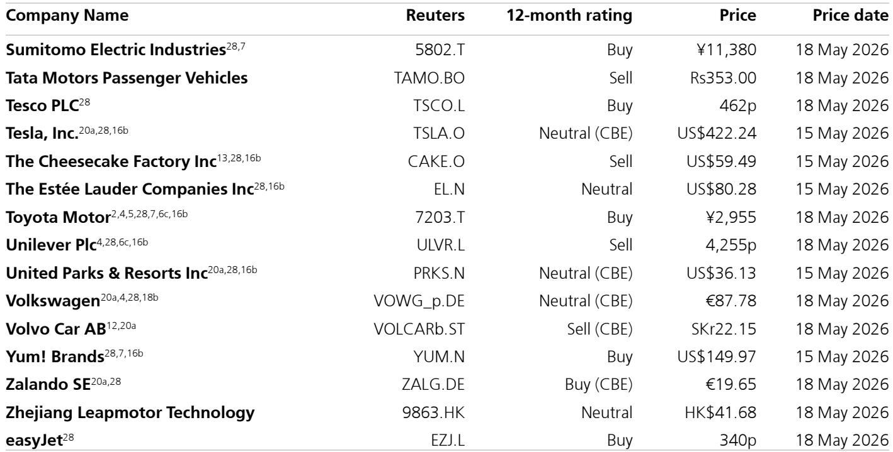

# 全球消费股的机会不在整体，而在被错误定价的角落

这份来自某外资投行的全球策略报告，核心判断并非“消费疲软”，而是“市场正在用同一把尺子衡量所有消费品公司，而其中部分板块的定价错误已经大到难以忽视”。报告长达数十页，覆盖欧洲、美国、中国三大市场，但真正值得产业决策者和投资者关注的信息密度集中在几个被严重低估的细分领域。

报告提出的核心逻辑是：欧洲消费面临多重逆风，但这些逆风已经被过度定价在部分板块的估值中；与此同时，中国消费的结构性拐点正在靠近，而美国低端消费的压力尚未被充分反映。这意味着，全球消费股的投资机会不是来自整体复苏，而是来自对结构性分化——以及市场定价偏差——的精准识别。

以下是我们从这份报告中提炼出的五个关键洞察，以及一个报告尚未完全回答的问题。

## 1. 欧洲消费的逆风并非短期波动，而是三重结构性成本的叠加

报告对欧洲消费的前景判断相当谨慎，但值得注意的不是结论本身，而是其推导逻辑的层次感。报告明确指出，即使地缘冲突明天结束，欧洲消费者仍将面对至少三重结构性成本压力：

第一，能源成本永久性上移。报告预计TTF天然气价格在2026年四季度将比冲突前高出120%，油价在2026年底仍将高出40%。天然气在约60%的欧洲国家中决定电价，而电价本身占CPI约5%。这意味着仅能源一项就可能从消费中抽走约40个基点。

第二，食品价格传导正在形成。化肥价格上涨约30%，而国际货币基金组织的研究表明，化肥价格涨幅中约一半会传导至食品价格。食品在欧盟CPI中权重约14%，因此这一传导路径可能额外推高CPI约50个基点。

第三，利率环境正在逆转。报告预计欧洲将出现两次加息，而冲突前的预期是零次。每次50个基点的加息，根据欧洲央行的经验模型，将对消费产生约30个基点的拖累。

这三项叠加，报告估算消费增长可能比冲突前情景低约2个百分点。但真正关键的是，这些成本并非一次性冲击，而是将在一至两年内逐步释放。这意味着欧洲消费的底部可能比市场当前预期的更晚到来，而非更早。

## 2. 市场对消费股的定价出现了罕见的板块级分歧

报告提供了一个非常有价值的观察框架：不同消费子板块的估值偏离程度差异巨大，而这种差异本身可能就是投资机会的来源。

具体来看，自冲突爆发以来，欧洲和全球家庭用品、全球奢侈品、欧洲零售业的估值已经下降了超过10%。部分板块的市盈率相对市场已经便宜到超过1.5个标准差：包括欧洲和全球家庭用品、饮料、全球奢侈品和欧洲零售业。

但更值得关注的是，这种定价分歧并非均匀分布。消费周期股整体仅以8%的折价交易，接近历史正常水平。而消费必需品的折价则异常深——相对于市场，它们目前有7%的折价，而历史平均水平是25%的溢价。这意味着市场对消费必需品的定价出现了罕见的极端偏离。

报告对此提出了一个值得深思的问题：家庭用品板块经历了所有板块中最大幅度的估值下修，全球范围内便宜了2.5个标准差，欧洲甚至达到2.7个标准差，同时处于严重超卖状态。但报告坦言，“我们难以理解为什么它们被认为比其他任何板块面临更大的颠覆风险。”这背后的潜台词是：市场可能将一些结构性担忧（如Z世代消费习惯变化、GLP-1药物对食品需求的影响、智能代理对非显性品牌的去品牌化）过度放大到了整个板块。

## 3. 奢侈品板块的定价错误可能是当前最清晰的套利机会

报告对奢侈品板块的分析是整份报告中最具说服力的部分之一。核心论据有六点：

第一，中国集群（包括中国大陆及海外消费）占全球奢侈品支出的26%，而报告对中国消费的前景正在转向积极。第二，奢侈品板块相对全球市场的市盈率溢价目前为36%，低于历史正常的45%，便宜了约0.8个标准差。第三，每股收益已经回归趋势线——此前曾高出趋势100%——这意味着盈利增长的基数效应正在消退。第四，市场对奢侈品板块的盈利预期非常保守：共识预期下，奢侈品板块的盈利增速仅比欧洲斯托克指数低2%，接近历史最低水平。第五，美国集群的规模已经接近中国集群，而美国股市的财富效应可能对奢侈品消费产生显著拉动——报告测算，如果美国股市今年以来的涨幅中仅有0.2%被用于购买奢侈品，全球奢侈品支出就将增长约4%。第六，高端硬奢是受生成式AI颠覆影响最小的板块之一，而该板块目前超卖程度达到2.7个标准差。

这六点合在一起，指向一个清晰的结论：奢侈品板块的估值已经反映了一个相当悲观的情景，而实际的基本面演进路径可能远好于此。

## 4. 中国消费的结构性拐点可能比市场预期的更近

报告对中国消费的判断值得关注，不是因为乐观，而是因为其逻辑框架发生了变化。报告的核心论据是：中国房地产市场已经出现企稳迹象，而房地产约占中国家庭财富的60%。如果房价企稳甚至温和回升，将对消费信心产生直接支撑。

此外，报告指出两个正在发生的积极变化：一是工资增速可能从当前的约2%温和加速至约4%；二是通缩环境可能正在结束。这两个因素叠加，将直接改善中国消费者的实际购买力。

报告还提出了一个更长期的判断：中国消费占GDP的比重必须上升。这个判断基于一个无法回避的结构性事实——中国经济增长模式正在从投资驱动转向消费驱动，而这一转型的最终实现必然伴随着消费占比的显著提升。

基于这一框架，报告看好三类标的：一是对中国消费敞口大的全球品牌（如欧莱雅，其17%的销售额来自中国）；二是全球奢侈品板块；三是中国本土消费品牌（如Yum Brands、李宁、茅台）。

## 5. 报告尚未完全回答的关键问题：消费必需品的“颠覆风险”到底有多大？

这是整份报告中最值得进一步探讨的问题。报告指出，消费必需品板块的估值已经便宜到历史极端水平，但同时也承认，这个板块面临“巨大的颠覆性问题”——Z世代的消费偏好变化、GLP-1药物对食品需求的潜在影响、以及智能代理对非显性品牌的去品牌化。

但报告没有回答的是：这些颠覆性因素的量化影响到底有多大？它们是否真的足以解释当前2.5个标准差的估值折价？或者，市场是否正在将这些长期结构性担忧过度定价到短期估值中？

这个问题之所以关键，是因为如果答案是“市场过度定价”，那么消费必需品板块可能正处于一个罕见的价值陷阱反转点；如果答案是“颠覆风险确实被低估”，那么当前的估值折价可能只是更大跌幅的前奏。

报告倾向于前者，但并没有提供足够的数据来支撑这一判断。这正是完整报告中最值得深入阅读的部分——它可能包含更多关于颠覆风险的量化分析、情景假设和敏感性测试。

## 一个值得持续跟踪的观察框架

基于这份报告，我们建议读者建立一个三层观察框架：

第一层：关注估值偏离度。当前消费板块内部的估值分化已经达到历史极端水平。偏离度本身不是买入信号，但它提示我们：市场可能正在犯错。需要进一步验证的是，这种偏离是否反映了基本面的事实，还是情绪的过度反应。

第二层：关注盈利修正的方向。报告特别强调，那些同时满足“估值便宜、买入评级、盈利修正为正”的标的，是最值得关注的。这类标的包括嘉士伯、喜力、玛莎百货等。盈利修正的方向往往比估值水平更能预示股价的后续走势。

第三层：关注结构性分化的拐点。欧洲消费的整体逆风是真实的，但不同子板块的暴露程度不同。奢侈品板块受益于中国和美国两个大市场的结构性变化，而低端美国消费则面临真实工资增长转负、超额储蓄耗尽等多重压力。这种分化意味着，投资决策不能停留在“看好或看空消费”的层面，而必须深入到具体板块和具体公司。

## 欢迎来星球微信群里继续讨论

这份报告中还有一个我们尚未展开的关键问题：欧洲低端消费的逆风是否会蔓延到其他市场？报告对美国低端消费的谨慎态度，与对中国消费的积极判断形成了鲜明对比。这种分化背后的逻辑是否成立，取决于几个尚未验证的假设：中国房地产市场的企稳是否可持续？美国超额储蓄的消耗是否会引发更广泛的消费放缓？这些问题的答案，将直接影响全球消费股的配置方向。

我们将在社群中继续讨论这些未解问题，并分享完整报告的原始图表和详细数据。欢迎加入。

Personal reading notes and learning share only. Not investment advice.

