# Global Strategy

# Rates Map - The real message of global yield curves

# Less central bank gradualism and higher energy prices have a real cost

Higher yields have been the path of least resistance for markets as policymakers have turned cautious on not just asset purchases but also forward guidance and will need time to digest the ongoing energy supply shock. Globally traded liquid bond markets are sending a relatively consistent message, even if the market may be underestimating cross-country differences in economic impact and central bank reaction functions (Figure 4). Last week, 10y rates rose even more than 2y rates, in a break with the underperformance of 2y bonds seen since the Iran conflict started. Investors want higher yields to hold duration risk. This is in line with Bernanke's view that a gradualist approach to monetary policy "may increase the ability of the Fed to affect long-term rates and thus influence economic behaviour." A less gradualist approach in favour of what Bernanke has called a "cold turkey" approach would then lead to higher long-term rates and more volatility.

# Japan re-joins the rates peloton and SNB pricing went to two hikes

Last week was a reminder that Japan has returned as an important driver to global bond markets (Figure 4). A total of 29 bps of Fed hikes is now priced by the Fed's March '27 meeting, but US 10y still rose to $4.60\%$ , crossing our Q2 forecast of $4.50\%$ . Meanwhile US 5y real rates, implied by Treasury Inflation-Protected Securities, rose 33 bps so far in May (to $1.55\%$ ) as the Fed is being repriced in line with stronger US data. Our takeaway from a range of meetings is that especially hedge funds had been positioning for the move higher in US rates and that April's US CPI validated this positioning. But SNB pricing also went to two hikes by Sep '27 as Swiss Q1 flash CPI was better than expected.

# German 10y vs US widens further

The stop on our long 10y bunds is 3.25% and we remain long. We think that the euro area is facing the larger adverse terms-of-trade shock and this limits how hawkish the ECB will get. We still forecast 10y US vs Germany to rise 150 (from 144 currently).

# Neutral on eur country spreads

We remain neutral on Italy, France and Spain against Germany but would not lean against further tightening in spreads. The European Commission is reviewing the escape clause for fiscal rules but we do not see a repeat of the fiscal support granted in the pandemic. That being said, we think that near-term EGB issuance could lead to some modest widening of sovereign rates versus swap rates as EGB issuance is running slightly below its 3y average, but we did not pick up material concerns on US or EUR funding markets in recent client meetings. German 30y yields (at 3.66%) are trading 40 bps above 30y EUR swap rates (at 3.26%), with the spread 17 bps higher year-to-date.

# UK 10y not a buy yet - Receiving June 'BoE

We have been telling clients not to go long UK 10y bonds as we think that political risks had been underpriced. The lesson from the mini budget of Liz Truss is that UK rates can price sharply higher on political uncertainty. There is more: the UK is an energy importer with inflation running above target for a while, so the bond market is also especially vulnerable to higher oil prices or higher US rates.

Clients have been asking how much gilt yields could reprice in response to political developments. As a reference point, we estimate that around 90bps of additional term premium was priced into 10-year gilts in 2022 following Liz Truss's mini-budget. However, at that time the BoE was in the middle of a rapid tightening cycle, which was also pushing up long-term rate expectations. Looking ahead, we think renewed fiscal

# Global Strategy

Global

Reinout De Bock

Strategist

reinout.de-bock@ubs.com

+44-20-7567 0152

Mustafa Oguz Caylan

Strategist

mustafa.caylan@ubs.com

+44-20-7901 5203

Bhanu Baweja

Strategist

bhanu.baweja@ubs.com

+44-20-7568 6833

concerns could add roughly 25–50bps to the term premium at the 10-year tenor from last week Monday's level of \~ 5% (more in the note here).

# Front-end - Stopped out of long SNB Sep '27 but unchanged otherwise

We continue to receive July ECB, June BoE, and 1y1y SEK vs US. We opened a long 1y1y SEK vs USD Tuesday 5 May given the persistent inflation undershoots vs target and relatively soft labour market in Sweden versus a drift up in US rate expectations. We move the target to 180 bps (from 165 bps) and put the new stop at 155 bps. We are also still paying Jun '27 vs Jun '28 Euribor.

# Curves - Adding UK 5s10s steepener to Japan steepener

We added a 5s10s steepener in UK to our 2s10s steepener in Japan (6 months forward). We see scope for a pick-up in rates volatility, some disinflationary impulse to the US economy and flatter 5s30s curve if Fed communication turns less gradualist under Kevin Warsh.

# Recent Notes

Weekly Supply - Deep dive on Euro issuance (15 May)

Client views - Oil vs Fed vs ECB vs Carry vs Political risk (14 May)

UK curve: Higher and steeper for longer (12 May)

2026 Outlook – Iran conflict meets hawkish US (11 May)

AI releases did not lower rates or reduce fiscal risks in '25-26 (8 May)

Not long 10y UK at 4.94% - Rate uncertainty, politics and oil (7 May)

Receive 1y1y SEK versus USD (5 May)

AI - No clear path to lower rates (5 May)

Receiving July ECB at 19 bps, still short June '27 vs June '28 Euribor (30 Apr)

US Refunding - Revising expected '26 coupon supply slightly lower (29 Apr)

Receive BoE June Meeting at 19 bps (29 Apr)

Warsh vs Bernanke Fed - More volatile rates ahead? (28 Apr)

UK Remit Revisions and Supply Chart Pack (23 Apr)

IMF Takeaways - Trading "one transitory shock after another" (20 April)

UK 10y higher for longer: 4.75% at end '26 (from 4.05%) (20 April)

End '26 Forecast: 10y US at 4.25% (4%) - bund at 2.75% (3%) (16 April)

# Summary of views

Figure 1: Open Trades 

<table><tr><td>Market</td><td>Position</td><td>Entry Date</td><td>Entry Level</td><td>Current Level</td><td>Target</td><td>Stop</td><td>Gain (bps)</td></tr><tr><td>USD</td><td>Long 2s7s10s SOFR butterfly</td><td>27-Mar-26</td><td>-8</td><td>1</td><td>-40</td><td>10</td><td>-9</td></tr><tr><td></td><td></td><td></td><td></td><td></td><td></td><td></td><td></td></tr><tr><td>EUR</td><td>Receive July ECB</td><td>30-Apr-26</td><td>19</td><td>14</td><td>0</td><td>28</td><td>5</td></tr><tr><td>EUR</td><td>Long 10y EU vs Germany</td><td>27-Mar-26</td><td>35</td><td>34</td><td>20</td><td>45</td><td>1</td></tr><tr><td>EUR</td><td>Long 10y bunds (%)</td><td>26-Mar-26</td><td>3.00</td><td>3.17</td><td>2.75</td><td>3.25</td><td>-17</td></tr><tr><td>EUR</td><td>Pay June &#x27;27 Euribor vs receive June &#x27;28 Euribo</td><td>21-Mar-26</td><td>-3</td><td>-11</td><td>-30</td><td>-10</td><td>8</td></tr><tr><td></td><td></td><td></td><td></td><td></td><td></td><td></td><td></td></tr><tr><td>GBP</td><td>Long nominal 5s10s steepener</td><td>12-May-26</td><td>45</td><td>47</td><td>65</td><td>30</td><td>2</td></tr><tr><td>GBP</td><td>Receive BoE June Meeting</td><td>29-Apr-26</td><td>19</td><td>9</td><td>0</td><td>30</td><td>11</td></tr><tr><td></td><td></td><td></td><td></td><td></td><td></td><td></td><td></td></tr><tr><td>AUD</td><td>Receive 5y2y (%)</td><td>14-Jan-26</td><td>4.83</td><td>5.12</td><td>4.40</td><td>5.10</td><td>-29</td></tr><tr><td></td><td></td><td></td><td></td><td></td><td></td><td></td><td></td></tr><tr><td>JPY</td><td>Long 6m fwd 2s10s steepener</td><td>09-Feb-26</td><td>64</td><td>98</td><td>100</td><td>55</td><td>34</td></tr><tr><td></td><td></td><td></td><td></td><td></td><td></td><td></td><td></td></tr><tr><td>SEK VS USD</td><td>Receive 1y1y SEK vs USD (%)</td><td>05-May-26</td><td>-1.31</td><td>-1.67</td><td>-1.80</td><td>-1.55</td><td>36</td></tr></table>

Source: Bloomberg, UBS. Note: Target extended and stop revised for SEK vs USD trade on 18-May-26

The Map is our summary on the rates outlook. We would like to thank Deepak Joy and Mehak Bhalla, our research support service professionals in our Hyderabad Research BSC, for assisting in preparing this research report.

# Charts of the week

Figure 2: Month-to-date nominal and real moves in May '26 so far   
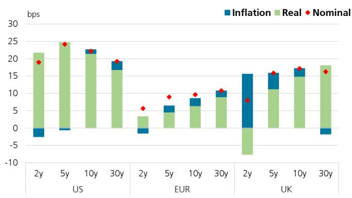

bar

| Region | Maturity | Inflation | Real | Nominal |
|--------|----------|-----------|------|---------|
| US     | 2y       | -3        | 22   | 19      |
| US     | 5y       | -1        | 25   | 24      |
| US     | 10y      | 0         | 23   | 22      |
| US     | 30y      | 1         | 18   | 19      |
| EUR    | 2y       | -2        | 3    | 6       |
| EUR    | 5y       | 6         | 5    | 9       |
| EUR    | 10y      | 8         | 7    | 10      |
| EUR    | 30y      | 10        | 9    | 11      |
| UK     | 2y       | 15        | -8   | 8       |
| UK     | 5y       | 12        | 11   | 16      |
| UK     | 10y      | 16        | 15   | 17      |
| UK     | 30y      | -2        | 18   | 16      |

Source: Bloomberg, UBS

Figure 3: Apr- till now nominal and real moves   
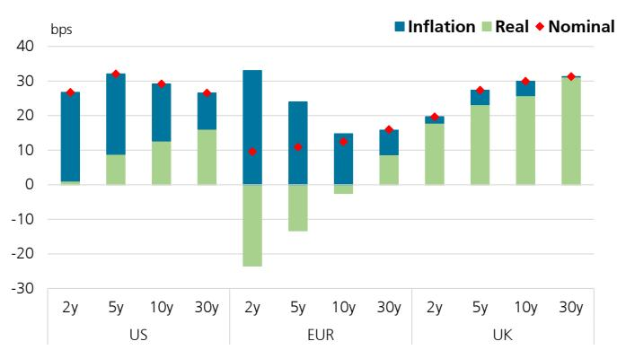

bar_stacked

| Region | Maturity | Inflation (bps) | Real (bps) | Nominal (bps) |
| :--- | :--- | :--- | :--- | :--- |
| US | 2y | 27 | 1 | 27 |
| US | 5y | 28 | 8 | 32 |
| US | 10y | 21 | 12 | 29 |
| US | 30y | 14 | 16 | 26 |
| EUR | 2y | 33 | -24 | 9 |
| EUR | 5y | 24 | -14 | 11 |
| EUR | 10y | 14 | -2 | 14 |
| EUR | 30y | 15 | 8 | 16 |
| UK | 2y | 1 | 18 | 19 |
| UK | 5y | 26 | 22 | 27 |
| UK | 10y | 3 | 25 | 30 |
| UK | 30y | 30 | 30 | 31 |

Source: Bloomberg, UBS

Figure 4: Globally traded liquid yield curves - Japan re-joins the peloton   

line

| Date   | UK 10y | AUD 10y | US10y | IT 10y | FR 10y | CAD 10y | ES 10y | DE 10y | SEK 10y | JP 10y | CNY 10y | Swiss 10y |
|--------|--------|---------|-------|--------|--------|---------|--------|--------|---------|--------|---------|-----------|
| Jan-90 | 13.0   | 12.5    | 9.0   | 8.5    | 8.0    | 7.5     | 12.0   | 9.5    | 8.5     | 6.0    | 7.0     | 7.5       |
| Jul-93 | 9.0    | 8.5     | 7.5   | 7.0    | 6.5    | 6.0     | 11.0   | 8.5    | 7.5     | 4.5    | 5.5     | 6.0       |
| Jan-97 | 7.0    | 6.5     | 6.0   | 5.5    | 5.0    | 4.5     | 9.0    | 6.5    | 5.5     | 3.0    | 4.0     | 4.5       |
| Jul-00 | 5.0    | 4.5     | 4.0   | 3.5    | 3.0    | 2.5     | 6.0    | 4.5    | 3.5     | 1.5    | 2.5     | 3.0       |
| Jan-04 | 3.0    | 2.5     | 2.0   | 1.5    | 1.0    | 0.5     | 4.0    | 2.5    | 1.5     | 0.5    | 1.5     | 2.0       |
| Jul-07 | 4.0    | 3.5     | 3.0   | 2.5    | 2.0    | 1.5     | 5.0    | 3.5    | 2.5     | 1.0    | 2.0     | 2.5       |
| Jan-11 | 6.0    | 5.5     | 4.5   | 4.0    | 3.5    | 3.0     | 7.0    | 5.5    | 4.5     | 2.0    | 3.0     | 3.5       |
| Jul-14 | 4.0    | 3.5     | 3.0   | 2.5    | 2.0    | 1.5     | 4.0    | 3.5    | 2.5     | 1.0    | 2.0     | 2.5       |
| Jan-18 | 2.0    | 1.5     | 1.0   | 0.5    | 0.0    | -0.5    | 2.0    | 1.5    | 1.0     | -1.0   | 1.0     | -0.5      |
| Jul-21 | 3.0    | 2.5     | 2.0   | 1.5    | 1.0    | 0.5     | 3.0    | 2.5    | 2.0     | -0.5   | 2.0     | -1.0      |
| Jan-25 | 4.0    | 3.5     | 3.0   | 2.5    | 2.0    | 1.5     | 4.0    | 3.5    | 3.0     | -1.0   | 3.0     | -1.5      |

Source: Bloomberg, UBS

Figure 5: 10y US vs Germany Spread moves across the Hormuz timeline   
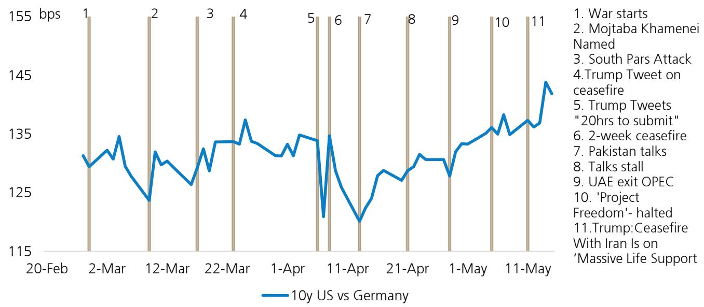

line

| Date       | 10y US vs Germany (bps) |
| ---------- | ------------------------ |
| 20-Feb     | ~130                     |
| 2-Mar      | ~135                     |
| 12-Mar     | ~125                     |
| 22-Mar     | ~135                     |
| 1-Apr      | ~130                     |
| 11-Apr     | ~115                     |
| 21-Apr     | ~125                     |
| 1-May      | ~130                     |
| 11-May     | ~140                     |

Source: Bloomberg, UBS

Figure 6: Timeline on oil pricing   
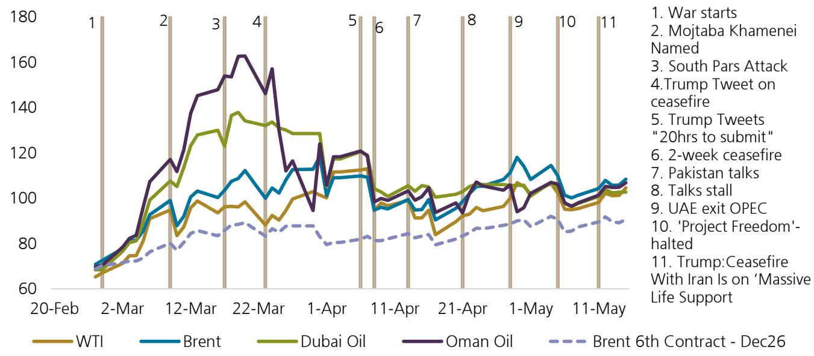

line

| Date       | WTI  | Brent | Dubai Oil | Oman Oil | Brent 6th Contract - Dec26 |
|------------|------|-------|-----------|----------|---------------------------|
| 20-Feb     | ~65  | ~70   | ~70       | ~70      | ~70                       |
| 2-Mar      | ~75  | ~80   | ~80       | ~80      | ~75                       |
| 12-Mar     | ~95  | ~100  | ~110      | ~140     | ~85                       |
| 22-Mar     | ~90  | ~110  | ~130      | ~160     | ~85                       |
| 1-Apr      | ~100 | ~110  | ~120      | ~120     | ~80                       |
| 11-Apr     | ~95  | ~95   | ~100      | ~100     | ~80                       |
| 21-Apr     | ~90  | ~95   | ~100      | ~105     | ~85                       |
| 1-May      | ~100 | ~115  | ~105      | ~105     | ~90                       |
| 11-May     | ~105 | ~105  | ~105      | ~105     | ~90                       |

Source: Bloomberg, UBS

Figure 7: UK Inflation prints hovering around 3% mark   
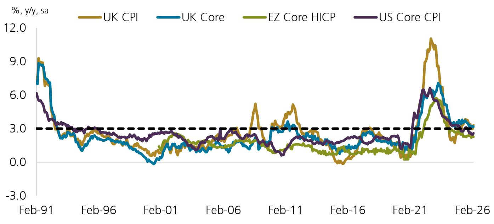

line

| Date    | UK CPI | UK Core | EZ Core HICP | US Core CPI |
|---------|--------|---------|--------------|-------------|
| Feb-91  | 9.0    | 8.5     | 7.0          | 6.0         |
| Feb-96  | 2.5    | 2.0     | 1.5          | 2.0         |
| Feb-01  | 1.0    | 0.5     | 0.0          | 1.5         |
| Feb-06  | 3.0    | 2.5     | 2.0          | 2.5         |
| Feb-11  | 5.0    | 4.5     | 3.5          | 4.0         |
| Feb-16  | 1.0    | 0.5     | 0.0          | 1.5         |
| Feb-21  | 10.0   | 8.0     | 6.0          | 7.0         |
| Feb-26  | 3.0    | 2.5     | 2.0          | 2.5         |

Source: Haver, UBS

Figure 8: ECB Receivers   
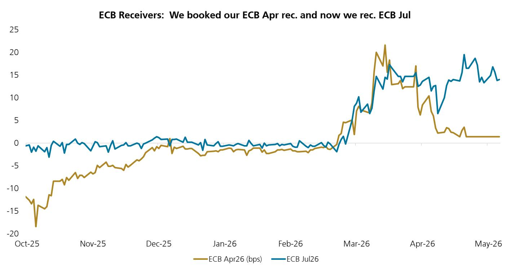

line

| Date    | ECB Apr26 (bps) | ECB Jul26 |
|---------|-----------------|----------|
| Oct-25  | -18             | -1              |
| Nov-25  | -7              | -1              |
| Dec-25  | -1              | 1                |
| Jan-26  | -1              | -1               |
| Feb-26  | -1              | -1               |
| Mar-26  | 5               | 10       |
| Apr-26  | 10              | 15       |
| May-26  | 1               | 14       |

Source: Bloomberg and UBS

Figure 9: We pay June '27 ECB vs receiving June '28 ECB. We think that the EURIBOR market will continue to back load cuts in the 2y "red" segment   
Euribor jun'27 jun'28 spread (so paying jun'27 vs receiving jun'28)   
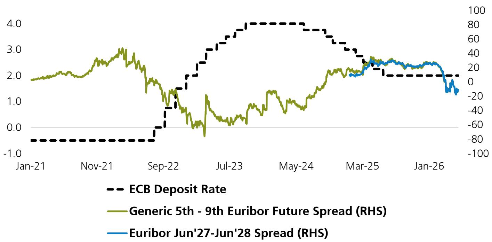

line

| Date    | ECB Deposit Rate | Generic 5th - 9th Euribor Future Spread (RHS) | Euribor Jun'27-Jun'28 Spread (RHS) |
|---------|------------------|-----------------------------------------------|------------------------------------|
| Jan-21  | -0.5             | 1.8                                           | -                                  |
| Nov-21  | -0.5             | 2.5                                           | -                                  |
| Sep-22  | 0.0              | 1.5                                           | -                                  |
| Jul-23  | 3.5              | 0.5                                           | -                                  |
| May-24  | 4.0              | 1.5                                           | -                                  |
| Mar-25  | 3.0              | 2.5                                           | 20                                 |
| Jan-26  | 2.0              | 1.0                                           | -10                                |

Source: Bloomberg and UBS.

Figure 10: YTD nominal and real moves   
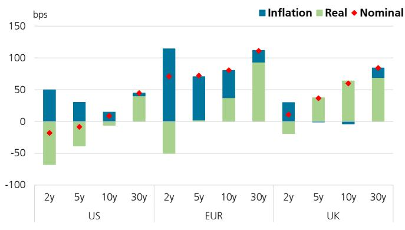

bar_stacked

| Region | Maturity | Inflation (bps) | Real (bps) | Nominal (bps) |
| :--- | :--- | :--- | :--- | :--- |
| US | 2y | 45 | -70 | -20 |
| US | 5y | 30 | -35 | -10 |
| US | 10y | 15 | -5 | 0 |
| US | 30y | 0 | 40 | 45 |
| EUR | 2y | 115 | -50 | 70 |
| EUR | 5y | 70 | 0 | 75 |
| EUR | 10y | 45 | 35 | 80 |
| EUR | 30y | 10 | 90 | 110 |
| UK | 2y | 25 | -20 | 10 |
| UK | 5y | 0 | 5 | 40 |
| UK | 10y | -5 | 60 | 60 |
| UK | 30y | 10 | 70 | 85 |

Source: Bloomberg, UBS

Figure 11: Central bank pricing - Market vs UBSe   
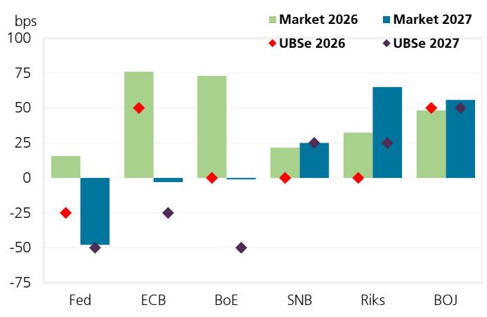

bar

|        | Market 2026 | Market 2027 | UBSe 2026 | UBSe 2027 |
| ------ | ----------- | ----------- | --------- | --------- |
| Fed    | 15          | -40         | -30       | -50       |
| ECB    | 80          | -5          | 50        | -30       |
| BoE    | 80          | -5          | 0         | -50       |
| SNB    | 20          | 30          | -5        | 30        |
| Riks   | 35          | 70          | -5        | 30        |
| BOJ    | 50          | 60          | 55        | 55        |

Source: Bloomberg, UBS

Figure 12: US market-based inflation expectations is expected to peak at 4.4% yoy in June '26 from 3.8% in April and 1y from now inflation (USSWIT1) is priced at 3.4%   
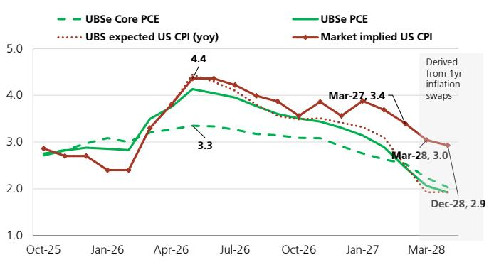

line

| Date    | UBSe Core PCE | UBS PCE | UBS expected US CPI (yoy) | Market implied US CPI |
|---------|---------------|---------|---------------------------|----------------------|
| Oct-25  | ~2.8          | ~2.7    | ~2.8                      | ~2.9                 |
| Jan-26  | ~2.9          | ~2.8    | ~2.8                      | ~2.7                 |
| Apr-26  | ~3.3          | ~4.0    | ~4.0                      | ~4.4                 |
| Jul-26  | ~3.3          | ~3.8    | ~3.8                      | ~4.3                 |
| Oct-26  | ~3.0          | ~3.5    | ~3.5                      | ~3.8                 |
| Jan-27  | ~2.8          | ~3.0    | ~3.0                      | ~3.9                 |
| Mar-28  | ~2.0          | ~2.5    | ~2.5                      | ~3.0                 |
| Dec-28  | ~1.9          | ~2.0    | ~2.0                      | ~2.9                 |

Source: Bloomberg, UBS (incl. estimates)

Figure 13: Euro area market-based inflation peaks around Jan '27 at 4% yoy and 1y inflation expectation (EUSWI1) trades at 3.8%.   
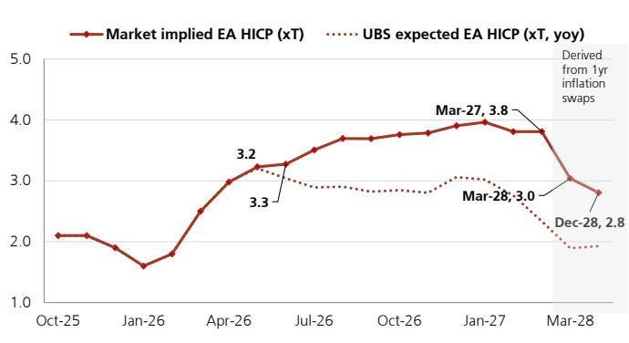

line

| Date    | Market implied EA HICP (xT) | UBS expected EA HICP (xT, yoy) |
|---------|-----------------------------|--------------------------------|
| Oct-25  | 2.1                         | -                              |
| Jan-26  | 1.6                         | -                              |
| Apr-26  | 3.0                         | 3.3                            |
| Jul-26  | 3.5                         | -                              |
| Oct-26  | 3.7                         | -                              |
| Jan-27  | 3.9                         | -                              |
| Mar-27  | 3.8                         | -                              |
| Mar-28  | 3.0                         | -                              |
| Dec-28  | 2.8                         | -                              |

Source: Bloomberg, UBS (incl. estimates)

A record of our current and 12 month historical, Rates trade recommendations is available on UBS Neo or via your UBS sales representative.

# Valuation Method and Risk Statement

Risks of multi-asset investing include but are not limited to market risk, credit risk, interest rate risk, and foreign exchange risk. Correlations of returns among different asset classes may deviate from historical patterns. Geopolitical events and policy shocks pose risks that can reduce asset returns. Valuations may be adversely affected during times of high market volatility, thin liquidity, and economic dislocation. Valuation methods across sectors include DCF, SOTP and multiples analysis.

Options, structured derivative products and futures (including OTC derivatives) are not suitable for all investors. Trading in these instruments is considered risky and may be appropriate only for sophisticated investors. Prior to buying or selling an option, and for the complete risks relating to options, you must receive a copy of "The Characteristics and Risks of Standardized Options." You may read the document at http://www.theocc.com/publications/risks/riskchap1.jsp or ask your salesperson for a copy. Various theoretical explanations of the risks associated with these instruments have been published. Supporting documentation for any claims, comparisons, recommendations, statistics or other technical data will be supplied upon request. Past performance is not necessarily indicative of future results. Transaction costs may be significant in option strategies calling for multiple purchases and sales of options, such as spreads and straddles. Because of the importance of tax considerations to many options transactions, the investor considering options should consult with his/her tax advisor as to how taxes affect the outcome of contemplated options transactions. All options discussed in this report are OTC options.

# Required Disclosures

This document has been prepared by UBS AG London Branch, an affiliate of UBS AG. UBS AG, its subsidiaries, branches and affiliates, including former CS AG and its subsidiaries, branches and affiliates are referred to herein as "UBS".

For information on the ways in which UBS manages conflicts and maintains independence of its UBS Global Research product; historical performance information; certain additional disclosures concerning UBS Global Research recommendations; and terms and conditions for certain third party data used in research report, please visit https://www.ubs.com/disclosures. Unless otherwise indicated, information and data in this report are based on company disclosures including but not limited to annual, interim, quarterly reports and other company announcements. The figures contained in performance charts refer to the past; past performance is not a reliable indicator of future results. Additional information will be made available upon request. UBS Co. Limited is licensed to conduct securities investment consultancy businesses by the China Securities Regulatory Commission. UBS acts or may act as principal in the debt securities (or in related derivatives) that may be the subject of this report. This recommendation was finalized on: 18 May 2026 03:51 PM GMT. UBS has designated certain UBS Global Research department members as Derivatives Research Analysts where those department members publish research principally on the analysis of the price or market for a derivative, and provide information reasonably sufficient upon which to base a decision to enter into a derivatives transaction. Where Derivatives Research Analysts co-author research reports with Equity Research Analysts or Economists, the Derivatives Research Analyst is responsible for the derivatives investment views, forecasts, and/or recommendations. Quantitative Research Review: UBS Global Research publishes a quantitative assessment of its analysts' responses to certain questions about the likelihood of an occurrence of a number of short term factors in a product known as the 'Quantitative Research Review'. Views contained in this assessment on a particular stock reflect only the views on those short term factors which are a different timeframe to the 12-month timeframe reflected in any equity rating set out in this note. For the latest responses, please see the Quantitative Research Review Addendum at the back of this report, where applicable. For previous responses please make reference to (i) previous UBS Global Research reports; and (ii) where no applicable research report was published that month, the Quantitative Research Review which can be found at https://neo.ubs.com/quantitative, or contact your UBS sales representative for access to the report or the Quantitative Research Team on ubs-quant-answers@ubs.com. A consolidated report which contains all responses is also available and again you should contact your UBS sales representative for details and pricing or the Quantitative Research team on the email above.

# Analyst Certification:

Each research analyst primarily responsible for the content of this research report, in whole or in part, certifies that with respect to each security or issuer that the analyst covered in this report: (1) all of the views expressed accurately reflect his or her personal views about those securities or issuers and were prepared in an independent manner, including with respect to UBS, and (2) no part of his or her compensation was, is, or will be, directly or indirectly, related to the specific recommendations or views expressed by that research analyst in the research report.

Research analysts contributing to this report who are employed by any non-US affiliate of UBS LLC are not registered/qualified as research analysts with FINRA. Such analysts may not be associated persons of UBS LLC and therefore are not subject to the FINRA restrictions on communications with a subject company, public appearances, and trading securities held by a research analyst account. The name of each affiliate and analyst employed by that affiliate contributing to this report, if any, follows.

UBS AG London Branch: Bhanu Baweja, Mustafa Oguz Caylan, Reinout De Bock.

Unless otherwise indicated, please refer to the Valuation and Risk sections within the body of this report. For a complete set of disclosure statements associated with the companies discussed in this report, including information on valuation and risk, please contact UBS LLC, 11 Madison Avenue, New York, NY 10010, USA, Attention: Investment Research.

# UBS Global Research Disclaimer

This document has been prepared by UBS AG London Branch, an affiliate of UBS AG. UBS AG, its subsidiaries, branches and affiliates, including former CS AG and its subsidiaries, branches and affiliates are referred to herein as "UBS".

Any opinions expressed in this document may change without notice and are only current as of the date of publication. Different areas, groups, and personnel within UBS may produce and distribute separate research products independently of each other. For example, research publications from UBS CIO are produced by UBS Global Wealth Management. UBS Global Research is produced by UBS Investment Bank. Research methodologies and rating systems of each separate research organization may differ, for example, in terms of investment recommendations, investment horizon, model assumptions, and valuation methods. As a consequence, except for certain economic forecasts (for which UBS CIO and UBS Global Research may collaborate), investment recommendations, ratings, price targets, and valuations provided by each of the separate research organizations may be different, or inconsistent. You should refer to each relevant research product for the details as to their methodologies and rating system. Not all clients may have access to all products from every organization. Each research product is subject to the policies and procedures of the organization that produces it.

# This document is provided solely to recipients who are expressly authorized by UBS to receive it. If you are not so authorized you must immediately destroy the document.

UBS Global Research is provided to our clients through UBS Neo, and in certain instances, UBS.com and any other system or distribution method specifically identified in one or more communications distributed through UBS Neo or UBS.com (each a system) as an approved means for distributing UBS Global Research. It may also be made available through third party vendors and distributed by UBS and/or third parties via e-mail or alternative electronic means.

All UBS Global Research is available on UBS Neo. Please contact your UBS sales representative if you wish to discuss your access to UBS Neo. Where UBS Global Research refers to "UBS Evidence Lab Inside" or has made use of data provided by UBS Evidence Lab and you would like to access that data please contact your UBS sales representative. UBS Evidence Lab data is available on UBS Neo. The level and types of services provided by UBS Global Research and UBS Evidence Lab to a client may vary depending upon various factors such as a client's individual preferences as to the frequency and manner of receiving communications, a client's risk profile and investment focus and perspective (e.g., market wide, sector specific, long-term, short-term, etc.), the size and scope of the overall client relationship with UBS Global Research and UBS Evidence Lab and legal and regulatory constraints. UBS HOLT and UBS Pharma Values are offerings of UBS Global Research. HOLT Lens is a corporate performance platform offering that provides an objective accounting-led framework for comparing and valuing companies and is available to clients of UBS Global Research; for further details and pricing please contact your UBS Sales representative. In particular, HOLT has a variety of warranted prices based on the scenario chosen; please mail UBS LLC, 11 Madison Avenue, New York, NY 10010, USA, Attention: Investment Research, if you are interested in the warranted price on a particular company, again subject to commercial considerations. UBS Pharma Values is an analytical tool that involves the creation of a number of individual product net present value calculations, based on published forecasts of sales for pharmaceuticals, and is available to clients of UBS Global Research; for further details and pricing please contact your UBS Sales representative. For all other specific disclaimers, please see https://www.ubs.com/disclosures.

When you receive UBS Global Research through a system, your access and/or use of such UBS Global Research is subject to this UBS Global Research Disclaimer and to the UBS Neo Platform Use Agreement (the "Neo Terms") together with any other relevant terms of use governing the applicable System.

When you receive UBS Global Research via a third party vendor, e-mail or other electronic means, you agree that use shall be subject to this UBS Global Research Disclaimer, the Neo Terms and where applicable the UBS Investment Bank terms of business (https://www.ubs.com/global/en/investment-bank/regulatory.html) and to UBS's Terms of Use/Disclaimer (https://www.ubs.com/global/en/legalinfo2/disclaimer.html). In addition, you consent to UBS processing your personal data and using cookies in accordance with our Privacy Statement (https://www.ubs.com/global/en/legalinfo2/privacy.html) and cookie notice (https://www.ubs.com/global/en/legal/privacy/users.html).

If you receive UBS Global Research, whether through a System or by any other means, you agree that you shall not copy, revise, amend, create a derivative work, provide to any third party, or in any way commercially exploit any UBS provided via UBS Global Research or otherwise, and that you shall not extract data from any research or estimates provided to you via UBS Global Research or otherwise, without the prior written consent of UBS. You agree not to use UBS Global Research in any artificial intelligence system, without the prior written consent of UBS.

In certain circumstances you may receive UBS Global Research otherwise than in the capacity of a client of UBS and you understand and agree that under these circumstances (i) the UBS Global Research is provided to you for information purposes only; (ii) for the purposes of receiving it you are not intended to be and will not be treated as a “client” of UBS for any legal or regulatory purpose; (iii) the UBS Global Research must not be relied on or acted upon for any purpose; and (iv) such content is subject to the relevant disclaimers that follow.

This document is for distribution only as may be permitted by law. It is not directed to, or intended for distribution to or use by, any person or entity who is a citizen or resident of or located in any locality, state, country or other jurisdiction where such distribution, publication, availability or use would be contrary to law or regulation or would subject UBS to any registration or licensing requirement within such jurisdiction.

This document is a general communication and is educational in nature; it is not an advertisement nor is it a solicitation or an offer to buy or sell any financial instruments or to participate in any particular trading strategy. Nothing in this document constitutes a representation that any investment strategy or recommendation is suitable or appropriate to an investor's individual circumstances or otherwise constitutes a personal recommendation. By providing this document, none of UBS or its representatives has any responsibility or authority to provide or have provided investment advice in a fiduciary capacity or otherwise. Investments involve risks, and investors should exercise prudence and their own judgment in making their investment decisions. None of UBS or its representatives is suggesting that the recipient or any other person take a specific course of action or any action at all. The recipient should carefully read this document in its entirety and not draw inferences or conclusions from the rating alone. By receiving this document, the recipient acknowledges and agrees with the intended purpose described above and further disclaims any expectation or belief that the information constitutes investment advice to the recipient or otherwise purports to meet the investment objectives of the recipient. The financial instruments described in the document may not be eligible for sale in all jurisdictions or to certain categories of investors.

Options, structured derivative products and futures (including OTC derivatives) are not suitable for all investors. Trading in these instruments is considered risky and may be appropriate only for sophisticated investors. Prior to buying or selling an option, and for the complete risks relating to options, you must receive a copy of "The Characteristics and Risks of Standardized Options." You may read the document at https://www.theocc.com/publications/risks/riskchap1.jsp or ask your salesperson for a copy. Various theoretical explanations of the risks associated with these instruments have been published. Supporting documentation for any claims, comparisons, recommendations, statistics or other technical data will be supplied upon request. Past performance is not necessarily indicative of future results. Transaction costs may be significant in option strategies calling for multiple purchases and sales of options, such as spreads and straddles. Because of the importance of tax considerations to many options transactions, the investor considering options should consult with his/her tax advisor as to how taxes affect the outcome of contemplated options transactions.

Mortgage and asset-backed securities may involve a high degree of risk and may be highly volatile in response to fluctuations in interest rates or other market conditions. Foreign currency rates of exchange may adversely affect the value, price or income of any security or related instrument referred to in the document. For investment advice, trade execution or other enquiries, clients should contact their local sales representative.

UBS notes that no globally accepted framework or definition (legal, regulatory or otherwise) currently exists, nor is there a market consensus as to what constitutes an “ESG” (Environmental, Social or Governance) or an equivalent-label, or as to what precise attributes are required for the Information (as defined below) to be defined as ESG or equivalently-labelled. Any information, data or other content including from a third party source contained, referred to herein or used for whatsoever purpose by UBS or a third party (“Information”), in relation to any actual or potential ESG objective, issue or consideration is not intended to be relied upon for ESG classification, regulatory regime or industry initiative purposes (“ESG Regimes”). Nothing in these materials is intended to convey, suggest or indicate that UBS considers or represents any product, service, person or body mentioned in these materials as meeting or qualifying for any ESG classification, labelling or similar standards that may exist under the ESG Regimes. UBS has not conducted any assessment of compliance with ESG Regimes. Parties are reminded to make their own assessments for these purposes.

The value of any investment or income may go down as well as up, and investors may not get back the full (or any) amount invested. Past performance is not necessarily a guide to future performance. Neither UBS nor any of its directors, employees or agents accepts any liability for any loss (including investment loss) or damage arising out of the use of all or any of the Information.

Prior to making any investment or financial decisions, any recipient of this document or the information should take steps to understand the risk and return of the investment and seek individualized advice from his or her personal financial, legal, tax and other professional advisors that takes into account all the particular facts and circumstances of his or her investment objectives.

Any prices stated in this document are for information purposes only and do not represent valuations for individual securities or other financial instruments. There is no representation that any transaction can or could have been effected at those prices, and any prices do not necessarily reflect UBS's internal books and records or theoretical model-based valuations and may be based on certain assumptions. Different assumptions by UBS or any other source may yield substantially different results.

No representation or warranty, either expressed or implied, is provided in relation to the accuracy, completeness or reliability of the information contained in any materials to which this document relates (the "Information"), except with respect to Information concerning UBS. The Information is not intended to be a complete statement or summary of the securities, markets or developments referred to in the document. UBS does not undertake to update or keep current the

Information. Any statements contained in this report attributed to a third party represent UBS's interpretation of the data, information and/or opinions provided by that third party either publicly or through a subscription service, and such use and interpretation have not been reviewed by the third party. In no circumstances may this document or any of the Information (including any forecast, value, index or other calculated amount ("Values")) be used for any of the following purposes:

(i) valuation or accounting purposes;

(ii) to determine the amounts due or payable, the price or the value of any financial instrument or financial contract; or

(iii) to measure the performance of any financial instrument including, without limitation, for the purpose of tracking the return or performance of any Value or of defining the asset allocation of portfolio or of computing performance fees.

By receiving this document and the Information you will be deemed to represent and warrant to UBS that you will not use this document or any of the Information for any of the above purposes or otherwise rely upon this document or any of the Information.

UBS has policies and procedures, which include, without limitation, independence policies and permanent information barriers, that are intended, and upon which UBS relies, to manage potential conflicts of interest and control the flow of information within divisions of UBS and among its subsidiaries, branches and affiliates. UBS does and seeks to do business with companies covered in its research reports. As a result, investors should be aware that the firm may have a conflict of interest that could affect the objectivity of this report. Investors should consider this report as only a single factor in making their investment decision. For further information on the ways in which UBS Global Research manages conflicts and maintains independence of its research products, historical performance information and certain additional disclosures concerning UBS Global Research recommendations, please visit https://www.ubs.com/disclosures.

UBS Global Research will initiate, update and cease coverage solely at the discretion of UBS Global Research Management, which will also have sole discretion on the timing and frequency of any published research product. The analysis contained in this document is based on numerous assumptions. All material information in relation to published research reports, such as valuation methodology, risk statements, underlying assumptions (including sensitivity analysis of those assumptions), ratings history etc. as required by the Market Abuse Regulation, can be found on UBS Neo. Different assumptions could result in materially different results.

UBS Global Research may utilise artificial intelligence tools ("AI Tools") in the preparation of this document. Notwithstanding any such use of AI Tools, this document has undergone human review.

The analyst(s) responsible for the preparation of this document may interact with trading desk personnel, sales personnel and other parties for the purpose of gathering, applying and interpreting market information. UBS relies on information barriers to control the flow of information contained in one or more areas within UBS into other areas, units, groups or affiliates of UBS. The compensation of the analyst who prepared this document is determined exclusively by UBS Global Research management and senior management (not including investment banking). Analyst compensation is not based on investment banking revenues; however, compensation may relate to the revenues of UBS and/or its divisions as a whole, of which investment banking, sales and trading are a part, and UBS as a whole.

For financial instruments admitted to trading on an EU regulated market: UBS (excluding UBS LLC) acts as a market maker or liquidity provider (in accordance with the interpretation of these terms under English law or, if not carried out by UBS in the UK the law of the relevant jurisdiction in which UBS determines it carries out the activity) in the financial instruments of the issuer save that where the activity of liquidity provider is carried out in accordance with the definition given to it by the laws and regulations of any other EU jurisdictions, such information is separately disclosed in this document. For financial instruments admitted to trading on a non-EU regulated market: UBS may act as a market maker save that where this activity is carried out in the US in accordance with the definition given to it by the relevant laws and regulations, such activity will be specifically disclosed in this document. UBS may have issued a warrant the value of which is based on one or more of the financial instruments referred to in the document. UBS and its affiliates and employees may have long or short positions, trade as principal and buy and sell in instruments or derivatives identified herein; such transactions or positions may be inconsistent with the opinions expressed in this document.

Within the past 12 months UBS may have received or provided investment services and activities or ancillary services as per MiFID II which may have given rise to a payment or promise of a payment in relation to these services from or to this company.

Please note that all transactions conducted by UBS are consistent with sanctions regulations imposed by Switzerland, the European Union, the United Nations, the United Kingdom and the United States, per UBS' global sanctions policy. UBS opinion as to future investment worthiness assumes no new sanctions are imposed. US persons are prohibited from purchasing or selling securities of certain companies designated as being associated with the Chinese Military in accordance with the amended US Presidential Executive Order 13959.

United Kingdom: This material is distributed by UBS AG, London Branch to persons who are eligible counterparties or professional clients. UBS AG, London Branch is authorised by the Prudential Regulation Authority and subject to regulation by the Financial Conduct Authority and limited regulation by the Prudential Regulation Authority. Europe: Except as otherwise specified herein, these materials are distributed by UBS Europe SE, a subsidiary of UBS AG, to persons who are eligible counterparties or professional clients (as detailed in the Bundesanstalt für Finanzdienstleistungsaufsicht (BaFin) Rules and according to MIFID) and are only available to such persons. The information does not apply to, and should not be relied upon by, retail clients. UBS Europe SE is authorised by the European Central Bank (ECB) and regulated by the BaFin and the ECB. Germany, Luxembourg, the Netherlands, Belgium and Ireland: Where an analyst of UBS Europe SE has contributed to this document, the document is also deemed to have been prepared by UBS Europe SE. In all cases it is distributed by UBS Europe SE and UBS AG, London Branch. Turkey: Distributed by UBS AG, London Branch. No information in this document is provided for the purpose of offering, marketing and sale by any means of any capital market instruments and services in the Republic of Turkey. Therefore, this document may not be considered as an offer made or to be made to residents of the Republic of Turkey. UBS AG, London Branch is not licensed by the Turkish Capital Market Board under the provisions of the Capital Market Law (Law No. 6362). Accordingly, neither this document nor any other offering material related to the instruments/services may be utilized in connection with providing any capital market services to persons within the Republic of Turkey without the prior approval of the Capital Market Board. However, according to article 15 (d) (ii) of the Decree No. 32, there is no restriction on the purchase or sale of the securities abroad by residents of the Republic of Turkey. Poland: Distributed by UBS Europe SE (spolka z ograniczona odpowiedzialnoscia) Oddzial w Polsce. Where an analyst of UBS Europe SE (spolka z ograniczona odpowiedzialnoscia) Oddzial w Polsce has contributed to this document, the document is also deemed to have been prepared by UBS Europe SE (spolka z ograniczona odpowiedzialnoscia) Oddzial w Polsce. Russia: Prepared and distributed by UBS Bank (OOO). Should not be construed as an individual Investment Recommendation for the purpose of the Russian Law - Federal Law #39-FZ ON THE SECURITIES MARKET Articles 6.1-6.2. Switzerland: Distributed by UBS AG to persons who are institutional investors only. UBS AG is regulated by the Swiss Financial Market Supervisory Authority (FINMA). Italy: Prepared by UBS Europe SE and distributed by UBS Europe SE and UBS Europe SE, Italy Branch. Where an analyst of UBS Europe SE, Italy Branch has contributed to this document, the document is also deemed to have been prepared by UBS Europe SE, Italy Branch. France: Prepared by UBS Europe SE and distributed by UBS Europe SE and UBS Europe SE, France Branch. Where an analyst of UBS Europe SE, France Branch has contributed to this document, the document is also deemed to have been prepared by UBS Europe SE, France Branch. Spain: Prepared by UBS Europe SE and distributed by UBS Europe SE and UBS Europe SE, Spain Branch. Where an analyst of UBS Europe SE, Spain Branch has contributed to this document, the document is also deemed to have been prepared by UBS Europe SE, Spain Branch. Sweden: Prepared by UBS Europe SE and distributed by UBS Europe SE and UBS Europe SE, Sweden Branch. Where an analyst of UBS Europe SE, Sweden Branch has contributed to this document, the document is also deemed to have been prepared by UBS Europe SE, Sweden Branch. South Africa: Distributed by UBS South Africa (Pty) Limited (Registration No. 1995/011140/07), an authorised user of the JSE and an authorised Financial Services Provider (FSP 7328). Saudi Arabia: This document has been issued by UBS AG (and/or any of its subsidiaries, branches or affiliates), a public company limited by shares, incorporated in Switzerland with its registered offices at Aeschenvorstadt 1, CH-4051 Basel and Bahnhofstrasse 45, CH-8001 Zurich. This publication has been approved by UBS Saudi Arabia (a subsidiary of UBS AG), a Saudi closed joint stock company incorporated in the Kingdom of Saudi Arabia under commercial register number 1010257812 having its registered office at Tatweer Towers, P.O. Box 75724, Riyadh 11588, Kingdom of Saudi Arabia. UBS Saudi Arabia is authorized and regulated by the Capital Market Authority to conduct securities business under license number 08113-37. UAE / Dubai: The information distributed by UBS AG Dubai Branch is only intended for Professional Clients and/or Market Counterparties, as classified under the DFSA rulebook. No other person should act upon this material/communication. The information is not for further distribution within the United Arab Emirates. UBS AG Dubai Branch is regulated by the DFSA in the DIFC. UBS is not licensed to provide banking services in the UAE by the Central Bank of the UAE, nor is it licensed by the UAE Securities and Commodities Authority. Israel: This Material is distributed by UBS AG, London Branch. UBS Israel Ltd is a licensed Investment Marketer that is supervised by the Israel Securities Authority (ISA). UBS AG, London Branch and its affiliates incorporated outside Israel are not licensed under the Israeli Advisory Law. UBS may engage among others in issuance of Financial Assets or in distribution of Financial Assets of other issuers for fees or other benefits. UBS AG, London Branch and its affiliates may prefer various Financial Assets to which they have or may have an Affiliation (as such term is defined under the Israeli Advisory Law). Nothing in this Material should be considered as investment advice under the Israeli Advisory Law. This Material is being issued only to and/or is directed only at persons who are Eligible Clients within the meaning of the Israeli Advisory Law, and this Material must not be furnished to, relied on or acted upon by any other persons. United States: Distributed to US persons by either UBS LLC or by UBS Financial Services Inc., subsidiaries of UBS AG; or by a group, subsidiary or affiliate of UBS AG that is not registered as a US broker-dealer (a 'non-US affiliate') to major US institutional investors only. UBS LLC or UBS Financial Services Inc. accepts responsibility for the content of a report prepared by another non-US affiliate when distributed to US persons by UBS LLC or UBS Financial Services Inc. All transactions by a US person in the securities mentioned in this report must be effected through UBS LLC or UBS Financial Services Inc., and not through a non-US affiliate. UBS LLC is not acting as a municipal advisor to any municipal entity or obligated person within the meaning of Section 15B of the Securities Exchange Act (the "Municipal Advisor Rule"), and the opinions or views contained herein are not intended to be, and do not constitute, advice within the meaning of the Municipal Advisor Rule. Canada: Distributed by UBS Canada Inc., a registered investment dealer in Canada and a Member-Canadian Investor Protection Fund, or by another affiliate of UBS AG that is registered to conduct business in Canada or is otherwise exempt from registration. Brazil: Except as otherwise specified herein, this Material is prepared by UBS BB Corretora de Câmbio, Títulos e Valores Mobiliários S.A. (UBS BB CCTVVM) to persons who are eligible investors residing in Brazil, which are considered to be Professional Investors (Investidores Profissionais), as designated by the applicable regulation, mainly the CVM Resolution No. 30 from the 11th of May 2021 (determines the duty to verify the suitability of products, services and transactions with regards to the client's profile). UBS BB CCTVVM is a subsidiary of UBS BB Servicos de Assessoria Financeira e Participacoes S.A. ("UBS BB"). UBS BB is an association between UBS AG and Banco do Brasil (through its subsidiary BB – Banco de Investimentos S.A.), of which UBS AG is the majority owner and which provides investment banking services and coverage in Brazil, Argentina, Chile, Paraguay, Peru and Uruguay. UBS BB CCTVVM is regulated by the Comissao de Valores Mobiliarios (CVM) and by the Central Bank of Brazil. Ombudsman: 0800-940-0266/ https://www.ubs.com/br/pt/ubsbb-investment-bank/ombudsman.html. UBS may hold relevant financial and commercial interest in relation to the company subject to this Research report. Hong Kong: Distributed by UBS Asia Limited. Please contact local licensed persons of UBS Asia Limited in respect of any matters arising from, or in connection with, the analysis or document Singapore: Distributed by UBS Pte. Ltd. [Co. Reg. No.: 198500648C] or UBS AG, Singapore Branch. Please contact UBS Pte. Ltd., an exempt financial adviser under the Singapore Financial Advisers Act (Cap. 110); or UBS AG, Singapore Branch, an exempt financial adviser under the Singapore Financial Advisers Act (Cap. 110) and a wholesale bank licensed under the Singapore Banking Act (Cap. 19) regulated by the Monetary Authority of Singapore, in respect of any matters arising from, or in connection with, the analysis or document. The recipients of this document represent and warrant that they are accredited and institutional investors as defined in the Securities and Futures Act (Cap. 289). Japan: Distributed by UBS Japan Co., Ltd. to professional investors (except as otherwise permitted). Where this report has been prepared by UBS Japan Co., Ltd., UBS Japan Co., Ltd. is the author, publisher and distributor of the report. Distributed by UBS AG, Tokyo Branch to Professional Investors (except as otherwise permitted) in relation to foreign exchange and other banking businesses when relevant. Australia: Clients of UBS AG: Distributed by UBS AG (ABN 47 088 129 613 and holder of Australian Financial Services License No. 231087). For all other recipients: Distributed by UBS Australia Ltd (ABN 62 008 586 481 and holder of Australian Financial Services License No. 231098). This document contains general information and/or general advice only and does not constitute personal financial product advice. As such, the Information in this document has been prepared without taking into account any investor's objectives, financial situation or needs, and investors should, before acting on the Information, consider the appropriateness of the Information, having regard to their objectives, financial situation and needs. If the Information contained in this document relates to the acquisition, or potential acquisition of a particular financial product by a 'Retail' client as defined by section 761G of the Corporations Act 2001 where a Product Disclosure Statement would be required, the retail client should obtain and consider the Product Disclosure Statement relating to the product before making any decision about whether to acquire the product. New Zealand: Distributed by UBS New Zealand Ltd. UBS New Zealand Ltd is not a registered bank in New Zealand. You are being provided with this publication or material because you have indicated to UBS that you are a "wholesale client" within the meaning of clause 4 of schedule 5 of the Financial Markets Conduct Act 2013 of New Zealand (Permitted Client). This publication or material is not intended for clients who are not Permitted Clients (non-permitted Clients). If you are a non-permitted Client you must not rely on this publication or material. If despite this warning you nevertheless rely on this publication or material, you hereby (i) acknowledge that you may not rely on the content of this publication or material and that any recommendations or opinions in such this publication or material are not made or provided to you, and (ii) to the maximum extent permitted by law (a) indemnify UBS and its associates or related entities (and their respective Directors, officers, agents and Advisors) (each a 'Relevant Person') for any loss, damage, liability or claim any of them may incur or suffer as a result of, or in connection with, your unauthorised reliance on this publication or material and (b) waive any rights or remedies you may have against any Relevant Person for (or in respect of) any loss, damage, liability or claim you may incur or suffer as a result of, or in connection with, your unauthorised reliance on this publication or material. Korea: Distributed in Korea by UBS Pte. Ltd., Seoul Branch. This report may have been edited or contributed to from time to time by affiliates of UBS Pte. Ltd., Seoul Branch. This material is intended for professional/institutional clients only and not for distribution to any retail clients. Malaysia: This material is authorized to be distributed in Malaysia by UBS Malaysia Sdn. Bhd (Capital Markets Services License No.: CMSL/A0063/2007). This material is intended for professional/institutional clients only and not for distribution to any retail clients. India: Distributed by UBS India Private Ltd. (Corporate Identity Number U67120MH1996PTC097299) 2/F, 3 North Avenue, Maker Maxity, Bandra Kurla Complex, Bandra (East), Mumbai (India) 400051. Phone: +912261556000. It provides brokerage services bearing SEBI Registration Number: INZ000259830; Merchant Banking services bearing SEBI Registration Number: INM000013101; and Research Analyst services bearing SEBI Registration Number: INH000001204. Name of Compliance Officer Mr Parameshwaran Shivaramakrishnan, Phone: +912261556151, Email: ol-ubs-sec-compliance@ubs.com Registration granted by SEBI, and certification from NISM in no way guarantee performance of the intermediary or provide any assurance of returns to investors. UBS may have debt holdings or positions in the subject Indian company/companies. UBS may have financial interests (e.g. loan/derivative products, rights to or interests in investments, etc.) in the subject Indian company/companies from time to time. Within the past 12 months, UBS may have received compensation for non-investment banking securities-related services and/or non-securities services from the subject Indian company/companies. The subject company/companies may have been a client/clients of UBS during the 12 months preceding the date of distribution of the research report with respect to investment banking and/or non-investment banking securities-related services and/or non-securities services. With regard to information on associates, please refer to the Annual Report at: https://www.ubs.com/global/en/about\_ubs/investor\_relations/annualreporting.html The Research Annual Compliance Report for UBS India Private Limited is available on www.ubs.com/ubssi under Research tab. Taiwan: Except as otherwise specified herein, this material may not be distributed in Taiwan. Information and material on securities/instruments that are traded in a Taiwan organized exchange is deemed to be issued and distributed by UBS Pte. LTD., Taipei Branch, which is licensed and regulated by Taiwan Financial Supervisory Commission. Save for securities/instruments that are traded in a Taiwan organized exchange, this material should not constitute "recommendation" to clients or recipients in Taiwan for the covered companies or any companies mentioned in this document. No portion of the document may be reproduced or quoted by the press or any other person without authorisation from UBS. Indonesia: This report is being distributed by PT UBS Sekuritas Indonesia and is delivered by its licensed employee(s), including marketing/sales person, to its client. PT UBS Sekuritas Indonesia, having its registered office at Sequis Tower Level 22 unit 22-1,Jl.Jend. Sudirman, kav.71, SCBD lot 11B, Jakarta 12190. Indonesia, is a subsidiary company of UBS AG and licensed under Capital Market Law no. 8 year 1995, a holder of broker-dealer and underwriter licenses issued by the Capital Market and Financial Institution Supervisory Agency (now Otoritas Jasa Keuangan/OJK). PT UBS Sekuritas Indonesia is also a member of Indonesia Stock Exchange and supervised by Otoritas Jasa Keuangan (OJK). Neither this report nor any copy hereof may be distributed in Indonesia or to any Indonesian citizens except in compliance with applicable Indonesian capital market laws and regulations. This report is not an offer of securities in Indonesia and may not be distributed within the territory of the Republic of Indonesia or to Indonesian citizens in circumstance which constitutes an offering within the meaning of Indonesian capital market laws and regulations.

The disclosures contained in research documents produced by UBS AG, London Branch or UBS Europe SE shall be governed by and construed in accordance with English law.

UBS specifically prohibits the redistribution of this document in whole or in part without the written permission of UBS and in any event UBS accepts no liability whatsoever for any redistribution of this document or its contents or the actions of third parties in this respect. Images may depict objects or elements that are protected by third party copyright, trademarks and other intellectual property rights. © UBS 2026. The key symbol and UBS are among the registered and unregistered trademarks of UBS. All rights reserved.

# UBS