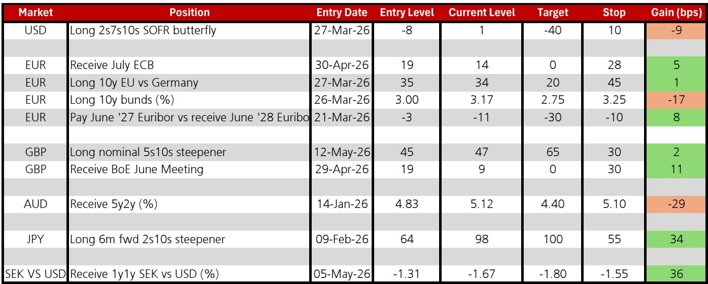
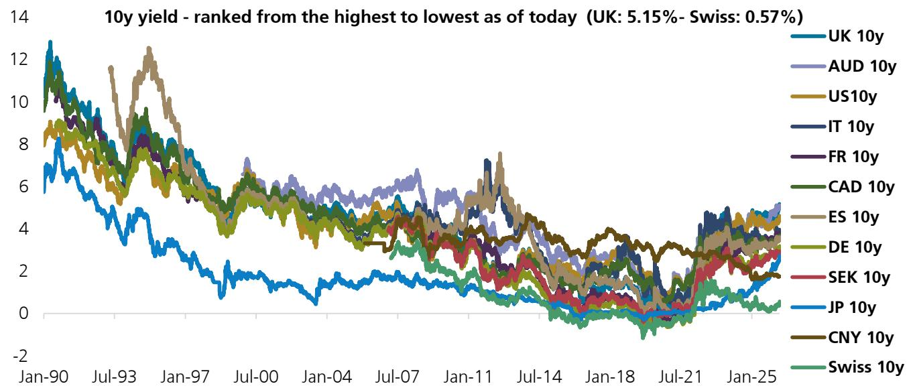

# 全球债券市场正在发出同一个信号：央行“冷火鸡”时代已经开启

过去两周，全球利率市场经历了一次罕见的同步重定价。美国10年期国债收益率突破4.60%，跨过某外资投行此前设定的二季度预测值4.50%；德国10年期与美国的利差继续走阔至144个基点；日本重新成为全球债券市场的关键驱动者；瑞士央行甚至被市场定价为两年内两次加息。这不是零散的技术性波动，而是一个结构性拐点正在形成的信号。

某外资投行最新发布的全球利率策略报告，用一张“全球交易流动性收益率曲线”图，清晰地传达了这样一个判断：全球央行正在放弃渐进主义，转而走向“冷火鸡”式的政策路径。而市场对此的定价，可能才刚刚开始。

报告的核心主张值得每一位关心利率方向、资产配置与债务管理的读者认真对待：**央行渐进主义的退场，叠加能源供给冲击的持续，正在从根本上重塑全球债券的定价逻辑。** 投资者要求的期限溢价正在系统性上升，而不同经济体承受这一冲击的能力差异，将决定未来两年的利率分化格局。

## 1. 期限溢价回归：市场不再相信央行能“平滑”长期利率

过去十年，全球债券市场的一个核心假设是：央行可以通过渐进主义操作，有效控制短期利率，进而影响长期利率，最终平滑经济周期。伯南克本人曾明确支持这一观点，认为渐进主义“可能增强美联储影响长期利率的能力”。但这份报告揭示了一个关键转折：市场正在用真金白银投票，推翻这一假设。

数据显示，上周10年期利率的涨幅甚至超过了2年期利率。这在伊朗冲突以来尚属首次——此前市场一直更担心短期政策收紧，2年期债券持续跑输。但现在，投资者要求更高的收益率来持有久期风险。这意味着市场不再相信央行能通过渐进加息来压低长端利率；相反，他们开始为“冷火鸡”式的政策突变定价——即央行一次性大幅加息，而非逐步微调。

这一变化的含义是深远的。对于企业财务官和资产管理者而言，过去那种“短端波动、长端稳定”的利率环境正在瓦解。未来，长端利率的波动性可能显著上升，而传统的久期对冲策略可能需要重新校准。

## 2. 日本重返全球利率“主车群”：一个被低估的结构性变量

报告中的一个关键洞察是“Japan re-joins the rates peloton”——日本重新加入了全球利率的主车群。过去三十年，日本国债收益率一直是全球利率的“洼地”，其超低利率环境为全球投资者提供了重要的融资和套利来源。但这一格局正在改变。

报告没有详细展开日本央行政策路径的变化，但从图表中可以看出，日本10年期国债收益率已经明显脱离了负值区域，开始与其他主要经济体同步波动。这意味着全球利率的“压舱石”正在松动。对于持有大量日本国债的全球投资者而言，这意味着融资成本的系统性上升；对于新兴市场而言，这意味着套利交易的空间正在收窄。

这里仍需验证的一个关键问题是：日本利率的上升是暂时的周期性调整，还是长期结构性转变？报告没有给出明确答案，但指出日本央行正在成为全球债券市场的重要驱动者——这一点本身就值得高度关注。

## 3. 欧元区的“贸易条件冲击”限制了ECB的鹰派空间

报告对欧元区的判断值得仔细推敲。某外资投行认为，“欧元区正面临更大的不利贸易条件冲击，这限制了ECB能够变得多鹰派。”换句话说，尽管全球利率在上升，但ECB的加息空间可能比市场预期的更窄。

这一判断的逻辑基础是能源价格冲击。欧元区是能源净进口地区，近期油价上涨直接推高了进口成本，压低了实际收入，抑制了内需。在这种背景下，ECB若跟随美联储大幅加息，可能加剧经济下行风险。报告维持对德国10年期国债的多头头寸，止损设在3.25%，目标收益率2.75%——这隐含地表达了“欧元区利率上升空间有限”的观点。

但市场目前对ECB的定价似乎更为鹰派。报告显示，市场定价ECB在2026年累计加息80个基点，而某外资投行的预测仅为50个基点。这一分歧意味着什么？如果市场是对的，欧元区债券可能面临进一步抛售；如果投行是对的，那么当前欧债收益率已经提供了不错的入场机会。

## 4. 英国：政治风险溢价尚未充分定价

报告对英国市场的分析尤其值得关注，因为它提供了一个清晰的“风险溢价”分析框架。某外资投行明确建议客户不要做多英国10年期国债，核心理由是“政治风险被低估了”。

报告以2022年特拉斯“迷你预算”事件作为参照：当时约90个基点的额外期限溢价被定价进了10年期英国国债。当前，投行估计新一轮财政担忧可能为10年期英国国债的期限溢价增加25-50个基点。考虑到英国通胀仍在3%左右徘徊，且英国是能源净进口国，债券市场对油价上涨和美国利率上升的脆弱性更高。

这一分析的启示是：在政治不确定性较高的市场，传统的利率预测模型可能严重低估尾部风险。对于配置英国债券的投资者而言，当前5%左右的收益率看似有吸引力，但可能尚未充分反映政治冲击的潜在幅度。

## 5. 报告尚未完全回答的关键问题：冷火鸡政策的二阶效应

报告提出了一个核心命题——央行从渐进主义转向冷火鸡，将导致更高的长期利率和更大的波动性。但它并未完全展开这一转变的二阶效应。

第一个未解问题是：冷火鸡政策如何影响信用市场和股票估值？如果长期利率快速上升，高杠杆企业的再融资成本将显著增加，信用利差可能走阔。但报告主要聚焦于利率市场，未深入分析这一传导链条。

第二个问题是：冷火鸡政策对不同经济体的影响差异有多大？报告指出“市场可能低估了各国经济影响和央行反应函数的差异”，但并未量化这一差异。例如，美国经济对利率的敏感度可能低于欧元区，因为美国企业更依赖股权融资而非银行贷款。但这一假设仍需验证。

第三个问题是：能源价格的走势是否具有持续性？报告提到了能源供给冲击，但未给出明确的油价预测。如果油价回落，冷火鸡政策的必要性将下降，利率定价逻辑可能逆转。

这些未解问题恰恰是深入阅读完整报告的价值所在。报告提供了大量的图表和交易头寸细节，包括对美联储、ECB、英国央行、瑞士央行、瑞典央行和日本央行的利率路径预测，以及对各类曲线交易策略的具体建议。

## 6. 投资者的观察框架：三个核心变量

基于报告的逻辑，我们建议读者建立一个简化的观察框架，以跟踪市场是否正在验证或证伪报告的核心判断。

第一个变量是期限溢价的走势。如果10年期与2年期利差持续走阔，且长端波动率上升，说明市场确实在为冷火鸡政策定价。反之，如果利差收窄，说明市场仍相信央行能有效控制长端。

第二个变量是各国央行的实际政策路径。报告给出了某外资投行对主要央行2026-2027年的利率预测，与市场定价存在明显差异。跟踪这些差异的变化，可以判断哪一方更接近实际政策走向。

第三个变量是能源价格，尤其是布伦特原油和WTI的走势。报告中的能源价格时间线图清晰展示了伊朗冲突以来油价的波动轨迹。如果油价突破前高，冷火鸡政策的概率将显著上升；如果油价回落，利率市场的压力可能缓解。

这三个变量构成了一个动态的判断框架。读者可以基于自己的风险偏好和投资期限，选择性地关注其中一两个变量，但不要忽略它们之间的相互作用。

---

报告的完整内容还包括对各国曲线交易策略的详细分析、对Euro issuance的深度剖析、以及对美联储主席更替（Kevin Warsh vs Bernanke）可能带来的政策路径变化的讨论。这些内容在本文中无法一一展开，但它们是理解当前利率市场全貌的关键拼图。

如果你对以下问题感兴趣——美联储在Warsh领导下是否会变得更加“冷火鸡”？日本央行的政策正常化是否可持续？英国财政风险的实际定价区间是多少？——欢迎来星球微信群里继续讨论。我们会在群内分享完整的报告解读、原始图表以及每周的市场跟踪更新。

Personal reading notes and learning share only. Not investment advice.

