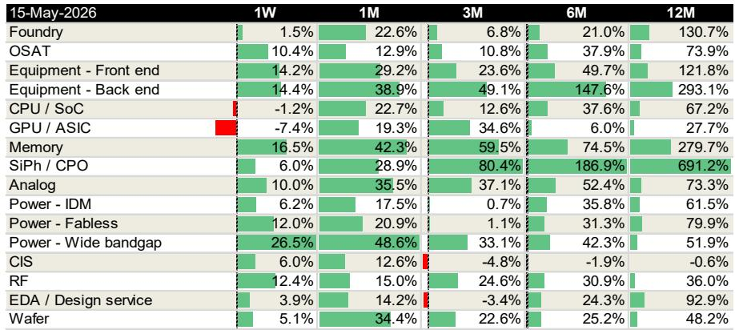
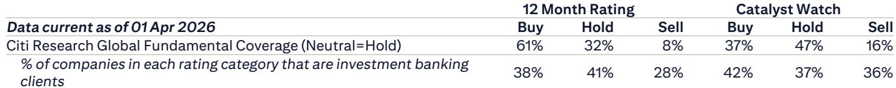
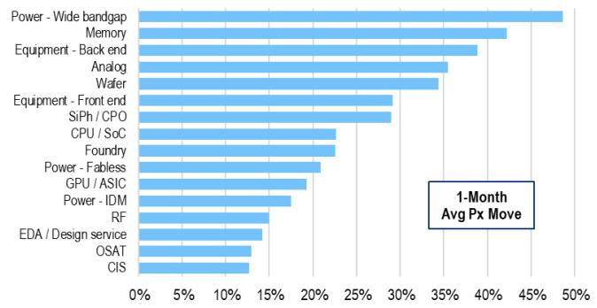

# 市场真正低估的不是H200获批，而是中国存储扩张对设备需求的重新定义

过去一周，中国半导体板块出现了看似矛盾的分化：GPU/ASIC下跌7.4%，而前道设备上涨14.2%，后道设备上涨14.4%，存储板块更是飙升16.5%。市场将GPU下跌归因于H200芯片可能获批对华出口，却忽视了另一个更根本的结构性变化——中国存储制造商的产能扩张正在进入加速期，而这将重新定义本土设备需求的增长曲线。

这份来自某外资投行的周度复盘报告，揭示了几个被短期噪音掩盖的关键信号。我们将其提炼为四个核心判断，供产业决策者和投资者参考。

## 1. H200获批的冲击被高估了，750k片的配额远不足以改变中国AI芯片的供需缺口

市场对H200获批的担忧集中在两点：一是本土AI加速器需求可能被挤压，二是相关代工和设备的国产化进程可能放缓。但这份报告提供了一个关键的量化视角——美国据报已批准向10家中国企业出售H200芯片，每家企业上限7.5万片，合计约75万片。这个数字，与行业预期基本一致。

问题的核心在于：75万片H200，能否满足中国激进的AI算力建设目标？答案是远远不能。中国头部互联网企业的资本开支正在加速扩张：阿里巴巴已将未来3-5年的AI资本开支上调至超出原定3800亿元人民币的水平；腾讯1Q26资本开支同比增长16%至319亿元，并指引2H26继续增加；字节跳动将2026年资本开支上调25%至2000亿元。这些数字叠加在一起，意味着中国对AI芯片的总需求远非75万片H200所能覆盖。

因此，这部分未被满足的需求，仍将通过国产AI加速器来填补。H200的获批，对服务器厂商和澜起科技（内存接口、PCIe retimer需求上行）构成短期利好，但对本土GPU/ASIC、代工厂和设备商的影响，更多是情绪层面的扰动，而非基本面拐点。报告明确提出：H200获批不会改变AI国产化的进程。

这一判断的深层含义在于：中国AI芯片的供需缺口，核心制约因素已经从“能不能买到海外芯片”转向“本土产能能否跟上需求”。而产能的瓶颈，又指向了设备端的国产化能力。

## 2. 存储产能扩张正在成为设备需求最确定的增量来源，而IPO进程是加速器

如果说GPU是市场的关注焦点，那么存储则是被相对低估的暗线。报告指出，中国WFE（晶圆前端设备）供应商中微公司和北方华创正看到需求上行，驱动力来自存储产能的强劲扩张。

两个关键时间节点值得关注：长江存储据报将在6月提交IPO申请；某外资投行预计，长鑫存储的IPO可能在2H26，长江存储在2027年。更重要的是，两家存储制造商都计划在2H26至2027年加速产能扩张。

这意味着什么？从产业逻辑看，存储制造对设备的需求密度极高，且工艺节点相对成熟，适合国产设备快速导入。一旦IPO落地，资本开支将不再受制于自有现金流，扩张速度可能显著超出当前市场预期。报告虽然没有给出具体的产能数字，但“加速”和“需求上行”这两个词，已经暗示了上修的潜力。

对于设备商而言，这不仅是订单量的增长，更是客户结构的升级——从过去的“验证导入”阶段，进入“批量采购”阶段，这意味着收入的可预测性和毛利率的稳定性都将提升。

## 3. 后道设备的重新估值正在发生，TCB和光电子是未被充分定价的催化剂

在设备板块内部，一个更显著的变化发生在后道设备。ASMPT在过去12个月内上涨了293%，但某外资投行仍将其列为首选标的，目标价上调至180港元，基于37倍2027年预期市盈率的峰值估值。

支撑这一估值的，不是简单的周期复苏，而是三个结构性催化剂：一是TCB（热压键合）和AP（先进封装）需求上行，特别是来自HBM和CoW应用的订单；二是OSAT（封测代工）资本开支回升；三是公司可能剥离SMT业务，重新聚焦后道先进封装。

后两点尤其值得展开。OSAT资本开支的回升，意味着封测环节正在从“去库存”转向“补产能”，这是一个行业景气度传导的信号。而SMT业务的潜在出售，如果落地，将使ASMPT成为一家纯粹的先进封装设备供应商，市场将重新给它定价——不再是一个周期性的综合设备商，而是AI驱动的先进封装稀缺标的。

报告还提到了一个尚未被充分讨论的方向：光电子。ASMPT在TCB和光子学领域的机会正在拓宽，这可能是后道设备下一个估值提升的驱动力。但报告没有详细展开，这里仍需验证。

## 4. 模拟芯片的定价权正在转移，但供给侧约束仍是关键变量

模拟芯片板块在报告中被提及，但着墨不多。某外资投行将圣邦微电子列为首选，逻辑是：随着TI和NXP计划新一轮涨价，圣邦微电子有望受益于价格上行，并正在寻求额外的代工产能以满足增量需求。

这一判断的核心假设是：全球模拟芯片的供给正在收紧，AI应用正在占用越来越多的行业产能，从而为非AI应用创造了涨价空间。如果这一逻辑成立，中国模拟芯片厂商将迎来一个难得的“量价齐升”窗口。

但报告没有完全回答的问题是：圣邦微电子的代工产能扩张能否顺利落地？在成熟制程产能整体偏紧的背景下，额外的代工产能能否按时释放，将直接影响其收入增长的确定性。这是需要持续跟踪的变量。

## 报告尚未完全回答的关键问题：设备国产化率的真实上限在哪里？

这份报告对设备需求的判断是乐观的，但有一个关键问题没有被充分讨论：国产设备在存储制造中的渗透率究竟能提升到多高？

从产业常识看，刻蚀、薄膜沉积等核心工艺环节，国产设备已经实现了从0到1的突破，但从1到N的放量过程中，仍面临良率、稳定性和工艺窗口的挑战。报告提到了中微公司和北方华创的需求上行，但没有给出具体的渗透率假设或收入贡献拆分。

此外，一个更深层的问题是：如果存储产能扩张加速，是否会导致设备订单集中释放后的增速回落？换句话说，当前的需求上行是“一次性补库”还是“可持续增长”？这取决于存储制造商最终的实际产能规划，以及终端需求能否消化新增产能。

这些未解问题，恰恰是理解设备板块长期投资价值的核心。欢迎来星球微信群里继续讨论，我们将结合更多产业数据和公司调研信息，持续跟踪这一逻辑的验证情况。

---

Personal reading notes and learning share only. Not investment advice.

