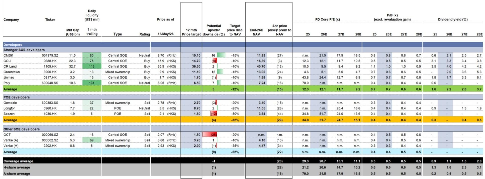
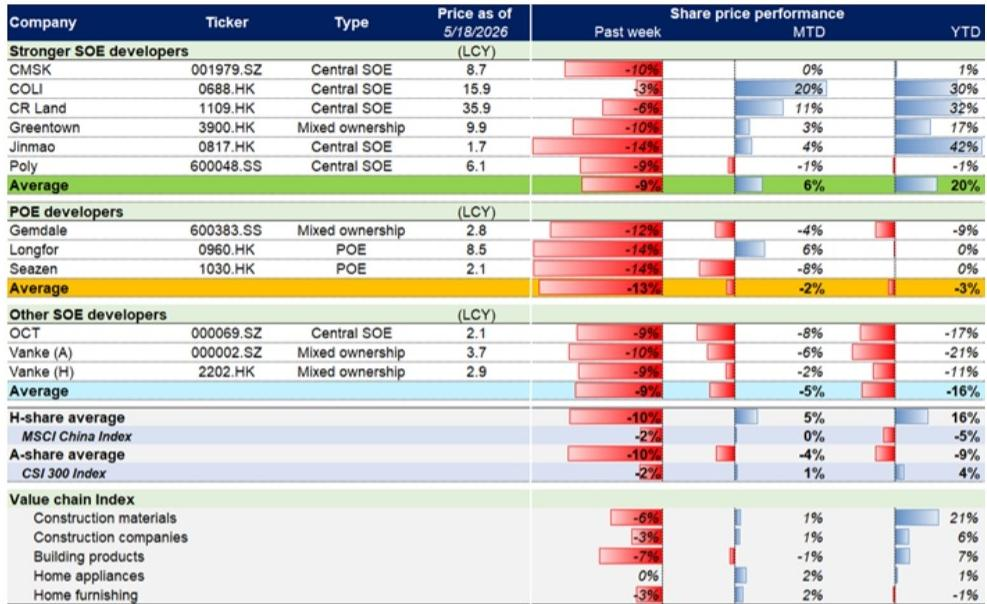
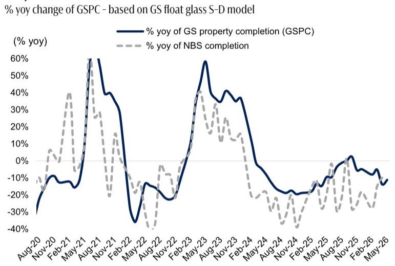

# 市场真正低估的不是成交量反弹，而是供给侧的再定价

过去一周，中国房地产市场出现了一个令人困惑的信号：成交量环比显著回升，但几乎所有领先指标都在走弱。某外资投行最新周度追踪数据显示，第20周新房成交面积环比增长21%，二手房成交面积环比增长32%，同比均实现低两位数增长。然而，同期新房搜索活动环比下降4%，二手房带看量和认购量分别下降5%和4%，中介和业主的价格预期指数也同步回落。

这组数据指向一个核心判断：当前市场正在经历的不是趋势性复苏，而是一次由政策脉冲驱动的短期放量，其可持续性正受到供给端结构性压力的根本制约。真正值得投资者关注的，不是周度成交的起伏，而是供给侧的再定价——库存去化周期的延长、竣工交付的持续萎缩、以及土地市场对新开工的硬约束，正在重塑整个行业的估值锚。

这份报告的核心价值在于，它提供了一组相互印证的证据链，揭示了“量价背离”背后的结构性逻辑。以下是我们提炼出的五个关键洞察。

## 1. 成交量的周度反弹掩盖了领先指标的系统性走弱

从表面看，第20周的数据令人鼓舞。新房成交面积环比增长21%，同比增长11%；二手房成交面积环比增长32%，同比增长12%。五月至今的中位数数据也显示，新房成交环比3月增长3%。这些数字很容易被解读为市场触底信号。

但报告的真正洞察在于领先指标的全面走弱。新房搜索活动环比下降4%，这是一个前瞻性指标，通常领先实际成交1-2周。二手房认购量和带看量分别下降4%和5%，意味着未来几周的成交动能可能减弱。更关键的是，中介价格指数（CSI）和业主报价指数（CAI）均环比下降，前者下降1.0个百分点，后者下降0.2个百分点——这直接指向市场参与者的价格预期正在重新转弱。

这意味着什么？周度成交的反弹更像是一次“积压需求释放”，而非新增需求的入场。在政策窗口期（如广州推出的多项支持措施）的刺激下，部分观望买家加速入市，但整体需求池并未扩大。对于投资者而言，关注焦点应从成交量的绝对水平转向成交的“质量”——即成交是否伴随着价格预期的改善。目前来看，答案是否定的。

## 2. 库存去化周期仍处于历史高位，结构性压力未解

报告显示，第20周库存余额环比微降0.3%，但库存去化月数仍高达28.5个月，高于4月29.3个月的均值。这一数字是理解市场真实状况的关键。

28.5个月的库存去化周期意味着，即使在不新增供应的前提下，现有库存也需要超过两年才能完全消化。这与历史上市场出清时的库存水平（通常在15-18个月）相去甚远。更重要的是，库存结构正在恶化：一线城市库存去化周期约23个月，二线城市约24个月，三线城市高达30个月。低线城市的高库存压力并未缓解。

报告没有完全展开的一个关键问题是：库存去化周期何时才能降至健康水平？答案取决于两个变量——销售速度和新增供应。当前销售速度难以持续加速，而新增供应虽然在减少（新开工面积同比大幅下降），但存量库存的消化需要时间。对于开发商而言，这意味着未来几个季度仍将面临“去库存”与“保现金流”的双重压力，资产减值风险并未消除。

## 3. 竣工端持续萎缩，对上下游产业链的传导效应正在深化

报告中的GSPC（GS地产竣工追踪指标）揭示了一个被市场低估的趋势：五月至今的竣工面积同比降幅达到高十几个百分点，而全年预期降幅仅为1%。这意味着竣工的“硬着陆”正在发生。

竣工数据的重要性在于，它直接关联到房地产上下游产业链的需求。玻璃、水泥、家电、装修等行业的订单量高度依赖竣工节奏。报告通过浮法玻璃供需模型推导竣工数据，本身就说明了这种关联性。当竣工面积以两位数速度下降时，相关行业的收入预期和产能利用率都将面临压力。

这里需要特别关注一个二阶效应：竣工下降意味着期房交付周期延长，这会进一步削弱购房者对期房的信心，从而抑制新房需求。报告没有完全展开这一逻辑，但这是理解“销售-开工-竣工”负反馈循环的关键。对于投资者而言，竣工数据的持续恶化意味着房地产相关板块（尤其是建材、家居、装修）的盈利预测仍有下调风险。

## 4. 估值已接近历史底部，但“便宜”不等于“没有进一步下行空间”

报告显示，覆盖的开发商股票在第20周平均下跌9%-13%，其中民营开发商跌幅最大。目前离岸覆盖的开发商平均交易在2026年末预期净资产价值（NAV）的22%折让，对应0.6倍2026年预期市净率（P/B）；在岸覆盖的开发商平均交易在18%折让，对应0.5倍2026年预期P/B。

这些估值水平确实接近历史底部。报告对比了2008年下半年、2011年下半年和2014年上半年的估值低谷，当前P/B倍数已低于这些历史低点。但问题在于：历史底部是否具有参考意义？

答案可能是否定的。当前行业面临的不是周期性低谷，而是结构性转型——从“增量扩张”到“存量提质”的模式切换。这意味着资产价值的定价逻辑正在改变。过去，NAV折让反映的是市场对周期底部的过度悲观；现在，NAV本身可能面临下调风险，因为土地价值、在建项目价值、以及未来现金流预期都在重新评估。报告没有明确说这一点，但数据隐含了这一判断：当库存去化周期超过两年、新开工持续萎缩时，开发商手中的资产价值需要重新定价。

对于价值投资者而言，低估值提供了安全边际，但“安全边际”的大小取决于NAV假设的合理性。报告中的估值数据是一个起点，但投资者需要自行判断NAV是否已经充分反映了供给侧的再定价。

## 5. 报告尚未完全回答的关键问题：政策效果能否从“脉冲”转为“趋势”

报告提到了多项政策动态：国务院常务会议重申城市更新作为政策重点，广州推出了包括“自持物业可转可售”在内的多项支持措施，南沙区国企启动了30亿元的“以旧换新”计划。这些政策方向是正确的，但效果有待验证。

这里有一个核心问题尚未解决：政策刺激能否从“脉冲式放量”转化为“趋势性修复”？从领先指标走弱来看，答案并不乐观。广州的“以旧换新”计划覆盖全市，但收购条件限制在房龄30年以内的房屋，且仅限南沙区8个项目的新房购买。这种局部性、条件性的政策，其乘数效应有限。

更根本的问题是，当前政策主要作用于需求端（降低购房门槛、提供置换便利），但供给端的结构性压力（高库存、低竣工、弱新开工）并未得到直接缓解。国务院常务会议提出的城市更新方向是正确的，但城市更新项目通常周期长、资金需求大、回报不确定，短期内难以成为市场的主要驱动力。

对于读者而言，需要建立一套观察框架来跟踪政策效果的持续性：核心指标不是周度成交量，而是二手房挂牌量的变化趋势（反映供给压力）、库存去化周期的月环比变化（反映供需平衡）、以及新开工面积的同比降幅是否收窄（反映开发商信心）。只有当这三个指标同时改善时，才能确认市场正在走出底部。

---

以上五个洞察只是这份报告的一部分。报告中还有大量关于不同城市层级的分化数据、开发商之间的估值差异、以及具体公司的评级和价格目标，这些信息对于做出具体的投资决策至关重要。例如，报告指出“更强国企开发商”股价表现优于“民营开发商”和其他国企开发商，这一分化趋势是否可持续？不同城市之间的库存结构差异如何影响开发商的项目价值？这些问题的答案都隐藏在报告的完整数据和图表中。

欢迎来星球微信群里继续讨论。我们将分享完整的报告原文、原始数据图表，以及我们对未解问题的持续跟踪。特别是关于“库存去化周期何时降至健康水平”和“政策效果能否从脉冲转为趋势”这两个关键问题，我们会在群里定期更新领先指标的变化，并分享我们的分析框架。期待与大家一起深入探讨。

Personal reading notes and learning share only. Not investment advice.

