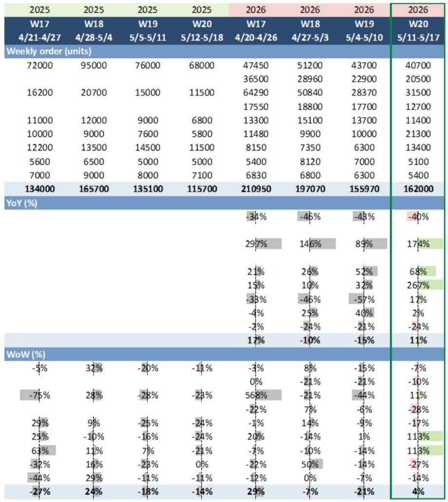
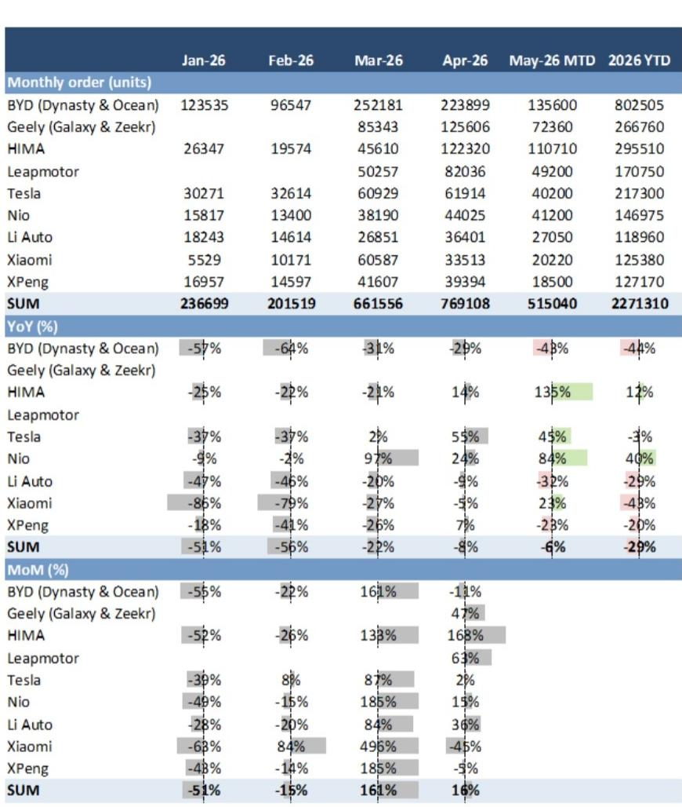
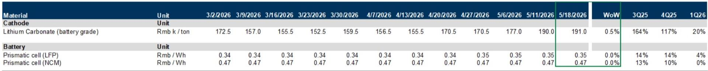

# New Model Launches Are Reshaping China's NEV Competitive Dynamics, But the Real Signal Lies in Who Can Sustain Momentum Beyond the Launch Window

China's new energy vehicle market entered Week 20 of 2026 with a clear rebound: aggregate weekly orders rose 4% week-over-week and 11% year-over-year. On the surface, this is a straightforward recovery narrative. The deeper story, however, is far more instructive for anyone trying to understand where the market is headed. The rebound was not broad-based. It was concentrated among a small set of brands that successfully launched new models during the period. Nio and Li Auto each posted 113% week-over-week order growth. HIMA, the Huawei-backed ecosystem, grew 11% week-over-week. Meanwhile, market leader BYD saw orders decline 7% week-over-week, and Xiaomi dropped 27%. The divergence tells us something critical: in a market approaching 60% NEV penetration, the era of rising tides lifting all boats is over. What matters now is product cycle precision, not aggregate market growth.

This is not a temporary blip. The data from the first 10 days of May shows NEV retail penetration at 55.5%, down from 62.8% in April. Wholesale penetration stood at 60.3%, up from 57.3%. These numbers suggest the market is oscillating around a new equilibrium rather than climbing a linear adoption curve. For investors and strategists, the implication is clear: the next phase of competition will be defined by who can execute product launches with surgical timing, manage pricing discipline, and avoid the trap of perpetual discounting that is now squeezing the internal combustion engine segment.

The following analysis unpacks what the Week 20 data reveals about the structural forces reshaping China's NEV market, where the risks are most acute, and how decision-makers should adjust their frameworks.

## The Week 20 Rebound Exposes a Two-Tier Market Where Launch Execution, Not Brand Scale, Drives Short-Term Momentum

The most striking feature of the Week 20 data is the stark divergence between brands that launched new models and those that did not. Nio and Li Auto both tripled their weekly orders. For Nio, this was driven by the ONVO L80 launch. For Li Auto, it was the L9 facelift. HIMA's 11% week-over-week growth, while more modest in percentage terms, came on a much larger base and was supported by the Luxeed V9 EREV MPV launch. These are not incremental improvements. They are step-function changes in weekly order intake that reflect the concentrated demand pull that a well-timed new model can generate in a market that is otherwise showing signs of demand saturation.

Consider the counterfactual. BYD, the dominant player with a year-to-date order total of over 800,000 units, saw its weekly orders decline 7% week-over-week. Xiaomi, which generated enormous buzz with its SU7 launch cycle earlier in the year, posted a 27% weekly decline. XPeng dropped 14%. These brands are not failing. They are simply not enjoying the temporary demand spike that accompanies a new model introduction. The lesson is that in a market where NEV penetration has stabilized in the mid-50s to low-60s range, aggregate demand is no longer expanding fast enough to lift all competitors simultaneously. Growth is becoming a zero-sum game during any given week: the orders that go to a new model launch are orders that do not go to an incumbent model.

This dynamic has profound implications for production planning, inventory management, and dealer network incentives. Brands that launch new models must be prepared for a surge that will likely normalize within four to six weeks. Brands that are between product cycles must resist the temptation to over-discount in response to competitors' launch momentum, because the discounting data suggests that strategy is already yielding diminishing returns.

## NEV Discounts Are Widening While ICE Discounts Narrow, Signaling a Strategic Trap for Brands That Mistake Price Cuts for Demand Generation

The pricing data in the Week 20 report reveals a counterintuitive pattern. NEV dealer discounts widened to 7.61% of MSRP as of May 16, up from 7.45% a week earlier. ICE dealer discounts, by contrast, narrowed to 19.50% from 19.72%. At first glance, this looks like NEV brands are losing pricing power while ICE brands are stabilizing. The reality is more nuanced and more worrying for the NEV segment.

The ICE discount narrowing is not a sign of strength. It is a sign that ICE dealers have already cut prices to the bone. At 19.50% off MSRP, many ICE models are being sold at or below breakeven. The narrowing simply means there is no more room to cut. For NEV brands, the widening discount to 7.61% is still well below the ICE level, but the trend direction is what matters. NEV discounts are heading up while the overall market penetration rate is hovering near all-time highs. This combination suggests that NEV brands are increasingly using price as a competitive weapon, not because they need to stimulate category adoption, but because they need to steal share from each other.

BYD's discount level is instructive. At 4.48% as of May 16, unchanged from the prior week, BYD is maintaining remarkable pricing discipline. This is consistent with a brand that has sufficient scale and product breadth to avoid the discounting trap. The smaller players, particularly those between product cycles, face a more difficult choice. If they discount to defend market share, they compress margins. If they hold pricing, they risk losing share to a competitor that launches a compelling new model. The Week 20 data suggests that the optimal strategy is to avoid being caught between product cycles altogether. This places a premium on product development speed and launch cadence.

For investors, the widening NEV discount trend is a signal to scrutinize margin trajectories more carefully than order volume. A brand that grows orders by 10% while increasing discounts by 50 basis points is destroying value, not creating it.

## The Upstream Battery Market Shows Stability That Masks a Deeper Structural Risk for OEMs with Limited Pricing Power

Battery-grade lithium carbonate prices rose to 191,000 RMB per ton, up 0.5% week-over-week. Prismatic LFP and NCM cell prices were stable. On its face, this is benign. Raw material costs are not accelerating, and cell prices are not rising. For NEV OEMs, this should be a relief. The problem is that this stability may not last, and the OEMs least able to absorb a cost shock are the same ones most dependent on new model launches to drive orders.

The relationship between battery costs and OEM profitability is well understood. What is less appreciated is that the brands with the strongest order momentum in Week 20 -- Nio, Li Auto, and HIMA -- are also the brands with the most exposure to premium battery chemistries and the least ability to pass through cost increases without dampening demand. Nio's battery-as-a-service model creates a unique cost structure, but it also means that any increase in battery costs directly pressures the economics of the subscription offering. Li Auto's extended-range electric vehicle strategy reduces battery pack size, which provides some insulation, but the L9 facelift still requires a substantial battery investment.

The broader point is that upstream cost stability should not be mistaken for a structural advantage. The NEV market is approaching a point where battery costs will become a differentiating factor between winners and survivors. Brands that have locked in long-term supply agreements at favorable prices, or that have invested in vertical integration, will have strategic flexibility. Brands that are buying spot or relying on short-term contracts will face margin compression precisely when they need to invest most heavily in new model development to maintain order momentum.

## What the Report Does Not Fully Answer: The Sustainability of Launch-Driven Growth and the Risk of Demand Pull-Forward

The Week 20 data is rich in detail about what happened, but it leaves several critical questions unresolved. The most important is whether the order spikes from new model launches represent genuine incremental demand or simply demand that has been pulled forward from future weeks. When a brand like Nio triples its weekly orders, some of those orders are coming from customers who would have bought in Week 21 or Week 22 anyway. The launch simply accelerated their decision. If this pull-forward effect is large, then the week-over-week growth in Week 20 will be followed by a corresponding decline in the subsequent weeks.

The report does not provide the data needed to distinguish between these two scenarios. It shows weekly orders, but it does not show order cancellation rates, conversion rates from order to delivery, or the trajectory of order intake in the weeks following a launch. These are the metrics that separate a successful product launch from a one-time demand spike. Without them, it is impossible to know whether Nio's 113% growth is a signal of sustained momentum or a statistical artifact that will reverse in Week 21.

Another unresolved question is the extent to which the NEV market is becoming seasonal in ways that are not yet captured by year-over-year comparisons. The year-over-year order growth for the aggregate market was 11% in Week 20, but the year-to-date order total is down 29% compared to the same period in 2025. This massive gap between weekly and year-to-date performance suggests that the market is experiencing significant volatility that is not well explained by any single factor. It could be related to policy changes, macroeconomic conditions, or simply the lumpy nature of new model launch schedules. The report does not offer a framework for decomposing this volatility, which limits its usefulness for forward-looking decision-making.

## A Decision Framework for Navigating the Post-Penetration NEV Market

For readers who need to translate this data into actionable strategy, the following framework is designed to identify where the risk and opportunity lie in the current environment. It is organized around three questions that every NEV stakeholder should be asking.

First, where is your brand in its product cycle? The Week 20 data makes clear that the single most important determinant of short-term order performance is whether a brand has recently launched a new model. Brands that are in the launch window should prioritize fulfillment speed and quality control, because the window of peak demand is narrow. Brands that are between launches should resist the temptation to match competitors' discounting. The data shows that discounting is widening across the NEV segment, but the brands with the strongest order growth are not the ones with the deepest discounts. They are the ones with the newest products.

Second, what is your discount-to-margin ratio? The widening NEV discount trend means that every percentage point of discounting has a direct and immediate impact on gross margin. A brand that discounts 7.6% on a vehicle with a 15% gross margin is sacrificing half of its margin to generate demand. This is sustainable only if the discounting leads to volume gains that drive economies of scale or if it clears inventory that would otherwise become obsolete. In the current environment, where new model launches are occurring at a rapid pace, inventory obsolescence risk is real. But brands should calculate the cost of discounting explicitly and compare it to the cost of carrying inventory.

Third, what is your battery cost exposure relative to your pricing power? The stability in upstream battery prices is temporary. Lithium carbonate prices have shown significant volatility in recent years, and the current level of 191,000 RMB per ton is well below historical peaks but also well above the lows. Brands that have not hedged their battery cost exposure or secured long-term supply agreements are taking a significant risk. The brands with the strongest order momentum in Week 20 are also the brands with the most to lose if battery costs rise, because their pricing power is tied to product novelty rather than brand loyalty.

This framework is not a substitute for detailed financial modeling. It is a lens for interpreting the weekly data and identifying which signals deserve deeper analysis. The Week 20 report provides the raw material. The framework provides the structure for turning that material into judgment.

## The Open Questions That Make the Full Report Worth Reading

The most valuable research does not just answer questions. It raises better ones. The Week 20 chartbook does this implicitly by presenting data that reveals patterns without fully explaining them. For readers who want to go deeper, several questions remain unanswered and are worth pursuing in the full report.

How much of the order growth from new model launches is cannibalizing the same brand's existing models? Nio's 113% weekly growth is impressive, but if most of those orders came from customers who would have bought an older Nio model, then the net benefit to the brand is much smaller than the headline number suggests.

What is the relationship between dealer discount levels and order conversion rates? The report shows that discounts are widening, but it does not show whether deeper discounts actually convert more orders. If the price elasticity of demand is low, then discounting is simply destroying margin without generating volume.

How do the Week 20 order patterns compare to the same period in previous years when similar new model launches occurred? The year-over-year comparison is useful, but it would be more informative to compare the launch-driven order spikes in 2026 to the launch-driven spikes in 2025 to see whether the magnitude of the effect is diminishing over time.

These are not gaps in the report. They are the natural next questions that arise from careful reading. The full report contains the charts and data that make it possible to begin answering them.

Join the community to read the full report and review the original charts.

*This article is for learning and discussion only and does not constitute investment advice.*

Personal reading notes and learning share only. Not investment advice.

