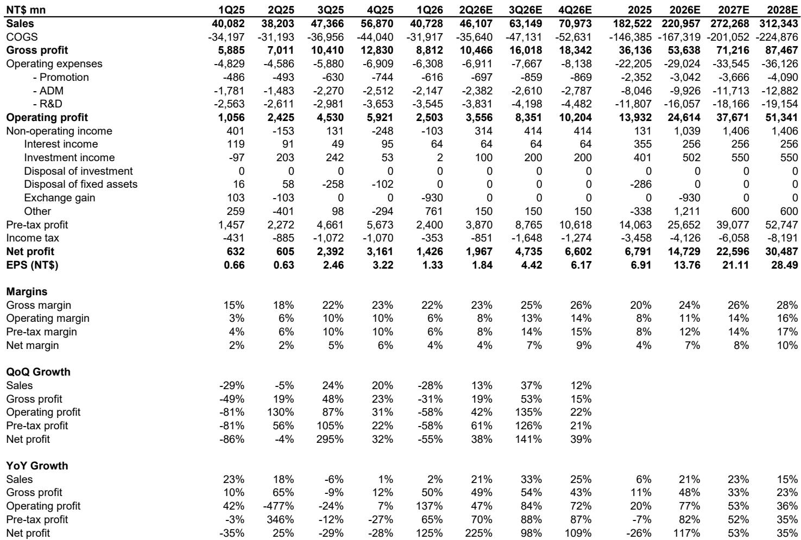
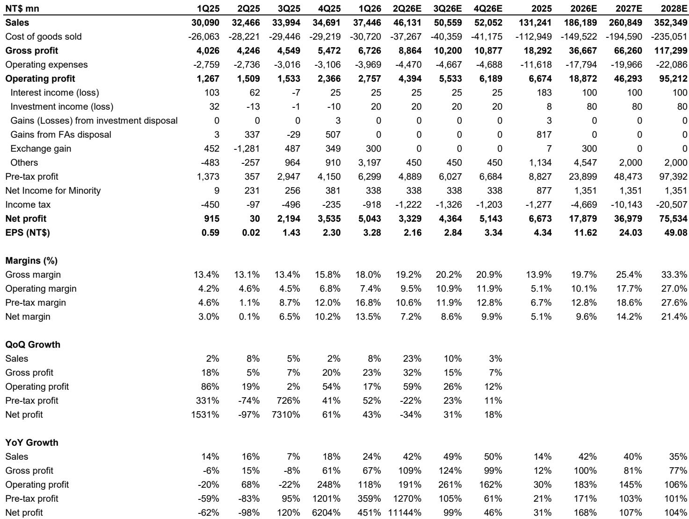
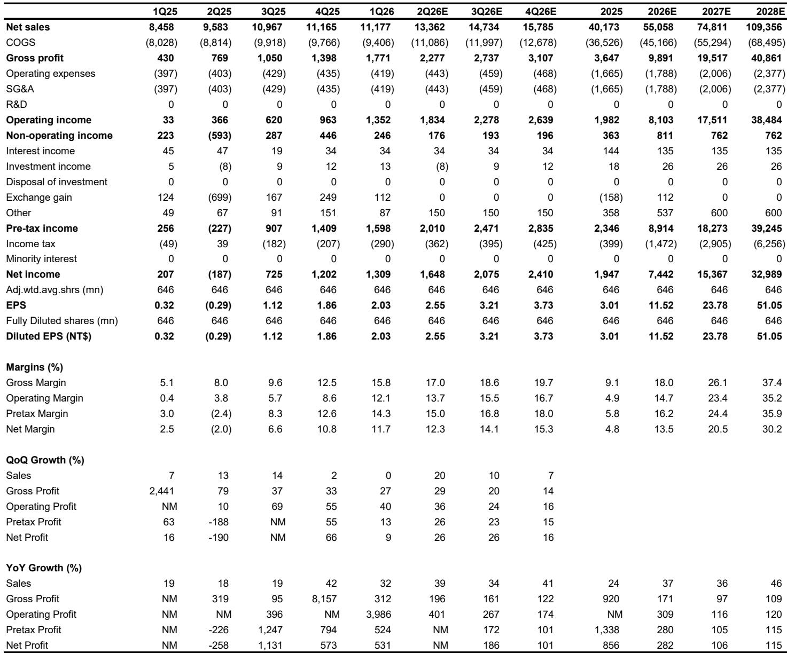

# ABF基板供需缺口正在被AI重新定价，而非被产能扩张解决

过去三个月，某外资投行覆盖的两只ABF基板龙头股分别上涨123%和89%，远超台股大盘同期23%的涨幅。但这份在2026年5月发布的最新研报传递的核心信号是：现在离场为时过早，因为市场正在低估一个更深刻的结构性变化——AI扩散正在从根本上重塑ABF基板的供需定价逻辑，而非仅仅带来一轮周期性补库存。

报告的核心判断是：2030年ABF基板供需缺口将从之前预测的15%扩大至22%。这一缺口并非源于供给不足的短期扰动，而是AI需求从训练向推理扩散、从GPU向ASIC扩展、从单一客户向多元化生态蔓延所驱动的长期再定价。这意味着，ABF基板供应商的定价权与利润率将进入一个持续上行的新阶段，而市场的定价尚未充分反映这一变化。

## 1. 2030年供需缺口扩大至22%，但真正重要的不是数字本身

报告将2030年ABF基板的供需缺口从15%上调至22%，这一变化看起来是量化上的调整，但其背后是需求假设的系统性上修。报告估计，2025至2030年间，ABF基板需求的年复合增长率将从之前预测的17.9%提升至22.2%。

但更值得关注的是缺口的结构特征。报告显示，在2026至2028年，供需动态与之前预测的差异并不大。真正的缺口扩大集中在2029至2030年。这意味着，当前市场对ABF基板的关注可能过度集中于短期产能扩张节奏，而忽略了远期需求的非线性增长。

这组数字的含义在于：ABF基板不再是PC时代的周期性商品，而是AI基础设施的稀缺瓶颈。当市场以短期供需紧张来定价时，实际上低估了供给侧的定价权将如何被AI需求的持续扩散所固化。

## 2. 供需缺口的真正驱动力是AI从训练走向推理，从GPU走向ASIC

报告对ABF基板终端需求的拆解，揭示了本轮增长与2020-2022年那轮PC驱动的缺货有着本质区别。2015年，PC相关需求占ABF基板市场价值的约70%；到2025年，这一比例已降至约24%；预计到2030年将进一步降至不足15%。与此同时，服务器、AI GPU、AI ASIC和网络相关需求在2015年仅占约10%，到2025年已升至约60%，预计2030年将超过75%。

其中，AI ASIC的占比从2025年的6%跃升至2030年的24%，是最显著的结构性变化。这意味着，ABF基板的需求不再集中于少数几家GPU厂商，而是正在向更多定制化芯片客户扩散。这种需求来源的多元化，将使得供给侧的紧张更为持久，因为每个客户都希望确保自己的产能份额，而不愿意在博弈中妥协。

报告还指出，ABF基板市场已进入其发展周期的第七阶段——“AI扩散期”（2026-2030年）。这个阶段的特征是，AI需求从训练向推理渗透，推动ABF基板市场在经历了两年的下行周期后重新加速增长。这与之前PC驱动的周期不同，因为推理需求是分散且持续增长的，而非集中且脉冲式的。

## 3. 供给侧的真正瓶颈不是产能总量，而是扩产速度与客户锁定

报告在供给侧的判断值得反复推敲。尽管ABF基板供应商在2021-2022年大幅增加了资本开支（从2020年的约29亿美元跃升至2022年的55亿美元），但产能释放的速度远慢于需求增长的速度。报告特别指出，欣兴电子通过去瓶颈化努力，能够在其主要生产基地（四个在台湾，一个在中国大陆）挤出约40%的额外产能，且这些产能可以在今年内上线，而新建工厂通常需要两年或更长时间。

但这里有一个关键伏笔：报告并未完全展开讨论，这种去瓶颈化带来的产能增量是否可持续，以及是否会被其他供应商复制。实际上，报告提到的“T-glass供应可能比预期更紧张”这一风险因素，暗示了上游材料环节可能成为新的瓶颈。此外，CoWoP（CoWoS的替代封装方案）对ABF基板的替代风险，虽然被列为风险因素之一，但报告并未深入分析其概率和影响程度。

这些未解问题意味着，当前市场对供给侧的乐观假设——即产能扩张将逐步缓解紧张——可能过于简单。真正需要关注的是，哪些供应商能够以最快的速度、最优的成本结构锁定核心客户的长期订单。

## 4. 客户行为正在发生变化：从“谁有产能”到“谁能保障供应”

报告中最具洞察力的判断之一，是客户行为正在发生根本性转变。随着供需缺口扩大，终端客户开始将更多订单分配给规模较小的供应商，甚至愿意与新的进入者合作。报告提到，景硕科技正在为英伟达开发更多种类的基板，而臻鼎科技也在为未来的TPU基板进行认证（除了已成为中国AI芯片的关键基板供应商）。

这一现象的含义是：在供应紧张的环境下，客户的采购逻辑从“成本优先”转向“供应安全优先”。这为二线供应商打开了成长窗口，同时也意味着，一线供应商的定价权不会因为竞争加剧而被削弱，因为客户更关心的是能否拿到产能，而不是价格是否最低。

报告将臻鼎科技的评级从中性上调至超配，正是基于这一逻辑的延伸。但这里同样存在一个未完全回答的问题：二线供应商的技术能力和良率能否支撑大规模量产？如果出现质量问题，客户是否会重新集中到一线供应商？这些不确定性，恰恰是后续跟踪的关键。

## 5. 定价与利润率的上行空间可能比市场预期的更大

报告预计，ABF基板价格在2026年将同比增长15-20%，2027年将增长20%以上，且2028年及以后价格将继续上行。但更值得关注的是利润率的弹性。报告上调了欣兴电子和南亚电路板的2026-2028年每股盈利预测，幅度从19%到81%不等，其中2028年的上调幅度最大。

这意味着，市场对ABF基板供应商的盈利预测可能存在系统性低估。如果供需缺口持续扩大，且客户愿意为供应保障支付溢价，那么供应商的定价权将从“周期性的价格修复”升级为“结构性的价格重置”。这一判断的验证，将取决于2026年下半年和2027年的实际定价数据。

但报告并未完全展开的一个问题是：成本端的变化。ABF基板的上游材料（如BT树脂、玻璃纤维）是否也会因为需求增长而涨价？如果成本端的压力超过预期，利润率的上行空间可能被压缩。这也是一个需要持续跟踪的变量。

## 6. 一份尚未完全回答的报告：三个关键假设仍需验证

尽管这份报告提供了系统性的供需分析，但仍有三个关键假设需要后续验证。

第一，AI推理需求的爆发是否真的能如预期那样，在2029-2030年形成第二波增长高峰？目前AI推理的商业模式和芯片架构仍在快速演变，ABF基板在推理端的渗透率存在不确定性。

第二，CoWoP等替代技术是否会在2028年之后对ABF基板形成实质性替代？报告将其列为风险因素，但未给出量化评估。

第三，中国市场的ABF基板需求变化。报告提到臻鼎科技是中国AI芯片的关键供应商，但并未深入分析中国市场的独立需求和供应链本地化趋势。如果中国AI芯片需求超预期，可能会进一步加剧全球供需紧张；但如果中国实现自主产能突破，则可能改变全球格局。

这些未解问题，正是深入阅读完整报告的意义所在。每一份研报的价值，不仅在于它回答了哪些问题，更在于它提出了哪些值得继续追问的方向。

---

欢迎来星球微信群里继续讨论。我们会在群内分享完整报告的原始图表和关键假设的详细拆解，也会持续跟踪上述三个关键假设的变化，并在关键节点更新判断。

Personal reading notes and learning share only. Not investment advice.

