# Semiconductor Capital Equipment | North America

# 2Q'26 WFE update, memory mismatch unresolved, LAM up to OW, AMAT down to EW

We revise up our 2026/27 WFE market forecast to +27%/+28% and introduce 2028 (+13%). We're positive about NAND and Intel into 2027. MKSI to Top Pick.

What's Changed? We revise up our 2026 forecast from \$143bn (+23% y/y) to \$149bn (+27%) and our 2027 forecast comes up from \$182bn (+27%) to \$191bn (+28%). For 2026, we revise up DRAM/foundry logic by \$3bn/\$2bn, while for 2027 we revise up DRAM/NAND by \$5bn/\$4bn. We introduce our 2028 WFE forecast of \$215bn (+13% y/y). We model 18% growth in foundry logic and 6% growth in memory. Our foundry logic growth forecast is led by a broadening of spenders, while in memory we would look to adjust our estimates as we gain greater visibility into project scale. Overall, we believe the WFE cycle has longevity, with memory clean room availability constraining some near-term upside while extending the medium-term opportunity, alongside a broadening of leading-edge logic spending.

We have 4 key takeaways this quarter: 1) DRAM: Our 2027 DRAM WFE forecast of \$57bn supports 31% bit growth, but with unconstrained bit demand at 40%+, we do not think the supply/demand imbalance is resolved. 2) NAND: We expect NAND WFE to be the fastest-growing end-market in 2027, up 52% y/y, as greenfield activity accelerates across key producers. Similar to DRAM, we see unconstrained bit demand at 40%+, vs our 2027 bit supply growth forecast of 32%. 3) Intel: We see capex increases as inevitable, even in a scenario where Intel remains an IDM. We estimate that 5mn incremental Xeon 6s would require \$5.3bn+ of WFE, or a minimum of \$24bn if Intel aims to capture two-thirds of the incremental 33mn-unit CPU TAM by 2030. 4) Packaging: We forecast packaging to grow ahead of WFE this year, at 41% vs 27%. However, we see the strongest value proposition at the front end, benefiting AMAT, LAM, KLA, and TEL, as front-end packaging grows 50% y/y and increases to 50% of the packaging TAM. Our broader 2027 WFE pecking order is NAND > non-TSMC foundry > TSMC > DRAM.

LAM up to OW, AMAT down to EW. We've preferred DRAM WFE exposure over NAND WFE given the relative revisions, and hence have preferred AMAT over LAM. The magnitude of our DRAM WFE revisions have narrowed, we're more positive on NAND WFE revisions from here. We revise up our CY27 forecast for LAM from \$34.6bn/\$9.46 to \$35.4bn/\$9.71 as we now model 59% NAND systems growth, surpassing prior peak in 2021. We had valued LAM at 31x vs AMAT at 28x, approx. a 10% premium to reflect our confidence on AMAT's 2026 share gains. Given our confidence on LAM's 2027 share gains, we raise that premium to 20%, a touch-above the 3-year average of 16%, which brings up our target multiple to 34x and raises our price target from \$293 to \$331 implying 16% upside.

MS & CO. LLC

# Shane Brett

Equity Analyst

Shane.Brett@morganstanley.com +1 212 761-1022

# Joseph Moore

Equity Analyst

Joseph.Moore@morganstanley.com +1 212 761-7516

# Mason Wayne

Research Associate

Mason.Wayne@morganstanley.com +1 212 761-6012

# Ella Tulchinsky

Research Associate

Ella.Tulchinsky@morganstanley.com +1 212 761-2222

# Nicole Kozhukhov

Research Associate

Nicole.Kozhukhov@morganstanley.com +1 212 761-1636

SEMICONDUCTOR CAPITAL EQUIPMENT 

<table><tr><td colspan="2">North America</td></tr><tr><td>Industry View</td><td>In-Line</td></tr></table>

WHAT'S CHANGED 

<table><tr><td colspan="2">Lam Research Corp ( LRCX. O)</td><td>To</td></tr><tr><td>Rating</td><td>Equal-weight</td><td>Overweight</td></tr><tr><td>Price Target</td><td>$293.00</td><td>$331.00</td></tr><tr><td>MKS Inc. ( MKSI . O)</td><td>From</td><td>To</td></tr><tr><td>Price Target</td><td>$354.00</td><td>$374.00</td></tr><tr><td>Top Pick</td><td>AMAT.O</td><td>MKSI.O</td></tr><tr><td>Applied Materials Inc.( AMAT. O)</td><td>From</td><td>To</td></tr><tr><td>Rating</td><td>Overweight</td><td>Equal-weight</td></tr><tr><td>Top Pick</td><td>AMAT.O</td><td>MKSI.O</td></tr></table>

MKS Inc. Riding the NAND wave, Raise to Top Pick

MS does and seeks to do business with companies covered in MS. As a result, investors should be aware that the firm may have a conflict of interest that could affect the objectivity of MS. Investors should consider MS as only a single factor in making their investment decision.

For analyst certification and other important disclosures, refer to the Disclosure Section, located at the end of this report.

# Our story in 6 charts

Exhibit 1: Our 2026 revisions are led by DRAM/Logic and 2027 led by DRAM/NAND   

bar

| Year | Increase | Decrease | Total |
| :--- | :--- | :--- | :--- |
| 2025 | 117,048 | 0 | 117,048 |
| Logic | 12,323 | 0 | 12,323 |
| DRAM | 13,571 | 0 | 13,571 |
| NAND | 5,807 | 0 | 5,807 |
| 2026e | 149,041 | 0 | 149,041 |
| Logic | 21,420 | 0 | 21,420 |
| DRAM | 12,482 | 0 | 12,482 |
| NAND | 8,176 | 0 | 8,176 |
| 2027e | 191,043 | 0 | 191,043 |
| Logic | 19,398 | 0 | 19,398 |
| DRAM | 3,099 | 0 | 3,099 |
| NAND | 1,539 | 0 | 1,539 |
| 2028e | 215,312 | 0 | 215,312 |

Source: Company data, MS. e = MS estimates

Exhibit 3: Our 2027 DRAM WFE forecast of \$57bn supplies 31% bit growth, below where we think unconstrained bit demand is (40%+)   
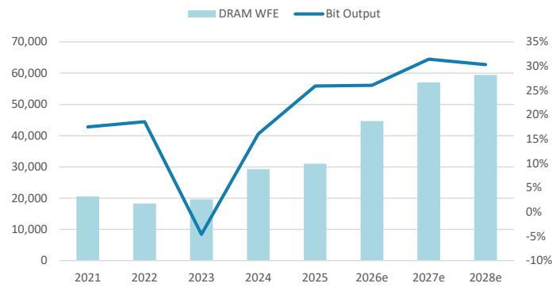

bar_line

| Year | DRAM WFE | Bit Output (%) |
| :--- | :--- | :--- |
| 2021 | 20500 | 17.5 |
| 2022 | 18000 | 19.0 |
| 2023 | 19500 | -6.0 |
| 2024 | 29000 | 14.0 |
| 2025 | 31000 | 26.0 |
| 2026e | 44500 | 26.0 |
| 2027e | 57000 | 33.0 |
| 2028e | 59500 | 31.5 |

Source: TrendForce, Company data, MS. e = MS estimates

Exhibit 5: We model leading edge logic capex growth of 58% in 2026   
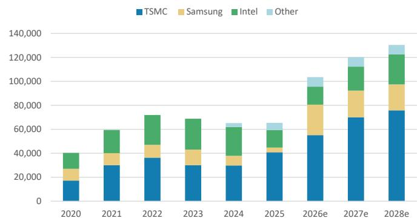

bar_stacked

| Year | TSMC | Samsung | Intel | Other |
|---|---|---|---|---|
| 2020 | 17,000 | 13,000 | 15,000 | 0 |
| 2021 | 30,000 | 14,000 | 22,000 | 0 |
| 2022 | 36,000 | 15,000 | 28,000 | 0 |
| 2023 | 30,000 | 16,000 | 26,000 | 0 |
| 2024 | 30,000 | 11,000 | 26,000 | 3,000 |
| 2025 | 41,000 | 5,000 | 15,000 | 5,000 |
| 2026e | 55,000 | 25,000 | 15,000 | 7,500 |
| 2027e | 70,000 | 23,000 | 19,000 | 7,500 |
| 2028e | 76,000 | 21,500 | 24,500 | 8,500 |

Source: Company data, MS. e = MS estimates

Exhibit 2: Y/Y growth will be led by NAND, partially due to a low base, but we're positive on NAND WFE   
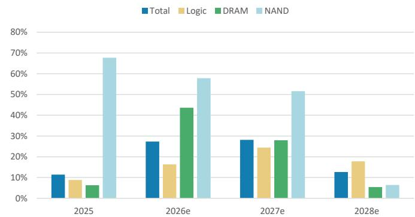

bar

| Year | Total (%) | Logic (%) | DRAM (%) | NAND (%) |
|---|---|---|---|---|
| 2025 | 11 | 9 | 6 | 67 |
| 2026e | 27 | 16 | 43 | 57 |
| 2027e | 28 | 24 | 28 | 51 |
| 2028e | 12 | 18 | 5 | 6 |

Source: Company data, MS. e = MS estimates

Exhibit 4: Our 2027 NAND WFE forecast of \$24bn supplies 32% bit growth, below where we think unconstrained bit demand is (40%+)   
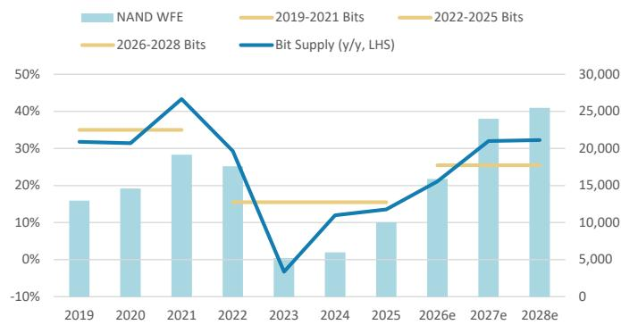

bar_line

| Year | NAND WFE (%) | 2019-2021 Bits | 2022-2025 Bits | 2026-2028 Bits | Bit Supply (y/y, LHS) |
|---|---|---|---|---|---|
| 2019 | 15.5 | 34,000 | 34,000 | 34,000 | 31,500 |
| 2020 | 18.5 | 34,000 | 34,000 | 34,000 | 31,500 |
| 2021 | 28.5 | 34,000 | 34,000 | 34,000 | 43,500 |
| 2022 | 25.5 | 14,500 | 14,500 | 14,500 | 29,500 |
| 2023 | -3.5 | 14,500 | 14,500 | 14,500 | -3,500 |
| 2024 | 1.5 | 14,500 | 14,500 | 14,500 | 11,500 |
| 2025 | 10.5 | 14,500 | 14,500 | 14,500 | 12,500 |
| 2026e | 21.5 | 17,500 | 17,500 | 17,500 | 16,500 |
| 2027e | 37.5 | 17,500 | 17,500 | 17,500 | 31,500 |
| 2028e | 41.5 | 17,500 | 17,500 | 17,500 | 31,500 |

Source: TrendForce, Company data, MS. e = MS estimates

Exhibit 6: If Intel wants to build supply to capture two-thirds of incremental CPU units by 2030, we think that would require \$23.8bn+ of WFE   
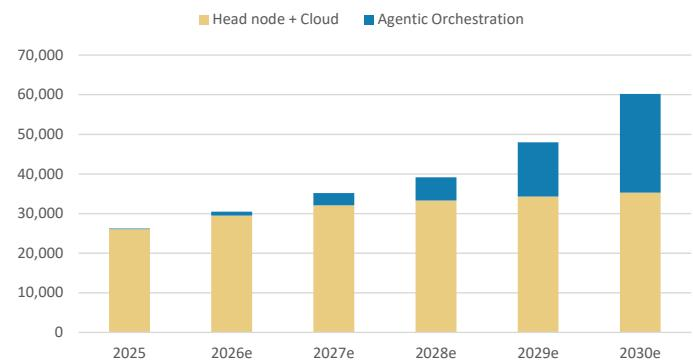

bar_stacked

| Year | Head node + Cloud | Agentic Orchestration |
|---|---|---|
| 2025 | 26000 | 0 |
| 2026e | 30000 | 1000 |
| 2027e | 31000 | 3000 |
| 2028e | 33000 | 5000 |
| 2029e | 34000 | 11000 |
| 2030e | 35000 | 18000 |

Source: MS estimates

# WFE Forecast Table

Exhibit 7: 

<table><tr><td>($mn)</td><td>2021</td><td>2022</td><td>2023</td><td>2024</td><td>2025</td><td>2026e</td><td>2027e</td><td>2028e</td></tr><tr><td>WFE Revenue</td><td>91,092</td><td>96,222</td><td>96,008</td><td>105,057</td><td>117,048</td><td>149,041</td><td>191,043</td><td>215,312</td></tr><tr><td>Semi Revenue</td><td>553,540</td><td>573,978</td><td>526,820</td><td>630,549</td><td>791,061</td><td>1,513,890</td><td>1,835,394</td><td>1,835,394</td></tr><tr><td>Semi Capex</td><td>157,788</td><td>187,982</td><td>176,924</td><td>198,540</td><td>215,972</td><td>347,044</td><td>377,535</td><td>368,449</td></tr><tr><td>Y/Y Change %</td><td></td><td></td><td></td><td></td><td></td><td></td><td></td><td></td></tr><tr><td>WFE Revenue</td><td>43%</td><td>6%</td><td>0%</td><td>9%</td><td>11%</td><td>27%</td><td>28%</td><td>13%</td></tr><tr><td>Semi Revenue</td><td>26%</td><td>4%</td><td>-8%</td><td>20%</td><td>25%</td><td>91%</td><td>21%</td><td>0%</td></tr><tr><td>Semi Capex</td><td>33%</td><td>19%</td><td>-6%</td><td>12%</td><td>9%</td><td>61%</td><td>9%</td><td>-2%</td></tr><tr><td>Metrics</td><td></td><td></td><td></td><td></td><td></td><td></td><td></td><td></td></tr><tr><td>WFE Intensity</td><td>16%</td><td>17%</td><td>18%</td><td>17%</td><td>15%</td><td>10%</td><td>10%</td><td>12%</td></tr><tr><td>WFE% of Total Capex</td><td>58%</td><td>51%</td><td>54%</td><td>53%</td><td>54%</td><td>43%</td><td>51%</td><td>58%</td></tr><tr><td>Semi Capital Intensity</td><td>29%</td><td>33%</td><td>34%</td><td>31%</td><td>27%</td><td>23%</td><td>21%</td><td>20%</td></tr><tr><td>3rd Party Sources</td><td></td><td></td><td></td><td></td><td></td><td></td><td></td><td></td></tr><tr><td>Semi</td><td>87,499</td><td>94,100</td><td>95,610</td><td>104,270</td><td>115,700</td><td>126,100</td><td>135,200</td><td></td></tr><tr><td>Gartner</td><td>92,843</td><td>101,101</td><td>102,820</td><td>111,777</td><td>124,452</td><td>144,886</td><td>161,086</td><td>154,674</td></tr><tr><td>WFE by segment</td><td></td><td></td><td></td><td></td><td></td><td></td><td></td><td></td></tr><tr><td>Foundry/Logic</td><td>50,265</td><td>59,180</td><td>70,023</td><td>69,192</td><td>75,307</td><td>87,631</td><td>109,051</td><td>128,449</td></tr><tr><td>Memory</td><td>39,828</td><td>35,854</td><td>24,794</td><td>35,228</td><td>41,118</td><td>60,496</td><td>81,153</td><td>85,792</td></tr><tr><td>DRAM</td><td>20,664</td><td>18,256</td><td>19,579</td><td>29,244</td><td>31,083</td><td>44,654</td><td>57,135</td><td>60,235</td></tr><tr><td>NAND</td><td>19,164</td><td>17,598</td><td>5,215</td><td>5,985</td><td>10,035</td><td>15,842</td><td>24,018</td><td>25,557</td></tr><tr><td>Other</td><td>999</td><td>1,188</td><td>1,192</td><td>637</td><td>622</td><td>914</td><td>839</td><td>1,071</td></tr><tr><td>Y/Y Change %</td><td></td><td></td><td></td><td></td><td></td><td></td><td></td><td></td></tr><tr><td>Foundry/Logic</td><td>45%</td><td>18%</td><td>18%</td><td>-1%</td><td>9%</td><td>16%</td><td>24%</td><td>18%</td></tr><tr><td>Memory</td><td>42%</td><td>-10%</td><td>-31%</td><td>42%</td><td>17%</td><td>47%</td><td>34%</td><td>6%</td></tr><tr><td>DRAM</td><td>53%</td><td>-12%</td><td>7%</td><td>49%</td><td>6%</td><td>44%</td><td>28%</td><td>5%</td></tr><tr><td>NAND</td><td>31%</td><td>-8%</td><td>-70%</td><td>15%</td><td>68%</td><td>58%</td><td>52%</td><td>6%</td></tr><tr><td>Other</td><td>19%</td><td>19%</td><td>0%</td><td>-47%</td><td>-2%</td><td>47%</td><td>-8%</td><td>28%</td></tr><tr><td>% of Total</td><td></td><td></td><td></td><td></td><td></td><td></td><td></td><td></td></tr><tr><td>Foundry/Logic</td><td>55%</td><td>62%</td><td>73%</td><td>66%</td><td>64%</td><td>59%</td><td>57%</td><td>60%</td></tr><tr><td>Memory</td><td>44%</td><td>37%</td><td>26%</td><td>34%</td><td>35%</td><td>41%</td><td>42%</td><td>40%</td></tr><tr><td>DRAM</td><td>23%</td><td>19%</td><td>20%</td><td>28%</td><td>27%</td><td>30%</td><td>30%</td><td>28%</td></tr><tr><td>NAND</td><td>21%</td><td>18%</td><td>5%</td><td>6%</td><td>9%</td><td>11%</td><td>13%</td><td>12%</td></tr><tr><td>Other</td><td>1%</td><td>1%</td><td>1%</td><td>1%</td><td>1%</td><td>1%</td><td>0%</td><td>0%</td></tr><tr><td>WFE Intensity</td><td></td><td></td><td></td><td></td><td></td><td></td><td></td><td></td></tr><tr><td>Semi ex-Memory revenue</td><td>399,706</td><td>444,153</td><td>434,511</td><td>465,032</td><td>568,550</td><td>706,738</td><td>802,096</td><td>802,096</td></tr><tr><td>Memory revenue</td><td>153,834</td><td>129,825</td><td>92,309</td><td>165,516</td><td>222,512</td><td>807,153</td><td>1,033,298</td><td>1,033,298</td></tr><tr><td>DRAM</td><td>92,960</td><td>77,769</td><td>51,945</td><td>94,860</td><td>150,598</td><td>511,693</td><td>585,155</td><td>585,155</td></tr><tr><td>NAND</td><td>55,953</td><td>47,109</td><td>36,104</td><td>66,427</td><td>67,685</td><td>291,230</td><td>443,913</td><td>443,913</td></tr><tr><td>WFE Intensity</td><td></td><td></td><td></td><td></td><td></td><td></td><td></td><td></td></tr><tr><td>Foundry Logic</td><td>13%</td><td>13%</td><td>16%</td><td>15%</td><td>13%</td><td>12%</td><td>14%</td><td>16%</td></tr><tr><td>Memory</td><td>26%</td><td>28%</td><td>27%</td><td>21%</td><td>18%</td><td>7%</td><td>8%</td><td>8%</td></tr><tr><td>DRAM</td><td>22%</td><td>23%</td><td>38%</td><td>31%</td><td>21%</td><td>9%</td><td>10%</td><td>10%</td></tr><tr><td>NAND</td><td>34%</td><td>37%</td><td>14%</td><td>9%</td><td>15%</td><td>5%</td><td>5%</td><td>6%</td></tr><tr><td>% of Memory WFE</td><td></td><td></td><td></td><td></td><td></td><td></td><td></td><td></td></tr><tr><td>DRAM</td><td>52%</td><td>51%</td><td>79%</td><td>83%</td><td>76%</td><td>74%</td><td>70%</td><td>70%</td></tr><tr><td>NAND</td><td>48%</td><td>49%</td><td>21%</td><td>17%</td><td>24%</td><td>26%</td><td>30%</td><td>30%</td></tr></table>

Source: Gartner, SEMI, Company data, MS. e = MS estimates

Exhibit 8: 

<table><tr><td>($mn)</td><td>2021</td><td>2022</td><td>2023</td><td>2024</td><td>2025</td><td>2026e</td><td>2027e</td><td>2028e</td></tr><tr><td colspan="9">WFE by Region</td></tr><tr><td>Total</td><td>91,092</td><td>96,222</td><td>96,008</td><td>105,057</td><td>117,048</td><td>149,041</td><td>191,043</td><td>215,312</td></tr><tr><td>North America</td><td>7,755</td><td>10,239</td><td>11,346</td><td>13,657</td><td>10,534</td><td>12,221</td><td>15,666</td><td>17,656</td></tr><tr><td>Europe</td><td>2,879</td><td>5,982</td><td>5,741</td><td>4,202</td><td>2,341</td><td>2,534</td><td>2,866</td><td>3,230</td></tr><tr><td>Japan</td><td>6,879</td><td>7,244</td><td>6,438</td><td>7,354</td><td>8,779</td><td>10,433</td><td>13,755</td><td>15,718</td></tr><tr><td>Korea</td><td>22,757</td><td>19,655</td><td>18,965</td><td>18,910</td><td>23,410</td><td>33,534</td><td>44,513</td><td>50,168</td></tr><tr><td>Taiwan</td><td>23,566</td><td>26,566</td><td>19,501</td><td>15,233</td><td>27,506</td><td>38,751</td><td>53,492</td><td>60,287</td></tr><tr><td>China</td><td>24,695</td><td>22,105</td><td>31,682</td><td>42,548</td><td>41,552</td><td>48,140</td><td>56,740</td><td>64,594</td></tr><tr><td>Other</td><td>2,561</td><td>4,431</td><td>2,334</td><td>3,152</td><td>2,926</td><td>3,428</td><td>4,012</td><td>3,660</td></tr><tr><td colspan="9">WFE by Region (Y/Y)</td></tr><tr><td>North America</td><td>28%</td><td>32%</td><td>11%</td><td>20%</td><td>-23%</td><td>16%</td><td>28%</td><td>13%</td></tr><tr><td>Europe</td><td>8%</td><td>108%</td><td>-4%</td><td>-27%</td><td>-44%</td><td>8%</td><td>13%</td><td>13%</td></tr><tr><td>Japan</td><td>14%</td><td>5%</td><td>-11%</td><td>14%</td><td>19%</td><td>19%</td><td>32%</td><td>14%</td></tr><tr><td>Korea</td><td>51%</td><td>-14%</td><td>-4%</td><td>0%</td><td>24%</td><td>43%</td><td>33%</td><td>13%</td></tr><tr><td>Taiwan</td><td>54%</td><td>13%</td><td>-27%</td><td>-22%</td><td>81%</td><td>41%</td><td>38%</td><td>13%</td></tr><tr><td>China</td><td>48%</td><td>-10%</td><td>43%</td><td>34%</td><td>-2%</td><td>16%</td><td>18%</td><td>14%</td></tr><tr><td>Other</td><td>40%</td><td>73%</td><td>-47%</td><td>35%</td><td>-7%</td><td>17%</td><td>17%</td><td>-9%</td></tr><tr><td colspan="9">WFE by Region (% of Total)</td></tr><tr><td>North America</td><td>9%</td><td>11%</td><td>12%</td><td>13%</td><td>9%</td><td>8%</td><td>8%</td><td>8%</td></tr><tr><td>Europe</td><td>3%</td><td>6%</td><td>6%</td><td>4%</td><td>2%</td><td>2%</td><td>2%</td><td>2%</td></tr><tr><td>Japan</td><td>8%</td><td>8%</td><td>7%</td><td>7%</td><td>8%</td><td>7%</td><td>7%</td><td>7%</td></tr><tr><td>Korea</td><td>25%</td><td>20%</td><td>20%</td><td>18%</td><td>20%</td><td>23%</td><td>23%</td><td>23%</td></tr><tr><td>Taiwan</td><td>26%</td><td>28%</td><td>20%</td><td>15%</td><td>24%</td><td>26%</td><td>28%</td><td>28%</td></tr><tr><td>China</td><td>27%</td><td>23%</td><td>33%</td><td>41%</td><td>36%</td><td>32%</td><td>30%</td><td>30%</td></tr><tr><td>Other</td><td>3%</td><td>5%</td><td>2%</td><td>3%</td><td>3%</td><td>2%</td><td>2%</td><td>2%</td></tr></table>

Source: Gartner, SEMI, Company data, MS. e = MS estimates

# How do our views change (2026/2027)?

What's Changed? We revise up our 2026 forecast from \$143bn (up 23% y/y) to \$149bn (up 27%) and our 2027 forecast comes up from \$182bn (up 27%) to \$191bn (up 28%).

Our View: Our largest revision is in NAND, where we are materially increasing our 2027 greenfield wafer assumptions across Samsung and Kioxia.

# DRAM: capped at low-30% bit output?

We make 2 changes to our DRAM WFE forecasts which brings up our 2026/2027 DRAM WFE forecast from \$41.7bn/\$52.2bn to \$44.6bn/\$57.1bn:

- Greenfield: We adjust our 2026/2027 forecast from 278/355kwpm to 258/395kwpm as we tweak down our overly aggressive 2026 Hynix forecast while revising up 2027 forecasts across all manufacturers.   
- Bit Output: Our revised wafer forecasts lead to our bit supply growth forecasts being revised up from 24%/29% to 26%/31%.

We aren't sure how much higher our forecasts can go; as it would imply extremely aggressive wafer start ramps at new fabs or a majority of ASML's EUVs going towards DRAM, straining logic in the process.

Exhibit 9: We now model annual DRAM greenfield adds to average 344kwpm during 2026-28, up from 170kwpm in 2023-   
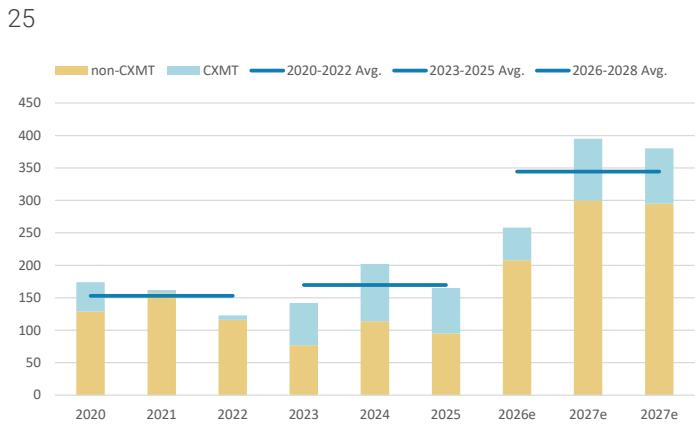

bar_stacked

| Year | non-CXMT | CXMT | 2020-2022 Avg. | 2023-2025 Avg. | 2026-2028 Avg. |
|---|---|---|---|---|---|
| 2020 | 130 | 40 | 155 | 155 | 155 |
| 2021 | 150 | 10 | 155 | 155 | 155 |
| 2022 | 120 | 10 | 155 | 155 | 155 |
| 2023 | 75 | 60 | 170 | 170 | 170 |
| 2024 | 110 | 90 | 170 | 170 | 170 |
| 2025 | 95 | 85 | 170 | 170 | 170 |
| 2026e | 205 | 55 | 345 | 345 | 345 |
| 2027e | 300 | 95 | 345 | 345 | 345 |
| 2027e (estimated) | 295 | 85 | 345 | 345 | 345 |
The chart displays a stacked bar chart with two categories: non-CXMT and CXMT. The x-axis represents years from 2020 to 2027e, and the y-axis represents numerical values ranging from 0 to 450. The legend indicates that the bars are colored differently per category, and the line labels show the corresponding average values for each year. The data points are labeled as '2020e', '2023e', and '2026e'. The chart is saved as a PNG file named 'chart.png'.

Source: TrendForce, Company data, MS. e = MS estimates

Exhibit 10: We model servers to be 59% of DRAM bits in 2028, up from 38% in 2025, and PC/Smartphone down from 45% to 24%   
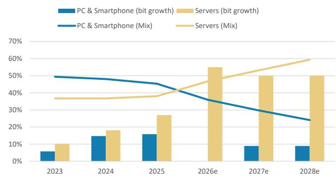

bar_line

| Year | PC & Smartphone (bit growth) (%) | Servers (bit growth) (%) | PC & Smartphone (Mix) (%) | Servers (Mix) (%) |
|---|---|---|---|---|
| 2023 | 6 | 10 | 50 | 37 |
| 2024 | 14 | 18 | 49 | 37 |
| 2025 | 15 | 27 | 46 | 39 |
| 2026e | 36 | 55 | 37 | 48 |
| 2027e | 9 | 50 | 30 | 53 |
| 2028e | 9 | 50 | 24 | 60 |

Source: TrendForce, Company data, MS. e = MS estimates

# Exhibit 11:

We model 31%/30% bit supply growth in 2027/2028, up from 12% during 2023-25 and 17% during 2020-22

bar_line

| Year   | DRAM WFE | Bit Output |
| ------ | -------- | ---------- |
| 2021   | 20,000   | 43%        |
| 2022   | 18,000   | 45%        |
| 2023   | 19,000   | -5%        |
| 2024   | 29,000   | 41%        |
| 2025   | 31,000   | 26%        |
| 2026e  | 45,000   | 26%        |
| 2027e  | 57,000   | 32%        |
| 2028e  | 60,000   | 31%        |

Source: TrendForce, Company data, MS. e = MS estimates

# NAND: get ready for a NAND WFE acceleration

We make 2 changes to our NAND WFE forecasts which brings up our 2026/2027 NAND WFE forecast from \$15.4bn/\$19.7bn to \$15.8bn/\$24.0bn:

- Greenfield: We adjust our 2026/2027 forecast from 105/125kwpm to 95/145kwpm as we tweak down our 2026 Samsung forecast while revising up 2027 forecasts at Samsung and Kioxia.   
- Bit Output: Our revised wafer forecasts lead to our bit supply growth forecasts being revised up from 20%/30% to 21%/32%.

We're confident on NAND WFE accelerating into 2027.

Exhibit 12: We model NAND bit supply growth to increase from 17% in 2026 to 33% in 2028   
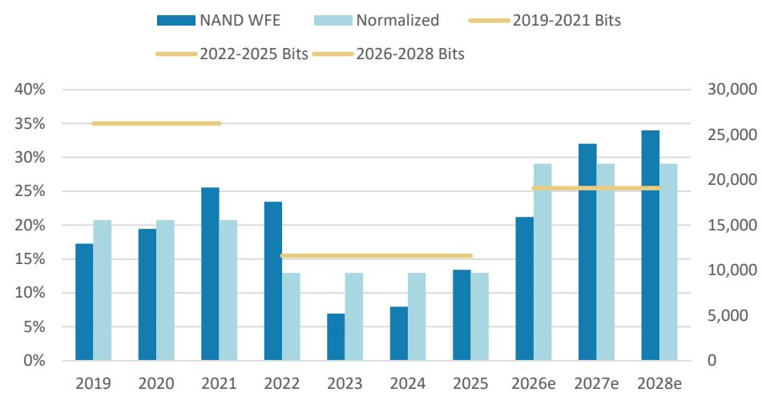

bar_line

| Year | NAND WFE (%) | Normalized (%) | 2019-2021 Bits | 2022-2025 Bits | 2026-2028 Bits |
| :--- | :--- | :--- | :--- | :--- | :--- |
| 2019 | 17.3 | 20.7 | 35,000 | 35,000 | 35,000 |
| 2020 | 19.4 | 20.8 | 35,000 | 35,000 | 35,000 |
| 2021 | 25.5 | 20.7 | 35,000 | 35,000 | 35,000 |
| 2022 | 23.4 | 13.1 | 15,000 | 15,000 | 15,000 |
| 2023 | 7.1 | 13.1 | 15,000 | 15,000 | 15,000 |
| 2024 | 8.1 | 13.1 | 15,000 | 15,000 | 15,000 |
| 2025 | 13.6 | 13.1 | 15,000 | 15,000 | 15,000 |
| 2026e | 21.3 | 29.1 | 25,000 | 25,000 | 25,000 |
| 2027e | 32.1 | 29.1 | 25,000 | 25,000 | 25,000 |
| 2028e | 34.1 | 29.1 | 25,000 | 25,000 | 25,000 |

Source: TrendForce, Company data, MS. e = MS estimates

# Logic: Broadening of spenders

We fine tune our 2026-27 WFE forecasts from \$85.4bn/\$109.4bn to \$87.6bn/\$109.0bn. As we think about further revisions from here, we think upside is skewed towards 2 areas:

- Intel: We think there is an inevitability towards Intel raising capex on the back of CPU demand, and we see further revisions down the line if the company captures a material foundry customer or sees some sort of development with TeraFab.   
- Analog/MCU: Analog/MCU companies spoke of increasing utilization rates across the board at their MarQ reports. NXP spoke of front-end utilization coming up from the low 80s in the 1H to mid 80s in the 2H, ON spoke about manufacturing utilization increased sequentially to $77\%$ and expecting Q2 flat to up slightly, and Infineon mentioned 300mm fabs really have a high capacity utilization. We don't see an urgency to increase capex amongst these players, nor do we think capex will materially pick up enough to shift overall WFE growth rates. However, we do believe we can start modelling positive y/y growth across non-China ICAPS.

We aren't quite ready to put that upside fully into numbers, but we think risk is skewed to the upside.

Exhibit 13: We model leading edge logic capex growth of 58% in 2026   
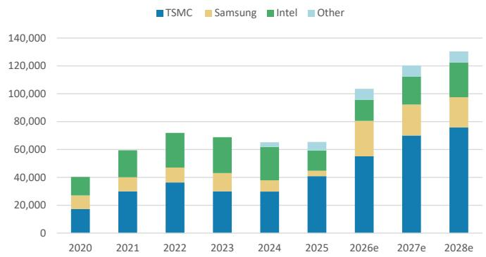

bar_stacked

| Year | TSMC | Samsung | Intel | Other |
|---|---|---|---|---|
| 2020 | 17,000 | 10,000 | 15,000 | 0 |
| 2021 | 30,000 | 10,000 | 25,000 | 0 |
| 2022 | 36,000 | 12,000 | 32,000 | 0 |
| 2023 | 30,000 | 12,000 | 32,000 | 0 |
| 2024 | 30,000 | 8,000 | 32,000 | 3,000 |
| 2025 | 42,000 | 3,000 | 15,000 | 5,000 |
| 2026e | 55,000 | 25,000 | 15,000 | 8,000 |
| 2027e | 71,000 | 25,000 | 22,000 | 7,000 |
| 2028e | 76,000 | 25,000 | 28,000 | 9,000 |

Source: Company Data, MS. e = MS estimates

Exhibit 14: We estimate that 22.4mn incremental Server CPUs would require WFE of \$23.8bn+ from Intel 

<table><tr><td>WFE per CPU Needs ($mn)</td><td>Intel Xeon 6</td><td>Intel Xeon 7</td></tr><tr><td>Total</td><td>23,854</td><td>27,913</td></tr><tr><td>Logic</td><td>23,517</td><td>27,577</td></tr><tr><td>2nm</td><td>0</td><td>20,311</td></tr><tr><td>3nm</td><td>20,164</td><td>0</td></tr><tr><td>7nm</td><td>3,354</td><td>7,266</td></tr><tr><td>EMIB</td><td>336</td><td>336</td></tr></table>

Wafers per CPU Needs 

<table><tr><td>Total</td><td>105,182</td><td>108,441</td></tr><tr><td>Logic</td><td>100,698</td><td>103,957</td></tr><tr><td>2nm</td><td>0</td><td>63,588</td></tr><tr><td>3nm</td><td>82,066</td><td>0</td></tr><tr><td>7nm</td><td>18,632</td><td>40,368</td></tr><tr><td>EMIB</td><td>4,484</td><td>4,484</td></tr></table>

Source: MS estimates

# Introducing 2028: Longevity of Demand

Our View: We believe in the longevity of this WFE cycle led by AI. We expect a broadening of foundry logic spending to continue to play out in 2028, while for memory we are looking to raise numbers as fab timelines become clearer.

The Numbers: We model total WFE to be up 13% in 2028, led by foundry logic up 18% y/y vs memory up 6%.

Our thoughts by end-markets are as follows;

- Logic \$128.4bn (+18% y/y): We model leading edge capex to increase from TSMC & Intel as well as trailing edge capex to gradually recover led by Analog/MCU players across the board.   
- DRAM \$60.2bn (+5% y/y): We model greenfield to remain roughly flat at 380kwpm (2027 395kwpm) as we await more clarity around the scale of MU's PSMC P5 fab and CXMT's Shanghai fab.   
- NAND \$25.6bn (+6% y/y): We model greenfield to accelerate from 145kwpm to 170kwpm led by all players. We see risk skewed to the upside especially from MU's Singapore fab (Fab 10(B)).

Across DRAM/NAND we would look to adjust numbers as we get a better understanding of project scale.

Exhibit 15: We model logic to drive 2028 growth, but risk is skewed to the upside for memory   
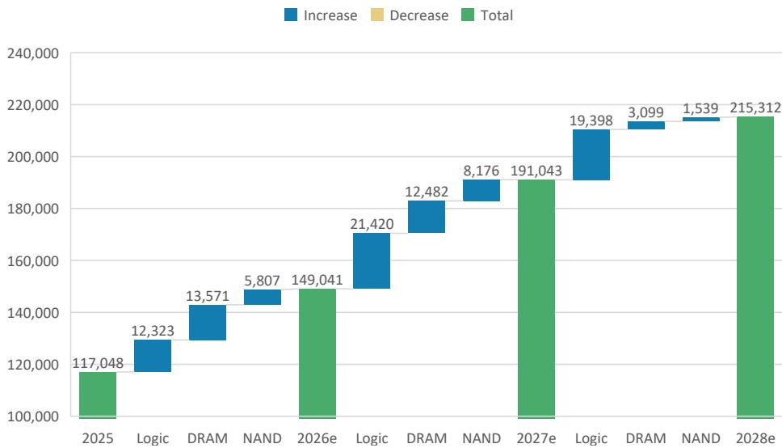

bar_stacked

| Year | Total | Increase | Decrease |
| :--- | :--- | :--- | :--- |
| 2025 | 117,048 | 0 | 0 |
| Logic | 13,571 | 12,323 | 0 |
| DRAM | 149,041 | 0 | 0 |
| NAND | 149,041 | 5,807 | 0 |
| 2026e | 149,041 | 0 | 0 |
| Logic | 172,420 | 21,420 | 0 |
| DRAM | 172,420 | 12,482 | 0 |
| NAND | 191,043 | 8,176 | 0 |
| 2027e | 191,043 | 0 | 0 |
| Logic | 215,312 | 19,398 | 0 |
| DRAM | 215,312 | 3,099 | 0 |
| NAND | 215,312 | 1,539 | 0 |
The chart displays a single data series with three categories: 'Increase' (blue), 'Decrease' (yellow), and 'Total' (green). The x-axis represents the years from 2025 to 2028e. The y-axis represents the numerical values of these categories. There is no additional data series in this view.

Source: Company Data, MS. e = MS estimates

Exhibit 16: We model logic/memory mix to narrow from 65%/35% in 2025 to 58%/42% in 2027   
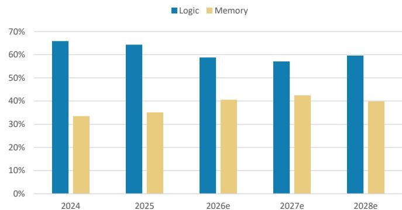

bar

| Year | Logic (%) | Memory (%) |
|---|---|---|
| 2024 | 65.5 | 33.5 |
| 2025 | 64.0 | 35.0 |
| 2026e | 59.0 | 40.5 |
| 2027e | 57.0 | 42.0 |
| 2028e | 59.5 | 39.5 |

Source: Company Data, MS. e = MS estimates

Exhibit 17: Y/Y growth will be led by NAND, partially due to a low base   
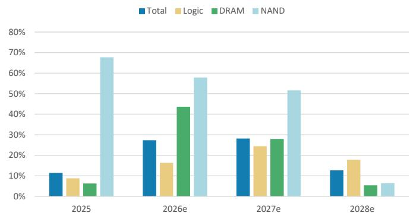

bar

| Year | Total (%) | Logic (%) | DRAM (%) | NAND (%) |
|---|---|---|---|---|
| 2025 | 11 | 9 | 6 | 68 |
| 2026e | 27 | 16 | 43 | 58 |
| 2027e | 28 | 24 | 28 | 51 |
| 2028e | 12 | 18 | 5 | 6 |

Source: Company Data, MS. e = MS estimates

# Thought #1: NAND WFE

Our View: We think NAND WFE surpasses historic highs in 2027 on the back of increased clean room allocation and lithography constraints for DRAM.

The Numbers: We raise our 2027 NAND WFE forecast from \$19.7bn to \$24.0bn, above prior high of \$19.1bn in 2021.

NAND WFE has continued to stay low. NAND is a cyclical industry, and past cycles have always seen spending resume at some point. Our view is predicated on history and bit growth, and see spending reaccelerating, with the debate being “When” not “If”. However, NAND WFE shipments have tracked at historic lows during Q3 25 to Q1 26, and our thesis has been slow to play out for 3 reasons:

- Clean room availability: DRAM WFE has accelerated from strength to strength as Samsung and Hynix have allocated all incremental clean room towards DRAM as well as shifting clean room initially allocated from NAND to DRAM.   
- Capital Discipline: Samsung, Hynix and Micron have shifted their capex budgets away from DRAM and towards NAND, while Kioxia has been more capital disciplined, leaving just YMTC to add NAND wafers.   
- Bit Demand: We estimate node upgrades have been able to satisfy high-teens bit growth, which is what the demand profile of the industry has been during 2023-2025.

Exhibit 18: NAND supply growth during 2023-2025 has largely been supplied by upgrades (more bits per wafer)   
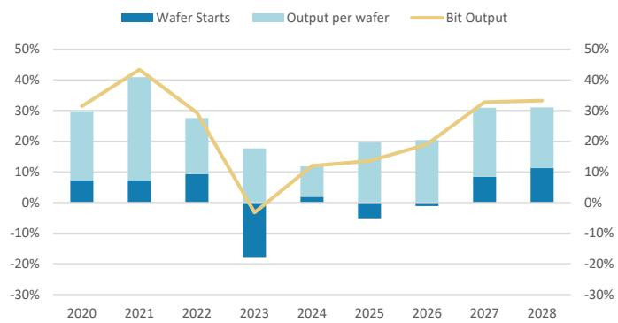

bar_line

| Year | Wafer Starts (%) | Output per wafer (%) | Bit Output (%) |
|---|---|---|---|
| 2020 | 7 | 29 | 31 |
| 2021 | 7 | 41 | 44 |
| 2022 | 9 | 27 | 28 |
| 2023 | -18 | 17 | -3 |
| 2024 | 1 | 5 | 12 |
| 2025 | -4 | 19 | 13 |
| 2026 | -1 | 20 | 19 |
| 2027 | 8 | 29 | 33 |
| 2028 | 11 | 31 | 34 |

Source: TrendForce, Company Data, MS. e = MS estimates

Exhibit 19: As a result, greenfield in the industry was minimal   
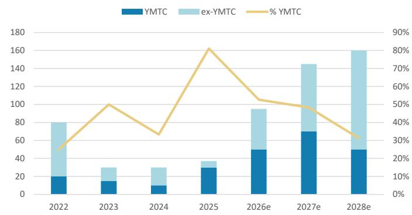

bar_line

| Year | YMTC | ex-YMTC | % YMTC |
|---|---|---|---|
| 2022 | 20 | 60 | 30 |
| 2023 | 15 | 15 | 50 |
| 2024 | 10 | 20 | 35 |
| 2025 | 30 | 10 | 80 |
| 2026e | 50 | 45 | 50 |
| 2027e | 70 | 75 | 45 |
| 2028e | 50 | 110 | 30 |

Source: TrendForce, Company Data, MS. e = MS estimates

# We think NAND WFE accelerates from here for 3 reasons:

- Clean room availability: as more memory clean room capacity comes online while EUV supply becomes incrementally tighter, we think NAND receives increased allocation.   
- Capital Discipline: SNDK guided JunQ GM% to 80%, making NAND far more profitable relative to 9 months ago (SepQ 2025 GM 30%). Sandisk also disclosed \$42bn in RPO, with \$11bn in financial guarantees, giving line of sight to profitability on incremental bit production.

\- Bit Demand: We think unconstrained bit demand is 40%+ and we think LTAs necessitate spending to a certain extent.

Exhibit 20: We think unconstrained bit demand is 40%+, largely driven by server demand (SSDs)   
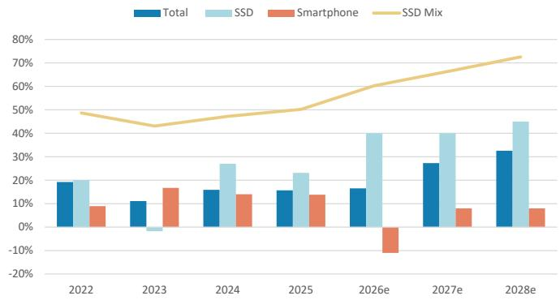

bar_line

| Year | Total (%) | SSD (%) | Smartphone (%) | SSD Mix (%) |
|---|---|---|---|---|
| 2022 | 20 | 20 | 10 | 50 |
| 2023 | 11 | -2 | 17 | 43 |
| 2024 | 16 | 27 | 14 | 48 |
| 2025 | 16 | 24 | 14 | 51 |
| 2026e | 17 | 41 | -10 | 61 |
| 2027e | 28 | 41 | 9 | 65 |
| 2028e | 33 | 45 | 9 | 73 |

Source: TrendForce, Company Data, MS. e = MS estimates

Exhibit 21: We model server as a % of NAND bits to reach 73% in 2028 driven by AI bits reaching 31%   
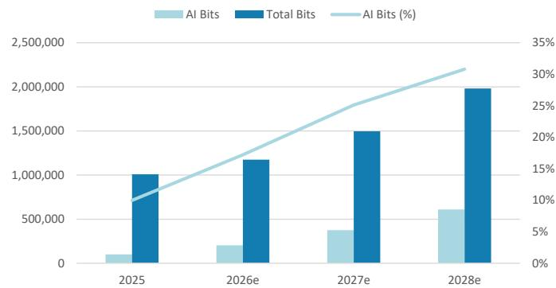

bar_line

| Year | AI Bits | Total Bits | AI Bits (%) |
|---|---|---|---|
| 2025 | 100000 | 1000000 | 8 |
| 2026e | 200000 | 1200000 | 14 |
| 2027e | 400000 | 1500000 | 25 |
| 2028e | 600000 | 2000000 | 31 |

Source: TrendForce, Company Data, MS. e = MS estimates

# Exhibit 22:

We think NAND WFE increases to \$24bn in 2027, above prior peak of \$19bn in 2021.

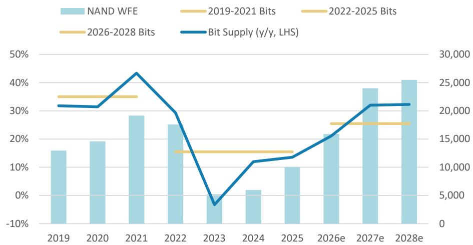

bar_line

| Year   | NAND WFE | 2019-2021 Bits | 2022-2025 Bits | 2026-2028 Bits | Bit Supply (y/y, LHS) |
|--------|----------|----------------|----------------|----------------|----------------------|
| 2019   | 16%      | 35,000         | 35,000         | -              | 32,000               |
| 2020   | 19%      | 35,000         | 35,000         | -              | 31,500               |
| 2021   | 28%      | 35,000         | 35,000         | -              | 44,000               |
| 2022   | 25%      | 16,000         | 16,000         | -              | 30,000               |
| 2023   | -        | 16,000         | 16,000         | -              | -                    |
| 2024   | 2%       | 16,000         | 16,000         | -              | 12,000               |
| 2025   | 11%      | 16,000         | 16,000         | -              | 13,500               |
| 2026e  | 21%      | 18,000         | 18,000         | -              | 16,500               |
| 2027e  | 38%      | 18,000         | 18,000         | -              | 21,500               |
| 2028e  | 41%      | 18,000         | 18,000         | -              | 21,500               |

Source: TrendForce, Company Data, MS. e = MS estimates

# Thought #2: Intel

Our View: We think rising CPU demand makes an Intel capex hike for 2026/2027 inevitable, with foundry customer acquisitions making capex revisions heavily skewed to the upside.

The Numbers: We model Intel capex of \$20bn/\$25bn in 2026/27 but with risk heavily skewed to the upside given 5mn CPU packages (Xeon 6) per year of incremental production necessitates approx. 22kwpm logic wafers/\$5.3bn of WFE.

\$125bn 2030 Server CPU Base Case. Our global semis team recently raised their 2030 CPU TAM by 25% to US\$125bn, driven by a US\$79bn orchestration CPU layer on top of US \$45bn host/cloud CPU TAM; their top-down bull case reaches US\$283bn as dedicated agentic CPU racks scale. We model server CPUs to grow from 26.2mn units in 2025 to 60.1mn in 2030. For further details see: Global Technology: Agentic AI – The Surge Begins (11 May 2026)

Exhibit 23: We model server CPUs to grow from 26.2mn units in 2025 to 60.1mn in 2030   
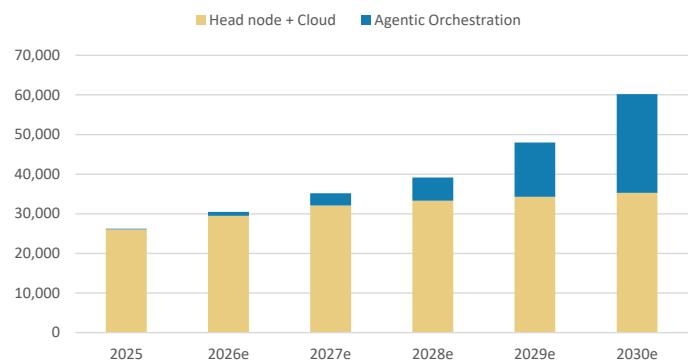

bar_stacked

| Year | Head node + Cloud | Agentic Orchestration |
|---|---|---|
| 2025 | 26000 | 0 |
| 2026e | 29000 | 1000 |
| 2027e | 31000 | 4000 |
| 2028e | 33000 | 6000 |
| 2029e | 34000 | 12000 |
| 2030e | 35000 | 18000 |

Source: MS estimates

Exhibit 24: Our bull case implies a \$238bn CPU orchestration TAM.   
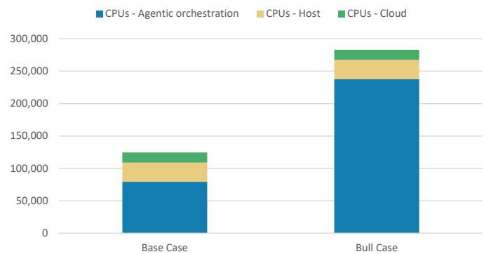

bar_stacked

| Category | CPUs - Agentic orchestration | CPUs - Host | CPUs - Cloud |
| :--- | :--- | :--- | :--- |
| Base Case | 80000 | 25000 | 15000 |
| Bull Case | 235000 | 25000 | 15000 |

Source: MS estimates

Inevitability to Intel Capex revisions. Were Intel to take part in this CPU upcycle, we think there is an inevitability to capex hikes. We estimate that if the company wants to produce 5mn incremental Xeon 6s, the company will have to spend \$5.3bn in WFE. Assuming Intel wants to take two-thirds of the incremental CPU units, we think the company will have to expand logic wafer capacity by a minimum of \$23.8bn. Assuming 2 compute tiles for Xeon 7, we estimate Intel will have to spend \$27.9bn in WFE. We see capex tracking possibly even higher:

\- Intel Foundry: Our capex argument is purely based on Intel looking to increase capex to meet rising CPU demand, i.e. Intel IDM. Foundry customers acquisition will necessitate spending beyond the \$23.8-27.9bn of WFE to meet rising CPU demand.

Exhibit 25: We estimate 5mn incremental server CPUs would require \$5.3bn+ of WFE 

<table><tr><td>WFE per CPU Needs ($mn)</td><td>Intel Xeon 6</td><td>Intel Xeon 7</td></tr><tr><td>Total</td><td>5,326</td><td>6,233</td></tr><tr><td>Logic</td><td>5,251</td><td>6,158</td></tr><tr><td>2nm</td><td>0</td><td>4,535</td></tr><tr><td>3nm</td><td>4,502</td><td>0</td></tr><tr><td>7nm</td><td>749</td><td>1,623</td></tr><tr><td>EMIB</td><td>75</td><td>75</td></tr><tr><td colspan="3">Wafers per CPU Needs</td></tr><tr><td>Total</td><td>23,487</td><td>24,214</td></tr><tr><td>Logic</td><td>22,485</td><td>23,213</td></tr><tr><td>2nm</td><td>0</td><td>14,199</td></tr><tr><td>3nm</td><td>18,325</td><td>0</td></tr><tr><td>7nm</td><td>4,160</td><td>9,014</td></tr><tr><td>EMIB</td><td>1,001</td><td>1,001</td></tr></table>

Source: MS estimates. 2nm = Intel 18A, 3nm = Intel 3.

Exhibit 26: Two-thirds of the incremental units through 2030 (22.4mn units) would require \$23.8bn+ of WFE 

<table><tr><td>WFE per CPU Needs ($mn)</td><td>Intel Xeon 6</td><td>Intel Xeon 7</td></tr><tr><td>Total</td><td>23,854</td><td>27,913</td></tr><tr><td>Logic</td><td>23,517</td><td>27,577</td></tr><tr><td>2nm</td><td>0</td><td>20,311</td></tr><tr><td>3nm</td><td>20,164</td><td>0</td></tr><tr><td>7nm</td><td>3,354</td><td>7,266</td></tr><tr><td>EMIB</td><td>336</td><td>336</td></tr><tr><td colspan="3">Wafers per CPU Needs</td></tr><tr><td>Total</td><td>105,182</td><td>108,441</td></tr><tr><td>Logic</td><td>100,698</td><td>103,957</td></tr><tr><td>2nm</td><td>0</td><td>63,588</td></tr><tr><td>3nm</td><td>82,066</td><td>0</td></tr><tr><td>7nm</td><td>18,632</td><td>40,368</td></tr><tr><td>EMIB</td><td>4,484</td><td>4,484</td></tr></table>

Source: MS estimates. 2nm = Intel 18A, 3nm = Intel 3.

KLA an outsized beneficiary. Intel has not been a 10% customer for KLA since F6/15, but we think Intel is leaning on KLA as a key partner to improve yield in order to improve margin and become a viable foundry. While key Intel suppliers like ASML and Tokyo Electron will benefit from an Intel capex resurgence, we think KLA stands as an outsized beneficiary on the back of increased process control intensity and share gain.

- Intel Foundry Direct Connect (April 29th 2025): “The second pillar is quality. Intel has to make significant improvements in ensuring that customers have no negative impact from our quality based deviations. We have to change from a test based quality detection back to an in-line quality detection, and we are investing heavily in this area. Not only through test chips but by partnering with our equipment suppliers to install all the in-line detection capabilities (1:09.22-1:09.45)” -Naga Chandrasekaran (GM, Intel Foundry Technology Manufacturing).   
- MarQ 2026 Earnings (April 23rd 2026): I “we've brought in external partners that are particularly good at, including metrology, that's helped us execute better there (yield) and we're starting to see the benefits of that this quarter.

Exhibit 27: KLA can 6.4x their Intel revenue from 2025 to 2027 on the back of PC intensity and share gain 

<table><tr><td>($mn)</td><td>2025 MSe IDM</td><td>2027 MSe IDM</td><td>2027 MSe IDM/Foundry</td></tr><tr><td>Capex</td><td>14,646</td><td>20,000</td><td>25,000</td></tr><tr><td>WFE</td><td>7,323</td><td>12,000</td><td>15,000</td></tr><tr><td>WFE Mix (%)</td><td>50%</td><td>60%</td><td>60%</td></tr><tr><td>Process Control (%)</td><td>5%</td><td>10%</td><td>12%</td></tr><tr><td>KLA Share (%)</td><td>40%</td><td>60%</td><td>60%</td></tr><tr><td>KLA Revenue</td><td>146</td><td>720</td><td>1,080</td></tr><tr><td>KLA % of WFE</td><td>2.0%</td><td>6.0%</td><td>7.2%</td></tr></table>

Source: MS estimates.

Exhibit 28: We expect Intel's process control intensity to reach 12% in an IDM/Foundry scenario   
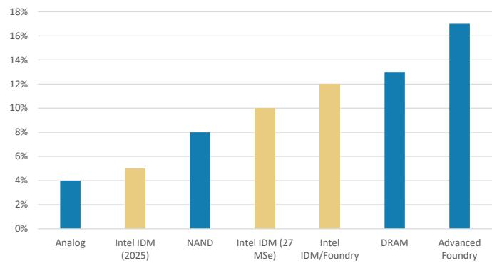

bar

| Category | Value (%) |
|---|---|
| Analog | 4 |
| Intel IDM (2025) | 5 |
| NAND | 8 |
| Intel IDM (27 MSe) | 10 |
| Intel IDM/Foundry | 12 |
| DRAM | 13 |
| Advanced Foundry | 17 |

Source: Company Data, MS estimates.

# Thought #3: Advanced Packaging

Our View: We forecast packaging to grow ahead of WFE this year but the value proposition is at the front-end players rather than the traditional back-end players.

The Numbers: We model the broader packaging market to grow 41%/25% in 2026/2027 but with the value proposition shifting to the front-end as front-end packaging revenue grows 50% y/y in 2026 and increases to 50% of packaging.

Exhibit 29: We model packaging equipment to grow 41%/25% in 2026/2027...   
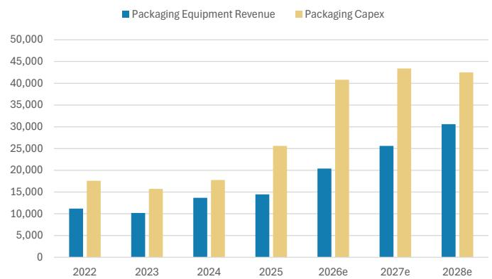

bar

| Year | Packaging Equipment Revenue | Packaging Capex |
| :--- | :--- | :--- |
| 2022 | 11500 | 17500 |
| 2023 | 10500 | 15800 |
| 2024 | 13500 | 17800 |
| 2025 | 14500 | 25800 |
| 2026e | 20500 | 40800 |
| 2027e | 25800 | 43500 |
| 2028e | 30500 | 42500 |

Source: Company data, MS. e = MS estimates

Exhibit 30: ...largely driven by Advanced Packaging (HBM, CoWoS, SoIC)   
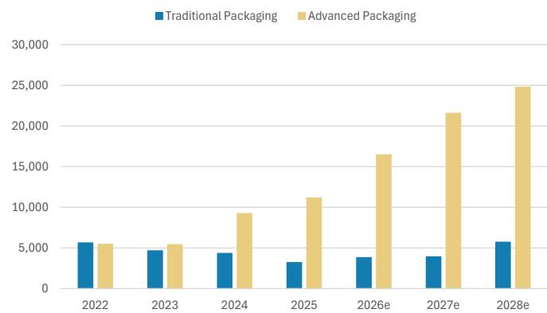

bar

| Year | Traditional Packaging | Advanced Packaging |
|---|---|---|
| 2022 | 5700 | 5500 |
| 2023 | 4700 | 5600 |
| 2024 | 4500 | 9300 |
| 2025 | 3300 | 11200 |
| 2026e | 3900 | 16500 |
| 2027e | 4100 | 21700 |
| 2028e | 5800 | 24800 |

Source: Company data, MS. e = MS estimates

Exhibit 31: An increasing portion of packaging revenue is captured by the front-end players (AMAT/LAM/KLA/TEL)...   
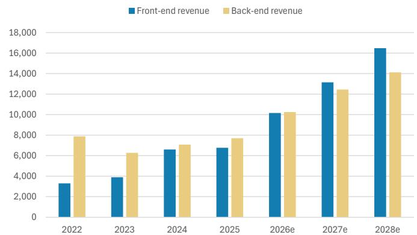

bar

| Year | Front-end revenue | Back-end revenue |
| :--- | :--- | :--- |
| 2022 | 3300 | 7900 |
| 2023 | 3900 | 6300 |
| 2024 | 6600 | 7100 |
| 2025 | 6800 | 7700 |
| 2026e | 10100 | 10300 |
| 2027e | 13100 | 12500 |
| 2028e | 16500 | 14100 |

Source: Company data, MS. e = MS estimates

Exhibit 32: ...and we forecast a higher growth rate vs the front-end cos through 2028   
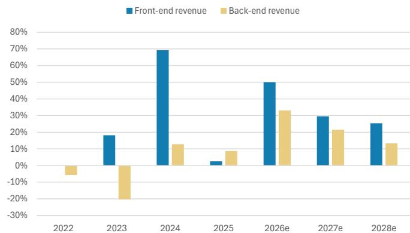

bar

| Year | Front-end revenue (%) | Back-end revenue (%) |
| :--- | :--- | :--- |
| 2022 | | -5 |
| 2023 | 18 | -15 |
| 2024 | 69 | 12 |
| 2025 | 2 | 9 |
| 2026e | 50 | 33 |
| 2027e | 30 | 21 |
| 2028e | 25 | 13 |

Source: Company data, MS. e = MS estimates

# LAM up to OW, AMAT down to EW

LAM's valuation premium vs AMAT has tracked in 3 stages over the last 10 years:

- 0% (2015-20): minimal share movement between the 2 companies.   
- 5% (2021-23): minimal share shift during 2021/22, initial premium during 2023 due to depressed NAND shipments   
- 16% (2024-): LAM share gains vs AMAT share loss due to LAM's share gains vs AMAT's share loss.

We have argued for a narrower valuation gap between the 2 companies (10%) as we were confident AMAT would be a share gainer in 2026. As we look towards 2027, LAM's share gain prospects look stronger than AMAT due to the tailwinds in NAND. To reflect this view we expand our premium for LAM vs AMAT from 10% to 20%.

Exhibit 33: LAM FwdPE vs AMAT   
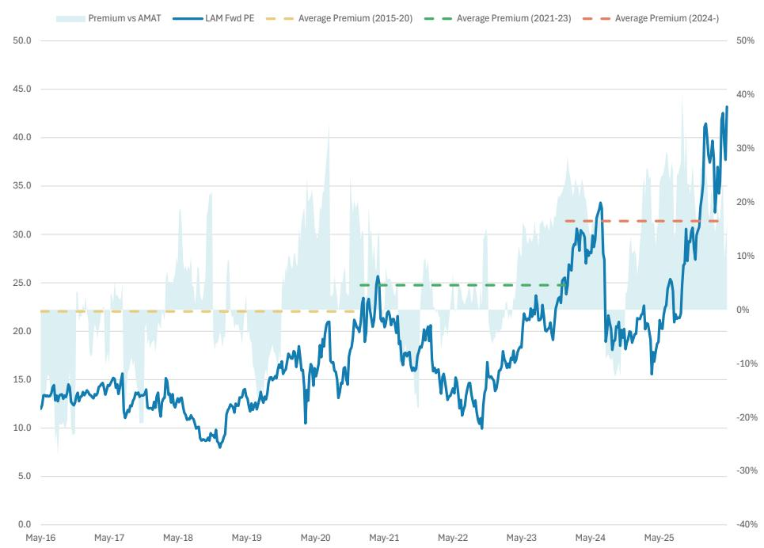

line

| Date   | Premium vs AMAT | LAM Fwd PE | Average Premium (2015-20) | Average Premium (2021-23) | Average Premium (2024-) |
|--------|-----------------|------------|----------------------------|----------------------------|--------------------------|
| May-16 | ~13.0           | ~13.0      | ~22%                       | ~25%                       | ~18%                     |
| May-17 | ~14.0           | ~14.0      | ~22%                       | ~25%                       | ~18%                     |
| May-18 | ~15.0           | ~15.0      | ~22%                       | ~25%                       | ~18%                     |
| May-19 | ~16.0           | ~16.0      | ~22%                       | ~25%                       | ~18%                     |
| May-20 | ~18.0           | ~18.0      | ~22%                       | ~25%                       | ~18%                     |
| May-21 | ~20.0           | ~20.0      | ~22%                       | ~25%                       | ~18%                     |
| May-22 | ~15.0           | ~15.0      | ~22%                       | ~25%                       | ~18%                     |
| May-23 | ~20.0           | ~20.0      | ~22%                       | ~25%                       | ~18%                     |
| May-24 | ~30.0           | ~30.0      | ~22%                       | ~25%                       | ~18%                     |
| May-25 | ~40.0           | ~40.0      | ~22%                       | ~25%                       | ~18%                     |

Source: FactSet, MS

NAND shifts the needle for LAM, not for AMAT. We preferred AMAT in 2026 given the company's outsized exposure to DRAM. DRAM WFE upward revisions had a larger impact on AMAT than LAM (CY26 mix $32\%$ vs $23\%$ ). As we look towards 2027, the growth rates of each company's NAND shipments aren't entirely that different, NAND WFE revisions will have a larger impact on LAM than AMAT due to mix ( $20\%$ vs $7\%$ ). Where could we be wrong? 2 areas of risk for LAM are: 1) China: LAM has larger exposure to China (CY26e $32\%$ vs AMAT $24\%$ ), meaning any tightening of restrictions will have an outsized impact on the company. 2) NAND: We haven't seen large scale NAND greenfield ex-China since 2022. While LAM had the incumbency in brownfield spending, given they are the existing installed base, incumbency doesn't matter as much for greenfield, especially in a new node.

Exhibit 34: We model LAM to see another year of share gain in 2027   
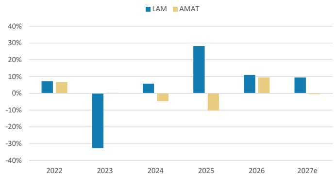

bar

| Year | LAM (%) | AMAT (%) |
|---|---|---|
| 2022 | 7 | 6 |
| 2023 | -33 | 0 |
| 2024 | 5 | -4 |
| 2025 | 28 | -9 |
| 2026 | 11 | 9 |
| 2027e | 9 | 0 |

Source: Company data, MS. e = MS estimates

Exhibit 35: We expect share gains to persist in Foundry Logic   
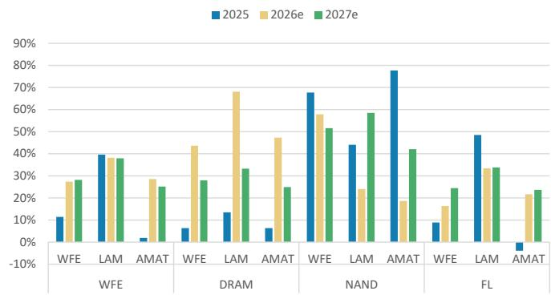

bar

| Category | WFE (%) | LAM (%) | AMAT (%) |
| :--- | :--- | :--- | :--- |
| WFE | 11 | 39 | 1 |
| DRAM | 6 | 13 | 68 |
| NAND | 67 | 43 | 58 |
| FL | 9 | 48 | -1 |
| 2025 | 27 | 38 | 2 |
| 2026e | 38 | 38 | 28 |
| 2027e | 38 | 38 | 25 |
| 2025 | 7 | 13 | 6 |
| 2026e | 43 | 68 | 47 |
| 2027e | 51 | 58 | 24 |
| 2025 | 78 | 18 | 41 |
| 2026e | 57 | 24 | 16 |
| 2027e | 51 | 58 | 41 |
| 2025 | -1 | -1 | -1 |
| 2026e | -1 | -1 | -1 |
| 2027e | -1 | -1 | -1 |
| WFE (2025) | -1 | -1 | -1 |
| WFE (2026e) | -1 | -1 | -1 |
| WFE (2027e) | -1 | -1 | -1 |
| LAM (2025) | -1 | -1 | -1 |
| LAM (2026e) | -1 | -1 | -1 |
| LAM (2027e) | -1 | -1 | -1 |
| AMAT (2025) | -1 | -1 | -1 |
| AMAT (2026e) | -1 | -1 | -1 |
| AMAT (2027e) | -1 | -1 | -1 |
| AMAT (2025) (FL) | -1 | -1 | -1 |
| AMAT (2026e) (FL) | -1 | -1 | -1 |
| AMAT (2027e) (FL) | -1 | -1 | -1 |
| AMAT (2025) (FL) (FL) | -1 | -1 | -1 |
| AMAT (2026e) (FL) (FL) (FL) (FL) (FL) (FL) (FL) (FL) (FL) (FL) (FL) (FL) (FL) (FL) (FL) (FL) (FL) (FL) (FL) (FL) (FL) (FL) (FL) (FL) (FL) (FL) (FL) (FL) (FL) (FL) (FL) (FL) (FL) (FL)(FL) (FL)(FL)(FL)(FL)(FL)(FL)(FL)(FL)(FL)(FL)(FL)(FL)(FL)(FL)(FL)(FL)(FL)(FL)(FL)(FL)(FL)(FL)(FL)(FL)(FL)(FL)(FL)(FL)(FL)(FL)(FL)(FL)(FL)(FL)(FL)(FL)(FL)(FL)(FL)(FL)(FL)(FL)(FL)(FL)(FL)(FL)(FL)(FL)(FL)(FL)(FL) (FL)(FL)(FL)(FL)(FL)(FL)(FL)(FL)(FL)(FL)(FL)(FL)(FL)(FL)(FL)(FL)(FL)(FL)(FL)(FL)(FL)(FL)(FL)(FL)(FL)(FL)(FL)(FL)(FL)(FL)(FL)(FL)(FL)(FL)(FL)(FL)(FL)(FL)(FL)(FL)(FL)(FL)(FL)(FL)(FL)(FL)(FL)(F(FF)) (F(FF))(F(FF))(F(FF))(F(FF))(F(FF))(F(FF))(F(FF))(F(FF))(F(FF))(F(FF))(F(FF))(F(FF))(F(FF))(F(FF))(F(FF))(F(FF))(F(FF))(F(FF))(F(FF))(F(FF))(F(FF))(F(FF))(F(FF))(F(FF))(F(FF))(F(FF):(F(FF))(F(FF))(F(FF):(F(FF))(F(FF):(F(FF):(F(FF):(F(FF):(F(FF):(F(FF):(F(FF):(F(FF):(F(FF):(F(FF):(F(FF):(F(FF):(F(FF):(F(FF):(F(FF):(F(FF):(F(FF):(F(FF):(F(FF):(F(FF):(F(FF):(F(FF):(F(FF):(F(FF):(F(FF):(F(FF:(F(FF):(F(FF):(F(FF):(F(FF):(F(FF):(F(FF):(F(FF):(F(FF):(F(FF):(F(FF):(F(FF):(F(FF):(F(FF):(F(FF):(F(FF):(F(FF):(F(FF):(F(FF):(F(FF):(F(FF):(F(FF):(F(FF):(F(FF):(F(FF):(F(FF): F(F(F(F(F(F(F(F(F(F(F(F(F(F(F(F(F(F(F(F(F(F(F(F(F(F(F(F(F(F(F(F(F(F(F(F(F(F(F(F(F(F(F(F(F(F(F(F(F(F(F(F(F(F(F(F(F(F(F(F(F(F(F(F(F(F(F(F(F(F(F(F(F(F(F(F(F(F(F(F(F(F(F(F(F(F(F(F(F(F(F(F(F(F(F(F(F(F(F(F(F:F(F(F(F:F(F(F:F(F:F(F:F:F(F:F:F:F:F:F:F:F:F:F:F:F:F:F:F:F:F:F:F:F:F:F:F:F:F:F:F:F:F:F:F:F:F:F:F:F:F:F:F:F:F:F:F:F:F:F:F:F:F:F:F:F:F:F:F:F:F:F:F:F:F:F:F:F:F:F:F:F:F:F:F:F:F:F:F:F:F:F:F:F:F:F:F:F:F:F:F:F:F:F:F:F:F:F:F:F:F:F:F:F:F: F(.

Source: Company data, MS. e = MS estimates

Exhibit 36: NAND helps shift the needle for LAM   
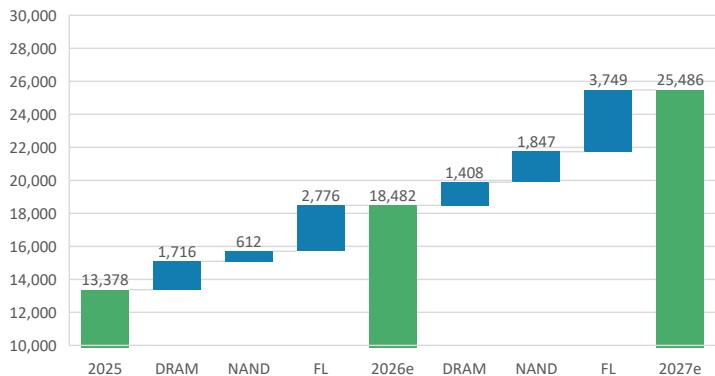

bar

| Year | DRAM | NAND | FL |
| :--- | :--- | :--- | :--- |
| 2025 | 13,378 | 1,716 | 612 |
| 2026e | 18,482 | 1,408 | 2,776 |
| 2027e | 25,486 | 1,847 | 3,749 |

Source: Company data, MS. e = MS estimates

Exhibit 37: NAND doesn't shift the needle for AMAT   
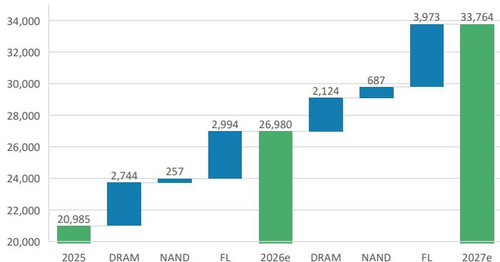

bar

| Year | DRAM | NAND | FL | 2026e | 2027e |
| :--- | :--- | :--- | :--- | :--- | :--- |
| 2025 | 20,985 | - | - | 26,980 | - |
| 2026e | 2,744 | 257 | 2,994 | - | - |
| 2027e | 3,973 | 687 | - | - | 33,764 |

Source: Company data, MS. e = MS estimates

# Risk Reward – Lam Research Corp (LRCX.O)

WFE outperformance intact with NAND & Logic

# PRICE TARGET \$331.00

34x CY27 non-GAAP EPS of \$9.73, multiple reflects a 20% premium to AMAT (28x) to reflect LAM's market share gains.

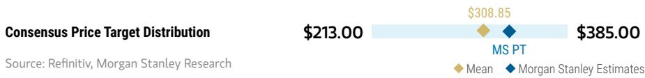

bar_line

| Category             | Value    |
| -------------------- | -------- |
| MS PT                | $308.85  |
| MS Estimates | $385.00  |
| Consensus Price Target Distribution | $213.00  |

RISK REWARD CHART AND OPTIONS IMPLIED PROBABILITIES (12M)   
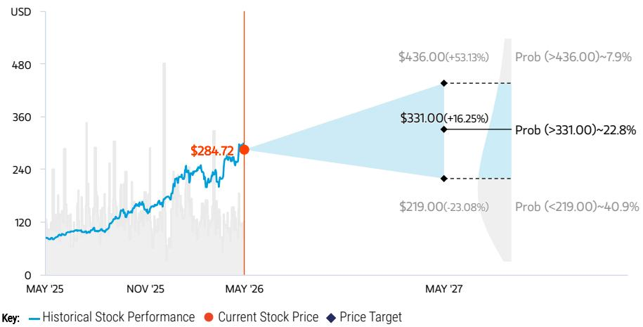

line

| Date     | Historical Stock Performance | Current Stock Price | Price Target |
| -------- | ----------------------------- | ------------------- | ------------ |
| MAY '25  | ~100                          | -                   | -            |
| NOV '25  | ~150                          | -                   | -            |
| MAY '26  | $284.72                       | -                   | -            |
| MAY '27  | $436.00 (-)                   | $331.00 (-)         | $219.00 (-)  |
| Prob (>436.00) | ~$436.00 (-)                | -                   | -            |
| Prob (>331.00) | ~$331.00 (-)                 | -                   | -            |
| Prob (<219.00) | ~$219.00 (-)                 | -                   | -            |
| Prob (>436.00) | ~$436.00 (-)                 | -                   | -            |

Source: Refinitiv, MS, MS Institutional Equities Division. The probabilities of our Bull, Base, and Bear case scenarios playing out were estimated with implied volatility data from the options market as of 15 May 2026. All figures are approximate risk-neutral probabilities of the stock reaching beyond the scenario price in either three-months' or one-years' time. View explanation of Options Probabilities methodology here

# OVERWEIGHT THESIS

■ After shipments underperformed WFE by 33ppt in 2023 due to a cyclical decline in NAND and China entity list impact, LAM outperformed WFE by 8ppt in 2024 and we estimate another 27ppt outperformance in 2025 driven by NAND, China, and TSMC. We model LAM's system shipments to outperform WFE in 2026 & 2027 for the 3rd and 4th consecutive year as NAND and non-China foundry logic continues to strengthen.
■ LAM has unique drivers supporting the long-term growth story as the company is seeing gross margin expansion from shifting manufacturing to Malaysia, is positioned well to gain share with the 4F2 transition in DRAM and in advanced packaging.

Consensus Rating Distribution   
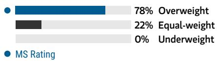

bar

| Category      | Value |
| ------------- | ----- |
| Overweight    | 78%   |
| Equal-weight  | 22%   |
| Underweight   | 0%    |

Source: Refinitiv, MS

# Risk Reward Themes

New Data Era: Positive
Secular Growth: Positive

View descriptions of Risk Rewards Themes here

# BULL CASE

# \$436.00

# \~39x CY27 non-GAAP EPS \$11.18

DRAM and NAND pricing and utilization improve further than expected, and LAM sees record revenue in CY27. The company sees revenue growth exceed WFE on the back of market share gains in leading edge nodes.

\- Revenue growth of 45.6% in CY27 as LAM benefits from NAND WFE growth and market share gains

\- GM expands to 52.4% in CY27

# BASE CASE

# \$331.00

# \~34x CY27 non-GAAP EPS of \$9.73

We expect LAM to outperform in 2026-27 on the back of NAND and foundry logic strength.

– Revenue growth of 31.2% in CY27 driven by NAND and foundry logic

\- CY27 GM of 51.4% as regional mix deterioration is offset by top-line growth

# BEAR CASE

# \$219.00

# \~25x CY27 non-GAAP EPS of \$8.76

Memory markets turn weaker and LAM loses share to competitors.

\- Revenue growth of 21.4% in CY27 as memory recovery more muted than expected

\- GM of 50.6% in CY27

# Risk Reward – Lam Research Corp (LRCX.O)

KEY EARNINGS INPUTS 

<table><tr><td>Drivers</td><td>2025</td><td>2026e</td><td>2027e</td><td>2028e</td></tr><tr><td>GAAP Revenue ($, mm)</td><td>18,436</td><td>23,173</td><td>31,494</td><td>38,491</td></tr><tr><td>MW Gross Margin (%)</td><td>48.8</td><td>50.2</td><td>51.0</td><td>51.6</td></tr><tr><td>Non-GAAP EPS ($)</td><td>4.13</td><td>5.72</td><td>8.39</td><td>10.74</td></tr><tr><td>Inventory ($, mm)</td><td>4,308</td><td>4,548</td><td>5,685</td><td>6,153</td></tr><tr><td>DOI</td><td>164.0</td><td>141.6</td><td>132.6</td><td>118.8</td></tr></table>

CATALYST CALENDAR 

<table><tr><td>Date</td><td>Event</td><td>Source: Refinitiv, MS</td></tr><tr><td>04 Nov 2026 - 08 Nov 2026</td><td>Lam Research Corp Annual Shareholders Meeting</td><td></td></tr></table>

# INVESTMENT DRIVERS

- NAND WFE market trends (LAM has outsized share)   
- Market share gains from new logic architectures (GAA, backside power)

# GLOBAL REVENUE EXPOSURE

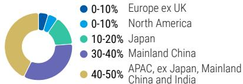  
0-10% Europe ex UK   
0-10% North America   
10-20% Japan   
30-40% Mainland China   
40-50% APAC, ex Japan, Mainland China and India

Source: MS Estimate View explanation of regional hierarchies here

MS ALPHA MODELS 

<table><tr><td>5/5BEST</td><td>24 MonthHorizon</td><td>2/5MOST</td><td>3 MonthHorizon</td></tr></table>

Source: Refinitiv, FactSet, MS; 1 is the highest favored Quintile and 5 is the least favored Quintile

# RISKS TO PT/RATING

# RISKS TO UPSIDE

- Market share gains in new logic architectures (GAA, backside power)   
• NAND capex recovers to new highs   
• Continued share gains in China

# RISKS TO DOWNSIDE

• NAND WFE weaker than expected   
- Widespread export restrictions to China   
• Market share loss to competitors in etch

OWNERSHIP POSITIONING 

<table><tr><td>Inst. Owners, % Active</td><td>49.8%</td><td></td><td></td><td></td><td></td></tr><tr><td>HF Sector Long/Short Ratio</td><td>2x</td><td></td><td></td><td></td><td></td></tr><tr><td>HF Sector Net Exposure</td><td>25.3%</td><td></td><td></td><td></td><td></td></tr></table>

Refinitiv; MSPB Content. Includes certain hedge fund exposures held with MSPB. Information may be inconsistent with or may not reflect broader market trends. Long/Short Ratio = Long Exposure / Short exposure. Sector % of Total Net Exposure = (For a particular sector: Long Exposure - Short Exposure) / (Across all sectors: Long Exposure – Short Exposure).

MS ESTIMATES VS. CONSENSUS 

<table><tr><td colspan="3">FY Jun 2026e</td></tr><tr><td rowspan="2">Sales / Revenue ($, mm)</td><td rowspan="2">22,519</td><td>23,173</td></tr><tr><td>23,262</td></tr><tr><td rowspan="2">EBITDA ($, mm)</td><td rowspan="2">7,848</td><td>8,618</td></tr><tr><td>8,539</td></tr><tr><td rowspan="2">Net income ($, mm)</td><td rowspan="2">6,667</td><td>7,210</td></tr><tr><td>7,127</td></tr><tr><td rowspan="2">EPS ($)</td><td rowspan="2">5.59</td><td>5.72</td></tr><tr><td>5.72</td></tr></table>

Source: Refinitiv, MS

# Risk Reward – Applied Materials Inc. (AMAT.O)

DRAM/Leading Logic upside & China/ICAPS derisked

# PRICE TARGET \$502.00

\~28x CY27e EPS of \$17.94, a 6-turn discount to LAM and 5-turns to KLA to reflect growth prospects in DRAM but concerns around market share loss in China.

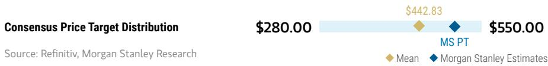

bar_line

| Category | Value    |
| -------- | -------- |
| Mean     | $442.83  |
| MS Estimates | $550.00   |

RISK REWARD CHART AND OPTIONS IMPLIED PROBABILITIES (12M)   
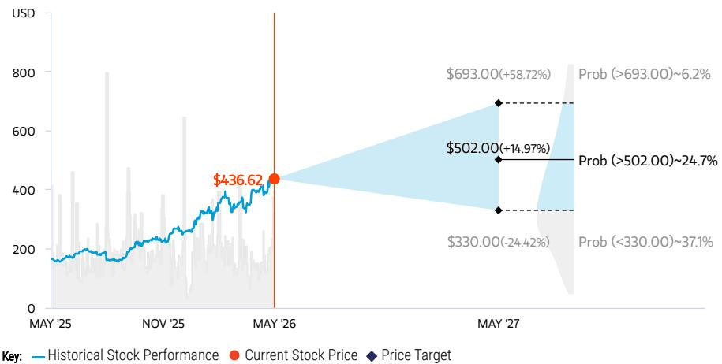

line

| Date       | Historical Stock Performance | Current Stock Price | Price Target |
| ---------- | ----------------------------- | ------------------- | ------------ |
| MAY '26    | $436.62                       | -                   | -            |
| MAY '27    | -                             | $693.00             | $693.00      |
| MAY '27    | -                             | $502.00             | $502.00      |
| MAY '27    | -                             | $330.00             | $330.00      |
| MAY '27    | -                             | Prob (>693.00)     | Prob (693.00) |
| MAY '27    | -                             | Prob (>502.00)     | Prob (502.00) |
| MAY '27    | -                             | Prob (<330.00)     | Prob (<330.00)|

Source: Refinitiv, MS, MS Institutional Equities Division. The probabilities of our Bull, Base, and Bear case scenarios playing out were estimated with implied volatility data from the options market as of 15 May 2026. All figures are approximate risk-neutral probabilities of the stock reaching beyond the scenario price in either three-months' or one-years' time. View explanation of Options Probabilities methodology here

# EQUAL-WEIGHT THESIS

■ AMAT has traded at a material valuation discount vs LAM & KLA given execution and concerns around market share loss in China. We think AMAT will be a share gainer in 2026 but given our growth forecast is in-line with broader WFE in 2027 we think the valuation discount is unlikely to narrow in the near term.   
■ AMAT has the highest DRAM mix in their portfolio (CY26 31% vs LAM 23%, KLA 28%) and is most levered to greenfield wafer additions. We see DRAM as the fastest growing end-market in 2026 but the slowest growing in 2027.

Consensus Rating Distribution   
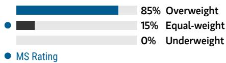

bar

| Category | Value (%) |
|---|---|
| Overweight | 85 |
| Equal-weight | 15 |
| Underweight | 0 |
| MS Rating | |

Source: Refinitiv, MS

# Risk Reward Themes

New Data Era: Positive

View descriptions of Risk Rewards Themes here

# BULL CASE

# \$693.00

# \~33x CY27 EPS of \$20.37

DRAM & ICAPS remain strong and AMAT's margin expansion accelerates.

- Revenue grows 36.9% in CY27 as AMAT outperforms WFE   
- Gross margin expands to 51.3% in CY27   
- Multiples expand to 33x PE, as equipment is perceived as a growth sector within semis

# BASE CASE

# \~28x CY27 EPS of \$17.94

AMAT grows in-line with WFE with DRAM growth slightly offset by China/ICAPS

- Revenue growth of 24.5% in CY27   
- Non-GAAP gross margin slightly increases to 50.8% in CY27   
-Multiple at a premium to AMAT's historical average

# \$502.00

# BEAR CASE

# \$330.00

# \~21x CY27 EPS of \$15.72

DRAM WFE remains weak in 2026 and leading edge logic sees headwinds from foundries scaling back their aspirations.

- Revenue increases 14.5% in CY27 as WFE recovery is subdued.   
- Gross margin slightly increases to 50.1% in CY27   
- Multiple contracts to a 21x PE, 1 standard deviation premium to historical levels

# Risk Reward – Applied Materials Inc. (AMAT.O)

KEY EARNINGS INPUTS 

<table><tr><td>Drivers</td><td>2025</td><td>2026e</td><td>2027e</td><td>2028e</td></tr><tr><td>GAAP Revenue ($, mm)</td><td>28,368</td><td>33,483</td><td>43,373</td><td>48,812</td></tr><tr><td>MW Gross Margin (%)</td><td>48.8</td><td>50.0</td><td>50.8</td><td>50.8</td></tr><tr><td>Non-GAAP EPS ($)</td><td>9.42</td><td>12.31</td><td>17.02</td><td>19.71</td></tr><tr><td>Inventory ($, mm)</td><td>5,915</td><td>7,580</td><td>9,137</td><td>9,786</td></tr><tr><td>DOI</td><td>146.2</td><td>162.8</td><td>154.0</td><td>146.5</td></tr></table>

# INVESTMENT DRIVERS

• DRAM WFE outpaces overall WFE growth   
- AMAT capitalizes on logic growth opportunities (GAA, back-side power)

# GLOBAL REVENUE EXPOSURE

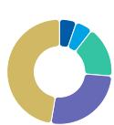

0-10% Europe ex UK   
0-10% Japan   
10-20% North America   
20-30% Mainland China   
40-50% APAC, ex Japan, Mainland China and India

Source: MS Estimate View explanation of regional hierarchies here

# MS ALPHA MODELS

5/5 BEST

24 Month Horizon

3/5 MOST

3 Month Horizon

Source: Refinitiv, FactSet, MS; 1 is the highest favored Quintile and 5 is the least favored Quintile

# RISKS TO PT/RATING

# RISKS TO UPSIDE

• Market share gains as DRAM outpaces WFE   
- AMAT captures market share in logic architecture inflections (backside power)

# RISKS TO DOWNSIDE

- Widespread restrictions on equipment shipments and services to China   
- AMAT loses market share with key customers (Samsung, TSMC)

# OWNERSHIP POSITIONING

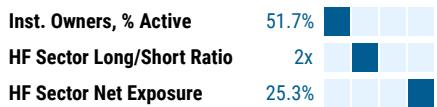

bar

| Category | Value |
| -------- | ----- |
| Inst. Owners, % Active | 51.7% |
| HF Sector Long/Short Ratio | 2x |
| HF Sector Net Exposure | 25.3% |

Refinitiv; MSPB Content. Includes certain hedge fund exposures held with MSPB. Information may be inconsistent with or may not reflect broader market trends. Long/Short Ratio = Long Exposure / Short exposure. Sector % of Total Net Exposure = (For a particular sector: Long Exposure - Short Exposure) / (Across all sectors: Long Exposure – Short Exposure).

# MS ESTIMATES VS. CONSENSUS

<table><tr><td colspan="3">FY Oct 2026e</td></tr><tr><td>Sales / Revenue ($, mm)</td><td>28,470</td><td>31,395</td></tr><tr><td>EBITDA ($, mm)</td><td>8,730</td><td>10,113</td></tr><tr><td>Net income ($, mm)</td><td>7,346</td><td>8,802</td></tr><tr><td>EPS ($)</td><td>9.27</td><td>11.06</td></tr></table>

Source: Refinitiv, MS

# Projected Financial Statements

Exhibit 38: LRCX: Projected Income Statement 

<table><tr><td>Lam Research Corporation Income Statement($ in millions; fiscal year ends in June)</td><td>C3Q24A Sep-24</td><td>C4Q24E Dec-24</td><td>C1Q25A Mar-25</td><td>C2Q25A Jun-25</td><td>C3Q25A Sep-25</td><td>C4Q25A Dec-25</td><td>C1Q26A Mar-26</td><td>C2Q26E Jun-26</td><td>C3Q26E Sep-26</td><td>C4Q26E Dec-26</td><td>C1Q27E Mar-27</td><td>C2Q27E Jun-27</td><td>C3Q27E Sep-27</td><td>C4Q27E Dec-27</td><td>C1Q28E Mar-28</td><td>C2Q28E Jun-28</td></tr><tr><td>Revenues - GAAP</td><td>$ 4,168.0</td><td>$ 4,376.0</td><td>$ 4,720.2</td><td>$ 5,171.4</td><td>$ 5,324.2</td><td>$ 5,344.8</td><td>$ 5,841.5</td><td>$ 6,662.2</td><td>$ 7,082.9</td><td>$ 7,480.8</td><td>$ 8,107.5</td><td>$ 8,822.9</td><td>$ 9,219.0</td><td>$ 9,363.4</td><td>$ 9,884.9</td><td>$ 10,023.6</td></tr><tr><td>q/q change (%)</td><td>7.7%</td><td>5.0%</td><td>7.9%</td><td>9.6%</td><td>3.0%</td><td>0.4%</td><td>9.3%</td><td>14.0%</td><td>6.3%</td><td>5.6%</td><td>8.4%</td><td>8.8%</td><td>4.5%</td><td>1.6%</td><td>5.6%</td><td>1.4%</td></tr><tr><td>y/y change (%)</td><td>19.7%</td><td>16.4%</td><td>24.4%</td><td>33.6%</td><td>27.7%</td><td>22.1%</td><td>23.8%</td><td>28.8%</td><td>33.0%</td><td>40.0%</td><td>38.8%</td><td>32.4%</td><td>30.2%</td><td>25.2%</td><td>21.9%</td><td>13.6%</td></tr><tr><td>COGS - GAAP</td><td>2,165.3</td><td>2,303.1</td><td>2,406.5</td><td>2,581.7</td><td>2,639.3</td><td>2,693.6</td><td>2,931.0</td><td>3,300.4</td><td>3,494.4</td><td>3,683.1</td><td>3,964.5</td><td>4,296.7</td><td>4,471.2</td><td>4,541.2</td><td>4,784.3</td><td>4,851.4</td></tr><tr><td>% of revenue</td><td>52.0%</td><td>52.6%</td><td>1364.7%</td><td>49.9%</td><td>49.6%</td><td>50.4%</td><td>50.2%</td><td>49.5%</td><td>49.3%</td><td>49.2%</td><td>48.9%</td><td>48.7%</td><td>48.5%</td><td>48.5%</td><td>48.4%</td><td>48.4%</td></tr><tr><td>COGS - non-GAAP</td><td>2,159.0</td><td>2,298.9</td><td>2,407.8</td><td>2,570.4</td><td>2,630.6</td><td>2,684.9</td><td>2,928.4</td><td>3,297.8</td><td>3,491.9</td><td>3,680.5</td><td>3,964.5</td><td>4,296.7</td><td>4,471.2</td><td>4,541.2</td><td>4,784.3</td><td>4,851.4</td></tr><tr><td>% of revenue</td><td>51.8%</td><td>52.5%</td><td>51.0%</td><td>49.7%</td><td>49.4%</td><td>50.2%</td><td>50.1%</td><td>49.5%</td><td>49.3%</td><td>49.2%</td><td>48.9%</td><td>48.7%</td><td>48.5%</td><td>48.5%</td><td>48.4%</td><td>48.4%</td></tr><tr><td>Gross profit - GAAP</td><td>2,002.7</td><td>2,073.0</td><td>2,313.7</td><td>2,589.7</td><td>2,684.9</td><td>2,651.2</td><td>2,910.5</td><td>3,361.8</td><td>3,588.4</td><td>3,797.6</td><td>4,142.9</td><td>4,526.1</td><td>4,747.8</td><td>4,822.1</td><td>5,100.6</td><td>5,172.2</td></tr><tr><td>Gross margin (%)</td><td>48.0%</td><td>47.4%</td><td>49.0%</td><td>50.1%</td><td>50.4%</td><td>49.6%</td><td>49.8%</td><td>50.5%</td><td>50.7%</td><td>50.8%</td><td>51.1%</td><td>51.3%</td><td>51.5%</td><td>51.5%</td><td>51.6%</td><td>51.6%</td></tr><tr><td>Gross profit - non-GAAP</td><td>2,009.0</td><td>2,077.2</td><td>2,312.4</td><td>2,601.0</td><td>2,693.6</td><td>2,659.9</td><td>2,913.1</td><td>3,364.4</td><td>3,591.0</td><td>3,800.2</td><td>4,142.9</td><td>4,526.1</td><td>4,747.8</td><td>4,822.1</td><td>5,100.6</td><td>5,172.2</td></tr><tr><td>Gross margin (%)</td><td>48.2%</td><td>47.5%</td><td>49.0%</td><td>50.3%</td><td>50.6%</td><td>49.8%</td><td>49.9%</td><td>50.5%</td><td>50.7%</td><td>50.8%</td><td>51.1%</td><td>51.3%</td><td>51.5%</td><td>51.5%</td><td>51.6%</td><td>51.6%</td></tr><tr><td>R&amp;D - GAAP</td><td>495.4</td><td>494.9</td><td>525.9</td><td>580.2</td><td>576.4</td><td>573.3</td><td>583.2</td><td>634.4</td><td>667.3</td><td>704.8</td><td>747.6</td><td>778.3</td><td>808.7</td><td>821.3</td><td>847.3</td><td>859.2</td></tr><tr><td>R&amp;D - non-GAAP</td><td>487.2</td><td>492.5</td><td>533.1</td><td>564.8</td><td>565.6</td><td>565.3</td><td>585.4</td><td>634.4</td><td>667.3</td><td>704.8</td><td>747.6</td><td>778.3</td><td>808.7</td><td>821.3</td><td>847.3</td><td>859.2</td></tr><tr><td>% of revenue</td><td>11.7%</td><td>11.3%</td><td>11.3%</td><td>10.9%</td><td>10.6%</td><td>10.6%</td><td>10.0%</td><td>9.5%</td><td>9.4%</td><td>9.4%</td><td>9.2%</td><td>8.8%</td><td>8.8%</td><td>8.8%</td><td>8.6%</td><td>8.6%</td></tr><tr><td>SG&amp;A - GAAP</td><td>243.1</td><td>244.2</td><td>226.0</td><td>268.4</td><td>279.3</td><td>267.7</td><td>280.3</td><td>286.9</td><td>297.9</td><td>307.2</td><td>316.7</td><td>335.8</td><td>341.7</td><td>347.0</td><td>366.3</td><td>361.5</td></tr><tr><td>SG&amp;A - non-GAAP</td><td>234.9</td><td>242.0</td><td>230.3</td><td>257.6</td><td>266.3</td><td>262.1</td><td>280.7</td><td>287.3</td><td>298.3</td><td>307.6</td><td>317.1</td><td>336.2</td><td>342.1</td><td>347.5</td><td>366.8</td><td>361.9</td></tr><tr><td>% of revenue</td><td>5.6%</td><td>5.5%</td><td>4.9%</td><td>5.0%</td><td>5.0%</td><td>4.9%</td><td>4.8%</td><td>4.3%</td><td>4.2%</td><td>4.1%</td><td>3.9%</td><td>3.8%</td><td>3.7%</td><td>3.7%</td><td>3.7%</td><td>3.6%</td></tr><tr><td>Operating expenses - GAAP</td><td>738.5</td><td>739.1</td><td>751.9</td><td>848.6</td><td>855.8</td><td>841.0</td><td>863.5</td><td>921.2</td><td>965.2</td><td>1,012.0</td><td>1,064.3</td><td>1,114.1</td><td>1,150.3</td><td>1,168.3</td><td>1,213.6</td><td>1,220.7</td></tr><tr><td>Operating expenses - non-GAAP</td><td>722.1</td><td>734.5</td><td>763.3</td><td>822.4</td><td>831.9</td><td>827.5</td><td>866.2</td><td>921.7</td><td>965.7</td><td>1,012.4</td><td>1,064.8</td><td>1,114.6</td><td>1,150.8</td><td>1,168.8</td><td>1,214.1</td><td>1,221.1</td></tr><tr><td>q/q change (%)</td><td>4.8%</td><td>1.7%</td><td>3.9%</td><td>7.7%</td><td>1.2%</td><td>-0.5%</td><td>4.7%</td><td>6.4%</td><td>4.8%</td><td>4.8%</td><td>5.2%</td><td>4.7%</td><td>3.2%</td><td>1.6%</td><td>3.9%</td><td>0.6%</td></tr><tr><td>% of revenue</td><td>17.3%</td><td>16.8%</td><td>16.2%</td><td>15.9%</td><td>15.6%</td><td>15.5%</td><td>14.8%</td><td>13.8%</td><td>13.6%</td><td>13.5%</td><td>13.1%</td><td>12.6%</td><td>12.5%</td><td>12.5%</td><td>12.3%</td><td>12.2%</td></tr><tr><td>Operating income - GAAP</td><td>1,264.2</td><td>1,333.9</td><td>1,561.8</td><td>1,741.1</td><td>1,829.1</td><td>1,810.2</td><td>2,047.0</td><td>2,440.6</td><td>2,623.2</td><td>2,785.7</td><td>3,078.6</td><td>3,412.0</td><td>3,597.4</td><td>3,653.8</td><td>3,887.0</td><td>3,951.5</td></tr><tr><td>Operating margin (%)</td><td>30.3%</td><td>30.5%</td><td>33.1%</td><td>33.7%</td><td>34.4%</td><td>33.9%</td><td>35.0%</td><td>36.6%</td><td>37.0%</td><td>37.2%</td><td>38.0%</td><td>38.7%</td><td>39.0%</td><td>39.0%</td><td>39.3%</td><td>39.4%</td></tr><tr><td>Operating income - non-GAAP</td><td>1,286.9</td><td>1,342.6</td><td>1,549.1</td><td>1,778.6</td><td>1,861.7</td><td>1,832.4</td><td>2,047.0</td><td>2,442.7</td><td>2,625.3</td><td>2,787.8</td><td>3,078.1</td><td>3,411.6</td><td>3,597.0</td><td>3,653.3</td><td>3,886.5</td><td>3,951.1</td></tr><tr><td>Operating margin (%)</td><td>30.9%</td><td>30.7%</td><td>32.8%</td><td>34.4%</td><td>35.0%</td><td>34.3%</td><td>35.0%</td><td>36.7%</td><td>37.1%</td><td>37.3%</td><td>38.0%</td><td>38.7%</td><td>39.0%</td><td>39.0%</td><td>39.3%</td><td>39.4%</td></tr><tr><td>Total interest income (net) and other income - GAAP</td><td>30.1</td><td>14.3</td><td>(25.0)</td><td>37.9</td><td>30.1</td><td>26.4</td><td>(35.5)</td><td>25.0</td><td>25.0</td><td>25.0</td><td>25.0</td><td>25.0</td><td>25.0</td><td>25.0</td><td>25.0</td><td>25.0</td></tr><tr><td>Interest income (expense)</td><td></td><td></td><td></td><td></td><td></td><td></td><td></td><td></td><td></td><td></td><td></td><td></td><td></td><td></td><td></td><td></td></tr><tr><td>Other income (expense), net</td><td>30.1</td><td>14.3</td><td>(25.0)</td><td>37.9</td><td>30.1</td><td>26.4</td><td>(35.5)</td><td>25.0</td><td>25.0</td><td>25.0</td><td>25.0</td><td>25.0</td><td>25.0</td><td>25.0</td><td>25.0</td><td>25.0</td></tr><tr><td>Total interest income (net) and other income - non-GAA</td><td>13.4</td><td>10.5</td><td>(7.4)</td><td>4.4</td><td>14.1</td><td>10.5</td><td>(7.5)</td><td>52.9</td><td>52.9</td><td>52.9</td><td>52.9</td><td>52.9</td><td>52.9</td><td>52.9</td><td>52.9</td><td>52.9</td></tr><tr><td>PBT - GAAP</td><td>1,294.3</td><td>1,348.1</td><td>1,536.7</td><td>1,779.0</td><td>1,859.2</td><td>1,836.6</td><td>2,011.6</td><td>2,465.6</td><td>2,648.2</td><td>2,810.7</td><td>3,103.6</td><td>3,437.0</td><td>3,622.4</td><td>3,678.8</td><td>3,912.0</td><td>3,976.5</td></tr><tr><td>PBT - non-GAAP</td><td>1,300.3</td><td>1,353.2</td><td>1,541.7</td><td>1,783.0</td><td>1,875.8</td><td>1,842.9</td><td>2,039.4</td><td>2,495.7</td><td>2,678.3</td><td>2,840.8</td><td>3,131.1</td><td>3,464.5</td><td>3,649.9</td><td>3,706.3</td><td>3,939.5</td><td>4,004.0</td></tr><tr><td>Income tax expense (benefit) - GAAP</td><td>177.8</td><td>157.1</td><td>206.1</td><td>58.9</td><td>290.5</td><td>242.6</td><td>186.1</td><td>345.2</td><td>370.7</td><td>393.5</td><td>434.5</td><td>481.2</td><td>507.1</td><td>515.0</td><td>547.7</td><td>556.7</td></tr><tr><td>Income tax expense (benefit) - non-GAAP</td><td>178.8</td><td>178.2</td><td>205.7</td><td>85.3</td><td>264.8</td><td>243.6</td><td>188.0</td><td>347.1</td><td>372.6</td><td>395.4</td><td>436.4</td><td>483.1</td><td>509.0</td><td>516.9</td><td>549.6</td><td>558.6</td></tr><tr><td>Effective tax rate (%)</td><td>13.8%</td><td>13.2%</td><td>13.3%</td><td>4.8%</td><td>14.1%</td><td>13.2%</td><td>9.2%</td><td>13.9%</td><td>13.9%</td><td>13.9%</td><td>13.9%</td><td>13.9%</td><td>13.9%</td><td>13.9%</td><td>14.0%</td><td>14.0%</td></tr><tr><td>Net income, cont. ops. - GAAP</td><td>1,116.4</td><td>1,191.0</td><td>1,330.7</td><td>1,720.1</td><td>1,568.7</td><td>1,594.0</td><td>1,825.5</td><td>2,120.4</td><td>2,277.4</td><td>2,417.2</td><td>2,669.1</td><td>2,955.8</td><td>3,115.3</td><td>3,163.8</td><td>3,364.3</td><td>3,419.8</td></tr><tr><td>Net income, cont. ops. - non-GAAP</td><td>1,121.5</td><td>1,175.0</td><td>1,336.0</td><td>1,697.7</td><td>1,611.1</td><td>1,599.2</td><td>1,851.4</td><td>2,148.6</td><td>2,305.6</td><td>2,445.4</td><td>2,694.7</td><td>2,981.4</td><td>3,140.9</td><td>3,189.4</td><td>3,389.9</td><td>3,445.4</td></tr><tr><td>Net margin (%)</td><td>26.9%</td><td>26.9%</td><td>28.3%</td><td>32.8%</td><td>30.3%</td><td>29.9%</td><td>31.7%</td><td>32.3%</td><td>32.6%</td><td>32.7%</td><td>33.2%</td><td>33.8%</td><td>34.1%</td><td>34.1%</td><td>34.3%</td><td>34.4%</td></tr><tr><td>EPS - GAAP</td><td>$ 0.86</td><td>$ 0.92</td><td>$ 1.03</td><td>$ 1.35</td><td>$ 1.24</td><td>$ 1.26</td><td>$ 1.45</td><td>$ 1.69</td><td>$ 1.82</td><td>$ 1.94</td><td>$ 2.15</td><td>$ 2.39</td><td>$ 2.53</td><td>$ 2.58</td><td>$ 2.75</td><td>$ 2.80</td></tr><tr><td>EPS - non-GAAP</td><td>$ 0.86</td><td>$ 0.91</td><td>$ 1.04</td><td>$ 1.33</td><td>$ 1.27</td><td>$ 1.27</td><td>$ 1.47</td><td>$ 1.71</td><td>$ 1.85</td><td>$ 1.97</td><td>$ 2.17</td><td>$ 2.41</td><td>$ 2.55</td><td>$ 2.60</td><td>$ 2.77</td><td>$ 2.82</td></tr></table>

<table><tr><td>CY2024Dec-24</td><td>CY2025Dec-25</td><td>CY2026Dec-26</td><td>CY2027Dec-27</td><td>CY2028Dec-28</td></tr><tr><td>$ 16,209.1</td><td>$ 20,560.5</td><td>$ 27,067.4</td><td>$ 35,512.7</td><td>$ 40,216.9</td></tr><tr><td>13.2%</td><td>26.8%</td><td>31.6%</td><td>31.2%</td><td>13.2%</td></tr><tr><td>8,492.8</td><td>10,321.1</td><td>13,408.9</td><td>17,273.7</td><td>19,424.3</td></tr><tr><td>52.4%</td><td>50.2%</td><td>49.5%</td><td>48.6%</td><td>48.3%</td></tr><tr><td>8,398.8</td><td>10,293.7</td><td>13,398.6</td><td>17,273.7</td><td>19,424.3</td></tr><tr><td>51.8%</td><td>50.1%</td><td>49.5%</td><td>48.6%</td><td>48.3%</td></tr><tr><td>7,716.3</td><td>10,239.4</td><td>13,658.4</td><td>18,238.9</td><td>20,792.5</td></tr><tr><td>47.6%</td><td>49.8%</td><td>50.5%</td><td>51.4%</td><td>51.7%</td></tr><tr><td>7,810.3</td><td>10,266.8</td><td>13,668.8</td><td>18,238.9</td><td>20,792.5</td></tr><tr><td>48.2%</td><td>49.9%</td><td>50.5%</td><td>51.4%</td><td>51.7%</td></tr><tr><td>2,000.4</td><td>2,255.8</td><td>2,589.7</td><td>3,156.0</td><td>3,437.1</td></tr><tr><td>1,959.9</td><td>2,228.8</td><td>2,591.9</td><td>3,156.0</td><td>3,437.1</td></tr><tr><td>12.1%</td><td>10.8%</td><td>9.6%</td><td>8.9%</td><td>8.5%</td></tr><tr><td>919.7</td><td>1,041.4</td><td>1,172.3</td><td>1,341.2</td><td>1,450.0</td></tr><tr><td>883.5</td><td>1,016.3</td><td>1,174.0</td><td>1,342.9</td><td>1,451.7</td></tr><tr><td>5.5%</td><td>4.9%</td><td>4.3%</td><td>3.8%</td><td>3.6%</td></tr><tr><td>2,934.5</td><td>3,297.3</td><td>3,762.0</td><td>4,497.1</td><td>4,887.1</td></tr><tr><td>2,843.5</td><td>3,245.1</td><td>3,765.9</td><td>4,498.9</td><td>4,888.9</td></tr><tr><td>14.6%</td><td>14.1%</td><td>16.0%</td><td>19.5%</td><td>8.7%</td></tr><tr><td>17.5%</td><td>15.8%</td><td>13.9%</td><td>12.7%</td><td>12.2%</td></tr><tr><td>4,781.8</td><td>6,942.2</td><td>9,896.4</td><td>13,741.8</td><td>15,905.4</td></tr><tr><td>29.5%</td><td>33.8%</td><td>36.6%</td><td>38.7%</td><td>39.5%</td></tr><tr><td>4,966.8</td><td>7,021.7</td><td>9,902.8</td><td>13,740.1</td><td>15,903.7</td></tr><tr><td>30.6%</td><td>34.2%</td><td>36.6%</td><td>38.7%</td><td>39.5%</td></tr><tr><td>108.2</td><td>69.3</td><td>39.5</td><td>100.0</td><td>100.0</td></tr><tr><td>-</td><td>-</td><td>-</td><td>-</td><td>-</td></tr><tr><td>108.2</td><td>69.3</td><td>39.5</td><td>100.0</td><td>100.0</td></tr><tr><td>53.2</td><td>21.7</td><td>151.3</td><td>211.8</td><td>211.8</td></tr><tr><td>4,890.0</td><td>7,011.5</td><td>9,936.0</td><td>13,841.8</td><td>16,005.4</td></tr><tr><td>5,020.0</td><td>7,043.4</td><td>10,054.1</td><td>13,951.8</td><td>16,115.4</td></tr><tr><td>596.4</td><td>798.1</td><td>1,295.5</td><td>1,937.9</td><td>2,240.8</td></tr><tr><td>632.4</td><td>799.4</td><td>1,303.1</td><td>1,945.4</td><td>2,248.3</td></tr><tr><td>12.6%</td><td>11.3%</td><td>13.0%</td><td>13.9%</td><td>14.0%</td></tr><tr><td>4,293.6</td><td>6,213.4</td><td>8,640.5</td><td>11,904.0</td><td>13,764.6</td></tr><tr><td>4,387.6</td><td>6,244.0</td><td>8,751.0</td><td>12,006.4</td><td>13,867.1</td></tr><tr><td>27.1%</td><td>30.4%</td><td>32.3%</td><td>33.8%</td><td>34.5%</td></tr><tr><td>$ 3.29</td><td>$ 4.88</td><td>$ 6.91</td><td>$ 9.65</td><td>$ 11.29</td></tr><tr><td>$ 3.36</td><td>$ 4.90</td><td>$ 7.00</td><td>$ 9.73</td><td>$ 11.38</td></tr></table>

Source: Company data, MS estimates

Exhibit 39: LRCX: Projected Balance Sheet 

<table><tr><td>Lam Research Corporation Balance Sheet($ in millions, fiscal year ends in June)</td><td>C3Q24ASep-242025/1F</td><td>C4Q24EDec-242025/2F</td><td>C1Q25AMar-252025/3F</td><td>C2Q25AJun-252025/4F</td><td>C3Q25ASep-252026/1F</td><td>C4Q25ADec-252026/2F</td><td>C1Q26AMar-262026/3F</td><td>C2Q26EJun-262026/4F</td><td>C3Q26ESep-262027/1F</td><td>C4Q26EDec-262027/2F</td><td>C1Q27EMar-272027/3F</td><td>C2Q27EJun-272027/4F</td><td>C3Q27ESep-272028/1F</td><td>C4Q27EDec-272028/2F</td><td>C1Q28EMar-282028/3F</td><td>C2Q28EJun-282028/4F</td></tr><tr><td>Assets:</td><td></td><td></td><td></td><td></td><td></td><td></td><td></td><td></td><td></td><td></td><td></td><td></td><td></td><td></td><td></td><td></td></tr><tr><td>Cash and cash equivalents</td><td>6,067.5</td><td>5,665.4</td><td>5,450.7</td><td>6,390.7</td><td>6,693.0</td><td>6,180.4</td><td>4,750.9</td><td>4,568.1</td><td>4,477.2</td><td>4,482.4</td><td>4,289.4</td><td>4,834.1</td><td>5,239.1</td><td>6,190.3</td><td>6,243.2</td><td>8,189.7</td></tr><tr><td>Marketable securities</td><td>-</td><td>-</td><td>-</td><td>-</td><td>-</td><td>-</td><td>-</td><td>-</td><td>-</td><td>-</td><td>-</td><td>-</td><td>-</td><td>-</td><td>-</td><td>-</td></tr><tr><td>Accounts receivable, net</td><td>2,937.2</td><td>3,304.9</td><td>3,228.2</td><td>3,378.1</td><td>3,633.0</td><td>3,492.0</td><td>4,132.9</td><td>4,467.7</td><td>4,576.5</td><td>4,975.8</td><td>5,606.8</td><td>5,783.1</td><td>5,988.8</td><td>5,967.5</td><td>6,935.2</td><td>6,004.8</td></tr><tr><td>Inventory</td><td>4,209.9</td><td>4,358.2</td><td>4,463.3</td><td>4,308.0</td><td>4,095.1</td><td>4,037.7</td><td>4,000.0</td><td>4,548.2</td><td>4,763.3</td><td>5,020.5</td><td>5,303.9</td><td>5,685.2</td><td>5,851.7</td><td>5,943.3</td><td>6,134.8</td><td>6,152.5</td></tr><tr><td>Deferred income taxes</td><td>-</td><td>-</td><td>-</td><td>-</td><td>-</td><td>-</td><td>-</td><td>-</td><td>-</td><td>-</td><td>-</td><td>-</td><td>-</td><td>-</td><td>-</td><td>-</td></tr><tr><td>Other current assets</td><td>277.8</td><td>284.4</td><td>318.1</td><td>440.3</td><td>385.6</td><td>307.9</td><td>413.1</td><td>413.1</td><td>413.1</td><td>413.1</td><td>413.1</td><td>413.1</td><td>413.1</td><td>413.1</td><td>413.1</td><td>413.1</td></tr><tr><td>Total current assets</td><td>13,492.4</td><td>13,612.8</td><td>13,460.3</td><td>14,517.0</td><td>14,806.7</td><td>14,018.0</td><td>13,296.9</td><td>13,997.2</td><td>14,230.1</td><td>14,891.8</td><td>15,613.3</td><td>16,715.5</td><td>17,492.7</td><td>18,514.2</td><td>19,726.3</td><td>20,760.1</td></tr><tr><td>PP&amp;E, net</td><td>2,214.3</td><td>2,313.6</td><td>2,372.2</td><td>2,428.7</td><td>2,510.5</td><td>2,711.0</td><td>2,853.6</td><td>3,041.2</td><td>3,241.4</td><td>3,452.7</td><td>3,685.3</td><td>3,942.3</td><td>4,208.9</td><td>4,473.2</td><td>4,752.2</td><td>5,028.0</td></tr><tr><td>Restricted cash</td><td>-</td><td>-</td><td>-</td><td>-</td><td>-</td><td>-</td><td>-</td><td>-</td><td>-</td><td>-</td><td>-</td><td>-</td><td>-</td><td>-</td><td>-</td><td>-</td></tr><tr><td>Long-term investments</td><td>-</td><td>-</td><td>-</td><td>-</td><td>-</td><td>-</td><td>-</td><td>-</td><td>-</td><td>-</td><td>-</td><td>-</td><td>-</td><td>-</td><td>-</td><td>-</td></tr><tr><td>Deferred income taxes</td><td>-</td><td>-</td><td>-</td><td>-</td><td>-</td><td>-</td><td>-</td><td>-</td><td>-</td><td>-</td><td>-</td><td>-</td><td>-</td><td>-</td><td>-</td><td>-</td></tr><tr><td>Goodwill</td><td>1,619.8</td><td>1,622.5</td><td>1,656.7</td><td>1,670.1</td><td>1,688.4</td><td>1,725.5</td><td>1,743.5</td><td>1,743.5</td><td>1,743.5</td><td>1,743.5</td><td>1,743.5</td><td>1,743.5</td><td>1,743.5</td><td>1,743.5</td><td>1,743.5</td><td>1,743.5</td></tr><tr><td>Intangible assets, net</td><td>138.5</td><td>138.5</td><td>138.5</td><td>138.5</td><td>138.5</td><td>138.5</td><td>138.5</td><td>138.5</td><td>138.5</td><td>138.5</td><td>138.5</td><td>138.5</td><td>138.5</td><td>138.5</td><td>138.5</td><td>138.5</td></tr><tr><td>Other non-current assets</td><td>2,067.5</td><td>2,152.5</td><td>2,340.5</td><td>2,590.8</td><td>2,756.0</td><td>2,798.1</td><td>2,759.4</td><td>2,759.4</td><td>2,759.4</td><td>2,759.4</td><td>2,759.4</td><td>2,759.4</td><td>2,759.4</td><td>2,759.4</td><td>2,759.4</td><td>2,759.4</td></tr><tr><td>Total assets</td><td>19,532.5</td><td>19,839.9</td><td>19,968.3</td><td>21,345.3</td><td>21,900.2</td><td>21,391.2</td><td>20,791.9</td><td>21,679.7</td><td>22,112.8</td><td>22,985.9</td><td>23,939.9</td><td>25,299.2</td><td>26,343.0</td><td>27,628.8</td><td>29,119.8</td><td>30,429.5</td></tr><tr><td>Liabilities &amp; Shareholders&#x27; Equity:</td><td></td><td></td><td></td><td></td><td></td><td></td><td></td><td></td><td></td><td></td><td></td><td></td><td></td><td></td><td></td><td></td></tr><tr><td>Accounts payable</td><td>704.2</td><td>822.3</td><td>853.3</td><td>854.2</td><td>863.2</td><td>1,026.9</td><td>1,071.6</td><td>1,265.5</td><td>1,182.1</td><td>1,397.6</td><td>1,440.9</td><td>1,601.7</td><td>1,530.1</td><td>1,650.7</td><td>1,774.8</td><td>1,660.6</td></tr><tr><td>Accrued expenses and other current liabilities</td><td>2,196.4</td><td>2,096.0</td><td>1,999.9</td><td>2,394.4</td><td>2,443.9</td><td>2,267.5</td><td>2,075.4</td><td>2,075.4</td><td>2,075.4</td><td>2,075.4</td><td>2,075.4</td><td>2,075.4</td><td>2,075.4</td><td>2,075.4</td><td>2,075.4</td><td>2,075.4</td></tr><tr><td>Deferred profit</td><td>1,937.3</td><td>1,927.9</td><td>1,882.3</td><td>2,565.5</td><td>2,646.4</td><td>2,164.7</td><td>2,091.3</td><td>2,091.3</td><td>2,091.3</td><td>2,091.3</td><td>2,091.3</td><td>2,091.3</td><td>2,091.3</td><td>2,091.3</td><td>2,091.3</td><td>2,091.3</td></tr><tr><td>Income taxes payable</td><td>-</td><td>-</td><td>-</td><td>-</td><td>-</td><td>-</td><td>-</td><td>-</td><td>-</td><td>-</td><td>-</td><td>-</td><td>-</td><td>-</td><td>-</td><td>-</td></tr><tr><td>Other liabilities</td><td>-</td><td>-</td><td>-</td><td>-</td><td>-</td><td>-</td><td>-</td><td>-</td><td>-</td><td>-</td><td>-</td><td>-</td><td>-</td><td>-</td><td>-</td><td>-</td></tr><tr><td>Current portion of long-term debt</td><td>504.7</td><td>504.1</td><td>754.3</td><td>754.3</td><td>754.4</td><td>754.0</td><td>4.1</td><td>4.1</td><td>4.1</td><td>4.1</td><td>4.1</td><td>4.1</td><td>4.1</td><td>4.1</td><td>4.1</td><td>4.1</td></tr><tr><td>Total current liabilities</td><td>5,342.7</td><td>5,350.3</td><td>5,489.8</td><td>6,568.4</td><td>6,707.9</td><td>6,213.2</td><td>5,242.4</td><td>5,436.3</td><td>5,352.9</td><td>5,568.4</td><td>5,611.7</td><td>5,772.5</td><td>5,700.8</td><td>5,821.5</td><td>5,945.6</td><td>5,831.4</td></tr><tr><td>Long-term debt</td><td>4,479.1</td><td>4,478.1</td><td>3,730.0</td><td>3,730.2</td><td>3,729.6</td><td>3,729.7</td><td>3,730.4</td><td>3,730.4</td><td>3,730.4</td><td>3,730.4</td><td>3,730.4</td><td>3,730.4</td><td>3,730.4</td><td>3,730.4</td><td>3,730.4</td><td>3,730.4</td></tr><tr><td>Deferred profit, non-current</td><td>-</td><td>-</td><td>-</td><td>-</td><td>-</td><td>-</td><td>-</td><td>-</td><td>-</td><td>-</td><td>-</td><td>-</td><td>-</td><td>-</td><td>-</td><td>-</td></tr><tr><td>Income taxes payable</td><td>664.7</td><td>669.7</td><td>690.7</td><td>603.4</td><td>646.0</td><td>667.6</td><td>621.6</td><td>621.6</td><td>621.6</td><td>621.6</td><td>621.6</td><td>621.6</td><td>621.6</td><td>621.6</td><td>621.6</td><td>621.6</td></tr><tr><td>Other long-term liabilities</td><td>574.1</td><td>533.7</td><td>546.7</td><td>581.6</td><td>623.9</td><td>635.2</td><td>612.8</td><td>612.8</td><td>612.8</td><td>612.8</td><td>612.8</td><td>612.8</td><td>612.8</td><td>612.8</td><td>612.8</td><td>612.8</td></tr><tr><td>Minority interest</td><td>-</td><td>-</td><td>-</td><td>-</td><td>-</td><td>-</td><td>-</td><td>-</td><td>-</td><td>-</td><td>-</td><td>-</td><td>-</td><td>-</td><td>-</td><td>-</td></tr><tr><td>Total liabilities</td><td>11,060.6</td><td>11,031.9</td><td>10,457.2</td><td>11,483.6</td><td>11,707.5</td><td>11,245.7</td><td>10,207.1</td><td>10,401.0</td><td>10,317.6</td><td>10,533.2</td><td>10,576.5</td><td>10,737.2</td><td>10,665.6</td><td>10,786.3</td><td>10,910.3</td><td>10,796.2</td></tr><tr><td>Preferred stock</td><td>-</td><td>-</td><td>-</td><td>-</td><td>-</td><td>-</td><td>-</td><td>-</td><td>-</td><td>-</td><td>-</td><td>-</td><td>-</td><td>-</td><td>-</td><td>-</td></tr><tr><td>Common stock</td><td>1.3</td><td>1.3</td><td>1.3</td><td>1.3</td><td>1.3</td><td>1.3</td><td>1.3</td><td>1.3</td><td>1.3</td><td>1.3</td><td>1.3</td><td>1.3</td><td>1.3</td><td>1.3</td><td>1.3</td><td>1.3</td></tr><tr><td>Additional paid-in capital</td><td>8,303.0</td><td>8,439.9</td><td>8,529.0</td><td>8,697.3</td><td>8,794.5</td><td>8,948.4</td><td>9,054.2</td><td>9,150.8</td><td>9,260.0</td><td>9,369.2</td><td>9,478.4</td><td>9,587.5</td><td>9,707.6</td><td>9,827.7</td><td>9,947.8</td><td>10,067.9</td></tr><tr><td>Total share capital</td><td>8,304.3</td><td>8,441.2</td><td>8,530.3</td><td>8,698.6</td><td>8,795.8</td><td>8,949.7</td><td>9,055.5</td><td>9,152.1</td><td>9,261.3</td><td>9,370.4</td><td>9,479.6</td><td>9,588.8</td><td>9,708.9</td><td>9,829.0</td><td>9,949.1</td><td>10,069.2</td></tr><tr><td>Treasury stock</td><td>(25,374.7)</td><td>(26,024.1)</td><td>(26,455.9)</td><td>(27,763.4)</td><td>(28,759.5)</td><td>(30,203.8)</td><td>(31,347.7)</td><td>(32,547.7)</td><td>(34,047.7)</td><td>(35,547.7)</td><td>(37,047.7)</td><td>(38,547.7)</td><td>(40,247.7)</td><td>(41,947.7)</td><td>(43,647.7)</td><td>(45,347.7)</td></tr><tr><td>Temporary equity, convertible notes</td><td>-</td><td>-</td><td>-</td><td>-</td><td>-</td><td>-</td><td>-</td><td>-</td><td>-</td><td>-</td><td>-</td><td>-</td><td>-</td><td>-</td><td>-</td><td>-</td></tr><tr><td>Retained earnings (accumulated deficit)</td><td>25,630.0</td><td>26,525.0</td><td>27,560.6</td><td>28,988.9</td><td>30,230.1</td><td>31,498.2</td><td>32,998.4</td><td>34,795.7</td><td>36,703.0</td><td>38,751.4</td><td>41,052.9</td><td>43,642.3</td><td>46,337.6</td><td>49,082.7</td><td>52,029.5</td><td>55,033.2</td></tr><tr><td>Accumulated other comprehensive income (loss)</td><td>(87.8)</td><td>(134.1)</td><td>(123.9)</td><td>(62.4)</td><td>(73.6)</td><td>(98.7)</td><td>(121.4)</td><td>(121.4)</td><td>(121.4)</td><td>(121.4)</td><td>(121.4)</td><td>(121.4)</td><td>(121.4)</td><td>(121.4)</td><td>(121.4)</td><td>(121.4)</td></tr><tr><td>Plug for earnings</td><td></td><td></td><td></td><td></td><td></td><td></td><td></td><td></td><td></td><td></td><td></td><td></td><td></td><td></td><td></td><td></td></tr><tr><td>Total shareholders&#x27; equity</td><td>8,471.9</td><td>8,808.0</td><td>9,511.1</td><td>9,861.6</td><td>10,192.8</td><td>10,145.4</td><td>10,584.8</td><td>11,278.7</td><td>11,795.2</td><td>12,452.7</td><td>13,363.5</td><td>14,562.0</td><td>15,677.4</td><td>16,842.6</td><td>18,209.5</td><td>19,633.3</td></tr><tr><td></td><td></td><td></td><td></td><td></td><td></td><td></td><td></td><td></td><td></td><td></td><td></td><td></td><td></td><td></td><td></td><td></td></tr><tr><td>Total liabilities &amp; shareholders&#x27; equity</td><td>19,532.5</td><td>19,839.9</td><td>19,968.3</td><td>21,345.3</td><td>21,900.2</td><td>21,391.2</td><td>20,791.9</td><td>21,679.7</td><td>22,112.8</td><td>22,985.9</td><td>23,939.9</td><td></td><td></td><td></td><td></td><td></td></tr></table>

<table><tr><td>CY2024Dec-24</td><td>CY2025Dec-25</td><td>CY2026Dec-26</td><td>CY2027Dec-27</td><td>CY2028Dec-28</td></tr><tr><td>5,665.4</td><td>6,180.4</td><td>4,482.4</td><td>6,190.3</td><td>10,449.4</td></tr><tr><td>-</td><td>-</td><td>-</td><td>-</td><td>-</td></tr><tr><td>3,304.9</td><td>3,492.0</td><td>4,975.8</td><td>5,967.5</td><td>6,118.1</td></tr><tr><td>4,358.2</td><td>4,037.7</td><td>5,020.5</td><td>5,943.3</td><td>6,166.3</td></tr><tr><td>-</td><td>-</td><td>-</td><td>-</td><td>-</td></tr><tr><td>284.4</td><td>307.9</td><td>413.1</td><td>413.1</td><td>413.1</td></tr><tr><td>13,612.8</td><td>14,018.0</td><td>14,891.8</td><td>18,514.2</td><td>23,146.9</td></tr><tr><td>2,313.6</td><td>2,711.0</td><td>3,452.7</td><td>4,473.2</td><td>5,563.0</td></tr><tr><td>-</td><td>-</td><td>-</td><td>-</td><td>-</td></tr><tr><td>-</td><td>-</td><td>-</td><td>-</td><td>-</td></tr><tr><td>-</td><td>-</td><td>-</td><td>-</td><td>-</td></tr><tr><td>1,622.5</td><td>1,725.5</td><td>1,743.5</td><td>1,743.5</td><td>1,743.5</td></tr><tr><td>138.5</td><td>138.5</td><td>138.5</td><td>138.5</td><td>138.5</td></tr><tr><td>2,152.5</td><td>2,798.1</td><td>2,759.4</td><td>2,759.4</td><td>2,759.4</td></tr><tr><td>19,839.9</td><td>21,391.2</td><td>22,985.9</td><td>27,628.8</td><td>33,351.3</td></tr><tr><td>822.3</td><td>1,026.9</td><td>1,397.6</td><td>1,650.7</td><td>1,690.6</td></tr><tr><td>2,096.0</td><td>2,267.5</td><td>2,075.4</td><td>2,075.4</td><td>2,075.4</td></tr><tr><td>1,927.9</td><td>2,164.7</td><td>2,091.3</td><td>2,091.3</td><td>2,091.3</td></tr><tr><td>-</td><td>-</td><td>-</td><td>-</td><td>-</td></tr><tr><td>-</td><td>-</td><td>-</td><td>-</td><td>-</td></tr><tr><td>504.1</td><td>754.0</td><td>4.1</td><td>4.1</td><td>4.1</td></tr><tr><td>5,350.3</td><td>6,213.2</td><td>5,568.4</td><td>5,821.5</td><td>5,861.4</td></tr><tr><td>4,478.1</td><td>3,729.7</td><td>3,730.4</td><td>3,730.4</td><td>3,730.4</td></tr><tr><td>-</td><td>-</td><td>-</td><td>-</td><td>-</td></tr><tr><td>669.7</td><td>667.6</td><td>621.6</td><td>621.6</td><td>621.6</td></tr><tr><td>533.7</td><td>635.2</td><td>612.8</td><td>612.8</td><td>612.8</td></tr><tr><td>-</td><td>-</td><td>-</td><td>-</td><td>-</td></tr><tr><td>11,031.9</td><td>11,245.7</td><td>10,533.2</td><td>10,786.3</td><td>10,826.1</td></tr><tr><td>-</td><td>-</td><td>-</td><td>-</td><td>-</td></tr><tr><td>1.3</td><td>1.3</td><td>1.3</td><td>1.3</td><td>1.3</td></tr><tr><td>8,439.9</td><td>8,948.4</td><td>9,369.2</td><td>9,827.7</td><td>10,332.1</td></tr><tr><td>8,441.2</td><td>8,949.7</td><td>9,370.4</td><td>9,829.0</td><td>10,333.4</td></tr><tr><td>(26,024.1)</td><td>(30,203.8)</td><td>(35,547.7)</td><td>(41,947.7)</td><td>(48,747.7)</td></tr><tr><td>-</td><td>-</td><td>-</td><td>-</td><td>-</td></tr><tr><td>26,525.0</td><td>31,498.2</td><td>38,751.4</td><td>49,082.7</td><td>61,060.9</td></tr><tr><td>(134.1)</td><td>(98.7)</td><td>(121.4)</td><td>(121.4)</td><td>(121.4)</td></tr><tr><td>-</td><td>-</td><td>-</td><td>-</td><td>-</td></tr><tr><td>8,808.0</td><td>10,145.4</td><td>12,452.7</td><td>16,842.6</td><td>22,525.2</td></tr><tr><td>19,839.9</td><td>21,391.2</td><td>22,985.9</td><td>27,628.8</td><td>33,351.3</td></tr></table>

Source: Company data, MS estimates

Exhibit 40: LRCX: Projected Cash Flow Statement 

<table><tr><td>Lam Research Corporation Cash Flow Statement($ in millions, fiscal year ends in June)</td><td>C3Q24ASep-242025/1F</td><td>C4Q24EDec-242025/2F</td><td>C1Q25AMar-252025/3F</td><td>C2Q25AJun-252025/4F</td><td>C3Q25ASep-252026/1F</td><td>C4Q25ADec-252026/2F</td><td>C1Q26AMar-262026/3F</td><td>C2Q26EJun-262026/4F</td><td>C3Q26ESep-262027/1F</td><td>C4Q26EDec-262027/2F</td><td>C1Q27EMar-272027/3F</td><td>C2Q27EJun-272027/4F</td><td>C3Q27ESep-272028/1F</td><td>C4Q27EDec-272028/2F</td><td>C1Q28EMar-282028/3F</td><td>C2Q28EJun-282028/4F</td></tr><tr><td colspan="17">Cash flows provided by (used for) operating activities:</td></tr><tr><td>Net income</td><td>$ 1,116.4</td><td>$ 1,191.0</td><td>$ 1,330.7</td><td>$ 1,720.1</td><td>$ 1,568.7</td><td>$ 1,594.0</td><td>$ 1,825.5</td><td>$ 2,120.4</td><td>$ 2,277.4</td><td>$ 2,417.2</td><td>$ 2,669.1</td><td>$ 2,955.8</td><td>$ 3,115.3</td><td>$ 3,163.8</td><td>$ 3,364.3</td><td>$ 3,419.8</td></tr><tr><td colspan="17">Adjustments to reconcile net income to net cash provided by operating activities:</td></tr><tr><td>Depreciation and amortization</td><td>94.3</td><td>96.2</td><td>97.3</td><td>98.4</td><td>101.6</td><td>103.9</td><td>116.3</td><td>112.2</td><td>118.5</td><td>125.2</td><td>132.3</td><td>140.0</td><td>148.3</td><td>157.0</td><td>165.9</td><td>175.2</td></tr><tr><td>Stock-based compensation expense</td><td>80.0</td><td>82.0</td><td>87.1</td><td>94.3</td><td>97.2</td><td>88.5</td><td>96.6</td><td>96.6</td><td>109.2</td><td>109.2</td><td>109.2</td><td>109.2</td><td>120.1</td><td>120.1</td><td>120.1</td><td>120.1</td></tr><tr><td>Tax effect from stock-based compensation</td><td>-</td><td>-</td><td>-</td><td>-</td><td>-</td><td>-</td><td>-</td><td>-</td><td>-</td><td>-</td><td>-</td><td>-</td><td>-</td><td>-</td><td>-</td><td>-</td></tr><tr><td>Loss (gain) on equity investments, net</td><td>-</td><td>-</td><td>-</td><td>-</td><td>-</td><td>-</td><td>-</td><td>-</td><td>-</td><td>-</td><td>-</td><td>-</td><td>-</td><td>-</td><td>-</td><td>-</td></tr><tr><td>Restructuring charges and asset impairments</td><td>-</td><td>-</td><td>-</td><td>-</td><td>-</td><td>-</td><td>-</td><td>-</td><td>-</td><td>-</td><td>-</td><td>-</td><td>-</td><td>-</td><td>-</td><td>-</td></tr><tr><td>Gain/Loss on disposal of property, plant and equipment</td><td>-</td><td>-</td><td>-</td><td>-</td><td>-</td><td>-</td><td>-</td><td>-</td><td>-</td><td>-</td><td>-</td><td>-</td><td>-</td><td>-</td><td>-</td><td>-</td></tr><tr><td>Deferred income taxes</td><td>(108.7)</td><td>(82.9)</td><td>(20.0)</td><td>(151.7)</td><td>(62.9)</td><td>(31.0)</td><td>(19.5)</td><td>-</td><td>-</td><td>-</td><td>-</td><td>-</td><td>-</td><td>-</td><td>-</td><td>-</td></tr><tr><td>Other non-cash items</td><td>(0.5)</td><td>(8.6)</td><td>1.7</td><td>14.2</td><td>(1.9)</td><td>(20.0)</td><td>(2.9)</td><td>-</td><td>-</td><td>-</td><td>-</td><td>-</td><td>-</td><td>-</td><td>-</td><td>-</td></tr><tr><td colspan="17">Changes in current assets and liabilities:</td></tr><tr><td>Accounts receivable</td><td>-</td><td>-</td><td>-</td><td>(858.7)</td><td>-</td><td>-</td><td>-</td><td>(334.8)</td><td>(108.8)</td><td>(399.3)</td><td>(631.0)</td><td>(176.3)</td><td>(205.6)</td><td>21.3</td><td>(967.7)</td><td>930.4</td></tr><tr><td>Inventory</td><td>-</td><td>-</td><td>-</td><td>(180.7)</td><td>-</td><td>-</td><td>-</td><td>(548.2)</td><td>(215.1)</td><td>(257.2)</td><td>(283.4)</td><td>(381.3)</td><td>(166.5)</td><td>(91.6)</td><td>(191.5)</td><td>(17.7)</td></tr><tr><td>Income taxes receivable</td><td>-</td><td>-</td><td>-</td><td>-</td><td>-</td><td>-</td><td>-</td><td>-</td><td>-</td><td>-</td><td>-</td><td>-</td><td>-</td><td>-</td><td>-</td><td>-</td></tr><tr><td>Other current assets</td><td>-</td><td>-</td><td>-</td><td>(206.7)</td><td>-</td><td>-</td><td>-</td><td>-</td><td>-</td><td>-</td><td>-</td><td>-</td><td>-</td><td>-</td><td>-</td><td>-</td></tr><tr><td>Accounts payable</td><td>-</td><td>-</td><td>-</td><td>212.0</td><td>-</td><td>-</td><td>-</td><td>193.9</td><td>(83.4)</td><td>215.5</td><td>43.3</td><td>160.8</td><td>(71.6)</td><td>120.7</td><td>124.0</td><td>(114.1)</td></tr><tr><td>Accrued expenses and other current liabilities</td><td>-</td><td>-</td><td>-</td><td>-</td><td>-</td><td>-</td><td>-</td><td>-</td><td>-</td><td>-</td><td>-</td><td>-</td><td>-</td><td>-</td><td>-</td><td>-</td></tr><tr><td>Income taxes payable</td><td>-</td><td>-</td><td>-</td><td>-</td><td>-</td><td>-</td><td>-</td><td>-</td><td>-</td><td>-</td><td>-</td><td>-</td><td>-</td><td>-</td><td>-</td><td>-</td></tr><tr><td>Deferred revenues</td><td>-</td><td>-</td><td>-</td><td>1,147.8</td><td>-</td><td>-</td><td>-</td><td>-</td><td>-</td><td>-</td><td>-</td><td>-</td><td>-</td><td>-</td><td>-</td><td>-</td></tr><tr><td>Other changes in assets and liabilities</td><td>386.9</td><td>(535.8)</td><td>(188.1)</td><td>665.3</td><td>76.2</td><td>(255.5)</td><td>(874.6)</td><td>-</td><td>-</td><td>-</td><td>-</td><td>-</td><td>-</td><td>-</td><td>-</td><td>-</td></tr><tr><td>Net cash provided by operating activities</td><td>1,568.5</td><td>741.9</td><td>1,308.7</td><td>2,554.2</td><td>1,779.0</td><td>1,480.0</td><td>1,141.4</td><td>1,640.1</td><td>2,097.9</td><td>2,210.6</td><td>2,039.4</td><td>2,808.1</td><td>2,939.9</td><td>3,491.2</td><td>2,615.1</td><td>4,513.7</td></tr><tr><td colspan="17">Cash flows from investing activities:</td></tr><tr><td>Capital expenditures, net</td><td>(110.6)</td><td>(188.3)</td><td>(288.1)</td><td>(172.2)</td><td>(185.1)</td><td>(260.9)</td><td>(331.6)</td><td>(299.8)</td><td>(318.7)</td><td>(336.6)</td><td>(364.8)</td><td>(397.0)</td><td>(414.9)</td><td>(421.4)</td><td>(444.8)</td><td>(451.1)</td></tr><tr><td>Transfer of restricted cash and investments</td><td>-</td><td>-</td><td>-</td><td>-</td><td>-</td><td>-</td><td>-</td><td>-</td><td>-</td><td>-</td><td>-</td><td>-</td><td>-</td><td>-</td><td>-</td><td>-</td></tr><tr><td>Purchase (sale) of available-for-sale securities, net</td><td>-</td><td>-</td><td>-</td><td>-</td><td>-</td><td>-</td><td>-</td><td>-</td><td>-</td><td>-</td><td>-</td><td>-</td><td>-</td><td>-</td><td>-</td><td>-</td></tr><tr><td>Purchase of long-term investments</td><td>-</td><td>-</td><td>-</td><td>-</td><td>-</td><td>-</td><td>-</td><td>-</td><td>-</td><td>-</td><td>-</td><td>-</td><td>-</td><td>-</td><td>-</td><td>-</td></tr><tr><td>Purchase of intangible assets</td><td>-</td><td>-</td><td>-</td><td>-</td><td>-</td><td>-</td><td>-</td><td>-</td><td>-</td><td>-</td><td>-</td><td>-</td><td>-</td><td>-</td><td>-</td><td>-</td></tr><tr><td>Proceeds from sale of business, net</td><td>-</td><td>-</td><td>-</td><td>-</td><td>-</td><td>-</td><td>-</td><td>-</td><td>-</td><td>-</td><td>-</td><td>-</td><td>-</td><td>-</td><td>-</td><td>-</td></tr><tr><td>Other investing activities</td><td>0.0</td><td>13.0</td><td>(4.9)</td><td>42.9</td><td>(0.9)</td><td>3.1</td><td>(3.0)</td><td>-</td><td>-</td><td>-</td><td>-</td><td>-</td><td>-</td><td>-</td><td>-</td><td>-</td></tr><tr><td>Net cash used for investing activities</td><td>(110.6)</td><td>(175.4)</td><td>(292.9)</td><td>(129.3)</td><td>(186.0)</td><td>(257.8)</td><td>(334.6)</td><td>(299.8)</td><td>(318.7)</td><td>(336.6)</td><td>(364.8)</td><td>(397.0)</td><td>(414.9)</td><td>(421.4)</td><td>(444.8)</td><td>(451.1)</td></tr><tr><td colspan="17">Cash flows from financing activities:</td></tr><tr><td>Proceeds from (payments of) long-term debt</td><td>(0.9)</td><td>(1.0)</td><td>(504.0)</td><td>(1.5)</td><td>(1.4)</td><td>(1.5)</td><td>(751.2)</td><td>-</td><td>-</td><td>-</td><td>-</td><td>-</td><td>-</td><td>-</td><td>-</td><td>-</td></tr><tr><td>Proceeds from common stock issuances</td><td>(0.0)</td><td>(0.2)</td><td>2.0</td><td>0.7</td><td>-</td><td>-</td><td>13.0</td><td>-</td><td>-</td><td>-</td><td>-</td><td>-</td><td>-</td><td>-</td><td>-</td><td>-</td></tr><tr><td>Proceeds from (payments of) short-term debt</td><td>-</td><td>-</td><td>-</td><td>-</td><td>-</td><td>-</td><td>-</td><td>-</td><td>-</td><td>-</td><td>-</td><td>-</td><td>-</td><td>-</td><td>-</td><td>-</td></tr><tr><td>Payment of dividends to stockholders</td><td>(261.0)</td><td>(297.6)</td><td>(295.7)</td><td>(295.2)</td><td>(292.0)</td><td>(327.5)</td><td>(325.8)</td><td>(323.1)</td><td>(370.1)</td><td>(368.8)</td><td>(367.5)</td><td>(366.4)</td><td>(420.0)</td><td>(418.7)</td><td>(417.4)</td><td>(416.1)</td></tr><tr><td>Treasury stock repurchases</td><td>(997.0)</td><td>(697.7)</td><td>(435.3)</td><td>(1,292.3)</td><td>(975.8)</td><td>(1,466.2)</td><td>(1,162.8)</td><td>(1,200.0)</td><td>(1,500.0)</td><td>(1,500.0)</td><td>(1,500.0)</td><td>(1,500.0)</td><td>(1,700.0)</td><td>(1,700.0)</td><td>(1,700.0)</td><td>(1,700.0)</td></tr><tr><td>Other financing activities</td><td>(0.3)</td><td>61.3</td><td>(1.4)</td><td>80.7</td><td>(12.4)</td><td>69.9</td><td>(3.8)</td><td>-</td><td>-</td><td>-</td><td>-</td><td>-</td><td>-</td><td>-</td><td>-</td><td>-</td></tr><tr><td>Net cash used for financing activities</td><td>(1,259.3)</td><td>(935.2)</td><td>(1,234.5)</td><td>(1,507.6)</td><td>(1,281.6)</td><td>(1,725.2)</td><td>(2,230.6)</td><td>(1,523.1)</td><td>(1,870.1)</td><td>(1,868.8)</td><td>(1,867.5)</td><td>(1,866.4)</td><td>(2,120.0)</td><td>(2,118.7)</td><td>(2,117.4)</td><td>(2,116.1)</td></tr><tr><td>Effect of exchange rate changes on cash and cash equiva</td><td>22.7</td><td>(26.0)</td><td>2.4</td><td>29.3</td><td>(7.1)</td><td>(13.3)</td><td>(5.0)</td><td>-</td><td>-</td><td>-</td><td>-</td><td>-</td><td>-</td><td>-</td><td>-</td><td>-</td></tr><tr><td>Cash and cash equivalents, beginning of period</td><td>5,847.9</td><td>6,067.5</td><td>5,665.4</td><td>5,450.7</td><td>6,390.7</td><td>6,693.0</td><td>6,180.4</td><td>4,750.9</td><td>4,568.1</td><td>4,477.2</td><td>4,482.4</td><td>4,289.4</td><td>4,834.1</td><td>5,239.1</td><td>6,190.3</td><td>6,243.2</td></tr><tr><td>Change in cash flow due to restatement</td><td>(1.7)</td><td>(7.4)</td><td>1.7</td><td>(6.7)</td><td>(1.8)</td><td>3.7</td><td>(0.7)</td><td></td><td></td><td></td><td></td><td></td><td></td><td></td><td></td><td></td></tr><tr><td>Net increase (decrease) in cash and cash equivalents</td><td>221.3</td><td>(394.7)</td><td>(216.4)</td><td>946.6</td><td>304.2</td><td>(516.3)</td><td>(1,428.8)</td><td>(182.8)</td><td>(91.0)</td><td>5.2</td><td>(192.9)</td><td>544.7</td><td>405.0</td><td>951.2</td><td>52.9</td><td>1,946.5</td></tr><tr><td>Cash and cash equivalents, end of period</td><td>6,067.5</td><td>5,665.4</td><td>5,450.7</td><td>6,390.7</td><td>6,693.0</td><td>6,180.4</td><td>4,750.9</td><td>4,568.1</td><td>4,477.2</td><td>4,482.4</td><td>4,289.4</td><td>4,834.1</td><td>5, 239.1</td><td>6,190.3</td><td>6,243.2</td><td>8,189.7</td></tr></table>

<table><tr><td>CY2024Dec-24</td><td>CY2025Dec-25</td><td>CY2026Dec-26</td><td>CY2027Dec-27</td><td>CY2028Dec-28</td></tr><tr><td>$ 4,293.6</td><td>$ 6,213.4</td><td>$ 8,640.5</td><td>$ 11,904.0</td><td>$ 13,764.6</td></tr><tr><td>368.8</td><td>401.4</td><td>472.4</td><td>577.6</td><td>720.0</td></tr><tr><td>317.9</td><td>367.2</td><td>411.6</td><td>458.5</td><td>504.4</td></tr><tr><td>-</td><td>-</td><td>-</td><td>-</td><td>-</td></tr><tr><td>-</td><td>-</td><td>-</td><td>-</td><td>-</td></tr><tr><td>-</td><td>-</td><td>-</td><td>-</td><td>-</td></tr><tr><td>(277.6)</td><td>(265.5)</td><td>(19.5)</td><td>-</td><td>-</td></tr><tr><td>(2.8)</td><td>(6.0)</td><td>(2.9)</td><td>-</td><td>-</td></tr><tr><td>303.4</td><td>(858.7)</td><td>(842.9)</td><td>(991.7)</td><td>(150.7)</td></tr><tr><td>528.7</td><td>(180.7)</td><td>(1,020.5)</td><td>(922.8)</td><td>(222.9)</td></tr><tr><td>-</td><td>-</td><td>-</td><td>-</td><td>-</td></tr><tr><td>(15.5)</td><td>(206.7)</td><td>-</td><td>-</td><td>-</td></tr><tr><td>125.9</td><td>212.0</td><td>326.0</td><td>253.1</td><td>39.9</td></tr><tr><td>-</td><td>-</td><td>-</td><td>-</td><td>-</td></tr><tr><td>-</td><td>-</td><td>-</td><td>-</td><td>-</td></tr><tr><td>(277.4)</td><td>1,147.8</td><td>-</td><td>-</td><td>-</td></tr><tr><td>(807.3)</td><td>297.8</td><td>(874.6)</td><td>-</td><td>-</td></tr><tr><td>4,557.7</td><td>7,121.9</td><td>7,090.0</td><td>11,278.7</td><td>14,655.3</td></tr><tr><td>(503.3)</td><td>(906.2)</td><td>(1,286.8)</td><td>(1,598.1)</td><td>(1,809.8)</td></tr><tr><td>-</td><td>-</td><td>-</td><td>-</td><td>-</td></tr><tr><td>14.7</td><td>-</td><td>-</td><td>-</td><td>-</td></tr><tr><td>-</td><td>-</td><td>-</td><td>-</td><td>-</td></tr><tr><td>-</td><td>-</td><td>-</td><td>-</td><td>-</td></tr><tr><td>-</td><td>-</td><td>-</td><td>-</td><td>-</td></tr><tr><td>8.8</td><td>40.3</td><td>(3.0)</td><td>-</td><td>-</td></tr><tr><td>(479.9)</td><td>(866.0)</td><td>(1,289.7)</td><td>(1,598.1)</td><td>(1,809.8)</td></tr><tr><td>(4.0)</td><td>(508.4)</td><td>(751.2)</td><td>-</td><td>-</td></tr><tr><td>10.8</td><td>2.7</td><td>13.0</td><td>-</td><td>-</td></tr><tr><td>-</td><td>-</td><td>-</td><td>-</td><td>-</td></tr><tr><td>(1,082.8)</td><td>(1,210.4)</td><td>(1,387.8)</td><td>(1,572.7)</td><td>(1,786.4)</td></tr><tr><td>(3,048.8)</td><td>(4,169.5)</td><td>(5,362.8)</td><td>(6,400.0)</td><td>(6,800.0)</td></tr><tr><td>120.3</td><td>136.7</td><td>(3.8)</td><td>-</td><td>-</td></tr><tr><td>(4,004.5)</td><td>(5,748.9)</td><td>(7,492.6)</td><td>(7,972.7)</td><td>(8,586.4)</td></tr><tr><td>(21.4)</td><td>11.3</td><td>(5.0)</td><td>-</td><td>-</td></tr><tr><td>5,623.3</td><td>5,665.4</td><td>6,180.4</td><td>4,482.4</td><td>6,190.3</td></tr><tr><td>(9.8)</td><td>(3.1)</td><td>(0.7)</td><td>-</td><td>-</td></tr><tr><td>51.9</td><td>518.2</td><td>(1,697.3)</td><td>1,707.9</td><td>4,259.1</td></tr><tr><td>5,665.4</td><td>6,180.4</td><td>4,482.4</td><td>6,190.3</td><td>10,449.4</td></tr></table>

Source: Company data, MS estimates

# Risk Reward – MKS Inc. (MKSI.O)

Top Pick

Cyclical recovery to drive deleverage & EPS growth, OW

# PRICE TARGET \$374.00

22x FY27 EPS of \$17.01. Multiple is a larger discount to front-end SPE vs historic to reflect balance sheet concerns and business mix shift to packaging.

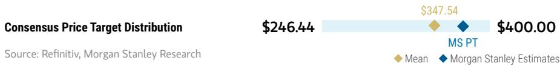

bar_line

| Category | Value     |
| -------- | --------- |
| Mean     | $347.54   |
| MS Estimates | $400.00   |

RISK REWARD CHART   
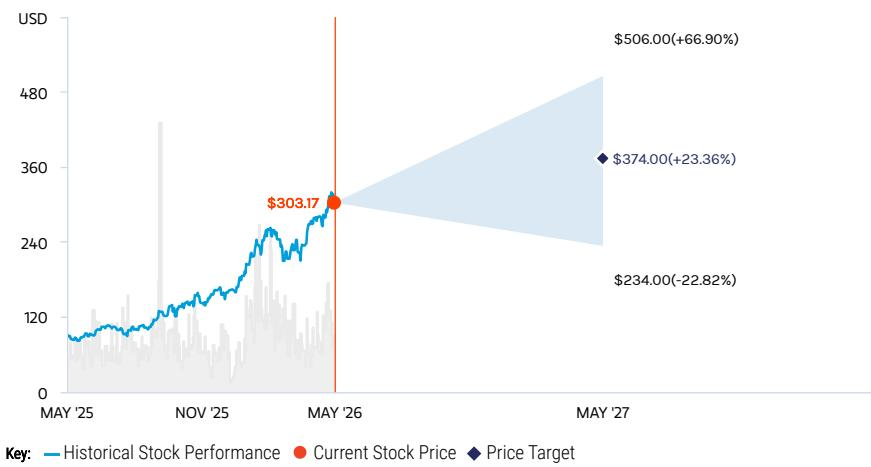

line

| Date     | Historical Stock Performance | Current Stock Price | Price Target |
| -------- | ----------------------------- | ------------------- | ------------ |
| MAY '26  | $303.17                       | $303.17             | -            |
| MAY '27  | -                             | $374.00              | $374.00      |

Source: Refinitiv, MS

# OVERWEIGHT THESIS

Cyclical recoveries for MKS' semi and electronics & packaging (E&P) business should drive revenue and FCF growth, helping the company delever and EPS outperform.   
The company's outsized NAND exposure has worked against the company during 2023-2024, but we expect NAND spend to outgrow overall WFE in 2026-2027 and MKS to be a beneficiary.   
We forecast MKS' E&P business to grow above PCBs but below advanced electronics through 2027, as the company's "Optimize the Interconnect" strategy drives share gains from scale.

Consensus Rating Distribution   
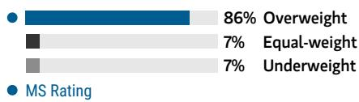

bar

| Category | Value (%) |
|---|---|
| Overweight | 86 |
| Equal-weight | 7 |
| Underweight | 7 |
MS Rating

Source: Refinitiv, MS

# Risk Reward Themes

New Data Era: Positive
Self-help: Positive

View descriptions of Risk Rewards Themes here

# BULL CASE

# \$506.00

# 25x FY27 EPS of \$20.24

A stronger than expected WFE and advanced electronics upcycle drives more aggressive debt paydowns and MKS' EPS sees strong growth.

-Revenue grows 29.9% in 2027 on the back of a stronger WFE and advanced electronics upcycle.

-GPM% expands to 48.6% and EPS to \$20.24 in 2027.

# BASE CASE

# \$374.00

# 22x FY27 EPS of \$17.01

MKS' semiconductor & E&P businesses benefit from a cyclical recovery in 2027 and grows revenue y/y in both segments.

-Revenue grows 21.4% in 2027.

-GPM% expands to 47.6% and EPS to \$17.01 in 2027.

# BEAR CASE

# \$234.00

# 16x FY27 EPS of \$14.62

A weaker WFE and advanced electronics cycle dampen the recovery and MKS sees slower debt repayments and deleverage.

-Revenue growth of 12.9% in 2027 on the back of a weaker WFE and advanced electronics upcycle.

-GPM% grows to 46.1% and EPS to \$14.62 in 2027.

# Risk Reward – MKS Inc. (MKSI.O)

KEY EARNINGS INPUTS 

<table><tr><td>Drivers</td><td>2025</td><td>2026e</td><td>2027e</td><td>2028e</td></tr><tr><td>GAAP Revenue ($, mm)</td><td>3,930</td><td>4,793</td><td>5,821</td><td>6,322</td></tr><tr><td>MW Gross Margin (%)</td><td>46.8</td><td>47.0</td><td>47.6</td><td>47.8</td></tr><tr><td>MW EPS ($)</td><td>7.88</td><td>11.70</td><td>17.01</td><td>19.18</td></tr><tr><td>Inventory ($, mm)</td><td>651</td><td>914</td><td>1,096</td><td>1,150</td></tr><tr><td>DOI ($, mm)</td><td>158.5</td><td>153.4</td><td>150.9</td><td>145.8</td></tr></table>

# INVESTMENT DRIVERS

• WFE and semiconductor subcomponent cycle.   
- MKS' market share in semi subcomponents (outsized exposure to NAND).   
- Advanced Electronics and PCB & Substrate cycle.

# GLOBAL REVENUE EXPOSURE

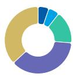

0-10% Europe ex UK   
0-10% Japan   
10-20% Mainland China   
30-40% APAC, ex Japan, Mainland China and India   
30-40% North America

Source: MS Estimate View explanation of regional hierarchies here

# MS ALPHA MODELS

5/5 BEST

24 Month Horizon

4/5 MOST

3 Month Horizon

Source: Refinitiv, FactSet, MS; 1 is the highest favored Quintile and 5 is the least favored Quintile

# RISKS TO PT/RATING

# RISKS TO UPSIDE

• Stronger than expected WFE spend   
• Market share gains in semis on the back of NAND growth   
• PC, smartphone, and server strength   
- Debt paydowns progress quicker than anticipated

# RISKS TO DOWNSIDE

- WFE growth slows and NAND makers continue to be disciplined on capex   
• PC, smartphone, and server extended weakness   
- Debt paydowns slow due to slow revenue growth and higher rates

# OWNERSHIP POSITIONING

Inst. Owners, % Active

HF Sector Long/Short Ratio

HF Sector Net Exposure

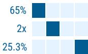

Refinitiv; MSPB Content. Includes certain hedge fund exposures held with MSPB. Information may be inconsistent with or may not reflect broader market trends. Long/Short Ratio = Long Exposure / Short exposure. Sector % of Total Net Exposure = (For a particular sector: Long Exposure - Short Exposure) / (Across all sectors: Long Exposure – Short Exposure).

# MS ESTIMATES VS. CONSENSUS

FY Dec 2027e

Sales / Revenue (\$, mm)

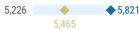

EPS (\$)

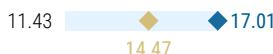

EBITDA (\$, mm)

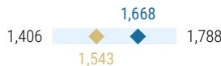

◆ Mean ◆ MS Estimates

Source: Refinitiv, MS

# Valuation Methodology and Risks

# Intel Corporation (INTC.O)

\~42x EPS CY2027 EPS of \$1.73, 42x is above the high end of the large cap logic semi peer group, reflecting high leverage potential on numbers that are still depressed, and foundry optionality, despite our longer term skepticism

# Risks to Upside

■ Foundry partnerships de-risk the story and further improve the multiple   
■ The company regains lost share in desktop and server following CPU shortages

# Risks to Downside

■ AMD competition increasingly becomes more significant, which could lead to further share losses in processors and pressure on ASPs   
■ Minimal success in foundry leads to an inflated cost structure

# KLA Corp (KLAC.O)

33x CY27e EPS of \$57.58, a 15% premium to US SPE peers LAM & AMAT to reflect growth prospects in foundry logic and DRAM.

# Risks to Upside

■ Foundries (TSMC, Intel, Samsung) pull forward their logic roadmaps   
■ Design starts in leading edge nodes increase   
■ Process control intensity increases in DRAM due to HBM

# Risks to Downside

■ Certain foundries (Intel, Samsung) scale back their aspirations   
■ Market share loss in mask inspection to Lasertec or in e-beam to AMAT or ASML   
■ China restrictions

# Risk Reward Reference links

1. View explanation of Options Probabilities methodology - Options\_Probabilities\_Exhibit\_Link.pdf   
2. View descriptions of Risk Rewards Themes - RR\_Themes\_Exhibit\_Link.pdf   
3. View explanation of regional hierarchies - GEG\_Exhibit\_Link.pdf   
4. View explanation of Theme/Exposure methodology - ESG\_Sustainable\_Solutions\_External\_Link.pdf   
5. View explanation of HERS methodology - ESG\_HERS\_External\_Link.pdf

# Disclosure Section

The information and opinions in MS were prepared by MS & Co. LLC, and/or MS C.T.V.M. S.A., and/or MS Mexico, Casa de Bolsa, S.A. de C.V., and/or MS Canada Limited. As used in this disclosure section, "MS" includes MS & Co. LLC, MS C.T.V.M. S.A., MS Mexico, Casa de Bolsa, S.A. de C.V., MS Canada Limited and their affiliates as necessary.

For important disclosures, stock price charts and equity rating histories regarding companies that are the subject of this report, please see the MS Disclosure Website at www.morganstanley.com/eqr/disclosures/webapp/generalresearch, or contact your investment representative or MS at 1585 Broadway, (Attention: Research Management), New York, NY, 10036 USA.

For valuation methodology and risks associated with any recommendation, rating or price target referenced in this research report, please contact the Client Support Team as follows: US/Canada +1 800 303-2495; Hong Kong +852 2848-5999; Latin America +1 718 754-5444 (U.S.); London +44 (0)20-7425-8169; Singapore +65 6834-6860; Sydney +61 (0)2-9770-1505; Tokyo +81 (0)3-6836-9000. Alternatively you may contact your investment representative or MS at 1585 Broadway, (Attention: Research Management), New York, NY 10036 USA.

# Analyst Certification

The following analysts hereby certify that their views about the companies and their securities discussed in this report are accurately expressed and that they have not received and will not receive direct or indirect compensation in exchange for expressing specific recommendations or views in this report: Shane Brett; Nicole Kozhukhov; Joseph Moore; Ella Tulchinsky; Mason Wayne.

# Global Research Conflict Management Policy

MS has been published in accordance with our conflict management policy, which is available at www.morganstanley.com/institutional/research/conflictpolicies. A Portuguese version of the policy can be found at www.morganstanley.com.br

# Important Regulatory Disclosures on Subject Companies

As of April 30, 2026, MS beneficially owned 1% or more of a class of common equity securities of the following companies covered in MS: Advantest, Applied Materials Inc., Ebara, Intel Corporation, KLA Corp, KOKUSAI ELECTRIC, Lam Research Corp, Lasertec, SCREEN Holdings, Teradyne Inc, Tokyo Electron, Ulvac, Ushio.

Within the last 12 months, MS managed or co-managed a public offering (or 144A offering) of securities of Camtek, Intel Corporation, KOKUSAI ELECTRIC, MKS Inc., Nova Ltd, Tekscend Photomask.

Within the last 12 months, MS has received compensation for investment banking services from Applied Materials Inc., Camtek, Intel Corporation, JEOL, MKS Inc., Nova Ltd, Tekscend Photomask, Tokyo Electron.

In the next 3 months, MS expects to receive or intends to seek compensation for investment banking services from Advantest, Applied Materials Inc., Camtek, DISCO, Ebara, Intel Corporation, JEOL, KLA Corp, KOKUSAI ELECTRIC, Lam Research Corp, Lasertec, MKS Inc., Nikon, Nova Ltd, SCREEN Holdings, Tekscend Photomask, Teradyne Inc, Tokyo Electron, Ulvac, Ushio. Within the last 12 months, MS has received compensation for products and services other than investment banking services from Applied Materials Inc., Intel Corporation, Tokyo Electron.

Within the last 12 months, MS has provided or is providing investment banking services to, or has an investment banking client relationship with, the following company: Advantest, Applied Materials Inc., Camtek, Ebara, Intel Corporation, JEOL, KLA Corp, KOKUSAI ELECTRIC, Lam Research Corp, Lasertec, MKS Inc., Nikon, Nova Ltd, SCREEN Holdings, Tekscend Photomask, Teradyne Inc, Tokyo Electron, Ulvac, Ushio.

Within the last 12 months, MS has either provided or is providing non-investment banking, securities-related services to and/or in the past has entered into an agreement to provide services or has a client relationship with the following company: Applied Materials Inc., Intel Corporation, MKS Inc., Tokyo Electron.

MS & Co. LLC makes a market in the securities of MKS Inc..

The equity research analysts or strategists principally responsible for the preparation of MS have received compensation based upon various factors, including quality of research, investor client feedback, stock picking, competitive factors, firm revenues and overall investment banking revenues. Equity Research analysts' or strategists' compensation is not linked to investment banking or capital markets transactions performed by MS or the profitability or revenues of particular trading desks.

MS and its affiliates do business that relates to companies/instruments covered in MS, including market making, providing liquidity, fund management, commercial banking, extension of credit, investment services and investment banking. MS sells to and buys from customers the securities/instruments of companies covered in MS on a principal basis. MS may have a position in the debt of the Company or instruments discussed in this report. MS trades or may trade as principal in the debt securities (or in related derivatives) that are the subject of the debt research report.

Certain disclosures listed above are also for compliance with applicable regulations in non-US jurisdictions.

# STOCK RATINGS

MS uses a relative rating system using terms such as Overweight, Equal-weight, Not-Rated or Underweight (see definitions below). MS does not assign ratings of Buy, Hold or Sell to the stocks we cover. Overweight, Equal-weight, Not-Rated and Underweight are not the equivalent of buy, hold and sell. Investors should carefully read the definitions of all ratings used in MS. In addition, since MS contains more complete information concerning the analyst's views, investors should carefully read MS, in its entirety, and not infer the contents from the rating alone. In any case, ratings (or research) should not be used or relied upon as investment advice. An investor's decision to buy or sell a stock should depend on individual circumstances (such as the investor's existing holdings) and other considerations.

# Global Stock Ratings Distribution

(as of April 30, 2026)

The Stock Ratings described below apply to MS's Fundamental Equity Research and do not apply to Debt Research produced by the Firm.

For disclosure purposes only (in accordance with FINRA requirements), we include the category headings of Buy, Hold, and Sell alongside our ratings of Overweight, Equal-weight, Not-Rated and Underweight. MS does not assign ratings of Buy, Hold or Sell to the stocks we cover. Overweight, Equal-weight, Not-Rated and Underweight are not the equivalent of buy, hold, and sell but represent recommended relative weightings (see definitions below). To satisfy regulatory requirements, we correspond Overweight, our most positive stock rating, with a buy recommendation; we correspond Equal-weight and Not-Rated to hold and Underweight to sell recommendations, respectively.

<table><tr><td></td><td colspan="2">Coverage Universe</td><td colspan="3">Investment Banking Clients (IBC)</td><td colspan="2">Other Material Investment ServicesClients (MISC)</td></tr><tr><td>Stock RatingCategory</td><td>Count</td><td>% of Total</td><td>Count</td><td>% of Total IBC</td><td>% of RatingCategory</td><td>Count</td><td>% of Total OtherMISC</td></tr><tr><td>Overweight/Buy</td><td>1546</td><td>42%</td><td>467</td><td>51%</td><td>30%</td><td>709</td><td>44%</td></tr><tr><td>Equal-weight/Hold</td><td>1568</td><td>43%</td><td>358</td><td>39%</td><td>23%</td><td>715</td><td>44%</td></tr><tr><td>Not-Rated/Hold</td><td>4</td><td>0%</td><td>0</td><td>0%</td><td>0%</td><td>1</td><td>0%</td></tr><tr><td>Underweight/Sell</td><td>555</td><td>15%</td><td>84</td><td>9%</td><td>15%</td><td>202</td><td>12%</td></tr><tr><td>Total</td><td>3,673</td><td></td><td>909</td><td></td><td></td><td>1627</td><td></td></tr></table>

Data include common stock and ADRs currently assigned ratings. Investment Banking Clients are companies from whom MS received investment banking compensation in the last 12 months. Due to rounding off of decimals, the percentages provided in the "% of total" column may not add up to exactly 100 percent.

# Analyst Stock Ratings

Overweight (O). The stock's total return is expected to exceed the average total return of the analyst's industry (or industry team's) coverage universe, on a risk-adjusted basis, over the next 12-18 months.

Equal-weight (E). The stock's total return is expected to be in line with the average total return of the analyst's industry (or industry team's) coverage universe, on a risk-adjusted basis, over the next 12-18 months.

Not-Rated (NR). Currently the analyst does not have adequate conviction about the stock's total return relative to the average total return of the analyst's industry (or industry team's) coverage universe, on a risk-adjusted basis, over the next 12-18 months.

Underweight (U). The stock's total return is expected to be below the average total return of the analyst's industry (or industry team's) coverage universe, on a risk-adjusted basis, over the next 12-18 months.

Unless otherwise specified, the time frame for price targets included in MS is 12 to 18 months.

# Analyst Industry Views

Attractive (A): The analyst expects the performance of his or her industry coverage universe over the next 12-18 months to be attractive vs. the relevant broad market benchmark, as indicated below.

In-Line (I): The analyst expects the performance of his or her industry coverage universe over the next 12-18 months to be in line with the relevant broad market benchmark, as indicated below. Cautious (C): The analyst views the performance of his or her industry coverage universe over the next 12-18 months with caution vs. the relevant broad market benchmark, as indicated below. Benchmarks for each region are as follows: North America - S&P 500; Latin America - relevant MSCI country index or MSCI Latin America Index; Europe - MSCI Europe; Japan - TOPIX; Asia - relevant MSCI country index or MSCI sub-regional index or MSCI AC Asia Pacific ex Japan Index.

Stock Price, Price Target and Rating History (See Rating Definitions)

Applied Materials Inc. (AMAT.0) - As of 05/17/26 GMT in USD
Industry : Semiconductor Capital Equipment   
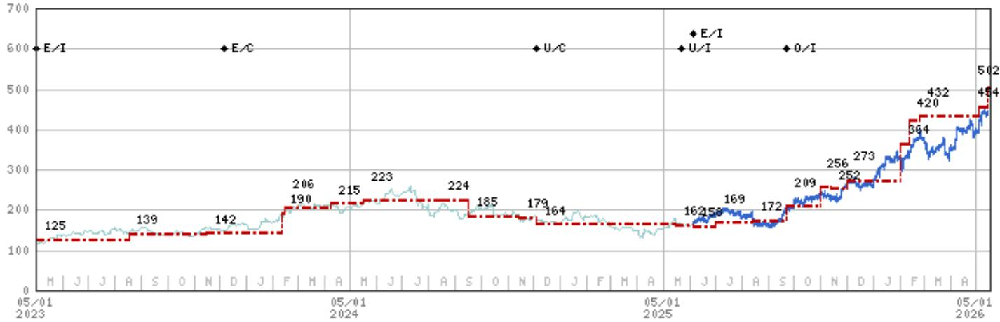

line

| Date       | Value |
| ---------- | ----- |
| 05/01 2023 | 125   |
|            | 139   |
|            | 142   |
|            | 190   |
|            | 206   |
|            | 215   |
|            | 223   |
|            | 224   |
|            | 185   |
|            | 179   |
|            | 164   |
|            | 162   |
|            | 158   |
|            | 169   |
|            | 172   |
|            | 209   |
|            | 256   |
|            | 252   |
|            | 273   |
|            | 364   |
|            | 420   |
|            | 432   |
|            | 454   |
|            | 502   |

Stock Rating History: 5/1/21 : E/I; 12/7/23 : E/C; 12/5/24 : U/C; 5/22/25 : U/I; 6/5/25 : E/I; 9/22/25 : O/I   
Price Target History: 2/19/21 : 113; 5/17/21 : 137; 5/21/21 : 139; 8/20/21 : 150; 12/14/21 : 160; 5/19/22 : 133; 7/24/22 : 115;   
9/6/22 : 109; 10/13/22 : 99; 10/17/22 : 89; 11/18/22 : 88; 2/16/23 : 125; 8/17/23 : 139; 11/16/23 : 142; 2/12/24 : 190;   
2/15/24 : 206; 4/8/24 : 215; 5/16/24 : 223; 8/15/24 : 224; 9/16/24 : 185; 11/14/24 : 179; 12/5/24 : 164; 5/15/25 : 162; 6/5/25 : 158;   
7/1/25 : 169; 8/14/25 : 172; 9/22/25 : 209; 10/31/25 : 256; 11/13/25 : 252; 12/1/25 : 273; 2/2/26 : 364; 2/12/26 : 420;   
2/24/26 : 432; 5/4/26 : 454; 5/14/26 : 502   
Source: MS Date Format : MM/DD/YY Price Target No Price Target Assigned (NA)   
Stock Price (Not Covered by Current Analyst) — Stock Price (Covered by Current Analyst)   
Stock and Industry Ratings (abbreviations below) appear as ♦ Stock Rating/Industry View   
Stock Ratings: Overweight (O) Equal-weight (E) Underweight (U) Not-Rated (NR) No Rating Available (NA)   
Industry View: Attractive (A) In-line (I) Cautious (C) No Rating (NR)   
Effective January 13, 2014, the stocks covered by MS Asia Pacific will be rated relative to the analyst's industry (or industry team's) coverage.   
Effective January 13, 2014, the industry view benchmarks for MS Asia Pacific are as follows: relevant MSCI country index or MSCI sub-regional index or MSCI AC Asia Pacific ex Japan Index.

Intel Corporation (INTC.O) - As of 05/17/26 GMT in USD
Industry : Semiconductors   
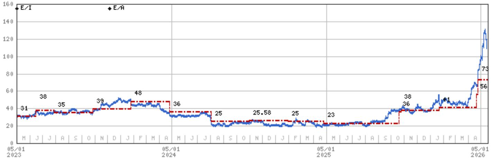

line

| Date       | Value |
| ---------- | ----- |
| 05/01 2023 | 31    |
| 05/01 2024 | 38    |
| 05/01 2024 | 35    |
| 05/01 2024 | 39    |
| 05/01 2024 | 48    |
| 05/01 2024 | 36    |
| 05/01 2024 | 25    |
| 05/01 2024 | 25.58 |
| 05/01 2024 | 25    |
| 05/01 2024 | 23    |
| 05/01 2024 | 36    |
| 05/01 2024 | 38    |
| 05/01 2024 | 41    |
| 05/01 2024 | 56    |
| 05/01 2024 | 73    |

Stock Rating History: 5/1/21 : 0/I; 10/22/21 : E/I; 3/3/22 : U/I; 2/22/23 : E/I; 12/7/23 : E/A   
Price Target History: 1/22/21 : 72; 7/23/21 : 70; 10/5/21 : 67; 10/22/21 : 55; 3/3/22 : 47; 4/28/22 : 46; 7/28/22 : 36;   
10/27/22 : 29.5; 2/22/23 : 28; 4/27/23 : 31; 6/15/23 : 38; 7/28/23 : 35; 10/27/23 : 39; 1/26/24 : 48; 4/26/24 : 36; 8/2/24 : 25;   
10/31/24 : 25.58; 1/31/25 : 25; 4/25/25 : 23; 10/20/25 : 36; 10/24/25 : 38; 1/23/26 : 41; 4/20/26 : 56; 4/24/26 : 73   
Source: MS Date Format : MM/DD/YY Price Target No Price Target Assigned (NA)   
Stock Price (Not Covered by Current Analyst) — Stock Price (Covered by Current Analyst)   
Stock and Industry Ratings (abbreviations below) appear as ♦ Stock Rating/Industry View   
Stock Ratings: Overweight (O) Equal-weight (E) Underweight (U) Not-Rated (NR) No Rating Available (NA)   
Industry View: Attractive (A) In-line (I) Cautious (C) No Rating (NR)   
Effective January 13, 2014, the stocks covered by MS Asia Pacific will be rated relative to the analyst's industry (or industry team's) coverage.   
Effective January 13, 2014, the industry view benchmarks for MS Asia Pacific are as follows: relevant MSCI country index or MSCI sub-regional index or MSCI AC Asia Pacific ex Japan Index.

KLA Corp (KLAC.O) - As of 05/17/26 GMT in USD
Industry : Semiconductor Capital Equipment   
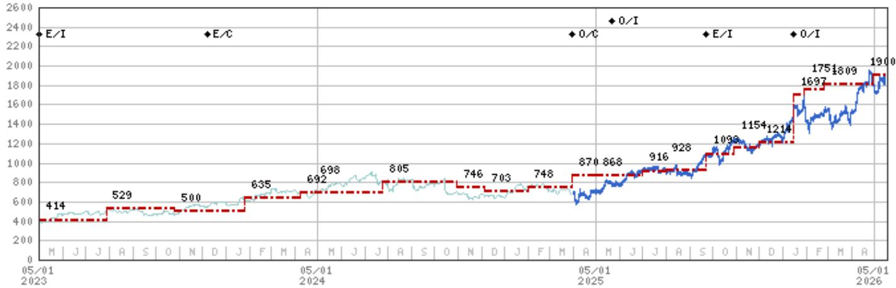

line

| Date       | Value |
| ---------- | ----- |
| 05/01 2023 | 414   |
| 05/01 2024 | 529   |
| 05/01 2024 | 500   |
| 05/01 2024 | 635   |
| 05/01 2024 | 692   |
| 05/01 2024 | 698   |
| 05/01 2024 | 805   |
| 05/01 2024 | 746   |
| 05/01 2024 | 703   |
| 05/01 2024 | 748   |
| 05/01 2024 | 870   |
| 05/01 2024 | 868   |
| 05/01 2024 | 916   |
| 05/01 2024 | 928   |
| 05/01 2024 | 1098  |
| 05/01 2024 | 1154  |
| 05/01 2024 | 1214  |
| 05/01 2024 | 1697  |
| 05/01 2024 | 175   |
| 05/01 2024 | 1809  |
| 05/01 2024 | 1900  |

Stock Rating History: 5/1/21 : E/I; 12/7/23 : E/C; 3/30/25 : 0/C; 5/22/25 : 0/I; 9/22/25 : E/I; 1/15/26 : 0/I   
Price Target History: 4/30/21 : 364; 7/30/21 : 389; 10/28/21 : 399; 12/14/21 : 431; 1/28/22 : 400; 4/25/22 : 375; 4/29/22 : 373;   
7/24/22 : 377; 7/28/22 : 381; 9/6/22 : 358; 10/17/22 : 289; 10/27/22 : 318; 1/27/23 : 420; 4/26/23 : 414; 7/28/23 : 529;   
10/26/23 : 500; 1/26/24 : 635; 4/8/24 : 692; 4/26/24 : 698; 7/24/24 : 805; 10/30/24 : 746; 12/5/24 : 703; 1/31/25 : 748;   
3/30/25 : 870; 5/1/25 : 868; 7/1/25 : 916; 7/31/25 : 928; 9/22/25 : 1093; 10/29/25 : 1154; 12/1/25 : 1214; 1/15/26 : 1697;   
1/29/26 : 1751; 2/24/26 : 1809; 4/29/26 : 1900   
Source: MS Date Format : MM/DD/YY Price Target No Price Target Assigned (NA)   
Stock Price (Not Covered by Current Analyst) — Stock Price (Covered by Current Analyst)   
Stock and Industry Ratings (abbreviations below) appear as ♦ Stock Rating/Industry View   
Stock Ratings: Overweight (O) Equal-weight (E) Underweight (U) Not-Rated (NR) No Rating Available (NA)   
Industry View: Attractive (A) In-line (I) Cautious (C) No Rating (NR)   
Effective January 13, 2014, the stocks covered by MS Asia Pacific will be rated relative to the analyst's industry (or industry team's) coverage.   
Effective January 13, 2014, the industry view benchmarks for MS Asia Pacific are as follows: relevant MSCI country index or MSCI sub-regional index or MSCI AC Asia Pacific ex Japan Index.

Lam Research Corp (LRCX.0) - As of 05/17/26 GMT in USD
Industry : Semiconductor Capital Equipment   
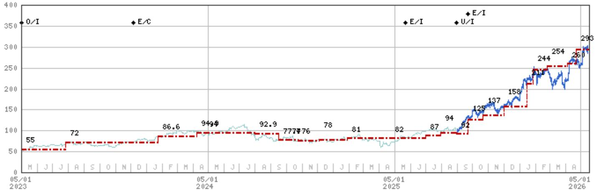

line

| Date       | Value |
| ---------- | ----- |
| 05/01 2023 | 55    |
| 05/01 2024 | 72    |
| 05/01 2024 | 86.6  |
| 05/01 2024 | 94.9  |
| 05/01 2024 | 92.9  |
| 05/01 2024 | 77.7  |
| 05/01 2024 | 76    |
| 05/01 2024 | 78    |
| 05/01 2024 | 81    |
| 05/01 2024 | 82    |
| 05/01 2024 | 87    |
| 05/01 2024 | 94    |
| 05/01 2024 | 92    |
| 05/01 2024 | 125   |
| 05/01 2024 | 137   |
| 05/01 2024 | 158   |
| 05/01 2024 | 21    |
| 05/01 2024 | 244   |
| 05/01 2024 | 254   |
| 05/01 2024 | 26    |
| 05/01 2024 | 293   |

Stock Rating History: 5/1/21 : 0/I; 12/7/23 : E/C; 5/22/25 : E/I; 8/31/25 : U/I; 9/22/25 : E/I   
Price Target History: 4/22/21 : 72.6; 10/21/21 : 71; 12/14/21 : 75.5; 1/26/22 : 73; 4/20/22 : 62.5; 7/24/22 : 55; 9/6/22 : 54.3;   
10/17/22 : 42.9; 10/19/22 : 40.4; 1/26/23 : 55; 7/26/23 : 72; 1/24/24 : 86.6; 4/8/24 : 94.9; 4/24/24 : 94; 7/31/24 : 92.9;   
9/16/24 : 77.4; 10/3/24 : 77; 10/23/24 : 76; 12/5/24 : 78; 1/29/25 : 81; 4/23/25 : 82; 7/1/25 : 87; 7/30/25 : 94; 8/31/25 : 92;   
9/22/25 : 125; 10/22/25 : 137; 12/1/25 : 158; 1/15/26 : 211; 1/28/26 : 244; 2/24/26 : 254; 4/5/26 : 260; 4/22/26 : 293   
Source: MS Date Format : MM/DD/YY Price Target No Price Target Assigned (NA)   
Stock Price (Not Covered by Current Analyst) — Stock Price (Covered by Current Analyst)   
Stock and Industry Ratings (abbreviations below) appear as ♦ Stock Rating/Industry View   
Stock Ratings: Overweight (O) Equal-weight (E) Underweight (U) Not-Rated (NR) No Rating Available (NA)   
Industry View: Attractive (A) In-line (I) Cautious (C) No Rating (NR)   
Effective January 13, 2014, the stocks covered by MS Asia Pacific will be rated relative to the analyst's industry (or industry team's) coverage.   
Effective January 13, 2014, the industry view benchmarks for MS Asia Pacific are as follows: relevant MSCI country index or MSCI sub-regional index or MSCI AC Asia Pacific ex Japan Index.

MKS Inc. (MKSI.0) - As of 05/17/26 GMT in USD
Industry : Semiconductor Capital Equipment   
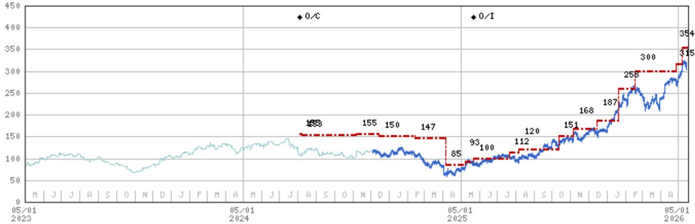

line

| Date       | Value |
| ---------- | ----- |
| 05/01 2023 | 90    |
| 05/01 2024 | 140   |
| 05/01 2025 | 85    |
| 05/01 2026 | 354   |

Stock Rating History: 8/4/24 : 0/C; 5/22/25 : 0/I   
Price Target History: 8/4/24 : 155; 8/8/24 : 153; 11/7/24 : 155; 12/15/24 : 150; 2/13/25 : 147; 4/6/25 : 85; 5/8/25 : 93;   
5/22/25 : 100; 7/21/25 : 112; 8/7/25 : 120; 10/12/25 : 151; 11/6/25 : 168; 12/15/25 : 187; 1/21/26 : 258; 2/18/26 : 300;   
4/28/26 : 315; 5/7/26 : 354   
Source: MS Date Format : MM/DD/YY Price Target No Price Target Assigned (NA)   
Stock Price (Not Covered by Current Analyst) — Stock Price (Covered by Current Analyst)   
Stock and Industry Ratings (abbreviations below) appear as ♦ Stock Rating/Industry View   
Stock Ratings: Overweight (O) Equal-weight (E) Underweight (U) Not-Rated (NR) No Rating Available (NA)   
Industry View: Attractive (A) In-line (I) Cautious (C) No Rating (NR)   
Effective January 13, 2014, the stocks covered by MS Asia Pacific will be rated relative to the analyst's industry (or industry team's) coverage.   
Effective January 13, 2014, the industry view benchmarks for MS Asia Pacific are as follows: relevant MSCI country index or MSCI sub-regional index or MSCI AC Asia Pacific ex Japan Index.

# Important Disclosures for MS Smith Barney LLC Customers

Important disclosures regarding any material conflict of interest that can reasonably be expected to have influenced MS Smith Barney LLC's choice of a third-party research provider or the subject company of a third-party research report, are available on the MS Wealth Management disclosure website at www.morganstanley.com/online/researchdisclosures. For MS specific disclosures, you may refer to https://www.morganstanley.com/eqr/disclosures/webapp/generalresearch.

Each MS report is reviewed and approved on behalf of MS Smith Barney LLC. This review and approval is conducted by the same person who reviews the research report on behalf of MS. This could create a conflict of interest.

# Other Important Disclosures

MS policy is to update research reports as and when the Research Analyst and Research Management deem appropriate, based on developments with the issuer, the sector, or the market that may have a material impact on the research views or opinions stated therein. In addition, certain Research publications are intended to be updated on a regular periodic basis (weekly/monthly/quarterly/annual) and will ordinarily be updated with that frequency, unless the Research Analyst and Research Management determine that a different publication schedule is appropriate based on current conditions.

MS is not acting as a municipal advisor and the opinions or views contained herein are not intended to be, and do not constitute, advice within the meaning of Section 975 of the Dodd-Frank Wall Street Reform and Consumer Protection Act.

MS produces an equity research product called a "Tactical Idea." Views contained in a "Tactical Idea" on a particular stock may be contrary to the recommendations or views expressed in research on the same stock. This may be the result of differing time horizons, methodologies, market events, or other factors. For all research available on a particular stock, please contact your sales representative or go to Matrix at http://www.morganstanley.com/matrix.

MS is provided to our clients through our proprietary research portal on Matrix and also distributed electronically by MS to clients. Certain, but not all, MS products are also made available to clients through third-party vendors or redistributed to clients through alternate electronic means as a convenience. For access to all available MS, please contact your sales representative or go to Matrix at http://www.morganstanley.com/matrix.

Any access and/or use of MS is subject to MS's Terms of Use (http://www.morganstanley.com/terms.html). By accessing and/or using MS, you are indicating that you have read and agree to be bound by our Terms of Use (http://www.morganstanley.com/terms.html). In addition you consent to MS processing your personal data and using cookies in accordance with our Privacy Policy and our Global Cookies Policy (http://www.morganstanley.com/privacy\_pledge.html), including for the purposes of setting your preferences and to collect readership data so that we can deliver better and more personalized service and products to you. To find out more information about how MS processes personal data, how we use cookies and how to reject cookies see our Privacy Policy and our Global Cookies Policy (http://www.morganstanley.com/privacy\_pledge.html). Please use the provided link to review the Terms and Conditions and Most Important Terms and Conditions for MS India Company Private Limited (https://www.morganstanley.com/assets/pdfs/about-us-global-offices/india/Terms\_and\_conditions.pdf) and the following link to review the audit report (https://ny.matrix.ms.com/eqr/research/webapp/researchdocs/MSICPL\_Morgan\_Stanley\_Research\_Audit\_Report.pdf).

If you do not agree to our Terms of Use and/or if you do not wish to provide your consent to MS processing your personal data or using cookies please do not access our research. MS does not provide individually tailored investment advice. MS has been prepared without regard to the circumstances and objectives of those who receive it. MS recommends that investors independently evaluate particular investments and strategies, and encourages investors to seek the advice of a financial adviser. The appropriateness of an investment or strategy will depend on an investor's circumstances and objectives. The securities, instruments, or strategies discussed in MS may not be suitable for all investors, and certain investors may not be eligible to purchase or participate in some or all of them. MS is not an offer to buy or sell or the solicitation of an offer to buy or sell any security/instrument or to participate in any particular trading strategy. The value of and income from your investments may vary because of changes in interest rates, foreign exchange rates, default rates, prepayment rates, securities/instruments prices, market indexes, operational or financial conditions of companies or other factors. There may be time limitations on the exercise of options or other rights in securities/instruments transactions. Past performance is not necessarily a guide to future performance. Estimates of future performance are based on assumptions that may not be realized. If provided, and unless otherwise stated, the closing price on the cover page is that of the primary exchange for the subject company's securities/instruments.

The fixed income research analysts, strategists or economists principally responsible for the preparation of MS have received compensation based upon various factors, including quality, accuracy and value of research, firm profitability or revenues (which include fixed income trading and capital markets profitability or revenues), client feedback and competitive factors. Fixed Income Research analysts', strategists' or economists' compensation is not linked to investment banking or capital markets transactions performed by MS or the profitability or revenues of particular trading desks.

The "Important Regulatory Disclosures on Subject Companies" section in MS lists all companies mentioned where MS owns 1% or more of a class of common equity securities of the companies. For all other companies mentioned in MS, MS may have an investment of less than 1% in securities/instruments or derivatives of securities/instruments of companies and may trade them in ways different from those discussed in MS. Employees of MS not involved in the preparation of MS may have investments in securities/instruments or derivatives of securities/instruments of companies mentioned and may trade them in ways different from those discussed in MS. Derivatives may be issued by MS or associated persons.

With the exception of information regarding MS, MS is based on public information. MS makes every effort to use reliable, comprehensive information, but we make no representation that it is accurate or complete. We have no obligation to tell you when opinions or information in MS change apart from when we intend to discontinue equity research coverage of a subject company. Facts and views presented in MS have not been reviewed by, and may not reflect information known to, professionals in other MS business areas, including investment banking personnel.

MS personnel may participate in company events such as site visits and are generally prohibited from accepting payment by the company of associated expenses unless pre-approved by authorized members of Research management.

MS may make investment decisions that are inconsistent with the recommendations or views in this report.

To our readers based in Taiwan or trading in Taiwan securities/instruments: Information on securities/instruments that trade in Taiwan is distributed by MS Taiwan Limited ("MSTL"). Such information is for your reference only. The reader should independently evaluate the investment risks and is solely responsible for their investment decisions. MS may not be distributed to the public media or quoted or used by the public media without the express written consent of MS. Any non-customer reader within the scope of Article 7-1 of the Taiwan Stock Exchange Recommendation Regulations accessing and/or receiving MS is not permitted to provide MS to any third party (including but not limited to related parties, affiliated companies and any other third parties) or engage in any activities regarding MS which may create or give the appearance of creating a conflict of interest. Information on securities/instruments that do not trade in Taiwan is for informational purposes only and is not to be construed as a recommendation or a solicitation to trade in such securities/instruments. MSTL may not execute transactions for clients in these securities/instruments.

MS is not incorporated under PRC law and the research in relation to this report is conducted outside the PRC. MS does not constitute an offer to sell or the solicitation of an offer to buy any securities in the PRC. PRC investors shall have the relevant qualifications to invest in such securities and shall be responsible for obtaining all relevant approvals, licenses, verifications and/or registrations from the relevant governmental authorities themselves. Neither this report nor any part of it is intended as, or shall constitute, provision of any consultancy or advisory service of securities investment as defined under PRC law. Such information is provided for your reference only.

MS is disseminated in Brazil by MS C.T.V.M. S.A. located at Av. Brigadeiro Faria Lima, 3600, 6th floor, São Paulo - SP, Brazil; and is regulated by the Comissão de Valores Mobiliários; in Mexico by MS México, Casa de Bolsa, S.A. de C.V which is regulated by Comision Nacional Bancaria y de Valores. Paseo de los Tamarindos 90, Torre 1, Col. Bosques de las Lomas Floor 29, 05120 Mexico City; in Japan by MS MUFG Securities Co., Ltd. and, for Commodities related research reports only, MS Capital Group Japan Co., Ltd; in Hong Kong by MS Asia Limited (which accepts responsibility for its contents) and by MS Bank Asia Limited; in Singapore by MS Asia (Singapore) Pte. (Registration number 199206298Z) and/or MS Asia (Singapore) Securities Pte Ltd (Registration number 200008434H), regulated by the Monetary Authority of Singapore (which accepts legal responsibility for its contents and should be contacted with respect to any matters arising from, or in connection with, MS) and by MS Bank Asia Limited, Singapore Branch (Registration number T14FC0118J); in Australia to "wholesale clients" within the meaning of the Australian Corporations Act by MS Australia Limited A.B.N. 67 003 734 576, holder of Australian financial services license No. 233742, which accepts responsibility for its contents; in Australia to "wholesale clients" and "retail clients" within the meaning of the Australian Corporations Act by MS Wealth Management Australia Pty Ltd (A.B.N. 19 009 145 555, holder of Australian financial services license No. 240813, which accepts responsibility for its contents; in Korea by MS & Co International plc, Seoul Branch; in India by MS India Company Private Limited having Corporate Identification No (CIN) U22990MH1998PTC115305, regulated by the Securities and Exchange Board of India ("SEBI") and holder of licenses as a Research Analyst (SEBI Registration No. INH000001105); Stock Broker (SEBI Stock Broker Registration No. INZ000244438), Merchant Banker (SEBI Registration No. INM000011203), and depository participant with National Securities Depository Limited (SEBI Registration No. IN-DP-NSDL-567-2021) having registered office at Altimus, Level 39 & 40, Pandurang Budhkar Marg, Worli, Mumbai 400018, India; Telephone no. +91-22-61181000; Compliance Officer Details: Mr. Tejarshi Hardas, Tel. No.: +91-22-61181000 or Email: tejarshi.hardas@morganstanley.com; Grievance officer details: Mr. Tejarshi Hardas, Tel. No.: +91-22-61181000 or Email: msic-compliance@morganstanley.com. MS India Company Private Limited (MSICPL) may use AI tools in providing research services. All recommendations contained herein are made by the duly qualified research analysts; in Canada by MS Canada Limited; in Germany and the European Economic Area where required by MS Europe S.E., authorised and regulated by Bundesanstalt fuer Finanzdienstleistungsaufsicht (BaFin) under the reference number 149169; in the US by MS & Co. LLC, which accepts responsibility for its contents. MS & Co. International plc, authorized by the Prudential Regulation Authority and regulated by the Financial Conduct Authority and the Prudential Regulation Authority, disseminates in the UK research that it has prepared, and research which has been prepared by any of its affiliates, only to persons who (i) are investment professionals falling within Article 19(5) of the Financial Services and Markets Act 2000 (Financial Promotion) Order 2005 (as amended, the "Order"); (ii) are persons who are high net worth entities falling within Article 49(2)(a) to (d) of the Order; or (iii) are persons to whom an invitation or inducement to engage in investment activity (within the meaning of section 21 of the Financial Services and Markets Act 2000, as amended) may otherwise lawfully be communicated or caused to be communicated. RMB MS Proprietary Limited is a member of the JSE Limited and A2X (Pty) Ltd. RMB MS Proprietary Limited is a joint venture owned equally by MS International Holdings Inc. and RMB Investment Advisory (Proprietary) Limited, which is wholly owned by FirstRand Limited. The information in MS is being disseminated by MS Saudi Arabia, regulated by the Capital Market Authority in the Kingdom of Saudi Arabia, and is directed at Sophisticated investors only.

The information in MS is being communicated by MS & Co. International plc (DIFC Branch), regulated by the Dubai Financial Services Authority (the DFSA) or by MS & Co. International plc (ADGM Branch), regulated by the Financial Services Regulatory Authority Abu Dhabi (the FSRA), and is directed at Professional Clients only, as defined by the DFSA or the FSRA, respectively. The financial products or financial services to which this research relates will only be made available to a customer who we are satisfied meets the regulatory criteria of a Professional Client. A distribution of the different MS Research ratings or recommendations, in percentage terms for Investments in each sector covered, is available upon request from your sales representative.

The information in MS is being communicated by MS & Co. International plc (QFC Branch), regulated by the Qatar Financial Centre Regulatory Authority (the QFCRA), and is directed at business customers and market counterparties only and is not intended for Retail Customers as defined by the QFCRA.

As required by the Capital Markets Board of Turkey, investment information, comments and recommendations stated here, are not within the scope of investment advisory activity. Investment advisory service is provided exclusively to persons based on their risk and income preferences by the authorized firms. Comments and recommendations stated here are general in nature. These opinions may not fit to your financial status, risk and return preferences. For this reason, to make an investment decision by relying solely to this information stated here may not bring about outcomes that fit your expectations.

The trademarks and service marks contained in MS are the property of their respective owners. Third-party data providers make no warranties or representations relating to the accuracy, completeness, or timeliness of the data they provide and shall not have liability for any damages relating to such data. The Global Industry Classification Standard (GICS) was developed by and is the exclusive property of MSCI and S&P.

MS, or any portion thereof may not be reprinted, sold or redistributed without the written consent of MS.

Indicators and trackers referenced in MS may not be used as, or treated as, a benchmark under Regulation EU 2016/1011, or any other similar framework.

The issuers and/or fixed income products recommended or discussed in certain fixed income research reports may not be continuously followed. Accordingly, investors should regard those fixed income research reports as providing stand-alone analysis and should not expect continuing analysis or additional reports relating to such issuers and/or individual fixed income products. MS may hold, from time to time, material financial and commercial interests regarding the company subject to the Research report.

Registration granted by SEBI and certification from the National Institute of Securities Markets (NISM) in no way guarantee performance of the intermediary or provide any assurance of returns to investors. Investment in securities market are subject to market risks. Read all the related documents carefully before investing.

Stock Ratings are subject to change. Please see latest research for each company.   
\* Historical prices are not split adjusted.   
INDUSTRY COVERAGE: Semiconductor Capital Equipment 

<table><tr><td>COMPANY (TICKER)</td><td>RATING (AS OF)</td><td>PRICE* (05/15/2026)</td></tr><tr><td colspan="3">Shane Brett</td></tr><tr><td>Applied Materials Inc. (AMAT.O)</td><td>E (05/16/2026)</td><td>$436.62</td></tr><tr><td>Camtek (CAMT.O)</td><td>E (12/01/2025)</td><td>$168.35</td></tr><tr><td>KLA Corp (KLAC.O)</td><td>O (01/15/2026)</td><td>$1,804.32</td></tr><tr><td>Lam Research Corp (LRCX.O)</td><td>O (05/16/2026)</td><td>$284.72</td></tr><tr><td>MKS Inc. (MKSI.O)</td><td>O (08/04/2024)</td><td>$303.17</td></tr><tr><td>Nova Ltd (NVMI.O)</td><td>E (12/01/2025)</td><td>$509.15</td></tr><tr><td>Teradyne Inc (TER.O)</td><td>E (07/30/2025)</td><td>$337.88</td></tr></table>

INDUSTRY COVERAGE: Semiconductor Production Equipment 

<table><tr><td>COMPANY (TICKER)</td><td>RATING (AS OF)</td><td>PRICE* (05/15/2026)</td></tr><tr><td colspan="3">Suzune Tamura, CFA</td></tr><tr><td>Advantest (6857.T)</td><td>O (01/17/2024)</td><td>¥26,360</td></tr><tr><td>DISCO (6146.T)</td><td>O (07/07/2023)</td><td>¥64,900</td></tr><tr><td>Ebara (6361.T)</td><td>O (12/04/2024)</td><td>¥5,533</td></tr><tr><td>JEOL (6951.T)</td><td>E (07/08/2025)</td><td>¥6,952</td></tr><tr><td>KOKUSAI ELECTRIC (6525.T)</td><td>O (12/19/2025)</td><td>¥6,590</td></tr><tr><td>Lasertec (6920.T)</td><td>U (07/28/2025)</td><td>¥38,410</td></tr><tr><td>Nikon (7731.T)</td><td>U (08/08/2023)</td><td>¥2,266</td></tr><tr><td>SCREEN Holdings (7735.T)</td><td>O (11/13/2025)</td><td>¥11,335</td></tr><tr><td>Tekscend Photomask (429A.T)</td><td>E (11/18/2025)</td><td>¥4,220</td></tr><tr><td>Tokyo Electron (8035.T)</td><td>O (12/19/2025)</td><td>¥50,290</td></tr><tr><td>Ulvac (6728.T)</td><td>E (01/17/2024)</td><td>¥9,486</td></tr><tr><td>Ushio (6925.T)</td><td>O (01/05/2026)</td><td>¥4,239</td></tr></table>

Stock Ratings are subject to change. Please see latest research for each company.   
\* Historical prices are not split adjusted.

© 2026 MS