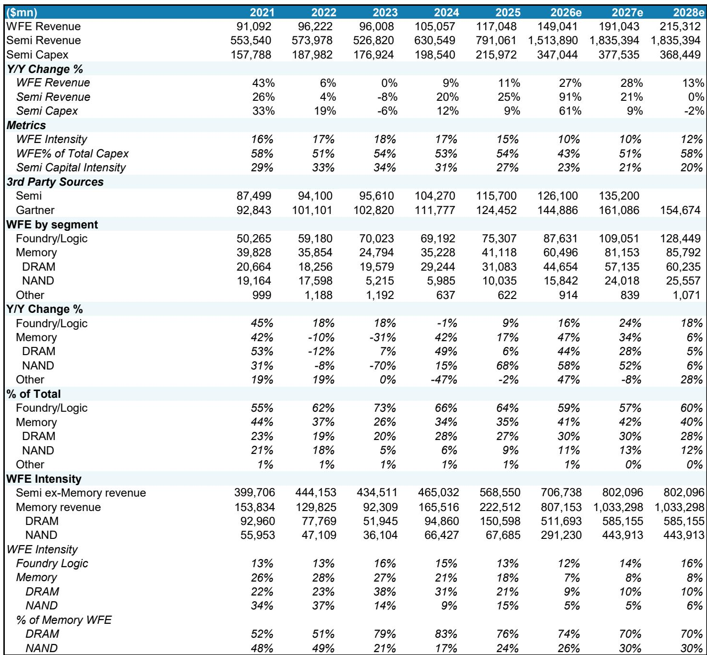
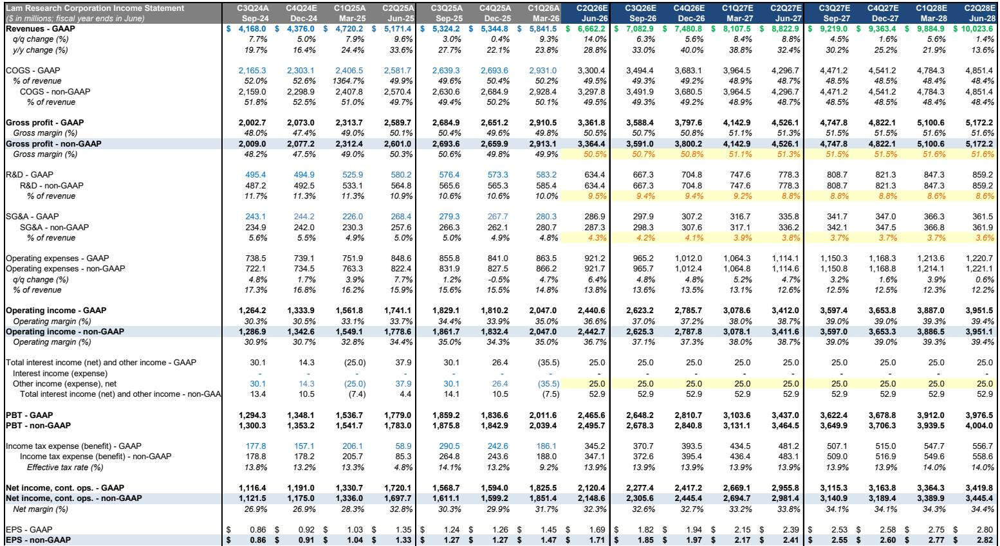
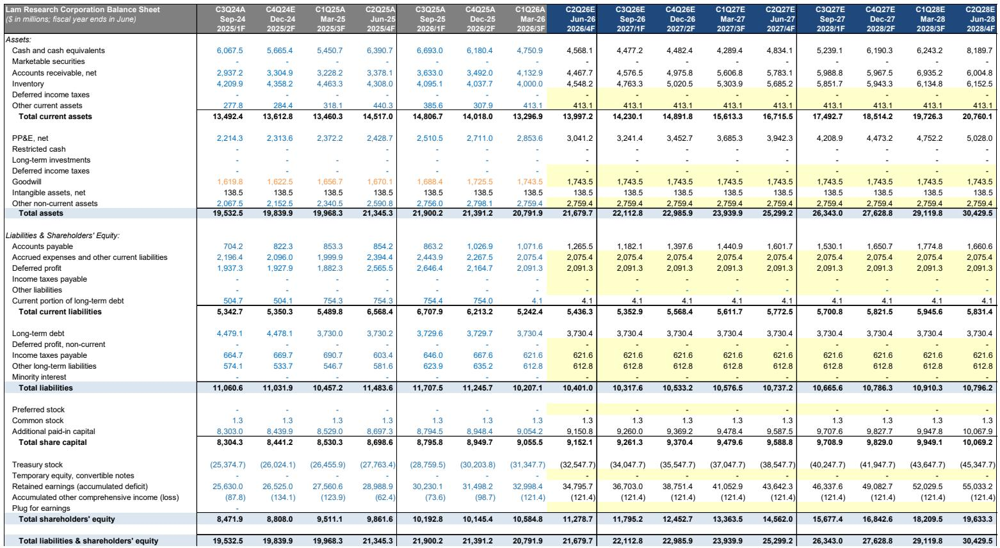

# The Semiconductor Equipment Cycle Has Longevity, But the Memory Mismatch Is the Real Strategic Story

The wafer fabrication equipment (WFE) market is not merely recovering. It is entering a structurally extended cycle that few investors have fully priced in. A major global investment bank has revised its 2026 WFE forecast upward to $149 billion, representing 27% year-over-year growth, and its 2027 forecast to $191 billion, another 28% increase. For the first time, the bank has introduced a 2028 outlook of $215 billion, implying 13% growth from an already elevated base. The headline numbers are impressive, but the real strategic insight lies in what they reveal about the structure of demand.

The most critical finding is a persistent and unresolved mismatch in memory. In both DRAM and NAND, the bank estimates that unconstrained bit demand sits above 40% growth annually, yet its 2027 supply forecasts cap bit growth at 31% for DRAM and 32% for NAND. This is not a temporary supply-demand imbalance that will correct itself through price signals. It is a structural gap created by physical constraints in clean room availability and project lead times. For investors, this gap creates a multi-year opportunity set that extends well beyond the current cycle peak narrative.

The implications for capital equipment suppliers are profound. The bank has upgraded Lam Research to Overweight and downgraded Applied Materials to Equal-weight, reflecting a shift in preference from DRAM to NAND exposure. More tellingly, it has replaced Applied Materials with MKS Instruments as its Top Pick, betting on the NAND wave. These are not incremental rating changes. They signal a fundamental re-ordering of which end-markets will drive growth and which equipment vendors are best positioned.

This article translates the report's dense data into a strategic framework. It identifies the four forces shaping the cycle, explains why the memory mismatch matters more than the headline WFE numbers, and offers a decision framework for investors who want to position for the next 24 months. It also flags the open questions the report does not fully answer, because the most valuable analysis is the one that knows its own limits.

## The WFE Cycle Is Broadening Beyond TSMC, and That Changes the Risk Profile

For the past several years, the WFE narrative has been dominated by TSMC's aggressive capacity buildout. That story is not over, but it is no longer the only story. The bank models leading-edge logic capex growth of 58% in 2026, driven by a broadening of spenders beyond the Taiwanese foundry giant. Samsung is expected to increase its leading-edge logic spending from $5 billion in 2025 to $25 billion in 2026, and Intel's spending is projected to rise from $15 billion to $19 billion by 2027.

The shift matters because a cycle driven by a single spender is fragile. A cycle driven by multiple spenders is structurally more resilient. If TSMC faces a demand shock, Samsung and Intel can still sustain the equipment order book. The bank's 2028 forecast of $215 billion in WFE, with foundry-logic growing 18% year-over-year, implies that this broadening is not a one-year phenomenon. It is a multi-year structural shift.

The strategic takeaway is that the equipment cycle is transitioning from a TSMC-centric model to a multi-polar one. This reduces downside risk for the aggregate WFE market but increases the complexity of stock selection. Investors can no longer simply buy the TSMC proxy and expect to outperform. They must understand which equipment vendors benefit from which end-market and which geography.

## The Memory Mismatch Is Not a Supply Problem; It Is a Clean Room Problem

The bank's DRAM and NAND forecasts reveal a fascinating tension. On the demand side, the bank estimates that unconstrained bit demand for both DRAM and NAND exceeds 40% annual growth. On the supply side, its 2027 bit growth forecasts are 31% for DRAM and 32% for NAND. The gap is not small. It is a 25% to 30% shortfall relative to unconstrained demand.

The standard narrative would attribute this gap to cautious capital allocation by memory producers. The bank's analysis suggests a different constraint: clean room availability. Memory fabs require massive, purpose-built clean rooms that take years to construct. Even if memory producers wanted to spend more, they cannot because the physical infrastructure is not ready. The bank explicitly states that "clean room availability constrains some near-term upside while extending the medium-term opportunity."

This is a critical insight. It means the memory equipment cycle is not subject to the typical boom-bust dynamics. In past cycles, memory producers would over-invest, create oversupply, and then slash capex. This cycle is different. The constraint is not capital discipline but construction timelines. The implication is that the WFE upcycle in memory will be longer and more durable than historical patterns suggest.

For NAND specifically, the bank expects 52% WFE growth in 2027, making it the fastest-growing end-market. Greenfield activity across Samsung and Kioxia is accelerating. The bank's 2027 NAND WFE forecast of $24 billion supports 32% bit growth, still below unconstrained demand. The gap persists. That is the opportunity.

## Intel's Inevitable Capex Increase Creates a New Demand Vector

Intel's foundry ambitions have been a source of debate for years. The bank's analysis cuts through the uncertainty with a simple, powerful argument: Intel's capex increase is inevitable, even if it remains an IDM. The math is straightforward. If Intel wants to capture two-thirds of the incremental 33 million-unit CPU total addressable market by 2030, it would require $23.8 billion or more in WFE. Even a more conservative scenario, in which Intel captures 5 million incremental Xeon 6 units, requires $5.3 billion.

The key word is "incremental." The bank is not arguing that Intel will replace TSMC. It is arguing that the total CPU TAM is growing, and Intel must invest to capture any of that growth. The bank's base case already includes Intel's leading-edge logic capex rising from $15 billion in 2025 to $24.5 billion by 2028. This is not a speculative bull case. It is the base case.

The strategic implication is that Intel becomes a meaningful demand driver for WFE, regardless of the outcome of its foundry strategy. Whether Intel succeeds as a foundry or remains an IDM, it must spend on equipment to remain competitive. This creates a floor under the WFE outlook that many investors have not fully incorporated into their models.

## Packaging Is Growing Faster Than WFE, But the Real Value Is at the Front End

The bank forecasts that packaging will grow 41% in 2026, outpacing the 27% growth in overall WFE. This is consistent with the industry trend toward advanced packaging as a performance differentiator. However, the bank makes a crucial distinction: the strongest value proposition is at the front end, not the back end.

Front-end packaging, which involves processes like hybrid bonding and through-silicon vias performed on front-end equipment, is growing 50% year-over-year and will increase to 50% of the total packaging TAM. The beneficiaries are front-end equipment suppliers like Applied Materials, Lam Research, KLA, and Tokyo Electron, not traditional packaging equipment vendors.

This insight challenges the conventional wisdom that packaging is a back-end story. The bank is arguing that the most attractive part of the packaging market is the part that uses front-end tools. For investors, this means that the packaging theme is already embedded in the front-end equipment names they already own. They do not need to buy specialized packaging equipment stocks to capture the packaging growth story.

## What the Report Does Not Fully Answer: The China Overhang and the AI Sustainability Question

The report is remarkably thorough, but it leaves two critical questions unresolved. First, China accounted for 36% of global WFE in 2025, down from 41% in 2024 but still a massive share. The bank's forecasts show China's share declining to 30% by 2028. This assumes a smooth deceleration. What if export controls tighten further? What if Chinese equipment makers accelerate their domestic substitution efforts? The bank's China forecast is plausible, but it is not stress-tested for a worst-case scenario.

Second, the bank's WFE forecasts are built on the assumption that AI-driven semiconductor demand remains robust. The 2026 semiconductor revenue forecast of $1.5 trillion implies 91% year-over-year growth. That is an extraordinary number. It assumes that AI infrastructure spending continues to accelerate and that memory revenue, particularly HBM, grows exponentially. What if the AI investment cycle pauses? What if hyperscalers reassess their ROI on AI infrastructure? The bank's demand assumptions are aggressive, and the downside scenarios are not fully explored.

These are not criticisms of the report. They are the natural limits of any forward-looking analysis. The best research tells you what it knows and what it does not know. This report does both.

## A Decision Framework for Equipment Investors

The report's data can be translated into a simple but powerful decision framework for investors. The framework has three questions.

First, which end-market is accelerating? The bank's pecking order for 2027 is clear: NAND, then non-TSMC foundry, then TSMC, then DRAM. Investors should overweight names with exposure to NAND and non-TSMC foundry. This is why the bank upgraded Lam Research and downgraded Applied Materials. Lam has higher NAND exposure. Applied Materials is more exposed to DRAM and TSMC.

Second, where is the valuation premium justified? The bank values Lam at 34x earnings, a 20% premium to Applied Materials at 28x. This premium is above the three-year average of 16%. The justification is Lam's expected NAND share gains in 2027. Investors should ask whether that premium is sustainable. If NAND growth disappoints, the premium collapses.

Third, what is the clean room constraint telling you? The constraint extends the cycle but also caps near-term upside. Investors should not expect a linear ramp in memory equipment orders. The orders will be lumpy, driven by clean room completion schedules. The right approach is to build positions on weakness, not chase strength.

The report's Top Pick change from Applied Materials to MKS Instruments is consistent with this framework. MKS provides components and subsystems for NAND equipment. It is a pure play on the NAND wave. The bank's price target of $374 implies 23% upside from the current level.

## Join the Community to Read the Full Report and Review the Original Charts

The analysis above captures the strategic logic of the report, but it cannot replicate the granularity of the data. The original report includes six charts that visualize the WFE revisions, the memory bit supply-demand gap, the leading-edge logic capex trajectory, and the Intel WFE scenario analysis. These charts are essential for any investor who wants to build conviction around the thesis.

The report also includes a detailed WFE forecast table that breaks down spending by segment, region, and year through 2028. It covers the analyst ratings and price targets for seven North American semiconductor capital equipment companies, including the upgrade of Lam Research, the downgrade of Applied Materials, and the Top Pick change to MKS Instruments.

To access the full report and the original charts, join the community. The community provides exclusive access to institutional-quality research, curated data sets, and peer discussion forums. The report's insights are valuable, but the data behind them is indispensable.

*This article is for learning and discussion only and does not constitute investment advice.*

Personal reading notes and learning share only. Not investment advice.

