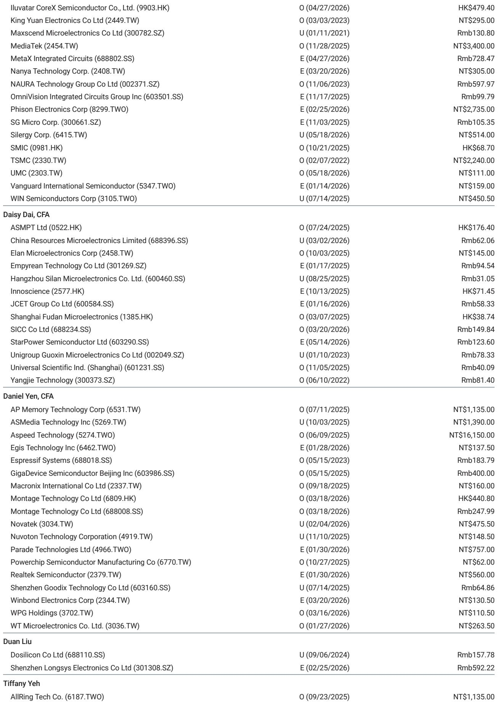
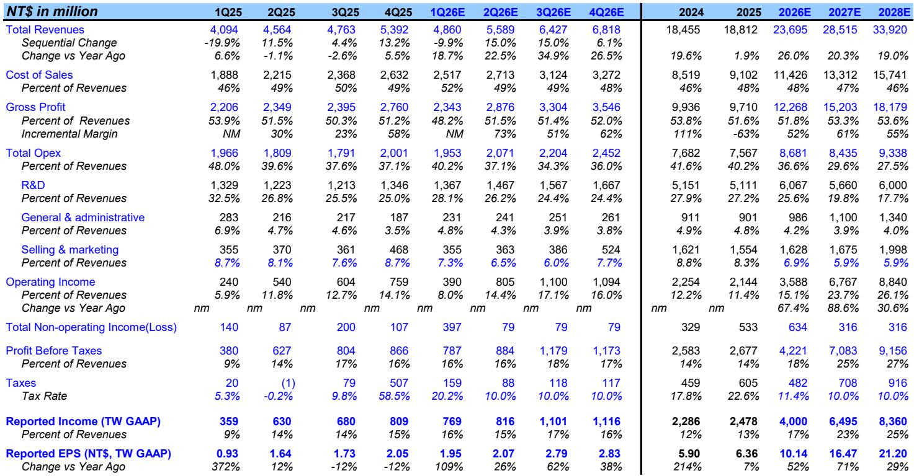
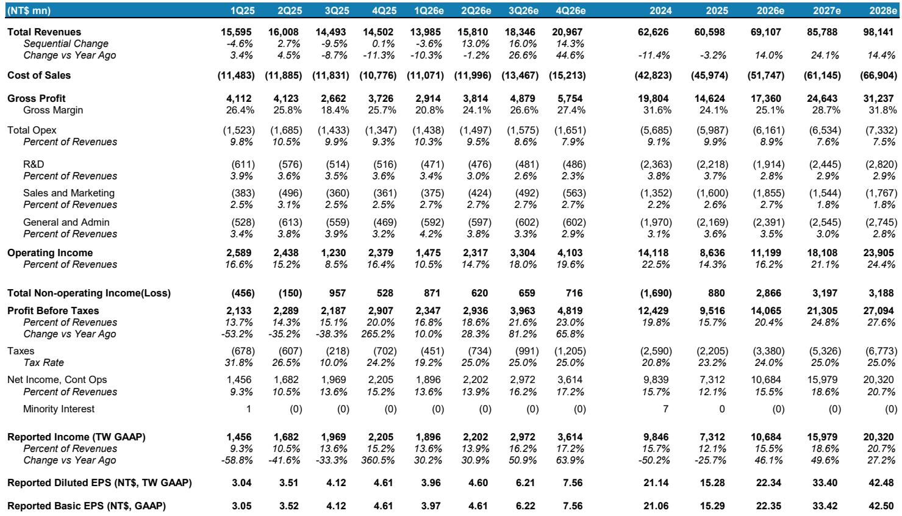

# 市场真正低估的不是AI GPU，而是成熟制程的供给缺口

过去18个月，市场对半导体周期的讨论几乎全部集中在先进制程和AI加速器上。7纳米以下的产能利用率、CoWoS封装瓶颈、HBM的供应分配——这些议题占据了绝大多数研报和投资者会议的注意力。

但这份来自某外资投行的最新报告提出了一个与主流叙事截然不同的判断：**成熟制程的景气上行周期正在启动，而市场对此的定价远不充分。**

这不是一个关于“库存回补”或“季节性反弹”的短期判断。报告的核心逻辑是，AI基础设施的持续扩张正在产生一种结构性的“虹吸效应”——领先的晶圆代工厂和IDM正在将资本、产能和工程资源集中向先进制程和AI相关领域倾斜，这反过来导致成熟制程的可用产能出现系统性收紧。而AI本身对电源管理芯片、互联芯片、边缘计算芯片的需求，恰恰大量依赖55纳米到180纳米这些成熟节点。

换句话说，AI的“长尾”正在成为成熟制程代工厂最强劲的需求驱动力。某外资投行预计，到2027年下半年，成熟制程将出现实质性的产能短缺。

基于这一判断，该行上调了联电的评级至“超配”，目标价从68新台币大幅上调至138新台币；同时维持中芯国际“超配”并上调目标价。但对于已经经历一轮上涨的华虹和世界先进，该行认为估值已趋于合理，维持“等权重”。

以下是我们从这份报告中提炼出的五个核心洞察。

## 1. AI电源管理芯片的增速可能不亚于AI GPU，而它几乎全部依赖成熟制程

市场习惯于将AI半导体的机会等同于GPU、ASIC和HBM。但这份报告提出了一个容易被忽视的事实：AI基础设施的电力架构正在发生根本性变化。

随着NVIDIA Rubin Ultra乃至Feynman架构的推出，单机架的功耗正在从数十千瓦向数百千瓦跃升。这直接驱动了电源管理芯片的用量和价值量呈指数级增长。该行测算，在Feynman机架中，仅电源转换系统（PCS）一项的功率半导体含量就超过2万美元，整个机架的功率半导体总物料成本达到每千瓦191美元。

这些电源管理芯片几乎全部依赖成熟制程——尤其是55纳米BCD、90纳米以及0.18微米等节点。报告特别指出，华虹半导体的一家美国主要PMIC客户，正在将其在55纳米BCD平台上的晶圆需求翻三倍。

这意味着，AI对半导体的需求拉动并非只停留在先进制程的“塔尖”，而是正在形成一个从GPU到电源芯片、从先进封装到互联芯片的完整需求链条。成熟制程代工厂正在成为这一链条中不可或缺的一环。

该行预计，2026年AI服务器电源管理芯片的市场规模将达到150亿美元，未来两年的复合年增长率约为50%。这一增速足以抵消消费电子和智能手机领域的疲软需求。

## 2. 产能再分配正在制造成熟制程的结构性紧张，而非周期性波动

市场对成熟制程的担忧通常集中在“产能过剩”和“价格竞争”上。但报告揭示了一个不同的趋势：领先代工厂正在主动收缩成熟制程的产能配置。

台积电近期明确表示，将采取更严格的成熟制程产能管理策略，逐步关闭Fab 2（6英寸）和Fab 5（GaN）产线，以优化土地和工程资源的使用。三星也在进行类似的产能整合。这意味着，全球最大的两家代工厂正在将资本和人力向先进制程和先进封装集中，对成熟制程客户的态度变得更加“选择性”。

这一产能再分配的直接后果是：原本由台积电和三星承接的成熟制程订单，正在外溢到第二梯队和 specialty 代工厂。联电、世界先进、力积电等厂商正在成为这一溢出效应的主要受益者。

报告的数据显示，联电已经在酝酿2026年下半年的晶圆涨价，幅度约为5-10%，并预计涨价将持续到2027年。世界先进也在1H26上调了8英寸晶圆价格，涨幅从低个位数到低十位数不等。

这不是一个周期性的库存回补故事，而是一个供给侧的再定价故事。当领先代工厂主动减少供应，而需求端因AI生态扩张而持续增长时，成熟制程的定价权正在向代工厂转移。

## 3. 台积电的外包策略正在重塑先进封装领域的竞争格局

CoWoS产能不足是过去两年AI芯片供应的最大瓶颈之一。但报告揭示了一个值得关注的趋势：台积电正在将部分中介层（interposer）生产外包给世界先进的新加坡工厂。

这一合作的背景是，AI和高性能计算对先进封装的需求持续超出台积电内部产能的供给能力。通过利用世界先进的成熟制造能力，台积电旨在缓解2027年的供应约束，提高生产灵活性。

这一外包策略对世界先进的意义不仅在于获得了稳定的订单，更在于其议价能力的提升。报告指出，世界先进的8英寸晶圆涨价幅度可能达到低个位数到低十位数，其部分产品线（如LPDDIC）甚至因产能紧张而采取了更激进的定价策略。

这一案例也提供了一个更广泛的观察框架：在AI驱动的需求扩张中，先进封装领域的产能瓶颈正在向下游传导，那些拥有成熟制程能力且与领先代工厂有合作关系的厂商，正在获得结构性的增长机会。

## 4. 消费和汽车PMIC正在成为被AI“挤出”的领域

AI对成熟制程产能的虹吸效应并非没有代价。报告明确指出，消费电子和汽车领域的电源管理芯片正在成为被“挤出”的对象。

该行将矽力杰的评级下调至“低配”，理由正是代工厂成本上涨和消费需求疲软导致的利润率不及预期。矽力杰在服务器和光通信PMIC领域的敞口相对较小，因此难以从AI驱动的需求增长中获益。

这一判断揭示了一个重要的行业分化：同样是电源管理芯片，服务于AI服务器的产品正在享受量价齐升，而服务于消费电子和传统汽车的产品则面临成本上升和需求疲软的双重压力。

对于投资者而言，这意味着在成熟制程代工厂的客户结构中，AI相关收入的占比正在成为区分赢家和输家的关键变量。

## 5. 报告尚未完全回答的关键问题：Intel代工的变数

报告在末尾简要提及了Intel代工的动向，指出Intel正在与特斯拉和苹果接洽，可能涉及TeraFab代工合作以及A16芯片的试产。但报告也明确表示，良率爬坡需要时间，短期内对台积电领先制程的影响有限。

这里有一个值得深入探讨的问题：如果Intel代工在先进制程上取得突破，台积电是否会进一步加大成熟制程的产能收缩力度？如果台积电将更多成熟制程产能转向内部先进封装或先进制程，那么成熟制程的外溢效应可能会比当前预期更加显著。

报告对此没有给出明确的结论，但这恰恰是投资者需要持续跟踪的关键变量。Intel代工的进展不仅影响先进制程的竞争格局，也可能通过台积电的产能再分配策略间接影响成熟制程的供需平衡。

另一个尚未完全展开的问题是：成熟制程的涨价周期能持续多久？报告预测产能紧张将持续到2028年，但这建立在AI需求持续增长和领先代工厂不改变产能策略的假设之上。如果全球经济出现超预期下行，或者AI资本支出出现周期性放缓，成熟制程的定价权可能迅速逆转。

## 结语

这份报告的核心价值在于提供了一个与市场主流叙事不同的视角。当所有人都盯着先进制程和AI加速器时，成熟制程的结构性变化可能正在酝酿一个被低估的投资机会。

但正如报告所揭示的，这一机会并非均匀分布。它更青睐那些在AI电源管理芯片、先进封装中介层等关键领域有深度布局的代工厂，而非所有成熟制程玩家。同时，消费和汽车领域的PMIC厂商可能面临更大的压力。

这些未解问题——Intel代工的变数、涨价周期的可持续性、AI资本支出的节奏——正是需要持续跟踪和深入讨论的关键议题。欢迎来星球微信群里继续讨论，我们将基于原始报告的完整图表和估值模型，进一步拆解这些二阶影响。

Personal reading notes and learning share only. Not investment advice.

