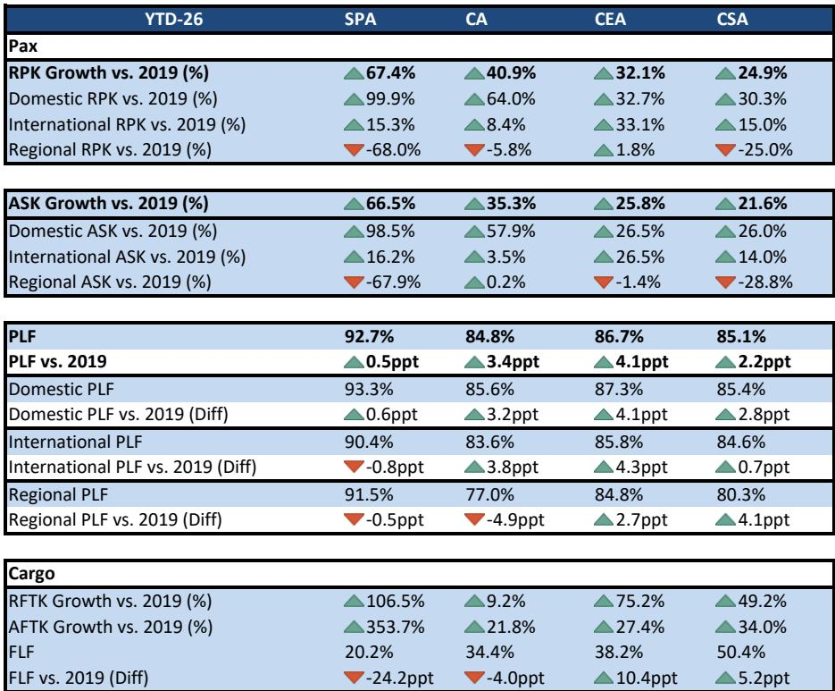
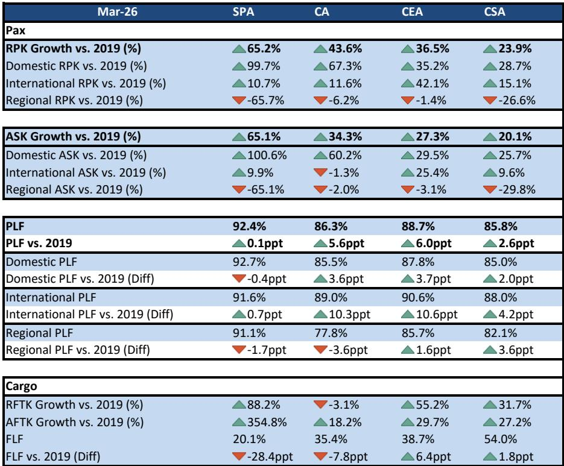
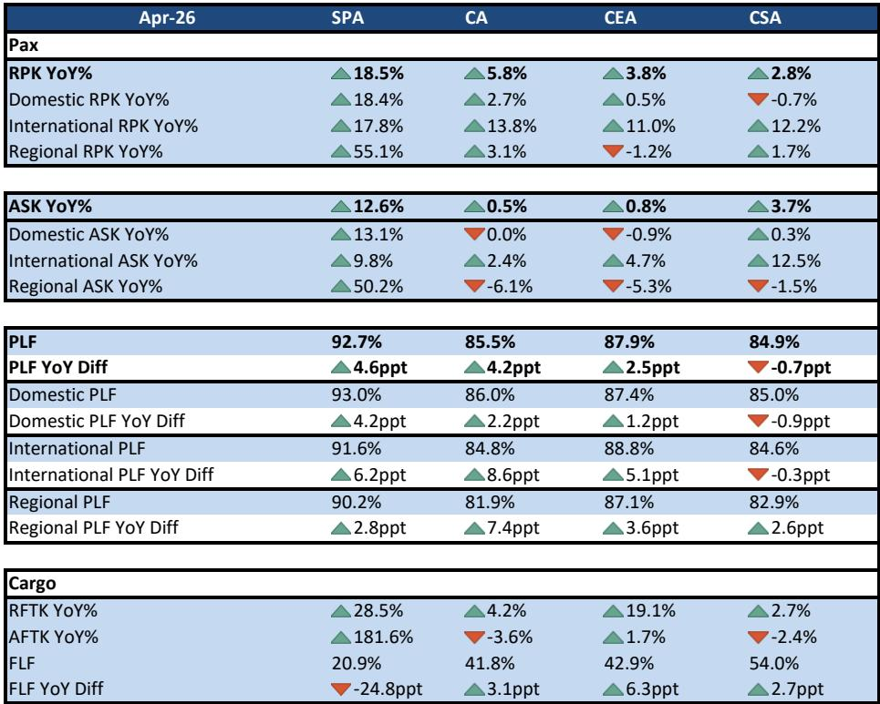

# 市场低估的不是国内需求放缓，而是国际航线正在重构中国航司的定价权

四月运营数据发布后，市场焦点几乎一致落在国内客运增速放缓上。三大航国内RPK同比增速从一季度4%-12%回落至0%-3%，南方航空甚至出现负增长。但这份由某外资投行发布的中国航司月度追踪报告揭示了一个更值得关注的信号：国际航线正在成为结构性分化的核心战场，而一家低成本航空公司的表现，正在改写行业竞争格局。

这份报告的核心判断不应被误读为“需求疲软”。四月国内增速回落，报告明确指出部分原因在于票价通胀（pricing inflation）——换言之，不是没人坐飞机，而是票价上涨抑制了部分价格敏感需求。真正需要追问的问题是：谁在票价上涨的环境下仍然能实现客座率提升？谁在国际航线上抢到了增量份额？以及，这些变化对行业未来两年的利润结构意味着什么？

## 1. 国内增速放缓背后是定价能力的分化，而非需求塌陷

四月国内RPK增速的普遍回落，如果只看总量，容易得出“航空需求见顶”的误判。但拆开来看，差异极为显著。

春秋航空以18.4%的国内RPK同比增速遥遥领先，而三大航中表现最好的国航也只有2.7%，东航接近零增长，南航甚至同比下滑0.7%。这种分化不能用“市场需求不好”来解释，因为所有公司面对的是同一个宏观需求环境。

真正差异在于客群结构和定价策略。春秋航空的客座率在四月达到93.0%，同比提升4.2个百分点。这意味着它不仅在增长，而且是在满舱飞行。三大航中国航的国内客座率也达到86.0%，同比提升2.2个百分点。南航则是唯一一家国内客座率同比下降的航司，降幅0.9个百分点。

这些数据指向一个结论：国内航空市场并未饱和，但增长正在从“全行业普涨”转向“特定商业模式和特定客群驱动”。票价通胀环境下，能够维持高客座率的航司，实际上拥有了更强的定价权。春秋航空的低成本模式在这一轮票价上涨中反而受益——它的价格优势使其在提价时仍能吸引价格敏感客群，而全服务航司则需要面对商务客群对价格的更高敏感度。

对于投资者而言，国内市场的关键变量不是总需求增速，而是各航司在票价上涨周期中保持客座率的能力。这一点，三大航内部已经出现明显分化。

## 2. 国际航线才是真正的增长引擎，且客座率改善远超预期

如果国内数据只是“结构分化”，那么国际数据则称得上“超预期惊喜”。

四月，三大航国际RPK同比增速仍然维持在11%-14%的区间，虽然较一季度17%-18%有所回落，但绝对增速仍然健康。更值得关注的是客座率变化：国航国际客座率同比提升8.6个百分点，东航提升5.1个百分点，春秋航空提升6.2个百分点。南航是唯一例外，国际客座率微降0.3个百分点。

客座率的大幅提升意味着什么？不是运力收缩带来的被动改善——事实上，三大航和春秋航空的国际ASK都在增长，只是需求增长更快。报告特别指出，中国正在吸引国际中转客流，并且在直飞航线份额上持续提升。这是一个重要的结构性判断：中国航司在国际航线上的竞争力，正在从“价格优势”转向“网络优势”。

对比2019年数据更显清晰。国航和东航四月国际客座率分别达到89.0%和90.6%，比2019年同期分别高出10.3和10.6个百分点。春秋航空的国际客座率也达到91.6%，比2019年高出0.7个百分点。这些数字意味着，即使疫情后国际航线运力尚未完全恢复，但需求的恢复速度已经超过运力投放，供需关系正在向有利于航司的方向倾斜。

这里有一个未被充分讨论的含义：国际航线的高客座率，叠加票价上涨，意味着国际业务正在从过去几年的“亏损拖累”转向“利润贡献”。如果这一趋势持续，三大航的利润结构将发生根本性变化。

## 3. 春秋航空的“双线碾压”暴露了全服务航司的结构性短板

整个四月运营数据中，春秋航空的表现几乎可以用“碾压”来形容。国内RPK增速18.4%，国际17.8%，总客座率92.7%——这组数字放在任何市场都是顶级表现。

但更值得深思的是春秋航空如何做到这一点。报告数据显示，春秋航空的国际ASK增速只有9.8%，但国际RPK增速达到17.8%，客座率提升6.2个百分点。这意味着它的增长不是靠“砸运力”换来的，而是真正的需求拉动。在国内市场，它的运力增速（ASK 13.1%）与需求增速（RPK 18.4%）之间的差距更大，客座率提升4.2个百分点。

这种“运力增速低于需求增速”的模式，是航空公司最健康的增长方式。它意味着每一架新增飞机的边际收益都在上升，而不是像某些全服务航司那样，需要靠大幅增加运力来维持增长。

对比之下，三大航中国航表现相对最好，但也只是国内RPK增长2.7%、国际增长13.8%。南航则在国内市场出现负增长，国际客座率下降，是四月数据中最弱的全服务航司。

春秋航空的持续超预期，实际上提出了一个行业层面的问题：在全服务航司普遍面临成本压力、票价上涨抑制部分需求的环境下，低成本模式是否正在获得系统性优势？报告没有直接回答这个问题，但数据暗示了这个方向。

## 4. 货运业务的复苏信号可能被忽视，尤其是对东航的利润影响

客运数据是这份报告的主体，但货运数据同样值得关注。四月，东航国际RFTK同比大增19%，国航增长4.2%，南航增长2.7%。春秋航空的货运数据因基数效应（AFTK暴增181.6%）而失真，但货运载运率大幅下降至20.9%，说明其货运运力扩张远超需求。

东航的货运表现尤其突出。对比2019年，东航四月RFTK增长55.2%，货运载运率38.7%，比2019年高出6.4个百分点。在客运业务尚未完全恢复盈利的背景下，货运业务的持续复苏对东航的利润修复可能比市场预期的更重要。

报告没有展开讨论货运业务的利润贡献，但可以合理推断：如果货运需求持续改善，尤其是跨境电商带动的国际航空货运需求，东航和国航的货运子公司可能成为利润的“第二引擎”。这一点，在当前的行业讨论中显然被低估了。

## 5. 报告尚未完全回答的关键问题：票价弹性与成本传导的临界点

这份报告数据详实、判断清晰，但有一个核心问题没有完全展开：票价上涨到什么程度会开始抑制需求？或者说，当前的高客座率是否可持续？

报告指出四月国内增速放缓部分归因于“pricing inflation”，但并未量化票价涨幅对需求弹性的影响。这是一个关键缺口。如果票价继续上涨，春秋航空的93%客座率能否维持？三大航的商务客群对票价上涨的容忍度有多高？国际航线的客座率提升，有多少来自被压抑的出境需求释放，多少来自真正的结构性份额提升？

另外，成本端的不确定性也没有被充分讨论。油价、机场收费、人力成本——这些变量在票价上涨周期中同样在变化。如果成本增速超过票价增速，高客座率未必能转化为高利润。

这些问题，报告提供了数据基础，但没有给出明确答案。而恰恰是这些未解问题，决定了当前航空股的估值逻辑是否站得住脚。

## 6. 投资者应该建立的观察框架：从总量增速转向三个结构性指标

基于这份报告，投资者需要调整对航空板块的分析框架。过去市场习惯用“整体RPK增速”来衡量行业景气度，但四月数据表明，这个指标已经不足以捕捉行业变化。

建议关注以下三个结构性指标：

第一，客座率变化的方向和幅度。不是看客座率的绝对水平，而是看同比变化。国航和东航国际客座率同比提升5-9个百分点，这比任何总量增速都更能说明供需关系的变化。如果未来几个月这一趋势持续，国际航线将成为利润修复的主要驱动力。

第二，运力增速与需求增速的差距。春秋航空的模式之所以健康，在于运力增速低于需求增速。如果某家航司的ASK增速持续高于RPK增速，意味着它在用运力换增长，边际收益在下降。

第三，低成本航司与全服务航司的增速差。春秋航空与三大航之间的差距如果继续扩大，将意味着行业竞争格局正在发生不可逆的变化。全服务航司要么通过成本改革缩小差距，要么在票价上涨周期中持续丢失市场份额。

这三个指标，比单一的总量数据更能回答“行业到底在变好还是变差”这个问题。

---

四月运营数据带来的最大启示，不是国内需求放缓，而是国际航线的结构性改善和低成本模式的系统性优势正在同时发生。这两股力量的交汇，正在重塑中国航空业的利润分配格局。

但正如前文所述，这份报告留下了一个关键悬念：票价上涨的可持续性。客座率提升和票价上涨的叠加效应能持续多久？成本端的压力何时会开始侵蚀利润？这些问题，需要更深入的行业数据和公司层面的财务分析才能回答。

如果你对这些问题感兴趣，欢迎来星球微信群里继续讨论。我们会基于完整报告，进一步拆解各航司的成本结构、票价弹性，以及国际航线竞争格局的演变路径。这些内容，单凭四月运营数据无法完全回答，但结合更长时间维度的数据和公司交流，可以形成更有价值的判断框架。

Personal reading notes and learning share only. Not investment advice.

