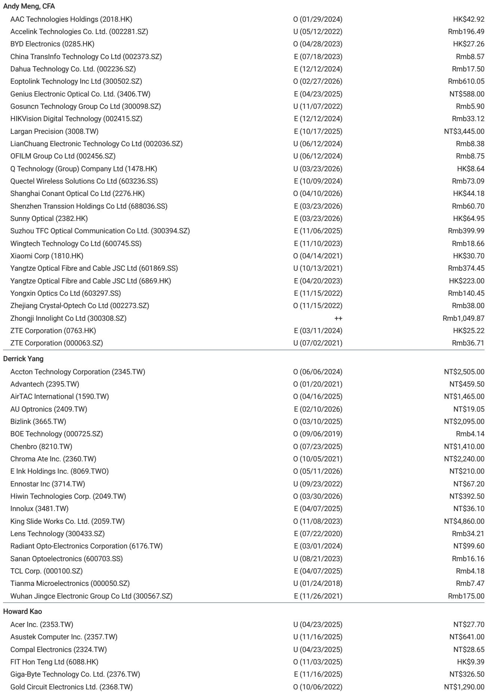
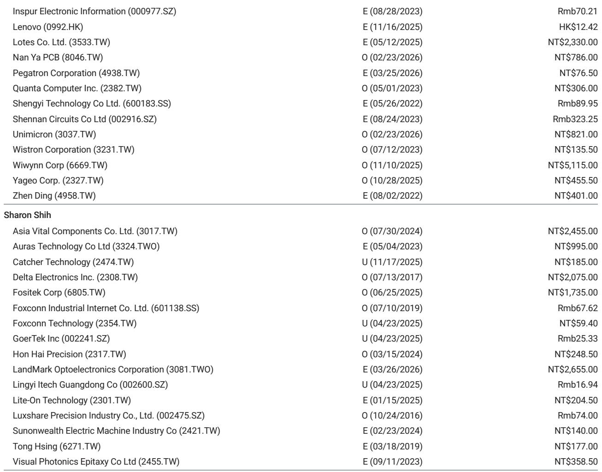
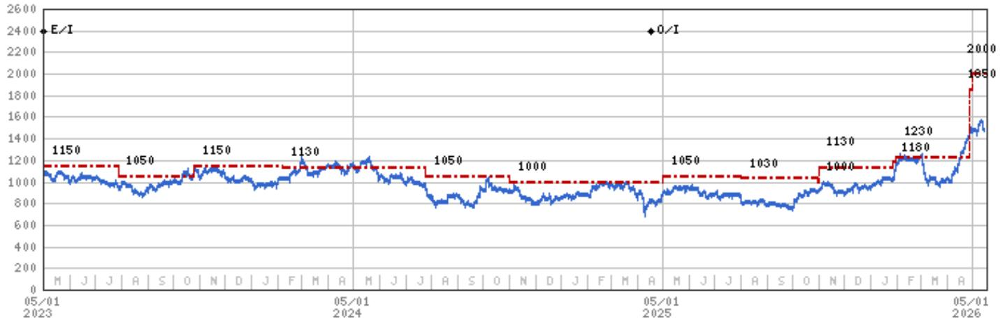

# The Automation Cycle Is Not Peaking: Why April's JMTBA Data Signals Sustained Momentum, Not a Top

The conventional worry in industrial automation is that a strong upcycle is always followed by an equally sharp downcycle. Investors who missed the early move in automation stocks often hesitate, fearing they are buying near the peak. The preliminary Japan Machine Tool Builders' Association (JMTBA) orders for April 2026 should put that concern to rest. Headline orders reached ¥189 billion, growing 45% year-over-year, and critically, the sequential decline of 2% month-over-month is a pattern consistent with a mature expansion, not a cyclical peak. The data from April tells a more nuanced story: overseas orders remain the engine of growth, and the manufacturing PMIs across China, Europe, and North America all held above the 50 threshold in April. This is not a market running out of steam. This is a market demonstrating breadth and resilience.

The debate is no longer about whether the recovery is real. It is about which companies are best positioned to convert this macro tailwind into sustainable earnings power. A global investment bank report focuses on two key beneficiaries: Airtac International and Hiwin Technologies. The former is a market share story; the latter is a margin expansion story. Both are compelling, but they require different risk appetites and time horizons. The JMTBA data provides the catalyst, but the real work for investors is in understanding the structural versus cyclical components of each thesis.

This analysis will unpack why the April JMTBA data is a stronger signal than it first appears, how the two leading stocks diverge in their value creation mechanisms, and what critical questions remain unanswered by the current research. The objective is not to summarize the report, but to build a decision framework around it.

## Overseas Orders Provide a Diversified Growth Backstop That Domestic Data Alone Cannot Guarantee

The most reassuring aspect of the April JMTBA data is the composition of the order book. Overseas orders, at ¥140 billion, accounted for 74% of total orders and grew 46% year-over-year. This is not a one-region story. The PMI data for April shows China at 50.3, Europe at 52.2, and North America at 52.7. All three major manufacturing regions are in expansion territory. This breadth is the critical differentiator from prior cycles that were overly dependent on China's stimulus-driven recoveries.

The sequential decline of 2% month-over-month in overseas orders needs to be read in context. March 2026 saw a 30% month-over-month surge, which was an outlier. A slight pullback from that elevated base is normal and healthy. The year-over-year growth of 46% is the more reliable signal of underlying demand momentum. For investors, the implication is straightforward: the automation cycle is being driven by a synchronized global manufacturing recovery, not by a single region's fiscal impulse. This reduces the risk of a sudden stop. The sustainability of this demand depends on whether these PMI readings can hold or improve in the second half of 2026, but the starting point is robust.

## Airtac's Valuation Is Undemanding Because Its Growth Is Structural, Not Just Cyclical

The report highlights Airtac at 22x 2027e P/E, which is below its average of 25x since 2020. This is the key analytical hook. The stock is trading at a discount to its own history even as the cycle accelerates. Why? The market may be underestimating Airtac's ability to gain market share in a recovery. Pneumatic components are a fragmented market, and Airtac has a proven track record of capturing share from European and Japanese competitors during upcycles, particularly in China.

The valuation argument works only if one believes Airtac's growth is partly structural. If the company were a pure cyclical play, a 22x multiple on 2027e earnings would be fair, not cheap. The report's base case uses a 30x P/E target, implying that the analyst expects the cycle to continue and for Airtac to outperform. The risk, however, is that the market share gains are already priced in. The open question is whether the company can sustain its market share trajectory if the cycle slows in 2027. The report does not fully model a scenario where demand decelerates faster than expected, which leaves a gap in the upside/downside symmetry.

## Hiwin's Margin Expansion Thesis Is the Higher-Risk, Higher-Reward Play

Hiwin is a different kind of bet. At 37x 2027e P/E, the stock is not cheap by any conventional measure. The report acknowledges this, noting that the multiple is at the peak cycle valuation range of 35-40x. The justification for paying this multiple is the margin expansion story. Hiwin is expected to benefit from higher utilization rates and price hikes, particularly in the second half of 2026.

The logic is sound: as factories run at higher capacity, fixed costs are absorbed, and operating leverage kicks in. The report projects a 44% operating profit CAGR for 2025-2028. That is an aggressive assumption. It implies that the current cycle has significant duration and that Hiwin can maintain pricing power. The risk is that if demand momentum falters, the high multiple leaves no room for error. Hiwin's valuation is already discounting perfection. The report does not fully explore the downside scenario where price hikes fail to stick or where utilization rates peak earlier than expected. For investors, Hiwin is a conviction bet on the cycle's longevity, not a value play.

## The Report Leaves a Critical Question Unanswered: What Happens When PMIs Dip Below 50?

The current analysis is built on the assumption that manufacturing PMIs will remain above 50 for the foreseeable future. This is a reasonable base case, but it is not a certainty. The report does not provide a rigorous stress test of what happens to Airtac and Hiwin's earnings if, for example, China's PMI slips to 49 or North America's PMI drops to 50. The sensitivity analysis is absent.

This is the most significant analytical gap. Both stocks are levered to the macro cycle. A downturn in PMIs would hit Hiwin's margin expansion thesis first, as pricing power would evaporate quickly. Airtac would be more resilient, given its market share gains, but its earnings would still compress. The report's catalyst event table classifies the JMTBA data as "in-line" for both companies, which suggests that the data confirms the existing thesis but does not change the risk/reward calculus. The unanswered question is whether the current valuation adequately compensates for a moderate downturn. For a serious investor, this is the missing piece.

## A Decision Framework: Which Stock Fits Your Risk Profile

The report implies two distinct investment theses, and the choice between them depends on the investor's conviction in the cycle.

For an investor who believes the global manufacturing recovery is durable and has room to run, Hiwin is the higher-conviction play. The margin expansion story is powerful, and the 37x multiple, while high, is justified if the earnings CAGR materializes. The risk is that any macro disappointment will compress the multiple sharply.

For an investor who wants exposure to automation but is wary of peak-cycle valuations, Airtac is the more defensive choice. The 22x P/E provides a margin of safety, and the market share story provides a structural growth component that is less dependent on the cycle's amplitude. The trade-off is that the upside may be more limited if the cycle extends further than expected.

The decision framework should also include a time horizon. Hiwin's margin expansion is back-end loaded to the second half of 2026 and beyond. Airtac's market share gains are more immediate. An investor with a 12-month horizon may prefer Airtac. An investor with a 24-month horizon may find Hiwin's earnings trajectory more compelling.

## The Unresolved Tension: Is This a Cycle or a Secular Shift?

The most provocative question that emerges from this analysis is whether the current automation upcycle is simply a cyclical recovery from a post-pandemic inventory correction, or whether it represents a secular shift driven by reshoring, labor shortages, and the adoption of humanoid robotics. The report hints at the latter by mentioning Hiwin's potential revenue contribution from humanoids as an upside risk, but it does not develop this thesis.

If the cycle is purely cyclical, the peak is likely within the next 12-18 months, and the time to be cautious is approaching. If it is secular, the current valuations may prove to be cheap in retrospect. The report does not settle this debate, and it should not. The reader is left with a productive tension: the data supports the cycle, but the valuation debate forces a deeper question about the nature of the demand. This is precisely where the full report, with its original charts and detailed earnings models, becomes indispensable.

Join the community to read the full report and review the original charts. The data on PMI trends, order composition, and valuation multiples are best understood visually, and the original research provides the granularity that this analysis has necessarily compressed.

*This article is for learning and discussion only and does not constitute investment advice.*

Personal reading notes and learning share only. Not investment advice.

