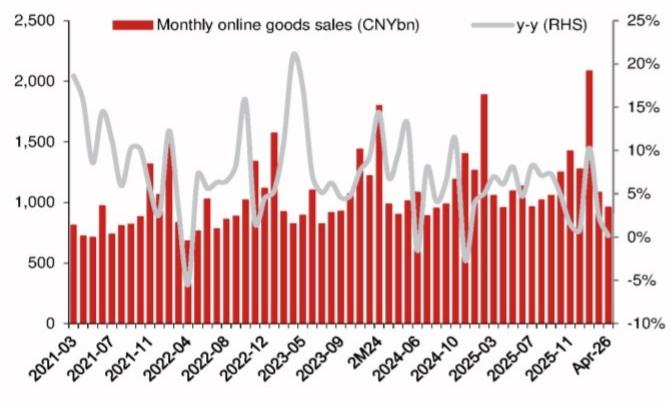
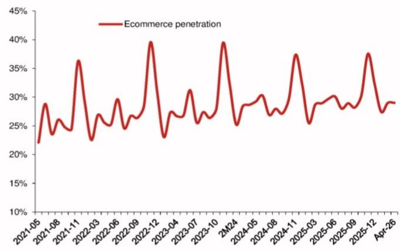
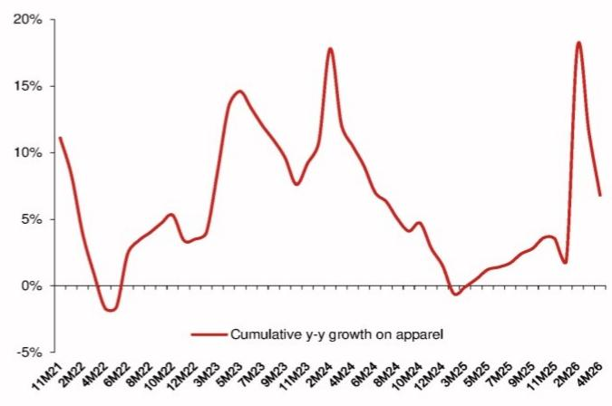

# 4月电商增速骤降至0.2%，市场低估的不是需求，而是补贴退潮后的结构性重塑

四月社零数据出炉，中国电商销售额同比增速从3月的2.5%骤然收窄至0.2%，几乎原地踏步。这组数字让不少投资者心头一紧。毕竟，就在一个多月前，各大电商平台的一季报还传递着“谨慎乐观”的信号，而四月数据直接印证了管理层在最近一次财报电话会上的预警——二季度展望确实不容乐观。

某外资投行在最新发布的快评中指出，四月电商增速的断崖式放缓并非孤立事件，而是多个结构性力量同时作用的结果：补贴政策退潮带来的基数效应、消费品类内部的分化、以及消费者行为在宏观环境下的微妙转向。这些因素叠加，正在重塑中国电商行业的竞争逻辑。

真正值得关注的不是短期增速波动，而是补贴红利消退后，电商平台赖以增长的底层逻辑是否正在发生不可逆的改变。报告给出的判断清晰而克制：在接下来的六月季度，某头部电商平台的客户管理收入可能同比下滑5%，而另一家头部平台的核心零售业务收入可能同比下滑7%。这不是短期波动，而是整个行业正在经历的一场供给侧再定价。

---

## 1. 补贴退潮是四月数据骤降的直接推手，但其影响远比数字本身深远

四月电商增速从2.5%跌至0.2%，最直接的解读是去年同期的高基数效应。但仔细拆解品类数据，会发现补贴政策的边际效用递减才是关键变量。

报告数据显示，家用电器品类从三月的同比下滑5%进一步恶化至四月的同比下滑15%。某外资投行分析师明确指出，这主要是由于高基数效应和以旧换新补贴效果减弱所致。智能手机销量增速从三月的27.3%骤降至四月的6.2%，原因同样指向芯片成本上涨引发的终端提价以及高基数。

这里需要特别注意的是“补贴效果减弱”这个表述。它暗示的不仅是基数问题，更是消费者对补贴刺激的敏感度正在系统性下降。过去两年，各平台通过百亿补贴、以旧换新等手段拉动高客单价品类的销售，但这种策略的边际回报正在快速递减。当补贴力度无法持续加码，或者消费者已提前透支了部分需求，增速的回落就不再是暂时的技术性调整，而是需求曲线本身的位移。

对于电商平台而言，这意味着过去依赖补贴驱动的GMV增长模式正在触及天花板。下一阶段的竞争，将不再是谁能提供更大的折扣，而是谁能更高效地匹配供需、降低交易成本、提升复购粘性。

## 2. 品类分化揭示了一个关键事实：刚需韧性尚在，但可选消费的“补贴依赖症”正在暴露

四月数据中最值得细读的部分不是总量，而是品类之间的结构性分化。

食品饮料线上销售在四个月累计同比增长15.6%，虽然较三月的17.2%有所放缓，但依然保持了两位数的增长，是电商大盘中为数不多的亮点。日用品类也维持了3.5%的同比正增长。这些品类的共同特征是刚需属性强、客单价低、购买频率高。它们构成了电商平台的“压舱石”，也是平台能够维持用户活跃度的基本盘。

真正的压力集中在可选消费领域。除了前面提到的家电和手机，服装品类增速从三月的7.0%降至四月的3.6%，化妆品从8.3%降至4.7%。PC品类更是从三月的15%正增长直接转为四月的6.9%负增长。

这种分化意味着什么？它说明消费者的支出意愿正在变得更加审慎。在宏观环境存在不确定性的背景下，消费者倾向于优先保障日常必需品的支出，而对大额、非必需的消费则持观望态度。这种行为的转变，对于依赖高客单价品类拉动GMV的平台来说，是一个需要认真对待的信号。

更值得关注的是，这种分化并不是四月特有的现象。回顾报告中的累计同比数据，服装品类在过去两年中经历了多次起伏：2024年初曾录得18%的累计增长，但到年底已回落至3%；2025年初一度转负，2026年初又反弹至18%，四月又回落至7%。这种剧烈的波动本身就说明，可选消费的线上增长缺乏稳定的内生动力，高度依赖促销节点和短期刺激。

## 3. 渗透率停滞背后，是电商增长从“跑马圈地”进入“存量博弈”的临界点

四月电商渗透率录得29%，同比仅提升0.1个百分点。这个数字的含金量不容低估。

回顾过去五年的渗透率曲线，每一次重大促销节点（如双十一、618）都会将渗透率推至30%以上，但节后迅速回落。2022年12月渗透率曾达到40%的高点，2023年10月为39%，但2025年之后，峰值开始走平，2025年12月仅为37%。这意味着电商对线下零售的替代效应正在减弱，增量空间正在收窄。

渗透率停滞的另一个维度是用户增长的瓶颈。当新增用户主要来自低线城市和银发群体时，其消费能力和消费习惯与核心用户存在显著差异。这些用户的客单价更低、品类偏好更集中在刚需领域，对平台利润率的贡献有限。换句话说，用户数量的增长已经无法线性转化为GMV和利润的增长。

对于平台而言，渗透率见顶意味着增长引擎必须切换。过去十年，电商的增长主要来自两个驱动力：一是用户规模扩张，二是品类渗透加深。当用户规模接近天花板，品类渗透也进入深水区时，增长只能来自两个方向：要么提升现有用户的消费频次和客单价，要么通过供给侧创新创造新的需求。这两个方向对平台的能力要求截然不同。

## 4. 报告尚未完全回答的关键问题：利润承压是否会倒逼平台重新定义竞争策略

某外资投行在报告中给出了对两家头部平台二季度业绩的预测：某平台CMR同比下滑5%，另一家零售收入同比下滑7%。这些数字意味着什么？它意味着在收入端承压的同时，平台还需要面对成本端的刚性支出——物流基础设施的折旧、用户获取成本的上升、以及价格战带来的利润率侵蚀。

报告没有展开讨论的是，当收入和利润同时承压时，平台会如何调整竞争策略。过去几年，各平台在低价策略上投入了大量资源，从百亿补贴到仅退款，从全站推广到自动跟价，竞争已经深入到供应链的每一个环节。但这种策略的可持续性正在受到质疑。

一个值得观察的信号是，部分平台已经开始调整对商家的政策，试图在价格竞争和商家生态健康之间找到平衡。如果补贴退潮和收入放缓成为持续性趋势，平台可能会从“追求绝对低价”转向“追求性价比最优”，这将对供应链格局产生深远影响。那些只依赖低价策略、缺乏品牌溢价和产品差异化的商家，可能会在这一轮调整中面临更大的生存压力。

## 5. 投资者应建立的观察框架：从关注增速转向关注结构质量

面对四月数据的波动，投资者需要建立一个新的分析框架，而不是简单地根据月度增速做判断。这个框架应该包含三个维度。

第一，品类结构。关注高粘性、高复购的刚需品类是否能够维持增长韧性。如果食品饮料、日用品等品类持续保持正增长，说明电商的基础需求仍然稳固。反之，如果这些品类也开始减速，则意味着更广泛的消费疲软正在发生。

第二，平台盈利能力。在收入增速放缓的背景下，平台能否通过运营效率提升来保护利润率。这包括履约成本的优化、营销费用的控制、以及变现率的稳定。那些能够在低速增长中维持甚至提升利润率的平台，将在下一轮竞争中占据更有利的位置。

第三，供给侧变化。补贴退潮后，哪些品类和商家能够保持增长？这实际上是市场在检验供应链的真实竞争力。那些依靠补贴生存的商家会被淘汰，而那些有产品力、品牌力、供应链效率的商家会获得更大的市场份额。这种优胜劣汰对平台长期健康是有利的。

---

四月电商数据是2026年行业走向的一个重要信号，但它不是终点。真正的考验将在接下来的二季度和三季度出现——当补贴红利完全消退，当高基数效应持续，当消费者行为调整趋于稳定，我们才能看清哪些增长是真实的，哪些只是短期刺激的幻象。

报告中对二季度的预测已经给出了一个明确的判断方向，但还有一些更深层次的问题需要持续跟踪：补贴退潮对平台利润率的真实影响有多大？消费品类之间的分化是否会进一步加剧？平台是否会调整对商家的政策以应对收入压力？这些问题在快评中只是点到为止，完整报告提供了更详尽的测算逻辑和情景分析。

欢迎来到星球微信群继续讨论这些问题。我们会围绕这份报告的核心判断，结合最新的行业动态，持续跟踪二季度数据的变化，并探讨这些变化对投资逻辑的具体含义。

Personal reading notes and learning share only. Not investment advice.

