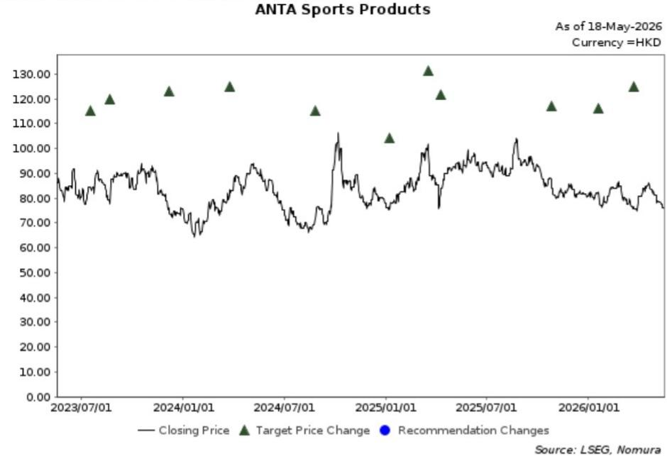

# China’s April Retail Data Signals More Than Just a Slowdown: It Signals a Structural Reassessment

The headline number was bad. China’s total social retail sales grew by only 0.2% year-on-year in April 2026, a dramatic deceleration from March’s already-weak 1.7% and a clear miss against the consensus expectation of 2.0%. But the real story is not that consumption softened further. The real story is that the pattern of weakness has shifted from a narrow, policy-sensitive set of categories to a broad-based deterioration across the consumer economy. This is not a temporary dip. It is a signal that the consumer sector is entering a new phase where the old drivers of growth are exhausted and the new ones have not yet materialized.

For investors, the implications are uncomfortable. The traditional playbook of rotating into defensive staples and waiting for a policy catalyst is no longer sufficient. The data from April forces a more fundamental question: which companies can actually sustain profitability when aggregate demand is flat, policy support is fading, and consumer confidence remains fragile? The answer lies not in sector-level positioning but in firm-level resilience.

The April retail sales report, released by the National Bureau of Statistics on 18 May, shows that excluding auto sales, merchandise retail actually contracted by 0.1% year-on-year. This is the first negative print for goods retail in recent memory, and it matters because auto sales have been a persistent drag for months. Strip away that one category, and the underlying picture is even worse than the headline suggests. The consumption sector is not just slowing. It is shrinking.

This article unpacks what the April data really means, why the market may be underestimating the structural nature of this slowdown, and how investors should rethink their approach to Chinese consumer equities.

## The Broadening of Weakness Across Categories Reveals a Demand-Side Problem That Policy Cannot Quickly Fix

The most concerning aspect of the April data is not the depth of the decline in any single category but the breadth of the weakness. In March, the slowdown was concentrated in auto sales and home appliances, both of which had been beneficiaries of government subsidy programs that were winding down. One could argue that March’s data reflected a temporary policy hangover. April’s data destroys that narrative.

Consider the following: catering services, which had been a relative bright spot, decelerated from 2.9% year-on-year growth in March to 2.2% in April. Consumer staples, the traditional safe harbor, showed mixed signals. Beverages grew 3.6%, but that was down from 8.2% in March. Tobacco and liquor accelerated to 11.7%, but this is a category that is heavily influenced by inventory restocking and pricing power rather than genuine demand expansion. Daily necessities grew 3.5%, down from 4.6%.

The real damage, however, is in discretionary categories. Gold and jewelry sales plunged 21.3% year-on-year, reversing a positive trend from March. This is not just about gold price volatility. It reflects a broader consumer reluctance to make high-ticket discretionary purchases. Home appliances fell 15.1%, worsening from a 5.0% decline in March, as the fading impact of trade-in subsidies left a vacuum that organic demand cannot fill. Petroleum products declined 6.5%. Cosmetics fell 15.0%. Garments and footwear dropped 21.0%.

The pattern is unmistakable. When policy support is withdrawn, demand does not merely return to baseline. It falls below baseline. This suggests that the consumer sector was more dependent on artificial stimulus than many analysts assumed. The so-called post-pandemic recovery was, in large part, a policy-driven sugar high. April is the hangover.

For investors, the key insight is that this is not a cyclical trough that will self-correct. The demand-side problem is structural. Consumers are not just waiting for the next stimulus check. They are adjusting their spending behavior in response to a prolonged period of weak income growth, declining property wealth, and uncertainty about the future. No amount of targeted subsidies for home appliances or autos can reverse that.

## The Property Market ‘Green Shoots’ Are a Distraction, Not a Catalyst for Consumption Sentiment

One of the more dangerous narratives circulating in the market is that recent positive signals in property sales volume across select tier-1 and tier-2 cities could be a precursor to a broader recovery in consumer confidence. The April retail data should put that narrative to rest.

The logic linking property to consumption is straightforward: housing wealth effects influence household spending, and a stabilization of the property market would reduce precautionary saving. But this logic assumes that the recent uptick in sales volume reflects genuine demand recovery rather than a combination of price discounts, policy easing, and pent-up demand from delayed transactions. The data suggests the latter.

Even if property sales stabilize in a handful of cities, the impact on national consumption sentiment is likely to be negligible for three reasons. First, the property market downturn has destroyed household wealth on a scale that a modest sales recovery cannot reverse. Falling home prices have reduced the collateral value of existing homeowners’ primary asset, and this wealth effect is far more powerful than any marginal improvement in new sales volume.

Second, the consumption weakness in April is broad-based and includes categories that have no direct link to the property market. Consumer staples are weakening. Catering is slowing. Gold jewelry is collapsing. These are not housing-related categories. They reflect a generalized deterioration in consumer confidence that a property recovery in tier-1 cities cannot address.

Third, the labor market remains under pressure. Weak consumption is not just about wealth. It is about income. If households are uncertain about their job security and future earnings, they will save more and spend less regardless of what happens to property prices. The property narrative is a convenient story for equity analysts who need to justify optimistic forecasts, but it does not hold up against the April data.

Investors should treat any discussion of a property-led consumption recovery with extreme skepticism. The consumption problem is not a housing problem. It is an income and confidence problem, and those take years to fix, not months.

## The Fading of Policy Support Creates a Binary Outcome for Consumer Companies: Those with Pricing Power and Margin Control Will Survive; Those Without Will Not

The April data makes one thing clear: the era of policy-driven consumption growth is over, at least for now. The government’s trade-in subsidies for home appliances and autos have run their course, and there is no indication that a new round of broad-based stimulus is imminent. This means that consumer companies can no longer rely on external demand boosts. They must generate their own growth.

This is where the market’s focus should shift. In a flat or declining aggregate demand environment, the winners will be companies that can do one or both of the following: maintain pricing power despite weak volumes, or demonstrate visible margin improvement through cost control and operating leverage. The losers will be companies that depend on volume growth to cover fixed costs and that lack the brand strength to hold prices.

The analysis from a global investment bank report highlights three names that fit the winning profile: ANTA Sports Products in the sportswear sector, Laopu Gold in the retail space, and Haidilao International Holding in the catering sector. Each of these companies has a thesis that is consistent with the current environment.

For ANTA, the argument is that the capital market may be overly pessimistic about its acquisition of a stake in Puma. If the market is wrong, the stock offers a significant re-rating opportunity. This is a bet on market mispricing rather than sector growth, which is precisely the kind of trade that works when the sector itself is stagnant.

For Laopu Gold, the thesis is margin stability. Gold jewelry is a category where pricing power is tied to the underlying commodity price, but Laopu’s ability to maintain stable margins through improved operating leverage and cost control gives it a defensive quality that most peers lack. In a market where gold demand is collapsing, the ability to protect margins is a competitive advantage.

For Haidilao, the story is about operational improvement and new brand potential following a management reshuffle. The market is skeptical about its ability to deliver better-than-consensus sales from new brands. If Haidilao can prove the skeptics wrong, the upside is substantial. This is a high-conviction, high-risk trade that is appropriate only for investors who have a differentiated view on management execution.

The common thread across these three names is that they are not dependent on a macro recovery. They have company-specific catalysts that can generate alpha regardless of what the aggregate retail sales data show. That is exactly the kind of stock selection that investors should be focusing on.

## What the Report Does Not Fully Answer: The Duration of the Consumption Downturn and the Trigger for a Turnaround

For all its analytical rigor, the report leaves several critical questions unresolved. The most important is the duration of the current consumption downturn. Is this a six-month adjustment, a twelve-month adjustment, or a multi-year structural shift? The report provides data on the current state but does not offer a framework for forecasting the recovery timeline.

The second unresolved question is the trigger for a turnaround. If policy stimulus is off the table and property recovery is a false hope, what will actually cause consumers to start spending again? The report does not address this. It implies that the answer lies in company-specific factors rather than macro forces, but that is a strategy for stock selection, not a forecast for the sector.

The third question is about the labor market. Weak consumption is ultimately a function of weak income growth, and weak income growth is a function of a weak labor market. The report does not analyze employment trends, wage growth, or household income data. Without that analysis, it is difficult to assess whether the consumption weakness is a temporary adjustment or a permanent shift in consumer behavior.

These are not criticisms of the report. They are inherent limitations of any analysis that focuses on a single month of data. But they are the questions that investors should be asking themselves as they build their portfolios. The April data tells us where we are. It does not tell us where we are going.

## A Decision Framework for Investors Navigating the Chinese Consumer Sector

Given the April data and the structural challenges it reveals, investors need a clear decision framework to allocate capital in the Chinese consumer sector. The following framework is derived from the logic of the report but extends it into actionable principles.

First, distinguish between companies that are dependent on volume growth and those that are dependent on margin stability. In a flat demand environment, volume-driven companies will face margin compression as they try to stimulate sales through discounting. Margin-driven companies can maintain profitability even if sales decline slightly. Prioritize the latter.

Second, assess pricing power. Companies that can raise prices or maintain prices in a weak demand environment have a fundamental competitive advantage. This typically requires strong brand equity, a differentiated product, or a unique distribution model. Laopu Gold fits this profile. Most consumer companies do not.

Third, look for company-specific catalysts that are independent of the macro environment. Management changes, new product launches, market share gains, or acquisition-related mispricing can all generate alpha. The ANTA and Haidilao theses both rely on this principle.

Fourth, avoid companies that are exposed to categories where policy support is fading. Home appliances, autos, and building materials are the most obvious candidates for underperformance. The April data shows that these categories are not recovering naturally.

Fifth, do not buy the property recovery narrative. Even if property sales stabilize, the link to consumption is weak and indirect. Investors who are bullish on Chinese property should buy property stocks, not consumer stocks. The two sectors are not interchangeable.

Finally, be prepared for a long adjustment period. The April data suggests that the consumption downturn has further to run. Do not try to time the bottom. Instead, focus on building a portfolio of companies that can survive and thrive in a low-growth environment.

## Join the Community to Read the Full Report and Review the Original Charts

The analysis in this article is based on the April 2026 retail sales report from the National Bureau of Statistics and the accompanying research from a global investment bank. The original report contains detailed charts on category-level trends, historical comparisons, and the specific valuation methodologies used for the recommended stocks. These charts are essential for any investor who wants to verify the analysis or conduct their own independent research.

The full report also includes the analysts’ target prices, rating histories, and risk assessments for each of the recommended names. This level of detail is not available in the public domain. For investors who are serious about constructing a China consumer portfolio, the original report is an indispensable resource.

Join the community to read the full report and review the original charts.

*This article is for learning and discussion only and does not constitute investment advice.*

Personal reading notes and learning share only. Not investment advice.

