# Asian Banks

# APAC Focus: Will AI Deliver What Technology Never Could for Asian Banks?

natural_image

Night view of a modern cable-stayed bridge over water with city skyline in background (no visible text or symbols)

A $35\%$ relative ROE premium already separates Asia's most AI-ready banking markets from the least. Does this reflect genuine AI foresight? We don't think so. We see this as a reflection of macro resilience and the "safety trade" that has driven Asian banks performance since last year through a period of uncertainty. AI, however, could introduce real optionality. If macro conditions were to shift and preference for safety were to fade, but AI were to deliver on the efficiency gains promise, we believe this can continue to support the outperformers.

# Six structural factors to assess AI readiness

Not all Asian banks are equal in their ability to convert AI investments into efficiency gains. Studying two decades of cost efficiency journeys across 13 markets in close collaboration with the UBS Asia banks team reveals 6 structural factors that matter: Tech Culture, IT Infrastructure, Efficiency Room, Labour Flexibility, Competitive Urgency and Scale. On a scorecard based on these factors, banks in Korea, Singapore, Australia & Thailand emerge as better positioned. Banks in the Philippines, India (PSUs in particular), Taiwan and Japan face more structural headwinds.

# AI premium - Prescient Call or a Beautiful Coincidence?

A 35% relative ROE premium separating Asia's top five AI ready banking markets from bottom five might sound like a bold and prescient market call on AI efficiency. Using a narrower lens makes this even more intriguing. For the most AI-ready banks in the top 5 markets versus the least AI-ready banks in the bottom 5, the valuation premium widens to 40%. Is the market making a prescient AI call at the market level as well as at the stock level? We don't think so. This is not a prescient AI call. This is more of a beautiful coincidence. The same markets sit atop both AI readiness and macro resilience framework ("safety trade" playbook) i.e. banking markets with high dividend yields, FX stability and defensive characteristics that have attracted flows since last year and outperformed given the preference for safety among investors in a period of heightened uncertainty. AI however could introduce a real optionality. Even if the macro shifts and preference for safety were to fade, AI optionality can provide a reason to hold on to the winners.

# Equities

Asia

Banks

Aakash Rawat, CFA

Analyst

aakash.rawat@ubs.com

+65-6495 8283

Benjamin Tan

Analyst

benjamin.tan-yx@ubs.com

+65-6495 3239

May Yan

Analyst

may.yan@ubs.com

+852-2971 7157

Vishal Goyal

Analyst

vishal.goyal@ubs.com

+91-22-6155 6050

Joshua Tanja, CFA

Analyst

joshua.tanja@ubs.com

+62-21-2554 7030

Jason Napier, CFA

Analyst

jason.napier@ubs.com

+44-20-7568 5037

Koichi Niwa

Analyst

koichi.niwa@ubs.com

+81-3-5208 6245

John Storey, CFA

Analyst

john.storey@ubs.com

+61-2-9324 3864

Peach Patharavanakul

Analyst

peach.patharavanakul@ubs.com

+662-613 5717

Helen Li, CFA

Analyst

helen-za.li@ubs.com

+852-2971 6066

Alex Ye

Analyst

S1460522090005

alex.ye@ubs.com

+86 755 2215 8858

Yash Agarwal

Analyst

yash.agarwal@ubs.com

+91-22-6155 6007

# Contents

Executive summary....3

Efficiency gains only partially offset revenue pressure ..... 5

Will AI deliver on the efficiency promise that tech has fallen

short of? 8

P&L impact of these initiatives might be limited 10

Medium-term: From implementation to costs savings....11

Cross market differences in AI readiness for banks. 12

AI Readiness Scorecard For Asian Banks....14

Japan....15

Australia 16

China 17

India. 18

Hong Kong....19

Singapore....20

Korea 21

Taiwan....22

Indonesia 23

Malaysia. 24

Thailand....25

Philippines 26

Vietnam....27

Which banks look better positioned in each market?.....28

Are markets pricing in the AI-driven efficiencies?....30

Aakash Rawat, CFA

Analyst

aakash.rawat@ubs.com

+65-6495 8283

Benjamin Tan

Analyst

benjamin.tan-yx@ubs.com

+65-6495 3239

May Yan

Analyst

may.yan@ubs.com

+852-2971 7157

Vishal Goyal

Analyst

vishal.goyal@ubs.com

+91-22-6155 6050

Joshua Tanja, CFA

Analyst

joshua.tanja@ubs.com

+62-21-2554 7030

Jason Napier, CFA

Analyst

jason.napier@ubs.com

+44-20-7568 5037

Koichi Niwa

Analyst

koichi.niwa@ubs.com

+81-3-5208 6245

John Storey, CFA

Analyst

john.storey@ubs.com

+61-2-9324 3864

Peach Patharavanakul

Analyst

peach.patharavanakul@ubs.com

+662-613 5717

Helen Li, CFA

Analyst

helen-za.li@ubs.com

+852-2971 6066

Alex Ye

Analyst

S1460522090005

alex.ye@ubs.com

+86 755 2215 8858

Yash Agarwal

Analyst

yash.agarwal@ubs.com

+91-22-6155 6007

# Executive summary

Figure 1: Revenue to assets and total opex to assets   
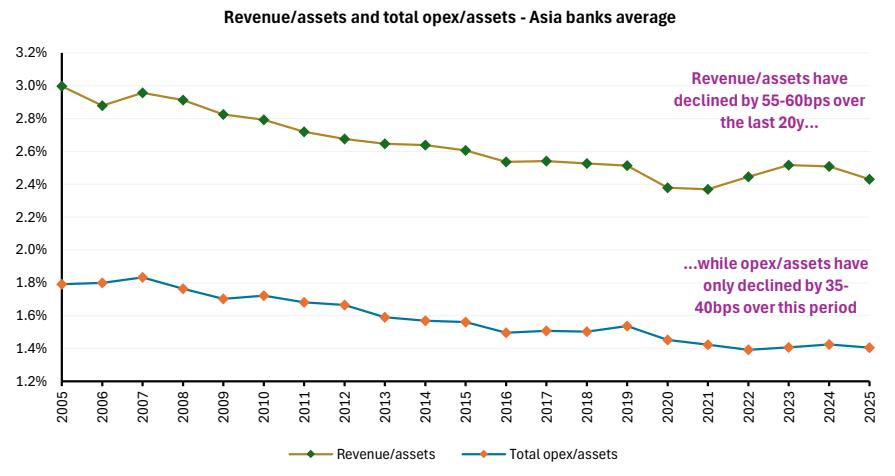

line

| Year | Revenue/assets | Total opex/assets |
|------|----------------|-------------------|
| 2005 | 3.0%           | 1.8%              |
| 2006 | 2.9%           | 1.8%              |
| 2007 | 2.95%          | 1.85%             |
| 2008 | 2.9%           | 1.75%             |
| 2009 | 2.8%           | 1.7%              |
| 2010 | 2.8%           | 1.75%             |
| 2011 | 2.75%          | 1.7%              |
| 2012 | 2.7%           | 1.65%             |
| 2013 | 2.65%          | 1.6%              |
| 2014 | 2.65%          | 1.55%             |
| 2015 | 2.6%           | 1.55%             |
| 2016 | 2.55%          | 1.5%              |
| 2017 | 2.55%          | 1.5%              |
| 2018 | 2.5%           | 1.5%              |
| 2019 | 2.5%           | 1.55%             |
| 2020 | 2.4%           | 1.45%             |
| 2021 | 2.35%          | 1.4%              |
| 2022 | 2.45%          | 1.4%              |
| 2023 | 2.5%           | 1.4%              |
| 2024 | 2.5%           | 1.45%             |
| 2025 | 2.45%          | 1.4%              |

Source: Central banks, Company data, UBS estimates.

Figure 2: Are higher tech investments leading to costs savings?   
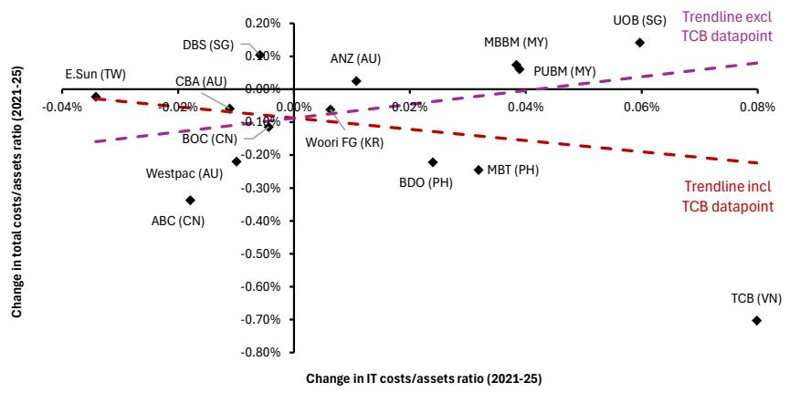

scatter

| Entity | Change in IT costs/ assets ratio (2021-25) | Change in total costs/ assets ratio (2021-25) |
|--------|---------------------------------------------|-----------------------------------------------|
| E.Sun (TW) | -0.04% | 0.00% |
| CBA (AU) | -0.02% | 0.00% |
| DBS (SG) | 0.00% | 0.00% |
| Woori FG (KR) | 0.00% | -0.10% |
| Westpac (AU) | -0.30% | -0.30% |
| ABC (CN) | -0.30% | -0.30% |
| BOC (CN) | -0.10% | -0.10% |
| ANZ (AU) | 0.00% | 0.00% |
| MBBM (MY) | 0.04% | 0.04% |
| PUBM (MY) | 0.04% | 0.04% |
| UOB (SG) | 0.06% | 0.06% |
| MBT (PH) | -0.20% | -0.20% |
| BDO (PH) | -0.20% | -0.20% |
| TCB (VN) | -0.70% | -0.70% |
| Trendline excl TCB datapoint | 0.08% | 0.08% |

Source: Company data

Figure 3: Key AI applications among Asian banks 

<table><tr><td>Market</td><td>Top AI Priority 1</td><td>Top AI Priority 2</td></tr><tr><td>China</td><td>Technology/engineering enablement – foundation LLM (100B parameters)</td><td>Productivity &amp; cost efficiency – RPA across 3,600+ processes</td></tr><tr><td>Korea</td><td>Credit &amp; underwriting – AI-based lending limits product</td><td>Risk, fraud &amp; compliance – AI fraud monitoring systems</td></tr><tr><td>Australia</td><td>Customer personalisation &amp; experience – personalised digital services</td><td>Risk, fraud &amp; compliance – AI fraud &amp; scam prevention</td></tr><tr><td>Singapore</td><td>Productivity &amp; cost efficiency – enterprise-wide AI efficiency gains</td><td>Risk, fraud &amp; compliance – AI in compliance &amp; risk (KYC/AML)</td></tr><tr><td>Thailand</td><td>Credit &amp; underwriting – AI-embedded lending &amp; credit processes</td><td>Revenue growth &amp; advisory – AI-enabled advisory &amp; fintech growth</td></tr></table>

Source: Company data

Asian banks have only managed to offset the revenue pressure by reducing costs partially in the last two decades.

Please see our companion report here for a more detailed discussion on these trends.

Technology investments more recently had also fallen short of delivering expected efficiency gains.

Total opex to assets ratio have generally risen in line with higher tech spend over the last few years.

AI to deliver on that now, at least in the medium term.

Near term though most common use cases suggest a similar issue – siloed use cases.

And focus on cost avoidance and capacity release rather than cost reduction. More use cases are in Figure 20.

Figure 4: AI Readiness Scorecard for Asian banks (lower score is better) 

<table><tr><td></td><td>Efficiency room</td><td>Tech culture</td><td>Competitive urgency</td><td>Labour flexibility</td><td>IT &amp; Data infrastructure</td><td>Total Score</td></tr><tr><td>Korea</td><td>4</td><td>1</td><td>1</td><td>2</td><td>1</td><td>5</td></tr><tr><td>Singapore</td><td>4</td><td>1</td><td>2</td><td>3</td><td>1</td><td>7</td></tr><tr><td>Australia</td><td>4</td><td>2</td><td>2</td><td>1</td><td>2</td><td>7</td></tr><tr><td>Thailand</td><td>4</td><td>2</td><td>2</td><td>2</td><td>2</td><td>8</td></tr><tr><td>China</td><td>3</td><td>2</td><td>3</td><td>4</td><td>2</td><td>11</td></tr><tr><td>Hong Kong</td><td>4</td><td>3</td><td>3</td><td>2</td><td>2</td><td>10</td></tr><tr><td>Vietnam</td><td>3</td><td>3</td><td>3</td><td>2</td><td>3</td><td>11</td></tr><tr><td>Indonesia</td><td>2</td><td>3</td><td>3</td><td>3</td><td>3</td><td>12</td></tr><tr><td>Malaysia</td><td>3</td><td>3</td><td>3</td><td>3</td><td>3</td><td>12</td></tr><tr><td>Philippines</td><td>1</td><td>4</td><td>3</td><td>3</td><td>4</td><td>14</td></tr><tr><td>India</td><td>1</td><td>4</td><td>3</td><td>4</td><td>4</td><td>15</td></tr><tr><td>Taiwan</td><td>2</td><td>4</td><td>4</td><td>3</td><td>4</td><td>15</td></tr><tr><td>Japan</td><td>2</td><td>3</td><td>4</td><td>4</td><td>4</td><td>15</td></tr></table>

Source: UBS

Impact of AI investments will not be even. Cost efficiency journeys of Asian banks over the last two decades suggest six structural factors to assess AI readiness today (sixth factor is "scale").

Figure 5: Top 5 vs bottom 5 markets – relative P/B and ROE   
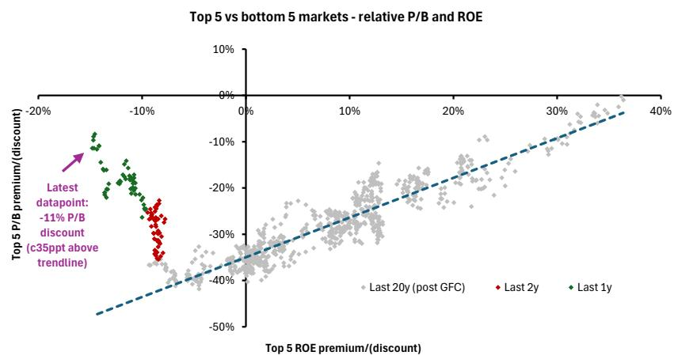

scatter

| Timeframe | Label | Top 5 P/B premium/(discount) | Top 5 ROE premium/(discount) |
| --------- | ----- | ---------------------------- | ---------------------------- |
| Latest datapoint | -11% P/B discount (c35ppt above trendline) | ~-15% | ~-40% to ~-20% |
| Last 20y (post GFC) | | ~-20% to ~-10% | ~-40% to ~-20% |
| Last 2y | | ~-20% to ~-10% | ~-40% to ~-20% |
| Last 1y | | ~-20% to ~-10% | ~-40% to ~-20% |

Source: Datastream, UBS. Prices as of 15 May 2026.

The most AI ready banking markets are trading at a 35% premium to the least ready. Is this a prescient market call or "safety trade" in disguise?

Figure 6: Top 5 vs bottom 5 stocks – relative P/B and ROE   
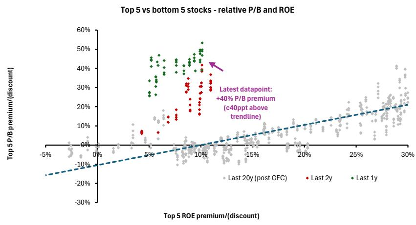

scatter

| Top 5 ROE premium/(discount) | Top 5 P/B premium/(discount) | Series        |
| ---------------------------- | ---------------------------- | ------------- |
| ~0%                          | ~-10%                        | Last 2y       |
| ~5%                          | ~10%                         | Last 2y       |
| ~10%                         | ~30%                         | Last 2y       |
| ~15%                         | ~20%                         | Last 2y       |
| ~20%                         | ~15%                         | Last 2y       |
| ~25%                         | ~20%                         | Last 2y       |
| ~30%                         | ~25%                         | Last 2y       |
| ~0%                          | ~-5%                         | Last 20y (post GFC) |
| ~5%                          | ~-10%                        | Last 20y (post GFC) |
| ~10%                         | ~-5%                         | Last 20y (post GFC) |
| ~15%                         | ~0%                          | Last 20y (post GFC) |
| ~20%                         | ~5%                          | Last 20y (post GFC) |
| ~25%                         | ~10%                         | Last 20y (post GFC) |
| ~30%                         | ~15%                         | Last 20y (post GFC) |
| ~0%                          | ~-10%                        | Last 1y       |
| ~5%                          | ~-5%                         | Last 1y       |
| ~10%                         | ~10%                         | Last 1y       |
| ~15%                         | ~15%                         | Last 1y       |
| ~20%                         | ~20%                         | Last 1y       |
| ~25%                         | ~25%                         | Last 1y       |
| ~30%                         | ~30%                         | Last 1y       |
| ~0%                          | ~-10%                        | Latest datapoint|
| ~5%                          | ~-5%                         | Latest datapoint|
| ~10%                         | ~10%                         | Latest datapoint|
| ~15%                         | ~15%                         | Latest datapoint|
| ~20%                         | ~20%                         | Latest datapoint|
| ~25%                         | ~25%                         | Latest datapoint|
| ~30%                         | ~30%                         | Latest datapoint|
| >30%                         | >30%                         | Latest datapoint|
| >30%                         | >40%                         | c40ppt above trendline |
The chart includes a dashed trendline and a dotted line for reference.

Source: Datastream, UBS. Prices as of 15 May 2026.

Even more intriguing is the stock level premium for the most AI ready banks vs the least.

# Efficiency gains only partially offset revenue pressure

Asian banks have faced structural revenue headwinds driven by demographics-led pressure on net interest income (NII) and persistent challenges in scaling fee income over the last two decades.

While operating cost discipline over the last two decades has been meaningful, it has not been sufficient to fully offset this revenue erosion. Evidence of higher technology investments by the banks resulting in clear efficiency gains is also at best mixed. This raises the question whether the ongoing and future AI investments will yield any different results? Can AI help unlock the next leg of sustainable efficiency gains for Asian Banks?

Structural pressures like demographics have led to a 45bps decline in overall net interest income to assets for Asian Banks. Efforts to pivot to fee income have only delivered limited relief. Regulatory constraints, structural market features and competitive intensity made it challenging to scale fee income, resulting in an overall decline of 15bps in fee income to assets for Asian Banks in aggregate. Overall revenue to asset fell by close to 60bps for the sector in the last 20 years. We discussed these in greater detail and the varying journeys of Asian banking markets in two of earlier reports -

- Q-Series "Silver wave: How an ageing population is reshaping Asian..."   
- APAC Focus: Asian Banks "The Pivot to Non-interest Income – how...".

Against this backdrop, banks in the region leaned heavily on cost discipline to protect profitability. Operating efficiency improved steadily over the past two decades, with total operating expenses to assets declining \~40bps over the last 20y on average for Asian Banks, but only partially offsetting the revenue erosion. Please see our companion report for a more detailed discussion on these trends (After two decades of cost discipline, what's next for Asian banks?).

Figure 7: Asian banks only managed to partially offset revenue erosion through efficiency gains   
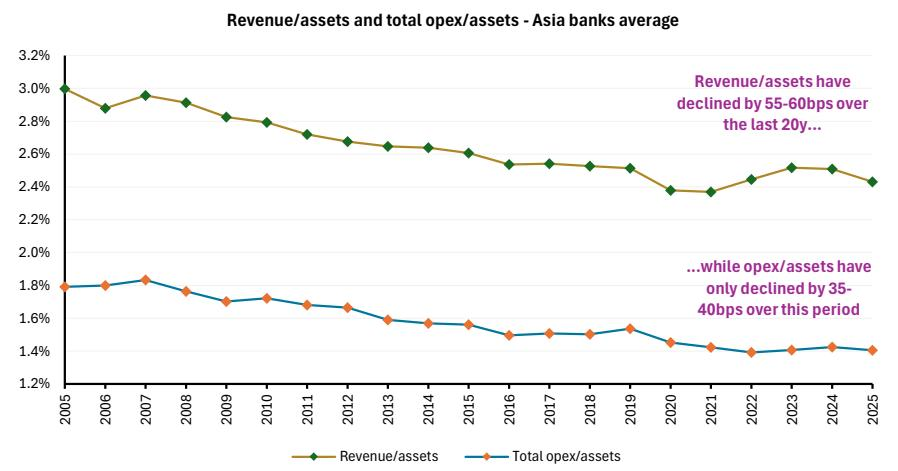

line

| Year | Revenue/assets | Total opex/assets |
|------|----------------|-------------------|
| 2005 | 3.0%           | 1.8%              |
| 2006 | 2.9%           | 1.8%              |
| 2007 | 2.95%          | 1.85%             |
| 2008 | 2.9%           | 1.75%             |
| 2009 | 2.8%           | 1.7%              |
| 2010 | 2.8%           | 1.75%             |
| 2011 | 2.75%          | 1.7%              |
| 2012 | 2.7%           | 1.65%             |
| 2013 | 2.65%          | 1.6%              |
| 2014 | 2.6%           | 1.55%             |
| 2015 | 2.6%           | 1.55%             |
| 2016 | 2.55%          | 1.5%              |
| 2017 | 2.55%          | 1.5%              |
| 2018 | 2.5%           | 1.5%              |
| 2019 | 2.5%           | 1.55%             |
| 2020 | 2.35%          | 1.45%             |
| 2021 | 2.35%          | 1.4%              |
| 2022 | 2.45%          | 1.35%             |
| 2023 | 2.5%           | 1.35%             |
| 2024 | 2.45%          | 1.4%              |
| 2025 | 2.4%           | 1.4%              |

Source: Central banks, Company data, UBS estimates.

These efficiency gains came from both staff as well non-staff expenses, with non-staff expense reduction playing a bigger role and driving close to 60% of the total efficiency gains at the aggregate level for the sector.

Figure 8: Staff opex to assets ratio declined by 15bps over the last 20y for Asia banks   
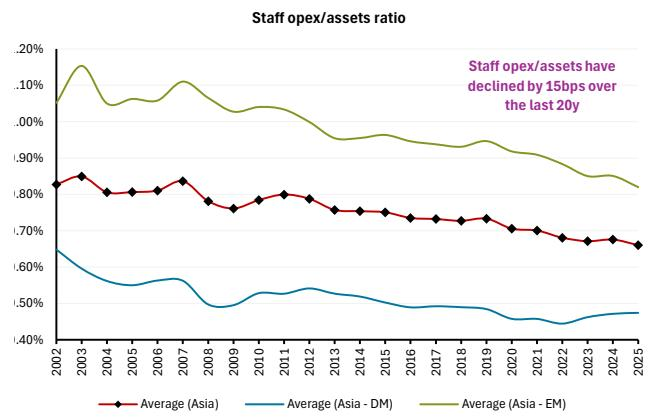

line

| Year | Average (Asia) | Average (Asia - DM) | Average (Asia - EM) |
|------|----------------|---------------------|---------------------|
| 2002 | 0.83%          | 0.65%               | 0.10%               |
| 2003 | 0.85%          | 0.62%               | 0.13%               |
| 2004 | 0.81%          | 0.58%               | 0.11%               |
| 2005 | 0.81%          | 0.56%               | 0.10%               |
| 2006 | 0.82%          | 0.57%               | 0.11%               |
| 2007 | 0.84%          | 0.56%               | 0.11%               |
| 2008 | 0.79%          | 0.51%               | 0.10%               |
| 2009 | 0.77%          | 0.50%               | 0.10%               |
| 2010 | 0.79%          | 0.52%               | 0.11%               |
| 2011 | 0.80%          | 0.53%               | 0.11%               |
| 2012 | 0.79%          | 0.54%               | 0.11%               |
| 2013 | 0.77%          | 0.53%               | 0.11%               |
| 2014 | 0.76%          | 0.52%               | 0.11%               |
| 2015 | 0.76%          | 0.51%               | 0.11%               |
| 2016 | 0.75%          | 0.50%               | 0.11%               |
| 2017 | 0.74%          | 0.49%               | 0.11%               |
| 2018 | 0.74%          | 0.49%               | 0.11%               |
| 2019 | 0.73%          | 0.48%               | 0.11%               |
| 2020 | 0.72%          | 0.47%               | 0.11%               |
| 2021 | 0.71%          | 0.46%               | 0.11%               |
| 2022 | 0.70%          | 0.45%               | 0.11%               |
| 2023 | 0.69%          | 0.44%               | 0.11%               |
| 2024 | 0.68%          | 0.45%               | 0.11%               |
| 2025 | 0.67%          | 0.46%               | 0.11%               |

Source: Central banks, Company data, UBS estimates. JP, AU, KR, SG, HK, TW banks are classified as DM banks above, while IN, CN, ID, PH, TH, MY, VN banks are classified as EM banks.

Figure 9: Other opex to assets ratio declined by 25bps over the last 20y for Asia banks   
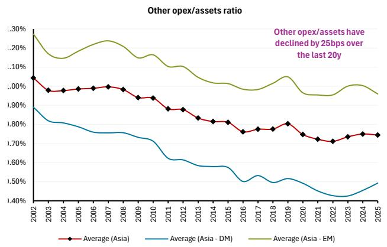

line

| Year | Average (Asia) | Average (Asia - DM) | Average (Asia - EM) |
|------|----------------|---------------------|---------------------|
| 2002 | 1.05%          | 0.90%               | 1.30%               |
| 2003 | 0.98%          | 0.85%               | 1.20%               |
| 2004 | 0.99%          | 0.82%               | 1.18%               |
| 2005 | 0.99%          | 0.80%               | 1.22%               |
| 2006 | 1.00%          | 0.78%               | 1.25%               |
| 2007 | 1.00%          | 0.76%               | 1.23%               |
| 2008 | 0.99%          | 0.75%               | 1.20%               |
| 2009 | 0.95%          | 0.73%               | 1.18%               |
| 2010 | 0.94%          | 0.71%               | 1.15%               |
| 2011 | 0.89%          | 0.65%               | 1.12%               |
| 2012 | 0.88%          | 0.63%               | 1.10%               |
| 2013 | 0.85%          | 0.61%               | 1.08%               |
| 2014 | 0.83%          | 0.60%               | 1.05%               |
| 2015 | 0.82%          | 0.59%               | 1.03%               |
| 2016 | 0.77%          | 0.55%               | 1.00%               |
| 2017 | 0.78%          | 0.53%               | 0.98%               |
| 2018 | 0.79%          | 0.52%               | 0.99%               |
| 2019 | 0.81%          | 0.51%               | 1.05%               |
| 2020 | 0.76%          | 0.50%               | 1.03%               |
| 2021 | 0.73%          | 0.48%               | 1.01%               |
| 2022 | 0.72%          | 0.46%               | 1.00%               |
| 2023 | 0.74%          | 0.44%               | 1.02%               |
| 2024 | 0.75%          | 0.45%               | 1.01%               |
| 2025 | 0.76%          | 0.47%               | 1.03%               |

Source: Central banks, Company data, UBS estimates. JP, AU, KR, SG, HK, TW banks are classified as DM banks above, while IN, CN, ID, PH, TH, MY, VN banks are classified as EM banks.

This trend of non-staff expense reduction being more important is even more pronounced in DM markets in Asia than EM. Branch rationalisation, payment infrastructure modernisation and technology consolidation were likely the main drivers of non-staff cost reduction.

These may or may not come with equivalent staff costs benefits, which due to less labour flexibility can be difficult to achieve in many Asian markets. Significant branch reductions (2012-2022) and launch of real time rails in Korea (early 2000s), Big Four consolidation and retirement of the state-based data centers (through 2000s) in Australia, KBank and SCB consolidation (2016-17 onwards) and PromptPay launch in Thailand (2016), India's UPI (2016), Singapore's IFAST (2014) are a few examples.

Figure 10: # of Branches per 100k – DM Asia   
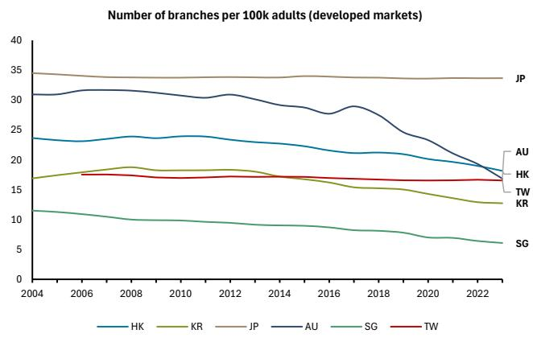

line

| Year | HK   | KR   | SG   | AU   | TW   | JP   |
|------|------|------|------|------|------|------|
| 2004 | 23.5 | 17.0 | 11.5 | 31.0 | 17.5 | 34.5 |
| 2006 | 23.0 | 18.5 | 11.0 | 31.5 | 17.5 | 34.5 |
| 2008 | 24.0 | 19.0 | 10.5 | 31.5 | 17.5 | 34.5 |
| 2010 | 24.0 | 18.5 | 10.0 | 31.0 | 17.5 | 34.5 |
| 2012 | 23.5 | 18.5 | 9.5  | 30.5 | 17.5 | 34.5 |
| 2014 | 23.0 | 18.0 | 9.0  | 29.5 | 17.5 | 34.5 |
| 2016 | 22.0 | 17.0 | 8.5  | 28.0 | 17.5 | 34.5 |
| 2018 | 21.5 | 16.0 | 8.0  | 29.0 | 17.5 | 34.5 |
| 2020 | 20.5 | 15.0 | 7.5  | 24.0 | 17.5 | 34.5 |
| 2022 | 18.5 | 13.0 | 6.5  | 17.0 | 17.5 | 34.5 |

Source: World Bank, FSC Taiwan

Figure 11: # of Branches per 100k – EM Asia   
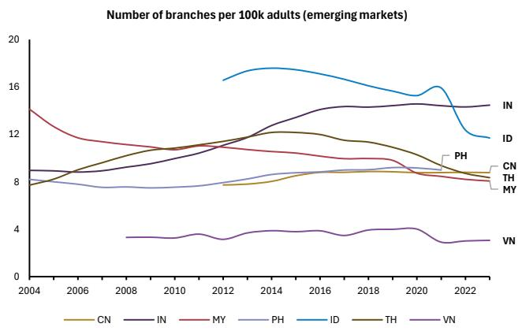

line

| Year | IN  | ID  | PH  | CN  | TH  | MY  | VN  |
|------|-----|-----|-----|-----|-----|-----|-----|
| 2004 | 8   | 8   | 13  | 8   | 8   | 8   | 3   |
| 2006 | 8   | 8   | 12  | 8   | 8   | 8   | 3   |
| 2008 | 8   | 8   | 11  | 8   | 8   | 8   | 3   |
| 2010 | 8   | 8   | 11  | 8   | 8   | 8   | 3   |
| 2012 | 8   | 8   | 11  | 8   | 8   | 8   | 3   |
| 2014 | 8   | 8   | 12  | 8   | 8   | 8   | 3   |
| 2016 | 8   | 8   | 12  | 8   | 8   | 8   | 3   |
| 2018 | 8   | 8   | 12  | 8   | 8   | 8   | 3   |
| 2020 | 8   | 8   | 12  | 8   | 8   | 8   | 3   |
| 2022 | 8   | 8   | 12  | 8   | 8   | 8   | 3   |

Source: World Bank

While technology clearly played a role in helping reduce costs at the system level, focussing on the more recent past, the track record of individual banks around this looks a lot less impressive. Not all banks disclose tech spending but for the ones that do, Figures 12-14 show that there is limited evidence of rising technology spend resulting in meaningful reduction in either staff or non-staff costs.

Figure 12: Are higher tech investments leading to costs savings?   
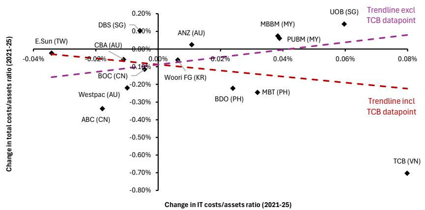

scatter

| Entity | Change in IT costs/ assets ratio (2021-25) | Change in total costs/ assets ratio (2021-25) |
|--------|---------------------------------------------|-----------------------------------------------|
| E.Sun (TW) | -0.04% | 0.00% |
| CBA (AU) | -0.02% | 0.00% |
| DBS (SG) | 0.00% | 0.00% |
| Woori FG (KR) | 0.00% | -0.30% |
| Westpac (AU) | -0.30% | -0.40% |
| ABC (CN) | -0.30% | -0.40% |
| BDO (PH) | -0.20% | -0.30% |
| MBT (PH) | -0.25% | -0.35% |
| ANZ (AU) | 0.08% | 0.10% |
| PUBM (MY) | 0.06% | 0.15% |
| MBBM (MY) | 0.04% | 0.15% |
| UOB (SG) | 0.06% | 0.15% |
| TCB (VN) | -0.75% | -0.75% |
| Trendline excl TCB datapoint | 0.08% | 0.15% |
Trendline excl TCB datapoint (dashed line) | 0.08% | 0.15% |

Source: Company data

Figure 13: Higher tech investments has generally led to lower staff costs...   
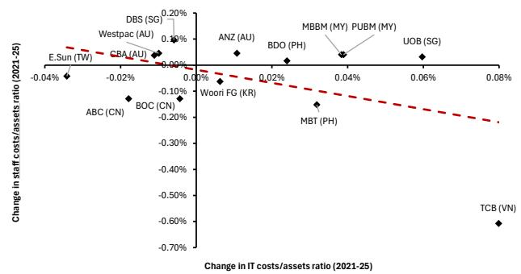

scatter

| Company | Change in staff costs/ assets ratio (2021-25) | Change in IT costs/ assets ratio (2021-25) |
| :--- | :--- | :--- |
| E.Sun (TW) | -0.04% | 0.00% |
| Westpac (AU) | -0.02% | 0.00% |
| CBA (AU) | -0.01% | 0.00% |
| DBS (SG) | 0.00% | 0.20% |
| ANZ (AU) | 0.06% | 0.00% |
| Woori FG (KR) | -0.01% | 0.00% |
| BDO (PH) | 0.02% | 0.00% |
| MBT (PH) | -0.33% | -0.18% |
| MBBM (MY) | 0.04% | 0.00% |
| PUBM (MY) | 0.04% | 0.00% |
| UOB (SG) | 0.06% | 0.00% |
| TCB (VN) | -0.64% | -0.64% |
| ABC (CN) | -0.11% | -0.11% |

Source: Company data

Figure 14: ...but an increase in other costs (which includes tech costs)   
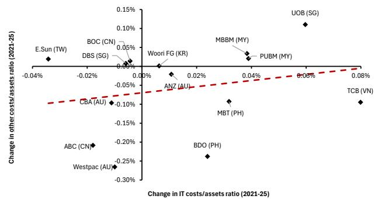

scatter

| Entity | Change in IT costs/ assets ratio (2021-25) | Change in other costs/ assets ratio (2021-25) |
| :--- | :--- | :--- |
| E.Sun (TW) | -0.04% | 0.00 |
| BOC (CN) | -0.02% | 0.05 |
| DBS (SG) | -0.02% | 0.00 |
| Woori FG (KR) | 0.00% | 0.00 |
| ANZ (AU) | 0.02% | -0.05 |
| MBBM (MY) | 0.04% | 0.05 |
| PUBM (MY) | 0.04% | 0.05 |
| UOB (SG) | 0.08% | 0.10 |
| CBA (AU) | -0.02% | -0.10 |
| MBT (PH) | 0.04% | -0.15 |
| BDO (PH) | 0.06% | -0.25 |
| TCB (VN) | 0.08% | -0.15 |
| ABC (CN) | -0.03% | -0.20 |
| Westpac (AU) | -0.03% | -0.30 |

Source: Company data

Driving genuine labour productivity improvements and lowering opex intensity has not been easy for Asian banks. Having said that, the track record of EM banks looks slightly better than EM banks overall. EM banks in aggregate have managed to bring down their cost to income ratio down to the same level as DM banks over the years - an observation that is likely to surprise several investors. But as Figure 15 -Figure 17 show, experiences of efficiency improvements across markets have been far from uniform.

Figure 15: Total opex to revenue ratio   
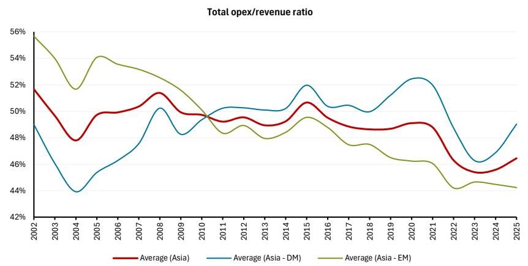

line

| Year | Average (Asia) | Average (Asia - DM) | Average (Asia - EM) |
|------|----------------|---------------------|---------------------|
| 2002 | 51.5%          | 48.5%               | 56.0%               |
| 2003 | 49.0%          | 46.0%               | 54.0%               |
| 2004 | 47.5%          | 44.0%               | 52.0%               |
| 2005 | 49.5%          | 45.5%               | 54.5%               |
| 2006 | 50.0%          | 46.5%               | 53.5%               |
| 2007 | 50.5%          | 47.5%               | 53.0%               |
| 2008 | 51.5%          | 50.5%               | 52.5%               |
| 2009 | 50.0%          | 48.5%               | 51.0%               |
| 2010 | 49.5%          | 49.0%               | 49.5%               |
| 2011 | 49.0%          | 50.0%               | 48.5%               |
| 2012 | 49.5%          | 50.5%               | 49.0%               |
| 2013 | 49.0%          | 50.0%               | 48.0%               |
| 2014 | 49.5%          | 50.5%               | 48.5%               |
| 2015 | 50.5%          | 52.0%               | 49.5%               |
| 2016 | 49.5%          | 51.0%               | 48.5%               |
| 2017 | 49.0%          | 50.5%               | 47.5%               |
| 2018 | 48.5%          | 50.0%               | 47.0%               |
| 2019 | 48.5%          | 51.0%               | 46.5%               |
| 2020 | 49.0%          | 52.5%               | 46.0%               |
| 2021 | 48.5%          | 51.5%               | 46.0%               |
| 2022 | 46.0%          | 46.0%               | 44.0%               |
| 2023 | 45.0%          | 46.5%               | 44.5%               |
| 2024 | 46.0%          | 47.5%               | 44.5%               |
| 2025 | 46.5%          | 49.0%               | 44.0%               |

Source: Central banks, Company data, UBS estimates. JP, AU, KR, SG, HK, TW banks are classified as DM banks above, while IN, CN, ID, PH, TH, MY, VN banks are classified as EM banks.

Figure 16: Opex to Revenue (DM Asia Banks)   
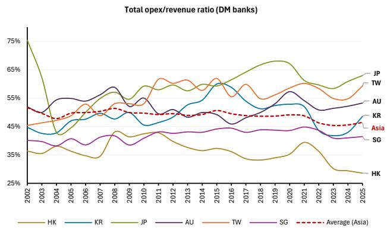

line

| Year | HK    | KR    | JP    | AU    | TW    | SG    | Average (Asia) |
|------|-------|-------|-------|-------|-------|-------|----------------|
| 2002 | 35%   | 45%   | 75%   | 45%   | 45%   | 45%   | 45%            |
| 2003 | 35%   | 45%   | 45%   | 45%   | 45%   | 45%   | 45%            |
| 2004 | 35%   | 45%   | 45%   | 45%   | 45%   | 45%   | 45%            |
| 2005 | 35%   | 45%   | 45%   | 45%   | 45%   | 45%   | 45%            |
| 2006 | 35%   | 45%   | 45%   | 45%   | 45%   | 45%   | 45%            |
| 2007 | 35%   | 45%   | 45%   | 45%   | 45%   | 45%   | 45%            |
| 2008 | 35%   | 45%   | 45%   | 45%   | 45%   | 45%   | 45%            |
| 2009 | 35%   | 45%   | 45%   | 45%   | 45%   | 45%   | 45%            |
| 2010 | 35%   | 45%   | 45%   | 45%   | 45%   | 45%   | 45%            |
| 2011 | 35%   | 45%   | 45%   | 45%   | 45%   | 45%   | 45%            |
| 2012 | 35%   | 45%   | 45%   | 45%   | 45%   | 45%   | 45%            |
| 2013 | 35%   | 45%   | 45%   | 45%   | 45%   | 45%   | 45%            |
| 2014 | 35%   | 45%   | 45%   | 45%   | 45%   | 45%   | 45%            |
| 2015 | 35%   | 45%   | 45%   | 45%   | 45%   | 45%   | 45%            |
| 2016 | 35%   | 45%   | 45%   | 45%   | 45%   | 45%   | 45%            |
| 2017 | 35%   | 45%   | 45%   | 45%   | 45%   | 45%   | 45%            |
| 2018 | 35%   | 45%   | 45%   | 45%   | 45%   | 45%   | 45%            |
| 2019 | 35%   | 45%   | 60%   | 45%   | 45%   | 45%   | 45%            |
| 2020 | 35%   | 45%   | 60%   | 45%   | 45%   | 45%   | 45%            |
| 2021 | 35%   | 45%   | 60%   | 45%   | 45%   | 45%   | 45%            |
| 2022 | 35%   | 40%   | 60%   | 40%   | 40%   | 40%   | 40%            |
| 2023 | 30%   | 38%   | 60%   | 38%   | 38%   | 38%   | 38%            |
| 2024e| -     | -     | -     | -     | -     | -     | -              |
| 2025e| -     | -     | -     | -     | -     | -     | -              |
| Average (Asia)<lcel><lcel><lcel><lcel><lcel><lcel><lcel><lcel><nl>

Source: Central banks, Company data, UBS estimates.

Figure 17: Opex to Revenue (EM Asia Banks)   
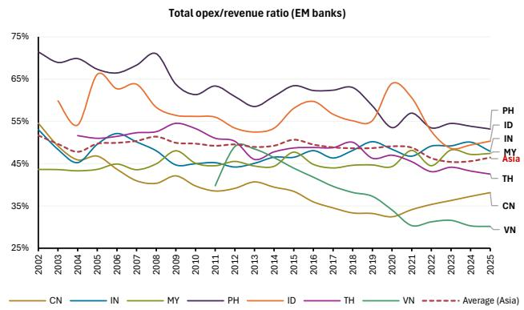  
Source: Central banks, Company data, UBS estimates.

The cost to income journeys show how Japan and Taiwan banks sit persistently at the top of the range for DM banks (60%+) with no meaningful improvements over the years. At the other end are HK and Singapore banks which have been leaner and more efficient.

In the EM group, the divergence between banks in Thailand, China, Vietnam near the bottom and Philippines and Indonesia with the most elevated ratio is quite striking. Thailand's trajectory is quite notable, reflecting genuine efficiency gains.

In both DM and EM groups, the gap between the most and least efficient banks have widened over the last two decades. This raises the question how AI investments will change this?

These trends leave us with two clear observations -

- Driving genuine labour productivity gains has not been easy for Asian banks   
- Efficiency improvements across Asian banks, particularly through technology investments, have been far from uniform.

Will the ongoing and future AI investments be any different?

# Will AI deliver on the efficiency promise that tech has fallen short of?

Asian banks are aggressively integrating AI into their core operations, transitioning from experimental pilots to scaled, enterprise-wide deployments of both GenAI and Agentic AI.

Figure 18 - Figure 20 summarize the use cases publicly cited by the regional banks. This data suggests that the use cases so far appear to be primarily focused on three broad areas: 1) enhancing customer experience through personalization; 2) driving productivity gains in internal workflows like software engineering and document processing; and 3) fortifying defensive moats through real-time fraud detection and risk analytics.

Figure 18: Tech/AI applications and implications on business performance – ex-ASEAN banks 

<table><tr><td>Bank</td><td>Market</td><td>Tech/AI application and implications</td></tr><tr><td>ICBC</td><td>China</td><td>Built ICBC Zhiyong, a financial LLM system with over 100 billion parameters, helps to empower more than 20 main business fields and over 200 scenarios. AI wealth assistant helps to provide personalized services to its 630 million personal mobile banking users. The large-scale application of tech/AI at ICBC has resulted in a workload reduction equivalent to 40,000 persons annually.</td></tr><tr><td>BOC</td><td>China</td><td>Developed the BOCAI large model platform, deployed a series of large models such as DeepSeek and Qwen3, and built more than 400 intelligent assistants to empower key business functions including credit, marketing, operations, office work, customer service and technology. Leveraged enterprise-level robotic process automation (RPA) to reduce the workload of primary-level institutions, deploying RPA in over 3,600 scenarios and executing an average of nearly 300,000 tasks per month.</td></tr><tr><td>HSBC</td><td>Hong Kong</td><td>Have over 100 GenAI solutions in use and a strong pipeline of use cases in development. Around the globe, around 85% of HSBC staff have access to the large language model-based productivity tool, HSBC Productivity Suite, which helps them to analyse and translate documents, summarise information and generate insights. HSBC is increasing AI partnerships to accelerate adoption of cutting-edge technologies. HSBC notes that production use cases have not yet delivered &quot;significant&quot; financial impact in terms of bottom-line numbers, they are viewed as critical for long-term operational efficiency.</td></tr><tr><td>StanChart</td><td>Hong Kong</td><td>StanChart has launched SC GPT, a GenAI tool, across 41 markets worldwide. Designed to enhance operational efficiency and client engagement, SC GPT marks a significant step in the Bank&#x27;s strategy to integrate AI into its business. Set to empower over 70,000 employees worldwide, SC GPT is expected to improve the Bank&#x27;s operations and productivity; tailor sales and marketing efforts to increase revenue; advance software engineering with more automation; and scale how risks are measured, managed, recorded and reported. In July 2025, Standard Chartered signed a strategic partnership with Alibaba Group to deploy Alibaba Cloud AI technology across its client service, sales intelligence, risk management, and compliance functions.</td></tr><tr><td>Hana FG</td><td>Korea</td><td>Launched an AI-based loan product which uses AI to determine customer loan limits. The new product calculates optimal loan limits for applying customers&#x27; finances, based on its analysis of the Bank&#x27;s big data of loan transaction records and patterns.</td></tr><tr><td>Woori FG</td><td>Korea</td><td>Use of AI to streamline work processes. For example, the AI-based market prediction system supports optimization of asset management, whilst the fraudulent transaction monitoring system also leverages AI technology. Aims to expand the use of AI to customer services, and promoting various projects to establish potential banking services in line with this goal. This includes upgrading their AI-based counseling bot and chatbot services, as well as implementing an AI Banker by developing language models tailored to the financial sector.</td></tr><tr><td>MUFG</td><td>Japan</td><td>Implemented AI in 116 use cases and aim to exceed 250 by FY26. MUFG is advancing the development of AI agents (e.g. co-developing an AI credit expert with Sakana AI). For employees, AI is supporting tasks such as summarizing and translating materials, creating sentences and programs, aggregating and analyzing numbers, and generating ideas. Estimates that cumulative benefits from AI use cases over its current three-year medium-term business plan will reach approximately JPY30 billion.</td></tr><tr><td>SMFG</td><td>Japan</td><td>Beyond improving productivity by replacing human work, SMFG aims to develop a model where AI acts as a partner, analyzing data, anticipating customer needs, and making proposals using avatars in the core of banking business such as lending and asset management.</td></tr><tr><td>HDFCB</td><td>India</td><td>Using cloud-based AI/ML tools, the bank decodes customer behavior to curate &quot;hyper-personalized&quot; content and sharpens campaign precision to improve return on investment. Actively engaging in &quot;agentic AI&quot; projects through its Tech Innovators platform and collaborates with the RBI Innovation Hub on AI-based early warning systems and inclusive credit tools.</td></tr><tr><td>Axis Bank</td><td>India</td><td>The Bank is harnessing emerging technologies such as AI/ML, automation, and data analytics to enhance customer experience, optimize operational efficiency, and improve staff productivity by building AI assists. By process Re-Engineering and digitisation, the Bank has been able to reduce the turnaround time on savings and current account opening by about 90%; and on various other processes by 50%-80%. In addition to improving efficiency, there was significant impact on customer satisfaction and risk containment.</td></tr><tr><td>CBA</td><td>Australia</td><td>Consistently invested in technology, data and analytics to deliver more personalised experiences for our customers and make things easier for CBA employees. CBA has achieved tangible efficiency gains, including a 65.00% improvement in recovery times from critical incidents and a 39.00% decrease in core operations complaints.</td></tr><tr><td>NAB</td><td>Australia</td><td>Advanced technology modernisation agenda by streamlining systems, simplifying processes, and embedding smarter, faster, and safer digital solutions. NAB&#x27;s investment in AI and technology has yielded significant financial protections, preventing or recovering over $385 million in customer scam and fraud losses in 2025.</td></tr></table>

Source: Company data, UBS

Figure 19: Tech/AI applications and implications on business performance – ASEAN banks 

<table><tr><td>Bank</td><td>Market</td><td>Tech/AI application and implications</td></tr><tr><td>DBS</td><td>Singapore</td><td>DBS&#x27; data analytics and artificial intelligence (AI)/ machine learning (ML) initiatives delivered over SGD 750 million of economic value in 2024, more than double that in the previous year, and aiming for a total economic impact of SGD 1 billion from AI and data initiatives in 2025. The bank has implemented over 1,500 AI models across 370 distinct use cases. DBS uses AI to automate routine &quot;white-collar&quot; tasks, such as writing credit memos, performing KYC (Know Your Customer) checks, and screening transactions. Approximately two-thirds of staff use Gen AI for tasks like summarization, research, and translation, while data scientists use AI coding assistants to reduce coding time by up to 20%. Agentic AI is being tested to generate credit evaluation memos, and Gen AI tools summarize customer calls for quality assurance. The use of AI is expected to lead to revenue, productivity and cost-income ratio improvements.</td></tr><tr><td>OCBC</td><td>Singapore</td><td>AI serves as a strategic lever to maximise value in three key areas: increasing revenue, reducing risk, and enhancing productivity. About six million decisions in the Bank are made by AI on a daily basis. These tools have boosted productivity by as much as 50 per cent, freeing up employees&#x27; time and enabling them to focus on higher-value tasks. OCBC aims for 75% of all customer service requests to be AI-assisted, reducing response times and enhancing the customer experience. As workflows and processes become increasingly optimised, OCBC anticipates a 20% increase in staff productivity. Achieved close to S$80 million in cost avoidance in 2025 through technology modernization and AI integration.</td></tr><tr><td>UOB</td><td>Singapore</td><td>Using GenAI to automate manual processes and increase the workflow efficiency. The end goal is to apply these AI solutions across the Bank to enhance business processes, productivity, manage risk and better personalise customer experience at scale and at speed. AI is being scaled to improve detection accuracy in areas such as Anti-Money Laundering (AML), fraud detection, and scam prevention.</td></tr><tr><td>Maybank</td><td>Malaysia</td><td>Piloted agentic AI in its internal auditing processes to automate selected workflows and enhance insight generation.</td></tr><tr><td>CIMB</td><td>Malaysia</td><td>Leverages conversational AI and chatbots to handle routine inquiries and improve response times across digital channels. AI is applied to credit decisioning, fraud detection, and general operational processes to improve consistency and service quality.</td></tr><tr><td>BDO</td><td>Philippines</td><td>Transitioning away from manual, low-end compliance and bookkeeping work by implementing AI solutions designed to enhance productivity, mitigate risk, and focus on higher-value advisory services.</td></tr><tr><td>BPI</td><td>Philippines</td><td>BPI utilizes AI and machine learning to analyze customer behavior, allowing for hyper-personalized product recommendations and &quot;digital nudges&quot; within its mobile apps. BPI is exploring AI-enhanced credit scoring models to better assess the creditworthiness of the &quot;unbanked&quot; or &quot;underbanked&quot; segments, using non-traditional data points to expand its lending reach.</td></tr><tr><td>BCA</td><td>Indonesia</td><td>Integrated the use of Augmented Reality (AR), Machine Learning (ML), and Generative Artificial Intelligence (Gen-AI) to automate internal processes and support strategic initiatives like fraud detection and AI assistance. Utilizes Gen-AI coding assistants to accelerate IT development, which significantly reduces risks and costs. Internally, AI agents at the contact center handle repetitive tasks, such as mortgage quality control, where an automatic engine replaced the manual work previously done by five agents. ML models are deployed for new customer segmentation and to predict customer attrition (churn), allowing for more targeted investment offerings.</td></tr><tr><td>BMRI</td><td>Indonesia</td><td>Mandiri uses AI and Gen-AI to provide personalized product recommendations and improve the efficiency of digital marketing across its digital channels. Focuses on both front-end and back-end automation to reduce operational bottlenecks and accelerate internal processes.</td></tr><tr><td>KBANK</td><td>Thailand</td><td>AI is embedded into end-to-end credit processes, including automated approval decisions, fraud prevention, and collection analytics to increase recovery rates. The bank has launched AINU, an AI-driven identity verification solution (facial recognition and OCR), and InsurTech solutions for automated accident assessments to process claims more efficiently.</td></tr><tr><td>SCBX</td><td>Thailand</td><td>Uses AI-powered advisory tools and predictive analytics to provide personalized recommendations and account planning. Its InnovestX platform delivers real-time data and AI-driven insights covering over 1,000 stocks. Digital lenders MONIX and ABACUS leverage proprietary AI engines for behavioral scoring to capture underserved segments with superior asset quality. CardX utilizes AI-driven collections to control credit costs and manage debt recovery efficiently. AI-driven security solutions identify anomalies and potential fraud by analyzing large volumes of network and user interaction data that traditional rule-based controls might miss.</td></tr><tr><td>TCB</td><td>Vietnam</td><td>Integrated AI across its entire value chain, processing over 8 billion data points daily to build detailed customer profiles with approximately 12,500 attributes each. Advanced analytics and machine learning initiatives delivered VND 1.3 trillion in incremental revenue in 2025. AI is being embedded into hyper-personalized credit decisioning models to enable faster, risk-aligned lending.</td></tr></table>

Source: Company data, UBS

Figure 20: Summary of AI applications by markets 

<table><tr><td>Market</td><td>Top AI Priority 1</td><td>Top AI Priority 2</td><td>What this indicates about the market&#x27;s AI strategy</td></tr><tr><td>China</td><td>Technology/engineering enablement – foundation LLM (100B parameters)</td><td>Productivity &amp; cost efficiency – RPA across 3,600+ processes</td><td>Chinese banks emphasise technological self-sufficiency and massive scale, building proprietary large language models and deploying AI across thousands of processes to achieve huge efficiency gains.</td></tr><tr><td>Hong Kong</td><td>Productivity &amp; cost efficiency – 85% of staff using GenAI tools</td><td>Revenue growth &amp; advisory – AI-driven sales &amp; revenue initiatives</td><td>Global banks in Hong Kong focus on enterprise-wide GenAI adoption for internal efficiency while also pursuing AI-enabled revenue growth (e.g. tailored marketing to boost sales ), indicating an emphasis on long-term innovation over immediate returns .</td></tr><tr><td>Korea</td><td>Credit &amp; underwriting – AI-based lending limits product</td><td>Risk, fraud &amp; compliance – AI fraud monitoring systems</td><td>Korean banks are selectively introducing AI in core lending (e.g. automated loan limit decisions ) and improving risk controls (AI-based fraud monitoring ), reflecting a targeted, cautious integration of AI into traditional banking.</td></tr><tr><td>Japan</td><td>Productivity &amp; cost efficiency – AI for workforce productivity (¥30 bn benefit target)</td><td>Credit &amp; underwriting – AI credit expert in lending</td><td>Japanese banks are pursuing broad AI deployment for efficiency gains (aiming ~¥30 bn cost benefits ) and innovating with AI in lending (co-developing an AI credit expert ) to embed AI as a trusted partner in core banking services .</td></tr><tr><td>India</td><td>Customer personalisation &amp; experience – hyper-personalised marketing &amp; content</td><td>Productivity &amp; cost efficiency – process automation for scale efficiency</td><td>Indian banks leverage AI to hyper-personalise products and campaigns for their huge customer bases (boosting marketing ROI ) alongside aggressive automation of high-volume processes (90% faster account opening, etc. ) to support growth at scale.</td></tr><tr><td>Australia</td><td>Customer personalisation &amp; experience – personalised digital services</td><td>Risk, fraud &amp; compliance – AI fraud &amp; scam prevention</td><td>Australian banks are improving digital customer experiences (more personalised services ) while strengthening AI-powered fraud and scam prevention (intercepting ~$385 m in scams in 2025 ), reflecting a balance between innovation and security.</td></tr><tr><td>Singapore</td><td>Productivity &amp; cost efficiency – enterprise-wide AI efficiency gains</td><td>Risk, fraud &amp; compliance – AI in compliance &amp; risk (KYC/AML)</td><td>Singapore’s banks lead in broad AI usage, achieving significant measurable value (SGD 750 m+ in 2024 ) by automating tasks at scale and tightening risk/compliance controls (e.g. KYC checks, AML, fraud detection ).</td></tr><tr><td>Malaysia</td><td>Customer personalisation &amp; experience – AI chatbots for customer service</td><td>Risk, fraud &amp; compliance – fraud detection &amp; audit automation</td><td>Malaysian banks prioritise practical improvements: deploying AI chatbots to handle routine customer queries faster and starting to automate internal control processes (e.g. AI in fraud monitoring &amp; auditing ) for greater efficiency.</td></tr><tr><td>Philippines</td><td>Customer personalisation &amp; experience – hyper-personalised offers &amp; nudges</td><td>Regulatory &amp; financial inclusion – AI credit scoring for unbanked segments</td><td>Philippine banks are catching up by automating manual tasks to improve productivity and using AI for highly tailored product suggestions &amp; credit scoring to reach the unbanked , highlighting both modernisation and financial inclusion.</td></tr><tr><td>Indonesia</td><td>Productivity &amp; cost efficiency – AR/GenAI-driven process automation</td><td>Customer personalisation &amp; experience – personalised product targeting</td><td>Indonesian banks are mixing frontier tech (AR, GenAI) to automate internal operations (e.g. AI agents in back-office roles ) with AI-driven personalisation in offerings and marketing , aligning with the country’s fast-evolving digital landscape.</td></tr><tr><td>Thailand</td><td>Credit &amp; underwriting – AI-embedded lending &amp; credit processes</td><td>Revenue growth &amp; advisory – AI-enabled advisory &amp; fintech growth</td><td>Thai banks are applying AI in core credit operations (from loan approval to fraud checks ) while developing AI-powered advisory and digital lending platforms to drive new growth and serve underserved segments .</td></tr><tr><td>Vietnam</td><td>Customer personalisation &amp; experience – data-driven hyper-personalisation</td><td>Credit &amp; underwriting – AI-augmented credit underwriting</td><td>Vietnam’s banks utilise huge data sets (8 billion+ daily data points ) to enable ultra-personalised customer insights and swift, AI-assisted lending decisions, supporting strong revenue growth in loans .</td></tr></table>

Source: Company data, UBS

# P&L impact of these initiatives might be limited

- Investments in customer personalization are best viewed as defensive rather than revenue accretive. While improved engagement and cross-sell are often cited as benefits, the more tangible outcome is the prevention of customer attrition and share loss. As personalization becomes ubiquitous, its absence is more likely to result in revenue leakage than its presence driving incremental topline growth.   
- Productivity-oriented use cases, particularly in software development, operations, and document processing, offer clearer scope for cost efficiencies in the medium term, although quantification remains challenging at this stage. Some banks even refer to AI as "Augmented intelligence" suggesting limited scope for headcount reduction which continues to be politically challenging in many Asian markets. Gains are more likely to accrue gradually through headcount avoidance, faster turnaround times, and reduced error rates rather than explicit cost reduction. As such, near-term margin uplift may be limited. Benefits might manifest more as a structural hedge against cost inflation over the medium term.   
- Lastly, AI investments in fraud detection and risk analytics have a more direct bearing on earnings stability rather than earnings expansion. While improved data ingestion and real-time analytics could modestly enhance credit underwriting outcomes, the primary benefit lies in mitigating downside risks – lower fraud losses, earlier identification of asset quality deterioration, and reduced tail-risk events. In this sense, these capabilities help contain potential future costs that could otherwise materialise in the absence of such investments, supporting more resilient returns through the cycle.

While localized efficiency gains can be significant – such as reducing lending decision times or automating customer messaging – these are not yet headcount-reduction stories in most cases. They are primarily capacity-release (same headcount, higher throughput) and cost-avoidance (not hiring) stories, which likely gets reflected in cost/income overtime gradually rather than immediate opex cuts. Specifically see the

comment from HSBC above.

There is also a risk that just like technology investments in the past, any resulting cost savings today will be reinvested back in additional capital expenditure required for larger data infrastructure, technological upgrades, cybersecurity, and compliance to remain competitive against peers and digital-native disruptors, further diminishing the P&L impact.

# Medium-term: From implementation to costs savings

Nevertheless, there remains potential for AI to drive material cost savings for banks in the medium term given the large amount of data and human capital intensive nature of the business. Furthermore, based on the findings from McKinsey (report here), operations can represent \~60–70% of a bank's cost base, making operational AI the biggest cost lever for banks if scaled end-to-end.

ICBC in China has said that they have reached a milestone where the workload handled by AI is equivalent to more than 40,000 full-time employees, illustrating the massive scale of operational displacement possible.

Furthermore, as banks move past the initial high capex phase of building data infrastructure, these "digital workers" can scale with very low marginal cost, eventually potentially allowing banks to scale their revenues without a linear increase in headcount or physical infrastructure.

# Cross market differences in AI readiness for banks

In order to be able to assess the AI readiness of Asian banks, we find studying their journeys over the last two decades, their successes and challenges, quite instructive.

Figure 21 shows a summary of the direction of opex trends across Asian banking markets at an overall level and also breaks it down by staff and other costs. Figure 22 shows also shows the quantum of these changes and also the current level of opex as % of assets (size of the bubble).

Figure 23 and Figure 24 show the evolution of the opex to asset ratio for each market over the last 10 years.

Further down, Figure 25 -Figure 30 show the historical trends of Opex to Assets (broken down by staff and non-staff) for the Asian banks by market over the last two decades.

Figure 21: Opex drivers (as % of assets) 

<table><tr><td>As % of assets (10y chg)</td><td>Staff costs</td><td>Other opex</td><td>Total opex</td></tr><tr><td>China</td><td>↘</td><td>↘</td><td>↘</td></tr><tr><td>Hong Kong</td><td>→</td><td>↘</td><td>↘</td></tr><tr><td>Korea</td><td>↘</td><td>↘</td><td>↘</td></tr><tr><td>India</td><td>↗</td><td>↗</td><td>↗</td></tr><tr><td>Japan</td><td>↘</td><td>↘</td><td>↘</td></tr><tr><td>Australia</td><td>→</td><td>↘</td><td>↘</td></tr><tr><td>Taiwan</td><td>↘</td><td>↗</td><td>↗</td></tr><tr><td>Singapore</td><td>→</td><td>↘</td><td>→</td></tr><tr><td>Malaysia</td><td>↘</td><td>↗</td><td>↗</td></tr><tr><td>Philippines</td><td>↘</td><td>→</td><td>→</td></tr><tr><td>Indonesia</td><td>↘</td><td>↘</td><td>↘</td></tr><tr><td>Thailand</td><td>↘</td><td>→</td><td>↘</td></tr><tr><td>Vietnam</td><td>↘</td><td>↘</td><td>↘</td></tr><tr><td>Avg (Asia)</td><td>↘</td><td>↘</td><td>↘</td></tr></table>

Source: Central banks, Company data, UBS estimates

These data form the basis of the discussion and AI readiness framework that follows.

Figure 22: Opex changes in the last 10 years across Asian banks (bubble size indicates the current level)   
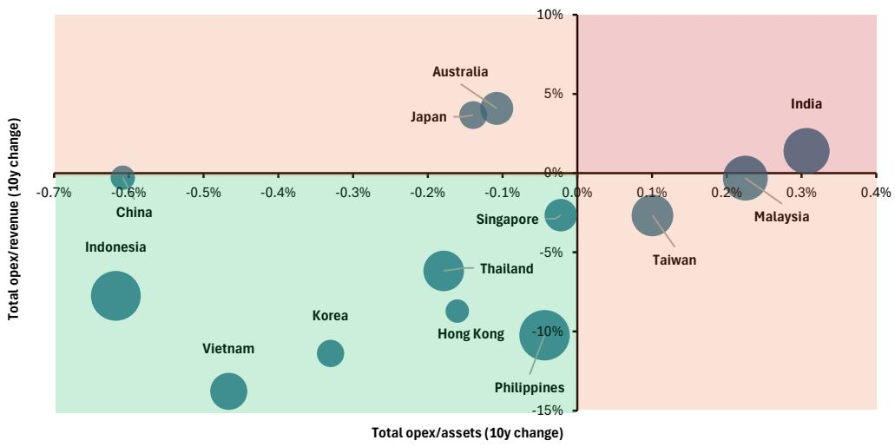

bubble

| Country     | Total opex/ assets (10y change) | Total opex/revenue (10y change) |
| ----------- | ------------------------------- | -------------------------------- |
| Australia   | -0.1                            | 4%                               |
| Japan       | -0.1                            | 3%                               |
| India       | 0.3                             | 2%                               |
| Taiwan      | 0.1                             | -2%                              |
| Malaysia    | 0.2                             | 0%                               |
| Singapore   | -0.1                            | -2%                              |
| Thailand    | -0.2                            | -6%                              |
| Hong Kong   | -0.2                            | -8%                              |
| Philippines | -0.1                            | -10%                             |
| Korea       | -0.3                            | -12%                             |
| Vietnam     | -0.4                            | -15%                             |
| Indonesia   | -0.6                            | -12%                             |
| China       | -0.6                            | -10%                             |

Source: UBS estimates. Note: Bubble sizes are scaled to banks' respective total opex/ assets ratios as of 2025.

Figure 23: How has opex/revenue and opex/assets ratio changed over the last 10y (DM)?   
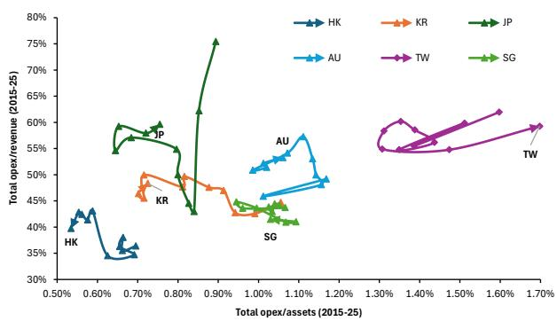

line

| Total opex/assets (2015-25) | HK    | KR    | JP    | AU    | SG    | TW    |
| ---------------------------- | ----- | ----- | ----- | ----- | ----- | ----- |
| 0.50%                        | 40%   | -     | -     | -     | -     | -     |
| 0.60%                        | 35%   | -     | -     | -     | -     | -     |
| 0.70%                        | -     | 50%   | 60%   | -     | -     | -     |
| 0.80%                        | -     | 48%   | 58%   | -     | -     | -     |
| 0.90%                        | -     | 45%   | 75%   | -     | -     | -     |
| 1.00%                        | -     | 43%   | -     | 50%   | 45%   | -     |
| 1.10%                        | -     | -     | -     | 58%   | 43%   | -     |
| 1.20%                        | -     | -     | -     | 48%   | 42%   | -     |
| 1.30%                        | -     | -     | -     | -     | -     | 60%   |
| 1.40%                        | -     | -     | -     | -     | -     | 58%   |
| 1.50%                        | -     | -     | -     | -     | -     | 55%   |
| 1.60%                        | -     | -     | -     | -     | -     | 62%   |
| 1.70%                        | -     | -     | -     | -     | -     | 60%   |

Source: Central banks, Company data, UBS estimates.

Figure 24: How has opex/revenue and opex/assets ratio changed over the last 10y (EM)?   
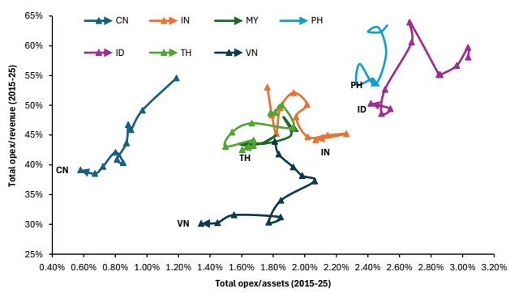

line

| Category | Total opex/assets (2015-25) | Total opex/revenue (2015-25) |
| -------- | ---------------------------- | ----------------------------- |
| CN       | 0.60%                        | 39%                           |
| CN       | 0.80%                        | 41%                           |
| CN       | 1.00%                        | 47%                           |
| CN       | 1.20%                        | 54%                           |
| IN       | 1.60%                        | 48%                           |
| IN       | 1.80%                        | 51%                           |
| IN       | 2.00%                        | 45%                           |
| IN       | 2.20%                        | 44%                           |
| MY       | 1.60%                        | 43%                           |
| MY       | 1.80%                        | 48%                           |
| MY       | 2.00%                        | 47%                           |
| MY       | 2.20%                        | 46%                           |
| PH       | 2.40%                        | 55%                           |
| PH       | 2.60%                        | 63%                           |
| PH       | 2.80%                        | 55%                           |
| PH       | 3.00%                        | 59%                           |
| ID       | 2.40%                        | 50%                           |
| ID       | 2.60%                        | 63%                           |
| ID       | 2.80%                        | 55%                           |
| ID       | 3.00%                        | 59%                           |
| TH       | 1.60%                        | 43%                           |
| TH       | 1.80%                        | 47%                           |
| TH       | 2.00%                        | 46%                           |
| TH       | 2.20%                        | 45%                           |
| VN       | 1.40%                        | 30%                           |
| VN       | 1.60%                        | 31%                           |
| VN       | 1.80%                        | 32%                           |
| VN       | 2.00%                        | 37%                           |
| VN       | 2.20%                        | 38%                           |

Source: Central banks, Company data, UBS estimates.

Figure 25: Total Opex to Assets (DM Asia Banks)   
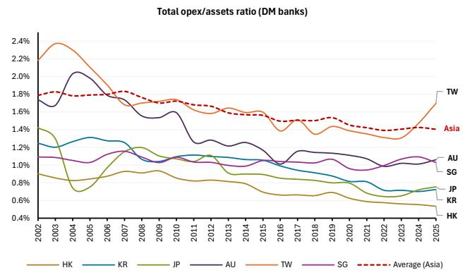

line

| Year | HK    | KR    | JP    | AU    | TW    | SG    | Average (Asia) |
|------|-------|-------|-------|-------|-------|-------|----------------|
| 2002 | 0.9   | 1.3   | 1.4   | 1.7   | 2.2   | 1.1   | 1.8            |
| 2003 | 0.8   | 1.2   | 1.3   | 1.6   | 2.3   | 1.1   | 1.8            |
| 2004 | 0.7   | 1.3   | 1.2   | 1.7   | 2.1   | 1.1   | 1.8            |
| 2005 | 0.8   | 1.3   | 1.1   | 1.7   | 2.0   | 1.1   | 1.8            |
| 2006 | 0.9   | 1.3   | 1.0   | 1.7   | 1.9   | 1.1   | 1.8            |
| 2007 | 0.9   | 1.3   | 1.1   | 1.7   | 1.8   | 1.1   | 1.8            |
| 2008 | 0.9   | 1.3   | 1.2   | 1.7   | 1.7   | 1.1   | 1.8            |
| 2009 | 0.9   | 1.3   | 1.2   | 1.7   | 1.7   | 1.1   | 1.8            |
| 2010 | 0.9   | 1.3   | 1.2   | 1.7   | 1.7   | 1.1   | 1.8            |
| 2011 | 0.9   | 1.3   | 1.2   | 1.7   | 1.7   | 1.1   | 1.8            |
| 2012 | 0.9   | 1.3   | 1.2   | 1.7   | 1.7   | 1.1   | 1.8            |
| 2013 | 0.9   | 1.3   | 1.2   | 1.7   | 1.7   | 1.1   | 1.8            |
| 2014 | 0.9   | 1.3   | 1.2   | 1.7   | 1.7   | 1.1   | 1.8            |
| 2015 | 0.9   | 1.3   | 1.2   | 1.7   | 1.7   | 1.1   | 1.8            |
| 2016 | 0.9   | 1.3   | 1.2   | 1.7   | 1.7   | 1.1   | 1.8            |
| 2017 | 0.9   | 1.3   | 1.2   | 1.7   | 1.7   | 1.1   | 1.8            |
| 2018 | 0.9   | 1.3   | 1.2   | 1.7   | 1.7   | 1.1   | 1.8            |
| 2019 | 0.9   | 1.3   | 1.2   | 1.7   | 1.7   | 1.1   | 1.8            |
| 2020 | 0.9   | 1.3   | 1.2   | 1.7   | 1.7   | 1.1   | 1.8            |
| 2021 | 0.9   | 1.3   | 1.2   | 1.7   | 1.7   | 1.1   | 1.8            |
| 2022 | 0.9   | 1.3   | 1.2   | 1.7   | 1.7   | 1.1   | 1.8            |
| 2023 | 0.9   | 1.3   | 1.2   | 1.7   | 1.7   | 1.1   | 1.8            |
| 2024E| -     | -     | -     | -     | -     | -     | -              |
| 2025E| -     | -     | -     | -     | -     | -     | -              |
TW    |
| Total (Year) - Asia: - HK, KR, JP, AU, TG, TW, SG, TG, TW, Asia: Average (Asia)

Source: Central banks, Company data, UBS estimates.

Figure 26: Total Opex to Assets (EM Asia Banks)   
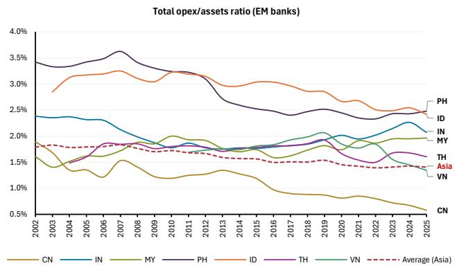

line

| Year | CN    | IN    | MY    | PH    | ID    | TH    | VN    | Average (Asia) |
|------|-------|-------|-------|-------|-------|-------|-------|----------------|
| 2002 | 1.6%  | 2.3%  | 1.7%  | 3.4%  | 2.9%  | 1.8%  | 1.8%  | 1.8%           |
| 2003 | 1.5%  | 2.3%  | 1.6%  | 3.3%  | 3.1%  | 1.7%  | 1.7%  | 1.8%           |
| 2004 | 1.4%  | 2.3%  | 1.6%  | 3.3%  | 3.2%  | 1.7%  | 1.7%  | 1.8%           |
| 2005 | 1.3%  | 2.3%  | 1.6%  | 3.3%  | 3.2%  | 1.7%  | 1.7%  | 1.8%           |
| 2006 | 1.2%  | 2.3%  | 1.6%  | 3.4%  | 3.2%  | 1.7%  | 1.7%  | 1.8%           |
| 2007 | 1.5%  | 2.2%  | 1.7%  | 3.5%  | 3.2%  | 1.7%  | 1.7%  | 1.8%           |
| 2008 | 1.4%  | 2.1%  | 1.8%  | 3.4%  | 3.1%  | 1.7%  | 1.7%  | 1.8%           |
| 2009 | 1.3%  | 2.0%  | 1.9%  | 3.3%  | 3.0%  | 1.7%  | 1.7%  | 1.8%           |
| 2010 | 1.2%  | 1.9%  | 2.0%  | 3.2%  | 2.9%  | 1.7%  | 1.7%  | 1.8%           |
| 2011 | 1.3%  | 1.8%  | 2.0%  | 3.1%  | 2.8%  | 1.7%  | 1.7%  | 1.8%           |
| 2012 | 1.4%  | 1.7%  | 2.0%  | 3.0%  | 2.7%  | 1.7%  | 1.7%  | 1.8%           |
| 2013 | 1.5%  | 1.6%  | 2.0%  | 2.9%  | 2.6%  | 1.7%  | 1.7%  | 1.8%           |
| 2014 | 1.4%  | 1.6%  | 2.0%  | 2.8%  | 2.5%  | 1.7%  | 1.7%  | 1.8%           |
| 2015 | 1.3%  | 1.6%  | 2.0%  | 2.7%  | 2.4%  | 1.7%  | 1.7%  | 1.8%           |
| 2016 | 1.2%  | 1.6%  | 2.0%  | 2.6%  | 2.3%  | 1.7%  | 1.7%  | 1.8%           |
| 2017 | -     | -     | -     | -     | -     | -     | -     | -              |
| 2018 | -     | -     | -     | -     | -     | -     | -     | -              |
| 2019 | -     | -     | -     | -     | -     | -     | -     | -              |
| 2020 | -     | -     | -     | -     | -     | -     | -     | -              |
| 2021 | -     | -     | -     | -     | -     | -     | -     | -              |
| 2022 | -     | -     | -     | -     | -     | -     | -     | -              |
| 2023e| -     | -     | -     | -     | -     | -     | -     | -              |
| In-2024e| -   | -   | -     | -     | -     | -     | -     | -              |
| Avg-2024e| -   | -   | -     | -     | -     | -     | -     | -              |
| Avg-2025e| -   | -   | -     | -     | -     | -     | -     | -              |
| Average (Asia)<lcel><lcel><lcel><lcel><lcel><lcel><lcel><lcel><lcel><lcel><nl>

Source: Central banks, Company data, UBS estimates.

Figure 27: Staff Opex to Assets (DM Asia Banks)   
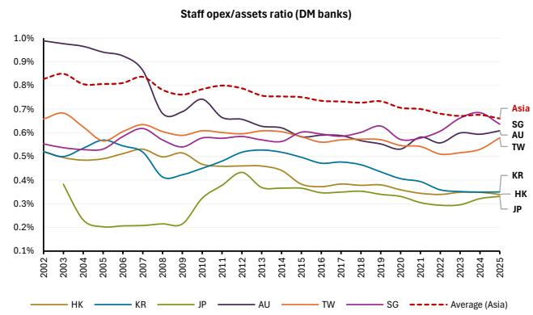

line

| Year | HK    | KR    | JP    | AU    | TW    | SG    | Average (Asia) |
|------|-------|-------|-------|-------|-------|-------|----------------|
| 2002 | 0.50  | 0.50  | 0.40  | 1.00  | 0.70  | 0.55  | 0.85           |
| 2003 | 0.50  | 0.55  | 0.25  | 1.00  | 0.65  | 0.55  | 0.85           |
| 2004 | 0.50  | 0.55  | 0.25  | 1.00  | 0.65  | 0.55  | 0.85           |
| 2005 | 0.50  | 0.55  | 0.25  | 1.00  | 0.65  | 0.55  | 0.85           |
| 2006 | 0.50  | 0.55  | 0.25  | 1.00  | 0.65  | 0.55  | 0.85           |
| 2007 | 0.50  | 0.55  | 0.25  | 1.00  | 0.65  | 0.55  | 0.85           |
| 2008 | 0.50  | 0.45  | 0.25  | 1.00  | 0.65  | 0.55  | 0.85           |
| 2009 | 0.50  | 0.45  | 0.25  | 1.00  | 0.65  | 0.55  | 0.85           |
| 2010 | 0.50  | 0.45  | 0.35  | 1.00  | 0.65  | 0.55  | 0.85           |
| 2011 | 0.50  | 0.45  | 0.45  | 1.00  | 0.65  | 0.55  | 0.85           |
| 2012 | 0.50  | 0.45  | 0.45  | 1.00  | 0.65  | 0.55  | 0.85           |
| 2013 | 0.50  | 0.45  | 0.45  | 1.00  | 0.65  | 0.55  | 0.85           |
| 2014 | 0.50  | 0.45  | 0.45  | 1.00  | 0.65  | 0.55  | 0.85           |
| 2015 | 0.50  | 0.45  | 0.45  | 1.00  | 0.65  | 0.55  | 0.85           |
| 2016 | 0.50  | 0.45  | 0.45  | 1.00  | 0.65  | 0.55  | 0.85           |
| 2017 | 0.50  | 0.45  | 0.45  | 1.00  | 0.65  | 0.55  | 0.85           |
| 2018 | 0.50  | 0.45  | 0.45  | 1.00  | 0.65  | 0.55  | 0.85           |
| 2019 | 0.50  | 0.45  | 0.45  | 1.00  | 0.65  | 0.55  | 0.85           |
| 2020 | -     | -     | -     | -     | -     | -     | -              |
| 2021 | -     | -     | -     | -     | -     | -     | -              |
| 2022 | -     | -     | -     | -     | -     | -     | -              |
| 2023 | -     | -     | -     | -     | -     | -     | -              |
| 2024e| -     | -     | -     | -     | -     | -     | -              |
| Total (Year) : Asia; SG; AU; TG; TK; JP; HK; Singapore; Singapore; Average (Asia); Singapore; USA; UK; Japan; India; China; South Africa; Russia; Canada; Mexico; Spain; Italy; Argentina; Brazil; Canada; France; Germany; Italy; Italy; Italy; Italy; Italy; Italy; Italy; Italy; Italy; Italy; Italy; Italy; Italy; Italy; Italy; Italy; Italy; Italy; Italy; Italy; Italy; Italy; Italy; Italy; Italy; Italy; Italy; Italy; Italy; Italy; Italy; Italy; Italy; Italy; Italy; Italy; Italy; Italy; Italy; Italy; Italy; Italy; Italy; Italy; Italy; Italy; Italy; Italy; Italy; Italy; Spain; Spain; Spain; Spain; Spain; Spain; Spain; Spain; Spain; Spain; Spain; Spain; Spain; Spain; Spain; Spain; Spain; Spain; Spain; Spain; Spain; Spain; Spain; Spain; Spain; Spain; Spain; Spain; Spain; Spain; Spain; Spain; Spain; Spain; Spain; Spain; Spain; Spain; Spain; Spain; Spain; Spain; Spain; Spain; Spain; Spain; Spain; Spain; Spain; Spain; Spanish America, USA, UK, Japan, Germany, France, UK, Italy, Italy, Italy, Italy, Italy, Italy, Italy, Italy, Italy, Italy, Italy, Italy, Italy, Italy, Italy, Italy, Italy, Italy, Italy, Italy, Italy, Italy, Italy, Italy, Italy, Italy, Italy, Italy, Italy, Italy, Italy, Italy, Italy, Italy, Italy, Italy, Italy, Italy, Italy, Italy, Italy, Italy, Italy, Italy, Italy, Italy, Italy, Italy, Italy, Italy, Italiana, Italy, Spain, Spain, Spain, Spain, Spain, Spain, Spain, Spain, Spain, Spain, Spain, Spain, Spain, Spain, Spain, Spain, Spain, Spain, Spain, Spain, Spain, Spain, Spain, Spain, Spain, Spain, Spain, Spain, Spain, Spain, Spain, Spain, Spain, Spain, Spain, Spain, Spain, Spain, Spain, Spain, Spain, Spain, Spain, Spain, Spain, Spain, Spain, Spain, Spain, Spain, Spanish America (Europe), Germany (Germany), UK (United Kingdom), Japan (Japan), South Africa (South Africa), South Korea (South Korea), South Korea (South Korea), South Korea (South Korea), South Korea (South Korea), South Korea (South Korea), South Korea (South Korea), South Korea (South Korea), South Korea (South Korea), South Korea (South Korea), South Korea (South Korea), South Korea (South Korea), South Korea (South Korea), South Korea (South Korea), South Korea (South Korea), South Korea (South Korea), South Korea (South Korea), South Korea (South Korea), South Korea( Europe), Germany (Germany), UK (United Kingdom), Japan (Japan), South Africa (South Africa), South Korea (South Africa), South Korea (South Africa), South Korea (South Africa), South Korea (South Africa), South Korea (South Africa), South Korea (South Africa), South Korea (South Africa), South Korea (South Africa), South Korea (South Africa), South Korea (South Africa), South Korea (South Africa), South Korea (South Africa), South Korea (South Africa), South Korea (South Africa), South Korea (South Africa), South Korea (South Africa), South Korea (South Africa) , South Africa (Europe) , South Africa (Germany) , South Africa (UK) , South Africa (Japan) , South Africa (Spain) , South Africa (Sweden) , South Africa (USA) , South Africa (UK) , South Africa (Japan) , South Africa (Spain) , South Africa (Sweden) , South Africa (USA) , South Africa (UK) , South Africa (Japan) , South Africa (Spain) , South Africa (Sweden) , South Africa (USA) , South Africa (UK) , South Africa (Japan) , South Africa (Spain) , South Africa (Sweden) , South Africa (USA) , South Africa (UK) , South Asia (Europe) , South Asia (Germany) , South Asia (UK) , South Asia (Japan) , South Asia (Spain) , South Asia (Sweden) , South Asia (USA) , South Asia (Japan) , South Asia (Spain) , South Asia (Sweden) , South Asia (USA) , South Asia (UK) , South Asia (Germany) , South Asia (UK) , South Asia (Japan) , South Asia (Spain) , South Asia (Sweden) , South Asia (USA) , South Asia (Japan) , South Asia (Spain) , South Asia (Sweden) , South Asia (USA) , South Asia (UK) , South Asia (Germany) , South Asia (UK) , South Asia (Japan) , South Asia (Spain) , South Asia (Sweden) , South Asian America( Europe) , South Asian America( Germany) , South Asian America( UK) , South Asian America( Japan) , South Asian America( Sweden) , South Asian America( USA) , South Asian America( UK) , South Asian America( Japan) , South Asian America( Sweden) , South Asian America( USA) , South Asian America( UK) , South Asian America( Japan) , South Asian America( Sweden) , South Asian America( USA) , South Asian America( UK) , South Asian America( Japan) , South Asian America( Sweden) , South Asian America( USA) , South Asian America( UK) , South Asian America( Japan) ; South Asian America( Europe) ; South Asian America( Germany) ; South Asian America( UK) ; South Asian America( Japan) ; South Asian America( Sweden) ; South Asian America( USA) ; South Asian America( UK) ; South Asian America( Japan) ; South Asian America( Spain) ; South Asian America( USA) ; South Asian America( UK) ; South Asian America( Japan) ; South Asian America( Sweden) ; South Asian America( USA) ; South Asian America( UK) ; South Asian America( Japan) ; South Asian America( Sweden) ; South Asian America( USA) ; South Asian America( UK) ; South Asian America( Japan) ; South Asian America( Sweden) ; South Asian America( USA) ; South Asian America( UK) ; South Asian America( Japan) ; South Asian America( Sweden) ; South Asian America( USA) ; South Asian America( UK) . All ratios shown above each data point are positive and negative for all regions and countries in this dataset.

Source: Central banks, Company data, UBS estimates.

Figure 28: Staff Opex to Assets (EM Asia Banks)   
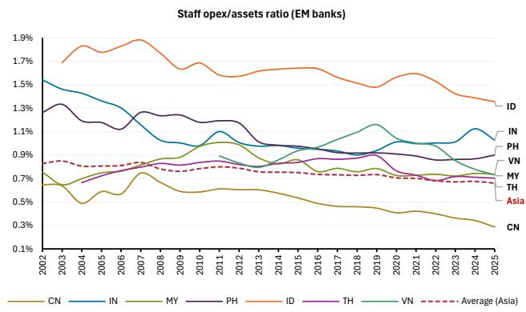  
Source: Central banks, Company data, UBS estimates.

Figure 29: Non-staff Opex to Assets (DM Asia Banks)   
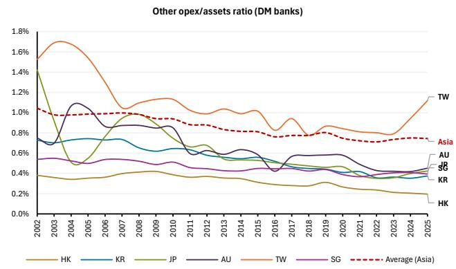  
Source: Central banks, Company data, UBS estimates.

Figure 30: Non-staff Opex to Assets (EM Asia Banks)   
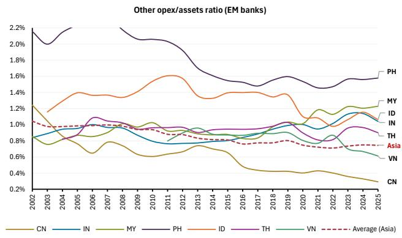

line

| Year | CN    | IN    | MY    | PH    | ID    | TH    | VN    | PH    | MY    | ID    | TH    | VN    | Average (Asia) |
|------|-------|-------|-------|-------|-------|-------|-------|-------|-------|-------|-------|-------|----------------|
| 2002 | 1.2%  | 0.9%  | 0.8%  | 2.2%  | 1.2%  | 1.0%  | 1.0%  | 1.0%  | 1.0%  | 1.0%  | 1.0%  | 1.0%  | 1.0%           |
| 2003 | 1.1%  | 0.9%  | 0.8%  | 2.1%  | 1.3%  | 1.0%  | 1.0%  | 1.0%  | 1.0%  | 1.0%  | 1.0%  | 1.0%  | 1.0%           |
| 2004 | 1.0%  | 0.9%  | 0.8%  | 2.2%  | 1.4%  | 1.0%  | 1.0%  | 1.0%  | 1.0%  | 1.0%  | 1.0%  | 1.0%  | 1.0%           |
| 2005 | 0.9%  | 0.9%  | 0.8%  | 2.3%  | 1.5%  | 1.0%  | 1.0%  | 1.0%  | 1.0%  | 1.0%  | 1.0%  | 1.0%  | 1.0%           |
| 2006 | 0.8%  | 0.9%  | 0.8%  | 2.4%  | 1.6%  | 1.0%  | 1.0%  | 1.0%  | 1.0%  | 1.0%  | 1.0%  | 1.0%  | 1.0%           |
| 2007 | 0.7%  | 0.9%  | 0.8%  | 2.5%  | 1.7%  | 1.0%  | 1.0%  | 1.0%  | 1.0%  | 1.0%  | 1.0%  | 1.0%  | 1.0%           |
| 2008 | 0.6%  | 0.9%  | 0.8%  | 2.6%  | 1.8%  | 1.0%  | 1.0%  | 1.0%  | 1.0%  | 1.0%  | 1.0%  | 1.0%  | 1.0%           |
| 2009 | 0.5%  | 0.9%  | 0.8%  | 2.7%  | 1.9%  | 1.0%  | 1.0%  | 1.0%  | 1.0%  | 1.0%  | 1.0%  | 1.0%  | 1.0%           |
| 2010 | -     | -     | -     | -     | -     | -     | -     | -     | -     | -     | -     | -     | -              |
| 2011 | -     | -     | -     | -     | -     | -     | -     | -     | -     | -     | -     | -     | -              |
| 2012 | -     | -     | -     | -     | -     | -     | -     | -     | -     | -     | -     | -     | -              |
| 2013 | -     | -     | -     | -     | -     | -     | -     | -     | -     | -     | -     | -     | -              |
| 2014 | -     | -     | -     | -     | -     | -     | -     | -     | -     | -     | -     | -     | -              |
| 2015 | -     | -     | -     | -     | -     | -     | -     | -     | -     | -     | -     | -     | -              |
| 2016 | -     | -     | -     | -     | -     | -     | -     | -     | -     | -     | -     | -     | -              |
| 2017 | -     | -     | -     | -     | -     | -     | -     | -     | -     | -     | -     | -     | -              |
| 2018 | -     | -     | -     | -     | -     | -     | -     | -     | -     | -     | -     | -     | -              |
| 2019 | -     | -     | -     | -     | -     | -     | -     | -     | -     | -     | -     | -     | -              |
| 2020 | -     | -     | -     | -     | -     | -     | -     | -     | -     | -     | -     | -     | -              |
| 2021*| -    | -     | -     | -     | -     | -     | -     | -     | -     | -     | -     | -     | ~-            |
| CN   (Average) EM Banks: CN, IN, MY, PH, ID, TH, VN, VN (Average) (Asia) (Year) — CN = ~3%, CN = ~4%, CN = ~5%, CN = ~6%, CN = ~7%, CN = ~8%, CN = ~9%, CN = ~10%, CN = ~11%, CN = ~12%, CN = ~13%, CN = ~14%, CN = ~15%, CN = ~16%, CN = ~17%, CN = ~18%, CN = ~19%, CN = ~20%, CN = ~21%, CN = ~22%, CN = ~23%, CN = ~24%, CN = ~25%). The chart displays the ratio of opex/assets ratios across EM banks over time.

Source: Central banks, Company data, UBS estimates.

# AI Readiness Scorecard For Asian Banks

As will become clear from the detailed discussion below there were six factors that were critical determinants of whether a banking sector was able to deliver efficiency gains successfully. These we believe will also determine the track record for AI related efficiency gains in future. These factors form the basis of the AI readiness scorecard that we present for Asian banking markets below –

- Tech Culture – This captures whether banks approach technology as a genuine strategic tool for productivity improvement or more as a compliance and capability exercise. Markets where technology investment is held accountable to cost-out targets – rather than feature delivery milestones – are likely to show better efficiency outcomes.   
- Competitive Urgency reflects the degree to which banks face an existential market threat that forces genuine follow-through on efficiency commitments. Technology investments without competitive pressure tends to be additive rather than substitutive   
- Efficiency Room measures the quantum of addressable opex inefficiency remaining in the system. High scores here reflect currently elevated cost ratios relative to peers.   
- Labour Market Flexibility is also an important precondition for AI-driven opex improvement. AI can automate processes, but efficiency ratios can only improve if the headcount those processes required is actually reduced or not replaced. In certain markets cultural norms, union structures, political economy, or state ownership objectives can prevent this.   
- IT Systems and Data Infrastructure determines whether AI can be deployed effectively in the first place. AI tools require modern API-accessible core systems, clean and well-governed data, and also high quality national-level data – digital identity, credit bureaus, open banking frameworks – to generate meaningful outputs. Markets burdened by old legacy systems might need to upgrade before AI investment delivers returns; those with modern infrastructure can deploy immediately and at lower integration cost.   
- Scale reflects the reality that meaningful AI investment is capital-intensive and subject to significant economies of scale – the costs can only be justified above a certain asset threshold. In our framework, this doesn't play a big role since almost all banks that we consider appear to have the scale that might be needed to make these investments, making the other five factors more critical.

Disclaimer: While based on the past experience and backed by quantitative evidence in each market, these views are inherently subjective and only reflect one analytical perspective. These are by no means a definitive assessment. Other observers might rank the markets differently. The framework is largely intended as a structured framework for comparative thinking, not necessarily a definitive forecast of AI outcomes across markets.

Figure 31: AI Readiness Scorecard for Asian banks (lower score is better) 

<table><tr><td></td><td>Efficiency room</td><td>Tech culture</td><td>Competitive urgency</td><td>Labour flexibility</td><td>IT &amp; Data infrastructure</td><td>Total Score</td></tr><tr><td>Korea</td><td>4</td><td>1</td><td>1</td><td>2</td><td>1</td><td>5</td></tr><tr><td>Singapore</td><td>4</td><td>1</td><td>2</td><td>3</td><td>1</td><td>7</td></tr><tr><td>Australia</td><td>4</td><td>2</td><td>2</td><td>1</td><td>2</td><td>7</td></tr><tr><td>Thailand</td><td>4</td><td>2</td><td>2</td><td>2</td><td>2</td><td>8</td></tr><tr><td>China</td><td>3</td><td>2</td><td>3</td><td>4</td><td>2</td><td>11</td></tr><tr><td>Hong Kong</td><td>4</td><td>3</td><td>3</td><td>2</td><td>2</td><td>10</td></tr><tr><td>Vietnam</td><td>3</td><td>3</td><td>3</td><td>2</td><td>3</td><td>11</td></tr><tr><td>Indonesia</td><td>2</td><td>3</td><td>3</td><td>3</td><td>3</td><td>12</td></tr><tr><td>Malaysia</td><td>3</td><td>3</td><td>3</td><td>3</td><td>3</td><td>12</td></tr><tr><td>Philippines</td><td>1</td><td>4</td><td>3</td><td>3</td><td>4</td><td>14</td></tr><tr><td>India</td><td>1</td><td>4</td><td>3</td><td>4</td><td>4</td><td>15</td></tr><tr><td>Taiwan</td><td>2</td><td>4</td><td>4</td><td>3</td><td>4</td><td>15</td></tr><tr><td>Japan</td><td>2</td><td>3</td><td>4</td><td>4</td><td>4</td><td>15</td></tr></table>

Source: UBS; 1 = better, 4 = less good. Lower total score = stronger overall AI readiness. For efficiency room, score 1 = more room (highest AI opportunity); score 5 = already highly efficient.

# Japan

- Total opex / assets for the megabanks sits towards the top of DM group just below the Asian average. There has been little improvement over the last 15y or so. This reflects the structural challenges in the market.   
- Staff costs are paradoxically the lowest in the DM group but again like overall costs, and unlike most other Asian markets, have not shown any meaningful improvement over the decades. The level appears to be affected by the large asset base and sheer size of the Japanese banks that compresses the ratio. Lifetime employment norms, powerful union cultures and deep social expectations add to the challenge in driving efficiencies through headcount reduction.   
- Non-staff costs remain elevated and likely reflect the legacy IT maintenance burden. The three mega banks have announced ambitious technology transformation programs – MUFG committing Y1tn in tech investments over 2021-25, SMFG partnering with SBI Holdings for digital distribution, and Mizuho publishing a standalone Digital Transformation Report following the FSA's 2021 administrative action – all signal that management intent is genuine and regulatory pressure is real. The challenge remains execution and speed.   
- Figure 33 highlights the restructuring challenge in Japan. 33 branches per 100k adults – the highest density among all 13 Asian markets – and a line that has remained flat for decades. On the contrary every other DM market has seen branch rationalisation, with Australia leading in the last decade. Japan's branch network has not changed despite the mounting revenue pressure building up over the years (low interest rates, demographics).

Figure 33: # of branches per 100k adults - DM Asia   
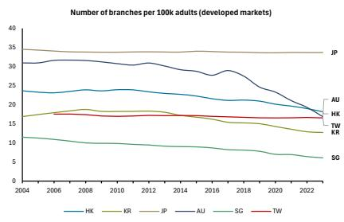

line

| Year | HK   | KR   | JP   | AU   | SG   | TW   |
|------|------|------|------|------|------|------|
| 2004 | 23   | 17   | 35   | 31   | 11   | 17   |
| 2006 | 23   | 18   | 35   | 31   | 10   | 17   |
| 2008 | 23   | 18   | 35   | 31   | 9    | 17   |
| 2010 | 23   | 18   | 35   | 31   | 8    | 17   |
| 2012 | 23   | 18   | 35   | 31   | 7    | 17   |
| 2014 | 23   | 18   | 35   | 31   | 6    | 17   |
| 2016 | 22   | 17   | 35   | 30   | 5    | 17   |
| 2018 | 21   | 16   | 35   | 28   | 4    | 17   |
| 2020 | 20   | 15   | 35   | 25   | 3    | 17   |
| 2022 | 19   | 14   | 35   | 20   | 2    | 17   |

Source: World Bank, FSC Taiwan

Figure 34: Loans per branch - Japan is an outlier   
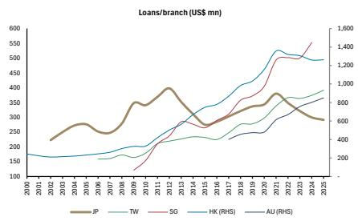  
Source: Central banks, Company data. Note: Data for Singapore is based on total for OCBC and UOB.

Figure 32: AI references in Annual reports (per 100 pages)   
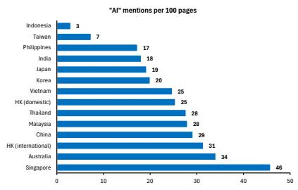

bar

"AI" mentions per 100 pages
| Country | "AI" mentions per 100 pages |
| :--- | :--- |
| Indonesia | 3 |
| Taiwan | 7 |
| Philippines | 17 |
| India | 18 |
| Japan | 19 |
| Korea | 20 |
| Vietnam | 25 |
| HK (domestic) | 25 |
| Thailand | 28 |
| Malaysia | 28 |
| China | 29 |
| HK (international) | 31 |
| Australia | 34 |
| Singapore | 46 |

Source: Company data, UBS

Figure 35: # of Bank employees   
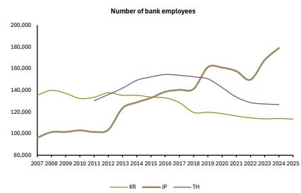

line

| Year | KR     | JP     | TH     |
|------|--------|--------|--------|
| 2007 | 135,000| 95,000 | 130,000|
| 2008 | 138,000| 100,000| 132,000|
| 2009 | 136,000| 102,000| 135,000|
| 2010 | 134,000| 105,000| 138,000|
| 2011 | 132,000| 110,000| 145,000|
| 2012 | 135,000| 125,000| 155,000|
| 2013 | 138,000| 135,000| 165,000|
| 2014 | 140,000| 145,000| 175,000|
| 2015 | 142,000| 155,000| 178,000|
| 2016 | 145,000| 165,000| 175,000|
| 2017 | 148,000| 175,000| 172,000|
| 2018 | 155,000| 185,000| 168,000|
| 2019 | 165,000| 195,000| 165,000|
| 2020 | 168,000| 198,000| 162,000|
| 2021 | 165,000| 195,000| 158,000|
| 2022 | 162,000| 198,000| 155,000|
| 2023 | 165,000| 215,000| 158,000|
| 2024 | 175,000| 235,000| 165,000|
| 2025 | 185,000| 255,000| 175,000|

Source: Central banks, Company data. Note: Data for Japan (MUFG, SMBC).

# What drives the scores for Japan banks (1=highest, 5=lowest):

- Tech culture – a score of 3 for the mega banks in aggregate given the recently announced ambitious technology plans which all suggest genuine intent. FSA is also pushing hard for organisational change but the progress has been slow. Mega-banks (MUFG, SMFG, Mizuho) are all making progress albeit from a low base.   
- Competitive urgency – a score of 4 alongside Taiwan. Just like in Taiwan, significantly less neobank disruption threat due to an aging demographic. Lifetime employment norms reduce internal urgency within organisations. Only Asian market where loans per branch has continued to decline (Figure 34).   
- Efficiency room – scores 2 alongside Indonesia and Taiwan. High opex to assets ratio suggest room for inefficiency to come down especially on non-staff costs driven by legacy IT maintenance overhead. Less room than India and Philippines where both cost lines are simultaneously elevated. See Figure 25 above.   
- Labour flexibility – a score of 4 alongside India and China. Lifetime employment norms, powerful internal union cultures, and deep social expectations introduce some rigidity in the labour market. In China, state direction creates a constraint, in Japan it appears to be more cultural and contractual. Natural attrition over the next decade is one pathway. See Figure 35 above.   
- IT & data infra - a score of 4 given legacy IT burden. COBOL expertise remains valued over cloud engineering at major institutions. See Figure 29.

# Australia

- One of the clearest downward trends in the DM group – total opex / assets declining steadily over the years – clear evidence of the restructuring journey over the years. The overall ratio and staff costs are now converging with Singapore declining from a much higher level suggesting genuine structural transformation. Sharpest downward trajectory for branch per capita from 30+ to 15 among the DM group reflecting sustained restructuring programs without political bottlenecks.   
- Both staff and non-staff lines have declined with the latter showing a sharper fall reflecting the data center consolidation and branch rationalisation in the 2000s.   
- The heavily unionised nature of workforce and over branched nature of banking in Australia changed after the crisis in the early 90s. Several banks faced heavy losses and had to transform. In some ways similar to Korea, Australian banks had to focus on cost discipline driven by the crisis. This also likely allowed for more political permission for restructuring.   
- Worth mentioning here are the two landmark financial inquiries: the Campbell Committee reforms of the early 1980s and the Wallis Inquiry of the late 1990s. Both aimed to inject competition, market discipline, and modern regulation into a previously tightly controlled system, thereby improving banking efficiency over the long term.   
- The unique mortgage brokerage channel, superannuation driven shareholder discipline are also factors unique to Australian banks that help gradually improving efficiency ratio in recent years.

Figure 36: # of branches per 100k adults – DM Asia   
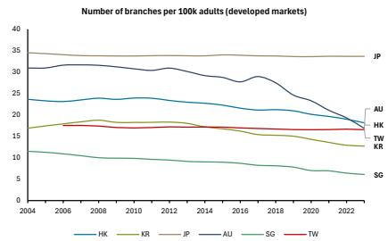

line

| Year | HK   | KR   | JP   | AU   | SG   | TW   |
|------|------|------|------|------|------|------|
| 2004 | 23   | 17   | 35   | 31   | 11   | 17   |
| 2006 | 23   | 18   | 35   | 31   | 10   | 17   |
| 2008 | 23   | 19   | 35   | 31   | 9    | 17   |
| 2010 | 23   | 18   | 35   | 31   | 8    | 17   |
| 2012 | 23   | 18   | 35   | 31   | 7    | 17   |
| 2014 | 23   | 18   | 35   | 31   | 6    | 17   |
| 2016 | 22   | 17   | 35   | 30   | 5    | 17   |
| 2018 | 22   | 16   | 35   | 28   | 4    | 17   |
| 2020 | 21   | 15   | 35   | 25   | 3    | 17   |
| 2022 | 19   | 14   | 35   | 20   | 2    | 17   |

Source: World Bank, FSC Taiwan

Figure 37: Tech spend / Opex   
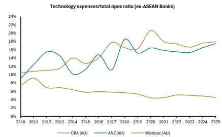

line

| Year | CBA (AU) | ANZ (AU) | Westpac (AU) |
|------|----------|----------|--------------|
| 2010 | 10%      | 9%       | 8%           |
| 2011 | 11%      | 13%      | 9%           |
| 2012 | 12%      | 16%      | 7%           |
| 2013 | 13%      | 14%      | 7%           |
| 2014 | 14%      | 10%      | 6%           |
| 2015 | 15%      | 13%      | 6%           |
| 2016 | 16%      | 15%      | 6%           |
| 2017 | 17%      | 18%      | 6%           |
| 2018 | 18%      | 19%      | 6%           |
| 2019 | 17%      | 16%      | 6%           |
| 2020 | 20%      | 17%      | 5%           |
| 2021 | 18%      | 16%      | 5%           |
| 2022 | 17%      | 16%      | 5%           |
| 2023 | 17%      | 16%      | 5%           |
| 2024 | 18%      | 17%      | 5%           |
| 2025 | 18%      | 17%      | 5%           |

Source: Company data

Figure 38: OPEX / Revenue – DM Asia   
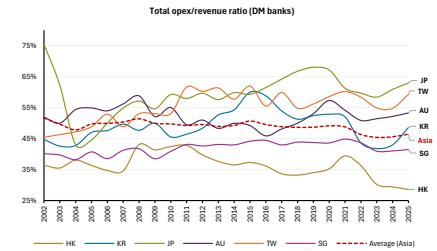

line

| Year | HK    | KR    | JP    | AU    | TW    | SG    | Average (Asia) |
|------|-------|-------|-------|-------|-------|-------|----------------|
| 2000 | 35%   | 45%   | 75%   | 45%   | 45%   | 45%   | 45%            |
| 2001 | 35%   | 45%   | 75%   | 45%   | 45%   | 45%   | 45%            |
| 2002 | 35%   | 45%   | 75%   | 45%   | 45%   | 45%   | 45%            |
| 2003 | 35%   | 45%   | 75%   | 45%   | 45%   | 45%   | 45%            |
| 2004 | 35%   | 45%   | 75%   | 45%   | 45%   | 45%   | 45%            |
| 2005 | 35%   | 45%   | 75%   | 45%   | 45%   | 45%   | 45%            |
| 2006 | 35%   | 45%   | 75%   | 45%   | 45%   | 45%   | 45%            |
| 2007 | 35%   | 45%   | 75%   | 45%   | 45%   | 45%   | 45%            |
| 2008 | 35%   | 45%   | 75%   | 45%   | 45%   | 45%   | 45%            |
| 2009 | 35%   | 45%   | 75%   | 45%   | 45%   | 45%   | 45%            |
| 2010 | 35%   | 45%   | 75%   | 45%   | 45%   | 45%   | 45%            |
| 2011 | 35%   | 45%   | 75%   | 45%   | 45%   | 45%   | 45%            |
| 2012 | 35%   | 45%   | 75%   | 45%   | 45%   | 45%   | 45%            |
| 2013 | 35%   | 45%   | 75%   | 45%   | 45%   | 45%   | 45%            |
| 2014 | 35%   | 45%   | 75%   | 45%   | 45%   | 45%   | 45%            |
| 2015 | 35%   | 45%   | 75%   | 45%   | 45%   | 45%   | 45%            |
| 2016 | 35%   | 45%   | 75%   | 45%   | 45%   | 45%   | 45%            |
| 2017 | 35%   | 45%   | 75%   | 45%   | 45%   | 45%   | 45%            |
| 2018 | 35%   | 45%   | 75%   | 45%   | 45%   | 45%   | 45%            |
| 2019 | 35%   | 45%   | 75%   | 45%   | 45%   | 45%   | 45%            |
| 2020 | 35%   | 45%   | 75%   | 45%   | 45%   | 45%   | 45%            |
| 2021 | 35%   | 45%   | 75%   | 45%   | 45%   | 45%   | 45%            |
| 2022 | 35%   | 45%   | 75%   | 45%   | 45%   | 45%   | 45%            |
| 2023e| -     | -     | -     | -     | -     | -     | -              |
| Total (2023) - HK - Average (Asia) - HK - KR - JP - AU - TW - SG - JK - JP - TW - SG - Asia - SG - JK - JK - JK - JK - JK - JK - JK - JK - JK - JK - JK - JK - JK - JK - JK - JK - JK - JK - JK - JK - JK - JK - JK - JK - JK - JK - JK - JK - JK - JK - JK - JK - JK - JK - JK - JK - JK - JK - JK - JK - JK - JK - JK - JK - JK - JK - JK - JK - JK - JK - KK - KK - KK - KK - KK - KK - KK - KK - KK - KK - KK - KK - KK - KK - KK - KK - KK - KK - KK - KK - KK - KK - KK - KK - KK - KK - KK - KK - KK - KK - KK - KK - KK - KK - KK - KK - KK

Source: Central banks, Company data, UBS estimates.

# What drives the scores for Australia banks (1=highest, 5=lowest):

- Tech culture – scores 2 alongside China and Thailand. CBA is a genuine global AI leader. The Royal Commission drove process standardisation and enabled automation. Scores below Korea and Singapore because tech culture appears to be more concentrated at the Big Four.   
- Competitive urgency – scores 2 alongside Singapore and Thailand. Neobank competition is emerging. The mortgage broker channel – intermediating almost two-thirds of new originations – creates permanent and structural margin pressure that forces cost discipline. Demanding institutional shareholders (superannuation) add a further sustained efficiency forcing function absent in most Asian peers.   
- Efficiency room – scores 4 alongside Korea, Singapore, and HK. Transformed through decades of restructuring from one of the highest cost bases in the DM peer group to current Singapore-equivalent levels. In a high income market, non-staff cost level is a bigger determinant of room for efficiency. See (Figure 38).   
- Labour flexibility – scores 1 alone – a clear demonstrated track record of large-scale banking restructuring without the political opposition that would be faced in Japan, India or China (Figure 36).   
- IT & data infra – scores 2 alongside China, Thailand, and HK. The Big Four operate on modern, well-integrated architectures albeit regional banks carry more legacy burden.

# China

- Opex / assets has fallen sharply and sits at the lowest level among all Asian markets. This is true for both staff and non-staff costs which both are the lowest in the region.   
- This is partly a reflection how SOE banks compensation is managed. Since 2015, executive and senior staff pay has been effectively capped as part of the SOE reform agenda, as well as front line wage growth has been tightly managed. This contrasts with India where there are bipartite wage settlements and these are negotiated with unions with often politically generous outcomes.   
- On non-staff opex, there are specific reasons why Chinese banks are able to maintain one of the lowest level - a lot of the digital infrastructure was built with state subsidy or shared cost arrangements, and individual banks didn't have to bear the full investment cost the way they had to in other markets (like Japan or Taiwan).   
- Banks also effectively outsource the customer facing digital layer to fintechs (like WeChat or Alipay) avoiding the significant UX / digital buildout cost that banks in Malaysia and Taiwan have to bear themselves.

Figure 39: # of branches per 100k adults – EM Asia   
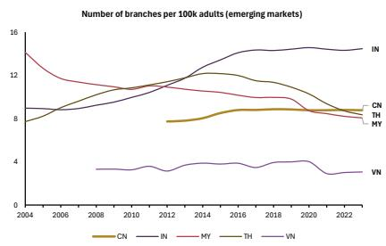

line

| Year | CN  | IN  | MY  | TH  | VN  |
|------|-----|-----|-----|-----|-----|
| 2004 | 8   | 13  | 13  | 8   | 3   |
| 2006 | 8   | 12  | 12  | 8   | 3   |
| 2008 | 8   | 11  | 11  | 8   | 3   |
| 2010 | 8   | 11  | 11  | 8   | 3   |
| 2012 | 8   | 12  | 11  | 8   | 3   |
| 2014 | 8   | 13  | 10  | 8   | 3   |
| 2016 | 8   | 14  | 9   | 8   | 3   |
| 2018 | 8   | 14  | 9   | 8   | 3   |
| 2020 | 8   | 14  | 8   | 8   | 3   |
| 2022 | 8   | 14  | 7   | 8   | 3   |

Source: World Bank

Figure 40: # ATMs per 100k adults   
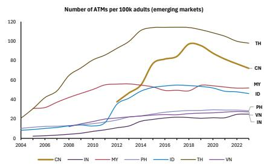

line

| Year | CN   | IN   | MY   | PH   | ID   | TH   | VN   |
|------|------|------|------|------|------|------|------|
| 2004 | 20   | 5    | 30   | 10   | 10   | 20   | 5    |
| 2006 | 40   | 10   | 35   | 15   | 15   | 30   | 10   |
| 2008 | 60   | 15   | 40   | 20   | 20   | 40   | 15   |
| 2010 | 80   | 20   | 45   | 25   | 25   | 50   | 20   |
| 2012 | 100  | 25   | 50   | 30   | 30   | 60   | 25   |
| 2014 | 110  | 30   | 55   | 35   | 35   | 70   | 30   |
| 2016 | 115  | 35   | 55   | 40   | 40   | 80   | 35   |
| 2018 | 110  | 40   | 55   | 45   | 45   | 90   | 40   |
| 2020 | 105  | 45   | 55   | 50   | 50   | 100  | 45   |
| 2022 | 100  | 50   | 55   | 55   | 55   | 110  | 50   |

Source: World Bank

Figure 41: IT spend / Opex   
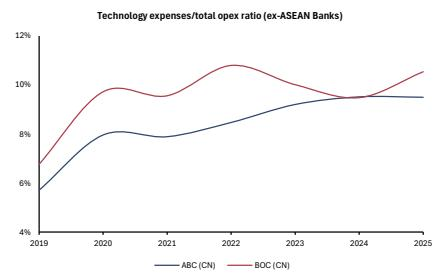

line

| Year | ABC (CN) | BOC (CN) |
|------|----------|----------|
| 2019 | 6%       | 7%       |
| 2020 | 8%       | 10%      |
| 2021 | 8%       | 9%       |
| 2022 | 9%       | 11%      |
| 2023 | 9%       | 10%      |
| 2024 | 9%       | 9%       |
| 2025 | 9%       | 10%      |

Source: Company data

# What drives the scores for China banks (1=highest, 5=lowest):

- Tech culture – scores 2 alongside Australia and Thailand. The Big Four have world-class data assets and deep integration with the Alibaba and Tencent ecosystems. Fintech displacement of retail banking channels is the most advanced in the world. Scores below Korea and Singapore because innovation is concentrated in state-directed institutions (Figure 41).   
- Competitive urgency – scores 3 alongside HK, Vietnam, Indonesia, Malaysia, India, and Philippines. Alipay and WeChat have already disrupted retail banking at scale. But state ownership also provides a soft government guarantee of survival that removes existential urgency. Incumbents see AI as a performance metric rather than a survival necessity (Figure 39).   
- Efficiency room – scores 3 alongside Vietnam and Malaysia. Opex ratios appear efficient but are partially due to cost socialisation and sharing with fintechs rather than genuine operational productivity. Room for real addressable inefficiency still exists. More room than Thailand, Korea, Singapore, and HK; less room than Indonesia, India, Taiwan, Japan, and Philippines (Figure 17).   
- Labour flexibility – scores 4 alongside India. State employment objectives mean AI savings may result in redeployment rather than direct headcount reduction. Only Japan scores worse on this dimension (Figure 39).   
- IT & data infra – scores 2 alongside Australia, Thailand, and HK. The Big Four operate large-scale, state-subsidised modern systems. Alibaba and Tencent data ecosystems provide data richness unavailable elsewhere. Scores below only Korea and Singapore.

# India

- The only market in the region where total opex / assets has been rising rather than falling in recent years suggesting lower competitive urgency.   
- Staff costs have risen as well - a direct result of the bipartite wage settlements, expanding PSU branch networks driven by financial inclusion mandates.   
- Non-staff costs also rising reflecting the technology catch-up investments combined with the intensifying compliance requirement post the IL&FS crisis.   
- Large room for efficiency improvement in theory but challenging to achieve given less labour flexibility, financial inclusion mandates for PSU banks.

Figure 42: Number of bank branches   
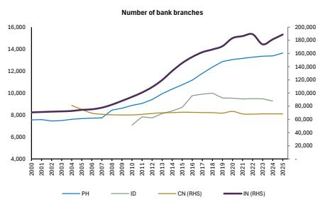

line

| Year | PH    | ID    | CN (RHS) | IN (RHS) |
|------|-------|-------|----------|----------|
| 2000 | 7,500 | 7,500 | 7,500    | 8,000    |
| 2001 | 7,600 | 7,600 | 7,600    | 8,100    |
| 2002 | 7,700 | 7,700 | 7,700    | 8,200    |
| 2003 | 7,800 | 7,800 | 7,800    | 8,300    |
| 2004 | 7,900 | 7,900 | 7,900    | 8,400    |
| 2005 | 8,000 | 8,000 | 8,000    | 8,500    |
| 2006 | 8,100 | 8,100 | 8,100    | 8,600    |
| 2007 | 8,200 | 8,200 | 8,200    | 8,700    |
| 2008 | 8,300 | 8,300 | 8,300    | 8,800    |
| 2009 | 8,400 | 8,400 | 8,400    | 8,900    |
| 2010 | 8,500 | 8,500 | 8,500    | 9,000    |
| 2011 | 8,600 | 8,600 | 8,600    | 9,100    |
| 2012 | 8,700 | 8,700 | 8,700    | 9,200    |
| 2013 | 8,800 | 8,800 | 8,800    | 9,300    |
| 2014 | 8,900 | 8,900 | 8,900    | 9,400    |
| 2015 | 9,000 | 9,000 | 9,000    | 9,500    |
| 2016 | 9,100 | 9,100 | 9,100    | 9,600    |
| 2017 | 9,200 | 9,200 | 9,200    | 9,700    |
| 2018 | 9,300 | 9,300 | 9,300    | 9,800    |
| 2019 | 9,400 | 9,400 | 9,400    | 9,900    |
| 2020 | 9,500 | 9,500 | 9,500    | 10,000   |
| 2021 | 9,600 | 9,600 | 9,600    | 15,566   |
| 2022 | 9,700 | 9,700 | 9,764    | 15,566   |
| 2023 | 9,800 | 9,864 | 9,864    | 15,566   |
| 2024E| 9,964 | 9,964 | 9,964    | 16,566   |
| 2O25E|13,566|13,566|13,566   |1864     |
| Total|13,566|13,566|13,566   |1864     |

Source: Central banks, Indonesia Financial Services Authority, Company data.

Figure 43: # of branches per 100k adults - EM Asia   
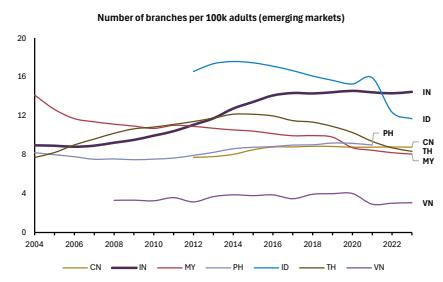

line

| Year | IN  | ID  | PH  | CN  | TH  | MY  | VN  |
|------|-----|-----|-----|-----|-----|-----|-----|
| 2004 | 8   | 8   | 8   | 8   | 8   | 15  | 3   |
| 2006 | 8   | 8   | 8   | 8   | 8   | 12  | 3   |
| 2008 | 8   | 8   | 8   | 8   | 8   | 10  | 3   |
| 2010 | 8   | 8   | 8   | 8   | 8   | 10  | 3   |
| 2012 | 8   | 8   | 8   | 8   | 8   | 10  | 3   |
| 2014 | 8   | 8   | 8   | 8   | 8   | 10  | 3   |
| 2016 | 8   | 8   | 8   | 8   | 8   | 10  | 3   |
| 2018 | 8   | 8   | 8   | 8   | 8   | 10  | 3   |
| 2020 | 8   | 8   | 8   | 8   | 8   | 10  | 3   |
| 2022 | 8   | 8   | 8   | 8   | 8   | 10  | 3   |

Source: World Bank

Figure 44: # of Bank Employees   
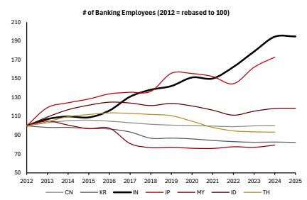

line

| Year | CN   | KR   | N    | JP   | MY   | ID   | TH   |
|------|------|------|------|------|------|------|------|
| 2012 | 90   | 90   | 90   | 90   | 90   | 90   | 90   |
| 2013 | 90   | 90   | 95   | 105  | 95   | 95   | 95   |
| 2014 | 90   | 90   | 100  | 110  | 100  | 100  | 100  |
| 2015 | 90   | 90   | 105  | 115  | 105  | 105  | 105  |
| 2016 | 90   | 90   | 110  | 120  | 110  | 110  | 110  |
| 2017 | 90   | 90   | 120  | 130  | 115  | 115  | 115  |
| 2018 | 90   | 90   | 130  | 140  | 120  | 120  | 120  |
| 2019 | 90   | 90   | 140  | 150  | 125  | 125  | 125  |
| 2020 | 90   | 90   | 150  | 160  | 130  | 130  | 130  |
| 2021 | 90   | 90   | 160  | 155  | 135  | 135  | 135  |
| 2022 | 90   | 90   | 170  | 150  | 140  | 140  | 140  |
| 2023 | 90   | 90   | 180  | 160  | 145  | 145  | 145  |
| 2024 | 90   | 90   | 190  | 170  | 150  | 150  | 150  |
| 2025 | 90   | 90   | -    | -    | -    | -    | -    |

Source: Central banks, Company data

# What drive the scores for Indian banks (1=highest, 5=lowest):

- Tech culture – scores 4 alongside Taiwan and Philippines. Private banks (HDFC, ICICI, Kotak, Axis) are genuinely advanced and would individually score 2 but PSU banks controlling \~60% of assets drive the overall score lower.   
- Competitive urgency – scores 3 alongside many peers. Private banks face genuine urgency from PhonePe, Paytm, and a sophisticated fintech ecosystem – arguably the most vibrant in EM Asia outside China. PSU banks are however largely insulated by government mandate, institutional scale, and implicit guarantees. Net sector urgency is moderate: high for 40% of assets, low for 60% (Figure 43).   
- Efficiency room – scores 1 alongside Philippines – the largest AI efficiency opportunity in EM Asia, in theory. Both staff costs (bipartite wage settlements, pension liabilities) and non-staff costs (technology catch-up, compliance) are elevated and rising. Critically, unlike Philippines where geography creates structural cost challenges, India's inefficiency is predominantly policy-driven i.e. more addressable if political barriers can be overcome (Figure 26).   
- Labour flexibility – scores 4 alongside China. PSU banks face unique constraints: bipartite wage settlements negotiated with powerful unions every 5 years, political sensitivity around government bank employment. Private banks are more flexible (Figure 44).   
- IT & data infra – scores 4 alongside Taiwan and Philippines. India Stack – Aadhaar, UPI, Account Aggregator – is world-class infrastructure, a genuine bright spot that would score 1–2 in isolation. But PSU core banking systems are still heavily legacy.

# Hong Kong

- Consistently the lowest opex / assets in the DM group reflecting a structurally lean wholesale heavy business model that is efficient by design.   
- Both staff and non-staff costs are low and have remained broadly stable suggest limited room to drive further efficiency.   
- Lack of any improvements in these lines also suggest lack of an urgent existential threat given the oligopolistic structure. This results in less competitive pressure to invest in digital/branches/customer acquisition.   
- High property prices mean that banks in HK have always been rationalising branches.

Figure 45: Branch rationalisation   
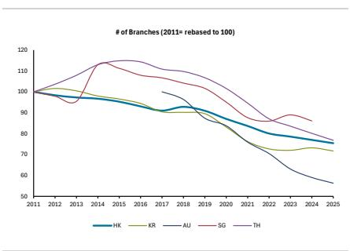

line

| Year | HK   | KR   | AU   | SG   | TH   |
|------|------|------|------|------|------|
| 2011 | 100  | 100  | 100  | 100  | 100  |
| 2012 | 98   | 100  | 98   | 100  | 100  |
| 2013 | 96   | 100  | 96   | 105  | 105  |
| 2014 | 94   | 98   | 94   | 110  | 110  |
| 2015 | 92   | 96   | 92   | 108  | 112  |
| 2016 | 90   | 94   | 90   | 106  | 110  |
| 2017 | 88   | 92   | 88   | 104  | 108  |
| 2018 | 86   | 90   | 86   | 102  | 106  |
| 2019 | 84   | 88   | 84   | 100  | 104  |
| 2020 | 82   | 86   | 82   | 98   | 102  |
| 2021 | 80   | 84   | 80   | 96   | 100  |
| 2022 | 78   | 82   | 78   | 94   | 98   |
| 2023 | 76   | 80   | 76   | 92   | 96   |
| 2024 | 74   | 78   | 74   | 90   | 94   |
| 2025 | 72   | 76   | 72   | 88   | 92   |

Source: Central banks, Company data

Figure 46: Opex / Assets   
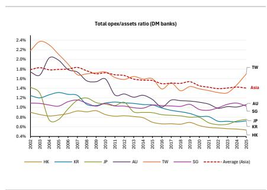

line

| Year | HK    | KR    | JP    | AU    | TW    | SG    | Average (Asia) |
|------|-------|-------|-------|-------|-------|-------|----------------|
| 2002 | 0.9   | 1.3   | 1.4   | 1.7   | 2.3   | 1.1   | 1.8            |
| 2004 | 0.8   | 1.2   | 0.7   | 1.8   | 2.4   | 1.1   | 1.8            |
| 2006 | 0.8   | 1.2   | 0.8   | 1.9   | 2.3   | 1.1   | 1.8            |
| 2008 | 0.8   | 1.2   | 0.9   | 1.8   | 2.2   | 1.1   | 1.8            |
| 2010 | 0.8   | 1.2   | 1.0   | 1.7   | 2.1   | 1.1   | 1.8            |
| 2012 | 0.8   | 1.2   | 1.0   | 1.6   | 2.0   | 1.1   | 1.8            |
| 2014 | 0.8   | 1.2   | 1.0   | 1.5   | 1.9   | 1.1   | 1.8            |
| 2016 | 0.8   | 1.2   | 1.0   | 1.4   | 1.8   | 1.1   | 1.8            |
| 2018 | 0.8   | 1.2   | 1.0   | 1.3   | 1.7   | 1.1   | 1.8            |
| 2020 | 0.8   | 1.2   | 1.0   | 1.2   | 1.6   | 1.1   | 1.8            |
| 2022 | 0.8   | 1.2   | 1.0   | 1.1   | 1.5   | 1.1   | 1.8            |
| 2024 | 0.8   | 1.2   | 1.0   | 1.0   | 1.4   | 1.1   | 1.8            |
| 2025 | 0.8   | 1.2   | 1.0   | 1.0   | 1.4   | 1.1   | 1.8            |

Source: Central banks, Company data, UBS estimates.

Figure 47: AI references in annual reports   
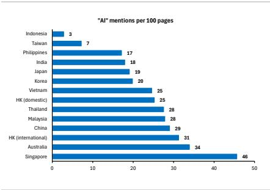

bar

"AI" mentions per 100 pages
| Country/Region | "AI" mentions per 100 pages |
| :--- | :--- |
| Indonesia | 3 |
| Taiwan | 7 |
| Philippines | 17 |
| India | 18 |
| Japan | 19 |
| Korea | 20 |
| Vietnam | 25 |
| HK (domestic) | 25 |
| Thailand | 28 |
| Malaysia | 28 |
| China | 29 |
| HK (international) | 31 |
| Australia | 34 |
| Singapore | 46 |

Source: Company data, UBS.

# What drive the scores for HK banks (1=highest, 5=lowest):

- Tech culture – scores 3 alongside Vietnam, Indonesia, and Malaysia. Sophisticated incumbents with HKMA support and genuine investments driven by virtual bank licences. Scores below Australia, China, and Thailand because tech culture is driven by compliance necessity and competitive response. Wholesale business models and retail market share dominance also reduce urgency for retail digitisation.   
- Competitive urgency – scores 3 alongside multiple peers. Virtual banks (ZA Bank, Mox, WeLab) create some disruption but the concentrated domestic retail banking structure provides meaningful insulation. Urgency is moderate rather than existential as in Korea and Thailand.   
- Efficiency room – scores 4 alongside Korea, Singapore, and Australia. Already lean given the wholesale-heavy business mix. Less room than Indonesia, Taiwan, India, or Japan; similar to Thailand which has already transformed actively (Figure 16).   
- Labour flexibility – scores 2 alongside Korea, Thailand, and Vietnam. Private sector employment norms with no lifetime employment culture. For major banks (HSBC, StanChart), local headcount decisions are often made by global group management rather than locally – removing domestic political constraint. More flexible than Singapore in practice (Figure 45).   
- IT & data infra - scores 2 alongside Australia, China, and Thailand. International bank standards set a high baseline across the sector. HKMA's technology and risk frameworks drive ongoing investment. Behind Korea and Singapore in terms of data infrastructure and AI deployment depth, but ahead of Vietnam, Indonesia, and Malaysia.

# Singapore

- Total opex to assets sits at middle of the pack in the DM group and broadly stable level. Staff costs tend to be higher than the average DM peer in one of the highest cost of living and expensive cities in the world. Non-staff costs have remained quite consistently low and among the lowest in Asia.   
- Both staff and non-staff costs have nudged a bit higher in the recent years, despite the rhetoric of ongoing tech investments, reflecting the lack of evidence that tech investments have resulted in meaningful reduction in opex intensity. Staff costs increase is likely a result of the ongoing WM push given the strong inflow of capital and heating competitive intensity.   
- Singapore trends offer an interesting example. Despite the numerous "world's best digital bank" awards for DBS, the efficiency ratio for the sector have not shown any meaningful improvement. WM push not only explains the numerator but also denominator. A growing WM business doesn't always reflect in higher asset growth as the assets can also sit off balance sheet. For this reason, cost to income, while not usually the ideal metric given the income volatility for banks, might be a more relevant metric in this case.

Figure 48: IT spend / Opex   
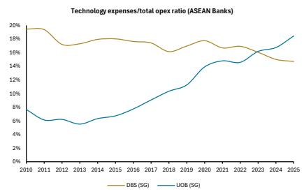

line

| Year | DBS (SG) | UOB (SG) |
|------|----------|----------|
| 2010 | 20%      | 8%       |
| 2011 | 19%      | 6%       |
| 2012 | 18%      | 6%       |
| 2013 | 18%      | 6%       |
| 2014 | 18%      | 6%       |
| 2015 | 18%      | 7%       |
| 2016 | 18%      | 8%       |
| 2017 | 18%      | 9%       |
| 2018 | 17%      | 10%      |
| 2019 | 17%      | 11%      |
| 2020 | 17%      | 13%      |
| 2021 | 17%      | 14%      |
| 2022 | 17%      | 15%      |
| 2023 | 16%      | 16%      |
| 2024 | 15%      | 17%      |
| 2025 | 14%      | 19%      |

Source: Company data

Figure 49: Branch Rationalisation   
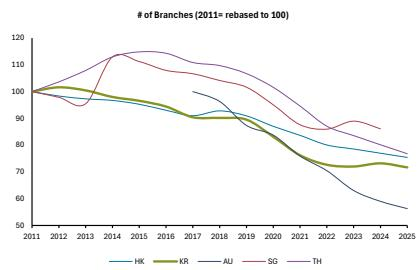

line

| Year | HK   | KR   | AU   | SG   | TH   |
|------|------|------|------|------|------|
| 2011 | 100  | 100  | 100  | 100  | 100  |
| 2012 | 98   | 100  | 98   | 100  | 105  |
| 2013 | 96   | 98   | 96   | 105  | 108  |
| 2014 | 94   | 96   | 94   | 110  | 112  |
| 2015 | 92   | 94   | 92   | 112  | 114  |
| 2016 | 90   | 92   | 90   | 110  | 113  |
| 2017 | 88   | 90   | 88   | 108  | 111  |
| 2018 | 86   | 88   | 86   | 106  | 109  |
| 2019 | 84   | 86   | 84   | 104  | 107  |
| 2020 | 82   | 84   | 82   | 102  | 105  |
| 2021 | 80   | 82   | 80   | 100  | 103  |
| 2022 | 78   | 80   | 78   | 98   | 101  |
| 2023 | 76   | 78   | 76   | 96   | 99   |
| 2024 | 74   | 76   | 74   | 94   | 97   |
| 2025 | 72   | 74   | 72   | 92   | 95   |

Source: Central banks, Company data

Figure 50: Opex / Revenue   
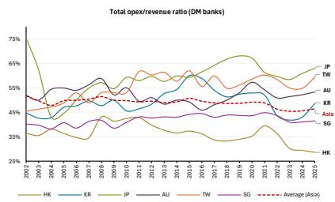

line

| Year | HK    | KR    | JP    | AU    | TW    | SG    | Average (Asia) |
|------|-------|-------|-------|-------|-------|-------|----------------|
| 2002 | 35%   | 45%   | 75%   | 45%   | 45%   | 45%   | 45%            |
| 2003 | 35%   | 45%   | 45%   | 45%   | 45%   | 45%   | 45%            |
| 2004 | 35%   | 45%   | 45%   | 45%   | 45%   | 45%   | 45%            |
| 2005 | 35%   | 45%   | 45%   | 45%   | 45%   | 45%   | 45%            |
| 2006 | 35%   | 45%   | 45%   | 45%   | 45%   | 45%   | 45%            |
| 2007 | 35%   | 45%   | 45%   | 45%   | 45%   | 45%   | 45%            |
| 2008 | 35%   | 45%   | 45%   | 45%   | 45%   | 45%   | 45%            |
| 2009 | 35%   | 45%   | 45%   | 45%   | 45%   | 45%   | 45%            |
| 2010 | 35%   | 45%   | 45%   | 45%   | 45%   | 45%   | 45%            |
| 2011 | 35%   | 45%   | 45%   | 45%   | 45%   | 45%   | 45%            |
| 2012 | 35%   | 45%   | 45%   | 45%   | 45%   | 45%   | 45%            |
| 2013 | 35%   | 45%   | 45%   | 45%   | 45%   | 45%   | 45%            |
| 2014 | 35%   | 45%   | 45%   | 45%   | 45%   | 45%   | 45%            |
| 2015 | 35%   | 45%   | 45%   | 45%   | 45%   | 45%   | 45%            |
| 2016 | 35%   | 45%   | 45%   | 45%   | 45%   | 45%   | 45%            |
| 2017 | 35%   | 45%   | 45%   | 45%   | 45%   | 45%   | 45%            |
| 2018 | 35%   | 45%   | 45%   | 45%   | 45%   | 45%   | 45%            |
| 2019 | 35%   | 45%   | 45%   | 45%   | 45%   | 45%   | 45%            |
| 2020 | 35%   | 45%   | 45%   | 45%   | 45%   | 45%   | 45%            |
| 2021 | 35%   | 45%   | 45%   | 45%   | 45%   | 45%   | 45%            |
| 2022 | 35%   | 45%   | 45%   | 45%   | 45%   | 45%   | 45%            |
| 2023e| -     | -     | -     | -     | -     | -     | -              |
| Total (in %) from left to right (in %) from right to left (in %) from right to left (in %) from left to right (in %) from left to right (in %) from left to right (in %) from left to right (in %) from left to right (in %) from left to right (in %) from left to right (in %) from left to right (in %) from left to right (in %) from left to right (in %) from left to right (in %)

Source: Central banks, Company data, UBS estimates.

# What drive the scores for Singapore banks (1=highest, 5=lowest):

- Tech culture – scores 1 alongside Korea as joint tech leader. DBS is a global benchmark but all three majors have invested in technology and data for over a decade. MAS' frameworks set world-class standards that raise the entire sector floor (Figure 48).   
- Competitive urgency – scores 2 alongside Australia and Thailand. Open economy, digital bank licences and wealth management competition create real, strategic pressure. While less urgent than Korea but more genuinely competitive than other markets where state interference sometimes helps insulate incumbents from existential threat.   
- Efficiency room – scores 4 alongside Korea, Australia, and HK. Among the most efficient in the DM peer group (Figure 16).   
- Labour flexibility – scores 3 alongside Indonesia, Malaysia, Philippines, and Taiwan. Formally a flexible labour market, but fair retrenchment requirements and acute political sensitivity around job losses in a small city-state create real constraints. Better than Japan or India; but more constrained than Korea or Australia where restructuring track records are more clearly established (Figure 49).   
- IT & data infra – scores 1 alongside Korea. MAS guidelines help create best-in-class data governance. Modern core systems at all three majors.

# Korea

- Total opex to assets ratio shows a clear downtrend – the most visible evidence of a genuine restructuring executed since the crisis in the late 90s.   
- This is visible in both the staff and non-staff costs ratio. Staff costs in particular have declined materially driven by large scale branch closures.   
- Non staff costs fell as technology consolidation happened and payments infrastructure investments delivered returns. Given a strong domestic IT ecosystem, Korean banks were able to leverage upon it. The large conglomerates in Korea have very strong relationships with the local tech vendors (e.g Samsung) and this enables the partner banks to get these services at lower than market rates. While the Japanese peers have to pay premium prices to foreign vendors for legacy system maintenance   
- Low but still declining ratio alongside modern IT infra suggest a sense of competitive urgency. Also driven by the likes of Kakaobank launched in 2017 which rapidly captured market share and posed a credible threat to the traditional banks who responded with genuine efficiency driven responses.

Figure 51: Branch Rationalisation   
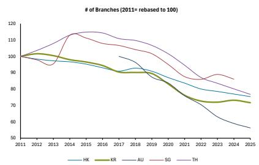

line

| Year | HK   | KR   | AU   | SG   | TH   |
|------|------|------|------|------|------|
| 2011 | 100  | 100  | 100  | 100  | 100  |
| 2012 | 100  | 100  | 100  | 100  | 100  |
| 2013 | 95   | 98   | 98   | 105  | 105  |
| 2014 | 98   | 97   | 97   | 112  | 112  |
| 2015 | 96   | 95   | 95   | 110  | 110  |
| 2016 | 94   | 93   | 93   | 108  | 108  |
| 2017 | 92   | 91   | 91   | 105  | 105  |
| 2018 | 90   | 89   | 89   | 102  | 102  |
| 2019 | 88   | 87   | 87   | 98   | 98   |
| 2020 | 85   | 84   | 84   | 95   | 95   |
| 2021 | 82   | 81   | 81   | 92   | 92   |
| 2022 | 78   | 77   | 77   | 88   | 88   |
| 2023 | 75   | 74   | 74   | 85   | 85   |
| 2024 | 72   | 71   | 71   | 82   | 82   |
| 2025 | 70   | 69   | 69   | 80   | 80   |

Source: Central banks, Company data.

Figure 52: Opex / Revenue   

line

| Year | HK    | KR    | JP    | AU    | TW    | SG    | Average (Asia) |
|------|-------|-------|-------|-------|-------|-------|----------------|
| 2000 | 35%   | 45%   | 75%   | 45%   | 45%   | 45%   | 45%            |
| 2003 | 35%   | 45%   | 45%   | 45%   | 45%   | 45%   | 45%            |
| 2006 | 35%   | 45%   | 45%   | 45%   | 45%   | 45%   | 45%            |
| 2009 | 35%   | 45%   | 45%   | 45%   | 45%   | 45%   | 45%            |
| 2012 | 35%   | 45%   | 45%   | 45%   | 45%   | 45%   | 45%            |
| 2015 | 35%   | 45%   | 45%   | 45%   | 45%   | 45%   | 45%            |
| 2018 | 35%   | 45%   | 45%   | 45%   | 45%   | 45%   | 45%            |
| 2021 | 35%   | 45%   | 45%   | 45%   | 45%   | 45%   | 45%            |
| 2024 | 35%   | 45%   | 45%   | 45%   | 45%   | 45%   | 45%            |

Source: Central banks, Company data, UBS estimates.

Figure 53: Digibank penetration   
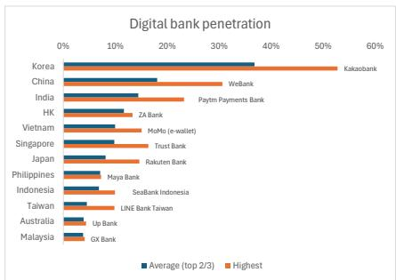

bar

Digital bank penetration
| Country | Average (top 2/3) (%) | Highest (%) |
| :--- | :--- | :--- |
| Korea | 38 | 54 |
| China | 19 | 27 |
| India | 16 | 23 |
| HK | 12 | 10 |
| Vietnam | 10 | 10 |
| Singapore | 8 | 10 |
| Japan | 7 | 10 |
| Philippines | 6 | 10 |
| Indonesia | 6 | 10 |
| Taiwan | 5 | 10 |
| Australia | 4 | 10 |
| Malaysia | 3 | 10 |
Kakazobank
WellBank
Paytm Payments Bank
ZA Bank
MoMo (e-wallet)
Trust Bank
Rakuten Bank
Moya Bank
SeaBank Indonesia
LINE Bank Taiwan

Source: Company data, Worldbank. Traditional banks in Japan. Payment bank in India.

# What drives the scores for Korean banks (1=highest, 5=lowest):

- Tech culture – scores 1 alongside Singapore as joint tech leader. Korea's tech culture was more driven by competitive crisis.   
- Competitive urgency – KakaoBank and Toss present the most credible large-scale neobank disruption across Asia unlike only moderate digital banking pressure in most other Asian markets (Figure 53).   
- Efficiency room – scores 4 alongside Singapore, Australia, and HK as these markets have already made substantial efficiency gains. In Korea, post-1997 restructuring and branch cuts mean ratio have genuinely improved (Figure 52).   
- Labour flexibility – scores 2 alongside Thailand, Vietnam, and HK. Union presence exists but has not prevented aggressive branch closure programs. More flexible than India, China, or Taiwan; but less than Australia which alone gets a score of 1 (Figure 51).   
- IT & data infra – scores 1 alongside Singapore – the cleanest technology legacy in Asia. Again rebuilding of core systems following the 1997 crisis played a role. In Singapore, infrastructure quality is more driven by MAS standards.

# Taiwan

- The only DM market where total opex to assets has been flat to rising sitting at the highest level in the group, and with no meaningful improvement in several years.   
- Non-staff costs mirrors the overall opex trend and is at the highest level in DM Asia, and higher than the Asian average which includes high cost EM markets. This is a reflection of the tech investments costs of the competitive banking system fragmented by 39 banks.   
- Staff costs have also not declined materially, reflecting the avoidance of branch closures and headcount reduction given the risk of losing customer share in a competitive market.   
- High compliance costs and overseas expansion costs add to this pressure.   
- The structural issue of overbanking also led to heavy investments in apps, internet banking and fintech partnerships that often came with high costs but thin margins.   
- Often some costs related to credit cards is booked under opex (e.g. loyalty points redemption). Given intense competition, this can be sizeable esp for banks active in credit card business. This is one reason why SOE banks like Mega/ First have a low non-labour to asset ratio given minimal credit card business.

Figure 54: Opex / Assets   
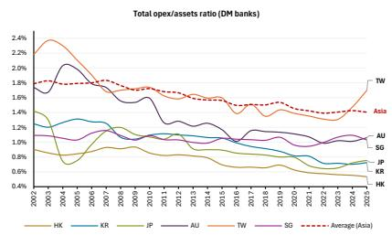  
Source: Central banks, Company data, UBS estimates.

Figure 55: Opex / Revenue   
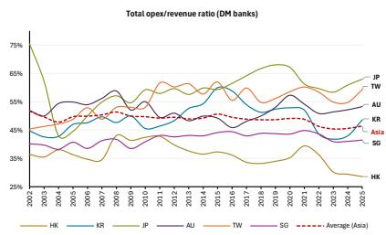

line

| Year | HK   | KR   | JP   | AU   | TW   | SG   | Asia |
|------|------|------|------|------|------|------|------|
| 2001 | 35%  | 45%  | 75%  | 45%  | 45%  | 45%  | 45%  |
| 2002 | 35%  | 45%  | 75%  | 45%  | 45%  | 45%  | 45%  |
| 2003 | 35%  | 45%  | 75%  | 45%  | 45%  | 45%  | 45%  |
| 2004 | 35%  | 45%  | 75%  | 45%  | 45%  | 45%  | 45%  |
| 2005 | 35%  | 45%  | 75%  | 45%  | 45%  | 45%  | 45%  |
| 2006 | 35%  | 45%  | 75%  | 45%  | 45%  | 45%  | 45%  |
| 2007 | 35%  | 45%  | 75%  | 45%  | 45%  | 45%  | 45%  |
| 2008 | 35%  | 45%  | 75%  | 45%  | 45%  | 45%  | 45%  |
| 2009 | 35%  | 45%  | 75%  | 45%  | 45%  | 45%  | 45%  |
| 2010 | 35%  | 45%  | 75%  | 45%  | 45%  | 45%  | 45%  |
| 2011 | 35%  | 45%  | 75%  | 45%  | 45%  | 45%  | 45%  |
| 2012 | 35%  | 45%  | 75%  | 45%  | 45%  | 45%  | 45%  |
| 2013 | 35%  | 45%  | 75%  | 45%  | 45%  | 45%  | 45%  |
| 2014 | 35%  | 45%  | 75%  | 45%  | 45%  | 45%  | 45%  |
| 2015 | 35%  | 45%  | 75%  | 45%  | 45%  | 45%  | 45%  |
| 2016 | 35%  | 45%  | 75%  | 45%  | 45%  | 45%  | -    |
| 2017 | -    | -    | -    | -    | -    | -    | -    |
| 2018 | -    | -    | -    | -    | -    | -    | -    |
| 2019 | -    | -    | -    | -    | -    | -    | -    |
| 2020 | -    | -    | -    | -    | -    | -    | -    |
| 2021 | -    | -    | -    | -    | -    | -    | -    |
| 2022 | -    | -    | -    | -    | -    | -    | -    |
| Average (Asia) |
| HK   |
| JP   |
| TW   |
| AU   |
| TW   |
| SG   |
| Asia |
| Average (Asia) |
| HK   |
| JP   |
| TW   |
| AU   |
| TW   |
| SG   |
| Asia |
| Average (Asia) |
| HK   |
| JP   |
| TW   |
| AU   |
| TW   |
| SG   |
| Asia |
| Average (Asia) |
| HK   |
| JP   |
| TW   |
| AU   |
| TW   |
| SG   |
| Asia<nl>

Source: Central banks, Company data, UBS estimates.

Figure 56: Branches per 100k adults   
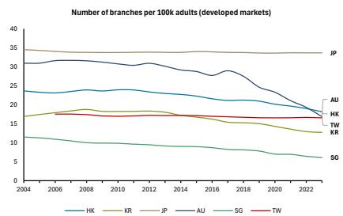

line

| Year | HK   | KR   | JP   | AU   | SG   | TW   |
|------|------|------|------|------|------|------|
| 2004 | 23   | 17   | 35   | 31   | 11   | 17   |
| 2006 | 23   | 18   | 35   | 31   | 10   | 17   |
| 2008 | 23   | 19   | 35   | 31   | 9    | 17   |
| 2010 | 23   | 19   | 35   | 31   | 8    | 17   |
| 2012 | 23   | 19   | 35   | 31   | 7    | 17   |
| 2014 | 22   | 18   | 35   | 30   | 6    | 17   |
| 2016 | 21   | 17   | 35   | 29   | 5    | 17   |
| 2018 | 20   | 16   | 35   | 27   | 4    | 17   |
| 2020 | 19   | 15   | 35   | 24   | 3    | 17   |
| 2022 | 18   | 14   | 35   | 20   | 2    | 17   |

Source: World Bank, FSC Taiwan

# What drives the scores for Taiwan banks (1=highest, 5=lowest):

- Tech culture – scores 4 alongside India and Philippines. Thirty-nine banks means most institutions are sub-scale for serious standalone AI investment. A few larger institutions (CTBC, Fubon) have reasonable capability; the long tail drags the sector average.   
- Competitive urgency – scores 4 – Over-banked with 39 institutions but counter intuitively no existential fintech disruption has emerged. No single digital disruptor is large enough to be existential for any individual incumbent, like in Korea. The competitive risk is more diffused.   
- Efficiency room – scores 2 alongside Indonesia and Japan. Other opex to assets has been rising – unusual in the peer group and a signal of growing inefficiency. More room than China, Vietnam, Malaysia, and Thailand which have achieved some improvement. Less room than India and Philippines (Figure 54).   
- Labour flexibility – scores 3 alongside Indonesia, Malaysia, and Philippines. No lifetime employment norms like Japan. However, some complications arise due to family ownership structures and politics which don't allow for meaningful restructuring (Figure 56).   
- IT & data infra – scores 4 alongside India and Philippines. Fragmented investment across 39 banks means no institution has the scale for comprehensive modernisation. Overseas ASEAN expansion adds to the complexity. Behind Australia and HK, despite being a highly developed economy in all other respects.

# Indonesia

- Total Opex to assets has declined from an elevated level but the ratio remains highest in the EM group alongside the Philippines. This suggests significant room for improvement, but so are the barriers.   
- Staff costs remain most elevated in Asia despite the decline over the last 10-20 years, with India the second highest. Similar financial inclusion pressures for the SOE banks are likely behind this which are structural in nature.   
- Non-staff costs have declined more meaningfully and sit at the third highest in EM after Philippines and Malaysia, but remain elevated given the irreducible nature of physical cost to serve an archipelago.   
- The big four have been investing in technology (e.g. BBRI AI-driven microfinance credit model using alternative data, successful lifestyle apps by BMRI / BBCA) and the opportunity to improve efficiency looks real.

Figure 57: Opex / Assets   
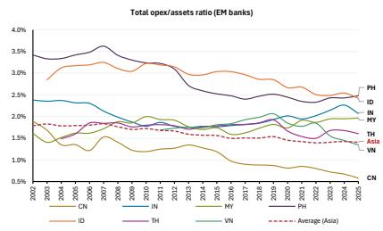  
Source: Central banks, Company data, UBS estimates.

Figure 58: Opex / Revenue   
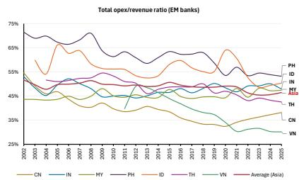

line

| Year | CN   | IN   | MY   | PH   | ID   | TH   | VN   | Average (Asia) |
|------|------|------|------|------|------|------|------|----------------|
| 2000 | 45%  | 45%  | 45%  | 75%  | 55%  | 55%  | 55%  | 55%            |
| 2001 | 45%  | 45%  | 45%  | 75%  | 55%  | 55%  | 55%  | 55%            |
| 2002 | 45%  | 45%  | 45%  | 75%  | 55%  | 55%  | 55%  | 55%            |
| 2003 | 45%  | 45%  | 45%  | 75%  | 55%  | 55%  | 55%  | 55%            |
| 2004 | 45%  | 45%  | 45%  | 75%  | 55%  | 55%  | 55%  | 55%            |
| 2005 | 45%  | 45%  | 45%  | 75%  | 55%  | 55%  | 55%  | 55%            |
| 2006 | 45%  | 45%  | 45%  | 75%  | 55%  | 55%  | 55%  | 55%            |
| 2007 | 45%  | 45%  | 45%  | 75%  | 55%  | 55%  | 55%  | 55%            |
| 2008 | 45%  | 45%  | 45%  | 75%  | 55%  | 55%  | 55%  | 55%            |
| 2009 | 45%  | 45%  | 45%  | 75%  | 55%  | 55%  | 55%  | 55%            |
| 2010 | 45%  | 45%  | 45%  | 75%  | 55%  | 55%  | 55%  | 55%            |
| 2011 | 45%  | 45%  | 45%  | 75%  | 55%  | 55%  | 55%  | 55%            |
| 2012 | 45%  | 45%  | 45%  | 75%  | 55%  | 55%  | 55%  | 55%            |
| 2013 | 45%  | 45%  | 45%  | 75%  | 55%  | 55%  | 55%  | 55%            |
| 2014 | 45%  | 45%  | 45%  | 75%  | 55%  | 55%  | 55%  | 55%            |
| 2015 | 45%  | 45%  | 45%  | 75%  | 55%  | 55%  | 55%  | 55%            |
| 2016 | 45%  | 45%  | 45%  | 75%  | 55%  | 55%  | 55%  | 55%            |
| 2017 | 45%   | 45%   | -    | -    | -    | -    | -    | -              |
| 2018 | -    | -    | -    | -    | -    | -    | -    | -              |
| 2019 | -    | -    | -    | -    | -    | -    | -    | -              |
| 2020 | -    | -    | -    | -    | -    | -    | -    | -              |
| ... (repeated) — PH, ID, TH, VN; Average (Asia)

Source: Central banks, Company data, UBS estimates.

Figure 59: # of Bank branches   
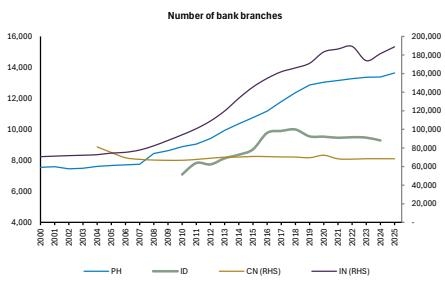

line

| Year | PH    | ID    | CN (RHS) | IN (RHS) |
|------|-------|-------|----------|----------|
| 2010 | 7,500 | 7,500 | 60,000   | 8,000    |
| 2011 | 7,600 | 7,600 | 60,000   | 8,200    |
| 2012 | 7,700 | 7,700 | 60,000   | 8,400    |
| 2013 | 8,000 | 7,800 | 60,000   | 9,000    |
| 2014 | 8,500 | 8,000 | 60,000   | 10,000   |
| 2015 | 9,500 | 9,500 | 60,000   | 11,500   |
| 2016 | 11,000| 10,500| 60,000   | 13,500   |
| 2017 | 12,500| 11,500| 60,000   | 14,500   |
| 2018 | 13,500| 11,500| 60,000   | 15,500   |
| 2019 | 14,500| 11,500| 60,000   | 16,500   |
| 2020 | 15,500| 11,500| 60,000   | 17,500   |
| 2021 | 16,500| 11,500| 60,000   | 18,500   |
| 2022 | 16,500| 11,500| 60,000   | 17,500   |
| 2023 | 16,500| 11,500| 60,000   | 18,500   |
| 2024 | 17,500| 11,500| 60,000   | 19,500   |
| 2025 | 18,500| 11,500| 60,000   | 21,500   |

Source: Central banks, Company data.

# What drives the scores for Indonesia banks (1=highest, 5=lowest):

- Tech culture – scores 3 alongside HK, Vietnam, and Malaysia. OJK is supportive and progressive. Scores in the middle because tech culture is uneven – strong at the Big Four, but not the same for the rest. BRI's AI-driven microfinance credit model using alternative data (satellite, mobile, agricultural) is genuinely innovative and globally unique. Lifestyle digital apps at big banks have delivered impressive results.   
- Competitive urgency – scores 3 alongside many peers. GoPay, OVO, and Dana have created real pressure at the Big Four – more advanced than Malaysia or Taiwan. OJK's digital bank framework adds regulatory urgency.   
- Efficiency room – scores 2 alongside Taiwan and Japan. High opex ratios driven by structural archipelago costs. More addressable room than China, Vietnam, or Malaysia.   
- Labour flexibility – scores 3 alongside Malaysia, Philippines, and Taiwan. State bank employment protection is less rigid than in India or China but not freely restructurable. Private banks and foreign banks are more flexible. Better than India and Japan; more constrained than Korea, Thailand, and Vietnam.   
- IT & data infra – scores 3 alongside Vietnam and Malaysia. BRI and Mandiri have made genuine progress and are deploying AI. The gap between the Big Four and the rest is still quite wide though.

# Malaysia

- Total Opex / Assets has largely remained flat, showing much less improvement than in Thailand and Korea for example. The overall level sits in the middle of the EM group.   
- Staff costs show a very gradual declining trend reflecting moderate labour flexibility and the absence of aggressive branch rationalisation.   
- Non-staff costs show a trend contrary to most other EM peers and has risen in the last few years reflecting the pressure from the dual banking system overhead i.e. running parallel conventional and Islamic windows as Islamic banking has become more prominent and grown at a faster pace than conventional banking.   
- This also reflects the intense competition in the market (which also consistently shows in the fee income pressure) and high tech investments driven by the competition and BNM mandated investments in cyber resilience, cloud migration and real time payments.   
- The trends overall put Malaysia consistently in the middle of the pack in the EM cohort. A unique factor affecting these trends has been the Ringgit depreciation over most of this period that leads to an increase in USD denominated costs like cloud services, software licenses and cybersecurity tools, often priced in USD.

Figure 60: Non staff Opex / Assets   
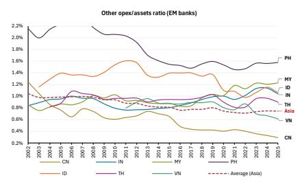  
Source: Central banks, Company data, UBS estimates.

Figure 61: Opex / Revenue   
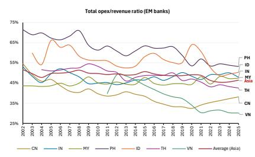

line

| Year | CN   | IN   | MY   | PH   | ID   | TH   | VN   | PH   | ID   | IN   | TH   | VN (Average) |
|------|------|------|------|------|------|------|------|------|------|------|------|--------------|
| 2002 | 45%  | 45%  | 45%  | 75%  | 55%  | 55%  | 55%  | 75%  | 55%  | 55%  | 55%  | 55%          |
| 2003 | 45%  | 45%  | 45%  | 70%  | 60%  | 50%  | 50%  | 70%  | 60%  | 50%  | 50%  | 50%          |
| 2004 | 45%  | 45%  | 45%  | 65%  | 65%  | 45%  | 45%  | 65%  | 65%  | 45%  | 45%  | 45%          |
| 2005 | 45%  | 45%  | 45%  | 60%  | 60%  | 40%  | 40%  | 60%  | 60%  | 40%  | 40%  | 40%          |
| 2006 | 45%  | 45%  | 45%  | 55%  | 55%  | 35%  | 35%  | 55%  | 55%  | 35%  | 35%  | 35%          |
| 2007 | 45%  | 45%  | 45%  | 50%  | 50%  | 30%  | 30%  | 50%  | 50%  | 30%  | 30%  | 30%          |
| 2008 | 45%  | 45%  | 45%  | 45%  | 45%  | 25%  | 25%  | 45%  | 45%  | 25%  | 25%  | 25%          |
| 2009 | 45%  | 45%  | 45%  | 40%  | 40%  | 20%  | 20%  | 40%  | 40%  | 20%  | 20%  | 20%          |
| 2010 | 45%  | 45%  | 45%  | 35%  | 35%  | 15%  | 15%  | 35%  | 35%  | 15%  | 15%  | 15%          |
| 2011 | 45%  | 45%  | 45%  | -    | -    | -    | -    | -    | -    | -    | -    | -            |
| 2012 | -    | -    | -    | -    | -    | -    | -    | -    | -    | -    | -    | -            |
| 2013 | -    | -    | -    | -    | -    | -    | -    | -    | -    | -    | -    | -            |
| 2014 | -    | -    | -    | -    | -    | -    | -    | -    | -    | -    | -    | -            |
| 2015 | -    | -    | -    | -    | -    | -    | -    | -    | -    | -    | -    | -            |
| 2016 | -    | -    | -    | -    | -    | -    | -    | -    | -    | -    | -    | -            |
| 2017 | -    | -    | -    | -    | -    | -    | -    | -    | -    | -    | -    | -            |
| 2018 | -    | -    | -    | -    | -    | -    | -    | -    | -    | -    | -    | -            |
| 2019 | -    | -    | -    | -    | -    | -    | -    | -    | -    | -    | -    | -            |
| 2020a| -    | -    | -    | -    | -    | -    | -    | -    | -    | -    | -    | -            |
| Total (Year)<lcel><lcel><lcel><lcel><lcel><lcel><lcel><lcel><lcel><lcel><lcel><lcel><lcel><lcel><nl>

Source: Central banks, Company data, UBS estimates.

Figure 62: Digital banking penetration   

bar

Digital bank penetration
| Country | Average (top 2/3) (%) | Highest (%) |
| :--- | :--- | :--- |
| Korea | 38 | 54 |
| China | 18 | 19 |
| India | 16 | 23 |
| HK | 12 | 10 |
| Vietnam | 10 | 10 |
| Singapore | 8 | 17 |
| Japan | 7 | 10 |
| Philippines | 6 | 8 |
| Indonesia | 6 | 8 |
| Taiwan | 5 | 7 |
| Australia | 4 | 6 |
| Malaysia | 3 | 6 |
Kakaobank
WeBank
Paytm Payments Bank
ZA Bank
MoHo (e-wallet)
Trust Bank
Rakuten Bank
Maya Bank
SeaBank Indonesia
LINE Bank Taiwan

Source: Company data, Worldbank. Traditional banks in Japan. Payment bank in India.

# What drives the scores for Malaysian banks (1=highest, 5=lowest):

- Tech culture – scores 3 across the board – most consistently middle-of-pack in the group. BNM's Financial Sector Blueprint drives genuine investment and Maybank / CIMB are reasonably advanced. However, dual conventional and Islamic banking creates structural complexity that slows adoption across the sector.   
- Competitive urgency – scores 3 alongside many peers. Five digital bank licences issued, creating some competitive pressure, but no existential threat like KakaoBank scale in Korea.   
- Efficiency room – scores 3 alongside China and Vietnam. Middle of the EM peer group on both cost lines, with the dual banking system overhead being the most specifically addressable inefficiency. Parallel compliance, product development, Shariah audit etc. represent a clear AI opportunity. More room than Thailand; less than India or Philippines.   
- Labour flexibility – scores 3 alongside Indonesia, Philippines, and Taiwan. Moderate overall flexibility. State bank employment has some protection. Restructuring is feasible with adequate political will but less demonstrated in practice than Korea or Australia.   
- IT & data infra – scores 3 alongside Vietnam and Indonesia. Reasonable modernity at Maybank and CIMB. Behind Australia, China, Thailand, and HK; ahead of India, Taiwan, Philippines, and Japan.

# Thailand

- Most impressive efficiency trends in EM Asia. Total Opex to Assets has continued to decline gradually notwithstanding one of the weakest asset growth in EM. This reflects geniune efforts to drive efficiency rather than denominator driven.   
- Staff costs show a similar clear downtrend over the years directly reflecting the aggressive branch rationalisation undertaken by SCB and KBank in the last 10 years.   
- Non-staff costs also declined in parallel more clearly from 2017 onwards after the launch of PromptPay which eliminated cash handling charges and interbank settlement costs. India's UPI, Vietnam's VietQR and Indonesia BI-FAST can also have the same efficiency benefits which appear to be still being absorbed. Thailand saw an earlier and faster adoption.   
- Given the persistent revenue challenges, tech investments appear to be always more targeted at driving efficiency first and building capabilities second.   
- The lack of financial inclusion mandates like in some other Asian peers also helps. Overall given these successes of the past, further room for efficiency gains looks less than ASEAN peers.

Figure 63: # branches per capita   
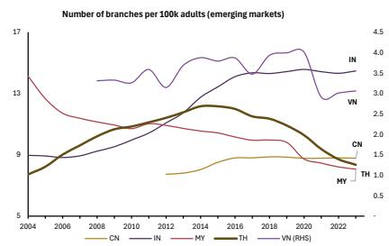

line

| Year | CN  | IN  | MY  | TH  | VN (RHS) |
|------|-----|-----|-----|-----|----------|
| 2004 | 9   | 9   | 13  | 8   | 13       |
| 2006 | 9   | 9   | 12  | 9   | 13       |
| 2008 | 9   | 9   | 11  | 10  | 13       |
| 2010 | 9   | 9   | 10  | 11  | 13       |
| 2012 | 9   | 9   | 9   | 12  | 13       |
| 2014 | 9   | 9   | 8   | 12  | 13       |
| 2016 | 9   | 9   | 7   | 12  | 13       |
| 2018 | 9   | 9   | 6   | 11  | 13       |
| 2020 | 9   | 9   | 5   | 10  | 13       |
| 2022 | 9   | 9   | 4   | 9   | 13       |

Source: World Bank

Figure 64: # of branches   
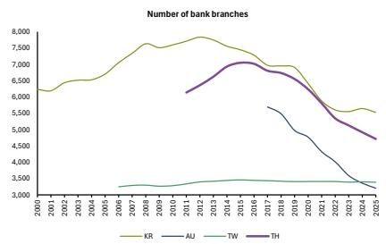

line

| Year | KR   | AU   | TW   | TH   |
|------|------|------|------|------|
| 2000 | 6000 | -    | -    | -    |
| 2001 | 6200 | -    | -    | -    |
| 2002 | 6300 | -    | -    | -    |
| 2003 | 6400 | -    | -    | -    |
| 2004 | 6500 | -    | -    | -    |
| 2005 | 6600 | -    | -    | -    |
| 2006 | 6800 | -    | -    | -    |
| 2007 | 7000 | -    | -    | -    |
| 2008 | 7200 | -    | -    | -    |
| 2009 | 7300 | -    | -    | -    |
| 2010 | 7400 | -    | -    | -    |
| 2011 | 7500 | -    | -    | -    |
| 2012 | 7600 | -    | -    | 6000 |
| 2013 | 7500 | -    | -    | 6500 |
| 2014 | 7400 | -    | -    | 7000 |
| 2015 | 7300 | -    | -    | 7200 |
| 2016 | 7200 | -    | -    | 7100 |
| 2017 | 7100 | 5500 | -    | 6800 |
| 2018 | 7000 | 5200 | -    | 6500 |
| 2019 | 6900 | 4800 | -    | 6200 |
| 2020 | 6800 | 4500 | -    | 5800 |
| 2021 | 6700 | 4200 | -    | 5500 |
| 2022 | 6600 | 3800 | -    | 5200 |
| 2023 | 6500 | 3500 | -    | 4800 |
| 2024E| 6400 | 3300 | -    | 4500 |
| 2025E| 6300 | 3100 | -    | 4300 |

Source: Central banks, Company data

Figure 65: AI references in annual reports   
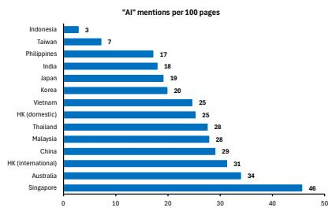

bar

"AI" mentions per 100 pages
| Country/Region | "AI" mentions per 100 pages |
| :--- | :--- |
| Indonesia | 3 |
| Taiwan | 7 |
| Philippines | 17 |
| India | 18 |
| Japan | 19 |
| Korea | 20 |
| Vietnam | 25 |
| HK (domestic) | 25 |
| Thailand | 28 |
| Malaysia | 28 |
| China | 29 |
| HK (international) | 31 |
| Australia | 34 |
| Singapore | 46 |

Source: Company data, UBS.

# What drives the scores for Thailand banks (1=highest, 5=lowest):

- Tech culture – scores 2 alongside Australia and China. KBTG and SCB X are genuine tech-first transformations and have explicit productivity-first mandates — technology investments measured by cost removed not features delivered.   
- Competitive urgency – scores 2 alongside Australia and Singapore. More urgent than China (where state ownership helps) but less acute than Korea where neobanks have already gained a significant market share.   
- Efficiency room – scores 4 alongside Korea, Singapore, Australia, and Hong Kong. Thailand is the third lowest opex to assets in EM Asia, achieved through deliberate restructuring against genuinely weak asset growth. No denominator effect (like Vietnam), no state cost-sharing (like in China). This success leaves it with the least remaining efficiency room of any EM market.   
- Labour flexibility – scores 2 alongside Korea, Vietnam, and HK — among the more flexible in Asia. Significant branch reductions executed over a decade without political paralysis is clear evidence.   
- IT & data infra – scores 2 alongside Australia, China, and HK. Behind Korea and Singapore at the sector level as provincial banks look less advanced. Large bank infrastructure is among the best in EM Asia further helped by PromptPay's wide adoption that creates a shared, modern payment data layer.

# Philippines

- Total opex to assets sits close to the highest level in Asia, next to Indonesia, and the trend looks largely flat over the last decade or so.   
- Staff costs also look elevated not showing any material decline over the years, reflecting the BPO sector competition driving upward pressure on banking wages as well as BSP financial inclusion mandates.   
- Non-staff costs are the highest in the group and materially above the peer group. This reflects what are likely structurally irreducible costs to physically serve a widely dispersed population across multiple islands, and typhoon related infra backups. Heavy compliance burden is also often cited by banks as one reason.   
- While the big three have the scale and have been investing in technology partly in response to the competitive threat from the new digital banks, the progress and adoption has been slow. These trends suggest plenty of room for efficiency improvement alongside India (more for PSUs than private banks).

Figure 66: Number of banks branches   
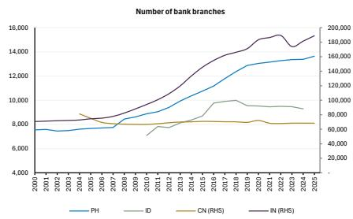

line

| Year | PH    | ID    | CN (RHS) | IN (RHS) |
|------|-------|-------|----------|----------|
| 2000 | 7,500 | 7,500 | 8,000    | 8,000    |
| 2001 | 7,600 | 7,600 | 8,100    | 8,100    |
| 2002 | 7,700 | 7,700 | 8,200    | 8,200    |
| 2003 | 7,800 | 7,800 | 8,300    | 8,300    |
| 2004 | 7,900 | 7,900 | 8,400    | 8,400    |
| 2005 | 8,000 | 8,000 | 8,500    | 8,500    |
| 2006 | 8,100 | 8,100 | 8,600    | 8,600    |
| 2007 | 8,200 | 8,200 | 8,700    | 8,700    |
| 2008 | 8,300 | 8,300 | 8,800    | 8,800    |
| 2009 | 8,400 | 8,400 | 8,900    | 8,900    |
| 2010 | 8,500 | 8,500 | 9,000    | 9,000    |
| 2011 | 8,600 | 8,600 | 9,100    | 9,100    |
| 2012 | 8,700 | 8,700 | 9,200    | 9,200    |
| 2013 | 8,800 | 8,800 | 9,300    | 9,300    |
| 2014 | 8,900 | 8,900 | 9,400    | 9,400    |
| 2015 | 9,000 | 9,000 | 9,500    | 9,500    |
| 2016 | 9,100 | 9,100 | 9,600    | 9,600    |
| 2017 | 9,200 | 9,200 | 9,700    | 9,700    |
| 2018 | 9,300 | 9,300 | 9,800    | 9,800    |
| 2019 | 9,400 | 9,400 | 9,900    | 9,900    |
| 2020 | 9,500 | 9,500 | 10,000   | 10,155   |
| 2021 | 9,600 | 9,600 | 10,155   | 11,355   |
| 2022 | 9,700 | 9,700 | 11,355   | 12,355   |
| 2023 | 9,800 | 9,800 | 12,355   | 13,355   |
| 2024 | 9,900 | 9,900 | 13,355   | 14,355   |
| 2025 | 13,555 | 9,455 | 13,355   | 15,355   |

Source: Central banks, Company data

Figure 67: Opex / Assets   
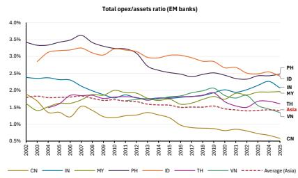

line

| Year | CN    | IN    | MY    | PH    | ID    | TH    | VN    | VN (Average Asia) |
|------|-------|-------|-------|-------|-------|-------|-------|-------------------|
| 2000 | 1.5%  | 2.5%  | 1.5%  | 3.5%  | 3.0%  | 1.5%  | 1.5%  | 1.5%              |
| 2003 | 1.5%  | 2.5%  | 1.5%  | 3.5%  | 3.0%  | 1.5%  | 1.5%  | 1.5%              |
| 2006 | 1.5%  | 2.5%  | 1.5%  | 3.5%  | 3.0%  | 1.5%  | 1.5%  | 1.5%              |
| 2009 | 1.5%  | 2.5%  | 1.5%  | 3.5%  | 3.0%  | 1.5%  | 1.5%  | 1.5%              |
| 2012 | 1.5%  | 2.5%  | 1.5%  | 3.5%  | 3.0%  | 1.5%  | 1.5%  | 1.5%              |
| 2015 | 1.5%  | 2.5%  | 1.5%  | 3.0%  | 3.0%  | 1.5%  | 1.5%  | 1.5%              |
| 2018 | 1.5%  | 2.5%  | 1.5%  | 3.0%  | 3.0%  | 1.5%  | 1.5%  | 1.5%              |
| 2021 | 1.5%  | 2.5%  | 1.5%  | 3.0%  | 3.0%  | 1.5%  | 1.5%  | 1.5%              |
| 2024 | 1.5%  | 2.5%  | 1.5%  | 3.0%  | 3.0%  | 1.5%  | 1.5%  | 1.5%              |
| Average (Asia) - PH - ID - MY - TH - VN - VN - CN - Average (Asia) - PH - ID - TH - VN - VN - CN - CN - Average (Asia) - Average (Asia) - Average (Asia) - Average (Asia) - Average (Asia) - Average (Asia) - Average (Asia) - Average (Asia) - Average (Asia) - Average (Asia) - Average (Asia) - Average (Asia) - Average (Asia) - Average (Asia) - Average (Asia) - Average (Asia) - Average (Asia) - Average (Asia) - Average (Asia) - Average (Asia) - Average (Asia)

Source: Central banks, Company data, UBS estimates.

Figure 68: Opex / Revenue   
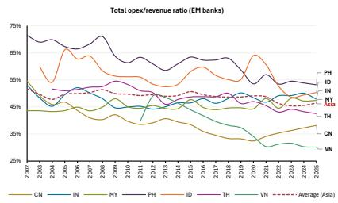  
Source: Central banks, Company data, UBS estimates.

# What drives the scores for Philippines banks (1=highest, 5=lowest):

- Tech culture – scores 4 alongside India and Taiwan. Universal banks (BDO, BPI, Metrobank) are increasingly investing and BSP is one of the more progressive ASEAN regulators. Sector fragmentation (hundreds of rural, thrift, cooperative banks) prevents aggregate investment at scale. Similar ranking as India but without India Stack.   
- Competitive urgency – scores 3 alongside many peers. Six digital bank licences (Tonik, Maya, UNObank) are creating some competitive pressure. However, the financial inclusion mandate still driving physical network expansion – partially offsetting efficiency urgency.   
- Efficiency room – scores 1 alongside India – highest non-staff costs in EM Asia and staff costs second highest, with no improvement visible despite years of investment. A portion of inefficiency might be structural - inter-island cash logistics, typhoon and disaster infrastructure - costs that AI cannot remove.   
- Labour flexibility - scores 3 alongside Indonesia, Malaysia, and Taiwan. No lifetime employment norm. But BPO competition drives up banking wages, limiting the savings AI would otherwise generate through reduced headcount. Social sensitivity around visible bank job cuts in a market with high underemployment adds political friction. Overall moderate – better than India, China or Japan.   
- IT & data infra – scores 4 alongside India and Taiwan. Lacking clean integrated infrastructure – tech investments have been rising but still look early. BSP's open finance framework is improving the data layer but from a weak starting point.

# Vietnam

- Second lowest opex to assets in the EM group but this is more a denominator story than genuine efficiency improvements. Vietnam has been the only market in Asia where banking system assets have consistently grown at a double digit pace in the last few years, well above most EM peers.   
- Non-staff costs are remarkably low and second only to China in the EM group. This partly reflects the challenges of SOE ownership and lack of significant tech investments for the sector overall. Some private banks like TCB stand out though. The recent decline continues to be largely a denominator story.   
- Staff costs are also one of the lowest in the EM group and reflect the very low level of banking sector wages.   
- A challenge for the market in future to drive further efficiency gains remains the quality of the data - Vietnam lacks the digital ID or data sharing frameworks that Indonesia and India have. The national credit bureau (CIC) coverage is also limited.

Figure 69: Opex / Assets   
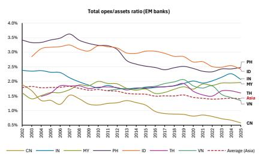

line

| Year | CN    | IN    | MY    | PH    | ID    | TH    | VN    | PH    | IN    | MY    | TH    | VN (Average) |
|------|-------|-------|-------|-------|-------|-------|-------|-------|-------|-------|-------|--------------|
| 2000 | 1.5%  | 2.5%  | 1.8%  | 3.5%  | 2.8%  | 1.7%  | 1.6%  | 3.5%  | 2.5%  | 1.8%  | 1.7%  | 1.8%         |
| 2003 | 1.4%  | 2.4%  | 1.7%  | 3.4%  | 2.7%  | 1.6%  | 1.5%  | 3.4%  | 2.4%  | 1.7%  | 1.6%  | 1.7%         |
| 2006 | 1.3%  | 2.3%  | 1.6%  | 3.3%  | 2.6%  | 1.5%  | 1.4%  | 3.3%  | 2.3%  | 1.6%  | 1.5%  | 1.6%         |
| 2009 | 1.2%  | 2.2%  | 1.5%  | 3.2%  | 2.5%  | 1.4%  | 1.3%  | 3.2%  | 2.2%  | 1.5%  | 1.4%  | 1.5%         |
| 2012 | 1.1%  | 2.1%  | 1.4%  | 3.1%  | 2.4%  | 1.3%  | 1.2%  | 3.1%  | 2.1%  | 1.4%  | 1.3%  | 1.4%         |
| 2015 | 1.0%  | 2.0%  | 1.3%  | 3.0%  | 2.3%  | 1.2%  | 1.1%  | 3.0%  | 2.0%  | 1.3%  | 1.2%  | 1.3%         |
| 2018 | 0.9%  | 1.9%  | 1.2%  | 2.9%  | 2.2%  | 1.1%  | 1.0%  | 2.9%  | 1.9%  | 1.2%  | 1.1%  | 1.2%         |
| 2021 | 0.8%  | 1.8%  | 1.1%  | 2.8%  | 2.1%  | 1.0%  | 0.9%  | 2.8%  | 1.8%  | 1.1%  | 1.0%  | 1.1%         |
| 2024 | 0.7%  | 1.7%  | 1.0%  | 2.7%  | 2.0%  | -0.1% | -0.2% | -2.7% | -0.7% | -0.3% | -0.4% | -0.3%        |
| Average (Asta) - PH, IN, MY, TH, VN - Average (Asta) - PH, IN, MY, TH, VN - Average (Asta) - CN, CN

Source: Central banks, Company data, UBS estimates.

Figure 70: Opex / Revenue   
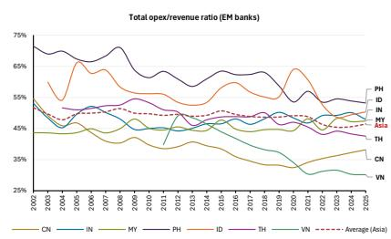

line

| Year | CN   | IN   | MY   | PH   | ID   | TH   | VN   | Average Asia |
|------|------|------|------|------|------|------|------|--------------|
| 2000 | 45%  | 45%  | 45%  | 65%  | 55%  | 55%  | 55%  | 55%          |
| 2004 | 45%  | 45%  | 45%  | 60%  | 50%  | 50%  | 50%  | 50%          |
| 2008 | 45%  | 45%  | 45%  | 65%  | 55%  | 55%  | 55%  | 55%          |
| 2012 | 45%  | 45%  | 45%  | 60%  | 50%  | 50%  | 50%  | 50%          |
| 2016 | 45%  | 45%  | 45%  | 65%  | 55%  | 55%  | 55%  | 55%          |
| 2020 | 45%  | 45%  | 45%  | 60%  | 50%  | 50%  | 50%  | 50%          |
| 2023 | 45%  | 45%  | 45%  | 65%  | 55%  | 55%  | 55%  | 55%          |
| Average Asia | -    | -    | -    | -    | -    | -    | -    | -            |

Source: Central banks, Company data, UBS estimates.

Figure 71: AI references in AR   
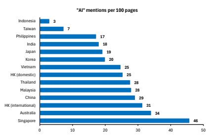

bar

"AI" mentions per 100 pages
| Country/Region | "AI" mentions per 100 pages |
| :--- | :--- |
| Indonesia | 3 |
| Taiwan | 7 |
| Philippines | 17 |
| India | 18 |
| Japan | 19 |
| Korea | 20 |
| Vietnam | 25 |
| HK (domestic) | 25 |
| Thailand | 28 |
| Malaysia | 28 |
| China | 29 |
| HK (international) | 31 |
| Australia | 34 |
| Singapore | 46 |

Source: Company data, UBS

# What drives the scores for Vietnam banks (1=highest, 5=lowest):

- Tech culture – scores 3 alongside HK, Indonesia, and Malaysia. Techcombank is a standout that rivals regional leaders on certain dimensions. However, state banks control majority of system assets and still appear behind. Customer-facing digital adoption is fast but back-end infrastructure and data architecture lags.   
- Competitive urgency – scores 3 alongside many peers. SBV is cautiously opening the market. MoMo, ZaloPay and a growing fintech ecosystem create pressure on private banks but net sector urgency is moderate: higher for private banks like Techcombank but lower for SOEs.   
- Efficiency room – scores 3 alongside China and Malaysia. Ratios look efficient but this is to a large extent a denominator story - fast asset growth - and low absolute wages. More real addressable inefficiency than Thailand or Korea; less than India, Philippines, or Indonesia.   
- Labour flexibility – scores 2 alongside Korea, Thailand, and HK. Private banks can restructure relatively freely – no lifetime employment norms and wages are not politically protected in banking. State banks are more constrained but considerably less so than their peers in India or China. Among the more flexible EM markets, ranking higher than Indonesia and Malaysia on the scorecard.   
- IT & data infra – scores 3 alongside Indonesia and Malaysia. Techcombank (and some SOEs like VCB) are improving materially. Most state banks however still seem to operate on first-generation core banking systems. Data coverage and quality sourced through the national bureau is limited.

# Which banks look better positioned in each market?

Having identified the relative AI readiness of each market above, the scatter plot below shows the opex trends for the leading banks in each market. It helps to identify the banks with a better track record of driving efficiency gains in each market. Banks on the bottom left quartile (coloured in green) showed more improvement in opex metrics vs. the banks on the top right quartile (coloured in red).

# Noteworthy observations –

- Singapore – While overall banks have seen limited improvements in total opex/ assets ratio over the last 10y. Owing to the rise in WM of share of revenue makes opex / income a more relevant metric. The other factors have been the need to invest back productivity gains and limited labour flexibility. Within the sector, DBS stands out and has seen the largest decline in total opex/revenue ratio relative to peers benefitting from the revenue tailwind from the rapid growth in the WM segment.   
- Thailand – There is an interesting divergence in total opex/ assets ratio performance among the banks with KBANK and KTB seeing a decline while SCBX and BBL seeing an increase over the last 10y. Not only that, on a total opex/revenue basis, KBANK and KTB have managed to keep the ratio flat to slightly lower over the last 10y, while this ratio increased for SCBX and BBL.   
- Indonesia – BBRI stands out among the banks as the only one that saw an increase in the total opex/ assets ratio over the last 10y, while BCA, BMRI, and BBNI have seen a decline. BCA is the only bank that saw a meaningful decline in the total opex/revenue ratio, while the ratio was generally flat for peers.   
- Malaysia – an interesting contrast between CIMB and Public Bank. CIMB improved both the total opex/assets and total opex/revenue ratio over the last 10y, while both ratio increased for Public Bank. Public Bank has historically had the best opex ratio (ie. lowest) in the sector with more limited room for further efficiency improvement.   
- India – an interesting contrast between Kotak, HDFCB, ICICI and Axis. Kotak and HDFCB improved both the total opex/assets and total opex/revenue ratio over the last 10y, while both ratio increased for ICICI and Axis over the same period.   
- Australia – NAB stands out as the only big bank in Australia to have improved both the total opex/assets and total opex/revenue ratio over the last 10y. While peers (ANZ, CBA, Westpac) also saw improvements in total opex/assets ratio, total opex/revenue ratio was stable to higher for them over the last 10y.

Figure 72: Scoring individual banks to identify relative opportunities   
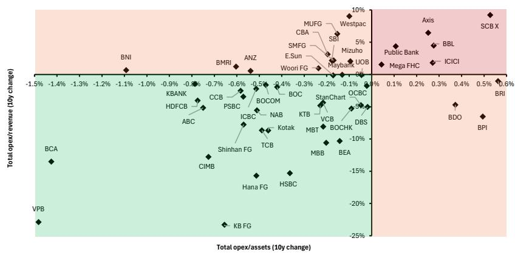

scatter

| Entity | Total opex/revenue (10y change) | Total opex/ assets (10y change) |
| :--- | :--- | :--- |
| BBI | 0.6 | 0.4 |
| BDO | 0.35 | 0.4 |
| BPI | 0.5 | 0.2 |
| SCB X | 0.55 | 0.5 |
| BNI | -1.1 | -1.1 |
| BCA | -1.7 | -1.8 |
| KB FG | -2.2 | -2.3 |
| HBCB | -0.9 | -0.8 |
| ABC | -0.8 | -0.8 |
| KBNK | -0.9 | -0.8 |
| HDFCB | -0.8 | -0.8 |
| CBK | -0.7 | -0.7 |
| BMRI | -0.6 | -0.6 |
| ANZ | -0.4 | -0.4 |
| PSBC | -0.6 | -0.6 |
| BCOM | -0.5 | -0.5 |
| ICBC | -0.5 | -0.5 |
| NAB | -0.4 | -0.4 |
| KOTAK | -0.4 | -0.4 |
| TCB | -0.4 | -0.4 |
| Shinhan FG | -0.3 | -0.3 |
| CMB | -0.3 | -0.3 |
| Hana FG | -0.3 | -0.3 |
| HSBC | -0.3 | -0.3 |
| MUFG | -0.2 | -0.2 |
| SMFG | -0.2 | -0.2 |
| E.Sun | -0.2 | -0.2 |
| Woori FG | -0.2 | -0.2 |
| UOB | -0.1 | -0.1 |
| Maybank | -0.1 | -0.1 |
| UOB | 0.1 | 0.1 |
| Westpac | 0.1 | 0.1 |
| SBI | 0.1 | 0.1 |
| CBA | 0.1 | 0.1 |
| BBL | 0.3 | 0.3 |
| Mizuho | 0.3 | 0.3 |
| MBT | 0.2 | 0.2 |
| BEA | 0.2 | 0.2 |
| StanChart | 0.2 | 0.2 |
| OCBC | 0.2 | 0.2 |
| DBS | 0.2 | 0.2 |
| VCB | 0.2 | 0.2 |
| MBB | 0.2 | 0.2 |
| BoCHK | 0.2 | 0.2 |
| KTB | 0.2 | 0.2 |
| BOCOCCNCHCICICICICICICICICICICICICICICICICICICICICICICICICICICICICICICICICICICICICICICICICICICICICICICICICICICICICICICICICICICICICICICICICICICICICICICICICICICICICICICICICICICICICICICICICICICICICICICICICICICICIC<fcel>-15% to -15% to -15% to -15% to -15% to -15% to -15% to -15% to -15% to -15% to -15% to -15% to -15% to -15% to -15% to -15% to -15% to -15% to -15% to -15% to -15% to the right side of the chart; the right side is also labeled "Mega FHC" and "Public Bank". The left side is also labeled "SCB X" and "Axis". The right side is also labeled "SCB X" and "SCB X", but it is not explicitly labeled in the image.

Source: Company data, UBS

y-axis shows the 10y change in total opex/revenue ratio, while the x-axis shows the 10y change in total opex/ assets ratio for the big banks across Asia.

Figure 73: Screen of most AI-ready bank in each market in Asia 

<table><tr><td>Ticker</td><td>Most Al-ready</td><td>Market</td><td>Rating</td><td>PT (LC)</td><td>Share price (LC)</td><td>Upside (%)</td><td>Fwd P/E (cons)</td><td>Fwd P/B (cons)</td><td>Fwd div yld (cons)</td><td>Fwd ROE (cons)</td></tr><tr><td>DBSM.SI</td><td>DBS</td><td>SG</td><td>Neutral</td><td>58.00</td><td>60.20</td><td>-4%</td><td>14.9</td><td>2.4</td><td>6%</td><td>16%</td></tr><tr><td>CBA.AX</td><td>CBA</td><td>AU</td><td>Sell</td><td>130.0</td><td>159.4</td><td>-18%</td><td>23.6</td><td>3.3</td><td>3%</td><td>14%</td></tr><tr><td>KBANK.BK</td><td>KBANK</td><td>TH</td><td>Buy</td><td>218.0</td><td>196.5</td><td>11%</td><td>9.7</td><td>0.8</td><td>7%</td><td>8%</td></tr><tr><td>600036.SS</td><td>CMB</td><td>CN</td><td>Buy</td><td>53.0</td><td>37.5</td><td>41%</td><td>6.1</td><td>0.7</td><td>5%</td><td>12%</td></tr><tr><td>STAN.L</td><td>StanChart</td><td>HK</td><td>Buy</td><td>2,130</td><td>1,889</td><td>13%</td><td>10.3</td><td>1.1</td><td>3%</td><td>11%</td></tr><tr><td>HSBA.L</td><td>HSBC</td><td>HK</td><td>Neutral</td><td>1,425</td><td>1,324</td><td>8%</td><td>10.1</td><td>1.6</td><td>5%</td><td>16%</td></tr><tr><td>TCB.HM</td><td>TCB</td><td>VN</td><td>Buy</td><td>45,000</td><td>34,050</td><td>32%</td><td>7.5</td><td>1.2</td><td>3%</td><td>16%</td></tr><tr><td>BMRI.JK</td><td>BMRI</td><td>ID</td><td>Buy</td><td>7,250</td><td>4,200</td><td>73%</td><td>6.7</td><td>1.2</td><td>10%</td><td>18%</td></tr><tr><td>CIMB.KL</td><td>CIMB</td><td>MY</td><td>Buy</td><td>9.50</td><td>7.88</td><td>21%</td><td>10.0</td><td>1.1</td><td>6%</td><td>11%</td></tr><tr><td>BPI.PS</td><td>BPI</td><td>PH</td><td>Buy</td><td>150.0</td><td>89.3</td><td>68%</td><td>6.8</td><td>0.9</td><td>6%</td><td>13%</td></tr><tr><td>HDBK.BO</td><td>HDFCB</td><td>IN</td><td>Buy</td><td>1,175</td><td>768</td><td>53%</td><td>13.7</td><td>1.9</td><td>2%</td><td>14%</td></tr><tr><td>2884.TW</td><td>E.Sun</td><td>TW</td><td>Buy</td><td>37.0</td><td>31.7</td><td>17%</td><td>13.2</td><td>1.7</td><td>5%</td><td>13%</td></tr><tr><td>8306.T</td><td>MUFG</td><td>JP</td><td>Buy</td><td>3,400</td><td>2,929</td><td>16%</td><td>13.1</td><td>1.5</td><td>3%</td><td>11%</td></tr><tr><td>105560.KS</td><td>KB FG</td><td>KR</td><td>Not Rated</td><td></td><td>153,000</td><td></td><td>8.5</td><td>0.9</td><td>3%</td><td>11%</td></tr></table>

Source: Datastream, UBS. Prices as of 15 May 2026. Note: Based on UBS analyst views in their respective markets. In Korea this is based on the historical performance of opex changes in Fig 72 above.

# Are markets pricing in the AI-driven efficiencies?

Is the market starting to price in some of these differences in AI readiness among Asian banks? Or do investors remain sceptical over execution and timing. AI readiness don't appear to be a part of the investment debates for most Asian banks yet and as a result the findings below look quite intriguing. We don't think its the AI benefits that are starting to get priced in yet. Its more the "safety trade" that has explained the performance of banks since last year. But we believe with an AI optionality on top, which means that even if the macro shifts and the safety trade winners looks less attractive, but if AI delivers, the outperformance of the winners could still continue.

We compare the historical relationship between P/B valuations and ROE for the top 5 and bottom 5 markets identified in the AI readiness scorecard above. In figure 37 the grey dots represent the monthly datapoints for relative PB to relative ROE relationship over the last two decades (post GFC) and seem to fit in straight line, as would be expected.

The most recent values are shown by the red and green dots. The green dots represent the most recently 12 months, and the red dots the 12m prior. The breakout from this historical pattern, the latest green dot is at a 35% premium to its fair value spot on the trend line, suggesting that the market has already started to pay a significant premium for the most AI ready markets.

Interestingly these five markets also sit atop of the "safety trade" scorecard (i.e. FX stability + high dividend yield) that as we have discussed at length in the past helps explain the performance of Asian banks and the difference between the outperformers vs underperformers since the beginning of last year. See these notes for some of that discussion –

• Asian Banks "2026: Déjà vu or Déjà new?"   
- Singapore Banks "Will a preference for "safety" & outperformance contin..."

Is the market making a prescient call on AI readiness or is this the safety trade in disguise? This is a debate at best.

Nevertheless, in either case banks need to deliver on these efficiency gains for this to sustain. The safety trade could fade over the medium term and for this valuation gap to sustain the promises of efficiency gains through AI will need to be delivered on. On the other hand, if this is AI readiness being already priced in (not our base case), the promise needs to be delivered.

Figure 74: Top 5 vs bottom 5 markets – relative P/B and ROE   
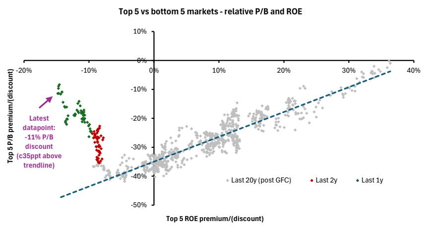

scatter

| Time Period | Top 5 ROE premium/(discount) | Top 5 P/B premium/(discount) |
|-------------|------------------------------|------------------------------|
| Last 2y     | -11%                         | -11%                         |
| Last 1y     | -11%                         | -11%                         |

Source: Datastream, UBS. Prices as of 15 May 2026.

Top 5 markets as identified in our AI readiness scorecard is trading at a narrower P/B discount of 11%, compared to historical trend of around 45% discount for a similar ROE differential.

Even more intriguing is the stock-level valuation premium observed between the most AI-ready banks and the less well prepared. These names were identified by respective UBS analysts across the top five markets and bottom markets.

Historically, these more AI ready banks traded at roughly a 10% P/B discount for a similar ROE differential. Today the valuation premium of this group of the most AI ready banks in the top 5 markets vs. less well prepared in the bottom 5 is around 40%. Again, just like in the case of cross market premium discussed above, this can be prescient market call or simply a coincidence. We don't think it is the AI benefits being priced in. The promise of higher efficiency, that technology did not deliver on in the last decade, needs to be fulfilled though for this valuation to sustain.

Figure 75: Top 5 vs bottom 5 stocks – relative P/B and ROE   
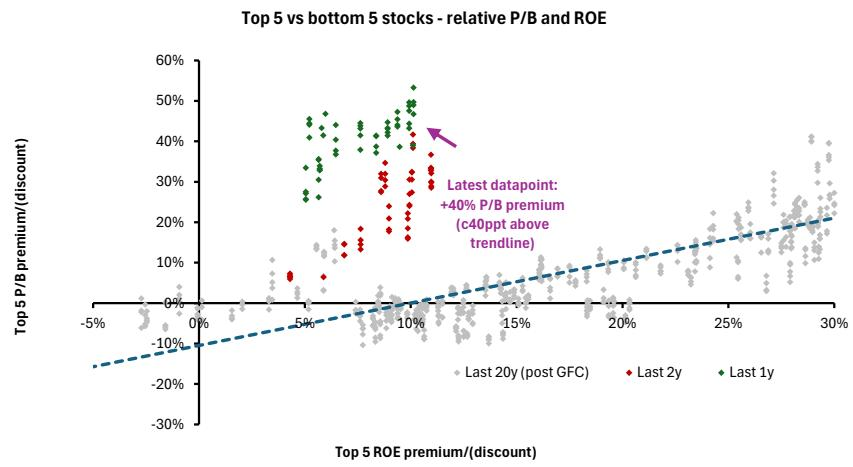

scatter

| Top 5 ROE premium/(discount) | Top 5 P/B premium/(discount) | Category        |
| ---------------------------- | ----------------------------- | --------------- |
| ~-5%                         | ~0%                           | Last 20y (post GFC) |
| ~-5%                         | ~0%                           | Last 2y         |
| ~-5%                         | ~0%                           | Last 1y         |
| ~5%                          | ~0%                           | Last 2y         |
| ~5%                          | ~0%                           | Last 1y         |
| ~10%                         | ~0%                           | Last 2y         |
| ~10%                         | ~0%                           | Last 1y         |
| ~15%                         | ~0%                           | Last 2y         |
| ~15%                         | ~0%                           | Last 1y         |
| ~20%                         | ~0%                           | Last 2y         |
| ~20%                         | ~0%                           | Last 1y         |
| ~25%                         | ~0%                           | Last 2y         |
| ~25%                         | ~0%                           | Last 1y         |
| ~30%                         | ~0%                           | Last 2y         |
| ~30%                         | ~0%                           | Last 1y         |

Source: Datastream, UBS. Prices as of 15 May 2026.

Aside from these cases, where one could argue that the market is starting to price in some AI benefits, we also note two cases where there are no signs of any such premium / discount being priced at the moment.

First at the broad market level, both for the MSCI World Banks Index and MSCI Asia Banks Index, Figures 76 and 77 below shows the current PB/ROE data points in the context of the last two decades. The data doesn't suggest any meaningful deviation from the long term trend, and thus no apparent signs of any AI premium or discount being priced.

Top 5 stocks across the top five markets are currently trading at a c40% P/B premium to Al laggards in the bottom five markets.

Historically, these leaders would have traded at no discount for a similar ROE differential.

Figure 76: MSCI World banks – P/B vs ROE   
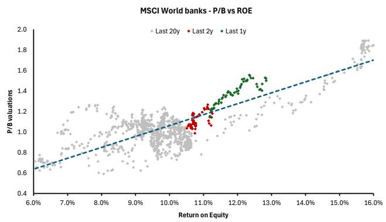

scatter

| Return on Equity | P/B valuations | Period     |
| ---------------- | --------------- | ---------- |
| 6.0%             | 0.7             | Last 20y   |
| 7.0%             | 0.8             | Last 20y   |
| 8.0%             | 0.9             | Last 20y   |
| 9.0%             | 1.0             | Last 20y   |
| 10.0%            | 1.1             | Last 20y   |
| 11.0%            | 1.2             | Last 2y    |
| 12.0%            | 1.3             | Last 1y    |
| 13.0%            | 1.4             | Last 1y    |
| 14.0%            | 1.5             | Last 1y    |
| 15.0%            | 1.6             | Last 1y    |
| 16.0%            | 1.7             | Last 1y    |

Source: MSCI

Figure 77: MSCI Asia banks – P/B vs ROE   
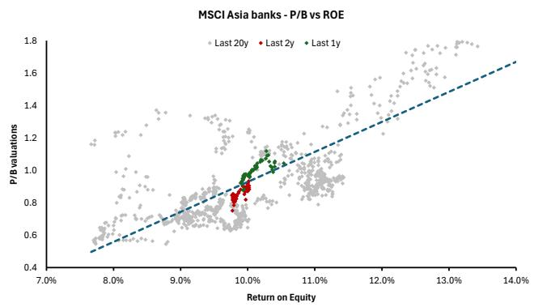

scatter

| Return on Equity | P/B valuations | Period     |
| ---------------- | --------------- | ---------- |
| ~9.5%            | ~0.8            | Last 2y    |
| ~10.0%           | ~0.9            | Last 2y    |
| ~10.5%           | ~1.0            | Last 1y    |
| ~10.5%           | ~1.1            | Last 1y    |

Source: MSCI

Similarly as we discussed above in the India section, there seems to be a gap in the AI-readiness of SOE banks in India vs the private peers, given the level of tech adoption so far and other constraints like labour flexibility. Across some other Asian markets e.g. China, Indonesia and Vietnam – SOE banks have also invested heavily in technology keeping pace with private-sector peers. As a result, relative valuations should not be expected to be pricing in any material AI benefits for either group on a relative basis. India appears to be an exception. Is the market pricing any of this?

Figure 79 below shows the PB/ROE relationship for India SOE banks vs private banks. Contrary to what would be expected, India SOE banks are now trading at a premium to the historical relationship vs. the private banks (i.e. still a discount but much narrower vs the past).

In Vietnam, the contrast in the AI readiness of SOE banks vs private is not so clear, especially if one compares VCB with TCB. The valuation data (Figure 78) doesn't show any significant deviation from the long term trend, which looks in line with expectation.

Figure 78: Vietnam banks - SOE vs private banks relative P/B and ROE   
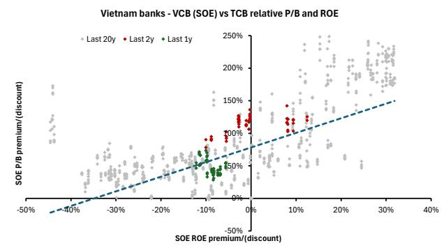

scatter

| Period | SOE ROE premium/(discount) | SOE P/B premium/(discount) |
|--------|-----------------------------|-----------------------------|
| Last 20y | -50% | 0% |
| Last 2y | 0% | 100% |
| Last 1y | 0% | 150% |
| Last 1y | 10% | 200% |
| Last 1y | 20% | 250% |
| Last 1y | 30% | 250% |
| Last 1y | 40% | 250% |
| Last 2y | -50% | 0% |
| Last 2y | 0% | 100% |
| Last 2y | 10% | 150% |
| Last 2y | 20% | 200% |
| Last 2y | 30% | 250% |
| Last 2y | 40% | 250% |
| Last 1y | -50% | 0% |
| Last 1y | 0% | 100% |
| Last 1y | 10% | 150% |
| Last 1y | 20% | 200% |
| Last 1y | 30% | 250% |
| Last 1y | 40% | 250% |

Source: Datastream, UBS

Figure 79: India banks - SOE vs private banks relative P/B and ROE   
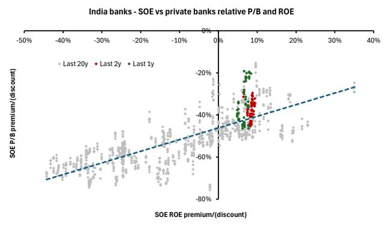

scatter

| SOE ROE premium/(discount) | SOE P/B premium/(discount) | Period     |
| -------------------------- | -------------------------- | ---------- |
| -50%                       | -80%                       | Last 20y   |
| -40%                       | -60%                       | Last 2y    |
| -30%                       | -40%                       | Last 1y    |
| -20%                       | -20%                       | Last 20y   |
| -10%                       | 0%                         | Last 2y    |
| 0%                         | 20%                        | Last 1y    |
| 10%                        | 40%                        | Last 2y    |
| 20%                        | 60%                        | Last 1y    |
| 30%                        | 80%                        | Last 2y    |
| 40%                        | 100%                       | Last 1y    |

Source: Datastream, UBS

APAC Focus represents a curated selection of the best insights from Global Research APAC and showcases differentiated views and actionable ideas, based around unique evidence and key industry themes. It leverages the combined efforts of 130+ APAC analysts, and colleagues in other regions, to develop a broad and collaborative perspective. This research often leverages UBS proprietary assets, including UBS Evidence lab and Quant Answers, whilst utilizing new analytical approaches and identifying critical ESG themes.

To learn more about APAC Focus, visit UBS Neo.

# Valuation Method and Risk Statement

The main risk for Asian banks is inflation in countries with current account deficits and low FX reserves as higher interest rates would hurt margins for banks with high LDRs and hurt credit quality. Also, asymmetric increase in deposit rates and fewer rises in lending rates could hurt current high loan margins. Banks with equity/asset ratios below $5\%$ and ROAs below $1\%$ are vulnerable to economic and regulatory risk, especially if still growing loans by more than $15\%$ per annum, as they will encounter capital shortages.

# Required Disclosures

This document has been prepared by UBS Pte. Ltd., an affiliate of UBS AG. UBS AG, its subsidiaries, branches and affiliates, including former CS AG and its subsidiaries, branches and affiliates are referred to herein as "UBS".

For information on the ways in which UBS manages conflicts and maintains independence of its UBS Global Research product; historical performance information; certain additional disclosures concerning UBS Global Research recommendations; and terms and conditions for certain third party data used in research report, please visit https://www.ubs.com/disclosures. Unless otherwise indicated, information and data in this report are based on company disclosures including but not limited to annual, interim, quarterly reports and other company announcements. The figures contained in performance charts refer to the past; past performance is not a reliable indicator of future results. Additional information will be made available upon request. UBS Co. Limited is licensed to conduct securities investment consultancy businesses by the China Securities Regulatory Commission. UBS acts or may act as principal in the debt securities (or in related derivatives) that may be the subject of this report. This recommendation was finalized on: 18 May 2026 10:25 AM GMT. UBS has designated certain UBS Global Research department members as Derivatives Research Analysts where those department members publish research principally on the analysis of the price or market for a derivative, and provide information reasonably sufficient upon which to base a decision to enter into a derivatives transaction. Where Derivatives Research Analysts co-author research reports with Equity Research Analysts or Economists, the Derivatives Research Analyst is responsible for the derivatives investment views, forecasts, and/or recommendations. Quantitative Research Review: UBS Global Research publishes a quantitative assessment of its analysts' responses to certain questions about the likelihood of an occurrence of a number of short term factors in a product known as the 'Quantitative Research Review'. Views contained in this assessment on a particular stock reflect only the views on those short term factors which are a different timeframe to the 12-month timeframe reflected in any equity rating set out in this note. For the latest responses, please see the Quantitative Research Review Addendum at the back of this report, where applicable. For previous responses please make reference to (i) previous UBS Global Research reports; and (ii) where no applicable research report was published that month, the Quantitative Research Review which can be found at https://neo.ubs.com/quantitative, or contact your UBS sales representative for access to the report or the Quantitative Research Team on ubs-quant-answers@ubs.com. A consolidated report which contains all responses is also available and again you should contact your UBS sales representative for details and pricing or the Quantitative Research team on the email above.

# Analyst Certification:

Each research analyst primarily responsible for the content of this research report, in whole or in part, certifies that with respect to each security or issuer that the analyst covered in this report: (1) all of the views expressed accurately reflect his or her personal views about those securities or issuers and were prepared in an independent manner, including with respect to UBS, and (2) no part of his or her compensation was, is, or will be, directly or indirectly, related to the specific recommendations or views expressed by that research analyst in the research report.

UBS Global Research: Global Equity Rating Definitions 

<table><tr><td>12-Month Rating</td><td>Definition</td><td>Coverage $^{1}$ </td><td>IB Services $^{2}$ </td></tr><tr><td>Buy</td><td>FSR is &gt; 6% above the MRA.</td><td>54%</td><td>24%</td></tr><tr><td>Neutral</td><td>FSR is between -6% and 6% of the MRA.</td><td>40%</td><td>21%</td></tr><tr><td>Sell</td><td>FSR is &gt; 6% below the MRA.</td><td>6%</td><td>21%</td></tr></table>

Source: UBS. Rating allocations are as of 31 March 2026.   
1: Percentage of companies under coverage globally within the 12-month rating category.   
2: Percentage of companies within the 12-month rating category for which investment banking (IB) services were provided within the past 12 months.

KEY DEFINITIONS: Forecast Stock Return (FSR) is defined as expected percentage price appreciation plus gross dividend yield over the next 12 months. In some cases, this yield may be based on accrued dividends. Market Return Assumption (MRA) is defined as the one-year local market interest rate plus 5% (a proxy for, and not a forecast of, the equity risk premium). Under Review (UR) Stocks may be flagged as UR by the analyst, indicating that the stock's price target and/or rating are subject to possible change in the near term, usually in response to an event that may affect the investment case or valuation. Equity Price Targets have an investment horizon of 12 months.

EXCEPTIONS AND SPECIAL CASES:UK and European Investment Fund ratings and definitions are: Buy: Positive on factors such as structure, management, performance record, discount; Neutral: Neutral on factors such as structure, management, performance record, discount; Sell: Negative on factors such as structure, management, performance record, discount. Core Banding Exceptions (CBE): Exceptions to the standard +/-6% bands may be granted by the Investment Review Consultation (IRC). Factors considered by the IRC include the stock's volatility and the credit spread of the respective company's debt. As a result, stocks deemed to be very high or low risk may be subject to higher or lower bands as they relate to the rating. When such exceptions apply, they will be identified in the Company Disclosures table in the relevant research piece.

Research analysts contributing to this report who are employed by any non-US affiliate of UBS LLC are not registered/qualified as research analysts with FINRA. Such analysts may not be associated persons of UBS LLC and therefore are not subject to the FINRA restrictions on communications with a subject company, public appearances, and trading securities held by a research analyst account. The name of each affiliate and analyst employed by that affiliate contributing to this report, if any, follows.

PT UBS Sekuritas Indonesia: Joshua Tanja, CFA.UBS AG, Singapore Branch: Aakash Rawat, CFA, Benjamin Tan.UBS AG Hong Kong Branch: Helen Li, CFA, May Yan.UBS AG London Branch: Jason Napier, CFA.UBS (Thailand) Ltd.: Peach Patharavanakul.UBS Australia Ltd: John Storey, CFA.UBS Co. Limited: Alex Ye.UBS India Private Ltd: Vishal Goyal, Yash Agarwal.UBS Japan Co., Ltd.: Koichi Niwa.

Company Disclosures 

<table><tr><td>Company Name</td><td>Reuters</td><td>12-month rating</td><td>Price</td><td>Price date</td></tr><tr><td> $Bank\ Central\ Asia^{28}$ </td><td>BBCA.JK</td><td>Buy</td><td>Rp6,125</td><td>18 May 2026</td></tr><tr><td> $Bank\ Mandiri^7$ </td><td>BMRI.JK</td><td>Buy</td><td>Rp4,130</td><td>18 May 2026</td></tr><tr><td> $Bank\ Rakyat\ Indonesia^7$ </td><td>BBRI.JK</td><td>Buy</td><td>Rp3,060</td><td>18 May 2026</td></tr><tr><td> $Bank\ of\ the\ Philippine\ Islands^{4,7,6a,6c}$ </td><td>BPI.PS</td><td>Buy</td><td>P89.30</td><td>18 May 2026</td></tr><tr><td> $CIMB\ Group\ Holdings\ Berhad^{28,7,6a,6b}$ </td><td>CIMB.KL</td><td>Buy</td><td>RM7.80</td><td>18 May 2026</td></tr><tr><td> $China\ Merchants\ Bank^{28,7,18,6a,6b,16a}$ </td><td>3968.HK</td><td>Neutral</td><td>HK$46.58</td><td>18 May 2026</td></tr><tr><td> $China\ Merchants\ Bank - A^{28,7,18,6a,6b,16a}$ </td><td>600036.SS</td><td>Buy</td><td>Rmb37.47</td><td>18 May 2026</td></tr><tr><td> $Commonwealth\ Bank\ of\ Australia^{1,2,4,5,28,7,6c}$ </td><td>CBA.AX</td><td>Sell</td><td>A$160.74</td><td>18 May 2026</td></tr><tr><td> $DBS\ Group\ Holdings^{4,28,7,6a,6b,6c}$ </td><td>DBSM.SI</td><td>Neutral</td><td>S$60.76</td><td>18 May 2026</td></tr><tr><td> $E.Sun\ Financial^{28,7}$ </td><td>2884.TW</td><td>Buy</td><td>NT$31.70</td><td>18 May 2026</td></tr><tr><td> $HDFC\ Bank^{2,4,28,7,8,6c,16b}$ </td><td>HDBK.BO</td><td>Buy</td><td>Rs767.80</td><td>15 May 2026</td></tr><tr><td> $HSBC\ Holdings^{2,4,5,28,7,6a,6b,16a,6c,16b}$ </td><td>0005.HK</td><td>Neutral</td><td>HK$138.10</td><td>18 May 2026</td></tr><tr><td> $HSBC\ plc^{2,4,5,28,7,6a,6b,16a,6c,16b}$ </td><td>HSBA.L</td><td>Neutral</td><td>1,324p</td><td>15 May 2026</td></tr><tr><td> $Kasikornbank^{4,7,6c}$ </td><td>KBANK.BK</td><td>Buy</td><td>Bt196.50</td><td>15 May 2026</td></tr><tr><td> $Kotak\ Mahindra\ Bank^7$ </td><td>KTKM.BO</td><td>Buy</td><td>Rs387.30</td><td>15 May 2026</td></tr><tr><td> $Krungthai\ Card\ PCL^{28}$ </td><td>KTC.BK</td><td>No Rating</td><td>Bt29.25</td><td>15 May 2026</td></tr><tr><td> $Mitsubishi\ UFJ\ Financial\ Group^{2,4,5,28,7,6a,6b,6c,16b}$ </td><td>8306.T</td><td>Buy</td><td>¥2,995</td><td>18 May 2026</td></tr><tr><td> $National\ Australia\ Bank^{2,4,5,28,7,6a,6c}$ </td><td>NAB.AX</td><td>Buy</td><td>A$36.32</td><td>18 May 2026</td></tr><tr><td> $Standard\ Chartered^{2,4,28,7,6a,6b,16a,6c}$ </td><td>2888.HK</td><td>Buy</td><td>HK$196.60</td><td>18 May 2026</td></tr><tr><td> $Standard\ Chartered\ plc^{2,4,28,7,6a,6b,16a,6c}$ </td><td>STAN.L</td><td>Buy</td><td>1,889p</td><td>15 May 2026</td></tr><tr><td>Techcombank</td><td>TCB.HM</td><td>Buy</td><td>D34,000</td><td>18 May 2026</td></tr></table>

Source: UBS Global Research; LSEG Eikon. All prices as of local market close. Ratings in this table are the most current published ratings prior to this report. They may be more recent than the stock pricing date.   
1. UBS AG London Branch is acting as manager/co-manager, underwriter, placement or sales agent in regard to an offering of securities of this company/entity or one of its affiliates.   
2. UBS has acted as manager/co-manager in the underwriting or placement of securities of this company/entity or one of its affiliates within the past 12 months.   
4. Within the past 12 months, UBS has received compensation for investment banking services from this company/entity or one of its affiliates.   
5. UBS expects to receive or intend to seek compensation for investment banking services from this company/entity within the next three months.   
6a. This company/entity is, or within the past 12 months has been, a client of UBS LLC, and non-investment banking securities-related services are being, or have been, provided.   
6b. This company/entity is, or within the past 12 months has been, a client of UBS LLC, and non-securities services are being, or have been, provided.   
6c. This company/entity is, or within the past 12 months has been, a client of UBS LLC and/or its affiliates, and investment banking services are being, or have been, provided.   
7. Within the past 12 months, UBS has received compensation for products and services other than investment banking services from this company/entity.   
8. The equity analyst covering this company, a member of his or her team, or one of their household members has a long common stock position in this company.   
16a. UBS Hong Kong Limited is a market maker in the Hong Kong-listed securities of this company.   
16b. UBS LLC makes a market in the securities and/or ADRs of this company.   
18. Market capitalisation is calculated by multiplying the current share price by the sum of A and H shares.   
28. UBS holds a long or short position of 0.5% or more of the listed shares of this company.

Unless otherwise indicated, please refer to the Valuation and Risk sections within the body of this report. For a complete set of disclosure statements associated with the companies discussed in this report, including information on valuation and risk, please contact UBS LLC, 11 Madison Avenue, New York, NY 10010, USA, Attention: Investment Research.

# Company profile and fee and risk statement under the Japanese Financial Instruments & Exchange Law

Company Name etc: UBS Japan Co., Ltd., Financial Instruments & Exchange Firm, Kanto Local Financial Bureau (Kinsho) No.2633

Associated Memberships: Japan Securities Dealers' Association, the Financial Futures Association of Japan, and Type II Financial Instruments Firms Association

UBS Japan Co., Ltd. will receive a brokerage fee based on an individual contract and no standard upper limit or calculating method. For the trading of domestic stocks, consumption tax is added to the fee. For the trading of foreign stock, fee on the foreign stock exchange or foreign tax may be charged in addition to the domestic fee and tax. Those amounts may vary depending on the jurisdiction. There is a risk that a loss may occur due to a change in the price of the stock in the case of trading stocks, and that a loss may occur due to the exchange rate in the case of trading foreign stocks. There is a risk that a loss may occur due to a change in the price or performance of the properties in the portfolio in the case of trading REITs.

UBS Japan Co., Ltd. will only receive the purchasing amounts for trading unlisted bonds (JGBs, municipals, government guaranteed bonds, corporate bonds) when UBS Japan Co., Ltd. is the counterparty. There is a risk that a loss may occur due to a change in the price of the bond caused by the fluctuations in the interest rates, and that a loss may occur due to the exchange rate in the case of trading foreign bonds.

For the detailed information of commissions and risks associated with individual financial instrument transactions, please carefully read the documents provided prior to the execution of the contracts or other materials for customers, etc. before executing any transaction. If you need any clarification, please consult with our sales person in charge.

# The Disclaimer relevant to Global Wealth Management clients follows the Global Research Disclaimer. The Disclaimer relevant to CS Wealth Management follows the Global Wealth Management Disclaimer.

# UBS Global Research Disclaimer

This document has been prepared by UBS Pte. Ltd., an affiliate of UBS AG. UBS AG, its subsidiaries, branches and affiliates, including former CS AG and its subsidiaries, branches and affiliates are referred to herein as "UBS".

Any opinions expressed in this document may change without notice and are only current as of the date of publication. Different areas, groups, and personnel within UBS may produce and distribute separate research products independently of each other. For example, research publications from UBS CIO are produced by UBS Global Wealth Management. UBS Global Research is produced by UBS Investment Bank. Research methodologies and rating systems of each separate research organization may differ, for example, in terms of investment recommendations, investment horizon, model assumptions, and valuation methods. As a consequence, except for certain economic forecasts (for which UBS CIO and UBS Global Research may collaborate), investment recommendations, ratings, price targets, and valuations provided by each of the separate research organizations may be different, or inconsistent. You should refer to each relevant research product for the details as to their methodologies and rating system. Not all clients may have access to all products from every organization. Each research product is subject to the policies and procedures of the organization that produces it.

This document is provided solely to recipients who are expressly authorized by UBS to receive it. If you are not so authorized you must immediately destroy the document.

UBS Global Research is provided to our clients through UBS Neo, and in certain instances, UBS.com and any other system or distribution method specifically identified in one or more communications distributed through UBS Neo or UBS.com (each a system) as an approved means for distributing UBS Global Research. It may also be made available through third party vendors and distributed by UBS and/or third parties via e-mail or alternative electronic means.

All UBS Global Research is available on UBS Neo. Please contact your UBS sales representative if you wish to discuss your access to UBS Neo. Where UBS Global Research refers to "UBS Evidence Lab Inside" or has made use of data provided by UBS Evidence Lab and you would like to access that data please contact your UBS sales representative. UBS Evidence Lab data is available on UBS Neo. The level and types of services provided by UBS Global Research and UBS Evidence Lab to a client may vary depending upon various factors such as a client's individual preferences as to the frequency and manner of receiving communications, a client's risk profile and investment focus and perspective (e.g., market wide, sector specific, long-term, short-term, etc.), the size and scope of the overall client relationship with UBS Global Research and UBS Evidence Lab and legal and regulatory constraints. UBS HOLT and UBS Pharma Values are offerings of UBS Global Research. HOLT Lens is a corporate performance platform offering that provides an objective accounting-led framework for comparing and valuing companies and is available to clients of UBS Global Research; for further details and pricing please contact your UBS Sales representative. In particular, HOLT has a variety of warranted prices based on the scenario chosen; please mail UBS LLC, 11 Madison Avenue, New York, NY 10010, USA, Attention: Investment Research, if you are interested in the warranted price on a particular company, again subject to commercial considerations. UBS Pharma Values is an analytical tool that involves the creation of a number of individual product net present value calculations, based on published forecasts of sales for pharmaceuticals, and is available to clients of UBS Global Research; for further details and pricing please contact your UBS Sales representative. For all other specific disclaimers, please see https://www.ubs.com/disclosures.

When you receive UBS Global Research through a system, your access and/or use of such UBS Global Research is subject to this UBS Global Research Disclaimer and to the UBS Neo Platform Use Agreement (the "Neo Terms") together with any other relevant terms of use governing the applicable System.

When you receive UBS Global Research via a third party vendor, e-mail or other electronic means, you agree that use shall be subject to this UBS Global Research Disclaimer, the Neo Terms and where applicable the UBS Investment Bank terms of business (https://www.ubs.com/global/en/investment-bank/regulatory.html) and to UBS's Terms of Use/Disclaimer (https://www.ubs.com/global/en/legalinfo2/disclaimer.html). In addition, you consent to UBS processing your personal data and using cookies in accordance with our Privacy Statement (https://www.ubs.com/global/en/legalinfo2/privacy.html) and cookie notice (https://www.ubs.com/global/en/legal/privacy/users.html).

If you receive UBS Global Research, whether through a System or by any other means, you agree that you shall not copy, revise, amend, create a derivative work, provide to any third party, or in any way commercially exploit any UBS provided via UBS Global Research or otherwise, and that you shall not extract data from any research or estimates provided to you via UBS Global Research or otherwise, without the prior written consent of UBS. You agree not to use UBS Global Research in any artificial intelligence system, without the prior written consent of UBS.

In certain circumstances you may receive UBS Global Research otherwise than in the capacity of a client of UBS and you understand and agree that under these circumstances (i) the UBS Global Research is provided to you for information purposes only; (ii) for the purposes of receiving it you are not intended to be and will not be treated as a “client” of UBS for any legal or regulatory purpose; (iii) the UBS Global Research must not be relied on or acted upon for any purpose; and (iv) such content is subject to the relevant disclaimers that follow.

This document is for distribution only as may be permitted by law. It is not directed to, or intended for distribution to or use by, any person or entity who is a citizen or resident of or located in any locality, state, country or other jurisdiction where such distribution, publication, availability or use would be contrary to law or regulation or would subject UBS to any registration or licensing requirement within such jurisdiction.

This document is a general communication and is educational in nature; it is not an advertisement nor is it a solicitation or an offer to buy or sell any financial instruments or to participate in any particular trading strategy. Nothing in this document constitutes a representation that any investment strategy or recommendation is suitable or appropriate to an investor's individual circumstances or otherwise constitutes a personal recommendation. By providing this document, none of UBS or its representatives has any responsibility or authority to provide or have provided investment advice in a fiduciary capacity or otherwise. Investments involve risks, and investors should exercise prudence and their own judgment in making their investment decisions. None of UBS or its representatives is suggesting that the recipient or any other person take a specific course of action or any action at all. The recipient should carefully read this document in its entirety and not draw inferences or conclusions from the rating alone. By receiving this document, the recipient acknowledges and agrees with the intended purpose described above and further disclaims any expectation or belief that the information constitutes investment advice to the recipient or otherwise purports to meet the investment objectives of the recipient. The financial instruments described in the document may not be eligible for sale in all jurisdictions or to certain categories of investors.

Options, structured derivative products and futures (including OTC derivatives) are not suitable for all investors. Trading in these instruments is considered risky and may be appropriate only for sophisticated investors. Prior to buying or selling an option, and for the complete risks relating to options, you must receive a copy of "The Characteristics and Risks of Standardized Options." You may read the document at https://www.theocc.com/publications/risks/riskchap1.jsp or ask your salesperson for a copy. Various theoretical explanations of the risks associated with these instruments have been published. Supporting documentation for any claims, comparisons, recommendations, statistics or other technical data will be supplied upon request. Past performance is not necessarily indicative of future results. Transaction costs may be significant in option strategies calling for multiple purchases and sales of options, such as spreads and straddles. Because of the importance of tax considerations to many options transactions, the investor considering options should consult with his/her tax advisor as to how taxes affect the outcome of contemplated options transactions.

Mortgage and asset-backed securities may involve a high degree of risk and may be highly volatile in response to fluctuations in interest rates or other market conditions. Foreign currency rates of exchange may adversely affect the value, price or income of any security or related instrument referred to in the document. For investment advice, trade execution or other enquiries, clients should contact their local sales representative.

UBS notes that no globally accepted framework or definition (legal, regulatory or otherwise) currently exists, nor is there a market consensus as to what constitutes an “ESG” (Environmental, Social or Governance) or an equivalent-label, or as to what precise attributes are required for the Information (as defined below) to be defined as ESG or equivalently-labelled. Any information, data or other content including from a third party source contained, referred to herein or used for whatsoever purpose by UBS or a third party (“Information”), in relation to any actual or potential ESG objective, issue or consideration is not intended to be relied upon for ESG classification, regulatory regime or industry initiative purposes (“ESG Regimes”). Nothing in these materials is intended to convey, suggest or indicate that UBS considers or represents any product, service, person or body mentioned in these materials as meeting or qualifying for any ESG classification, labelling or similar standards that may exist under the ESG Regimes. UBS has not conducted any assessment of compliance with ESG Regimes. Parties are reminded to make their own assessments for these purposes.

The value of any investment or income may go down as well as up, and investors may not get back the full (or any) amount invested. Past performance is not necessarily a guide to future performance. Neither UBS nor any of its directors, employees or agents accepts any liability for any loss (including investment loss) or damage arising out of the use of all or any of the Information.

Prior to making any investment or financial decisions, any recipient of this document or the information should take steps to understand the risk and return of the investment and seek individualized advice from his or her personal financial, legal, tax and other professional advisors that takes into account all the particular facts and circumstances of his or her investment objectives.

Any prices stated in this document are for information purposes only and do not represent valuations for individual securities or other financial instruments. There is no representation that any transaction can or could have been effected at those prices, and any prices do not necessarily reflect UBS's internal books and records or theoretical model-based valuations and may be based on certain assumptions. Different assumptions by UBS or any other source may yield substantially different results.

No representation or warranty, either expressed or implied, is provided in relation to the accuracy, completeness or reliability of the information contained in any materials to which this document relates (the "Information"), except with respect to Information concerning UBS. The Information is not intended to be a complete statement or summary of the securities, markets or developments referred to in the document. UBS does not undertake to update or keep current the Information. Any statements contained in this report attributed to a third party represent UBS's interpretation of the data, information and/or opinions provided by that third party either publicly or through a subscription service, and such use and interpretation have not been reviewed by the third party. In no circumstances may this document or any of the Information (including any forecast, value, index or other calculated amount ("Values")) be used for any of the following purposes:

(i) valuation or accounting purposes;

(ii) to determine the amounts due or payable, the price or the value of any financial instrument or financial contract; or

(iii) to measure the performance of any financial instrument including, without limitation, for the purpose of tracking the return or performance of any Value or of defining the asset allocation of portfolio or of computing performance fees.

By receiving this document and the Information you will be deemed to represent and warrant to UBS that you will not use this document or any of the Information for any of the above purposes or otherwise rely upon this document or any of the Information.

UBS has policies and procedures, which include, without limitation, independence policies and permanent information barriers, that are intended, and upon which UBS relies, to manage potential conflicts of interest and control the flow of information within divisions of UBS and among its subsidiaries, branches and affiliates. UBS does and seeks to do business with companies covered in its research reports. As a result, investors should be aware that the firm may have a conflict of interest that could affect the objectivity of this report. Investors should consider this report as only a single factor in making their investment decision. For further information on the ways in which UBS Global Research manages conflicts and maintains independence of its research products, historical performance information and certain additional disclosures concerning UBS Global Research recommendations, please visit https://www.ubs.com/disclosures.

UBS Global Research will initiate, update and cease coverage solely at the discretion of UBS Global Research Management, which will also have sole discretion on the timing and frequency of any published research product. The analysis contained in this document is based on numerous assumptions. All material information in relation to published research reports, such as valuation methodology, risk statements, underlying assumptions (including sensitivity analysis of those assumptions), ratings history etc. as required by the Market Abuse Regulation, can be found on UBS Neo. Different assumptions could result in materially different results.

UBS Global Research may utilise artificial intelligence tools ("AI Tools") in the preparation of this document. Notwithstanding any such use of AI Tools, this document has undergone human review.

The analyst(s) responsible for the preparation of this document may interact with trading desk personnel, sales personnel and other parties for the purpose of gathering, applying and interpreting market information. UBS relies on information barriers to control the flow of information contained in one or more areas within UBS into other areas, units, groups or affiliates of UBS. The compensation of the analyst who prepared this document is determined exclusively by UBS Global Research management and senior management (not including investment banking). Analyst compensation is not based on investment banking revenues; however, compensation may relate to the revenues of UBS and/or its divisions as a whole, of which investment banking, sales and trading are a part, and UBS as a whole.

For financial instruments admitted to trading on an EU regulated market: UBS (excluding UBS LLC) acts as a market maker or liquidity provider (in accordance with the interpretation of these terms under English law or, if not carried out by UBS in the UK the law of the relevant jurisdiction in which UBS determines it carries out the activity) in the financial instruments of the issuer save that where the activity of liquidity provider is carried out in accordance with the definition given to it by the laws and regulations of any other EU jurisdictions, such information is separately disclosed in this document. For financial instruments admitted to trading on a non-EU regulated market: UBS may act as a market maker save that where this activity is carried out in the US in accordance with the definition given to it by the relevant laws and regulations, such activity will be specifically disclosed in this document. UBS may have issued a warrant the value of which is based on one or more of the financial instruments referred to in the document. UBS and its affiliates and employees may have long or short positions, trade as principal and buy and sell in instruments or derivatives identified herein; such transactions or positions may be inconsistent with the opinions expressed in this document.

Within the past 12 months UBS may have received or provided investment services and activities or ancillary services as per MiFID II which may have given rise to a payment or promise of a payment in relation to these services from or to this company.

Please note that all transactions conducted by UBS are consistent with sanctions regulations imposed by Switzerland, the European Union, the United Nations, the United Kingdom and the United States, per UBS' global sanctions policy. UBS opinion as to future investment worthiness assumes no new sanctions are imposed.

US persons are prohibited from purchasing or selling securities of certain companies designated as being associated with the Chinese Military in accordance with the amended US Presidential Executive Order 13959.

United Kingdom: This material is distributed by UBS AG, London Branch to persons who are eligible counterparties or professional clients. UBS AG, London Branch is authorised by the Prudential Regulation Authority and subject to regulation by the Financial Conduct Authority and limited regulation by the Prudential Regulation Authority. Europe: Except as otherwise specified herein, these materials are distributed by UBS Europe SE, a subsidiary of UBS AG, to persons who are eligible counterparties or professional clients (as detailed in the Bundesanstalt für Finanzdienstleistungsaufsicht (BaFin) Rules and according to MIFID) and are only available to such persons. The information does not apply to, and should not be relied upon by, retail clients. UBS Europe SE is authorised by the European Central Bank (ECB) and regulated by the BaFin and the ECB. Germany, Luxembourg, the Netherlands, Belgium and Ireland: Where an analyst of UBS Europe SE has contributed to this document, the document is also deemed to have been prepared by UBS Europe SE. In all cases it is distributed by UBS Europe SE and UBS AG, London Branch. Turkey: Distributed by UBS AG, London Branch. No information in this document is provided for the purpose of offering, marketing and sale by any means of any capital market instruments and services in the Republic of Turkey. Therefore, this document may not be considered as an offer made or to be made to residents of the Republic of Turkey. UBS AG, London Branch is not licensed by the Turkish Capital Market Board under the provisions of the Capital Market Law (Law No. 6362). Accordingly, neither this document nor any other offering material related to the instruments/services may be utilized in connection with providing any capital market services to persons within the Republic of Turkey without the prior approval of the Capital Market Board. However, according to article 15 (d) (ii) of the Decree No. 32, there is no restriction on the purchase or sale of the securities abroad by residents of the Republic of Turkey. Poland: Distributed by UBS Europe SE (spolka z ograniczona odpowiedzialnoscia) Oddzial w Polsce. Where an analyst of UBS Europe SE (spolka z ograniczona odpowiedzialnoscia) Oddzial w Polsce has contributed to this document, the document is also deemed to have been prepared by UBS Europe SE (spolka z ograniczona odpowiedzialnoscia) Oddzial w Polsce. Russia: Prepared and distributed by UBS Bank (OOO). Should not be construed as an individual Investment Recommendation for the purpose of the Russian Law - Federal Law #39-FZ ON THE SECURITIES MARKET Articles 6.1-6.2. Switzerland: Distributed by UBS AG to persons who are institutional investors only. UBS AG is regulated by the Swiss Financial Market Supervisory Authority (FINMA). Italy: Prepared by UBS Europe SE and distributed by UBS Europe SE and UBS Europe SE, Italy Branch. Where an analyst of UBS Europe SE, Italy Branch has contributed to this document, the document is also deemed to have been prepared by UBS Europe SE, Italy Branch. France: Prepared by UBS Europe SE and distributed by UBS Europe SE and UBS Europe SE, France Branch. Where an analyst of UBS Europe SE, France Branch has contributed to this document, the document is also deemed to have been prepared by UBS Europe SE, France Branch. Spain: Prepared by UBS Europe SE and distributed by UBS Europe SE and UBS Europe SE, Spain Branch. Where an analyst of UBS Europe SE, Spain Branch has contributed to this document, the document is also deemed to have been prepared by UBS Europe SE, Spain Branch. Sweden: Prepared by UBS Europe SE and distributed by UBS Europe SE and UBS Europe SE, Sweden Branch. Where an analyst of UBS Europe SE, Sweden Branch has contributed to this document, the document is also deemed to have been prepared by UBS Europe SE, Sweden Branch. South Africa: Distributed by UBS South Africa (Pty) Limited (Registration No. 1995/011140/07), an authorised user of the JSE and an authorised Financial Services Provider (FSP 7328). Saudi Arabia: This document has been issued by UBS AG (and/or any of its subsidiaries, branches or affiliates), a public company limited by shares, incorporated in Switzerland with its registered offices at Aeschenvorstadt 1, CH-4051 Basel and Bahnhofstrasse 45, CH-8001 Zurich. This publication has been approved by UBS Saudi Arabia (a subsidiary of UBS AG), a Saudi closed joint stock company incorporated in the Kingdom of Saudi Arabia under commercial register number 1010257812 having its registered office at Tatweer Towers, P.O. Box 75724, Riyadh 11588, Kingdom of Saudi Arabia. UBS Saudi Arabia is authorized and regulated by the Capital Market Authority to conduct securities business under license number 08113-37. UAE / Dubai: The information distributed by UBS AG Dubai Branch is only intended for Professional Clients and/or Market Counterparties, as classified under the DFSA rulebook. No other person should act upon this material/communication. The information is not for further distribution within the United Arab Emirates. UBS AG Dubai Branch is regulated by the DFSA in the DIFC. UBS is not licensed to provide banking services in the UAE by the Central Bank of the UAE, nor is it licensed by the UAE Securities and Commodities Authority. Israel: This Material is distributed by UBS AG, London Branch. UBS Israel Ltd is a licensed Investment Marketer that is supervised by the Israel Securities Authority (ISA). UBS AG, London Branch and its affiliates incorporated outside Israel are not licensed under the Israeli Advisory Law. UBS may engage among others in issuance of Financial Assets or in distribution of Financial Assets of other issuers for fees or other benefits. UBS AG, London Branch and its affiliates may prefer various Financial Assets to which they have or may have an Affiliation (as such term is defined under the Israeli Advisory Law). Nothing in this Material should be considered as investment advice under the Israeli Advisory Law. This Material is being issued only to and/or is directed only at persons who are Eligible Clients within the meaning of the Israeli Advisory Law, and this Material must not be furnished to, relied on or acted upon by any other persons. United States: Distributed to US persons by either UBS LLC or by UBS Financial Services Inc., subsidiaries of UBS AG; or by a group, subsidiary or affiliate of UBS AG that is not registered as a US broker-dealer (a 'non-US affiliate') to major US institutional investors only. UBS LLC or UBS Financial Services Inc. accepts responsibility for the content of a report prepared by another non-US affiliate when distributed to US persons by UBS LLC or UBS Financial Services Inc. All transactions by a US person in the securities mentioned in this report must be effected through UBS LLC or UBS Financial Services Inc., and not through a non-US affiliate. UBS LLC is not acting as a municipal advisor to any municipal entity or obligated person within the meaning of

Section 15B of the Securities Exchange Act (the "Municipal Advisor Rule"), and the opinions or views contained herein are not intended to be, and do not constitute, advice within the meaning of the Municipal Advisor Rule. Canada: Distributed by UBS Canada Inc., a registered investment dealer in Canada and a Member-Canadian Investor Protection Fund, or by another affiliate of UBS AG that is registered to conduct business in Canada or is otherwise exempt from registration. Brazil: Except as otherwise specified herein, this Material is prepared by UBS BB Corretora de Câmbio, Títulos e Valores Mobiliários S.A. (UBS BB CCTV) to persons who are eligible investors residing in Brazil, which are considered to be Professional Investors (Investidores Profissionais), as designated by the applicable regulation, mainly the CVM Resolution No. 30 from the 11th of May 2021 (determines the duty to verify the suitability of products, services and transactions with regards to the client's profile). UBS BB CCTV is a subsidiary of UBS BB Servicos de Assessoria Financeira e Participacoes S.A. ("UBS BB"). UBS BB is an association between UBS AG and Banco do Brasil (through its subsidiary BB – Banco de Investimentos S.A.), of which UBS AG is the majority owner and which provides investment banking services and coverage in Brazil, Argentina, Chile, Paraguay, Peru and Uruguay. UBS BB CCTV is regulated by the Comissao de Valores Mobiliarios (CVM) and by the Central Bank of Brazil. Ombudsman: 0800-940-0266/ https://www.ubs.com/br/pt/ubssb-investment-bank/ombudsman.html. UBS may hold relevant financial and commercial interest in relation to the company subject to this Research report. Hong Kong: Distributed by UBS Asia Limited. Please contact local licensed persons of UBS Asia Limited in respect of any matters arising from, or in connection with, the analysis or document Singapore: Distributed by UBS Pte. Ltd. [Co. Reg. No.: 198500648C] or UBS AG, Singapore Branch. Please contact UBS Pte. Ltd., an exempt financial adviser under the Singapore Financial Advisers Act (Cap. 110); or UBS AG, Singapore Branch, an exempt financial adviser under the Singapore Financial Advisers Act (Cap. 110) and a wholesale bank licensed under the Singapore Banking Act (Cap. 19) regulated by the Monetary Authority of Singapore, in respect of any matters arising from, or in connection with, the analysis or document. The recipients of this document represent and warrant that they are accredited and institutional investors as defined in the Securities and Futures Act (Cap. 289). Japan: Distributed by UBS Japan Co., Ltd. to professional investors (except as otherwise permitted). Where this report has been prepared by UBS Japan Co., Ltd., UBS Japan Co., Ltd. is the author, publisher and distributor of the report. Distributed by UBS AG, Tokyo Branch to Professional Investors (except as otherwise permitted) in relation to foreign exchange and other banking businesses when relevant. Australia: Clients of UBS AG: Distributed by UBS AG (ABN 47 088 129 613 and holder of Australian Financial Services License No. 231087). For all other recipients: Distributed by UBS Australia Ltd (ABN 62 008 586 481 and holder of Australian Financial Services License No. 231098). This document contains general information and/or general advice only and does not constitute personal financial product advice. As such, the Information in this document has been prepared without taking into account any investor's objectives, financial situation or needs, and investors should, before acting on the Information, consider the appropriateness of the Information, having regard to their objectives, financial situation and needs. If the Information contained in this document relates to the acquisition, or potential acquisition of a particular financial product by a 'Retail' client as defined by section 761G of the Corporations Act 2001 where a Product Disclosure Statement would be required, the retail client should obtain and consider the Product Disclosure Statement relating to the product before making any decision about whether to acquire the product. New Zealand: Distributed by UBS New Zealand Ltd. UBS New Zealand Ltd is not a registered bank in New Zealand. You are being provided with this publication or material because you have indicated to UBS that you are a "wholesale client" within the meaning of clause 4 of schedule 5 of the Financial Markets Conduct Act 2013 of New Zealand (Permitted Client). This publication or material is not intended for clients who are not Permitted Clients (non-permitted Clients). If you are a non-permitted Client you must not rely on this publication or material. If despite this warning you nevertheless rely on this publication or material, you hereby (i) acknowledge that you may not rely on the content of this publication or material and that any recommendations or opinions in such this publication or material are not made or provided to you, and (ii) to the maximum extent permitted by law (a) indemnify UBS and its associates or related entities (and their respective Directors, officers, agents and Advisors) (each a 'Relevant Person') for any loss, damage, liability or claim any of them may incur or suffer as a result of, or in connection with, your unauthorised reliance on this publication or material and (b) waive any rights or remedies you may have against any Relevant Person for (or in respect of) any loss, damage, liability or claim you may incur or suffer as a result of, or in connection with, your unauthorised reliance on this publication or material. Korea: Distributed in Korea by UBS Pte. Ltd., Seoul Branch. This report may have been edited or contributed to from time to time by affiliates of UBS Pte. Ltd., Seoul Branch. This material is intended for professional/institutional clients only and not for distribution to any retail clients. Malaysia: This material is authorized to be distributed in Malaysia by UBS Malaysia Sdn. Bhd (Capital Markets Services License No.: CMSL/A0063/2007). This material is intended for professional/institutional clients only and not for distribution to any retail clients. India: Distributed by UBS India Private Ltd. (Corporate Identity Number U67120MH1996PTC097299) 2/F, 3 North Avenue, Maker Maxity, Bandra Kurla Complex, Bandra (East), Mumbai (India) 400051. Phone: +912261556000. It provides brokerage services bearing SEBI Registration Number: INZ000259830; Merchant Banking services bearing SEBI Registration Number: INM000013101; and Research Analyst services bearing SEBI Registration Number: INH000001204. Name of Compliance Officer Mr. Parameshwaran Shivaramakrishnan, Phone: +912261556151, Email: parameshwaran.s@ubs.com, Name of Grievance Officer Parameshwaran Shivaramakrishnan, Phone: +912261556151, Email: ol-ubs-sec-compliance@ubs.com Registration granted by SEBI, and certification from NISM in no way guarantee performance of the intermediary or provide any assurance of returns to investors. UBS may have debt holdings or positions in the subject Indian company/companies. UBS may have financial interests (e.g. loan/derivative products, rights to or interests in investments, etc.) in the subject Indian company/companies from time to time. Within the past 12 months, UBS may have received compensation for non-investment banking securities-related services and/or non-securities services from the subject Indian company/companies. The subject company/companies may have been a client/clients of UBS during the 12 months preceding the date of distribution of the research report with respect to investment banking and/or non-investment banking securities-related services and/or non-securities services. With regard to information on associates, please refer to the Annual Report at: https://www.ubs.com/global/en/about\_ubs/investor\_relations/annualreporting.html The Research Annual Compliance Report for UBS India Private Limited is available on www.ubs.com/ubssi under Research tab. Taiwan: Except as otherwise specified herein, this material may not be distributed in Taiwan. Information and material on securities/instruments that are traded in a Taiwan organized exchange is deemed to be issued and distributed by UBS Pte. LTD., Taipei Branch, which is licensed and regulated by Taiwan Financial Supervisory Commission. Save for securities/instruments that are traded in a Taiwan organized exchange, this material should not constitute "recommendation" to clients or recipients in Taiwan for the covered companies or any companies mentioned in this document. No portion of the document may be reproduced or quoted by the press or any other person without authorisation from UBS. Indonesia: This report is being distributed by PT UBS Sekuritas Indonesia and is delivered by its licensed employee(s), including marketing/sales person, to its client. PT UBS Sekuritas Indonesia, having its registered office at Sequis Tower Level 22 unit 22-1,Jl.Jend. Sudirman, kav.71, SCBD lot 11B, Jakarta 12190. Indonesia, is a subsidiary company of UBS AG and licensed under Capital Market Law no. 8 year 1995, a holder of broker-dealer and underwriter licenses issued by the Capital Market and Financial Institution Supervisory Agency (now Otoritas Jasa Keuangan/OJK). PT UBS Sekuritas Indonesia is also a member of Indonesia Stock Exchange and supervised by Otoritas Jasa Keuangan (OJK). Neither this report nor any copy hereof may be distributed in Indonesia or to any Indonesian citizens except in compliance with applicable Indonesian capital market laws and regulations. This report is not an offer of securities in Indonesia and may not be distributed within the territory of the Republic of Indonesia or to Indonesian citizens in circumstance which constitutes an offering within the meaning of Indonesian capital market laws and regulations.

The disclosures contained in research documents produced by UBS AG, London Branch or UBS Europe SE shall be governed by and construed in accordance with English law.

UBS specifically prohibits the redistribution of this document in whole or in part without the written permission of UBS and in any event UBS accepts no liability whatsoever for any redistribution of this document or its contents or the actions of third parties in this respect. Images may depict objects or elements that are protected by third party copyright, trademarks and other intellectual property rights. © UBS 2026. The key symbol and UBS are among the registered and unregistered trademarks of UBS. All rights reserved.

# Global Wealth Management Disclaimer

You receive this document in your capacity as a client of UBS Global Wealth Management. This publication has been distributed to you by UBS Switzerland AG (regulated by FINMA in Switzerland) or its affiliates ("UBS") with whom you have a banking relationship with. The full name of the distributing affiliate and its competent authority can be found in the country-specific disclaimer at the end of this document. UBS may utilise artificial intelligence tools ("AI Tools") in the preparation of this document. Notwithstanding any such use of AI Tools, this document has undergone human review.

The date and time of the first dissemination of this publication is the same as the date and time of its publication.

# Risk information:

You agree that you shall not copy, revise, amend, create a derivative work, provide to any third party, or in any way commercially exploit any UBS, and that you shall not extract data from any research or estimates, without the prior written consent of UBS.

This document is for distribution only as may be permitted by law. It is not directed to, or intended for distribution to or use by, any person or entity who is a citizen or resident of or located in any locality, state, country or other jurisdiction where such distribution, publication, availability or use would be contrary to law or regulation or would subject UBS to any registration or licensing requirement within such jurisdiction.

This document is for your information only; it is not an advertisement nor is it a solicitation or an offer to buy or sell any financial instruments or to participate in any particular trading strategy. Nothing in this document constitutes a representation that any investment strategy or recommendation is suitable or appropriate to an investor's individual circumstances or otherwise constitutes a personal recommendation. By providing this document, none of UBS or its representatives has any responsibility or authority to provide or have provided investment advice in a fiduciary capacity or otherwise. Investments involve risks, and investors should exercise prudence and their own judgment in making their investment decisions. None of UBS or its representatives is suggesting that the recipient or any other person take a specific course of action or any action at all. By receiving this document, the recipient acknowledges and agrees with the intended purpose described above and further disclaims any expectation or belief that the information constitutes investment advice to the recipient or otherwise purports to meet the investment objectives of the recipient. The financial instruments described in the document may not be eligible for sale in all jurisdictions or to certain categories of investors.

Options, derivative products and futures are not suitable for all investors, and trading in these instruments is considered risky. Mortgage and asset-backed securities may involve a high degree of risk and may be highly volatile in response to fluctuations in interest rates or other market conditions. Foreign currency rates of exchange may adversely affect the value, price or income of any security or related instrument referred to in the document. For investment advice, trade execution or other enquiries, clients should contact their local sales representative.

The value of any investment or income may go down as well as up, and investors may not get back the full (or any) amount invested. Past performance is not necessarily a guide to future performance. Neither UBS nor any of its directors, employees or agents accepts any liability for any loss (including investment loss) or damage arising out of the use of all or any of the information (as defined below).

Prior to making any investment or financial decisions, any recipient of this document or the information should take steps to understand the risk and return of the investment and seek individualized advice from his or her personal financial, legal, tax and other professional advisors that takes into account all the particular facts and circumstances of his or her investment objectives.

Any prices stated in this document are for information purposes only and do not represent valuations for individual securities or other financial instruments. There is no representation that any transaction can or could have been effected at those prices, and any prices do not necessarily reflect UBS's internal books and records or theoretical model-based valuations and may be based on certain assumptions. Different assumptions by UBS or any other source may yield substantially different results.

No representation or warranty, either expressed or implied, is provided in relation to the accuracy, completeness or reliability of the information contained in any materials to which this document relates (the "Information"), except with respect to Information concerning UBS. The Information is not intended to be a complete statement or summary of the securities, markets or developments referred to in the document. UBS does not undertake to update or keep current the Information. Any opinions expressed in this document may change without notice and may differ or be contrary to opinions expressed by other business areas or groups, personnel or other representative of UBS. Any statements contained in this report attributed to a third party represent UBS's interpretation of the data, information and/or opinions provided by that third party either publicly or through a subscription service, and such use and interpretation have not been reviewed by the third party. In no circumstances may this document or any of the Information (including any forecast, value, index or other calculated amount ("Values")) be used for any of the following purposes: (i) valuation or accounting purposes; (ii) to determine the amounts due or payable, the price or the value of any financial instrument or financial contract; or (iii) to measure the performance of any financial instrument including, without limitation, for the purpose of tracking the return or performance of any Value or of defining the asset allocation of portfolio or of computing performance fees.

By receiving this document and the Information you will be deemed to represent and warrant to UBS that you will not use this document or any of the Information for any of the above purposes or otherwise rely upon this document or any of the Information.

UBS has policies and procedures, which include, without limitation, independence policies and permanent information barriers, that are intended, and upon which UBS relies, to manage potential conflicts of interest and control the flow of information within divisions of UBS (including between Global Wealth Management and UBS Global Research) and among its subsidiaries, branches and affiliates. For further information on the ways in which UBS manages conflicts and maintains independence of its research products, historical performance information and certain additional disclosures concerning UBS recommendations, please visit https://www.ubs.com/research-methodology.

Research will initiate, update and cease coverage solely at the discretion of research management, which will also have sole discretion on the timing and frequency of any published research product. The analysis contained in this document is based on numerous assumptions. Different assumptions could result in materially different results.

The analyst(s) responsible for the preparation of this document may interact with trading desk personnel, sales personnel and other parties for the purpose of gathering, applying and interpreting market information. UBS relies on information barriers to control the flow of information contained in one or more areas within UBS into other areas, units, groups or affiliates of UBS. The compensation of the analyst who prepared this document is determined exclusively by research management and senior management (not including investment banking). Analyst compensation is not based on investment banking revenues; however, compensation may relate to the revenues of UBS and/or its divisions as a whole, of which investment banking, sales and trading are a part, and UBS's subsidiaries, branches and affiliates as a whole.

For financial instruments admitted to trading on an EU regulated market: UBS AG, its affiliates or subsidiaries (excluding UBS LLC) acts as a market maker or liquidity provider (in accordance with the interpretation of these terms in the UK) in the financial instruments of the issuer save that where the activity of liquidity provider is carried out in accordance with the definition given to it by the laws and regulations of any other EU jurisdictions, such information is separately disclosed in this document. For financial instruments admitted to trading on a non-EU regulated market: UBS may act as a market maker save that where this activity is carried out in the US in accordance with the definition given to it by the relevant laws and regulations, such activity will be specifically disclosed in this document. UBS may have issued a warrant the value of which is based on one or more of the financial instruments referred to in the document. UBS and its affiliates and employees may have long or short positions, trade as principal and buy and sell in instruments or derivatives identified herein; such transactions or positions may be inconsistent with the opinions expressed in this document.

Options and futures are not suitable for all investors, and trading in these instruments is considered risky and may be appropriate only for sophisticated investors. Prior to buying or selling an option, and for the complete risks relating to options, you must receive a copy of "Characteristics and Risks of Standardized Options". You may read the document at https://www.theocc.com/about/publications/character-risks.jsp or ask your financial advisor for a copy.

Investing in structured investments involves significant risks. For a detailed discussion of the risks involved in investing in any particular structured investment, you must read the relevant offering materials for that investment. Structured investments are unsecured obligations of a particular issuer with returns linked to the performance of an underlying asset. Depending on the terms of the investment, investors could lose all or a substantial portion of their investment based on the performance of the underlying asset. Investors could also lose their entire investment if the issuer becomes insolvent. UBS does not guarantee in any way the obligations or the financial condition of any issuer or the accuracy of any financial information provided by any issuer. Structured investments are not traditional investments and investing in a structured investment is not equivalent to investing directly in the underlying asset. Structured investments may have limited or no liquidity, and investors should be prepared to hold their investment to maturity. The return of structured investments may be limited by a maximum gain, participation rate or other feature. Structured investments may include call features and, if a structured investment is called early, investors would not earn any further return and may not be able to reinvest in similar investments with similar terms. Structured investments include costs and fees which are generally embedded in the price of the investment. The tax treatment of a structured investment may be complex and may differ from a direct investment in the underlying asset. UBS and its employees do not provide tax advice. Investors should consult their own tax advisor about their own tax situation before investing in any securities.

Important Information About Sustainable Investing Strategies: Sustainable investing strategies aim to consider and incorporate environmental, social and governance (ESG) factors into investment process and portfolio construction. Strategies across geographies approach ESG analysis and incorporate the findings in a variety of ways. Incorporating ESG factors or Sustainable Investing considerations may inhibit the portfolio manager's ability to participate in certain investment opportunities that otherwise would be consistent with its investment objective and other principal investment strategies. The returns on a portfolio incorporating ESG factors or Sustainable Investing considerations may be lower or higher than portfolios where ESG factors, exclusions, or other sustainability issues are not considered by the portfolio manager, and the investment opportunities available to such portfolios may differ.

Within the past 12 months UBS Switzerland AG, its affiliates or subsidiaries may have received or provided investment services and activities or ancillary services as per MiFID II which may have given rise to a payment or promise of a payment in relation to these services from or to this company.

Disclosures: If you require detailed information on disclosures of interest or conflict of interest as required by Market Abuse Regulation please contact the mailbox MAR\_disclosure\_twopager@ubs.com. Please note that e-mail communication is unsecured.

External Asset Managers / External Financial Consultants: In case this research or publication is provided to an External Asset Manager or an External Financial Consultant, UBS expressly prohibits that it is redistributed by the External Asset Manager or the External Financial Consultant and is made available to their clients and/or third parties.

Argentina: All securities that will be offered to you by UBS are not authorized by the Argentine Securities and Exchange Commission (CNV) and are not subject to its reporting, periodic information requirements, or oversight. Furthermore, the CNV has not reviewed or endorsed the information provided in any securities offering document, nor the accuracy of any accounting, financial, economic data, or any other information disclosed therein, which remains the sole responsibility of the respective issuer and the other parties involved. Australia: This document is provided by UBS Switzerland AG. UBS Switzerland AG does not hold an Australian Financial Services Licence (AFSL) and relies on an exemption to provide financial services to persons in Australia. This document is intended only for distribution to wholesale clients under the Corporations Act 2001 (Cth). UBS Switzerland AG is a related body corporate of UBS AG, Australia Branch and UBS Australia Limited. This document may be distributed to clients by those entities, but it is provided by UBS Switzerland AG and is not provided under any of the other entities' AFSL. The information in this document is general in nature and is not intended to address the objectives, financial situation or needs of any particular individual or entity. Each recipient should consider their own objectives, financial situation or needs before acting on the advice and obtain the relevant Product Disclosure Statement (if required) before making any decision whether to acquire any product. In Australia, UBS entities, other than UBS AG, Australia Branch, are not authorized deposit-taking institutions for the purposes of the Banking Act 1959 (Cth.) and their obligations do not represent deposits or other liabilities of UBS AG, Australia Branch. UBS AG, Australia Branch does not guarantee or otherwise provide assurance in respect of the obligations of such UBS entities or the funds. An investor is exposed to investment risk including possible delays in repayment and loss of income and principal invested, as relevant. If you do not wish to receive marketing materials from UBS, please contact your UBS representative or the contact details listed in the Australia Privacy Notice: https://www.ubs.com/global/en/legal/privacy.html. Your personal data will be processed in accordance with this notice. Bahrain: This report is being distributed by UBS AG, Bahrain Branch, duly licensed and regulated by the Central Bank of Bahrain (CBB) as an Investment Business Firm - Category 2 (Branch). Related financial services or products are only made available to Accredited Investors, as defined by the CBB, and are not intended for any other persons. UBS AG, Bahrain Branch is a Foreign Branch of UBS AG, Zurich/Switzerland and is located on Level 21, East Tower, Bahrain World Trade Centre, Manama, Kingdom of Bahrain. Brazil: This report is distributed in Brazil by UBS BB Corretora de Câmbio, Títulos e Valores Mobiliários S.A. or its affiliates ("UBS"). Pursuant to CVM Resolution No. 20/2021, of February 25, 2021, the author(s) of the report hereby certify(ies) that the views expressed in this report solely and exclusively reflect their personal opinions and have been prepared independently, including with respect to UBS. Part of the author(s)'s compensation is based on various factors, including the total revenues of the relevant UBS Group entity of which they are in employment of, but no part of the compensation has been, is, or will be related to the specific recommendations or views expressed in this report. In addition, UBS declares that: UBS has provided, and/or may in the future provide investment banking, brokerage, asset management, commercial banking and other financial services to the subject company/companies or its affiliates, for which they have received or may receive customary fees and commissions, and which constituted or may constitute relevant financial or commercial interests in relation to the subject company/companies or the subject securities. Canada: The information contained herein is not, and under no circumstances is to be construed as, a prospectus, an advertisement, a public offering, an offer to sell securities described herein, solicitation of an offer to buy securities described herein, in Canada or any province or territory thereof. Any offer or sale of the securities described herein in Canada will be made only under an exemption from the requirements to file a prospectus with the relevant Canadian securities regulators and only by a dealer properly registered under applicable securities laws or, alternatively, pursuant to an exemption from the dealer registration requirement in the relevant province or territory of Canada in which such offer or sale is made. Under no circumstances is the information contained herein to be construed as investment advice in any province or territory of Canada and is not tailored to the needs of the recipient. To the extent that the information contained herein references securities of an issuer incorporated, formed or created under the laws of Canada or a province or territory of Canada, any trades in such securities must be conducted through a dealer registered in Canada or, alternatively, pursuant to a dealer registration exemption. No securities commission or similar regulatory authority in Canada has reviewed or in any way passed upon these materials, the information contained herein or the merits of the securities described herein and any representation to the contrary is an offence. In Canada, this publication is distributed by UBS Investment Management Canada Inc. China: This report and any offering material such as term sheet, research report, other product or service documentation or any other information (the "Material") sent with this report was done so as a result of a request received by UBS from you and/or persons entitled to make the request on your behalf. Should you have received the material erroneously, UBS asks that you kindly delete it and inform UBS immediately. This report is prepared by UBS Switzerland AG or its offshore subsidiary or affiliate (collectively as "UBS Offshore"). UBS Offshore is an entity incorporated out of China and is not licensed, supervised or regulated in China to carry out banking or securities business. The recipient should not contact the analysts or UBS Offshore which produced this report for advice as they are not licensed to provide securities investment advice in China. UBS Investment Bank (including Research) has its own wholly independent research and views which at times may vary from the views of UBS Global Wealth Management. The recipient should not use this document or otherwise rely on any of the information contained in this report in making investment decisions and UBS takes no responsibility in this regard. Czech Republic: UBS is not a licensed bank in the Czech Republic and thus is not allowed to provide regulated banking or investment services in the Czech Republic. This communication and/or material is distributed for marketing purposes and constitutes a "Commercial Message" under the laws of Czech Republic in relation to banking and/or investment services. Please notify UBS if you do not wish to receive any further correspondence. Denmark: This publication is not intended to constitute a public offer under Danish law. It is distributed only for information purposes to clients of UBS Europe SE, Denmark Branch, filial af UBS Europe SE, with place of business at Sankt Annae Plads 13, 1250 Copenhagen, Denmark, registered with the Danish Commerce and Companies Agency, under No. 38 17 24 33. UBS Europe SE, Denmark Branch, filial af UBS Europe SE is subject to the joint supervision of the European Central Bank, the German Central Bank (Deutsche Bundesbank), the German Federal Financial Services Supervisory Authority (Bundesanstalt für Finanzdienstleistungsaufsicht, "BaFin"), as well as of the Danish Financial Supervisory Authority (Finanstilsynet), to which this publication has not been submitted for approval. UBS Europe SE is a credit institution constituted under German law in the form of a Societas Europaea, duly authorized by BaFin. Egypt: Securities or other investment products are not being offered or sold by UBS to the public in Egypt and they have not been and will not be registered with the Egyptian Financial Regulatory Authority (FRA). France: This publication is not intended to constitute a public offer under French law, it does not constitute a personal recommendation as it is distributed only for information purposes to clients of UBS Europe SE Succursale de France (a branch of UBS Europe SE), having its registered office at 39, rue du Colisée, 75008 Paris, France, registered with the "Registre du Commerce et des Sociétés" of Paris under N°844 425 629. UBS Europe SE Succursale de France is subject to the joint supervision of the European Central Bank, the German Central Bank (Deutsche Bundesbank), the German Federal Financial Services Supervisory Authority (Bundesanstalt für Finanzdienstleistungsaufsicht, "BaFin"), as well as of the French "Autorité de contrôle prudentiel et de résolution" and "Autorité des marchés financiers", to which this publication has not been submitted for approval. UBS Europe SE is a credit institution constituted under German law in the form of a Societas Europaea, duly authorized by BaFin. Germany: This publication is not intended to constitute a public offer under German law. It is distributed only for information purposes to clients of UBS Europe SE, Germany, with place of business at Bockenheimer Landstrasse 2-4, 60306 Frankfurt am Main. UBS Europe SE is a credit institution constituted under German law in the form of a Societas Europaea, duly authorized by the German Federal Financial Services Supervisory Authority (Bundesanstalt für Finanzdienstleistungsaufsicht, "BaFin") and supervised jointly by the European Central Bank, the German Central Bank (Deutsche Bundesbank) and BaFin, to which this publication has not been submitted for approval. Hong Kong SAR: This publication is distributed to clients of UBS AG Hong Kong Branch by UBS AG Hong Kong Branch, a licensed bank under the Hong Kong Banking Ordinance and a registered institution under the Securities and Futures Ordinance. UBS AG Hong Kong Branch is incorporated in Switzerland with limited liability. The contents of this material have not been reviewed by any regulatory authority in Hong Kong. India: UBS India Private Ltd. (Corporate Identity Number U67120MH1996PTC097299) 2/F, 3 North Avenue, Maker Maxity, Bandra Kurla Complex, Bandra (East), Mumbai (India) 400051. Phone: +912261556000. It provides brokerage services bearing SEBI Registration Number: INZ000259830; Merchant Banking services bearing SEBI Registration Number: INM000013101 and Research Analyst services bearing SEBI Registration Number: INH000001204. Name of Compliance Officer Mr. Parameshwaran Shivaramakrishnan, Phone: +912261556151, Email: parameshwaran@ubs.com, Name of Grievance Officer Parameshwaran Shivaramakrishnan, Phone: +912261556151, Email: ol-ubs-sec-compliance@ubs.com. Registration granted by SEBI, and certification from NISM in no way guarantee performance of the intermediary or provide any assurance of returns to investors. UBS AG, its affiliates or subsidiaries may have debt holdings or positions in the subject Indian company/companies. UBS AG, its affiliates or subsidiaries may have financial interests (e.g. loan/derivative products, rights to or interests in investments, etc.) in the subject Indian company/companies from time to time. Within the past 12 months, UBS AG, its affiliates or subsidiaries may have received compensation for non-investment banking securities-related services and/or non-securities services from the subject Indian company/companies. The subject company/companies may have been a client/clients of UBS AG, its affiliates or subsidiaries during the 12 months preceding the date of distribution of the research report with respect to investment banking and/or non-investment banking securities-related services and/or non-securities services. With regard to information on associates, please refer to the Annual Report at: https://www.ubs.com/global/en/about\_ubs/investor\_relations/annualreporting.html. The Research Annual Compliance report for UBS India Private Limited is available on www.ubs.com/ubssj under Research tab. Indonesia: This communication and any offering material term sheet, research report, other product or service documentation or any other information (the "Material") sent with this communication was done so as a result of a request received by UBS from you and/or persons entitled to make the request on your behalf. Should you have received the Material erroneously, UBS asks that you kindly delete/destroy the communication and inform UBS immediately. The Material, where provided, was provided for your information only and is not to be further distributed without the consent of UBS. None of the Material has been registered or filed under the prevailing laws and with any financial or regulatory authority in your jurisdiction. The Material may not have been approved, disapproved, endorsed, registered or filed with any financial or regulatory authority in your jurisdiction. UBS has not, by virtue of the Material, made available, issued any invitation to subscribe for or to purchase any investment (including securities or products or futures contracts). The Material is neither an offer nor a solicitation to enter into any transaction or contract (including futures contracts) nor is it an offer to buy or to sell any securities or products. The relevant investments will be subject to restrictions and obligations on transfer as set forth in the Material, and by receiving the Material you undertake to comply fully with such restrictions and obligations. You should carefully study and ensure that you understand and exercise due care and discretion in considering your investment objective, risk appetite and personal circumstances against the risk of the investment. You are advised to seek independent professional advice in case of doubt. Any and all advice provided on and/or trades executed by UBS pursuant to the Material will only have been provided upon your specific request or executed upon your specific instructions, as the case may be, and may be deemed as such by UBS and you. Israel: UBS is a premier global financial firm offering wealth management, asset management and investment banking services from its headquarters in Switzerland and its operations in over 50 countries worldwide to individual, corporate and institutional investors. This publication is intended for information only and is not intended as an offer to buy or solicitation of an offer. Furthermore, this publication is not intended as an investment advice. Nothing contrary to the above, no action has been, or will be, taken in Israel that would permit an offering of the product(s) mentioned in this document or a distribution of this document to the public in Israel. In particular, this document has not been reviewed or approved by the Israeli Securities Authority. The product(s) mentioned in this document is/are being offered to a limited number of sophisticated investors who qualify as one of the investors listed in the first supplement to the Israeli Securities Law, 5728-1968. This document may not be reproduced or used for any other purpose, nor be furnished to any other person other than those to whom copies have been sent. Anyone who purchases the product(s) mentioned herein shall do so for its own benefit and for its own account and not with the aim or intention of distributing or offering the product(s) to other parties. Anyone who purchases the product(s) shall do so in accordance with its own understanding and discretion and after it has received any relevant financial, legal, business, tax or other advice or opinion required by it in connection with such purchase(s). The word "advice" and/or any of its equivalent terms shall be read and construed in conjunction with the definition of the term "investment marketing" as defined under the Israeli Regulation of Investment Advice, Investment Marketing and Portfolio Management Law. The Swiss laws and regulations require a number of mandatory disclosures to be made in independent financial research reports or recommendations. Pursuant to the Swiss Financial Market Infrastructure Act and the Financial Market Infrastructure Ordinance-FINMA, banks must disclose the percentage of voting rights they hold in companies being researched, if these holdings are equal to or exceed the statutory thresholds. In addition, the Directives on the Independence of Financial Research, issued by the Swiss Bankers Association, mandate a number of disclosures, including the disclosure of potential conflicts of interest, the participation within previous 12 months in any securities issues on behalf of the company being researched, as well as the fact that remuneration paid to the financial analysts is based generally upon the performance of (i) the new issues department or investment banking; or (ii) securities trading performance (including proprietary trading) or sales. Italy: This publication is not intended to constitute a public offer under Italian law. It is distributed only for information purposes to clients of UBS Europe SE, Succursale Italia, with place of business at Via del Vecchio Politecnico, 3-20121 Milano. UBS Europe SE, Succursale Italia is subject to the joint supervision of the European Central Bank, the German Central Bank (Deutsche Bundesbank), the German Federal Financial Services Supervisory Authority (Bundesanstalt fur

Finanzdienstleistungsaufsicht, "BaFin"), as well as of the Bank of Italy (Banca d'Italia) and the Italian Financial Markets Supervisory Authority (CONSOB - Commissione Nazionale per le Società e la Borsa), to which this publication has not been submitted for approval. UBS Europe SE is a credit institution constituted under German law in the form of a Societas Europaea, duly authorized by BaFin. Japan: This report is solely distributed in Japan by UBS SuMi TRUST Wealth Management Co., Ltd, Financial Instruments Dealer, Director-General of Kanto Local Finance Bureau (Kinsho) No. 3233, a member of the Japan Securities Dealers Association, Financial Futures Association of Japan, Investment Management Association of Japan. UBS SuMi TRUST Wealth Management Co., Ltd will not distribute or forward this report outside Japan. Jersey: UBS AG, Jersey Branch, is regulated and authorized by the Jersey Financial Services Commission for the conduct of banking, funds and investment business. Where services are provided from outside Jersey, they will not be covered by the Jersey regulatory regime. UBS AG, Jersey Branch is a branch of UBS AG a public company limited by shares, incorporated in Switzerland whose registered offices are at Aeschenvorstadt 1, CH-4051 Basel and Bahnhofstrasse 45, CH 8001 Zurich. UBS AG, Jersey Branch's principal place of business is 1, IFC Jersey, St Helier, Jersey, JE2 3BX. Luxembourg: This publication is not intended to constitute a public offer under Luxembourg law. It is distributed only for information purposes to clients of UBS Europe SE, Luxembourg Branch ("UBS Luxembourg"), R.C.S. Luxembourg n° B209123, with registered office at 33A, Avenue J.F. Kennedy, L-1855 Luxembourg. UBS Europe SE is a credit institution constituted under German law in the form of a Societas Europaea (HRB n° 107046), with registered office at Bockenheimer Landstrasse 2-4, D-60306 Frankfurt am Main, Germany, duly authorized by the German Federal Financial Services Supervisory Authority (Bundesanstalt für Finanzdienstleistungsaufsicht, "BaFin") and subject to the joint prudential supervision of BaFin, the European Central Bank and the central bank of Germany (Deutsche Bundesbank). UBS Luxembourg is furthermore supervised by the Luxembourg prudential supervisory authority (Commission de Surveillance du Secteur Financier), in its role as host member state authority. This publication has not been submitted for approval to any public supervisory authority. Malaysia: This communication and any offering material term sheet, research report, other product or service documentation or any other information (the "Material") sent with this communication was done so as a result of a request received by UBS from you and/or persons entitled to make the request on your behalf. Should you have received the Material erroneously, UBS asks that you kindly delete/destroy the communication and Material and inform UBS immediately. The Material, where provided, was provided for your information only and is not to be further distributed in whole or in part in or into your jurisdiction without the consent of UBS. The Material may not have been reviewed, approved, disapproved, endorsed, registered or filed with any financial or regulatory authority in your jurisdiction. UBS has not, by virtue of the Material, made available, issued any invitation to subscribe for or to purchase any investment (including securities or derivatives products). The Material is neither an offer nor a solicitation to enter into any transaction or contract (including future contracts) nor is it an offer to buy or to sell any securities or derivatives products. The relevant investments will be subject to restrictions and obligations on transfer as set forth in the Material, and by receiving the Material you undertake to comply fully with such restrictions and obligations. You should carefully study and ensure that you understand and exercise due care and discretion in considering your investment objective, risk appetite and personal circumstances against the risk of the investment. You are advised to seek independent professional advice in case of doubt. Any and all advice provided on and/or trades executed by UBS pursuant to the Material will only have been provided upon your specific request or executed upon your specific instructions, as the case may be, and may be deemed as such by UBS and you. Mexico: This information is distributed by UBS Assores México, S.A. de C.V. ("UBS Assores"), an affiliate of UBS Switzerland AG, incorporated as a non-independent investment advisor under the Mexican regulation due to the relation with a Foreign Bank. UBS Assores is registered under number 30060-001-(14115)-21/06/2016 and subject to the supervision of the Mexican Banking and Securities Commission ("CNBV") exclusively regarding the rendering of (i) portfolio management services, (ii) securities investment advisory services, analysis and issuance of individual investment recommendations, and (iii) anti-money laundering and terrorism financing matters. This UBS publication or any material related thereto is addressed only to Sophisticated or Institutional Investors located in Mexico. Research reports only reflect the views of the analysts responsible for the report. The compensation of the analyst(s) who prepared this report is determined exclusively by research management and senior management of any entity of UBS Group to which such analyst(s) render(s) services. Monaco: This document is not intended to constitute a public offering or a comparable solicitation under the Principality of Monaco laws, but might be made available for information purposes to clients of UBS (Monaco) S.A., a regulated bank having its registered office at 2 avenue de Grande Bretagne 98000 Monaco operating under a banking license granted by the "Autorité de Contrôle Prudentiel et de Résolution" (ACPR) and the Monegasque government which authorizes the provision of banking services in Monaco. UBS (Monaco) S.A. is also licensed by the "Commission de Contrôle des Activités Financières" (CCAF) to provide investment services in Monaco. The latter has not approved this publication. Philippines: This communication was done so as a result of a request received by UBS from you and/or persons entitled to make the request on your behalf. Should you have received the Material erroneously, UBS asks that you kindly delete/destroy the communication and Material and inform UBS immediately. The Material, where provided, was provided for your information only and is not to be further distributed in whole or in part in or into your jurisdiction without the consent of UBS. The Material may not have been reviewed; approved, disapproved, endorsed, registered or filed with any financial or regulatory authority in your jurisdiction. UBS has not, by virtue of the Material, made available; issued any invitation to subscribe for or to purchase any investment (including securities or derivatives products). The Material is neither an offer nor a solicitation to enter into any transaction or contract (including future contracts) nor is it an offer to buy or to sell any securities or derivatives products. The relevant investments will be subject to restrictions and obligations on transfer as set forth in the Material, and by receiving the Material you undertake to comply fully with such restrictions and obligations. You should carefully study and ensure that you understanding and exercise due care and discretion in considering your investment objective; risk appetite and personal circumstances against the risk of the investment. You are advised to seek independent professional advice in case of doubt. Any and all advice provided on and/or trades executed by UBS pursuant to the Material will only have been provided upon your specific request or executed upon your specific instructions, as the case may be, and may be deemed as such by UBS and you. Portugal: UBS Switzerland AG is not licensed to conduct banking and financial activities in Portugal nor is UBS Switzerland AG supervised by the portuguese regulators (Bank of Portugal "Banco de Portugal" and Portuguese Securities Exchange Commission "Comissão do Mercado de Valores Mobiliários"). Qatar: UBS Qatar LLC is licensed by the Qatar Financial Centre Authority and authorized by the QFC Regulatory Authority, with QFC no. 01169, and has its registered office at Building No. 36, 4th Floor, Abdulla Bin Thani Street, Doha Design District 1, Msheireb Downtown Doha, State of Qatar. This material is strictly intended for Eligible Counterparties and/or Business Customers only as classified under the QFCRA's Customer and Investor Protection Rules 2019. No other person should act upon this material. Russia: This document or information contained therein is for information purposes only and constitutes neither a public nor a private offering; is not an invitation to make offers; to sell, exchange or otherwise transfer any financial instruments in the Russian Federation to or for the benefit of any Russian person or entity and does not constitute an advertisement or offering of securities in the Russian Federation within the meaning of Russian securities laws. The information contained herein is not an "individual investment recommendation" as defined in Federal Law of 22 April 1996 No 39-FZ "On Securities Market" (as amended) and the financial instruments and operations specified herein may not be suitable for your investment profile or your investment goals or expectations. The determination of whether or not such financial instruments and operations are in your interests or are suitable for your investment goals, investment horizon or the acceptable risk level is your responsibility. We assume no liability for any losses connected with making any such operations or investing into any such financial instruments and we do not recommend to use such information as the only source of information for making an investment decision. Saudi Arabia: This material is for marketing and information purposes by UBS Saudi Arabia only. It has been distributed by UBS Saudi Arabia or reviewed and approved by UBS Saudi Arabia if it was issued by UBS Switzerland AG, by UBS AG, or any of its subsidiaries or branches. UBS Switzerland AG is a public company limited by shares, incorporated in Switzerland with its registered offices at Bahnhofstrasse 45, CH-8001 Zurich. UBS Saudi Arabia (a subsidiary of UBS AG) is a Saudi closed joint stock company incorporated in the Kingdom of Saudi Arabia with a paid capital of 110,000,000 Saudi Riyals under commercial register number 1010257812 having its registered office at Laysen Valley, P.O. Box 75724, Riyadh 11588, Kingdom of Saudi Arabia. UBS Saudi Arabia is authorized and regulated by the Capital Market Authority to conduct securities business under license number 08113-37. This document is distributed only under such circumstances as may be permitted by applicable laws and regulations. The information and – if any - opinions contained in this document have been compiled or arrived at based upon information obtained from sources believed to be reliable and in good faith, but is not guaranteed as being accurate, nor is it a complete statement or summary of the securities, markets or developments referred to in the document. All such information and opinions are subject to changes without notice. Past performance of investments (whether simulated or actual) is not necessarily an indicator of future results. Forward looking data is based on estimates that are subject to changes. Should the currency of a financial product or service not match your reference currency, performance may rise or fall due to currency fluctuations. UBS Switzerland AG and / or other members of the UBS Group may have a position in and may make a purchase and/or sale of any of the securities or other financial instruments mentioned in this document While statements that constitute "forward-looking statements", including, but not limited to, statements relating to our future business development represent UBS judgments and future expectations concerning the development of our business, a number of risks, uncertainties and other important factors could cause actual developments and results to differ materially from our expectations. This document may not be forwarded, reproduced, redistributed or republished for any purpose without the written permission of UBS Saudi Arabia. Source for all data and charts (if not indicated otherwise) is UBS Switzerland AG. Singapore: Where applicable, this material is distributed in Singapore by UBS AG, Singapore Branch, which is licensed by the Monetary Authority of Singapore under the Banking Act 1970 to carry on banking business. UBS AG is incorporated in Switzerland with limited liability. UBS AG has a branch registered in Singapore (UEN S98FC5560C). This material has been prepared and issued for distribution in Singapore to institutional investors, accredited investors and expert investors (each as defined under the Financial Advisers Regulations (the "FAR")) only. By virtue of your status as an institutional investor, accredited investor, or expert investor, UBS AG is exempted from complying with certain requirements under the Financial Advisers Act 2001 (the "FAA"), the FAR and the relevant Notices and Guidelines issued thereunder, in respect of any financial advisory service which UBS AG may provide to you. These include exemptions from complying with: Section 34 of the FAA (pursuant to Regulation 33(1) of the FAR); Section 36 of the FAA (pursuant to Regulation 34(1) of the FAR); and Section 45 of the FAA (pursuant to Regulation 35(1) of the FAR). Singapore recipients and clients of UBS AG, Singapore Branch should contact UBS AG, Singapore Branch for any matters arising from, or in connection with, this material. Where applicable, this communication and any offering material term sheet, research report, other product or service documentation or any other information (the "Material") sent with this communication was done so as a result of a request received by UBS from you and/or persons entitled to make the request on your behalf. Should you have received the Material erroneously, UBS asks that you kindly delete/destroy the communication and Material and inform UBS immediately. The Material, where provided, was provided for your information only and is not too be further distributed in whole or in part in or into your jurisdiction without the consent of UBS. The Material may not have been reviewed, approved, disapproved or endorsed by any financial or regulatory authority in your jurisdiction. UBS has not, by virtue of the Material, made available, issued any invitation to subscribe for or to purchase any investment (including securities or products or futures contracts). The Material is neither an offer nor a solicitation to enter into any transaction or contract (including future contracts) nor is it an offer to buy or to sell any securities or products. The relevant investments will be subject to restrictions and obligations on transfer as set forth in the Material, and by receiving the Material you undertake to comply fully with such restrictions and obligations. You should carefully study and ensure that you understand and exercise due care and discretion in considering your investment objective, risk appetite and personal circumstances against the risk of the investment. You are advised to seek independent professional advice in case of doubt. Any and all advice provided on and/or trades executed by UBS pursuant to the Material will only have been provided upon your specific request or executed upon your specific instructions, as the case may be, and may be deemed as such by UBS and you. Spain: This report is distributed in Spain by UBS AG, Sucursal en España, authorized under number 1460 in the Register by the Banco de España. Sweden: This publication is not intended to constitute a public offer under Swedish law. It is distributed only for information purposes to clients of UBS Europe SE, Sweden Bankfilial, with place of business at Regeringsgatan 38, 11153 Stockholm, Sweden, registered with the Swedish Companies Registration Office under Reg. No 516406-1011. UBS Europe SE, Sweden Bankfilial is subject to the joint supervision of the European Central Bank, the German Central Bank (Deutsche Bundesbank), the German Federal Financial Services Supervisory Authority (Bundesanstalt für Finanzdienstleistungsaufsicht, "BaFin"), as well as of the Swedish supervisory authority (Finansinspektionen), to which this publication has not been submitted for approval. UBS Europe SE is a credit institution constituted under German law in the form of a Societas Europaea, duly authorized by BaFin. Taiwan: This material is provided by UBS AG, Taipei Branch in accordance with laws of Taiwan, in agreement with or at the request of clients/prospects. Thailand: This communication and any offering material, term sheet, research report, other product or service documentation or any other information (the "Material") sent with this communication were done so as a result of a request received by UBS from you and/or persons entitled to make the request on your behalf. Should you have received the Material erroneously, UBS asks that you kindly delete/destroy the communication and Material and inform UBS immediately. The Material, where provided, was provided for your information only and is not to be further distributed in whole or in part in or into your jurisdiction without the consent of UBS. The Material may not have been reviewed, approved, disapproved, endorsed, registered or filed with any financial or regulatory authority in your jurisdiction. UBS has not, by virtue of the Material, made available, issued any invitation to subscribe for or to purchase any investment (including securities or derivatives products). The Material is neither an offer nor a solicitation to enter into any transaction or contract (including future contracts) nor is it an offer to buy or to sell any securities or derivatives products. The relevant investments will be subject to restrictions and obligations on transfer as set forth in the Material, and by receiving the Material you undertake to comply fully with such restrictions and obligations. You should carefully study and ensure that you understand and exercise due care and discretion in considering your investment objective, risk appetite and personal circumstances against the risk of the investment. You are advised to seek independent professional advice in case of doubt. Any and all advice provided and/or trades executed by UBS pursuant to the Material will only have been provided upon your specific request or executed upon your specific instructions, as the case may be, and may be deemed as such by UBS and you. Türkiye: The information in this document is not provided for the purpose of offering, marketing or sale of any capital market instrument or service in the Republic of Türkiye. Therefore, this document may not be considered as an offer made, or to be made, to residents of the Republic of Türkiye in the Republic of Türkiye. UBS Switzerland AG is not licensed by the Capital Markets Board of Türkiye (the CMB) under the provisions of the Capital Market Law (Law No. 6362). Accordingly, neither this document nor any other offering material related to the instrument/service may be utilized in connection with providing any capital market services to persons within the Republic of Türkiye without the prior approval of the CMB. However, according to article 15 (d) (ii) of the Decree No. 32 residents of the Republic of Türkiye are allowed to purchase or sell the financial instruments traded in financial markets outside of the Republic of Türkiye. Further to this, pursuant to article 9 of the Communiqué on Principles Regarding Investment Services, Activities and Ancillary Services No. III-37.1, investment services provided abroad to residents of the Republic of Türkiye based on their own initiative are not restricted. United Arab Emirates (UAE) / DIFC / Abu Dhabi: UBS is not licensed in the UAE by the Central Bank of the UAE nor by the Emirates' Securities and Commodities Authority and does not undertake banking activities in the UAE. This document is provided for your information only and does not constitute financial advice. DIFC: UBS AG Dubai Branch is regulated by the DFSA in the DIFC. This material is strictly intended for Professional Clients and/or Market Counterparties only as classified under the DFSA rulebook. It should not be distributed to Retail Clients. The Investment Research is provided for information purposes only and is not a recommendation or offer to buy/sell/hold a particular investment. The investment research may be out of date. You should seek investment advice before acting on the basis of the Investment Research. Abu Dhabi: UBS AG Abu Dhabi Branch is licensed and regulated by the Financial Services Regulatory Authority ("FSRA") of the Abu Dhabi Global Market. This material is intended solely for professional clients or market counterparties, as defined in the rules of the FSRA. It is not directed at, nor intended for, retail clients or any person who does not meet the criteria of a professional client or market counterparty. United Kingdom: This document is issued by UBS Wealth Management, a division of UBS AG which is authorised and regulated by the Financial Market Supervisory Authority in Switzerland. In the United Kingdom, UBS AG is authorised by the Prudential Regulation Authority and is subject to regulation by the Financial Conduct Authority and limited regulation by the Prudential Regulation Authority. Details about the extent of regulation by the Prudential Regulation Authority are available from us on request. A member of the London Stock Exchange. This publication is distributed to retail clients of UBS Wealth Management. Ukraine: UBS is a premier global financial services firm offering wealth management services to individual, corporate and institutional investors. UBS is established in Switzerland and operates under Swiss law and in over 50 countries and from all major financial centers. UBS is not registered and licensed as a bank/financial institution under Ukrainian legislation and does not provide banking and other financial services in Ukraine. UBS has not made, and will not make, any offer of the mentioned products to the public in Ukraine. No action has been taken to authorize an offer of the mentioned products to the public in Ukraine and the distribution of this document shall not constitute financial services for the purposes of the Law of Ukraine "On Financial Services and Financial Companies" dated 14 December 2021. Any offer of the mentioned products shall not constitute an investment advice, public offer, circulation, transfer, safekeeping, holding or custody of securities in the territory of Ukraine. Accordingly, nothing in this document or any other document, information or communication related to the mentioned products shall be interpreted as containing an offer, a public offer or invitation to offer or to a public offer, or solicitation of securities in the territory of Ukraine or investment advice under Ukrainian law. Electronic communication must not be considered as an offer to enter into an electronic agreement or other electronic instrument within the meaning of the Law of Ukraine "On Electronic Commerce" dated 3 September 2015. This document is strictly for private use by its holder and may not be passed on to third parties or otherwise publicly distributed. USA: Distributed to US persons only by UBS Financial Services Inc. or UBS LLC, subsidiaries of UBS AG. UBS Switzerland AG, UBS Europe SE, UBS Bank, S.A., UBS BB Corretora de Câmbio, Títulos e Valores Mobiliários S.A., UBS Asesores México, S.A. de C.V., UBS SuMi TRUST Wealth Management Co., Ltd., UBS Wealth Management Israel Ltd. and UBS Menkul Degerler AS are affiliates of UBS AG. UBS Financial Services Inc. accepts responsibility for the content of a report prepared by a non-US affiliate when it distributes reports to US persons. All transactions by a US person in the securities mentioned in this report should be effected through a US-registered broker dealer affiliated with UBS, and not through a non-US affiliate. The contents of this report have not been and will not be approved by any securities or investment authority in the United States or elsewhere. UBS Financial Services Inc. is not acting as a municipal advisor to any municipal entity or obligated person within the meaning of Section 15B of the Securities Exchange Act (the "Municipal Advisor Rule") and the opinions or views contained herein are not intended to be, and do not constitute, advice within the meaning of the Municipal Advisor Rule. For information on the ways in which UBS LLC manages conflicts and maintains independence of its UBS Global Research product; historical performance information; certain additional disclosures concerning UBS Global Research recommendations; and terms and conditions for certain third party data used in research report, please visit https://www.ubs.com/disclosures

© UBS 2026. The key symbol and UBS are among the registered and unregistered trademarks of UBS. All rights reserved.

# CS Wealth Management Disclaimer

This disclaimer must be read in conjunction with “Risk information” and “Important Information About Sustainable Investing Strategies” sections of the Global Wealth Management Disclaimer above. You receive this document in your capacity as a client of CS Wealth Management. Your personal data will be processed in accordance with the CS privacy statement accessible at your domicile through the official CS website https://www.credit-suisse.com. In order to provide you with marketing materials concerning our products and services, UBS Group AG and its subsidiaries may process your basic personal data (i.e. contact details such as name, e-mail address) until you notify us that you no longer wish to receive them. You can optout from receiving these materials at any time by informing your Relationship Manager.

Except as otherwise specified herein and/or depending on the local CS entity from which you are receiving this report, this report is distributed by UBS Switzerland AG, authorised and regulated by the Swiss Financial Market Supervisory Authority (FINMA). Saudi Arabia: This document is being distributed by CS Saudi Arabia I Part of UBS Group (CR Number 1010228645, NUN Number 7001515373), duly licensed and regulated by the Saudi Arabian Capital Market Authority pursuant to License Number 08104-37 dated 23/03/1429H corresponding to 21/03/2008AD. CS Saudi Arabia's principal place of business is at King Khaled Road, Laysen Valley, Building number 6, 12329-2376, Riyadh, Saudi Arabia. Website: https://www.credit-suisse.com/sa/en/cssa.html.

© UBS 2026. The key symbol and UBS are among the registered and unregistered trademarks of UBS. All rights reserved.

