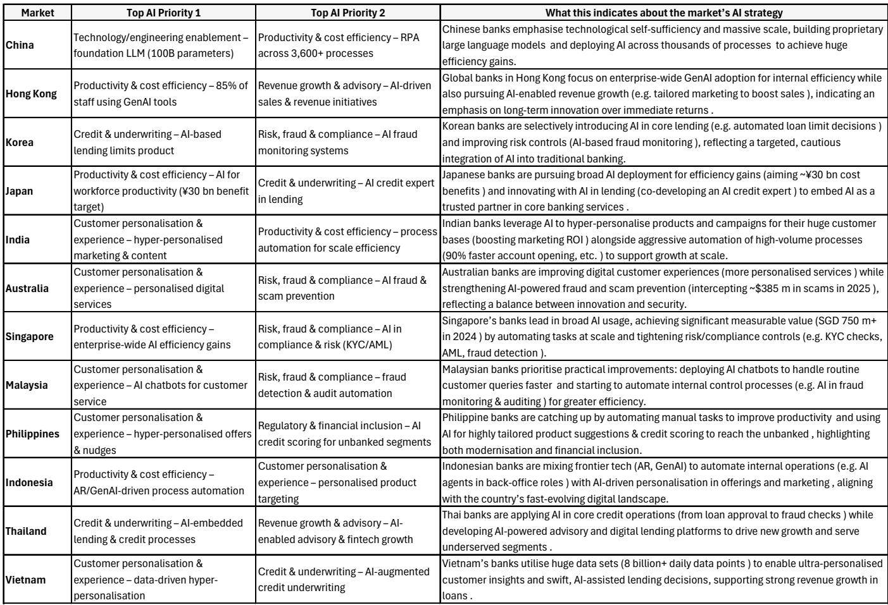
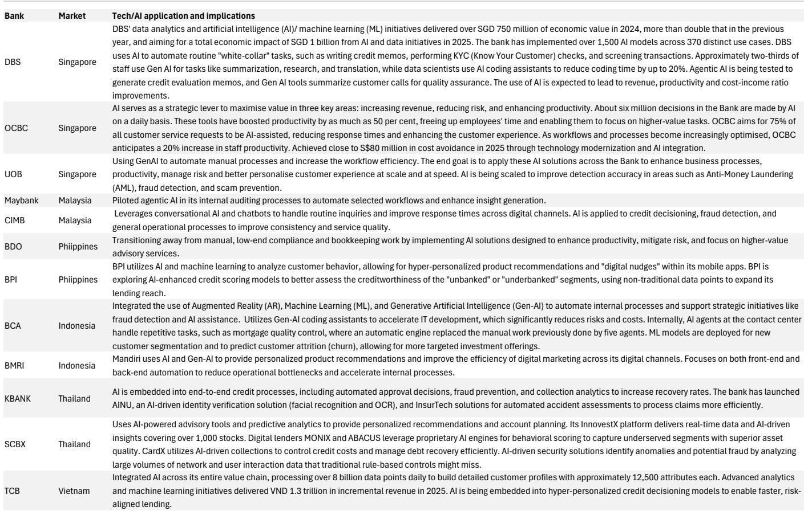
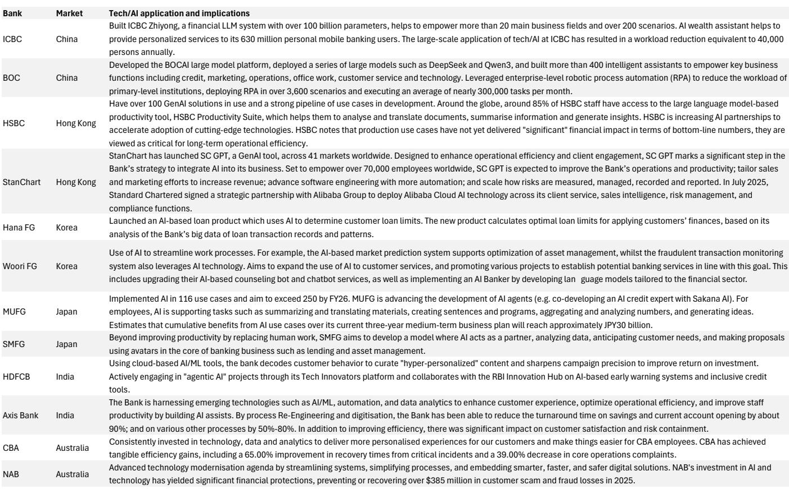

# The AI Premium in Asian Banks Is a Beautiful Coincidence, Not a Prescient Call—But That Could Change

The most AI-ready banking markets in Asia trade at a 35% relative ROE premium over the least ready. This gap widens to 40% when comparing the strongest individual banks in the top markets against the weakest in the bottom tier. At first glance, this looks like a market that has correctly identified which banking systems will benefit most from artificial intelligence. It is not. The premium reflects a "safety trade"—a flight to high-dividend, macro-resilient markets during a period of global uncertainty. The same markets that score well on AI readiness also score well on dividend yield, FX stability, and defensive characteristics. The correlation is real. The causation is not.

This matters because the distinction between coincidence and foresight determines whether the current valuation gap is sustainable. If AI were genuinely driving the premium, then even a macro shift would not erase it. If the premium is merely a byproduct of the safety trade, then a change in investor risk appetite could compress it rapidly. The critical question is whether AI can deliver what two decades of technology investment could not: structural, scalable efficiency gains that fundamentally alter bank cost curves.

The answer is not yet clear, but the framework for evaluating it is now available. A detailed analysis of 13 Asian banking markets across six structural factors reveals which banking systems are genuinely positioned to convert AI investment into efficiency, and which are likely to see their spending absorbed by legacy constraints. The scorecard is a tool for separating signal from noise in a debate that is currently dominated by narrative rather than evidence.

## Two Decades of Cost Discipline Have Only Partially Offset Structural Revenue Erosion

Asian banks have been fighting a slow-motion revenue crisis for twenty years. Net interest income as a share of assets has declined by 45 basis points, driven primarily by demographic pressure—aging populations reduce loan demand and compress net interest margins. Efforts to pivot toward fee income have provided only limited relief. Regulatory constraints, structural market features, and competitive intensity have made it difficult to scale non-interest revenue, resulting in an additional 15-basis-point decline in fee income to assets. Overall, revenue to assets has fallen by approximately 60 basis points across the sector.

In response, banks have leaned heavily on cost discipline. Operating expenses as a share of assets have declined by roughly 40 basis points over the same period. This is a meaningful achievement, but it is not enough. The efficiency gains have only partially offset the revenue erosion. The ratio of costs to revenue has improved, but the absolute level of profitability remains under pressure.

More troubling is the relationship between technology investment and cost outcomes. Higher IT spending has not clearly translated into lower total operating costs. The data shows a flat or even slightly positive correlation between changes in IT costs as a share of assets and changes in total costs as a share of assets across a sample of major Asian banks. This is not a condemnation of technology; it suggests that much of the spending has gone toward maintaining existing systems, complying with regulation, and defending market share rather than generating structural efficiency.

This history matters because it sets a low bar for AI. The technology does not need to be transformative to add value; it only needs to break the pattern of technology spending that fails to reduce operating costs. The question is whether AI is genuinely different from the cloud, digital banking platforms, and robotic process automation that preceded it.

## Six Structural Factors Determine Which Markets Can Convert AI Investment into Efficiency

Not all banking systems are equally positioned to benefit from AI. The analysis identifies six structural factors that determine a market's ability to convert AI investment into measurable efficiency gains.

Tech culture captures the prevalence of digital adoption among consumers and the willingness of bank management to prioritize technology-driven transformation. IT and data infrastructure measures the quality of existing systems and the availability of clean, structured data that AI models require. Efficiency room assesses how much fat remains in the cost base—markets with already lean operations have less to gain. Labour flexibility reflects the ease with which banks can adjust headcount or redeploy staff as automation takes hold. Competitive urgency captures the degree to which market dynamics force banks to invest in efficiency rather than revenue growth. Scale matters because larger banks can spread fixed AI costs across a broader asset base.

On this scorecard, Korea, Singapore, Australia, and Thailand emerge as the best-positioned markets. Korea scores highly on tech culture, competitive urgency, and IT infrastructure. Singapore benefits from world-class digital infrastructure and a concentrated banking system where competitive pressure is intense. Australia combines strong labour flexibility with a tech-savvy consumer base. Thailand has significant efficiency room and a banking system that has already demonstrated willingness to invest in digital transformation.

At the other end of the spectrum, Japan, Taiwan, India (particularly public sector banks), and the Philippines face structural headwinds. Japan's labour market rigidity and low competitive urgency limit the potential for AI-driven cost reduction. Taiwan's banking system is fragmented and has limited scale. India's public sector banks face constraints on both technology investment and workforce flexibility. The Philippines has a low starting point on IT infrastructure and limited efficiency room.

The scorecard is not a prediction of which banks will adopt AI fastest. It is a framework for understanding which markets have the structural conditions necessary for AI to produce measurable efficiency gains rather than being absorbed into existing cost structures.

## The Near-Term Impact of AI Will Be Cost Avoidance, Not Cost Reduction

The most common AI use cases among Asian banks fall into a pattern that should be familiar to anyone who has followed previous technology cycles. Banks are deploying AI for credit underwriting, fraud detection, customer personalization, and robotic process automation. These are valuable applications, but they are siloed. They improve specific processes rather than transforming the overall cost base.

The distinction between cost avoidance and cost reduction is critical. Cost avoidance means preventing costs from rising as fast as they otherwise would. Cost reduction means lowering the absolute level of spending. Most current AI initiatives are structured as cost avoidance. A fraud detection system reduces losses, but it does not reduce headcount in the compliance department. A customer personalization engine improves revenue per customer, but it does not reduce branch operating costs.

This pattern is not necessarily a failure. Cost avoidance has real value, particularly in markets where revenue growth is constrained. But it is not the kind of structural efficiency gain that would justify the valuation premium currently assigned to AI-ready markets. For that, banks need to move from siloed use cases to enterprise-wide transformation that fundamentally changes how work is done.

The medium-term potential is more interesting. If AI can automate not just individual tasks but entire workflows, the impact on cost structures could be significant. Back-office operations, compliance monitoring, and credit processing are all areas where end-to-end automation could reduce headcount requirements meaningfully. But this requires integration across systems, data standardization, and organizational change management—all of which are harder than deploying a single AI model.

## What the Report Does Not Fully Answer: The Timing and Magnitude of AI-Driven Efficiency Gains

The analysis is rigorous on structure but necessarily uncertain on outcomes. It identifies which markets have the conditions for AI success, but it cannot predict when or whether those conditions will translate into measurable efficiency gains.

Several open questions remain. First, what is the typical lag between AI investment and cost reduction? Historical technology cycles suggest that productivity gains often take longer than expected to materialize, and they are frequently accompanied by transition costs that temporarily offset benefits. Second, how much of the potential efficiency gain will be competed away? In markets with high competitive intensity, cost savings may be passed through to customers in the form of lower prices rather than flowing to shareholder returns. Third, will regulatory constraints limit the scope of AI deployment? In markets where labour protection is strong or where regulators require human oversight of automated decisions, the efficiency potential of AI may be capped.

These questions are not weaknesses of the analysis. They are the natural boundaries of any forward-looking framework. The scorecard provides a structured way to assess relative readiness, but it cannot eliminate the fundamental uncertainty about how the technology will evolve and how banks will adapt.

## A Decision Framework for Investors: Separating AI Readiness from Macro Exposure

The current valuation premium for AI-ready markets creates a challenge for investors. Buying the top markets on AI readiness alone means accepting macro exposure to the same economies that have benefited from the safety trade. If risk appetite returns and investors rotate out of defensive markets, the AI premium could compress even if the underlying technology thesis is correct.

A more disciplined approach involves separating the AI readiness scorecard from macro exposure. Investors should ask three questions about any bank or market they are evaluating.

First, is the AI premium justified by structural factors or is it a byproduct of macro flows? The scorecard provides a way to test this. Markets that score highly on AI readiness but also have high dividend yields and defensive characteristics are likely benefiting from both factors. Markets that score highly on AI readiness but lack defensive characteristics are purer AI plays.

Second, does the bank have a credible path from AI investment to cost reduction, or is it pursuing cost avoidance? Banks that are deploying AI in siloed use cases may generate incremental value, but they are unlikely to produce the kind of structural cost improvement that would justify a valuation premium. Banks that are investing in enterprise-wide transformation, data infrastructure, and workflow automation are more likely to deliver material efficiency gains.

Third, what is the competitive dynamic? In concentrated markets where a few large banks dominate, AI-driven efficiency gains are more likely to flow through to profitability. In fragmented markets where competition is intense, cost savings may be competed away. The scorecard captures competitive urgency as a factor, but investors need to assess the specific dynamics of each market.

## The Case for Reading the Full Report

The scorecard and the six-factor framework are only the beginning. The full analysis includes market-by-market assessments of each of the 13 banking systems, identifying which banks within each market are best positioned to benefit from AI. It also includes a detailed examination of the valuation dynamics, showing how the AI premium has evolved over time and how it interacts with the safety trade.

For investors who want to move beyond the narrative and understand which banks are genuinely positioned to benefit from AI, the full report provides the data and the analytical framework. The charts are essential for visualizing the relationships between AI readiness, valuation, and macro exposure.

Join the community to read the full report and review the original charts.

*This article is for learning and discussion only and does not constitute investment advice.*

Personal reading notes and learning share only. Not investment advice.

